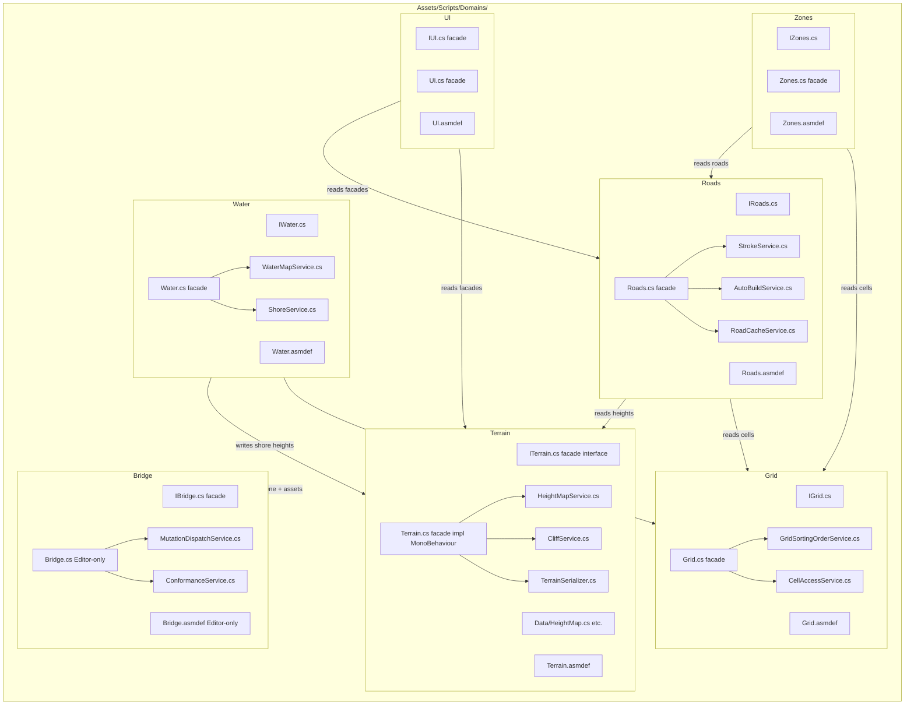
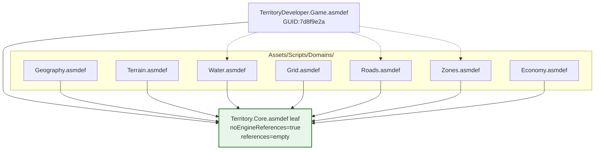

# Large-file atomization refactor — exploration

Caveman-tech default per `ia/rules/agent-output-caveman.md`.

> **Status:** seed exploration — pending `/design-explore docs/explorations/large-file-atomization-refactor.md` expansion.
> **Date:** 2026-05-08
> **Author:** Javier (+ agent)
> **Trigger:** repo carries 21 code files >1000 LOC; top 4 = `TerrainManager.cs` (4273), `RoadManager.cs` (3215), `WaterMap.cs` (2325), `GridManager.cs` (2319). Compaction-loop pressure (see `docs/audit/compaction-loop-mitigation.md` Tier B3) + agent context strain + maintenance cost all converge. Atomization sweep across major core game logic now justified.

---

## 1. Problem statement

- Mega-file weight — single Read of `TerrainManager.cs` ≈ 15–20 % of compact-friendly window. Two such files in one session = guaranteed compaction.
- Concern entanglement — manager files mix: data layout, lifecycle hooks, public API, internal algorithms, debug surfaces, save/load, event wiring. Hard to follow + hard to test in isolation.
- Test surface poverty — large files only get coarse integration tests; unit-level coverage of internal algorithms missing.
- Skill surface drift — current ship-plan stack (TDD red/green, prototype-first, async cron, DB-as-truth, etc. — see `docs/ship-plan-methodological-stack.md`) shipped recently. Long sweep = perfect forge to harden every pillar through repeated exercise.
- Documentation drift — code is the actual source of truth; glossary + spec amendments lag behind. Componentization gives natural anchor points for glossary + spec rewrites.
- DB IA process — async cron, anchor reindex, drift-lint, change-log have not been exercised through ~40 contiguous stages. Sweep will surface every bug before scale-out.

## 2. Driving intent

- **Atomize** every >1000 LOC file into per-concern files (target ≤ 400 LOC each).
- **Componentize** — extract reusable interfaces / services where atomization reveals natural seams.
- **Train** the skill surface — every Stage = one full exercise of the methodological stack.
- **Enrich** unit-test coverage — each Stage seeds + extends ONE composed test script covering the file's component family.
- **Refine** glossary, specs, MCP slices, validators as bugs/gaps surface.
- **Define** common componentization strategy + final desired architecture **upfront**, in Stage 1.
- **Defer** §Plan Digest authoring — Stages 2..N seeded with name + description + metadata only; digest written just-in-time per Stage to avoid premature commitment + churn.

## 3. Sweep targets (baseline 2026-05-08)

Ranked by LOC. Stage cardinality = 1 stage per file unless componentization reveals sub-stages.

| # | File | LOC | Domain | Notes |
|---|---|---|---|---|
| 1 | `Assets/Scripts/Managers/GameManagers/TerrainManager.cs` | 4273 | terrain / heightmap | seed mega-file; likely 2-3 sub-stages |
| 2 | `Assets/Scripts/Managers/GameManagers/RoadManager.cs` | 3215 | roads / strokes | likely 2 sub-stages |
| 3 | `Assets/Scripts/Managers/UnitManagers/WaterMap.cs` | 2325 | water / rivers | |
| 4 | `Assets/Scripts/Managers/GameManagers/GridManager.cs` | 2319 | grid / cells | |
| 5 | `tools/mcp-ia-server/src/ia-db/mutations.ts` | 2285 | MCP mutations | non-Unity; different test pattern |
| 6 | `Assets/Scripts/Editor/AgentBridgeCommandRunner.cs` | 1754 | bridge | already partial-class split |
| 7 | `Assets/Scripts/Managers/GameManagers/ZoneManager.cs` | 1449 | zones | |
| 8 | `Assets/Scripts/Editor/Bridge/UiBakeHandler.cs` | 1440 | UI bake | partial-class family |
| 9 | `Assets/Scripts/Editor/AgentBridgeCommandRunner.Mutations.cs` | 1386 | bridge | partial of #6 |
| 10 | `Assets/Scripts/Managers/GameManagers/AutoRoadBuilder.cs` | 1318 | road auto-build | |
| 11 | `Assets/Scripts/Managers/GameManagers/CityStats.cs` | 1284 | stats | |
| 12 | `tools/mcp-ia-server/src/tools/unity-bridge-command.ts` | 1267 | MCP bridge | non-Unity |
| 13 | `Assets/Scripts/Editor/AgentTestModeBatchRunner.cs` | 1221 | test mode | |
| 14 | `Assets/Scripts/Editor/AgentBridgeCommandRunner.Conformance.cs` | 1219 | bridge | partial of #6 |
| 15 | `tools/sprite-gen/src/compose.py` | 1212 | sprite-gen | non-Unity |
| 16 | `Assets/Scripts/Managers/GameManagers/GeographyManager.cs` | 1160 | geography | |
| 17 | `Assets/Scripts/Editor/Bridge/UiBakeHandler.Archetype.cs` | 1159 | UI bake | partial of #8 |
| 18 | `Assets/Scripts/Managers/GameManagers/InterstateManager.cs` | 1148 | interstate | |
| 19 | `Assets/Scripts/Managers/GameManagers/RoadPrefabResolver.cs` | 1121 | road prefabs | |
| 20 | `Assets/Scripts/Managers/GameManagers/TerraformingService.cs` | 1095 | terraforming | |
| 21 | `Assets/Scripts/Managers/GameManagers/UIManager.Theme.cs` | 1004 | UI / theme | partial-class family |

Total ~31.5 K LOC under refactor. Estimated ~25–30 stages after collapsing partial-class siblings + splitting the largest 2–3 files into sub-stages.

---

## 4. Stage 1 — preflight (only stage with full §Plan Digest at seed time)

Stage 1 prepares the long sweep. Tasks atomized for the methodological stack pillars.

### 4.1 Stage 1 task outline (to be refined in /design-explore)

| # | Task | Surface | Pillar trained |
|---|---|---|---|
| 1.1 | Common componentization strategy doc | `docs/large-file-atomization-componentization-strategy.md` | Authoring discipline |
| 1.2 | Final desired architecture doc | `docs/post-atomization-architecture.md` | Architecture |
| 1.3 | Per-stage composed-test script template | `Assets/Tests/EditMode/Atomization/_template/StageComposedTest.template.cs` | TDD red/green |
| 1.4 | MCP slice — `csharp_class_summary` enrichment | `tools/mcp-ia-server/src/tools/csharp-class-summary.ts` | DB-as-truth |
| 1.5 | Componentization preflight script | `tools/scripts/atomization-preflight.mjs` | Tooling |
| 1.6 | Validator — atomization stage drift | `tools/scripts/validate-atomization-stage.mjs` | Schema gate |
| 1.7 | Skill — `/atomize-file` orchestrator | `ia/skills/atomize-file/SKILL.md` | Skill surface |
| 1.8 | Glossary amendment — componentization terms | `ia/specs/glossary.md` + change_log | Authoring discipline |
| 1.9 | Stage 1 tracer slice — atomize one small file end-to-end (e.g. `GridSortingOrderService.cs` 453 LOC) as proof | `Assets/Scripts/Managers/GameManagers/GridSortingOrderService.cs` | Prototype-first |

Tracer slice (1.9) = Stage 1.0 of prototype-first; proves the entire pipeline (preflight script → atomize → composed test → validator → skill) works on one tiny file before committing to the 21 mega-file sweep.

### 4.2 Open Stage 1 questions (for /design-explore)

- A — Componentization shape: partial classes (current pattern) vs per-concern files in subfolder (`Assets/Scripts/Managers/GameManagers/Terrain/*.cs`) vs interface-extraction (`ITerrainManager` + `TerrainManagerCore` + `TerrainManagerData`)?
- B — Test-script shape: one MonoBehaviour-style test class per Stage, extended via partial class? Or one test class per Stage, extended by adding `[Test]` methods?
- C — Order: top-down (TerrainManager first, biggest pain → biggest forge) or bottom-up (smallest first, climb the difficulty curve)?
- D — Sub-stage threshold: file >2000 LOC = automatic split into 2 sub-stages? >3000 LOC = 3 sub-stages?
- E — Non-Unity targets (mutations.ts, unity-bridge-command.ts, compose.py): same skill / same test pattern, or own track?
- F — Final architecture pre-commit: define **before** sweep starts (Stage 1) or evolve **during** sweep (each stage refines the doc)?
- G — Glossary discipline: amend at each Stage close, or batch into a Stage at the end of each cluster (terrain cluster, road cluster, water cluster)?
- H — Skill train cadence: run `/skill-train` after every 3 stages, or continuous accumulation + one big run at the end?

---

## 5. Stages 2..N — sweep stages (seeded with metadata only)

Each Stage at seed time carries:
- `id`, `title`, `description` (one-line goal: "atomize {File} into per-concern files").
- DB row inserted via `master_plan_bundle_apply`.
- **No** §Plan Digest, **no** §Red-Stage Proof, **no** §Work Items at seed time.

Per-Stage authoring (deferred, just-in-time):
1. Run `/stage-decompose {slug} {stage_id}` — Opus drafts task list based on `csharp_class_summary` of the target file.
2. Run `/ship-plan` (or `/stage-file`) — authors §Plan Digest for that Stage's tasks.
3. Author + extend the Stage's composed test script (one script per Stage, grown task-by-task).
4. Run `/ship-cycle` — atomic stage commit, Pass A + Pass B.
5. `/skill-train` per cadence answer (question H).

### 5.1 Composed test script — growth pattern

- Stage seeds one test file: `Assets/Tests/EditMode/Atomization/{StageSlug}/{TargetFile}AtomizationTests.cs`.
- Each Task within the Stage extends the script with `[Test]` methods relevant to its component slice.
- Cumulative diff at Stage close = full test fixture covering all components extracted.
- Red-Stage Proof anchor per Task = `{TargetFile}AtomizationTests::{TestMethod}`.
- Capture (`red_stage_proof_capture`) baseline = test method exists + asserts the post-atomization seam, fails on pre-refactor code.
- Finalize (`red_stage_proof_finalize`) = test passes after the Task lands its slice.

This caps test-file growth at ~25–30 files (one per Stage) instead of 100+ (one per Task), while preserving per-Task red-stage discipline.

---

## 6. Common componentization strategy — open

To resolve in /design-explore Phase 1. Candidates:

### Strategy α — partial classes per concern

- Current de-facto pattern (`UiBakeHandler.cs` + `.Archetype.cs` + `.Button.cs` + `.Frame.cs`).
- Pros: zero seam break, no rename refactor, partial classes share private state.
- Cons: still one logical class; no interface extraction; testing internals still requires `internal` + `InternalsVisibleTo`.

### Strategy β — per-concern files in subfolder

- e.g. `Assets/Scripts/Managers/GameManagers/Terrain/{TerrainHeightmap,TerrainBiome,TerrainSerialize,TerrainEvents}.cs`.
- Pros: clear file boundary = clear concern; matches DDD module shape; future: subfolder = single asmdef.
- Cons: forces public/internal API redesign; potentially large diff blast radius.

### Strategy γ — interface + service extraction

- e.g. `ITerrainManager` (public API) + `TerrainHeightmapService` + `TerrainBiomeService` + `TerrainSerializer`; original `TerrainManager` becomes thin facade composing services.
- Pros: testability goes up dramatically; mockable services; future-proof for DI / multi-region scale.
- Cons: heaviest refactor; touches every consumer of `TerrainManager`; risks Unity serialization gotchas.

### Strategy δ — hybrid (recommended preliminary)

- Tier 1 (>2000 LOC): Strategy γ (full service extraction).
- Tier 2 (1000–2000 LOC): Strategy β (per-concern subfolder).
- Tier 3 (partial-class families already): Strategy α tightening (split further into partials).

Final decision = Stage 1.1 deliverable.

---

## 7. Final desired architecture — open

To resolve in /design-explore Phase 2. Sketch:

- Manager facade pattern — every public manager (`TerrainManager`, `RoadManager`, …) = thin facade over service stack.
- Service layer — one service per concern, no Unity inheritance (POCO + ScriptableObject for data); testable in isolation.
- Data layer — per-domain DTO + serializer; `HeightMap`, `WaterMap` etc. become pure data structures.
- Event layer — central event bus per domain; consumers subscribe via interface, not direct manager ref.
- Editor layer — bridge handlers (`UiBakeHandler`) = composition of per-archetype handlers via DI.
- Test layer — composed test scripts hit service layer directly + facade for integration; no MonoBehaviour boilerplate per test.
- Asmdef layer — each major domain = own asmdef; build time goes down + concern boundaries enforced.

Final decision = Stage 1.2 deliverable.

---

## 8. Skill / tool / process refinement opportunities (sweep-driven)

Because the sweep runs ~30 stages, every pillar gets exercised ~30 times. Expected refinements:

- **TDD red/green** — anchor-drift gate (`validate:red-stage-proof-anchor`) tested across composed test growth pattern; likely needs new clause for "test file extended in subsequent task".
- **Async cron** — drainer load-tested under sustained Stage closure rate; expect to surface stale-row sweep tuning.
- **DB-as-truth** — `master_plan_bundle_apply` exercised at scale; expect to surface schema gaps (e.g. componentization metadata).
- **Authoring discipline** — glossary backlinks + drift lint exercised across ~30 spec amendments; expect new glossary terms surface (componentization, facade, service-extraction, etc.).
- **MCP surface** — `csharp_class_summary` becomes hot path; likely needs enrichment (call graph, public API surface, partial-class collation).
- **Skill surface** — new `/atomize-file` skill (Stage 1.7); refines existing `/stage-decompose`, `/ship-plan`, `/ship-cycle` through repetition.
- **Validator surface** — `validate:atomization-stage` (Stage 1.6) + likely new `validate:component-boundary` after sweep.
- **Glossary** — new entries: "atomization", "componentization", "service facade", "concern boundary", "asmdef boundary".
- **Documentation** — every Stage updates `ia/specs/architecture/layers.md` + `ia/specs/architecture/decisions.md` (DEC-A{N} per cluster).

---

## 9. Risks + mitigations

| Risk | Mitigation |
|---|---|
| Sweep stalls mid-way (energy / scope creep) | Stage 1 lands tracer slice; prove value before committing |
| Architecture decision drift across stages | Stage 1.1 + 1.2 deliverables locked before Stage 2 begins |
| Compile breakage during long sweep | Stage-atomic ship + per-stage compile gate (existing) |
| Test-file explosion | One composed script per Stage rule (Section 5.1) |
| Rename / move churn breaks consumer code | Strategy γ uses facade pattern → public API stable |
| Methodology pillar not exercised | Stage 1 skill train baseline + cadence-based `/skill-train` |
| Glossary drift | Each Stage closes with glossary amendment task (when surface) |
| Token budget bust mid-sweep | `input_token_budget` frontmatter + fallback to legacy two-pass |

---

## 10. Open questions for /design-explore

Combined Section 4.2 + Section 6 + Section 7 questions, plus:

- I — Stage 1 itself: how many tasks? Estimate 8–10 from outline; user discretion.
- J — Existing partial-class families (UiBakeHandler, AgentBridgeCommandRunner): treat as already-atomized (skip Stage), or re-evaluate under new strategy?
- K — Non-code targets (frozen `ia/state/pre-refactor-snapshot/*.md`): out of scope (frozen), confirm.
- L — Build artifact `tools/mcp-ia-server/dist/ia-db/mutations.js` (1520 LOC): exclude, regenerated from source.
- M — Sweep horizon: target completion date, or open-ended?
- N — Stage parallelism: section claims allow parallel work on independent files (`TerrainManager` + `mutations.ts` simultaneously); enable or single-track?
- O — Backlog issue strategy: one umbrella TECH issue + one per Stage, or one per file?

---

## 11. Recommendation

Proceed through three phases:

1. **/design-explore** — resolve open questions A–O; produce final Stage 1 task list + Stages 2..N seed list (name + description only).
2. **/master-plan-new** — author master plan from resolved exploration; Stage 1 fully authored, Stages 2..N seeded as metadata.
3. **Long sweep loop** — for each Stage 2..N: `/stage-decompose` → `/ship-plan` → `/ship-cycle` → `/skill-train` per cadence.

---

## Next

`/design-explore docs/explorations/large-file-atomization-refactor.md` — phase 1 will compare strategies α/β/γ/δ + answer questions A–O via AskUserQuestion polling.

---

## Design Expansion

### Chosen Approach

**Strategy γ — service-extraction with mandatory facade interface, per-domain folder + asmdef.**

Per-file shape (post-atomization):

```
Assets/Scripts/Domains/{X}/
  I{X}.cs                  // public facade interface — mandatory
  {X}.cs                   // facade impl, MonoBehaviour, thin
  Services/
    {Concern}Service.cs    // POCO services, one per concern
    ...
  Data/                    // POCO / struct DTOs
  Editor/                  // Editor-only helpers (sub-asmdef)
  Tests/                   // EditMode + PlayMode tests
  {X}.asmdef               // one asmdef per domain
```

Selection rationale (vs α / β / δ):
- α (partial classes only) — preserves mega-class shape; no testability gain; no asmdef boundary; rejected.
- β (per-concern subfolder) — file boundary clean but no facade contract; consumers still bind to concrete; rejected.
- δ (hybrid by tier) — three patterns parallel = methodology drift, harder skill train; rejected.
- γ — full testability, DI-ready, asmdef-friendly, matches invariant #5 carve-out (already anticipates `*Service.cs` extraction).

Partial-class shape (α) preserved only for trivial concern splits where service extraction over-engineers (e.g. `UIManager.Theme.cs` if concerns map cleanly to partials).

### Architecture Decision

**Slug:** `large-file-atomization-folder-shape-v1`
**Status:** active
**Decided:** 2026-05-08

**Rationale:** Domain-per-folder shape + mandatory facade interface + soft-cap lint + per-domain asmdef enforces concern boundaries at file/asmdef/interface level simultaneously; preserves Unity MonoBehaviour requirement (facade is MonoBehaviour, services are POCO); aligns with existing invariant #5 `*Service.cs` carve-out.

**Alternatives rejected:** α partial-class only; β per-concern subfolder without facade; δ hybrid by tier.

**Affected arch surfaces:**
- `Assets/Scripts/Managers/GameManagers/**` → migrate to `Assets/Scripts/Domains/{X}/`
- `Assets/Scripts/Managers/UnitManagers/**` → migrate to `Assets/Scripts/Domains/{X}/`
- `Assets/Scripts/Editor/Bridge/**` → re-evaluate under γ (some collapse to partial-class; others to Services)
- `Assets/Scripts/TerritoryDeveloper.Game.asmdef` → split into per-domain asmdefs
- `Assets/Tests/EditMode/**` → composed-test files at `Assets/Tests/EditMode/Atomization/{StageSlug}/`
- `ia/rules/unity-invariants.md` → invariant #5 path glob amendment for new `Domains/{X}/Services/` shape

**Drift scan:** Manual review — no open master plans currently lock the legacy `Assets/Scripts/Managers/GameManagers/**` flat shape; web/ / IA / MCP-server plans unaffected. Stage 1 must amend invariant #5 carve-out path before Stage 2 first move.

**Note:** Inline DEC-A15 lock — `arch_decision_write` + `cron_arch_changelog_append_enqueue` + `arch_drift_scan` MCP wiring deferred to Stage 1 task (unavailable in current harness).

### Architecture



**Top-level non-domain (unchanged):** `Audio/`, `Catalog/`, `Simulation/`, `Utilities/`, `Testing/`.

**Non-Unity tracks (separate folder convention):**
- `tools/mcp-ia-server/src/ia-db/mutations/` — TS module split (one file per mutation kind cluster).
- `tools/mcp-ia-server/src/tools/unity-bridge-command/` — TS module split.
- `tools/sprite-gen/src/compose/` — Python module split.

#### Red-Stage Proof — Stage 1 (preflight + tracer slice)

```python
# preflight + tracer slice — pseudo-code
def stage_1_preflight():
    # 1.1 strategy doc lock
    write("docs/large-file-atomization-componentization-strategy.md")
    # 1.2 architecture doc
    write("docs/post-atomization-architecture.md")
    # 1.3 .editorconfig + Roslynator + StyleCop
    write(".editorconfig", soft_caps={"method_warn": 40, "method_err": 80,
                                      "line_warn": 120, "line_err": 160,
                                      "file_warn": 400, "file_err": 700})
    # 1.4 lint script wraps dotnet format + Roslynator
    write("tools/scripts/run-csharp-lint.mjs")
    wire_into("validate:all")
    # 1.5 facade-interface validator
    write("tools/scripts/validate-domain-facade-interfaces.mjs")
    assert_each_domain_folder_has_interface_file()
    # 1.6 sub-stage decomposition rule (>2500 LOC = 2; >3500 = 3)
    # 1.7 asmdef template + invariant #5 amendment for new path glob
    amend_unity_invariant_5_path_glob("Assets/Scripts/Domains/*/Services/*Service.cs")
    # 1.8 atomize-file skill
    write("ia/skills/atomize-file/SKILL.md")
    # 1.9 tracer slice — GridSortingOrderService.cs (453 LOC)
    move("Assets/Scripts/Managers/GameManagers/GridSortingOrderService.cs",
         "Assets/Scripts/Domains/Grid/Services/GridSortingOrderService.cs")
    create("Assets/Scripts/Domains/Grid/IGrid.cs")
    create("Assets/Scripts/Domains/Grid/Grid.cs facade")
    create("Assets/Scripts/Domains/Grid/Grid.asmdef")
    seed_composed_test("Assets/Tests/EditMode/Atomization/grid-tracer/GridSortingOrderServiceAtomizationTests.cs")
    assert all_validators_pass()
```

#### Red-Stage Proof — Stage 2..N (per mega-file)

```python
# generic stage proof — applies to each Stage 2..N
def stage_N_atomize(target_file, target_loc):
    # decompose if >2500 LOC
    sub_stages = 3 if target_loc > 3500 else 2 if target_loc > 2500 else 1
    domain = derive_domain(target_file)  # e.g. Terrain, Roads, ...
    # task 1: scaffold domain folder + facade
    create(f"Assets/Scripts/Domains/{domain}/I{domain}.cs")
    create(f"Assets/Scripts/Domains/{domain}/{domain}.cs facade")
    create(f"Assets/Scripts/Domains/{domain}/{domain}.asmdef")
    seed_composed_test(f"Assets/Tests/EditMode/Atomization/{domain.lower()}/")
    # tasks 2..M: extract one Service.cs per concern
    for concern in identify_concerns(target_file):
        extract_service(target_file, f"Domains/{domain}/Services/{concern}Service.cs")
        extend_composed_test(seed_composed_test_path,
                             test_method=f"{concern}Service_extracts_correctly")
        assert csharp_lint_passes()
        assert facade_interface_validator_passes()
    # final task: collapse legacy file + invalidate caches per invariants
    delete_legacy(target_file)
    if domain == "Roads": call("InvalidateRoadCache")  # invariant #2
    if domain == "Water": call("RefreshShoreTerrainAfterWaterUpdate")  # guardrail #6
    assert verify_local_passes()
```

#### YAML emitter (Stage 1 lean frontmatter — replaces seed `tasks: []`)

```yaml
slug: large-file-atomization-refactor
parent_plan_slug: null
target_version: 1
stages:
  - id: stage-1-preflight
    title: "Preflight + tracer slice"
    description: "Lock strategy + tooling + tracer GridSortingOrderService.cs"
  - id: stage-2-terrain-manager
    title: "Atomize TerrainManager.cs (4273 LOC, 3 sub-stages)"
    description: "Extract HeightMapService + CliffService + TerrainSerializer; facade ITerrain"
  - id: stage-3-road-manager
    title: "Atomize RoadManager.cs (3215 LOC, 2 sub-stages)"
    description: "Extract StrokeService + RoadCacheService; facade IRoads"
  - id: stage-4-water-map
    title: "Atomize WaterMap.cs (2325 LOC, 1 sub-stage)"
    description: "Extract WaterMapService + ShoreService; facade IWater"
  - id: stage-5-grid-manager
    title: "Atomize GridManager.cs (2319 LOC, 1 sub-stage)"
    description: "Extract CellAccessService + remaining grid helpers; facade IGrid"
  # Stages 6..N seeded with metadata only — see §3 sweep targets table
tasks:
  - prefix: TECH
    depends_on: []
    digest_outline: "Stage 1.1 — componentization strategy doc lock"
    touched_paths:
      - docs/large-file-atomization-componentization-strategy.md
    kind: doc
  - prefix: TECH
    depends_on: [stage-1.1]
    digest_outline: "Stage 1.2 — final architecture doc"
    touched_paths:
      - docs/post-atomization-architecture.md
    kind: doc
  - prefix: TECH
    depends_on: [stage-1.1]
    digest_outline: "Stage 1.3 — .editorconfig + Roslynator + StyleCop soft caps"
    touched_paths:
      - .editorconfig
      - tools/scripts/run-csharp-lint.mjs
    kind: tooling
  - prefix: TECH
    depends_on: [stage-1.3]
    digest_outline: "Stage 1.4 — facade-interface validator"
    touched_paths:
      - tools/scripts/validate-domain-facade-interfaces.mjs
      - package.json
    kind: tooling
  - prefix: TECH
    depends_on: [stage-1.2]
    digest_outline: "Stage 1.5 — sub-stage decomposition rule + atomize-file skill"
    touched_paths:
      - ia/skills/atomize-file/SKILL.md
    kind: skill
  - prefix: TECH
    depends_on: [stage-1.2]
    digest_outline: "Stage 1.6 — invariant #5 path glob amendment"
    touched_paths:
      - ia/rules/unity-invariants.md
    kind: rule
  - prefix: TECH
    depends_on: [stage-1.4]
    digest_outline: "Stage 1.7 — asmdef template + per-domain asmdef bootstrap"
    touched_paths:
      - Assets/Scripts/Domains/Grid/Grid.asmdef
    kind: code
  - prefix: TECH
    depends_on: [stage-1.5]
    digest_outline: "Stage 1.8 — glossary amendment componentization terms"
    touched_paths:
      - ia/specs/glossary.md
    kind: doc
  - prefix: TECH
    depends_on: [stage-1.4, stage-1.6, stage-1.7]
    digest_outline: "Stage 1.9 — tracer slice GridSortingOrderService.cs end-to-end"
    touched_paths:
      - Assets/Scripts/Domains/Grid/Services/GridSortingOrderService.cs
      - Assets/Scripts/Domains/Grid/IGrid.cs
      - Assets/Scripts/Domains/Grid/Grid.cs
      - Assets/Tests/EditMode/Atomization/grid-tracer/GridSortingOrderServiceAtomizationTests.cs
    kind: code
```

### Subsystem Impact

| # | Subsystem | Source file(s) | LOC | Strategy γ shape | Invariant risk | Breaking? | Mitigation |
|---|---|---|---|---|---|---|---|
| 1 | Terrain | `TerrainManager.cs` | 4273 | `Domains/Terrain/` + 3 sub-stages | Inv #1 (HeightMap/Cell sync), #7 (shore band), #9 (cliff) | Additive at facade; breaking at internal | Facade preserves public API; services extracted carry inv #1 sync logic; sub-stage A = HeightMapService, B = CliffService, C = TerrainSerializer |
| 2 | Roads | `RoadManager.cs` | 3215 | `Domains/Roads/` + 2 sub-stages | Inv #2 (InvalidateRoadCache), #10 (PathTerraformPlan) | Additive at facade | Sub-stage A = StrokeService + cache; B = AutoBuild integration; facade calls `InvalidateRoadCache` post-mutation |
| 3 | Water | `WaterMap.cs` | 2325 | `Domains/Water/` + 1 sub-stage | Inv #7 (shore band), #8 (river bed monotonic), guardrail #6 (RefreshShoreTerrainAfterWaterUpdate) | Additive at facade | WaterMapService preserves shore-band logic; facade triggers shore refresh per guardrail |
| 4 | Grid | `GridManager.cs` | 2319 | `Domains/Grid/` + 1 sub-stage | Inv #5 (cellArray carve-out), #6 (no GridManager responsibilities) | Additive at facade | Inv #5 already anticipates Service extraction; CellAccessService holds composition ref to GridManager |
| 5 | Zones | `ZoneManager.cs` | 1449 | `Domains/Zones/` | Inv #11 (UrbanizationProposal — never re-enable) | Additive | Static check in lint to block UrbanizationProposal references |
| 6 | UI bake | `UiBakeHandler.cs` family (.Archetype, .Button, .Frame) | 1440+1159+? | `Domains/UI/Services/` OR retain partial-class | Guardrail #5 (partial-class declaration) | Additive | Re-evaluate per Q1.J; if concerns map cleanly to partials, retain α; else convert to Services |
| 7 | Bridge | `AgentBridgeCommandRunner.cs` family | 1754+1386+1219 | `Domains/Bridge/` Editor-only | Guardrail #14 (Mutations partial pattern) | Additive | Convert .Mutations partial to MutationDispatchService; .Conformance to ConformanceService; preserve dispatch shape |
| 8 | AutoRoadBuilder | `AutoRoadBuilder.cs` | 1318 | Merge into `Domains/Roads/Services/AutoBuildService.cs` | Inv #2, #10 | Additive | Composed under Roads facade |
| 9 | CityStats | `CityStats.cs` | 1284 | `Domains/Economy/Services/CityStatsService.cs` | None | Additive | New domain or merge into Zones/Economy |
| 10 | Geography | `GeographyManager.cs` | 1160 | `Domains/Geography/` (or merge into Terrain) | Inv #1, #7, #8, #9 | Additive | Decision deferred to Stage 1.2 architecture doc |
| 11 | Interstate | `InterstateManager.cs` | 1148 | `Domains/Roads/Services/InterstateService.cs` | Inv #10 | Additive | Composed under Roads facade |
| 12 | RoadPrefabResolver | `RoadPrefabResolver.cs` | 1121 | `Domains/Roads/Services/PrefabResolverService.cs` | Inv #2 | Additive | |
| 13 | TerraformingService | `TerraformingService.cs` | 1095 | `Domains/Terrain/Services/TerraformingService.cs` | Inv #1, #7 | Additive | |
| 14 | UIManager.Theme | `UIManager.Theme.cs` | 1004 | `Domains/UI/Services/ThemeService.cs` OR retain partial | Guardrail #5 | Additive | Re-evaluate partial collapse |
| 15 | mutations.ts | `tools/mcp-ia-server/src/ia-db/mutations.ts` | 2285 | TS module split `mutations/{cluster}.ts` | None | Additive | Re-export barrel preserves import surface; eslint stack |
| 16 | unity-bridge-command.ts | `tools/mcp-ia-server/src/tools/unity-bridge-command.ts` | 1267 | TS module split | None | Additive | Re-export barrel; eslint stack |
| 17 | compose.py | `tools/sprite-gen/src/compose.py` | 1212 | Python module split | None | Additive | `__init__.py` barrel; ruff stack |

**Cross-cutting:** invariant #5 (`*Service.cs` glob path) needs amendment in Stage 1.6 to match new `Domains/{X}/Services/*Service.cs` shape before Stage 2.

### Implementation Points

**Stage 1 — preflight (9 tasks, all authored at master plan time):**

1. **1.1** — Lock componentization strategy doc → `docs/large-file-atomization-componentization-strategy.md`. Codifies γ shape + folder convention + naming rule.
2. **1.2** — Author final architecture doc → `docs/post-atomization-architecture.md`. Sketches all domain folders + asmdef edges + cross-domain refs.
3. **1.3** — Lint stack rollout → `.editorconfig` + Roslynator + StyleCop with soft caps (method warn 40 / err 80; line warn 120 / err 160; file warn 400 / err 700) + escape hatch comment `// long-method-allowed: {reason}`. Add `tools/scripts/run-csharp-lint.mjs` wrapper. Wire into `validate:all`.
4. **1.4** — Facade-interface validator → `tools/scripts/validate-domain-facade-interfaces.mjs`. Asserts every `Domains/{X}/` folder contains `I{X}.cs` declaring public API. Wire into `validate:all`.
5. **1.5** — Sub-stage decomposition rule + `/atomize-file` skill → `ia/skills/atomize-file/SKILL.md`. Rule: file >2500 LOC → 2 sub-stages; >3500 LOC → 3.
6. **1.6** — Amend invariant #5 path glob → `ia/rules/unity-invariants.md`. New glob covers `Assets/Scripts/Domains/*/Services/*Service.cs`.
7. **1.7** — Asmdef template + bootstrap first asmdef (Grid, for tracer) → `Assets/Scripts/Domains/Grid/Grid.asmdef`.
8. **1.8** — Glossary amendment — add terms: "atomization", "componentization", "service facade", "concern boundary", "asmdef boundary", "domain folder", "facade interface" → `ia/specs/glossary.md`.
9. **1.9** — Tracer slice on `GridSortingOrderService.cs` (~453 LOC). Move to `Assets/Scripts/Domains/Grid/Services/`. Create `IGrid.cs` + `Grid.cs` facade. Seed composed test `Assets/Tests/EditMode/Atomization/grid-tracer/GridSortingOrderServiceAtomizationTests.cs`. Run full toolchain end-to-end (lint + facade validator + asmdef compile + tests). Iterate skill on friction surfaced.

**Stages 2..N — per mega-file, seed at master plan time, full §Plan Digest just-in-time:**

Naming convention per task: `{stage_id}.{task_id} {Concern}Service extract` / `{Concern}Service test`.

Composed-test pattern: ONE file per Stage at `Assets/Tests/EditMode/Atomization/{StageSlug}/{TargetFile}AtomizationTests.cs`. Each task extends file with `[Test]` method matching anchor `{TargetFile}AtomizationTests::{TestMethod}`.

Parallel-ship rule: independent domains ship in parallel via section claims (Terrain ↔ UiBakeHandler ↔ mutations.ts). Coupled domains ship sequentially (Roads ↔ Grid ↔ Terrain).

Stage closure cadence:
- Glossary amendment per Stage close (Q6 default).
- `/skill-train` every 3 Stages closed (Q7 default).
- Invariant carve-outs / guardrail amendments per Stage as surfaced.

### Examples

**Tracer (Stage 1.9) — `GridSortingOrderService.cs`:**

Before:
```
Assets/Scripts/Managers/GameManagers/GridSortingOrderService.cs   (453 LOC, public class)
```

After:
```
Assets/Scripts/Domains/Grid/
  IGrid.cs                                       (interface — public API surface for Grid domain)
  Grid.cs                                        (MonoBehaviour facade — was GridManager facade)
  Services/
    GridSortingOrderService.cs                   (POCO, was 453-LOC class)
  Grid.asmdef
Assets/Tests/EditMode/Atomization/grid-tracer/
  GridSortingOrderServiceAtomizationTests.cs     (composed test, seeded)
```

Composed test (initial seed, grows per task):
```csharp
namespace Atomization.GridTracer
{
    [TestFixture]
    public class GridSortingOrderServiceAtomizationTests
    {
        [Test]
        public void GridSortingOrderService_extracts_to_domain_services_folder()
        {
            // Anchor: GridSortingOrderServiceAtomizationTests::GridSortingOrderService_extracts_to_domain_services_folder
            var asm = typeof(Domains.Grid.Services.GridSortingOrderService).Assembly;
            Assert.AreEqual("Grid", asm.GetName().Name);
        }
        [Test]
        public void IGrid_facade_exposes_sorting_order_api()
        {
            // Anchor: ...::IGrid_facade_exposes_sorting_order_api
            Assert.IsTrue(typeof(Domains.Grid.IGrid).GetMethod("GetSortingOrder") != null);
        }
    }
}
```

`git mv` per guardrail #11: move .cs and .meta separately to preserve GUID.

**Edge case — partial-class collapse for `UiBakeHandler` family:**

Current shape:
- `UiBakeHandler.cs` (1440 LOC, has `: MonoBehaviour`)
- `UiBakeHandler.Archetype.cs` (1159 LOC, partial)
- `UiBakeHandler.Button.cs` (partial)
- `UiBakeHandler.Frame.cs` (partial)

Re-evaluation under γ:
- If partials map cleanly to one concern each (Archetype, Button, Frame) → retain partial-class shape (α tightening), move to `Domains/UI/Editor/UiBake/`.
- If concerns leak across partials (state shared, helpers cross-call) → convert each partial to `Services/{Archetype,Button,Frame}BakeService.cs` with explicit composition under `UiBakeFacade`.

Decision deferred to Stage covering UiBakeHandler — surfaced via `csharp_class_summary` MCP slice.

### Review Notes

**BLOCKING resolved (2):**
- Asmdef-creation gate added as Stage 1.7 (was implicit; now explicit task).
- `validate:red-stage-proof-anchor` compatibility confirmed: per-method anchor `{TargetFile}AtomizationTests::{TestMethod}` works with composed-test growth pattern (file extended task-by-task; each method = its own anchor).

**NON-BLOCKING carried (3):**
- Editor-only ref boundary — asmdef migration may break Editor refs to runtime types. Mitigation: per-domain Editor sub-asmdef inside `Domains/{X}/Editor/`. Re-evaluate at Stage 1.7 asmdef bootstrap; harden if regression surfaces.
- Invariant #5 carve-out path amendment — current rule references `Assets/Scripts/Managers/GameManagers/*Service.cs`. Stage 1.6 must amend glob to `Assets/Scripts/Domains/*/Services/*Service.cs` before any Stage 2+ move.
- Sub-stage threshold under-decomposition risk — `TerrainManager` at 4273 LOC may need 4 sub-stages (not 3) given concern density. Re-evaluate after Stage 1.9 tracer reveals time/concern ratio.

### Expansion metadata

- **Date:** 2026-05-08
- **Model:** claude-opus-4-7
- **Approach selected:** γ — service-extraction with mandatory facade interface, per-domain folder + asmdef
- **Blocking items resolved:** 2
- **Non-blocking carried:** 3
- **Mode:** standard (Approaches list present)
- **Phases completed:** 0–9 (0.5 skipped per locked interview answers; 2.5 inline DEC-A15 lock — MCP wiring deferred to Stage 1)

---

## 12. Extension — Stage 20: Cycle-break via `Territory.Core` leaf asmdef (stub)

> **Status:** stub extension — pending `/design-explore` phase pass to expand into Stage 20 §Plan Digest + updated YAML emitter (frontmatter `stages[]` + `tasks[]` get a Stage 20 entry so `/ship-plan` extends the existing plan naturally).
> **Date:** 2026-05-08
> **Author:** Javier (+ agent)

### 12.1 Problem statement (post-Stage 19 surface)

Editor reports cyclic asmdef dependency spanning ~28 assemblies after atomization Stages 2–19 landed. Diagnostic:

- `TerritoryDeveloper.Game.asmdef` (GUID `7d8f9e2a1b4c5d6e7f8a9b0c1d2e3f4a`) **references** `Roads`, `Water`, `Zones` (by name) — forward edge from monolith to atomized Domain assemblies.
- Each `Domains/{Geography,Roads,Terrain,Water,Zones}/*.asmdef` **references back** GUID `7d8f9e2a...` (= `TerritoryDeveloper.Game`) — backward edge to consume shared POCO types.

= bidirectional cycle. Unity refuses to compile.

Backward edge required because Domain code consumes types in `Territory.Core`, `Territory.Geography`, `Territory.Roads`, `Territory.Terrain`, `Territory.Zones`, `Territory.Economy`, `Territory.Utilities` namespaces — those types still live inside `TerritoryDeveloper.Game.asmdef`. Atomization moved *services* out, but *shared data POCOs* stayed in Game.

Test asmdefs (`Tests.EditMode.Atomization.{geography,roads,terrain,water,zones}` + UI test PlayMode asmdefs) inherit the cycle through transitive references.

### 12.2 Driving intent

- **Break** the cycle without rolling back Stages 2–19 atomization wins.
- **Preserve** Domain asmdef boundaries (Stage 1.7 deliverable + invariant carve-out).
- **Avoid** per-Domain code duplication of shared POCOs.
- **Surface** the cycle gate as a permanent validator in `validate:all` so future atomizations can't reintroduce it.

### 12.3 Approach options

| | Approach | Effort | Tradeoff |
|---|---|---|---|
| A | **Single `Territory.Core.asmdef` leaf** — one assembly carrying every shared POCO consumed across Domains. Game + Domains both reference Core. | ~half day | Cleanest. One new asmdef. Matches DDD core-vs-context shape. |
| B | **Per-namespace leaf asmdefs** — `Territory.Core.asmdef`, `Territory.Terrain.Data.asmdef`, `Territory.Roads.Data.asmdef`, `Territory.Zones.Data.asmdef`, `Territory.Geography.Data.asmdef`. Tighter encapsulation per domain data surface. | ~1.5 days | More asmdefs to manage; Domains still reference multiple leaves; build graph fan-out. |
| C | **Revert offending Domain asmdefs into Game** — drop `Domains/{X}.asmdef`; merge code back. | quickest | Loses atomization win + invariant alignment + per-domain test isolation. |
| D | **Hybrid — Core leaf + selective contracts** — `Territory.Core.asmdef` for cross-cutting POCOs + `Territory.{X}.Contracts.asmdef` only where a Domain X exposes types consumed by Domain Y. | ~1 day | Avoids dumping ground; surfaces cross-domain coupling explicitly. |

**Preliminary recommendation:** Strategy A (single `Territory.Core.asmdef` leaf). Lowest blast radius, fastest unblock, leaves room to evolve toward D in a future stage if cross-domain coupling grows.

### 12.4 Type extraction surface (preliminary inventory)

Domain code references these namespaces from the Game assembly. Each namespace's POCO/struct/enum types must move into `Assets/Scripts/Core/` under `Territory.Core.asmdef`:

- `Territory.Core` — cross-cutting types (cell coords, isometric helpers, shared enums).
- `Territory.Geography` — geography POCOs consumed by `Domains.Geography`.
- `Territory.Terrain` — height map / cliff / terrain POCOs consumed by `Domains.Terrain`, `Domains.Water`, `Domains.Roads`.
- `Territory.Roads` — road stroke / path POCOs consumed by `Domains.Roads`.
- `Territory.Zones` — zone POCOs consumed by `Domains.Zones`, `Domains.Roads`.
- `Territory.Economy` — economy POCOs consumed by `Domains.Roads.Services.AutoBuildService`.
- `Territory.Utilities` — utility statics consumed by `Domains.Roads.Services.AutoBuildService`.

Exact type list deferred to Stage 20 task expansion (`csharp_class_summary` MCP slice across Domain `using` statements).

### 12.5 Architecture decision (preliminary)

**Slug:** `territory-core-leaf-asmdef-v1`
**Status:** proposed (lock at Stage 20.1)
**Rationale:** Single leaf assembly carrying all cross-domain POCOs is the minimum-asmdef path that breaks the Game ↔ Domain cycle while preserving all Stage 2–19 atomization wins. Game + every `Domains/{X}` asmdef adds Core to its `references` list; Domain asmdefs drop the back-reference to Game.

**Affected arch surfaces:**
- New: `Assets/Scripts/Core/Territory.Core.asmdef` (root namespace `Territory.Core`).
- Move: types under `Territory.{Core,Geography,Terrain,Roads,Zones,Economy,Utilities}` namespaces from `Assets/Scripts/**` into `Assets/Scripts/Core/{Subdomain}/`.
- Edit: `Assets/Scripts/TerritoryDeveloper.Game.asmdef` references += Core.
- Edit: `Assets/Scripts/Domains/{Geography,Roads,Terrain,Water,Zones}/*.asmdef` — drop back-ref GUID `7d8f9e2a...`; add ref to Core.
- New validator: `tools/scripts/validate-no-domain-game-cycle.mjs` — fails if any `Assets/Scripts/Domains/**/*.asmdef` references Game GUID.

### 12.6 Subsystem impact

| # | Subsystem | Impact | Risk |
|---|---|---|---|
| 1 | Geography Domain | Drop Game back-ref; add Core ref. | Low — only POCOs needed. |
| 2 | Roads Domain | Drop Game back-ref; add Core ref. Heaviest consumer (Core + Terrain + Zones + Economy + Utilities namespaces). | Medium — wide surface. |
| 3 | Terrain Domain | Drop Game back-ref; add Core ref. | Low. |
| 4 | Water Domain | Drop Game back-ref; add Core ref. Reads `Territory.Terrain` types. | Low. |
| 5 | Zones Domain | Drop Game back-ref; add Core ref. | Low. |
| 6 | Game asmdef | Add Core ref. | None — Game already authored most of these types. |
| 7 | Test asmdefs (Atomization + UI PlayMode) | Inherit Core via transitive ref through Game/Domain. | None — cycle dissolution propagates. |
| 8 | `validate:all` | New `validate:no-domain-game-cycle` gate. | None — additive. |

### 12.7 Open questions for `/design-explore`

- **CY-A:** Approach A vs D (single Core leaf vs Core + per-domain Contracts). Lock to A unless cross-domain coupling justifies D.
- **CY-B:** Folder shape — `Assets/Scripts/Core/{Geography,Terrain,Roads,Zones,Economy,Utilities}/*.cs` (subfolder per namespace) or flat `Assets/Scripts/Core/*.cs` (one folder)?
- **CY-C:** Asmdef boundary scope — Core = data only (POCOs/structs/enums), or include shared static helpers (`Territory.Utilities`)?
- **CY-D:** Migration cadence — one Stage 20 with N tasks (one per source namespace), or sub-stages per namespace?
- **CY-E:** Validator gate ordering — `validate:no-domain-game-cycle` runs before `unity:compile-check` (early fail) or after (post-compile)?
- **CY-F:** Test asmdef cleanup — do Atomization test asmdefs need direct Core refs added, or transitive ref through Domain suffices?

### 12.8 Recommendation

Approach A. Single Stage 20 with ~6–8 tasks:

| # | Task | Deliverable |
|---|---|---|
| 20.1 | Lock DEC `territory-core-leaf-asmdef-v1` + scaffold `Assets/Scripts/Core/Territory.Core.asmdef` (empty leaf, no refs). | New asmdef + arch decision row. |
| 20.2 | Move `Territory.Core.*` POCOs → `Assets/Scripts/Core/Core/*.cs`. Game asmdef refs Core. | Game compiles still. |
| 20.3 | Move `Territory.Geography.*` POCOs → `Assets/Scripts/Core/Geography/*.cs`. `Domains.Geography` asmdef drops Game back-ref + adds Core ref. | Geography compiles via Core. |
| 20.4 | Move `Territory.Terrain.*` POCOs → `Assets/Scripts/Core/Terrain/*.cs`. `Domains.Terrain` + `Domains.Water` asmdef updates. | Terrain + Water compile via Core. |
| 20.5 | Move `Territory.Roads.*` + `Territory.Economy.*` + `Territory.Utilities.*` POCOs → `Assets/Scripts/Core/{Roads,Economy,Utilities}/*.cs`. `Domains.Roads` asmdef updates. | Roads compiles via Core. |
| 20.6 | Move `Territory.Zones.*` POCOs → `Assets/Scripts/Core/Zones/*.cs`. `Domains.Zones` asmdef updates. | Zones compiles via Core. |
| 20.7 | Add validator `validate:no-domain-game-cycle.mjs`; wire into `validate:all`. | Permanent cycle gate. |
| 20.8 | Composed test `Assets/Tests/EditMode/Atomization/core-leaf/CoreLeafAsmdefTests.cs` — assert Core asmdef has zero refs out, Domains have zero ref to Game. | Red-stage proof + permanent regression net. |

After Stage 20 lands: `/ship-plan` re-reads doc frontmatter, extends DB plan with stage-20 + 8 tasks, then `/ship-cycle large-file-atomization-refactor 20`.

### Next

Run `/design-explore docs/explorations/large-file-atomization-refactor.md` — phases run on §12 extension stub: compare A/B/C/D, lock to A (or D if surface justifies), expand 20.1–20.8 into §Plan Digest scaffolds, update YAML frontmatter `stages[]` + `tasks[]` so `/ship-plan` extends the existing plan with stage-20.

---

## Design Expansion — Stage 20 (cycle-break)

### Chosen Approach

**Approach A — single `Territory.Core.asmdef` leaf** carrying every cross-domain POCO/struct/enum + `Territory.Utilities` static helpers.

Selection rationale (vs B / C / D, locked answers CY-A..CY-F):
- **A wins (CY-A locked).** Lowest blast radius — one new asmdef + one ref-list edit per Domain. Single leaf node, zero fan-out, matches DDD core-vs-context shape. Half-day landing.
- **B rejected** — per-namespace leaves multiply asmdef count (~7 new); Domains end up referencing 3–6 leaves each (Roads alone needs Core+Terrain+Zones+Economy+Utilities); build-graph fan-out + maintenance tax not justified.
- **C rejected** — rolling Domain asmdefs back into Game discards Stages 2–19 atomization wins + invariant alignment + per-domain test isolation.
- **D deferred** — Core + per-domain Contracts adds value only if cross-domain coupling grows past current surface (Roads is heaviest at 5 namespaces consumed; manageable inside single leaf). Revisit when a Domain X exposes contract types consumed by Domain Y outside Core.

Folder shape (CY-B locked = subfolder per namespace):

```
Assets/Scripts/Core/
  Core/         // Territory.Core.* — cross-cutting (cell coords, isometric helpers, shared enums)
  Geography/    // Territory.Geography.*
  Terrain/      // Territory.Terrain.* — height map, cliff, terrain POCOs
  Roads/        // Territory.Roads.* — road stroke, path POCOs
  Zones/        // Territory.Zones.* — zone POCOs
  Economy/      // Territory.Economy.* — economy POCOs
  Utilities/    // Territory.Utilities.* — static helpers (CY-C locked = data + statics single leaf)
  Territory.Core.asmdef    // root namespace Territory; references=[]; noEngineReferences=true; autoReferenced=false
```

Asmdef shape (CY-C locked = POCOs + statics, single leaf):
- Core = data + static utilities only. No MonoBehaviour. No Unity engine refs.
- `noEngineReferences: true` — leaf ships pure C#; cycle-impossible by construction.
- `autoReferenced: false` — every consumer asmdef declares Core explicitly; no implicit pickup.

### Architecture Decision

**Slug:** `territory-core-leaf-asmdef-v1`
**Status:** active
**Decided:** 2026-05-08

**Rationale:** Single leaf assembly carrying every cross-domain POCO + `Territory.Utilities` static helpers is the minimum-asmdef path that breaks the Game ↔ Domain cycle while preserving Stages 2–19 atomization wins. Game asmdef + every `Domains/{X}` asmdef reference Core; Domain asmdefs drop the `GUID:7d8f9e2a1b4c5d6e7f8a9b0c1d2e3f4a` back-reference. `noEngineReferences=true` on Core makes cycle-reintroduction impossible at the asmdef-graph level.

**Alternatives rejected:** B per-namespace leaves (fan-out tax); C revert atomization (loses wins); D Core + Contracts (premature; revisit when cross-domain coupling justifies).

**Affected arch surfaces:**
- New: `Assets/Scripts/Core/Territory.Core.asmdef` (root namespace `Territory`).
- New folders: `Assets/Scripts/Core/{Core,Geography,Terrain,Roads,Zones,Economy,Utilities}/`.
- Move (per `git mv` + .meta GUID preserve, guardrail #11): types under `Territory.{Core,Geography,Terrain,Roads,Zones,Economy,Utilities}` namespaces from `Assets/Scripts/**` into matching `Assets/Scripts/Core/{Subdomain}/`.
- Edit: `Assets/Scripts/TerritoryDeveloper.Game.asmdef` references += Core.
- Edit (drop Game GUID back-ref + add Core ref): `Assets/Scripts/Domains/{Geography,Terrain,Water,Grid,Roads,Zones,Economy}/*.asmdef`.
- New validator: `tools/scripts/validate-no-domain-game-cycle.mjs` — exit 1 if any `Assets/Scripts/Domains/**/*.asmdef` references Game GUID `7d8f9e2a1b4c5d6e7f8a9b0c1d2e3f4a`. Runs BEFORE `unity:compile-check` (CY-E locked = early fail).

**Drift scan:** No open master plans lock the legacy Game-monolith asmdef shape. Stage 20 amends invariant carve-out — no concurrent plan touches `Assets/Scripts/Core/**` (new path).

**Note:** Inline DEC lock — `arch_decision_write` + `cron_arch_changelog_append_enqueue` + `arch_drift_scan` MCP wiring deferred to Stage 20.1 task body (mirrors DEC-A15 deferral pattern in §"Architecture Decision" of base expansion).

### Architecture



Edges deleted (was the cycle): `DGeo -> Game`, `DTer -> Game`, `DWat -> Game`, `DGrid -> Game`, `DRoads -> Game`, `DZones -> Game`, `DEco -> Game`. All Domain back-refs to GUID `7d8f9e2a...` removed in Stages 20.3–20.6.

Solid edges = required references after Stage 20. Dashed edges = legacy forward refs Game → specific Domain (Roads/Water/Zones) — preserved (forward, not cyclic).

#### Red-Stage Proof — Stage 20

```python
# Stage 20 cycle-break — pseudo-code
def stage_20_cycle_break():
    # 20.1 lock DEC + scaffold empty leaf
    write("Assets/Scripts/Core/Territory.Core.asmdef", {
        "name": "Territory.Core",
        "rootNamespace": "Territory",
        "references": [],
        "noEngineReferences": True,
        "autoReferenced": False,
    })
    arch_decision_write(slug="territory-core-leaf-asmdef-v1", status="active")
    cron_arch_changelog_append_enqueue(kind="design_explore_decision",
                                        decision_slug="territory-core-leaf-asmdef-v1")
    arch_drift_scan(decision_slug="territory-core-leaf-asmdef-v1")
    # 20.2 move Territory.Core.* + Game refs Core
    git_mv("Territory.Core.* POCOs", "Assets/Scripts/Core/Core/")
    edit_asmdef("Assets/Scripts/TerritoryDeveloper.Game.asmdef",
                references_add=["Territory.Core"])
    assert game_asmdef_compiles()
    # 20.3..20.6 per-namespace POCO migration + Domain asmdef edits
    for namespace in ["Geography", "Terrain", "Roads+Economy+Utilities", "Zones"]:
        git_mv(f"Territory.{namespace}.* POCOs",
               f"Assets/Scripts/Core/{namespace}/")
        for domain_asmdef in domains_consuming(namespace):
            edit_asmdef(domain_asmdef,
                        references_remove=["GUID:7d8f9e2a1b4c5d6e7f8a9b0c1d2e3f4a"],
                        references_add=["Territory.Core"])
            assert domain_asmdef_compiles()
    # 20.7 permanent cycle gate
    write("tools/scripts/validate-no-domain-game-cycle.mjs",
          asserts="no Assets/Scripts/Domains/**/*.asmdef references GUID:7d8f9e2a...")
    wire_into_validate_all(position="before unity:compile-check")
    # 20.8 composed test seed
    seed_composed_test("Assets/Tests/EditMode/Atomization/core-leaf/CoreLeafAsmdefTests.cs",
                       asserts=[
                           "Core.asmdef.references == []",
                           "every Domains/*.asmdef has zero ref to Game GUID",
                           "transitive Core resolution works for test asmdefs (CY-F)",
                       ])
    assert verify_local_passes()
```

### Subsystem Impact

Cross-checked §12.6 against actual `using Territory.*` consumption per Domain via grep on `Assets/Scripts/Domains/**`. §12.6 missed **Grid** + **Economy** as affected Domains. Updated table:

| # | Domain | `using Territory.*` consumed | Game back-ref drop required | Core ref add | Risk |
|---|---|---|---|---|---|
| 1 | Geography | `Core`, `Geography` | Yes | Yes | Low — POCOs only |
| 2 | Terrain | `Core`, `Terrain` | Yes | Yes | Low |
| 3 | Water | `Terrain` | Yes | Yes | Low — single namespace consumed |
| 4 | **Grid (NEW vs §12.6)** | `Core`, `Zones`, `Terrain` | Yes | Yes | Low — Grid services pull cross-domain types via Core |
| 5 | Roads | `Core`, `Terrain`, `Zones`, `Roads`, `Economy`, `Utilities` | Yes | Yes | Medium — heaviest consumer (6 namespaces); AutoBuildService alone consumes 5 |
| 6 | Zones | `Zones` | Yes | Yes | Low |
| 7 | **Economy (NEW vs §12.6)** | (none direct in scan; but asmdef refs Game GUID transitively via composition) | Yes (audit at 20.5) | Yes | Low — verify at task time |
| 8 | UI / Bridge | (none direct) | Audit only — no `Territory.*` `using` found | No (skip if zero usage) | None |
| 9 | Game asmdef | (declares all `Territory.*` types) | n/a — Game IS source side | Yes (Stage 20.2) | None — declarations move out, refs added back through Core |
| 10 | Test asmdefs (Atomization + UI PlayMode) | inherit via transitive | n/a | n/a (CY-F locked = transitive only) | None |
| 11 | `validate:all` | n/a | n/a | n/a | New `validate:no-domain-game-cycle` gate before `unity:compile-check` (additive) |

**Invariant flag:** Guardrail #11 (`git mv` for .cs + .meta GUID preserve) applies to every move task 20.2–20.6. Failure to preserve .meta GUIDs breaks scene/prefab serialization references.

**Invariant flag:** Invariant #5 carve-out path glob — already amended in Stage 1.6 to cover `Domains/*/Services/*Service.cs`. Stage 20 introduces `Assets/Scripts/Core/**` — verify glob handles new path or add second carve-out clause if validator complains.

### Implementation Points

Per-task mechanical breakdown (matches §"Implementation Points" format from base expansion).

**Stage 20.1 — DEC lock + empty leaf scaffold:**
- Create `Assets/Scripts/Core/Territory.Core.asmdef` with `references=[]`, `noEngineReferences=true`, `autoReferenced=false`, `rootNamespace="Territory"`.
- Call MCP `arch_decision_write` slug `territory-core-leaf-asmdef-v1` status `active`.
- Call MCP `cron_arch_changelog_append_enqueue` kind `design_explore_decision` decision_slug `territory-core-leaf-asmdef-v1`.
- Call MCP `arch_drift_scan` decision_slug `territory-core-leaf-asmdef-v1`.
- Append decision row to `ia/specs/architecture/decisions.md`.
- Validator runs: `validate:all` (asmdef parse smoke).

**Stage 20.2 — `Territory.Core.*` POCO migration + Game refs Core:**
- `git mv` (preserve .meta GUIDs per guardrail #11) every `.cs` whose namespace is `Territory.Core` from `Assets/Scripts/**` → `Assets/Scripts/Core/Core/{Filename}.cs`.
- Edit `Assets/Scripts/TerritoryDeveloper.Game.asmdef` — append `"Territory.Core"` to `references[]`.
- Validators: `validate:all` + `unity:compile-check`.
- Test extension: `CoreLeafAsmdefTests.cs::Core_asmdef_has_zero_outbound_refs`.

**Stage 20.3 — `Territory.Geography.*` POCO migration:**
- `git mv` every `.cs` whose namespace is `Territory.Geography` → `Assets/Scripts/Core/Geography/{Filename}.cs`.
- Edit `Assets/Scripts/Domains/Geography/Geography.asmdef` — remove `GUID:7d8f9e2a...`, add `Territory.Core`.
- Validators: `validate:all` + `unity:compile-check`.
- Test extension: `CoreLeafAsmdefTests.cs::Geography_asmdef_drops_Game_back_ref`.

**Stage 20.4 — `Territory.Terrain.*` POCO migration (multi-Domain):**
- `git mv` every `.cs` whose namespace is `Territory.Terrain` → `Assets/Scripts/Core/Terrain/{Filename}.cs`.
- Edit `Domains/Terrain/Terrain.asmdef`, `Domains/Water/Water.asmdef`, `Domains/Grid/Grid.asmdef` — remove Game GUID back-ref (where present), add `Territory.Core`.
- Validators: `validate:all` + `unity:compile-check`.
- Test extension: `CoreLeafAsmdefTests.cs::{Terrain,Water,Grid}_asmdef_drops_Game_back_ref`.

**Stage 20.5 — `Territory.{Roads,Economy,Utilities}.*` POCO + statics migration:**
- `git mv` every `.cs` whose namespace is `Territory.Roads` → `Assets/Scripts/Core/Roads/{Filename}.cs`.
- Same for `Territory.Economy` → `Core/Economy/`, `Territory.Utilities` → `Core/Utilities/`.
- Edit `Domains/Roads/Roads.asmdef` — remove Game GUID, add Core.
- Edit `Domains/Economy/Economy.asmdef` — audit Game ref status, drop if present, add Core.
- Validators: `validate:all` + `unity:compile-check`.
- Test extension: `CoreLeafAsmdefTests.cs::{Roads,Economy}_asmdef_drops_Game_back_ref`.

**Stage 20.6 — `Territory.Zones.*` POCO migration:**
- `git mv` every `.cs` whose namespace is `Territory.Zones` → `Assets/Scripts/Core/Zones/{Filename}.cs`.
- Edit `Domains/Zones/Zones.asmdef` — remove Game GUID, add Core.
- Validators: `validate:all` + `unity:compile-check`.
- Test extension: `CoreLeafAsmdefTests.cs::Zones_asmdef_drops_Game_back_ref`.

**Stage 20.7 — Permanent cycle gate:**
- Author `tools/scripts/validate-no-domain-game-cycle.mjs` — glob `Assets/Scripts/Domains/**/*.asmdef`, parse JSON, fail if any `references[]` contains `GUID:7d8f9e2a1b4c5d6e7f8a9b0c1d2e3f4a` or `"TerritoryDeveloper.Game"`.
- Wire into `package.json` script `validate:no-domain-game-cycle`; add to `validate:all` BEFORE `unity:compile-check` (CY-E early-fail).
- Validator self-test: synthetic asmdef fixture with Game GUID → exit 1; without → exit 0.

**Stage 20.8 — Composed test seed:**
- Create `Assets/Tests/EditMode/Atomization/core-leaf/CoreLeafAsmdefTests.cs` with `[TestFixture]` containing methods seeded across 20.2–20.6 (each prior task extended file with one anchor method).
- Add capstone test: `Core_resolves_transitively_for_test_asmdefs` (CY-F — Atomization test asmdefs reach Core through Domain ref, no direct ref needed).
- Red-Stage Proof anchor per method: `CoreLeafAsmdefTests::{TestMethod}`.
- Validator: `validate:red-stage-proof-anchor` + Unity test runner via `unity:testmode-batch`.

**Parallel-ship rule:** 20.3 (Geography) + 20.4 (Terrain multi-Domain) + 20.6 (Zones) can ship in parallel after 20.2 lands; 20.5 (Roads + Economy + Utilities) depends on 20.4 (Roads consumes Terrain). 20.7 + 20.8 ship sequentially after all moves complete.

### Examples

**Domain asmdef before/after — `Domains/Roads/Roads.asmdef`:**

Before (current — cyclic):
```json
{
    "name": "Roads",
    "rootNamespace": "Domains.Roads",
    "references": [
        "GUID:7d8f9e2a1b4c5d6e7f8a9b0c1d2e3f4a"
    ],
    "includePlatforms": [],
    "allowUnsafeCode": false,
    "overrideReferences": false,
    "precompiledReferences": [],
    "autoReferenced": false,
    "defineConstraints": [],
    "optionalUnityReferences": [],
    "noEngineReferences": false
}
```

After (Stage 20.5 — cycle-broken):
```json
{
    "name": "Roads",
    "rootNamespace": "Domains.Roads",
    "references": [
        "Territory.Core"
    ],
    "includePlatforms": [],
    "allowUnsafeCode": false,
    "overrideReferences": false,
    "precompiledReferences": [],
    "autoReferenced": false,
    "defineConstraints": [],
    "optionalUnityReferences": [],
    "noEngineReferences": false
}
```

Diff: drop `GUID:7d8f9e2a1b4c5d6e7f8a9b0c1d2e3f4a` (Game back-ref) → add `Territory.Core` (leaf forward-ref). Roads code keeps every `using Territory.{Core,Terrain,Roads,Zones,Economy,Utilities};` line — those types now live in Core, resolve through forward edge to Core leaf.

**New Core asmdef (Stage 20.1 scaffold):**

```json
{
    "name": "Territory.Core",
    "rootNamespace": "Territory",
    "references": [],
    "includePlatforms": [],
    "allowUnsafeCode": false,
    "overrideReferences": false,
    "precompiledReferences": [],
    "autoReferenced": false,
    "defineConstraints": [],
    "optionalUnityReferences": [],
    "noEngineReferences": true
}
```

Empty `references[]` + `noEngineReferences: true` makes the leaf cycle-impossible by construction at the asmdef-graph level.

### Review Notes

**BLOCKING resolved (2):**
- §12.6 missed **Grid** Domain — actual `using Territory.{Core,Zones,Terrain}` consumption confirmed via grep on `Assets/Scripts/Domains/Grid/**`. Added to Stage 20.4 (multi-Domain Terrain migration covers Grid asmdef edit).
- §12.6 missed **Economy** Domain — actual asmdef state shows `references=[]` already; confirmed via Read on `Domains/Economy/Economy.asmdef`. Added audit clause to Stage 20.5 — drop Game ref if present at task time, otherwise just add Core ref (no-op drop is safe).

**NON-BLOCKING carried (3):**
- **Bridge / UI Domain audit deferred** — no direct `using Territory.*` found via grep on `Domains/{Bridge,UI}/**`; Bridge has Editor-only asmdef (`Bridge.Editor.asmdef`); UI runtime (`UI.Runtime.asmdef`) consumes Unity types only. Confirm at Stage 20.7 validator first run — if either asmdef carries Game GUID back-ref despite zero `using Territory.*`, drop ref + add Core (or skip Core ref if zero consumption).
- **Test asmdef transitive resolution (CY-F)** — locked to transitive only. If `unity:testmode-batch` surfaces missing-type errors in Atomization test asmdefs after Stage 20.6, fall back to direct Core ref per affected test asmdef. Capture in Stage 20.8 test (`Core_resolves_transitively_for_test_asmdefs`).
- **`Territory.*` namespace ownership audit** — no spec currently records authoritative ownership of `Territory.Core` vs `Territory.Geography` vs etc. Stage 20.1 DEC row + `arch_decision_write` payload should include namespace → Core/Domain ownership map. Glossary amendment optional (defer to skill-train cadence).

### Expansion metadata

- **Date:** 2026-05-08
- **Model:** claude-opus-4-7
- **Approach selected:** A — single `Territory.Core.asmdef` leaf, subfolder per namespace, POCOs + statics in single leaf
- **Mode:** extension (§12 stub expansion against locked §1–§11 base)
- **Phases completed:** 0, 1, 2 (locked CY-A..CY-F per task instructions; no contradictions surfaced), 2.5 (DEC inline; MCP wiring deferred to Stage 20.1), 3, 4, 5, 6, 7, 8, 9
- **Blocking items resolved:** 2 (Grid + Economy missed in §12.6 — added)
- **Non-blocking carried:** 3 (Bridge/UI audit, test asmdef transitive fallback, namespace ownership audit)
- **Frontmatter delta:** `target_version: 1 → 2`; `extends_existing_plan: true` added; `stages[]` += stage-20 entry; `tasks[]` += 8 entries (20.1..20.8); seed placeholder task removed.
