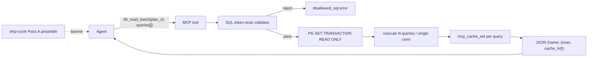

# ship-cycle DB read efficiency — exploration seed

Status: designed (post-`/design-explore`).
Owner: Javier.
Date: 2026-05-06.

## Problem

`/ship-cycle` Pass A inference (and any skill that touches the DB during plan/digest authoring) often emits N sequential `psql` calls instead of one batched query. Observed pattern in a recent run:

1. `psql -c "SELECT pc.order_idx, ce.slug FROM panel_child …"` (0 rows — wrong host typo `loost`)
2. `psql -c "SELECT pc.order_idx, pc.child_kind, COALESCE(ce.slug, '<NULL>') …"` (0 rows)
3. `psql -c "SELECT id, slug, kind FROM catalog_entity WHERE slug LIKE 'hud_bar%' …"` (0 rows)
4. `psql -c "SELECT count(*) AS n_entities …; SELECT count(*) AS n_panel_child …"` (counts)
5. `psql -c "\d panel_detail"` (schema dump)
6. `psql -c "SELECT max(version) FROM schema_migrations; …"` (combined)

Each call = fresh TCP + auth handshake + parse. ~100–200 ms wasted per call. 6 calls → ~1 s of dead wall-clock + N tool roundtrips of agent context burn. Pattern recurs across many ship-cycle sessions.

## Why it happens

- Skill prompt (`ia/skills/ship-cycle/SKILL.md`) has no "batch-before-query" guardrail.
- Agent reasons step-by-step: result of query 1 informs query 2. Default branch = run, read, re-prompt, run again — instead of "list all questions first, batch into one round-trip".
- Raw `psql -c` is the lowest-friction DB tool the agent reaches for, even when an MCP slice (`catalog_panel_get`, `catalog_archetype_get`, `master_plan_state`) returns the same data shaped as JSON.
- No helper for "ad-hoc multi-statement read" — agents don't know heredoc form is allowed.

## Cost surface

| Cost | Per call | Per Pass A run | Per stage of N tasks |
|---|---|---|---|
| TCP + auth handshake | ~80–150 ms | ~6× = 0.5–1 s | scales linearly |
| Tool-call roundtrip (Bash) | ~1 turn ctx | 6 turns | scales linearly |
| Wasted output tokens | psql header + ascii table border per call | ~200 tok × 6 | ~1.2k tok |
| Cache miss risk | low | low | medium (if turns straddle 5-min TTL) |

Multiplied across all skills that hit the DB (ship-plan, ship-cycle, design-explore, plan-review, arch-drift-scan), the friction adds up.

## Candidate approaches (rough — for `/design-explore` to compare + select)

### A. Skill-prompt guardrail only (lightest)

Add §Guardrails entry to `ship-cycle` SKILL.md (and ship-plan / design-explore where applicable):

> Before issuing the first DB read: list every question you need answered. Batch into one `psql` heredoc OR one MCP slice call. Sequential reads only when query N truly depends on result of query N−1.

Pros: zero infra. Lands today.
Cons: relies on agent following prose. Doesn't fix the root tool gap.

### B. New MCP tool — `db_read_batch`

Single MCP call accepting `{queries: [{name, sql}, …]}` returning shaped JSON `{name → rows}`. Read-only (rejects DDL/DML). Makes batching the default low-friction path.

Pros: collapses N round-trips → 1. JSON shape easier to consume than ascii tables.
Cons: yet another MCP tool. Need allowlist guard (read-only).

### C. Pre-fetch bundle MCP — `ship_cycle_context_bundle`

Like `issue_context_bundle`, but for ship-cycle Pass A: returns plan state + stage tasks + per-task spec + relevant catalog entries + glossary + invariants in one shaped payload. Agent doesn't query DB at all; it reads the bundle.

Pros: matches the existing `*_bundle` pattern. Eliminates ad-hoc SQL for the common case.
Cons: bundle scope creep risk. Doesn't help when agent goes off-script (e.g. debugging a missing row).

### D. Banner reminder of MCP slices

Inject a short bullet list of relevant MCP tool names (`catalog_panel_get`, `catalog_archetype_get`, `master_plan_state`, `task_bundle_batch`) into ship-cycle Pass A preamble, so agent reaches for typed slices before raw psql.

Pros: cheap. Reuses existing tools.
Cons: more preamble tokens. Banner blindness over time.

### E. Hook + telemetry

PreToolUse hook on Bash counts consecutive `psql -c` calls within the same turn; emits warning ("3rd consecutive psql call — consider batching"). Pure observability, no enforcement.

Pros: data-driven — reveals true friction frequency.
Cons: adds noise. Doesn't fix the behaviour, just measures it.

### F. Combination — A + B + D

Guardrail prose + new batch tool + banner pointing to it. Belt-and-braces.

## Open questions for `/design-explore`

1. Is the friction primarily in `ship-cycle` Pass A inference, or does it appear equally in `ship-plan` / `design-explore`? Sample 5 recent runs of each, count psql calls.
2. Does `db_read_batch` warrant a new tool, or is one heredoc-shaped helper script (`tools/scripts/db-read-batch.mjs`) cheaper?
3. Should the guardrail be enforced (hook blocks 3rd consecutive psql) or advisory (prose only)?
4. Is there overlap with the `chain-token-cut` exploration's Group D (shared MCP context cache `ia_mcp_context_cache`)? Could the same cache table absorb ad-hoc query results?
5. What's the right red-stage proof? Probably "fixture stage with N tasks runs Pass A, assert ≤2 DB round-trips total" — measurable via journal/telemetry.

## Hard constraints

- No metrics layer added just for this. Reuse `journal_append` + `runtime_state` if telemetry needed.
- No requirements layer. Pure infra + skill-prompt edits.
- Read-only. This exploration touches Pass A read patterns; never mutates DB rows.
- Must survive `validate:all` + `validate:skill-drift` after any SKILL.md edits.

## Next

`/design-explore docs/explorations/ship-cycle-db-read-efficiency.md` → compare A–F, select 1–2, expand into stage layout.

## Design Expansion

### Selected approach

**F-trimmed = A + B + D + cache write-through.** Drop C (pre-fetch bundle, scope-creep) + E (telemetry hook, no measurement per user direction).

Rationale: A (skill prompt) + B (`db_read_batch` MCP tool) + D (banner) attack the friction on three layers — agent prose, low-friction tool path, and discoverability of typed alternatives. Cache write-through reuses already-shipped `ia_mcp_context_cache` (chain-token-cut Stage 1, Task 1.4) so repeated identical queries within a plan run short-circuit.

### Locked decisions (from interview)

| # | Decision | Choice |
|---|---|---|
| 1 | Scope | All DB-touching workflows: ship-cycle, ship-plan, design-explore, plan-review (mechanical + semantic), arch-drift-scan |
| 2 | Batch path | New typed `db_read_batch` MCP tool returning shaped JSON `{name → rows}`; read-only |
| 3 | Enforcement | Prose-only guardrail in skill SKILL.md files (no PreToolUse hook, no telemetry) |
| 4 | Cache reuse | `db_read_batch` writes results through `ia_mcp_context_cache` via `mcp_cache_set`; key = `(plan_id, sha256(sql_normalized))` |
| 5 | Red-stage proof / measurement | NONE — user override: "Don't prove or measure, just implement functionality." Master plan must NOT include red-stage proof phases or measurement scripts (overrides prototype-first-methodology default) |

### Components

- **`db_read_batch` MCP tool (new)** — accept `{plan_id, queries: [{name, sql}]}`; validate read-only; run all queries in single PG connection wrapped in `SET TRANSACTION READ ONLY`; write each result through `mcp_cache_set`; return `{name → {rows, cache_hit}}` JSON.
- **Read-only validator** — two-layer defense: (1) token scan for `INSERT|UPDATE|DELETE|DROP|ALTER|TRUNCATE|GRANT|REVOKE` (case-insensitive, comment-stripped, string-literal-aware) — fast reject; (2) PG `SET TRANSACTION READ ONLY` — load-bearing defense, catches CTE-DML tricks (`WITH x AS (DELETE …) SELECT …`) and any tokens missed by scan.
- **Cache write-through** — derive cache key per query: `(plan_id, sha256(normalize(sql)))` where `normalize` = collapse whitespace + lowercase keywords. Read short-circuit on hash hit via `mcp_cache_get`; refresh on miss.
- **Skill SKILL.md guardrail block** — short §Guardrails entry added to `ship-cycle`, `ship-plan`, `design-explore`, `plan-review-mechanical`, `plan-review-semantic`, `arch-drift-scan` SKILL.md. Text: "Before issuing the first DB read, list every question. Batch into one `db_read_batch` MCP call OR one MCP slice. Sequential reads only when query N depends on result of query N−1."
- **MCP slice banner** — short bullet list of typed alternatives (`catalog_panel_get`, `catalog_archetype_get`, `master_plan_state`, `task_bundle_batch`, `spec_section`) injected into ship-cycle Pass A preamble.

Data flow: agent assembles N read questions → one `db_read_batch` call → tool validates SQL (token scan + read-only txn) → opens single PG connection → executes each query → writes each result through `mcp_cache_set` → returns combined JSON → agent reads.

Interfaces / contracts:
- Input: `{plan_id: string, queries: Array<{name: string, sql: string}>}`.
- Output: `{[name]: {rows: any[], cache_hit: boolean}}`.
- Error modes: `db_read_batch_disallowed_sql` (mutation token detected), `db_read_batch_too_many_queries` (>20 queries / call), `db_read_batch_pg_error` (passes through PG error). Whole batch rejected on first SQL violation — no partial execution.

Non-scope: requirements layer, metrics, replay infra, pre-state diffing, enforcement hook, pre-fetch context bundle.

### Architecture



### Subsystem impact

| Subsystem | Dependency | Invariant risk | Breaking? | Mitigation |
|---|---|---|---|---|
| `tools/mcp-ia-server/src/tools/` | New `db-read-batch.ts` registration in `src/index.ts` | None (read-only tool, additive) | Additive | SQL allowlist + read-only txn integration test |
| `ia_mcp_context_cache` table | Reuse existing schema (chain-token-cut Stage 1) | None | No schema change | Cache key normalization step (sha256 over normalized SQL) |
| `mcp_cache_get` / `mcp_cache_set` MCP tools | Reuse as-is | None | No | N/A |
| `ia/skills/{ship-cycle,ship-plan,design-explore,plan-review-mechanical,plan-review-semantic,arch-drift-scan}/SKILL.md` | Prose addition + skill regen | Risk: `validate:skill-drift` if direct `.claude/agents/*.md` / `.claude/commands/*.md` edited instead of SKILL.md source | Additive | Edit SKILL.md only; run `npm run skill:sync:all`; gate on `validate:all` |
| `validate:all` chain | No new validator added | None | No | N/A |

Invariants flagged: none from `ia/rules/invariants.md` rules 12–13 (no project-spec creation, no id-counter touch). Universal safety: read-only path enforced at tool layer; matches "Read-only" hard constraint from doc.

### Implementation points

**2-stage split** (recommended — combine guardrail + banner in single skill-edit pass):

- **Stage 1 — `db_read_batch` MCP tool + cache write-through.** Single migration-free addition to `tools/mcp-ia-server/src/`:
  - new `tools/db-read-batch.ts`: tool registration, `{plan_id, queries[]}` input schema, SQL token-scan allowlist, single-connection batch executor wrapped in `SET TRANSACTION READ ONLY`.
  - cache integration: short-circuit via `mcp_cache_get` on hash hit; write through `mcp_cache_set` on miss. Key = `(plan_id, sha256(normalize(sql)))`.
  - register in `src/index.ts`.
  - integration test covering: happy path multi-query, mutation token rejection, CTE-DML rejection via read-only txn, >20 queries cap, cache hit short-circuit.

- **Stage 2 — Skill prompt edits across 6 DB-touching skills + slice banner.** Single batch SKILL.md edit pass + `npm run skill:sync:all`:
  - add §Guardrails block to: `ship-cycle`, `ship-plan`, `design-explore`, `plan-review-mechanical`, `plan-review-semantic`, `arch-drift-scan`.
  - inject MCP slice banner into ship-cycle Pass A preamble (`catalog_panel_get`, `catalog_archetype_get`, `master_plan_state`, `task_bundle_batch`, `spec_section`).
  - run `npm run skill:sync:all` to regen `.claude/agents/*.md` + `.claude/commands/*.md`.
  - gate on `validate:all` (includes `validate:skill-drift` + `validate:cache-block-sizing`).

Stage dependency: Stage 2 references `db_read_batch` by name → Stage 1 must land first.

### Deferred / out of scope

- **Red-stage proofs and measurement deferred per user direction (overrides prototype-first-methodology default).** Master plan must NOT include red-stage proof phases or measurement scripts. Flag for plan author.
- PreToolUse enforcement hook (Approach E from doc).
- Pre-fetch context bundle `ship_cycle_context_bundle` (Approach C — scope-creep risk).
- Telemetry / round-trip counting (no metrics layer constraint).
- Sample audit / replay comparison.
- Per-skill enforcement test asserting ≤2 DB round-trips on fixture stage (would require measurement infra).

### Examples

**Input:**
```json
{
  "plan_id": "asset-pipeline",
  "queries": [
    {
      "name": "panel_children",
      "sql": "SELECT pc.order_idx, ce.slug FROM panel_child pc JOIN catalog_entity ce ON pc.child_id = ce.id WHERE pc.panel_id = 'hud_bar'"
    },
    {
      "name": "schema_version",
      "sql": "SELECT max(version) FROM schema_migrations"
    }
  ]
}
```

**Output:**
```json
{
  "panel_children": {
    "rows": [
      { "order_idx": 0, "slug": "growth_panel" },
      { "order_idx": 1, "slug": "build_panel" }
    ],
    "cache_hit": false
  },
  "schema_version": {
    "rows": [{ "max": "0081" }],
    "cache_hit": true
  }
}
```

**Edge case — mutation token rejection:**
```json
{
  "plan_id": "asset-pipeline",
  "queries": [
    { "name": "ok_query", "sql": "SELECT 1" },
    { "name": "bad_query", "sql": "UPDATE schema_migrations SET version = '9999'" }
  ]
}
```
→ whole batch rejected, no partial execution:
```json
{
  "error": "db_read_batch_disallowed_sql",
  "offending_query": "bad_query",
  "token": "UPDATE"
}
```

**Edge case — CTE-DML bypass attempt:**
```sql
WITH x AS (DELETE FROM panel_child RETURNING *) SELECT * FROM x
```
→ token scan catches `DELETE`; if it didn't, PG `SET TRANSACTION READ ONLY` aborts execution with `ERROR: cannot execute DELETE in a read-only transaction` → wrapped as `db_read_batch_pg_error`.

### Review notes

NON-BLOCKING / SUGGESTIONS carried from Phase 8 self-review:

1. **SQL normalization before hash** — implement `normalize(sql)` = collapse whitespace + lowercase keywords BEFORE `sha256`, to avoid cache key collisions where queries differ only in formatting.
2. **2-stage vs 3-stage split** — 2-stage chosen (guardrail + banner combined). If `validate:skill-drift` chokes on banner injection in ship-cycle Pass A preamble, plan author may split Stage 2 into two commits during implementation.
3. **No-red-stage-proof override** — flag in master plan frontmatter / preamble, not in `arch_decisions` table (override is plan-specific, not cross-plan architectural).
4. **`pg_*` function blocklist** — consider adding `pg_terminate_backend`, `pg_cancel_backend`, `pg_advisory_lock*` to a function-name blocklist as belt-and-braces beyond read-only txn. Optional hardening.
5. **20-query cap** — chosen as initial bound to prevent runaway batches. Plan author may revisit if real workloads exceed.

BLOCKING items resolved during review: SQL allowlist coverage gaps (resolved via two-layer defense — token scan + PG read-only txn), CTE-DML bypass (resolved via PG read-only txn).

### Expansion metadata

- **Date:** 2026-05-06
- **Model:** claude-opus-4-7
- **Approach selected:** F-trimmed = A + B + D + cache write-through (drop C + E)
- **Blocking items resolved:** 2 (SQL allowlist gap, CTE-DML bypass)
- **Phases skipped:** 0 / 0.5 / 1 / 2 (completed in main session via human polling); 2.5 silent no-op (zero arch_surfaces hits for additive MCP tool)

