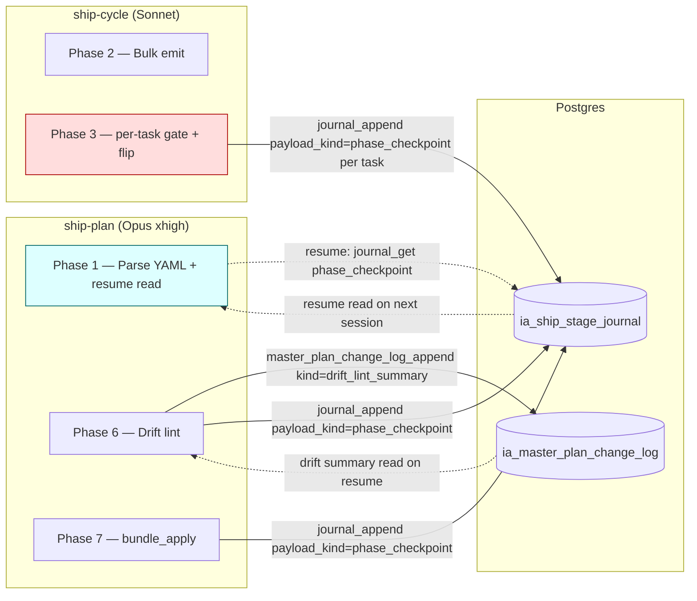

# Context-compaction mitigation — exploration

## Problem statement

Long Opus 4.7 xhigh sessions on complex tasks (master-plan authoring, ship-cycle, stage decompose, design-explore polling loops, multi-iteration verify-loop) hit auto-compaction repeatedly. Compaction takes 1/3 to 1/2 of total wall-clock — a serious tax on iteration speed.

Current trigger threshold: `CLAUDE_AUTOCOMPACT_PCT_OVERRIDE=65` + `autoCompactWindow=200000` (`.claude/settings.json` + `settings.local.json`). Compaction fires at ~65% of 200k = ~130k input tokens. Once it fires, the agent loses fine-grained working memory and rebuilds from a summary — slow + lossy.

Hypothesis: compaction is unavoidable at the platform level, but its frequency + cost are dominated by *avoidable ctx bloat patterns* baked into our skills + lack of a lightweight session-checkpoint mechanism.

## Audit findings (snapshot 2026-05-05)

### A. Top mid-session ctx-bloat sources

1. **`ship-plan` drift lint pulls whole `spec_outline` + unbounded `glossary_discover` synchronously** before bundle dispatch. With 5+ specs in scope, full outlines balloon ctx. (`ia/skills/ship-plan/SKILL.md:192–224`)
2. **`design-explore` polling loop accumulates Q&A inline** without intermediate journal checkpoint. 10+ clarification rounds → all prior prose still in ctx. (`ia/skills/design-explore/SKILL.md:86–109, Phase 2.5`)
3. **`verify-loop` iterations leave compile errors + fix attempts inline.** No per-cycle journal flush. (`ia/skills/verify-loop/SKILL.md:27–43, line 64`)
4. **Subagent-return prose duplicated in main ctx** — caveman style is *advisory*, not enforced. No hard word/token cap on subagent frontmatter.
5. **Whole-file Reads of task spec md, master plan md, large CS files** — invariant says "MCP slice first" but no enforcement gate; agents still default to Read on familiar files.
6. **Tool result residue from `validate:all`, `unity:compile-check`, `findobjectoftype_scan`** — multi-line stdout sticks in ctx until summarized.

### B. Already-built infra (under-used)

The MCP server already has rich journaling tools — they exist but skills only invoke them at *closeout*, not mid-run:

| Tool | DB table | Used mid-run? |
|---|---|---|
| `journal_append` | `ia_ship_stage_journal` | partial (ship-cycle phase 1.0, ship-final close) |
| `project_spec_journal_persist` / `_get` / `_search` / `_update` | `ia_project_spec_journal` (FTS) | only at task close |
| `master_plan_change_log_append` | `ia_master_plan_change_log` | only at stage close + arch lock |
| `arch_changelog_append` | `arch_changelog` | only at design-explore Phase 2.5 |
| `red_stage_proof_capture` / `_finalize` | `ia_red_stage_proofs` | only at red-stage capture |
| `runtime_state` | `ia_runtime_state` (singleton) | session-bookend only |

Compact-slice tools also exist + are mostly used correctly: `task_state`, `stage_state`, `master_plan_state`, `task_bundle`, `stage_bundle`. These return *rollups without body* — already a compaction-friendly shape.

### C. Already-configured discipline surfaces

- Tier 1/Tier 2 prompt cache (`stable-block.md` + per-stage ephemeral; 1h TTL)
- F2 minimum cacheable block floor — Opus 4096 / Sonnet 1024, validated at CI
- Caveman output style + verification-report + closeout-digest (length is *implicit*, not capped)
- Hooks: `session-start-prewarm.sh`, PreToolUse denylist, PostToolUse CS-edit reminders, telemetry hook (advisory)
- Skill-level token budgets: `ship-cycle` (80k input cap), `ship-plan` (180k pre-split threshold). Other skills have no budget.

### D. Gaps

1. **No session-scoped checkpoint MCP** — there is no `session_checkpoint_write/read` that an agent could call every N turns to snapshot "what I learned, where I am, what to recall after compaction". Existing journals are issue-/plan-/stage-scoped, not session-scoped.
2. **No incremental journal fetch** — no `since_turn` / `since_timestamp` / cursor on `ia_ship_stage_journal`. Cannot say "give me only what's new in this session since last fetch".
3. **No per-subagent `response_budget_words` field** in `.claude/agents/*.md` frontmatter — caveman is style, not ceiling.
4. **No PreCompact hook** — Claude Code platform may not expose this trigger yet, but a stub script + settings wiring is cheap to author and ready when it lands.
5. **No mid-session checkpoint protocol** baked into long skills (design-explore polling, verify-loop iterations, ship-plan drift). Skills do not say "every Phase boundary, write journal entry + drop verbose ctx".
6. **No "slice-first" enforcement** — agents still default to Read for known files; rule lives in `agent-principles.md` but no validator catches violations.
7. **`autoCompactWindow=200000`** could be tightened to ~180000 for Opus 4.7 to reserve a 20k safety margin pre-compaction.

## User's intuition — annotation log per master-plan

The user proposed running master-plans alongside an annotation-log doc. Half built already:
- Per-plan annotation log = `master_plan_change_log_append` (table `ia_master_plan_change_log`). Exists. Used only at closeout/lock.
- Per-task annotation log = `project_spec_journal` (decision_log + lessons_learned kinds). Exists. Used only at task close.
- Per-stage annotation log = no dedicated table; `ship_stage_journal` overloads this role.
- Per-session annotation log = **MISSING**.

The user's intuition is correct + the infra is partly built. The missing piece is *mid-run discipline* — agents don't pause every Phase to write a checkpoint and drop the working buffer.

## Proposed approach families (for design-explore comparison)

### Approach 1 — Session-scoped checkpoint MCP + mid-run protocol (deepest)

Add a new MCP tool `session_checkpoint_write` + `session_checkpoint_read` backed by `ia_session_checkpoints` table (PK: `(session_id, checkpoint_kind)`). Agent writes: active plan/stage/task ids, in-progress decisions, pending verifications, "what I'd want to recall after compaction". On session-start, agent reads checkpoint → reconstructs minimal ctx and skips prior accumulated prose.

Bake the protocol into long-running skills: design-explore (after each Phase), verify-loop (after each iteration), ship-plan (after drift lint, after bundle dispatch), ship-cycle (after each task in batch).

Pros: addresses root cause (no checkpoint discipline). Reuses existing journal infra patterns.
Cons: requires migration + new MCP tool + skill body edits across 5+ skills.

### Approach 2 — Tighten existing knobs + enforce subagent budgets (cheapest)

Pure config: **raise** `CLAUDE_AUTOCOMPACT_PCT_OVERRIDE` 65 → 75 (delay trigger from ~130k to ~150k input tokens) — see autoCompactWindow correction annotation below; the original "lower window 200k→180k" was inverted and has been retracted. Investigate whether `CLAUDE_CODE_DISABLE_1M_CONTEXT=0` is viable for Opus 4.7. Add `response_budget_words` field to all `.claude/agents/*.md`. Extend `validate:skill-drift` to enforce. Add output-style length cap validator. Add cache-hit-ratio telemetry alert.

Pros: ships in one PR. No infra change.
Cons: nudges only; doesn't address the bloat sources themselves.

### Approach 3 — Mandatory subagent dispatch for any subtask >5 tool calls (medium)

Add a soft rule to `agent-principles.md` + a post-tool-use hook that warns if main session does >5 sequential tool calls without delegating. Force big reads (full file Reads, large stdout from `validate:all`, Unity compile log) to flow through Explore subagent that returns a compressed summary.

Pros: protects main ctx with no MCP changes.
Cons: hooks can be noisy; agents may ignore advisory warnings.

### Approach 4 — Slice-first enforcement gate (medium)

Add a PreToolUse hook that intercepts `Read` of any file under `ia/projects/*.md`, `ia/specs/**/*.md` and suggests the MCP slice equivalent. Auto-route obvious cases (`ia/projects/{ID}.md` → `task_spec_section`).

Pros: cheap; targets a specific bloat class.
Cons: only covers static-doc reads; doesn't help with stdout/subagent residue.

### Approach 5 — Pre-compaction hook + auto-snapshot (forward-looking)

Author `tools/scripts/claude-hooks/pre-compact-snapshot.sh` ready for platform support. Capture session-id + active task + last journal cursor → `.claude/memory/pre-compact-{ts}.json`. Plugin into `.claude/settings.json` hooks array when Claude Code exposes a `PreCompact` trigger.

Pros: future-proof; no behavior change today.
Cons: blocked on platform feature.

### Approach 6 — Skill-level explicit token budgets + auto-split (rigorous)

Every skill SKILL.md frontmatter declares `input_token_budget` + `pre_split_threshold`. `ship-cycle` and `ship-plan` already do this. Extend to all long skills (design-explore, verify-loop, project-spec-implement, release-rollout). When pre-split threshold breached → skill auto-fragments into sub-passes.

Pros: hard ceiling per skill; predictable.
Cons: requires per-skill threshold tuning; auto-split logic non-trivial for non-batch skills.

## Compose target

Best ship target probably = **Approach 1 + Approach 2 + Approach 4** as one master-plan:
- Stage 1 — tighten knobs + enforce subagent budgets (cheap, ships immediately, validates instrumentation)
- Stage 2 — `session_checkpoint_write/read` MCP + migration
- Stage 3 — slice-first PreToolUse hook
- Stage 4 — bake checkpoint protocol into design-explore + verify-loop + ship-plan + ship-cycle
- Stage 5 — pre-compact hook stub (ready for platform)

Approach 6 (per-skill budgets) folds into Stage 4. Approach 3 (mandatory subagent) covered by Stage 1's hook + budget rules.

## Annotation — fit vs `ship-protocol` master plan (2026-05-05)

User asked whether the highest-value ideas could land as a new stage of the active `ship-protocol` master-plan.

**ship-protocol scope today (verbatim from `master_plan_state` + render):**
- Theme: "Refactor ship pipeline: design-explore → ship-plan → ship-cycle → ship-final. Stage-atomic batch implement, validate:fast band, version-row model, retire middle skills."
- Stages 1.0–4 = done (tracer, ship-plan, ship-cycle, ship-final).
- Stage 5 = "design-explore extensions + retirement migration" — pending, 6 implemented tasks. Hard-removes 8 retired skills, backfills in-flight master plans, lands 3 new validators, adds `--resume` + `--version-bump` to design-explore + ship-plan, self-host dogfood. Zero ctx-compaction work in scope.
- No Stage 6 placeholder. Plan ends at Stage 5 with self-close via `/ship-final ship-protocol`.

**Verdict — ctx-compaction = mostly orthogonal to ship-protocol theme.** Most proposed work touches Claude Code config, MCP infra (new `session_checkpoint` table + tool), hooks, output styles. None of those are pipeline-architecture refactor — ship-protocol's whole identity.

**BUT — a narrow ship-protocol Stage 6 IS feasible if scoped tight.** The proposals that touch ship-pipeline skill bodies fit the plan's theme cleanly:

| Proposal | Touches ship-protocol surface? | Stage-6 fit? |
|---|---|---|
| Bake `journal_append` checkpoint at every Phase boundary in `ship-plan` + `ship-cycle` SKILL bodies | yes | YES — same skills the plan already authored |
| Add explicit `input_token_budget` frontmatter to `design-explore` + `verify-loop` SKILLs (extending the pattern ship-cycle 80k + ship-plan 180k already use) | yes | YES — pattern already lives in plan-authored skills |
| Move ship-plan drift lint output from inline preamble append to `master_plan_change_log_append` row (read on resume) | yes | YES — directly fixes a ship-plan bloat source |
| `session_checkpoint_write/read` MCP + `ia_session_checkpoints` migration | no — generic infra | NO — separate plan |
| `response_budget_words` field + validator on `.claude/agents/*.md` | no — Claude Code surface | NO — separate plan |
| `CLAUDE_AUTOCOMPACT_PCT_OVERRIDE` tune + 1M context investigation | no — settings.json | NO — separate plan |
| Slice-first PreToolUse hook | no — generic harness hook | NO — separate plan |
| PreCompact snapshot hook stub | no — Claude Code platform-dependent | NO — separate plan |

**Recommendation:** Two-plan split.
- **ship-protocol Stage 6 (narrow, ~3 tasks):** "ship-pipeline ctx discipline" — bake journal checkpoints into ship-plan + ship-cycle, add token budgets to design-explore + verify-loop, defer ship-plan drift lint to journal row.
- **New master-plan `ctx-compaction-mitigation` (broader, 4–5 stages):** session-checkpoint MCP, response-budget validator, settings tuning, slice-first hook, pre-compact stub.

Splitting keeps each plan's theme coherent + lets Stage 6 ship before the broader infra plan exists. The broader plan can then *consume* the journal-checkpoint pattern Stage 6 establishes inside ship pipeline skills.

Decision deferred to `/design-explore` Phase 1 grilling.

---

## Annotation — `autoCompactWindow` 200k → 180k correction (2026-05-05)

User caught a likely error in the original audit recommendation. Verified the semantics:

**Configured surface today:**
- `.claude/settings.local.json:97`: `autoCompactWindow: 200000`
- `.claude/settings.json:40`: `CLAUDE_AUTOCOMPACT_PCT_OVERRIDE: "65"`
- `.claude/settings.json:39`: `CLAUDE_CODE_DISABLE_1M_CONTEXT: "1"` (1M context **disabled**)

**Actual trigger math:**
- Compaction fires at `pct_override × autoCompactWindow` = `0.65 × 200_000` = **~130k input tokens**.
- Lower `autoCompactWindow` to 180k → trigger at `0.65 × 180_000` = **~117k input tokens** — fires **EARLIER** in the run, not later.
- Lowering the window therefore produces **MORE** compactions per session, not fewer. The original audit's recommendation #3 ("reduce to 180000 for safety margin pre-compaction") was wrong as stated. The "safety margin" framing only makes sense if the field meant *target post-compaction size*, but the trigger semantics show it acts as the upstream ceiling.

**Correct knobs to reduce compaction *frequency* (what user actually wants):**

1. **Raise `CLAUDE_AUTOCOMPACT_PCT_OVERRIDE` 65 → 75 or 80.** Same 200k window; trigger fires at 150k–160k input instead of 130k. Buys ~20–30k extra headroom per session before first compaction. Risk: smaller buffer for response generation if a single turn needs huge output (e.g. ship-cycle batch emit). Mitigation: keep the lower override on skills that emit large bodies; raise it only on long-running orchestration sessions.

2. **Investigate 1M context for Opus 4.7.** Currently disabled (`CLAUDE_CODE_DISABLE_1M_CONTEXT=1`). 1M ctx historically Sonnet-only — verify whether Opus 4.7 supports it. If yes → enabling jumps available window 200k → 1M, slashing compaction frequency by ~5×. If no → flag stays meaningless for this model.

3. **Slow input growth — the actual fix.** The session-checkpoint protocol + slice-first enforcement + subagent delegation reduce *how fast* the agent reaches the trigger threshold. This is the real win; settings tuning only delays the inevitable.

**Action — replace original Approach 2 step:**
- ~~Lower `autoCompactWindow` 200k → 180k~~ ❌ counterproductive
- ✅ Raise `CLAUDE_AUTOCOMPACT_PCT_OVERRIDE` 65 → 75 (defer 80 until measured)
- ✅ Audit `CLAUDE_CODE_DISABLE_1M_CONTEXT` — confirm Opus 4.7 1M support (read Anthropic API docs / `claude-api` skill); if supported, flip to `0` and re-evaluate

**Open question for design-explore Phase 0.5:** is there telemetry on current compaction-fire token marks? `tools/scripts/agent-telemetry/session-hook.sh` may already log input-token-at-fire. If yes, can pick the right pct override empirically (set just above the typical pre-compaction high-water mark).

---

## Design Expansion — ship-protocol Stage 6

### Chosen Approach

Bundle three sub-approaches as one ship-protocol Stage 6 ("ship-pipeline ctx discipline"):

- **S6.A** — Bake `journal_append` checkpoint at heavy phase boundaries in `ship-plan` + `ship-cycle` skill bodies.
- **S6.B** — Add `input_token_budget` (and optional `pre_split_threshold`) frontmatter to long-running skills: `design-explore`, `verify-loop`, retroactive parity on `ship-cycle` + `ship-plan`.
- **S6.C** — Move `ship-plan` drift-lint output from inline preamble to `master_plan_change_log_append` row (kind=`drift_lint_summary`).

Out of scope for this stage (deferred to separate `ctx-compaction-mitigation` master plan): harness knob changes (`CLAUDE_AUTOCOMPACT_PCT_OVERRIDE`, 1M-context audit), `session_checkpoint` MCP + table, `response_budget_words` validator, slice-first PreToolUse hook, PreCompact snapshot hook stub, subagent dispatch policy.

### Compare matrix

| Sub-approach | Constraint fit | Effort | Output control | Maintainability | Dependencies/risk |
|---|---|---|---|---|---|
| S6.A journal_append checkpoint | High — attacks bloat sources #1+#2; reuses `journal_append` (no migration; `payload_kind text NOT NULL` no-CHECK) | Low — 4–6 callsites in 2 SKILL bodies + 1 schema doc row | Strong — `payload_kind=phase_checkpoint` JSONB schema in `ia/rules/ship-stage-journal-schema.md` | High — follows `version_close` / `closeout_step.*` pattern | Low — additive; resume reader read-only |
| S6.B `input_token_budget` frontmatter | Medium — codifies prose "80k cap" / "180k threshold" already in skill bodies; widens to `design-explore` + `verify-loop` | Low — 4 frontmatter blocks + validator extension | Medium — frontmatter is data; enforcement opt-in until validator wired | High — single source of truth | Low — depends on `npm run skill:sync:all` regen |
| S6.C drift-lint → change_log row | High — directly fixes ship-plan bloat source from audit | Medium — 1 SKILL body Phase 6 rewrite + new `kind` value + resume reader | Strong — change-log row structured (anchor failures, glossary warnings, retired replacements) | High — drift becomes queryable history per plan | Medium — touches ship-plan critical path |

### Architecture



Entry: `ship-plan` Phase 1 (resume read). Exit: `ship-cycle` Phase 3 last per-task checkpoint. Drift-lint reroute: SP6 → CHG (write), Phase 1 resume → CHG (read).

### Red-Stage Proof — Stage 6

```python
# Phase checkpoint write + resume read

def ship_cycle_phase_3_per_task(task_id, slug, stage_id, session_id):
    compile_check(task_id)
    task_status_flip(task_id, "implemented")
    journal_append(
        session_id=session_id,
        task_id=task_id,
        slug=slug,
        stage_id=stage_id,
        phase="ship-cycle.3.per_task",
        payload_kind="phase_checkpoint",
        payload={
            "phase_id": f"ship-cycle.3.{task_id}",
            "decisions_resolved": [task_id + ":implemented",
                                   task_id + ":compile_check_pass"],
            "pending_decisions": [],
            "next_phase": "ship-cycle.3.next" if more_tasks else "ship-cycle.4.handoff",
            "ctx_drop_hint": ["task_spec_body:" + task_id, "compile_log:" + task_id],
        },
    )

def ship_plan_phase_1_resume(slug, target_version, parent_plan_id):
    if target_version <= 1 or parent_plan_id is None:
        return set()  # New plan — no resume read
    rows = journal_get(slug=slug, payload_kind="phase_checkpoint")
    return {r.payload["phase_id"] for r in rows}  # caller skips matching phases

def ship_plan_phase_6_drift_lint(slug, version, drift_findings):
    row_id = master_plan_change_log_append(
        slug=slug, version=version,
        kind="drift_lint_summary",
        payload=drift_findings,  # anchor_failures, glossary_warnings, ...
    )
    return f"drift_lint_summary_id={row_id}"  # 1-line ref handed to Phase 7
```

### Subsystem Impact

MCP recipe: `router_for_task` returned no match for "ship pipeline journal" (expected — pipeline IA, not domain). `glossary_discover` confirmed "Phase" is **retired** as a glossary term — but `phase` column on `ia_ship_stage_journal` remains as schema (named years ago; convention preserved). `invariants_summary` skipped — pipeline/IA only, zero runtime C# touched.

| Subsystem | Dep nature | Invariant risk | Breaking? | Mitigation |
|---|---|---|---|---|
| `ia_ship_stage_journal` | New `payload_kind="phase_checkpoint"` + JSONB schema | none — column has no CHECK | additive | document in `ia/rules/ship-stage-journal-schema.md` BEFORE first write |
| `ia_master_plan_change_log` | New `kind="drift_lint_summary"` | none — extensible | additive | document alongside `phase_checkpoint` |
| `ship-plan` SKILL | Phase 6 rewrite (drift→change_log) + Phase 1 resume reader | preserves `Do NOT skip drift lint` boundary | additive (Phase 6 emit shape changes) | keep 1-line summary for author-prompt back-compat |
| `ship-cycle` SKILL | Phase 3 per-task `journal_append` upgrade | none | additive | upgrade existing `journal_append({status: "implemented"})` to merge into `payload_kind=phase_checkpoint` |
| `design-explore` SKILL | New frontmatter `input_token_budget` | none | additive | validator opt-in |
| `verify-loop` SKILL | Same | none | additive | same |
| `ia/rules/ship-stage-journal-schema.md` | New section per kind | none | additive (creates file if missing — see Review Note 1) |
| Subagent regen | `npm run skill:sync:all` regen `.claude/{agents,commands}/*.md` | none | additive | run after frontmatter add |

Invariants from `ia/rules/invariants.md` flagged: **none** (12–13 unaffected).

### Implementation Points

Ordered by dependency:

1. **(a) Schema docs.** Author / extend `ia/rules/ship-stage-journal-schema.md` — define `phase_checkpoint` payload shape + `drift_lint_summary` change-log kind shape. NO migration (columns already extensible). If file missing, create from scratch (see Review Note 1).
2. **(b) S6.A callsite bakes.**
   - `ship-cycle` SKILL Phase 3 — upgrade existing per-task `journal_append` to `payload_kind="phase_checkpoint"` (merge `status` into payload). One row per task.
   - `ship-plan` SKILL Phase 6 — `journal_append payload_kind=phase_checkpoint` after drift-lint resolution per task.
   - `ship-plan` SKILL Phase 7 — same after `master_plan_bundle_apply` returns.
3. **(c) Resume reader.** `ship-plan` SKILL Phase 1 hook — `journal_get(slug, payload_kind="phase_checkpoint")` → derive `resolved_phases` set → skip those phases in current pass. Gate on `target_version > 1 AND parent_plan_id is not null` (Suggestion 2 — new plans skip the read).
4. **(d) S6.B frontmatter + budget metric.**
   - Add `input_token_budget` + `pre_split_threshold` to `design-explore`, `verify-loop`, `ship-cycle`, `ship-plan` SKILL.md frontmatter. Drop `budget_metric_source` for v1 (Review Note 2 — over-engineered).
   - Extend `tools/scripts/validate-skill-drift.mjs` to enforce `input_token_budget` presence on `caller_agent`-bearing skills.
   - Run `npm run skill:sync:all` to regen subagent + slash-command files.
5. **(e) S6.C drift-lint relocation.**
   - `ship-plan` SKILL Phase 6 — replace inline preamble with `master_plan_change_log_append({slug, version, kind: "drift_lint_summary", payload: ...})`.
   - **Write order:** call MUST happen AFTER `master_plan_bundle_apply` succeeds at Phase 7 (Review Note 5 — version row may not exist before bundle). Reorder: Phase 6 collects drift findings into in-memory buffer; Phase 7 dispatches `bundle_apply`; immediately after success, dispatch `change_log_append`. Author prompt at Phase 7 receives `drift_lint_summary_id={row_id}` only on resume, not first run.
   - Phase 1 resume hook (when `parent_plan_id` non-null): `master_plan_change_log_query(slug, kind="drift_lint_summary")` to skip already-corrected drift.

**Deferred / out of scope** (proposed for separate `ctx-compaction-mitigation` master plan): harness knob changes, subagent dispatch policy, 1M context investigation, `session_checkpoint` MCP + table, `response_budget_words` validator, slice-first PreToolUse hook, PreCompact snapshot hook stub, Verification block stdout → journal row.

### Examples

**Example 1 — `phase_checkpoint` payload (input → DB row)**

ship-cycle Phase 3 finishes task `TECH-12345` in `Stage 2` of `ship-protocol`, session `sess-abc`:

```json
{
  "session_id": "sess-abc",
  "task_id": "TECH-12345",
  "slug": "ship-protocol",
  "stage_id": "2",
  "phase": "ship-cycle.3.per_task",
  "payload_kind": "phase_checkpoint",
  "payload": {
    "phase_id": "ship-cycle.3.TECH-12345",
    "decisions_resolved": ["TECH-12345:implemented", "TECH-12345:compile_check_pass"],
    "pending_decisions": [],
    "next_phase": "ship-cycle.3.TECH-12346",
    "ctx_drop_hint": ["task_spec_body:TECH-12345", "compile_log:TECH-12345"]
  },
  "recorded_at": "2026-05-05T14:30:00Z"
}
```

Edge case: token budget exceeded mid-task → checkpoint NOT written, `STOPPED — token_budget_exceeded` halt. Resume reader sees no checkpoint for that task → re-emits.

**Example 2 — Resume reader SQL**

Second session resumes `ship-cycle ship-protocol Stage 2` after compaction killed first session at task 3 of 5:

```sql
SELECT payload->>'phase_id' AS phase_id,
       payload->'decisions_resolved' AS resolved
FROM ia_ship_stage_journal
WHERE slug = 'ship-protocol'
  AND stage_id = '2'
  AND payload_kind = 'phase_checkpoint'
ORDER BY recorded_at;
```

Result:
```
phase_id                | resolved
------------------------+--------------------------------
ship-cycle.3.TECH-12345 | ["TECH-12345:implemented", ...]
ship-cycle.3.TECH-12346 | ["TECH-12346:implemented", ...]
```

Resume agent skips TECH-12345 + TECH-12346, restarts at TECH-12347.

Edge case: cross-session phase_id collision → `recorded_at DESC LIMIT 1` per phase_id. Caller clears journal at `version_close` (lifecycle ownership — Review Note 4).

**Example 3 — `drift_lint_summary` change-log row before/after**

Before (today, ~150 lines inline preamble in ship-plan Phase 7 prompt — ctx bloat):

```
anchor_unresolved: tracer-test:Assets/Scripts/X.cs::DoFoo
glossary_warning: "wet-run" should be "wet run"
retired_replacement: §Mechanical Steps → §Work Items (×4)
... (~140 more lines)
```

After (row + 1-line ref):

```json
{
  "slug": "ship-protocol",
  "version": 6,
  "kind": "drift_lint_summary",
  "payload": {
    "anchor_failures": [{"task_key": "TECH-12345", "ref": "tracer-test:Assets/Scripts/X.cs::DoFoo", "retried": 1, "resolved": true}],
    "glossary_warnings": [{"task_key": "TECH-12345", "term": "wet-run", "canonical": "wet run", "replaced": true}],
    "retired_replacements": [{"task_key": "TECH-12346", "from": "§Mechanical Steps", "to": "§Work Items", "count": 4}],
    "n_retried": 1,
    "n_resolved": 152,
    "n_unresolved": 0
  }
}
```

Phase 7 author prompt now contains: `drift_lint_summary_id=4892 (152 resolved, 0 unresolved)`.

Edge case: `n_unresolved > 0` → ship-plan halts at Phase 6 with `STOPPED — anchor_unresolved` referencing the row id.

### Review Notes

NON-BLOCKING (carried into implementation):

1. `ia/rules/ship-stage-journal-schema.md` referenced as if extant; grep shows it lives only as a *proposed* artifact in `docs/master-plan-foldering-refactor-design.md`. Implementation point (a) must include "create file if missing".
2. `budget_metric_source` frontmatter field over-engineered for v1 — drop. Document metric source in skill body suffices.
3. ship-cycle Phase 3 already calls `journal_append({task_id, phase: "ship-cycle-pass-a", status: "implemented"})`. Phase checkpoint write should EXTEND, not duplicate — upgrade existing call's `payload_kind` to `phase_checkpoint` and merge `status` into payload schema (avoids 2× row volume per task).
4. Resume reader query (Example 2) doesn't filter by session — across-session resume means earlier session's checkpoints persist. That's correct for resume, but caller MUST clear after `version_close`. Document expected lifecycle in journal-schema doc.
5. drift_lint_summary `version` field — `master_plan_change_log_append` may require plan version row to exist before write. Reorder: Phase 6 collects drift findings into in-memory buffer; Phase 7 dispatches `bundle_apply` first; THEN dispatches `change_log_append`. Phase 1 resume reader on `parent_plan_id` non-null sees prior drift summary row.

SUGGESTIONS (deferred):

- Add `payload_kind = "phase_checkpoint_skip"` for read-only phases that just want to acknowledge "passed through, nothing to checkpoint". Lets resume reader trace path without forcing decision capture.
- ship-plan Phase 1 resume hook gate: only read journal when `target_version > 1 AND parent_plan_id is not null` (already incorporated into implementation point (c)).

BLOCKING: none.

### Expansion metadata

- Date: 2026-05-05
- Model: claude-opus-4-7
- Approach selected: bundled S6.A + S6.B + S6.C as ship-protocol Stage 6 ("ship-pipeline ctx discipline")
- Blocking items resolved: 0

---

## Out of scope for this exploration

- Switching primary model away from Opus 4.7 (user's stated preference)
- Disabling auto-compaction entirely (platform-level)
- Multi-session orchestration patterns (separate concern — see release-rollout skill)

## Open questions for design-explore phase 0.5 / 1

1. Is `ia_session_checkpoints` keyed by `(session_id, checkpoint_kind)` or `(session_id, plan_slug, stage_id, task_id)`? Affects schema + query shape.
2. Should checkpoint write be *automatic* (skill body inserts at every Phase boundary) or *agent-discretionary* (agent decides when ctx feels heavy)? Automatic is more reliable; discretionary is more flexible.
3. Hard cap subagent return prose at N words via validator — what N? 200? 400? Per-agent override?
4. Slice-first PreToolUse hook — block-and-redirect, or warn-and-allow? Block is stronger but may surprise.
5. Tighten `autoCompactWindow` to 180k or 170k or keep 200k? Depends on how often compaction fires near 200k vs much earlier.
6. Should we extract Verification block stdout into a journal row instead of inline? (Output style change.)

## Next step

Run `/design-explore docs/explorations/context-compaction-mitigation.md` to expand into a defined design + master-plan seed.
