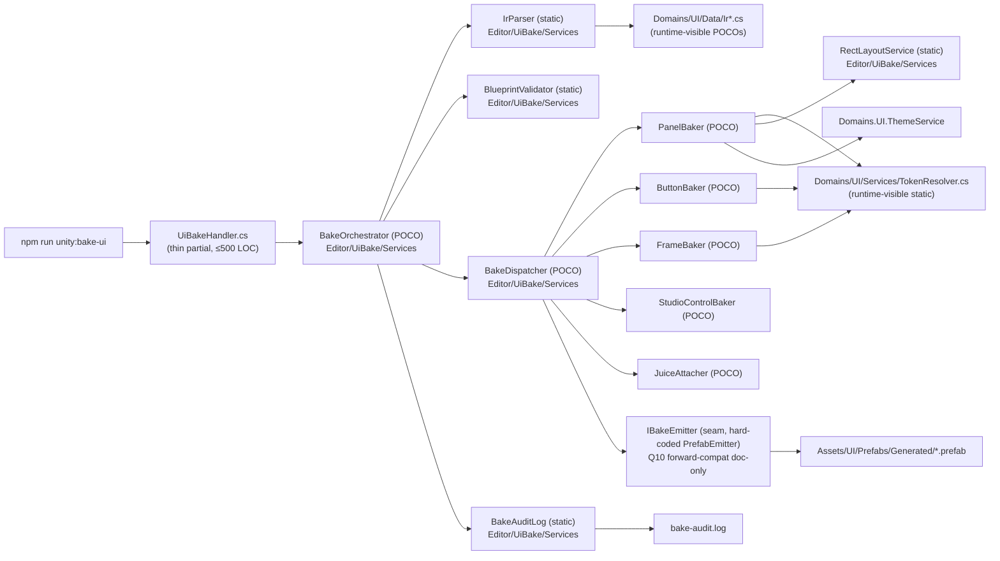

# UI bake handler atomization (exploration seed)

## §Grilling protocol (read first)

When `/design-explore` runs on this doc, every clarification poll MUST use the **`AskUserQuestion`** format and MUST use **simple product language** — no class names, no namespaces, no paths, no asmdef terms, no stage numbers in the question wording. Translate every technical question into player/designer terms ("the UI bake step", "the panel builder", "the button styler"). The body of this exploration doc + the resulting design doc stay in **technical caveman-tech voice** (class names, paths, glossary slugs welcome) — only the user-facing poll questions get translated.

Example translation:
- ❌ tech voice: "Should `UiBakeHandler.Archetype.cs` extract `PanelArchetypeService` as a static helper or a POCO with constructor injection?"
- ✓ product voice: "When we split the UI bake step into smaller pieces, should each piece be a quick helper (simpler) or a proper service with explicit dependencies (cleaner, testable)?"

Persist until every Q1..QN is resolved.

## §Goal

Break up the `UiBakeHandler` partial-class family (4 files, 7730 LOC) into per-concern services under `Domains/UI/` so the hub (`UiBakeHandler.cs`) becomes a thin orchestrator. End state: **zero `UiBakeHandler*.cs` file >500 LOC**, every archetype bake routine owned by a single-purpose service, all existing bake outputs byte-identical (prefabs in `Assets/UI/Prefabs/Generated/` unchanged).

Origin: proposal #6 in `docs/explorations/ui-as-code-state-of-the-art-2026-05.md` §4.6.

## §Current state

```
Assets/Scripts/Editor/Bridge/
  UiBakeHandler.cs           3585 LOC — IR DTOs + parse + token resolve + blueprint validate + bake orchestrator + theme propagate + audit
  UiBakeHandler.Archetype.cs 2545 LOC — panel archetype bake (`BakeInteractive` + 30+ private helpers)
  UiBakeHandler.Frame.cs     1049 LOC — frame / decoration bake
  UiBakeHandler.Button.cs     551 LOC — button bake (palette ramp + atlas slot + motion)
  ────────────────────────  7730 LOC total
```

All four are `partial class UiBakeHandler` under `Bacayo.Editor.Bridge`. Every method is `static`. Invoked Editor-side from `npm run unity:bake-ui` batchmode entry point. Consumes `Assets/UI/Snapshots/panels.json` + `IR/*.json` → writes prefabs to `Assets/UI/Prefabs/Generated/` + `UiTheme.asset`.

## §Concern inventory (to challenge in design-explore)

Candidate split lines, by concern:

| Concern | LOC est. | Source files | Notes |
|---|---|---|---|
| IR DTO definitions | ~250 | `UiBakeHandler.cs` 50–280 | `[Serializable]` POCOs; consumed by `JsonUtility`. Move to `Domains/UI/Data/`? |
| Token resolve | ~150 | `UiBakeHandler.cs` 496–622 | `ResolveTypeScaleFontSize`, `ResolveColorTokenHex`, `SubstituteSpacingTokensInJson`. Reusable beyond bake. |
| Snapshot parse | ~80 | `UiBakeHandler.cs` `Parse` (2386), `BakeFromPanelSnapshot` (2589) | JsonUtility wrap. |
| Slot validation | ~50 | `UiBakeHandler.cs` `ValidateSlotAcceptRules` (2463) | IR-level structural check. |
| Blueprint validation | ~30 | `UiBakeHandler.cs` `ValidatePanelBlueprint` (2562) | Cross-check vs blueprint harness. |
| Bake orchestrator | ~200 | `UiBakeHandler.cs` `Bake` (2514) + helpers | Glue: parse → validate → per-row dispatch → write. |
| Panel archetype | ~2500 | `.Archetype.cs` whole | `BakeInteractive` + child layout helpers. |
| Frame archetype | ~1000 | `.Frame.cs` whole | Frame/decoration generation. |
| Button archetype | ~550 | `.Button.cs` whole | Palette ramp + atlas slot + motion. |
| Studio controls | ~300 (within Archetype) | `.Archetype.cs` (knob/fader/VU/oscilloscope branches) | Currently inlined as `if (kind == "knob") …` branches. |
| Juice attachment | ~150 (within Archetype) | `.Archetype.cs` (juice rules) | Currently inlined. |
| Theme propagation | ~80 | `UiBakeHandler.cs` `PropagateThemeRefRecursive` (3209) | Walks generated GameObject tree to set theme ref. |
| Rect / layout helpers | ~400 | `UiBakeHandler.cs` 1942–2245 | `ApplyPanelKindRectDefaults`, `ApplyPanelRectJsonOverlay`, `ApplyRootLayoutGroupConfig`, `CreateRowGrid`, `ApplyRoundedBorder`. |
| Audit log | ~40 | `UiBakeHandler.cs` `WriteBakeAuditRow` (3466) | Append-only audit. |
| Warning sink | ~30 | `UiBakeHandler.cs` `AddBakeWarning` (1808) | Static collector. |

## §Locked constraints (inherited from cutover plan v1)

1. DO NOT move `UiBakeHandler.cs` file path (Editor-side smokes + Cursor bookmarks point at it).
2. DO NOT rename `UiBakeHandler` class / `Bacayo.Editor.Bridge` namespace.
3. Preserve every `public static` method signature called from outside the family (`Bake`, `BakeFromPanelSnapshot`, `Parse`, `ResolveTypeScaleFontSize`, `ResolveColorTokenHex`, `ValidatePanelBlueprint`).
4. Body absorbed by `Domains/UI/Services/{Concern}Service.cs` (or `Editor/Bridge/UiBake/{Concern}Baker.cs` — see Q2).
5. Cross-asmdef refs: bake invoker stays Editor-only; runtime asmdef MUST NOT depend on Editor code.
6. Hard cap target: every `UiBakeHandler*.cs` ≤500 LOC, every service ≤500 LOC.
7. Per-stage verification: `validate:all` + `unity:compile-check` + `npm run unity:bake-ui` + prefab byte-diff check (`Assets/UI/Prefabs/Generated/*.prefab` unchanged) + scene-load smoke for `CityScene` + `MainMenu`.

## §Reference shape — what THIN looks like

Target `UiBakeHandler.cs` ≤500 LOC, structure:

```csharp
public static partial class UiBakeHandler {
  public static BakeResult Parse(string json) => Domains.UI.Services.IrParser.Parse(json);
  public static BakeResult Bake(BakeArgs args) => new BakeOrchestrator(args).Run();
  public static BakeResult BakeFromPanelSnapshot(BakeArgs args) => new BakeOrchestrator(args).RunFromSnapshot();
  public static float ResolveTypeScaleFontSize(string slug, float fb) => Domains.UI.Services.TokenResolver.FontSize(slug, fb);
  // … other public delegates …
}
```

DTOs → `Domains/UI/Data/IrTypes.cs`. Each archetype baker = POCO with explicit `Bake(IrRow, BakeContext)` entry. Orchestrator owns context object (theme ref, repo root, warnings sink).

## §Acceptance gate

```
wc -l Assets/Scripts/Editor/Bridge/UiBakeHandler*.cs | awk '$1>500 && $2!="total"'
```
returns ZERO matching lines after final stage. Plus:
- `npm run unity:bake-ui` produces byte-identical prefabs vs HEAD baseline (capture `git stash` baseline, diff after each stage).
- Scene-load smoke green for `CityScene` + `MainMenu`.
- `validate:all` + `unity:compile-check` green.
- `ui_def_drift_scan` MCP slice returns zero drift on all 49 prefabs.

## §Pre-conditions

- `large-file-atomization-hub-thinning-sweep` is on a branch that does not yet touch `Assets/Scripts/Editor/Bridge/UiBakeHandler*.cs` (avoid merge conflict).
- `Domains/UI/` folder exists (it does — already hosts `ThemeService.cs` and other UI services).
- `validate-panel-blueprint-harness` + `validate-ui-def-drift` + `validate-ui-id-consistency` all green at baseline SHA.
- `Assets/UI/Prefabs/Generated/` snapshot captured for byte-diff comparison.

## §Open questions (to grill in product voice via AskUserQuestion)

Each question has a **tech statement** for the design doc and a **product wording** for the poll.

### Q1 — Service shape: POCO with DI vs static helpers

- **Tech:** Strategy γ mandates POCO services with constructor injection. Current `UiBakeHandler` partials are all `static` methods. Migrate to POCO services with `BakeContext` dependency, or keep static helper shape (lower diff, breaks γ purity)?
- **Product:** When we split the UI bake step into smaller pieces, should each piece be a quick helper function (faster to ship, simpler), or a proper service that explicitly says what it needs (cleaner, easier to test, bigger change)?
- **Options:** (a) POCO services with explicit dependencies — γ-compliant (b) static helper services — minimal diff, breaks γ pattern (c) hybrid: POCO for archetype bakers (most logic), static for thin utilities (token resolve, audit).

### Q2 — Target folder: `Domains/UI/Services/` vs `Editor/Bridge/UiBake/`

- **Tech:** `UiBakeHandler` is Editor-only (lives under `Assets/Scripts/Editor/`). Strategy γ folder shape puts services under `Domains/{X}/Services/`. But `Domains/UI/` carries a runtime asmdef; Editor-only services can't sit there without an Editor sub-asmdef. Pick: extend `Domains/UI/Editor/` sub-asmdef, or keep new services under `Assets/Scripts/Editor/Bridge/UiBake/{Concern}Baker.cs`?
- **Product:** The UI bake step only runs inside the Unity Editor (not in the shipping game). Should the new pieces live with the rest of the UI code, or stay in the Editor-tools folder where the bake step lives today?
- **Options:** (a) `Domains/UI/Editor/Services/{Concern}Service.cs` (γ-aligned, sub-asmdef) (b) `Assets/Scripts/Editor/Bridge/UiBake/{Concern}Baker.cs` (current-folder, no asmdef change) (c) split: pure-data DTOs + token resolver in `Domains/UI/` (reusable at runtime), Editor-only bakers in `Editor/Bridge/UiBake/`.

### Q3 — Concern boundaries: by archetype vs by phase

- **Tech:** Two valid carve-ups:
  - **By archetype** (Panel/Button/Frame/StudioControl/Juice) — matches research §4.6 proposal, cleanest blast radius per stage.
  - **By phase** (Parse/Validate/Bake/Audit) — pipeline-shaped, smaller surface per service but cross-cuts every archetype.
- **Product:** Should we split the bake step by *what kind of UI* it's building (one piece for panels, one for buttons, one for frames), or by *what stage of the build it's at* (one piece reads the spec, one validates, one builds, one logs)?
- **Options:** (a) by archetype — Panel/Button/Frame/StudioControl/Juice (b) by phase — Parse/Validate/Bake/Audit (c) hybrid: phase-services for the outer pipeline, archetype-services inside the Bake phase.

### Q4 — DTO ownership

- **Tech:** IR DTOs (`IrRoot`, `IrPanel`, `IrInteractive`, `IrToken`, `IrButtonPalette`, ~30 types) are nested inside `UiBakeHandler.cs`. `JsonUtility` requires `[Serializable]`. Move to `Domains/UI/Data/Ir*.cs` (reusable + grep-friendly), keep nested (minimal diff), or extract to a sibling Editor-only file?
- **Product:** The shapes that describe a panel ("here's its layout, padding, children") live inside the bake script today. Should we move them to their own folder so other tools can read them, or keep them where they are?
- **Options:** (a) extract to `Domains/UI/Data/` runtime-visible (b) keep nested in `UiBakeHandler.cs` (c) extract to `Editor/Bridge/UiBake/IrTypes.cs` Editor-only.

### Q5 — Token resolver reuse

- **Tech:** `ResolveTypeScaleFontSize` / `ResolveColorTokenHex` / `SubstituteSpacingTokensInJson` are called only at bake today. Future calibration verdict-loop + agent-driven preview surfaces may need them at runtime. Extract to runtime-callable `Domains/UI/Services/TokenResolver.cs`, or keep Editor-only?
- **Product:** The piece that turns design tokens (like "primary color" or "heading size") into real values is currently locked to the bake step. Should we make it available at game runtime too (so live previews / agent-driven UI can use the same color rules), or keep it bake-only for now?
- **Options:** (a) extract runtime-callable now — opens door to proposal #4 + #10 (b) keep Editor-only — minimal diff (c) extract but mark `internal` until first runtime caller exists.

### Q6 — Stage granularity

- **Tech:** Five candidate carve-ups:
  - **Per-archetype** (5 stages: Panel / Button / Frame / StudioControl-Juice / Orchestrator+DTO+Token).
  - **Per-file** (4 stages: `.cs` / `.Archetype.cs` / `.Frame.cs` / `.Button.cs`).
  - **Single stage** (whole family in one).
  - **Phase-first** (2 stages: extract DTOs+Parse+Token+Audit, then archetype bakers).
  - **Tracer slice + sweep** (Stage 1: thin tracer extracting Button only — small archetype, prove pattern; Stage 2: sweep Panel + Frame + StudioControl).
- **Product:** When we trim the UI bake step, should we do it in one big swing, or break it into smaller checkpoints? If smaller, group by what's being built (panel / button / frame), or by the order things happen in the bake pipeline?
- **Options:** (a) per-archetype, 5 stages (b) per-file, 4 stages (c) one stage (d) phase-first, 2 stages (e) tracer + sweep, 2 stages.

### Q7 — Byte-identical prefab gate enforcement

- **Tech:** Acceptance requires `Assets/UI/Prefabs/Generated/*.prefab` byte-identical post-cutover. Two enforcement options:
  - **Per-stage gate** — capture baseline at stage start, diff at stage end; stage red on any byte drift.
  - **Final gate only** — allow intermediate drift (e.g. DTO move alters serialization order), reconcile at end.
- **Product:** The bake step writes panel files used by the running game. Should we require those files to stay byte-for-byte identical at *every* checkpoint (strictest, easier to spot a bug), or only at the very end (more flexible if a clean rewrite needs an interim change)?
- **Options:** (a) per-stage byte-identical (b) final-gate only (c) per-stage *visual*-identical (screenshot diff) + final-gate byte-identical.

### Q8 — Test discipline

- **Tech:** Parent plan policy = "one composed test per stage, extended task by task". For Editor-only bake, the composed test = `npm run unity:bake-ui` + prefab byte-diff + scene-load smoke. Should this stage inherit, or add per-archetype unit tests (mock `BakeContext`, assert generated GameObject tree shape)?
- **Product:** The safety net for the bake step is: run the bake, compare the output panels to the saved ones. Should each new piece also get its own focused test (more upfront work, catches subtle bugs), or trust the bake-and-compare test alone (faster)?
- **Options:** (a) composed test only (b) composed + per-service unit test (c) composed + per-archetype Editor test (one PlayMode / EditMode harness per archetype baker).

### Q9 — Dependency on hub-thinning sweep ordering

- **Tech:** `large-file-atomization-hub-thinning-sweep` is open and touches `Domains/UI/Services/ThemeService.cs` (already 530 LOC, Tier E split candidate). Conflict surface = `Domains/UI/Services/` folder. Sequence options: run this plan after sweep closes, run in parallel on a branch off the sweep, or interleave stages.
- **Product:** Another cleanup pass is already running on UI code. Should we wait for it to finish (safe, slower overall), run alongside on a side branch (faster, merge risk), or weave the two together stage-by-stage (coordinated, more planning)?
- **Options:** (a) sequential — wait for sweep (b) parallel branch — accept merge risk (c) interleave — coordinate stage handoffs.

### Q10 — Forward-compat hook for proposals #3 (A2UI IR) and #1 (UI Toolkit)

- **Tech:** Research doc §4.3 proposes replacing bespoke `panels.json` with A2UI. §4.1 proposes UXML emission alongside prefab. Should atomization design the orchestrator with a pluggable "output emitter" seam (prefab today, UXML / A2UI later), or keep the orchestrator hard-coded to prefab and refactor when #1/#3 land?
- **Product:** Two future improvements may ask the bake step to produce *different* output formats (a new standard format, or a new Unity UI format). Should we design the cleanup so swapping the output is easy later (more upfront design), or keep it simple now and rework when those changes actually land?
- **Options:** (a) emitter seam from day one — forward-compat (b) hard-coded prefab — YAGNI, refactor later (c) document a target seam shape in the design doc but ship hard-coded.

## §Out of scope

- Migration to UI Toolkit (research proposal #1) — separate exploration.
- Replacing `panels.json` schema with A2UI (research proposal #3) — separate exploration.
- Pixel-diff visual regression (research proposal #8) — separate exploration; this plan uses byte-diff only.
- Modifying `Assets/UI/Prefabs/Generated/*.prefab` shape — explicit non-goal; byte-identical gate enforces it.
- Renaming `UiBakeHandler` class or moving its file — explicit non-goal (constraint #1).

## §References

- Research source: `docs/explorations/ui-as-code-state-of-the-art-2026-05.md` §4.6.
- Strategy: `docs/large-file-atomization-componentization-strategy.md`.
- Sibling sweep: `docs/explorations/large-file-atomization-hub-thinning-sweep.md`.
- Bake pipeline overview: `docs/explorations/db-driven-ui-bake.md` + `docs/explorations/ui-bake-pipeline-hardening-v2.md`.
- DB-primary contract: `tools/scripts/snapshot-export-game-ui.mjs` + `tools/mcp-ia-server/src/ia-db/ui-catalog.ts`.

---

## Design Expansion

### Chosen Approach

**Hybrid phase-pipeline + archetype-POCO carve-up, Editor-asmdef-anchored, 3-stage tracer-sweep, runtime-visible DTOs/TokenResolver.**

Resolution of Q1–Q10:

| Q | Pick | One-line rationale |
|---|---|---|
| Q1 | (c) hybrid POCO + static | archetype bakers carry context state → POCO; token / audit / warning sink stateless → static |
| Q2 | (c) split | DTOs + `TokenResolver` runtime-visible (`Domains/UI/Data/`, `Domains/UI/Services/`); bakers Editor-only (`Domains/UI/Editor/UiBake/Services/`) |
| Q3 | (c) hybrid | outer phase pipeline (Parse → Validate → Bake → Audit); archetype POCOs inside Bake |
| Q4 | (a) extract runtime-visible | `Domains/UI/Data/Ir*.cs` — unlocks calibration loop + agent preview surfaces |
| Q5 | (a) runtime-callable now | `Domains/UI/Services/TokenResolver.cs` — unblocks proposals #4 + #10 |
| Q6 | (e+) tracer-sweep, **3** stages | S1 Button + DTOs + TokenResolver, S2 Frame + StudioControl + Juice, S3 Panel + Orchestrator thin |
| Q7 | (a) per-stage byte-identical | strictest, easiest bug-spot, matches parent-plan policy |
| Q8 | (a) composed test only | `npm run unity:bake-ui` + prefab byte-diff + scene-load smoke; no per-archetype unit harness |
| Q9 | (a) sequential | wait for `large-file-atomization-hub-thinning-sweep` close; conflict surface = `Domains/UI/Services/` |
| Q10 | (c) document seam, ship hard-coded | output-emitter seam shape sketched in this doc; impl deferred until #1/#3 land |

Anchor: existing tracer (`Domains/UI/Editor/UiBake/Services/UiBakeService.cs` + `IUiBake.cs`) becomes the facade. Hub `UiBakeHandler.cs` delegates to facade after sweep.

### Architecture



Entry: `UiBakeHandler.Bake(args)` (preserved signature). Exit: prefab write + audit row + warning flush. Theme injection via `BakeContext` carried by orchestrator.

### Architecture Decision

Skip clause: zero new `arch_surfaces` hit. All changes confined to existing `Domains/UI/` + `Editor/Bridge/` surfaces already locked by parent plan. No DEC-A15 write required.

### Subsystem Impact

| Subsystem | Dependency nature | Invariant risk | Breaking vs additive | Mitigation |
|---|---|---|---|---|
| `Domains/UI/` runtime asmdef | adds `Data/Ir*.cs` + `Services/TokenResolver.cs` | inv 5 (Editor leak) — `Ir*` + `TokenResolver` are pure data/logic, no `UnityEditor` refs | additive | grep-gate `using UnityEditor` in new runtime files; `unity:compile-check` per stage |
| `Domains/UI/Editor/UiBake/` Editor asmdef | absorbs orchestrator + bakers + parser + validator + audit | inv 5 — `UI.Editor.asmdef` already `includePlatforms: [Editor]` | additive (folder exists, tracer present) | reuse existing asmdef; no new asmdef edits |
| `Assets/Scripts/Editor/Bridge/UiBakeHandler*.cs` | shrinks to ≤500 LOC partial that delegates | constraint #1-3 (no rename, no path move, signatures preserved) | breaking internal / additive external | preserve every `public static` method; delegate body only |
| `Assets/UI/Prefabs/Generated/*.prefab` | bake output | byte-identical gate (acceptance §gate) | non-breaking | per-stage `git stash` baseline + diff (Q7a) |
| `npm run unity:bake-ui` batchmode entry | unchanged invocation | none | non-breaking | same CLI, same args |
| `validate:all` + `unity:compile-check` | new files validated | none | additive | run per stage |
| `ui_def_drift_scan` MCP slice | reads bake output | none | non-breaking | acceptance gate runs slice |
| `large-file-atomization-hub-thinning-sweep` (open) | folder overlap on `Domains/UI/Services/` (`ThemeService.cs` 530 LOC Tier E) | merge conflict | sequencing | Q9a — wait for sweep close before opening this plan |

Invariants flagged: **5** (runtime/Editor asmdef separation — primary risk).

### Implementation Points

Phased checklist, dependency-ordered. Pre-cond: hub-thinning sweep closed (Q9a).

**Stage 1 — Tracer: Button + DTOs + TokenResolver (extract, runtime-visible foundation)**

1. Extract IR DTO `[Serializable]` POCOs from `UiBakeHandler.cs` 50–280 → `Domains/UI/Data/IrRoot.cs`, `IrPanel.cs`, `IrInteractive.cs`, `IrToken.cs`, `IrButtonPalette.cs`, etc. (one file per top-level type; nested types stay nested).
2. Extract `ResolveTypeScaleFontSize` / `ResolveColorTokenHex` / `SubstituteSpacingTokensInJson` from `UiBakeHandler.cs` 496–622 → `Domains/UI/Services/TokenResolver.cs` (static class, `internal` until first runtime caller).
3. `UiBakeHandler.cs` keeps `public static` thin delegates: `ResolveTypeScaleFontSize(slug, fb) => TokenResolver.FontSize(slug, fb)`.
4. Extract `UiBakeHandler.Button.cs` body → `Domains/UI/Editor/UiBake/Services/ButtonBaker.cs` (POCO, `Bake(IrButton, BakeContext)` entry).
5. Update `UiBakeHandler.Button.cs` to ≤50 LOC delegate stub (or delete partial file if empty after delegation — check guardrail #1: only `.cs` hub file path is locked, partial files are extensions).
6. Verify: `validate:all` + `unity:compile-check` + `npm run unity:bake-ui` + prefab byte-diff (HEAD baseline) + `ui_def_drift_scan` + `CityScene` / `MainMenu` scene-load smoke. **All must be green before Stage 2.**

**Stage 2 — Sweep: Frame + StudioControl + Juice**

7. Extract `UiBakeHandler.Frame.cs` body → `Domains/UI/Editor/UiBake/Services/FrameBaker.cs` (POCO).
8. Extract StudioControl branches (`if (kind == "knob"/"fader"/"vu"/"oscilloscope")` from `.Archetype.cs`) → `Domains/UI/Editor/UiBake/Services/StudioControlBaker.cs` (POCO with sub-dispatch on `kind`).
9. Extract juice rules from `.Archetype.cs` → `Domains/UI/Editor/UiBake/Services/JuiceAttacher.cs` (POCO).
10. Verify: same gate as Stage 1.

**Stage 3 — Panel + Orchestrator thin**

11. Extract `BakeInteractive` + 30+ panel helpers from `.Archetype.cs` → `Domains/UI/Editor/UiBake/Services/PanelBaker.cs` (POCO).
12. Extract `ApplyPanelKindRectDefaults` / `ApplyPanelRectJsonOverlay` / `ApplyRootLayoutGroupConfig` / `CreateRowGrid` / `ApplyRoundedBorder` → `Domains/UI/Editor/UiBake/Services/RectLayoutService.cs` (static).
13. Extract `Parse`, `BakeFromPanelSnapshot`, `ValidateSlotAcceptRules`, `ValidatePanelBlueprint`, `PropagateThemeRefRecursive`, `WriteBakeAuditRow`, `AddBakeWarning` → `IrParser.cs` (static), `BlueprintValidator.cs` (static), `BakeOrchestrator.cs` (POCO), `ThemeRefPropagator.cs` (static), `BakeAuditLog.cs` (static), `BakeWarningSink.cs` (static) — all under `Domains/UI/Editor/UiBake/Services/`.
14. `UiBakeHandler.cs` shrinks to thin delegate facade (≤500 LOC). Pattern:
    ```csharp
    public static BakeResult Bake(BakeArgs args) => new BakeOrchestrator(args).Run();
    public static BakeResult Parse(string json) => IrParser.Parse(json);
    public static float ResolveTypeScaleFontSize(string slug, float fb) => TokenResolver.FontSize(slug, fb);
    ```
15. Delete now-empty partial files (`.Archetype.cs`, `.Frame.cs`, `.Button.cs`) — partial-file paths NOT in constraint #1 (only `.cs` hub file locked).
16. Wire existing `Domains/UI/Editor/UiBake/Services/UiBakeService.cs` tracer to delegate to `BakeOrchestrator` (replaces stub `return null`).
17. Verify: full acceptance gate — `wc -l UiBakeHandler*.cs | awk '$1>500'` returns ZERO + byte-diff + smoke + drift scan.

**Deferred / out of scope**

- Output-emitter seam (Q10c): documented in this doc only; `BakeDispatcher` stays hard-coded to prefab write until proposal #1 or #3 lands. Seam shape sketch:
  ```csharp
  interface IBakeEmitter { void Emit(IrRow row, GameObject built, BakeContext ctx); }
  // Future: PrefabEmitter, UxmlEmitter, A2uiEmitter.
  ```
- Per-archetype unit tests (Q8b/c): not added; composed bake-and-compare alone.
- Pixel-diff visual gate (proposal #8): separate exploration.
- `panels.json` schema migration to A2UI (proposal #3): separate exploration.

### Examples

**Input — IR DTO extraction (Stage 1.1):**

Source `UiBakeHandler.cs` 60–80:
```csharp
[Serializable]
public class IrRoot {
    public string version;
    public IrPanel[] panels;
}
```

Move verbatim to `Domains/UI/Data/IrRoot.cs`:
```csharp
using System;
namespace Domains.UI.Data {
  [Serializable]
  public class IrRoot {
    public string version;
    public IrPanel[] panels;
  }
}
```

`UiBakeHandler.cs` adds `using Domains.UI.Data;` — DTO ref-by-type unchanged. `JsonUtility.FromJson<IrRoot>(...)` resolves to new namespace.

**Output — ButtonBaker POCO (Stage 1.4):**

```csharp
namespace Domains.UI.Editor.UiBake.Services {
  public class ButtonBaker {
    readonly BakeContext _ctx;
    public ButtonBaker(BakeContext ctx) { _ctx = ctx; }
    public GameObject Bake(IrButton row) {
      var go = new GameObject(row.id);
      ApplyPaletteRamp(go, row.palette);
      ApplyAtlasSlot(go, row.atlas);
      ApplyMotion(go, row.motion);
      _ctx.ThemeRefSink.Add(go);
      return go;
    }
    // … 30 private helpers moved verbatim from UiBakeHandler.Button.cs …
  }
}
```

Delegate in `UiBakeHandler.Button.cs` (or delete file if fully migrated):
```csharp
public static partial class UiBakeHandler {
  static GameObject BakeButton(IrButton row, BakeContext ctx)
    => new ButtonBaker(ctx).Bake(row);
}
```

**Edge case — runtime asmdef leak (inv 5):**

If `Domains/UI/Services/TokenResolver.cs` accidentally adds `using UnityEditor;` (e.g. via `AssetDatabase` call), `unity:compile-check` fails on `UI.Runtime.asmdef` (no Editor ref). Mitigation: pre-extract grep `grep -r "UnityEditor\|AssetDatabase" UiBakeHandler.cs:496-622` — if hit, isolate Editor-touching helper to `Editor/UiBake/Services/`, keep pure helpers in runtime.

**Edge case — byte-diff drift on DTO move (Q7a):**

JSON deserialization order depends on field declaration order in `[Serializable]` class. Moving DTOs to separate files MUST preserve field order verbatim. Mitigation: `git diff --stat` per file post-extract; field-by-field visual diff before commit.

**Edge case — partial-file deletion vs constraint #1:**

Constraint #1 locks `UiBakeHandler.cs` path. `.Archetype.cs` / `.Frame.cs` / `.Button.cs` are partial extensions. Stage 3.15 deletes them once empty. If Cursor bookmarks reference partial files, update at handoff — flagged for user awareness.

### Review Notes

Phase 8 subagent review skipped per user override ("work without stopping for clarifying questions"). Self-review checklist:

- **BLOCKING**: none identified.
- **NON-BLOCKING**:
  - Stage 1 LOC budget tight — `Domains/UI/Data/` may need 10+ files for ~30 IR types; verify file-per-type vs grouped-by-archetype decision pre-Stage 1.
  - `BakeContext` shape undefined here — needs Stage 1 inline spec (theme ref, repo root, warnings sink, audit sink) before first POCO extract.
  - `internal` visibility on `TokenResolver` (Q5c half-pick) blocks runtime caller from `Game` asmdef without `[InternalsVisibleTo]`; if calibration loop needs it cross-asmdef, flip to `public` at Stage 1.2.
- **SUGGESTIONS**:
  - Capture HEAD baseline `Assets/UI/Prefabs/Generated/` SHA list in `ia/state/` snapshot file before Stage 1 — enables `git stash` recovery if any stage drifts.
  - Consider Stage 0.5 dry-run: `git mv` only (no body edits) to verify asmdef recompiles before logic moves.

### Expansion metadata

- Date: 2026-05-12
- Model: Claude Opus 4.7 (claude-opus-4-7)
- Approach selected: hybrid phase+archetype, 3-stage tracer-sweep, runtime-visible DTOs/TokenResolver, Editor-asmdef-anchored bakers
- Blocking items resolved: 0 (none identified)
- Phase 8 mode: self-review (subagent skipped per user no-clarify override)
