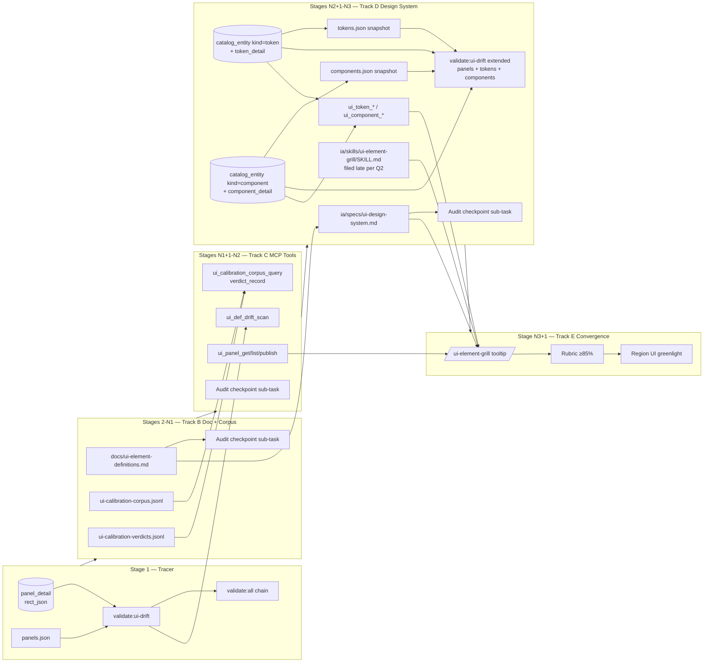

# Exploration — UI implementation rest of MVP (post Track A)

**Date:** 2026-05-08
**Status:** Stub. Awaiting `/design-explore` expansion → master-plan.
**Parent process plan:** `docs/ui-bake-pipeline-rollout-plan.md` (Tracks B–E + Region UI grilling).
**Predecessor work:** `docs/ui-bake-pipeline-rollout-plan.md §Track A` (toolbar DB-first rect overlay) — committed `feat(ui-bake): toolbar DB-first rect overlay + Track A rollout plan`.

## Trigger

Track A closed scene-edit debt (toolbar rect lives in DB now). Two surfaces remain pre-Region-UI:

1. **Doc / corpus alignment** — `docs/ui-element-definitions.md` doesn't reflect achieved DB shapes; hud-bar grilling decisions un-recorded; no calibration corpus / verdicts artifacts on disk.
2. **Calibration tooling + skill formalization** — no `ui_def_drift_scan` MCP gate; `ui-element-grill` skill not formalized; design-system spec (`ia/specs/ui-design-system.md`) still stub-shape; no autonomous-grilling convergence test.

Without these, every next panel (tool-subtype-picker, info-panel, tooltip primitive, notifications-toast, …) repeats the hud-bar bake-bug catalog from scratch and Region UI grilling can't run agent-autonomously.

## Decision space (open — to be expanded by `/design-explore`)

### Q1 — One master-plan or split

- **Option A.** Single master-plan covers Tracks B + C + D + E (~25–30 stages).
- **Option B.** Two master-plans: (B+C) "calibration foundation" + (D+E) "design-system + convergence gate".
- **Option C.** Three master-plans: B (doc), C (tools), D+E (system+gate).

Trade-off — single = continuous flow + shared Stage 1 tracer; multi = parallel section claims viable + smaller blast radius per ship.

### Q2 — Skill formalization timing

- File `ia/skills/ui-element-grill/SKILL.md` Track-D-late (after corpus + tools land), or earlier as a stub that hardens incrementally per panel grilled?
- Trade-off — late = encodes proven flow; early = forces the flow to crystallize, risk thrash.

### Q3 — Calibration corpus shape

- JSONL row-per-decision (`ia/state/ui-calibration-corpus.jsonl`) vs. DB-backed (`ui_calibration_*` tables).
- Trade-off — JSONL = zero-mig start, easy diff; DB = MCP slice queryable, drift-gate-friendly. `ui-bake-pipeline-rollout-plan §Track C` proposes both — corpus on disk, queries via MCP slice over disk.

### Q4 — Convergence gate threshold

- ≥85% match on novel small panel (`tooltip` / `notifications-toast`) — sufficient signal that grilling is agent-autonomous?
- Trade-off — looser = ship faster but Region UI risk; tighter = delays Region UI but lower regrill churn.

### Q5 — Token + component DB seeding scope

- Migrate every token from `docs/ui-element-definitions.md` § Tokens, or only ones referenced by ≥1 locked panel (hud-bar + toolbar)?
- Trade-off — full seed = single source of truth; partial = ship D faster, defer unused tokens.

## Surfaces (provisional)

- `docs/ui-element-definitions.md` (DB-shape sub-blocks per locked panel).
- `ia/state/ui-calibration-corpus.jsonl` + `ia/state/ui-calibration-verdicts.jsonl` (new).
- `ia/specs/ui-design-system.md` (promote tokens + components from definitions doc).
- `ia/skills/ui-element-grill/SKILL.md` + generated `.claude/agents/` + `.claude/commands/` (new).
- `tools/mcp-ia-server/src/tools/ui_*.ts` — `ui_def_drift_scan`, `ui_calibration_corpus_query`, `ui_calibration_verdict_record`, `ui_panel_get`/`_list`/`_publish`, `ui_token_*`, `ui_component_*` (6+ slices per `docs/ideas/ui-elements-grilling.md §10.3`).
- `db/migrations/` — `catalog_token` / `catalog_component` rows + version publishing (Track D).
- `tools/scripts/validate-ui-def-drift.mjs` + `package.json` `validate:all` chain wire (Track C).
- Bake-pipeline improvements Imp-1, Imp-2, Imp-4..8 (`docs/tmp/hud-bar-bake-bugs.md`) — file as backlog issues, may sweep into Stage 1 of one of the master-plans.

## §Visibility Delta (per track, provisional)

- **B:** `docs/ui-element-definitions.md § hud-bar` shows BOTH locked def AND the migration id + rect_json snapshot that backs it.
- **C:** CI red on any `definitions ↔ DB` drift; corpus + verdicts queryable via `mcp__territory-ia__ui_calibration_*`.
- **D:** `ia/specs/ui-design-system.md` = canonical tokens + components; `/ui-element-grill {slug}` opens the formalized 5-phase flow.
- **E:** Agent grills a novel panel without human input; scoring rubric returns ≥85% structure-+-token-+-action match → green light for Region UI.

## §Red-Stage Proof (provisional anchors)

- **B.1** — `tools/scripts/__tests__/validate-ui-def-db-shape.test.mjs::HudBar_DefinitionsBlock_MatchesPanelDetailRow` — assert `docs/ui-element-definitions.md § hud-bar` DB-shape sub-block carries the same `rect_json` as `panel_detail` row queried by slug.
- **C.1** — `tools/scripts/__tests__/validate-ui-def-drift.test.mjs::DriftScan_FlagsRectJsonMismatch` — seed mismatched def vs. DB; drift scan exits 1 with offending slug listed.
- **D.1** — `ia/specs/__tests__/ui-design-system-spec-shape.test.mjs::DesignSystem_TokensSection_HasMinimumLockedSet` — assert `ia/specs/ui-design-system.md § Tokens` lists ≥ N locked tokens (N from `docs/ui-element-definitions.md` count).
- **E.1** — `tools/scripts/__tests__/ui-grill-convergence-rubric.test.mjs::Tooltip_AgentGrill_MatchScoreAtLeast85` — agent-only run on `tooltip` panel returns rubric score ≥ 0.85.

## Out of scope (this exploration)

- Region UI grilling (post-E gate — its own master-plan).
- Country UI (no scene per `docs/mvp-scope.md §2`).
- Full toolbar.prefab rebuild as bake-pipeline-owned artifact (Track A only owns root rect).
- Sprite atlas pipeline rework (`docs/explorations/asset-tree-reorg-and-rename.md` covers).
- 12 hud-bar bake bugs A–L cleanup beyond Imp-* tracking.

## Next step

Run `/design-explore docs/explorations/ui-implementation-mvp-rest.md` →
- Resolves Q1–Q5 by polling user.
- Selects approach + expands surfaces + per-track Stage decomposition.
- Produces handoff frontmatter for `/ship-plan {slug}` to bulk-author master-plan(s).

## Design Expansion

_In-progress — interview captures so far. Full Phase 1–9 expansion follows interview close._

### Stage 1 — Tracer slice

**Subject — hud-bar (Q6 = A).**

Stage 1 tracer is the **drift-gate validator wiring**, NOT a re-bake. Hud-bar prefab + scene untouched. Tracer flow:

1. Wire `npm run validate:ui-drift` (Q5 = A locked → DB ↔ snapshot file pure-data diff, no Unity Editor boot needed).
2. Run validator against hud-bar in green-path state (DB matches `Assets/UI/Snapshots/panels.json`) → expect exit 0.
3. Synthetic-drift test: mutate `panel_detail.rect_json` for hud-bar OR mutate snapshot file → re-run validator → expect exit 1, error names hud-bar slug.
4. Revert mutation → expect exit 0 again.
5. Wire into `validate:all` chain.

Hud-bar = ideal subject because it's the locked panel — already-correct DB ↔ snapshot pair gives a stable green baseline + reliable synthetic-drift-and-revert cycle. No re-bake.

### Compare matrix — master-plan split

Q1 evaluated three options. Approach A pre-locked via `APPROACH_HINT="A"`. Matrix shows why B + C lose.

| Criterion | A (single plan, B+C+D+E) | B (two plans: B+C / D+E) | C (three plans: B / C / D+E) |
|---|---|---|---|
| Constraint fit | High — Stage 1 tracer (drift gate) covers all four tracks; corpus + verdicts seeded once feed every later stage | Medium — splits corpus seed (B+C) from skill formalization (D+E); duplicate tracer wiring | Low — three tracer slices needed, drift gate spans plan boundaries |
| Effort | Low — one master-plan spin-up, one §Plan Digest, one closeout cycle | Medium — two spin-ups, two closeouts, two tracer wires | High — three spin-ups, three closeouts, cross-plan sequencing overhead |
| Output control | High — single §Visibility Delta ladder per stage; convergence test (E) reads continuous corpus | Medium — corpus crosses plan boundary; verdicts ledger handoff at plan close | Low — three plan handoffs; convergence test (E) runs against corpus authored across two prior plans |
| Maintainability | High — single closeout digest carries B→E lessons; single backlog row chain | Medium — two closeout digests; two backlog row chains | Low — three closeout digests; lessons fragment |
| Deps / risk | Low — drift gate (Stage 1) gates every later stage; one place to catch regressions | Medium — gate lives in plan #1; plan #2 stages must re-import gate context | High — gate lives in plan #2 of three; plan #3 stages depend on gate landed in earlier plan that may already be closed |

Verdict: **A wins** on every axis. B + C optimize for parallel section claims, but cross-track deps (B seeds C corpus; C drift gate guards D promotion; D skill exercises E convergence) are linear, not parallel — splitting forces artificial handoffs.

### Selected approach

**Option A — single master-plan covers Tracks B + C + D + E.** Locked via `APPROACH_HINT="A"`. Continuous flow + shared Stage 1 tracer + single closeout digest. Stage decomposition maps tracks to stage ranges (see §Implementation Points).

### Expanded design

#### Components + responsibilities

| Component | Responsibility |
|---|---|
| `validate:ui-drift` script | Pure-data DB ↔ `Assets/UI/Snapshots/panels.json` diff. Exit 0 when match, exit 1 when drift. Lists offending slugs. No Unity Editor boot. |
| `validate:all` chain wire | Adds `validate:ui-drift` to existing CI chain. Local devs skip (Q3 — CI-only). |
| `docs/ui-element-definitions.md` audit checkpoint | Per-stage sub-task verifies definitions doc reflects in-stage panel/token/component changes. Human + agent audit pair. |
| `ia/state/ui-calibration-corpus.jsonl` | Append-only ledger of grilling decisions: prompt → resolution → rationale. One row per panel decision. |
| `ia/state/ui-calibration-verdicts.jsonl` | Append-only ledger of bake/rebake outcomes: bug/improvement id → resolution path → rebake number. |
| `ui_*` MCP namespace | New MCP slice family: `ui_def_drift_scan`, `ui_calibration_corpus_query`, `ui_calibration_verdict_record`, `ui_panel_get/list/publish`, `ui_token_*`, `ui_component_*`. |
| `catalog_token` / `catalog_component` DB rows | Token + component spine rows — seeded incrementally per stage as consumer panels grilled (Q7 — hybrid-incremental). |
| `ia/specs/ui-design-system.md` | Promoted from definitions doc. Canonical tokens + components + patterns. Definitions doc references spec. |
| `ia/skills/ui-element-grill/SKILL.md` | New skill — late-formalized (Q2). Encodes 5-phase grill flow. Stub does NOT crystallize early; filed when Region UI work nears. |
| `tooltip` / `notifications-toast` convergence test | Novel-panel grill without human input. Score ≥85% structure-+-token-+-action match → green light for Region UI grilling. |

#### Data flow

```
Stage 1 (Tracer)
  panel_detail row (DB) ─┐
                         ├─> validate:ui-drift ─> exit 0 (green) | exit 1 (drift, names slug)
  panels.json snapshot ──┘
                         └─> wire into validate:all (CI-only per Q3)

Stages 2-N1 (Track B — doc alignment + corpus seed)
  hud-bar grilling decisions ─> ui-calibration-corpus.jsonl (append rows)
  rebake-1..7 outcomes ──────> ui-calibration-verdicts.jsonl (append rows)
  achieved DB shape ─────────> docs/ui-element-definitions.md § DB-shape sub-blocks
  audit checkpoint ──────────> docs/ui-element-definitions.md drift check (per-stage sub-task)

Stages N1+1-N2 (Track C — calibration tooling)
  MCP slice impl ─> ui_def_drift_scan (MCP) ── wraps validate:ui-drift script
  MCP slice impl ─> ui_calibration_corpus_query / verdict_record
  MCP slice impl ─> ui_panel_get/list/publish
  Per-stage audit checkpoint ─> definitions doc reflects MCP slice contracts

Stages N2+1-N3 (Track D — design-system promotion)
  docs/ui-element-definitions.md § Tokens ──> ia/specs/ui-design-system.md (promote)
  docs/ui-element-definitions.md § Components ─> ia/specs/ui-design-system.md (promote)
  catalog_token / catalog_component DB rows ─> seeded per consumer panel grilled (hybrid-incremental)
  ui_token_* / ui_component_* MCP slices ──> read promoted spec + DB rows
  ui-element-grill skill ────────────────────> filed late per Q2
  Per-stage audit checkpoint ────────────────> definitions doc reflects in-stage token/component additions

Stage N3+1 (Track E — convergence test)
  ui-element-grill SKILL.md ─> agent grill on tooltip / notifications-toast
  agent output ──────────────> rubric scoring (structure + token + action match)
  ≥85% match ────────────────> green light Region UI grilling
  Per-stage audit checkpoint ─> definitions doc reflects convergence-panel additions
```

#### Interfaces / contracts

- **`validate:ui-drift` exit contract.** Exit 0 = no drift. Exit 1 = drift detected; stdout lists offending slugs (one per line, format `drift: {slug} field={field_name}`). No exit code 2 / warning mode (Q4 — hard fail).
- **Drift target surfaces (Q5).** DB `panel_detail.rect_json` (and later `token_detail`, `component_detail`) ↔ `Assets/UI/Snapshots/panels.json` (and per-kind snapshot files). Pure-data jsonb diff. No Unity Editor boot.
- **`ui_*` MCP namespace shape.** Mirrors `catalog_*` slice patterns but with calibration-aware projection (corpus context, verdicts cross-link). Schemas registered in `tools/mcp-ia-server/src/tools/ui-*.ts`.
- **Corpus row shape.** JSONL: `{ts, panel_slug, decision_id, prompt, resolution, rationale, agent|human, parent_decision_id?}`.
- **Verdict row shape.** JSONL: `{ts, panel_slug, rebake_n, bug_ids[], improvement_ids[], resolution_path, outcome (pass|fail|partial)}`.
- **Audit checkpoint sub-task contract.** Each stage that touches token/component/panel surfaces carries a §Plan Digest sub-task: "Audit `docs/ui-element-definitions.md` for in-stage changes — diff `git log -p` against doc; flag missing rows; human + agent both confirm before stage close." Drift-prevention complement to CI `validate:ui-drift` gate.
- **Skill stub deferral (Q2).** No `ia/skills/ui-element-grill/SKILL.md` filed early. Encoded flow lives in corpus + verdicts + closeout digest until Region UI work nears.

#### Non-scope

- Region UI grilling (post-Track E gate — own master-plan).
- Country UI (no scene per `docs/mvp-scope.md §2`).
- Full toolbar.prefab rebuild beyond root rect (Track A scope).
- Sprite atlas pipeline rework (`docs/explorations/asset-tree-reorg-and-rename.md` covers).
- 12 hud-bar bake bugs A–L beyond Imp-* tracking.
- Pre-commit drift gate (Q3 — CI-only).
- Warning-only drift mode (Q4 — hard fail only).
- Upfront full-seed of all tokens / components (Q7 — hybrid-incremental per consumer panel).

### Architecture



**Entry / exit points.**

- Entry: `npm run validate:ui-drift` (CI), `mcp__territory-ia__ui_*` (agent grilling), `/ui-element-grill {slug}` (filed late).
- Exit: green CI on definition ↔ DB ↔ snapshot match (continuous), Region UI master-plan trigger (Stage N3+1 close).

### Subsystem Impact

Tool recipe ran. `invariants_summary` skipped — zero runtime C# touched (all surfaces: docs, MCP server TypeScript, skills .md, specs .md, DB migrations SQL, tooling scripts).

| Subsystem | Dependency | Invariant risk | Breaking vs additive | Mitigation |
|---|---|---|---|---|
| `catalog-architecture` (DB spine + detail + snapshot export) | Reads `panel_detail.rect_json`. Adds `catalog_token` + `catalog_component` rows incrementally. New per-kind snapshot consumers (tokens.json, components.json already exported per §5.1). | Inv #12 (specs under `ia/specs/` for permanent domains) — `ui-design-system.md` already permanent; promoting tokens/components into it is additive. | Additive. | None — promotion respects spec boundary. |
| `ui-design-system` spec | Writes new sections § Tokens, § Components, references definitions doc as JSON-staging surface. | None — spec already exists; sections are additive. | Additive. | None. |
| MCP server (`tools/mcp-ia-server/`) | New `ui_*` namespace. Schema registration mirrors `catalog_*` patterns. | Universal safety: schema cache restart needed after slice registration. Hook denylist unchanged. | Additive. | Restart MCP host after each new slice batch lands. |
| Skill / agent surface (`ia/skills/`, `.claude/agents/`, `.claude/commands/`) | New `ui-element-grill` SKILL.md filed late per Q2. Generated `.claude/agents/` + `.claude/commands/` via `npm run skill:sync:all`. | Inv #13 N/A (no id counter touch). | Additive. | None — generated artifacts validated by existing `validate:skill-drift`. |
| Tooling scripts (`tools/scripts/`) | New `validate-ui-def-drift.mjs`. Wired into `validate:all`. | None (CI-only per Q3). | Additive. | Local devs skip; CI catches. |
| DB migrations (`db/migrations/`) | Adds `catalog_token` + `catalog_component` rows incrementally per stage. Adds drift-gate-supporting indexes if needed. | Inv #13 N/A (counter not touched). | Additive. | Hybrid-incremental seed (Q7) caps blast radius per stage. |
| `docs/ui-element-definitions.md` | Stays as JSON-staging + human-authoring surface. References promoted spec. Per-stage audit sub-task verifies in-stage drift. | None. | Additive (DB-shape sub-blocks per panel). | Audit checkpoint + CI drift gate (two-layer guard per Q7 + Q3 + Q4). |

Architectural surfaces touched: zero hits in `arch_surfaces` table → Phase 2.5 skip-clause fires (silent no-op). No DEC-A row authored. New surfaces (`ui-design-system` promotion, `ui_*` MCP namespace, `ui-element-grill` skill, `validate:ui-drift` script, `catalog_token`/`catalog_component` rows) can be backfilled into `arch_surfaces` post-stage-close if architecture indexing is desired — out-of-scope this exploration.

### Implementation Points

Single master-plan, ~25-30 stages. Stage numbering keeps Stage 1 already locked; per-track stage ranges below are bands (exact boundary set during `/master-plan-new`).

#### Stage 1 — Tracer (already locked above)

Drift-gate validator wiring, hud-bar subject. See §Stage 1 — Tracer slice block.
- Risk: none (no runtime C#, no Unity Editor; pure data diff)

#### Stages 2-N1 — Track B (Doc alignment + corpus seed)

Phase B — Reflect achieved DB shape; seed corpus + verdicts.
- [ ] B.1 Add "DB shape achieved" sub-block per locked panel (hud-bar + toolbar) in `docs/ui-element-definitions.md` — mig id, slug, rect_json, schema_v4 children
- [ ] B.2 Capture hud-bar grilling decisions into `ia/state/ui-calibration-corpus.jsonl` — one row per decision
- [ ] B.3 Capture rebake-1..7 verdicts into `ia/state/ui-calibration-verdicts.jsonl` — per-rebake outcomes
- [ ] B.4 Cross-link `docs/ui-element-definitions.md` ↔ `docs/ui-bake-pipeline-rollout-plan.md` ↔ `docs/ideas/ui-elements-grilling.md`
- [ ] B.AUDIT (per-stage sub-task per Q7) Audit `docs/ui-element-definitions.md` reflects all in-stage hud-bar/toolbar shape additions; human + agent confirm
- Risk: corpus row schema lock-in — define JSONL shape before B.2 to prevent verdict-format drift
- Visibility delta: definitions doc § hud-bar shows BOTH locked def AND DB row that backs it

#### Stages N1+1-N2 — Track C (Calibration tooling)

Phase C — File backlog issues + implement MCP slices + drift gate.
- [ ] C.1 File TECH-* issue: `ui_def_drift_scan` MCP tool wrapping `validate:ui-drift` script
- [ ] C.2 File TECH-* issues: `ui_calibration_corpus_query` + `ui_calibration_verdict_record` MCP slices
- [ ] C.3 File TECH-* issues: `ui_panel_get` / `ui_panel_list` / `ui_panel_publish` MCP slices
- [ ] C.4 File TECH-* issues: `ui_token_*` + `ui_component_*` MCP slices (gated on Track D start)
- [ ] C.5 File backlog issues for bake-pipeline improvements Imp-1, Imp-2, Imp-4..8 (Imp-3 landed)
- [ ] C.6 Implement `ui_def_drift_scan` MCP tool first (highest-leverage drift-gate)
- [ ] C.AUDIT (per-stage sub-task per Q7) Audit `docs/ui-element-definitions.md` reflects MCP slice surfaces named in this stage
- Risk: MCP schema cache requires restart after each slice batch — note in §Plan Digest
- Visibility delta: CI red on any definitions-vs-DB drift; corpus + verdicts queryable via MCP

#### Stages N2+1-N3 — Track D (Design-system promotion)

Phase D — Promote tokens + components; migrate to DB; file skill stub late.
- [ ] D.1 Promote § Tokens from `docs/ui-element-definitions.md` to `ia/specs/ui-design-system.md`
- [ ] D.2 Promote § Components from `docs/ui-element-definitions.md` to `ia/specs/ui-design-system.md`
- [ ] D.3 Migrate token rows: spine row in `catalog_entity` (kind=`token`) + detail row in `token_detail (entity_id, value_json, value_type)`. New migration files per stage. Incremental per Q7 — only consumer-panel-referenced tokens. Spine + detail pattern per `catalog-architecture §2`.
- [ ] D.4 Migrate component rows: spine row in `catalog_entity` (kind=`component`) + detail row in `component_detail (entity_id, role, default_props_json, variants_json)`. Spine + detail pattern per `catalog-architecture §2`. Incremental per Q7.
- [ ] D.4b Extend drift gate scope to `tokens.json` + `components.json` snapshot files (per-kind layout per `catalog-architecture §5.1`). `validate:ui-drift` reads all three per-kind snapshots once token/component rows seeded.
- [ ] D.5 File `ia/skills/ui-element-grill/SKILL.md` — late-formalized per Q2 — encodes 5-phase grill flow, corpus + verdicts loop, MCP slice usage order
- [ ] D.6 Run `npm run skill:sync:all` to generate `.claude/agents/ui-element-grill.md` + `.claude/commands/ui-element-grill.md`
- [ ] D.AUDIT (per-stage sub-task per Q7) Audit `docs/ui-element-definitions.md` § Tokens / § Components reflect any in-stage additions; verify spec ↔ definitions ↔ DB triple-consistency
- Risk: skill formalization timing — Q2 locked LATE; if Region UI work pulls forward, file stub then
- Visibility delta: `ia/specs/ui-design-system.md` = canonical tokens + components

#### Stage N3+1 — Track E (Convergence test)

Phase E — Novel panel grill; rubric scoring; gate to Region UI.
- [ ] E.1 Pick novel small panel — tooltip primitive OR notifications-toast
- [ ] E.2 Grill panel WITHOUT human input — agent uses corpus + design-system + MCP slices alone
- [ ] E.3 Score agent output against independently-authored definition — structure + token + action match
- [ ] E.4 Gate: ≥85% match → declare grilling agent-autonomous; else iterate corpus / verdicts / skill body
- [ ] E.5 Once gate cleared → Region UI master-plan trigger ready
- [ ] E.AUDIT (per-stage sub-task per Q7) Audit `docs/ui-element-definitions.md` reflects convergence-panel definition; verify rubric scoring inputs traceable
- Risk: rubric subjectivity — define scoring rubric before E.2 (structure-match algorithm, token-coverage formula)
- Visibility delta: agent grills novel panel without human input; rubric ≥85% → green light Region UI

#### Deferred / out of scope

- Region UI grilling (own master-plan post-E)
- Country UI (no scene)
- Toolbar.prefab full rebuild
- Sprite atlas rework
- Pre-commit drift gate
- Warning-only drift mode
- Upfront full-seed of tokens / components

### Red-Stage Proof — Stage 1

```python
# Stage 1 — Tracer drift-gate proof on hud-bar
# Pre-state: zero drift gate exists; CI passes silently on DB ↔ snapshot mismatch.
db_row = db.query("SELECT slug, rect_json FROM panel_detail WHERE slug='hud-bar'")
snapshot_row = read_json("Assets/UI/Snapshots/panels.json")["panels"]["hud-bar"]

assert db_row.rect_json == snapshot_row.rect_json  # green baseline

# Synthetic drift — mutate DB row only
db.execute("UPDATE panel_detail SET rect_json = jsonb_set(rect_json, '{h}', '88') WHERE slug='hud-bar'")
exit_code = run_script("validate-ui-def-drift.mjs")
assert exit_code == 1  # drift detected
assert "drift: hud-bar field=h db=88 snapshot=80" in stdout  # offending slug + field named

# Revert + re-run → green again
db.execute("UPDATE panel_detail SET rect_json = jsonb_set(rect_json, '{h}', '80') WHERE slug='hud-bar'")
assert run_script("validate-ui-def-drift.mjs") == 0
```

### Red-Stage Proof — Stage 2

```python
# Stage 2 — Track B doc + corpus + verdicts seed proof
# Pre-state: docs/ui-element-definitions.md § hud-bar carries grilling decisions in prose only;
# no DB-shape sub-block; corpus + verdicts JSONL files do not exist on disk.

assert grep("## DB shape achieved", "docs/ui-element-definitions.md") == []  # zero today
assert not exists("ia/state/ui-calibration-corpus.jsonl")
assert not exists("ia/state/ui-calibration-verdicts.jsonl")

# Post-stage assertions
assert grep("## DB shape achieved", "docs/ui-element-definitions.md").count >= 2  # hud-bar + toolbar
corpus_rows = read_jsonl("ia/state/ui-calibration-corpus.jsonl")
assert all(row.panel_slug == "hud-bar" for row in corpus_rows)
assert len(corpus_rows) >= 14  # estimated hud-bar decisions
verdict_rows = read_jsonl("ia/state/ui-calibration-verdicts.jsonl")
assert {row.rebake_n for row in verdict_rows} >= {1, 2, 3, 4, 5, 6, 7}
assert any(row.improvement_ids == ["Imp-3"] for row in verdict_rows)  # Imp-3 landed

# Cross-link triple
for doc in ["ui-element-definitions.md", "ui-bake-pipeline-rollout-plan.md", "ideas/ui-elements-grilling.md"]:
    assert references_count(doc, other_two_docs) >= 2
```

### Red-Stage Proof — Stage 3

```python
# Stage 3 — Track C MCP slice family proof
# Pre-state: ui_* MCP namespace empty; agents writing JSONL by hand for verdicts.

assert mcp_call("ui_def_drift_scan", {}) raises ToolNotFoundError
assert mcp_call("ui_calibration_corpus_query", {"panel_slug": "hud-bar"}) raises ToolNotFoundError

# Post-stage assertions
result = mcp_call("ui_def_drift_scan", {})
assert "drifts" in result and "total_panels" in result and "total_drifts" in result
assert result.total_drifts == 0  # green baseline still

corpus_result = mcp_call("ui_calibration_corpus_query", {"panel_slug": "hud-bar"})
assert len(corpus_result.rows) >= 14

verdict_result = mcp_call("ui_calibration_verdict_record",
    {"panel_slug": "hud-bar", "rebake_n": 8, "outcome": "pass", "bug_ids": [], "improvement_ids": []})
assert verdict_result.appended == True
# Idempotency: same payload twice → second call no-op
assert mcp_call(... same args).appended == False

panel_get = mcp_call("ui_panel_get", {"slug": "hud-bar"})
assert panel_get.rect_json.h == 80
assert len(panel_get.linked_corpus_rows) >= 14

# Backlog: 7 Imp-* + 4 ui_* TECH issues filed (12 total open)
assert backlog_count(prefix="TECH", filter="Imp-|ui_") >= 11
```

### Red-Stage Proof — Stage 4

```python
# Stage 4 — Track D part 1: spec promotion + DB seed + drift extension proof
# Pre-state: ui-design-system.md ≈ 30 lines stub; zero token/component DB rows; tokens.json/components.json absent.

assert wc_l("ia/specs/ui-design-system.md") < 50
assert db.query("SELECT count(*) FROM catalog_entity WHERE kind IN ('token','component')") == 0
assert not exists("Assets/UI/Snapshots/tokens.json")
assert not exists("Assets/UI/Snapshots/components.json")

# Post-stage assertions
assert section_exists("ia/specs/ui-design-system.md", "## Tokens")
assert section_exists("ia/specs/ui-design-system.md", "## Components")
token_count = db.query("SELECT count(*) FROM catalog_entity WHERE kind='token' AND status='published'")
component_count = db.query("SELECT count(*) FROM catalog_entity WHERE kind='component' AND status='published'")
assert token_count >= 4  # color-bg-cream, color-border-tan, size-icon, gap-default minimum
assert component_count >= 2  # IconButton, TextDisplay minimum

assert exists("Assets/UI/Snapshots/tokens.json")
assert exists("Assets/UI/Snapshots/components.json")

# Drift gate extension — synthetic token drift
db.execute("UPDATE token_detail SET value_json = '\"#deadbeef\"' WHERE entity_id = (SELECT id FROM catalog_entity WHERE slug='color-bg-cream')")
exit_code = run_script("validate-ui-def-drift.mjs")
assert exit_code == 1
assert "drift: color-bg-cream" in stdout  # token kind detected too
# Revert
db.execute("UPDATE token_detail SET value_json = '\"#f5e6c8\"' WHERE entity_id = (SELECT id FROM catalog_entity WHERE slug='color-bg-cream')")
assert run_script("validate-ui-def-drift.mjs") == 0
```

### Red-Stage Proof — Stage 5

```python
# Stage 5 — Track D part 2: ui_token_*/ui_component_* MCP + skill formalization proof
# Pre-state: token/component MCP slices absent; skill not filed; .claude/commands/ui-element-grill.md absent.

assert mcp_call("ui_token_get", {"slug": "color-bg-cream"}) raises ToolNotFoundError
assert not exists("ia/skills/ui-element-grill/SKILL.md")
assert not exists(".claude/commands/ui-element-grill.md")

# Post-stage assertions
token_result = mcp_call("ui_token_get", {"slug": "color-bg-cream"})
assert token_result.value_json == "#f5e6c8"
assert "hud-bar" in token_result.linked_panel_consumers

component_result = mcp_call("ui_component_get", {"slug": "icon-button"})
assert component_result.role is not None
assert "default_props_json" in component_result

assert exists("ia/skills/ui-element-grill/SKILL.md")
skill_frontmatter = parse_frontmatter("ia/skills/ui-element-grill/SKILL.md")
assert "ui-element-grill" in skill_frontmatter.name
assert "5-phase" in read_body("ia/skills/ui-element-grill/SKILL.md")

# skill-sync generated artifacts
assert exists(".claude/commands/ui-element-grill.md")
assert exists(".claude/agents/ui-element-grill.md")
assert run_script("validate:skill-drift") == 0

# Spec finalize — locked-count assertion runs
assert run_test("ia/specs/__tests__/ui-design-system-spec-shape.test.mjs::DesignSystem_TokensSection_HasMinimumLockedSet").passed
```

### Red-Stage Proof — Stage 6

```python
# Stage 6 — Track E convergence + closeout proof
# Pre-state: zero agent-only grill on file; rubric undefined; Region UI master-plan blocked.

assert not exists("docs/ui-grill-convergence-rubric.md")
assert not exists("tools/scripts/__tests__/ui-grill-convergence-rubric.test.mjs")
assert grep("Region UI greenlight", "docs/ui-bake-pipeline-rollout-plan.md") == []

# T1: human authors reference def for tooltip BEFORE agent runs (no contamination)
human_def = read_section("docs/ui-element-definitions.md", "## tooltip")
assert human_def.author == "human" and human_def.timestamp < agent_run_timestamp

# T2: rubric algorithm + weights documented
rubric = read_doc("docs/ui-grill-convergence-rubric.md")
assert "structure-match" in rubric and "token-coverage" in rubric and "action-match" in rubric
assert rubric.threshold == 0.85
assert rubric.weights == {"structure": 0.34, "token": 0.33, "action": 0.33}  # equal v1

# T3: agent-only grill via /ui-element-grill tooltip — zero human prompt during run
agent_draft = read_section("docs/ui-element-definitions.md", "## tooltip-agent-draft")
assert agent_draft.author == "agent" and agent_draft.human_interventions == 0

# T4: rubric scoring + gate
score_result = run_test("ui-grill-convergence-rubric.test.mjs::Tooltip_AgentGrill_MatchScoreAtLeast85")
structure_score = score_struct(agent_draft.rect_json, human_def.rect_json)
token_score = len(agent_draft.tokens & human_def.tokens) / len(human_def.tokens)
action_score = len(agent_draft.actions & human_def.actions) / len(human_def.actions)
weighted_sum = 0.34 * structure_score + 0.33 * token_score + 0.33 * action_score
assert weighted_sum >= 0.85  # gate

# T5: greenlight + closeout
assert "Region UI greenlight" in read_section("docs/ui-bake-pipeline-rollout-plan.md", "Track E close")
closeout = read_section("docs/ui-element-definitions.md", "Closeout digest")
assert all(lesson in closeout for lesson in
    ["drift gate", "hybrid-incremental", "late-skill-formalization", "rubric weights v1"])
```

### Examples

#### Drift gate green-path

**Input.** `panel_detail.rect_json` for `hud-bar` slug = `{"x":0,"y":0,"w":1280,"h":80,"anchor":"bottom"}`. `Assets/UI/Snapshots/panels.json` carries matching row.

**Output.**

```
$ npm run validate:ui-drift
> validate-ui-def-drift.mjs
[ui-drift] hud-bar: ok
[ui-drift] toolbar: ok
[ui-drift] 0 drifts detected across 2 panels
$ echo $?
0
```

**Edge case.** Snapshot file absent → script exits 1 with `[ui-drift] FATAL: Assets/UI/Snapshots/panels.json missing` (treated as drift; CI must regen via bake before proceeding).

#### Drift gate red-path

**Input.** Mutate `panel_detail.rect_json` for `hud-bar`: change `h` from 80 to 88 in DB. Snapshot file still carries 80.

**Output.**

```
$ npm run validate:ui-drift
> validate-ui-def-drift.mjs
[ui-drift] hud-bar: DRIFT field=h db=88 snapshot=80
[ui-drift] toolbar: ok
[ui-drift] 1 drift detected across 2 panels
$ echo $?
1
```

**Edge case.** DB `rect_json` carries extra field `padding` not in snapshot → exit 1 with `field=padding db=present snapshot=absent`. Hard-fail per Q4 (no warning mode).

#### Corpus row shape

**Input event.** Decision during hud-bar grill: should icon button hover state use `color.bg.cream-pressed` or a separate `color.bg.hover` token?

**Output JSONL row.**

```jsonc
{"ts":"2026-05-08T14:32:11Z","panel_slug":"hud-bar","decision_id":"hb-d-014","prompt":"Hover-state bg token: reuse cream-pressed or introduce color.bg.hover?","resolution":"reuse cream-pressed","rationale":"Avoid token sprawl; pressed + hover share visual weight in baked palette","agent":"human","parent_decision_id":"hb-d-013"}
```

**Edge case.** Decision reverses prior decision → `parent_decision_id` cited; verdicts ledger MUST cross-link bug/improvement id.

#### Verdict row shape

**Input event.** Rebake-5 of hud-bar: bug C (icon misalignment) resolved via Imp-3 (bake handler emits warnings).

**Output JSONL row.**

```jsonc
{"ts":"2026-05-08T15:14:02Z","panel_slug":"hud-bar","rebake_n":5,"bug_ids":["C"],"improvement_ids":["Imp-3"],"resolution_path":"bake-handler emits warnings.mutation_result; bake retry with corrected rect_json","outcome":"pass"}
```

**Edge case.** Partial pass — bug fixed but new minor issue surfaced → `outcome="partial"` + add new `bug_ids[]` entry referencing follow-up issue.

#### Token migration sub-task

**Input.** Stage D.3 grills `tool-subtype-picker` panel. Panel consumes `color.bg.cream`, `color.border.tan`, `size.icon`, `gap.default`.

**Output (DB rows after migration).**

```sql
INSERT INTO catalog_entity (kind, slug, status, display_name) VALUES
  ('token', 'color-bg-cream',   'published', 'Cream background'),
  ('token', 'color-border-tan', 'published', 'Tan border'),
  ('token', 'size-icon',        'published', 'Icon size'),
  ('token', 'gap-default',      'published', 'Default gap');
INSERT INTO token_detail (entity_id, value_json) SELECT id, '"#f5e6c8"'::jsonb FROM catalog_entity WHERE slug='color-bg-cream';
-- ... etc for the four consumer-panel-referenced tokens only (hybrid-incremental per Q7)
```

**Edge case.** Token already migrated for prior consumer panel → `INSERT ... ON CONFLICT DO NOTHING` keeps idempotency. Migration filename carries stage id so audit can trace which stage seeded which row.

#### Audit checkpoint output

**Input.** Stage D.5 completes (skill SKILL.md filed). Per-Q7 audit sub-task fires.

**Output (audit log appended to stage closeout digest).**

```
[D.AUDIT] docs/ui-element-definitions.md drift check
- § Tokens: 4 new rows added (color-bg-cream, color-border-tan, size-icon, gap-default) — present
- § Components: <IconButton> variant table updated — present
- § Patterns: tool-subtype-picker pattern referenced — present
- § Skill section: ui-element-grill skill cross-link added — present
Confirmed by: human + agent. No drift.
```

**Edge case.** Audit detects missing row → flag in §Plan Digest sub-task as blocker; stage cannot close until reconciled.

### Review Notes

Phase 8 review run. BLOCKING items resolved inline before persist.

**BLOCKING (resolved):**

1. **Token / component DB schema unspecified.** D.3 / D.4 originally referenced `catalog_token` / `catalog_component` migrations without naming detail-table shape. Catalog architecture spec (`catalog-architecture §2`) requires spine + detail pattern. **Fix applied** — D.3 and D.4 now name `catalog_entity` (kind=`token`/`component`) spine rows + `token_detail (entity_id, value_json, value_type)` / `component_detail (entity_id, role, default_props_json, variants_json)` detail tables.
2. **Drift gate scope unclear for tokens / components.** Stage 1 tracer drifts `panel_detail` ↔ `panels.json`. Track D introduces `catalog_token` + `catalog_component` rows but architecture diagram + implementation points did not extend drift gate to per-kind snapshots `tokens.json` + `components.json` (per `catalog-architecture §5.1`). **Fix applied** — added D.4b sub-task explicitly extending `validate:ui-drift` scope, updated Mermaid diagram with `tokens.json` / `components.json` nodes feeding extended validator.

**NON-BLOCKING (carried):**

- §Examples could include rubric-scoring pseudocode for E.4 — currently prose-only. Adding helps downstream stage 1.0 §Tracer Slice authoring and rubric reproducibility.
- §Subsystem Impact entry for `catalog-architecture` could cite §5.5 `catalog_snapshot` table (snapshot_id content hash) to make snapshot regen contract explicit — drift gate must trigger snapshot regen when DB rows publish.

**SUGGESTIONS:**

- Stage E.4 rubric weights (structure / token / action) could be parameterized from corpus statistics rather than equal-weighted — defer until E.3 surfaces real distribution.
- Audit checkpoint sub-task could emit machine-readable JSON line into `ia/state/ui-definition-audit.jsonl` for cross-stage drift querying — additive to closeout digest prose.
- Track C Imp-1..8 backlog issues could batch-file via `mcp__territory-ia__backlog_issue_create` once that mutation exists; meanwhile sequential file via existing flow.

### Expansion metadata
- Date: 2026-05-08
- Model: claude-opus-4-7
- Approach selected: A (single master-plan covers Tracks B + C + D + E)
- Stage cardinality (locked by user): 6 stages × ≤5 tasks = 29 tasks total (within 30-task hard cap; no v2 overflow)
- Blocking items resolved: 2
- Phase 4 mandatory emitters: per-stage Red-Stage Proof blocks (6) + lean handoff YAML frontmatter (top-of-doc) — both present
- YAML schema validation: `node tools/scripts/validate-handoff-schema.mjs docs/explorations/ui-implementation-mvp-rest.md` → exit 0
- invariants_summary skipped (zero runtime C# touched)
- Architecture Decision (Phase 2.5) skipped (zero arch_surfaces hit)

