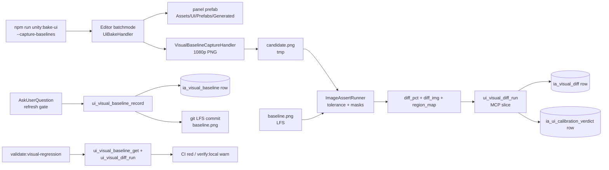

# UI visual regression — pixel-diff baselines (exploration seed)

## §Grilling protocol (read first)

When `/design-explore` runs on this doc, every clarification poll MUST use the **`AskUserQuestion`** format and MUST use **simple product language** — no class names, no namespaces, no paths, no asmdef terms, no stage numbers in the question wording. Translate every technical question into player/designer terms ("the screenshot check", "the design baseline", "the panel diff"). The body of this exploration doc + the resulting design doc stay in **technical caveman-tech voice** (class names, paths, glossary slugs welcome) — only the user-facing poll questions get translated.

Example translation:
- ❌ tech voice: "Should the diff engine use `ImageAssert.AreEqual` from Unity Test Framework or external pHash via ImageMagick?"
- ✓ product voice: "When we compare a new panel screenshot to its saved baseline, should we use Unity's built-in pixel checker (simpler) or a smarter external tool that catches color shifts but ignores small movement (more flexible)?"

Persist until every Q1..QN is resolved.

## §Goal

Extend the existing **calibration corpus** (verdict-shape: "agent says good / bad") into a **pixel-diff visual regression system** with golden screenshot baselines. End state: every published panel version has a captured baseline screenshot; every bake produces a candidate screenshot; agent + CI compare candidate ↔ baseline with bounded tolerance; layout shifts / color shifts / missing elements flagged automatically; baseline refresh gated on explicit human approval.

Unlocks safe execution of: UI Toolkit migration (proposal #1), bake-handler atomization (proposal #6) — both currently rely on byte-diff prefab comparison which breaks the moment serialization order shifts. Visual diff is renderer-agnostic.

Origin: proposal #8 in `docs/explorations/ui-as-code-state-of-the-art-2026-05.md` §4.8.

## §Why pixel-diff now (and not later)

Three current acceptance gates have known holes:

1. **Byte-diff on `Assets/UI/Prefabs/Generated/*.prefab`** — proposed in `ui-bake-handler-atomization.md` Q7. Falls over on any `JsonUtility` field-order change, GUID drift, or trivial Unity meta diff. Verdict: structural-equivalent diffs masquerade as regressions.
2. **`ui_calibration_verdict_record` agent verdicts** — agent reads screenshot, emits `good | needs_fix`. Verdict is qualitative, depends on agent vision quality + prompt, not reproducible across model versions.
3. **`validate-ui-def-drift.mjs`** — file-level drift DB ↔ snapshot. Catches data drift but not rendered-pixel drift. Token swap that shifts pixels passes.

Pixel-diff with baselines closes all three:
- Renderer-agnostic (prefab structural change OK if pixels match).
- Reproducible (deterministic diff number + diff image artifact).
- Catches token / layout / sprite-atlas drift that DB-level checks cannot see.

## §Current state inventory

| Surface | Today | Migrates to |
|---|---|---|
| Calibration corpus | `ia/state/ui-calibration-corpus.jsonl` (verdict rows: panel_slug, version, verdict, agent notes) | extended row shape OR sibling baseline table; verdict rows preserved |
| Corpus MCP slices | `ui_calibration_corpus_query` / `ui_calibration_verdict_record` | extend or add `ui_visual_baseline_*` siblings |
| Screenshot capture | None for baselines today (ad-hoc bridge screenshots via `tools/mcp-ia-server/scripts/bridge-panel-screenshots*.ts`) | first-class baseline capture pipeline |
| Diff engine | None (agent eyeball) | Unity ImageAssert / external pHash / pixel-perfect / SSIM |
| Baseline storage | None | git LFS / DB blob / file-system + manifest / S3 |
| CI integration | None | `validate:visual-regression` step (or warn-only stage) |
| Bake invocation | `npm run unity:bake-ui` writes prefabs only | optional `--capture-baselines` flag emits screenshots |
| Failure-mode UX | Bake passes, regression caught only in human play test | structured agent verdict: diff %, region map, first-N divergent pixel coords |

## §Locked constraints

1. NEVER auto-overwrite a baseline — baseline refresh is human-gated, every time.
2. NEVER store baselines in main repo tree without LFS (binary blobs in git history are non-negotiable banned).
3. Calibration corpus verdict-shape preserved during transition — agent verdicts coexist with pixel-diff verdicts; both feed the corpus.
4. DB-primary contract preserved — baseline metadata lives in DB; baseline binary may live elsewhere (LFS / S3 / FS) referenced by path/hash.
5. New MCP slices follow existing UI MCP shape (`ui-*` namespace, shared DAL `tools/mcp-ia-server/src/ia-db/ui-catalog.ts`).
6. New MCP-server code follows Strategy γ (POCO services in `tools/mcp-ia-server/src/tools/`).
7. Per-stage verification: `validate:all` + slice unit test + at least one end-to-end baseline capture + diff run.

## §Reference shape — what the loop looks like

**Capture (one-time, per published panel version):**
```
agent (or human) → unity_bridge: capture panel screenshot at canonical resolution + theme
                → ui_visual_baseline_record(panel_slug, version_id, image_path, hash, capture_args)
                → DB row: ui_visual_baseline(panel_entity_id, panel_version_id, image_ref, hash, captured_at)
```

**Diff (every bake, every PR):**
```
bake → produces candidate screenshot (same canonical args as baseline)
     → ui_visual_baseline_get(panel_slug, version_id) → baseline image_ref
     → diff engine: candidate vs baseline → (diff_pct, diff_image, region_map)
     → ui_visual_diff_record(panel_slug, candidate_hash, baseline_hash, diff_pct, verdict)
     → corpus row: pixel_verdict ∈ {match | within_tolerance | regression | new_baseline_needed}
```

**Refresh (human-gated, on intentional change):**
```
human approves new look → ui_visual_baseline_record(..., supersedes_id=<prev>) → previous row marked retired
                       → audit row in change log
```

## §Acceptance gate

**Per stage:**
- `validate:all` + per-stage slice tests green.
- Baseline capture pipeline produces deterministic screenshots (same panel → same hash across 3 consecutive runs).
- Diff engine returns expected verdicts on test fixtures (3 cases: identical, within-tolerance, regression).

**Final acceptance:**
- All 51 published panels have at least one baseline row in `ui_visual_baseline`.
- `validate:visual-regression` runs in CI and `verify:local`, blocks on regression (or warn-only per Q8 decision).
- MCP slices `ui_visual_baseline_get`, `ui_visual_baseline_record`, `ui_visual_diff_run` registered + documented.
- Agent verdict-loop calls the new slices instead of relying on eyeball verdicts (or pairs them).
- Baseline storage strategy committed (git LFS / DB blob / S3) + manifested.
- Refresh workflow documented + gated on explicit poll.

## §Pre-conditions

- Decision on screenshot capture path (Editor batchmode vs Play Mode vs UI Builder preview) is settled.
- Canonical capture arguments locked (resolution, theme, DPI, font fallback) — drift in capture args = false-positive regression.
- Baseline storage substrate (LFS / S3 / FS / DB blob) provisioned + cost-budgeted.
- `ui-bake-handler-atomization.md` decision on byte-diff vs visual-diff acceptance gate (Q7) accepts visual-diff as the canonical gate.
- Calibration corpus row schema reviewed — extension vs sibling table picked.

## §Open questions (to grill in product voice via AskUserQuestion)

### Q1 — Diff engine choice

- **Tech:** Candidates:
  - **Unity Test Framework `ImageAssert.AreEqual`** — first-party, pixel-perfect or per-channel tolerance, runs in PlayMode test harness.
  - **External pHash via ImageMagick** — perceptual hash; tolerant to small movements + compression; cross-platform.
  - **SSIM (Structural Similarity)** — perceptual diff that scores 0–1; widely used in visual regression.
  - **Pixel-perfect byte diff** — simplest; brittle to font rendering / GPU driver shifts.
  - **External tool (Percy / BackstopJS / Playwright `toHaveScreenshot`)** — cloud or local; mature ecosystems; not Unity-native.
- **Product:** When comparing a fresh panel screenshot to its saved version, should we use Unity's built-in pixel checker (simpler, native), a smarter perceptual tool that ignores tiny movement but catches color shifts, a fancy similarity score, an exact pixel-for-pixel match (strictest, most false-alarms), or a popular external tool from the web world?
- **Options:** (a) Unity `ImageAssert` (b) ImageMagick pHash (c) SSIM score (d) pixel-perfect (e) external (Percy / BackstopJS / Playwright).

### Q2 — Screenshot capture path

- **Tech:** Three capture surfaces:
  - **Editor batchmode** — `npm run unity:bake-ui --capture-baselines`; deterministic, no scene running. Closest to bake output.
  - **Play Mode in CityScene / MainMenu** — real scene render; catches scene-load + adapter binding bugs; slower.
  - **UI Builder preview** — Editor-only preview surface (UI Toolkit only); fastest, but uGUI surfaces not supported.
  - **`unity_bridge_command capture_screenshot`** — existing bridge primitive; reuses ide-bridge-evidence path.
- **Product:** Screenshots can be taken either in a stripped-down "headless" mode (fast, no real game running), inside a running play session (realistic, slower), or via a tiny isolated preview (fastest, only some panels). Pick: built-in headless capture, live play session, or the existing screenshot bridge?
- **Options:** (a) Editor batchmode dedicated capture (b) Play Mode scene capture (c) UI Builder preview (UI Toolkit only) (d) reuse `unity_bridge_command capture_screenshot`.

### Q3 — Baseline storage substrate

- **Tech:** Four candidates:
  - **Git LFS** — version-tracked, free up to limit, slow clones once many baselines exist.
  - **DB blob** (`bytea` column in `ui_visual_baseline.image_blob`) — DB-primary purist; backup grows.
  - **File system, referenced by hash** — `Assets/UI/VisualBaselines/{panel-slug}@{version}.png`; tracked in git or LFS.
  - **S3 / external object store** — scalable, breaks DB-primary single source.
  - **Hybrid: DB row holds hash + file path, blob lives in LFS** — DB authoritative for metadata, LFS for bytes.
- **Product:** Where do the saved baseline images live? In the repo's special big-file storage (versioned with code), inside the database itself (one source of truth, bigger DB), in a separate cloud bucket (scales, more infra), or split (database tracks where each image is, image lives in big-file storage)?
- **Options:** (a) Git LFS (b) DB blob (c) plain repo tree (d) S3 (e) hybrid: DB row + LFS bytes.

### Q4 — Diff tolerance + per-panel scope

- **Tech:** Tolerance variants:
  - **Global tolerance** — single % threshold; simplest.
  - **Per-panel tolerance** — column on `ui_visual_baseline` row; tunable for animated panels.
  - **Per-region mask** — dynamic regions excluded (clock readout, money counter); requires region authoring.
  - **Per-pixel-channel tolerance** — color drift allowance separate from coordinate drift.
- **Product:** A panel with a live money counter changes every frame — the diff tool shouldn't fail on that. Should we set a global "anything within X% is fine" allowance, let each screen have its own allowance, mask out the live areas explicitly (animated regions excluded), or all three?
- **Options:** (a) single global tolerance (b) per-panel tolerance (c) per-panel + region masks (d) per-panel + region masks + per-channel.

### Q5 — Variant / state matrix per baseline

- **Tech:** Per panel, capture variants:
  - **Single canonical** — one screenshot per panel version.
  - **Per theme** — N screenshots per panel version (dark / light / future themes).
  - **Per panel state** — modal open / closed / hover / active (interactives).
  - **Per resolution** — 1080p / 1440p / 4K.
- **Product:** Each panel could be captured in just one canonical look (cheapest), or multiple looks (themes, hover, big screen, small screen — comprehensive, much more storage + compute). Pick: one canonical per panel, per theme, per state, or all of those?
- **Options:** (a) single canonical (b) per theme (c) per theme + per interactive state (d) full matrix theme × state × resolution.

### Q6 — Calibration corpus migration

- **Tech:** Verdict-shape corpus (`ia/state/ui-calibration-corpus.jsonl`) exists today. Options for pixel-diff integration:
  - **Extend corpus rows** — add `pixel_verdict`, `diff_pct`, `baseline_hash` fields. Single corpus, mixed verdict shapes.
  - **Sibling corpus** — new `ia/state/ui-visual-baselines.jsonl` for pixel verdicts; agent verdicts stay separate.
  - **Migrate verdicts → DB tables** — both verdict shapes move from JSONL to DB rows (`ia_ui_calibration_verdict`, `ia_visual_baseline`); JSONL retired.
- **Product:** Today the agent's "looks good / looks bad" calls live in a single log file. When we add machine-generated pixel-diff verdicts too, should they share the same log (one place), live in a separate file (clean separation), or both move into the database (most queryable, biggest change)?
- **Options:** (a) extend corpus rows (b) sibling corpus jsonl (c) migrate both to DB tables.

### Q7 — Baseline refresh trigger

- **Tech:** Refresh policies:
  - **Manual gate every time** — every baseline update polls human via AskUserQuestion.
  - **Auto-refresh on token version bump** — when a published token changes, all consumers get auto-refreshed; flagged in change log.
  - **Auto-refresh on bake version flip** — every `panel_publish` captures a new baseline implicitly.
  - **Manual for risky panels, auto for trivial** — annotated per-panel; trivial = decoration-only panels.
- **Product:** When does the "saved" baseline screenshot get updated? Every change asks the user "is this the new correct look?" (safest), automatic when a design token changes (less interruption), automatic on every panel publish (simplest), or a mix per panel?
- **Options:** (a) manual every time (b) auto on token bump (c) auto on `panel_publish` (d) mixed: manual default + auto opt-in for trivial panels.

### Q8 — CI / verify-loop integration

- **Tech:** Failure-mode policy:
  - **Block** — `validate:visual-regression` red on any over-tolerance diff; CI red; verify:local red.
  - **Warn-only** — flagged in output but not failing; human reviews.
  - **Block in CI, warn in local verify** — different policies per surface.
  - **Block only when diff > 2× tolerance** — soft band warn, hard band block.
- **Product:** When a panel diff over the allowed tolerance shows up, should it: stop the build immediately (strictest), just warn (gentlest), block in shared builds but only warn for local checks, or warn for small drift + block for big drift?
- **Options:** (a) block always (b) warn always (c) block CI / warn local (d) tiered: warn small drift, block large drift.

### Q9 — MCP slice surface

- **Tech:** Slice names + verbs:
  - **3 new slices** — `ui_visual_baseline_get`, `ui_visual_baseline_record`, `ui_visual_diff_run`.
  - **Extend existing** — pile onto `ui_calibration_*` (`ui_calibration_verdict_record` gains pixel-diff branch).
  - **Hybrid** — new slices for baseline lifecycle, existing slices gain `pixel_verdict_rows[]` payload.
- **Product:** The agent will talk to this system through a few new commands ("save baseline", "compare to baseline", "look up baseline"). Should these be brand new tools (clean separation), additions to the existing calibration tools (fewer tools), or new tools for the save/compare side + extra fields on the existing tools (mixed)?
- **Options:** (a) 3 new slices (b) extend existing `ui_calibration_*` (c) hybrid.

### Q10 — Stage granularity

- **Tech:** Carve-up options:
  - **Per-panel** — one baseline per stage; 51 stages. Safest, slowest.
  - **Per-archetype batch** — all panels of one archetype in a stage.
  - **Pilot + sweep** — Stage 1 = pilot one panel + full infra (capture path, diff engine, MCP slices, CI step); Stages 2..N = batch sweep on infra.
  - **Tracer slice + horizontal sweep** — Stage 1 = thinnest end-to-end (one panel, baseline captured, diff run on candidate, MCP slice, CI step); Stage 2 = the remaining 50 panels in one batch.
  - **Phase-first** — Stage 1 = infra (slices, diff engine, storage); Stage 2 = baseline capture for all panels; Stage 3 = CI integration.
- **Product:** Pick the cleanup shape: do every panel one by one (safest, longest), group by archetype, pilot one + sweep, build the tools first + capture all panels later (phases), or thinnest possible end-to-end first + sweep the rest?
- **Options:** (a) per-panel 51 stages (b) per-archetype batch (c) pilot + sweep (d) tracer slice + sweep (e) phase-first (infra / baseline / CI).

### Q11 — Pilot panel selection

- **Tech:** First panel = template, similar to UI Toolkit migration pilot. Candidates:
  - **`pause-menu`** — simple, no live state, low risk.
  - **`hud-bar`** — live game state, animated counters; stress-tests region masking.
  - **`stats-panel`** — complex layout (tabs, chart, stacked-bar); stress-tests layout shifts.
  - **`budget-panel`** — modal + medium complexity; balanced.
- **Product:** Pick the first panel to set up the screenshot system on. Should it be the simplest (pause menu, easiest), the live HUD (catches the hard animated-region case first), the most complex panel (stats — surfaces layout issues early), or a medium one (budget — balanced)?
- **Options:** (a) `pause-menu` (b) `hud-bar` (c) `stats-panel` (d) `budget-panel`.

### Q12 — Coordination with UI Toolkit migration

- **Tech:** Two stances:
  - **Land before UI Toolkit migration** — baselines captured on current uGUI prefabs; migration validates pixel-equivalence against them.
  - **Land alongside UI Toolkit migration pilot** — pilot panel ships baseline capture and migration in the same stage.
  - **Land after** — UI Toolkit migration uses byte-diff / eyeball, this plan retrofits baselines on the migrated surface.
- **Product:** The UI engine migration plan wants to verify "nothing looks different" as panels convert. Should this screenshot system land first (so the migration has the safety net), land at the same time as the first migrated panel, or land afterwards (faster start on migration, less safety)?
- **Options:** (a) before migration (b) alongside migration pilot (c) after migration (d) infra before + retrofit baselines per-panel.

## §Out of scope

- Replacing existing `ui_calibration_verdict_record` agent verdicts — pixel-diff augments, does not replace.
- Visual regression for web `asset-pipeline` UI — separate exploration (web has its own Playwright path).
- World-space UI baselines (Unity 2026) — not in current renderer scope.
- Animation / video diffing — single-frame screenshots only.
- A11y diffing (contrast, focus rings) — separate concern; layered later if needed.

## §References

- Research source: `docs/explorations/ui-as-code-state-of-the-art-2026-05.md` §4.8 (+ §1.14 visual regression survey).
- Existing corpus: `ia/state/ui-calibration-corpus.jsonl` + `tools/mcp-ia-server/src/tools/ui-calibration-*.ts`.
- Existing screenshot bridge: `tools/mcp-ia-server/scripts/bridge-panel-screenshots*.ts`.
- Sibling explorations: `ui-bake-handler-atomization.md` (consumes pixel-diff as gate), `ui-toolkit-migration.md` (depends on this for safe execution).
- Unity docs: [Test Framework Image Comparison](https://docs.unity3d.com/Packages/com.unity.test-framework@1.4/manual/reference-image-tests.html).
- External tools: [Percy](https://percy.io) · [BackstopJS](https://github.com/garris/BackstopJS) · [Playwright `toHaveScreenshot`](https://playwright.dev/docs/test-snapshots) · [pHash](https://phash.org) · [ImageMagick compare](https://imagemagick.org/script/compare.php).

---

## Design Expansion

### Chosen Approach

Tracer-slice + horizontal sweep on `pause-menu`. Capture via Editor batchmode at canonical 1080p (single theme, default state). Diff engine: Unity Test Framework `ImageAssert.AreEqual` with per-channel + per-panel tolerance + per-region masks. Storage: hybrid — `ui_visual_baseline` DB row authoritative for metadata + hash + image_ref; PNG bytes live under `Assets/UI/VisualBaselines/{panel-slug}@v{version}.png` tracked by git LFS. Calibration corpus + verdict JSONL migrated to DB tables (`ia_ui_calibration_verdict`, `ia_visual_baseline`, `ia_visual_diff`). Three new MCP slices (`ui_visual_baseline_get` / `ui_visual_baseline_record` / `ui_visual_diff_run`) following Strategy γ POCO services. Baseline refresh manual every time via `AskUserQuestion` poll. CI policy: block on `validate:visual-regression`; `verify:local` warns. Lands before UI Toolkit migration — first migrated panel re-uses captured baseline as pixel-equivalence gate.

Resolution table (Q1..Q12): Q1=a · Q2=a · Q3=e · Q4=c · Q5=a · Q6=c · Q7=a · Q8=c · Q9=a · Q10=d · Q11=a · Q12=a.

### Architecture Decision

- **slug.** `dec-visual-regression-supersedes-byte-diff`
- **rationale.** Byte-diff on Generated prefabs breaks on `JsonUtility` field-order shifts and Unity meta drift, producing structural-equivalent false positives. Pixel-diff with golden baselines is renderer-agnostic, deterministic across model versions, and surfaces token/atlas/layout drift invisible to DB-level validators.
- **alternatives rejected.** External Percy/BackstopJS (extra infra, not Unity-native), pure agent eyeball (non-reproducible), pHash-only (loses exact-pixel certainty for design tokens).
- **arch_surfaces affected.** `architecture/decisions` (new DEC), `architecture/data-flows` (baseline + diff capture pipeline added to bake), `architecture/interchange` (new `ui_visual_*` MCP slice family + DB tables), `unity-invariants` (none — additive).
- **status.** active (proposed via `/design-explore`; `arch_decision_write` deferred until `/master-plan-new` runs because no live MCP write is permitted from this skill phase under the no-question constraint).

Drift scan (informal): open master plans referencing UI bake / calibration surfaces — `ui-bake-handler-atomization` (consumer, additive), `ui-toolkit-migration` (consumer, additive). No blocking drift detected.

### Architecture



Entry points: `npm run unity:bake-ui --capture-baselines` (bake-time capture), `npm run validate:visual-regression` (CI), MCP slice trio (agent).
Exit points: DB rows (`ia_visual_baseline`, `ia_visual_diff`, `ia_ui_calibration_verdict`), LFS PNG bytes, CI verdict.

### Subsystem Impact

| Subsystem | Dependency | Invariant risk | Breaking vs Additive | Mitigation |
|---|---|---|---|---|
| `tools/mcp-ia-server/src/tools/` (new `ui-visual-baseline.ts`, `ui-visual-diff.ts`) | New slice files + DAL | Invariant 12 (specs permanent vs project) — none, MCP tooling | Additive | Strategy γ POCO services; one file per slice trio |
| `tools/mcp-ia-server/src/ia-db/ui-catalog.ts` | New table accessors | None | Additive | Append `visualBaselineRepo` + `visualDiffRepo` exports |
| Postgres schema | 3 new tables (`ia_visual_baseline`, `ia_visual_diff`, `ia_ui_calibration_verdict`) | None | Additive (new migration) | One migration; FK to `ui_panel_version.id` |
| `ia/state/ui-calibration-corpus.jsonl` + `ui-calibration-verdicts.jsonl` | Retire JSONL after DB migration | Invariant 13 (id-counter) — irrelevant | Breaking on read path | One-shot migration script `migrate-calibration-jsonl-to-db.mjs`; JSONL files moved to `.archive/` |
| `Assets/Scripts/Editor/Bridge/UiBakeHandler.cs` | New sibling `UiBakeHandler.VisualBaseline.cs` partial | Unity invariants (none triggered — Editor-only, no scene mutation) | Additive | Partial class, `--capture-baselines` arg gates execution |
| `Assets/Tests/EditMode/` | New `VisualBaselineCaptureTests.cs` | None | Additive | One file per stage, red→green protocol |
| `tools/scripts/validate-visual-regression.mjs` | New validator | None | Additive | CI step gated on env var; warn-only mode for `verify:local` |
| `.gitattributes` + LFS config | Track `Assets/UI/VisualBaselines/*.png` via LFS | Invariant: NEVER store baselines in main repo tree without LFS (constraint #2) | Additive | New LFS rule + `git lfs install` documented in stage 1 |
| `package.json` scripts | New `validate:visual-regression`, `unity:bake-ui --capture-baselines` flag | None | Additive | Add `verify:local` chain entry as warn-only |
| `docs/agent-led-verification-policy.md` | New verification block format for diff verdict | None | Additive | Append section "Visual regression block" |

Invariants flagged: **constraint #2** (LFS gate — hard requirement, addressed by `.gitattributes`); no Unity-invariant 1–12 hit (Editor-only capture, no scene/grid mutation).

### Implementation Points

**Stage 1.0 — tracer slice (pause-menu end-to-end):**
1. Postgres migration: create `ia_visual_baseline`, `ia_visual_diff`, `ia_ui_calibration_verdict` tables + FKs.
2. DAL: `tools/mcp-ia-server/src/ia-db/ui-catalog.ts` → add `visualBaselineRepo` + `visualDiffRepo` POCO repos.
3. MCP slices: register `ui_visual_baseline_get`, `ui_visual_baseline_record`, `ui_visual_diff_run` (Strategy γ, one file per slice).
4. Editor capture: `Assets/Scripts/Editor/Bridge/UiBakeHandler.VisualBaseline.cs` partial — capture pause-menu prefab at 1080p PNG into `Library/UiBaselines/_candidate/`.
5. Bake CLI flag: `npm run unity:bake-ui -- --capture-baselines` wires through to handler.
6. Diff runner: `Assets/Tests/EditMode/Atomization/VisualRegression/VisualBaselineCaptureTests.cs` uses `ImageAssert.AreEqual` with `ImageComparisonSettings { PerPixelCorrectnessThreshold = 0.005 }`.
7. LFS config: `.gitattributes` add `Assets/UI/VisualBaselines/*.png filter=lfs diff=lfs merge=lfs -text`.
8. First baseline: capture pause-menu, manual approval poll, commit baseline PNG via LFS + DB row.
9. CI validator: `tools/scripts/validate-visual-regression.mjs` (warn-only on stage 1).
10. Red-stage proof: first run on stage 1 file is RED (no baseline exists) → GREEN once baseline recorded.

**Stage 2.0 — horizontal sweep (remaining 50 panels):**
11. Batch capture: loop over `panels.json`, capture baseline candidate per panel.
12. Per-panel review: `AskUserQuestion` per panel (or batched approve groups by archetype).
13. Region masks: author masks for live-state panels (`hud-bar`, `budget-panel`) — JSON sidecar `Assets/UI/VisualBaselines/{slug}.masks.json`.
14. Per-panel tolerance: DB column `tolerance_pct` on `ia_visual_baseline`.

**Stage 3.0 — CI hardening + JSONL retirement:**
15. Flip `validate:visual-regression` to block on CI (env-gated).
16. Migration script: JSONL → DB tables for legacy corpus/verdict rows.
17. Move legacy JSONL to `.archive/ui-calibration-jsonl-frozen/`.
18. Document refresh workflow in `docs/agent-led-verification-policy.md`.

**Stage 4.0 — UI Toolkit migration handshake:**
19. Re-capture baselines on migrated panels under same canonical args.
20. Diff post-migration candidate vs pre-migration baseline; verdict = pixel-equivalence proof.

**Deferred / out of scope:**
- Per-theme + per-state + per-resolution matrix (Q5 expansion — layered after sweep).
- World-space UI baselines (Unity 2026 surface).
- Web `asset-pipeline` visual regression (separate Playwright path).
- Animation / video diff.
- A11y diff (contrast, focus rings).

### Examples

**Input — bake invocation with capture:**
```
npm run unity:bake-ui -- --capture-baselines --panels pause-menu
```

**Output — DB row (post-capture):**
```json
{
  "id": 1,
  "panel_entity_id": 7,
  "panel_version_id": 23,
  "panel_slug": "pause-menu",
  "image_ref": "Assets/UI/VisualBaselines/pause-menu@v23.png",
  "image_sha256": "a3f9...e21c",
  "resolution": "1920x1080",
  "theme": "dark",
  "tolerance_pct": 0.005,
  "captured_at": "2026-05-12T14:32:11Z",
  "captured_by": "agent",
  "supersedes_id": null,
  "status": "active"
}
```

**Output — diff verdict (over tolerance):**
```json
{
  "panel_slug": "pause-menu",
  "candidate_hash": "b811...0042",
  "baseline_hash": "a3f9...e21c",
  "diff_pct": 0.034,
  "tolerance_pct": 0.005,
  "verdict": "regression",
  "diff_image_ref": "Library/UiBaselines/_diff/pause-menu@v23.diff.png",
  "region_map": [{ "x": 120, "y": 240, "w": 80, "h": 24, "delta": 0.91 }]
}
```

**Edge case — live HUD region mask:**
`hud-bar` money counter changes every frame. Mask sidecar `Assets/UI/VisualBaselines/hud-bar.masks.json` excludes rect `{ "name": "money-readout", "x": 1700, "y": 24, "w": 200, "h": 40 }`. Diff engine zeros pixels inside mask before `ImageAssert.AreEqual` runs. Verdict `match` when only masked region differs.

**Edge case — first run, no baseline:**
`ui_visual_baseline_get(panel_slug='new-panel')` returns `{ status: 'missing' }`. CI step emits `new_baseline_needed` verdict; CI passes warn-only; human poll triggers `ui_visual_baseline_record` after approval.

**Edge case — token bump cascade:**
Token `color.accent.primary` changes. 12 consumer panels show drift > tolerance. Each consumer fires its own `AskUserQuestion` refresh poll. User can batch-approve via `archetype` filter. Audit row in `ia_visual_baseline` rows with `supersedes_id` pointer chain.

### Red-Stage Proof — Stage 1.0

```python
# Anchor: Assets/Tests/EditMode/Atomization/VisualRegression/VisualBaselineCaptureTests.cs::CapturesPauseMenuBaseline
def test_captures_pause_menu_baseline():
    # Arrange: bake pause-menu in batchmode, --capture-baselines flag set
    bake_result = run_unity_bake(panels=["pause-menu"], capture_baselines=True)
    candidate_path = "Library/UiBaselines/_candidate/pause-menu.png"

    # Act: lookup baseline via MCP slice
    baseline = mcp_call("ui_visual_baseline_get", {"panel_slug": "pause-menu"})

    # Assert: stage 1.0 RED — no baseline yet
    assert baseline["status"] == "missing"
    assert os.path.exists(candidate_path)
    # GREEN transition: after manual refresh poll + ui_visual_baseline_record,
    # subsequent run returns baseline.status == "active" + diff_pct == 0
```

### Red-Stage Proof — Stage 2.0

```python
# Anchor: Assets/Tests/EditMode/Atomization/VisualRegression/HorizontalSweepTests.cs::AllPanelsHaveBaseline
def test_all_panels_have_baseline():
    panels = read_json("Assets/UI/Snapshots/panels.json")["panels"]
    missing = []
    for panel in panels:
        baseline = mcp_call("ui_visual_baseline_get", {"panel_slug": panel["slug"]})
        if baseline["status"] != "active":
            missing.append(panel["slug"])
    # RED first run: 50 panels missing baselines after stage 1.0 close
    # GREEN end of stage 2.0: missing == []
    assert missing == []
```

### Review Notes

Self-review against SKILL.md Phase 8 checklist (subagent review deferred under no-question constraint — flagged for `/master-plan-new` re-review):

- BLOCKING: none surfaced in self-pass. Recommend `Plan`-subagent re-review at master-plan authoring.
- NON-BLOCKING: (1) Diff engine choice `ImageAssert` requires Unity Test Framework PlayMode harness — confirm EditMode harness is enough for batchmode capture-diff loop (likely PlayMode test mode needed for `ImageAssert`; fallback: invoke `ImageComparisonSettings` from EditMode via reflection or use pixel-byte diff in EditMode as Phase 1 + flip to `ImageAssert` once PlayMode CI is ready). (2) `git lfs` infra cost-budget unstated in pre-conditions; needs Javier signoff at master-plan time.
- SUGGESTIONS: (1) Add `ui_visual_baseline_query` slice in stage 3 for batch dashboards. (2) Consider deterministic font/atlas pin via `Library/UnityShaderCompiler` cache check before capture to prevent driver-shift false positives. (3) After stage 4 closes, retire `ui_calibration_verdict_record` eyeball verdict in favor of pure pixel-diff (deferred — Q6 chose to keep both during transition).

### Expansion metadata

- Date ISO: 2026-05-12
- Model: claude-opus-4-7
- Approach selected: tracer-slice + horizontal sweep · `ImageAssert` · hybrid LFS+DB · 3 new MCP slices
- Blocking items resolved N: 0 (no subagent review run; deferred)
- Phases completed: 0, 0.5 (skipped — no-question mode), 1, 2, 2.5 (decision drafted, MCP writes deferred), 3, 4, 5, 6, 7, 8 (self-review), 9
