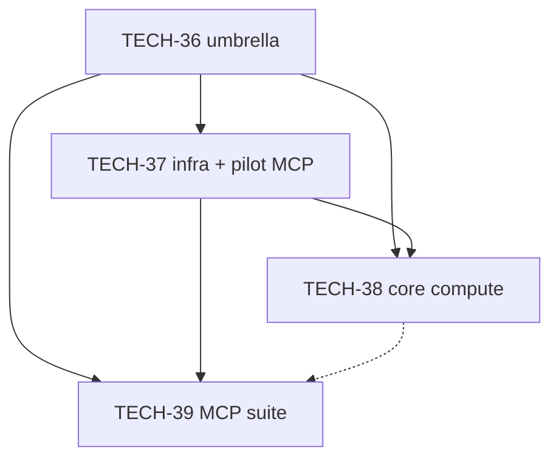

# TECH-36 — Computational program (umbrella)

> **Issue:** [TECH-36](../../BACKLOG.md)
> **Status:** Draft
> **Created:** 2026-04-03
> **Last updated:** 2026-04-04

**Phased delivery (separate backlog issues + project specs):** **Phase A § Completed — TECH-37** ([`BACKLOG.md`](../../BACKLOG.md) **§ Completed** — **glossary** **territory-compute-lib (TECH-37)**); **Phase B:** **[TECH-38](TECH-38.md)** (Unity **core compute** + `tools/` harnesses); **Phase C:** **[TECH-39](TECH-39.md)** (computational **MCP** tool suite).

**Child specs** should keep **`Parent program:` [TECH-36](TECH-36.md)** in the header (see **TECH-38** / **TECH-39**).

**territory-ia retrieval:** `router_for_task` / `glossary_discover` / `glossary_lookup` — align tool copy and **compute-lib** DTOs with **glossary** rows and slices below (not ad-hoc synonyms).

| Domain | Canonical terms (glossary → spec) |
|--------|-------------------------------------|
| World ↔ grid | **World ↔ Grid conversion** — **geo** §1.1, §1.3 |
| Growth bias | **Urban centroid**, **urban growth rings** — **sim** §Rings (`simulation-system.md` — urban centroid and growth rings) |
| Path preview vs commit | **Pathfinding cost model** — **geo** §10; committed **street** / **road stroke** uses **road validation pipeline** (**geo** §13.1–§13.2) and **road preparation family** ending in **PathTerraformPlan** — **roads-system.md**; vocabulary **geo** §14.5 (**wet run**, **bridge lip**, **Chebyshev distance**, …) |
| Water math | **Surface height (S)**, **water body**, **open water** — **geo** §11.1, §11.2 |
| Init / interchange | **Geography initialization**, **`geography_init_params`** — **JSON program (TECH-21)** **§ Completed**; **persistence-system.md**; do not change on-disk **Save data** unless an issue explicitly requires it |
| Scoring | **Desirability** — **managers-reference.md** (Demand / desirability); distinct from **geo** §10 edge costs for **AUTO** (see §3.2) |

## 1. Summary

This file is the **program charter** for **TECH-36**. **Phase A** (**TECH-37**) is **§ Completed**; remaining executable work lives in **TECH-38**–**TECH-39** ([`.cursor/projects/TECH-38.md`](TECH-38.md), [`.cursor/projects/TECH-39.md`](TECH-39.md)). The program aligns **build-time** / **run-time** **computational** code with **reference specs** and gives **IA** agents **MCP** surfaces that use **glossary** vocabulary — without a second **road** or **pathfinding** authority.

**Authority:** **C#** / **Unity** remain authoritative for **grid** truth, **HeightMap** / **Cell.height** pairing, **water map**, and legality of committed **road** work. **`tools/compute-lib/`** holds **TypeScript** types, **Zod** schemas, and **pure** **Node** functions only when verified (**golden** vectors from **Unity** **batchmode** exports or trivial **geo** §1 formulas). See §6 for cross-cutting **invariants** implementers must not violate when extracting or calling **grid** APIs.

## 2. Goals and Non-Goals

### 2.1 Goals

1. **Phased delivery** with clear **Acceptance** per child issue (**TECH-37**, **TECH-38**, **TECH-39**) and traceability from this charter to those specs.
2. **Shared vocabulary** across **MCP** tool descriptions, **compute-lib** contracts, and **reference specs** (glossary table names: **road stroke**, **urban growth rings**, **surface height (S)**, etc.).
3. **Testable boundaries**: **pure** math and previews in **Node** / **compute-lib** where proven; **no** silent divergence from **Unity** for **heavy** or **stateful** results (**TECH-28** pattern: **batchmode** → **JSON** → tools).
4. **FEAT-46** / **FEAT-47** / **FEAT-48** remain **backlog-backed** product tracks; **TECH-38** supplies **multipolar**-ready **ring** math and optional **volume** / **S** helpers **behind tests** so later **FEAT-** work can swap data structures without rewriting algorithms inside **MonoBehaviour** **managers**.

### 2.2 Non-Goals

1. Shipping **FEAT-46** / **FEAT-47** / **FEAT-48** player-facing rules as part of **TECH-36** (charter only references them).
2. Replacing **IA** document tools (**`spec_section`**, **`glossary_lookup`**, **Postgres** / **TECH-18**) or conflating **TECH-59** (**Editor** export registry staging on **MCP**) with the **compute-lib** program — see §5.3.
3. Introducing a second source of truth for committed **road** placement (must stay on **road preparation family** + **geo** rules — **invariants**).

## 3. Resolved decisions (product + architecture)

### 3.1 Geography authoring and parameter dashboard

**Direction (product):** The game plan includes an **editor** / in-game **geography** authoring flow for **territory** / **urban** area **maps**, with **isometric** terrain logic exposed through a **control panel** (e.g. **map** size, **water** share, **forests**, **height** / hills, **sea** / **river** / **lake** mix, and related knobs). The same parameter model and code paths should be **reusable** for future **player** tools and **AUTO** systems (**terraform**, **basin** / **elevation** edits, **forests**, **water bodies** in **depressions**).

**Tracking:** **[FEAT-46](../../BACKLOG.md)** (backlog only — no project spec until prioritized). **TECH-37**/**TECH-38** supply **pure** helpers and harness **JSON**; **JSON program (TECH-21)** **§ Completed** (**TECH-40** / **TECH-41** / **TECH-44a**; **glossary**) owns **schema**/**artifact** policy and **Geography initialization** **DTO** files that **FEAT-46** can bind to UI later.

### 3.2 Desirability, pathfinding, and multipolar growth

**Desirability poles vs roads:** **Desirability** fields (industrial **sites**, services, **parks**, new **street** links, **regional map** connections) may use **grid**-based decay (e.g. **Chebyshev** or **Manhattan** distance) for **scoring** and **AUTO** **zoning** *candidates*. That **scoring** **does not** have to match the **pathfinding cost** model (**geo** §10) on a cell-by-cell basis.

**AUTO road commit:** Any **committed** **street** / **road stroke** must still go through the **road preparation family** and **geo** §10 **pathfinding cost** rules — **not** a substitute cost function derived only from **desirability**.

**Multipolar urban structure:** Refactor **UrbanCentroidService** / **urban growth rings** toward **multiple** **urban centroids** (poles), each with its own **ring** field, shared **AUTO** patterns on the **map**, and long-term **connurbation** between distinct urban masses (**glossary** **Multipolar urban growth**). **Simulation** and **glossary** updates belong to a dedicated product issue when scheduled.

**Tracking:** **[FEAT-47](../../BACKLOG.md)** (**multipolar** **rings** + **connurbation**); coordinates with **FEAT-43** (single-centroid **ring** tuning). **TECH-38** extracts **ring** / distance **math** into **pure** helpers so **FEAT-47** can swap data structures without rewriting algorithms in **MonoBehaviour** **managers**.

### 3.3 Water “fluid” scope (volume / surface height)

**Not** full 3D **fluid** dynamics. **Target model:** **Volume budget** per **water body** (or connected component): when the player **terraform**s a **cell** **Moore**-adjacent to **open water** into a lower **basin**, **fill** propagates (with optional **isometric** directional **animation**); when **basin** capacity grows, **surface height (S)** may **drop** to conserve volume; **rendering** updates **water** prefab vertical placement — **not** animated **S** changes, which can **expose** or **cover** **terrain** / **islands** inside the **basin**. Full **game** rules roll out under future **FEAT-** work and **geo** / **water-terrain** spec amendments.

**Tracking:** **[FEAT-48](../../BACKLOG.md)**; related **FEAT-40**, **FEAT-41**, **FEAT-39**. **TECH-38** may add **pure** volume/**S** helpers **only** behind tests — no player-facing behavior without **FEAT-48**.

### 3.4 Tooling (resolved)

| Topic | Decision |
|-------|----------|
| Split issues | **TECH-37**, **TECH-38**, **TECH-39** are separate **BACKLOG** rows with separate **project specs**. |
| **Unity** vs **Node** authority | **C#** is **authoritative** for **grid**, **HeightMap**, **water map**, and **path** legality. **`tools/compute-lib/`** holds shared **TypeScript** types, **Zod** schemas, and **pure** **Node** functions **only** when verified by **golden** vectors from Unity **batchmode** exports or trivial **geo** §1 formulas. **Heavy** previews → Unity **batchmode** → **JSON** → MCP (see **TECH-28** — completed, [`BACKLOG-ARCHIVE.md`](../../BACKLOG-ARCHIVE.md)). |
| Repo layout | New package root: **`tools/compute-lib/`** (own `package.json`, tests). **`tools/mcp-ia-server/`** depends on it via `file:` or workspace protocol. |
| **MCP** tool shape | **Many** **`snake_case`** **`registerTool`** entries; shared implementation in **compute-lib** — no single opcode **dispatcher** as default. |

## 4. Dependency graph

**Order (from [`BACKLOG.md`](../../BACKLOG.md)):** **TECH-37** completes before **TECH-38** and **TECH-39**. **TECH-39** may ship tool shells after **TECH-37** with honest **NOT_AVAILABLE** (or equivalent) until **TECH-38** **batchmode** / **golden** **JSON** exists for **heavy** tools.

## 5. Spec anchors and related backlog

### 5.1 Reference specs (umbrella scope)

Child issues list concrete **Files**; this charter expects contributors to load slices via **territory-ia** (`spec_section` / `spec_sections`) rather than duplicating normative text:

| Spec | Why |
|------|-----|
| [`isometric-geography-system.md`](../specs/isometric-geography-system.md) | **Grid** math, **pathfinding cost**, **water** / **S**, **road** vocabulary (**geo** §14.5) |
| [`simulation-system.md`](../specs/simulation-system.md) | **Urban centroid** and **urban growth rings** (**sim** §Rings) |
| [`roads-system.md`](../specs/roads-system.md) | **Road** placement pipeline, validation, resolver (complements **geo** §9, §13) |
| [`water-terrain-system.md`](../specs/water-terrain-system.md) | **Height** model and **water** layering (with **geo** §2–§5, §11–§12) |
| [`managers-reference.md`](../specs/managers-reference.md) | **Desirability** / demand surfaces |
| [`persistence-system.md`](../specs/persistence-system.md) | **Load** pipeline, **Save data** semantics — avoid changing interchange unless the issue requires it |

### 5.2 Coordination: **TECH-60** (completed)

**TECH-60** **§ Completed** — **glossary** **territory-ia spec-pipeline program (TECH-60)** — lists **TECH-37** / **TECH-38** as **prerequisites** for **test contracts**, **golden** **JSON**, and **invariant** checks. Use that program’s exploration doc and **BACKLOG** **§ Completed** row when aligning **verify** / **CI** expectations.

### 5.3 Sibling: **TECH-59** (same MCP server, different scope)

**[TECH-59](../../BACKLOG.md)** stages **Editor** export registry payload (**BACKLOG** issue id + JSON documents) on **territory-ia**. It shares **`tools/mcp-ia-server/`** but is **not** a phase of **TECH-37**–**TECH-39**; coordinate **README** / **`docs/mcp-ia-server.md`** edits when both lanes touch registration or **verify** scripts.

### 5.4 Research (non-blocking)

**TECH-32**, **TECH-35** — **`Depends on: none`** in **BACKLOG**; follow **TECH-38** in practice when comparing **RNG** / **invariant** surfaces to extracted **pure** modules.

## 6. Cross-cutting invariants (implementers)

Do not violate [`.cursor/rules/invariants.mdc`](../rules/invariants.mdc). Highlights for this program:

- **`HeightMap[x,y]`** and **`Cell.height`** stay in sync on every write.
- **Road** changes → **`InvalidateRoadCache()`** after modifications.
- **Placing** a **road** → **road preparation family** (never **`ComputePathPlan`** alone).
- **New** **grid** logic → not inside **`GridManager`** if it is a new responsibility — extract helpers (**invariants**).
- **Water** placement/removal → **`RefreshShoreTerrainAfterWaterUpdate`** where applicable.
- **No new singletons**; **no** **`FindObjectOfType`** in **`Update`** — **Unity** patterns per **`unity-development-context.md`**.

## 7. Implementation Plan (umbrella roll-up)

Execute detailed steps in each child spec’s **Implementation Plan**. This umbrella checklist is the **program-level** gate:

| Phase | Issue | Outcome |
|-------|-------|---------|
| A | **TECH-37** | **`tools/compute-lib/`**, **Zod**/**TS** shared layer, **`npm`** tests, one pilot **`registerTool`** (e.g. **World ↔ Grid**), **`file:`** (or workspace) wire to **`mcp-ia-server`**, **docs** updated |
| B | **TECH-38** | **Behavior-preserving** **C#** extractions; **batchmode** / **golden** **JSON** hooks; **UrbanGrowthRingMath** (or equivalent) **multipolar**-ready; **no** second **pathfinding** authority |
| C | **TECH-39** | **Computational** **`snake_case`** tool family in **compute-lib** + thin handlers; **NOT_AVAILABLE** / documented stubs until **TECH-38** data exists where required |

**Closeout:** When all three children are **Completed** (user-verified per **AGENTS.md**), migrate durable **Decision Log** / **Lessons** from child specs per **[`project-spec-close`](../skills/project-spec-close/SKILL.md)**, then move **TECH-36** to **Completed** using the umbrella **Acceptance** below.

## 7b. Test Contracts (umbrella)

| Acceptance / goal | Check type | Command or artifact | Notes |
|-------------------|------------|---------------------|-------|
| Child issues meet **BACKLOG** **Acceptance** | Manual / spec review | **TECH-37**, **TECH-38**, **TECH-39** project specs §Acceptance | Program gate for **TECH-36** |
| **MCP** package healthy when tools change | **Node** | `npm run verify` under `tools/mcp-ia-server/` | As listed on child rows |
| **IA** index / fixture drift (when touching indexed docs, **glossary**, or MCP parsers) | **Node** | **`npm run validate:all`** (root) or **[`project-implementation-validation`](../skills/project-implementation-validation/SKILL.md)** | Optional but recommended after substantive **TECH-** / MCP work |
| **Golden** **JSON** parity (**TECH-37** / **TECH-38**) | **Node** + **Unity** export | Child spec **Test Contracts** / **BACKLOG** **Notes** | Align with **TECH-60** prerequisites |

## 8. Acceptance (umbrella)

**TECH-36** is satisfied when **TECH-37** **§ Completed** and **TECH-38** and **TECH-39** each meet the **Acceptance** listed in [`BACKLOG.md`](../../BACKLOG.md) for those issues.

## 9. Decision Log

| Date | Decision | Rationale |
|------|----------|-----------|
| 2026-04-03 | Single mega-spec split into **TECH-37**–**TECH-39** | Parallel planning + clearer ownership |
| 2026-04-03 | **`tools/compute-lib/`** | User direction; isolates testable **TS** from MCP server glue |
| 2026-04-03 | **C#** authoritative for sim geometry | Avoid desync with **invariants** |
| 2026-04-03 | **FEAT-46** / **FEAT-47** / **FEAT-48** backlog-only | Product scope outside **TECH-36** implementation |
| 2026-04-04 | Charter enriched: spec anchors, umbrella **§7**/**§7b**, **TECH-59**/**TECH-60** cross-links, invariants preflight | **Kickoff** alignment with **PROJECT-SPEC-STRUCTURE** and **territory-ia** vocabulary |
| 2026-04-04 | **TECH-37** **§ Completed** — project spec removed; **IA** in **glossary** **territory-compute-lib (TECH-37)**, geo §1.3, **ARCHITECTURE.md** | **`/project-spec-close`** |

## 10. Open Questions

**None** for this charter’s **tooling** and **architecture** scope — product nuance for **multipolar** **urban growth rings**, **geography** authoring, and **water** **volume** / **S** behavior remains in **FEAT-47** / **FEAT-46** / **FEAT-48** and **reference spec** updates when those issues start (use **Open Questions** there for **game logic** only).
