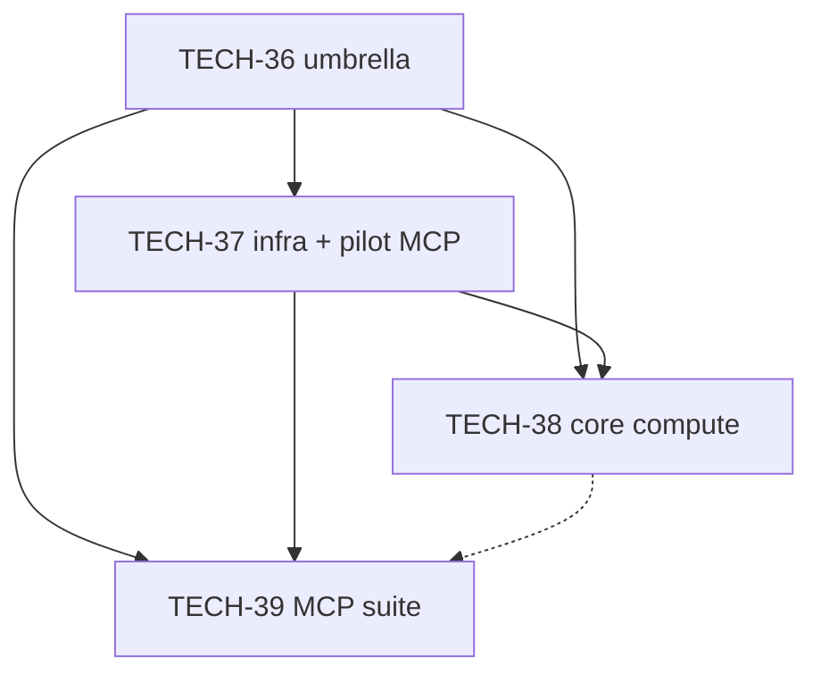

# TECH-36 — Computational program (umbrella)

> **Issue:** [TECH-36](../../BACKLOG.md)
> **Status:** Draft
> **Created:** 2026-04-03
> **Last updated:** 2026-04-03

**Phased delivery (separate backlog issues + project specs):** **[TECH-37](TECH-37.md)** (infrastructure + pilot MCP), **[TECH-38](TECH-38.md)** (Unity **core compute** + `tools/` harnesses), **[TECH-39](TECH-39.md)** (computational **MCP** tool suite).

**territory-ia:** `router_for_task` / `glossary_discover` — **World ↔ Grid conversion**, **Pathfinding cost model**, **Urban growth rings**, **Urban centroid**, **Water body**, **Surface height (S)**, **Geography initialization**, **Desirability**.

## 1. Summary

This file is the **program charter** for **TECH-36**. Executable work lives in **TECH-37**–**TECH-39**. The program aligns **build-time** / **run-time** **computational** code with **reference specs** and gives **IA** agents **MCP** surfaces that use **glossary** vocabulary — without a second **road** or **pathfinding** authority.

## 2. Resolved decisions (product + architecture)

### 2.1 Geography authoring and parameter dashboard

**Direction (product):** The game plan includes an **editor** / in-game **geography** authoring flow for **territory** / **urban** area maps, with **isometric** terrain logic exposed through a **control panel** (e.g. **map** size, **water** share, **forests**, **height** / hills, **sea** / **river** / **lake** mix, and related knobs). The same parameter model and code paths should be **reusable** for future **player** tools and **AUTO** systems (**terraform**, **basin** / **elevation** edits, **forests**, **water bodies** in **depressions**).

**Tracking:** **[FEAT-46](../../BACKLOG.md)** (backlog only — no project spec until prioritized). **TECH-37**/**TECH-38** supply **pure** helpers and harness **JSON**; **JSON program (TECH-21)** **§ Completed** (**TECH-40** / **TECH-41** / **TECH-44a**; **glossary**) owns **schema**/**artifact** policy and **Geography initialization** **DTO** files that **FEAT-46** can bind to UI later.

### 2.2 Desirability, pathfinding, and multipolar growth

**Desirability poles vs roads:** **Desirability** fields (industrial **sites**, services, **parks**, new **street** links, **regional map** connections) may use **grid**-based decay (e.g. **Chebyshev** or **Manhattan** distance) for **scoring** and **AUTO** **zoning** *candidates*. That **scoring** **does not** have to match **A*** **pathfinding cost** edge-for-edge.

**AUTO road commit:** Any **committed** **street** / **road stroke** must still go through the **road preparation family** and **geo** §10 **pathfinding cost** rules — **not** a substitute cost function derived only from **desirability**.

**Multipolar urban structure:** Refactor **UrbanCentroidService** / **urban growth rings** toward **multiple** **urban centroids** (poles), each with its own **ring** field, shared **AUTO** patterns on the **map**, and long-term **connurbation** between distinct urban masses. **Simulation** and **glossary** updates belong to a dedicated product issue when scheduled.

**Tracking:** **[FEAT-47](../../BACKLOG.md)** (multipolar **rings** + **connurbation**); coordinates with **FEAT-43** (single-centroid **ring** tuning). **TECH-38** extracts **ring** / distance **math** into **pure** helpers so **FEAT-47** can swap data structures without rewriting algorithms in **MonoBehaviour** **managers**.

### 2.3 Water “fluid” scope (volume / surface height)

**Not** full 3D **fluid** dynamics. **Target model:** **Volume budget** per **water body** (or connected component): when the player **terraform**s a **cell** **Moore**-adjacent to **open water** into a lower **basin**, **fill** propagates (with optional **isometric** directional **animation**); when **basin** capacity grows, **surface height (S)** may **drop** to conserve volume; **rendering** updates **water** prefab vertical placement — **not** animated **S** changes, which can **expose** or **cover** **terrain** / **islands** inside the **basin**. Full **game** rules roll out under future **FEAT-** work and **geo** / **water-terrain** spec amendments.

**Tracking:** **[FEAT-48](../../BACKLOG.md)**; related **FEAT-40**, **FEAT-41**, **FEAT-39**. **TECH-38** may add **pure** volume/**S** helpers **only** behind tests — no player-facing behavior without **FEAT-48**.

### 2.4 Tooling (resolved)

| Topic | Decision |
|-------|----------|
| Split issues | **TECH-37**, **TECH-38**, **TECH-39** are separate **BACKLOG** rows with separate **project specs**. |
| **Unity** vs **Node** authority | **C#** is **authoritative** for **grid**, **HeightMap**, **water map**, and **path** legality. **`tools/compute-lib/`** holds shared **TypeScript** types, **Zod** schemas, and **pure** **Node** functions **only** when verified by **golden** vectors from Unity **batchmode** exports or trivial **geo** §1 formulas. **Heavy** previews → Unity **batchmode** → **JSON** → MCP (see **TECH-28** — completed, [`BACKLOG-ARCHIVE.md`](../../BACKLOG-ARCHIVE.md)). |
| Repo layout | New package root: **`tools/compute-lib/`** (own `package.json`, tests). **`tools/mcp-ia-server/`** depends on it via `file:` or workspace protocol. |
| **MCP** tool shape | **Many** **`snake_case`** **`registerTool`** entries; shared implementation in **compute-lib** — no single opcode **dispatcher** as default. |

## 3. Dependency graph

## 4. Acceptance (umbrella)

**TECH-36** is satisfied when **TECH-37**, **TECH-38**, and **TECH-39** each meet the **Acceptance** listed in `BACKLOG.md` for those issues.

## 5. Decision Log

| Date | Decision | Rationale |
|------|----------|-----------|
| 2026-04-03 | Single mega-spec split into **TECH-37**–**TECH-39** | Parallel planning + clearer ownership |
| 2026-04-03 | **`tools/compute-lib/`** | User direction; isolates testable **TS** from MCP server glue |
| 2026-04-03 | **C#** authoritative for sim geometry | Avoid desync with **invariants** |
| 2026-04-03 | **FEAT-46** / **FEAT-47** / **FEAT-48** backlog-only | Product scope outside **TECH-36** implementation |

## 6. Open Questions

None — product direction for this charter is resolved above; remaining **game** detail is owned by **FEAT-46** / **FEAT-47** / **FEAT-48** and **reference specs** when those issues start.
