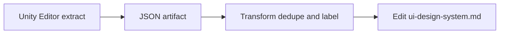

# TECH-68 — As-built UI documentation (`ui-design-system.md`)

> **Issue:** [TECH-68](../../BACKLOG.md)
> **Parent program:** [TECH-67](TECH-67.md) (**UI-as-code program** umbrella)
> **Status:** Draft
> **Created:** 2026-04-04
> **Last updated:** 2026-04-07 (delivery rhythm: big-bang **Editor** code → **Unity** export gate → persist spec)

<!--
  Structure guide: ../projects/PROJECT-SPEC-STRUCTURE.md
  Use glossary terms: ../specs/glossary.md (spec wins if glossary differs).
-->

## 1. Summary

**`.cursor/specs/ui-design-system.md`** must describe the **shipped** in-game **UI** as it exists today — whether or not that UI was built as a formal “design system.” **UI** spans **multiple Unity scenes** (today e.g. **`MainMenu.unity`** for front-end flow and **`MainScene.unity`** for the **city** view / **HUD**; in the future e.g. **`RegionScene`** or a rename **`MainScene` → `CityScene`**). This issue delivers an **as-built** pass per **tracked scene**: **colors**, **typography** (font assets, sizes), **spacing** and **margins**, **Canvas** / **RectTransform** anchoring, **toolbar** / **menu** placement, **popup** flows, representative **player-facing strings**, and **Canvas Scaler** settings. **Machine-readable exports** must carry **`scene_asset_path`** (or equivalent) so agents can tell which **Canvas** path belongs to which scene. The result is the **baseline** reference before **target-state** refactors (**TECH-07**, component library work, etc.).

**Closure definition:** When **TECH-68** is complete, **`ui-design-system.md`** is the **persisted** carrier of that truth (tables + prose in **§1–§4** and major **§2–§3**). Intermediate artifacts (JSON exports under `tools/reports/`, optional **Postgres** rows) are **inputs** to the transform step, not a substitute for the reference spec.

### 1.1 Parent program, IA, and vocabulary

- **Umbrella:** [TECH-67](TECH-67.md) (**UI-as-code program**). **TECH-67** **Phase 1** maps to **§7** **Phases 0–5** below; satisfying **§8** here satisfies the umbrella’s first **Phase 1** gate for **as-built** documentation.
- **Glossary:** **UI design system (reference spec)** (`ui-design-system.md`); **UI-as-code program (TECH-67)**. New **UI** **BACKLOG** rows should cite **`ui-design-system.md`** **§5** (*Acceptance criteria per issue*) after this baseline lands.
- **territory-ia:** **`.cursor/rules/agent-router.mdc`** — **UI changes** → **`ui-design-system`**. Prefer **`router_for_task`** + **`spec_section`** (`spec`: **`ui`**) over loading full reference specs.
- **Program inventory:** authoritative narrative inventory in [TECH-67](TECH-67.md) **§4.4**; this issue **updates** it when audits change hierarchies (**§7** Phase 4, **§8** last bullet).
- **Guardrails:** [TECH-67](TECH-67.md) **§2.3** applies if implementation touches runtime **UI** **C#**; default **TECH-68** work is **Editor** export + Markdown (**§2.3** below).

### 1.2 Preferred delivery rhythm (code vs human vs Markdown)

**§7** keeps **per-phase** checklists for traceability. In practice many teams collapse work into **three** blocks:

| Block | **§7** phases | Who typically acts | Outcome |
|-------|----------------|---------------------|---------|
| **A — Code (often one “big bang”)** | **0 + 1** | IDE agent / developer in repo | **Allowlist**, caps, **Editor** **`MenuItem`**, DTOs, **`JsonUtility`** (or approved) output shaped like **§5.5**; optional **Postgres** / **`register-editor-export.mjs`** (**§5.7**). **One PR** or one focused session is fine. |
| **B — Human gate in Unity** | *(between A and C)* | Developer with **Unity** | Project compiles; run **Territory Developer → Reports → Export UI Inventory (JSON)** (or final menu name); **Console** clean; **`scenes[]`** complete and file **bounded**. Agent cannot click **Unity** menus — share `tools/reports/ui-inventory-*.json` (or key excerpts) when ready. |
| **C — Persist spec + IA** | **2 + 3 + 4** | IDE agent / developer | **Transform** JSON → **`ui-design-system.md`** (**§1–§4**, **§2–§3**); **Play Mode** spot-checks; sync [TECH-67](TECH-67.md) **§4.4** if hierarchy/roles changed; `npm run generate:ia-indexes -- --check` and `validate:dead-project-specs` as needed. |
| **D — Optional** | **5** | Team choice | Schema / fixture / second-pass **prefab** export (**§6** approves cost). |

**Rule of thumb:** Do **not** treat **`ui-design-system.md`** as the final **as-built** record until **Block B** has produced a **trusted** export (unless **§6** records a **waiver** and **§9** holds a manual audit checklist per **§8**).

## 2. Goals and Non-Goals

### 2.1 Goals

1. Replace **TBD** placeholders in **`ui-design-system.md`** **§1–§4** (and **§2** / **§3** where applicable) with **as-built** tables and prose sourced from **all UI-bearing scenes** (at minimum **`MainMenu.unity`** and **`MainScene.unity`** — or their renamed successors such as **`CityScene`**), shared **prefabs**, **`UIManager`** (city scene), and listed **controllers**.
2. Clearly label content as **As-built (current)** vs **Target (planned)** where the spec already describes a future layout (e.g. **§3.3** **ControlPanel**).
3. Sync [TECH-67](TECH-67.md) **§4.4** **Codebase inventory** if hierarchy or file roles change during the audit.
4. Leave **`ui-design-system.md`** in a state where **territory-ia** `spec_section` and **BACKLOG** **Spec sections** describe **reality**, not only aspirations.
5. **Implement or adopt** a repeatable **extract → transform → persist** path (see **§5**), so future UI changes can refresh the spec without reinventing the process.

### 2.2 Non-Goals (Out of Scope)

1. Implementing **TECH-07** (**ControlPanel** layout migration) — document **current** layout first; target layout stays in spec as **Target** unless this issue explicitly records “still legacy.”
2. Introducing a new **runtime UI kit** or **Editor** scaffold tools (later **TECH-67** children).
3. Changing gameplay rules or **Simulation** behavior (presentation and **UX** documentation only).

### 2.3 Implementation guardrails (Editor + docs default)

- **Editor export** lives under `Assets/Scripts/Editor/` — **no** **Player** / runtime **asmdef** may reference **Editor** assemblies (**§5.3**). Follow **`unity-development-context.md`** **§10** for **Reports** menu conventions and `tools/reports/` fallbacks vs **Postgres** (**Editor export registry** — **§5.7**).
- **Persistence:** **UI inventory** JSON and **Agent**-style exports are **not** **Save data**; do not treat them as **`persistence-system.md`** **Load pipeline** artifacts unless a future issue explicitly scopes that (**TECH-67** **§5.2** umbrella boundary).
- **Runtime code:** avoid drive-by refactors of **`UIManager`** / controllers; if a small change is required to unblock documentation, obey **`.cursor/rules/invariants.mdc`** (e.g. **no `FindObjectOfType` in `Update`**).
- **IA hygiene:** after editing this spec’s **BACKLOG** **`Spec:`** targets or cross-links: `npm run validate:dead-project-specs` (repo root).

## 3. User / Developer Stories

| # | Role | Story | Acceptance criteria |
|---|------|-------|---------------------|
| 1 | Developer | I want the reference spec to match what players see so that I do not fight outdated **TBD** rows. | **§1–§4** populated with **as-built** values or explicit “inherit from parent / theme default” notes. |
| 2 | IDE agent | I want **`spec_section`** on **UI** to return actionable layout and typography facts. | Spec sections cite **scene** context (menu vs city vs future region), **Canvas** paths, scaler mode, and primary font sizes where used. |
| 3 | Maintainer | I want a clear baseline before **TECH-07** so refactors are diffable against documentation. | **§3.3** states **current** vs **target** layout explicitly. |
| 4 | Maintainer | I want to regenerate a machine-readable UI snapshot after scene edits. | **Editor** menu (or **batchmode**) produces bounded **JSON** with **one block per configured scene asset** (see **§5.5**). |

## 4. Current State

### 4.1 Domain behavior

**`ui-design-system.md`** is **Draft** with mostly **TBD** foundations and pattern stubs. The game has substantial **uGUI** across **more than one scene**: **`MainMenu.unity`**, **`MainScene.unity`** (primary **city** / simulation view; may later rename to **`CityScene.unity`**), plus **`SampleScene.unity`** if it carries player **UI** (otherwise exclude from **TECH-68** scope by policy). Future scenes (e.g. **`RegionScene`**) should be added to the same **allowlist** when introduced. The gap is **documentation fidelity**, not absence of UI.

### 4.2 Systems map

| Area | Pointer |
|------|---------|
| Reference spec to update | `.cursor/specs/ui-design-system.md` |
| **UI-bearing scenes (current repo)** | `Assets/Scenes/MainMenu.unity`, `Assets/Scenes/MainScene.unity` — extend allowlist for **`RegionScene`** / **`CityScene`** rename when shipped |
| Orchestration | `Assets/Scripts/Managers/GameManagers/UIManager.cs` (typically **city** scene; **MainMenu** may use lighter controllers — confirm in audit) |
| Controllers | `Assets/Scripts/Controllers/UnitControllers/`, `GameControllers/` |
| Existing export pattern | `Assets/Scripts/Editor/AgentDiagnosticsReportsMenu.cs` — **Territory Developer → Reports**; `EditorPostgresExportRegistrar` (`KindAgentContext`, …) |
| Program inventory | [TECH-67](TECH-67.md) **§4.4** |
| Umbrella | [`.cursor/projects/TECH-67.md`](TECH-67.md) |
| **BACKLOG `Spec sections` mirror** | **`ui-design-system.md`** **§1–§4**, **§2–§3**; **§3.3** **current** **vs** **target** (**TECH-07**); **`unity-development-context.md`** **§10** when adding **Reports** exports |

### 4.3 Implementation investigation notes

- **Automation is in-scope for TECH-68** if it reduces error and makes re-runs cheap; **manual** Play Mode verification remains useful for **UX** wording and visibility (inactive panels).
- **JsonUtility** (used today for **Agent context**) is sufficient for a **tree of plain DTOs**; avoid `Dictionary<>` in DTOs. For richer shapes later, a small **Node** post-processor or **Newtonsoft** in Editor-only asmdef would be a **Decision Log** item.
- **TECH-33** (prefab manifest / scene **MonoBehaviour** listing) can **complement** but does not replace **RectTransform** / **Graphic** sampling.
- **Multi-scene extract:** In **Editor**, loop over a **configured list** of scene asset paths (serialized in code, **ScriptableObject**, or **EditorPrefs**). For each path: `EditorSceneManager.OpenScene(path, OpenSceneMode.Single)`, sample **Canvas** hierarchies, then emit one **`scenes[]`** entry (see **§5.5**). **Do not** assume the **active scene** at menu click is the only **UI** surface. **batchmode** (future) should accept the same list or read **EditorBuildSettings.scenes** filtered by a allowlist.

### 4.4 Alignment with [TECH-67](TECH-67.md) (umbrella)

| Topic | Umbrella (**TECH-67**) | This issue (**TECH-68**) |
|-------|-------------------------|---------------------------|
| **Codebase inventory** | Owns **§4.4** narrative | **Sync** when audit changes hierarchy (**§7** Phase 4) |
| **Program phase** | **Phase 1** = as-built spec | **§7** Phases **0–5** + **§8** acceptance |
| **Risk / drift** | **§5.4** mitigations | **Extract → transform → persist**; **§5.9** risks |
| **Test contracts** | **§7b** defers **IA** check to child | **§7b** maps to **§8** (below) |
| **After this issue** | **Phase 2** **TECH-07** (soft order) | Document **as-built** **toolbar** before major layout migration |

---

## 5. Proposed design — extract, transform, persist

This section elaborates **how** to land data in **`ui-design-system.md`**: which **Unity** patterns apply in *this* repo, what **infrastructure** to build, and **concrete examples** (illustrative — adjust field names to match implementation).

### 5.1 End state (what “done” looks like)

| Layer | Artifact | Role |
|-------|----------|------|
| **Persisted (authoritative for agents)** | `.cursor/specs/ui-design-system.md` | **As-built** tables in **§1**; **§4.3** **Canvas Scaler**; **§2–§3** per-surface descriptions; **§3.3** **Current** vs **Target**. |
| **Extracted (machine-readable)** | `tools/reports/ui-inventory-{UTC}.json` (gitignored) or **Postgres** `document jsonb` | Bounded snapshot: **`scenes[]`**, each with **`scene_asset_path`** + **`scene_name`**, then **Canvas** roots, hierarchy **paths** (relative to scene), components, colors, font sizes, **LayoutGroup** hints. |
| **Transform** | Human and/or script | Map JSON nodes → glossary-friendly **token** rows; deduplicate colors/fonts; attach **semantic** labels (“HUD money text”, “ControlPanel row 1”). |
| **Optional** | `docs/schemas/ui-inventory.v1.schema.json` + fixture | **CI** `validate:fixtures` — only if the team wants **regression on export shape** (follow **JSON interchange** discipline; not **Save data**). |

### 5.2 Pipeline (three steps)



1. **Extract:** **Editor** script opens each **allowlisted** scene asset (**§4.2** scene list + **§7** Phase 0 checklist), walks agreed **Canvas** roots per scene (**§5.4**), serializes a single JSON payload with **`scenes[]`** (same **Reports** / **Postgres** path as **Agent context**).
2. **Transform:** Developer or agent reads JSON + **`UIManager`** / controllers to name surfaces and merge duplicates into **§1** token tables.
3. **Persist:** Commit **only** `.cursor/specs/ui-design-system.md** (and optional schema/fixture if adopted). JSON under `tools/reports/` stays **gitignored** unless a **golden** fixture is explicitly committed for CI (rare for UI).

**Typical timing:** Implement step **1** (and code from step **2** if any) in **Block A** (**§1.2**); a **human** runs step **1** in **Unity** for **Block B**; step **3** and the narrative **transform** happen in **Block C** after the export is validated.

### 5.3 Infrastructure options (choose one primary; combine if useful)

| Option | Mechanism | Pros | Cons | Example in repo |
|--------|-----------|------|------|-----------------|
| **A — Editor menu (recommended v1)** | `[MenuItem("Territory Developer/Reports/…")]` | Same pattern as **`AgentDiagnosticsReportsMenu`**; works in **Edit Mode** with scene open; uses **`EditorPostgresExportRegistrar.TryPersistReport`** | Requires Unity GUI or scripted Editor open | `AgentDiagnosticsReportsMenu.ExportAgentContext` |
| **B — batchmode** | `Unity -batchmode -executeMethod …` | **CI** / agent headless | Higher setup cost (**TECH-66** lane); scene load path must be deterministic | Deferred unless **TECH-66** already runs project exports |
| **C — Scene YAML grep** | `rg` / parser on `Assets/Scenes/*.unity` | Fast for **names** and **GUID** references across **MainMenu** / **MainScene** / future files | No live **RectTransform** numbers; no resolved **font** asset without GUID lookup | Supplementary only |

**Concrete proposal (v1):** Add **`UiInventoryReportsMenu.cs`** (or extend **`AgentDiagnosticsReportsMenu`** with a third export) under `Assets/Scripts/Editor/`:

- Menu: **`Territory Developer/Reports/Export UI Inventory (JSON)`** (priority e.g. 15 — after **Agent context**, before interchange exports).
- Output: `ui-inventory-{UTC-stamp}.json` via existing registrar (add new **`KindUiInventory = "ui_inventory"`** in **`EditorPostgresExportRegistrar`** when wiring **Postgres**).
- **Player builds:** must not include this code (Editor folder only — already true for **Reports**).

### 5.4 Unity Editor API patterns (real APIs to use)

Walk **only** under nominated roots **within the scene currently open in the export loop** (e.g. all **`Canvas`** roots in that scene, or explicit per-scene paths **`ControlPanel`**, **`HUD`** — configurable map **scene path → root names** in code or **ScriptableObject** later).

| Need | Pattern | Notes |
|------|---------|--------|
| **Open scene for sampling** | `UnityEditor.SceneManagement.EditorSceneManager.OpenScene(assetPath, OpenSceneMode.Single)` | Loop **allowlist**; save dirty prompt: prefer **dirty check** / skip or **Save** policy documented in **Decision Log** |
| **Scene objects** | `SceneManager.GetActiveScene().GetRootGameObjects()` then DFS | After each `OpenScene`, **active scene** equals the allowlisted asset |
| **Canvas + scaler** | `GetComponent<Canvas>()`, `GetComponent<CanvasScaler>()` | Log `renderMode`, `pixelPerfect`, `uiScaleMode`, `referenceResolution`, `matchWidthOrHeight` → **`ui-design-system.md` §4.3** |
| **Layout** | `RectTransform` — `anchorMin`, `anchorMax`, `pivot`, `sizeDelta`, `anchoredPosition` | Optional: classify preset (“stretch-stretch”, “bottom-center”) in transform step |
| **Color** | `Graphic.color` on `Image`, `Text`, **TMP** | Skip fully transparent unless documenting overlays |
| **Legacy text** | `UnityEngine.UI.Text` — `text`, `font`, `fontSize`, `fontStyle`, `alignment` | Common in older UI |
| **TextMeshPro** | `TMPro.TextMeshProUGUI` — `text`, `font`, `fontSize`, `fontStyle`, `alignment` | Use `#if` / reflection only if asmdef does not reference TMP yet — prefer adding **Editor** asmdef reference to **Unity.TextMeshPro** when project uses TMP |
| **Inactive popups** | `GetComponentsInChildren<T>(true)` | **`true`** includes inactive — needed for panels default-disabled |
| **Bounds / depth** | `maxDepth` per branch, `maxNodes` global | Prevent multi-MB JSON; align with **Agent context** bounded sampling philosophy |
| **Prefabs not in scene** | `AssetDatabase.LoadAssetAtPath<GameObject>(…)` | Second-phase export for **popup** prefabs referenced only by code |

**Illustrative extraction snippet** (not drop-in — illustrates patterns):

```csharp
static void SampleGraphic(GameObject go, UiNodeDto node)
{
    var rt = go.GetComponent<RectTransform>();
    if (rt != null)
    {
        node.anchor_min = rt.anchorMin;
        node.anchor_max = rt.anchorMax;
        node.size_delta = rt.sizeDelta;
    }
    var graphic = go.GetComponent<UnityEngine.UI.Graphic>();
    if (graphic != null)
        node.color_rgba = graphic.color;
    var text = go.GetComponent<UnityEngine.UI.Text>();
    if (text != null)
    {
        node.text_sample = Truncate(text.text, 80);
        node.font_size = text.fontSize;
        node.font_name = text.font != null ? text.font.name : null;
    }
}
```

### 5.5 Example JSON envelope (extract output)

**Purpose:** Stable, diff-friendly snapshot. Use **`schema_version`** like other interchange-style payloads. **Top-level `scenes[]`** is required so **MainMenu** vs **city** (and future **RegionScene**) never collide in flat paths.

```json
{
  "artifact": "ui_inventory_dev",
  "schema_version": 1,
  "exported_at_utc": "2026-04-05T12:00:00.0000000Z",
  "unity_version": "2022.3.x",
  "scenes": [
    {
      "scene_asset_path": "Assets/Scenes/MainMenu.unity",
      "scene_name": "MainMenu",
      "canvases": [
        {
          "path": "Canvas",
          "render_mode": "ScreenSpaceOverlay",
          "scaler": {
            "ui_scale_mode": "ScaleWithScreenSize",
            "reference_resolution": { "x": 1920, "y": 1080 },
            "match": 0.5
          },
          "nodes": [
            {
              "path": "Canvas/ContinueButton/Text",
              "active": true,
              "components": ["RectTransform", "Text"],
              "font_size": 22,
              "text_sample": "Continue"
            }
          ]
        }
      ]
    },
    {
      "scene_asset_path": "Assets/Scenes/MainScene.unity",
      "scene_name": "MainScene",
      "canvases": [
        {
          "path": "Canvas",
          "render_mode": "ScreenSpaceOverlay",
          "scaler": {
            "ui_scale_mode": "ScaleWithScreenSize",
            "reference_resolution": { "x": 1920, "y": 1080 },
            "match": 0.5
          },
          "nodes": [
            {
              "path": "Canvas/HUD/PopulationText",
              "active": true,
              "components": ["RectTransform", "Text"],
              "anchor_min": [0, 1],
              "anchor_max": [0, 1],
              "font_size": 18,
              "font_name": "LegacyRuntime",
              "color_rgba": [1, 1, 1, 1],
              "text_sample": "Pop: 1,234"
            }
          ]
        }
      ]
    }
  ],
  "notes": [
    "If MainScene renames to CityScene, scene_asset_path updates; node paths stay under that scene root.",
    "Truncated after max_nodes per scene; see exporter caps."
  ]
}
```

**Implementation note:** Map C# DTOs with `[Serializable]` + **`JsonUtility.ToJson`**. Nested arrays: use wrapper types (e.g. `ListWrapper` pattern) if needed, or flatten `nodes` as a single list with `path` strings.

### 5.6 Example transform → **`ui-design-system.md`** rows

After deduplication, **§1.2 Typography** might gain:

| Style | Font asset | Size | Weight | Usage |
|-------|------------|------|--------|--------|
| **As-built — HUD stat** | `LegacyRuntime.ttf` (or asset path) | 18 | Normal | **`MainScene`** / future **`CityScene`**: `Canvas/HUD/*` population, budget labels |
| **As-built — Main menu CTA** | *TBD* | *TBD* | Normal | **`MainMenu`**: primary menu labels / buttons |
| **As-built — Popup body** | *same or Arial* | 14 | Normal | **`MainScene`**: load game list rows (or shared prefab) |

**§1.1 Color** might gain:

| Token name | Usage | Value / reference |
|------------|--------|-------------------|
| **As-built — HUD label** | Primary stat text | `RGBA(1,1,1,1)` on `Graphic` (**city scene** `Canvas/HUD/...`) |
| **As-built — Panel backdrop** | Modal dim | *sample from `Image` on `PopupOverlay`* |

**§3.3** must keep two explicit bullets:

- **As-built (current):** *from JSON `scenes[]` entry for **city** scene + Play Mode check* — e.g. bottom ribbon, `HorizontalLayoutGroup` on `ControlPanel/…` (**not** **MainMenu**).
- **Target (TECH-07):** left dock, vertical categories — unchanged intent text from backlog.

### 5.7 Alignment with **Editor export registry** (**Postgres**)

If **`DATABASE_URL`** is set, follow **`EditorPostgresExportRegistrar.TryPersistReport`**:

1. Add **`KindUiInventory`** (or reuse a generic **`dev_diagnostic`** only if team prefers fewer kinds — prefer explicit kind for SQL filters).
2. Register in the same **Node** **`register-editor-export.mjs`** path if other kinds are listed there (parity with **TECH-55b**).
3. **Fallback:** file under `tools/reports/` — **gitignored** — same as **Agent context**.

**TECH-59** (**MCP** staging for **EditorPrefs**) helps developers set **`backlog_issue_id`** = **TECH-68** when registering repro bundles — orthogonal but useful workflow glue.

### 5.8 Optional: screenshots

- **Not** required for **TECH-68** acceptance.
- If added: store under `tools/reports/` or `docs/_media/` only if the team accepts binary assets in repo; otherwise keep screenshots **local** / **Postgres** BLOB (unusual). Prefer **structured** spec + optional **Figma**-style references later.

### 5.9 Risks and mitigations

| Risk | Mitigation |
|------|------------|
| Export too large | `maxNodes`, `maxDepth`, whitelist **Canvas** roots |
| Duplicate fonts/colors | Transform step builds **unique** tables for **§1** |
| **TMP** vs **Text** mix | Branch per component type in extractor |
| Inactive **popup** missed | `includeInactive: true` on deep queries |
| **Prefab** variants not in scene | Phase 2: export list from **`UIManager`** serialized refs via **SerializedObject** |
| **Scene rename** (`MainScene` → **`CityScene`**) | **JSON** keys off **`scene_asset_path`**; update allowlist + spec prose in same PR |
| **Forgotten scene** (**MainMenu** omitted) | **Allowlist** in code + **§8** checklist: every shipped **UI** scene appears in **`scenes[]`** |

---

## 6. Decision Log

| Date | Decision | Rationale | Alternatives considered |
|------|----------|-----------|-------------------------|
| 2026-04-04 | First **TECH-67** child is **as-built** documentation (**TECH-68**) | Baseline before **IDE-first** tooling and **TECH-07** | Start with **UI kit** code (rejected) |
| 2026-04-05 | Document **extract → transform → persist** pipeline; **Editor** **Reports** menu as default infrastructure | Matches **`AgentDiagnosticsReportsMenu`**; **Postgres** optional parity | **batchmode**-only (deferred); **YAML**-only (insufficient) |
| 2026-04-06 | **Multi-scene** **UI** inventory: **`scenes[]`** in JSON; allowlist **MainMenu** + **MainScene** (future **`CityScene`** / **`RegionScene`**) | Single-scene export would miss **MainMenu** and break after scene splits/renames | **active_scene_only** export (rejected for program scope) |
| 2026-04-06 | **Codebase inventory** lives under **TECH-67** **§4.4** (retired **`projects/ui-as-code-exploration.md`**) | Single **BACKLOG** **Spec:** target for **IA** links | Separate workbook under **`projects/`** (rejected) |
| 2026-04-06 | **project-spec-kickoff** — **§1.1**, **§2.3**, **§4.4**, expanded **§7**/**§7b** | Match **TECH-67** umbrella mapping; per-phase **deliverables** + **verification** | Single-line **§7** only (rejected) |
| 2026-04-07 | **Big-bang** **Editor** code (**§7** Phases **0–1**) then **human** **Unity** export gate, then **Markdown** persistence (**§7** Phases **2–4**) | IDE agents lack **Unity** UI; spec should not finalize before a valid **`scenes[]`** JSON | Alternate human/agent after every **§7** subsection as default (rejected) |

---

## 7. Implementation Plan

**Umbrella mapping:** [TECH-67](TECH-67.md) **Phase 1** (**as-built** documentation) equals **Phases 0–5** below. **§8** completion is the **gate** before the program’s **Phase 2** (**TECH-07** — **soft** order).

**Execution rhythm:** See **§1.2**. **Phases 0–1** are normally shipped together as **Block A**; **Phases 2–4** follow **Block B** (developer runs export and confirms output). **§7** subsections below stay granular for review and **§7b** mapping — they do **not** require stopping for a human between Phase **0** and Phase **1** unless you want that cadence.

### Phase 0 — Scope roots and caps

**Deliverables**

- [ ] **Allowlist** scene asset paths in export code (or adjacent documented constant): minimum **`Assets/Scenes/MainMenu.unity`**, **`Assets/Scenes/MainScene.unity`**; reserve entries for **`RegionScene`** / **`CityScene`** rename.
- [ ] Policy for **`SampleScene.unity`**: **include** in allowlist only if it ships player-facing **UI**; otherwise **exclude**. If the team disagrees, record the decision in **§6** **Decision Log**.
- [ ] Traversal map: **city** scene — **`Canvas`** roots + **`UIManager`** / hierarchy inspection for **`HUD`**, **`ControlPanel`**, major **popups**; **MainMenu** — **`Canvas`** roots (or explicit root name list). Document ambiguous roots in **§6**.
- [ ] Caps in code: **`maxNodes`** (global and/or per scene), **`maxDepth`**, **`includeInactive`** for disabled **popups** (**§5.4**).

**Verification**

- [ ] Review: allowlist matches every **UI**-bearing scene implied by this issue’s **BACKLOG** **Files** line; export design does **not** depend on “whichever scene was already open.”
- [ ] **Dirty scene policy:** if `OpenScene` would discard edits, document **skip** vs **save** behavior in **§6** (see **§5.4** table).

### Phase 1 — Extract infrastructure

**Deliverables**

- [ ] **Editor** implementation (**§5.3** **Option A**): **`MenuItem`** under **Territory Developer → Reports** (e.g. **Export UI Inventory (JSON)**), **`[Serializable]`** DTOs, **`JsonUtility`** (or approved equivalent) emitting **§5.5** shape: top-level **`scenes[]`**, per-scene **`scene_asset_path`**, **`artifact`** / **`schema_version`** aligned with other **Editor** exports.
- [ ] Optional **Postgres**: register report **kind** + **`EditorPostgresExportRegistrar.TryPersistReport`** (**§5.7**); update **`register-editor-export.mjs`** if the repo lists export kinds for **CI** / ops.
- [ ] **Asmdef:** **Editor** assembly only — **no** runtime reference to export types.

**Verification**

- [ ] Run export on a clean **Editor** session; produce ≥1 `tools/reports/ui-inventory-*.json` (unless **Postgres**-only success path) with **bounded** size; confirm **`scenes[]`** has **one** entry per allowlisted scene.
- [ ] **Unity** **Console** clean after compile.

### Phase 2 — Transform and reference spec **§1** / **§4**

**Deliverables**

- [ ] **`ui-design-system.md`**: **§1.1–§1.3** (**colors**, **typography**, spacing) from JSON + spot-check; **§4.3** **Canvas Scaler** per **UI-bearing** scene (or one table with **Scene** column); **§4.1** naming observations.
- [ ] Traceability: link major token rows to sample **`scenes[]`** paths (inline in spec or short note under **`ui-design-system.md` §6**).

**Verification**

- [ ] Spot-check ≥1 **HUD** element and ≥1 **MainMenu** control against **Editor** hierarchy or **Play Mode**.

### Phase 3 — Reference spec **§2** / **§3**

**Deliverables**

- [ ] **§2** / **§3**: **HUD**, primary **popup** flows (tie to **`PopupType`** / controllers where useful), **§3.3** **ControlPanel** — **as-built (current)** vs **target (TECH-07)**; add **Main menu** subsection (**§3.0** or **§3.6**) if needed.
- [ ] **`ui-design-system.md` — Related files:** extend the table so **MainMenu** and **city** scene assets appear (not only **`MainScene.unity`**).

**Verification**

- [ ] **Play Mode:** **MainMenu** → load **city**; **HUD** / **toolbar** / primary **popups** match spec prose; note **§3.5** where scroll vs **camera** matters.

### Phase 4 — Program inventory + IA

**Deliverables**

- [ ] Update [TECH-67](TECH-67.md) **§4.4** if **Canvas** hierarchy, **`ControlPanel`** structure, or key script roles changed during the audit.
- [ ] `npm run generate:ia-indexes -- --check` after **`ui-design-system.md`** body edits.
- [ ] `npm run validate:dead-project-specs` if **BACKLOG** **`Spec:`** lines or `.cursor/projects/*.md` links were edited.

**Verification**

- [ ] Above **npm** commands exit **0** from repo root.

### Phase 5 — Optional hardening

**Deliverables** (only if **§6** **Decision Log** approves maintenance cost)

- [ ] `docs/schemas/ui-inventory.v1.schema.json` + fixture + `npm run validate:fixtures`.
- [ ] Second-pass export for **prefabs** not in scene (**§5.4** / **§5.9**), e.g. via **`UIManager`** **SerializedObject** refs.

**Verification**

- [ ] Fixture / schema checks pass when adopted.

---

## 7b. Test Contracts

| **§8** acceptance item | Check type | Command or artifact | Notes |
|------------------------|------------|---------------------|-------|
| **§1** foundations **as-built** (no stray **TBD**) | Manual + diff | **`ui-design-system.md`** **§1** | Allow “varies” rows only with listed surfaces |
| **§4.3** / **§4.1** per scene | Manual | **`ui-design-system.md`** **§4** | **MainMenu** + **city** scene |
| **§2** / **§3** surfaces | Manual | **`ui-design-system.md`** **§2–§3** | Match **Play Mode** intent |
| **§3.3** **as-built** vs **target** | Manual | **`ui-design-system.md`** **§3.3** | **TECH-07** target explicit |
| **Extract infrastructure** | Unity + file | **Reports** menu → **JSON**; shape **§5.5** | Waive only with **§6** + **§9** manual checklist |
| **IA** index | Node | `npm run generate:ia-indexes -- --check` | After **`ui-design-system.md`** edits |
| **TECH-67** **§4.4** sync | Manual | [TECH-67](TECH-67.md) **§4.4** | Last **§8** bullet |
| **Spec** link graph | Node | `npm run validate:dead-project-specs` | After `.cursor/projects/` / **BACKLOG** **`Spec:`** edits |
| **Editor** compile | Unity | **Console** clean | **§2.3** — no runtime → **Editor** refs |
| **Fixture** (optional) | Node | `npm run validate:fixtures` | Only if **§5** schema committed |

**Optional bundle:** after **MCP** / **IA** index / **Editor** export code changes, run **`.cursor/skills/project-implementation-validation/SKILL.md`** (**`npm run validate:all`**) from repo root.

**Human gate (Unity):** **Block B** in **§1.2** — no substitute for running **Reports** export locally; agents rely on the developer-supplied **JSON** or workspace path.

---

## 8. Acceptance Criteria

**Suggested closure order:** Satisfy the **Extract infrastructure** bullet (and **Block B** in **§1.2**) in **Unity** before treating the remaining bullets as **final** — i.e. have a **trusted** **`scenes[]`** JSON (or **§6** waiver + **§9** manual audit), then finish **`ui-design-system.md`** and **TECH-67** **§4.4**. All items may still land in **one** **PR** once the export is proven.

- [ ] **`ui-design-system.md`** **§1** (Foundations) documents **as-built** color, typography, and spacing with **no** remaining **TBD** rows **unless** explicitly marked “varies / unconsolidated” with example surfaces listed.
- [ ] **§4.3** **Canvas Scaler** and **§4.1** naming notes reflect **each** **UI-bearing** scene (at minimum **MainMenu** + **city** scene — **`MainScene`** or renamed **`CityScene`**) as inspected, or one table with a **Scene** column.
- [ ] **§2** and **§3** describe **current** **HUD**, **toolbar** / **ControlPanel**, and primary **popup** **UX** flows with enough detail for a new developer to match layout intent.
- [ ] **§3.3** clearly distinguishes **as-built** **vs** **target** **toolbar** layout (**TECH-07**).
- [ ] **Extract infrastructure** delivered: **Editor** menu (or documented alternative) produces bounded **JSON** as in **§5.5** (field names may differ; shape must support **§1–§4** population). *If the team explicitly waives automation, record the waiver in **§6** and require a **manual** audit checklist attachment in **§9** instead.*
- [ ] **`npm run generate:ia-indexes -- --check`** passes.
- [ ] [TECH-67](TECH-67.md) **§4.4** reflects any material hierarchy changes discovered during the audit.

**Related executable issues (spec anchors):**

| Issue | **`ui-design-system.md`** anchor |
|-------|-----------------------------------|
| **TECH-07** | **§3.3** **toolbar** / **ControlPanel** |
| **BUG-19** | **`ui-design-system.md`** **§3.5** — scroll vs **camera** over UI (**§3.2** if scoped to scrollable **popup** content) |
| **BUG-14** | Code hygiene (**`FindObjectOfType`**); cross-check **§6** **Lessons** if patterns surface in **UI** code |

**Success metrics (qualitative — verify at closure):** **§1** token tables deduplicate repeated **Graphic** colors/fonts; **§4.3** lists **Canvas Scaler** per **UI-bearing** scene; **§2–§3** name **Canvas** paths that match **JSON** **`scenes[]`** export; **Play Mode** spot-check **MainMenu** → load **city** confirms **HUD** / **toolbar** descriptions.

---

## 9. Issues Found During Development

| # | Description | Root cause | Resolution |
|---|-------------|------------|------------|
| — | — | — | — |

---

## 10. Lessons Learned

- _Fill at closure; migrate durable bullets to **`ui-design-system.md`** **§6** or **glossary** if needed._

---

## Open Questions (resolve before / during implementation)

None — tooling and documentation scope only. **Player-facing** copy changes belong in **FEAT-**/**BUG-** specs if they alter behavior or text policy. **Investigation** notes (**§4.3**), not **Open Questions**, cover export mechanics (**TMP** vs **Text**, **batchmode**, etc.) — per **`.cursor/projects/PROJECT-SPEC-STRUCTURE.md`**, **Open Questions** target **game logic** in **FEAT-**/**BUG-** specs, not implementation mechanics here.
