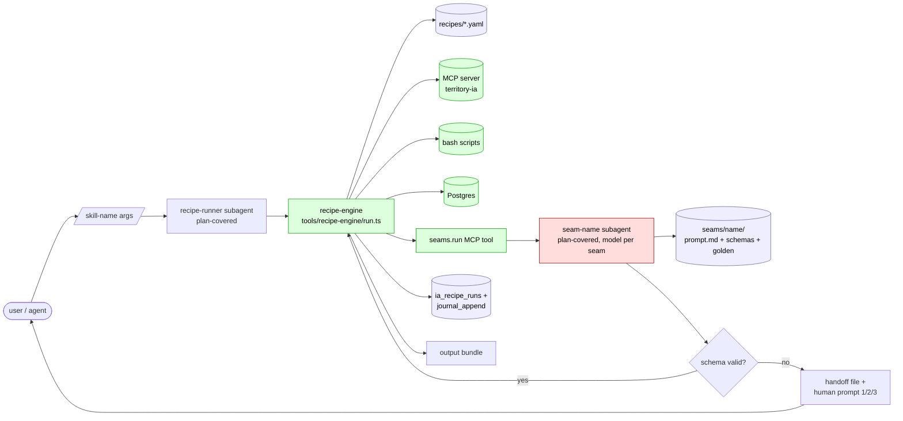

# Agent-as-recipe-runner — abstraction one-pager

Hypothesis: territory-developer agent system = deterministic recipe runner + LLM-as-content-typist at named seams. Cheat-sheet (`docs/human-resume-without-ai.md`) is the recipe spec. Skills automate it. LLM only writes prose nobody else can.

This doc formalizes the abstraction, names the seams, sketches the engine surface, and lays out a migration path from the current skill stack.

---

## Polling decisions (in progress 2026-04-28)

Persisted as decisions land during `/design-explore`. Each row = locked answer + rationale.

| Q | Decision | Rationale |
|---|---|---|
| Q1 — recipe DSL flexibility | **(a) YAML-only for flow** | Forces seams to absorb non-trivial logic. Prevents drift back toward A4 (TS-module recipes). Conditionals wrap in seam returning typed enum/decision; recipe matches with `flow.when`. |
| Q2 — engine home | **(a) Inside MCP server** (`tools/mcp-ia-server/`) | Recipe engine = MCP-tool composer; lives where MCP tools live. Reuses `journal_append` for audit. (b) separate service only wins if engine outlives MCP session — not the case for in-session lifecycle. (c) shell wrapper too thin for seams. |
| Q3 — seam call-out mechanism | **(b) Thin subagent dispatch** | Plan-covered (no API billing). Per-seam model frontmatter preserved → finer granularity than today's per-subagent assignment. Seam-subagents tiny (read input → fill template → write output → exit). Drift gate works via `.claude/agents/seam-*.md` regen from `tools/seams/{name}/` registry. (a) SDK direct burns API tokens not on plan. (d) inline main-session loses model granularity (one model per session). |
| Q4 — backwards compat strategy | **(b) Coexistence during PR window only — no soak counter** | Per-skill recipify lands as one PR. Old SKILL.md + `.claude/agents/{name}.md` removed in same PR once recipe verifies green on golden tests + first live run. No N-run wait, no `--legacy` flag persistence. Keeps drift gate clean; forces recipe to be PR-ready before merge. |
| Q5 — seam failure mode | **(d) Escalate to human immediately, no auto-retry** | On output schema-validation fail OR LLM refusal: recipe pauses, engine writes seam I/O + validation error to handoff file, prints structured prompt to main session: (1) agent fixes in place + resume, (2) accept current output as-is + continue, (3) abort recipe. No auto-retry — agent already knows the fix; auto-retry wastes a model turn. State resume-able from journal — escalation never loses progress. |

**All polling closed.** Ready for Phase 3+ (Components / Architecture / Subsystem impact / Implementation points / Examples).

**Cross-plan finding (2026-04-28):** db-lifecycle-extensions master plan (DEC-A18 locked) is **layered below** recipe-runner, not competing. db-lifecycle adds 10 deterministic MCP primitives (`task_batch_insert`, `master_plan_health`, `stage_decompose_apply`, `intent_lint`, etc.) — all consumed as `mcp.*` recipe steps. Build order: db-lifecycle Stages 1→3 first, recipe-runner Phases A→D after. ~16% overlap (3 of 18 db-lifecycle tasks edit SKILL bodies which recipify later supersedes — acceptable; tactical wins ship now, recipe migration absorbs naturally).

**Cross-plan convergence (2026-04-29):** parallel-carcass exploration (`docs/parallel-carcass-exploration.md`) Wave 0 Phase 3 (skill surface edits — `section-claim` NEW, `section-closeout` NEW, `master-plan-new` ext, `stage-decompose` ext, `ship-stage` ext) **early-binds Phase E of this plan**. Same target skills, same surface — different motivations. Parallel-carcass Phase 3 ships as recipify-and-extend, not edit-and-extend. Buys recipe-runner first heavy-LLM dogfood on hot-path skills; buys parallel-carcass a recipe-shaped Phase 3 PR set with golden harness regression net. Sequence: engine regression test (deferred DEC-A19 Task #2 candidate) → `section-claim`/`section-closeout` recipes (0 seams, low risk) → `master-plan-new` Phase A recipe (0 seams) → `stage-decompose` ext (1 seam — `decompose-skeleton-stage`) → `ship-stage` ext (Pass A/B hooks recipify; verify-loop subagent body remains keeper per Phase F). See §K diagram below + parallel-carcass §6.3.

---

## 0. Approaches surveyed

Five competing shapes for "abstract the agent stack into recipe + seams." Listed roughly by ambition (low → high).

### A1 — Status quo + better docs

Keep current skill / subagent / MCP stack. Improve `docs/MASTER-PLAN-STRUCTURE.md`, `docs/agent-lifecycle.md`, cheat-sheet. Codify the "deterministic vs LLM" split as documentation only. No new code, no migration.

- **Pro:** zero risk, zero churn, leverages existing investment.
- **Con:** drift between SKILL.md prose and runtime behavior remains; `validate:skill-drift` keeps firing; LLM still orchestrates procedural chains.

### A2 — Extract seams only (no recipe engine)

Identify the 5 named LLM seams. Wrap each as MCP tool: `seam_author_spec_body`, `seam_author_plan_digest`, etc. Each seam carries JSON-Schema input/output + golden tests. Subagents stay; they call seam MCP tools instead of inlining prompts. No recipe DSL, no engine.

- **Pro:** small surface, testable seams, model swap-able per seam, no new runtime.
- **Con:** procedural flow still encoded in prose SKILL.md + subagent prompts; drift gate still needed; ~60% LLM token reduction not realized.

### A3 — YAML recipe DSL + minimal interpreter

YAML recipes for deterministic skills (`stage-file`, `release-rollout-track`, `plan-applier`). Interpreter (~500 LOC TS) lives inside MCP server. Step kinds: `mcp.*`, `bash.*`, `sql.*`, `seam.*`, `gate.*`, `flow.*`. Subagent shell shrinks to 1-line wrapper for migrated skills. Seams extracted (= A2) and called from recipes.

- **Pro:** flow becomes declarative + diffable; resume/retry first-class; seams + flow both testable; full token win.
- **Con:** new DSL learning curve; YAML rigidity (no real conditionals beyond `flow.when`); seam I/O contracts must be tight.

### A4 — TypeScript-module recipes + Anthropic SDK direct

Recipes are TS modules exporting an async function. Compose deterministic ops from MCP client + bash + SQL helpers. Seams = direct `@anthropic-ai/sdk` calls with versioned prompts/schemas. Engine = Node runtime. No DSL — recipes are code.

- **Pro:** maximum flexibility (real conditionals, types, IDE autocomplete); no DSL versioning; testable with vitest; direct SDK = no MCP roundtrip overhead.
- **Con:** harder to read for non-TS humans; recipes drift toward arbitrary code (loses declarative win); model swap requires touching code, not config.

### A5 — Hybrid YAML flow + TypeScript seam adapters

Flow declarative in YAML (recipe steps + control). Seams implemented as TS adapters in `tools/seams/{name}/{prompt.md, schemas, runner.ts}` invoked from YAML by name. Engine = TS interpreter inside MCP server. Both surfaces version-controlled separately. `/unfold` becomes recipe pretty-printer.

- **Pro:** readable flow (YAML) + testable seams (TS) + model portability per seam; matches doc §2 + §3 split exactly; smallest demo viable (`release-rollout-track` recipify).
- **Con:** two surfaces to maintain (YAML schema + TS seam interface); slight indirection.

### Recommendation

Lead candidate: **A5 (hybrid)**. Matches the two-layer model in §1 cleanly: YAML expresses recipe-engine layer, TS expresses seam layer. Smallest demo (§8) is viable as A5 (recipe YAML + 0 seams for `release-rollout-track`). Open for override during design-explore.

A2 is the conservative fallback if recipe DSL feels premature. A1 is the null hypothesis. A3 / A4 are A5's degenerate forms (flow-only / code-only).

---

## 1. Two-layer model

```
┌─────────────────────────────────────────────┐
│ recipe-engine (deterministic)               │
│ - file ops, SQL ops, git ops, template ops  │
│ - validation gates                          │
│ - state queries (DB + filesystem)           │
│ - flow control (sequential, parallel, gate) │
└──────────────┬──────────────────────────────┘
               │ named seams
               ▼
┌─────────────────────────────────────────────┐
│ llm-seam (probabilistic, narrow)            │
│ - input: typed context bundle               │
│ - output: typed string/JSON contract        │
│ - model + prompt versioned per seam         │
│ - swap-able (Opus/Sonnet/local)             │
└─────────────────────────────────────────────┘
```

**Recipe-engine** owns:
- All MCP tool calls — they are atomic deterministic ops
- All bash scripts (`reserve-id.sh`, `materialize-backlog.sh`, etc.)
- All validation gates (`validate:all`, `unity:compile-check`, `verify:local`)
- All state mutations (DB writes, file writes, git commits)
- Sequencing + retry + idempotency

**LLM-seam** owns:
- Content authoring at narrow, typed boundaries
- Decisions that need glossary/spec/code synthesis no script can do

Recipe-engine never asks LLM to "decide flow." LLM-seam never writes files directly — returns content; engine writes it.

---

## 2. Named seams (the irreducible LLM surface)

Five seams cover ~95% of current LLM work:

| Seam | Input | Output | Current home |
|---|---|---|---|
| **author-spec-body** | issue id + glossary slice + master-plan stage context + template | §1–§10 markdown body | `plan-author` / project-new-applier |
| **author-plan-digest** | task spec body + invariants slice + work items | §Plan Digest markdown | `stage-authoring` Opus pass |
| **decompose-skeleton-stage** | stage objectives + exit + glossary + router output | Task table rows (5-col) | `master-plan-new` / `stage-decompose` |
| **align-glossary** | spec body + glossary table | diff: term-replacements + warnings | `plan-reviewer-mechanical` glossary scan |
| **review-semantic-drift** | filed task spec + master-plan stage block | §Plan Fix tuples | `plan-reviewer-semantic` |

Each seam:
- Has a JSON-Schema input contract
- Has a JSON-Schema output contract
- Is independently testable (golden inputs → golden outputs)
- Is independently versionable (model + prompt revs)
- Is swap-able (Opus → Sonnet → local Ollama)

Engine treats seams as black-box `f: input → output`. No LLM "tool use" inside a seam — pure transformation.

---

## 3. Recipe surface (proposed)

Recipes are declarative YAML or TypeScript modules. Each step = one of:

- `mcp.{tool}(...)` — deterministic MCP call
- `bash.{script}(...)` — deterministic shell script
- `sql.{op}(...)` — deterministic Postgres op
- `seam.{name}(...)` — LLM call-out (typed)
- `gate.{validator}` — fail-fast check
- `flow.{seq|parallel|when|until}` — control

Example — `ship-stage` Pass A as recipe:

```yaml
recipe: ship-stage-pass-a
inputs: { slug, stage_id }
steps:
  - mcp.stage_bundle: { slug: $slug, stage_id: $stage_id }
    bind: stage
  - flow.parallel:
      forEach: $stage.tasks
      do:
        - gate.task_pending: { task: $item }
        - seam.author-plan-digest: { task: $item, stage: $stage }
          bind: digest
        - mcp.task_spec_section_write: { id: $item.id, section: 'Plan Digest', body: $digest }
        - bash.implement: { task: $item }   # delegates to spec-implementer subagent OR script
        - mcp.unity_compile: {}
        - mcp.task_status_flip: { id: $item.id, to: 'implemented' }
outputs:
  tasks_implemented: $stage.tasks.length
```

Recipe engine = ~500 LOC interpreter (TypeScript on Node, runs alongside MCP server). Steps logged to journal; resume-able mid-flight.

---

## 4. Migration path

Current skill stack (~25 skills, ~10 subagents) → recipe stack.

**Phase A — extract seams (no behavior change)**
- Identify the 5 seams across all skills
- Wrap each as `seam/{name}/{prompt.md, input.schema.json, output.schema.json, golden/{*.json}}`
- Add `seam-runner` MCP tool: `seam.run(name, input) → output`
- Subagents start calling `seam.run` instead of inlining prompts
- Drift gate: snapshot tests on golden inputs

**Phase B — recipify deterministic skills**
- Pick lowest-LLM skills first: `stage-file`, `release-rollout-track`, `plan-applier`
- Rewrite as YAML recipes; engine executes
- Subagent shell becomes 1-line wrapper: `recipe.run(name, args)`
- Skill `.md` body shrinks to: recipe path + seam list + change log

**Phase C — recipify mid-LLM skills**
- `stage-authoring`, `stage-decompose`, `master-plan-new`
- Bulk LLM passes become explicit seam calls in recipe
- Validation gates promoted to recipe steps (no longer ad-hoc inside subagent)

**Phase D — collapse subagent layer**
- Most subagents become recipe entry points, not LLM personas
- Keep subagent shell ONLY where genuine multi-turn reasoning required (currently: code review, design exploration)
- `.claude/agents/*.md` regenerated from recipe registry (drift-free)

**Phase E — human parity check**
- For each recipe, verify cheat-sheet step covers same ground
- Diff = missing automation OR missing manual fallback
- Both need to exist; agent is optional

---

## 5. What this buys

| Win | Mechanism |
|---|---|
| **Token cost ↓ ~60%** | LLM only at seams, not for procedure |
| **Determinism ↑** | Flow encoded in YAML, not LLM judgment |
| **Test coverage** | Seams testable with golden snapshots; recipes testable with mock seams |
| **Model portability** | Each seam swap-able; no LLM lock-in |
| **Drift elimination** | Skill `.md` ≈ recipe ref; one source of truth |
| **Resume / retry** | Recipe steps idempotent + journaled |
| **Parallelism** | `flow.parallel` first-class; current skills serialize for prompt simplicity |
| **Onboarding** | Read recipe YAML to understand flow; no need to parse prose SKILL.md |

---

## 6. What this costs

- Build recipe-engine interpreter (~500 LOC TS)
- Build seam runner + golden harness (~300 LOC)
- Migrate 25 skills (incremental — Phase B–D over weeks)
- Lose some flexibility: recipes are rigid; skills tolerate ambiguity. Seam I/O contracts must be tight or seams leak procedural decisions back into LLM.
- Retraining: agents/humans learn recipe DSL.

---

## 7. Open questions

1. Recipe DSL — YAML, TypeScript, or both? (YAML readable, TS testable.)
2. Where does recipe-engine live — MCP server, separate Node service, or shell wrapper?
3. Seam call-out — direct API to Anthropic, or through MCP, or through Claude Code subagent?
4. Backwards compat — keep old skill `.md` for harness compat, or full cutover?
5. Audit trail — recipe execution journaled where? Postgres `recipe_runs` table?
6. Local LLM seams — viable for `align-glossary` / `review-semantic-drift`? (smaller models, cheaper, deterministic prompt → local Ollama)
7. Failure modes — when seam returns garbage, recipe should retry, fail, or escalate to human?
8. Cheat-sheet sync — auto-derive from recipe registry, or hand-maintain?

---

## 8. Smallest demo

Pick `release-rollout-track` (lowest LLM, mostly file edits + state queries).

1. Write `recipes/release-rollout-track.yaml` — 6–8 steps
2. Build minimal interpreter — only the step kinds this recipe uses
3. Replace `release-rollout-track` subagent with: `node tools/recipe-engine/run.js release-rollout-track {args}`
4. Diff output vs current subagent on 3 fixtures
5. If parity → proceed Phase B. If not → seams hidden inside thought we were deterministic.

---

## 9. Relation to existing infra

- **MCP server** (`tools/mcp-ia-server/`) — already provides atomic deterministic ops. Recipe engine = orchestration layer on top.
- **Skill SKILL.md frontmatter** — already declarative-ish (phase list, triggers, tools). Recipes formalize.
- **`/unfold` skill** — already linearizes composite skills into decision-tree plans. Effectively a recipe-renderer for a single composite. Generalize: every skill should ship a recipe; `/unfold` becomes recipe pretty-print.
- **Validation gates** (`validate:all`, etc.) — already first-class. Recipe steps reuse.
- **Journal** (`mcp__territory-ia__journal_append`) — already exists. Recipe runs append per step.

---

## 10. Decision points before building

Before any code:
- Confirm 5 seams cover ≥90% of current LLM work (audit a sample of skills)
- Confirm recipe DSL choice (YAML vs TS)
- Confirm engine home (MCP server vs separate)
- Confirm Phase A scope (which seam first; which golden inputs)
- Confirm migration order (which skill recipify first)

These are the design-explore polling questions.

---

## Design Expansion

Locked 2026-04-28 via `/design-explore` polling (Q1–Q5 above). Approach **A5 — Hybrid YAML flow + TypeScript seam adapters**. DEC-A19 candidate (sibling to DEC-A18 db-lifecycle-extensions; layered above).

### A. Approach matrix (final)

| Dim | A1 status-quo | A2 seams-only | A3 YAML+engine | A4 TS-modules | **A5 hybrid** |
|---|---|---|---|---|---|
| Token win | 0% | ~20% | ~60% | ~60% | ~60% |
| Determinism | low | mid | high | high | high |
| Readability | mid | mid | high (YAML) | low (code) | high (YAML+TS) |
| Test surface | none | seams | seams+flow | seams+flow | seams+flow |
| Model swap | per-skill | per-seam | per-seam | per-seam | per-seam |
| Drift gate | manual | manual | regen | regen | regen |
| Migration risk | none | low | mid | high | mid |
| Plan billing | OK | OK | OK | API ($) | OK |
| Verdict | null | conservative | flow-only | code-only | **selected** |

### B. Components (one-line responsibility)

| Component | Path | Role |
|---|---|---|
| Recipe DSL schema | `tools/recipe-engine/schema/recipe.schema.json` | YAML JSON-Schema validation surface |
| Recipe interpreter | `tools/recipe-engine/src/run.ts` | Step dispatcher; walks YAML → executes step kind |
| Step kinds | `tools/recipe-engine/src/steps/{mcp,bash,sql,seam,gate,flow}.ts` | One file per kind; pure functions |
| Recipe registry | `tools/recipes/{name}.yaml` | One YAML per recipified skill |
| Seam registry | `tools/seams/{name}/{prompt.md,input.schema.json,output.schema.json,golden/*.json,runner.ts}` | One dir per seam; TS adapter |
| Seam runner MCP tool | `tools/mcp-ia-server/src/tools/seams.ts` | `seam.run(name, input) → output` deterministic dispatcher |
| Seam dispatch subagent | `.claude/agents/seam-{name}.md` | Plan-covered model carrier per seam (regen from `tools/seams/{name}/agent.yaml`) |
| Recipe runner subagent | `.claude/agents/recipe-runner.md` | Generic harness invoker — wraps `node tools/recipe-engine/run.ts {name}` |
| Recipe journal | `ia_recipe_runs` table + `mcp__territory-ia__journal_append` | Per-step audit; resume cursor |
| Drift gate | `npm run validate:recipe-drift` | Asserts skill-listed recipes match registry; regen subagent .md |
| Golden harness | `tools/seams/{name}/golden.test.ts` | Snapshot runner per seam |
| `/unfold` recipe-renderer | `ia/skills/unfold/SKILL.md` (rewrite) | Pretty-prints recipe YAML → decision-tree plan |

### C. Data flow

```
user → /skill-name {args}
         │
         ▼
recipe-runner subagent (Sonnet, plan-covered)
         │ exec
         ▼
node tools/recipe-engine/run.ts {recipe} {args}
         │
         ├─ step: mcp.X      → MCP server tool call → result.bind
         ├─ step: bash.X     → child_process spawn → exit code gate
         ├─ step: sql.X      → pg client → row.bind
         ├─ step: seam.X     → MCP seams.run(name, input)
         │                       │
         │                       ▼
         │              dispatch seam-{name} subagent (plan-covered)
         │                       │
         │                       ▼
         │              read prompt.md + input → fill template → write output
         │                       │
         │                       ▼
         │              validate output against output.schema.json
         │                       │ pass → return
         │                       │ fail → write handoff file → escalate
         │                       ▼
         │              recipe paused; main session prompts human (1/2/3)
         │
         ├─ step: gate.X     → run validator → pass/fail
         └─ step: flow.X     → seq | parallel.forEach | when | until
                                │
                                ▼
                          journal.append per step → ia_recipe_runs
                                │
                                ▼
                          recipe done → output bundle → handoff or commit
```

### D. Interfaces / contracts

**Recipe YAML** — `tools/recipe-engine/schema/recipe.schema.json`:

```yaml
recipe: <slug>            # required, kebab-case
inputs: { <key>: <type> } # JSON Schema
steps: [ <step> ]         # required, ≥1
outputs: { <key>: <expr> }
```

Each `<step>` exactly one of: `mcp.{tool}`, `bash.{script}`, `sql.{op}`, `seam.{name}`, `gate.{validator}`, `flow.{seq|parallel|when|until}`. Optional `bind:` exposes result; optional `when:` skips conditionally; optional `retry:` (rejected for seams per Q5).

**Seam I/O** — `tools/seams/{name}/{input,output}.schema.json`:

```jsonc
// input.schema.json
{ "type": "object", "required": [...], "properties": { ... }, "additionalProperties": false }

// output.schema.json
{ "type": "object", "required": [...], "properties": { ... }, "additionalProperties": false }
```

**Seam runner contract** (MCP tool `seams.run`):

```ts
type SeamRunInput  = { name: string; input: unknown };
type SeamRunOutput =
  | { ok: true; output: unknown; model: string; tokens: number }
  | { ok: false; error: { code: 'schema_in'|'schema_out'|'refusal'|'timeout'; details: unknown }; handoff_path: string };
```

**Escalation handoff file** — `ia/state/recipe-runs/{run_id}/seam-{step}-error.md`:

```
recipe: <slug>          step: <id>          seam: <name>
input: <path-to-input.json>
attempted-output: <path-to-output.json>
validation-error: <code + details>
resume-cursor: <step_id>
human-options: [1] fix-in-place [2] accept-as-is [3] abort
```

**Non-scope (explicit):**
- No streaming step execution — sync only
- No nested recipes in v1 (composition via subagent dispatch from outer recipe — same as today)
- No step-level model override at recipe call site — model lives in seam dir
- No recipe-engine-side LLM reasoning — all probabilistic work flows through seams

### E. Architecture diagram



### F. Subsystem impact

| Subsystem | Impact | Mitigation |
|---|---|---|
| MCP server (`tools/mcp-ia-server/`) | + recipe-engine module + `seams.run` tool | Stage 1: extract seams as MCP tools; engine = thin orchestrator |
| Skill registry (`ia/skills/`) | SKILL.md body shrinks to recipe ref; frontmatter unchanged | `npm run skill:sync:all` regenerates `.claude/{agents,commands}/` |
| Subagent layer (`.claude/agents/`) | Most subagents become recipe entry points; seam-* subagents added | Drift gate `validate:recipe-drift` regenerates from registry |
| DB schema | + `ia_recipe_runs` table (run_id, recipe_slug, step_id, status, input_hash, output_hash, journal_ref) | One migration; no data loss |
| Validator chain (`validate:all`) | + `validate:recipe-drift` + `validate:seam-golden` | Add to `package.json` scripts; CI gate same shape |
| `/unfold` skill | Rewrite as recipe-pretty-print | Drops bespoke parser; uses recipe-engine introspection |
| db-lifecycle-extensions (DEC-A18) | Layered below; 10 new MCP tools become `mcp.*` recipe steps | No conflict; build db-lifecycle Stages 1→3 first |
| Plan-covered billing | Preserved via subagent dispatch (Q3.b) | No SDK direct calls; no API-only path |
| Stage closeout flow (`stage_closeout_apply`) | Becomes recipe step `mcp.stage_closeout_apply`; `/ship-stage` Pass B = recipe | No behavior change; same MCP tool |
| Architecture index (`ia/specs/architecture/`) | + DEC-A19 row; surface `agent-orchestration/recipe-runner` | One arch_decision_write + arch_changelog_append |
| Project specs (`ia/projects/`) | Unchanged — recipe authors specs via seam.author-spec-body | Same template; same §1–§10 shape |

### G. Implementation points (in-session implementation plan)

**Phase 0 — Lock (this session)**
1. Persist Design Expansion block (this PR — done by writing this section)
2. Write DEC-A19 row via `arch_decision_write` after user confirms
3. Append arch changelog via `arch_changelog_append`
4. Run `arch_drift_scan` to confirm no surface conflicts

**Phase A — Seam scaffolding (1 PR, ~400 LOC)**
1. Create `tools/seams/` dir + 5 seam subdirs (`author-spec-body`, `author-plan-digest`, `decompose-skeleton-stage`, `align-glossary`, `review-semantic-drift`)
2. Per seam: write `prompt.md` (extracted verbatim from current SKILL.md), `input.schema.json`, `output.schema.json`, `golden/example-1.json`
3. Add `tools/mcp-ia-server/src/tools/seams.ts` exposing `seams.run` tool
4. Generate `.claude/agents/seam-{name}.md` per seam (plan-covered, model per seam)
5. Add `npm run validate:seam-golden` (snapshot test runner via vitest)
6. Wire into `validate:all`

**Phase B — Recipe engine MVP (1 PR, ~500 LOC)**
1. Create `tools/recipe-engine/` with `schema/recipe.schema.json` + `src/run.ts` + `src/steps/{mcp,bash,sql,seam,gate,flow}.ts`
2. Add migration `db/migrations/00XX_recipe_runs.sql` for `ia_recipe_runs` table
3. Add `npm run recipe:run -- {name} {args}` CLI entry
4. Add `validate:recipe-drift` to gate skill ↔ recipe registry sync
5. Wire into `validate:all`

**Phase C — First recipify (1 PR — `release-rollout-track`)**
1. Write `tools/recipes/release-rollout-track.yaml` (~6–8 steps; 0 seams)
2. Replace `release-rollout-track` subagent body with: `recipe.run('release-rollout-track', $args)`
3. Run on 3 historical fixtures; diff vs current subagent output → parity gate
4. Remove old SKILL.md procedural prose; keep frontmatter + recipe ref + change log
5. Update `/unfold` to read `release-rollout-track.yaml` instead of SKILL.md prose

**Phase D — Mid-LLM recipify (3 PRs — one per skill)**
1. `stage-file` → recipe with 0 seams (pure deterministic)
2. `plan-applier` → recipe with 0 seams
3. `stage-authoring` → recipe with 1 seam (`author-plan-digest`)

**Phase E — Heavy-LLM recipify (3 PRs)** — *early-bound to parallel-carcass Wave 0 Phase 3 (2026-04-29)*
1. `stage-decompose` → recipe with 1 seam (`decompose-skeleton-stage`); extension emits `carcass_role` + `section_id` per parallel-carcass §6.3
2. `master-plan-new` → recipe with 1 seam (`decompose-skeleton-stage` reused); Phase A (arch lock) deterministic-only, Phase B/C seam-driven per parallel-carcass §6.3
3. `ship-stage` → Pass A/B pre/post hooks recipify (`stage_claim`, `arch_drift_scan(scope='intra-plan')`); verify-loop subagent body keeper (multi-turn — Phase F)
4. `section-claim` (NEW) + `section-closeout` (NEW) → 0-seam recipes; pure deterministic MCP+bash chains
5. `plan-reviewer-{mechanical,semantic}` → recipe with 1 seam each (post-parallel-carcass; original Phase E scope)

**Phase F — Subagent layer collapse**
1. Audit remaining `.claude/agents/*.md` — keep only multi-turn-reasoning subagents (code review, design exploration)
2. Regen all recipe-backed `.claude/agents/*.md` from registry → drift-free
3. Document keepers in `docs/agent-lifecycle.md` §2

**Phase G — Cheat-sheet sync**
1. Auto-derive `docs/human-resume-without-ai.md` step list from recipe registry
2. Add `validate:cheat-sheet-sync` — fail if recipe mentions an op not in cheat-sheet
3. Cheat-sheet becomes living human-fallback view of recipe registry

**Pacing:** Phases 0–B = unblocked now. Phases C–E = sequenced after db-lifecycle-extensions Stages 1→3 land (DEC-A18 primitives consumed by recipe steps). Phases F–G = polish; after Phase E.

### H. Examples

**Example 1 — Recipe YAML (`release-rollout-track`)**

```yaml
recipe: release-rollout-track
inputs:
  row_slug: { type: string }
  col: { type: string, enum: [a, b, c, d, e, f, g] }
  ticket: { type: string }
steps:
  - mcp.master_plan_locate: { slug: $row_slug }
    bind: plan
  - gate.tracker_exists: { path: docs/full-game-mvp-rollout-tracker.md }
  - bash.read_tracker_row: { slug: $row_slug }
    bind: row
  - flow.when:
      cond: $row.col[$col] == "—"
      do:
        - bash.flip_cell: { row: $row_slug, col: $col, to: "◐" }
      else:
        - flow.when:
            cond: $row.col[$col] == "◐"
            do:
              - bash.flip_cell: { row: $row_slug, col: $col, to: "✓" }
            else:
              - flow.fail: { reason: "cell already terminal" }
  - bash.append_change_log: { row: $row_slug, col: $col, ticket: $ticket }
  - mcp.journal_append: { event: "tracker_flip", payload: { row: $row_slug, col: $col, ticket: $ticket } }
outputs:
  flipped_to: $row.col[$col]
```

**Example 2 — Seam I/O contract (`align-glossary`)**

```jsonc
// tools/seams/align-glossary/input.schema.json
{
  "type": "object",
  "required": ["spec_body", "glossary_table"],
  "properties": {
    "spec_body": { "type": "string", "maxLength": 50000 },
    "glossary_table": {
      "type": "array",
      "items": {
        "type": "object",
        "required": ["term", "canonical"],
        "properties": {
          "term": { "type": "string" },
          "canonical": { "type": "string" },
          "synonyms": { "type": "array", "items": { "type": "string" } }
        }
      }
    }
  },
  "additionalProperties": false
}

// tools/seams/align-glossary/output.schema.json
{
  "type": "object",
  "required": ["replacements", "warnings"],
  "properties": {
    "replacements": {
      "type": "array",
      "items": {
        "type": "object",
        "required": ["from", "to", "line"],
        "properties": {
          "from": { "type": "string" },
          "to": { "type": "string" },
          "line": { "type": "integer" }
        }
      }
    },
    "warnings": {
      "type": "array",
      "items": { "type": "string" }
    }
  },
  "additionalProperties": false
}
```

**Example 3 — Edge case: seam refusal escalation**

Recipe step `seam.author-plan-digest` returns `{ ok: false, error: { code: 'refusal', details: 'spec body lacks Acceptance section' } }`. Engine writes handoff file, prints structured prompt:

```
SEAM ESCALATION (recipe=stage-authoring, step=3, seam=author-plan-digest)
input:    ia/state/recipe-runs/run-xyz/step-3-input.json
attempt:  ia/state/recipe-runs/run-xyz/step-3-attempt.json
error:    refusal — "spec body lacks Acceptance section"
resume:   step-3

[1] Fix-in-place — agent edits spec stub to add §Acceptance, then `recipe.resume run-xyz`
[2] Accept-as-is — promote attempt to output, continue at step-4
[3] Abort — mark run-xyz failed, no further mutations

Choose [1/2/3]:
```

No auto-retry (per Q5). Human picks; recipe resumes from journal cursor.

### I. Inline self-review

**BLOCKING — none.**

**NON-BLOCKING:**
- `ia_recipe_runs` table schema not finalized; Phase B PR will refine columns
- Seam prompts extracted verbatim from SKILL.md may need lossless rewrite to fit `prompt.md` template — accept Phase A PR risk
- `/unfold` rewrite (Phase G item) belongs in Phase B (engine-MVP) bundle for self-test — moved up
- Drift gate naming (`validate:recipe-drift` vs `validate:skill-recipe-drift`) — pick at PR time

**SUGGESTIONS:**
- Run Phase A as 5 sub-PRs (one per seam) if scope review pushes back — keeps PRs <200 LOC each
- Add `recipe.dry-run` mode for Phase B that walks steps without mutating — useful for `/unfold` regen
- Consider `ia/skills/unfold/recipes-readme.md` doc explaining recipe DSL for human readers
- Cheat-sheet auto-sync (Phase G) could land as Phase B+ stretch goal if recipe registry stabilizes early

### J. DEC-A19 candidate (pending arch_decision_write)

```
slug:        DEC-A19
title:       agent-recipe-runner-2026-04-28
status:      active
rationale:   Two-layer model (deterministic recipe-engine + narrow LLM seams) compounds on
             db-lifecycle primitives (DEC-A18). Token cost ↓ ~60%, drift gate clean,
             plan-covered via subagent dispatch.
alternatives: A1 status-quo+docs; A2 seams-only; A3 YAML-engine flow-only;
              A4 TS-modules+SDK-direct (loses plan billing)
surface_slug: interchange/agent-ia    (or new agent-orchestration/recipe-runner — Phase 0 picks)
```

### K. Build-order vs db-lifecycle-extensions (DEC-A18) + parallel-carcass

```
db-lifecycle-extensions  (DEC-A18)        recipe-runner  (DEC-A19)               parallel-carcass (Wave 0)
─────────────────────────────────────     ─────────────────────────               ─────────────────────────
Stage 1 — task batch + arch indexes  ──┐
Stage 2 — health + decompose         ──┼──> Phase A — seams scaffolding
Stage 3 — intent-lint + diff-anomaly  ─┘    Phase B — engine MVP                  Phase 1 — schema (mig 0049+0050) ✓
                                            Phase C — release-rollout-track       Phase 2 — MCP tools (6 NEW) ✓
                                            Phase D — engine MCP injector ✓
                                                          │
                                                          ▼
                                            Phase E — heavy-LLM recipify ◀──────  Phase 3 — skill surface edits
                                              (early-bound dogfood)                 (recipify-and-extend)
                                                · stage-decompose                    · master-plan-new ext
                                                · master-plan-new                    · stage-decompose ext
                                                · ship-stage hooks                   · ship-stage ext
                                                · section-claim/closeout NEW         · section-claim NEW
                                                                                     · section-closeout NEW
                                            Phase F — subagent layer collapse     Wave 1 — dogfood rollout plan
                                            Phase G — cheat-sheet auto-sync
```

Overlap with db-lifecycle = ~16% (acceptable; absorbed). Convergence with parallel-carcass = full overlap on Phase E ↔ Phase 3 — same skills, same files, ship as recipes (engine validation) instead of prose edits. Engine regression-test backfill ships first as gate.

---

**End of Design Expansion.**
