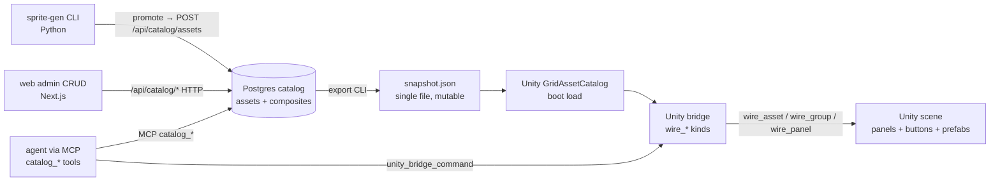

# Asset Snapshot MVP — Exploration

> **Purpose:** Define the MVP of the triangle **isometric-sprite-generator ↔ grid-asset-visual-registry ↔ web catalog tool**. Promote **snapshot-as-product** to a first-class artifact. Extend scope past sprite PNG baking to **full composite components**: panels, buttons, prefabs, and their **custom parametrization**. Integrate with Unity via the **MCP unity-bridge** so agents can instantiate panels / buttons / prefabs programmatically, and extend existing snapshots (add assets, add asset groups, add panels) via dev backend endpoints + MCP tools — not only create new snapshots from scratch.
>
> **Related plans and docs:**
>
> - `ia/projects/sprite-gen-master-plan.md` — Python pixel-art generator (4 stages filed; Stage 4 In Progress). Steps 2–5 of the 5-step spine per exploration §C are NOT yet filed as stages.
> - `ia/projects/grid-asset-visual-registry-master-plan.md` — Postgres catalog + HTTP API + MCP tools + Unity baker + `wire_asset_from_catalog` bridge kind (4 steps Draft; Stage 1.1 is next to file).
> - `ia/projects/web-platform-master-plan.md` — Step 8 Visual Design Layer (Stages 22–29 Draft), Step 9 Catalog Admin CRUD Views (Stages 30–33 Draft — asset / spawn-pool CRUD only; no composite CRUD).
> - `docs/isometric-sprite-generator-exploration.md` — ground truth for sprite-gen architecture + 5-step spine Design Expansion.
> - `docs/grid-asset-visual-registry-exploration.md` — ground truth for registry schema, bridge composite recipes, and MCP wrapper shape.
> - `Assets/Scripts/Editor/AgentBridgeCommandRunner.Mutations.cs` — existing Unity-side bridge mutation surface (instantiate_prefab, set_component_property, etc.).

---

## 0. Three-plan positioning — matrix

| Layer | Role | Owns (today) | Extension needed for MVP |
|-------|------|--------------|--------------------------|
| **Sprite generator** (`tools/sprite-gen/`) | **Fine-grained rendering**. YAML archetype → PNG. | `iso_cube` / `iso_prism` / `iso_stepped_foundation`, palette JSON, 17 slope variants, curation CLI (promote/reject), Aseprite Tier 1+2. | Steps 2–5 from 5-step spine (anim descriptor, EA bulk render, anim-gen tool, archetype expansion); **composite emission** — sidecar per-archetype `*.composite.yaml` declaring button states, prefab recipe, parametric props; snapshot upsert **push hook** to feed registry. |
| **Grid asset visual registry** (`tg-catalog-api` + Unity baker) | **Coarse catalog + snapshot export + Unity runtime loader + agent bridge**. | Postgres schema (assets / sprites / economy / pools), HTTP `/api/catalog/*`, MCP `catalog_*` tools, snapshot export CLI, `GridAssetCatalog.cs`, `wire_asset_from_catalog` bridge kind (all Draft). | **Snapshot mutation surface** — add-to, add-group, publish-diff; **panel / button / prefab composite tables** with parametric schemas; **group** as first-class (or filter) concept; bridge kinds `wire_asset_group_from_catalog` + `wire_panel_from_catalog`. |
| **Web catalog tool** (`web/app/admin/catalog/**`) | **Admin authoring surface** consuming `/api/catalog/*`. | Step 9 Stages 30–33 Draft — list / detail / edit / create / retire / pool mgmt for **assets only**. | **Snapshot CRUD** (create / add-to / publish / diff); **panel / button / prefab authoring** surfaces with parametric prop editors; **group** builder (filter or tag). |

**Tight coupling, separate plans:** Generator produces art + composite sidecars. Registry ingests + persists + exports + bridges. Web authors + reviews. Boundaries stay clean; the **snapshot manifest** (and optional **composite manifest** appended to it) is the contract between tiers.

---

## 1. Problem

1. **Sprite-gen finishes slowly.** 4 stages filed, Stage 4 In Progress. The 5-step spine from `docs/isometric-sprite-generator-exploration.md` §C adds 4 more steps (anim schema, EA bulk render, anim-gen, archetype expansion) that are NOT in the orchestrator. User wants the generator functional **SOON**; scope ambiguity around SOON blocks the finish line.
2. **Snapshot is currently a file, not a product.** Registry Step 2 emits a snapshot JSON and ships it to Unity at boot. There is no concept of **snapshot lifecycle** (draft → published → versioned), **snapshot mutation** (add asset, add group, add panel), or **snapshot as the first-class unit** that agents + humans both author and consume.
3. **Composite components are undefined.** Today the catalog row describes a single asset (sprite + economy + sprite-slot). A **panel** (e.g. Control Panel, HUD strip, Zone S picker) is a composite of: a layout, a set of **button** composites, a **ThemedPanel** tier, and optional agent-hookable actions. A **prefab** composite (world tile or toolbar) is a bake-target recipe. None of these are first-class rows; none are CRUD-edited; none are parametrizable.
4. **"Group" is ad-hoc.** "Residential dense" buildings, "utility set", "Zone S buttons" — these are implicit filters over asset rows today. There is no `groups` table, no group-scoped snapshot-add endpoint, no group-scoped bridge kind.
5. **Unity bridge gap.** `wire_asset_from_catalog` (registry Stage 4.1) is the only composite bridge kind planned. Wiring **a full panel** (with its buttons + prefabs + theme + action hooks) requires a richer kind (`wire_panel_from_catalog`) that does not yet exist in the registry plan. Agents cannot yet build a whole Zone S toolbar programmatically.
6. **Web CRUD gap.** Step 9 Stages 30–33 cover only asset + spawn-pool CRUD. Composite authoring (panel editor, button editor, prefab parametric editor) is out of scope at Step 9 close; no Step 10 exists.

---

## 2. Scope

### 2.1 In scope for this exploration

- Define **snapshot-as-product** — identity, mutability, lifecycle, versioning, diff semantics.
- Define **composite types** — Panel, Button, Prefab — as first-class (or expression) objects. Parametrization mechanism.
- Define **group** — first-class tag / pool / dynamic filter.
- Define **sprite-gen → registry integration** — does Python push composite sidecars, or does registry ingest PNGs and author composites separately?
- Define **registry → Unity bridge extension** — new `wire_*` kinds for groups + panels.
- Define **web CRUD extension** — what Step 9 opens vs what a new Step 10 (composites) covers.
- Propose **stage inserts** into each of the three master plans so the MVP ships.
- Narrow **SOON** for sprite-gen — what finishes Stage 4 + what follow-ons are required vs deferred.

### 2.2 Out of scope for this exploration

- Actual archetype YAML authoring (that happens inside sprite-gen Step 5).
- Art direction for Zone S / utility / landmark visuals (Bucket 3/4).
- Audio / SFX (blip master plan).
- Multi-scale region/country sprites (multi-scale master plan).
- Runtime cost simulation logic (`CostTable` / Bucket 11 cost catalog).
- Web Step 8 design system work (orthogonal; Step 9 + Step 10 will consume it).

### 2.3 Non-goals

- Replace the Unity Editor with a visual designer.
- Centralize Play Mode scene state management.
- Rewrite `unity_bridge_command` envelope (owned by mcp-lifecycle plan).

---

## 3. Terminology (working definitions — TBD markers flag open questions)

| Term | Working definition | TBD |
|------|--------------------|-----|
| **Asset** | Single placeable catalog row (sprite + economy + sprite-slot bindings). Matches existing `catalog.assets` table. | — |
| **Group** | A **named collection of assets** surfaced as a unit in bridge + web (e.g. `residential-dense-buildings`, `zone-s-services`). | Q4 — first-class table, tag column, or dynamic filter? |
| **Panel** | A **composite UI surface** containing a layout + ordered buttons + theme tier + optional agent action hooks. Examples: Zone S Control Panel, RCI toolbar, HUD strip. | Q2 — first-class row or expression? Q3 — parametric shape? |
| **Button** | A **composite UI element** containing target/pressed/disabled/hover sprites + onClick binding + parametric props (label, tooltip, hotkey, cost preview). | Q2 — first-class row or expression? |
| **Prefab** | A **Unity-baked composite** of world/UI sprite + components + properties + spawn rules, produced at bake time by the editor baker and / or at runtime by `GridAssetCatalog`. | Q14 — edit-time bake vs runtime assembly? |
| **Composite** | Catch-all for Panel / Button / Prefab. Distinguished from plain Asset by **containing references** to other catalog rows + carrying **parametric props**. | — |
| **Snapshot** | **Versioned bundle** of (assets + sprites + economy + pools + composites) exported from the catalog, consumed by Unity at boot and optionally mirrored to web for preview. | Q1 — immutable version (git-tag style) or mutable working product? |
| **Snapshot product** | The snapshot treated as a first-class user-facing artifact: it has lifecycle (draft / published / deprecated), diff / preview surfaces, and mutation endpoints. | Q1 — yes/no + shape. |
| **Parametrization** | Mechanism by which a Panel / Button / Prefab row declares configurable props consumed at bake + instantiation. | Q3 — fixed schema, JSON bag, or plugin schema per category? |
| **Snapshot mutation** | Any backend / MCP operation that changes a snapshot: add-asset, add-group, add-panel, remove, publish, diff. | Q1 + Q6 — allowed on live snapshot, or fork-new-version? |
| **Agent programmatic bridge** | Full round-trip: agent reads catalog → issues `unity_bridge_command` with `wire_panel_from_catalog` payload → bridge instantiates + parents + binds + saves. | Q6 — bridge read-only from snapshot, or full read+write catalog? |

---

## 4. MVP capability matrix (target end state)

Rows = capability. Columns = tier (sprite-gen / registry / web / unity-bridge). Cell = what owns that capability at MVP close.

| Capability | sprite-gen | registry | web | unity-bridge |
|------------|-----------|----------|-----|--------------|
| Render a sprite from YAML | ✅ (today) | — | — | — |
| Promote PNG + `.meta` into `Assets/Sprites/Generated/` | ✅ (Stage 4) | — | — | — |
| Insert new asset row | — | ✅ POST `/api/catalog/assets` | ✅ Step 9 Stage 31 | Optional (MCP catalog_create) |
| List / detail assets | — | ✅ GET | ✅ Step 9 Stage 30 | — |
| Edit asset with optimistic lock | — | ✅ PATCH | ✅ Step 9 Stage 31 | — |
| Define a group (tag or collection) | — | **NEW** | **NEW** (Step 10?) | — |
| List group members | — | **NEW** | **NEW** | — |
| Define a panel (buttons + layout + theme) | — | **NEW** | **NEW** (Step 10?) | — |
| Define a button (sprite states + action + parametric props) | — | **NEW** | **NEW** | — |
| Define a prefab recipe (world tile bake params) | — | **NEW** | **NEW** | — |
| Create snapshot from catalog | — | ✅ (Stage 2.1 export) | Optional | — |
| **Add asset(s) to existing snapshot** | — | **NEW** | **NEW** | Optional |
| **Add group to snapshot** | — | **NEW** | **NEW** | Optional |
| **Add panel (with its buttons + prefabs) to snapshot** | — | **NEW** | **NEW** | Optional |
| Publish snapshot (draft → published) | — | **NEW** | **NEW** | — |
| Preview snapshot diff | — | **NEW** | **NEW** | — |
| Unity loads snapshot at boot | — | — (consumer is Unity) | — | ✅ GridAssetCatalog (Stage 2.2) |
| Bridge instantiates single asset from catalog | — | — | — | ✅ `wire_asset_from_catalog` (Stage 4.1) |
| **Bridge instantiates a group of assets** | — | — | — | **NEW** `wire_asset_group_from_catalog` |
| **Bridge instantiates a panel** (its buttons + prefabs) | — | — | — | **NEW** `wire_panel_from_catalog` |
| **Bridge round-trips — edit catalog via MCP** | — | ✅ MCP `catalog_*` tools | — | Optional (already via MCP tools) |
| Sprite-gen emits composite sidecar (`*.composite.yaml`) | **NEW?** | — | — | — |
| Animation descriptor YAML schema locked | **NEW** (Step 2) | Consumer | — | — |
| EA bulk render (~1000 → ~60 promoted) | **NEW** (Step 3) | Consumer | — | — |
| Anim-gen tool (frame sheets for fire / smoke / event overlays) | **NEW** (Step 4) | — | — | — |
| S / utility / landmark archetype coverage | **NEW** (Step 5) | — | — | — |

Legend: ✅ = already filed / in flight. **NEW** = this exploration's scope.

---

## 5. Current state audit (what's missing per plan)

### 5.1 `sprite-gen-master-plan.md` gaps

1. **Stages 5–8 absent.** Exploration doc §C defines Steps 2–5; orchestrator has only Stages 1–4 as `Stage 1 / 2 / 3 / 4`. The mapping is: Stage 1 = Exploration Step 1 Phase 1+2; Stage 2 = Step 1 Phase 2 (compose); Stage 3 = Step 1 Phase 3 (palette); Stage 4 = Step 1 Phase 4 (slope + curation). **Steps 2 / 3 / 4 / 5 (anim schema / EA bulk render / anim-gen / archetype expansion) are unfiled.**
2. **Composite emission missing.** No stage covers emitting a `*.composite.yaml` sidecar next to a promoted PNG — sprite-gen today writes only PNG + `.meta` + anim descriptor stub (the stub is itself unfiled).
3. **Snapshot integration missing.** No stage covers the push / pull contract to registry — does sprite-gen know about the Postgres catalog? If yes, via which mechanism (CLI upsert? HTTP POST? Manual import?).

### 5.2 `grid-asset-visual-registry-master-plan.md` gaps

1. **Snapshot mutation endpoints missing.** Step 2 Stage 2.1 emits snapshot once per export command (full DB → file). No **additive** endpoint: `POST /api/snapshots/:id/assets`, `POST /api/snapshots/:id/groups`, `POST /api/snapshots/:id/panels`.
2. **Composite tables missing.** Schema today = assets + sprites + economy + sprite_slots + pools. No `panels`, `buttons`, `prefabs`, `groups` tables (or equivalent per Q2 first-class-vs-expression decision).
3. **Parametric schema missing.** Even if composites land as tables, parametric props (label / tooltip / hotkey / cost-preview for button; layout / theme-tier / action-hooks for panel) have no design yet. Options TBD — fixed schema columns vs JSONB bag vs plugin schemas per type.
4. **Bridge kinds missing.** Step 4 Stage 4.1 adds `wire_asset_from_catalog` only. `wire_asset_group_from_catalog` + `wire_panel_from_catalog` unfiled.
5. **Snapshot lifecycle states missing.** No draft / published / deprecated distinction on snapshot. Step 2.1 treats snapshot as a single output file.
6. **Snapshot diff / preview surface missing.** Nothing in the plan covers showing "these 4 assets + 1 group + 2 panels will land if I publish this snapshot".

### 5.3 `web-platform-master-plan.md` Step 9 gaps

1. **Snapshot admin UI absent.** Step 9 Stage 30 covers asset list + detail; no snapshot list, create, publish, diff UI.
2. **Composite authoring UI absent.** No panel editor (drag-drop buttons + set layout + bind theme). No button editor (sprite state picker + action binding + parametric props). No prefab parametric editor.
3. **Group authoring UI absent.** No group builder (select-assets-by-filter + save-as-named-group).
4. **Step 10 not defined.** Composite CRUD needs its own step with 3–4 stages (snapshots / panels / buttons+prefabs / groups+E2E).

### 5.4 Cross-cutting gaps

1. **No shared interchange format spec.** `snapshot.v1.json` schema is defined inside registry Stage 2.1 but is not cross-referenced by sprite-gen or web. If composites land, schema extension to `snapshot.v2.json` needs coordinated rollout.
2. **No "snapshot-as-product" naming in any plan.** User raised this as a priority; no orchestrator owns it end-to-end.
3. **No agent runbook for programmatic panel creation.** "MCP unity bridge tools are ready to handle these tasks" per user — but the programmatic recipe (read group from catalog → bridge call → verify wiring) is not documented.

---

## 6. Approaches surveyed

### Approach A — "Keep sprite-gen narrow; composites live in registry only"

- Sprite-gen finishes Stage 4 + Steps 2–5 as planned (sprites + anim descriptors only).
- Registry gets new composite tables (`panels`, `buttons`, `prefabs`, `groups`), new snapshot mutation endpoints, new bridge kinds.
- Web Step 10 opens after Step 9 with composite CRUD.
- Sprite-gen feeds registry only via the existing `generatorArchetypeId` column on assets — no sidecars, no direct upserts.

**Trade-off:** Cleanest separation; sprite-gen stays Python-isolated. Cost: composite editing happens only in web + MCP; no way to ship a full "Zone S panel package" as a single YAML file from sprite-gen.

### Approach B — "Extend sprite-gen to emit composite snapshot packages"

- Sprite-gen CLI gets a new `package` command: take an archetype or group + emit a `package/{slug}.snapshot.yaml` bundling sprites + economy rows + panel + buttons + prefabs as a single import-ready artifact.
- Registry gets an `/api/catalog/snapshots/:id/import-package` endpoint consuming these bundles.
- Web Step 10 composite CRUD still ships but is optional for packaged content.
- Groups can be declared inside the package YAML.

**Trade-off:** Enables "ship a panel from Python" for agent workflows. Cost: sprite-gen bleeds into catalog modeling; schema drift risk between package YAML and Postgres tables.

### Approach C — "Snapshot orchestrator as the fourth plan"

- New master plan `asset-snapshot-master-plan.md` owns the snapshot-as-product lifecycle + interchange format + cross-plan coordination.
- Stages cover: interchange schema, registry-side endpoints, sprite-gen push integration, web admin CRUD, Unity bridge wire-panel kinds.
- Other three plans get **extension stages** (not new scope) that implement their slice.

**Trade-off:** Clean ownership + one source of truth for the cross-cutting concern. Cost: a fourth orchestrator adds planning overhead; three existing plans need ongoing sync.

### Approach D — "Parametric composites as first-class registry citizens; sprite-gen stays narrow; web Step 10 ships composites end-to-end"

- Treat registry as the **single source of truth** for composites. Composite types (Panel / Button / Prefab / Group) get dedicated tables + parametric schemas.
- Sprite-gen emits **only** art (PNG + anim descriptor). Composites are always authored post-hoc — via web (human) or MCP (agent).
- Snapshot mutation endpoints are the **only** way to change a published snapshot; creating a new snapshot from full DB is a separate "baseline" operation.
- Unity bridge kinds mirror the composite types.

**Trade-off:** Matches the user's "backend can add assets to existing snapshots apart from creating snapshots" intent directly. Cost: no "package YAML" portability from sprite-gen side; agents creating panels write through the catalog API, not via file bundles.

---

## 7. Recommendation (leading candidate)

**Approach D with optional Approach B fallback** — subject to user interview.

Rationale:
1. User wording emphasizes backend endpoints + MCP as the mutation surface ("dev backend ... should also be able to directly add assets to existing snapshots"). That's approach D's center of gravity.
2. Sprite-gen SOON finishing Stage 4 + Step 2 descriptor lock (the Bucket 2 hard dependency) is simpler if we don't also add "composite package emit" to its scope — approach D keeps sprite-gen narrow.
3. Composite first-class tables unlock web CRUD + MCP tools + bridge kinds with a single schema; approach A leaves the schema ambiguous and defers decisions to web.
4. Approach C's fourth orchestrator can be added later if coordination friction demands it; not needed Day 1.
5. Approach B's `package` CLI can be added as **a future sprite-gen stage** on top of D once approach D's schema stabilizes.

---

## 7.5 Decisions locked during interview

| # | Decision | Date |
|---|----------|------|
| L1 | **One snapshot, mutable.** System keeps a single live snapshot JSON (no versioned exports, no multi-bucket). Content accretes between publishes; "publish" is a label / timestamp only. Rollback is out of scope for MVP. | 2026-04-22 |
| L2 | **Snapshot = single parametrized JSON file** holding assets (flat list) + pools as **nested trees** (e.g. `residential > dense > …`) + UI panels as **nested trees of design + button definitions** (with sprite refs) + prefabs. | 2026-04-22 |
| L3 | **Data model decided upfront.** Registry (Postgres schema) built to mirror the snapshot JSON shape — not the other way around. | 2026-04-22 |
| L4 | **Hybrid JSON shape** — top-level `assets[]` + `pools{nested tree}` + `panels[nested tree, buttons inline]`. No top-level `buttons[]` / `prefabs[]`; buttons live inside their panel; sprites referenced from `assets[]`. | 2026-04-22 |
| L5 | **Typed composites.** Each button / panel / prefab carries a **type** (e.g. `button.zone-s-service`, `panel.toolbar`, `prefab.world-tile`); each type declares its own schema (required + optional fields + defaults). New types land by authoring a schema entry — no code change. Web CRUD + MCP tools + bridge kinds read the schema for validation + form-gen. | 2026-04-22 |
| L6 | **Sprite-gen SOON = Stage 4 + snapshot push hook.** Close slope + curation + Aseprite round-trip, then add a small new stage that pushes each promoted PNG into the registry catalog (so the asset lands in the live snapshot). Steps 2–5 (anim schema / EA bulk / anim-gen / S+utility+landmark archetypes) are deferred and can run in parallel or after MVP triangle closes. | 2026-04-22 |
| L7 | **Sprite-gen emits PNG only; Postgres owns the catalog.** Sprite-gen promotes PNG + `.meta` to a folder under `Assets/Sprites/Generated/` and creates a row in the Postgres `assets` table pointing at the path. **Panels, buttons (and pools, prefabs) are separate Postgres tables** constructed later by backend endpoints from existing asset rows. This confirms **Approach D** from §6 as the selected architecture — registry is the single source of truth; filesystem holds art; snapshot JSON is a denormalized export of the Postgres data. | 2026-04-22 |
| L8 | **Clean split: authoring ≠ wiring.** Writes to Postgres go **only** through the dev backend (`/api/catalog/*` HTTP + MCP `catalog_*` tools). Unity bridge kinds (`wire_*`) are **read-only from snapshot** — they instantiate GameObjects, parent, bind theme, wire onClick, save scene, but never write back to the catalog. Two tools, two roles, no ambiguity. | 2026-04-22 |
| L9 | **Web split: Step 9 flat, Step 10 tree.** Web Step 9 drops Stage 32 (pool mgmt) → ships as assets-only CRUD (list / detail / edit / create / retire / docs). New **Step 10** opens for tree-shaped authoring: pools tree + panels + buttons + prefabs + snapshot mgmt + composite-type schema admin. Matches the data-model split. | 2026-04-22 |
| L10 | **Pools as first-class tree.** Postgres `pools` table carries `id`, `slug`, `display_name`, `description`, `parent_pool_id` FK (self-ref for tree). `pool_members` link table attaches `asset_id`s. Tree = self-referential FK chain; roots have `parent_pool_id = NULL`. Simple, queryable, authorable in web Step 10. | 2026-04-22 |
| L11 | **MVP consumer = both (parallel).** First snapshot-as-product ship goal = human or agent authors a panel in web / MCP → snapshot published → Unity wires it in-scene via bridge. Both tracks close together. | 2026-04-22 |
| L12 | **Execution = interleaved tracks with shared deps, not strict sequential.** Track A: registry Step 1.1 → 1.2 → 1.3 opens HTTP surface. Track B (parallel, no dep): sprite-gen Stage 4 closes. Then: web Step 9 assets CRUD (needs Step 1.3) + registry Step 2 snapshot export (needs Step 1) + sprite-gen push hook (needs Step 1.3 POST). Then: registry composite tables + snapshot mutation endpoints + web Step 10 composite CRUD + bridge `wire_*` kinds for group + panel. | 2026-04-22 |
| L13 | **Creation trigger = both.** New panel / button / prefab row created by human (web Step 10 forms) OR agent (MCP `catalog_*` tools). Single backend endpoint backs both. | 2026-04-22 |
| L14 | **Runtime assembly via bridge.** `wire_panel_from_catalog` reads snapshot + composes the panel GameObject at bridge-call time (Edit Mode), using existing prefab primitives (`IlluminatedButton`, `ThemedPanel`). **No separate "bake panel prefab" step.** Editor-baked panel prefabs stay a post-MVP optimization if runtime assembly becomes a perf hotspot. | 2026-04-22 |
| L15 | **Parametric override precedence = inheritance chain.** Most specific wins: composite-type schema defaults → panel-level overrides → button-instance overrides. Matches typed-composite (L5) + nested-tree (L4) semantics. Web form-gen + bridge wire step both apply the same resolution rule. | 2026-04-22 |

---

## 8. Open questions (drives interview)

| # | Question | Blocks | Category |
|---|----------|--------|----------|
| Q1 | ~~Snapshot identity.~~ **RESOLVED (L1 / L2 / L3)** — one mutable snapshot, single parametrized JSON, data model decided upfront. | — | — |
| Q2 | **Composite first-class vs expression.** Are Panel / Button / Prefab **dedicated Postgres tables with own IDs** (first-class), OR **views / expressions over existing asset rows** (e.g. panel = JSON doc referencing asset IDs)? | Schema design; web CRUD shape; MCP tool design. | Foundational |
| Q3 | **Parametrization mechanism.** Custom props for panels / buttons / prefabs land as **(a) fixed schema columns**, **(b) JSONB property bag**, or **(c) plugin schema per composite sub-type** (e.g. `button.zone-s-service` has different props than `button.rci-placement`)? | Table schema; web form generation; MCP tool DTO. | Foundational |
| Q4 | **Group identity.** Is a group **(a) first-class `groups` table with own ID + named members**, **(b) a tag column on assets + a view**, or **(c) a saved filter query** (like GitHub saved searches)? | Snapshot group-add endpoint shape; web group CRUD; MCP tool. | Foundational |
| Q5 | **Sprite-gen composite ownership.** Does sprite-gen emit a **composite sidecar YAML** next to the PNG (panel / button / prefab declared in Python-land), or stay narrow (only PNG + anim descriptor; composites always live in registry)? | Sprite-gen stage count; push integration with registry; coordination of schema versions. | Foundational |
| Q6 | **Bridge mutation scope.** Is the Unity bridge **read-only** (only reads snapshot + instantiates) or **full round-trip** (bridge can also POST new panel / button / prefab rows back to the catalog via MCP `catalog_*` tools, from inside Unity)? | Bridge kind count; MCP allowlist updates; agent recipe docs. | Structural |
| Q7 | **Web Step 10 scope.** Does web ship composite CRUD in **Step 10 (new)** after Step 9 closes, or **fold composites into Step 9** (making it bigger)? | Web orchestrator stage count; sequencing vs parallelism. | Structural |
| Q8 | **SOON for sprite-gen.** "Functional sprite-generator SOON" = **(a) Stage 4 close only** (slope + curation), **(b) Stage 4 + Step 2 anim schema lock**, **(c) Stage 4 + Step 2 + Step 3 EA bulk render**, or **(d) another scope**? | Sprite-gen stage sequencing + closure definition. | Foundational |
| Q9 | **Top MVP consumer.** First shipped snapshot-as-product consumes via **(a) Unity in-game placement only**, **(b) web admin previews only**, or **(c) both simultaneously** at Day 1? | Stage sequencing; acceptance criteria. | Structural |
| Q10 | **Plan sequencing.** Build sprite-gen + registry + web **sequentially** (sprite-gen closes first, then registry, then web), **interleaved** (track A: registry + web; track B: sprite-gen runs in parallel), or **strict dependency chain** (all must close Step N before any opens Step N+1)? | Execution order recommendation. | Structural |
| Q11 | **Programmatic panel creation trigger.** New panel creation invoked by **(a) human in web CRUD UI**, **(b) agent via MCP `catalog_panel_create` tool**, **(c) both**? | MCP tool surface + web UI surface. | Structural |
| Q12 | **Composite persistence shape.** Composite definitions stored in **(a) new Postgres tables**, **(b) JSONB blob columns on existing assets**, **(c) separate YAML files under `Assets/Resources/**`**? | Schema design; snapshot export format. | Structural |
| Q13 | **Sprite-gen scope creep.** Composite emission stays in **sprite-gen** if Approach B wins, OR spawns a **new sibling tool** (e.g. `tools/composite-gen/`)? | Tool ownership; Python dep surface. | Detail |
| Q14 | **Runtime vs editor-time panel assembly.** Panels assembled **edit-time** (baked prefabs under `Assets/Prefabs/Generated/Panels/`) or **runtime** (`GridAssetCatalog.BuildPanel(slug)` builds from snapshot + prefab templates)? | Unity loader design; bake step design. | Detail |
| Q15 | **Parametric override precedence.** When an agent creates a panel + parameterizes its buttons: **(a) panel-level defaults override per-button props**, **(b) per-button props override panel defaults**, **(c) inheritance chain** (catalog type → panel → button instance)? | Bridge kind behavior; web form UX. | Detail |
| Q16 | **Snapshot versioning cadence.** New snapshot version = **(a) every single mutation** (git-commit style), **(b) on explicit publish** (draft accretes, publish freezes), **(c) continuous + named tags** (like a branch with periodic tags)? | Mutation endpoint semantics; rollback story. | Detail |

---

## 9. Design Expansion

### 9.1 Architecture overview

Five moving parts. One flow.



**Contracts:**
- Writes → Postgres only. Every write goes through `/api/catalog/*` HTTP or MCP `catalog_*`. (L8)
- Snapshot = single mutable JSON export. One file, updated on publish. (L1 / L2)
- Bridge = read-only; composes GameObjects from snapshot at Edit Mode time. (L14)
- Agents have two channels: MCP catalog (author) + MCP bridge (wire). (L8 / L13)

### 9.2 Postgres data model

Mirror-of-snapshot shape per L3. Tables (names indicative):

| Table | Purpose | Key columns |
|-------|---------|-------------|
| `assets` | Flat catalog of placeable / paintable art rows. Owns the sprite path. | `id`, `slug`, `display_name`, `category`, `world_sprite_path`, `ppu`, `pivot`, `generator_archetype_id`, `schema_version`, `status` (`draft`/`published`/`retired`), `updated_at` |
| `sprites` | Named sprite references used by panels (button target / pressed / disabled / hover). | `id`, `slug`, `path`, `ppu`, `pivot` |
| `economy` | 1:1 sidecar on asset rows for cost / upkeep / envelope bind. | `asset_id` FK, `base_cost`, `monthly_upkeep`, `budget_envelope_id` |
| `pools` | Self-ref tree of named asset groups. | `id`, `slug`, `display_name`, `description`, `parent_pool_id` (nullable, self-FK) (L10) |
| `pool_members` | Link: `pool_id` × `asset_id`. | `pool_id`, `asset_id` |
| `composite_types` | Schema registry for typed composites. Each row = one type + its JSON schema of props. (L5) | `id`, `kind` (`panel` / `button` / `prefab`), `slug` (e.g. `button.zone-s-service`), `props_schema` JSONB |
| `panels` | First-class panel rows. | `id`, `slug`, `type_id` FK → composite_types, `display_name`, `props` JSONB (validated against type), `layout` JSONB |
| `buttons` | First-class button rows owned by panels. | `id`, `panel_id` FK, `slug`, `type_id` FK → composite_types, `order`, `props` JSONB, sprite refs (`target_sprite_id`, `pressed_sprite_id`, `disabled_sprite_id`, `hover_sprite_id`), `action` JSONB (onClick binding spec), `prefab_id` FK? (optional) |
| `prefabs` | First-class prefab recipe rows (world tile or button-with-prefab). | `id`, `slug`, `type_id` FK → composite_types, `props` JSONB, `asset_id` FK (optional, if derived from a catalog asset) |
| `snapshot_meta` | Single row. Tracks the one live snapshot's publish label + timestamp. (L1) | `schema_version`, `last_published_at`, `label` |

**Note — existing grid-asset-visual-registry plan** already covers `assets` + `sprites` + `economy` + `pools` (weight-based simple pools) in Step 1. Stage 1.1 migration needs **tweaks**: add `parent_pool_id` to `pools`, drop weight semantics (or keep as optional column), add `pool_members` link table. `composite_types` + `panels` + `buttons` + `prefabs` + `snapshot_meta` are **net-new** (belong in a new registry Step 5+).

### 9.3 Snapshot JSON shape (hybrid per L4)

```json
{
  "schemaVersion": 1,
  "label": "main",
  "publishedAt": "2026-04-22T18:00:00Z",
  "assets": [
    { "id": 42, "slug": "police-station", "category": "service",
      "worldSpritePath": "Assets/Sprites/Generated/police-station.png",
      "ppu": 64, "pivot": [0.5, 0.25] }
  ],
  "pools": {
    "residential": {
      "displayName": "Residential",
      "children": {
        "dense": { "displayName": "Residential Dense", "members": [101, 102, 103] },
        "sparse": { "displayName": "Residential Sparse", "members": [104, 105] }
      }
    },
    "zone-s": {
      "displayName": "Zone S Services",
      "members": [42, 43, 44, 45, 46, 47, 48]
    }
  },
  "compositeTypes": [
    { "slug": "button.zone-s-service", "propsSchema": { "$schema": "..." } },
    { "slug": "panel.toolbar", "propsSchema": { "$schema": "..." } }
  ],
  "panels": [
    {
      "id": 7, "slug": "zone-s-toolbar", "type": "panel.toolbar",
      "displayName": "Zone S", "props": { "anchor": "bottom-left", "theme": "studio" },
      "buttons": [
        { "id": 71, "slug": "police", "type": "button.zone-s-service",
          "order": 0, "assetRef": 42,
          "sprites": { "target": "police-off", "pressed": "police-on" },
          "action": { "kind": "select-sub-type", "subTypeId": 0 },
          "props": { "label": "Police", "hotkey": "P" },
          "prefabRef": null }
      ]
    }
  ],
  "prefabs": [
    { "id": 12, "slug": "police-world-tile", "type": "prefab.world-tile",
      "assetRef": 42, "props": { "sortingLayer": "Buildings", "addCollider": false } }
  ]
}
```

Pools + panels are nested trees; buttons inline inside panels; sprites + assets flat at top; types pulled out for schema sharing.

### 9.4 Unity bridge kinds (added or confirmed)

| Kind | Owner plan | Status | Behavior |
|------|-----------|--------|----------|
| `wire_asset_from_catalog` | registry Step 4 (existing) | Draft | Instantiate one asset's prefab under `parentPath`; bind `UiTheme`; no panel context. |
| `wire_asset_group_from_catalog` | registry **new Step 7** | proposed | Resolve a pool ID → iterate members → instantiate each under `parentPath` + grid layout. |
| `wire_panel_from_catalog` | registry **new Step 7** | proposed | Resolve a panel ID from snapshot → compose panel GameObject (layout + each button instance with sprite refs + onClick binding) under `parentPath` → save scene. Runtime assembly per L14. |
| `wire_prefab_from_catalog` | registry **new Step 7** | proposed | Resolve a prefab ID → instantiate using its type-schema props (collider / sorting layer / components) under `parentPath`. |

All four kinds: `dry_run: true` returns plan JSON only; rollback on any sub-step failure (scene snapshot / restore — already planned in registry Stage 4.2).

### 9.5 Stage inserts per master plan

#### A. `sprite-gen-master-plan.md` — 1 new stage

| New Stage | Name | Intent |
|-----------|------|--------|
| **Stage 5** | Snapshot push hook — registry integration | On `promote` success, POST to `/api/catalog/assets` with slug + path + PPU + pivot + archetype id. Idempotent (409 → PATCH or skip). Adds `--no-push` CLI flag for offline use. 3–4 tasks. |

Sprite-gen Steps 2–5 from exploration 5-step spine (anim descriptor / EA bulk / anim-gen / archetype expansion) stay **unfiled** until after the MVP triangle closes — deferred per L6.

#### B. `grid-asset-visual-registry-master-plan.md` — existing-step tweak + 3 new steps

Tweak Step 1:
- **Stage 1.1** migration revise: `pools.parent_pool_id` (self-ref FK), add `pool_members` link table; drop weight-based simple-pool semantics (keep optional column for backwards compat).

New steps:

| New Step | Stages (sketch) | Intent |
|----------|-----------------|--------|
| **Step 5** — Composite tables + type schemas | 5.1 `composite_types` table + schema loader; 5.2 `panels` + `buttons` tables + HTTP + MCP tools; 5.3 `prefabs` table + HTTP + MCP tools | Net-new composite surfaces, all typed (L5); HTTP + MCP parity for every table. |
| **Step 6** — Snapshot mutation surface | 6.1 `POST /api/catalog/snapshot/assets` (add-to); 6.2 `POST /api/catalog/snapshot/pools` + `POST /api/catalog/snapshot/panels` (add-to); 6.3 publish / diff endpoints + snapshot meta row | Treats snapshot as product (L1). Diff = what-changed-since-last-publish; publish = re-export JSON + bump label + broadcast reload hook. |
| **Step 7** — Bridge composite kinds | 7.1 `wire_asset_group_from_catalog`; 7.2 `wire_panel_from_catalog`; 7.3 `wire_prefab_from_catalog` + scene contract appendix | Extends Step 4 `wire_asset_from_catalog` into the group + panel + prefab space. Runtime assembly per L14. |

#### C. `web-platform-master-plan.md` — Step 9 drop + new Step 10

Step 9 revise: **drop Stage 32** (pool management). Step 9 ships as 3 stages (list+detail / edit+create+retire / docs+E2E).

New Step 10 — Composite authoring + snapshot mgmt:

| Stage | Intent |
|-------|--------|
| Pools tree CRUD | Drag-reorder tree authoring; add / remove members; set parent; display name + description. |
| Composite-type schema admin + panels CRUD | Read `composite_types.props_schema` → auto-generate forms. Panel list / create / edit / retire with layout editor + button ordering. |
| Buttons + prefabs CRUD | Button editor inline with panel OR standalone. Sprite state picker (pull from `sprites[]` + `assets[]`). Prefab parametric editor. |
| Snapshot mgmt | Snapshot page: list changes since last publish, diff view (added / modified / retired), publish action + label input, reload-hook indicator. |
| Docs + nav + E2E | Admin sidebar grouping; route docs; full Playwright suite covering composite flows. |

### 9.6 Execution order (per L12)

Tier A (parallel — no cross-plan deps):
- sprite-gen Stage 4 close (currently In Progress).
- registry Step 1.1 → 1.2 → 1.3 → 1.4 (backbone: migrations, DTOs, HTTP routes, MCP tools).

Tier B (opens after Tier A):
- sprite-gen Stage 5 push hook (needs registry 1.3 POST `/api/catalog/assets`).
- registry Step 2 snapshot export (needs Step 1 tables).
- web Step 9 assets CRUD (needs registry 1.3 + web design-system Step 8 primitives).

Tier C (opens after Tier B):
- registry Step 5 composite tables + types + 5.x HTTP / MCP.
- registry Step 4 `wire_asset_from_catalog` (needs Step 2 snapshot).

Tier D (opens after Tier C):
- registry Step 6 snapshot mutation + publish endpoints.
- web Step 10 stages 1–5 (pools / panels / buttons+prefabs / snapshot / docs).
- registry Step 7 bridge composite kinds (group / panel / prefab).

**MVP closes when:** human or agent authors a panel via web or MCP → publish → Unity bridge wires panel in Edit Mode scene → saved. This is the full round-trip.

### 9.7 Subsystem impact summary

| Subsystem | Change | Invariant risk |
|-----------|--------|----------------|
| sprite-gen Python | +1 stage (HTTP client + CLI flag). Tiny. | None (tool-only, Unity-isolated). |
| `tg-catalog-api` (Next.js + Drizzle) | +3 steps. Migrations + ~12 endpoints + 8 MCP tools. | None new; inherits existing DB invariants. |
| Postgres schema | +5 tables (`composite_types` / `panels` / `buttons` / `prefabs` / `snapshot_meta`) + revise `pools`. | Breaking for any code consuming weight-based pools (no consumers shipped yet per plan Draft state). |
| Unity `GridAssetCatalog` | Extend snapshot DTO parser for composites. Non-breaking if v1 parser ignores unknown fields. | unity-invariants #4 — no singleton introduction; use existing `MonoBehaviour` wiring. |
| Unity bridge | +3 kinds. Partial-class additions to `AgentBridgeCommandRunner.Mutations.cs`. | None — additive bridge kind is the standard extension pattern. |
| Web | Drop Stage 32 from Step 9; open Step 10 with 5 stages. | None (additive; dashboard routes untouched). |
| Glossary / specs | +5 rows (snapshot-as-product, composite type, pool tree, panel / button / prefab catalog). | None. |

### 9.8 Example — agent creates "residential dense" panel programmatically

1. Agent calls MCP `catalog_pool_list` → finds `pools.residential.dense` members (IDs 101, 102, 103).
2. Agent calls MCP `catalog_panel_create` with `{ slug: "residential-dense-picker", type: "panel.toolbar", props: { anchor: "bottom-right", theme: "studio" }, buttons: [{ slug: "res-dense-01", type: "button.rci-placement", assetRef: 101, props: { label: "Brick A" }, ... }, ...] }`.
3. Backend validates `panel.toolbar` schema + `button.rci-placement` schema against `props` — rejects with 422 on missing required field, else writes rows transactionally.
4. Agent calls MCP `catalog_snapshot_publish` → backend re-exports snapshot JSON + bumps `snapshot_meta.last_published_at` + broadcasts reload hook.
5. Agent calls `unity_bridge_command { kind: "wire_panel_from_catalog", panelSlug: "residential-dense-picker", parentPath: "UIRoot/ToolbarRoot" }` — Edit Mode, `dry_run: false`.
6. Bridge resolves panel from snapshot → instantiates `ThemedPanel` prefab at `parentPath` → iterates buttons → for each: instantiates `IlluminatedButton`, binds sprite states from `sprites[]`, wires onClick per `action` → `save_scene`.
7. Agent verifies via `unity_bridge_command { kind: "query_scene", path: "UIRoot/ToolbarRoot/ResidentialDensePicker" }` → asserts button count + theme + ordering.

No Python touches this flow. No manual prefab authoring. Round-trip done.

### 9.9 Non-scope

- Multi-snapshot / versioning / branching (L1 locked single mutable).
- Composite prefab baking pipeline (runtime assembly per L14 — bake-time is post-MVP optimization).
- Sprite-gen composite package emission (deferred; Approach B not selected).
- Runtime catalog mutation from inside Unity Play Mode (Edit Mode authoring + bridge only).
- Legacy save migration (catalog is greenfield; Zone S migration handled in existing registry Step 2.3).

---

## 10. Next steps

1. Run `claude-personal "/master-plan-extend ia/projects/sprite-gen-master-plan.md docs/asset-snapshot-mvp-exploration.md"` — adds Stage 5 push hook.
2. Run `claude-personal "/master-plan-extend ia/projects/grid-asset-visual-registry-master-plan.md docs/asset-snapshot-mvp-exploration.md"` — tweaks Stage 1.1 + opens Steps 5 / 6 / 7.
3. Run `claude-personal "/master-plan-extend ia/projects/web-platform-master-plan.md docs/asset-snapshot-mvp-exploration.md"` — drops Stage 32 + opens Step 10.
4. Glossary additions via `/glossary-add` (snapshot-as-product, composite type, pool tree, panel / button / prefab catalog) — coordinate on a single branch to avoid MCP index regen conflicts.

---
