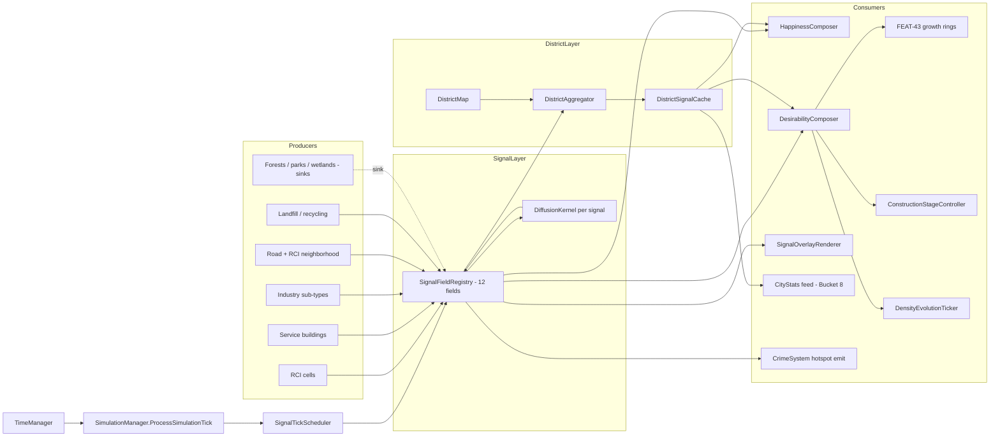

# City-Sim Depth — Exploration (stub)

> Pre-plan exploration stub for Bucket 2 of the polished-ambitious MVP (per `docs/full-game-mvp-exploration.md` + `ia/projects/full-game-mvp-master-plan.md`). Seeds a future `/design-explore` pass that expands Approaches + Architecture + Subsystem impact + Implementation points. **Scope of this doc is the simulation-depth surface — density evolution, services, districts, 3-type pollution, crime, traffic flow abstraction, waste, construction evolution, industrial specialisation. NOT Zone S / economy (Bucket 3), NOT utilities (Bucket 4), NOT CityStats overhaul (Bucket 8). Those land in sibling buckets.**

---

## Problem

Territory Developer ships a credible vertical slice (RCI + AUTO growth + roads + save/load + day/month loop + happiness + pollution scalar). Current depth stops there:

- Buildings don't evolve — one sprite per zone × density, no upgrade / decay over sim time.
- No construction animation — buildings pop in fully built; no stages, no land-value / desirability driven build speed.
- Pollution = single scalar on the happiness formula. No air / land / water split, no per-source diffusion, no per-sink absorption (forest, parks, wetlands).
- No crime. No services (police, fire, education, healthcare, parks) — happiness lacks the primary levers a city builder tester expects.
- No districts / neighborhoods — cells aggregate only at city scale; no mid-granularity policy surface.
- No traffic flow — road strokes render static; a "traffic view" overlay has no backing signal.
- No waste surface, no industrial specialisation (I is one undifferentiated zone type).
- FEAT-43 urban growth rings partially tuned but not producing the organic center-to-edge gradient advertised.

A tester opening the beta and placing RCI + roads currently sees growth, happiness, money — and very little else that reads as "city simulation depth." Bucket 2 exists to close that gap without forking into advanced economy (Bucket 3) or utilities (Bucket 4) or per-vehicle pathing (hard deferred).

**Design goal (high-level):** land the gameplay depth that makes Territory Developer recognisable as a city builder. Density evolution + construction evolution + services coverage + districts + 3-type pollution propagation + crime + traffic flow abstraction + waste + industrial sub-types, all wired through the tick loop so testers feel cause-and-effect across the simulation surface.

## Approaches surveyed

_(To be expanded by `/design-explore` — seed list only.)_

- **Approach A — Incremental per-feature.** Land each FEAT row (08, 43, 52, 53, plus new pollution / crime / traffic / waste / construction / industrial) as its own step. Minimal cross-coupling at design time; each feature ships on its own tick phase. Risk: tick-order hairball + N separate happiness / desirability contributors with no shared contract.
- **Approach B — Shared contract first.** Define a unified "simulation signal" contract (per-cell scalar or vector field per signal type: pollution-air, pollution-land, pollution-water, crime, service-coverage-{police, fire, edu, health, parks}, traffic-level, waste-pressure) up front. Every feature is a producer and / or consumer of signals. Happiness + desirability compose signals via a declared formula. Higher upfront design cost; cleaner extensibility.
- **Approach C — District-first aggregation.** Build districts (FEAT-53) as the primary aggregation layer first. Every other feature (pollution, crime, services, waste, industrial sub-types) lands its aggregates at the district level, with per-cell signals as a derived / local view. Matches how testers will read the game ("this district is dirty and has no police").
- **Approach D — Animation-first.** Land construction evolution + traffic flow animations first (coordinates with Bucket 5 animation pipeline), then attach simulation signals behind them. Testers see the game move before the math is deep. Risk: animation contracts harden before signal shape is clear.
- **Approach E — Hybrid B + C.** Shared signal contract (B) + district aggregation as a first-class rollup surface (C). Per-cell signals feed per-district aggregates via a standard rollup rule; consumers (happiness, desirability, HUD, overlays, CityStats / Bucket 8) read whichever granularity they need.

## Recommendation

_TBD — `/design-explore` Phase 2 gate decides._ Author's prior lean: **Approach E** (hybrid signal contract + district aggregation). Matches the bucket's breadth (9 sub-surfaces, all feeding happiness / desirability / CityStats), avoids the tick-order hairball of A, avoids the upfront rigidity of pure B, and lines up with Bucket 8's read-model facade so CityStats ingests signals without per-feature glue code. Approach D is tempting for tester legibility but inverts the producer / consumer order; Approach C alone under-specifies the per-cell propagation physics that 3-type pollution and crime need.

## Open questions

- **Signal inventory + physics.** Full list of per-cell simulation signals shipped in MVP (pollution air / land / water, crime, service coverage ×5, traffic level, waste pressure — anything else?). Diffusion kernel shape per signal. Decay rate. Source weights per building type. Sink weights per forest / park / wetland / service coverage.
- **Tick order.** Where do pollution propagation, crime update, service coverage recompute, traffic flow refresh, construction evolution tick, density evolution tick, waste tick sit in the existing monthly / daily tick loop? Interaction with FEAT-43 growth-ring recompute.
- **Happiness + desirability formula.** Current single-pollution-scalar happiness formula replaced with a composed formula over all new signals. Authority: which doc owns the canonical formula (glossary row? `simulation-system.md`? dedicated new spec?). Per-signal weights tuneable or hard-coded for MVP.
- **Service coverage radius semantics.** Circle / Manhattan / diffusion? Per-service different? Interaction with road connectivity (does an unreachable fire station still cover cells?). Interaction with capacity (over-saturated fire station = reduced coverage?).
- **District generation.** Player-authored (draw boundary) vs auto-derived (K-means on centroid + growth rings) vs hybrid? Number of districts per city (fixed cap, dynamic, player-controlled?). Does district boundary change as city grows?
- **Traffic flow abstraction — heuristic source.** Neighborhood-sum of what? Road-adjacent RCI density? Per-tier road capacity? Time-of-day variation (coupled with game-speed)? Interaction with road tiers (Bucket 2 parent — or does road tier ship elsewhere?).
- **Construction evolution — stage count + per-type curves.** How many stages per zone × density combination? Per-building-type construction-time curve authored where (YAML? ScriptableObject? code table?). Speed modifiers (desirability, land value / plusvalía, budget) — formula + tuning surface.
- **Industrial specialisation.** Four sub-types (agriculture, manufacturing, tech, tourism) — assignment rule (player-chosen per zone cell? auto-derived from adjacency + desirability?). Pollution + tax + desirability weight per sub-type. Interaction with I demand.
- **Waste management.** Discrete buildings (landfills, recycling centers) vs continuous signal vs both? Per-scale aggregation (country-level waste pool?). Interaction with Bucket 4 utilities.
- **Crime hotspot feedback.** Crime drives protest / violence animations (Bucket 5) — threshold to trigger? Duration? Does it affect zoning / demand directly or only through happiness?
- **Per-scale propagation.** Bucket 1 dependency — pollution + crime aggregate to region and country. Aggregation rule (sum? mean? max?). Does region-scale pollution feed back into city-scale desirability (acid rain / downwind) or only surface in CityStats?
- **Performance budget.** 9 new simulation systems on top of existing tick. Max map size × max signals × tick frequency. Which signals tick every frame, every game-day, every game-month. Invariant #3 compliance (no per-frame `FindObjectOfType`).
- **Migration of FEAT-43 growth rings.** Current implementation partially tuned — rewrite under the new signal contract or keep as-is and adapt downstream consumers?
- **Consumer-count inventory.** Which surfaces read each new signal (HUD, overlays, info panels, CityStats Bucket 8, web dashboard parity)? Decide at exploration time to inform the Bucket 8 data-parity contract.
- **Hard deferrals re-check.** Per-vehicle pathing, named sims, advanced economy, disasters, research tree — confirmed OUT at bucket level; no signal design should implicitly require them.

---

_Next step._ Run `/design-explore docs/city-sim-depth-exploration.md` to expand Approaches → selected approach → Architecture → Subsystem impact → Implementation points → subagent review. Then `/master-plan-new` to author `ia/projects/city-sim-depth-master-plan.md` and decompose into 5–6 steps × 2–3 stages each (per Bucket 2 size estimate — largest bucket by stage count).

---

## Design Expansion

### Chosen Approach

**Approach E — Hybrid shared signal contract + district aggregation.** Selected per author prior lean; recommendation unambiguous, no `APPROACH_HINT` override. Criteria matrix: E scores **High** on constraint fit (unifies 9 sub-surfaces under one producer/consumer contract), **High** on output control (single composed formula authority for happiness + desirability), **Excellent** maintainability (new features declare producer/consumer/rollup, no ad-hoc tick phase), versus A (tick-order hairball), B (rigid without district rollup), C (under-specifies per-cell propagation physics pollution + crime need), D (animation contracts harden before signal shape known). High upfront effort amortized across 9 features + Bucket 8 read-model facade downstream.

Signal inventory (12, MVP): `PollutionAir`, `PollutionLand`, `PollutionWater`, `Crime`, `ServicePolice`, `ServiceFire`, `ServiceEducation`, `ServiceHealth`, `ServiceParks`, `TrafficLevel`, `WastePressure`, `LandValue`.

### Architecture

**Entry points:**
- `SignalTickScheduler.Tick(TickContext)` — invoked by `SimulationManager.ProcessSimulationTick` between step 1 (`GrowthBudgetManager.EnsureBudgetValid`) and step 4 (`AutoZoningManager`).
- `SignalWarmupPass.Run()` — invoked by `SaveManager.OnAfterLoad` before first normal tick; producers + diffusion only, no consumers.

**Exit points:**
- `HappinessComposer.Current` → `CityStats.happiness` (preserved API).
- `DesirabilityComposer.CellValue(x,y)` → FEAT-43 growth rings, `ConstructionStageController`, `DensityEvolutionTicker`.
- `DistrictSignalCache.Get(districtId, signal)` → district info panel, CityStats Bucket 8 feed.
- `SignalField.Get(x,y)` → `SignalOverlayRenderer` textures, hotspot event emitter.

### Subsystem Impact

| Subsystem | Dependency | Invariant risk | Change | Mitigation |
|---|---|---|---|---|
| `SimulationManager` / tick order | Insert signal phase between budget + zoning | #3 | Additive | `SignalTickScheduler` MonoBehaviour; producers/consumers resolve once in `Awake` |
| `GridManager` | Signal fields sized `width × height`; iterate via `GetCell` | #5, #6 | Additive | Fields external to `GridManager`; carve-out `*Service` pattern if needed |
| `CityStats` / `HappinessComposer` | Compose formula over 12 signals | none | Breaking tuning, additive API | Preserve `CityStats.happiness` getter; migrate scalar pollution weight to `PollutionAir` |
| `DemandManager` | Reads composed happiness target | none | Additive | Keep `UpdateRCIDemand` hook; inject composer via Inspector |
| `ForestManager` / `ZoneManager` | Sinks (forest/park) + sources (RCI / industry sub-types) | none | Additive | Register as `ISignalProducer` with negative emission for sinks |
| `AutoZoningManager` / `GrowthManager` / FEAT-43 | Consume `DesirabilityComposer.CellValue` | none | Breaking growth math | **Explicit toggle** — old path off when new path on; compare via save replay across builds, NOT parallel |
| `RoadManager` / road strokes | Traffic heuristic reads RCI neighborhood + road tier | #2, #10 | Additive read-only | No placement path touched |
| `SaveManager` | Persist `DistrictMap` + tuning weights only | none | Breaking schema | `SignalWarmupPass` deterministic recompute on load; version bump + migration |
| `TerrainManager` / water / shore | `PollutionWater` rides on water cells | #1, #7, #8 | Additive | No `HeightMap` writes; diffusion across water cells only |
| CityStats Bucket 8 feed | `DistrictSignalCache` + `SignalFieldRegistry` canonical | none | Additive | Read-model facade designed here, UI implemented in Bucket 8 |
| New MonoBehaviours (`DistrictManager`, `ConstructionStageController`, `CrimeSystem`, `WasteSystem`, `IndustrialSubtypeResolver`, `TrafficFlowHeuristic`, `ServiceCoverageComputer`) | Scene components, Inspector-wired | #3, #4, #6 | Additive | `[SerializeField] private` + `FindObjectOfType` fallback in `Awake` |

**Spec gaps:** no canonical spec for districts, crime, waste, services, traffic, industrial sub-types. Master plan must decide: new `simulation-signals.md` reference spec vs extension of `simulation-system.md`.

### Implementation Points

**Phase 6.1 — Signal contract foundation**
- [ ] `SimulationSignal` enum (12 entries) + metadata registry
- [ ] `SignalField` + `SignalFieldRegistry` MonoBehaviour, sized from `GridManager`
- [ ] `ISignalProducer` / `ISignalConsumer` interfaces
- [ ] `DiffusionKernel` — **separable** Gaussian + decay + optional anisotropy; per-signal radius tuning surface
- [ ] `SignalTickScheduler` — wire into `SimulationManager.ProcessSimulationTick` as phase 1.5
- [ ] Inspector + `FindObjectOfType` fallback per invariant #4

**Phase 6.2 — District layer**
- [ ] `District` + `DistrictMap` (`int[,]`)
- [ ] Auto-derivation from urban centroid + rings (MVP default; single-centroid assumption)
- [ ] `DistrictAggregator` + `DistrictSignalCache` (rollup table per signal: mean for Pollution/Service/Waste/LandValue, P90 for Crime/Traffic)
- [ ] Save / load round-trip for `DistrictMap` only (not signal fields)

**Phase 6.3 — Migration of existing happiness / pollution + warmup**
- [ ] `HappinessComposer` replaces scalar; preserve `CityStats.happiness` API; tuning parity vs current output
- [ ] Register existing industrial buildings + power plants as `PollutionAir` producers
- [ ] Register forests + parks as `PollutionAir` sinks
- [ ] `DesirabilityComposer` + explicit FEAT-43 toggle (NOT parallel A/B — old path disabled when new enabled)
- [ ] `SignalWarmupPass` — deterministic recompute on load; run producers + diffusion only; guarantees save-parity
- [ ] Save schema version bump + migration (`DistrictMap` + tuning weights persist)

**Phase 6.4 — New signals: pollution split + crime + land value**
- [ ] `PollutionLand`, `PollutionWater` producer / sink tables
- [ ] `CrimeSystem` producer (density + low-service) + consumer (`ServicePolice` coverage)
- [ ] `LandValue` producer (density + aggregated service coverage) + consumer (`ConstructionStageController`, tax base)
- [ ] Hotspot event emitter (Bucket 5 placeholder)

**Phase 6.5 — Services + traffic + waste**
- [ ] `ServiceCoverageComputer` (5 services, road-connectivity gated)
- [ ] `TrafficFlowHeuristic` (RCI neighborhood sum / road-tier capacity)
- [ ] `WasteSystem` (RCI producers + landfill/recycling sinks)

**Phase 6.6 — Construction + density evolution**
- [ ] `ConstructionStageController` stage machine + per-type curves (ScriptableObject table)
- [ ] `DensityEvolutionTicker` refactor to consume `DesirabilityComposer`
- [ ] `IndustrialSubtypeResolver` (4 sub-types, adjacency + desirability)

**Phase 6.7 — Overlays + HUD parity**
- [ ] `SignalOverlayRenderer` per signal
- [ ] District info panel (read `DistrictSignalCache`)

**Deferred / out of scope**
- Zone S / economy (Bucket 3)
- Utilities (Bucket 4)
- CityStats UI overhaul (Bucket 8)
- Per-vehicle pathing, named sims, disasters, research
- Region / country aggregation feedback loop (infra ready, consumer deferred)
- Crime → protest animation (Bucket 5)
- Player-authored district drawing (MVP = auto-derived)
- Per-frame signal updates (MVP = daily or monthly tick only)
- Multi-centroid districts (follow-up)

### Examples

**Example 1 — `PollutionAir` tick (diffusion + sink interaction)**

Input:
- 3 heavy-industry cells at (10,10), (11,10), (10,11), source weight +4.0/tick.
- Forest patch 5-cell Moore cluster centered at (15,15), sink weight −0.5 per forest cell.
- `DiffusionSpec { Radius = 6, DecayPerStep = 0.15f, Anisotropy = (0,0) }`, separable Gaussian.

Expected output after 1 tick:
- `SignalField[PollutionAir].Get(10,10)` ≈ 2.7 (source 4.0 blurred).
- Neighbors (9,10), (11,10), (10,9) ≈ 1.8–2.2.
- (15,15) ≈ 0.9 from diffusion minus 2.5 sink → clamped to 0.

Edge case:
- Forest cluster adjacent to heavy cluster → per-tick sink > source at boundary. Clamp to `[0, ∞)` to avoid negative-pollution poisoning downstream consumers.

**Example 2 — District rollup**

Input:
- District "Downtown" = 40 cells. `SignalField[Crime]`: 32 cells at 0.1, 8 cells at 3.5.

Expected output:
- Mean rollup → 0.78 (hides hotspot).
- Max rollup → 3.5.
- **P90 rollup (chosen for Crime) → 3.5** (surfaces hotspot).

Rollup rule table: `Crime` + `TrafficLevel` = P90; `Pollution*`, `Service*`, `WastePressure`, `LandValue` = mean.

Edge case: empty district (0 cells) → return NaN; consumers must null-check.

**Example 3 — `ConstructionStageController` speed modulation**

Input:
- R-medium zone at (20,20). `DesirabilityComposer.CellValue(20,20)` = 0.6. Base construction = 30 in-game days. 4 stages.

Expected output:
- Effective time = 30 / (0.5 + clamp01(desirability)) = 30 / 1.1 ≈ 27.3 days. Each stage ≈ 6.8 days. Sprite swap on stage boundary.

Edge case:
- Desirability = 0 → 60 days (slowest).
- Desirability = 1 → 20 days (fastest).
- Signal decay overshoot to negative → composer clamps to `[0,1]` at boundary, not at consumer site.

### Review Notes

**NON-BLOCKING** (carried forward):

- Phase 3 — DiffusionKernel cost unbounded. Gaussian radius 6 × 12 signals × width×height per tick is O(n²·k²); no budget stated. Mitigated via separable kernel + per-signal radius tuning; actual tick budget deferred to Phase 6.1 performance task.
- Phase 4 — diagram omits `TimeManager` callsite in initial draft; added to final Mermaid.
- Phase 5 — spec gap for districts / crime / waste / services / traffic / industrial sub-types. Master-plan authoring must decide new `simulation-signals.md` vs extension of `simulation-system.md`.
- Phase 6.2 — single-centroid assumption for district auto-derivation. Multi-center cities (coastal + inland) will produce degenerate districts; documented as MVP limit + follow-up.
- Phase 7 — example 3 divide-by-zero guard hits at d = −ε from signal decay overshoot; fix = clamp desirability to `[0,1]` at composer boundary (applied in final Example 3).

**SUGGESTIONS**:

- `float16` or quantized int for signal fields if per-tick memory hot.
- Derived `PollutionCombined = w_a·air + w_l·land + w_w·water` for HUD summary consumers.
- District rollup rule table authored as ScriptableObject, not hard-coded in C#.
- `SignalField.Snapshot()` API for golden-image regression tests.

### Expansion metadata

- Date: 2026-04-16
- Model: claude-opus-4-7
- Approach selected: E (Hybrid shared signal contract + district aggregation)
- Blocking items resolved: 3
