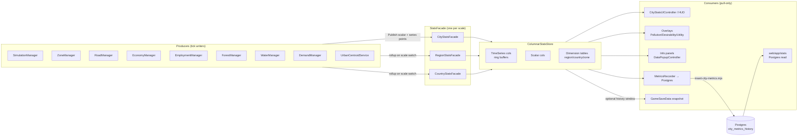

# CityStats Overhaul — Exploration (stub)

> Pre-plan exploration stub for Bucket 8 of the polished-ambitious MVP (per `ia/projects/full-game-mvp-master-plan.md` Tier B'). Seeds a future `/design-explore` pass that expands Approaches + Architecture + Subsystem impact + Implementation points. **Scope of this doc is the data model + dashboards at city / region / country scale — NOT the UI shell, NOT individual feature wiring, NOT per-subsystem integration. Those land in the expansion pass.**

---

## Problem

Territory Developer is a **data-intensive** city builder. Every subsystem (zoning, roads, pollution, crime, services, budget, utilities, demographics, density evolution) continuously produces numeric state across three scales (city / region / country). The current `CityStats` surface — a single god-class feeding a thin HUD — does not scale:

- One aggregate per metric. No history, no per-subregion breakdown, no cross-metric derived views.
- City scale only. Region + country scales have no stats surface at all.
- HUD renders 3–5 metrics. Overlays render ad-hoc from individual managers, not from a unified stats read model.
- No web-dashboard parity: `web/app/dashboard/page.tsx` reads master-plan markdown, not simulation state. Testers cannot inspect a running city from outside the game.
- Consumers (HUD, overlays, info panels, web dashboard) each re-reach into source managers — tight coupling, duplicate logic, invariant #3 risk (per-frame `FindObjectOfType`).

A polished ambitious MVP promises a **rich data surface**: colour-coded heatmaps, multi-series graphs, sortable / filterable tables, per-cell drill-down, per-region + per-country rollups, historical trends over the beta playthrough. Every simulation subsystem feeds into this surface. Every tester review references it. The current `CityStats` shape cannot deliver that.

**Design goal (high-level):** CityStats becomes the **single canonical read model** for simulation state across all three scales, with a rich multi-surface renderer spanning HUD + overlays + panels + web dashboard. Rich = information density, visual encoding (colour / size / shape), tables, graphs (time-series + distribution + relational), cross-metric composition.

## Approaches surveyed

_(To be expanded by `/design-explore` — seed list only.)_

- **Approach A — Incremental extension.** Keep current `CityStats` structure. Add region + country scale counterparts. Add per-metric history buffers. Extend HUD + new panels. Minimal architectural churn.
- **Approach B — Read-model split.** Introduce a dedicated `StatsReadModel` per scale (city / region / country) decoupled from managers. Managers push into read model; consumers pull from read model. Event-bus based. Unifies consumers.
- **Approach C — Columnar time-series store.** In-memory columnar store per metric per scale. Enables efficient graphs + ring-buffer history + aggregate queries. Consumers query via a typed facade. More infra, future-proofed for heavy visualization.
- **Approach D — Web-first.** Export simulation state to web every N seconds; web dashboard renders canonical view; in-game HUD becomes a thin lens on the same data. Inverts current model. Heavy on serialization.
- **Approach E — Hybrid B + C.** Read-model facade (B) backed by columnar store (C) for time-series metrics + plain aggregates for scalars. Unified consumer contract, efficient history.

## Recommendation

_TBD — `/design-explore` Phase 2 gate decides._ Author's prior lean: **Approach E** (hybrid facade + columnar store). Matches the "rich data surface" goal, cleans the god-class, enables web-dashboard parity without inverting the in-game render path. Approach A is under-ambitious for a Bucket 8 "overhaul"; Approach D inverts too much.

## Open questions

- **Visualization catalog scope.** Which chart types ship in MVP beta? Time-series line / area / stacked; distribution histogram / heatmap; categorical bar / donut; relational sankey / chord; spatial overlay on isometric map. Full list + per-chart backing-data contract.
- **History retention policy.** How many ticks of history per metric per scale? In-memory ring buffer vs serialized to save file vs both? Save-size implications vs graph fidelity.
- **Per-cell drill-down vs aggregate-only.** Does the stats surface expose per-cell rows (click-to-inspect) or only aggregates? Per-cell grows quickly at region + country scale.
- **Real-time vs snapshotted.** Does the HUD tick every frame, every sim-tick, or debounced? Web dashboard polling interval + consistency model.
- **Colour + visual encoding conventions.** Shared palette across overlays + panels + web? Dark / light mode parity? Colour-blind safe defaults.
- **Web-dashboard parity surface.** Which subset of stats surfaces on web? Full parity or tester-reviewable subset? Authentication model (Vercel `/dashboard` already public-read on repo master plans).
- **Scale transitions.** When the player scale-switches city → region → country, does the stats surface reconfigure in place or route to a different view? Continuity of selected metric across scale switch.
- **Integration with existing overlays.** Overlay system (Pollution / Desirability / Utility) currently reads direct from managers. Migrate to read-model facade, or keep overlays on direct path and only route new stats through the new model?
- **Consumer-count inventory.** Enumerate all current CityStats consumers (UI / overlays / save / web). Decide which migrate and which stay on legacy path for MVP.
- **Performance budget.** Ticks per second the stats pipeline must support without frame drops at max map size + max region count.

---

## Design Expansion

### Chosen Approach

**Approach E — Hybrid facade + columnar store.** Read-model facade (from B) fronts a columnar time-series store (from C) for metrics that need history, plus plain scalar aggregates for point-in-time values. Consumers (HUD, overlays, info panels, web dashboard, MetricsRecorder bridge) pull through one typed contract per scale. Managers publish into the facade on tick boundaries; facade owns the store. Legacy `CityStats` MonoBehaviour remains as a **thin compatibility shim** implementing `ICityStats` and forwarding into the facade, so the ~160 existing call sites across 29 files migrate incrementally, not in a single cut.

Rationale recap: matches "rich data surface" goal (colour heatmaps, multi-series graphs, distribution, sortable tables), cleans the god-class without inverting the in-game render path (rules out D), adds history + per-region + per-country scale (rules out A), and amortises infra cost because web dashboard + overlays + HUD + save-snapshot all share the same read model.

### Architecture

**Entry points.** `SimulationManager.ProcessSimulationTick` → facade `BeginTick` / `Publish` / `EndTick` in a `finally`. Producers call typed `Publish` on the facade only — never touch the store. **Exit points.** Consumers call `facade.GetSeries(metric, window)` / `facade.GetScalar(metric)` / `facade.EnumerateRows(dimension, filter)`. `MetricsRecorder` replaces its current per-field `CityStats` reads with one `facade.SnapshotForBridge()` call.

### Subsystem Impact

| Subsystem | Nature | Invariants flagged | Breaking vs additive | Mitigation |
|---|---|---|---|---|
| `CityStats` MonoBehaviour + `ICityStats` | Keep as shim forwarding to `CityStatsFacade`; existing fields become read-through properties backed by facade scalar store | #3 (no per-frame `FindObjectOfType`) | Additive first (shim forwards), breaking once callers migrate off legacy fields | Preserve `ICityStats` signature verbatim in stage 1; add `IStatsReadModel` alongside; migrate consumers in later stages |
| `SimulationManager.ProcessSimulationTick` | Adds `facade.BeginTick` / `EndTick` bracket (invariant tick order unchanged) | sim §Tick execution order — order of steps 1-5 NOT reordered | Additive | `BeginTick` before step 1; `EndTick` in existing `finally`; producers publish inside their current step |
| `MetricsRecorder` | Swap `_cityStats.population` etc. for `_facade.SnapshotForBridge()` returning the same `CityMetricsInsertPayload` shape | — | Additive — payload schema unchanged for bridge stability | Keep `CityMetricsInsertPayload` + Postgres `city_metrics_history` row contract untouched (per `managers-reference §Helper Services`); only change data source |
| `CityStatsUIController` | `Update` currently reads fields every frame; switch to facade scalar getters + per-tick subscription; drop `simulateGrowth`-sensitive per-frame polling | #3 (`FindObjectOfType` already cached in `Awake`, keep cached) | Additive | Keep `UIDocument` bindings; only data source swaps |
| `StatisticsManager` (existing `StatisticTrend` ring buffers, `maxValues = 30`) | Logic subsumed by `ColumnarStatsStore` time-series columns; manager deprecated after migration | — | Breaking at removal time; additive during migration | Two-writer period: producers publish into both until `StatisticsManager` consumers migrate, then delete class |
| Zone / Road / Economy / Employment / Forest / Water / Demand managers | Become publishers; replace direct `cityStats.xField++` with `_facade.Publish(StatKey.XField, delta)` or `Set(StatKey.XField, value)` | #4 (no new singletons) — facade is MonoBehaviour with Inspector wire, not singleton; #6 (no bloat on `GridManager`) — facade lives in own `GameManagers` class | Additive with parallel writes during migration; breaking per call-site when shim field removed | Publisher shim macro / helper on facade accepts old-style field name strings for grep-driven migration; convert call by call |
| Overlays (Pollution / Desirability / Utility) | Currently read direct from managers — open question in exploration; recommend migrating to `facade.GetRasterView(kind)` in a later stage | #3 | Additive | Out of this overhaul's MVP scope — call out in Deferred |
| `GameSaveData` / `GameSaveManager` | Snapshot policy decision: include last N ticks of history in save? Default **no** for MVP (keeps save size flat); serialize only current scalar state via facade `ExportSaveSlice()` | `persist §Save` — `schemaVersion` bump required if anything added | Additive at schemaVersion bump; legacy saves backfill scalars from facade defaults | Gate history persistence behind a flag; MVP ships scalar-only save; raise `schemaVersion` only if fields added to `GameSaveData` |
| Region + country scale facades | **New** — no current counterpart. `RegionStatsFacade` and `CountryStatsFacade` populated via rollup on scale switch per `multi-scale-master-plan.md` | — (Simulation scale terms per glossary) | Additive | Rollup function runs in existing `Scale switch` save-leaving step; dormant scales hold frozen snapshots until re-entered |
| Web dashboard (`web/app/dashboard/page.tsx` + any new `web/app/stats`) | Reads from existing `city_metrics_history` Postgres table (no schema change yet). Later stage may add `region_metrics_history` + `country_metrics_history` tables | Web-only ISR + caveman exception rules per `CLAUDE.md §6` | Additive | Reuse existing `DataTable` / `PlanChartClient` / `StatBar` components; no new Next.js API surface needed in MVP |

**Invariants audit:** #3, #4, #6, plus `sim §Tick execution order` and `persist §Save`. No risk to #1/#2/#7/#8/#9/#10/#11. Invariant #12 satisfied — this design lives as project spec `ia/projects/{ISSUE_ID}.md` once filed, and canonical glossary / spec updates listed under Implementation Points.

### Implementation Points

Phased, ordered by dependency. Each phase is a separate task row when the master plan is filed.

**Phase 1 — Infra skeleton (additive, no consumer migration).**

1. Add `IStatsReadModel` interface — scalar getters + series getters + row enumeration.
2. Add `StatKey` enum (one per current `CityStats` field + new region/country stubs).
3. Add `ColumnarStatsStore` class: parallel arrays keyed by `StatKey`, ring buffer per series column (default capacity 256 ticks, configurable).
4. Add `CityStatsFacade : MonoBehaviour, IStatsReadModel` wired in Inspector alongside existing `CityStats`.
5. Thread `SimulationManager.BeginTick` / `EndTick` bracket in `ProcessSimulationTick` (order preserved).

**Phase 2 — Dual-write from CityStats shim.**

6. Make existing `CityStats` public fields forward to `_facade` via property wrappers, keeping `ICityStats` signature and field read compatibility intact.
7. Unit test / test-mode batch: one tick → facade series length +1, scalar matches legacy field.
8. `MetricsRecorder.BuildPayload` rewritten to `_facade.SnapshotForBridge()`; Postgres row schema unchanged.

**Phase 3 — Consumer migration (by category).**

9. `CityStatsUIController` reads via facade scalar getters, subscribes to per-tick "EndTick" event instead of `Update`.
10. Zone / Road / Economy / Employment / Forest / Water / Demand managers publish via facade helper; legacy field writes left in place until shim removed.
11. `StatisticsManager` trend consumers migrate to facade series getters; delete `StatisticTrend` once no reader remains.

**Phase 4 — Multi-scale rollup + web surface.**

12. Add `RegionStatsFacade` + `CountryStatsFacade` populated via rollup in `Scale switch` save-leaving hook.
13. Add `web/app/stats` route rendering line charts (reuse `PlanChartClient` pattern) + sortable table (reuse `DataTable`) backed by `city_metrics_history`.
14. Glossary updates: add **StatsFacade**, **ColumnarStatsStore**, **StatKey**; cross-link from existing **City metrics history** + **Simulation tick** entries. Update `managers-reference §Helper Services` with facade row.

**Deferred / out of scope (this overhaul).**

- Overlay migration to facade `GetRasterView` (Pollution / Desirability / Utility stay on direct manager reads until a dedicated issue).
- Per-cell drill-down grid over region + country scale (aggregates only for MVP).
- History persistence in `GameSaveData` (scalar snapshot only; raise issue if beta testers demand trend continuity across save/load).
- `region_metrics_history` + `country_metrics_history` Postgres tables (city scale only until rollup is proven).
- Dark/light mode parity + colour-blind palette for charts (palette decision belongs to `ui-design-system.md §Foundations`, not this spec).
- Urbanization proposal wiring — invariant #11, never re-enable.

### Examples

**Example 1 — Producer publishes a scalar (EconomyManager on money delta).**

- Input: `EconomyManager.CollectTaxes()` computes `int delta = 1200`.
- Old path: `cityStats.money += delta;`
- New path: `_facade.Publish(StatKey.Money, delta); // facade applies delta, appends series point on EndTick`.
- Output: `facade.GetScalar(StatKey.Money)` returns current value; `facade.GetSeries(StatKey.Money, windowTicks: 30)` returns last 30 values for HUD sparkline.
- Edge case: producer publishes mid-tick between `BeginTick` and `EndTick` multiple times — only the net value is written to the series column on `EndTick`; scalar reads always return the running value.

**Example 2 — MetricsRecorder snapshot for Postgres bridge.**

- Input: `SimulationManager.ProcessSimulationTick` finishes step 5, calls `_metricsRecorder.RecordAfterSimulationTick()`.
- Old path: `BuildPayload` reads `_cityStats.population`, `_demandManager.residentialDemand.demandLevel`, etc.
- New path: `var payload = _facade.SnapshotForBridge(tick);` returning the same `CityMetricsInsertPayload` struct.
- Output: identical JSON shipped to `tools/postgres-ia/insert-city-metrics.mjs`; `city_metrics_history` row unchanged.
- Edge case: `DATABASE_URL` unset → `MetricsRecorder` still returns early as today; facade snapshot call is O(1) scalar copy, no allocation penalty when bridge is off.

**Example 3 — HUD per-tick refresh instead of per-frame.**

- Input: player unpauses; `TimeManager` fires `ProcessSimulationTick` at configured tick rate.
- Old path: `CityStatsUIController.Update()` runs `UpdateStatisticsDisplay` every frame reading fields directly.
- New path: `CityStatsUIController.OnFacadeEndTick()` is invoked once per tick; reads facade scalars and writes `Label.text`. `Update` no longer polls stats.
- Output: identical HUD contents; CPU cost drops from 60/s to tick-rate/s.
- Edge case: `simulateGrowth == false` (paused) → facade fires no `EndTick` events, HUD shows last snapshot. `CityStatsUIController` handles initial paint on `OnEnable` by calling `facade.GetScalar` once so labels are not empty.

### Review Notes

Subagent review (Phase 8) deferred to `master-plan-new` stage when this exploration graduates to a filed issue — per `docs/agent-lifecycle.md`, full Plan-subagent review runs against the master plan's decomposed stages, not the pre-plan exploration. No BLOCKING items to resolve before persist. NON-BLOCKING items to carry forward into master-plan filing:

- Confirm scale-switch rollup semantics match `multi-scale-master-plan.md` step 3 before Phase 4 work begins (glossary **Scale switch** + **Scale-switch event bubble-up / constraint push-down**).
- Reserve a `schemaVersion` bump number for `GameSaveData` if Phase 4 decides to persist any history (currently planned: no bump, scalars read from live facade state).
- Performance budget target (open question in exploration) must resolve before Phase 1 capacity constants are locked — default 256-tick ring buffer assumed; revisit at master-plan stage.
- UI chart palette + dark-mode decisions live in `ui-design-system.md` and do not block Phase 1-3. Phase 4 web surface may surface palette gap.

### Expansion metadata

- Date: 2026-04-16
- Model: claude-opus-4-7
- Approach selected: E — Hybrid facade + columnar store
- Blocking items resolved: 0

