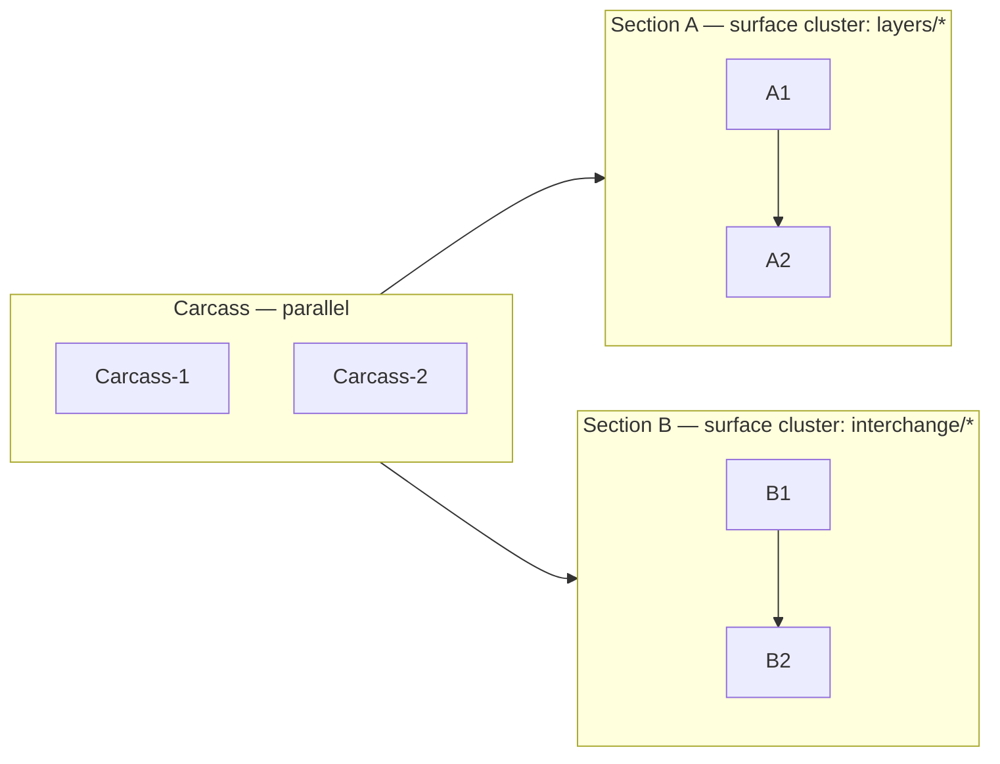

# `/design-explore` ↔ Carcass+Section Master-Plan — Alignment Gap Analysis

> **Created:** 2026-04-30
>
> **Status:** Findings + recommendations. No skill edits applied yet.
>
> **Triggered by:** Wave 2 pilot pause — first fresh exploration must enter `/design-explore` → `/master-plan-new` natively under carcass+section. Validation pass on upstream skill alignment before pilot kickoff.
>
> **Source skills:** `ia/skills/design-explore/SKILL.md` · `ia/skills/master-plan-new/SKILL.md` · `ia/skills/domain-context-load/SKILL.md` · `tools/recipes/master-plan-new-phase-a.yaml`.
>
> **Source contract:** `docs/parallel-carcass-exploration.md` §Locked decisions D8 / D15–D20.
>
> **Related:** `docs/parallel-carcass-rollout-post-mvp-extensions.md` (landing pad).

---

## 1. Contract — what carcass+section model expects upstream

`master-plan-new` Phase 4 + Phase A recipe assume the upstream design block already carries:

| Expectation | Source | Where consumed |
|---|---|---|
| **Plan shape declared** (linear vs carcass+section). | Should be in design block. | Phase 4 Stage decomposition title-annotation logic. |
| **Carcass stages identified** (≤3 per D15, signal kinds). | Should be in Implementation Points. | Phase 4 carcass title suffix + Phase 8 parallel-eligibility. |
| **Sections identified** (id, surface cluster, depends_on carcass per D18/D19). | Should be in Architecture / Subsystem Impact. | Phase 4 section title suffix + Phase 8 fan-out block. |
| **≥3 plan-scoped `arch_decisions`** (boundaries / end-state-contract / shared-seams). | Should be in Architecture Decision block. | Phase 7 → Phase A recipe `arch_decisions[]` foreach (verify-count gate fails <3). |
| **Per-section `surface_slugs[]` clusters** (validation pass against D19 declared section_id). | Should be in Architecture Decision per-section. | Phase 4 Relevant surfaces + arch_drift_scan(intra-plan) basis. |
| **No carcass→carcass deps** (D16 default). | Should be in Implementation Points dep chain. | Phase 8 parallel-eligibility (assumes none). |

`design-explore` Phase 9 Persist block currently writes: Chosen Approach, Architecture Decision (single DEC-A row + flat surface_slugs[]), Architecture (single Mermaid), Subsystem Impact, Implementation Points (flat Phase A→B→C list), Examples, Review Notes. **None of the carcass+section partitions.**

---

## 2. Gap inventory

| # | Gap | Severity | Hits |
|---|-----|----------|------|
| G1 | No plan-shape decision (linear vs carcass+section) — Phase 0.5 interview never polls; Phase 9 persist has no `### Plan Shape` block. | **Blocking** | master-plan-new Phase 4 has to guess shape from heuristics. |
| G2 | Single `arch_decision_write` row — Phase 2.5 writes ONE DEC-A. Phase A recipe verify-count gate requires ≥3 plan-scoped rows when `plan_slug` set. | **Blocking** (carcass plans only) | recipe halts with non-zero exit on `seeded_count<3`. |
| G3 | Flat `surface_slugs[]` — captured once for whole design. D19 demands per-section surface clusters. | **Blocking** (carcass plans) | arch_drift_scan(intra-plan) cross-section detection has no truth source. |
| G4 | Implementation Points emit linear `Phase A → B → C` checklist. No carcass / section labels. | **Blocking** (carcass plans) | master-plan-new Phase 4 maps Implementation Points → Stages 1:1; loses carcass/section partition. |
| G5 | Architecture Mermaid is monolithic. No subgraph for carcass vs sections. D18 sections-imply-carcass invariant invisible in diagram. | Important | reviewer subagent + human reader can't visually validate parallel boundary. |
| G6 | Phase 2.5 has no carcass-cap awareness (D15 ≤3). Designs implying 4+ carcass-shape items only surface at master-plan-new Phase 4 cardinality. | Important | late-bound failure — design-explore re-run cost. |
| G7 | Phase 8 Subagent review prompt has no parallelizability or section-orthogonality checks. | Important | reviewer skips the very property carcass+section model exists to enable. |
| G8 | `domain-context-load` returns flat `spec_sections` + `glossary_anchors`. No clustering hint for surface ownership per section. | Nice-to-have | manual curation in master-plan-new Phase 4. |
| G9 | Phase 0.5 Interview asks scope/blocking questions — never polls expected parallelism (would auto-flag carcass shape). | Nice-to-have | shape decision deferred to G1 explicit gate. |
| G10 | No `--against` gap-analysis-mode handling for an existing carcass+section plan. Re-running design-explore on a locked carcass plan can't validate section integrity. | Nice-to-have | post-MVP — gap-analysis already mode-gated by Phase 0 detection. |

---

## 3. Recommended changes — design-explore SKILL.md

### 3.1 Critical (block carcass+section adoption)

**C1 — New Phase 0.6: Plan Shape gate (poll)**

After Phase 0.5 Interview, before Phase 1 Compare. Single AskUserQuestion turn (per `agent-human-polling.md`):

> Plain-language preface: "Plans split into two shapes: **linear** (one stage at a time, sequential ship) or **carcass+section** (≤3 thin end-to-end stages first, then parallel section waves). Carcass shape unlocks parallel sessions but needs explicit section partitioning upfront."
> 
> Question: "Which shape fits this design?"
> 
> Options: `linear` / `carcass+section` / `unsure — recommend`
> 
> Recommended: derive from design surface count + parallelism heuristic — flag carcass+section when ≥4 surfaces touch ≥3 distinct subsystems with no hard dep chain.

Persist as `### Plan Shape` block in Phase 9 Persist. Block carries: `shape: linear|carcass+section`, rationale (1 line).

**C2 — Phase 2.5 expansion: emit ≥3 plan-scoped `arch_decisions` for carcass shape**

When Plan Shape = carcass+section, Phase 2.5 polls become:

1. Decision slug — single base slug (kebab-case). Recipe foreach generates 3 plan-scoped rows: `plan-{slug}-boundaries`, `plan-{slug}-end-state-contract`, `plan-{slug}-shared-seams`.
2. Boundaries rationale — what's IN vs OUT of plan scope (≤250 chars).
3. End-state contract — minimal observable signal that proves the plan landed (≤250 chars per D-A19 signal kind shape).
4. Shared seams — interfaces every section consumes (≤250 chars).
5. Per-section surface clusters — N polls (one per section identified in §C4 Implementation Points). Each: section_id (`section-A`, `section-B`, ...) + `surface_slugs[]` subset.

MCP writes: 3 `arch_decision_write` calls with `plan_slug={slug}` set + per-section `surface_slugs[0]` as FK. Skip-clause (no arch_surfaces hits) preserved for tooling/UI-only carcass plans.

Linear shape: keep current single DEC-A row flow.

**C3 — Phase 9 Persist block additions**

Append three new sections to the Design Expansion block:

```markdown
### Plan Shape
{linear | carcass+section}. Rationale: {one line}.

### Carcass Stages (carcass+section only)
{≤3 entries}. Each: short name, signal kind (from carcass_signal_kinds enum), surface(s) shipped.

### Sections (carcass+section only)
{≥1 entries}. Each: section_id (section-A/B/C/...), surface cluster (slugs from arch_surfaces), depends_on (≥1 carcass stage), expected stage count.
```

Insert AFTER `### Architecture Decision`, BEFORE `### Architecture`. Skip blocks when shape=linear.

**C4 — Phase 6 Implementation Points: shape-aware grouping**

When Plan Shape = carcass+section, replace flat `Phase A → B → C` checklist with:

```
Carcass — parallel-eligible, no internal deps
  - [ ] Carcass-1 {name} — signal: {kind}
  - [ ] Carcass-2 {name} — signal: {kind}
  - [ ] Carcass-3 {name} — signal: {kind}     (max 3)

Section A — {name} (depends on Carcass-N)
  - [ ] Stage-A.1 task batch
  - [ ] Stage-A.2 task batch

Section B — {name} (depends on Carcass-N)
  - [ ] ...

Deferred / out of scope: ...
```

Linear shape: keep current `Phase A → B → C` shape. master-plan-new Phase 4 reads grouping directly into `carcass_role` + `section_id` columns — no inference.

### 3.2 Important

**I1 — Phase 4 Architecture: Mermaid subgraphs**

When Plan Shape = carcass+section, render diagram with explicit subgraph blocks:



Linear: keep current single-graph shape. Sections-imply-carcass invariant (D18) becomes visually obvious.

**I2 — Phase 5 Subsystem impact: per-section partition**

When carcass+section, Subsystem Impact table gains `section_id` column:

| Subsystem | Section | Nature | Invariant risk | Breaking? | Mitigation |
|---|---|---|---|---|---|

Cluster validation: each section's surfaces should touch ≥1 distinct subsystem family (orthogonal). Reviewer subagent (Phase 8) checks orthogonality.

**I3 — Phase 8 Subagent review prompt — carcass+section addendum**

Append to Plan subagent prompt when shape=carcass+section:

```
Additionally, for carcass+section plans, validate:
  - PARALLELIZABILITY — would two agents working on Section A and Section B simultaneously hit the same files?
  - CARCASS CAP — count ≤3 carcass stages?
  - SECTION ORTHOGONALITY — does each section's surface_slugs[] cluster cleanly (no surface owned by 2 sections)?
  - DEPS — every section root depends_on ≥1 carcass stage; no section→section deps cross-cluster?
  - END-STATE SIGNAL — is the carcass end-state contract observable in code (test/MCP/UI), not vibe?
```

Reviewer flags violations as BLOCKING.

### 3.3 Nice-to-have

**N1 — Phase 0.5 parallelism poll**

Add 1 inferred question slot for "would you expect to run parallel sessions on this work?" — feeds C1 plan-shape recommendation auto-pick.

**N2 — `domain-context-load` surface clustering hint**

Extend output: optional `surface_clusters: [{cluster_id, spec_path_prefix, slugs[]}]`. Group by `arch_surfaces.spec_path` prefix. Used by C2 per-section surface poll auto-suggest.

Touches `domain-context-load/SKILL.md` + `mcp__territory-ia__glossary_discover` / `arch_surfaces` MCP — separate TECH issue.

**N3 — Phase 2.5 carcass-cap warning**

When user proposes ≥4 carcass-shape items → warn (D15 ≤3) + ask which to fold into a section.

---

## 4. Recommended changes — master-plan-new SKILL.md

Reads from design-explore now become **transcribe, not infer**:

- Phase 4 Stage decomposition reads `### Plan Shape` directly. No heuristic.
- Phase 4 carcass + section title annotation reads `### Carcass Stages` + `### Sections` blocks 1:1.
- Phase A recipe inputs read `arch_decisions[]` from §Architecture Decision block (3 plan-scoped rows + per-section rows).

**Additional Phase 0 validation:**

```
IF design block carries `### Plan Shape: carcass+section` AND <3 plan-scoped arch_decisions in §Architecture Decision → STOP, route back to /design-explore (Phase 2.5 not run for carcass).
```

---

## 5. Recommended changes — domain-context-load (downstream)

Optional extension N2 above. Nice-to-have for surface clustering UX. Not required for carcass+section adoption.

---

## 6. Priority + sequencing

| Tier | Items | When | Effort |
|---|---|---|---|
| **Critical** | C1 + C2 + C3 + C4 | Before Wave 2 pilot kickoff. | ~1 stage of design-explore SKILL.md edits + Phase A recipe input shape verify. |
| **Important** | I1 + I2 + I3 | Before Wave 2 pilot or first Wave 2 stage. | ~½ stage. |
| **Nice-to-have** | N1 + N2 + N3 | Post-Wave 2. | TECH issues. |

Critical tier sufficient to make first fresh exploration carcass-aware natively. Important tier improves reviewer signal + diagram clarity. Nice-to-have polishes UX.

---

## 7. Decision

**Recommendation:** land Critical tier (C1–C4) as a single `/master-plan-extend parallel-carcass-rollout` Stage **before** Wave 2 pilot exploration enters `/design-explore`. Otherwise pilot will hand-stitch the gap (same dogfood pattern as Wave 1 — defeats the validation goal).

**Trigger for Critical tier work:** user picks Wave 2 pilot topic → before `/design-explore` invocation, queue this work as new master-plan-extend Stage 3.x. Tasks:

- T3.x.1 — Phase 0.6 Plan Shape gate poll + persist block (C1 + C3 partial).
- T3.x.2 — Phase 2.5 carcass branch ≥3 plan-scoped decisions + per-section polls (C2 + C3 partial).
- T3.x.3 — Phase 6 shape-aware grouping (C4).
- T3.x.4 — `/master-plan-extend` skill update for upstream-shape handoff.

Important tier (I1–I3) optional same Stage; Nice-to-have (N1–N3) deferred to Wave 2 post-pilot.

**Alt:** land Critical tier inline during Wave 2 pilot kickoff (deliberate dogfood). Risk: pilot becomes 50% skill-fix work, 50% domain-design work — muddies validation signal. Not recommended.

---

## 8. Next step

User decides:

- **Option A** — queue T3.x stage on `parallel-carcass-rollout` plan now (extend before Wave 2 pilot). `claude-personal "/master-plan-extend parallel-carcass-rollout docs/design-explore-carcass-alignment-gap-analysis.md"`.
- **Option B** — defer; accept dogfood overhead during Wave 2 pilot kickoff.
- **Option C** — split: land C1 + C3 (plan-shape gate + persist blocks) as quick TECH issue now; defer C2 + C4 to Wave 2 pilot dogfood.

**Recommended:** Option A — gap is upstream-blocking, fixing it cheap, Wave 2 signal stays clean.

---

## 9. Decision log

| Date | Decision | Rationale | Impact |
|------|----------|-----------|--------|
| 2026-04-30 | Authored gap analysis. | Wave 2 pilot pause — validate upstream skill alignment before fresh exploration enters `/design-explore`. | 10 gaps surfaced; 4 critical / 3 important / 3 nice-to-have. Fix path proposed as `/master-plan-extend` Stage 3.x. |
