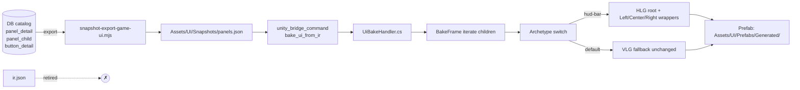

# DB-driven UI bake (retire IR.json from bake input)

## Problem

UI bake currently reads `web/design-refs/step-1-game-ui/ir.json` — a hand-transcribed mirror of CD partner output. DB catalog tables (`catalog_entity` + `panel_detail` + `button_detail` + `panel_child` + `sprite_detail`) hold the canonical UI catalog (per `ia/specs/catalog-architecture.md`). Three surfaces drift:

| Surface | BUDGET present? | Source kind |
|---|---|---|
| DB `panel_child` | yes (mig `0087_seed_growth_budget_panel.sql`) | TRUTH |
| `web/design-refs/step-1-game-ui/ir.json` | no | hand mirror |
| `Assets/UI/Prefabs/Generated/hud-bar.prefab` | no | derived (hand-tuned) |

Re-bake from current IR produced flat vertical stack (broken layout) — two bugs:

1. **Wrong source.** Bake reads IR (mirror), not DB (truth). `Assets/UI/Snapshots/panels.json` is emitted by `tools/scripts/snapshot-export-game-ui.mjs` from DB but unwired into bake driver.
2. **Missing archetype layout.** `BakePanelArchetype` switch (`Assets/Scripts/Editor/Bridge/UiBakeHandler.Archetype.cs:1042-1076`) handles only `section_header` / `divider` / `badge`. `hud-bar` archetype (and 16 others — alerts-panel, building-info, city-stats, info-panel, mini-map, pause, save-load, settings, splash, time-controls, toolbar, tooltip, zone-overlay, ...) falls through default → emits "unknown — skipped" warning. `ApplySpacing` always adds VerticalLayoutGroup at panel root → flat vertical stacking regardless of intended layout.

## Goal

DB → bake → prefab pipeline. Retire IR from bake input. Hud-bar archetype produces horizontal layout.

## Options to compare

- **(a) Bake reads `panels.json` directly.** Pre-bake step in `unity-bake-ui.ts` runs `snapshot-export-game-ui.mjs` first; UiBakeHandler reads panels.json instead of ir.json. Reshape Frame.cs slot iteration to consume `panels.json` schema (`{panel: {slug, layout, gap_px, padding_json}, children: [{ord, kind, params_json, sprite_ref}]}`).
- **(b) Bake live-reads DB.** UiBakeHandler calls into MCP `catalog_panel_get` + `catalog_button_get` at bake time. Higher coupling, no snapshot artifact, harder to reproduce.
- **(c) Generate IR from DB.** New script `emit-ir-from-db.mjs` reads DB → writes ir.json. Keep ir.json + bake unchanged. Adds intermediate surface; cheap migration but doesn't retire IR.
- **(d) Hybrid: snapshot + IR in parallel.** Until full migration, both sources active. Higher drift surface.

## Subsystem impact

- **`Assets/Scripts/Editor/Bridge/UiBakeHandler.cs` + `.Frame.cs` + `.Archetype.cs`**: input-source swap (IR → panels.json or DB-derived), archetype switch extension.
- **`tools/scripts/unity-bake-ui.ts`**: pre-bake snapshot step, env var rename (`IR_PATH` → `PANELS_PATH`).
- **`tools/scripts/snapshot-export-game-ui.mjs`**: schema may need slot-level grouping (currently flat ord-ordered children list).
- **`Assets/UI/Snapshots/panels.json`** schema: needs slot/archetype info to drive layout group emission.
- **Tests**: `tools/scripts/__tests__/unity-bake-ui.smoke.test.ts` + `validate-ui-prefab-layout-coverage.ts` adjust input file path.
- **DB catalog rule**: `ia/specs/catalog-architecture.md` already declares panels.json as snapshot output; this stage closes the loop on bake consumption.
- **Architecture decisions**: amend whichever DEC governs UI bake input source (likely DEC under `ia/specs/architecture/decisions.md` or new DEC for snapshot-driven bake).

## Implementation points (rough)

1. Extend `BakePanelArchetype` with `case "hud-bar"`: root HorizontalLayoutGroup + per-slot wrapper GameObjects (Left/Center/Right) each with HLG.
2. Reshape `BakeFrame` slot iteration (Frame.cs:102-150) to spawn children under slot-wrapper GameObjects instead of flat under panel root.
3. Decide layout primitive map: `panel_detail.layout` → root LayoutGroup type (`hstack` → HLG, `vstack` → VLG, `grid` → GridLayoutGroup). Override default ApplySpacing VLG.
4. Snapshot schema extension: add `slots[]` with `name`, `accepts`, `children[]`, optional layout hint per slot.
5. Pre-bake hook in `unity-bake-ui.ts`: invoke `node tools/scripts/snapshot-export-game-ui.mjs` before bridge mutation. Fail bake if snapshot DB query fails.
6. UiBakeHandler reads `Assets/UI/Snapshots/panels.json`; deserialize into existing `IrPanel` shape OR new `PanelSnapshot` shape.
7. Migration validators: `validate-ui-prefab-layout-coverage.ts` switch source file ir.json → panels.json.
8. Smoke: re-bake hud-bar; assert BUDGET button present + horizontal layout group at root.
9. Retire ir.json from bake input. Keep file for v1 design-ref archive (per `web/design-refs/step-1-game-ui/README.md`).

## Open decisions

- Option (a) vs (c) — full retire vs intermediate?
- Snapshot schema: extend with slots[] (matches current ir.json structure) or keep flat ord-ordered (matches current panels.json)?
- Archetype→layout map: encode in C# switch (Archetype.cs) or DB column on `panel_detail` (e.g. `archetype_layout_kind`)?
- Stage size: one stage with all archetypes or hud-bar-only first + follow-on stage for remaining 16?

## Out of scope

- PNG art for `hud_bar_icon_budget` (deferred art task).
- Reverse sync (scene → DB) — never wired, stays out of scope.
- Per-button anchor hand-tuning — replaced by DB layout primitive.

## Triggering issue

BUDGET button missing from hud-bar in MainScene after Stage 9.9 closed (DB has BUDGET via mig 0087, prefab doesn't, IR doesn't).

---

## Design Expansion

### Selected approach

**(a) Bake reads `panels.json` directly.** Pre-bake step in `unity-bake-ui.ts` invokes `snapshot-export-game-ui.mjs`; `UiBakeHandler` reads `Assets/UI/Snapshots/panels.json` instead of `ir.json`. DEC-A24 (`game-ui-catalog-bake`) already locks this path — no new architecture decision needed.

Plan ships as **two stages in one batch**:

- **Stage 9.9 — DB-driven bake.** Hud-bar archetype, snapshot-input swap, layout primitive map. BUDGET button visible.
- **Stage 9.10 — Catalog semantic naming.** Rename generic catalog rows (e.g. `illuminated-button (5)` → `power-plant-tool-button`). Convention rule + validator + migration.

**Resolved decisions** (interview gate):

| Decision | Choice |
|---|---|
| UI source | Read straight from DB via snapshot exporter |
| Snapshot shape | Flat ordered list; archetype owns zone routing |
| Layout source | DB `panel_detail.layout_template` drives bake |
| Stage scope | Hud-bar first; 16 follow-on archetypes deferred |
| Naming shape | `{purpose}-{kind}` (e.g. `power-plant-tool-button`, `population-counter-display`) |
| Naming stage split | Same batch; rename is its own stage right after bake fix |

### Components

- **`tools/scripts/snapshot-export-game-ui.mjs`** — reads DB catalog, writes `Assets/UI/Snapshots/panels.json`. Already exists; payload may extend with `layout_json.zone` per child.
- **`tools/scripts/unity-bake-ui.ts`** — pre-bake hook invokes snapshot exporter; bake fails hard if exporter fails. Env var rename `IR_PATH` → `PANELS_PATH` (keep `IR_PATH` deprecation alias for one stage).
- **`UiBakeHandler.cs` + `.Frame.cs`** — input-source swap. Deserialize `panels.json` into flat-field DTO `PanelSnapshot` + `PanelSnapshotChild` via `JsonUtility.FromJson`. All conditional fields nullable; C# switches on `kind` string to read correct subset.
- **`UiBakeHandler.Archetype.cs`** — extend `BakePanelArchetype` switch with `case "hud-bar"`: root `HorizontalLayoutGroup`, three slot-wrapper GameObjects (`Left` / `Center` / `Right`) each with own HLG. 16 other archetypes hit existing default branch unchanged.
- **Layout primitive map** — `panel_detail.layout_template` ∈ `{hstack, vstack, grid}` → `HorizontalLayoutGroup` / `VerticalLayoutGroup` / `GridLayoutGroup` at panel root. Override default `ApplySpacing` VLG. Missing `layout_template` fails bake hard with `bake.layout_template_missing` error (no silent fallback).
- **Catalog naming convention** — `ia/specs/catalog-architecture.md` §6 extension (or new `ia/rules/catalog-naming.md`). Pattern `{purpose}-{kind}` where `{purpose}` is lowercase-kebab role (`power-plant-tool`, `population-counter`, `budget-meter`) and `{kind}` is one of `{button, display, readout, picker, panel, icon}`. Forbidden: `{archetype}-(N)`, all-numeric segments, camel/Pascal case.
- **Rename migration** — new SQL migration `00XX_catalog_semantic_rename.sql` (id reserved at file time). Carries explicit `(old_slug, new_slug)` pairs for current bad rows. Updates `catalog_entity.slug` in place. Refs survive untouched because `panel_child` / `button_detail` / `sprite_detail` join by `entity_id`, not slug. New `entity_version` row written so version log preserves history.
- **Naming validator** — new `tools/scripts/validate-catalog-naming.mjs` wired into `validate:all`. Regex enforces `^[a-z][a-z0-9]+(-[a-z0-9]+)*$`; rejects `\(\d+\)` substring; asserts trailing kind suffix from allowed set. Lint-only first, hard-fail after rename migration lands.

### Data flow

```
DB catalog tables
  └─► snapshot-export-game-ui.mjs
        └─► Assets/UI/Snapshots/panels.json
              └─► unity_bridge_command (kind: bake_ui_from_ir; rename deferred)
                    └─► UiBakeHandler reads file
                          └─► BakeFrame iterates children
                                └─► Archetype switch: hud-bar → HLG + Left/Center/Right wrappers
                                      └─► Prefab: Assets/UI/Prefabs/Generated/{slug}.prefab
```

### Architecture diagram



### Subsystem impact

| Subsystem | Dependency | Invariant risk | Breaking? | Mitigation |
|---|---|---|---|---|
| `Assets/Scripts/Editor/Bridge/UiBakeHandler.cs` + `.Frame.cs` | Input-source swap; flat-field DTO | Guardrail #14 (`JsonUtility.FromJson` + flat fields) — REINFORCED | Additive: ir.json read path removed at Phase J | DTO round-trip unit test |
| `UiBakeHandler.Archetype.cs` | Switch extension `case "hud-bar"` | None | Additive only | Existing default branch unchanged for 16 other archetypes |
| `tools/scripts/unity-bake-ui.ts` | Pre-bake hook + env var rename | Guardrail #10 (bridge-first) — preserved (editor build pipeline ≠ runtime mutation) | Env var alias kept one stage | Deprecation log on `IR_PATH` use |
| `tools/scripts/snapshot-export-game-ui.mjs` | Possibly extend payload (`layout_json.zone`) | None | Additive | Schema version bump if shape changes |
| `Assets/UI/Snapshots/panels.json` | Schema authoritative; spec §5.1 says `StreamingAssets/catalog/` | Doc invariant #12 (specs as source of truth) | Path discrepancy deferred — bake is editor-time, not runtime | Follow-on stage to align path with spec |
| `tools/scripts/__tests__/unity-bake-ui.smoke.test.ts` | Smoke input file path swap | None | Additive | Coverage expansion |
| `tools/scripts/validate-ui-prefab-layout-coverage.ts` | Validator input path swap | None | Additive | Coverage expansion |
| Existing baked prefabs under `Assets/UI/Prefabs/Generated/` | Re-bake on hud-bar only; default branch panels untouched | Guardrail #9 (bake output is truth) — REINFORCED | No-op for non-hud-bar | Slot-wrapper logic gated on archetype, not universal |
| **Stage 9.10:** `db/migrations/00XX_catalog_semantic_rename.sql` | Rewrites `catalog_entity.slug` for bad rows; writes new `entity_version` | Invariant #13 (id counter immutable) — preserved (slug ≠ id) | Slug rename only; `entity_id` foreign keys untouched | Explicit `(old, new)` map authored in migration; review before apply |
| **Stage 9.10:** `tools/scripts/validate-catalog-naming.mjs` | New validator wired into `validate:all` | None | Lint-only first; hard-fail after migration lands | Two-step landing: validator emits warnings → migration ships → validator flips to error |
| **Stage 9.10:** `ia/specs/catalog-architecture.md` §6 (or new `ia/rules/catalog-naming.md`) | Convention rule documented | Doc invariant #12 (specs as source of truth) — REINFORCED | Additive | New rule entry + glossary cross-link |
| **Stage 9.10:** Re-bake all renamed rows | Prefab `GameObject.name` derived from slug → renaming changes prefab tree node names | Guardrail #9 (bake output is truth) — REINFORCED | Prefab references in scenes use stable Unity GUID, not name | Smoke test: open MainScene post-rebake, assert no missing-ref warnings |

### Implementation points (phased)

**Stage 9.9 — DB-driven bake (phases A–J).**


**A. Snapshot exporter sanity** — verify current `panels.json` shape matches forthcoming DTO; add `layout_json.zone` per child if missing.

**B. Pre-bake hook** in `unity-bake-ui.ts` — invoke `node tools/scripts/snapshot-export-game-ui.mjs` before bridge mutation. Fail bake if exporter fails (exit non-zero or throws).

**C. Env var rename** — `IR_PATH` → `PANELS_PATH`. Keep `IR_PATH` as deprecation alias one stage; log deprecation warning on use.

**D. C# DTO** — `PanelSnapshot` + `PanelSnapshotChild` flat-field shape. All conditional fields nullable (`button_slug`, `panel_slug`, `sprite_slug`, `value_kind`, `layout_json`). `JsonUtility.FromJson` does not support polymorphism — switch on `kind` string in C# code path to read correct subset.

**E. Input-source swap** — `UiBakeHandler` reads `Assets/UI/Snapshots/panels.json`; ir.json read path branch removed in Phase J.

**F. Layout primitive map** — `layout_template` → root LayoutGroup type. Missing `layout_template` fails bake hard with `bake.layout_template_missing` error including panel slug. No silent vstack fallback. Override default `ApplySpacing` VLG.

**G. Slot-wrapper iteration** — `BakeFrame` spawns children under archetype-defined slot wrappers, not flat under panel root. Gating on archetype: non-hud-bar panels keep current flat-spawn behavior.

**H. Archetype switch** — add `case "hud-bar"`: 3 slot wrappers (Left/Center/Right), each with own HLG, ordered by `layout_json.zone` from child rows.

**I. Test coverage**:
- Smoke test: re-bake hud-bar; assert BUDGET button present + HLG at root.
- DTO round-trip unit test (snapshot JSON → DTO → fields readable).
- Validator coverage for hud-bar zone assignment.
- Exporter-fails-bake negative path.
- Validator `validate-ui-prefab-layout-coverage.ts` switch input file ir.json → panels.json.

**J. Cleanup** — remove ir.json read path from `UiBakeHandler`. Keep file as v1 design-ref archive (per `web/design-refs/step-1-game-ui/README.md`).

**Stage 9.10 — Catalog semantic naming (phases K–N).**

**K. Convention rule** — author `ia/rules/catalog-naming.md` (or extend `ia/specs/catalog-architecture.md` §6). Spell out pattern `^[a-z][a-z0-9]+(-[a-z0-9]+)*$` + allowed kind suffixes `{button, display, readout, picker, panel, icon}` + forbidden patterns `\(\d+\)` and trailing numeric segments. Cross-link from glossary.

**L. Validator (lint mode)** — write `tools/scripts/validate-catalog-naming.mjs`. Wire into `validate:all`. Lint mode: emit warnings only; do not fail CI. Output table of offending rows with current slug + suggested rename.

**M. Rename migration** — reserve next migration id via `tools/scripts/reserve-id.sh`; author `db/migrations/00XX_catalog_semantic_rename.sql` with explicit `(old_slug, new_slug)` rename map covering all rows the lint pass surfaced. Each rename emits a fresh `entity_version` row preserving history. Apply migration; re-run snapshot exporter; re-bake affected panels.

**N. Validator (hard mode)** — flip `validate-catalog-naming.mjs` to error on offending rows. Add CI gate. Confirm `validate:all` green on a clean tree. Smoke: open MainScene, assert no missing-ref warnings post-rebake.

### Deferred / out of scope

- 16 follow-on archetypes (`alerts-panel`, `building-info`, `city-stats`, `info-panel`, `mini-map`, `pause`, `save-load`, `settings`, `splash`, `time-controls`, `toolbar`, `tooltip`, `zone-overlay`, …) — next stage.
- PNG art for `hud_bar_icon_budget`.
- Snapshot path move `Assets/UI/Snapshots/` → `Assets/StreamingAssets/catalog/` (spec §5.1 alignment) — bake is editor-time; runtime catalog loads not affected this stage.
- Bridge mutation kind rename `bake_ui_from_ir` → `bake_ui_from_snapshot`.
- Reverse sync (scene → DB) — never wired.
- Catalog admin web UI rename support (rename via UI, not just SQL migration) — out of scope; SQL migration covers Stage 9.10 needs.
- Bulk auto-derived rename (e.g. infer purpose from row content via heuristics) — out of scope; explicit author-curated rename map only.

### Examples

**Input — `panels.json` (hud-bar slice)**

```json
{
  "snapshot_id": "ui-2026-05-06T12:00Z",
  "kind": "ui_catalog",
  "schema_version": 2,
  "items": [
    {
      "entity_id": 42,
      "version_id": 137,
      "slug": "hud-bar",
      "kind": "panel",
      "fields": {
        "archetype": "hud-bar",
        "layout_template": "hstack",
        "gap_px": 8,
        "padding_json": {"l":12,"r":12,"t":6,"b":6}
      },
      "children": [
        {"ord":0,"slug":"hud_bar_population","kind":"button","layout_json":{"zone":"left"}},
        {"ord":1,"slug":"hud_bar_budget","kind":"button","layout_json":{"zone":"left"}},
        {"ord":2,"slug":"hud_bar_clock","kind":"button","layout_json":{"zone":"center"}},
        {"ord":3,"slug":"hud_bar_settings","kind":"button","layout_json":{"zone":"right"}}
      ]
    }
  ]
}
```

**Output — baked prefab tree**

```
hud-bar (RectTransform + HorizontalLayoutGroup spacing=8 padding=12,12,6,6)
├── Left (HorizontalLayoutGroup spacing=8)
│   ├── hud_bar_population (Button + Image)
│   └── hud_bar_budget (Button + Image)            ← was missing pre-Stage 9.9
├── Center (HorizontalLayoutGroup)
│   └── hud_bar_clock
└── Right (HorizontalLayoutGroup)
    └── hud_bar_settings
```

**Edge cases**

| Edge case | Bake behavior |
|---|---|
| `layout_template` null/missing | Fail bake hard with `bake.layout_template_missing` + panel slug. No silent fallback. |
| `children[]` empty | Emit panel root with layout group, zero slot wrappers. No warning. |
| Child `layout_json.zone` missing on hud-bar | Place under default `Center` wrapper; log `bake.zone_default` warning with child slug. |
| Archetype not in switch (`alerts-panel`, …) | Existing default branch unchanged — log `bake.archetype_unmapped` skip warning, no slot wrappers. |
| Snapshot file missing at bake time | Pre-bake hook re-runs exporter. If still absent → fail bake with `bake.snapshot_missing`. |
| DB `panel_child` ord collision | Lint catches at snapshot export time; bake assumes pre-validated input. |

**Stage 9.10 — naming examples**

Convention: `{purpose}-{kind}`.

| Current generic slug | Renamed slug | Rationale |
|---|---|---|
| `illuminated-button (5)` | `power-plant-tool-button` | Toolbar tool picker for placing power plants |
| `illuminated-button (6)` | `residential-zone-tool-button` | Toolbar zone picker for residential |
| `text-display (2)` | `population-counter-display` | Hud population readout |
| `text-display (3)` | `budget-meter-display` | Hud budget readout |
| `panel-frame (1)` | `building-info-panel` | Right-side info panel for selected building |
| `icon-tile (12)` | `power-plant-icon` | Sprite used by power-plant-tool-button |

**Validator output (lint mode, pre-migration)**

```
catalog-naming: 14 rows fail convention
  ✗ illuminated-button (5)        suggest: power-plant-tool-button
  ✗ illuminated-button (6)        suggest: residential-zone-tool-button
  ✗ text-display (2)              suggest: population-counter-display
  ...
  → run db/migrations/00XX_catalog_semantic_rename.sql to apply renames
```

**Forbidden patterns (validator rejects)**

| Bad slug | Why |
|---|---|
| `illuminated-button (5)` | Trailing `(N)` |
| `Button7` | Pascal case + trailing digit |
| `power_plant_tool_button` | Underscores instead of hyphens |
| `power-plant-tool` | Missing kind suffix |
| `5-button` | Leading digit |

### Review notes (Plan subagent)

- **Resolved BLOCKING (B1)** — DTO design uses flat-field `JsonUtility.FromJson` pattern with nullable conditional fields + `kind` string switch. No type-tag polymorphism (unsupported by `JsonUtility`). No `Newtonsoft.Json` dependency.
- **Resolved BLOCKING (B2)** — Missing `layout_template` fails bake hard. No silent vstack fallback.
- **Carry NON-BLOCKING** — snapshot path discrepancy (UI/Snapshots vs StreamingAssets/catalog) deferred; archetype scope additive (16 other archetypes hit unchanged default branch); pre-bake-fail aligns with #9, doesn't violate #10; test coverage expanded in Phase I.
- **Architectural lock** — DEC-A24 `game-ui-catalog-bake` already covers DB→snapshot→bake; no new arch decision written this run.
- **Stage 9.10 added post-review** — catalog semantic naming pulled in-scope from deferred. Two-step landing (lint warn → migration → lint error) avoids CI breakage. `entity_id` foreign keys protect refs across rename. Re-bake after migration; Unity prefab GUIDs survive `GameObject.name` change.

### Next step

Run `/ship-plan docs/explorations/db-driven-ui-bake.md` to bulk-author the master plan from this Design Expansion.
