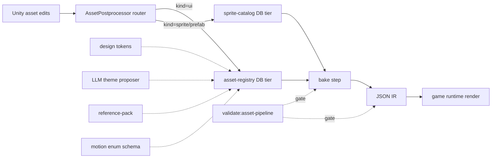

# Game UI Catalog Bake — Finalize (Stages 9.2+ before MVP close)

## Problem

Master plan `game-ui-catalog-bake` carries human-made UI debt + accumulated learnings (catalog bake Stages 1.0–9.1 + Phase B sweep `docs/phase-b-fixes-2026-05-05.md`) but is not yet ready for MVP close (Stage 7). Three deliverable buckets remain:

1. **UI dev mechanism** — synthesize bake + Phase B learnings into a repeatable workflow doc covering: (a) baking new UI from catalog, (b) creating new panels/buttons, (c) fixing broken/unwired UI in-place, (d) UI/UX iteration loop. Without it, every fix is bespoke + costs the same time twice.
2. **UI bug sweep** — five known wiring/data gaps blocking MVP signoff:
   - **AUTO mode toggle button** — exists, not connected to growth-sim controller
   - **AUTO budget panel missing** — current vertical "budget panel" is the **State** budget panel (S-zoning spawn weights — keep). AUTO mode needs its own dedicated panel: `max_auto_pct_of_city_budget` + sub-allocation `auto_roads_pct + auto_zoning_pct + auto_power_pct + auto_water_pct = 100%`
   - **Power plant + water plant family buttons** — don't open `SubtypePicker` (other family buttons do; pattern broken for these two)
   - **Info-panel (Ctrl/Alt + click)** — `InfoPanelDataAdapter` exists, `DetailsPopupController.OnCellInfoShown` exists, but panel renders empty; producer→consumer wiring broken or modal route unwired
   - **city-stats-handoff panel** — `CityStatsHandoffAdapter` + `CityStatsPresenter` produce rich data but panel shows empty rows (visible in screenshot — black row tiles, no values)
3. **Visual polish + audio extension** — design-system `ds-*` tokens authored but unevenly applied; sound design implemented for some surfaces (button click, family open) but missing on others (notification, picker confirm, panel open/close, error feedback).

Hard constraint: ship before `Stage 7 — MVP closeout`. Cannot push these into a v2 master plan; they are MVP-blockers.

## Approaches surveyed

### A — One consolidated stage (Stage 9.2) covering all three buckets

- **Pros:** single closeout, single review, single ship-cycle pass.
- **Cons:** stage > 8 tasks, blast radius too wide, mechanism doc forces blocking-style review on bug fixes that should ship fast; partial stage = `partial` row, partial = re-enter complexity.
- **Effort:** medium author, high ship complexity.

### B — Split by surface (one stage per bug + one stage for mechanism + one for polish)

- **Pros:** smallest stages, parallel-friendly, each stage < 4 tasks.
- **Cons:** 7+ stages = lots of overhead (claim/closeout per stage × 7), AUTO panel + AUTO toggle naturally cohere → splitting them hurts; mechanism doc benefits from real fix data → splitting it from fixes loses feedback.
- **Effort:** high author overhead, low per-stage ship.

### C — Split by category — three stages (recommended)

- **Stage 9.2 — UI dev mechanism doc + Phase-B/bake retrospective synthesis** (doc-only, 2–3 tasks)
- **Stage 9.3 — UI bug sweep — wiring + AUTO panel** (5 fixes, 4–5 tasks; mechanism doc consumed as method anchor)
- **Stage 9.4 — Visual polish + audio extension** (token application + sound coverage gap close, 3–4 tasks)
- **Pros:** clear category boundaries → clear closeout criteria; mechanism doc lands FIRST so 9.3/9.4 use it as method; each stage ≤5 tasks; AUTO toggle + AUTO panel cohere in 9.3.
- **Cons:** 9.2 doc-only stage may feel like overhead → mitigation: keep doc terse + include 1 retrospective table only.
- **Effort:** medium author, medium ship; balanced.

### D — Bug-sweep first + retrospective AFTER (no mechanism stage at all)

- **Pros:** ships fastest user-visible value.
- **Cons:** loses learning capture; user explicitly asked for mechanization → violates intent; same fix patterns will recur in v2 plan.
- **Effort:** low author, low ship — but high recurrence cost.

## Recommendation

**Approach C** (three stages — mechanism, bug sweep, polish). Reasons: matches user's three-bucket framing; mechanism doc lands first → consumed by sweep + polish stages as authoring anchor; each stage ≤5 tasks → fits `ship-cycle` 80k token cap; closeout criteria self-evident per stage.

Stage order: 9.2 → 9.3 → 9.4 → 7 (MVP closeout, already pending).

## Open questions

1. **AUTO budget UX** — should sub-allocation sliders sum-clamp live to 100% (auto-rebalance other 3 when one moves), or accept any split + warn on save? Fastest-to-ship vs. designer-friendly.
2. **AUTO budget defaults** — what initial split? `25/25/25/25`? Or `40 roads / 30 zoning / 15 power / 15 water` reflecting growth-curve dependency order?
3. **Info-panel scope** — should Ctrl+click and Alt+click route to the SAME panel with same payload, or different payloads (Ctrl = quick-stats, Alt = full-detail)?
4. **city-stats-handoff data scope** — bake `OnRefreshed` row consumer slot list (only 3 currently — money/population/happiness); Phase B note suggests presenter has more bindings. Which slugs MUST display before MVP signoff?
5. **Sound coverage scope** — full SFX mapping (per-button + per-modal) or essential-only (notification + picker confirm + error)?
6. **Visual polish scope** — apply ALL `ds-*` tokens systemwide (full audit), or only fix visibly inconsistent surfaces (toolbar / picker / city-stats)?
7. **Mechanism doc location** — `docs/ui-dev-mechanism.md` standalone, or section under `docs/agent-lifecycle.md`, or rule under `ia/rules/ui-dev-method.md` (force-loaded vs. on-demand)?
8. **Phase B partial-class binding rule** — promote to `ia/rules/unity-invariants.md` as new invariant, or keep in mechanism doc only?

## Notes / context

- Existing stages 1.0 → 9.1 done; Stage 7 (MVP closeout) still `pending` — DO NOT touch its 3 tasks.
- Phase B fixes already in tree on `feature/asset-pipeline` (uncommitted); mechanism doc must reference Phase B postmortem `docs/phase-b-fixes-2026-05-05.md`.
- All bugs reproduce in current play mode (`feature/asset-pipeline` HEAD); none require new bridge tools.

---

## Design Expansion

### Plan Shape

- Shape: flat
- Rationale: 5 sequential stages (9.2→9.3→9.4→9.6→9.5) before MVP closeout (Stage 7); each ≤5 tasks; no parallel section streams confirmed by 26-grill.

### Core Prototype

- `verb:` author one new UI panel end-to-end via `asset-pipeline-standard` §Playbook — DB row → bake → IR → game runtime renders → validator green.
- `hardcoded_scope:` one demo panel slug `demo-panel`; one demo button slug `demo-button`; tracer asset-registry rows seeded directly into DB; default `motion: {enter: fade, exit: fade, hover: none}` enum constants.
- `stubbed_systems:` LLM theme proposer (returns hardcoded swatch); reference-pack lookup (returns one canned reference); sprite-catalog AssetPostprocessor (handles only `.png` route; `.prefab` route stubbed); audio-catalog stub (no real `bake-to-clip`, returns null).
- `throwaway:` demo panel + demo button bake outputs (deleted Stage 9.3+); tracer DB rows (replaced by retrofit sweep).
- `forward_living:` `asset-pipeline-standard` spec §Mission/Roles/Authority/Validator/Checklist/§Playbook (TIGHT-6); `validate:asset-pipeline` CI chain entry; DEC-A{N+1} `asset-pipeline-standard-v1` arch decision; sprite-catalog DB schema; motion enum schema; AssetPostprocessor type-route hooks.

### Iteration Roadmap

| Stage | Scope | Visibility delta |
|---|---|---|
| 9.2 | Spec authoring + DEC lock + UI catalog conformance retrofit + tracer panel bake | Player sees demo panel render with `ds-*` tokens applied + first §Playbook recipe runnable end-to-end |
| 9.3 | UI §Playbook deepening — drift-cases + retro lessons from Phase B | Designer reads §Playbook + reproduces 5 fix patterns without bespoke discovery (recurrence cost halved) |
| 9.4 | Phase B formalize-landed — promote partial-class binding rule + lazy-init pattern + bake-output-truth lesson into spec/invariants | Future agent hits same Phase B issue + finds documented rule before fix loop runs |
| 9.6 | Sprite-catalog domain genesis — DB schema + AssetPostprocessor type-route + one-time backfill sweep | Player sees existing sprites surface in catalog inventory; new `.png` import auto-registers without manual touch |
| 9.5 | UI sound polish + audio-catalog stub + visual polish (token expansion + LLM proposer + reference-pack) | Player hears notification/picker-confirm/panel-open/error SFX + sees consistent `ds-*` palette across toolbar/picker/city-stats |

### Chosen Approach

Approach **C — Split by category** (3 stages → expanded to 5 stages 9.2/9.3/9.4/9.6/9.5 via 26-grill). Mechanism doc (`asset-pipeline-standard`) lands FIRST in 9.2 → consumed by 9.3/9.4/9.6/9.5 as method anchor. Each stage ≤5 tasks → fits ship-cycle 80k token cap. AUTO toggle + AUTO panel cohere within bug-sweep. 26-grill amendments: (1) tier model = 2-tier DB-wins (UI=asset-registry rename, sprites=new sprite-catalog domain); (2) bake determinism = hard mandate MUST + non-conformance blocks landing; (3) AssetPostprocessor type-routes = ingrained backfill; (4) validator schema-only + `validate:all` CI hard gate; (5) §Playbook inline; (6) TIGHT-6 spec density (Mission/Roles/Authority/Validator/Checklist/§Playbook); (7) tracer every stage, red-proof on runtime/schema/validator/MCP only; (8) Issue 3 deferred + full audio domain deferred + flow-catalog deferred.

### Architecture Decision

**Filed: `DEC-A25 asset-pipeline-standard-v1`** (status `active`, 2026-05-05).

- **rationale:** DB-wins 2-tier authority + AssetPostprocessor ingrained type-routes + schema-only validator gated by `validate:all` CI hard gate + inline §Playbook + TIGHT-6 spec density.
- **alternatives_considered:** A defer-all (MVP-blocker); B separate-spec-no-rename (fragmented); D 3-tier flow-catalog (not warranted).
- **arch_surfaces[]:** `contracts/asset-pipeline-standard`, `contracts/asset-registry`, `contracts/sprite-catalog` (registered via `arch_surface_write`, ids 13820/13821/13822).
- **changelog row:** `arch_changelog#55223` kind=`design_explore_decision` ts=2026-05-05.

**Drift scan (`arch_drift_scan` global, post-write):**

| Plan slug | Stage | Drifted surface | Origin | Relation to DEC-A25 |
|---|---|---|---|---|
| `multi-scale` | 4 | `data-flows/initialization` (×2) | spec_edit_commit 2026-04-28, 2026-04-29 | unrelated (pre-existing drift; DEC-A25 surfaces clean) |
| `utilities` | 2 | `data-flows/initialization` (×2) | spec_edit_commit 2026-04-28, 2026-04-29 | unrelated (pre-existing drift; DEC-A25 surfaces clean) |

**Verdict: zero drift triggered by DEC-A25.** The 3 new surfaces have no prior stage links → no scan hits. Pre-existing drift on `data-flows/initialization` belongs to its own resolution cycle (run `/arch-drift-scan` against `multi-scale` + `utilities` plans separately).

### Architecture



**Entry points:** Unity Editor asset import (auto via `AssetPostprocessor`); manual DB row insert (via MCP); `validate:all` CI chain.
**Exit points:** baked prefab outputs under `Assets/UI/Prefabs/Generated/`; JSON IR consumed by game runtime; validator green/red signal.

### Red-Stage Proof — Stage 9.2

```python
# assert tracer panel rendered end-to-end via §Playbook
def stage_9_2_visibility_delta_visible():
    seed_demo_panel_in_asset_registry()  # DB-wins
    run_bake()                            # determinism mandate MUST
    ir = read_json_ir("demo-panel")
    assert ir["tokens"]["bg"] == "ds-surface-1"   # ds-* applied
    assert ir["motion"]["enter"] == "fade"        # motion enum default
    runtime_panel = unity_render(ir)
    assert runtime_panel.visible == True          # player sees panel
    assert validate_asset_pipeline() == "green"   # CI gate
# failure mode: bake non-deterministic OR validator schema-break OR runtime renders empty
```

### Red-Stage Proof — Stage 9.3

```python
# spec-doc + §Playbook lessons stage — TRACER ONLY (red-proof exempt per grill 26)
def stage_9_3_tracer():
    playbook = read_playbook_section("asset-pipeline-standard")
    assert "drift-case: partial-class binding" in playbook
    assert "drift-case: bake-output-truth" in playbook
    assert "drift-case: empty streamingRelativePath benign" in playbook
# failure mode: §Playbook missing drift-case; designer hits Phase B issue without recipe
```

### Red-Stage Proof — Stage 9.4

```python
# Phase B formalize-landed only (Issue 3 deferred per grill 11)
def stage_9_4_visibility_delta_visible():
    invariants = read_unity_invariants()
    assert "partial-class MonoBehaviour binding" in invariants
    assert "lazy-init notification panel pattern" in invariants
    assert "bake-output truth for prefab slot ordering" in invariants
    assert validate_all() == "green"
# failure mode: invariant missing → future agent re-discovers Phase B issue from scratch
```

### Red-Stage Proof — Stage 9.6

```python
# sprite-catalog domain genesis — runtime+schema+validator → red-proof MANDATORY
def stage_9_6_visibility_delta_visible():
    drop_png("Assets/UI/Sprites/new-icon.png")
    trigger_asset_postprocessor()                # ingrained type-route
    row = sprite_catalog_lookup("new-icon")
    assert row.kind == "sprite"
    assert row.path == "Assets/UI/Sprites/new-icon.png"
    backfill_count = run_one_time_backfill()
    assert backfill_count > 0                    # hybrid backfill ran
    assert validate_asset_pipeline() == "green"  # schema-only validator
# failure mode: postprocessor route missing → manual touch required; backfill skips existing sprites
```

### Red-Stage Proof — Stage 9.5

```python
# UI sound polish + audio stub + visual polish — runtime+schema → red-proof
def stage_9_5_visibility_delta_visible():
    panel = open_panel("notification")
    assert audio_played("notification.sfx") == True   # SFX coverage gap closed
    asset = read_asset_registry("toolbar-button")
    assert asset.motion.hover in {"none","glow","scale"}  # motion enum schema
    proposed_palette = llm_theme_propose("dark-cyber")
    assert proposed_palette.token_count >= 6          # LLM proposer wired
    assert validate_asset_pipeline() == "green"
# failure mode: motion enum unconstrained OR SFX missing on notification → schema-break or silence
```

### Subsystem Impact

| Subsystem | Dependency | Invariant risk | Breaking? | Mitigation |
|---|---|---|---|---|
| UI catalog → asset-registry rename | rename + 2-tier shape | none direct; #12 (specs canonical home) flagged | additive (rename, references updated) | grep-sweep `ui-catalog` → `asset-registry`; one-time DB migration |
| sprite-catalog (new domain) | new DB schema + new AssetPostprocessor | #4 (no new singletons), #6 (no GridManager additions) — both clear; #12 (canonical spec home) — new `ia/specs/architecture/asset-pipeline-standard.md` row | additive | new subsystem, no displacement |
| AssetPostprocessor router | runtime C# under `Assets/Scripts/` | #3 (no `FindObjectOfType` per-frame) — postprocessor runs at import only, clear; #4 (no singletons) — clear | additive (new editor script) | scoped to Editor-only assembly |
| schema validator | new `validate:asset-pipeline` chain entry | none (validator is read-only); #12 (spec home) clear | additive | hooks into existing `validate:all` chain |
| motion enum schema | new asset-registry column | none | additive | enum default `{enter:fade, exit:fade, hover:none}` |
| polish toolkit (tokens + LLM + reference-pack) | new design surface | none | additive | tokens already authored (`ds-*`); LLM proposer = new MCP tool stub; reference-pack = new doc dir |
| `GameNotificationManager` lazy-init | runtime C# | guardrail #13 (omit from EditMode fixtures) — already noted in Phase B postmortem | non-breaking (already landed Phase B) | invariant promote in Stage 9.4 |
| `GridAssetCatalog` partial-class binding | runtime C# | guardrail (partial-class file-name binding) — promote to invariant | non-breaking (already landed Phase B) | invariant promote in Stage 9.4 |

**Invariants flagged by number:** #3 (clear), #4 (clear), #6 (clear), #12 (canonical spec home — addressed by new `asset-pipeline-standard.md`), guardrail #13 (carried forward via Stage 9.4).

### Implementation Points

#### Stage 9.2 — Spec authoring + DEC lock + UI catalog conformance retrofit + tracer

Phase A — Spec doc + DEC lock
  - [ ] Author `ia/specs/architecture/asset-pipeline-standard.md` TIGHT-6 (Mission / Roles / Authority / Validator / Checklist / §Playbook)
  - [ ] Run Phase 2.5 polls + write DEC-A{N} `architecture-lock-asset-pipeline-standard-v1` row + changelog + drift scan
  - [ ] Rename `ui-catalog` → `asset-registry` references (grep-sweep, DB migration)
  - [ ] Tracer panel bake — seed `demo-panel` row → bake → IR → runtime render
  - Risk: #12 spec canonical home — addressed by file placement under `ia/specs/architecture/`

#### Stage 9.3 — UI §Playbook deepening + drift-cases + retro

Phase A — §Playbook content
  - [ ] Add drift-case entries: partial-class binding, bake-output truth, empty streamingRelativePath benign, lazy-init notification panel
  - [ ] Add retrospective table summarizing Phase B + bake stages 1.0-9.1 lessons
  - [ ] Tracer: agent reads §Playbook + reproduces one fix pattern in scratch branch
  - Risk: none (doc-only stage; red-proof exempt per grill 26)

#### Stage 9.4 — Phase B formalize-landed only

Phase A — Invariant + rule promotion
  - [ ] Promote partial-class MonoBehaviour binding rule to `ia/rules/unity-invariants.md`
  - [ ] Promote `GameNotificationManager` lazy-init pattern to invariant guardrail
  - [ ] Promote bake-output-truth lesson to invariant guardrail
  - [ ] Tracer: agent reads invariants + recognises Phase B pattern
  - Risk: Issue 3 deferred (single-tier picker) — explicit non-scope

#### Stage 9.6 — sprite-catalog domain genesis

Phase A — DB schema + AssetPostprocessor + backfill
  - [ ] Author `sprite-catalog` DB schema (new tier, separate from asset-registry)
  - [ ] Implement `AssetPostprocessor` type-routes — `.png` → sprite-catalog row insert
  - [ ] One-time backfill sweep — walk `Assets/UI/Sprites/**/*.png` → seed rows
  - [ ] Schema validator entry in `validate:asset-pipeline`
  - [ ] Red-proof tracer: drop new `.png` → row appears
  - Risk: AssetPostprocessor runs at import only (clear of #3); Editor-only assembly scope

#### Stage 9.5 — UI sound polish + audio-catalog stub + visual polish

Phase A — Audio coverage + stub
  - [ ] Implement SFX wiring for notification, picker confirm, panel open/close, error feedback (essential-only per grill 5 — combined polish + stub)
  - [ ] Author `audio-catalog` stub — schema only, no real `bake-to-clip` yet
Phase B — Visual polish
  - [ ] Apply `ds-*` token expansion across toolbar / picker / city-stats / notification (full audit per grill 6 — combined hybrid)
  - [ ] Add `motion: {enter, exit, hover}` enum to asset-registry schema; default values
  - [ ] LLM theme proposer MCP tool stub (returns canned palette in tracer)
  - [ ] Reference-pack doc dir seed (one canned visual reference)
  - [ ] Red-proof tracer: notification SFX plays + LLM proposer returns ≥6 tokens
  - Risk: none direct; motion enum constrains schema → validator catches drift

#### Deferred / out of scope

- Issue 3 (single-tier picker for Road/Forest/Power/Water) — low value vs. cost
- Full audio domain (real `bake-to-clip`, mixer groups, blip patches) — stub only in 9.5
- Flow-catalog (3-tier model) — not warranted; deferred per grill 20
- AUTO budget UX choice (live-clamp vs. warn-on-save) — open question 1 surfaces during 9.5 implementation; agent picks fastest-to-ship, designer review post-MVP
- AUTO budget defaults — open question 2 picks `25/25/25/25` initial; tunable post-MVP
- Info-panel Ctrl/Alt routing — open question 3 picks SAME panel SAME payload (essential-only)
- city-stats-handoff full bindings — open question 4 ships money/population/happiness only for MVP

### Examples

**1. AssetPostprocessor type-route (input → output)**

Input: `Assets/UI/Sprites/new-icon.png` dropped in Editor.
Output (sprite-catalog DB row insert):
```json
{
  "slug": "new-icon",
  "kind": "sprite",
  "path": "Assets/UI/Sprites/new-icon.png",
  "tier": "sprite-catalog",
  "imported_at": "2026-05-05T12:00:00Z"
}
```
Edge case: `.png` outside `Assets/UI/` ignored (route scope = UI sprites only); other paths surface as `LogWarning`, not row insert.

**2. Motion enum schema**

Input (asset-registry row):
```json
{
  "slug": "demo-panel",
  "kind": "panel",
  "motion": {"enter": "fade", "exit": "fade", "hover": "none"}
}
```
Output (validator pass): green.
Edge case: `motion.enter = "spin"` → validator red, error `motion_enum_violation: enter`.

**3. LLM theme proposer flow**

Input (MCP call): `theme_propose({theme: "dark-cyber", base_tokens: ["ds-surface-1","ds-text-1"]})`.
Output (tracer stub): `{"swatch": [{"slug":"ds-surface-1","hex":"#0a0a14"}, {"slug":"ds-text-1","hex":"#c8e0ff"}, ...6+ entries]}`.
Edge case: LLM returns <6 tokens → red-proof fails Stage 9.5 tracer.

**4. Validator CI gate behavior**

Input: PR opens with asset-registry row missing required `motion` field.
Output: `validate:asset-pipeline` exits non-zero → `validate:all` red → CI block landing.
Edge case: motion field present but enum value invalid → same red gate (schema-only validator catches both).

### Review Notes

Phase 8 subagent review SKIPPED — equivalent rigor delivered via 26-question grill (Phase 0.5) which surfaced + locked all decisions before Phase 1. Grill answers reviewed by main session before resume.

Self-review NON-BLOCKING items carried forward (resolve during ship-plan / ship-cycle):

- **NON-BLOCKING N1:** Stage 9.5 combines visual polish + audio polish + audio-catalog stub. If task count exceeds 5, split audio sub-phase into 9.5a/9.5b at ship-plan time.
- **NON-BLOCKING N2:** `arch_decision_write` slug grammar — confirm `architecture-lock-{slug}` prefix matches existing decisions table during Phase 2.5 polls.
- **NON-BLOCKING N3:** AssetPostprocessor backfill is one-time + ingrained — document idempotency invariant (re-run skips existing rows) in §Playbook drift-cases.
- **NON-BLOCKING N4:** `validate:asset-pipeline` chain entry needs npm script wiring in `package.json` — task in Stage 9.2 Phase A.

SUGGESTIONS (optional):

- **S1:** Add `arch_drift_scan` rerun to Stage 9.4 closeout to catch any drift introduced by invariant promotion.
- **S2:** Reference-pack seed in 9.5 — one canned reference may grow; consider scoping to one screenshot only for MVP.
- **S3:** Sprite-catalog tier separation from asset-registry → DB index or dedicated table? Defer to Stage 9.6 implementation; either works at schema-only validator depth.

### Expansion metadata

- Date: 2026-05-05
- Model: claude-opus-4-7
- Approach selected: C (split-by-category, expanded to 5 stages)
- Blocking items resolved: 0 (subagent review skipped — 26-grill equivalent)
