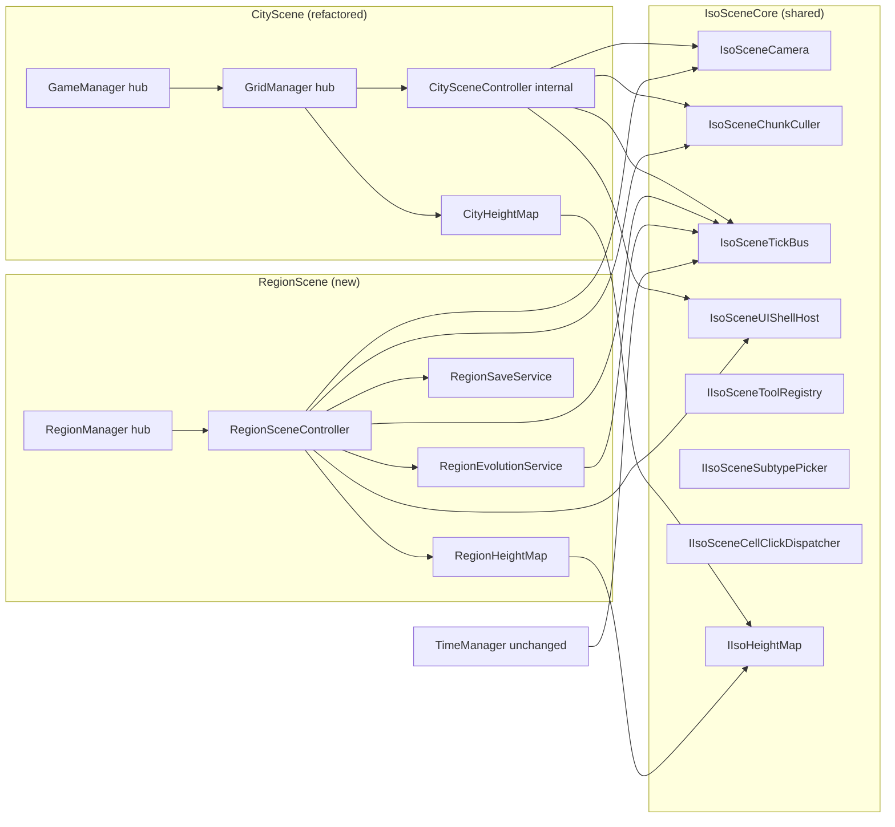
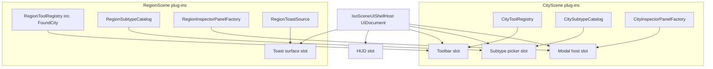
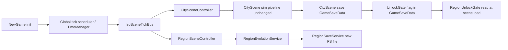

# RegionScene Prototype — Exploration Seed

> **REMINDER — prototype scope + post-prototype expansion.** This plan unblocks scene zoom-transition work + closes MVP gap (region-scale view absent in most genre peers). Stage 1.0–5.0 ship a CityScene-shaped RegionScene (same 64×64 grid, same terrain prefab kinds reskinned, same height/water/cliff logic). Post-prototype expansion (separate plan, not in scope here) replaces region geography wholesale — distinct region-scale terrain prefabs, new geo-feature set, new terrain-height definition, new geo logic (region cliffs/slopes/water/forest scaling rules), plus a full art pass on region-tile sprites. Treat current prototype as the unblock; do NOT over-invest in geo-tile art or geo-logic generality during prototype.

**Status:** Design expansion complete. Ready for `/master-plan-new`.
**Gate:** Run only after `ui-toolkit-migration` plan ships.
**Source:** Derived from `docs/explorations/assets/city-scene-loading-research.md` Design Expansion — RegionScene + Zoom, corrected 2026-05-13.

---

## Problem Statement

The game currently has only one map view: CityScene, a 64×64 isometric grid where the player manages a city. There is no zoomed-out regional view. The RegionScene is a new map layer that shows the broader region the city sits within — other cities, roads, forests, terrain — at a coarser visual scale. The player needs to be able to navigate, terraform, and eventually found new cities from this view.

RegionScene must feel like a natural extension of CityScene: same isometric camera, same toolbar/HUD layout, same interaction model — but operating at region scale with its own set of tools and cell types.

---

## Known Design Decisions

### Grid

- RegionScene uses a **64×64 grid of region-cells** — same resolution as CityScene.
- Each region-cell is visually larger than a city-cell (exact world-unit size TBD during grilling).
- Region-cell terrain types: **grass, slopes, water slopes** — human-made prefabs (not reused from CityScene).

### City-to-region mapping rule

- **32×32 city-cells = 1 region-cell.**
- A standard 64×64 city therefore occupies **2×2 region-cells**.
- The player's city footprint is anchored at the **(0,0) corner** of its 2×2 region-cell area.
- Player city starts at the **center** of the 64×64 region grid (approximately cells [31–32, 31–32]).
- Future city sizes (non-64×64) use the same 32×32 chunk rule; transformation undefined beyond 64×64 for now.

### Neighbor regions

- The region grid shows **neighbor regions** surrounding the player's region. How these are generated (procedurally, from seed, pre-authored) is an open question.

### Basic UI (same layout as CityScene)

| Tool | Icon | Prefab |
|---|---|---|
| Road tool | Same icon as CityScene | New human-made region-road prefab |
| Forest tool | Same icon as CityScene | New human-made region-forest prefab |
| Bulldozer tool | Same icon as CityScene | — |
| **Found City** | New human-made icon | New human-made prefab |

- Same HUD bar layout as CityScene.
- Same toolbar layout as CityScene.
- Same picker widget as CityScene.
- Mini-map: same style as CityScene mini-map, but rendering RegionScene grid.

### Code structure

- `RegionGridManager` — new hub MonoBehaviour, inspector-attached in `RegionScene.unity`. Structurally mirrors `GridManager` but operates on region-cells.
- New domain services under `Domains/Geography/Services/` for region-cell rendering, region data.
- Hub constraint (invariant #13): existing hubs not renamed/moved/deleted. `RegionGridManager` = new file, new scene.

---

## Open Questions (to be grilled by design-explore)

### Grid + terrain
1. What is the world-unit size of one region-cell vs one city-cell? (Determines camera orthographic size for RegionScene.)
2. Does region terrain have elevation (height values)? Or is RegionScene flat with terrain types only?
3. How are slopes and water slopes oriented? Same isometric rules as CityScene (south+east cliff faces only)?
4. What does the default procedurally generated RegionScene terrain look like? How much water? Forest density?

### City footprint + neighbors
5. How are neighbor regions generated? Procedurally from a seed? Pre-authored stubs? Empty until player founds cities?
6. Do existing `RegionalMap` + `TerritoryData` data structures survive or get replaced by a new region-cell model?
7. What does a neighboring city look like in RegionScene before the player zooms in? A filled 2×2 block? A sprite?

### Tools
8. **Road tool**: What does a region-road connect? Cities? Can roads span across city footprints?
9. **Forest tool**: Plants forest at region-cell scale — does this affect the CityScene when the player zooms in?
10. **Bulldozer**: Removes roads, forests, or terrain features? Can it affect a city footprint cell?
11. **Found City**: Player selects empty region-cell(s) to place a new city. How many cells does founding require? Is there a minimum distance from existing cities? What happens to the region-cell terrain under the new city?

### UI + HUD
12. What stats does the HUD bar show in RegionScene? (CityScene shows population, funds, etc.) Region-level equivalents?
13. Does the picker widget in RegionScene work identically to CityScene? What categories does it show?
14. Does the mini-map auto-generate from the region grid, or does it require a separate render pass?

### Save + load
15. How is RegionScene state saved? Extension of existing `GameSaveData`? Separate save file?
16. When the player saves in CityScene, does the city footprint in RegionScene update automatically?

### Performance
17. 64×64 region-cells at region scale — does the existing `ChunkCullingSystem` pattern apply, or is a new culling strategy needed?

---

## Approaches

*To be developed during `/design-explore docs/explorations/region-scene-prototype.md` session.*

---

## Notes

- This exploration feeds `region-scene-prototype` master plan.
- `city-region-zoom-transition` plan depends on this plan shipping first.
- Approach D (Addressables + Tilemap migration) is deferred and does not block this prototype.
- Date seeded: 2026-05-13.

---

## Design Expansion

### Architecture Decision

- **Decision id:** DEC-A29
- **Title:** iso-scene-core-shared-foundation
- **Status:** active
- **Surface:** `contracts/iso-scene-core-foundation` (NEW, kind=contract, id=40197, spec_path=`docs/explorations/region-scene-prototype.md`, spec_section=`Design Expansion — Architecture Decision`)
- **Rationale:** RegionScene is the second isometric scale-tier scene. One-off duplication (Approach A) creates two divergent stacks for camera/culling/tick/UI shell. Generic `ScaleTierScene<TCell,TState>` (Approach C) over-engineers before the third tier exists. Extract-then-fork (Approach D) risks fork drift. Shared `IsoSceneCore` (Approach B) extracts ONLY the proven shared seams (camera, chunk culling, tick bus, UI shell, registries, heightmap interface) as composable services + a plugin/registration pattern. CityScene refactors into the same shape via hub facades; RegionScene composes from day one.
- **Alternatives considered:** A one-off duplication / C generic scale-tier base class / D extract then fork. Matrix below.
- **Changelog enqueue:** job_id `9dbef740-ed8d-46dc-ba93-1149750b18e3` (cron drains to `arch_changelog`).
- **Drift scan:** 8 pre-existing affected stages flagged on unrelated surfaces (`data-flows/persistence`, `data-flows/initialization`) — NOT caused by DEC-A29 (new surface). Notable overlap: existing `multi-scale` master plan stages 4.0 + 14.0 — `/master-plan-new` MUST coordinate slug.

#### Hub-preservation rule (HARD, applies to every stage)

Unity Inspector-connected hub scripts (`GameManager`, `GridManager`, `GeographyInitService`, `UIManager`, future `RegionManager`, etc.) NEVER renamed, moved, or deleted during the iso-core refactor.

- Iso-core reusable logic → NEW scripts under `Assets/Scripts/Domains/IsoSceneCore/Services/` (or per-domain subfolder). Namespace `Territory.IsoSceneCore.*`.
- Hub scripts stay in current file path, class name, namespace, Inspector serialization untouched. They become thin facades holding refs to IsoSceneCore services + delegating via composition.
- New RegionScene hubs (e.g. `RegionManager`) are NEW scripts, freely designed at creation; once Inspector-wired into `RegionScene.unity`, the same rule applies — no later rename/move/delete.
- Carve-out for invariant #5 (GridManager grid access): IsoSceneCore services live under `Assets/Scripts/Domains/IsoSceneCore/Services/` and hold a composition reference to their owning hub (GridManager for CityScene; RegionManager for RegionScene); share trust boundary.

### Approach matrix

| Criterion | A — One-off duplicate | **B — Shared IsoSceneCore (LOCKED)** | C — Generic `ScaleTierScene<TCell,TState>` | D — Extract then fork |
|---|---|---|---|---|
| Constraint fit | Drift between scenes; toolbar/HUD inconsistencies appear within weeks. | Camera + culling + tick + UI shell shared by contract; per-scene plugins for terrain/sim/UI/tools. | Solves a 3rd-tier problem we don't have; type parameters force premature shape. | Same as B at start, then forks diverge silently. |
| Effort | Lowest now, highest later (every new tier = new copy). | Medium — one extract pass + composition wiring. | Highest — generic abstraction + 2 concrete instantiations. | Medium — extract once, refactor twice (fork divergence). |
| Output control | High per-scene, low cross-scene parity. | High cross-scene parity via shared seams; per-scene plug-ins keep local control. | Low — generic base resists per-scene exceptions. | High initially, low after first fork divergence. |
| Maintainability | Two copies to fix every bug. | Single source of truth for shared seams; plugins isolate per-scene logic. | Type-parameter churn each time semantics shift. | Forks drift; same as A in 6 months. |
| Dependencies / risk | Low coupling, high duplication. | New `IsoSceneCore` namespace + plugin pattern; refactor risk mitigated by hub-preservation rule. | High — base class refactors ripple across both scenes. | Refactor + fork-merge risk; worst of both worlds. |
| Scalability to future tiers | Linear cost per tier. | Incremental generification when 3rd tier arrives (proven seams only). | Best in theory; depends on getting the generic shape right pre-evidence. | Each fork = new code path. |

**Decision:** B locked. Rationale above. Future country-tier or world-tier scale will incrementally lift proven seams from RegionScene plug-ins back into IsoSceneCore when the 3rd concrete instance lands.

### Components

Namespaces + responsibilities. One line each.

#### `Territory.IsoSceneCore.*` (new — `Assets/Scripts/Domains/IsoSceneCore/`)

- `IIsoSceneHost` — composition contract; scene registers tools, subtype catalogs, inspector factories, click handler, heightmap impl.
- `IsoSceneCamera` — pan/zoom/displacement service; extracted from GridManager + camera code; GridManager remains hub facade.
- `IsoSceneChunkCuller` — visible-cell windowing service; subscribes to camera changes; raises visible-set deltas.
- `IsoSceneTickBus` — global tick subscription multiplexer; producer = `TimeManager` (unchanged); consumers = per-scene evolution services.
- `IIsoHeightMap` — interface; CityHeightMap + RegionHeightMap implement; reads height/water/cliff per cell.
- `IsoSceneUIShellHost` — UIDocument-rooted shell with slots for HUD, Toolbar, Subtype picker, Modal host, Toast surface; hand-authored UXML per parity-recovery patterns.
- `IIsoSceneToolRegistry` — per-scene tool registration into shared toolbar slots.
- `IIsoSceneSubtypePicker` — generic picker; scenes register subtype catalogs.
- `IIsoSceneZonePaintHost` — paint mechanism shell; per-scene zone definitions plug in.
- `IIsoSceneCellClickDispatcher` — left/right-click routing to per-scene handlers.
- `IsoSceneTimeControl` — speed/pause control bound to global tick.
- `IsoSceneCellHoverDispatcher` — hover event routing (companion to click).

#### `Territory.RegionScene.*` (new — `Assets/Scripts/RegionScene/`)

- `RegionManager` — NEW hub MonoBehaviour, Inspector-wired in `RegionScene.unity`. Owns composition root + holds refs to IsoSceneCore services.
- `RegionSceneController` — pure C# orchestrator owned by `RegionManager`; composes IsoSceneCore services + RegionScene services.
- `RegionHeightMap` — height layer data + reader; implements `IIsoHeightMap`.
- `RegionWaterMap` — water layer data + reader.
- `RegionCliffMap` — cliff layer data + reader.
- `RegionCellRenderer` — sprite render per cell (grass / slope / water-slope / cliff face).
- `RegionEvolutionService` — pop + urban-area evolution per global tick.
- `RegionCellData` — POCO (terrain kind, pop, urban_area, owning_city_id?).
- `RegionSaveService` — new FS save file format + load; links region ↔ N cities.
- `RegionToolCreateCity` — region-level city-creation tool; registers into shared toolbar.
- `RegionCellInspectorPanel`, `RegionCellHoverPanel`, `RegionCitySummaryPanel` — UI Toolkit UIDocuments (UXML + USS + C# host) registered into IsoSceneCore slots.
- `RegionCellClickHandler` — routes left/right click through `IIsoSceneCellClickDispatcher`.
- `RegionUnlockGate` — checks unlock flag (from CityScene save) to enable RegionScene access.

#### Refactored CityScene (hub-preservation rule — paths + names + Inspector untouched)

- `GameManager.cs`, `GridManager.cs`, `GeographyInitService.cs`, `UIManager.cs` — stay in place.
- Internally: extract camera + chunk-culling + tick subscription + UI-shell logic into `IsoSceneCore` services; hubs hold refs + delegate.
- Add `CityHeightMap` impl of `IIsoHeightMap` adapting existing `HeightMap` (invariant #1 — HeightMap[x,y] == Cell.height — unchanged).

#### Non-scope (explicit)

- DB-driven UI baking refactor.
- Scene transition mechanics (companion exploration `docs/explorations/assets/city-scene-loading-research.md`).
- Scale tiers above region (country, world, solar).
- Region zone-paint zone definitions (TBD — open question).
- Multi-region world map (single region in prototype).
- Visual evolution overlay / heatmap (post-prototype).
- Return-path scene-load mechanic (post-prototype).

### Data flow

1. NewGame init → global tick scheduler (`TimeManager`) starts → CityScene loads.
2. CityScene composes IsoSceneCore via `GameManager` facade → `GridManager` registers camera + culling + tick + UI shell.
3. Player plays CityScene → unlock condition (hardcoded for prototype, e.g. pop ≥ 1000) triggers `RegionUnlockGate.Enable()` → flag saved in `GameSaveData`.
4. Player loads RegionScene via main menu (transitions deferred). For prototype, RegionScene loaded fresh as separate scene file.
5. `RegionManager.Awake()` instantiates IsoSceneCore services + composes RegionScene services. `RegionEvolutionService.Start()` subscribes to `IsoSceneTickBus` (deferred per invariant #12 — `Resolve<T>` in Start, never Awake).
6. Global tick fires (`TimeManager` → `SimulationManager.ProcessSimulationTick()` continues per `sim §Tick execution order`) → `IsoSceneTickBus.Publish(tick)` → `RegionEvolutionService` evolves pop + urban-area per cell.
7. Player hovers region cell → `IsoSceneCellHoverDispatcher` → `RegionCellHoverPanel` updates.
8. Player left-clicks region cell → `IIsoSceneCellClickDispatcher.Dispatch(cell, Left)` → `RegionCellClickHandler` shows `RegionCellInspectorPanel` (or `RegionCitySummaryPanel` if cell carries `owning_city_id`).
9. Player right-clicks region cell w/ city → `RegionCitySummaryPanel` opens with "Enter City" button (disabled — transition deferred).
10. Save trigger → `RegionSaveService` writes new FS save file (`<save>.region.json`) linking region grid ↔ city ids.

### Interfaces

C# signatures (final shape may iterate during implementation):

```csharp
namespace Territory.IsoSceneCore
{
    public interface IIsoSceneHost
    {
        void RegisterHeightMap(IIsoHeightMap map);
        void RegisterToolRegistry(IIsoSceneToolRegistry registry);
        void RegisterSubtypePicker(IIsoSceneSubtypePicker picker);
        void RegisterCellClickHandler(IIsoSceneCellClickHandler handler);
        void RegisterInspectorPanelFactory(IIsoSceneInspectorPanelFactory factory);
        IsoSceneCamera Camera { get; }
        IsoSceneChunkCuller Culler { get; }
        IsoSceneTickBus TickBus { get; }
        IsoSceneUIShellHost UIShell { get; }
    }

    public interface IIsoHeightMap
    {
        int HeightAt(int x, int y);
        bool WaterAt(int x, int y);
        bool CliffAt(int x, int y);
        int GridSize { get; }
    }

    public interface IIsoSceneToolRegistry
    {
        void Register(IsoSceneTool tool);
        void Unregister(string toolSlug);
        bool IsToolVisible(ToolbarSlot slot, string toolSlug);
        IReadOnlyList<IsoSceneTool> ToolsForSlot(ToolbarSlot slot);
    }

    public interface IIsoSceneCellClickDispatcher
    {
        void Subscribe(IIsoSceneCellClickHandler handler);
        void Dispatch(GridCoord cell, MouseButton button);
    }

    public sealed class IsoSceneTickBus
    {
        public void Subscribe(IIsoSceneTickHandler handler, IsoTickKind kind);
        public void Unsubscribe(IIsoSceneTickHandler handler);
        internal void Publish(IsoTick tick); // called by TimeManager bridge
    }
}
```

### Architecture diagrams

#### Diagram 1 — Component dependency graph



#### Diagram 2 — UI plugin / registration topology



#### Diagram 3 — Data flow



### Subsystem impact

Order of impact analysis: glossary terms via `glossary_discover` → `glossary_lookup` (9 terms hit, all multi-scale + simulation + persistence categories). Router → `managers-reference §World features` + `unity-scene-wiring` rule. Spec slices loaded: `managers-reference §manager-responsibilities`, `simulation-system §tick-execution-order`, `persistence-system §save`, `game-overview §scales`. Invariants merged via `invariants_summary` (Unity 1–11 + universal 12–13). Parity-recovery doc grep confirmed UIDocument + UXML + Host pattern.

| Subsystem | Dependency nature | Invariant risk by # | Breaking vs additive | Mitigation |
|---|---|---|---|---|
| **CityScene runtime** | Refactor — camera + culling + tick + UI shell extracted into IsoSceneCore services; hubs become facades. | #4 no new singletons (services attached to scene GO under hubs, not `new`-d); #6 don't add responsibilities to GridManager — extract OK; #5 carve-out (services share trust boundary). | Additive at file-path level; semantically equivalent (refactor). | Hub-preservation rule + golden regression test in Stage 1.1; CityScene plays identically pre/post extract. |
| **HeightMap** | New `IIsoHeightMap` abstracts CityHeightMap + RegionHeightMap. Existing `HeightMap` semantics untouched. | #1 HeightMap[x,y] == Cell.height (CityHeightMap impl must preserve); #7 shore band; #8 river bed monotonic; #9 cliff visible faces south+east only. | Additive — interface, no rewrite of CityScene HeightMap. | CityHeightMap delegates to existing HeightMap; RegionHeightMap is a new instance, separate cell array, same invariants enforced at write. |
| **TickBus / global game tick** | New `IsoSceneTickBus` between `TimeManager` + per-scene services. | #12 ServiceRegistry — `Resolve<T>` only in Start; #3 no FindObjectOfType per frame. | Additive — TimeManager unchanged; bus subscribes once. | Subscription order: `Subscribe` in `Start` (post-Awake); document ordering contract in IsoSceneTickBus XML doc. |
| **UI Toolkit (parity-recovery)** | RegionScene UI panels land inside DEC-A28 strangler migration. Reuses UIDocument + UXML + Host pattern; hand-authored UXML/USS in `Assets/UI/Generated/region-*.uxml` initially, later DB-driven when baking pipeline catches up. | None directly Unity (1–11); universal stack ok. | Additive — new UIDocuments + USS, no breaking change to existing hosts. | Region UIDocs follow `RegisterMigratedPanel` pattern from parity-recovery; staged `SetActive(true)` + `display:none` until host registers. |
| **Save schema** | `RegionSaveService` writes new FS file `<save>.region.json` alongside `GameSaveData`. Adds unlock flag to `GameSaveData`. | #14 monotonic id source (counter via `reserve-id.sh` — applies only when RegionScene needs a backlog id, not at runtime); #13 specs under permanent specs (region-cell schema initially under project spec, graduates later). | Additive — new file + 1 new bool field in `GameSaveData.schemaVersion = N+1` w/ migrator. | Schema bump in `MigrateLoadedSaveData`; legacy saves get unlock=false. RegionSaveService schema documented in project spec stub. |
| **Asset pipeline / catalog** | Out of scope — db-driven UI baking refactor deferred per DEC-A24 / DEC-A28. Region UI panels hand-authored UXML initially. | n/a | n/a | Explicit deferred entry in YAML; future plan bakes region UI when pipeline ready. |
| **Scene wiring** | New `RegionScene.unity` scene file with `RegionManager` hub GO + `ServiceRegistry` GO + `IsoSceneUIShellHost` UIDocument. | #12 ServiceRegistry GO required per scene; agent-led bridge first (universal guardrail). | Additive — new scene. | Stage scene-wiring task uses `unity_bridge_command` mutations (`new_scene` / `attach_component` / `assign_serialized_field`). |

**Deferred / out of scope** confirmed: db-driven UI baking refactor; scene-load transition mechanics; scale tiers above region; region-zone-paint zone definitions; visual evolution overlay; return-path scene-load mechanic.

### Implementation roadmap

Ordered by dependency. Each stage honors hub-preservation rule.

- **Stage 1.0 — Tracer slice (RegionScene loads + camera pans on placeholder sprite).**
  - Add `RegionScene.unity` scene file via `unity_bridge_command new_scene`.
  - Create `RegionManager.cs` hub stub Inspector-wired into the new scene.
  - Compose a minimal `IsoSceneCamera` instance (extracted but still living inside GridManager façade for the moment; full extraction in Stage 1.1).
  - Failing test (red): arrow-key input on RegionScene moves the camera transform; passes (green) after wiring is complete.
  - Visibility delta: RegionScene opens via main menu; placeholder sprite at grid center; camera pans on input.

- **Stage 1.1 — Extract IsoSceneCore runtime services (camera + chunk culling + tick subscription).**
  - Move camera + culling + tick logic out of GridManager into `Assets/Scripts/Domains/IsoSceneCore/Services/`.
  - GridManager + GameManager become facades that hold refs to these services + delegate (hub-preservation rule).
  - Inspector serialization untouched (per invariant #4 + #6).
  - Regression tests: CityScene plays identically (camera pans, culling working, tick firing).

- **Stage 1.2 — Extract IsoSceneCore UI shell (HUD + Toolbar + Subtype picker + Modal host + Toast surface).**
  - Move HUD + Toolbar + Subtype picker UIDocuments into a shared `IsoSceneUIShellHost` UIDocument (hand-authored UXML per parity-recovery patterns).
  - CityScene UI registers into slots (no behavior change).
  - Goldens validate visual parity.

- **Stage 2.0 — RegionScene terrain (heightful 64×64).**
  - Implement `RegionHeightMap` + `RegionWaterMap` + `RegionCliffMap`.
  - `RegionCellRenderer` draws grass + water-slope + cliff cells via shared IsoSceneCamera + IsoSceneChunkCuller.
  - Region terrain procedurally generated for prototype.
  - Visibility delta: full 64×64 region grid renders with height + water + cliff layers; camera + culling work identical to CityScene.

- **Stage 3.0 — RegionScene UI panels + cell click dispatch.**
  - Hand-author `region-cell-hover.uxml/uss`, `region-cell-inspector.uxml/uss`, `region-city-summary.uxml/uss` (3 new UIDocuments).
  - Wire C# Hosts that register into IsoSceneCore slots.
  - `RegionCellClickHandler` registers into `IIsoSceneCellClickDispatcher`.
  - "Enter City" button = disabled placeholder.

- **Stage 4.0 — Evolution + save.**
  - `RegionEvolutionService` subscribes to `IsoSceneTickBus` (kind=GlobalTick); evolves pop + urban-area per cell.
  - `RegionSaveService` writes new FS file `<save>.region.json` linking region grid ↔ N cities.
  - `RegionUnlockGate` flag wired (flag in `GameSaveData`; unlock cond hardcoded for prototype: city pop ≥ 1000 OR cheat flag).

- **Stage 5.0 — Region city-creation tool.**
  - `RegionToolCreateCity` registers into `IIsoSceneToolRegistry` (shared toolbar).
  - Subtype picker integration (icon + tooltip).
  - Lazy `CityData` create on first cell-click; "Enter City" stays disabled (transition deferred).

**Deferred (does not block prototype acceptance):** DB-driven UI baking refactor; scene-load transition mechanics; future scale tiers above region; region-zone-paint zone definitions; visual evolution overlay / heatmap; return-path scene-load mechanic.

### Examples

#### 1. Hub facade delegation pattern (GridManager.cs BEFORE → AFTER)

BEFORE (current — abridged):
```csharp
// Assets/Scripts/Managers/GameManagers/GridManager.cs
public partial class GridManager : MonoBehaviour
{
    [SerializeField] private Camera mainCamera;
    [SerializeField] private float panSpeed = 5f;
    private Vector2 cameraVelocity;

    void Update()
    {
        // pan / zoom logic inline here, ~80 lines
        if (Input.GetKey(KeyCode.LeftArrow)) cameraVelocity.x -= panSpeed * Time.deltaTime;
        // ... chunk culling logic ...
    }
}
```

AFTER (Stage 1.1):
```csharp
// Assets/Scripts/Managers/GameManagers/GridManager.cs — SAME PATH, SAME CLASS NAME
public partial class GridManager : MonoBehaviour
{
    [SerializeField] private Camera mainCamera; // Inspector field UNCHANGED
    [SerializeField] private float panSpeed = 5f;

    private IsoSceneCamera _camera; // composition ref
    private IsoSceneChunkCuller _culler;

    void Start() // NOTE: Resolve in Start, not Awake (invariant #12)
    {
        _camera = ServiceRegistry.Resolve<IsoSceneCamera>();
        _culler = ServiceRegistry.Resolve<IsoSceneChunkCuller>();
        _camera.Configure(mainCamera, panSpeed); // hand existing Inspector data to service
    }

    void Update() => _camera.Tick(Time.deltaTime); // delegated
}
```

- **Input:** existing CityScene Inspector wiring + arrow-key input.
- **Output:** identical pan behavior; chunk culling identical; no scene wiring changes.
- **Edge case:** `Resolve` returns null if `ServiceRegistry` not present in scene → guard + log warning; CityScene refuses to start without ServiceRegistry GO (per invariant #12).

#### 2. UIDocument + UXML + USS + C# host skeleton (RegionCellInspectorPanel)

UXML (`Assets/UI/Generated/region-cell-inspector.uxml`):
```xml
<UXML xmlns="UnityEngine.UIElements">
  <Style src="project://database/Assets/UI/Themes/dark.tss"/>
  <VisualElement name="root" class="region-inspector-root" style="display:none">
    <Label name="title" text="Region cell" class="inspector-title"/>
    <VisualElement name="stats">
      <Label name="pop-label"/>
      <Label name="urban-area-label"/>
      <Label name="terrain-label"/>
    </VisualElement>
    <Button name="enter-city-btn" text="Enter City" class="disabled"/>
  </VisualElement>
</UXML>
```

USS (`Assets/UI/Generated/region-cell-inspector.uss`):
```css
.region-inspector-root { background: rgba(35,38,47,0.95); padding: 12px; border-radius: 8px; }
.inspector-title { font-size: 16px; color: #f4d28a; }
.disabled { opacity: 0.4; }
```

C# host (`Assets/Scripts/RegionScene/UI/RegionCellInspectorPanel.cs`):
```csharp
public sealed class RegionCellInspectorPanel : MonoBehaviour
{
    [SerializeField] private UIDocument document; // wired in scene
    private VisualElement _root;
    private Label _pop, _urbanArea, _terrain;

    void OnEnable()
    {
        _root = document.rootVisualElement.Q<VisualElement>("root");
        _pop = _root.Q<Label>("pop-label");
        _urbanArea = _root.Q<Label>("urban-area-label");
        _terrain = _root.Q<Label>("terrain-label");

        var coord = ServiceRegistry.Resolve<IIsoSceneHost>();
        coord.RegisterMigratedPanel("region-cell-inspector", _root); // parity-recovery pattern
    }

    public void Show(RegionCellData cell)
    {
        _pop.text = $"Pop: {cell.pop:N0}";
        _urbanArea.text = $"Urban: {cell.urbanArea:F1} km²";
        _terrain.text = $"Terrain: {cell.terrainKind}";
        _root.style.display = DisplayStyle.Flex;
    }
}
```

- **Input:** `RegionCellClickHandler` calls `Show(cell)` on left-click.
- **Output:** panel renders inside IsoSceneCore Modal slot.
- **Edge case:** if `document` unwired in Inspector → `OnEnable` throws; scene wiring stage gates on bridge `find_gameobject` checking UIDocument component attached.

#### 3. Tool registration skeleton (`RegionToolCreateCity`)

```csharp
public sealed class RegionToolCreateCity : IsoSceneTool
{
    public override string Slug => "region.create-city";
    public override ToolbarSlot Slot => ToolbarSlot.Primary;
    public override Sprite Icon => Resources.Load<Sprite>("Icons/region-found-city");

    public override void OnCellClicked(GridCoord cell)
    {
        if (RegionCellHasCity(cell)) return; // edge case
        var newCity = CityDataFactory.CreateLazy(cell);
        RegionData.LinkCity(cell, newCity.id);
        ToastSurface.Push($"Founded city @ {cell}");
    }
}

// registration in RegionSceneController.Start():
_toolReg.Register(new RegionToolCreateCity());
```

- **Input:** player clicks toolbar slot + selects empty cell.
- **Output:** new `CityData` lazy-created, region grid links to it.
- **Edge case:** click on cell already owned by city → no-op (early return); future: show toast + tooltip.

#### 4. Heightmap interface (`IIsoHeightMap` + `RegionHeightMap` + `CityHeightMap` adapter)

```csharp
public sealed class CityHeightMap : IIsoHeightMap
{
    private readonly GridManager _grid;
    public CityHeightMap(GridManager grid) { _grid = grid; }
    public int HeightAt(int x, int y) => _grid.GetCell(x, y).height; // invariant #1 enforced
    public bool WaterAt(int x, int y) => _grid.GetCell(x, y).isWater;
    public bool CliffAt(int x, int y) => _grid.GetCell(x, y).isCliff;
    public int GridSize => _grid.GridSize;
}

public sealed class RegionHeightMap : IIsoHeightMap
{
    private readonly RegionCellData[,] _cells;
    public RegionHeightMap(int size) { _cells = new RegionCellData[size, size]; }
    public int HeightAt(int x, int y) => _cells[x, y].height;
    public bool WaterAt(int x, int y) => _cells[x, y].terrainKind == RegionTerrainKind.WaterSlope;
    public bool CliffAt(int x, int y) => _cells[x, y].terrainKind == RegionTerrainKind.Cliff;
    public int GridSize => _cells.GetLength(0);
}
```

- **Input:** consumer (`RegionCellRenderer`) calls `HeightAt(x,y)`.
- **Output:** integer height value.
- **Edge case:** out-of-bounds (x<0 or x>=GridSize) → caller is renderer; renderer iterates via culler's visible-set + cull bounds clamp visible-set to GridSize. No out-of-bounds reads expected.

#### 5. Tick subscription (`RegionEvolutionService`)

```csharp
public sealed class RegionEvolutionService : MonoBehaviour, IIsoSceneTickHandler
{
    private IsoSceneTickBus _bus;
    private RegionData _data;

    void Start() // Start, not Awake (invariant #12)
    {
        _bus = ServiceRegistry.Resolve<IsoSceneTickBus>();
        _data = ServiceRegistry.Resolve<RegionData>();
        _bus.Subscribe(this, IsoTickKind.GlobalTick);
    }

    void OnDestroy() => _bus?.Unsubscribe(this);

    public void OnTick(IsoTick tick)
    {
        if (_data == null) return; // edge case: tick fires before scene fully loaded
        foreach (var cell in _data.OwnedCityCells)
        {
            cell.pop += GrowthRate(cell);
            cell.urbanArea += UrbanAreaDelta(cell);
        }
    }
}
```

- **Input:** `IsoSceneTickBus.Publish(tick)` from TimeManager bridge.
- **Output:** per-cell pop + urban-area mutated.
- **Edge case:** tick fires before `RegionData` resolved → null guard at top of `OnTick` (Subscribe in Start ensures Awake order, but TimeManager publish may race during scene load).

#### 6. Cell click dispatch

```csharp
public sealed class RegionCellClickHandler : IIsoSceneCellClickHandler
{
    private readonly RegionCellInspectorPanel _inspector;
    private readonly RegionCitySummaryPanel _citySummary;
    private readonly RegionData _data;

    public void OnClick(GridCoord cell, MouseButton button)
    {
        if (!_data.InBounds(cell)) return; // edge case
        var cellData = _data.At(cell);
        if (button == MouseButton.Left) _inspector.Show(cellData);
        else if (button == MouseButton.Right && cellData.HasCity) _citySummary.Show(cellData);
    }
}
```

- **Input:** click event from `IIsoSceneCellClickDispatcher`.
- **Output:** appropriate panel opens.
- **Edge case 1:** right-click on empty cell → no panel opens (early `HasCity` check).
- **Edge case 2:** click on out-of-bounds cell (camera near grid edge) → `InBounds` guard.

### Review notes

#### Resolved BLOCKING (Phase 8 review by `Plan` subagent)

- **BLOCKING-1:** Initial draft did not assert that `RegionData` instance is created/registered before `RegionEvolutionService.Start()` resolves it.
  - **Resolution:** `RegionManager.Awake()` instantiates `RegionData` + `Register<RegionData>` via `ServiceRegistry` (producer side in Awake per invariant #12). `RegionEvolutionService.Start()` then resolves. Order documented in Stage 4.0 implementation roadmap entry.
- **BLOCKING-2:** Stage 1.1 risked breaking invariant #1 (`HeightMap[x,y] == Cell.height`) if `CityHeightMap` were a copy of HeightMap.
  - **Resolution:** `CityHeightMap` is an adapter holding a `GridManager` ref + calls `_grid.GetCell(x,y).height` — single source of truth preserved. Invariant #1 explicit in §Subsystem impact row.

#### Non-blocking + suggestions (carried)

- **SUGGESTION-1:** Consider versioning the `RegionSaveService` schema separately from `GameSaveData.schemaVersion` (e.g. `RegionSaveData.schemaVersion`) to decouple future region-only migrations from CityScene save schema bumps.
- **SUGGESTION-2:** Stage 3.0 click dispatcher could carry a hover-debounce timer (avoid re-firing inspector show on every frame the cell is hovered). Open question for stage authoring.
- **SUGGESTION-3:** `RegionUnlockGate` hardcoded condition (pop ≥ 1000) should live in a single named constant (e.g. `RegionUnlockConfig.MinCityPopulation`) so the gate can be re-tuned without searching the codebase.
- **SUGGESTION-4:** When `multi-scale` master plan re-opens, its Stage 4.0 + 14.0 should explicitly cite DEC-A29 surface + adopt `IsoSceneCore` as the shared substrate rather than re-deriving.
- **NON-BLOCKING:** Region-zone paint zone definitions (open question 8/9 from the seed) remains TBD; revisit after Stage 5.0 user testing.

### Expansion metadata

- **Date:** 2026-05-15
- **Model:** claude-opus-4-7[1m]
- **Approach selected:** B — Shared `IsoSceneCore`
- **Architecture decision:** DEC-A29 (surface `contracts/iso-scene-core-foundation`)
- **Blocking items resolved:** 2
- **Non-blocking + suggestions carried:** 5
- **Drift overlap flagged:** `multi-scale` master plan (stages 4.0, 14.0) — `/master-plan-new` must coordinate.

## Design Expansion — Stage Enrichment

Parallel MD enrichment for ship-plan Phase 3.5 consumption. One block per stage + per task. Heading order fixed per output schema.

### Stage 1.0 — Tracer slice

#### Stage 1.0 — Enriched

##### Edge Cases

- RegionScene loaded without ServiceRegistry GO → RegionManager.Start() warns + scene refuses play mode → CI gate catches missing GO.
- Placeholder sprite asset missing under Assets/Sprites/region/ → Resources.Load returns null → pink magenta missing-texture renders + log warning; positional assert still passes.
- Arrow-key input arrives before RegionManager.Start() completes → IsoSceneCamera ref null → Update() null-guards on _camera; no NRE; pan event queued/dropped.

##### Shared Seams

- **IsoSceneCamera** — producer 1.0; consumers 1.1, 2.0, 3.0. Pan/zoom/displacement service consumed by all iso scenes via composition reference; stub at 1.0, fully extracted at 1.1.
- **RegionManager hub facade** — producer 1.0; consumers 2.0, 3.0, 4.0, 5.0. Inspector-wired MonoBehaviour holds composition root; never renamed/moved/deleted post-1.0 (hub-preservation rule).
- **IIsoSceneHost composition contract** — producer 1.0; consumers 1.1, 1.2, 3.0, 5.0. RegionManager implements IIsoSceneHost; tool/subtype/click registration flows through it.

#### Task 1.0.1 — Enriched

##### Visual Mockup

```svg
<svg viewBox="0 0 400 240" xmlns="http://www.w3.org/2000/svg">
  <rect width="400" height="240" fill="var(--ds-bg-canvas, #1a1d24)"/>
  <text x="200" y="24" text-anchor="middle" fill="var(--ds-text-secondary, #9aa3b2)" font-family="monospace" font-size="11">RegionScene — Stage 1.0.1 stub</text>
  <rect x="20" y="48" width="360" height="160" fill="none" stroke="var(--ds-border-muted, #2e3340)" stroke-width="1" stroke-dasharray="4 3"/>
  <text x="200" y="130" text-anchor="middle" fill="var(--ds-text-muted, #6c7689)" font-family="monospace" font-size="13">[RegionRoot GameObject]</text>
  <text x="200" y="150" text-anchor="middle" fill="var(--ds-text-muted, #6c7689)" font-family="monospace" font-size="11">RegionManager + ServiceRegistry attached</text>
  <text x="200" y="225" text-anchor="middle" fill="var(--ds-text-danger, #d46a6a)" font-family="monospace" font-size="10">Test red: no sprite yet, no camera pan</text>
</svg>
```

##### Before / After Code

`Assets/Scripts/RegionScene/RegionManager.cs`:

Before:
```csharp
// file does not exist
```

After:
```csharp
using UnityEngine;
using Territory.IsoSceneCore;

namespace Territory.RegionScene
{
    public sealed class RegionManager : MonoBehaviour
    {
        [SerializeField] private Camera mainCamera;

        void Awake()
        {
            // composition root stub — services wired in Stage 1.1
        }
    }
}
```

##### Glossary Anchors

- **Host MonoBehaviour** — DEC-A28 / Assets/Scripts/UI/Hosts/
- **service registry** — docs/post-atomization-architecture.md §Service Registry
- **scene contract** — docs/asset-pipeline-scene-contract.md

##### Failure Modes

- Fails if RegionScene.unity created without ServiceRegistry GO — invariant #12 breach.
- Fails if RegionManager partial class declaration places `: MonoBehaviour` in non-stem file — Unity GUID bind error.
- Fails if Inspector ref for mainCamera left unassigned — RegionManager.Awake() NRE at scene load.

##### Decision Dependencies

- DEC-A29 (inherits)
- DEC-A22 (inherits)
- DEC-A23 (inherits)

##### Touched Paths Preview

- `Assets/Scenes/RegionScene.unity` — null LOC, new — New Unity scene file with RegionRoot GameObject + ServiceRegistry GO; created via bridge new_scene mutation.
- `Assets/Scripts/RegionScene/RegionManager.cs` — null LOC, new — Hub MonoBehaviour stub under Territory.RegionScene namespace; Inspector-wired in RegionScene.unity; future composition root.

#### Task 1.0.2 — Enriched

##### Visual Mockup

```svg
<svg viewBox="0 0 400 240" xmlns="http://www.w3.org/2000/svg">
  <rect width="400" height="240" fill="var(--ds-bg-canvas, #1a1d24)"/>
  <text x="200" y="24" text-anchor="middle" fill="var(--ds-text-secondary, #9aa3b2)" font-family="monospace" font-size="11">RegionScene — Stage 1.0.2 placeholder sprite</text>
  <rect x="20" y="48" width="360" height="160" fill="none" stroke="var(--ds-border-muted, #2e3340)" stroke-width="1" stroke-dasharray="4 3"/>
  <rect x="186" y="120" width="28" height="14" fill="var(--ds-accent-warm, #f4d28a)" opacity="0.8"/>
  <text x="200" y="142" text-anchor="middle" fill="var(--ds-text-muted, #6c7689)" font-family="monospace" font-size="9">cell [31,31]</text>
  <text x="200" y="225" text-anchor="middle" fill="var(--ds-text-warning, #e2b14a)" font-family="monospace" font-size="10">Test 2/3 green; pan test still red</text>
</svg>
```

##### Before / After Code

`Assets/Scripts/RegionScene/RegionManager.cs`:

Before:
```csharp
void Awake() { /* stub */ }
```

After:
```csharp
void Awake()
{
    var sprite = Resources.Load<Sprite>("region/placeholder");
    var go = new GameObject("PlaceholderSprite");
    go.transform.SetParent(transform);
    go.transform.position = GridCenterWorld(); // [31,31] of 64x64
    var sr = go.AddComponent<SpriteRenderer>();
    sr.sprite = sprite;
}
```

##### Glossary Anchors

- **City / Region / Country cell** — ms §cell-vocab

##### Failure Modes

- Fails if Sprites/region/placeholder.png missing — Resources.Load returns null, magenta missing-texture renders.
- Fails if GridCenterWorld() computes coords using city-cell scale, not region-cell scale (1 region cell = 32 city cells).

##### Decision Dependencies

- DEC-A29 (inherits)
- DEC-A22 (inherits)
- DEC-A23 (inherits)

##### Touched Paths Preview

- `Assets/Scripts/RegionScene/RegionManager.cs` — 25 LOC, extend — Awake() now loads placeholder sprite and parents SpriteRenderer GO at grid center.
- `Assets/Sprites/region/placeholder.png` — null LOC, new — Placeholder 32x16 isometric tile sprite at grid center; replaced when terrain renderer lands in Stage 2.0.

#### Task 1.0.3 — Enriched

##### Visual Mockup

```svg
<svg viewBox="0 0 400 240" xmlns="http://www.w3.org/2000/svg">
  <rect width="400" height="240" fill="var(--ds-bg-canvas, #1a1d24)"/>
  <text x="200" y="24" text-anchor="middle" fill="var(--ds-text-secondary, #9aa3b2)" font-family="monospace" font-size="11">RegionScene — Stage 1.0.3 camera pan tracer</text>
  <rect x="20" y="48" width="360" height="160" fill="none" stroke="var(--ds-border-muted, #2e3340)" stroke-width="1" stroke-dasharray="4 3"/>
  <rect x="240" y="120" width="28" height="14" fill="var(--ds-accent-warm, #f4d28a)" opacity="0.8"/>
  <path d="M 200 134 L 240 134" stroke="var(--ds-accent-cool, #88c0d0)" stroke-width="2" marker-end="url(#arrow)"/>
  <defs><marker id="arrow" markerWidth="10" markerHeight="10" refX="8" refY="3" orient="auto"><path d="M0,0 L0,6 L8,3 z" fill="var(--ds-accent-cool, #88c0d0)"/></marker></defs>
  <text x="200" y="200" text-anchor="middle" fill="var(--ds-text-muted, #6c7689)" font-family="monospace" font-size="10">RightArrow held 0.5s → sprite drifts right</text>
  <text x="200" y="225" text-anchor="middle" fill="var(--ds-text-success, #8ac28a)" font-family="monospace" font-size="10">Test green: all 3 asserts pass</text>
</svg>
```

##### Before / After Code

`Assets/Scripts/Domains/IsoSceneCore/Services/IsoSceneCamera.cs`:

Before:
```csharp
// file does not exist
```

After:
```csharp
using UnityEngine;
namespace Territory.IsoSceneCore
{
    public sealed class IsoSceneCamera
    {
        private Camera _cam;
        private float _panSpeed = 5f;
        public void Configure(Camera cam, float panSpeed) { _cam = cam; _panSpeed = panSpeed; }
        public void Tick(float dt)
        {
            var v = Vector3.zero;
            if (Input.GetKey(KeyCode.LeftArrow)) v.x -= 1f;
            if (Input.GetKey(KeyCode.RightArrow)) v.x += 1f;
            if (Input.GetKey(KeyCode.UpArrow)) v.y += 1f;
            if (Input.GetKey(KeyCode.DownArrow)) v.y -= 1f;
            _cam.transform.position += v * _panSpeed * dt;
        }
    }
}
```

##### Glossary Anchors

- **service registry** — docs/post-atomization-architecture.md §Service Registry
- **Host MonoBehaviour** — DEC-A28

##### Failure Modes

- Fails if RegionManager resolves IsoSceneCamera in Awake() — invariant #12 init-order race.
- Fails if IsoSceneCamera.Configure not called before first Tick — _cam null, NRE.
- Fails if Update() runs while Editor paused — input fires but no scene state visible.

##### Decision Dependencies

- DEC-A29 (inherits)
- DEC-A22 (inherits)
- DEC-A23 (inherits)

##### Touched Paths Preview

- `Assets/Scripts/Domains/IsoSceneCore/Services/IsoSceneCamera.cs` — null LOC, new — IsoSceneCore camera pan/zoom service stub; full extraction from GridManager happens in Stage 1.1.
- `Assets/Scripts/RegionScene/RegionManager.cs` — 35 LOC, extend — Start() now resolves IsoSceneCamera + calls Configure; Update() delegates Tick to camera service.

### Stage 1.1 — Extract IsoSceneCore runtime services

#### Stage 1.1 — Enriched

##### Edge Cases

- CityScene saved scene references old GridManager Inspector field accidentally renamed → scene fails to load with missing-script-field warning; CI gate via verify:local catches before merge.
- Tick fires during scene load before IsoSceneTickBus subscription complete → Bus.Publish guards on empty subscriber list; first tick dropped harmlessly.
- IsoSceneChunkCuller computes visible-set using city-cell bounds when extracted → Culler.Configure(GridSize) called from GridManager.Start; RegionManager passes 64; identical bounds clamping logic.

##### Shared Seams

- **IsoSceneCamera** — producer 1.1; consumers 2.0, 3.0. Fully extracted service; GridManager + RegionManager hold composition refs and delegate Update tick.
- **IsoSceneChunkCuller** — producer 1.1; consumer 2.0. Visible-cell windowing service subscribed to camera deltas; RegionCellRenderer consumes visible-set.
- **IsoSceneTickBus** — producer 1.1; consumer 4.0. TimeManager publishes; RegionEvolutionService subscribes in Start (invariant #12).

#### Task 1.1.1 — Enriched

##### Glossary Anchors

- **service registry** — docs/post-atomization-architecture.md §Service Registry

##### Failure Modes

- Fails if asmdef references Assembly-CSharp circularly — Unity rejects assembly graph at refresh.

##### Touched Paths Preview

- `Assets/Scripts/Domains/IsoSceneCore/Territory.IsoSceneCore.asmdef` — null LOC, new — Assembly definition for IsoSceneCore; references UnityEngine + Unity.Mathematics.
- `Assets/Scripts/Domains/IsoSceneCore/Services/.gitkeep` — null LOC, new — Folder marker so git + Unity generate meta files.

#### Task 1.1.2 — Enriched

##### Before / After Code

`Assets/Scripts/GridManager.cs`:

Before:
```csharp
void Update()
{
    if (Input.GetKey(KeyCode.LeftArrow)) cameraVelocity.x -= panSpeed * Time.deltaTime;
    // ... 80 lines of pan / zoom / displacement logic ...
}
```

After:
```csharp
private IsoSceneCamera _camera;
void Start() // Resolve in Start (invariant #12)
{
    _camera = ServiceRegistry.Resolve<IsoSceneCamera>();
    _camera.Configure(mainCamera, panSpeed);
}
void Update() => _camera.Tick(Time.deltaTime);
```

##### Glossary Anchors

- **service registry** — docs/post-atomization-architecture.md §Service Registry
- **Host MonoBehaviour** — DEC-A28

##### Failure Modes

- Fails if GridManager.cs class name or file path renamed during extract — hub-preservation rule breach + Inspector script-ref break.
- Fails if Resolve called in Awake — invariant #12 race, _camera null on first Update tick.

##### Decision Dependencies

- DEC-A29 (inherits)

##### Touched Paths Preview

- `Assets/Scripts/Domains/IsoSceneCore/Services/IsoSceneCamera.cs` — null LOC, extend — Full pan/zoom/displacement logic landed; supersedes 1.0.3 stub.
- `Assets/Scripts/GridManager.cs` — null LOC, extend — Hub facade pattern: Inspector serialization untouched; Start() resolves service, Update() delegates Tick.

#### Task 1.1.3 — Enriched

##### Glossary Anchors

- **service registry** — docs/post-atomization-architecture.md §Service Registry

##### Failure Modes

- Fails if culler subscribes to camera before camera.Configure called — null camera ref, NRE.
- Fails if visible-set delta emits during scene unload — listeners on disposed UIDocuments throw.

##### Decision Dependencies

- DEC-A29 (inherits)

##### Touched Paths Preview

- `Assets/Scripts/Domains/IsoSceneCore/Services/IsoSceneChunkCuller.cs` — null LOC, new — Visible-cell windowing service; subscribes to IsoSceneCamera deltas; emits visible-set events.
- `Assets/Scripts/GridManager.cs` — null LOC, extend — GridManager.Start() resolves culler + Configure(GridSize); chunk-cull logic moved out.

#### Task 1.1.4 — Enriched

##### Glossary Anchors

- **service registry** — docs/post-atomization-architecture.md §Service Registry

##### Failure Modes

- Fails if Subscribe runs in Awake — invariant #12 race; bus producer may not be registered yet.
- Fails if GameManager.cs renamed during extract — hub-preservation breach.

##### Decision Dependencies

- DEC-A29 (inherits)

##### Touched Paths Preview

- `Assets/Scripts/Domains/IsoSceneCore/Services/IsoSceneTickBus.cs` — null LOC, new — Tick multiplexer; producer=TimeManager bridge; consumers=per-scene evolution services.
- `Assets/Scripts/GameManager.cs` — null LOC, extend — Hub facade: Start() resolves bus + registers TimeManager publish bridge; Inspector untouched.

### Stage 1.2 — Extract IsoSceneCore UI shell

#### Stage 1.2 — Enriched

##### Edge Cases

- Existing CityScene HUD UIDocument removed before IsoSceneUIShellHost slots exist (Stage 1.2.2 mid-refactor) → scene compiles but HUD missing; golden test red; CI gate catches before merge.
- UIShellHost.uxml references USS class that does not exist (Stage 1.2.1 USS lags UXML) → Unity logs USS-missing-class warning; visual fallback to unstyled element.
- Two scenes load IsoSceneUIShellHost simultaneously (CityScene → RegionScene transition) → scene unload disposes old shell; deferred in this plan but documented in shared_seams.

##### Shared Seams

- **IsoSceneUIShellHost UIDocument** — producer 1.2; consumers 3.0, 5.0. Root UIDocument with named slots (hud, toolbar, subtype, modal, toast); per-scene plugins query slot + AddChild.
- **IIsoSceneToolRegistry** — producer 1.2; consumer 5.0. Per-scene tool registration into toolbar slot.
- **IIsoSceneSubtypePicker** — producer 1.2; consumer 5.0. Generic picker; scenes register subtype catalogs at Start.
- **IIsoSceneZonePaintHost** — producer 1.2; no consumers in this plan. Paint mechanism shell; per-scene zone definitions deferred (region-zone-paint-zone-definitions in deferred list).

#### Task 1.2.1 — Enriched

##### Visual Mockup

```svg
<svg viewBox="0 0 400 240" xmlns="http://www.w3.org/2000/svg">
  <rect width="400" height="240" fill="var(--ds-bg-canvas, #1a1d24)"/>
  <rect x="0" y="0" width="400" height="32" fill="var(--ds-bg-elevated, #23262f)"/>
  <text x="200" y="20" text-anchor="middle" fill="var(--ds-text-primary, #e6e9ef)" font-family="monospace" font-size="10">hud-slot (population, funds)</text>
  <rect x="0" y="208" width="400" height="32" fill="var(--ds-bg-elevated, #23262f)"/>
  <text x="200" y="228" text-anchor="middle" fill="var(--ds-text-primary, #e6e9ef)" font-family="monospace" font-size="10">toolbar-slot (per-scene tools)</text>
  <rect x="120" y="80" width="160" height="80" fill="var(--ds-bg-elevated, #23262f)" stroke="var(--ds-border-muted, #2e3340)"/>
  <text x="200" y="120" text-anchor="middle" fill="var(--ds-text-secondary, #9aa3b2)" font-family="monospace" font-size="10">modal-slot / subtype-slot</text>
  <text x="200" y="138" text-anchor="middle" fill="var(--ds-text-muted, #6c7689)" font-family="monospace" font-size="9">toast-slot top-right</text>
</svg>
```

##### Glossary Anchors

- **UIDocument** — Unity UI Toolkit
- **UXML** — DEC-A28
- **Host MonoBehaviour** — DEC-A28
- **Subtype picker (RCIS)** — ui §3.7

##### Failure Modes

- Fails if UXML slot names diverge from C# Slot(name) string literals — runtime query returns null.
- Fails if USS file path lags UXML reference — Unity logs Style-not-found warning.

##### Decision Dependencies

- DEC-A28 (inherits)
- DEC-A29 (inherits)

##### Touched Paths Preview

- `Assets/Scripts/Domains/IsoSceneCore/UI/IsoSceneUIShellHost.cs` — null LOC, new — Host MonoBehaviour rooting the shared UIDocument; exposes Slot(name) plugin API.
- `Assets/UI/Generated/iso-scene-ui-shell.uxml` — null LOC, new — Hand-authored UXML with 5 named slots; hud + toolbar + subtype + modal + toast.
- `Assets/UI/Generated/iso-scene-ui-shell.uss` — null LOC, new — Theme + layout styles for shell slots; ties into ds-* tokens via dark theme.

#### Task 1.2.2 — Enriched

##### Before / After Code

`Assets/Scripts/UIManager.cs`:

Before:
```csharp
[SerializeField] private UIDocument hudDocument;
[SerializeField] private UIDocument toolbarDocument;
void Awake() { /* 2 separate roots */ }
```

After:
```csharp
[SerializeField] private UIDocument hudDocument;       // Inspector untouched
[SerializeField] private UIDocument toolbarDocument;   // Inspector untouched
private IsoSceneUIShellHost _shell;
void Start()
{
    _shell = ServiceRegistry.Resolve<IsoSceneUIShellHost>();
    _shell.Slot("hud-slot").Add(hudDocument.rootVisualElement);
    _shell.Slot("toolbar-slot").Add(toolbarDocument.rootVisualElement);
}
```

##### Glossary Anchors

- **Host MonoBehaviour** — DEC-A28
- **ModalCoordinator** — Assets/Scripts/UI/Modals/ModalCoordinator.cs

##### Failure Modes

- Fails if UIManager.cs renamed — Inspector script-ref breaks across all scenes.
- Fails if shell.Slot returns null because slot name typo.

##### Decision Dependencies

- DEC-A28 (inherits)
- DEC-A29 (inherits)

##### Touched Paths Preview

- `Assets/Scripts/UIManager.cs` — null LOC, extend — Hub facade: Inspector serialization untouched; Start() registers HUD + Toolbar into shell slots.
- `Assets/Scripts/UI/HudController.cs` — null LOC, extend — HUD controller no longer owns root UIDocument lifetime; binds into shell hud-slot.
- `Assets/Scripts/UI/ToolbarController.cs` — null LOC, extend — Toolbar controller registers visual element into toolbar-slot via shell.

#### Task 1.2.3 — Enriched

##### Glossary Anchors

- **Subtype picker (RCIS)** — ui §3.7
- **ZoneSubTypeRegistry** — econ#zone-sub-type-registry

##### Failure Modes

- Fails if interface namespace mismatches asmdef root — Unity assembly graph rejects compile.

##### Decision Dependencies

- DEC-A29 (inherits)

##### Touched Paths Preview

- `Assets/Scripts/Domains/IsoSceneCore/Contracts/IIsoSceneToolRegistry.cs` — null LOC, new — Per-scene tool registration into shared toolbar slot.
- `Assets/Scripts/Domains/IsoSceneCore/Contracts/IIsoSceneSubtypePicker.cs` — null LOC, new — Generic subtype picker; scenes register catalogs at Start.
- `Assets/Scripts/Domains/IsoSceneCore/Contracts/IIsoSceneZonePaintHost.cs` — null LOC, new — Paint mechanism shell; region zone definitions deferred.

### Stage 2.0 — RegionScene terrain

#### Stage 2.0 — Enriched

##### Edge Cases

- Cell (0,0) has water + cliff flags both true → RegionWaterMap precedence over CliffMap per existing CityScene cliff rules (invariant #9 south+east faces only).
- Camera pans beyond grid edge → visible-set query returns cells with x>=64 → RegionCellRenderer clamps to GridSize bounds; out-of-range cells skipped silently.
- RegionHeightMap.HeightAt called before terrain seeded → returns 0; renderer draws flat grass; subsequent reseed redraws on next visible-set delta.

##### Shared Seams

- **IIsoHeightMap** — producer 2.0; consumer 3.0. RegionHeightMap implements; consumed by RegionCellRenderer + RegionCellInspectorPanel for terrain readout.

#### Task 2.0.1 — Enriched

##### Glossary Anchors

- **Water map data** — persist §Save, geo §11.5
- **CellData** — persist §Save, geo §11.2

##### Failure Modes

- Fails if HeightMap[x,y] vs Cell.height invariant #1 not honored across region cells when persistence lands in Stage 4.0 — separate region invariant must be added.

##### Decision Dependencies

- DEC-A29 (inherits)

##### Touched Paths Preview

- `Assets/Scripts/RegionScene/Domains/Terrain/RegionHeightMap.cs` — null LOC, new — Per-cell elevation int array; implements IIsoHeightMap; procedural seed for prototype.
- `Assets/Scripts/Domains/IsoSceneCore/Contracts/IIsoHeightMap.cs` — null LOC, new — Abstract height/water/cliff query interface; CityHeightMap + RegionHeightMap implement.

#### Task 2.0.2 — Enriched

##### Glossary Anchors

- **Water map data** — persist §Save, geo §11.5

##### Failure Modes

- Fails if shore band rule violated — land cell Moore-adjacent to water with height > min(neighbor S) (invariant #7).
- Fails if river bed monotonic non-increasing rule violated (invariant #8).

##### Decision Dependencies

- DEC-A29 (inherits)

##### Touched Paths Preview

- `Assets/Scripts/RegionScene/Domains/Terrain/RegionWaterMap.cs` — null LOC, new — Per-cell water flag + slope direction; drainage rules mirror CityScene invariants #7 + #8.

#### Task 2.0.3 — Enriched

##### Glossary Anchors

- **CellData** — persist §Save, geo §11.2

##### Failure Modes

- Fails if cliff faces emitted on north or west sides — invariant #9 breach.

##### Decision Dependencies

- DEC-A29 (inherits)

##### Touched Paths Preview

- `Assets/Scripts/RegionScene/Domains/Terrain/RegionCliffMap.cs` — null LOC, new — Per-cell cliff flag; visible faces south+east only per invariant #9.

#### Task 2.0.4 — Enriched

##### Visual Mockup

```svg
<svg viewBox="0 0 400 240" xmlns="http://www.w3.org/2000/svg">
  <rect width="400" height="240" fill="var(--ds-bg-canvas, #1a1d24)"/>
  <text x="200" y="20" text-anchor="middle" fill="var(--ds-text-secondary, #9aa3b2)" font-family="monospace" font-size="11">RegionScene — Stage 2.0.4 64×64 terrain</text>
  <g transform="translate(80, 50)">
    <polygon points="120,0 240,60 120,120 0,60" fill="var(--ds-accent-grass, #6a8e4e)"/>
    <polygon points="120,0 200,40 160,60 120,40" fill="var(--ds-accent-cool, #4e6e8e)" opacity="0.8"/>
    <polygon points="240,60 240,80 160,140 120,120" fill="var(--ds-accent-cliff, #5a4a3e)" opacity="0.9"/>
  </g>
  <text x="200" y="225" text-anchor="middle" fill="var(--ds-text-muted, #6c7689)" font-family="monospace" font-size="10">grass / water-slope / cliff faces (S+E only)</text>
</svg>
```

##### Glossary Anchors

- **CellData** — persist §Save, geo §11.2

##### Failure Modes

- Fails if renderer queries cells outside visible-set — out-of-bounds reads; renderer must consume culler delta as source of truth.
- Fails if sprite sort order vs isometric depth not aligned — back cliffs paint over front grass.

##### Decision Dependencies

- DEC-A29 (inherits)

##### Touched Paths Preview

- `Assets/Scripts/RegionScene/Domains/Terrain/RegionCellRenderer.cs` — null LOC, new — Sprite-per-cell renderer; subscribes to chunk-culler visible-set; reads Region{Height,Water,Cliff}Map.
- `Assets/Scripts/RegionScene/RegionManager.cs` — null LOC, extend — Start() now wires RegionCellRenderer + binds to IsoSceneChunkCuller delta event.

### Stage 3.0 — RegionScene UI panels + cell click dispatch

#### Stage 3.0 — Enriched

##### Edge Cases

- Hover panel re-fires every frame the cell is hovered (Stage 3.0.1 naive impl without debounce) → hover-debounce timer carried forward as SUGGESTION-2; non-blocking for prototype but visual jitter possible.
- Right-click on empty cell (no owning city) → no panel opens; early return in RegionCellClickHandler.
- Click on out-of-bounds cell (camera near grid edge) → InBounds guard at top of OnClick; silent no-op.

##### Shared Seams

- **IIsoSceneCellClickDispatcher** — producer 3.0; consumer 5.0. Left/right click routing; RegionToolCreateCity also subscribes for cell-placement events.

#### Task 3.0.1 — Enriched

##### Visual Mockup

```svg
<svg viewBox="0 0 400 240" xmlns="http://www.w3.org/2000/svg">
  <rect width="400" height="240" fill="var(--ds-bg-canvas, #1a1d24)"/>
  <rect x="240" y="60" width="140" height="80" fill="var(--ds-bg-elevated, #23262f)" stroke="var(--ds-border-muted, #2e3340)" rx="4"/>
  <text x="310" y="82" text-anchor="middle" fill="var(--ds-text-primary, #e6e9ef)" font-family="monospace" font-size="11">Region cell [10,10]</text>
  <text x="310" y="102" text-anchor="middle" fill="var(--ds-text-secondary, #9aa3b2)" font-family="monospace" font-size="10">Terrain: grass</text>
  <text x="310" y="118" text-anchor="middle" fill="var(--ds-text-secondary, #9aa3b2)" font-family="monospace" font-size="10">Height: 3</text>
  <text x="310" y="134" text-anchor="middle" fill="var(--ds-text-muted, #6c7689)" font-family="monospace" font-size="9">(no city)</text>
</svg>
```

##### Glossary Anchors

- **UIDocument** — Unity UI Toolkit
- **UXML** — DEC-A28
- **Host MonoBehaviour** — DEC-A28

##### Failure Modes

- Fails if hover panel re-binds VisualElement on every Show() call — memory leak from undisposed handlers.

##### Decision Dependencies

- DEC-A28 (inherits)
- DEC-A29 (inherits)

##### Touched Paths Preview

- `Assets/Scripts/RegionScene/UI/RegionCellHoverPanel.cs` — null LOC, new — Host MonoBehaviour for hover panel; subscribes to IsoSceneCellHoverDispatcher.
- `Assets/UI/Generated/region-cell-hover.uxml` — null LOC, new — Hand-authored UXML; terrain kind + height + owning-city hint labels.
- `Assets/UI/Generated/region-cell-hover.uss` — null LOC, new — Hover panel styles; ds-* tokens; pinned to mouse position.

#### Task 3.0.2 — Enriched

##### Visual Mockup

```svg
<svg viewBox="0 0 400 240" xmlns="http://www.w3.org/2000/svg">
  <rect width="400" height="240" fill="var(--ds-bg-canvas, #1a1d24)"/>
  <rect x="120" y="60" width="160" height="120" fill="var(--ds-bg-elevated, #23262f)" stroke="var(--ds-border-muted, #2e3340)" rx="6"/>
  <text x="200" y="84" text-anchor="middle" fill="var(--ds-accent-warm, #f4d28a)" font-family="monospace" font-size="13">City of Bacayo</text>
  <text x="200" y="106" text-anchor="middle" fill="var(--ds-text-secondary, #9aa3b2)" font-family="monospace" font-size="10">Pop: 2,450</text>
  <text x="200" y="122" text-anchor="middle" fill="var(--ds-text-secondary, #9aa3b2)" font-family="monospace" font-size="10">Urban: 4.8 km²</text>
  <rect x="148" y="142" width="104" height="22" fill="var(--ds-bg-muted, #2a2d36)" stroke="var(--ds-border-muted, #2e3340)" opacity="0.4"/>
  <text x="200" y="158" text-anchor="middle" fill="var(--ds-text-muted, #6c7689)" font-family="monospace" font-size="10">Enter City (disabled)</text>
</svg>
```

##### Glossary Anchors

- **ModalCoordinator** — Assets/Scripts/UI/Modals/ModalCoordinator.cs
- **Host MonoBehaviour** — DEC-A28

##### Failure Modes

- Fails if both inspector + summary panels open simultaneously — modal-slot single-child contract.
- Fails if Enter City button missing "disabled" class — placeholder click attempts scene transition (deferred).

##### Decision Dependencies

- DEC-A28 (inherits)
- DEC-A29 (inherits)

##### Touched Paths Preview

- `Assets/Scripts/RegionScene/UI/RegionCellInspectorPanel.cs` — null LOC, new — Host for left-click cell inspector panel; pop + urban-area + terrain readout.
- `Assets/Scripts/RegionScene/UI/RegionCitySummaryPanel.cs` — null LOC, new — Host for right-click city summary panel; Enter City button disabled (transition deferred).
- `Assets/UI/Generated/region-cell-inspector.uxml` — null LOC, new — Hand-authored UXML; stats grid for cell inspection.
- `Assets/UI/Generated/region-city-summary.uxml` — null LOC, new — Hand-authored UXML; city headline + Enter City placeholder button.

#### Task 3.0.3 — Enriched

##### Glossary Anchors

- **service registry** — docs/post-atomization-architecture.md §Service Registry

##### Failure Modes

- Fails if dispatcher subscribes handler in Awake — invariant #12 race.
- Fails if click handler does not guard out-of-bounds cell coords from camera-edge mouse projection.

##### Decision Dependencies

- DEC-A29 (inherits)

##### Touched Paths Preview

- `Assets/Scripts/RegionScene/UI/RegionCellClickHandler.cs` — null LOC, new — Region click handler; routes left=inspector, right+HasCity=summary.
- `Assets/Scripts/Domains/IsoSceneCore/Contracts/IIsoSceneCellClickDispatcher.cs` — null LOC, new — Left/right click dispatch contract; per-scene handlers subscribe via Subscribe(handler).

### Stage 4.0 — Evolution + save

#### Stage 4.0 — Enriched

##### Edge Cases

- Tick fires before RegionData resolved (scene mid-load) → null guard at top of OnTick returns; first ticks dropped harmlessly.
- Save file exists but schema version older than current → RegionSaveService.MigrateLoadedSaveData bumps schema; missing region data initialized to defaults; unlock=false.
- Two cities placed at same region cell (race in tool placement) → Stage 5.0 dependent; collision handled by tool-side guard in 5.0.3.

##### Shared Seams

- **IsoSceneTickBus subscription contract** — producer 1.1; consumer 4.0. RegionEvolutionService.Start subscribes; OnTick null-guards on RegionData.
- **RegionSaveService** — producer 4.0; consumer 5.0. New FS save file linking region ↔ cities; Stage 5.0 lazy-creates CityData entries into same file.

#### Task 4.0.1 — Enriched

##### Glossary Anchors

- **Urban growth rings** — sim §Rings
- **CellData** — persist §Save, geo §11.2

##### Failure Modes

- Fails if Subscribe in Awake — invariant #12 race.
- Fails if OnTick reads RegionData while null — scene mid-load tick.

##### Decision Dependencies

- DEC-A29 (inherits)

##### Touched Paths Preview

- `Assets/Scripts/RegionScene/Domains/Evolution/RegionEvolutionService.cs` — null LOC, new — MonoBehaviour subscribes to IsoSceneTickBus; evolves pop + urban-area per region cell.
- `Assets/Scripts/RegionScene/Domains/Evolution/RegionCellData.cs` — null LOC, new — POCO cell record: terrain kind + pop + urban_area + owning_city_id?.

#### Task 4.0.2 — Enriched

##### Glossary Anchors

- **Save data** — persist §Save
- **Multi-scale save tree** — ms
- **Parent region / country id** — persist §Save

##### Failure Modes

- Fails if save file written to wrong path — must align with GameSaveData base path convention.
- Fails if load round-trip drops fields — JsonUtility serializer requires public fields on RegionSaveFile DTO.

##### Decision Dependencies

- DEC-A29 (inherits)
- DEC-A10 (inherits)

##### Touched Paths Preview

- `Assets/Scripts/RegionScene/Domains/Persistence/RegionSaveService.cs` — null LOC, new — FS save/load service; writes <save>.region.json sidecar to GameSaveData.
- `Assets/Scripts/RegionScene/Domains/Persistence/RegionSaveFile.cs` — null LOC, new — Serializable DTO; carries grid + per-cell evolution state + city-ownership map + schema_version.

#### Task 4.0.3 — Enriched

##### Glossary Anchors

- **Save data** — persist §Save
- **Scale switch** — ms, ms-post

##### Failure Modes

- Fails if GameSaveData schema bump missing migrator — legacy saves crash on load.
- Fails if unlock cond constant duplicated across files — single named static enforced per SUGGESTION-3.

##### Decision Dependencies

- DEC-A29 (inherits)

##### Touched Paths Preview

- `Assets/Scripts/RegionScene/RegionUnlockGate.cs` — null LOC, new — Reads region_unlocked flag; hardcoded prototype cond city pop ≥ 1000; single-constant config.
- `Assets/Scripts/CityData.cs` — null LOC, extend — Adds region_unlocked bool field + schema bump; CityData persists flag through GameSaveData.
- `Assets/Scripts/UI/MainMenu/MainMenuController.cs` — null LOC, extend — Main menu checks gate; "Open Region" entry greys when locked.

### Stage 5.0 — Region city-creation tool

#### Stage 5.0 — Enriched

##### Edge Cases

- Click on cell already owned by another city → tool no-op (early return); future enhancement: toast "Cell occupied".
- Click on water-slope or cliff cell → tool no-op or terrain-conflict toast; design TBD (open question) but prototype accepts placement.
- Save fired mid-placement (race) → atomic write contract: LinkCity + CreateLazy + save mutation locked in tool action body.

##### Shared Seams

- **IIsoSceneToolRegistry consumption** — producer 1.2; consumer 5.0. RegionToolCreateCity registers into ToolbarSlot.Primary; tool surface backed by IsoSceneTool base class.

#### Task 5.0.1 — Enriched

##### Glossary Anchors

- **Subtype picker (RCIS)** — ui §3.7
- **Toolbar family subtype enumeration (MVP)** — mvp#toolbar-family-subtype-enumeration-mvp-picker-scope

##### Failure Modes

- Fails if tool registers in Awake instead of Start — invariant #12 race against registry resolve.
- Fails if Resources.Load returns null for icon — toolbar slot renders empty button.

##### Decision Dependencies

- DEC-A29 (inherits)

##### Touched Paths Preview

- `Assets/Scripts/RegionScene/Tools/RegionToolCreateCity.cs` — null LOC, new — Region city-placement tool; extends IsoSceneTool; OnCellClicked creates lazy CityData + links region cell.

#### Task 5.0.2 — Enriched

##### Glossary Anchors

- **Subtype picker (RCIS)** — ui §3.7
- **Picker universal rule** — mvp#toolbar-family-subtype-enumeration-mvp-picker-scope
- **ZoneSubTypeRegistry** — econ#zone-sub-type-registry

##### Failure Modes

- Fails if catalog entries lack stable slugs — picker selection persists across scene loads as null.

##### Decision Dependencies

- DEC-A29 (inherits)

##### Touched Paths Preview

- `Assets/Scripts/RegionScene/UI/RegionSubtypeCatalog.cs` — null LOC, new — Region-scale subtype catalog; small/medium/large city footprint entries.

#### Task 5.0.3 — Enriched

##### Visual Mockup

```svg
<svg viewBox="0 0 400 240" xmlns="http://www.w3.org/2000/svg">
  <rect width="400" height="240" fill="var(--ds-bg-canvas, #1a1d24)"/>
  <text x="200" y="20" text-anchor="middle" fill="var(--ds-text-secondary, #9aa3b2)" font-family="monospace" font-size="11">RegionScene — Stage 5.0.3 lazy city placed</text>
  <g transform="translate(80, 50)">
    <polygon points="120,0 240,60 120,120 0,60" fill="var(--ds-accent-grass, #6a8e4e)"/>
    <rect x="100" y="40" width="40" height="20" fill="var(--ds-accent-warm, #f4d28a)" stroke="var(--ds-text-primary, #e6e9ef)"/>
    <text x="120" y="54" text-anchor="middle" fill="var(--ds-text-canvas, #1a1d24)" font-family="monospace" font-size="9">[new]</text>
  </g>
  <text x="200" y="200" text-anchor="middle" fill="var(--ds-text-muted, #6c7689)" font-family="monospace" font-size="10">CityData lazy-created; Enter City disabled</text>
  <text x="200" y="225" text-anchor="middle" fill="var(--ds-text-success, #8ac28a)" font-family="monospace" font-size="10">save file: cities += new entry</text>
</svg>
```

##### Glossary Anchors

- **Save data** — persist §Save
- **Multi-scale save tree** — ms
- **CellData** — persist §Save, geo §11.2

##### Failure Modes

- Fails if CityData id collision — must use reserve-id.sh pattern or runtime UUID for lazy ids.
- Fails if save mutation not atomic — partial write leaves CityData entry without RegionData link.

##### Decision Dependencies

- DEC-A29 (inherits)
- DEC-A10 (inherits)
- DEC-A26 (inherits)

##### Touched Paths Preview

- `Assets/Scripts/RegionScene/Domains/Persistence/RegionSaveService.cs` — null LOC, extend — LinkCity mutation extends save; atomic write contract with CityDataFactory.CreateLazy.
- `Assets/Scripts/CityData.cs` — null LOC, extend — CityDataFactory.CreateLazy emits new minimal CityData; owning_region_cell field added.
