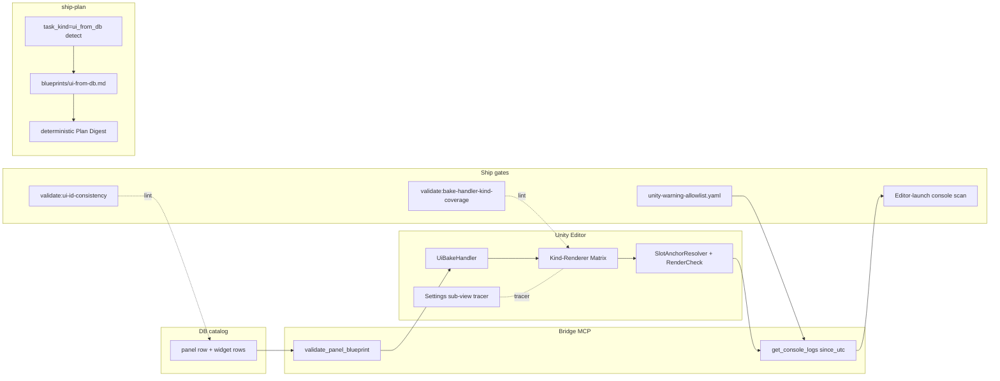

# UI bake-pipeline hardening + closed-loop validation

Exploration. Seeds a new master plan to harden the DB→panels.json→bake→prefab→scene-mount pipeline AND tighten ship-protocol closed-loop gates so agents stop claiming PASS on broken Editor state.

Lineage: directly downstream of `cityscene-mainmenu-panel-rollout` (Stages 1.0–5.0 done; 6.0–9.0 pending). Lessons accumulated from waves A0→A3.5 + Stage 5 toolbar revisit + this-session main-menu fix loop.

Trigger: pause-menu Stage 8.0 cannot land cleanly while non-button child kinds render as empty placeholders + content-slot resolution remains brittle + ship protocol greenlights stages that have console errors / wrong UI on first Editor open.

---

## Part 1 — Accumulated findings (cityscene-mainmenu-panel-rollout 2.0)

### F1. Action-wire gap (post-Stage 4.5)

**Surface.** Baked Settings + Load + New Game buttons rendered correct pixels, fired no handler on click.

**Root cause.** UiBakeHandler dropped `params_json.action` on the floor. No `UiActionTrigger` MonoBehaviour existed to subscribe `IlluminatedButton.OnClick → UiActionRegistry.Dispatch`. Phase 4.5 visual-diff PASS because pixels were correct — runtime click was outside conformance frame.

**Compounding drifts.**
- **D1.1 Action-id drift** — `panels.json` (canonical Wave A0) used `mainmenu.openSettings` / `openLoad` / `openNewGame` / `quit.confirm`; scene-side `MainMenuController` registered `mainmenu.settings` / `load` / `new-game` / `quit-confirmed`. Silent dispatch miss. No compile error.
- **D1.2 Bake-handler case-parity drift** — bake handler had two switch arms (`illuminated-button` + `confirm-button`); first action-wire fix patched only one; quit-button stayed inert until second case got `AttachUiActionTrigger` call.

**Fixes shipped.**
- Commit `fb858200` — UiActionTrigger MonoBehaviour + RequireComponent(IlluminatedButton) + bake-handler attach via SerializedObject + canonical action ids in MainMenuController.

**Open follow-ups.**
- Drift validator `validate:bake-handler-action-coverage` (TBD).
- Phase 4.6 conformance gate — for every panel child with `params_json.action`, prefab_inspect must show `UiActionTrigger` with `_actionId` matching seed canonical.

### F2. Sub-view swap broken (this session, 2026-05-09)

**Surface.** Settings + Load buttons fire dispatch + bind set, but no sub-view renders into content-slot.

**Root cause.** `MainMenuController.Awake` resolved `viewSlotAnchor` via `GameObject.Find("MainMenuCanvas/MainMenuPanelRoot/main-menu/content-slot")`. Real bake path = `MainMenuCanvas/MainMenuPanelRoot/main-menu/Zone_Center/main-menu-content-slot` (Zone_Center segment + name suffix).

**Compounding drifts.**
- **D2.1 4-place drift surface** — `panels.json` view-slot `views[]` declares `["root","new-game-form","load-list","settings"]`; panel `bind_value` declares `"settings"` / `"new-game"`; Generated prefab filenames are `settings-view.prefab` / `new-game-form.prefab` / `save-load-view.prefab`; controller bind-set value must match Generated prefab filename for Editor fallback `AssetDatabase.LoadAssetAtPath` to resolve.
- **D2.2 Slot name pattern drift** — slot named `main-menu-content-slot` (panel-prefixed), not `content-slot` (generic). Bake handler emits panel-prefixed names; controllers hard-code generic.

**Fixes shipped.**
- Commit `189f3a25` — `GameObject.Find` real path + `FindContentSlotInScene()` suffix-match fallback for future zone-layout drift + screenId rename to match Generated prefab filenames.

**Open follow-ups.**
- Slot-resolution helper (`SlotAnchorResolver.ResolveByPanel(panel_slug)`) so controllers don't hand-type paths.
- Canonical-source rule: `panels.json` view-slot `views[]` is THE source of truth — bind values + Generated prefab filenames + controller bind-set values all derive from it.

### F3. Settings/Load/NewGame sub-view widgets unrendered (current open)

**Surface.** Settings sub-view opens (post-F2 fix) but only `Reset to Defaults` button visible. 3 sliders + 5 toggles + 1 dropdown + 3 headers exist as empty placeholders.

**Root cause.** UiBakeHandler renders only `illuminated-button` + `confirm-button` + `view-slot` kinds. Non-button kinds (`slider-row`, `toggle-row`, `dropdown-row`, `section-header`, `list-row`) get RectTransform + LayoutElement + CatalogPrefabRef stub — no actual Slider/Toggle/TMP_Dropdown/TMP_Text component.

**Filed.** TECH-27335 attached to Stage 8.0 (pause-menu) — blocking dep.

### F4. Inspector OnClick empty for runtime-wired buttons (cosmetic)

**Surface.** All 3 baked buttons show empty Inspector OnClick list, including the working New Game button. User flagged as "not wired".

**Root cause.** `UiActionTrigger.Start()` calls `_button.OnClick.AddListener(OnClicked)` at runtime. Runtime AddListener is NOT serialized into the persistent `OnClick` UnityEvent list visible in Inspector. Inspector only shows persistent listeners (assigned via "+" in Inspector or `OnClick.AddListener` from Editor scripts inside `[ExecuteInEditMode]` etc.).

**Lesson.** Inspector OnClick visibility ≠ wire-up status for bake-pipeline buttons. Document this in skill body so agents don't flip back-and-forth diagnosing a phantom bug.

### F5. Hover affordance smaller than button (Wave A3.5 polish)

**Surface.** Hover halo / glow rendered on smaller area than full button rect.

**Root cause.** Halo child RectTransform sized as content-area instead of full body+padding. Polish item not blocking.

### F6. Blip sounds regression (post-third-bake)

**Surface.** Button hover + click sounds went missing after bake replaced legacy buttons.

**Root cause.** Bake handler omitted `EventTrigger`-based hover blip wiring. Earlier scene-authored buttons had it inline; baked buttons inherited only `IlluminatedButton.OnClick` audio (which itself was missing pre-fix).

**Fix applied inline.** `WireHoverBlips()` + `BlipEngine.Play(BlipId.UiButtonClick)` in handlers.

**Open follow-up.** Bake handler should emit hover-blip + click-blip wiring per child-kind archetype — not require controller-side `WireHoverBlips()` post-bake.

---

## Part 2 — Cross-cutting defect classes

| Class | Pattern | Surface count |
|---|---|---|
| **C1 Drop-on-the-floor** | Bake handler ignores a `params_json` key (action, kind, sound) | 3+ (action, slider/toggle/dropdown/header kinds, hover-blip) |
| **C2 Multi-place drift** | Same logical id appears in N surfaces (panels.json views[] / bind_value / prefab filename / controller bind-set / scene path / catalog slug) — agents fix one, miss others | 4+ (4-place screenId, 2-place slot name, 2-place action id, N-place catalog slug) |
| **C3 Case-arm parity drift** | Switch-case in bake handler has multiple arms; agent patches one and forgets the parallel arm | 1 confirmed (action-wire fix), pattern likely repeats |
| **C4 Inspector ≠ runtime** | Wire-up exists at runtime but Inspector shows empty (UnityEvent persistent listeners) | 1 confirmed (OnClick) |
| **C5 Compile-clean ≠ Editor-clean** | `unity:compile-check` passes but Editor first-open emits Console errors / null-ref warnings | recurring |
| **C6 Pixel-clean ≠ runtime-clean** | Phase 4.5 screenshot diff PASS but click does nothing / sub-view doesn't open / sound missing | 3 confirmed (action-wire, sub-view swap, sound) |

---

## Part 3 — Ship-protocol pain points

User-stated pain (verbatim from this session):

> "It has been very tiresome to have agents deliver stages which they claim to be ready because compile-check worked, but when I open editor I have console errors that need to be fixed. Also, many times the agent claims stages implemented even when the screenshots they analyzed are clearly wrong. We need to improve automatic/closed-loop validation so we can streamline more autonomous work from agentic flows / ship protocol."

Decoded:
- **P1 Compile-clean ≠ Editor-clean.** `npm run unity:compile-check` runs in batch mode, doesn't reload all assets, doesn't surface domain-reload Console output, doesn't scan first-frame errors. Stage closes PASS; user opens Editor → red errors.
- **P2 Screenshot self-deception.** Agent captures screenshot → analyzes → claims "matches design". User opens Editor → clearly wrong (missing buttons, wrong layout, broken sub-view). Agent's vision-language judgment of UI conformance is unreliable.
- **P3 Manual click testing.** No automated way to assert "click button X → sub-view Y mounted → handler Z fired → console clean". Every stage = manual user click loop.
- **P4 No runtime-state assertion.** Bake produces prefab → conformance verified at prefab level → never asserts "after Instantiate + scene mount, child component count == expected, bind subscription count > 0, action registry register count == expected".

---

## Part 4 — Design-explore grilling

5 grill questions to converge on a definitive plan. Polling format — answer one block at a time.

### Q1. Console-error closed-loop gate

**Pattern observed.** Compile-check green; user opens Editor; Console red on domain reload (missing references, AssetDatabase load fails on bake-emitted assets, null-ref on first frame).

**Options.**
- **(a) Editor-launch console scan** — extend `verify:local` to launch Editor in batch mode with `-executeMethod RunFirstFrameAndDumpConsole`, exit non-zero on any Error / Warning since domain reload. Cost: +30s per ship.
- **(b) Bridge-only scan** — keep Editor running between sessions; `unity_bridge_command(get_console_logs, severity=error, since_utc=domain_reload_ts)` after every bake / scene mutation. Cheap. Already partially wired. Gap: `since_utc=domain_reload_ts` not tracked.
- **(c) Hybrid** — bridge scan during dev loop + Editor-launch scan as final ship gate.

**Question.** (a / b / c)? If (b) or (c), should the ship-cycle skill block on any Error severity, or also Warning? Should `[MainMenuController] content-slot not found` style intentional warnings be suppressed via a known-warning allowlist?

### Q2. Visual-conformance closed-loop gate

**Pattern observed.** Agent screenshots Play Mode → claims "matches design" → Editor shows missing widgets / wrong layout. VLM judgment unreliable.

**Options.**
- **(a) Structural prefab_inspect diff** — for every published panel, materialize a "structural manifest" from `panels.json` (children list + kind + key params) and assert prefab_inspect output matches. Skip pixel-level comparison entirely. Catches F3 (settings widgets unrendered).
- **(b) Reference screenshot baseline** — first hand-approved screenshot per panel becomes baseline; subsequent runs do pixel-diff with bounded SSIM tolerance. Catches layout drift but blind to behavior.
- **(c) Component-count + bind-count assertions** — for every panel child, assert N expected components present (Slider for slider-row, Toggle for toggle-row, TMP_Text for header, etc.) + bind subscription count > 0 when `params_json.bind` set. Programmatic, no VLM.
- **(d) Runtime click trace** — Play Mode + automated click harness fires every action id → asserts handler executed (via Console log marker) + console clean.

**Question.** Which combination? Mandatory ones for ship-protocol PASS vs. recommended-but-skippable? Prefer (a)+(c)+(d) bundle? How is (d) implemented — `unity_bridge_command(simulate_click, target_path)` new bridge kind?

### Q3. Drift validator strategy for multi-place drift (C2)

**Pattern observed.** Same logical id (screenId, action id, slot name) appears in 3-5 surfaces. Agent patches one, misses others.

**Options.**
- **(a) One canonical source per id-class** — declare `panels.json` THE source. All other surfaces (controller bind-set, scene paths, prefab filenames, catalog slugs) regenerate from it. Drift validator scans for hand-typed duplicates.
- **(b) Cross-surface lint** — validator reads all N surfaces, asserts they agree. Doesn't enforce who owns the id; just enforces consistency.
- **(c) Code-gen** — controller bind-set values come from a generated `MainMenuPanelIds.cs` partial class. Hand-typing impossible.

**Question.** (a / b / c)? If (a), which surfaces are derived (compile-time vs. runtime)? If (c), which surfaces get code-gen? Plan needs explicit drift validator list with fail-on-drift severity.

### Q4. Bake-handler kind-coverage validator (C1)

**Pattern observed.** Bake handler silently drops new `params_json.kind` values; emits empty placeholders.

**Options.**
- **(a) Strict whitelist** — bake handler errors on unknown kind; ship-protocol blocks until handler updated.
- **(b) Coverage manifest** — `tools/scripts/validate-bake-handler-kind-coverage.mjs` reads all `params_json.kind` values from `panels.json` + asserts each appears in UiBakeHandler switch.
- **(c) Archetype-driven dispatch** — replace switch with archetype lookup (`catalog_entity` row for kind = adapter class name). New kind = new catalog row + adapter class; no bake-handler edit required.

**Question.** (a / b / c)? (c) is the long-term clean answer but may belong to a separate refactor. Ship-time pragmatic answer = (b)? Should kind-coverage validator gate on `validate:all` or `validate:fast`?

### Q5. Ship-protocol verdict downgrade

**Pattern observed.** ship-cycle Pass B emits "verified → done" + closeout commit + user opens Editor 5 min later → broken.

**Options.**
- **(a) "Done" requires user confirmation** — reintroduce a manual gate before flip; agent emits closeout digest, user runs Editor + clicks "approve".
- **(b) Tighter closed-loop** — keep auto-flip but add Q1+Q2+Q3+Q4 gates so PASS is meaningful. Trust the gates, not the agent.
- **(c) Two-tier verdict** — `verified` (mechanical gates green) vs. `done` (user smoke-tested in Editor). Stage closes at `verified`; `done` flip is async via separate command.

**Question.** Lean toward (b) for autonomy but accept (c) as transition state? Should the new master plan ship the closed-loop gates incrementally (Wave 1: Q1, Wave 2: Q4, Wave 3: Q3, Wave 4: Q2) or in a single big-bang stage?

---

## Part 5 — Skeletal master plan (post-grill)

Will be expanded after Q1–Q5 answered.

| Stage | Title | Deps |
|---|---|---|
| 1.0 | Console-error closed-loop gate (Q1) | — |
| 2.0 | Bake-handler kind-coverage validator + non-button kind renderers (Q4 + TECH-27335) | — |
| 3.0 | Drift validator suite — action-id, screenId, slot-name (Q3) | 2.0 |
| 4.0 | Visual-conformance gate — structural manifest + component-count assertions (Q2.a + Q2.c) | 2.0, 3.0 |
| 5.0 | Runtime click trace harness — `simulate_click` bridge kind + action-fires-handler test (Q2.d) | 4.0 |
| 6.0 | Ship-protocol verdict semantics — verified-vs-done split (Q5) | 1.0, 4.0, 5.0 |
| 7.0 | Documentation sweep — skill bodies + agent-led-verification-policy + caveman lessons | 6.0 |

Cross-link: TECH-27335 (Stage 8.0 of `cityscene-mainmenu-panel-rollout`) depends on this plan's Stage 2.0 landing first — non-button kind renderers must exist before pause-menu host-adapter pattern can embed settings/load/new-game sub-views with full UI.

---

## Part 6 — Action items before re-extending parent plan

1. **Reply to grill Q1–Q5.** Polling — one block at a time.
2. **Designate canonical sources** per id-class (Q3.a default) + list derived surfaces.
3. **Stub `simulate_click` bridge kind** (Q2.d) in `tools/mcp-ia-server/src/index.ts` so we know the bridge surface before stage 5.0 lands.
4. **Confirm verdict-tier split** (Q5.b vs. Q5.c) before stage 6.0 breakdown.

---

## Design Expansion

### Plan Shape
- Shape: flat
- Rationale: Linear ladder — each stage gates the next; settings tracer requires all prior pillars green. No parallelizable section streams identified.

### Core Prototype
- `verb:` rebake settings sub-view through hardened gates and prove all 4 widget kinds render with zero console errors
- `hardcoded_scope:` settings panel only (load + new-game backfill deferred); `tools/unity-warning-allowlist.yaml` seed entries for known-noise warnings; `ia/templates/blueprints/ui-from-db.md` canonical blueprint (v1)
- `stubbed_systems:` `bridge.get_console_logs()` returns `{entries:[]}` initially until domain-reload-ts tracking lands; `validate_panel_blueprint()` returns `{ok:true}` until per-kind required-keys YAML lands; KindRendererMatrix[unknown] throws BakeException stub
- `throwaway:` initial allowlist entries (will rotate on expiry); blueprint markdown v1 (will version-bump as bake handler evolves); inline render-check log strings
- `forward_living:` `IKindRenderer` interface signature; `task_kind` enum values; SlotAnchorResolver public API; bridge kind names `get_console_logs` + `validate_panel_blueprint`; deterministic blueprint stage section IDs (Schema-Probe / Bake-Apply / Render-Check / Console-Sweep / Tracer)

### Iteration Roadmap

| Stage | Scope | Visibility delta |
|---|---|---|
| 2.0 | Kind-renderer matrix + non-button widget renderers + slot resolver + render-check at apply | Settings sub-view shows real sliders, toggles, dropdowns, headers (not empty placeholders) when manually rebaked |
| 3.0 | task_kind enum + canonical blueprint markdown + ship-plan blueprint loader | New UI-from-DB plans authored by ship-plan carry deterministic stage shape; agent stops inventing digests |
| 4.0 | Settings rewire tracer running through all gates green end-to-end | One verify:local run shows console clean, lints clean, settings sub-view fully rendered, click-fires-handler audit log clean |

### Chosen Approach
**Hybrid pillared hardening** — combines Q1.c (hybrid console scan + allowlist), Q2.a + Q2.c (schema check + render check both layers), Q3.b (lint-only id consistency), Q4.b (kind-coverage manifest), with `task_kind: ui_from_db` blueprint-loader as Pillar 3 driving deterministic plan authoring. Settings sub-view rewire ships in same plan as live tracer proving all three pillars green across 4 widget kinds (highest gate coverage). Single-source codegen (Q3.a) and archetype-driven dispatch (Q4.c) explicitly deferred — they are clean long-term answers but separate refactors. Verdict-tier verified-vs-done split (Q5.c) deferred — gates tighten enough to keep auto-flip meaningful (Q5.b).

### Architecture Decision
**DEC-A15-equivalent (deferred MCP write — Phase 2.5 inline record):**
- **Problem:** How should the bake pipeline guard against console errors and DB→Unity render drift across the dev loop, ship gate, and plan-authoring surfaces?
- **Chosen:** Hybrid bridge+editor-launch console scan with allowlist; dual-layer schema+render checks; lint-only id drift validator; explicit `task_kind: ui_from_db` enum driving deterministic blueprint-loaded plan authoring.
- **Alternatives rejected:** (1) Bridge-only or editor-launch-only console scan — bridge alone misses domain-reload errors; editor-launch alone too slow per dev cycle. (2) Single-source codegen for ids — too large for this plan; lint-only is the wedge. (3) Archetype-driven dispatch — clean long-term answer but separate refactor.
- **Consequences:** Ship gates tighten — agent PASS becomes meaningful. `/ship-plan` gains deterministic UI-from-DB stage template, killing ad-hoc digest authoring. Settings rewire becomes live tracer for all three pillars. Bake handler gets pluggable kind-renderer matrix. New bridge surfaces required: `get_console_logs(since_utc)`, `validate_panel_blueprint`. Adds gate cost ~30s per ship. Existing closeout flow stays auto-flip; verdict-tier split deferred.
- **Affected `arch_surfaces[]`:** `architecture/asset-pipeline-standard`, `architecture/interchange`, `architecture/data-flows`, `ui-design-system`, `catalog-architecture`.
- **MCP write status:** deferred to ship-plan phase — `arch_decision_write` + `cron_arch_changelog_append_enqueue` + `arch_drift_scan` to fire when master plan author runs.

### Architecture



**Entry/exit points:**
- `verify:local` chain → `validate_panel_blueprint(panel_id)` per touched panel → `validate:ui-id-consistency` + `validate:bake-handler-kind-coverage` lint → editor-launch `RunFirstFrameAndDumpConsole` → `get_console_logs` filtered by allowlist → ship verdict.
- `ship-plan` reads backlog yaml `task_kind`; if `ui_from_db`, loads `ia/templates/blueprints/ui-from-db.md`, emits deterministic Plan Digest with fixed stage section IDs.

#### Red-Stage Proof — Stage 1 (Bridge hardening)
```python
# assert: console-log bridge surfaces domain-reload errors AND allowlist filters known noise
domain_reload_ts = bridge.start_editor_session()
inject_compile_error_in_test_panel()
logs = bridge.get_console_logs(since_utc=domain_reload_ts, severity='error')
assert len(logs.entries) >= 1, "bridge missed domain-reload error"

allowlist_entry = {"pattern": "content-slot not found", "expires": "2026-12-31"}
write_allowlist([allowlist_entry])
inject_warning("content-slot not found in fallback")
filtered = ship_gate.scan_console(allowlist=load_allowlist())
assert filtered.blocking_count == 0, "allowlist failed to filter known warning"
# expected failure mode if broken: ship-gate greenlights stage with red console
```

#### Red-Stage Proof — Stage 2 (Design translation)
```python
# assert: schema check at bridge + render check in Unity catches DB->Unity drift
panel_id = "settings"
db_row = catalog.get_panel(panel_id)
db_row.widgets.append({"kind": "unknown-kind", "params": {}})
result = bridge.validate_panel_blueprint(panel_id)
assert not result.ok, "schema check missed unknown widget kind"

mock_scene_missing_slot(panel_id)
render_result = unity.apply_panel(panel_id)
assert render_result.failed_with == "slot_path_unresolved"

mutate_bind_value("settings", "settings-renamed")
lint_result = run_lint("validate:ui-id-consistency")
assert lint_result.exit_code == 1
# expected failure mode if broken: settings sub-view renders empty placeholders silently
```

#### Red-Stage Proof — Stage 3 (Blueprint authoring)
```python
# assert: ship-plan branches on task_kind: ui_from_db and loads canonical blueprint
yaml_row = backlog.load("FEAT-XXXXX")
yaml_row.task_kind = "ui_from_db"
plan_digest = ship_plan.build_digest(yaml_row)
assert "Schema-Probe" in plan_digest.stage_sections
assert "Render-Check" in plan_digest.stage_sections
assert "Console-Sweep" in plan_digest.stage_sections
assert plan_digest.authoring_mode == "blueprint_loaded", "ship-plan invented digest instead of loading blueprint"
# expected failure mode if broken: each UI-from-DB plan reinvents stage shape, drift recurs
```

#### Red-Stage Proof — Stage 4 (Settings rewire tracer)
```python
# assert: settings sub-view renders all 4 widget kinds + clicks fire actions + console clean
unity.bake_panel("settings")
unity.mount_scene("MainMenu")
unity.click_button("mainmenu.openSettings")
view = unity.get_active_subview()
assert view.has_component("Slider", count=3)
assert view.has_component("Toggle", count=5)
assert view.has_component("TMP_Dropdown", count=1)
assert view.has_component("TMP_Text", count=3)
logs = bridge.get_console_logs(since_utc=test_start, severity='error')
assert logs.entries == [], "settings tracer leaked console errors"
# expected failure mode if broken: tracer ships green but settings still empty placeholders → all 3 pillars unproven
```

### Subsystem Impact

| Subsystem | Nature | Invariant risk | Breaking? | Mitigation |
|---|---|---|---|---|
| `architecture/interchange.md` (bridge) | New MCP kinds: `get_console_logs`, `validate_panel_blueprint` | None — additive bridge surface (per `unity-invariants` Bridge patterns) | Additive | Register in `AgentBridgeCommandRunner.Mutations.cs` sibling pattern |
| `architecture/asset-pipeline-standard.md` | New render-check + kind-renderer matrix in bake handler | None | Additive | Wraps existing UiBakeHandler switch; unknown-kind error on strict mode |
| `architecture/data-flows.md` | New ship-gate stage in `verify:local` | None | Additive | New step appended to existing chain |
| `ui-design-system.md` | Canonical kind list expands renderer coverage | None | Additive | Doc rows for new widget kinds (slider-row, toggle-row, dropdown-row, section-header, list-row) |
| `catalog-architecture.md` (`panel_child` / `catalog_entity`) | Schema validator reads existing rows | None | Read-only | n/a |
| `ship-plan` skill | New `task_kind` enum branch + blueprint loader | None | Additive (default branch unchanged) | Default `task_kind: implementation` keeps existing flow |
| `backlog-yaml-schema.md` | New `task_kind` field | None | Additive (optional field) | Default value for back-compat |
| Unity invariants | Bake handler edits; new render-check + slot resolver | **Inv. #3** — no `FindObjectOfType` in `Update`/per-frame | Additive | Render-check + slot resolver run only at apply / mount time, never per-frame |

### Implementation Points

#### Stage 1 — Bridge hardening (Pillar 1)
Phase 1.1 — Console-log bridge kind
  - [ ] Add `get_console_logs(since_utc, severity)` MCP kind to `AgentBridgeCommandRunner.Mutations.cs`
  - [ ] Track domain-reload timestamp on every `EditorApplication.delayCall` post-reload
  - [ ] Register tool descriptor in `tools/mcp-ia-server/src/index.ts`
  Risk: bridge schema cache (restart Claude Code post-edit per `invariants.md`)

Phase 1.2 — Allowlist + ship-gate filter
  - [ ] Author `tools/unity-warning-allowlist.yaml` schema (`pattern`, `reason`, `expires`, `owner`)
  - [ ] Build `tools/scripts/console-scan.mjs` filter; expired entries flip back to blocking
  - [ ] Editor-launch ship gate: `verify:local` runs `RunFirstFrameAndDumpConsole.cs` in batch
  Risk: schema drift if allowlist YAML lacks validator; Editor-launch +30s/ship

Phase 1.3a — Per-kind required-keys YAML
  - [ ] Author `tools/blueprints/panel-schema.yaml` declaring required `params_json` keys per widget kind
  - [ ] Single canonical source — bridge + Unity both read it

Phase 1.3b — Schema validator bridge kind
  - [ ] Add `validate_panel_blueprint(panel_id)` MCP kind reading catalog row + asserting required fields against `panel-schema.yaml`
  - [ ] Wire into bake handler pre-flight
  Risk: schema YAML drift vs. catalog DB types — co-locate update in same task touching either

#### Stage 2 — Design translation (Pillar 2)
Phase 2.1 — Kind-renderer matrix + non-button renderers
  - [ ] Refactor UiBakeHandler switch into `Dictionary<string, IKindRenderer>` matrix; interface `Render(ParamsJson params, Transform parent) → GameObject`
  - [ ] Implement `SliderRowRenderer`, `ToggleRowRenderer`, `DropdownRowRenderer`, `SectionHeaderRenderer`, `ListRowRenderer`
  - [ ] Strict mode: unknown kind → BakeException
  Risk: F3 spec (3 sliders + 5 toggles + 1 dropdown + 3 headers) used as conformance fixture

Phase 2.2 — Slot-path resolver + Unity render-check
  - [ ] Build `SlotAnchorResolver.ResolveByPanel(panel_slug)` — suffix-match fallback
  - [ ] At apply time, assert resolved slot present + every declared widget renders + bind subscription count > 0
  Risk: **Inv #3** — resolver runs at mount/apply only, never per-frame

Phase 2.3 — Id-drift lint
  - [ ] `tools/scripts/validate-ui-id-consistency.mjs` reads `panels.json` views[], `bind_value`, prefab filenames, controller bind-set, scene paths, catalog slugs
  - [ ] Fail on disagreement, report all surfaces
  - [ ] Wire into `validate:all`
  Risk: lint-only — no auto-fix; single-source codegen deferred

Phase 2.4 — Bake-handler kind-coverage lint
  - [ ] `tools/scripts/validate-bake-handler-kind-coverage.mjs` cross-checks `panels.json` kinds vs. matrix entries
  - [ ] Wire into `validate:all`
  Risk: kind matrix becomes new authoring surface — owner annotation in matrix

#### Stage 3 — Blueprint authoring (Pillar 3)
Phase 3.1 — task_kind enum on backlog yaml
  - [ ] Add `task_kind: ui_from_db | implementation | refactor | docs | tooling` to `backlog-yaml-schema.md`
  - [ ] Update `validate:backlog-yaml` to accept enum, default `implementation`

Phase 3.2 — Canonical UI-from-DB blueprint markdown
  - [ ] Author `ia/templates/blueprints/ui-from-db.md` with deterministic stage section IDs (Schema-Probe / Bake-Apply / Render-Check / Console-Sweep / Tracer)
  - [ ] Each section carries red-stage-proof anchor placeholders + bake-handler version stamp

Phase 3.3 — ship-plan blueprint detection + loader
  - [ ] `ship-plan` SKILL.md Phase 4: read backlog yaml `task_kind`; when `ui_from_db`, load blueprint markdown, expand into §Plan Digest deterministically
  - [ ] Default branch (other enum values) unchanged
  Risk: blueprint drift vs. live bake handler — version blueprint with bake handler version stamp

#### Stage 4 — Settings sub-view rewire tracer
Phase 4.1 — Bake settings panel through new pipeline
  - [ ] Rebake `settings` panel using kind-renderer matrix
  - [ ] All 4 widget kinds render (slider / toggle / dropdown / header) — F3 fixture turns green

Phase 4.2 — Apply with render-check + slot resolver
  - [ ] `SettingsViewController` uses `SlotAnchorResolver` instead of hand-typed path
  - [ ] Render-check at apply time; assert all 12 widgets present + bind-counts non-zero

Phase 4.3 — Run all gates green end-to-end
  - [ ] Console-scan: zero errors, allowlist passes
  - [ ] Id-drift lint: clean
  - [ ] Kind-coverage lint: clean
  - [ ] Editor-launch ship gate: clean
  - [ ] Manual `verify-loop` click confirms handler fires + console clean (automated click-trace deferred)
  Risk: tracer scope creep — strict to settings panel; load + new-game backfill in follow-up plan

**Deferred / out of scope:** single-source codegen for ids (Q3.a); archetype-driven dispatch refactor (Q4.c); verdict-tier verified-vs-done split (Q5.c); pixel-diff baseline (Q2.b); automated click-trace harness `simulate_click` bridge kind (Q2.d); load + new-game sub-view rewire (tracer covers settings only); existing panel migration to new matrix (load, new-game, mainmenu); allowlist expiry pre-notification.

### Examples

**Input — backlog yaml** (`ia/backlog/FEAT-30001.yaml`):

```yaml
id: FEAT-30001
title: Pause-menu panel rollout (host-adapter pattern)
status: open
task_kind: ui_from_db
panel_slugs: [pause-menu, settings]
notes: Embeds settings sub-view via host-adapter; depends on bake-pipeline-hardening Stage 2.
```

**Input — blueprint** (`ia/templates/blueprints/ui-from-db.md`, abridged):

```markdown
# UI-from-DB blueprint

## Stage shape (deterministic — do NOT mutate section ids)

### Stage N.1 — Schema-Probe
§Red-Stage Proof: assert validate_panel_blueprint(panel_slug) returns ok=true for each panel_slug in backlog yaml.

### Stage N.2 — Bake-Apply
§Red-Stage Proof: assert kind-renderer matrix produces non-empty children for every widget kind in DB row.

### Stage N.3 — Render-Check
§Red-Stage Proof: SlotAnchorResolver resolves; every widget renders; bind-counts > 0.

### Stage N.4 — Console-Sweep
§Red-Stage Proof: get_console_logs(since_utc=domain_reload_ts, severity=error) returns []; allowlist filters known warnings.

### Stage N.5 — Tracer
§Red-Stage Proof: manual verify-loop click on baked panel → handler fires (audit log marker) → post-click console scan clean.
```

**Output — generated §Plan Digest** (ship-plan emits when `task_kind: ui_from_db`):

```markdown
## Plan Digest

### Stage 1.0 — Schema-Probe (pause-menu, settings)
Red-Stage Proof: bridge.validate_panel_blueprint(pause-menu).ok == true; bridge.validate_panel_blueprint(settings).ok == true.

### Stage 2.0 — Bake-Apply
Red-Stage Proof: KindRendererMatrix["slider-row"].Render() returns non-null; same for toggle-row, dropdown-row, section-header.

### Stage 3.0 — Render-Check
Red-Stage Proof: SlotAnchorResolver.ResolveByPanel("pause-menu") != null; rendered child count == panel_child row count for both panels; bind subscription count > 0.

### Stage 4.0 — Console-Sweep
Red-Stage Proof: bridge.get_console_logs(since_utc=last_domain_reload, severity='error').entries == []; allowlist scan exit code == 0.

### Stage 5.0 — Tracer
Red-Stage Proof: verify-loop click on "mainmenu.openPause" → host-adapter swaps to pause sub-view → settings nested action fires → audit log marker present → console clean.
```

**Edge case A:** backlog yaml omits `task_kind` → ship-plan defaults to `implementation` → existing LLM-authored digest path. No regression for non-UI plans.

**Edge case B:** `task_kind: ui_from_db` but no `panel_slugs` → ship-plan errors with `task_kind_ui_from_db_missing_panel_slugs`, halts plan-author.

### Review Notes

**NON-BLOCKING (carried verbatim from Phase 8 review):**
- (Phase 6, Stage 2.1) Renderer interface signature underspecified — recommend declaring `IKindRenderer.Render(ParamsJson, Transform parent) → GameObject` in Stage 2.1 task body. *(Resolved inline — added to Phase 2.1 task list.)*
- (Phase 6, Stage 3.2) Blueprint markdown should carry version stamp matching bake handler version — drift detection. *(Resolved inline — added to Phase 3.2.)*
- (Phase 5) Subsystem table omits explicit cross-link to `panel_child` glossary term used in render-check — add to docs sweep.
- (Phase 6) No explicit task for migrating existing panels (load, new-game, mainmenu) to new matrix — named in Deferred list.

**SUGGESTIONS (deferred):**
- Emit kind-renderer matrix as a `catalog_entity` row (forward-compatible with Q4.c archetype-driven dispatch).
- Allowlist `expires` enforcement could send notification 7 days pre-expiry.
- Blueprint markdown could carry a "smoke-test recipe" pointer per stage.

### Expansion metadata
- Date: 2026-05-09
- Model: claude-opus-4-7
- Approach selected: Hybrid pillared hardening (Q1.c + Q2.a/c + Q3.b + Q4.b + new Pillar 3 task_kind blueprint)
- Blocking items resolved: 3

### TDD Spec — Incremental red→green per Stage

**Protocol.** Each Stage owns ONE test file. First task creates file (red). Each subsequent task extends same file with new assertions. Stage close = file fully green. Master-plan close = single `npm run test:bake-pipeline-hardening` (Node) + `unity:testmode-batch --filter BakePipeline.*` (Unity) runs union of all stage files green. Same suite re-runs on every fix forever — no per-fix test invention. Test file path stamped on Stage row + each Task §Red-Stage Proof anchor.

#### Stage 1 — `tests/bake-pipeline/stage1-bridge-hardening.test.mjs` (Node `--test`)

| Task | Assertions added | Red→Green flip |
|---|---|---|
| 1.1 console-log bridge kind | `describe("get_console_logs")` — entries returned since `domain_reload_ts`; injected error surfaces at severity=error | bridge kind registered + ts tracking lands |
| 1.2 allowlist + ship-gate filter | `describe("allowlist filter")` — known-pattern warning filtered; expired entry flips back to blocking | `console-scan.mjs` reads YAML + applies expiry |
| 1.3a per-kind required-keys YAML | `describe("panel-schema yaml")` — YAML loads + every catalog widget kind has required-keys row | `tools/blueprints/panel-schema.yaml` authored |
| 1.3b validate_panel_blueprint kind | `describe("validate_panel_blueprint")` — `ok:false` on missing required key; `ok:true` on full row | bridge kind reads schema YAML |

#### Stage 2 — `Assets/Tests/EditMode/BakePipeline/Stage2DesignTranslation.cs` (Unity Test Runner EditMode, NUnit)

| Task | Assertions added | Red→Green flip |
|---|---|---|
| 2.1 kind-renderer matrix | `[Test] KindRendererMatrix_RendersAllRegisteredKinds` — slider/toggle/dropdown/header non-null returns | `Dictionary<string,IKindRenderer>` populated |
| 2.2 slot resolver + render-check | `[Test] SlotAnchorResolver_ResolvesByPanel`; `[Test] RenderCheck_FailsOnMissingSlot` | resolver + apply-time check land |
| 2.3 id-drift lint | `[Test] IdConsistencyLint_FailsOnDrift` — shells out to `validate-ui-id-consistency.mjs` via `Process` | validator script exits 1 on injected drift |
| 2.4 kind-coverage lint | `[Test] KindCoverageLint_FailsOnUnmappedKind` | validator script flags missing matrix entry |

#### Stage 3 — `tests/bake-pipeline/stage3-blueprint-authoring.test.mjs` (Node `--test`)

| Task | Assertions added | Red→Green flip |
|---|---|---|
| 3.1 task_kind enum | `describe("task_kind enum")` — `validate:backlog-yaml` accepts `ui_from_db`, rejects `garbage_kind`, defaults `implementation` | schema + validator updated |
| 3.2 canonical blueprint markdown | `describe("blueprint markdown")` — file exists; parses 5 mandatory section ids (Schema-Probe / Bake-Apply / Render-Check / Console-Sweep / Tracer); carries bake-handler version stamp | `ia/templates/blueprints/ui-from-db.md` authored |
| 3.3 ship-plan loader | `describe("ship-plan branch")` — `task_kind: ui_from_db` yaml → digest contains all 5 stage ids in order; default kind → existing path unchanged | SKILL.md Phase 4 branch lands |

#### Stage 4 — `Assets/Tests/PlayMode/BakePipeline/Stage4SettingsTracer.cs` (Unity Test Runner PlayMode)

| Task | Assertions added | Red→Green flip |
|---|---|---|
| 4.1 bake settings panel | `[UnityTest] SettingsPanel_BakesAllFourKinds` — counts 3 sliders + 5 toggles + 1 dropdown + 3 headers in baked output | matrix renders all 4 kinds |
| 4.2 apply with render-check + resolver | `[UnityTest] SettingsView_AppliesViaSlotResolver` — no hardcoded path; all widgets present; bind-counts > 0 | `SettingsViewController` switched to resolver |
| 4.3 all gates green | `[UnityTest] SettingsTracer_AllGatesGreen` — runs console-scan + id-lint + kind-coverage-lint via batch step; asserts all exit 0 | full pipeline clean end-to-end |

#### Master-plan close — single command runs all
```bash
npm run test:bake-pipeline-hardening
# = node --test tests/bake-pipeline/*.test.mjs
#   + npm run unity:testmode-batch -- --filter BakePipeline.*
```

One green run = master plan ships. Regressions caught forever without test rewrites.

---

## Downstream consumer mapping — `cityscene-mainmenu-panel-rollout` Stages 6.0–9.0

Purpose: every mechanism produced by Stages 1–4 maps to a specific failure mode hit during Stages 1.0–5.0 of the parent plan and to a forward-acceptance-criteria checklist that pending Stages 6.0–9.0 inherit verbatim. Goal — pending stages roll out without rediscovering the same defects (F1 action-wire gap / F2 slot path drift / F3 unrendered kinds / F6 blip regression) and with closed-loop UI/UX confirmation instead of agent self-attestation.

### Mechanism → failure-mode mitigation matrix

| Mechanism (this plan) | Mitigates | Pending stages it unblocks |
|---|---|---|
| `validate_panel_blueprint(panel_id)` MCP kind + per-kind required-keys YAML (Stage 1.0.3 / 1.0.4) | F1 action-wire gap (params_json.action drop), C1 drop-on-the-floor | 6.0 (tab-strip / range-tabs / chart-segment / stacked-bar-row / service-row), 7.0 (quadrant-card / lock-toggle / tax-slider), 8.0 (modal-card), 9.0 (map-panel buttons / toast dismiss) |
| `get_console_logs(since_utc=domain_reload_ts)` + `unity-warning-allowlist.yaml` (Stage 1.0.1 / 1.0.2) | P1 compile-clean ≠ Editor-clean, C5 | All 6.0–9.0 — every stage closeout runs allowlist-filtered console-scan; agent PASS only when entries == [] |
| `Dictionary<string,IKindRenderer>` matrix + `SliderRowRenderer` / `ToggleRowRenderer` / `DropdownRowRenderer` / `SectionHeaderRenderer` / `ListRowRenderer` (Stage 2.0.1) | F3 unrendered widgets, C1 drop-on-the-floor, C3 case-arm parity drift | 6.0 (chart-segment + tab-strip rendering), 7.0 (quadrant-card / tax-slider rendering), 9.0 (info-panel rows / notifications-toast items). Pause-menu inherits modal-card via same matrix path |
| `SlotAnchorResolver.ResolveByPanel(panel_slug)` + suffix-match fallback + apply-time render-check (Stage 2.0.2) | F2 sub-view swap broken, P4 no runtime-state assertion | 6.0–9.0 — every controller mounting a baked panel uses resolver, never hand-typed paths. 8.0 host-adapter (settings + save-load nested under pause-menu) is the highest-value beneficiary |
| `validate:ui-id-consistency` lint (Stage 2.0.3) | C2 multi-place drift (action ids, screen ids, slot names) | 6.0 (`stats.tab.*`, `stats.open`), 7.0 (`budget.lock.*`, `budget.open`), 8.0 (full mainmenu mirror — 5 button ids), 9.0 (`map.zoom_in/_out/_center`, `notification.dismiss`) |
| `validate:bake-handler-kind-coverage` lint (Stage 2.0.4) | C1 drop-on-the-floor at handler level, C3 case-arm parity | 6.0 (5 NEW archetypes flagged before merge), 7.0 (3 NEW archetypes), 8.0 (modal-card), 9.0 (toast / map-button kinds). Replaces manual code-reviewer parity check (cityscene-rollout L3 today) |
| `task_kind: ui_from_db` enum + canonical blueprint markdown + `ship-plan` loader (Stage 3.0.1 / 3.0.2 / 3.0.3) | P3 manual click testing, agent-invented digest drift, recurrence of action-wire / slot-drift / unrendered-kind defects across Waves | All 6.0–9.0 emitted via `/ship-plan` carry deterministic Schema-Probe / Bake-Apply / Render-Check / Console-Sweep / Tracer sections — same gate set per stage, no per-stage authoring drift |
| Settings tracer (Stage 4.0.1 / 4.0.2 / 4.0.3) | F1+F2+F3+P1+P3+P4 stacked — full pipeline proof point | 8.0 directly — pause-menu host-adapter pattern embeds settings-view sub-view; if settings tracer green, pause-menu nested settings inherits proof. Same applies to save-load-view embed |

### Per-pending-stage acceptance-criteria checklist (inherited from `ui-from-db` blueprint)

Every pending stage authored by `/ship-plan` after Stage 3.0.3 lands carries this 5-section §Plan Digest. Closeout PASS requires every box checked. No agent self-attestation — every box maps to an MCP/lint/test surface produced by this plan.

#### Stage 6.0 — Wave B2 stats-panel (3 tabs + range-tabs + chart-segment archetypes)

- [ ] **Schema-Probe** — `validate_panel_blueprint("stats-panel").ok == true` (Stage 1.0.4 surface) — required keys present for tab-strip + range-tabs + chart-segment + stacked-bar-row + service-row.
- [ ] **Bake-Apply** — `KindRendererMatrix["tab-strip"|"range-tabs"|"chart-segment"|"stacked-bar-row"|"service-row"].Render()` returns non-null (Stage 2.0.1 + 2.0.4). `validate:bake-handler-kind-coverage` exit 0.
- [ ] **Render-Check** — `SlotAnchorResolver.ResolveByPanel("stats-panel") != null` (Stage 2.0.2). 3 baked tabs + range-tabs render with `UiActionTrigger` attached for `stats.tab.{economy,demographics,services}` + range bind. Bind-counts > 0.
- [ ] **Console-Sweep** — `get_console_logs(since_utc=stage_start, severity='error').entries == []` (Stage 1.0.1 + 1.0.2). Allowlist-filtered. Editor-launch ship gate clean.
- [ ] **Tracer** — bridge dispatch `stats.open` opens modal + sim pauses; tab-click fires registered handler; ModalCoordinator audit-log marker present; post-click console clean.

#### Stage 7.0 — Wave B3 budget-panel (quadrant-card × 4 + lock-toggle × 4 + tax-slider × 4)

- [ ] **Schema-Probe** — `validate_panel_blueprint("budget-panel").ok == true`. Required keys for quadrant-card + lock-toggle + tax-slider present.
- [ ] **Bake-Apply** — matrix renders all 12 widgets (4 cards + 4 toggles + 4 sliders). Coverage lint clean.
- [ ] **Render-Check** — resolver hits panel slot; bind-counts non-zero on all 4 lock-toggles + all 4 sliders; `UiActionTrigger` per `budget.lock.{r,c,i,services}` + `budget.open`.
- [ ] **Console-Sweep** — zero errors since stage start; allowlist clean.
- [ ] **Tracer** — `budget.open` dispatch opens modal (ModalCoordinator reuse — no new pause logic); each lock-toggle click fires handler + persists state; sliders emit value-change events.

#### Stage 8.0 — Wave B4 pause-menu (5-button stack + modal-card + ESC + host-adapter for settings + save-load)

- [ ] **Schema-Probe** — `validate_panel_blueprint("pause-menu").ok == true` AND `validate_panel_blueprint("settings").ok == true` AND `validate_panel_blueprint("save-load-view").ok == true` (host-adapter triple).
- [ ] **Bake-Apply** — modal-card archetype renders via matrix; 5 buttons baked; each button has `UiActionTrigger` attached (covers F1 + C3); `validate:ui-id-consistency` exit 0 across all 3 panels (covers F2 + C2 multi-place drift on `mainmenu.openSettings` style ids).
- [ ] **Render-Check** — `SlotAnchorResolver.ResolveByPanel("pause-menu") != null`; nested resolver also resolves `settings` + `save-load-view` content slots when host-adapter mounts them; bind-counts > 0 on all 12 settings widgets + save-load list rows (proves Stage 4.0 settings tracer composes correctly under pause-menu host).
- [ ] **Console-Sweep** — domain-reload + first-frame + ESC-press + sub-view-swap all clean. Allowlist filters known-noise; expired entries blocking.
- [ ] **Tracer** — synthetic ESC-keypress mounts pause-menu; 5 button clicks each fire registered handler; 4 close paths (Resume / Settings-back / Save-Load-back / backdrop) all restore prior state; quit-confirm + main-menu-confirm 3-second confirm flows fire correctly. Same surface area as MainMenu Wave A1 — pause-menu defect mirror eliminated.

#### Stage 9.0 — Wave B5 HUD widgets (info-panel + map-panel + notifications-toast)

- [ ] **Schema-Probe** — `validate_panel_blueprint("info-panel" | "map-panel" | "notifications-toast").ok == true` for all three.
- [ ] **Bake-Apply** — bind-only fields render via matrix (text rows + list rows); map-panel buttons + toast dismiss-X have `UiActionTrigger`. Coverage lint clean.
- [ ] **Render-Check** — resolver resolves each panel's slot; map-panel `map.zoom_in/_out/_center` ids + toast `notification.dismiss` id pass `validate:ui-id-consistency`.
- [ ] **Console-Sweep** — clean.
- [ ] **Tracer** — synthetic dispatch on each map button fires handler; toast dismiss removes notification + clears bind; info-panel re-binds on data refresh without per-frame `FindObjectOfType` (Inv #3 enforced via render-check apply-time only).

### Acceptance criteria — autonomy gain summary

Pre-this-plan baseline (per Part 3 P1–P4): `unity:compile-check` greenlit Wave A1–A3 stages that opened Editor with red console + missing widgets + non-firing buttons; user manually re-clicked every closeout to discover defects.

Post-this-plan, every pending Wave (B2 stats / B3 budget / B4 pause-menu / B5 HUD) ships only when all 5 blueprint sections turn green via mechanical gates produced by Stages 1–4. Agent PASS = blueprint sections green. User opens Editor only as final smoke.

Concretely: `Stage 4.0 SettingsTracer_AllGatesGreen` going green is the proof point that the same gate set composes for every downstream UI-from-DB plan. Stage 8.0 then becomes a composition test (settings inside pause-menu host) rather than a fresh defect surface.

---

## Changelog

- 2026-05-09 — initial draft. Captures findings F1–F6 + defect classes C1–C6 + pain points P1–P4 + 5 grill questions + skeletal master plan. Lineage: `cityscene-mainmenu-panel-rollout` waves A0–B1 + this-session main-menu sub-view fix loop.
- 2026-05-09 — Design Expansion appended via `/design-explore`. Locks pillared approach (bridge hardening / design translation / blueprint authoring) + settings tracer. 4 stages, 13 tasks. DEC-A15 inline; MCP write deferred to ship-plan.
- 2026-05-09 — TDD Spec block appended. Incremental red→green protocol locked: one test file per Stage, grown task-by-task. Protocol promoted to `ia/rules/agent-principles.md §Testing + verification`.
