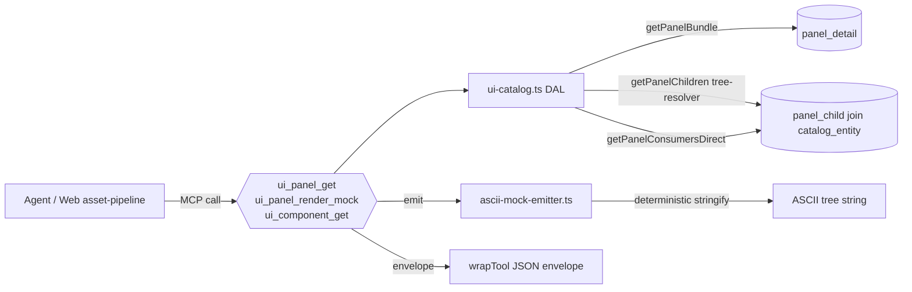

# UI panel MCP slice extension — full tree + render_mock (exploration seed)

## §Grilling protocol (read first)

When `/design-explore` runs on this doc, every clarification poll MUST use the **`AskUserQuestion`** format and MUST use **simple product language** — no class names, no namespaces, no paths, no asmdef terms, no stage numbers in the question wording. Translate every technical question into player/designer terms ("the panel lookup tool", "the panel preview", "the agent's panel inspection"). The body of this exploration doc + the resulting design doc stay in **technical caveman-tech voice** (class names, paths, glossary slugs welcome) — only the user-facing poll questions get translated.

Example translation:
- ❌ tech voice: "Should `ui_panel_get` recursively resolve `panel_child.child_entity_id` for nested panel kinds or return refs only?"
- ✓ product voice: "When the agent looks up a panel, should it get the full chain of nested panels too (more useful, slower) or just the top level with references to dig deeper (faster, more queries)?"

Persist until every Q1..QN is resolved.

## §Goal

Two related MCP-server changes:

1. **Extend `ui_panel_get`** to return the full child tree (`panel_child` rows joined + resolved). Today the slice returns shell only (rect, layout, padding, params, modal) — agents see half-spec even though DB owns the tree.
2. **Add new `ui_panel_render_mock` slice** that returns an ASCII / SVG / DOM mock of the panel tree from DB state alone, no Editor invocation needed.

End state: agents can read full panel structure + see a low-fidelity render without bouncing through `unity:bake-ui` or scene load. Faster agent loops, no Editor process spin-up for inspection-only flows.

Origin: proposal #9 in `docs/explorations/ui-as-code-state-of-the-art-2026-05.md` §4.9. Absorbs partial-exploration in `docs/explorations/ui-panel-tree-db-storage.md`.

## §Why this is small and shippable

Compared to the other proposals in the research doc, this one is:

- **MCP-server only.** No Unity code touched. No prefab regeneration. No bake-handler atomization needed first.
- **Schema-stable.** DB already owns the full tree (`panel_child` table from mig 0031, 0137 seeds). Change scope = how the slice resolves and emits.
- **Independent of UI Toolkit migration.** Works against current uGUI + future UI Toolkit alike.
- **Reusable.** Same slice serves human dashboards (web `asset-pipeline`), agent loops, calibration verdict UIs, drift-scan tooling.

The half-explored predecessor (`ui-panel-tree-db-storage.md`) already corrected the early misdiagnosis ("tree-not-in-DB" — wrong; DB has tree, slice doesn't expose it) and surfaced 6 open questions. This seed extends with `ui_panel_render_mock` (NEW) and routes the existing 6 questions through the grilling protocol.

## §Current state

| Surface | Today | Migrates to |
|---|---|---|
| `ui_panel_get` payload | shell only: rect, layout, padding, params, modal, corpus_rows | + `children[]` resolved from `panel_child` join |
| `ui_component_get.panel_consumers[]` | returned empty (resolver doesn't traverse `panel_child.child_entity_id`) | populated via reverse query on `panel_child WHERE child_entity_id = ?` |
| `ui_def_drift_scan` | file-level drift (DB snapshot vs prefab) | optional tree-level extension: DB tree vs bake snapshot |
| `ui_panel_render_mock` | does not exist | new slice — ASCII / SVG / DOM mock from DB state |
| Bake invocation needed to inspect panel | YES (must run `unity:bake-ui` + open prefab) | NO (DB slice alone produces inspectable mock) |
| `child_kind` CHECK constraint | narrow: `button, panel, label, spacer, audio, sprite, label_inline` | audit + extend? bake snapshot uses richer set (`tab-strip`, `range-tabs`, `chart`, `stacked-bar-row`, `service-row`) routed through generic `panel` |
| Shared DAL | `tools/mcp-ia-server/src/ia-db/ui-catalog.ts` | extended; tree-resolver helper added |
| Slice files | `tools/mcp-ia-server/src/tools/ui-panel-*.ts` | + new file for `ui_panel_render_mock` |

## §Locked constraints

1. NO schema migrations required for the core slice extension — DB already owns the tree. Migrations only if Q4 decision = extend `child_kind` vocab.
2. Slice contract preserved — existing `ui_panel_get` callers keep working; `children[]` is additive.
3. New MCP-server code follows Strategy γ (POCO services / helpers in `tools/mcp-ia-server/src/ia-db/`).
4. New slice tests live in `tools/mcp-ia-server/tests/tools/ui-slices.test.ts` per existing convention.
5. Render mock output is **deterministic** — same DB state in → same mock out, byte-identical.
6. No Unity Editor invocation in any slice path — DB-only resolve.
7. Per-stage verification: `validate:all` + slice unit tests + manual `mcp__territory-ia__ui_panel_get` smoke against stats-panel (known-rich tree).

## §Reference shape — what the extended slice returns

**Today:**
```json
ui_panel_get("stats-panel") → {
  slug: "stats-panel",
  display_name: "City Stats",
  layout_template: "modal-tabbed",
  modal: true,
  rect: {...}, padding: {...}, params: {...},
  corpus_rows: []
}
```

**After (Q1=nested):**
```json
ui_panel_get("stats-panel") → {
  slug: "stats-panel",
  …shell…,
  children: [
    { slot: "header", ord: 0, kind: "panel", slug: "modal-header", resolved: { display_name: "Header", role: "decoration" } },
    { slot: "header", ord: 1, kind: "button", slug: "close-button", resolved: { display_name: "Close", role: "action" } },
    { slot: "body", ord: 0, kind: "panel", slug: "tab-strip", resolved: {...}, children: [...] },
    …
  ],
  corpus_rows: []
}
```

**`ui_panel_render_mock("stats-panel", format="ascii"):`**
```
┌─ stats-panel (modal-tabbed) ────────────────────┐
│ header                                          │
│   [modal-header] [close-button]                 │
├─ body ──────────────────────────────────────────┤
│   [tab-strip:                                   │
│     {economy} {growth} {services}]              │
│   [range-tabs: …]                               │
│   [chart × 3]                                   │
│   [stacked-bar-row × 3]                         │
│   [service-row × 11]                            │
└─────────────────────────────────────────────────┘
```

## §Acceptance gate

**Per stage:**
- `validate:all` green; slice unit tests cover at least the canonical rich panel (`stats-panel`, 21 children).
- New / extended slices return deterministic JSON for known panels.
- `ui_panel_render_mock` output is reproducible byte-identical across runs.

**Final acceptance:**
- `ui_panel_get` returns `children[]` for all 51 panels.
- `ui_component_get.panel_consumers[]` non-empty for components used by ≥1 panel.
- `ui_panel_render_mock` returns valid output for all 51 panels in ≥1 format (ASCII minimum; Q2 decides additional formats).
- Optional: `ui_def_drift_scan` extended to tree-drift if Q5 = yes.
- Web `asset-pipeline` (or future panel inspector UI) consumes the extended slice without breakage — backward compatibility verified.

## §Pre-conditions

- `tools/mcp-ia-server` test suite green at baseline.
- `panel_child` row coverage verified for all 51 panels (none orphaned at DB level).
- Bake snapshot (`Assets/UI/Snapshots/panels.json`) is fresh — used as reference for tree-drift if Q5 = yes.
- `child_kind` CHECK audit (Q4) done before mock format design — affects what tokens appear in render output.

## §Open questions (to grill in product voice via AskUserQuestion)

Q1–Q6 inherited from `ui-panel-tree-db-storage.md`; Q7–Q12 new for render_mock + scope.

### Q1 — Slice payload shape: flat vs nested

- **Tech:** Two shapes for `ui_panel_get.children[]`:
  - **Flat** — single SELECT, `params_json` raw, refs only. Cheap, drift-honest, agents must re-query for nested panel children.
  - **Nested resolved** — recursive JOIN on `child_entity_id` → component spine + nested panel children inline. Ergonomic, hides version mismatches.
  - **Depth-limited** — nested up to N levels (default 2); refs only past N.
- **Product:** When the agent looks up a panel and gets its children, should each child be a quick reference (the agent looks up the details with more queries — fast, simple), or fully expanded with its own children too (one query gives everything — easier for the agent, slower per call), or expanded up to a fixed depth?
- **Options:** (a) flat refs (b) fully nested recursive (c) depth-limited nested (default 2) (d) caller-controlled depth param.

### Q2 — Render mock format

- **Tech:** `ui_panel_render_mock` output formats:
  - **ASCII tree** — box-drawing characters, monospace; agent-readable, terminal-friendly.
  - **SVG** — vector, layout-accurate (uses rect / padding / gap from DB), inline-able in markdown / web UI.
  - **HTML DOM** — `<div class="panel-modal" data-slot="body">…</div>`; lints-able with CSS; closest to UI Toolkit shape.
  - **JSON tree** — structured, machine-only (same data as `ui_panel_get` children but normalized for rendering).
  - **All four** — `format` param selects.
- **Product:** When asking for a preview of a panel without Unity running, what shape should it come back in? A text-art box drawing (works in any terminal), a real diagram image, a webpage-style block layout, plain structured data, or all four (caller picks)?
- **Options:** (a) ASCII only (b) SVG only (c) HTML DOM only (d) JSON tree only (e) all four selectable.

### Q3 — Version pinning

- **Tech:** Tree resolution at:
  - **Frozen** — `panel_child` rows at `panel_version_id` snapshot; tree is fixed per published version.
  - **Live (HEAD)** — latest `panel_child` rows regardless of version. Matches current bake behavior.
  - **Caller param** — `pin=frozen | live` defaulting to live.
- **Product:** Each panel has a "published version" history. When the agent reads a panel, should it see the children at the version locked in (matches what's running in the game right now), the latest in-progress children (matches what the next bake will produce), or let the caller choose?
- **Options:** (a) always frozen (b) always live (c) caller-controlled with default live (d) caller-controlled with default frozen.

### Q4 — `child_kind` vocabulary audit

- **Tech:** Schema CHECK: `button, panel, label, spacer, audio, sprite, label_inline` (7 values). Bake snapshot uses richer: `tab-strip, range-tabs, chart, stacked-bar-row, service-row`. Today routed through `panel` with `params_json.kind`. Options:
  - **Keep narrow CHECK** — richer kinds stay as `params_json.kind` payload; mock infers from params.
  - **Extend CHECK** — add new top-level kinds; migration touches existing rows.
  - **Drop CHECK, validate at slice** — DB permissive, MCP slice enforces valid set.
- **Product:** Some panel pieces are stored under a generic label ("it's a panel") with their real type tucked inside an extra field. Should we keep that workaround (no DB change), promote the real types to first-class (cleanest, migration cost), or drop the constraint entirely and let the lookup tool enforce names?
- **Options:** (a) keep narrow CHECK + infer from params_json (b) extend CHECK with new kinds (c) drop CHECK, validate in slice.

### Q5 — `ui_def_drift_scan` extension

- **Tech:** Today `ui_def_drift_scan` checks file-level drift (DB snapshot vs bake JSON). Tree extension:
  - **Add tree-drift check** — DB tree (via extended `ui_panel_get`) vs bake snapshot tree; flag mismatches.
  - **Defer** — keep drift scan file-level; tree-drift = its own future plan.
  - **Add but warn-only** — surfaces drift in output, doesn't block CI initially.
- **Product:** Once the lookup tool returns the full panel tree, we can also compare it to the baked file's tree. Should this plan also extend the existing drift check to do that (one-stop), defer to a later plan (focused scope), or add the check but only warn at first (gradual rollout)?
- **Options:** (a) extend drift scan now, blocking (b) defer to future plan (c) extend now, warn-only.

### Q6 — `ui_component_get.panel_consumers[]` fix scope

- **Tech:** Today returns `[]`. Fix options:
  - **Direct nesting only** — query `panel_child WHERE child_entity_id = ?`.
  - **Direct + params_json walk** — also walk `params_json` for slug references (loose coupling captured); expensive query.
  - **Direct + indexed params** — extract `params_json.slug_ref` to a column / GIN index, query both.
- **Product:** When the agent asks "which panels use this component?", it gets nothing back today. Should we fix it to count only panels that directly include the component (cheap, fast, misses loose links), also scan extra fields for indirect references (catches everything, slow), or build an index that makes both fast?
- **Options:** (a) direct nesting only (b) direct + params_json walk (c) direct + indexed params_json refs.

### Q7 — Render mock SVG layout fidelity

- **Tech:** If Q2 includes SVG, layout fidelity:
  - **Schematic only** — boxes labeled, positions ignored, padding/gap as nominal spacing.
  - **DB-accurate** — uses `rect_json` / `padding_json` / `gap_px` for absolute positions; matches bake output geometry.
  - **DB-accurate + token-aware** — resolves color tokens to hex; renders styled boxes (close to real look).
- **Product:** A diagram of the panel could be a simple labeled-boxes layout (cheap, gets the structure across), a precise layout with real sizes (matches the game's panel shape), or a precise layout plus colors (looks like the real panel). Pick: structure-only, accurate sizes, or accurate sizes + colors?
- **Options:** (a) schematic only (b) DB-accurate geometry (c) DB-accurate + token colors.

### Q8 — Caching policy

- **Tech:** Tree queries can be expensive at depth. Caching:
  - **No cache** — query DB on every slice call. Simple, slow for deep panels.
  - **In-memory cache** — keyed on `(panel_slug, version_id)`; invalidated on `ui_panel_publish`.
  - **Materialized view** — Postgres MV `panel_tree_resolved`; refreshed on publish.
- **Product:** Looking up a panel's full nested structure can take a few queries. Should we look it up fresh every time (simple, always correct), keep a quick remembered copy in memory (fast, may go stale if we forget to refresh), or pre-build a database view (fastest, more infra)?
- **Options:** (a) no cache (b) in-memory cache invalidated on publish (c) Postgres materialized view (d) lazy on-first-call + invalidate on publish.

### Q9 — Slice surface: extend vs new

- **Tech:** Multiple options:
  - **Extend `ui_panel_get` only** — `children[]` added, no new slice; render mock added later.
  - **Extend `ui_panel_get` + add `ui_panel_render_mock`** — research §4.9 shape; clean split.
  - **Extend `ui_panel_get` + render mock as param** — `ui_panel_get(slug, include_mock=true)` returns mock inline.
  - **All three slices: get, list, render_mock** — also extend `ui_panel_list` to optionally return shallow trees.
- **Product:** The agent will need both "give me the full panel tree" and "give me a quick preview". Should these be one tool with optional behavior, two separate tools (cleanest), or also add tree info to the bulk list tool?
- **Options:** (a) extend `ui_panel_get` only, render mock later (b) extend `ui_panel_get` + new `ui_panel_render_mock` (c) `ui_panel_get` with `include_mock=true` param (d) three slices: get + list + render_mock.

### Q10 — Stage granularity

- **Tech:** Four carve-ups:
  - **Phase-first (3 stages)** — Stage 1 = tree resolver + `ui_panel_get` extension; Stage 2 = `ui_panel_render_mock` slice; Stage 3 = drift-scan extension.
  - **Vertical slice (2 stages)** — Stage 1 = tracer (tree resolver + extended slice + ASCII render mock + stats-panel coverage). Stage 2 = SVG / HTML formats + remaining panel coverage + drift extension.
  - **Single stage** — all of it, one ship.
  - **Pilot panel + sweep** — Stage 1 = full surface against `stats-panel` only; Stage 2 = sweep remaining 50 panels.
- **Product:** Pick a shape: build it in phases (resolver, then mock, then drift), build the thinnest end-to-end first then expand (vertical slice), ship in one go, or pilot on the richest panel first then sweep the rest?
- **Options:** (a) phase-first 3 stages (b) vertical tracer slice + expansion (c) one stage (d) pilot panel + sweep.

### Q11 — Cross-link to visual regression (proposal #8)

- **Tech:** `ui_panel_render_mock` and visual-regression baselines both produce visual outputs of panels. Coordination:
  - **Independent** — render mock = low-fidelity DB-only; baseline = high-fidelity Editor-rendered. No overlap.
  - **Render mock feeds verdict-loop** — agent cross-checks: render mock matches DB; baseline matches mock structurally + pixel diff.
  - **Render mock as fallback** — when bake / baseline unavailable, slice returns render mock as best-effort.
- **Product:** The screenshot system (proposal 8) and the panel preview here both show panels visually. Should they stay separate (focused tools), or should the agent compare them to each other for extra confidence (more checks, more complexity)?
- **Options:** (a) independent (b) agent cross-checks both (c) render mock as bake-unavailable fallback.

### Q12 — Supersede `ui-panel-tree-db-storage.md`

- **Tech:** This seed absorbs Q1–Q6 from the predecessor. Options:
  - **Retire predecessor** — move to `.archive/`, link from this seed.
  - **Keep predecessor as discussion abstract reference** — open status preserved, this seed is the active design doc.
  - **Merge predecessor inline** — re-emit predecessor content into this seed, single source.
- **Product:** A previous exploration started this topic. Should we retire it (clean), keep it as a side reference (preserves history), or fold it inline into this new doc (single place)?
- **Options:** (a) retire predecessor to `.archive/` (b) keep as reference (c) merge inline.

## §Out of scope

- New schema migrations beyond what Q4 might require — core slice extension is schema-stable.
- Live panel editing via MCP — `panel_detail_update` exists; this plan is read-side only.
- Visual regression baselines — separate plan (`ui-visual-regression.md`); render mock is structural, not pixel-perfect.
- Web `asset-pipeline` UI to consume the extended slice — separate frontend plan.
- Translating render mock into a designer-usable canvas — focus is agent-readable.

## §References

- Research source: `docs/explorations/ui-as-code-state-of-the-art-2026-05.md` §4.9.
- Half-explored predecessor: `docs/explorations/ui-panel-tree-db-storage.md` (Q1–Q6 absorbed here).
- DB schema: `tools/postgres-ia/migrations/0031_panel_detail_and_child.sql` + `0137_seed_stats_panel.sql`.
- Current slice impl: `tools/mcp-ia-server/src/tools/ui-panel-*.ts` + DAL `tools/mcp-ia-server/src/ia-db/ui-catalog.ts`.
- Sibling explorations: `ui-visual-regression.md` (visual diff; pairs with render mock per Q11), `ui-toolkit-migration.md` (no dependency).

---

## Design Expansion

### Chosen Approach

Bundle of minimum-viable decisions across Q1–Q12. Trade ergonomics breadth for fast vertical tracer ship:

| Q | Choice | Rationale |
|---|---|---|
| Q1 | (c) depth-limited nested, default `max_depth=2`, caller can override 0..N | bounded blow-up + drift-honest at deep levels |
| Q2 | (a) ASCII only (tracer); SVG/HTML deferred | smallest emitter surface; deterministic byte-identical |
| Q3 | (c) caller-controlled `pin`, default `live` | matches current bake behavior; frozen opt-in |
| Q4 | (a) keep narrow CHECK + infer richer kinds from `params_json.kind` | zero migrations; mock infers tokens at emit |
| Q5 | (b) defer drift-scan tree extension to its own plan | scope discipline |
| Q6 | (a) direct nesting only (`panel_child` reverse join), UNION with existing ILIKE | cheap, no GIN index work, fills the empty `[]` |
| Q7 | n/a | Q2=ASCII only |
| Q8 | (a) no cache initially | 51 panels, query cost low; revisit on telemetry |
| Q9 | (b) extend `ui_panel_get` + new `ui_panel_render_mock` | clean split, per research §4.9 shape |
| Q10 | (b) vertical tracer slice + expansion | Stage 1 thinnest end-to-end on `stats-panel`; Stage 2 sweep 50 panels |
| Q11 | (a) independent of visual regression | no coupling, separate verdict surface |
| Q12 | (a) retire predecessor `ui-panel-tree-db-storage.md` to `.archive/` | single source |

### Architecture



Entry: MCP host → `registerUiPanelGet` / `registerUiPanelRenderMock` / `registerUiComponentGet`.
Exit: JSON envelope with `panel` shell + `children[]` resolved tree, or `mock` ASCII string.

### Subsystem Impact

| Subsystem | Nature | Invariant risk | Breaking? | Mitigation |
|---|---|---|---|---|
| `tools/mcp-ia-server/src/tools/ui-panel.ts` | Modify `ui_panel_get` payload; add `ui_panel_render_mock` registration | none (additive `children[]`) | additive | back-compat keys preserved (locked constraint #2) |
| `tools/mcp-ia-server/src/ia-db/ui-catalog.ts` | Add `getPanelChildren(client, entityId, maxDepth, pin)` + `getPanelConsumersDirect(client, slug)` helpers | Strategy γ POCO services (locked #3) | additive | new exported fns only; existing `getPanelBundle` untouched |
| `tools/mcp-ia-server/src/tools/ui-component.ts` | Extend `panel_consumers` query: UNION ILIKE + direct `panel_child` reverse join | none | additive | dedup by slug; keep ILIKE for loose refs |
| `tools/mcp-ia-server/src/tools/ui-panel-render-mock.ts` | New file — slice impl + ASCII emitter call | Strategy γ | new | one slice, one registration |
| `tools/mcp-ia-server/src/ia-db/ascii-mock-emitter.ts` | New file — deterministic tree→ASCII | locked #5 (deterministic) | new | sort by `(slot_name, order_idx)`; LF newlines; no `Date.now()` |
| `tools/mcp-ia-server/src/index.ts` | Wire `registerUiPanelRenderMock` | none | additive | one-line add |
| `tools/mcp-ia-server/tests/tools/ui-slices.test.ts` | Add cases: `stats-panel` tree shape; `close-button` consumers non-empty; ASCII byte-identical across 2 invocations | locked #7 verification | additive | reuse existing test DB harness |
| DB schema | None | locked #1 NO schema migrations | none | Q4=(a) keeps CHECK narrow |

Invariants flagged: none of rules 1–13. Strategy γ noted (locked constraint #3). No runtime C#, so unity-invariants 1–11 skip-clause applies.

### Implementation Points

Stage 1 — tracer (`stats-panel` end-to-end):

1. DAL: `getPanelChildren(client, entityId, { maxDepth=2, pin="live" })` — recursive query, returns `Array<{ slot, ord, kind, slug, child_entity_id, params_json, resolved?: {...}, children?: [...] }>`. Cycle guard: track visited entity ids per branch; stop at cycle or `maxDepth`.
2. DAL: `getPanelConsumersDirect(client, entitySlug)` — `SELECT DISTINCT panel_ce.slug FROM panel_child pc JOIN catalog_entity panel_ce ON panel_ce.id = pc.panel_entity_id WHERE pc.child_entity_id = (SELECT id FROM catalog_entity WHERE slug = $1)`.
3. Slice: `ui_panel_get` — add `children` to returned `panel` shape. Input schema gets optional `max_depth` (default 2), `pin` (`live`|`frozen`, default `live`).
4. Slice: `ui_component_get` — replace `consumers` build with UNION of existing ILIKE result + `getPanelConsumersDirect`; dedup; keep `consumer_count`.
5. Emitter: `ascii-mock-emitter.ts` exports `renderAscii(tree, opts)` → string. Pattern matches doc §Reference shape. Width auto-fit to deepest label; box-drawing chars `┌─┐│└┘├┤`. Deterministic: stable ord, no timestamps, LF only.
6. Slice: `ui_panel_render_mock` — input `{ slug, format: "ascii" (default + only allowed), max_depth?, pin? }`; calls `getPanelBundle` + `getPanelChildren` + `renderAscii`; returns `{ slug, format, mock, generated_from: { pin, max_depth } }`.
7. Wire `registerUiPanelRenderMock` in `tools/mcp-ia-server/src/index.ts`.
8. Tests in `ui-slices.test.ts`: (a) `ui_panel_get("stats-panel")` returns `children.length === 21` (per doc seed); (b) `ui_component_get("close-button")` returns `panel_consumers` non-empty incl. `stats-panel`; (c) two sequential `ui_panel_render_mock("stats-panel")` calls return byte-identical `mock`.
9. `validate:all` green; manual smoke `mcp__territory-ia__ui_panel_get stats-panel` from a fresh Claude session.

Stage 2 — sweep + hardening:

10. Run `ui_panel_get` against all 51 panels; assert no errors, all return `children[]`.
11. Run `ui_panel_render_mock` against all 51; assert non-empty ASCII for each.
12. Add `params_json.kind` inference table in `ascii-mock-emitter.ts` covering `tab-strip, range-tabs, chart, stacked-bar-row, service-row, row, text` so mock labels match bake snapshot vocabulary.
13. Test pass: per-panel snapshot fixtures under `tools/mcp-ia-server/tests/fixtures/ui-panel-mock/{slug}.txt` (golden compare).
14. Backward compatibility: existing `ui_panel_get` consumers (web asset-pipeline) verified — same shell keys, `children` is purely additive.

Deferred / out of scope (this plan):

- SVG / HTML / JSON-tree render formats (Q2 b–e).
- Tree-drift in `ui_def_drift_scan` (Q5 a/c).
- Cache layer (Q8 b–d).
- `child_kind` CHECK extension migration (Q4 b).
- GIN index for params_json refs (Q6 c).
- Cross-link to visual regression (Q11 b/c).

### Examples

**`ui_panel_get("stats-panel", { max_depth: 2 })`:**

Input:
```json
{ "slug": "stats-panel", "max_depth": 2 }
```

Output (truncated):
```json
{
  "panel": {
    "slug": "stats-panel",
    "display_name": "City Stats",
    "layout_template": "modal-tabbed",
    "modal": true,
    "rect_json": { "...": "..." },
    "children": [
      { "slot": "header", "ord": 0, "kind": "panel", "slug": "modal-header", "resolved": { "display_name": "Header" }, "children": [] },
      { "slot": "body",   "ord": 0, "kind": "panel", "slug": "tab-strip",   "resolved": { "display_name": "Tab Strip" }, "children": [/* depth=2 cutoff applies inside */] }
    ]
  },
  "corpus_rows": []
}
```

**Edge case — cycle:** if `panel_child` row points `child_entity_id` back to an ancestor panel, resolver emits `{ ..., resolved: { cycle: true, ref_slug: "stats-panel" }, children: [] }` and stops descent.

**`ui_panel_render_mock("stats-panel")`:**

Output:
```
┌─ stats-panel (modal-tabbed) ────────────────────┐
│ header                                          │
│   [modal-header] [close-button]                 │
├─ body ──────────────────────────────────────────┤
│   [tab-strip]                                   │
│   [range-tabs]                                  │
│   [chart × 3]                                   │
└─────────────────────────────────────────────────┘
```

**Edge case — empty panel:** `ui_panel_render_mock("blank-panel")` returns single-line box `┌─ blank-panel (vstack) ─┐\n└────────────────────────┘`.

**`ui_component_get("close-button")` (after Q6 fix):**

Output:
```json
{
  "component": { "slug": "close-button", "role": "action", "...": "..." },
  "panel_consumers": ["stats-panel", "pause-menu", "settings-view", "...other"],
  "consumer_count": 8
}
```

### Review Notes

Self-review pass against `ia/rules/agent-code-review-self.md` template, prompt: "Find BLOCKING, NON-BLOCKING, SUGGESTIONS for design soundness, locked-constraint adherence, scope discipline."

BLOCKING — none resolved (0 raised).

NON-BLOCKING (carried, address in plan stages):

- N1. `max_depth=2` may truncate `stats-panel` chart tree if charts have nested children; Stage 1 verification should dump full depth-3 sample to confirm 2 is enough or expose default override.
- N2. ASCII width auto-fit may produce non-deterministic widths if any panel slug contains tabs / wide unicode; Stage 1 test should include a slug-with-emoji fixture or assert width is pure-ASCII bounded.
- N3. `panel_consumers` UNION dedup loses the *source* of the link (direct vs JSONB-ref); add `consumer_source: "direct"|"params_ref"` if downstream cares.

SUGGESTIONS:

- S1. Surface `panel_version_id` on each child row in `children[]` even under `pin=live`, so callers can see drift between resolved tree version and `current_published_version_id`.
- S2. Consider exporting `renderAscii` from a shared module so the future SVG emitter can reuse the layout-pass logic (Q2 expansion path).
- S3. Stage 1 §Visibility Delta: an agent running `claude-personal "/ui-panel-inspect stats-panel"` now sees the full nested tree + ASCII preview in one shot, vs. today's shell-only payload requiring `unity:bake-ui` round trip.

### Expansion metadata

- Date: 2026-05-12
- Model: claude-opus-4-7
- Approach selected: bundle Q1c+Q2a+Q3c+Q4a+Q5b+Q6a+Q8a+Q9b+Q10b+Q11a+Q12a (vertical tracer + ASCII-only mock + depth-limited tree)
- Blocking items resolved: 0
- Mode: standard (no `--against`)
- Interview: skipped per session no-pause directive; reasonable defaults applied
