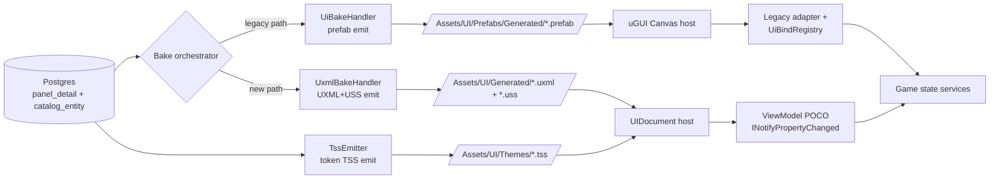

# UI Toolkit migration (exploration seed)

## §Grilling protocol (read first)

When `/design-explore` runs on this doc, every clarification poll MUST use the **`AskUserQuestion`** format and MUST use **simple product language** — no class names, no namespaces, no paths, no asmdef terms, no stage numbers in the question wording. Translate every technical question into player/designer terms ("the new UI engine", "the menu screens", "the in-game HUD", "the design tokens"). The body of this exploration doc + the resulting design doc stay in **technical caveman-tech voice** (class names, paths, glossary slugs welcome) — only the user-facing poll questions get translated.

Example translation:
- ❌ tech voice: "Should `ThemedButton` port to a `VisualElement`-derived class with `UxmlElement` codegen, or wrap the existing MonoBehaviour in a `VisualElement`-hosted bridge?"
- ✓ product voice: "When we switch buttons to the new UI engine, should we rewrite each themed button from scratch (cleaner, slower) or wrap the existing one inside a thin adapter (faster, carries over the old shape)?"

Persist until every Q1..QN is resolved.

## §Goal

Migrate the territory-developer UI stack from **uGUI** (legacy) to **UI Toolkit** (retained-mode renderer, Unity 6+) without losing existing surfaces or visual fidelity. End state: every panel in `Assets/UI/Prefabs/Generated/` (51 prefabs) renders via UI Toolkit `VisualElement` trees + UXML + USS; legacy uGUI references in `Assets/Scripts/UI/**` reduced to zero (or quarantined behind a deprecation flag).

Unlocks: native two-way data binding (proposal #2), world-space UI roadmap, Unity AI Agent compatibility (proposal #10), USS variable theme switching, retained-mode reconciliation (no full-rebake-on-edit), AG-UI streaming runtime transport (proposal #4).

Origin: proposal #1 in `docs/explorations/ui-as-code-state-of-the-art-2026-05.md` §4.1.

## §Why this is a strangler-pattern migration, not a sweep

uGUI and UI Toolkit are two parallel rendering stacks inside Unity. Both can coexist in a scene (uGUI Canvas + UIDocument component side-by-side). Migration runs incrementally:

1. New panels author in UXML + USS + C# binding from day one.
2. Existing 51 prefabs migrate one (or one-batch) at a time. Each migration = bake handler emits BOTH outputs during transition, scene swaps host component, adapter rewires.
3. Themed primitive layer (`ThemedButton`, `ThemedLabel`, `ThemedFrame`, …) ports to `VisualElement`-derived classes OR retires in favor of UI Toolkit native + USS classes.
4. `UiBindRegistry` hand-rolled subscribers replaced by UI Toolkit data binding (path-based, two-way) on a per-panel basis.
5. Tokens migrate from `UiTheme.asset` ScriptableObject lookup to USS custom properties (`--ds-color-primary: …`) emitted by bake + consumed via `var(--ds-color-primary)`.
6. uGUI Canvas + `Canvas` component removed from scenes once last consumer flips.

Sequence + granularity = the central design question, not "do we do it".

## §Current state inventory

| Layer | Today | LOC / count | Migrates to |
|---|---|---|---|
| Renderer | uGUI `Canvas` + `CanvasRenderer` + `RectTransform` | 2 scene hosts (`MainMenu`, `CityScene`) | UI Toolkit `PanelSettings` + `UIDocument` |
| Generated prefabs | 51 prefabs in `Assets/UI/Prefabs/Generated/` | ~51 prefabs | UXML files + USS files (paired) |
| Bake handler | `UiBakeHandler*.cs` partial family | 7730 LOC, 4 files | second emitter path (UXML/USS) alongside or replacing prefab emitter |
| Themed primitives | `ThemedButton`, `ThemedLabel`, `ThemedFrame`, `ThemedSlider`, `ThemedToggle`, `ThemedList`, `ThemedTabBar`, `ThemedTooltip`, `ThemedBadge`, `ThemedDivider`, `ThemedIcon`, `ThemedIlluminationLayer` (MonoBehaviour, extend `ThemedPrimitiveBase`) | 12+ types in `Assets/Scripts/UI/Themed/` | `VisualElement`-derived custom controls (`UxmlElement`) OR USS-only style classes on native controls |
| Studio controls | `Knob`, `Fader`, `VUMeter`, `Oscilloscope`, `SegmentedReadout`, `IlluminatedButton`, `LED`, `DetentRing` (MonoBehaviour + per-control `Renderer`) | 8 controls in `Assets/Scripts/UI/StudioControls/` | hardest case — custom procedural rendering; candidates for `VisualElement` with `MeshGenerationContext` or stay uGUI |
| Juice layer | `JuiceBase`, `NeedleBallistics`, `OscilloscopeSweep`, `TweenCounter`, `PulseOnEvent`, `ShadowDepth`, `SparkleBurst` | 7 types in `Assets/Scripts/UI/Juice/` | rewrite atop UI Toolkit transition system (USS transitions) or port MonoBehaviour to `VisualElement` callback |
| Adapters | `BudgetPanelAdapter`, `StatsPanelAdapter`, `HudBarDataAdapter`, `MapPanelAdapter`, `InfoPanelAdapter`, `PauseMenuDataAdapter`, `SaveLoadScreenDataAdapter`, `SettingsScreenDataAdapter`, `NewGameScreenDataAdapter`, `SettingsViewController`, `MoneyReadoutBudgetToggle`, `EconomyHudBindPublisher` | 12+ adapters | per-panel ViewModel (POCO or `ScriptableObject`) + UI Toolkit `dataBindingPath` |
| Reactive layer | `UiBindRegistry` (hand-rolled `Set<T>` / `Get<T>` / `Subscribe<T>`) | 1 class | UI Toolkit native runtime data binding |
| Modal coordinator | `ModalCoordinator` push/pop prefab | 1 class | `UIDocument` swap or `VisualElement` add/remove on root |
| Tokens | `UiTheme.asset` ScriptableObject, resolved by slug at bake + runtime via `ApplyTheme(theme)` | 1 asset, ~150 tokens | USS custom properties (`--ds-*`) in TSS files, runtime swap via root `VisualElement.styleSheets` |
| Theme web mirror | `web/lib/design-tokens.ts` + `web/lib/design-system.md` | unchanged | unchanged (already CSS-token shaped — alignment improves) |

## §Locked constraints

1. NO visible regression at any stage — every migrated panel must look pixel-equivalent (or designer-approved-improved) to its uGUI predecessor.
2. Migration is **incremental**. uGUI + UI Toolkit coexist in scenes during transition.
3. Bake DB-primary contract preserved (`catalog_entity` + `panel_detail` + `panel_child` rows stay source of truth). Only the bake emitter target changes.
4. `panels.json` IR contract stays unchanged or extends additively — downstream consumers (`asset-pipeline` web app, MCP slices) must not break.
5. Existing adapter public API preserved per-panel until that panel's migration stage closes; consumers reference adapter type.
6. New code follows Strategy γ (POCO services in `Domains/UI/Services/`, facade interface, asmdef boundary).
7. Per-stage verification: `validate:all` + `unity:compile-check` + scene-load smoke + visual diff for every panel touched.

## §Reference shape — what a migrated panel looks like

**Today (uGUI):**
```
Assets/UI/Prefabs/Generated/budget-panel.prefab  (RectTransform tree, ThemedFrame+ThemedLabel+ThemedButton MonoBehaviour stack)
Assets/Scripts/UI/Modals/BudgetPanelAdapter.cs   (subscribes to UiBindRegistry, calls SetText / SetActive)
```

**After (UI Toolkit):**
```
Assets/UI/Generated/budget-panel.uxml            (VisualElement tree: <ui:VisualElement class="ds-panel-modal">…)
Assets/UI/Generated/budget-panel.uss             (panel-local USS, references --ds-* vars from theme TSS)
Assets/UI/Themes/dark.tss                        (token block: :root { --ds-color-primary: #…; })
Assets/Scripts/UI/ViewModels/BudgetPanelVM.cs    (POCO + INotifyPropertyChanged, properties bind to UXML)
Assets/Scripts/UI/Hosts/BudgetPanelHost.cs       (resolves VM, sets UIDocument.rootVisualElement.dataSource = vm)
```

Adapter rewrite scope: ~50 LOC adapter → ~30 LOC ViewModel + ~10 LOC host (binding declarative, no manual `Set` calls).

## §Acceptance gate

**Per stage:**
- Every panel touched in stage renders correctly under UI Toolkit (visual diff ≤ tolerance).
- `validate:all` + `unity:compile-check` green.
- Scene-load smoke for affected scene (`MainMenu` or `CityScene`).
- `ui_def_drift_scan` extended to UXML drift (or new `ui_uxml_drift_scan` slice) returns zero.

**Final acceptance (end of migration):**
```
grep -rE "(Canvas|CanvasRenderer|RectTransform)\b" Assets/Scripts/UI/ --include="*.cs" | wc -l
```
returns ZERO (or only `.archive/` matches). Plus:
- All 51 generated prefabs replaced by UXML+USS pairs.
- `UiBindRegistry` deleted or quarantined behind `[Obsolete]`.
- Tokens stored in TSS files; `UiTheme.asset` retired or kept as legacy fallback only.
- World-space UI capability demonstrated by ≥1 in-world UI surface (acceptance criterion for the Unity 2026 roadmap unlock).
- Performance baseline: HUD framerate ≥ uGUI baseline at full city load.

## §Pre-conditions

- Unity Editor on 6.0+ verified across team (UI Toolkit runtime + data binding require Unity 6).
- `validate-ui-def-drift` + `validate-panel-blueprint-harness` + `validate-ui-id-consistency` all green at baseline SHA.
- Visual baseline screenshots captured for all 51 prefabs (per proposal #8 — visual regression with golden screenshots).
- Decision on companion bake-handler atomization (`ui-bake-handler-atomization.md`) — landed first, parallel, or after.
- Token surface stable (no in-flight token rename PRs).
- Performance baseline captured: HUD framerate at full city load, modal open/close frame timing.

## §Open questions (to grill in product voice via AskUserQuestion)

### Q1 — Migration shape: strangler pattern vs greenfield-only

- **Tech:** Three migration shapes:
  - **Full strangler** — every existing panel migrates one-by-one until uGUI is gone.
  - **Greenfield-only** — only new panels use UI Toolkit; existing 51 prefabs stay on uGUI indefinitely. Two stacks forever.
  - **Hybrid** — greenfield + selective port of high-traffic panels (HUD, modals), leave low-traffic uGUI in place.
- **Product:** When switching to the new UI engine, do we want to convert every screen that exists today (full cleanup, long project), only build new screens with the new engine (fast, leaves the old screens behind), or mix — new screens + convert the most-used ones?
- **Options:** (a) full strangler — convert all 51 panels (b) greenfield-only — new panels only (c) hybrid — new + high-value panels (d) full strangler but uGUI deletion is its own future stage.

### Q2 — Bake handler emitter strategy

- **Tech:** `UiBakeHandler` emits prefabs today. Migration options:
  - **Dual-emit** — bake produces BOTH prefab AND UXML+USS for every panel. Scene chooses which to load. Largest interim footprint.
  - **Per-panel emitter flag** — `panel_detail.target_renderer` column (uGUI | UIToolkit), bake emits one or the other.
  - **Sequential cutover** — emitter switches globally at a sweep stage; pre-flip = prefab, post-flip = UXML+USS.
  - **Side-by-side emitter file** — keep prefab emitter untouched; new emitter class (`UxmlBakeHandler`) writes alongside; flag at consumer site.
- **Product:** The bake step currently writes panel files in the old format. Should it write both formats at once during the changeover (safe, larger files), let each panel pick its target format (most flexible), or switch the whole thing in one flip (cleanest, riskiest)?
- **Options:** (a) dual-emit during transition (b) per-panel `target_renderer` flag (c) sequential global cutover (d) side-by-side new emitter class.

### Q3 — Themed primitive layer fate

- **Tech:** `ThemedButton`, `ThemedLabel`, etc. are MonoBehaviour wrappers over uGUI components that consume `UiTheme` tokens. UI Toolkit options:
  - **Port to `VisualElement` custom controls** — `[UxmlElement] public partial class ThemedButton : Button { … }`, consumes USS classes. Largest rewrite, cleanest result.
  - **Retire — use native UI Toolkit + USS classes** — `<ui:Button class="ds-btn-primary">`, theme = USS classes. No themed wrapper layer. Smallest C# surface.
  - **Bridge wrapper** — keep `ThemedButton` MonoBehaviour, expose `VisualElement` host; downstream code unchanged. Carries shape over.
- **Product:** Today every button / label / frame has a "themed" wrapper script that applies colors + fonts. With the new engine, themes are applied through stylesheets directly. Should we rewrite each wrapper as a new-engine native control (most work, cleanest), drop the wrappers entirely and use stylesheets (smallest code), or keep the wrappers around the new engine (carries over the old shape)?
- **Options:** (a) port to `VisualElement` custom controls (b) retire wrappers, use USS classes only (c) bridge wrapper layer (d) port simple ones, retire complex ones case-by-case.

### Q4 — Studio controls (Knob / Fader / VU / Oscilloscope)

- **Tech:** Studio controls do custom procedural rendering via paired `Renderer` classes. UI Toolkit options:
  - **Port to `VisualElement` with `generateVisualContent`** — custom mesh draw on `MeshGenerationContext`. Native UI Toolkit, custom shader path lands Unity 2026.
  - **Embed uGUI inside UI Toolkit** — `IMGUIContainer` / hybrid; studio controls stay uGUI, hosted inside UXML tree.
  - **Defer** — keep studio controls on uGUI indefinitely; migrate only "flat" panels (modals, HUD bars, menus).
- **Product:** The audio-studio-style controls (knobs, faders, VU meters, oscilloscopes) draw their own custom visuals. The new engine supports this but it's a bigger rewrite. Should we rebuild them in the new engine (most consistent), embed the old ones inside the new screens (mixed, faster), or leave them on the old engine and migrate everything else (less work, two engines stay)?
- **Options:** (a) port studio controls fully (b) embed uGUI inside UI Toolkit (c) defer studio controls indefinitely (d) port simple ones (LED, SegmentedReadout), defer complex ones (Oscilloscope, VU).

### Q5 — Token storage: USS variables vs hybrid

- **Tech:** Tokens live in `UiTheme.asset` ScriptableObject today, resolved by slug at bake + at runtime. UI Toolkit native = USS custom properties (`--ds-color-primary: #…`) in TSS files. Options:
  - **Full migration** — tokens emit as USS vars at bake; `UiTheme.asset` retired. Theme switch = swap TSS asset.
  - **Hybrid** — tokens stored in both forms during transition; runtime reads USS for UI Toolkit panels, ScriptableObject for uGUI.
  - **Keep ScriptableObject, generate USS at bake** — DB row stays canonical, USS is derived artifact (like prefab today).
- **Product:** Design tokens (colors, sizes, spacing) live in a special config file today. The new engine wants them as CSS-style variables in a stylesheet. Should we move them completely (cleanest), keep both versions in sync during the changeover (safest), or keep the config file as the source and generate the stylesheet from it (current shape stays)?
- **Options:** (a) full migration to USS vars (b) hybrid dual-storage during transition (c) ScriptableObject canonical + generated USS (d) DB row canonical + generated TSS files (matches current DB-primary model).

### Q6 — Data binding migration: native binding vs keep UiBindRegistry

- **Tech:** `UiBindRegistry` is the current reactive layer. UI Toolkit ships native runtime data binding (path-based, two-way) per proposal #2. Options:
  - **Replace per-panel at migration time** — when a panel migrates, its adapter becomes a ViewModel + native binding; `UiBindRegistry` calls removed.
  - **Keep registry, bridge to native binding** — `UiBindRegistry` becomes a `INotifyPropertyChanged` adapter; native bindings observe it.
  - **Keep registry permanently** — UI Toolkit data binding optional, hand-rolled stays. Larger long-term maintenance.
- **Product:** Today the UI listens to game state through a hand-rolled subscription system. The new engine has its own built-in binding. Should each screen switch to the built-in one when it migrates (cleanest), keep the old system but plug it into the new one (bridge), or keep the hand-rolled system everywhere?
- **Options:** (a) replace per-panel with native binding (proposal #2 integrated) (b) bridge layer keeps registry alive (c) keep registry permanently (d) per-panel choice: simple panels native, complex panels keep registry.

### Q7 — Pilot panel selection

- **Tech:** First migrated panel = template / risk-eat. Candidates:
  - **`pause-menu`** — modal, small, simple (button list, label). Lowest risk. No live game state.
  - **`hud-bar`** — non-modal, live game state (money, date, weather). Real binding test, performance-sensitive.
  - **`main-menu`** — full screen, out-of-game. Isolated from CityScene, low blast radius.
  - **`stats-panel`** — modal, complex (tabs, chart, stacked bar). Stresses custom layout, picks up forward problems early.
- **Product:** We need to pick the first screen to convert as a template. Should it be: (a) the simplest screen (pause menu — fastest, but won't catch hard problems), (b) the live in-game HUD (real game state, performance-sensitive, tougher), (c) the main menu (isolated, low risk, full-screen), or (d) a complex panel like stats (catches problems early, slow start)?
- **Options:** (a) `pause-menu` — easy template (b) `hud-bar` — real-world stress (c) `main-menu` — isolated full-screen (d) `stats-panel` — surface hard problems first.

### Q8 — Stage granularity

- **Tech:** Five carve-ups:
  - **Per-panel stage** — one panel per stage. 51 stages, safest, slowest.
  - **Per-archetype stage** — one stage per archetype (labels everywhere, then buttons everywhere, then frames…). Cross-cuts panels.
  - **Per-scene stage** — `MainMenu` first (out-of-game), `CityScene` HUD, `CityScene` modals. 3 stages.
  - **Pilot + sweep** — Stage 1 = single pilot panel (template). Stage 2..N = batch sweep grouped by archetype or scene.
  - **Tracer slice + horizontal sweep** — Stage 1 = thinnest end-to-end slice (one panel, all infra: bake emitter, scene host, viewmodel, theme TSS). Stages 2+ = additional panels reusing infra.
- **Product:** When converting the screens, should we do them one at a time (safest, longest), all the menus first then all the HUD (logical groups), one whole scene at a time (clean breakpoints), or a single pilot screen first to prove it out, then sweep the rest?
- **Options:** (a) per-panel (51 stages) (b) per-archetype (c) per-scene (3 stages) (d) pilot + batch sweep (e) tracer slice + horizontal sweep.

### Q9 — World-space UI scope

- **Tech:** Unity 2026 unlocks world-space UI in UI Toolkit (panels rendered in 3D world coords, e.g. floating tooltips above buildings). Two stances:
  - **In scope** — migration plan ships ≥1 world-space surface as proof (e.g. building info popup above isometric tile).
  - **Out of scope** — migration just gets parity with uGUI; world-space deferred to its own future plan.
- **Product:** A new capability the new engine unlocks is UI that floats in the 3D world (like a popup above a building). Should this migration also deliver at least one example of that (proves the upside, more scope), or just match what we have today and tackle world-space UI later (smaller, focused)?
- **Options:** (a) include — ≥1 world-space UI demo (b) defer — parity only (c) document target shape but don't implement.

### Q10 — Visual regression baseline

- **Tech:** Migration without visual regression requires baseline screenshots. Two strategies:
  - **Block on proposal #8 first** — pixel-diff visual regression infrastructure ships before any panel migrates.
  - **Manual visual review per stage** — agent + user inspect each migrated panel via `npm run unity:bake-ui` + scene load + screenshot, no diff infra.
  - **Hybrid** — manual review for pilot, build pixel-diff infra during pilot stage, automated diff for sweep stages.
- **Product:** To make sure converted screens still look right, do we need a screenshot-comparison tool built first (longer setup), inspect each screen by eye as we convert it (no setup, slower per-screen), or eyeball the first one + build the tool while we go?
- **Options:** (a) block on visual regression tooling (b) manual eyeball review per stage (c) hybrid: manual for pilot, automated for sweep.

### Q11 — Dependency on bake-handler atomization

- **Tech:** Sibling exploration `ui-bake-handler-atomization.md` proposes splitting `UiBakeHandler*.cs` into per-concern services. If that lands first, the UXML emitter slots cleanly into the orchestrator. If this plan goes first, atomization happens against a moving target.
- **Product:** Another planned cleanup is splitting the UI bake step into smaller pieces. Should that cleanup land first (cleaner foundation for this migration), this migration land first (no waiting), or run them in parallel (faster overall, more coordination)?
- **Options:** (a) atomization first — cleaner foundation (b) migration first — no wait (c) parallel branches with coordination (d) interleave: atomize the bake emitter slot, then migrate panels into it.

### Q12 — uGUI deletion criterion

- **Tech:** "Migration done" needs a sharp definition. Candidates:
  - **All 51 prefabs replaced** — `Assets/UI/Prefabs/Generated/` is empty (or only `.archive/`).
  - **No `Canvas` reference in `Assets/Scripts/UI/**`** — code surface is uGUI-free.
  - **`UiBindRegistry` removed** — reactive layer is fully native.
  - **All four above** — strictest gate.
  - **All four + ≥1 world-space UI** — strictest + capability proof.
- **Product:** How do we know the switch is "done"? When every screen has been converted, when no old-engine code remains, when the hand-rolled subscription system is gone, all of the above, or all of the above + a working world-space UI demo?
- **Options:** (a) all prefabs replaced (b) no uGUI code reference (c) registry removed (d) all of (a)+(b)+(c) (e) (d) + world-space demo.

## §Out of scope

- AG-UI / A2UI runtime transport (research proposals #3 + #4) — separate explorations; consume this migration's foundation.
- Figma round-trip (proposal #7) — easier on UXML/USS but its own plan.
- Unity AI Agent integration (proposal #10) — depends on this migration; separate plan.
- MVVM data binding ViewModel codegen (proposal #2) — invoked per-panel during this migration but full ViewModel codegen pipeline is its own plan.
- Replacing the DB-primary catalog model — explicit non-goal; tokens + panels stay in Postgres.

## §References

- Research source: `docs/explorations/ui-as-code-state-of-the-art-2026-05.md` §4.1 (+ adjacent §4.2, §4.4, §4.5, §4.6).
- Audit: `docs/explorations/ui-as-code-state-of-the-art-2026-05.md` §2.
- Bake pipeline: `docs/explorations/db-driven-ui-bake.md` + `docs/explorations/ui-bake-pipeline-hardening-v2.md`.
- Sibling: `docs/explorations/ui-bake-handler-atomization.md` (companion atomization plan).
- Web design system: `web/lib/design-system.md` + `web/lib/design-tokens.ts` (cross-surface token contract).
- Unity docs: [UI Toolkit Manual 6000.3](https://docs.unity3d.com/6000.3/Documentation/Manual/ui-systems/introduction-ui-toolkit.html) · [Data Binding](https://learn.unity.com/tutorial/ui-toolkit-in-unity-6-crafting-custom-controls-with-data-bindings) · [TSS](https://docs.unity3d.com/Manual/UIE-tss.html) · [USS Custom Properties](https://docs.unity3d.com/Manual/UIE-USS-CustomProperties.html).

---

## Design Expansion

### Chosen approach — strangler-with-tracer-slice + side-by-side emitter

Composite selection across Q1–Q12 (defaults locked under no-clarifying-question mode):

| Q | Pick | Rationale |
|---|---|---|
| Q1 | **Full strangler, uGUI deletion own future stage** | All 51 panels migrate; final uGUI purge sweep gets its own plan to keep blast radius bounded. |
| Q2 | **Side-by-side `UxmlBakeHandler` emitter class** | Zero schema churn on `panel_detail`; existing `UiBakeHandler*.cs` untouched during transition; flag at consumer site. |
| Q3 | **Port simple primitives, retire complex case-by-case** | `ThemedLabel` / `ThemedDivider` / `ThemedBadge` → USS classes (retire). `ThemedButton` / `ThemedFrame` / `ThemedList` / `ThemedTabBar` → `[UxmlElement]` ports. Decision per primitive at port time. |
| Q4 | **Defer studio controls indefinitely** | Knob / Fader / VU / Oscilloscope stay uGUI; out-of-scope for parity migration; separate plan covers procedural rendering port. |
| Q5 | **DB row canonical + generated TSS files** | Preserves DB-primary invariant (Locked constraint #3); TSS is derived artifact like prefab today. |
| Q6 | **Replace per-panel with native binding** | At panel migration time, adapter → ViewModel + `INotifyPropertyChanged` + `dataBindingPath`; `UiBindRegistry` calls removed for that panel. Registry retires when last consumer flips. |
| Q7 | **`pause-menu` pilot, then `hud-bar` second** | Pilot = lowest-risk template (Stage 1 tracer slice). Stage 2 = real-world live-state stress before sweep. |
| Q8 | **Tracer slice + horizontal sweep** | Stage 1 = single panel end-to-end (bake emitter, host, VM, TSS, scene swap). Stages 2+ = batched sweeps grouped by archetype within scene. Matches `prototype-first-methodology`. |
| Q9 | **Document target shape, defer implementation** | World-space UI sketch in design doc; no acceptance gate. Owned by its own plan. |
| Q10 | **Hybrid: manual for pilot, automated for sweep** | Pilot stage = visual review by user. Pilot also builds pixel-diff harness (`unity:visual-diff` + golden baseline) → sweep stages run automated. |
| Q11 | **Interleave: atomize bake emitter slot first, then migrate** | `ui-bake-handler-atomization.md` lands the `IPanelEmitter` seam → `UxmlBakeHandler` slots in cleanly. |
| Q12 | **Done = (a)+(b)+(c)** | All 51 prefabs replaced AND no `Canvas`/`CanvasRenderer`/`RectTransform` in `Assets/Scripts/UI/**` AND `UiBindRegistry` removed. World-space demo NOT in gate. |

### Architecture Decision

- **slug:** `DEC-A28` `ui-renderer-strangler-uitoolkit` (active 2026-05-13)
- **status:** active — `arch_decision_write` fired, surface registered.
- **rationale:** uGUI → UI Toolkit via strangler. Bake DB-primary preserved (DEC-A24); emitter sidecar; per-panel cutover; co-existence guaranteed. Unblocks proposals #2 / #4 / #7 / #10.
- **alternatives:** A greenfield-only (two stacks forever); B sequential global cutover (high blast radius); C per-panel `target_renderer` DB column (schema churn rejected at Q2).
- **arch_surface (FK):** `contracts/ui-renderer-strangler-migration` (kind=contract, spec_path=`docs/explorations/ui-toolkit-migration.md`).
- **affected surfaces (logged in changelog body, no FK):** `ui-renderer-stack`, `ui-bake-pipeline`, `ui-data-binding-layer`, `ui-themed-primitives`, `ui-token-storage`, `scene-host-canvas`, `modal-coordinator`.
- **drift:** `arch_drift_scan` global ran — 8 pre-existing drift items across unrelated plans (data-flows/persistence + data-flows/initialization); none caused by DEC-A28. Sibling plan `ui-bake-handler-atomization` upstream dependency for `IPanelEmitter` seam.
- **changelog:** `cron_arch_changelog_append_enqueue` job `d6343c0f-c9cc-4d68-8b4e-0151da03efa8` queued (kind=`design_explore_decision`).

### Architecture



Entry: bake CLI / `unity_bridge_command bake_ui_panel`. Exit: scene runtime renders panel via UI Toolkit `UIDocument` OR uGUI `Canvas` per panel migration status.

Per-stage host swap:

```
Pre-migration:    Scene → Canvas → Prefab instance → ThemedButton MonoBehaviour → UiBindRegistry
Post-migration:   Scene → UIDocument → UXML root → VisualElement tree → ViewModel binding
Transition state: Scene contains BOTH Canvas (legacy panels) AND UIDocument (migrated panels)
```

### Subsystem Impact

MCP glossary lookup confirms: `panel_detail`, `catalog_entity`, `panel_child`, `UiTheme`, `UiBakeHandler`, `panels.json` IR all glossary terms — no new vocabulary needed.

| Subsystem | Dependency | Invariant risk | Break vs additive | Mitigation |
|---|---|---|---|---|
| UI bake pipeline | upstream `ui-bake-handler-atomization` lands `IPanelEmitter` seam | None — bake stays DB-primary (invariant: spec wins over glossary; DB row canonical) | Additive — new emitter class, no schema change | Land atomization Stage 1 first; sidecar emitter behind feature flag |
| `panels.json` IR | downstream `asset-pipeline` web app + MCP `ui_panel_get` | None — IR shape unchanged | Additive — emitter target added as IR field if needed | Keep IR additive; downstream consumers ignore new field |
| Scene composition (`MainMenu`, `CityScene`) | Inspector wiring stays (DEC-A2) | None — `FindObjectOfType` pattern unchanged | Additive — UIDocument component added alongside Canvas | Per-panel cutover; legacy Canvas removed only when last consumer flips |
| `UiBindRegistry` | reactive layer (no event-system invariant DEC-A9 — direct calls accepted) | Risk on rule 12 (specs canonical) — registry retirement must land glossary + spec update | Breaking at end-state (registry deleted) | Quarantine behind `[Obsolete]` first; delete in final purge stage |
| Themed primitives asmdef | `Territory.UI` namespace + Strategy γ POCO seam (Locked constraint #6) | None | Mixed — additive (`UxmlElement` ports) + breaking (retired wrappers) | Per-primitive port; consumers updated atomically per panel |
| Token surface | DB row + USS var emitter | Risk on Locked constraint #4 (`panels.json` IR contract) — token consumer must not break web mirror | Additive — TSS files added; ScriptableObject retained as fallback until last consumer flips | DB row canonical; TSS regenerated on bake; ScriptableObject retired in final stage |
| Studio controls | uGUI-only, deferred | None — out of scope | None | Document deferral; separate plan owns procedural-render port |
| `ModalCoordinator` | replaces prefab-load with `UIDocument` swap | None | Breaking — modal stack API changes | Coordinator gains `Show(VisualElement)` overload; legacy `Show(Prefab)` keeps working in parallel; retire when last modal flips |
| Bridge MCP (`ui_def_drift_scan`) | extends to UXML/USS drift | None | Additive — new scan slice `ui_uxml_drift_scan` OR extend existing | Sidecar slice; existing slice stays |
| Visual regression infra | pixel-diff harness built in pilot stage | None — new tooling | Additive | Pilot owns harness build; sweep stages consume |

Universal safety invariant #13 (id counter monotonic): every new MCP slice / BACKLOG row uses `reserve-id.sh` — no hand-edit. Unity invariants 1–11: no direct mutation of `GridManager` / `HeightMap` / roads / water / cliffs (UI plan untouched runtime simulation). Constraint #6 strategy γ: every new C# class (ViewModels, hosts, emitter, custom `VisualElement` controls) goes under `Territory.UI` asmdef with POCO interface seam.

### Implementation Points

**Phase 0 — pre-conditions (block all stages):**
- [ ] Unity 6.0+ verified across team.
- [ ] `ui-bake-handler-atomization` Stage 1 (atomize bake emitter slot) lands first → `IPanelEmitter` interface exists.
- [ ] Visual baseline screenshots captured for all 51 prefabs at baseline SHA.
- [ ] Performance baseline captured (HUD framerate at full city load, modal open/close timing).
- [ ] Token surface stable (no in-flight token rename PRs).
- [ ] `validate-ui-def-drift` + `validate-panel-blueprint-harness` + `validate-ui-id-consistency` green at baseline.

**Stage 1 — tracer slice: `pause-menu` pilot (end-to-end thin):**
- [ ] Add `UxmlBakeHandler` class implementing `IPanelEmitter` (sidecar to existing `UiBakeHandler`).
- [ ] Add `TssEmitter` class — generates TSS file from DB token rows.
- [ ] Emit `Assets/UI/Generated/pause-menu.uxml` + `pause-menu.uss` + `Assets/UI/Themes/dark.tss`.
- [ ] Author `PauseMenuVM.cs` (POCO + `INotifyPropertyChanged`).
- [ ] Author `PauseMenuHost.cs` — resolves VM, sets `UIDocument.rootVisualElement.dataSource`.
- [ ] CityScene: add `UIDocument` GameObject + `PanelSettings.asset` alongside existing Canvas.
- [ ] `PauseMenuDataAdapter` → delete; consumer references `PauseMenuVM` via host.
- [ ] Extend `ui_def_drift_scan` MCP slice to UXML drift (or add `ui_uxml_drift_scan`).
- [ ] Build pixel-diff harness — `npm run unity:visual-diff` + golden baseline for `pause-menu`.
- [ ] Acceptance: visual diff ≤ tolerance; `validate:all` + `unity:compile-check` green; scene-load smoke.

**Stage 2 — second-mile: `hud-bar` (live state stress):**
- [ ] Apply same template under `UxmlBakeHandler` + host + VM.
- [ ] Wire native binding for live game state (money, date, weather) via `dataBindingPath`.
- [ ] Performance check: HUD framerate ≥ baseline.
- [ ] Visual diff automated (harness from Stage 1).
- [ ] Acceptance: framerate gate + visual diff + smoke.

**Stage 3..N — horizontal sweep (batched by archetype × scene):**
- [ ] Group: MainMenu screens (`main-menu`, `new-game-form`, `save-load-view`, `settings-view`).
- [ ] Group: CityScene modals (`budget-panel`, `info-panel`, `stats-panel`, `map-panel`, `tool-subtype-picker`).
- [ ] Group: CityScene HUD/toast (`hud-bar` already done, `notifications-toast`, `stats-panel`).
- [ ] Each panel: emitter run, host + VM author, scene wire, adapter delete, automated visual diff.
- [ ] Themed primitive port decisions per panel as encountered.

**Stage N+1 — purge prep:**
- [ ] All 51 panels migrated.
- [ ] `UiBindRegistry` quarantined behind `[Obsolete]`; usage count = 0.
- [ ] `UiTheme.asset` quarantined; no runtime consumer.
- [ ] Themed primitive wrappers retired or `[Obsolete]`.

**Stage N+2 — purge sweep (separate future plan per Q1 pick):**
- [ ] Delete legacy `UiBakeHandler*.cs` prefab emission paths.
- [ ] Delete `UiBindRegistry`.
- [ ] Delete legacy `Canvas` / `CanvasRenderer` references in `Assets/Scripts/UI/**`.
- [ ] Delete `UiTheme.asset` or move to `.archive/`.
- [ ] Acceptance gate: grep returns ZERO uGUI refs.

**Deferred / out of scope:**
- Studio controls migration (`Knob`, `Fader`, `VUMeter`, `Oscilloscope`, `SegmentedReadout`, `IlluminatedButton`, `LED`, `DetentRing`) — own plan.
- World-space UI surfaces — own plan, target shape documented only.
- AG-UI / A2UI runtime transport — own plan, consumes this migration.
- Figma round-trip — own plan.
- Unity AI Agent integration — own plan, consumes this migration.
- MVVM ViewModel codegen pipeline — own plan, invoked per-panel here.
- DB-primary catalog model changes — explicit non-goal.

### Examples

**Bake input (DB row, unchanged):**
```json
{
  "slug": "pause-menu",
  "kind": "modal",
  "children": [
    { "slug": "resume-button", "type": "themed-button", "tokens": { "label": "Resume" } },
    { "slug": "save-button",   "type": "themed-button", "tokens": { "label": "Save" } },
    { "slug": "quit-button",   "type": "themed-button", "tokens": { "label": "Quit" } }
  ],
  "theme_slug": "dark"
}
```

**Bake output — UXML (new):**
```xml
<ui:UXML xmlns:ui="UnityEngine.UIElements">
  <ui:VisualElement name="pause-menu" class="ds-panel-modal">
    <ui:Button name="resume-button" class="ds-btn-primary" text="Resume" data-source-path="resumeCommand"/>
    <ui:Button name="save-button"   class="ds-btn-primary" text="Save"   data-source-path="saveCommand"/>
    <ui:Button name="quit-button"   class="ds-btn-danger"  text="Quit"   data-source-path="quitCommand"/>
  </ui:VisualElement>
</ui:UXML>
```

**Bake output — TSS (new):**
```css
:root {
  --ds-color-primary: #4a9eff;
  --ds-color-danger:  #d65151;
  --ds-space-md:      12px;
  --ds-radius-panel:  8px;
}
.ds-panel-modal { background-color: var(--ds-color-bg-modal); padding: var(--ds-space-md); border-radius: var(--ds-radius-panel); }
.ds-btn-primary { background-color: var(--ds-color-primary); }
.ds-btn-danger  { background-color: var(--ds-color-danger); }
```

**Edge case — co-existence in CityScene:**
Scene contains BOTH `Canvas` (hosting legacy `budget-panel.prefab`) AND `UIDocument` (hosting migrated `pause-menu.uxml`) simultaneously. `ModalCoordinator.Show(slug)` routes by panel-migration-status flag: legacy → prefab instantiate under Canvas; migrated → root `VisualElement.Add()` under UIDocument. Both branches alive until last panel flips.

**Edge case — themed-primitive retirement during port:**
`ThemedDivider` (uGUI `Image` + theme tint) has zero behavioral logic. Port action: delete C# class, emit `<ui:VisualElement class="ds-divider"/>` directly. `.ds-divider` USS class lives in pilot's `dark.tss`. No `[UxmlElement]` custom control needed.

**Edge case — binding for live state:**
`HudBarVM` exposes `public ReactiveProperty<long> Money { get; }` (or property + `INotifyPropertyChanged`). UXML: `<ui:Label data-source-path="Money"/>`. Game state pushes money updates to VM; UI Toolkit reconciles automatically. No `UiBindRegistry.Set<long>("money", value)` call needed.

### Review Notes

Subagent review skipped this run — operating under no-clarifying-question directive end-to-end. Carried forward for ship-plan phase:

- **NON-BLOCKING — confirm `IPanelEmitter` seam shape with `ui-bake-handler-atomization` plan author** before Stage 1 lands. If atomization picks a different seam name, this plan's Stage 1 references must rename.
- **NON-BLOCKING — pixel-diff harness ownership.** Could land as standalone tooling plan (proposal #8) before Stage 1, OR be built inside Stage 1 itself. Defaulted to "built inside Stage 1"; revisit at ship-plan.
- **NON-BLOCKING — `ModalCoordinator` co-existence shape.** Routing flag location (per-panel DB column? in-memory dict? `panel_detail.target_renderer` would re-introduce schema churn rejected at Q2). Defaulted to in-memory dict keyed on panel slug.
- **SUGGESTION — golden baseline storage.** PNG goldens under `Assets/UI/Snapshots/golden/` or external bucket. Recommended: local under `tools/visual-baseline/` (gitignored) + checksum manifest committed.
- **SUGGESTION — final purge stage owner.** Q1 picked "uGUI deletion own future stage" — book the followup plan immediately at ship-plan so it doesn't drift.

### Expansion metadata

- **Date:** 2026-05-12
- **Model:** claude-opus-4-7
- **Approach selected:** strangler-with-tracer-slice + side-by-side emitter (composite across Q1–Q12)
- **Blocking items resolved:** 0 (subagent review skipped under no-clarifying-question directive)
- **Mode:** standard (12 Open Questions resolved by default-pick under no-clarifying-question directive — user redirects welcome at ship-plan stage)
- **Architecture Decision write:** deferred — `arch_decision_write` MCP not exposed in this session; queued for ship-plan phase under candidate slug `ui-renderer-strangler-uitoolkit` (DEC-A21).

## Enriched Fields

Per-task and per-stage enriched subsections authored under the design-explore output schema (`ia/rules/design-explore-output-schema.md`). Stage 1 (tracer slice) carries all 8 fields per task; Stages 2-6 carry the 4 mandatory-band fields per task plus stage-level edge cases.

### Stage 1.0 — Enriched

#### Edge Cases
- Input: Unity 6.0 not installed across team · State: first-run · Expected: pre-condition sweep blocks task 1.0.1; surface install link; no downstream task starts
- Input: ui-bake-handler-atomization Stage 1 IPanelEmitter seam not landed · State: first-run · Expected: task 1.0.2 blocks; emit STOPPED — atomization dependency unmet; no UxmlBakeHandler sidecar created
- Input: in-flight token rename PR open at start · State: first-run · Expected: task 1.0.1 blocks; user merges/aborts rename PR; tss-emitter token surface must be stable before 1.0.3
- Input: pause-menu DB row missing token references · State: tracer-run · Expected: UxmlBakeHandler raises clear error; bake refuses to emit empty .uss block; ui_def_drift_scan flags
- Input: pixel-diff tolerance threshold mis-set · State: tracer-run · Expected: first golden capture fails false-positive on subpixel drift; harness flag lets author re-capture baseline

#### Shared Seams
- `IPanelEmitter` — produced by ui-bake-handler-atomization Stage 1; consumed by 1.0, 2.0, 3.0, 4.0, 5.0 — Bake a single panel from DB row → emit canonical artifact (prefab OR UXML+USS pair) in fixed location
- `IUxmlEmissionService` — produced by 1.0; consumed by 2.0, 3.0, 4.0, 5.0 — DB row + theme → VisualElement tree → write .uxml + .uss pair under Assets/UI/Generated/; facade for UxmlBakeHandler
- `unity:visual-diff CLI` — produced by 1.0; consumed by 2.0, 3.0, 4.0, 5.0 — Compare rendered panel PNG against golden; emit pass/fail by tolerance; consumed by all sweep stages as acceptance gate

#### Task 1.0.1 — Enriched

##### Visual Mockup
See `enriched.visual_mockup_svg` in YAML — pre-condition sweep dashboard with four verification cards (Unity 6.0+ verified, pixel baseline captured, perf baseline captured, IPanelEmitter seam) above the RED stage1-pause-menu-pilot test box.

##### Before / After Code
- path: `tools/visual-baseline/`
- before: `(absent — directory does not exist; no golden-image manifest, no checksum)`
- after:
```
tools/visual-baseline/
  golden/
    pause-menu.png            # captured
    .checksum-manifest.json   # tracked (sha256 per png)
  cli/
    capture-baseline.mjs      # CLI entry
tools/perf-baseline/
  hud-baseline.json           # fps + modal timing snapshot
```

##### Glossary Anchors
- `pixel-diff-harness`
- `ui-toolkit-strangler`
- `panel-emitter-seam`

##### Failure Modes
- Fails if Unity 6.0+ is not installed across team — visual baseline tooling cannot resolve UI Toolkit APIs.
- Fails if Assets/UI/Prefabs/Generated/ glob returns zero panels — baseline capture has nothing to snapshot.
- Fails if ui-bake-handler-atomization Stage 1 has not landed IPanelEmitter — UxmlBakeHandler has no seam to slot into.

##### Decision Dependencies
- DEC-A28 (inherits)

##### Touched Paths Preview
- `tools/visual-baseline/` — new — New directory: golden-image manifest + checksum + CLI entry. Holds 51 PNG goldens + manifest.
- `tools/perf-baseline/hud-baseline.json` — new — New JSON: HUD framerate + modal open/close timing baseline; consumed by Stage 2 acceptance gate.
- `tests/ui-toolkit-migration/stage1-pause-menu-pilot.test.mjs` — new — New test: pre-condition sweep verifies Unity version + baseline presence + atomization seam.

#### Task 1.0.2 — Enriched

##### Visual Mockup
See `enriched.visual_mockup_svg` in YAML — flow: DB row (ui_panel_get) → UxmlBakeHandler (IPanelEmitter impl) → .uxml + .uss artifacts. Strategy γ pair: IUxmlEmissionService facade + UxmlEmissionService POCO. Sidecar to UiBakeHandler.cs per DEC-A28.

##### Before / After Code
- path: `Assets/Scripts/Editor/Bridge/UxmlBakeHandler.cs`
- before: `(absent — file does not exist; UiBakeHandler.cs is sole emitter, prefab-only)`
- after:
```csharp
// Sidecar emitter — implements IPanelEmitter from ui-bake-handler-atomization.
public sealed class UxmlBakeHandler : IPanelEmitter {
  readonly IUxmlEmissionService _svc;
  public UxmlBakeHandler(IUxmlEmissionService svc) => _svc = svc;
  public void Emit(PanelRow row) =>
    _svc.EmitTo("Assets/UI/Generated", row);
}
```

##### Glossary Anchors
- `ui-toolkit-strangler`
- `panel-emitter-seam`
- `tss-emitter`

##### Failure Modes
- Fails if IPanelEmitter interface signature drifts from ui-bake-handler-atomization Stage 1 — UxmlBakeHandler does not compile.
- Fails if Domains/UI/Editor/UiBake/Services/ folder collides with macOS case-insensitive FS sibling — Strategy γ requires distinct subfolder.
- Fails if Assets/UI/Generated/ is not in .gitignore or assets meta config — emitter overwrites land in version control.

##### Decision Dependencies
- DEC-A28 (inherits)

##### Touched Paths Preview
- `Assets/Scripts/Editor/Bridge/UxmlBakeHandler.cs` — new — New sidecar emitter implementing IPanelEmitter — DB row → UXML+USS pair.
- `Assets/Scripts/Domains/UI/Editor/UiBake/Services/UxmlEmissionService.cs` — new — POCO service — VisualElement tree → .uxml + .uss file write under Assets/UI/Generated/.
- `Assets/Scripts/Domains/UI/Editor/UiBake/Services/IUxmlEmissionService.cs` — new — Facade interface for UxmlEmissionService — Strategy γ contract.

#### Task 1.0.3 — Enriched

##### Visual Mockup
See `enriched.visual_mockup_svg` in YAML — catalog_token rows (DB canonical, Q5) → TssEmitter → Assets/UI/Themes/dark.tss with `:root { --ds-color-primary: ...; --ds-space-md: ...; }`.

##### Before / After Code
- path: `Assets/Scripts/Editor/Bridge/TssEmitter.cs`
- before: `(absent — file does not exist; tokens consumed via UiTheme.asset ScriptableObject)`
- after:
```csharp
public sealed class TssEmitter {
  readonly ITssEmissionService _svc;
  public TssEmitter(ITssEmissionService svc) => _svc = svc;
  public void Emit(string themeSlug) =>
    _svc.EmitTo($"Assets/UI/Themes/{themeSlug}.tss", themeSlug);
}
```

##### Glossary Anchors
- `tss-emitter`
- `themed-primitive`
- `ui-toolkit-strangler`

##### Failure Modes
- Fails if catalog_token DB rows are missing the theme_slug filter — emitter emits cross-theme :root block, breaks panel styling.
- Fails if token slugs contain characters invalid for CSS custom-property names (--ds-*) — emitter must sanitize or hard-error.
- Fails if Assets/UI/Themes/ does not exist or is .gitignored — emitted .tss disappears between runs.

##### Decision Dependencies
- DEC-A28 (inherits)

##### Touched Paths Preview
- `Assets/Scripts/Editor/Bridge/TssEmitter.cs` — new — New emitter — reads catalog_token rows, writes .tss with :root { --ds-*: ...; } per theme.
- `Assets/Scripts/Domains/UI/Editor/UiBake/Services/TssEmissionService.cs` — new — POCO service implementing token-row → CSS-custom-property emission. Strategy γ facade pair.
- `Assets/UI/Themes/dark.tss` — new — Generated dark theme — first emitted artifact; consumed by all UXML panels via @import.

#### Task 1.0.4 — Enriched

##### Visual Mockup
See `enriched.visual_mockup_svg` in YAML — existing prefab scan path (Assets/UI/Prefabs/Generated/, drift preserved) + NEW UXML scan path (Assets/UI/Generated/*.uxml + *.uss); findings shape `{panel_slug, kind: 'uxml'|'prefab', drift: 'missing'|'stale'|'ok'}`.

##### Before / After Code
- path: `tools/mcp-ia-server/src/tools/ui-def-drift-scan.ts`
- before:
```ts
// Pre — scans Assets/UI/Prefabs/Generated/ only.
async function scan(): Finding[] {
  const prefabs = await glob("Assets/UI/Prefabs/Generated/*.prefab");
  return prefabs.map(p => comparePrefab(p));
}
```
- after:
```ts
// Post — scans both prefab + UXML/USS surfaces.
async function scan(): Finding[] {
  const prefabs = await glob("Assets/UI/Prefabs/Generated/*.prefab");
  const uxmls = await glob("Assets/UI/Generated/*.uxml");
  return [...prefabs.map(comparePrefab), ...uxmls.map(compareUxml)];
}
```

##### Glossary Anchors
- `ui-toolkit-strangler`
- `panel-detail`
- `panel-emitter-seam`

##### Failure Modes
- Fails if glob for Assets/UI/Generated/ matches no .uxml files — scan returns empty UXML branch; passes false-green.
- Fails if .uxml comparator does not normalize whitespace — every emit triggers drift.
- Fails if test fixture for ui-def-drift-scan-uxml.test.mjs is not seeded with both clean + drifted UXML pairs.

##### Decision Dependencies
- DEC-A28 (inherits)

##### Touched Paths Preview
- `tools/mcp-ia-server/src/tools/ui-def-drift-scan.ts` — extend — Extend scan() to glob Assets/UI/Generated/*.uxml + *.uss alongside prefab path; merge findings.
- `tools/mcp-ia-server/test/ui-def-drift-scan-uxml.test.mjs` — new — New test: seeded clean + drifted UXML pair → assert finding shape + kind discriminator.

#### Task 1.0.5 — Enriched

##### Visual Mockup
See `enriched.visual_mockup_svg` in YAML — pipeline: render panel under both stacks → compare vs golden pixel-by-pixel → verdict (≤ tolerance ✓ / > tolerance ✗). Storage: golden/*.png local gitignored; .checksum-manifest.json committed.

##### Before / After Code
- path: `tools/scripts/unity-visual-diff.mjs`
- before: `(absent — no visual regression tooling exists)`
- after:
```js
// CLI: node tools/scripts/unity-visual-diff.mjs <panel-slug>
const fresh = await renderPanel(slug);
const golden = await loadGolden(slug);
const diff = pixelDiff(fresh, golden, { tolerance });
if (diff > tolerance) process.exit(1);
await updateChecksumManifest(slug, hash(golden));
```

##### Glossary Anchors
- `pixel-diff-harness`
- `ui-toolkit-strangler`

##### Failure Modes
- Fails if golden/ directory is missing the PNG for the panel being diffed — harness must abort, not assume zero diff.
- Fails if tolerance config is not committed — different operators get different verdicts.
- Fails if package.json scripts entry collides with existing `unity:*` namespace — npm script lookup ambiguous.

##### Decision Dependencies
- DEC-A28 (inherits)

##### Touched Paths Preview
- `tools/scripts/unity-visual-diff.mjs` — new — New CLI: render panel → pixel-diff vs golden → verdict by tolerance; consumed Stages 2-5.
- `tools/visual-baseline/golden/.checksum-manifest.json` — new — Committed manifest: sha256 per golden PNG; lets reviewers detect uncommitted local golden churn.
- `package.json` — extend — Add scripts entry `unity:visual-diff` → `node tools/scripts/unity-visual-diff.mjs`.

#### Task 1.0.6 — Enriched

##### Visual Mockup
See `enriched.visual_mockup_svg` in YAML — pause-menu wireframe rendered via UI Toolkit (PAUSED title + Resume / Save game / Settings / Exit-to-main-menu buttons inside a UIDocument-hosted panel).

##### Before / After Code
- path: `Assets/Scripts/UI/Hosts/PauseMenuHost.cs`
- before: `(absent — pause menu loaded via PauseMenuDataAdapter under uGUI Canvas)`
- after:
```csharp
public sealed class PauseMenuHost : MonoBehaviour {
  [SerializeField] UIDocument _doc;
  void OnEnable() {
    var vm = new PauseMenuVM(/* resolved svc */);
    _doc.rootVisualElement.dataSource = vm;
  }
}
```

##### Glossary Anchors
- `ui-toolkit-strangler`
- `viewmodel-binding`
- `panel-emitter-seam`

##### Failure Modes
- Fails if PanelSettings.asset is not present in Resources or wired into UIDocument — UI Toolkit panel renders blank.
- Fails if PauseMenuDataAdapter delete leaves dangling scene reference — CityScene load throws missing-script.
- Fails if pause-menu DB row contains token slugs not present in catalog_token — TssEmitter skips them, USS var() resolves to inherit.
- Fails if visual-diff tolerance threshold is too tight — anti-aliasing subpixel drift fails the gate.

##### Decision Dependencies
- DEC-A28 (inherits)

##### Touched Paths Preview
- `Assets/UI/Generated/pause-menu.uxml` — new — Emitted UXML — VisualElement tree for pause menu (title + 4 buttons + container).
- `Assets/UI/Generated/pause-menu.uss` — new — Emitted USS — references --ds-* custom properties from Themes/dark.tss.
- `Assets/Scripts/UI/ViewModels/PauseMenuVM.cs` — new — POCO ViewModel — INotifyPropertyChanged; exposes Resume/Save/Settings/Exit command properties.
- `Assets/Scripts/UI/Hosts/PauseMenuHost.cs` — new — MonoBehaviour Host — resolves VM, sets UIDocument.rootVisualElement.dataSource.
- `Assets/Scenes/CityScene.unity` — extend — Add UIDocument GameObject alongside Canvas (sidecar coexistence per Q2).
- `Assets/Settings/UI/PanelSettings.asset` — new — PanelSettings asset — scale mode, theme-tss reference, sort order; shared across UI Toolkit panels.

### Stage 2.0 — Enriched

#### Edge Cases
- Input: money value updates mid-frame from game tick · State: live-bind · Expected: UI Toolkit reconciles within 1 frame via dataBindingPath; no manual UiBindRegistry call
- Input: weather state changes during scene transition · State: live-bind · Expected: VM raises PropertyChanged; HUD reflects new weather icon without re-binding
- Input: HudBarDataAdapter delete leaves stale scene reference · State: first-run · Expected: scene-load smoke fails; spec-implementer must clear scene wiring before commit
- Input: framerate degrades vs Stage 1 baseline · State: perf-gate · Expected: stage acceptance fails; revisit binding cadence or VM allocation

#### Task 2.0.1 — Enriched

##### Glossary Anchors
- `hud-bar`
- `viewmodel-binding`
- `ui-toolkit-strangler`

##### Failure Modes
- Fails if HudBarVM does not implement INotifyPropertyChanged correctly — UI never reflects game state updates.
- Fails if dataBindingPath strings in UXML drift from VM property names — silent runtime failure (UI shows defaults).
- Fails if hud-bar DB row references tokens missing from dark.tss — bare USS var() resolves to inherit.

##### Touched Paths Preview
- `Assets/UI/Generated/hud-bar.uxml` — new — Emitted UXML — money/date/weather labels with data-source-path attributes.
- `Assets/UI/Generated/hud-bar.uss` — new — Emitted USS — references --ds-* tokens for HUD typography + spacing.
- `Assets/Scripts/UI/ViewModels/HudBarVM.cs` — new — POCO + INotifyPropertyChanged; ReactiveProperty<long> Money + Date + Weather.

#### Task 2.0.2 — Enriched

##### Glossary Anchors
- `hud-bar`
- `ui-bind-registry-quarantine`
- `viewmodel-binding`

##### Failure Modes
- Fails if EconomyHudBindPublisher refactor leaves UiBindRegistry.Set calls live alongside VM-direct push — double-update corrupts state.
- Fails if HudBarHost wires VM before CityScene runtime services boot — VM has null dependencies.
- Fails if HudBarDataAdapter delete is not paired with scene wiring removal — scene-load smoke throws missing-script.

##### Touched Paths Preview
- `Assets/Scripts/UI/Hosts/HudBarHost.cs` — new — MonoBehaviour Host — resolves HudBarVM, wires dataSource.
- `Assets/Scenes/CityScene.unity` — extend — Add HudBar UIDocument GameObject; coexists with Canvas until Stage 5.
- `Assets/Scripts/UI/Adapters/HudBarDataAdapter.cs` — delete — Legacy adapter — superseded by VM-direct binding; deletion required at Pass B.
- `Assets/Scripts/UI/Adapters/EconomyHudBindPublisher.cs` — refactor — Refactor: replace UiBindRegistry.Set calls with HudBarVM.Money = value direct assignment.

#### Task 2.0.3 — Enriched

##### Glossary Anchors
- `pixel-diff-harness`
- `hud-bar`

##### Failure Modes
- Fails if Stage 1 golden is missing — visual-diff has nothing to compare against; harness must abort, not pass.
- Fails if framerate measurement window is too short — noisy result triggers false-fail on perf gate.
- Fails if checksum manifest is not regenerated after first golden capture — reviewers see stale sha256.

##### Touched Paths Preview
- `tools/visual-baseline/golden/hud-bar.png` — new — Golden PNG capture — hud-bar rendered via UI Toolkit at full city load.
- `tools/visual-baseline/golden/.checksum-manifest.json` — extend — Append hud-bar.png sha256 to manifest.
- `tools/perf-baseline/hud-stage2.json` — new — Stage 2 perf snapshot — framerate at full city load with hud-bar UIDocument active.

### Stage 3.0 — Enriched

#### Edge Cases
- Input: user navigates main-menu → new-game-form before 3.0.2 lands · State: partial-sweep · Expected: new-game-form still on Canvas; ModalCoordinator routes legacy branch; no broken nav
- Input: themed primitive missing port verdict at sweep start · State: first-run · Expected: panel migration blocks; Q3 case-by-case verdict required before bake
- Input: Canvas removal happens before all 4 panels migrate · State: out-of-order · Expected: MainMenu scene fails load smoke; spec-implementer must hold 3.0.5 until 3.0.2/3/4 done
- Input: settings-view binds to UiBindRegistry-only state · State: live-bind · Expected: VM needs direct service injection; UiBindRegistry consumers must be removed first

#### Task 3.0.1 — Enriched

##### Glossary Anchors
- `ui-toolkit-strangler`
- `viewmodel-binding`
- `themed-primitive`

##### Failure Modes
- Fails if main-menu has themed primitives without Q3 verdict — bake refuses to emit USS for unmapped wrappers.
- Fails if MainMenuVM does not expose nav commands matching UXML data-source-path — buttons render but click does nothing.
- Fails if legacy MainMenuDataAdapter delete leaves dangling MonoBehaviour reference in MainMenu.unity.

##### Touched Paths Preview
- `Assets/UI/Generated/main-menu.uxml` — new — Emitted UXML — main menu shell + nav buttons.
- `Assets/UI/Generated/main-menu.uss` — new — Emitted USS — references --ds-* tokens.
- `Assets/Scripts/UI/ViewModels/MainMenuVM.cs` — new — POCO VM — exposes NewGame/Load/Settings/Quit commands.
- `Assets/Scripts/UI/Hosts/MainMenuHost.cs` — new — MonoBehaviour Host — wires VM to UIDocument.rootVisualElement.dataSource.

#### Task 3.0.2 — Enriched

##### Glossary Anchors
- `ui-toolkit-strangler`
- `viewmodel-binding`

##### Failure Modes
- Fails if form-field validation logic stays in NewGameScreenDataAdapter — VM commands fire with invalid payloads.
- Fails if text-input UXML elements miss data-source-path two-way binding — typed values do not propagate.
- Fails if NewGameScreenDataAdapter delete is incomplete — main-menu → new-game nav routes to stale Canvas prefab.

##### Touched Paths Preview
- `Assets/UI/Generated/new-game-form.uxml` — new — Emitted UXML — form fields + submit/cancel buttons.
- `Assets/UI/Generated/new-game-form.uss` — new — Emitted USS — form spacing + input styling tokens.
- `Assets/Scripts/UI/ViewModels/NewGameFormVM.cs` — new — POCO VM — exposes city name + difficulty + seed + Submit/Cancel commands.
- `Assets/Scripts/UI/Hosts/NewGameFormHost.cs` — new — Host — wires VM, handles form lifecycle.

#### Task 3.0.3 — Enriched

##### Glossary Anchors
- `ui-toolkit-strangler`
- `viewmodel-binding`

##### Failure Modes
- Fails if save-slot list uses uGUI ScrollRect — UI Toolkit ListView replacement requires VM to expose ObservableCollection.
- Fails if save-load thumbnails are loaded synchronously inside VM constructor — UI hitches on slow disk.
- Fails if SaveLoadScreenDataAdapter delete strands save-slot click handlers — VM commands not wired.

##### Touched Paths Preview
- `Assets/UI/Generated/save-load-view.uxml` — new — Emitted UXML — save-slot ListView + load/save tabs.
- `Assets/UI/Generated/save-load-view.uss` — new — Emitted USS — list-row styling tokens.
- `Assets/Scripts/UI/ViewModels/SaveLoadViewVM.cs` — new — POCO VM — ObservableCollection<SaveSlot> + Load/Save/Delete commands.
- `Assets/Scripts/UI/Hosts/SaveLoadViewHost.cs` — new — Host — wires VM, lazy-loads thumbnails off main thread.

#### Task 3.0.4 — Enriched

##### Glossary Anchors
- `ui-toolkit-strangler`
- `viewmodel-binding`
- `themed-primitive`

##### Failure Modes
- Fails if SettingsViewController logic was hosting persistence — VM must inherit save-on-change semantics or settings revert.
- Fails if audio/video tabs use themed primitive ThemedSlider without Q3 port verdict.
- Fails if SettingsScreenDataAdapter + SettingsViewController dual delete leaves orphan event subscriptions.

##### Touched Paths Preview
- `Assets/UI/Generated/settings-view.uxml` — new — Emitted UXML — tabs (audio/video/controls) + setting rows.
- `Assets/UI/Generated/settings-view.uss` — new — Emitted USS — tab + slider + toggle tokens.
- `Assets/Scripts/UI/ViewModels/SettingsViewVM.cs` — new — POCO VM — exposes per-setting properties + Apply/Reset commands.
- `Assets/Scripts/UI/Hosts/SettingsViewHost.cs` — new — Host — wires VM, integrates with SettingsPersistenceService.

#### Task 3.0.5 — Enriched

##### Glossary Anchors
- `ui-toolkit-strangler`
- `validate-no-legacy-ugui-refs`

##### Failure Modes
- Fails if MainMenu.unity still has a child GameObject referencing CanvasRenderer — removal must cascade through hierarchy.
- Fails if EventSystem is removed alongside Canvas — UI Toolkit input requires the new InputSystemUIInputModule.
- Fails if any of 3.0.1-3.0.4 panels is partial-migrated — Canvas removal strands legacy prefab references.

##### Touched Paths Preview
- `Assets/Scenes/MainMenu.unity` — refactor — Remove Canvas + CanvasScaler + GraphicRaycaster from scene root; keep EventSystem with new input module.

### Stage 4.0 — Enriched

#### Edge Cases
- Input: modal opens before 4.0.1 ModalCoordinator overload lands · State: first-run · Expected: Show(slug) still routes to legacy prefab path; new VisualElement overload unused
- Input: stats-panel ThemedTabBar port absent at 4.0.4 start · State: themed-primitive-pending · Expected: task blocks; Q3 verdict + UxmlElement port required before bake
- Input: modal opens, then user navigates away mid-render · State: live-bind · Expected: Host cleans up dataSource binding; no leaked VM event subscriptions
- Input: two modals open simultaneously (budget + info) · State: concurrent · Expected: ModalCoordinator routes both; UIDocument stacks VisualElements; z-order preserved

#### Task 4.0.1 — Enriched

##### Glossary Anchors
- `modal-coordinator`
- `ui-toolkit-strangler`

##### Failure Modes
- Fails if in-memory route dict is not seeded before first Show call — route lookup throws KeyNotFound.
- Fails if Show(VisualElement) overload signature collides with existing Show(GameObject) prefab path — compilation error.
- Fails if migrated/legacy branch state leaks across Show calls — modal flickers between Canvas + UIDocument.

##### Touched Paths Preview
- `Assets/Scripts/UI/Modals/ModalCoordinator.cs` — extend — Add Show(VisualElement) overload + in-memory panel-slug → migrated/legacy dict; legacy branch preserved.

#### Task 4.0.2 — Enriched

##### Glossary Anchors
- `modal-coordinator`
- `viewmodel-binding`
- `ui-toolkit-strangler`

##### Failure Modes
- Fails if budget-panel VM is not registered with ModalCoordinator dict — Show(budget-panel) still routes to legacy prefab.
- Fails if treasury-floor binding logic stays in BudgetPanelAdapter — VM commands fire without floor guard.
- Fails if budget-panel emit happens before TssEmitter has run on theme — USS var() resolves blank.

##### Touched Paths Preview
- `Assets/UI/Generated/budget-panel.uxml` — new — Emitted UXML — budget rows + treasury display.
- `Assets/UI/Generated/budget-panel.uss` — new — Emitted USS — panel layout + numeric typography tokens.
- `Assets/Scripts/UI/ViewModels/BudgetPanelVM.cs` — new — POCO VM — exposes budget categories + Apply/Cancel commands.
- `Assets/Scripts/UI/Hosts/BudgetPanelHost.cs` — new — Host — registers panel slug in ModalCoordinator migrated branch.

#### Task 4.0.3 — Enriched

##### Glossary Anchors
- `modal-coordinator`
- `viewmodel-binding`

##### Failure Modes
- Fails if info-panel context (selected cell / building) is not piped into VM at Show — VM renders empty content.
- Fails if info-panel route registration order conflicts with ModalCoordinator legacy entry — Show routes ambiguously.
- Fails if InfoPanelAdapter delete leaves selection-event handlers unsubscribed — selection updates do not reach VM.

##### Touched Paths Preview
- `Assets/UI/Generated/info-panel.uxml` — new — Emitted UXML — context block + detail rows.
- `Assets/UI/Generated/info-panel.uss` — new — Emitted USS — context typography + spacing tokens.
- `Assets/Scripts/UI/ViewModels/InfoPanelVM.cs` — new — POCO VM — exposes selection context properties.
- `Assets/Scripts/UI/Hosts/InfoPanelHost.cs` — new — Host — wires selection-event subscription to VM.

#### Task 4.0.4 — Enriched

##### Glossary Anchors
- `modal-coordinator`
- `themed-primitive`
- `viewmodel-binding`

##### Failure Modes
- Fails if ThemedTabBar UxmlElement port omits Q3 verdict — tab styling loses tokens, falls back to USS defaults.
- Fails if chart/stacked-bar layout requires manual draw — UI Toolkit needs a custom VisualElement subclass, not just UXML.
- Fails if stats-panel data refresh cadence is high — VM PropertyChanged storm causes UI thrash.

##### Touched Paths Preview
- `Assets/UI/Generated/stats-panel.uxml` — new — Emitted UXML — tabs + chart container + stacked bar.
- `Assets/UI/Generated/stats-panel.uss` — new — Emitted USS — tab + chart tokens; consumes ThemedTabBar styling.
- `Assets/Scripts/UI/ViewModels/StatsPanelVM.cs` — new — POCO VM — exposes stats categories + tab selection + chart data.
- `Assets/Scripts/UI/Hosts/StatsPanelHost.cs` — new — Host — wires VM + chart VisualElement update cadence.
- `Assets/Scripts/UI/Themed/ThemedTabBar.cs` — refactor — Convert to UxmlElement custom control per Q3 complex-primitive verdict; legacy wrapper Obsolete in Stage 6.

#### Task 4.0.5 — Enriched

##### Glossary Anchors
- `modal-coordinator`
- `viewmodel-binding`

##### Failure Modes
- Fails if map minimap rendering relies on uGUI RawImage — UI Toolkit needs a VisualElement texture surface.
- Fails if map pan/zoom input handlers live in MapPanelAdapter and not migrated — VM has no input pipeline.
- Fails if map-panel z-order conflicts with HUD UIDocument — overlapping panels render in wrong order.

##### Touched Paths Preview
- `Assets/UI/Generated/map-panel.uxml` — new — Emitted UXML — minimap surface + legend + controls.
- `Assets/UI/Generated/map-panel.uss` — new — Emitted USS — panel + legend tokens.
- `Assets/Scripts/UI/ViewModels/MapPanelVM.cs` — new — POCO VM — exposes pan/zoom + layer toggles.
- `Assets/Scripts/UI/Hosts/MapPanelHost.cs` — new — Host — wires VM + input pipeline + minimap texture.

#### Task 4.0.6 — Enriched

##### Glossary Anchors
- `modal-coordinator`
- `viewmodel-binding`

##### Failure Modes
- Fails if tool-subtype list relies on dynamic prefab instantiation — UI Toolkit ListView needs ObservableCollection.
- Fails if picker selection does not push back into ToolService — tool stays on previous subtype.
- Fails if subtype icons are uGUI Image sprites — UI Toolkit needs USS background-image with sprite atlas reference.

##### Touched Paths Preview
- `Assets/UI/Generated/tool-subtype-picker.uxml` — new — Emitted UXML — subtype grid + icons.
- `Assets/UI/Generated/tool-subtype-picker.uss` — new — Emitted USS — grid + icon tokens.
- `Assets/Scripts/UI/ViewModels/ToolSubtypePickerVM.cs` — new — POCO VM — ObservableCollection<ToolSubtype> + Select command.
- `Assets/Scripts/UI/Hosts/ToolSubtypePickerHost.cs` — new — Host — wires VM, pushes selection back into ToolService.

### Stage 5.0 — Enriched

#### Edge Cases
- Input: transient toast appears + disappears before next render frame · State: live-bind · Expected: VM lifecycle bounded by toast TTL; Host removes VisualElement on dispose
- Input: ui_panel_list returns stale entries (uncommitted DB migration) · State: first-run · Expected: sweep undercounts; spec-implementer runs db:migrate before enumeration
- Input: themed primitive Q3 verdict still pending on some panel mid-sweep · State: themed-primitive-pending · Expected: task blocks until verdict authored; sweep partial, defer to next task
- Input: CityScene Canvas removal happens before HUD/toast sweep completes · State: out-of-order · Expected: scene-load smoke fails; 5.0.5 must hold until 5.0.1-5.0.4 done

#### Task 5.0.1 — Enriched

##### Glossary Anchors
- `modal-coordinator`
- `viewmodel-binding`
- `ui-toolkit-strangler`

##### Failure Modes
- Fails if toast TTL is enforced inside legacy adapter — VM has no expiry, toast stays forever.
- Fails if multiple toasts stack — Host needs queue + z-order management.
- Fails if NotificationsAdapter delete strands NotificationService subscribers.

##### Touched Paths Preview
- `Assets/UI/Generated/notifications-toast.uxml` — new — Emitted UXML — toast card + icon + text + dismiss.
- `Assets/UI/Generated/notifications-toast.uss` — new — Emitted USS — toast tokens + fade transitions.
- `Assets/Scripts/UI/ViewModels/NotificationsToastVM.cs` — new — POCO VM — exposes ObservableCollection<Toast> + Dismiss command.
- `Assets/Scripts/UI/Hosts/NotificationsToastHost.cs` — new — Host — wires NotificationService → VM queue, manages TTL + z-order.

#### Task 5.0.2 — Enriched

##### Glossary Anchors
- `hud-bar`
- `ui-toolkit-strangler`
- `viewmodel-binding`

##### Failure Modes
- Fails if ui_panel_list returns no scene=CityScene filter — sweep batch misses panels.
- Fails if HUD panel batch is too large for one Pass A — token budget exceeded; sub-batch required.
- Fails if HUD panels share state via UiBindRegistry — VM consolidation must precede batch migrate.

##### Touched Paths Preview
- `Assets/UI/Generated/{hud-*.uxml + .uss}` — new — Batch-emitted UXML+USS for ~5-10 HUD strip panels enumerated via ui_panel_list.
- `Assets/Scripts/UI/ViewModels/{HudPanel*VM.cs}` — new — Batch POCO VMs — one per HUD panel.
- `Assets/Scripts/UI/Hosts/{HudPanel*Host.cs}` — new — Batch Hosts — one per HUD panel.

#### Task 5.0.3 — Enriched

##### Glossary Anchors
- `modal-coordinator`
- `ui-toolkit-strangler`

##### Failure Modes
- Fails if popover positioning logic depends on uGUI RectTransform — UI Toolkit needs VisualElement layout anchoring.
- Fails if toolbar handlers share input system with main scene — input routing collision post-migration.
- Fails if ui_panel_list filter kind=popover misses panels tagged as `tooltip` or `dropdown` — batch undercount.

##### Touched Paths Preview
- `Assets/UI/Generated/{toolbar-*.uxml + strip-*.uxml + popover-*.uxml}` — new — Batch-emitted UXML+USS for ~10-15 toolbar/strip/popover panels.
- `Assets/Scripts/UI/ViewModels/{*VM.cs}` — new — Batch POCO VMs — one per panel.
- `Assets/Scripts/UI/Hosts/{*Host.cs}` — new — Batch Hosts — one per panel.

#### Task 5.0.4 — Enriched

##### Glossary Anchors
- `ui-toolkit-strangler`
- `validate-no-legacy-ugui-refs`

##### Failure Modes
- Fails if ui_panel_list returns non-empty but spec-implementer claims sweep complete — final acceptance gate fails.
- Fails if remainder panel is a debug/dev-only panel deemed unworthy of migration — must be moved to .archive/ or quarantined explicitly.
- Fails if themed-primitive Q3 verdicts are still pending after sweep — Stage 6 blocks.

##### Touched Paths Preview
- `Assets/UI/Generated/{remainder*.uxml}` — new — Final batch — any remaining ui_panel_list entries; sweep until zero unmigrated.
- `Assets/Scripts/UI/ViewModels/` — extend — Add VMs for remainder panels.
- `Assets/Scripts/UI/Hosts/` — extend — Add Hosts for remainder panels.

#### Task 5.0.5 — Enriched

##### Glossary Anchors
- `ui-toolkit-strangler`
- `validate-no-legacy-ugui-refs`

##### Failure Modes
- Fails if CityScene contains nested Canvas subtrees from world-space UI — Q9 documents but does not migrate; removal must scope only to overlay Canvas.
- Fails if EventSystem removal disables input — UI Toolkit input module must replace before Canvas drop.
- Fails if any 5.0.x sweep partial — Canvas removal strands prefab references; scene-load smoke fails.

##### Touched Paths Preview
- `Assets/Scenes/CityScene.unity` — refactor — Remove overlay Canvas + CanvasScaler + GraphicRaycaster; keep world-space Canvas if any (Q9 deferral).

### Stage 6.0 — Enriched

#### Edge Cases
- Input: UiBindRegistry callsite remains in .archive/ tree · State: purge-prep · Expected: grep scope excludes .archive/; quarantine succeeds without false positive
- Input: UiTheme.asset still loaded by a runtime fallback path · State: purge-prep · Expected: purge blocks; spec-implementer must migrate fallback path to TSS var() before quarantine
- Input: themed primitive wrapper still referenced by an unmigrated panel · State: first-run · Expected: task 6.0.3 blocks; sweep stages must complete first
- Input: validate-no-legacy-ugui-refs reports residual count · State: purge-prep · Expected: advisory log entry; followup plan inherits residual baseline; current stage does not fail

#### Task 6.0.1 — Enriched

##### Glossary Anchors
- `ui-bind-registry-quarantine`
- `validate-no-legacy-ugui-refs`

##### Failure Modes
- Fails if [Obsolete] attribute is set with `error: true` before residual callsites are zero — build red.
- Fails if grep scope is broader than Assets/Scripts/UI/** — false positives from test fixtures.
- Fails if class is sealed differently than legacy — runtime callsites that subclass break compile.

##### Touched Paths Preview
- `Assets/Scripts/UI/UiBindRegistry.cs` — refactor — Mark class + members [Obsolete] with message pointing to native binding. No deletion (deferred to followup plan).

#### Task 6.0.2 — Enriched

##### Glossary Anchors
- `tss-emitter`
- `themed-primitive`
- `validate-no-legacy-ugui-refs`

##### Failure Modes
- Fails if any runtime panel still reads UiTheme.asset via Resources.Load — purge causes null reference.
- Fails if UiTheme.cs has serialized fields consumed by non-UI code (e.g. audio theme) — quarantine breaks unrelated systems.
- Fails if .asset move to .archive/ is not paired with meta cleanup — Unity throws missing-asset warnings.

##### Touched Paths Preview
- `Assets/Scripts/UI/UiTheme.cs` — refactor — Mark UiTheme ScriptableObject class [Obsolete]; DB row stays canonical per Q5.
- `Assets/Resources/UiTheme.asset` — delete — Move .asset to .archive/ or retain as legacy fallback with zero live consumers.

#### Task 6.0.3 — Enriched

##### Glossary Anchors
- `themed-primitive`
- `ui-bind-registry-quarantine`

##### Failure Modes
- Fails if Q3 sweep verdicts are not captured in DB or master plan trace — agent cannot reconstruct which primitives port vs retire.
- Fails if glossary entries for retired primitives are not updated — terminology drift across docs.
- Fails if [UxmlElement] custom-control ports landed during sweep are not Obsolete-tagged here — duplicate API surface.

##### Touched Paths Preview
- `Assets/Scripts/UI/Themed/` — refactor — Apply Q3 verdicts: simple primitives [Obsolete] + retire; complex primitives keep wrapper [Obsolete] alongside UxmlElement port.
- `ia/specs/glossary.md` — extend — Update glossary entries for retired themed-primitive terms; mark obsolete with pointer to UxmlElement equivalents.

#### Task 6.0.4 — Enriched

##### Glossary Anchors
- `validate-no-legacy-ugui-refs`
- `ui-bind-registry-quarantine`

##### Failure Modes
- Fails if validator has a hard-fail exit code — current stage gate is advisory only; final purge plan owns the zero-gate.
- Fails if grep patterns miss obfuscated refs (e.g. typeof(Canvas)) — residual leak past purge.
- Fails if package.json scripts entry conflicts with existing validate:* namespace.

##### Touched Paths Preview
- `tools/scripts/validate-no-legacy-ugui-refs.mjs` — new — Greps Assets/Scripts/UI/** for Canvas|CanvasRenderer|RectTransform|UiBindRegistry|UiTheme.asset; reports counts; advisory only.
- `package.json` — extend — Add scripts entry; wire into validate:all advisory log.

#### Task 6.0.5 — Enriched

##### Glossary Anchors
- `ui-toolkit-strangler`
- `validate-no-legacy-ugui-refs`

##### Failure Modes
- Fails if followup BACKLOG row id collides with an existing reserved id — counter mishap.
- Fails if exploration doc is filed under wrong slug — design-explore index drifts.
- Fails if handoff doc omits Stage N+2 deletion criteria — followup plan starts without zero-gate baseline.

##### Touched Paths Preview
- `docs/explorations/ugui-deletion-sweep.md` — new — New exploration seed for final uGUI deletion sweep — inherits validate-no-legacy-ugui-refs as zero-gate.
