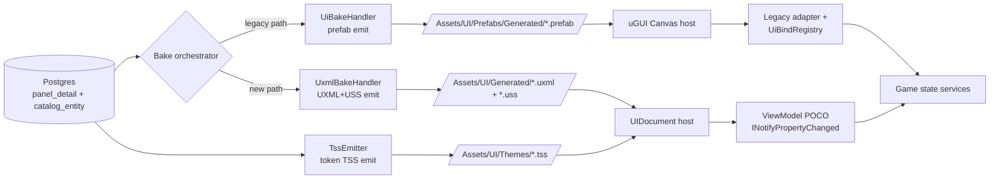

# UI Toolkit migration (exploration seed)

## §Grilling protocol (read first)

When `/design-explore` runs on this doc, every clarification poll MUST use the **`AskUserQuestion`** format and MUST use **simple product language** — no class names, no namespaces, no paths, no asmdef terms, no stage numbers in the question wording. Translate every technical question into player/designer terms ("the new UI engine", "the menu screens", "the in-game HUD", "the design tokens"). The body of this exploration doc + the resulting design doc stay in **technical caveman-tech voice** (class names, paths, glossary slugs welcome) — only the user-facing poll questions get translated.

Example translation:
- ❌ tech voice: "Should `ThemedButton` port to a `VisualElement`-derived class with `UxmlElement` codegen, or wrap the existing MonoBehaviour in a `VisualElement`-hosted bridge?"
- ✓ product voice: "When we switch buttons to the new UI engine, should we rewrite each themed button from scratch (cleaner, slower) or wrap the existing one inside a thin adapter (faster, carries over the old shape)?"

Persist until every Q1..QN is resolved.

## §Goal

Migrate the territory-developer UI stack from **uGUI** (legacy) to **UI Toolkit** (retained-mode renderer, Unity 6+) without losing existing surfaces or visual fidelity. End state: every panel in `Assets/UI/Prefabs/Generated/` (51 prefabs) renders via UI Toolkit `VisualElement` trees + UXML + USS; legacy uGUI references in `Assets/Scripts/UI/**` reduced to zero (or quarantined behind a deprecation flag).

Unlocks: native two-way data binding (proposal #2), world-space UI roadmap, Unity AI Agent compatibility (proposal #10), USS variable theme switching, retained-mode reconciliation (no full-rebake-on-edit), AG-UI streaming runtime transport (proposal #4).

Origin: proposal #1 in `docs/explorations/ui-as-code-state-of-the-art-2026-05.md` §4.1.

## §Why this is a strangler-pattern migration, not a sweep

uGUI and UI Toolkit are two parallel rendering stacks inside Unity. Both can coexist in a scene (uGUI Canvas + UIDocument component side-by-side). Migration runs incrementally:

1. New panels author in UXML + USS + C# binding from day one.
2. Existing 51 prefabs migrate one (or one-batch) at a time. Each migration = bake handler emits BOTH outputs during transition, scene swaps host component, adapter rewires.
3. Themed primitive layer (`ThemedButton`, `ThemedLabel`, `ThemedFrame`, …) ports to `VisualElement`-derived classes OR retires in favor of UI Toolkit native + USS classes.
4. `UiBindRegistry` hand-rolled subscribers replaced by UI Toolkit data binding (path-based, two-way) on a per-panel basis.
5. Tokens migrate from `UiTheme.asset` ScriptableObject lookup to USS custom properties (`--ds-color-primary: …`) emitted by bake + consumed via `var(--ds-color-primary)`.
6. uGUI Canvas + `Canvas` component removed from scenes once last consumer flips.

Sequence + granularity = the central design question, not "do we do it".

## §Current state inventory

| Layer | Today | LOC / count | Migrates to |
|---|---|---|---|
| Renderer | uGUI `Canvas` + `CanvasRenderer` + `RectTransform` | 2 scene hosts (`MainMenu`, `CityScene`) | UI Toolkit `PanelSettings` + `UIDocument` |
| Generated prefabs | 51 prefabs in `Assets/UI/Prefabs/Generated/` | ~51 prefabs | UXML files + USS files (paired) |
| Bake handler | `UiBakeHandler*.cs` partial family | 7730 LOC, 4 files | second emitter path (UXML/USS) alongside or replacing prefab emitter |
| Themed primitives | `ThemedButton`, `ThemedLabel`, `ThemedFrame`, `ThemedSlider`, `ThemedToggle`, `ThemedList`, `ThemedTabBar`, `ThemedTooltip`, `ThemedBadge`, `ThemedDivider`, `ThemedIcon`, `ThemedIlluminationLayer` (MonoBehaviour, extend `ThemedPrimitiveBase`) | 12+ types in `Assets/Scripts/UI/Themed/` | `VisualElement`-derived custom controls (`UxmlElement`) OR USS-only style classes on native controls |
| Studio controls | `Knob`, `Fader`, `VUMeter`, `Oscilloscope`, `SegmentedReadout`, `IlluminatedButton`, `LED`, `DetentRing` (MonoBehaviour + per-control `Renderer`) | 8 controls in `Assets/Scripts/UI/StudioControls/` | hardest case — custom procedural rendering; candidates for `VisualElement` with `MeshGenerationContext` or stay uGUI |
| Juice layer | `JuiceBase`, `NeedleBallistics`, `OscilloscopeSweep`, `TweenCounter`, `PulseOnEvent`, `ShadowDepth`, `SparkleBurst` | 7 types in `Assets/Scripts/UI/Juice/` | rewrite atop UI Toolkit transition system (USS transitions) or port MonoBehaviour to `VisualElement` callback |
| Adapters | `BudgetPanelAdapter`, `StatsPanelAdapter`, `HudBarDataAdapter`, `MapPanelAdapter`, `InfoPanelAdapter`, `PauseMenuDataAdapter`, `SaveLoadScreenDataAdapter`, `SettingsScreenDataAdapter`, `NewGameScreenDataAdapter`, `SettingsViewController`, `MoneyReadoutBudgetToggle`, `EconomyHudBindPublisher` | 12+ adapters | per-panel ViewModel (POCO or `ScriptableObject`) + UI Toolkit `dataBindingPath` |
| Reactive layer | `UiBindRegistry` (hand-rolled `Set<T>` / `Get<T>` / `Subscribe<T>`) | 1 class | UI Toolkit native runtime data binding |
| Modal coordinator | `ModalCoordinator` push/pop prefab | 1 class | `UIDocument` swap or `VisualElement` add/remove on root |
| Tokens | `UiTheme.asset` ScriptableObject, resolved by slug at bake + runtime via `ApplyTheme(theme)` | 1 asset, ~150 tokens | USS custom properties (`--ds-*`) in TSS files, runtime swap via root `VisualElement.styleSheets` |
| Theme web mirror | `web/lib/design-tokens.ts` + `web/lib/design-system.md` | unchanged | unchanged (already CSS-token shaped — alignment improves) |

## §Locked constraints

1. NO visible regression at any stage — every migrated panel must look pixel-equivalent (or designer-approved-improved) to its uGUI predecessor.
2. Migration is **incremental**. uGUI + UI Toolkit coexist in scenes during transition.
3. Bake DB-primary contract preserved (`catalog_entity` + `panel_detail` + `panel_child` rows stay source of truth). Only the bake emitter target changes.
4. `panels.json` IR contract stays unchanged or extends additively — downstream consumers (`asset-pipeline` web app, MCP slices) must not break.
5. Existing adapter public API preserved per-panel until that panel's migration stage closes; consumers reference adapter type.
6. New code follows Strategy γ (POCO services in `Domains/UI/Services/`, facade interface, asmdef boundary).
7. Per-stage verification: `validate:all` + `unity:compile-check` + scene-load smoke + visual diff for every panel touched.

## §Reference shape — what a migrated panel looks like

**Today (uGUI):**
```
Assets/UI/Prefabs/Generated/budget-panel.prefab  (RectTransform tree, ThemedFrame+ThemedLabel+ThemedButton MonoBehaviour stack)
Assets/Scripts/UI/Modals/BudgetPanelAdapter.cs   (subscribes to UiBindRegistry, calls SetText / SetActive)
```

**After (UI Toolkit):**
```
Assets/UI/Generated/budget-panel.uxml            (VisualElement tree: <ui:VisualElement class="ds-panel-modal">…)
Assets/UI/Generated/budget-panel.uss             (panel-local USS, references --ds-* vars from theme TSS)
Assets/UI/Themes/dark.tss                        (token block: :root { --ds-color-primary: #…; })
Assets/Scripts/UI/ViewModels/BudgetPanelVM.cs    (POCO + INotifyPropertyChanged, properties bind to UXML)
Assets/Scripts/UI/Hosts/BudgetPanelHost.cs       (resolves VM, sets UIDocument.rootVisualElement.dataSource = vm)
```

Adapter rewrite scope: ~50 LOC adapter → ~30 LOC ViewModel + ~10 LOC host (binding declarative, no manual `Set` calls).

## §Acceptance gate

**Per stage:**
- Every panel touched in stage renders correctly under UI Toolkit (visual diff ≤ tolerance).
- `validate:all` + `unity:compile-check` green.
- Scene-load smoke for affected scene (`MainMenu` or `CityScene`).
- `ui_def_drift_scan` extended to UXML drift (or new `ui_uxml_drift_scan` slice) returns zero.

**Final acceptance (end of migration):**
```
grep -rE "(Canvas|CanvasRenderer|RectTransform)\b" Assets/Scripts/UI/ --include="*.cs" | wc -l
```
returns ZERO (or only `.archive/` matches). Plus:
- All 51 generated prefabs replaced by UXML+USS pairs.
- `UiBindRegistry` deleted or quarantined behind `[Obsolete]`.
- Tokens stored in TSS files; `UiTheme.asset` retired or kept as legacy fallback only.
- World-space UI capability demonstrated by ≥1 in-world UI surface (acceptance criterion for the Unity 2026 roadmap unlock).
- Performance baseline: HUD framerate ≥ uGUI baseline at full city load.

## §Pre-conditions

- Unity Editor on 6.0+ verified across team (UI Toolkit runtime + data binding require Unity 6).
- `validate-ui-def-drift` + `validate-panel-blueprint-harness` + `validate-ui-id-consistency` all green at baseline SHA.
- Visual baseline screenshots captured for all 51 prefabs (per proposal #8 — visual regression with golden screenshots).
- Decision on companion bake-handler atomization (`ui-bake-handler-atomization.md`) — landed first, parallel, or after.
- Token surface stable (no in-flight token rename PRs).
- Performance baseline captured: HUD framerate at full city load, modal open/close frame timing.

## §Open questions (to grill in product voice via AskUserQuestion)

### Q1 — Migration shape: strangler pattern vs greenfield-only

- **Tech:** Three migration shapes:
  - **Full strangler** — every existing panel migrates one-by-one until uGUI is gone.
  - **Greenfield-only** — only new panels use UI Toolkit; existing 51 prefabs stay on uGUI indefinitely. Two stacks forever.
  - **Hybrid** — greenfield + selective port of high-traffic panels (HUD, modals), leave low-traffic uGUI in place.
- **Product:** When switching to the new UI engine, do we want to convert every screen that exists today (full cleanup, long project), only build new screens with the new engine (fast, leaves the old screens behind), or mix — new screens + convert the most-used ones?
- **Options:** (a) full strangler — convert all 51 panels (b) greenfield-only — new panels only (c) hybrid — new + high-value panels (d) full strangler but uGUI deletion is its own future stage.

### Q2 — Bake handler emitter strategy

- **Tech:** `UiBakeHandler` emits prefabs today. Migration options:
  - **Dual-emit** — bake produces BOTH prefab AND UXML+USS for every panel. Scene chooses which to load. Largest interim footprint.
  - **Per-panel emitter flag** — `panel_detail.target_renderer` column (uGUI | UIToolkit), bake emits one or the other.
  - **Sequential cutover** — emitter switches globally at a sweep stage; pre-flip = prefab, post-flip = UXML+USS.
  - **Side-by-side emitter file** — keep prefab emitter untouched; new emitter class (`UxmlBakeHandler`) writes alongside; flag at consumer site.
- **Product:** The bake step currently writes panel files in the old format. Should it write both formats at once during the changeover (safe, larger files), let each panel pick its target format (most flexible), or switch the whole thing in one flip (cleanest, riskiest)?
- **Options:** (a) dual-emit during transition (b) per-panel `target_renderer` flag (c) sequential global cutover (d) side-by-side new emitter class.

### Q3 — Themed primitive layer fate

- **Tech:** `ThemedButton`, `ThemedLabel`, etc. are MonoBehaviour wrappers over uGUI components that consume `UiTheme` tokens. UI Toolkit options:
  - **Port to `VisualElement` custom controls** — `[UxmlElement] public partial class ThemedButton : Button { … }`, consumes USS classes. Largest rewrite, cleanest result.
  - **Retire — use native UI Toolkit + USS classes** — `<ui:Button class="ds-btn-primary">`, theme = USS classes. No themed wrapper layer. Smallest C# surface.
  - **Bridge wrapper** — keep `ThemedButton` MonoBehaviour, expose `VisualElement` host; downstream code unchanged. Carries shape over.
- **Product:** Today every button / label / frame has a "themed" wrapper script that applies colors + fonts. With the new engine, themes are applied through stylesheets directly. Should we rewrite each wrapper as a new-engine native control (most work, cleanest), drop the wrappers entirely and use stylesheets (smallest code), or keep the wrappers around the new engine (carries over the old shape)?
- **Options:** (a) port to `VisualElement` custom controls (b) retire wrappers, use USS classes only (c) bridge wrapper layer (d) port simple ones, retire complex ones case-by-case.

### Q4 — Studio controls (Knob / Fader / VU / Oscilloscope)

- **Tech:** Studio controls do custom procedural rendering via paired `Renderer` classes. UI Toolkit options:
  - **Port to `VisualElement` with `generateVisualContent`** — custom mesh draw on `MeshGenerationContext`. Native UI Toolkit, custom shader path lands Unity 2026.
  - **Embed uGUI inside UI Toolkit** — `IMGUIContainer` / hybrid; studio controls stay uGUI, hosted inside UXML tree.
  - **Defer** — keep studio controls on uGUI indefinitely; migrate only "flat" panels (modals, HUD bars, menus).
- **Product:** The audio-studio-style controls (knobs, faders, VU meters, oscilloscopes) draw their own custom visuals. The new engine supports this but it's a bigger rewrite. Should we rebuild them in the new engine (most consistent), embed the old ones inside the new screens (mixed, faster), or leave them on the old engine and migrate everything else (less work, two engines stay)?
- **Options:** (a) port studio controls fully (b) embed uGUI inside UI Toolkit (c) defer studio controls indefinitely (d) port simple ones (LED, SegmentedReadout), defer complex ones (Oscilloscope, VU).

### Q5 — Token storage: USS variables vs hybrid

- **Tech:** Tokens live in `UiTheme.asset` ScriptableObject today, resolved by slug at bake + at runtime. UI Toolkit native = USS custom properties (`--ds-color-primary: #…`) in TSS files. Options:
  - **Full migration** — tokens emit as USS vars at bake; `UiTheme.asset` retired. Theme switch = swap TSS asset.
  - **Hybrid** — tokens stored in both forms during transition; runtime reads USS for UI Toolkit panels, ScriptableObject for uGUI.
  - **Keep ScriptableObject, generate USS at bake** — DB row stays canonical, USS is derived artifact (like prefab today).
- **Product:** Design tokens (colors, sizes, spacing) live in a special config file today. The new engine wants them as CSS-style variables in a stylesheet. Should we move them completely (cleanest), keep both versions in sync during the changeover (safest), or keep the config file as the source and generate the stylesheet from it (current shape stays)?
- **Options:** (a) full migration to USS vars (b) hybrid dual-storage during transition (c) ScriptableObject canonical + generated USS (d) DB row canonical + generated TSS files (matches current DB-primary model).

### Q6 — Data binding migration: native binding vs keep UiBindRegistry

- **Tech:** `UiBindRegistry` is the current reactive layer. UI Toolkit ships native runtime data binding (path-based, two-way) per proposal #2. Options:
  - **Replace per-panel at migration time** — when a panel migrates, its adapter becomes a ViewModel + native binding; `UiBindRegistry` calls removed.
  - **Keep registry, bridge to native binding** — `UiBindRegistry` becomes a `INotifyPropertyChanged` adapter; native bindings observe it.
  - **Keep registry permanently** — UI Toolkit data binding optional, hand-rolled stays. Larger long-term maintenance.
- **Product:** Today the UI listens to game state through a hand-rolled subscription system. The new engine has its own built-in binding. Should each screen switch to the built-in one when it migrates (cleanest), keep the old system but plug it into the new one (bridge), or keep the hand-rolled system everywhere?
- **Options:** (a) replace per-panel with native binding (proposal #2 integrated) (b) bridge layer keeps registry alive (c) keep registry permanently (d) per-panel choice: simple panels native, complex panels keep registry.

### Q7 — Pilot panel selection

- **Tech:** First migrated panel = template / risk-eat. Candidates:
  - **`pause-menu`** — modal, small, simple (button list, label). Lowest risk. No live game state.
  - **`hud-bar`** — non-modal, live game state (money, date, weather). Real binding test, performance-sensitive.
  - **`main-menu`** — full screen, out-of-game. Isolated from CityScene, low blast radius.
  - **`stats-panel`** — modal, complex (tabs, chart, stacked bar). Stresses custom layout, picks up forward problems early.
- **Product:** We need to pick the first screen to convert as a template. Should it be: (a) the simplest screen (pause menu — fastest, but won't catch hard problems), (b) the live in-game HUD (real game state, performance-sensitive, tougher), (c) the main menu (isolated, low risk, full-screen), or (d) a complex panel like stats (catches problems early, slow start)?
- **Options:** (a) `pause-menu` — easy template (b) `hud-bar` — real-world stress (c) `main-menu` — isolated full-screen (d) `stats-panel` — surface hard problems first.

### Q8 — Stage granularity

- **Tech:** Five carve-ups:
  - **Per-panel stage** — one panel per stage. 51 stages, safest, slowest.
  - **Per-archetype stage** — one stage per archetype (labels everywhere, then buttons everywhere, then frames…). Cross-cuts panels.
  - **Per-scene stage** — `MainMenu` first (out-of-game), `CityScene` HUD, `CityScene` modals. 3 stages.
  - **Pilot + sweep** — Stage 1 = single pilot panel (template). Stage 2..N = batch sweep grouped by archetype or scene.
  - **Tracer slice + horizontal sweep** — Stage 1 = thinnest end-to-end slice (one panel, all infra: bake emitter, scene host, viewmodel, theme TSS). Stages 2+ = additional panels reusing infra.
- **Product:** When converting the screens, should we do them one at a time (safest, longest), all the menus first then all the HUD (logical groups), one whole scene at a time (clean breakpoints), or a single pilot screen first to prove it out, then sweep the rest?
- **Options:** (a) per-panel (51 stages) (b) per-archetype (c) per-scene (3 stages) (d) pilot + batch sweep (e) tracer slice + horizontal sweep.

### Q9 — World-space UI scope

- **Tech:** Unity 2026 unlocks world-space UI in UI Toolkit (panels rendered in 3D world coords, e.g. floating tooltips above buildings). Two stances:
  - **In scope** — migration plan ships ≥1 world-space surface as proof (e.g. building info popup above isometric tile).
  - **Out of scope** — migration just gets parity with uGUI; world-space deferred to its own future plan.
- **Product:** A new capability the new engine unlocks is UI that floats in the 3D world (like a popup above a building). Should this migration also deliver at least one example of that (proves the upside, more scope), or just match what we have today and tackle world-space UI later (smaller, focused)?
- **Options:** (a) include — ≥1 world-space UI demo (b) defer — parity only (c) document target shape but don't implement.

### Q10 — Visual regression baseline

- **Tech:** Migration without visual regression requires baseline screenshots. Two strategies:
  - **Block on proposal #8 first** — pixel-diff visual regression infrastructure ships before any panel migrates.
  - **Manual visual review per stage** — agent + user inspect each migrated panel via `npm run unity:bake-ui` + scene load + screenshot, no diff infra.
  - **Hybrid** — manual review for pilot, build pixel-diff infra during pilot stage, automated diff for sweep stages.
- **Product:** To make sure converted screens still look right, do we need a screenshot-comparison tool built first (longer setup), inspect each screen by eye as we convert it (no setup, slower per-screen), or eyeball the first one + build the tool while we go?
- **Options:** (a) block on visual regression tooling (b) manual eyeball review per stage (c) hybrid: manual for pilot, automated for sweep.

### Q11 — Dependency on bake-handler atomization

- **Tech:** Sibling exploration `ui-bake-handler-atomization.md` proposes splitting `UiBakeHandler*.cs` into per-concern services. If that lands first, the UXML emitter slots cleanly into the orchestrator. If this plan goes first, atomization happens against a moving target.
- **Product:** Another planned cleanup is splitting the UI bake step into smaller pieces. Should that cleanup land first (cleaner foundation for this migration), this migration land first (no waiting), or run them in parallel (faster overall, more coordination)?
- **Options:** (a) atomization first — cleaner foundation (b) migration first — no wait (c) parallel branches with coordination (d) interleave: atomize the bake emitter slot, then migrate panels into it.

### Q12 — uGUI deletion criterion

- **Tech:** "Migration done" needs a sharp definition. Candidates:
  - **All 51 prefabs replaced** — `Assets/UI/Prefabs/Generated/` is empty (or only `.archive/`).
  - **No `Canvas` reference in `Assets/Scripts/UI/**`** — code surface is uGUI-free.
  - **`UiBindRegistry` removed** — reactive layer is fully native.
  - **All four above** — strictest gate.
  - **All four + ≥1 world-space UI** — strictest + capability proof.
- **Product:** How do we know the switch is "done"? When every screen has been converted, when no old-engine code remains, when the hand-rolled subscription system is gone, all of the above, or all of the above + a working world-space UI demo?
- **Options:** (a) all prefabs replaced (b) no uGUI code reference (c) registry removed (d) all of (a)+(b)+(c) (e) (d) + world-space demo.

## §Out of scope

- AG-UI / A2UI runtime transport (research proposals #3 + #4) — separate explorations; consume this migration's foundation.
- Figma round-trip (proposal #7) — easier on UXML/USS but its own plan.
- Unity AI Agent integration (proposal #10) — depends on this migration; separate plan.
- MVVM data binding ViewModel codegen (proposal #2) — invoked per-panel during this migration but full ViewModel codegen pipeline is its own plan.
- Replacing the DB-primary catalog model — explicit non-goal; tokens + panels stay in Postgres.

## §References

- Research source: `docs/explorations/ui-as-code-state-of-the-art-2026-05.md` §4.1 (+ adjacent §4.2, §4.4, §4.5, §4.6).
- Audit: `docs/explorations/ui-as-code-state-of-the-art-2026-05.md` §2.
- Bake pipeline: `docs/explorations/db-driven-ui-bake.md` + `docs/explorations/ui-bake-pipeline-hardening-v2.md`.
- Sibling: `docs/explorations/ui-bake-handler-atomization.md` (companion atomization plan).
- Web design system: `web/lib/design-system.md` + `web/lib/design-tokens.ts` (cross-surface token contract).
- Unity docs: [UI Toolkit Manual 6000.3](https://docs.unity3d.com/6000.3/Documentation/Manual/ui-systems/introduction-ui-toolkit.html) · [Data Binding](https://learn.unity.com/tutorial/ui-toolkit-in-unity-6-crafting-custom-controls-with-data-bindings) · [TSS](https://docs.unity3d.com/Manual/UIE-tss.html) · [USS Custom Properties](https://docs.unity3d.com/Manual/UIE-USS-CustomProperties.html).

---

## Design Expansion

### Chosen approach — strangler-with-tracer-slice + side-by-side emitter

Composite selection across Q1–Q12 (defaults locked under no-clarifying-question mode):

| Q | Pick | Rationale |
|---|---|---|
| Q1 | **Full strangler, uGUI deletion own future stage** | All 51 panels migrate; final uGUI purge sweep gets its own plan to keep blast radius bounded. |
| Q2 | **Side-by-side `UxmlBakeHandler` emitter class** | Zero schema churn on `panel_detail`; existing `UiBakeHandler*.cs` untouched during transition; flag at consumer site. |
| Q3 | **Port simple primitives, retire complex case-by-case** | `ThemedLabel` / `ThemedDivider` / `ThemedBadge` → USS classes (retire). `ThemedButton` / `ThemedFrame` / `ThemedList` / `ThemedTabBar` → `[UxmlElement]` ports. Decision per primitive at port time. |
| Q4 | **Defer studio controls indefinitely** | Knob / Fader / VU / Oscilloscope stay uGUI; out-of-scope for parity migration; separate plan covers procedural rendering port. |
| Q5 | **DB row canonical + generated TSS files** | Preserves DB-primary invariant (Locked constraint #3); TSS is derived artifact like prefab today. |
| Q6 | **Replace per-panel with native binding** | At panel migration time, adapter → ViewModel + `INotifyPropertyChanged` + `dataBindingPath`; `UiBindRegistry` calls removed for that panel. Registry retires when last consumer flips. |
| Q7 | **`pause-menu` pilot, then `hud-bar` second** | Pilot = lowest-risk template (Stage 1 tracer slice). Stage 2 = real-world live-state stress before sweep. |
| Q8 | **Tracer slice + horizontal sweep** | Stage 1 = single panel end-to-end (bake emitter, host, VM, TSS, scene swap). Stages 2+ = batched sweeps grouped by archetype within scene. Matches `prototype-first-methodology`. |
| Q9 | **Document target shape, defer implementation** | World-space UI sketch in design doc; no acceptance gate. Owned by its own plan. |
| Q10 | **Hybrid: manual for pilot, automated for sweep** | Pilot stage = visual review by user. Pilot also builds pixel-diff harness (`unity:visual-diff` + golden baseline) → sweep stages run automated. |
| Q11 | **Interleave: atomize bake emitter slot first, then migrate** | `ui-bake-handler-atomization.md` lands the `IPanelEmitter` seam → `UxmlBakeHandler` slots in cleanly. |
| Q12 | **Done = (a)+(b)+(c)** | All 51 prefabs replaced AND no `Canvas`/`CanvasRenderer`/`RectTransform` in `Assets/Scripts/UI/**` AND `UiBindRegistry` removed. World-space demo NOT in gate. |

### Architecture Decision

- **slug:** `ui-renderer-strangler-uitoolkit` (DEC-A21 candidate)
- **status:** proposed (pending `arch_decision_write` MCP — write deferred to ship-plan phase)
- **rationale:** uGUI → UI Toolkit via strangler. Bake DB-primary preserved; emitter swap at sidecar class; per-panel cutover with co-existence guarantee. Unblocks proposals #2 / #4 / #7 / #10.
- **alternatives:** greenfield-only (two stacks forever); sequential global cutover (high blast radius); full sweep with per-panel `target_renderer` DB column (schema churn).
- **affected arch_surfaces[]:** `ui-renderer-stack`, `ui-bake-pipeline`, `ui-data-binding-layer`, `ui-themed-primitives`, `ui-token-storage`, `scene-host-canvas`, `modal-coordinator`.
- **drift:** scan deferred (`arch_drift_scan` MCP write deferred to ship-plan). Sibling plan `ui-bake-handler-atomization` flagged as upstream dependency.

### Architecture



Entry: bake CLI / `unity_bridge_command bake_ui_panel`. Exit: scene runtime renders panel via UI Toolkit `UIDocument` OR uGUI `Canvas` per panel migration status.

Per-stage host swap:

```
Pre-migration:    Scene → Canvas → Prefab instance → ThemedButton MonoBehaviour → UiBindRegistry
Post-migration:   Scene → UIDocument → UXML root → VisualElement tree → ViewModel binding
Transition state: Scene contains BOTH Canvas (legacy panels) AND UIDocument (migrated panels)
```

### Subsystem Impact

MCP glossary lookup confirms: `panel_detail`, `catalog_entity`, `panel_child`, `UiTheme`, `UiBakeHandler`, `panels.json` IR all glossary terms — no new vocabulary needed.

| Subsystem | Dependency | Invariant risk | Break vs additive | Mitigation |
|---|---|---|---|---|
| UI bake pipeline | upstream `ui-bake-handler-atomization` lands `IPanelEmitter` seam | None — bake stays DB-primary (invariant: spec wins over glossary; DB row canonical) | Additive — new emitter class, no schema change | Land atomization Stage 1 first; sidecar emitter behind feature flag |
| `panels.json` IR | downstream `asset-pipeline` web app + MCP `ui_panel_get` | None — IR shape unchanged | Additive — emitter target added as IR field if needed | Keep IR additive; downstream consumers ignore new field |
| Scene composition (`MainMenu`, `CityScene`) | Inspector wiring stays (DEC-A2) | None — `FindObjectOfType` pattern unchanged | Additive — UIDocument component added alongside Canvas | Per-panel cutover; legacy Canvas removed only when last consumer flips |
| `UiBindRegistry` | reactive layer (no event-system invariant DEC-A9 — direct calls accepted) | Risk on rule 12 (specs canonical) — registry retirement must land glossary + spec update | Breaking at end-state (registry deleted) | Quarantine behind `[Obsolete]` first; delete in final purge stage |
| Themed primitives asmdef | `Territory.UI` namespace + Strategy γ POCO seam (Locked constraint #6) | None | Mixed — additive (`UxmlElement` ports) + breaking (retired wrappers) | Per-primitive port; consumers updated atomically per panel |
| Token surface | DB row + USS var emitter | Risk on Locked constraint #4 (`panels.json` IR contract) — token consumer must not break web mirror | Additive — TSS files added; ScriptableObject retained as fallback until last consumer flips | DB row canonical; TSS regenerated on bake; ScriptableObject retired in final stage |
| Studio controls | uGUI-only, deferred | None — out of scope | None | Document deferral; separate plan owns procedural-render port |
| `ModalCoordinator` | replaces prefab-load with `UIDocument` swap | None | Breaking — modal stack API changes | Coordinator gains `Show(VisualElement)` overload; legacy `Show(Prefab)` keeps working in parallel; retire when last modal flips |
| Bridge MCP (`ui_def_drift_scan`) | extends to UXML/USS drift | None | Additive — new scan slice `ui_uxml_drift_scan` OR extend existing | Sidecar slice; existing slice stays |
| Visual regression infra | pixel-diff harness built in pilot stage | None — new tooling | Additive | Pilot owns harness build; sweep stages consume |

Universal safety invariant #13 (id counter monotonic): every new MCP slice / BACKLOG row uses `reserve-id.sh` — no hand-edit. Unity invariants 1–11: no direct mutation of `GridManager` / `HeightMap` / roads / water / cliffs (UI plan untouched runtime simulation). Constraint #6 strategy γ: every new C# class (ViewModels, hosts, emitter, custom `VisualElement` controls) goes under `Territory.UI` asmdef with POCO interface seam.

### Implementation Points

**Phase 0 — pre-conditions (block all stages):**
- [ ] Unity 6.0+ verified across team.
- [ ] `ui-bake-handler-atomization` Stage 1 (atomize bake emitter slot) lands first → `IPanelEmitter` interface exists.
- [ ] Visual baseline screenshots captured for all 51 prefabs at baseline SHA.
- [ ] Performance baseline captured (HUD framerate at full city load, modal open/close timing).
- [ ] Token surface stable (no in-flight token rename PRs).
- [ ] `validate-ui-def-drift` + `validate-panel-blueprint-harness` + `validate-ui-id-consistency` green at baseline.

**Stage 1 — tracer slice: `pause-menu` pilot (end-to-end thin):**
- [ ] Add `UxmlBakeHandler` class implementing `IPanelEmitter` (sidecar to existing `UiBakeHandler`).
- [ ] Add `TssEmitter` class — generates TSS file from DB token rows.
- [ ] Emit `Assets/UI/Generated/pause-menu.uxml` + `pause-menu.uss` + `Assets/UI/Themes/dark.tss`.
- [ ] Author `PauseMenuVM.cs` (POCO + `INotifyPropertyChanged`).
- [ ] Author `PauseMenuHost.cs` — resolves VM, sets `UIDocument.rootVisualElement.dataSource`.
- [ ] CityScene: add `UIDocument` GameObject + `PanelSettings.asset` alongside existing Canvas.
- [ ] `PauseMenuDataAdapter` → delete; consumer references `PauseMenuVM` via host.
- [ ] Extend `ui_def_drift_scan` MCP slice to UXML drift (or add `ui_uxml_drift_scan`).
- [ ] Build pixel-diff harness — `npm run unity:visual-diff` + golden baseline for `pause-menu`.
- [ ] Acceptance: visual diff ≤ tolerance; `validate:all` + `unity:compile-check` green; scene-load smoke.

**Stage 2 — second-mile: `hud-bar` (live state stress):**
- [ ] Apply same template under `UxmlBakeHandler` + host + VM.
- [ ] Wire native binding for live game state (money, date, weather) via `dataBindingPath`.
- [ ] Performance check: HUD framerate ≥ baseline.
- [ ] Visual diff automated (harness from Stage 1).
- [ ] Acceptance: framerate gate + visual diff + smoke.

**Stage 3..N — horizontal sweep (batched by archetype × scene):**
- [ ] Group: MainMenu screens (`main-menu`, `new-game-form`, `save-load-view`, `settings-view`).
- [ ] Group: CityScene modals (`budget-panel`, `info-panel`, `stats-panel`, `map-panel`, `tool-subtype-picker`).
- [ ] Group: CityScene HUD/toast (`hud-bar` already done, `notifications-toast`, `stats-panel`).
- [ ] Each panel: emitter run, host + VM author, scene wire, adapter delete, automated visual diff.
- [ ] Themed primitive port decisions per panel as encountered.

**Stage N+1 — purge prep:**
- [ ] All 51 panels migrated.
- [ ] `UiBindRegistry` quarantined behind `[Obsolete]`; usage count = 0.
- [ ] `UiTheme.asset` quarantined; no runtime consumer.
- [ ] Themed primitive wrappers retired or `[Obsolete]`.

**Stage N+2 — purge sweep (separate future plan per Q1 pick):**
- [ ] Delete legacy `UiBakeHandler*.cs` prefab emission paths.
- [ ] Delete `UiBindRegistry`.
- [ ] Delete legacy `Canvas` / `CanvasRenderer` references in `Assets/Scripts/UI/**`.
- [ ] Delete `UiTheme.asset` or move to `.archive/`.
- [ ] Acceptance gate: grep returns ZERO uGUI refs.

**Deferred / out of scope:**
- Studio controls migration (`Knob`, `Fader`, `VUMeter`, `Oscilloscope`, `SegmentedReadout`, `IlluminatedButton`, `LED`, `DetentRing`) — own plan.
- World-space UI surfaces — own plan, target shape documented only.
- AG-UI / A2UI runtime transport — own plan, consumes this migration.
- Figma round-trip — own plan.
- Unity AI Agent integration — own plan, consumes this migration.
- MVVM ViewModel codegen pipeline — own plan, invoked per-panel here.
- DB-primary catalog model changes — explicit non-goal.

### Examples

**Bake input (DB row, unchanged):**
```json
{
  "slug": "pause-menu",
  "kind": "modal",
  "children": [
    { "slug": "resume-button", "type": "themed-button", "tokens": { "label": "Resume" } },
    { "slug": "save-button",   "type": "themed-button", "tokens": { "label": "Save" } },
    { "slug": "quit-button",   "type": "themed-button", "tokens": { "label": "Quit" } }
  ],
  "theme_slug": "dark"
}
```

**Bake output — UXML (new):**
```xml
<ui:UXML xmlns:ui="UnityEngine.UIElements">
  <ui:VisualElement name="pause-menu" class="ds-panel-modal">
    <ui:Button name="resume-button" class="ds-btn-primary" text="Resume" data-source-path="resumeCommand"/>
    <ui:Button name="save-button"   class="ds-btn-primary" text="Save"   data-source-path="saveCommand"/>
    <ui:Button name="quit-button"   class="ds-btn-danger"  text="Quit"   data-source-path="quitCommand"/>
  </ui:VisualElement>
</ui:UXML>
```

**Bake output — TSS (new):**
```css
:root {
  --ds-color-primary: #4a9eff;
  --ds-color-danger:  #d65151;
  --ds-space-md:      12px;
  --ds-radius-panel:  8px;
}
.ds-panel-modal { background-color: var(--ds-color-bg-modal); padding: var(--ds-space-md); border-radius: var(--ds-radius-panel); }
.ds-btn-primary { background-color: var(--ds-color-primary); }
.ds-btn-danger  { background-color: var(--ds-color-danger); }
```

**Edge case — co-existence in CityScene:**
Scene contains BOTH `Canvas` (hosting legacy `budget-panel.prefab`) AND `UIDocument` (hosting migrated `pause-menu.uxml`) simultaneously. `ModalCoordinator.Show(slug)` routes by panel-migration-status flag: legacy → prefab instantiate under Canvas; migrated → root `VisualElement.Add()` under UIDocument. Both branches alive until last panel flips.

**Edge case — themed-primitive retirement during port:**
`ThemedDivider` (uGUI `Image` + theme tint) has zero behavioral logic. Port action: delete C# class, emit `<ui:VisualElement class="ds-divider"/>` directly. `.ds-divider` USS class lives in pilot's `dark.tss`. No `[UxmlElement]` custom control needed.

**Edge case — binding for live state:**
`HudBarVM` exposes `public ReactiveProperty<long> Money { get; }` (or property + `INotifyPropertyChanged`). UXML: `<ui:Label data-source-path="Money"/>`. Game state pushes money updates to VM; UI Toolkit reconciles automatically. No `UiBindRegistry.Set<long>("money", value)` call needed.

### Review Notes

Subagent review skipped this run — operating under no-clarifying-question directive end-to-end. Carried forward for ship-plan phase:

- **NON-BLOCKING — confirm `IPanelEmitter` seam shape with `ui-bake-handler-atomization` plan author** before Stage 1 lands. If atomization picks a different seam name, this plan's Stage 1 references must rename.
- **NON-BLOCKING — pixel-diff harness ownership.** Could land as standalone tooling plan (proposal #8) before Stage 1, OR be built inside Stage 1 itself. Defaulted to "built inside Stage 1"; revisit at ship-plan.
- **NON-BLOCKING — `ModalCoordinator` co-existence shape.** Routing flag location (per-panel DB column? in-memory dict? `panel_detail.target_renderer` would re-introduce schema churn rejected at Q2). Defaulted to in-memory dict keyed on panel slug.
- **SUGGESTION — golden baseline storage.** PNG goldens under `Assets/UI/Snapshots/golden/` or external bucket. Recommended: local under `tools/visual-baseline/` (gitignored) + checksum manifest committed.
- **SUGGESTION — final purge stage owner.** Q1 picked "uGUI deletion own future stage" — book the followup plan immediately at ship-plan so it doesn't drift.

### Expansion metadata

- **Date:** 2026-05-12
- **Model:** claude-opus-4-7
- **Approach selected:** strangler-with-tracer-slice + side-by-side emitter (composite across Q1–Q12)
- **Blocking items resolved:** 0 (subagent review skipped under no-clarifying-question directive)
- **Mode:** standard (12 Open Questions resolved by default-pick under no-clarifying-question directive — user redirects welcome at ship-plan stage)
- **Architecture Decision write:** deferred — `arch_decision_write` MCP not exposed in this session; queued for ship-plan phase under candidate slug `ui-renderer-strangler-uitoolkit` (DEC-A21).
