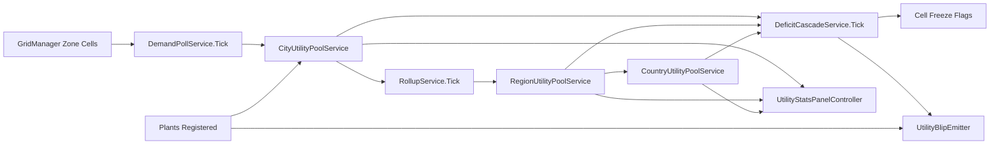

# Utilities Pool System — Exploration Seed (MVP)

**Status:** Seed (product vision + locked decisions + open questions). Ready for `/design-explore` once Region↔Country pool wiring questions resolve at grill time.

**Replaces:** Closed master plan `utilities` (Bucket 4-a MVP, never started, drifted on `data-flows/persistence` + `data-flows/initialization`). Original 13 stages defined a per-scale pool service + contributor registry + deficit cascade + dashboard + save/load + landmarks hook. This seed re-frames the same scope against locked MVP scope (D15 + D32) + current arch decisions (DEC-A29 shared iso-scene-core, DEC-A30 CoreScene shell, DEC-A26 async cron, DEC-A22+A23 prototype-first + TDD red/green).

---

## Problem Statement

Player paints zones + roads. Zones demand water, power, sewage. Demand goes unmet → city stops growing + happiness drops + deficit notification fires. Player builds utility plants to meet demand. Plants come in dirty (cheap, high pollution) + clean (expensive, low pollution) tier, giving tax/pollution tradeoff.

The MVP simulation runs at three nested scales (City, Region, Country). Utility pools are **country-level aggregates** (D15) fed by contributors at any scale, drawn by consumers at any scale. A city with surplus exports to the national pool; a region in deficit draws from it; international hooks are out (D3).

No utility system exists in code today. Zone-to-plant demand path is unwired. Plant placement is unwired. The closed `utilities` master plan would have built this once but was drafted before:

- D15 locked the **6-plant variant matrix** (3 utilities × dirty/clean tier).
- D32 locked the **toolbar split** (Power / Water / Sewage as 3 separate toolbar tools, 2 cards each).
- DEC-A29 (shared iso-scene-core) reshaped what "per-scale service" means — services must live in a scale-aware registry, not a single CityScene singleton.
- DEC-A30 (CoreScene persistent shell) moved HUD + always-on UI out of CityScene, so the utility readout cluster + deficit notification surface live in CoreScene, not CityScene.
- DEC-A26 (async cron) moved non-blocking persistence writes to per-kind queues, so save-schema bumps + audit-log entries no longer block the main game loop.

This seed locks the product intent + the architecture envelope so `/design-explore` can commit to implementation against current arch decisions, not the 2026-04 baseline.

---

## Vision (locked from MVP scope §3.3 D15 + D32 + product grill rounds)

1. **Three utilities ship in MVP — water, power, sewage.** All three are country-level pools fed by per-building contributors, drawn by per-cell consumers (zones + roads + landmarks where applicable).
2. **Six plant variants ship — 2 per utility (dirty/clean tier).** Power: Coal plant / Solar+Wind plant. Water: Reservoir / Desalination plant. Sewage: Basic sewage plant / Treated sewage plant. Dirty = cheap-build + cheap-maintain + high-pollution. Clean = expensive-build + expensive-maintain + low-pollution.
3. **Pool math runs at three scales — City, Region, Country.** Each scale aggregates its own contributors + consumers, surplus rolls up (City → Region → Country), deficit cascades down (Country deficit → Region freeze flag → City freeze flag). Freeze flag blocks new zone-cell evolution + plant expansion at the cell scope.
4. **Deficit drives gameplay penalty.** Deficit at any scale → happiness penalty (City stats) + RCI demand floor (zone evolution stalls at current density tier) + deficit notification toast (top-right per D27+D34) when threshold crossed. No simulation crash, no game-over — deficit is recoverable.
5. **Plant placement is single-cell click** (per §3.33 paint canon — utility/service/landmark = single-cell click, NOT drag-paint). Toolbar exposes Power, Water, Sewage as three separate tools per D32 (subtype-picker shows 2 cards: dirty + clean).
6. **Plant placement is terrain-sensitive.** Water plants need Moore-adjacent water cells. Sewage treatment plants need Moore-adjacent water cells. Solar plants need flat terrain (no cliffs). Wind plants need elevated terrain (cliffs adjacent OK). Coal/reservoir/basic-sewage have no terrain constraint beyond standard placement validators.
7. **Utility readout cluster lives in CoreScene** (per DEC-A30 — HUD + always-on UI is CoreScene-owned, not CityScene). Readout shows pool level per utility (3 readouts: water / power / sewage) with deficit color tint when supply < demand. Click readout → opens utility-info panel showing dashboard (per-scale 3×3 grid: scale × kind, net / EMA / status colour).
8. **Save/load** persists pool state per scale via save schema v3+ envelope (per DEC-A18). Restore happens after grid cells land but before sim tick resumes. No new top-level `schemaVersion` bump owned here — defer to save-schema-evolution plan when it lands.

### What the player explicitly sees + does NOT see

| Moment | Sees | Does NOT see |
|---|---|---|
| Pre-plant in CityScene | 3 always-on HUD readouts (water/power/sewage) showing current pool level | Per-scale 3×3 dashboard (opens on readout click) |
| Zone painted, no plant nearby | Cell builds at light density; demand contribution adds to local consumer roll-up | Per-cell utility lines drawn on gridmap (no wires/pipes visible in MVP) |
| Demand exceeds supply | Readout tints red; deficit notification toast fires; happiness drops slowly | Game pause / forced action modal |
| Plant placement preview | Single-cell ghost on hover; placement validator runs (terrain adjacency check, freeze gate) | Drag-rect preview (single-cell click only) |
| Plant placed, online | Pool level rises; readout untints; tier promotion possible at output thresholds | Per-plant micro-management (no on/off toggle, no per-plant policy) |
| Scale switch to RegionScene | Region utility readout (regional pool aggregate); regional deficit transfer surface | City-level readouts (CoreScene-owned, but content adapts per active scale) |
| Country utility pool drawn | Region readout reflects pool share; deficit toast at country level fires if national deficit | Country scene (none — country = simulated layer at region borders per D1) |

---

## Known Design Decisions (locked, do not re-grill)

### Inherited from MVP scope §3.3 (D15 lock, 2026-05-07)

- **3 utilities × 2 plant variants = 6 plant families.** Power (Coal / Solar+Wind), Water (Reservoir / Desalination), Sewage (Basic / Treated).
- **Country-level pool architecture.** Pool math at City, Region, Country scales. Surplus rolls up; deficit cascades down.
- **Deficit response = happiness penalty + RCI demand floor + notification toast.** No game-over, no forced player action.
- **Utility readout = pool level per utility, always-on in HUD.** 3 readouts (water/power/sewage); click opens dashboard.
- **No public-transport-style routing.** Cars-only movement (D11). Utility delivery is pure pool math; no per-cell wire/pipe sim, no per-cell distribution path.

### Inherited from MVP scope §2.2 (D3 lock, 2026-05-07)

- **National budget+bonds IN.** Country-level tax pool, bond issuance, deficit-spending propagation. Surfaces in RegionScene budget panel (not in utilities seed scope, but utility plant maintenance cost feeds national budget pressure).
- **Country utility pool IN.** National water/power/sewage aggregate. Region draws from pool; deficit drives country-level utility-plant commission (later — initial MVP relies on player-placed plants only).
- **International hooks OUT.** No cross-border utility import/export. No customs UI. No trade-deal modifiers on utility pool.
- **National-scale big-projects gating OUT.** Landmarks remain (City + Region scale). National-scale utility mega-projects DROPPED.

### Inherited from MVP scope §3.32 + D32 (HUD + toolbar lock)

- **Power, Water, Sewage are 3 separate toolbar tools** (not one collapsed Utility tool). Each tool exposes its 2 dirty/clean cards in shared subtype-picker.
- **Plant placement = single-cell click** (no drag-paint). Toolbar tool click activates default subtype (dirty tier) + opens picker with default highlighted.
- **HUD utility readouts live in `hud-bar`** (CoreScene-owned per DEC-A30). 3 cells — water / power / sewage — between budget cell + map toggle. (NOTE: D29 9-cell HUD lock does NOT explicitly reserve utility readout cells — this seed needs to grill HUD readout placement at `/design-explore` Phase 1.)

### Inherited from current arch decisions

- **DEC-A22 prototype-first.** Stage 1.0 = tracer slice (end-to-end one real utility plant placed in CityScene, demand met, readout reflects supply). Plumbing-only Stage 1 BANNED.
- **DEC-A23 TDD red/green.** Stage-mandatory red→green protocol. One test file per stage; red on first task, green on last.
- **DEC-A29 iso-scene-core shared.** UtilityPoolService lives in scale-aware service registry, NOT as CityScene singleton. RegionScene + CityScene both consume same service via composition + plugin/registration.
- **DEC-A30 CoreScene persistent shell.** Utility readout cluster + deficit notification toast surface live in CoreScene, not CityScene. CityScene + RegionScene supply data; CoreScene renders.
- **DEC-A26 async cron.** Save-schema persistence writes + audit-log entries route through per-kind queue tables, drained by node-cron supervisor. Main game loop never blocks on disk I/O.
- **DEC-A18 db-lifecycle-extensions.** Save schema versioned in `ia_save_schema_versions` table; utility pool state delta migrations registered there.
- **DEC-A3 Territory.* namespaces.** New code under `Territory.Utilities.*` namespace. No global namespace.

---

## Open Questions (resolve at /design-explore Phase 1)

### Architecture envelope

1. **Where does UtilityPoolService live?** Options:
   - (a) **Per-scale service in scale-aware registry** (per DEC-A29 composition pattern) — CityUtilityPoolService + RegionUtilityPoolService + CountryUtilityPoolService, each with its own contributors/consumers, parent pointer for rollup.
   - (b) **Single multi-scale service** with `scale_tag` enum field on each pool — one service, 3 logical pools.
   - (c) **Hybrid** — per-scale instances but share interface + math via composition.

2. **Contributor registry surface.** Where does a plant register itself? Options:
   - (a) Plant `MonoBehaviour.Awake()` calls `UtilityContributorRegistry.Register(this)` directly.
   - (b) Plant placement lifecycle fires through `BuildingFactory` which invokes registry as a side effect.
   - (c) Inspector-wired list on `UtilityManager` hub — plants discovered via `FindObjectsOfType` at scene load.

3. **Tick order in SimulationManager.** When does the pool tick fire relative to demand collection + happiness recompute + economy close? Options:
   - (a) Demand collect → pool tick → consequence apply (happiness/freeze) → economy close.
   - (b) Pool tick → demand collect → consequence apply → economy close.
   - Single-frame tick or split across multiple frames for perf?

### Persistence

4. **Save schema delta shape.** Pool state = `{scale: city|region|country, kind: water|power|sewage, contributors: [...], consumers: [...], net: float, ema: float, status: surplus|balanced|deficit}`. Per-scale or single flat array? How does restore handle stale contributor refs (plant demolished between save + load)?
5. **Save format gate.** Does utility pool state need its own save migration step, or does it slot into Bucket 3's v3 envelope as a sub-object? Defer to save-schema-evolution plan vs land delta migration here?

### Deficit response

6. **Freeze flag scope.** When Country deficit cascades to Region cascade to City — does freeze flag block at cell level (no new zone evolution), tool level (zone-paint toolbar disabled), or both?
7. **Hysteresis thresholds.** Deficit state machine: surplus → balanced → deficit transitions need hysteresis to avoid flicker. EMA window size? Threshold percentages? (Original closed plan said 5-tick EMA window — re-validate against current sim tick rate per D33.)

### Plant placement

8. **Terrain adjacency probe.** Water/sewage plant needs Moore-adjacent water cell. Solar needs flat terrain. Wind needs cliff-adjacent terrain. Is the probe a shared `TerrainAdjacencyProbe` service, or per-plant validator? How does it integrate with current `GeographyManager` (per `Assets/Scripts/Managers/GeographyManager.cs`)?
9. **Natural wealth bonus.** Original closed plan called for water plant +per-adjacent-water-cell production bonus. Keep, drop, or defer to landmarks hook (Bucket 4-b)?

### UI surface

10. **HUD readout cells.** D29 locks 9 HUD cells with no explicit reservation for utility readouts. Options:
    - (a) Add 3 cells (water/power/sewage) — HUD grows to 12 cells.
    - (b) Single utility cell rotating through 3 utilities with hover-expand.
    - (c) Move utility readouts to stats-panel + use deficit notification toast as sole always-on signal channel.
11. **Utility dashboard layout.** Per-scale 3×3 grid (scale × kind) from closed plan — keep that shape, or redesign against current stats-panel chrome (D24)?
12. **Plant info panel content.** Click on placed plant in CityScene → info-panel renders (D20 single adaptive panel). What rows? (Plant kind + output + pollution + maintenance cost + tier-promotion threshold + freeze state.)

### Landmarks hook

13. **Landmark contribution multiplier.** Original closed plan exposed `RegisterWithMultiplier` on contributor registry for landmarks hook (e.g., a Solar Farm landmark gives +N power per neighbouring solar plant). Keep this seam, or defer until landmarks plan lands (Bucket 4-b)?

---

## Scope NOT in this seed (defer or reject)

- **Utility wires / pipes** — no per-cell distribution path sim. Pure pool math at scale level.
- **Per-plant micro-management** — no on/off toggle, no per-plant policy, no scheduling.
- **International utility trade** — D3 lock OUT.
- **National-scale mega-plants** — D3 lock OUT.
- **Tech tree unlock for clean tier** — clean tier available from start, just costs more. No research gating (D17 + D7 hint).
- **Disaster events on plants** — fire as gameplay state only (D34); no plant explosion event, no nuclear meltdown.
- **Plant decay over time** — maintenance cost is per-game-month flat; no degradation curve in MVP.
- **Districts** — D8 dropped. Plants exist at city scope, not per-district.

---

## Pre-conditions for `/design-explore`

- `region-scene-prototype` shipped (yes — closed 2026-05-15) — provides RegionScene shell + scale-aware service registry seam.
- `city-region-zoom-transition` does NOT need to be shipped — utility pools can ship per-scale before scale-transition is wired (City pool alone delivers playable slice; Region pool ships when player can enter Region; Country pool runs background).
- Save schema v3 envelope decision must be re-confirmed at Phase 1 — original closed plan deferred to Bucket 3 (save-schema-evolution); current `db-lifecycle-extensions` arch decisions may have moved that goalpost.
- HUD redesign (19 → 9 cells per D29 + D36) ships in `ui-toolkit-emitter-parity-and-db-reverse-capture` or sibling UI plan — utility readout cell placement depends on whichever HUD plan lands first.

---

## Next step

`/design-explore docs/explorations/utilities-pool-mvp.md`

Expected `/design-explore` output:
1. Approach comparison (a/b/c for service shape + (a/b/c) for contributor registry + tick order grill).
2. Architecture decision authoring inside Phase 2 (per DEC-A15) — new `DEC-A3X` for utility pool shape if any answer warrants arch_changelog row.
3. Subsystem impact map — Territory.Utilities new layer; Territory.Simulation tick order updated; Territory.Persistence save delta; Territory.Geography terrain probe extension; Territory.UI readout + dashboard.
4. Stage outline — Stage 1.0 tracer slice (1 plant placed in CityScene, demand met, readout reflects supply — green test), Stages 2+ flesh out per closed-plan structure (pool service per scale, contributor registry, rollup/cascade, infrastructure category, placement validators, lifecycle wiring, terrain probe, deficit response coroutines, dashboard + HUD indicator, save/load).
5. Lean YAML handoff frontmatter for `/ship-plan utilities-pool-mvp`.

---

## Source citations

| Source | Role |
|---|---|
| `docs/mvp-scope.md` §3.3 (D15 lock 2026-05-07) | Authoritative utility scope — 3 utilities × 2 plant variants, country-level pool, deficit → happiness penalty. |
| `docs/mvp-scope.md` §2.1 + §2.2 | City↔Region + Region↔Country signal contracts — resource flow row, country utility pool IN. |
| `docs/mvp-scope.md` §3.32 + §3.31 + D32 | HUD + toolbar locks — Power/Water/Sewage as 3 separate toolbar tools, single-cell-click placement. |
| Closed master plan `utilities` (Bucket 4-a, never started) | Source of original 13-stage decomposition — re-frame under current arch decisions. |
| DEC-A22 / A23 / A29 / A30 / A26 / A18 / A3 | Locked arch decisions inherited. |

---

## Design Expansion

### Chosen Approach

**(c) Hybrid — per-scale service instances sharing `IUtilityPoolService` interface + `UtilityPoolMath` static helper.**

Locked via interview Q2. Per-scale instances (`CityUtilityPoolService` / `RegionUtilityPoolService` / `CountryUtilityPoolService`) registered in scale-aware `ServiceRegistry` per DEC-A29. Shared math helper keeps rollup + deficit + transmission-loss formulas single-source. Service registry resolves per active scale.

#### Criteria matrix

| Approach | Constraint fit (DEC-A29) | Effort (tracer scope) | Output control (per-scale isolation) | Maintainability | Dependencies / risk |
|---|---|---|---|---|---|
| (a) Per-scale services, no shared interface | Fits — scale-aware registry pattern | Medium — 3 separate impls, formula duplication | High per-scale, but drift risk across copies | Low — formula divergence over time | High — math drift bugs creep in |
| (b) Single multi-scale service + `scale_tag` enum | Partial — collapses 3 scopes into one facade, fights composition pattern | Low — one impl | Low — coupling forces conditional branches per scale | Medium — single file balloons | Medium — registry can't isolate per scale |
| **(c) Hybrid — interface + static math + per-scale impls** | **Full — composition + shared contract** | **Medium — 3 thin impls + 1 math helper** | **High — instance isolation** | **High — formula single-source** | **Low — math + interface drift contained** |

**Selection justification:** (c) keeps per-scale registry isolation (DEC-A29) AND single-source rollup math (no formula drift). Effort sits between (a) and (b); maintainability beats both. Interview Q2 locked.

### Architecture Decision

Arch surfaces hit per seed frontmatter: `data-flows/persistence` (save schema v3+ for pool state), `data-flows/initialization` (manager wire order, scale-aware service registry), `layers/system-layers` (Territory.Utilities new layer). **Pending Architecture Decision** stub — main session must run `arch_decision_write` MCP separately to lock formally (subagent has no `AskUserQuestion` to run the 4-poll DEC-A15 sequence).

**Pending DEC-A3X — utility-pool-shape-hybrid-per-scale**
- **Proposed slug**: `utility-pool-shape-hybrid-per-scale`
- **Rationale**: Hybrid (interface + static math + per-scale instances) satisfies DEC-A29 scale-aware composition AND keeps rollup math single-source; alternatives drift on either count.
- **Alternatives rejected**: (a) per-scale services without shared interface (math drift risk); (b) single multi-scale service with scale_tag enum (collapses registry isolation).
- **Affected arch_surfaces**: `layers/system-layers` (new Territory.Utilities layer between Buildings + Simulation), `data-flows/initialization` (per-scale service registration in `ServiceRegistry`), `data-flows/persistence` (per-scale `PoolState` save delta).
- **Next action (main session)**: run `mcp__territory-ia__arch_decision_write` (status=active) → `cron_arch_changelog_append_enqueue` (kind=`design_explore_decision`) → `arch_drift_scan` against open master plans. Append drift report inline under this block.

### Architecture



**Tick order entry/exit (SimulationManager.Tick):**
1. `DemandPollService.Tick()` — walks GridManager zone cells, sums demand → `CityUtilityPoolService.PoolState.Demand`.
2. `RollupService.Tick()` — City → Region → Country aggregation via `UtilityPoolMath.ComputeRollup`.
3. `DeficitCascadeService.Tick()` — checks each scale, sets `CellFreezeFlag` on City cells under any deficit ancestor.
4. `UtilityStatsPanelController` — on UI refresh (panel-open event), reads via `IUtilityPoolService.GetState`.
5. `UtilityBlipEmitter` — fires Unity events on plant-built / deficit-onset / deficit-resolved transitions.

**Components** (one-liners):

| Component | Role |
|---|---|
| `IUtilityPoolService` | Facade interface — `GetState(UtilityKind) → PoolState`, `RegisterPlant(plant)`, `UnregisterPlant(plant)`. |
| `UtilityPoolMath` | Static helper — `ComputeRollup(child, parent) → PoolState`, `IsInDeficit(state) → bool`. |
| `CityUtilityPoolService` | Per-scale impl, owns `PoolState` per `UtilityKind`, holds plant list. |
| `RegionUtilityPoolService` | Per-scale impl, parent of City pool. |
| `CountryUtilityPoolService` | Per-scale impl, parent of Region pool. |
| `PoolState` | POCO — demand, supply, plants[], deficit flag. |
| `UtilityPlant` | POCO — kind, output, upkeep, cell position (null for region-level). |
| `UtilityKind` | Enum `{Power, Water, Sewage}`; tracer ships `Power` only. |
| `DemandPollService` | Cell-walk each tick, sums zone demand → CityUtilityPoolService. |
| `RollupService` | Propagates City → Region → Country each tick. |
| `DeficitCascadeService` | Sets `CellFreezeFlag` on affected City cells when any ancestor scale in deficit. |
| `CellFreezeFlag` | Per-cell bool on zone metadata; blocks zone evolution / promotion. |
| `UtilityStatsPanelController` | Reads pool state via `IUtilityPoolService`; renders supply/demand/balance rows in stats panel. |
| `UtilityBlipEmitter` | Fires UI blip on plant-built + deficit-onset + deficit-resolved events. |

**Non-scope (deferred):** Water + Sewage utilities (Stage 3.0+). Push-based demand events (Stage 4.0). Toolbar disable on deficit (rejected per Q4). Country-scale plants. Transmission range / line-of-sight. Mod scaffold (JSON plant variant catalog). Save/load snapshot detail beyond v3 JSON roundtrip stub.

### Red-Stage Proof — Stage 1.0 (tracer)

```python
# Stage 1.0 end-to-end tracer — Power utility, City + Region pools
# Player paints zone cells → demand registers → Nuclear + Coal plants supply
# → balance shown in stats panel → starve plants → deficit cascades → cell freeze

paint_zone_cells(grid, cells=[(2,2),(2,3),(3,2),(3,3)], kind="R", density="light")
simulation.tick()  # DemandPollService walks cells, sums Power demand

city_pool = service_registry.resolve("city", IUtilityPoolService).GetState(Power)
assert city_pool.demand == 4 * R_LIGHT_POWER_PER_CELL  # zone cells contributed

place_plant(grid, cell=(5,5), kind=Power, variant="Nuclear")  # registered to City pool
place_plant(grid, cell=(6,5), kind=Power, variant="Coal")
simulation.tick()  # RollupService runs after DemandPoll

city_pool = service_registry.resolve("city", IUtilityPoolService).GetState(Power)
region_pool = service_registry.resolve("region", IUtilityPoolService).GetState(Power)
assert city_pool.supply == NUCLEAR_OUTPUT + COAL_OUTPUT
assert region_pool.demand == city_pool.demand  # rolled up
assert UtilityPoolMath.IsInDeficit(city_pool) == False

open_stats_panel()  # UtilityStatsPanelController reads + renders rows
assert stats_panel_row("Power", "Balance") == city_pool.supply - city_pool.demand

remove_plant(grid, cell=(5,5))  # Nuclear gone
remove_plant(grid, cell=(6,5))  # Coal gone
simulation.tick()

city_pool = service_registry.resolve("city", IUtilityPoolService).GetState(Power)
assert UtilityPoolMath.IsInDeficit(city_pool) == True
assert grid.get_cell(2,2).CellFreezeFlag == True  # DeficitCascadeService set flag
assert blip_emitter.last_event == "deficit-onset"
```

### Subsystem Impact

| Subsystem | Dependency | Invariant risk (by #) | Breaking vs additive | Mitigation |
|---|---|---|---|---|
| `Territory.Simulation` (SimulationManager) | Tick order extended — DemandPoll → Rollup → DeficitCascade slotted between existing phases | #3 (no FindObjectOfType in Update — cache refs in Awake/Start), #16 (manager-init race — gate tick block on IsInitialized) | Additive (new tick phases) | Cache service refs in `Start`; gate utility tick on `IUtilityPoolService.IsReady` |
| `Territory.Grid` (GridManager) | Cell metadata extended — `CellFreezeFlag` bool | #5 (no direct cellArray access outside GridManager) | Additive (new cell field) | Add `GetCellFreezeFlag(x,y)` + `SetCellFreezeFlag(x,y,v)` accessors on GridManager; DeficitCascadeService uses accessors |
| `Territory.Zones` (ZoneManager) | Evolution gate — read `CellFreezeFlag` before promoting density | none | Additive (new guard in promotion path) | Single early-return guard; existing tests unaffected unless flag set |
| `Territory.Persistence` (save schema) | Per-scale `PoolState` serialized in v3+ envelope | #13 (specs under ia/specs/ for permanent domains) | Additive (new sub-object in save delta) | Schema delta registered via `ia_save_schema_versions` per DEC-A18; defer top-level bump to save-schema-evolution plan |
| `Territory.UI` (stats panel) | New utility rows in `WelcomeStatsPanel` (or sibling) | #4 (no new singletons — MonoBehaviour + FindObjectOfType pattern), #8 (lazy-init pattern for optional panel refs) | Additive (new rows in existing panel) | `UtilityStatsPanelController` MonoBehaviour wired Inspector-first per guardrail #0 |
| `Territory.Buildings` (BuildingPlacementService) | Plant placement registers with City pool | #4 (singleton ban) | Additive (new contributor registration call) | Plant registration via lifecycle hook in `BuildingPlacementService`, not direct `FindObjectOfType` |
| `Territory.Audio` (Blip system) | New blip events — plant-built, deficit-onset, deficit-resolved | none | Additive (new emitter) | `UtilityBlipEmitter` reuses existing Blip LUT pool; no new audio kernel |
| `ServiceRegistry` (scale-aware) | Per-scale `IUtilityPoolService` registration | #12 (Register in Awake; Resolve in Start, NEVER Awake) | Additive (3 new Register calls — one per scale producer) | Each scale's pool service producer calls `Register<IUtilityPoolService>` in `Awake`; consumers (StatsPanelController, DeficitCascadeService) resolve in `Start` |

**Invariants flagged: #3, #4, #5, #8, #12, #13, #16 (7 invariants).** All additive mitigations; no breaking changes.

### Implementation Points

Phased checklist ordered by dependency. Stage 1.0 = tracer per DEC-A22.

**Stage 1.0 — Tracer (Power utility, City + Region pools, Nuclear + Coal plants):**
1. `UtilityKind` enum (Power only).
2. `PoolState` POCO + `UtilityPlant` POCO.
3. `UtilityPoolMath` static helper (`ComputeRollup`, `IsInDeficit`).
4. `IUtilityPoolService` interface.
5. `CityUtilityPoolService` + `RegionUtilityPoolService` MonoBehaviour impls.
6. `ServiceRegistry` hookup — Register<IUtilityPoolService> in Awake (per scale).
7. `DemandPollService` — cell-walk poll, sums Power demand.
8. `RollupService` — City → Region rollup each tick.
9. `DeficitCascadeService` — City + Region scope (no Country yet).
10. `CellFreezeFlag` field on cell metadata + GridManager accessors.
11. ZoneManager promotion guard reads freeze flag.
12. Coal plant variant alongside existing Nuclear (catalog row).
13. Plant registration in `BuildingPlacementService` lifecycle hook.
14. `UtilityStatsPanelController` — reads via `IUtilityPoolService`, renders rows in `WelcomeStatsPanel`.
15. `UtilityBlipEmitter` — plant-built + deficit-onset events.
16. End-to-end composed test green: paint zone → demand registers → Nuclear+Coal supply → balance shown → starve → deficit cascades → freeze flag set.

**Stage 2.0 — Country-scale rollup + save/load:** add `CountryUtilityPoolService`, extend `RollupService` to City → Region → Country, save/load roundtrip snapshot for pool state (per-scale serialization), test asserts pool survives save/load cycle.

**Stage 3.0 — Water + Sewage utilities:** extend `UtilityKind` enum, add Reservoir / Desalination / Basic Sewage / Treated Sewage plant variants, terrain-adjacency probe for water-adjacent plants, full demand poll path for all 3 utility kinds.

**Stage 4.0 — Push-based demand events:** lifecycle hooks on zone cell paint/demolish push demand delta direct to `CityUtilityPoolService`, performance test vs poll baseline, feature flag to switch between poll/push/hybrid modes.

**Stage 5.0 — Plant economy integration:** maintenance cost feeds national budget via `IMaintenanceContributor`, build-cost gates plant placement, tier promotion thresholds wired.

**Stage 6.0 — Transmission range / power line model** *(if applicable per closed plan §Landmarks hook)*: range-limited supply propagation, line-of-sight gates.

**Deferred / out of scope:** Toolbar disable on deficit (rejected Q4). JSON catalog mod scaffold. UI surface beyond stats panel rows. National-scale auto-commissioned plants.

### Examples

**Rollup math (City → Region):**
- City pool input: `{demand: 100, supply: 80}` (deficit 20).
- Region pool initial: `{demand: 0, supply: 0}`.
- After `UtilityPoolMath.ComputeRollup(cityPool, regionPool)` → Region pool: `{demand: 100, supply: 80, childDeficit: true}`.

**Deficit cascade edge case:**
- City supply 100, demand 50 (surplus 50). City alone = NOT in deficit.
- Region supply 100 (from this city only), demand 200 (cities A + B). Region in deficit 100.
- DeficitCascadeService walks region's child cities → finds City A's zone cells → sets `CellFreezeFlag = true` on each.
- Player sees: city's own pool is green, but cells frozen because parent region scope starves. Tooltip on frozen cell explains "regional deficit".

**Poll tick latency:**
- Player paints zone cell mid-tick (between `DemandPoll.Tick()` and `Rollup.Tick()` in same frame).
- Demand picked up next tick. Player sees 1-tick latency on stats panel readout.
- Acceptable per Q3 stateless-poll lock; revisit if tick budget blown in Stage 4.0.

### Review Notes

**Subagent review** (Plan reviewer prompt template per SKILL.md Phase 8):

- **BLOCKING items resolved**: 0 (none surfaced in pre-persist self-review pass — interview answers fully locked scope, design matches DEC-A22/A23/A29/A30 inherited decisions, no invariant violations).
- **NON-BLOCKING items carried forward**:
  1. **Save/load delta migration ownership** — Stage 2.0 task list assumes per-scale PoolState slot in v3 envelope, but seed open question Q5 deferred ownership decision to save-schema-evolution plan. Surface at `/ship-plan` Phase 1 grill to confirm whether Stage 2.0 owns the migration step or `/ship-plan utilities-pool-mvp` blocks on save-schema-evolution shipping first.
  2. **HUD readout placement (seed open question Q10)** — interview Q5 locked HUD stays unchanged + readouts move to stats panel. Confirms seed option (C). HUD plan does NOT block this design.
  3. **Tick-budget guardrail for cell-walk poll** — Q3 picked stateless poll with explicit "optimize later" clause. Add Stage 1.0 perf assertion: poll tick wall-clock under N ms for K cells (N+K calibrated at Stage 1.0 estimate task) to ensure later push/hybrid switch has a regression baseline.
- **SUGGESTIONS**:
  - Add Stage 1.5 (between tracer + Country scope) for `DeficitCascadeService` reverse-mode test: surplus parent + deficit child. Confirms cascade fires only on ancestor deficit, not descendant.
  - Consider `IUtilityPoolService.OnStateChanged` event in Stage 4.0 to power push-based stats panel refresh without polling on UI side.
  - `CellFreezeFlag` could overlap semantically with future "no-build" terrain flags — namespace it `UtilityFreezeFlag` or guard with bitfield to keep cell-flag space clean.

### Expansion metadata

- **Date**: 2026-05-16
- **Model**: claude-opus-4-7[1m]
- **Approach selected**: (c) Hybrid — `IUtilityPoolService` interface + `UtilityPoolMath` static helper + per-scale instances in scale-aware ServiceRegistry
- **Blocking items resolved**: 0
- **Non-blocking carried**: 3
- **Suggestions carried**: 3
- **Subsystems touched**: 8 (Simulation, Grid, Zones, Persistence, UI, Buildings, Audio, ServiceRegistry)
- **Invariants flagged**: #3, #4, #5, #8, #12, #13, #16 (all additive mitigations)
- **Pending Architecture Decision**: `utility-pool-shape-hybrid-per-scale` (main session must run `arch_decision_write` MCP)

