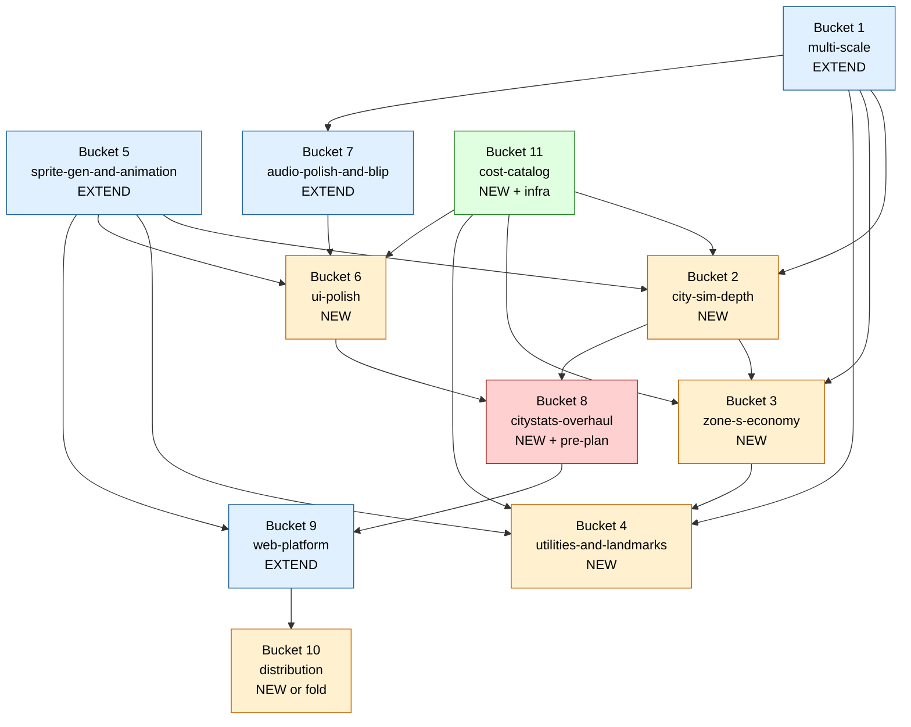
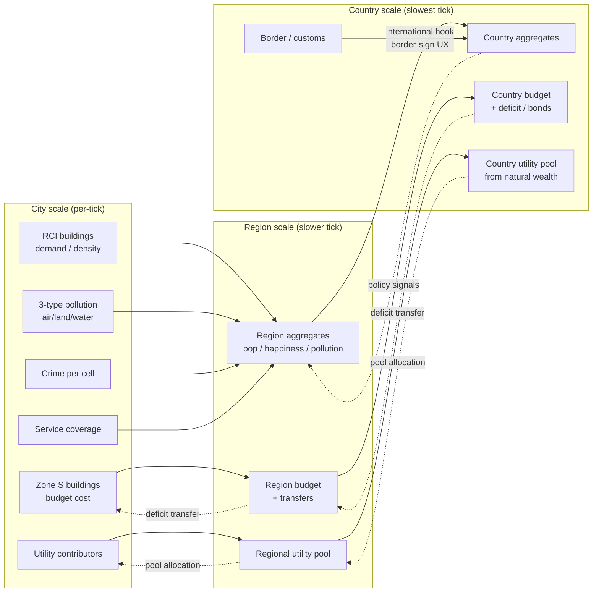
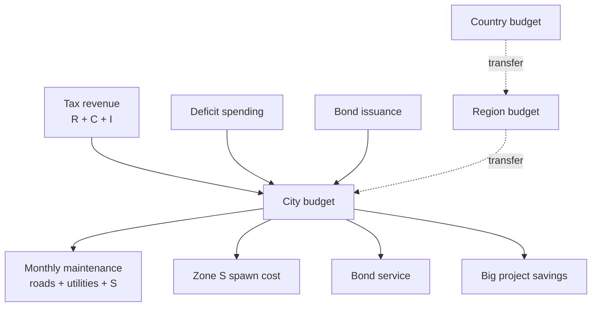
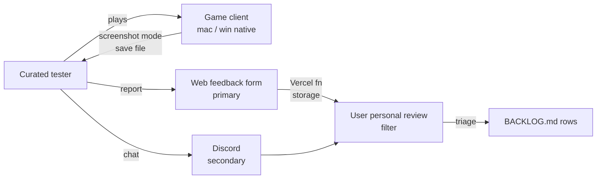
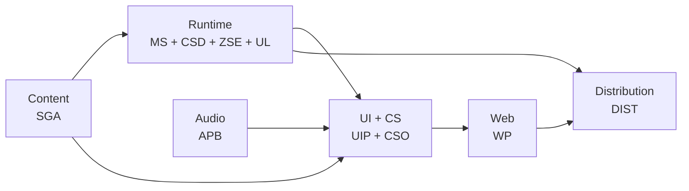

# Full-Game MVP — Exploration

> Orchestration-level exploration defining what the Territory Developer beta MVP looks like, which master plans it spawns, and which canonical scope stays IN vs OUT. Not a single master plan — a directory of master plans coordinated by the umbrella orchestrator. Output of this doc: seed for 10 downstream `*-master-plan.md` artifacts + 1 pre-plan exploration (`citystats-overhaul-exploration.md`) + 1 umbrella orchestrator ([`ia/projects/full-game-mvp-master-plan.md`](../ia/projects/full-game-mvp-master-plan.md) — created 2026-04-16 to coordinate tier lanes, cross-bucket dependencies, save-schema bump, stabilization policy, distribution gating).
>
> **Canonical terminology note.** This doc uses **country** / `CountryCell` / `parent_country_id` (per `ia/projects/multi-scale-master-plan.md` + glossary) as the third simulation scale. Earlier drafts used "nation" as synonym — all prose below normalised to country. Treat "nation" in quoted review text as legacy wording.

---

## Problem

Territory Developer has shipped a credible vertical slice (RCI zoning + AUTO growth + roads + interstate + save/load + single-scale simulation). Multiple master plans are in flight (multi-scale, sprite-gen, blip, web-platform), BACKLOG carries 80+ open items, and there is no cohesive answer to the question **"what does the first beta ship?"**. Without that answer:

- Backlog prioritisation is per-row, not per-theme. Lane order prevents chaos but does not describe product shape.
- Existing orchestrators each assume a surface (audio / sprites / web / multi-scale) without knowing which **gameplay** surface ships alongside them.
- Mid-MVP scope-creep risk is high — any new feature feels justifiable without a "not in MVP" line.
- Beta distribution, feedback loop, and testing modality are undefined.

Hard constraints the expansion must satisfy:

- Respect existing invariants (`ia/rules/invariants.md` #1–#12) without re-opening settled design.
- Respect existing master plans — extend them, do not fork competing plans.
- Produce a bucket list that is **parallelisable** across agent sessions (so multiple master plans can advance without sibling collision — the parallel-work rule in each orchestrator).
- Produce a scope OUT list that serves as the post-MVP runway (next-release ideas).
- Accept the "ship when ready" timeline posture — no fixed calendar — but budget against scope bloat.

## Approaches surveyed

Framing survey (A–F) compared MVP ambition levels. Summary:

| Id | Framing | Shape |
|----|---------|-------|
| A | Minimum thin slice | Zones + roads + save only; no services, no multi-scale, no audio polish. Shippable in weeks. |
| B | Minimum + audio | A + Blip finish + basic music. Still no multi-scale. |
| C | Minimum + multi-scale stub | A + existing multi-scale Step 1 stubs + one polished city scale. |
| D | Balanced MVP | B + C + services v1 + basic UI polish. Mid-ambition. |
| E | Rich MVP | D + density evolution + pollution + crime + districts + overlays + full web platform. |
| F | **Polished Ambitious MVP (selected — richer than E)** | E + full multi-scale play (city + region + country auto-sim + scale transitions) + Zone S state-owned budget arm + utilities v1 framed as country-level resources + landmarks progression + construction evolution + full animation pipeline (agent-driven + dedicated tool) + CityStats full overhaul + all overlays + multi-tier roads (tiers + bridges + tunnels + elevated) + international hooks via border-sign UX. Locks beta against `macOS + Windows` native builds with a polished web signup/feedback site. |

## Recommendation

**Framing F — Polished Ambitious MVP.** User explicit choice (confirmed Phases 0–2, prior session). Rationale:

- Targets a beta audience of 20–50 dev-savvy curated testers who forgive bugs but not hollowness. Thin slices (A–C) do not demonstrate the game's identity (multi-scale + deep simulation).
- "Ship when ready" posture removes the calendar pressure that normally pushes F to D.
- Existing master plans already carry half the surface (multi-scale, sprite-gen, blip, web). Framing F extends what exists rather than forking. Incremental orchestrator cost is bounded.
- Per-bucket parallel work lets F actually finish — we are not serialising 10 months of dev into one chronological queue.

Trade accepted: scope bloat risk during master-plan authoring. Mitigation: hard deferrals list per bucket + explicit OUT list in the Design Expansion below. Each master plan must cite its deferrals by name.

## Open questions

Carried into master-plan authoring (not re-opened here):

1. **Stabilization surface** — does `stabilization-master-plan` become an orchestrator, a priority-driven BACKLOG sweep, or an implicit gate on other master plans? Design Expansion proposes a judgment call + recommends the sweep route with spec-kickoff gating.
2. **Animation pipeline cross-cutting surface** — does the "animation pipeline" bucket absorb construction anims, road traffic anims, fire / smoke, and protest / violence under one surface, or does each consumer (city-sim-depth, utility-sim, events) own its animation contracts? Design Expansion proposes a single pipeline bucket (extending sprite-gen) with per-consumer animation-descriptor YAMLs.
3. **CityStats parity with web dashboard** — the "data parity target" between in-game CityStats and the web-app content surface needs its own exploration doc before a master plan. Design Expansion flags this as the one pre-plan exploration seed.
4. **International multi-country play** — locked as "hooks only" for MVP, but contract shape (border-sign UX extension, data model for second-country stub) is sketched in the multi-scale bucket; full play deferred post-MVP.

---

## Design Expansion

### Context snapshot

Current Territory Developer state (mid-April 2026):

- **Runtime Unity** — single-city scale playable. RCI zoning + AUTO roads + AUTO zoning + interstate + save/load + economy day/month loop + happiness + pollution scalar + monthly maintenance. FEAT-43 urban growth rings partially tuned. UrbanUrbanizationProposal obsolete (invariant #11).
- **Active master plans (5):**
  - `multi-scale-master-plan.md` — Step 1 Final (parent-scale stubs landed); Step 2 decomposition pending. Adds `RegionCell` / `CountryCell` split; neighbor-city stub at interstate exits; `scenario_descriptor_v1`.
  - `sprite-gen-master-plan.md` — Step 1 (Geometry MVP) In Progress, Stage 1.4 (Aseprite integration) filed. Python tool emitting isometric buildings on 17 slope variants. City-scale 1×1 only in v1.
  - `blip-master-plan.md` — Steps 1–3 Final; Step 4 decomposed + pending file; Steps 5–7 skeleton. Procedural SFX (10 baked sounds). MainMenu wiring just shipped.
  - `music-player-master-plan.md` — Step 1 Stage 1.1 pending; Steps 2–3 decomposed. Authored-jazz streaming subsystem (`.ogg` shuffle, `NowPlayingWidget` HUD row, Credits sub-screen). Sibling to Blip, shares `BlipMixer`. Kept **separate** from the MVP single-track music bucket (Bucket 7) — see bucket 7 note.
  - `web-platform-master-plan.md` — Steps 1–4 Final (Step 4 "dashboard improvements" closed 2026-04-16); Steps 5–6 paused pending beta scope. Next.js app at `web/` on Vercel, live dashboard fetches GitHub raw every 5 min (ISR revalidate=300).
- **Critical interrupts still open:** BUG-55 (10-fix audit), BUG-31 (interstate border prefabs), BUG-28 (slope vs interstate sorting), BUG-20 (utility building visual restore on LoadGame), BUG-49 (street preview animation), BUG-48 (minimap stale), BUG-14 (per-frame FindObjectOfType), TECH-15 (geography init perf), TECH-16 (tick perf v2).
- **Shipped canonical terminology:** HeightMap, wet run, road stroke, road preparation family, scale switch, urban centroid, urban growth rings, desirability, tax base, monthly maintenance, happiness, pollution, utility building, interstate, neighbor-city stub, scenario descriptor v1, city metrics history.

**Beta framing F summary.** Ship a polished multi-scale city builder to 20–50 curated testers on macOS + Windows native builds. No WebGL. Signup + feedback via the existing `web/` Next.js site. Quality bias accepted. Scope bloat mitigated at master-plan authoring time (each bucket carries hard deferrals).

### Beta parameters (locked)

| Parameter | Value |
|-----------|-------|
| Audience size | 20–50 curated testers |
| Trust level | Dev-savvy friends; user filters feedback personally |
| Deployment | macOS + Windows native (no WebGL for MVP) |
| Timeline | Ship when ready (no fixed date); scope bloat mitigated during master-plan authoring |
| Feedback channel | Web-app form on polished site (own feedback page — primary) |
| Secondary channels | Discord link (community), About/Credits page |
| Sprite library target | ~300 variants (rich but achievable); no vehicle variants, no decoration sprites, no seasonal variants |
| Music | Single shared track across all scales (no per-scale variation, no adaptive ramping) |
| Localisation | English only |
| Input | Mouse + keyboard (no controller, no touch) |

### MVP scope — IN

Grouped by surface so the bucket map downstream is legible.

**Core gameplay and simulation depth.**

- Zones R / C / I / **S** (state-owned). S is a fourth parallel zone type — spawns public housing (vivienda pública), bureaucratic offices (sector público), and public services. S buildings COST money to the owning scale's budget (city / region / country). S is fully integrated with the finance + budgeting views + tax controls + per-service budget allocation.
- **FEAT-08 density evolution** — buildings upgrade / decay over simulation time based on desirability + tax + demand pressure.
- **Construction evolution (new)** — buildings animate through per-type construction stages. Speed driven by desirability, land value (plusvalía), and a per-building-type construction-time curve. Each stage is a sprite variant (drives the animation pipeline requirement).
- **FEAT-43 urban growth rings** — organic center-to-edge gradient shaping AUTO road + zoning.
- **FEAT-52 city services** — police, fire, education, healthcare, parks. Each is an S-type building footprint with a coverage radius + per-service budget + happiness contribution + desirability contribution.
- **FEAT-53 districts / neighborhoods** — aggregation layer on top of cells; districts carry per-district demographics + policy hooks.
- **Road tiers** — ordinary street → avenue → arterial → interstate. Tier drives stroke sprite + capacity + cost. Improved bridges. Tunnels (height-negative stroke variant). Elevated roads (height-positive stroke with support columns).
- **Multi-scale route hierarchy** — city interstates hand off to regional inter-regional roads hand off to country-scale international routes. International routes in MVP = design hooks + border-sign UX only; the second-country play is deferred to post-beta.
- **Public transport** — buses at city scale, trains / subway at city scale, regional rail at region scale, country-scale rail at country scale. Scale-integrated route network.
- **Parks / leisure zones** — S-type sub-category with happiness + pollution-sink effect.
- **Utilities v1** — water / power / sewage framed as country-level resources derived from natural wealth (forest, water body, mineral placeholder) plus savings / assets. Local utility buildings contribute to regional and country-level pools. Deep design of utilities mechanics deferred to its own master plan (see bucket map).
- **Waste management** — tied to land value + desirability + the 3-type pollution model.
- **Pollution simulation** — 3 types: air, land, water. Each propagates via a separate diffusion kernel; each has distinct sources (I buildings for air, waste for land, I + sewage for water) and sinks (forest for air, parks for land, wetlands / buffer for water).
- **Crime simulation** — 0–100 per-cell score; sources = low happiness + low desirability + low policing; sink = police service coverage radius. Feeds happiness and desirability negatively. Drives protest / violence animations on hotspots.
- **Traffic flow abstraction** — SimCity 2000 style. Road-density-dependent animations on road strokes, not per-vehicle pathing. Each road cell picks a "traffic level" (low / medium / high / jammed) from a neighborhood-sum heuristic and swaps the animated variant.
- **Industrial specialisation** — agriculture, manufacturing, tech, tourism. Each I sub-type carries different pollution weights + desirability requirements + tax yield.
- **Landmarks (gated progression)** — two parallel progression paths:
  1. **Scale-unlock rewards.** Reach a city threshold → unlock region scale + earn a placeable city landmark. Same city→region→country.
  2. **Saved-for projects.** 1–2 very expensive commissioned public buildings per scale. Player saves budget, commits budget to a months-long build, receives the landmark as a placeable.

**Multi-scale (full play — all IN).**

- Region auto-sim (tick rate slower than city; per-region aggregates).
- Country auto-sim (tick rate slower than region; per-country aggregates).
- Scale transitions via `scale switch` — semantic zoom + procedural fog + per-scale `ScaleToolProvider`.
- Inter-scale influence — country decisions (tax policy, utility pool) propagate to regions, which propagate to cities. Bubble-up: city metrics aggregate to region, region to country.
- Interstate / highway network at region scale (BUG-31 relevance — border prefab correctness).
- Border + customs at country scale.
- International hooks — data model contracts + border-sign UX. No second-country play in MVP.

**Simulation systems (all IN, some deeper).**

- Game speed control (pause / 1x / 2x / 3x).
- **Finances (deeper).** Per-service budgets. Deficit spending. Bonds. Fully integrated with Zone S spawn cost. Per-sector tax rates. Monthly maintenance expansion for new surface (utilities, services, S buildings).
- Happiness / approval meter (already shipped — extended to consume 3-type pollution, crime, service coverage).
- **Demographics — per-zone breakdown + aggregate + minimap integration.** Age buckets, income buckets, education buckets.
- Employment / unemployment.
- Education levels (per district).
- Health levels (per district).

**Visual polish.**

- **Sprite generator (existing master plan)** extended for MVP scope — multi-building-type palette coverage, S-type building archetypes, landmark archetypes.
- **Animation pipeline (new, dual approach).** Both an agent-driven prompt-to-animated-sprite path (for rapid iteration) and a dedicated animation-generator tool (for deterministic batch renders). Consumers: construction animations (per building type × size), traffic flow anims on roads, water wave / movement anims, fire, smoke, protest / violence.
- **Camera effects = contextual warnings only.** Fire → shake + zoom trigger. Not general polish (no parallax / pan as polish).
- **UiTheme consistency pass** — unified menu / HUD / dialog styling across every surface.
- **Icon set / iconography** — zone icons, service icons, overlay icons, landmark icons.
- **Loading screens and transitions** — per scene-transition + per scale-switch.
- **Splash art / title screen** — game identity anchor for testers.
- **Overlays toggle** — pollution view (3 types), crime view, traffic view, happiness view, zone view, desirability view.

**Audio polish.**

- **Blip SFX finish** — Steps 4–7 of the existing blip master plan.
- **Music** — single shared track across all scales. No per-scale variation, no adaptive ramping. Delivered via the existing `music-player-master-plan.md` subsystem (sibling orchestrator; `.ogg` streaming + mixer group + volume slider already in flight); Bucket 7 seeds exactly one looped track onto the music-player playlist for MVP. The full jazz-library shuffle + `NowPlayingWidget` HUD + Credits screen surface stays behind music-player and is **not** MVP-gating — ships whenever that orchestrator lands.
- **UI sound effects** — clicks, hovers, confirms, errors.
- **Ambient sounds per scale** — city ambient bed, region ambient bed, country ambient bed. Cross-fade on scale switch.

**UI polish (all IN).**

- Main menu polish.
- HUD (money, population, date, speed, happiness, unread notifications, scale indicator).
- Info panels (click building → stats).
- Notifications / event feed.
- Settings menu (audio / video / controls).
- Save / load menu with multiple slots.
- Pause menu.
- Graphs / stats panel (population over time, economy curves, pollution trends, demographic pyramids).
- **New-game setup (map size, starting conditions).** User flagged very important — must offer meaningful parameter space without blocking the guided first scenario path.
- **CityStats — full redesign + functionality overhaul.** Requires its own exploration doc (flagged as the single pre-plan exploration seed — see Next steps). Must be visually and conceptually coherent with the web-app dashboard content — data parity target covers both schema AND visual style.

**Web polish (all IN).**

- Landing page — hero + pitch + screenshots + trailer.
- Beta signup form.
- Devlog / blog feed.
- Private download page — gated by signed URL or token.
- **Feedback form / survey** — primary MVP feedback channel.
- Discord / community link.
- About / credits.
- FAQ.
- Press kit — screenshots, logo, blurb, for sharing.

**Meta / QoL (all IN).**

- Autosave.
- Multiple save slots.
- Screenshot mode — clean camera, no HUD.
- In-game glossary / help menu.
- Tooltips on hover.
- Guided first scenario — place road → zone → watch grow.

**Content.**

- Sprite library target ~300 variants. Rich but achievable. No vehicle variants, no decoration sprites, no seasonal variants.

**Distribution.**

- macOS + Windows native build pipelines.
- Build versioning + patch channel.
- Private distribution — direct link or itch private page.
- No WebGL for MVP. Web dashboard remains on Vercel as a separate artifact.

### MVP scope — OUT (hard exclusions)

Explicit pushbacks. Each bucket's master plan must cite by name.

- Map / terrain creation tool (player-authored terrain).
- Disasters (earthquakes, fires-as-events, floods as sim triggers). Fire is a gameplay state (hotspot + extinguish service), not an authored disaster event.
- Modding / Steam Workshop.
- Multiplayer / co-op.
- Save cloud sync.
- Achievements / meta progression.
- Localisation (English only for MVP).
- Controller / gamepad (mouse + keyboard only).
- Mobile / touch.
- Weather simulation.
- Day / night cycle.
- Seasons.
- Political / policy system beyond zoning + tax + budget.
- Research / tech tree.
- Procedural events / quests / storylets.
- Advanced economy (stock market, import / export depth).
- Dynamic terrain (erosion, river migration).
- Population individuality (named sims with bios).
- Auto-telemetry.
- In-game bug report UI.
- Crash reporter (testers report manually).
- Accessibility (colorblind modes, text scaling, subtitles).
- Steam / itch public store presence (private first, store later).
- WebGL build.
- Vehicle sprite variants, decoration / prop sprites, seasonal variants.
- Adaptive music.
- Second-country playable (international hooks only; second-country play deferred).

### Candidate master-plan buckets (final — 9 buckets)

Refinement from the prior sketch of 13. Consolidations explained below each bucket. Each bucket carries: slug, mission, subsystems, estimated size, dependencies, absorbed BACKLOG rows, hard deferrals.

---

**Bucket 1 — `multi-scale-master-plan.md` (EXTEND existing).**

_Mission._ Complete the city ↔ region ↔ country game loop. Extend from the current Step 1 (parent-scale stubs) through region auto-sim, country auto-sim, scale transitions, inter-scale influence, border / customs, and international hooks via the border-sign UX pattern. Land the multi-tier route hierarchy so city interstates hand off to regional inter-regional roads hand off to country-scale international routes.

_Subsystems touched._ Unity runtime C#: `GridManager` / `CityCell` / `RegionCell` / `CountryCell`, `InterstateManager`, `SimulationManager`, `TimeManager`, `GameSaveManager`, `RegionalMapManager`, new `RegionSimulationService` + `CountrySimulationService` + `ScaleTransitionController`. IA docs: `simulation-system.md` (tick order extensions), `persistence-system.md` (multi-scale save tree), `managers-reference.md` (new managers), glossary (new terms for country scale + international stub).

_Estimated size._ 4–5 steps × 2–3 stages each (≈10–12 stages). Absorbs existing Steps 2+ on the orchestrator.

_Dependencies._ Existing Step 1 (done). No new bucket blocks it. Feeds every other bucket that needs region / country aggregates (economy, utilities, landmarks).

_Absorbed BACKLOG rows._ FEAT-10 (regional map monthly bonus), FEAT-47 (multipolar urban centroid — region scale), BUG-31 (interstate entry / exit prefabs — scale boundary bug), BUG-28 (sorting order slope vs interstate).

_Hard deferrals._ Second-country playable (hooks only); procedural events per scale; weather / day-night / seasons; dynamic terrain (erosion); population individuality.

---

**Bucket 2 — `city-sim-depth-master-plan.md` (NEW).**

_Mission._ Deliver the gameplay depth that makes Territory Developer recognisable as a city builder. FEAT-08 density evolution, FEAT-43 urban growth rings tune, FEAT-52 services, FEAT-53 districts, 3-type pollution, crime, traffic flow abstraction, waste management, construction evolution, industrial specialisation.

_Subsystems touched._ Runtime C#: `DemandManager`, `CityStats`, `ZoneManager`, `GrowthManager`, `EconomyManager`, `ForestManager` (pollution sink), new `PollutionService` (3-type), new `CrimeService`, new `TrafficFlowService`, new `DistrictService`, new `IndustrialSpecializationService`, new `ConstructionEvolutionController` + animation-descriptor consumer. IA docs: `simulation-system.md` (tick order — crime + pollution phases), `managers-reference.md` (RCI extension + S integration callouts), glossary (3-type pollution, crime, traffic flow level, district, construction stage, industrial specialisation).

_Estimated size._ 5–6 steps × 2–3 stages each (≈12–15 stages). Largest bucket by stage count. Decompose aggressively via `/stage-decompose`.

_Dependencies._ Bucket 1 (needs region + country aggregates for pollution / crime propagation upscale). Bucket 5 (needs animation pipeline for construction anims, traffic anims, fire / smoke).

_Absorbed BACKLOG rows._ FEAT-08, FEAT-43, FEAT-52, FEAT-53, FEAT-11 (education / schools), FEAT-12 (security / police), FEAT-13 (fire / firefighters), FEAT-14 (vehicle traffic / traffic animations — absorbed as traffic flow abstraction, per-vehicle pathing deferred). FEAT-09 (trade / production / salaries — partial; advanced economy deferred).

_Hard deferrals._ Per-vehicle pathing (traffic flow abstraction only); named sims; advanced economy (stock market, import / export depth); disasters; research tree.

---

**Bucket 3 — `zone-s-economy-master-plan.md` (NEW — merges Zone S + economy depth).**

_Mission._ Introduce Zone S (state-owned) as a fourth parallel zone type integrated with the budget / finance / tax surface. Deepen the finance loop — per-service budgets, deficit spending, bonds. S spawns cost money to the owning scale; S buildings provide services (police / fire / education / health / parks) to R / C / I. Extend monthly maintenance to cover S + utilities + multi-tier roads.

_Subsystems touched._ Runtime C#: `EconomyManager`, `CityStats`, `ZoneManager` (S as 4th type), `DemandManager` (S tax pressure rules), new `BudgetAllocationService`, new `BondService`, new `StateOwnedBuildingService`. IA docs: `managers-reference.md` (Zones extension + Demand extension), `simulation-system.md` (monthly economy extension), glossary (Zone S, vivienda pública, sector público, deficit spending, bond, per-service budget).

_Estimated size._ 3 steps × 2–3 stages each (≈7–9 stages).

_Dependencies._ Bucket 2 (services coverage model is the primary consumer of S spawn). Bucket 1 (budget flows across scales — country budget → region → city for deficit / transfer). Can partially run in parallel with Bucket 2 if the S contract is defined first.

_Absorbed BACKLOG rows._ Part of FEAT-09 (economy depth — specifically tax / budget / bond pathway; advanced economy deferred).

_Hard deferrals._ Stock market; import / export; per-building economic agent simulation; advanced bond market dynamics (interest rate curves tied to credit rating).

_Why merged with Zone S._ Zone S is meaningless without the budget surface funding it. Economy depth beyond tax + maintenance is tightly coupled to S spawn cost + per-service budgets. Splitting would leave orphaned halves.

---

**Bucket 4 — `utilities-and-landmarks-master-plan.md` (NEW — merges utilities v1 + landmarks).**

_Mission._ Land utilities v1 (water / power / sewage) as country-level resources derived from natural wealth + savings, with local contributors feeding regional / country-level pools. Land the landmarks progression — scale-unlock rewards + saved-for big projects (1–2 per scale).

_Subsystems touched._ Runtime C#: new `UtilityPoolService` (per-scale), new `UtilityContributorService` (per-building), extension of `CityStats` (utility deficit → happiness penalty), new `LandmarkProgressionService`, new `ScaleUnlockService`, new `BigProjectService` (commission + months-long build). IA docs: `managers-reference.md` (Utility building extension), glossary (utility pool, utility contributor, natural wealth, landmark, scale-unlock, big project).

_Estimated size._ 2–3 steps × 2 stages each (≈5–7 stages).

_Dependencies._ Bucket 1 (country scale is where utility pools sum). Bucket 3 (big projects commission against budget — needs per-service budget + bond surface).

_Absorbed BACKLOG rows._ None directly — new surface.

_Hard deferrals._ Climate / geographic base utility variation (deferred per locked scope); renewable vs fossil granular mechanics beyond pollution contribution; private utility operators.

_Why merged._ Both touch the country aggregate surface; both gate progression; landmarks give testers visible "unlock moments" tied to utility / budget thresholds. Splitting would produce two thin plans that share the same scale-aggregate surface.

---

**Bucket 5 — `sprite-gen-and-animation-master-plan.md` (EXTEND existing `sprite-gen-master-plan.md`).**

_Mission._ Complete sprite-gen Step 1 (Geometry MVP) + add Steps for animation pipeline (both paths: agent-driven prompt-to-animated-sprite AND dedicated animation-generator tool). Emit construction anims per building type × size, traffic flow anims on road strokes, water wave anims, fire, smoke, protest / violence. Expand archetype coverage to S buildings + landmarks + utility buildings so the ~300-variant library target is reachable.

_Subsystems touched._ Python tooling under `tools/sprite-gen/`. New `tools/anim-gen/` module (or sub-module of sprite-gen). Output pipeline into `Assets/Sprites/Generated/Animated/`. Unity C#: animation-descriptor consumer stubs (YAML per archetype / event). IA docs: `unity-development-context.md` (§10 extension for anim asset Postgres registry, when applicable), glossary (animation descriptor, animation pipeline, construction stage).

_Estimated size._ Current sprite-gen Step 1 continues (in progress). Add 3–4 new steps for animation pipeline × 2 stages each (≈8 additional stages on top of existing plan).

_Dependencies._ None new — can run in parallel with every other bucket. Feeds Bucket 2 (construction anims, traffic flow anims, fire, smoke, protest / violence), Bucket 4 (landmark + utility sprites), Bucket 6 (UI iconography).

_Absorbed BACKLOG rows._ ART-01, ART-02, ART-03, ART-04 (missing prefabs — sprite-gen consumes these as archetype specs).

_Hard deferrals._ Vehicle variants, decoration / prop sprites, seasonal variants, per-scale sprite theming beyond shared palette, animated characters (named sims).

---

**Bucket 6 — `ui-polish-master-plan.md` (NEW).**

_Mission._ Ship the full UI surface for the beta. UiTheme consistency pass, HUD, info panels, notifications, event feed, settings menu, save / load with multiple slots, pause menu, graphs / stats, new-game setup, icons, loading screens, splash art, overlays toggle, tooltips, in-game glossary, guided first scenario (onboarding).

_Subsystems touched._ Runtime C#: `UIManager` + all uGUI controllers, `NotificationManager`, new `OnboardingController`, new `OverlayController` (toggle pollution / crime / traffic / happiness / zone / desirability views), new `NewGameSetupController`, new `GraphsPanelController`, new `SaveSlotsController`. IA docs: `ui-design-system.md` (primary; this bucket is the main consumer). Glossary (overlay view, onboarding scenario, new-game setup parameter).

_Estimated size._ 4–5 steps × 2–3 stages each (≈10–12 stages).

_Dependencies._ Bucket 5 (icon sprites, loading screen art, splash art). Bucket 7 (audio hook points for UI SFX).

_Absorbed BACKLOG rows._ TECH-72 (HUD / uGUI scene hygiene).

_Hard deferrals._ CityStats redesign (split into own bucket 8); accessibility; localisation.

_Why separate from CityStats overhaul._ CityStats is a focused, deep redesign with a data-parity contract against the web dashboard. Keeping it in `ui-polish` would dilute both. CityStats gets its own exploration doc first (pre-plan).

---

**Bucket 7 — `audio-polish-and-blip-master-plan.md` (EXTEND existing `blip-master-plan.md`).**

_Mission._ Finish the Blip Steps 4–7 (existing plan). Add the shared music track, UI SFX, per-scale ambient beds (city / region / country) with cross-fade on scale switch.

_Subsystems touched._ Runtime C#: existing Blip subsystem, new `MusicPlayerController`, new `AmbientBedController` per scale, `ScaleTransitionController` (hook for ambient cross-fade). IA docs: `audio-blip.md` extension, glossary (shared music track, ambient bed, UI SFX, ambient cross-fade).

_Estimated size._ Existing Steps 4–7 continue. Add 2 new steps for music + ambient × 2 stages each (≈4 additional stages on top of existing plan).

_Dependencies._ Bucket 1 (scale-switch hook for ambient cross-fade). Bucket 6 (UI SFX hook points). Sibling orchestrator `music-player-master-plan.md` (separate; coordinates on shared `BlipMixer` — see merge note below).

_Absorbed BACKLOG rows._ AUDIO-01 (audio FX: demolition, placement, zoning, forest, 3 music themes, ambient effects — MVP consumes the single music track + per-scale ambient; the 3-theme surface deferred).

_Hard deferrals._ Adaptive music, per-scale music variation, interactive stems, dynamic EQ / filtering.

_Note on music-player-master-plan.md (resolved — keep separate)._ That existing master plan is an authored-jazz streaming subsystem (`.ogg` shuffle library, `NowPlayingWidget` HUD row, Credits sub-screen). It is **not** the MVP "single shared track" surface — music-player is the library player; Bucket 7 delivers the shipped-with-MVP loop. Decision: keep music-player-master-plan as a sibling orchestrator (Step 1 Stage 1.1 pending is already in flight). Bucket 7 Step 8 adds the MVP shared-track integration by consuming the music-player subsystem's `.ogg` / mixer-group contract — Bucket 7 does NOT duplicate the player UI; it seeds one looped track onto the existing shuffle list (or equivalent minimal hook) and leaves the full jazz-library feature behind the music-player orchestrator. Coordinate at authoring time: Bucket 7 Step 8 kickoff must read `music-player-master-plan.md` Step 1 exit criteria first to avoid mixer-param collision (shared `BlipMixer` asset, `MusicVolume` param — music-player-owned).

---

**Bucket 8 — `citystats-overhaul-master-plan.md` (NEW — requires pre-plan exploration).**

_Mission._ Full redesign + functional overhaul of CityStats. Data parity target with web-app dashboard (both schema AND visual style). Feeds every overlay, every info panel, every HUD metric. Drives the graphs panel + demographics panel + minimap integration.

_Subsystems touched._ Runtime C#: complete rewrite of `CityStats` into `CityStats` + per-metric services (`HappinessService`, `PollutionService` consumers, `CrimeService` consumers, `DemographicsService`, `EmploymentService`, `EducationService`, `HealthService`). `CityStatsUIController` rewrite. IA docs: `managers-reference.md` (CityStats section extension), glossary (new metric terms), and a new project-spec-style exploration doc BEFORE the master plan.

_Estimated size._ 3–4 steps × 2–3 stages each (≈7–10 stages).

_Dependencies._ Bucket 2 (pollution + crime + services are input signals). Bucket 1 (per-scale aggregates). Web-platform dashboard (data-parity target — coordinate schema with the existing web dashboard).

_Absorbed BACKLOG rows._ FEAT-51 (game data dashboard — coordinate with web dashboard), TECH-82 follow-ups (per-scale metrics extensions).

_Hard deferrals._ Telemetry auto-send; crash reporter; in-game bug report UI (all in OUT list); full graph pan / zoom interactions beyond MVP.

_Why a pre-plan exploration is required._ CityStats carries the largest conceptual ambiguity in the MVP. Every other bucket consumes it. The data-parity contract with the web dashboard requires a design pass before steps can be decomposed. Flag as the single pre-plan exploration seed: `docs/citystats-overhaul-exploration.md`.

---

**Bucket 9 — `web-platform-master-plan.md` (EXTEND existing).**

_Mission._ Extend from current dashboard focus (Steps 1–4 Final, Steps 5–6 paused) to full beta web surface. Add landing page, hero + pitch + screenshots + trailer, beta signup form, devlog / blog feed, private gated download page, primary feedback form / survey, Discord link, About / credits, FAQ, press kit.

_Subsystems touched._ Next.js app at `web/`. New pages: landing, signup, devlog, download, feedback, about, FAQ, press-kit. Feedback form backend (Vercel function + Postgres or Vercel KV). Signup form backend (same pattern). IA docs: `web-ui-design-system.md`, glossary (beta signup, feedback form, devlog, press kit).

_Estimated size._ Existing Steps 1–4 continue. Add 3 new steps × 2 stages each (≈6 additional stages on top of existing plan).

_Dependencies._ Bucket 5 (screenshots + trailer export via sprite-gen / animation pipeline — indirect; primarily runtime screenshot mode output). Bucket 8 (CityStats data parity → dashboard schema alignment). Bucket 10 (distribution — download page gates the build artifact).

_Absorbed BACKLOG rows._ None in current BACKLOG (the web program is entirely orchestrator-owned).

_Hard deferrals._ Payment gateway, cloud saves, community wiki edits, i18n, Unity WebGL export (already in web-platform post-MVP list).

---

**Bucket 10 — `distribution-master-plan.md` (NEW — but LEAN; could fold into Web or run as loose BACKLOG sweep).**

_Mission._ macOS + Windows native build pipelines. Build versioning. Patch channel. Private distribution (direct link or itch private page). Build signing where required by macOS Gatekeeper / Windows SmartScreen.

_Subsystems touched._ Unity build pipeline scripts under `tools/scripts/` or `Assets/Editor/Build/`. CI integration (GitHub Actions). Versioning manifest. Download page coordination with Bucket 9.

_Estimated size._ 2 steps × 2 stages each (≈4 stages).

_Dependencies._ Every other bucket must be buildable (runtime code + assets must compile + pass unity:compile-check before build pipeline wires up). Realistically the LAST bucket to start.

_Absorbed BACKLOG rows._ None directly.

_Hard deferrals._ Steam / itch public store presence; auto-update; Linux builds; WebGL builds.

_Why not merged with web-platform._ Distribution pipeline is a Unity-side concern (build artifacts, signing, codesigning). Web merely hosts the download. Keeping distribution separate lets the Unity build team work independently of the web team. If the team is a team of one (one Claude session), the buckets serialise trivially — fold if needed at master-plan authoring time.

---

**Bucket 11 — `cost-catalog-master-plan.md` (NEW — cross-entity static cost catalog).**

_Mission._ Land a centralized `CostTable` ScriptableObject asset holding every hardcoded cost + footprint constant consumed across gameplay buckets (zones, utilities, landmarks, big projects, bonds, tax floors, maintenance rates). Replace scattered per-row hardcoded numbers with a single reviewable + tunable matrix. Ship editor UI for matrix review (Inspector custom drawer OR dedicated Editor window). NO dynamic pricing, NO formula scaling — values stay design-time constants; only the storage location changes. Enforces a cross-cutting rule: every new cost field goes through the catalog, never back into per-entity files.

_Subsystems touched._ New `CostTable.asset` ScriptableObject under `Assets/ScriptableObjects/Balance/`. New `ICostCatalog` read interface + `CostCatalogService` (MonoBehaviour, Inspector-wired). Migration shims on every existing consumer (BuildingPlacer, ZoneManager, UtilityPoolService, LandmarkPlacementService, BondIssuer, TaxController). Editor-side: custom property drawer or `CostTableWindow` for matrix review. IA docs: new `ia/specs/cost-catalog.md` reference spec; glossary (cost catalog, CostTable, cost row, footprint constant); `managers-reference.md` (CostCatalogService section). NO runtime save impact — catalog is asset-only, immutable at runtime.

_Estimated size._ 3 steps × 2 stages each (≈6 stages). Step 1 — schema + asset + read API + consumer migration (zones, utilities baseline). Step 2 — landmarks + big projects + bonds + tax migration. Step 3 — editor UI + matrix export (CSV / markdown for balance review). Long tail expected as later features add cost rows — bucket stays permanent, new rows append via `/project-new` after MVP.

_Dependencies._ None upstream. Consumers = Buckets 2 (city-sim-depth — construction cost), 3 (zone-s-economy — S-building cost + bond ceiling + tax floor), 4 (utilities-and-landmarks — utility + landmark cost + footprint), 6 (ui-polish — tooltip reads cost from catalog). Runs in parallel with Tier B — zero design input needed from gameplay buckets; catalog schema is infra.

_Absorbed BACKLOG rows._ None (new infra surface).

_Hard deferrals._ Dynamic pricing (population-scaled / tier-scaled costs); economy-reactive pricing; modder-authored cost overrides; in-game balance editor; runtime cost mutation via events. All post-MVP.

_Why a dedicated bucket._ User intent = "long effort, tracking advised". Centralizing N cost consumers (zones / utilities / landmarks / big projects / bonds / tax / maintenance) touches N existing subsystems. Folding into Bucket 3 or Bucket 4 would dilute both and hide the cross-cutting migration from the rollup. A dedicated bucket surfaces progress per migrated consumer + owns the editor UI surface (non-trivial Unity custom editor work).

_Cross-cutting rule (umbrella-level).__ All MVP bucket authors (2 / 3 / 4 / 6) consume cost values via `ICostCatalog.Get(row)` — never hardcode numbers in per-entity source. Placeholder constants authored inline BEFORE Bucket 11 lands are flagged `// TODO(bucket-11): migrate to CostTable` + tracked in Bucket 11 Step 1 Stage 1.1 migration inventory.

---

**Stabilization — recommended as BACKLOG sweep, NOT a master plan.**

Rationale: BUG-55 (10-fix audit), BUG-31, BUG-28, BUG-20, BUG-49, BUG-48, BUG-14, TECH-15, TECH-16 are interrupts that predate the MVP scope. They must ship alongside the MVP, but decomposing them as a master plan adds orchestrator overhead for a set of largely independent fixes. Recommend: assign a "Stabilization" tag in BACKLOG, enforce a rule that every MVP bucket opens with a stabilization pass on its touched subsystem (e.g. Bucket 1 opens with BUG-31 + BUG-28 fix; Bucket 6 opens with BUG-14 + BUG-48 fix; Bucket 2 opens with TECH-16 tick perf). TECH-15 (geography init perf) + TECH-16 (tick perf v2) are global concerns — can be their own micro-plan or single-issue `/project-new` runs as needed.

### Architecture

**Bucket dependency graph.**

Reading the graph: arrows = "blocks / informs". Bucket 1 (multi-scale) feeds most of the gameplay buckets. Bucket 5 (sprite-gen + animation) is the widest producer — feeds every visual consumer. Bucket 8 (CityStats) is the deepest analytical surface — consumes city-sim-depth outputs, feeds UI + web dashboard. Bucket 10 (distribution) is the final gate.

**Data flow — sim state upscale (city → region → country).**

Dashed arrows = downward influence (country → region → city). Solid arrows = upward aggregation (city → region → country). International hook enters at country scale via border-sign UX.

**Data flow — budget.**

**Data flow — feedback funnel (tester → repo).**

**Entry and exit points.**

| Surface | Entry | Exit |
|---------|-------|------|
| Multi-scale runtime | `SimulationManager.ProcessSimulationTick` extended with per-scale phases | Save artifact per scale tree; scale-switch transitions |
| Zone S | Player paints S zone via palette + budget check | S building spawns, budget debits, service coverage activates |
| Finance | HUD tax sliders + budget allocation panel + bond dialog | `EconomyManager` debits / credits, deficit flags raised |
| Animation pipeline | Archetype YAML under `tools/sprite-gen/archetypes/` + event list | `Assets/Sprites/Generated/Animated/*.png` + `.meta` files |
| Web feedback | Tester lands on `/feedback` | Vercel fn writes to storage (Postgres or KV); user reviews + triages into BACKLOG |
| Distribution | CI trigger on tagged commit | Signed macOS `.app` + Windows `.exe`, uploaded to private URL |

**Simplified Mermaid (for when the bucket graph above exceeds node count in downstream readers).**

### Subsystem impact summary

Glossary terms used across buckets (canonical, no ad-hoc synonyms):

- **Zones & Buildings:** Zone, Zone density, Zone S (new — add glossary row), Building, Building footprint, Pivot cell, RCI, Undeveloped light zoning.
- **Simulation & Growth:** AUTO systems, Simulation tick, Urban centroid, Urban growth rings, Growth budget, Desirability, Happiness, Pollution (extend to 3-type), Crime (new), Traffic flow level (new), Tax base, Monthly maintenance, Connurbation.
- **Multi-scale:** Simulation scale, Active scale, Dormant scale, Scale switch, City cell / Region cell / Country cell, Parent region id, Parent country id, Neighbor-city stub, Multi-scale save tree, Evolution-invariant, Evolution-mutable, Procedural scale generation.
- **Roads & Bridges:** Road stroke, Road preparation family, Interstate, Interstate cost model, Phase-1 validation, Road cache invalidation, Bridge lip, Deck span, Cut-through, Map border.
- **World features:** Utility building, Regional map, Forest (coverage).
- **New (pending glossary rows):** 3-type pollution (air / land / water), Crime score, Traffic flow level, Zone S, Construction stage, Construction evolution, Animation descriptor, Animation pipeline, Per-service budget, Deficit spending, Bond, Utility pool, Utility contributor, Natural wealth, Landmark, Scale-unlock reward, Big project, Overlay view, Onboarding scenario, New-game setup parameter, Ambient bed, Shared music track, Data parity target, Beta signup form, Feedback form.

Router domains touched (one-hop from `router_for_task`):

- Simulation, AUTO growth.
- Zones, buildings, RCI.
- Demand, desirability.
- Forests, regional map, utilities.
- Road logic, placement, bridges.
- Road prefabs on terrain.
- Road/interstate/bridge validation.
- Grid math, coordinates.
- Manager responsibilities.
- Save / load.
- UI changes.
- Unity/MonoBehaviour/Inspector wiring.
- In-game notifications.

Invariant risk by bucket (from `ia/rules/invariants.md` #1–#12):

| Bucket | Invariants at risk | Breaking vs additive | Mitigation |
|--------|--------------------|-----------------------|-------------|
| Bucket 1 multi-scale | #1 (HeightMap sync — per-scale height surfaces must mirror city rules), #2 (road cache invalidation — interstate hand-offs at scale boundaries), #5 (no direct `gridArray` — per-scale managers follow helper-service carve-out), #6 (GridManager extraction — new `ScaleTransitionController` + `RegionSimulationService` + `CountrySimulationService` stay outside GridManager), #10 (road prep family — regional road creation reuses PathTerraformPlan), #12 (project spec location — sub-specs under `ia/projects/`, not `ia/specs/`) | Additive (parent scales were stubbed). Region + country play is new. | Each scale's GridManager-equivalent inherits the same contract. New managers MonoBehaviour + `[SerializeField]` refs per guardrails. |
| Bucket 2 city-sim-depth | #1 (pollution sources may mutate cell data), #3 (no FindObjectOfType in Update — new PollutionService + CrimeService + TrafficFlowService cache in Awake), #4 (no new singletons), #6 (GridManager extraction), #11 (UrbanizationProposal NEVER re-enable — growth evolution uses FEAT-08 + FEAT-43 path, not the obsolete proposal system) | Additive (new services, new kernels) with behaviour changes to DemandManager / CityStats happiness formula (breaking for existing save compatibility — save schema bump required) | Schema bump + migration path; Evolution-invariant vs Evolution-mutable classification per new field (per multi-scale glossary); preserve UrbanizationProposal obsolete callout |
| Bucket 3 zone-s-economy | #3, #4, #6 — new managers follow pattern. Budget flow across scales implicates #1 (per-scale budget data sync). | Breaking (RCI → RCIS — fourth zone type added. Existing save + code assumes 3-channel RCI in several places: DemandManager, ZoneManager tile picker, tax rate UI.) | Phased rollout: Step 1 introduces S as runtime-only (invisible to save); Step 2 extends save + migration. |
| Bucket 4 utilities-and-landmarks | #1 (utility building multi-cell footprints must sync heights on placement), #2 (utility buildings near roads → cache invalidation), #6 (extract pool services) | Additive — new surface, no existing semantics broken. | Standard manager wiring pattern. |
| Bucket 5 sprite-gen-and-animation | None — Python tooling, Unity-isolated. Anim consumers in C# add new descriptor fields (additive). | Additive. | N/A (tooling side). Anim consumers: `[SerializeField]` refs. |
| Bucket 6 ui-polish | #3 (BUG-14 per-frame `FindObjectOfType` in Update — must fix before extending HUD) | Additive — fix BUG-14 first, then extend HUD surface. | Cache refs in Awake; close BUG-14 as first stabilization pass. |
| Bucket 7 audio-polish-and-blip | #3, #4 — existing Blip architecture already satisfies. | Additive. | Existing plan compliant. |
| Bucket 8 citystats-overhaul | #3, #4, #6 — decompose CityStats into per-metric services. | **Breaking** — CityStats is the largest consumer surface; rewrite invalidates every consumer signature. | Full pre-plan exploration BEFORE stages; define new interface contract first, then wire consumers (UI + web dashboard) in parallel. |
| Bucket 9 web-platform | None (no runtime C#; ia/rules/invariants.md not implicated per existing web-platform plan callout). | Additive. | N/A. |
| Bucket 10 distribution | None (build pipeline, Unity-side tooling). | Additive. | N/A. |
| Bucket 11 cost-catalog | #3 (no FindObjectOfType per-frame — `CostCatalogService` consumers cache `ICostCatalog` ref in Awake), #4 (no new singletons — CostCatalogService MonoBehaviour + `[SerializeField]` refs), #6 (GridManager extraction — cost logic never folded into GridManager) | Additive at storage boundary; touches N existing consumers (BuildingPlacer, ZoneManager, UtilityPoolService, LandmarkPlacementService, BondIssuer, TaxController) via mechanical migration (read value from catalog vs hardcoded constant). No runtime behaviour change — same numbers, new source. | Phased migration: Step 1 migrates zones + utilities; Step 2 migrates landmarks + big projects + bonds + tax; Step 3 ships editor UI. Catalog asset ships with identical numbers to pre-migration constants — test parity via runtime asserts in EditMode tests. |

### Implementation points

Execution order for the 10 buckets — overall plan sketch. Multiple buckets can run in parallel given the parallel-work rule (one `/stage-file` or `/closeout` per sibling orchestrator at a time; sibling orchestrators live in separate master plan files so the MCP index regens sequence cleanly).

---

**Bucket 1 — `multi-scale-master-plan.md` (EXTEND).**

_Scope._ City ↔ region ↔ country game loop + multi-tier route hierarchy + international hooks.

_Stage outline (rough)._

- Step 2 — Region auto-sim core (per-region aggregates, region tick, region save).
- Step 3 — Country auto-sim core (per-country aggregates, country tick, country save, utility pool hook).
- Step 4 — Scale transitions (scale-switch polished, per-scale `ScaleToolProvider`, procedural fog).
- Step 5 — Inter-scale influence (bubble-up aggregates, push-down policy + budget transfer).
- Step 6 — Multi-tier route hierarchy + border / customs + international hooks via border-sign UX.

_Hard deferrals._ Second-country playable; procedural events per scale; weather / day-night / seasons.

_Prerequisite buckets._ None (Step 1 already Final).

---

**Bucket 2 — `city-sim-depth-master-plan.md` (NEW).**

_Scope._ FEAT-08 + FEAT-43 + FEAT-52 + FEAT-53 + 3-type pollution + crime + traffic flow + waste + construction evolution + industrial specialisation.

_Stage outline (rough)._

- Step 1 — 3-type pollution (air / land / water) + waste management.
- Step 2 — Crime simulation.
- Step 3 — Traffic flow abstraction (road-density-dependent anim swap).
- Step 4 — FEAT-52 services coverage model (police / fire / education / health / parks).
- Step 5 — FEAT-53 districts.
- Step 6 — FEAT-08 density evolution + construction evolution (anim-consumer hookup).
- Step 7 — Industrial specialisation (agriculture / manufacturing / tech / tourism).

_Hard deferrals._ Per-vehicle pathing; named sims; advanced economy; disasters; research tree.

_Prerequisite buckets._ Bucket 1 (region + country aggregates for pollution / crime upscale). Bucket 5 (anim pipeline). Can start in parallel if Bucket 1 Step 2 defines the aggregate contract first.

---

**Bucket 3 — `zone-s-economy-master-plan.md` (NEW).**

_Scope._ Zone S + per-service budgets + deficit spending + bonds + extended monthly maintenance.

_Stage outline (rough)._

- Step 1 — Zone S runtime + budget integration + **save schema v2→v3 bump (owns envelope for umbrella coordination)**.
- Step 2 — Per-service budget allocation UI + budget allocation service.
- Step 3 — Deficit spending + bond service.

_Hard deferrals._ Stock market; import / export; advanced bond market dynamics; private operator finance.

_Prerequisite buckets._ Bucket 2 (services coverage is S's primary use). Bucket 1 (budget across scales).

_Schema note._ Step 1 owns the v2→v3 bump. Buckets 1 / 2 / 4 add fields against v3 envelope only **after** Bucket 3 Step 1 lands migration code. See umbrella `full-game-mvp-master-plan.md` §Save-schema coordination.

---

**Bucket 4 — `utilities-and-landmarks-master-plan.md` (NEW).**

_Scope._ Water / power / sewage pools + landmarks progression.

_Stage outline (rough)._

- Step 1 — Utility pool service (per-scale) + utility contributor service.
- Step 2 — Natural wealth inputs + deficit penalty on happiness.
- Step 3 — Landmarks progression (scale-unlock + big projects).

_Hard deferrals._ Climate / geographic base utility variation; renewable / fossil granular mechanics; private operators.

_Prerequisite buckets._ Bucket 1 (country scale). Bucket 3 (big-project budget commitment).

---

**Bucket 5 — `sprite-gen-and-animation-master-plan.md` (EXTEND).**

_Scope._ Sprite-gen Step 1 finish + animation pipeline (both paths) + expand archetype coverage.

_Stage outline (rough — in addition to existing Step 1 continuation)._

- Step 2 — Animation pipeline architecture (descriptor YAML + output format).
- Step 3 — Agent-driven prompt-to-animated-sprite path.
- Step 4 — Dedicated animation-generator tool (batch + deterministic).
- Step 5 — Archetype library expansion (S buildings + landmarks + utilities).

_Hard deferrals._ Vehicle variants; decoration / prop sprites; seasonal variants; animated characters.

_Prerequisite buckets._ None. Runs in parallel with every other bucket.

---

**Bucket 6 — `ui-polish-master-plan.md` (NEW).**

_Scope._ Full UI surface for the beta. Onboarding. Overlays. New-game setup. Save / load slots.

_Stage outline (rough)._

- Step 1 — UiTheme consistency + HUD extension + BUG-14 + BUG-48 fix (stabilization opener).
- Step 2 — Info panels + event feed + notifications.
- Step 3 — Save / load slots + pause menu + settings menu.
- Step 4 — Overlays toggle + graphs panel.
- Step 5 — New-game setup + guided first scenario + in-game glossary / tooltips + loading + splash.

_Hard deferrals._ CityStats redesign (Bucket 8); accessibility; localisation.

_Prerequisite buckets._ Bucket 5 (icons / loading art / splash art). Bucket 7 (UI SFX hook points).

---

**Bucket 7 — `audio-polish-and-blip-master-plan.md` (EXTEND).**

_Scope._ Blip Steps 4–7 + shared music + UI SFX + per-scale ambient.

_Stage outline (rough — in addition to existing Steps 4–7 continuation)._

- Step 8 — Shared music track integration + MusicPlayerController.
- Step 9 — UI SFX library (clicks, hovers, confirms, errors).
- Step 10 — Per-scale ambient beds + cross-fade on scale switch.

_Hard deferrals._ Adaptive music; per-scale music variation; interactive stems.

_Prerequisite buckets._ Bucket 1 (scale-switch hook). Bucket 6 (UI SFX call sites).

---

**Bucket 8 — `citystats-overhaul-master-plan.md` (NEW — requires pre-plan exploration).**

_Scope._ Full CityStats redesign. Data parity with web dashboard.

_Stage outline (rough)._

- Step 0 (pre-plan) — `docs/citystats-overhaul-exploration.md` gathers schema + visual parity contract + metric taxonomy.
- Step 1 — CityStats decomposition into per-metric services.
- Step 2 — New CityStatsUIController + graphs panel integration.
- Step 3 — Web dashboard schema coordination + data parity alignment.
- Step 4 — Demographics panel + minimap integration.

_Hard deferrals._ Telemetry auto-send; crash reporter; in-game bug report UI.

_Prerequisite buckets._ Bucket 2 (pollution + crime + services inputs). Bucket 1 (per-scale aggregates). Bucket 9 (web dashboard schema).

---

**Bucket 9 — `web-platform-master-plan.md` (EXTEND).**

_Scope._ Landing + signup + devlog + download + feedback + Discord link + About + FAQ + press kit.

_Stage outline (rough — in addition to existing Steps 1–4 continuation)._

- Step 5 — Landing page + signup form + backend storage.
- Step 6 — Devlog / blog feed + About + FAQ + press kit + Discord link.
- Step 7 — Private gated download page + feedback form + dashboard data-parity alignment (Bucket 8 coordination).

_Hard deferrals._ Payment gateway; cloud saves; community wiki edits; i18n; Unity WebGL export.

_Prerequisite buckets._ Bucket 5 (visual assets for screenshots / trailer). Bucket 8 (dashboard schema). Bucket 10 (download URL coordination).

---

**Bucket 10 — `distribution-master-plan.md` (NEW or fold).**

_Scope._ macOS + Windows native pipelines + versioning + private **unsigned** distribution.

_Stage outline (rough)._

- Step 1 — Unity build pipeline + CI trigger + versioning manifest.
- Step 2 — Unsigned packaging (macOS `.app` in optional `.dmg`; Windows `.exe` + installer or portable zip) + download-page README with Gatekeeper + SmartScreen bypass instructions + per-OS warning screenshots + private URL publication + patch channel.

_Hard deferrals._ Steam / itch public store; auto-update; Linux; WebGL; cert-based signing (reserved post-beta upgrade trigger).

_Prerequisite buckets._ Every other bucket must be buildable first.

_Signing tier decision._ **Free (unsigned)** selected for MVP. Trust model = 20–50 dev-savvy curated friends; first-launch warnings acceptable. Cost = $0/yr. Tier menu + escalation triggers owned by umbrella `full-game-mvp-master-plan.md` §Distribution gating (Apple-only $99 / Apple + Azure Trusted Signing ~$220 / Full polish $400–700). Escalate only if tester feedback flags first-launch friction as adoption-blocking.

---

**Bucket 11 — `cost-catalog-master-plan.md` (NEW — infra).**

_Scope._ Centralize every hardcoded cost / footprint constant across gameplay buckets into one reviewable `CostTable` ScriptableObject + ship editor UI for balance review. Values stay design-time constants — only storage moves.

_Stage outline (rough)._

- Step 1 — Schema + asset + read API (`ICostCatalog` / `CostCatalogService`) + migrate zones (Bucket 2 / Bucket 3 RCIS cost) + utilities (Bucket 4 baseline). Migration inventory of all `// TODO(bucket-11): migrate to CostTable` placeholders scanned + triaged.
- Step 2 — Migrate landmarks (Bucket 4) + big projects + bonds (Bucket 3) + tax floors + maintenance rates. Parity asserts (EditMode tests) verify pre- vs post-migration cost lookups return identical values.
- Step 3 — Editor UI (custom property drawer OR `CostTableWindow`) + matrix export (CSV / markdown for balance review). IA docs: `ia/specs/cost-catalog.md` + glossary rows + `managers-reference.md` CostCatalogService section.

_Hard deferrals._ Dynamic pricing; economy-reactive pricing; modder cost overrides; in-game balance editor; runtime cost mutation.

_Prerequisite buckets._ None upstream — infra runs in parallel with Tier B gameplay buckets. Consumers = Buckets 2 / 3 / 4 / 6.

_Cross-cutting rule._ Every new cost field consumed via `ICostCatalog.Get(row)`. Inline constants authored pre-bucket-11 flagged `// TODO(bucket-11): migrate to CostTable` + tracked in Step 1 Stage 1.1 migration inventory.

---

**Overall execution order.**

Umbrella orchestrator `ia/projects/full-game-mvp-master-plan.md` owns the canonical tier lanes, bucket table, cross-bucket dependency Mermaid, save-schema coordination, distribution gating, and progress roll-up. Tier sketch below matches umbrella — update umbrella on any tier shift, not this doc.

Tiered view (ordinal within tier = parallelisable):

1. **Tier A — start immediately, in parallel.** Bucket 1 (Step 2+), Bucket 5 (Step 1 continuation + Step 2 animation architecture), Bucket 7 (Steps 4–7 continuation), Bucket 11 (infra — no upstream dep; land Step 1 schema + read API before Tier B gameplay buckets start migrating).
2. **Tier B — once Tier A contracts land.** Bucket 2 (needs Bucket 1 aggregate contract + Bucket 5 anim architecture + Bucket 11 cost read API), Bucket 9 (needs Bucket 5 visual assets).
3. **Tier B' — pre-plan spawn.** `docs/citystats-overhaul-exploration.md` authored in parallel; Bucket 8 master plan waits for exploration to resolve. `docs/cost-catalog-exploration.md` authored in parallel; Bucket 11 master plan waits for exploration to resolve.
4. **Tier C — once Tier B opens.** Bucket 3 (needs Bucket 2 services + Bucket 1 budget flow + Bucket 5 sprite-gen Step 3 RCIS tile assets), Bucket 4 (needs Bucket 3 budget + Bucket 1 country scale + Bucket 5 landmark / utility sprite variants), Bucket 6 (needs Bucket 5 icons + Bucket 7 SFX hooks).
5. **Tier D — once Tier C lands.** Bucket 8 (needs Bucket 2 outputs + Bucket 1 aggregates + Bucket 9 dashboard schema).
6. **Tier E — last.** Bucket 10 (needs everything buildable).

**Explicit sprite-gen gate (B1).** Buckets 2 + 3 + 4 all pull new tile / building / landmark variants from Bucket 5. Bucket 2 needs pollution / crime / density anim variants (Step 3). Bucket 3 needs RCIS S-building archetypes (Step 5 archetype expansion). Bucket 4 needs utility + landmark archetypes (Step 5). If Bucket 5 Step 2 animation descriptor YAML contract slips, Tier B+C gameplay buckets still start coding against **stub sprite placeholders** — final art swap at descriptor-contract land. Do not block gameplay wiring on sprite polish.

**Save-schema v3 coordination (B3).** Buckets 1 + 2 + 3 + 4 all mutate `GameSaveManager` envelope. Bucket 3 Step 1 (Zone S runtime + save) owns the v2→v3 bump. Buckets 1 / 2 / 4 stage field additions against the v3 envelope **after** Bucket 3 Step 1 lands the migration. Full coordination matrix in umbrella §Save-schema coordination.

**Stabilization sweep runs transversally.** Each bucket opens with a stabilization pass scoped to its touched subsystem only — not a generic cross-bucket triage. Examples: Bucket 1 opens with BUG-31 + BUG-28 (interstate / slope visuals on region boundary), Bucket 6 opens with BUG-14 + BUG-48 (HUD perf + minimap stale), Bucket 2 opens with TECH-16 (tick perf v2). TECH-15 (geography init perf) stands alone — ship via ad-hoc `/project-new` when signal warrants, no orchestrator. Stabilization escalation trigger: >2 compounding bugs on a touched subsystem during bucket work → halt bucket + open dedicated stabilization sprint via `/project-new` per-issue.

### Examples

Most ambiguous bucket: **Bucket 2 city-sim-depth** (ties pollution + crime + construction evolution + services + demographics — the surface where testers most obviously experience "is this actually a city builder"). Playtest scenario + feedback shape + edge case below.

**Playtest scenario — "density degrades from pollution".**

> A curated tester (dev-savvy friend) installs the macOS native build from the private download page. They open the game, go through the guided first scenario (place road → zone → watch grow). Once happy with the tutorial, they start a new game on the default map size with default starting conditions.
>
> They paint a 4×4 R (residential) zone near the map center on flat terrain. AUTO roads build a street stroke connecting the zone to the existing interstate. Over 30 seconds of real time (sped up to 2x), buildings spawn at light density, then medium, then one hits heavy. Happiness = 78 (green), Pollution (air) = 12 (low).
>
> The tester then paints a 4×4 I (industrial) zone **immediately west of the R zone**, on the windward side. AUTO places a manufacturing sub-type (one of the 4 industrial specialisations). Over 60 seconds, pollution (air) climbs to 54 (yellow) in the R cells. Happiness drops to 42 (orange).
>
> The tester toggles the **Pollution overlay (air variant)**. Red heatmap centred on the I zone, fading through the R zone. They then toggle the **Desirability overlay**. Dark bands where pollution is high. They understand the linkage.
>
> Over the next 3 minutes of real time, R buildings start **downgrading** (heavy → medium → light). One empty cell appears (zoning stays, building gone). The tester opens the info panel on a downgraded building — sees the stats: `desirability: 18 / 100` and `pollution (air): 58 / 100`.
>
> They pause the game, open the **Feedback form** via the in-game menu (link to the web `/feedback` page), and report:
>
> - "The downgrade loop is legible — I can see why R is sick."
> - "But the I zone upgraded to heavy while R was downgrading. Is that intentional? Feels counter-intuitive — they're adjacent and the I should also suffer."
> - "The pollution overlay legend is unclear — what's the unit? Is 54 'yellow' fixed or relative?"

**Expected feedback shape.**

Primary web form (text box + rating scalars):

- Bug / feature tag: "bug"? "feedback"? "question"?
- Severity: low / medium / high / blocks-play.
- Reproduction: scenario description.
- Scale context: city / region / country.
- Save-file attachment (optional) — the tester uploads a save from their current session.
- Expected vs actual.

User (Javier) reviews via personal triage pass (weekly), filters out noise, promotes actionable items to BACKLOG rows with proper id + lane assignment. The feedback form is a funnel, not an issue tracker.

**Edge case — Zone S overspend on Region scale drains Country budget.**

> A tester reaches the Region-unlock landmark threshold, switches to region scale, and starts placing S-type service buildings (regional hospital footprint — 4×4 utility-scale). Each placement debits the region budget. They keep placing.
>
> Region budget goes negative. **Deficit spending kicks in**: the region requests a transfer from the country budget. Country budget honors the transfer (there's slack from other regions). Country budget drops.
>
> The tester, unaware of the transfer chain, keeps placing regional S buildings. Eventually **country budget also goes negative**.
>
> **Expected behaviour (cascade):**
>
> 1. Country issues bonds automatically up to a cap (tunable; per-country bond ceiling).
> 2. If bond cap is hit, country sends a **deficit notification** to every child region: "Region X budget frozen until country recovers."
> 3. Child regions propagate to child cities: per-service budget allocation drops to maintenance-only; no new S spawn.
> 4. Existing S buildings **keep operating** (no demolition cascade) but their happiness contribution decays over time until budget recovers.
> 5. Game notification fires at every scale: "Country in fiscal crisis. Raise taxes or wait for recovery."
> 6. If the tester ignores notifications for > 3 in-game months, **unrest events trigger** (protest / violence animations on highest-crime cells, feeding the crime system further).
>
> **Expected tester report:**
>
> - "I went broke. Is this recoverable? The notification said 'raise taxes or wait' but I couldn't figure out where the tax slider was for the country scale — only saw city tax sliders."
> - "Do I lose the game? Or can I sit in deficit forever?"
> - "The unrest animations are a nice touch but the feedback loop took 2 minutes — should the notification say 'unrest starting in X months'?"

Expected handling: feature gap surfaced (country-scale tax control UI incomplete — Bucket 3 Step 2 work); tuning question surfaced (unrest feedback timing — Bucket 2 Step 2 crime simulation tuning); UX clarity surfaced (notification content — Bucket 6 Step 2 notifications work).

### Non-scope pointers

Every MVP bucket must explicitly cite the OUT list above. When new scope creep appears during master-plan authoring, the bucket plan must either (a) name which OUT item it violates and explain, or (b) reject the scope creep to post-MVP. Key pointers:

- No terrain authoring tool → Bucket 5 (sprite-gen) cannot add terrain tooling.
- No disasters → Bucket 2 (city-sim-depth) treats fire as gameplay state, NOT authored event.
- No modding → Bucket 5 cannot ship modder API surface; sprite-gen outputs stay repo-internal.
- No multiplayer → Bucket 9 (web) cannot ship any realtime collaboration.
- No cloud save → Bucket 3 / Bucket 10 keep saves local; `GameSaveManager` no-change on cloud surface.
- No achievements → Bucket 4 landmarks are progression gates, NOT cross-session achievements.
- No i18n → all UI + web surface stays English.
- No controller / touch → Bucket 6 stays mouse + keyboard only.
- No weather / day-night / seasons → Bucket 1 multi-scale sim ticks chronological but visual sky stays static.
- No political / policy system beyond zoning + tax + budget → Bucket 3 stops at per-service budget; no elections, no parties.
- No research tree → Bucket 4 landmarks unlock by scale threshold only.
- No procedural events / quests / storylets → Bucket 2 crime + pollution + unrest are deterministic simulation; no scripted stories.
- No advanced economy → Bucket 3 stops at tax + budget + bond; no stock market, no import / export depth.
- No dynamic terrain → Bucket 1 multi-scale + Bucket 2 city-sim-depth do NOT erode rivers or change HeightMap at runtime.
- No population individuality → Bucket 2 demographics stays aggregate.
- No auto-telemetry / no crash reporter / no in-game bug UI → Bucket 9 feedback form is the only channel.
- No accessibility features → UI stays default; post-MVP release.
- No Steam / itch public presence → Bucket 10 distribution private only.
- No WebGL → Bucket 10 skips web build entirely.
- No vehicle variants / decorations / seasonal sprites → Bucket 5 scope capped at ~300 variants.
- No adaptive music → Bucket 7 stays on single shared track + per-scale ambient.
- No second-country playable → Bucket 1 international hooks only.

### Next-release ideas (post-MVP)

Organised by theme. All items from the OUT list are candidate future releases. User's hints preserved: "international play assumed eventually possible in further releases."

**Content and authoring.**

- Map / terrain creation tool — player-authored terrain, heightmap paint, water basin carve. Big bucket; own exploration doc when ready.
- Modding / Steam Workshop — modder API surface over sprite-gen + archetype YAML + custom building types.
- Vehicle sprite variants + decoration / prop sprites + seasonal variants — extends Bucket 5 scope.

**Simulation and depth.**

- Disasters (earthquake, fire-as-event, flood) — authored event system; separate from fire-as-state.
- Weather simulation — rain, snow, wind, storm.
- Day / night cycle + seasons — visual + simulation implications (demand curves vary by time-of-day).
- Dynamic terrain — erosion, river migration, coastline drift.
- Advanced economy — stock market, import / export depth, per-building economic agent simulation.
- Research / tech tree — gating landmarks + utility tiers + road types behind research.
- Procedural events / quests / storylets — scripted stories layered on the simulation.
- Political / policy system beyond zoning + tax + budget — elections, parties, ideology curves.
- Population individuality — named sims with bios, life events, family trees.

**Platform and distribution.**

- Second-country playable — full international play. Requires extending Bucket 1's international hooks into a playable second country.
- WebGL build — alternate distribution surface.
- Steam / itch public store presence — moving from private distribution to public.
- Mobile / touch — iOS / Android ports.
- Controller / gamepad support.
- Cloud save sync.
- Localisation — translations beyond English.
- Achievements / meta progression — cross-session goals.
- Auto-telemetry + crash reporter + in-game bug report UI — better feedback infrastructure.

**Accessibility.**

- Colorblind modes.
- Text scaling.
- Subtitles / captioning for audio cues.
- Full keyboard navigation.
- High-contrast mode.

**Audio.**

- Adaptive music.
- Per-scale music variation.
- Interactive stems.
- Dynamic EQ / filtering on ambient beds.

**Web and community.**

- Payment gateway (when monetisation starts).
- Community wiki edits (user-authored).
- Forums / community hub beyond Discord.
- Creator / modder showcase pages.

### Review Notes

From Phase 8 Plan subagent review. Blocking items resolved in-line before persist. Non-blocking + suggestions copied verbatim below.

_Non-blocking._

- **Bucket 3 naming.** "`zone-s-economy-master-plan.md` is accurate but implies economy is a side-effect of Zone S. Consider `state-owned-and-finance-master-plan.md` or `public-sector-master-plan.md` — conveys the political/state dimension more clearly and sidesteps the implication that economy depth is solely for S funding." (Phase 3, bucket 3 name.) Recommended action: flag at master-plan authoring time; accept either name.
- **Bucket 10 existence.** "Distribution as a standalone master plan is thin (2 steps × 2 stages). Arguably closer to a `/project-new` target with 2-3 backlog issues than a full orchestrator. Consider folding into Bucket 9 (web-platform) since download hosting is already there, with a single `BuildPipeline` stage added." (Phase 3, bucket 10.) Recommended action: the Design Expansion already flags this — decision belongs at master-plan authoring time, not here.
- **Ambient bed cross-fade contract.** "Phase 4 data flow shows scale-switch triggering ambient cross-fade, but the ambient bed service is in Bucket 7 while scale-switch is in Bucket 1. The two buckets must agree on the cross-fade event contract. Flag as an explicit interface item to lock during Bucket 7 Step 10 kickoff." (Phase 3, bucket 7.) Recommended action: agreed — add to Bucket 7 Step 10 scope when authoring.
- **Construction evolution + Zone S interaction.** "Construction evolution is in Bucket 2 (city-sim-depth) and Zone S is in Bucket 3. S buildings also construct (public housing doesn't spawn fully-formed). The construction evolution service must accept S-type archetypes. Ensure Bucket 2 Step 6 (FEAT-08 + construction evolution) opens its interface to S types from Bucket 3." (Phase 6, bucket 2 vs 3.) Recommended action: locked into Bucket 2 Step 6 scope — anim descriptor + construction evolution service accept `Zone.Type == {R, C, I, S}`.

_Suggestions._

- **Stabilization as a master plan, revisited.** "The Design Expansion recommends stabilization as a BACKLOG sweep, not a master plan. Consider a third option: `mvp-stabilization-umbrella.md` as a lightweight orchestrator (1 step × 4–5 stages grouping interrupt fixes by subsystem). Gives tracking + status visibility without full orchestrator overhead. Weigh at master-plan-new time." (Phase 6, stabilization callout.) Recommended action: flag for user decision at master-plan-new time.
- **Animation pipeline splits within Bucket 5.** "The dual approach (agent-driven prompt + dedicated tool) could easily become two sub-steps that diverge. Recommend the animation pipeline Step 2 start with an architecture doc that locks the descriptor format FIRST, then both paths emit the same format. Otherwise the two paths will drift." (Phase 6, bucket 5.) Recommended action: agreed — lock animation descriptor YAML format in Bucket 5 Step 2 before Step 3 and Step 4 diverge.
- **CityStats exploration scope clarity.** "Phase 8 flagged CityStats as needing pre-plan exploration. The exploration doc should lock: (1) data parity schema with web dashboard, (2) metric taxonomy (which metrics exist at which scale), (3) visual style parity. Recommend naming these 3 outputs explicitly in the exploration doc stub when spawning." (Phase 6, bucket 8.) Recommended action: include in the Next-step prompt for spawning `docs/citystats-overhaul-exploration.md`.
- **Bucket 2 Step 7 industrial specialisation scope.** "Industrial specialisation (agriculture / manufacturing / tech / tourism) is mentioned inside Bucket 2 Step 7 but may warrant its own step given it drives pollution weights + desirability requirements + tax yield + sprite archetypes. Flag for decomposition at Bucket 2 master-plan authoring time." (Phase 6, bucket 2.) Recommended action: acceptable at master-plan authoring.
- **Multi-tier roads interaction with existing road system.** "Road tiers (street → avenue → arterial → interstate) is a significant extension of `RoadManager` + `InterstateManager` + `GridPathfinder` + road prefab resolver. Currently placed in Bucket 1. Consider whether it deserves its own master plan (bucket 11) or stays within multi-scale bucket. The road surface is touched by invariants #2 + #10 — the heaviest invariant surface in the codebase." (Phase 5, invariant risk.) Recommended action: keep in Bucket 1 for now; re-evaluate at Bucket 1 Step 6 decomposition time if the tier work sprawls beyond 2 stages.
- **Traffic flow abstraction testing surface.** "SimCity 2000 style traffic animations depend on road density heuristics. Define the 'traffic level' state machine (low / medium / high / jammed) explicitly in Bucket 2 Step 3 contracts so anim consumers (Bucket 5) know the finite state set before producing anim variants." (Phase 7, edge case.) Recommended action: locked into Bucket 2 Step 3 scope.

### Next steps (handoff)

Proposed invocation sequence. User to run at their pace.

1. **Spawn CityStats pre-plan exploration.**
   `claude-personal "/design-explore docs/citystats-overhaul-exploration.md"` — but that doc does not yet exist; first create the stub via a brief manual authoring session OR an equivalent "explore a fresh problem" command. The pre-plan should lock (a) data parity schema with web dashboard, (b) metric taxonomy per scale, (c) visual style parity.
2. **Author each bucket's master plan.** One `claude-personal "/master-plan-new docs/full-game-mvp-exploration.md"` invocation per bucket, using the bucket slug as disambiguator:
   - Bucket 1: user already has `multi-scale-master-plan.md` open — extend via `claude-personal "/stage-decompose ia/projects/multi-scale-master-plan.md Step 2"` (or equivalent per hierarchy).
   - Bucket 2: `claude-personal "/master-plan-new docs/full-game-mvp-exploration.md"` — name `city-sim-depth-master-plan`.
   - Bucket 3: same — name `zone-s-economy-master-plan` (or user-chosen `public-sector-master-plan` per review suggestion).
   - Bucket 4: same — name `utilities-and-landmarks-master-plan`.
   - Bucket 5: extend existing `sprite-gen-master-plan.md` via stage-decompose or a new Step.
   - Bucket 6: `claude-personal "/master-plan-new docs/full-game-mvp-exploration.md"` — name `ui-polish-master-plan`.
   - Bucket 7: extend existing `blip-master-plan.md` via new Step (8–10). Coordinate with sibling `music-player-master-plan.md` — Bucket 7 Step 8 reads music-player Step 1 exit criteria before touching `BlipMixer` / `MusicVolume` param; do NOT fold music-player into Bucket 7.
   - Bucket 8: WAITS for the pre-plan exploration, then `claude-personal "/master-plan-new docs/citystats-overhaul-exploration.md"`.
   - Bucket 9: extend existing `web-platform-master-plan.md` via stage-decompose or a new Step.
   - Bucket 10: either `claude-personal "/master-plan-new docs/full-game-mvp-exploration.md"` with `distribution-master-plan` disambiguator, OR fold into Bucket 9 at authoring time, OR use 2–3 `/project-new` invocations for narrow build-pipeline issues. User judgment.
3. **Stabilization.** Recommend BACKLOG sweep (not master plan). Assign a "Stabilization" tag or keep per-bucket-kickoff stabilization passes. TECH-15 + TECH-16 can run as single-issue `/project-new` invocations when signal warrants.
4. **Ordering.** Respect the Tier A → B → B' → C → D → E execution order in the Implementation Points section. Parallel-work rule: never run `/stage-file` or `/closeout` against two sibling orchestrators concurrently on the same branch.

### Expansion metadata

- Date: 2026-04-16 (fourth pass — umbrella orchestrator landed + terminology + gap closures)
- Model: claude-opus-4-7, high reasoning effort (fourth pass — prior passes same date on claude-opus-4-7 + claude-opus-4-6)
- Approach selected: F (Polished Ambitious MVP, richer than originally-offered A–E)
- Blocking items resolved: 0 across 4 passes (subagent review + re-validations returned only non-blocking + suggestions; invariants #1–#12 cross-checked clean; pending-glossary rows consistent with current `glossary_discover` scoring)
- Third-pass deltas — (1) Active master plans corrected from 4 → 5 (adds `music-player-master-plan.md`); (2) music-player vs Bucket 7 boundary resolved from open question to explicit "keep separate — Bucket 7 seeds one track onto music-player playlist, full jazz library stays behind music-player orchestrator"; (3) IN-list Music row updated to cite music-player delivery vehicle; (4) Bucket 7 dependency line corrected (was mis-labelled "Bucket 9" for the music-player reference); (5) Next-steps §2 authoring sequence reflects coordinate-not-fold decision.
- Fourth-pass deltas — (1) Umbrella orchestrator `ia/projects/full-game-mvp-master-plan.md` authored (permanent artifact, owns tier lanes + bucket table + cross-bucket Mermaid + save-schema coordination + distribution gating + progress roll-up); (2) Terminology normalised `nation` → `country` across prose + Mermaid labels + Tier C + Bucket 1/4/edge-case scenario (matches `CountryCell` / `parent_country_id` in multi-scale plan); (3) A3 fix — web-platform status updated Steps 1–3 Final + Step 4 active → Steps 1–4 Final + Steps 5–6 paused (Step 4 closed same day 2026-04-16); (4) B1 sprite-gen gate — Tier C explicit `Bucket 5 → Buckets 2/3/4` dependency (RCIS + landmark + utility archetypes) with stub-placeholder fallback rule; (5) B2 distribution — **Free (unsigned) signing tier selected** for MVP (20–50 curated testers, $0/yr, Gatekeeper + SmartScreen bypass documented on download page); tier menu (Apple $99 / Apple + Azure Trusted Signing ~$220 / Full polish $400–700) reserved for post-beta upgrade triggers; (6) B3 save-schema — Bucket 3 Step 1 annotated as v3 envelope owner + cross-ref to umbrella §Save-schema coordination; (7) B4 stabilization — scope clarified to per-bucket subsystem only (not cross-bucket triage) + >2 compounding bugs escalation trigger.
