# Game UI catalog-bake — exploration (stub)

> **Status:** draft exploration stub — pending `/design-explore docs/game-ui-catalog-bake-exploration.md` expansion.
> **Date:** 2026-05-04
> **Author:** Javier (+ agent)
> **Trigger:** game-ui-design-system master plan reached MVP closeout (Stage 13.7 done) but Stage 11 dragged surface adapters + city-stats decommission to a broken end-state. Latest scene state: hud-bar present but children stacked vertical instead of row, toolbar empty (white squares, no icon art), pause-menu + info-panel full-screen instead of rectangular modals, city-stats panel rows piled at (0,0). Previous claude session offered git-revert paths (A/B/C). User rejects revert. Wants new master plan that collapses UI to one source of truth (asset-pipeline catalog), drives snapshot-derived prefabs, layers prototype-first + TDD red/green, uses MCP bridge tools for vibe-coding iteration.
> **Constraint A (compatibility — asset-pipeline):** must reuse existing `catalog_panel` / `catalog_button` / `catalog_sprite` / `catalog_token` / `catalog_pool` tables shipped by asset-pipeline plan. No parallel UI schema. Snapshot tool (`unity_export_*`, asset-pipeline Stage 13.1) is the canonical export path.
> **Constraint B (compatibility — prototype-first):** Stage 1.0 = mandatory tracer slice with §Tracer Slice 5-field block. Stages 2+ = §Visibility Delta line each. No plumbing-only stages.
> **Constraint C (compatibility — TDD red/green):** every Stage with player-visible delta carries §Red-Stage Proof block. `command_kind` ∈ `npm-test` / `dotnet-test` / `unity-testmode-batch`. Pass A entry gate captures pre-impl test-run blob; rejects `unexpected_pass`.
> **Constraint D (deletion of dead artifacts):** claude-design IR JSON + transcribe scaffolding + game-UI-side bake handler (game-ui-design-system Stages 1, 13.1, 13.2) are demoted from runtime surface to sketchpad-only or deleted outright. Decision pending fork 6.
> **Out of scope:** authoring-console UX changes, sprite-gen pipeline edits, audio catalog, web dashboard surface for red-stage coverage (lives in tdd-red-green-methodology plan), region-stats parity (handled by game-ui-design-system Stage 13.6 — already done).

---

## 1. Diagnosis — what broke

### What the scene looks like today (2026-05-04)
- `hud-bar` placed correctly at top of canvas; children stacked **vertical**, should be 9-across horizontal.
- `toolbar` placed correctly at left; buttons render as **bare white squares**, icon art missing.
- `pause-menu` + `info-panel` placed at full canvas size; should be rectangular modals using ~30% screen.
- `city-stats-handoff` panel placed correctly; rows stacked at child-relative (0,0) corner instead of vertical layout with offset.
- Previous-good baseline (Apr 7, pre-design-system tweaking): `agent-bridge-test-20260407-010230.png` — simple HUD, mini-map, working toolbar.
- Mid-progress baseline (May 1, Stage 12 step 16g): `stage12-step16g-hud-bar-redesign-bake-20260501-230156.png` — large icons, working hud-bar row, working toolbar art.

### Root cause
**Two parallel sources-of-truth for UI never reconciled.**
1. claude-design IR JSON (`web/design-refs/step-1-game-ui/ir.json` + `cd-bundle/panels.json`) — rich, Unity-foreign, hand-authored in chat.
2. asset-pipeline catalog (DB tables `catalog_panel`, `catalog_button`, `catalog_sprite`, `catalog_token`, `catalog_pool`) — Unity-native via snapshot loader, fully shipped (asset-pipeline plan all stages done as of 2026-05-01).

Game-UI bake handler (game-ui-design-system Stage 13.2) reads IR JSON, writes prefabs to `Assets/UI/Prefabs/Generated/`. Asset-pipeline catalog never wired in. Bake handler missing layout primitives (horizontal row, vertical stack, modal sizing, child anchor offsets) → produced rect-correct-but-content-broken prefabs.

### Why revert doesn't fix it
Revert (`git checkout 5f67938e -- Assets/UI/Prefabs/Generated/`) restores last-known-good prefabs but leaves the architecture broken:
- IR JSON still authoritative for next bake → next bake re-breaks the prefabs.
- claude-design + asset-pipeline still parallel → drift returns on first edit.
- Prefab files remain hand-editable on disk → manual touches re-introduce drift Pass A can't catch.

**Cause-fix = collapse to one source of truth + remove hand-editable prefab surface.**

---

## 2. Hypothesis — the cause-of-cause + the fix shape

### Hypothesis
The bake regression is structural, not algorithmic. The fix is not "smarter bake handler"; it is "one schema + one runner + no hand-editable derivative":
1. Asset-pipeline catalog = single source of truth for every UI surface (HUD, toolbar, modals, info, stats).
2. Snapshot JSON committed to git = canonical exchange format. Catalog edits → snapshot regen → diff visible in PR.
3. Prefab files under `Assets/UI/Prefabs/Generated/` = derived cache, gitignored, regenerated by bake on `validate` + pre-play. Hand-editable Inspector touches forbidden by construction.
4. Bake handler ships layout-primitive vocabulary (row / column / grid / modal / anchor / spacing / padding / sizing-mode) sourced from catalog panel schema.
5. Every panel ships with structural red test (EditMode layout assertion) before bake handler change. Test fails before fix, passes after. Survives squash via Pass A entry-gate capture.
6. Visual approval = human eye + bridge screenshot during iteration loop. Not a CI gate. Not a pixel-diff.

### Why this addresses every symptom
| Symptom today | Cause | Fix shape |
|---|---|---|
| hud-bar children vertical | Bake missing horizontal layout primitive. | Layout vocab in catalog panel schema; red test asserts `childCount == 9 && stackDirection == horizontal`. |
| Toolbar buttons white squares | Bake not binding sprite to button slot. | Button → sprite ref in catalog; bake reads ref, sets Image.sprite at bake time. |
| Pause-menu / info-panel full-screen | Bake missing modal sizing primitive. | `panel.sizing_mode = modal_centered` + width/height fractions in catalog schema. |
| city-stats children at (0,0) | Bake skipping child anchor offsets. | Layout vocab handles per-child anchor + spacing; red test asserts y-offset increases with row index. |
| Drift between IR JSON and Unity prefab | Two sources of truth. | Catalog only. IR JSON deleted or demoted to sketchpad. |
| Hand-editing prefabs reintroduced layout | Prefabs editable in git. | Generated prefabs gitignored; bake regenerates; Inspector edits get blown away on next bake. |

---

## 3. Locked decisions (grill 1–4)

### D1 — Single source of truth = asset-pipeline catalog (grill 1, picked A)
Asset-pipeline catalog tables own every game UI surface. Claude-design IR JSON demoted (grill 6 decides delete vs sketchpad). Game UI never authors a parallel schema again.

### D2 — Snapshot = truth, prefabs = derived cache (grill 2, picked C)
Snapshot JSON committed. Generated prefab folder under `Assets/UI/Prefabs/Generated/` `.gitignore`'d. Bake regenerates prefabs from snapshot on `validate` + pre-play. Inspector edits are output-only — get overwritten on next bake. No human writes a prefab file.

### D3 — Tracer slice (Stage 1.0) = hud-bar with 9 buttons in a row (grill 3, picked B)
Smallest slice that exercises pipeline (catalog → snapshot → bake → prefab → scene → click) **plus** the layout primitive that broke today (horizontal row + icon binding + click). Pause-modal sizing + city-stats stack become Stage 2+ visibility deltas.

#### §Tracer Slice draft (Stage 1.0)
- **verb:** agent edits catalog → top hud-bar renders 9 buttons in a row, each with correct icon, each clickable in Play Mode.
- **hardcoded_scope:** the 9 specific HUD buttons + their icon refs + their fixed positions seeded directly in catalog seed migration. Single panel `hud-bar` only.
- **stubbed_systems:** button click handlers log-only (no game logic wired). Snapshot loader stubbed for non-`hud-bar` panels (return empty until Stages 2+).
- **throwaway:** specific 9-button list, log-only click handlers, hardcoded HUD button positions if grid-layout primitive not chosen.
- **forward_living:** catalog panel/button/sprite schema, snapshot JSON shape, bake handler API surface, layout primitive vocabulary (row / column / grid / modal / anchor / spacing / padding / sizing-mode), `Assets/UI/Prefabs/Generated/` gitignore policy, EditMode layout assertion test pattern.

### D4 — Red test shape = EditMode layout assertion + bridge-screenshot vibe loop (grill 4, picked A)
Mechanical structural test in `Assets/Tests/EditMode/UI/`. Asserts childCount + stackDirection + sprite presence + click binding. Runner = `unity-testmode-batch`. Pixel-diff explicitly rejected (brittle). Visual quality reviewed by human + agent screenshot via bridge, *between* red and green — not a CI gate.

#### §Red-Stage Proof draft (Stage 1.0)
- **red_test_anchor:** `tracer-verb-test:Assets/Tests/EditMode/UI/HudBarBakeLayoutTest.cs::HudBarRendersAsHorizontalRowOf9ButtonsWithIcons`
- **target_kind:** `tracer_verb`
- **command_kind:** `unity-testmode-batch`
- **proof_status:** `pending` (captured `failed_as_expected` at Pass A entry gate)

#### Vibe-coding loop (between red and green)
1. Pass A entry gate captures red proof (`failed_as_expected`).
2. Agent edits bake handler / catalog seed.
3. Agent calls `unity_bridge_command` → take Game-view screenshot → save under `tools/reports/bridge-screenshots/`.
4. Agent hands screenshot path to human via chat.
5. Human eyeballs: "ship it" or "spacing wrong, retry."
6. On approval: agent runs verify-loop (Path A test-mode batch); red test must now pass; Pass B finalizes green.
7. CI gate = layout assertion test only. Visual approval = out-of-band review record (kept in master-plan change log, not in CI).

---

## 4. Pending forks — to lock before /design-explore handoff

### Fork 5 — Migration path from broken-today to working tracer
| Option | Plain words | Trade |
|---|---|---|
| **A. Rebuild from scratch** | New `Assets/UI/Prefabs/Generated/` folder, gitignored. Old prefabs deleted. Scene wires reset. Tracer slice = first thing built. | Cleanest. Highest near-term cost (scene wiring re-do, transient scene-broken state on branch). |
| **B. Incremental fix** | Keep current prefabs as-is until catalog bake replaces panel-by-panel. Tracer = hud-bar replacement only; toolbar/modals stay broken until their Stages. | Less disruption per Stage. Risk: scene stays half-broken across Stages, demos look bad. |
| **C. Revert to last-known-good (b1be17db) then layer catalog bake on top** | `git checkout 5f67938e -- Assets/UI/Prefabs/Generated/`; commit working state; new master plan starts from green baseline. | Game playable today during the rebuild. Implies an extra "freeze + revert" commit before the new plan opens. |

Decision pending. My read: **C** — the revert is cheap (one commit), gives the team a green baseline to demo against during the rebuild, and the new plan starts under prototype-first contract from a clean slate.

### Fork 6 — Claude-design IR JSON future
| Option | Plain words | Trade |
|---|---|---|
| **A. Delete now** | `web/design-refs/step-1-game-ui/`, `tools/scripts/transcribe-cd-bundle*`, IR schema all removed. | Sharpest line. No drift risk. Loses claude-design as a sketch surface. |
| **B. Sketchpad only — no runtime path** | Keep IR JSON files for designers to play in chat. Add documented one-way exporter `ir-to-catalog` for moving sketches into catalog. Bake never reads IR JSON. | Preserves claude-design velocity. Low ongoing maintenance. |
| **C. Mothball — leave files, no edits, no exporter** | Files stay, no maintenance, no exporter, no runtime path. | Bit-rot accelerator. |

Decision pending. My read: **B** — claude-design has been the fastest sketch surface; killing it loses iteration speed. One-way exporter (chat sketch → catalog) keeps the gain without re-introducing drift.

### Fork 7 — Vibe-coding scope + human review gate
| Option | Plain words | Trade |
|---|---|---|
| **A. Per-panel review** | Every panel change = agent posts screenshot → human approves before merge. | Highest signal. Slowest. Human bottleneck per panel. |
| **B. Per-Stage review** | Agent ships a Stage's worth of panels; one screenshot bundle approved per Stage. | Balanced. Matches existing /ship-stage cadence. |
| **C. Per-master-plan review** | One review at MVP close. | Cheapest. Risk: structural-pass-but-ugly UI ships unnoticed for many Stages. |

Decision pending. My read: **B** — per-Stage review fits the existing /ship-stage Pass B handoff, screenshot bundle is captured by `tools/reports/bridge-screenshots/` already, master-plan change_log can record the screenshot artifact path + human verdict.

---

## 5. Approaches considered (full set, for /design-explore Phase 1)

### Approach A — Catalog as truth + snapshot-derived prefabs + layout-primitive bake handler (RECOMMENDED)
Locked decisions D1–D4 above. New master plan author sequence:
1. Stage 1.0 — tracer (hud-bar 9-buttons-in-a-row, end-to-end pipeline).
2. Stage 2 — toolbar visibility delta (vertical stack with icon art).
3. Stage 3 — modal sizing primitive (pause-menu rectangular, info-panel rectangular).
4. Stage 4 — vertical layout with per-row offset (city-stats panel).
5. Stage 5 — remaining panels (overlay-toggle-strip, settings-screen, save-load-screen, new-game-screen, onboarding-overlay, glossary-panel, BudgetPanel, HudEstimatedSurplusHint, ConstructionCostText).
6. Stage 6 — claude-design IR demotion (per fork 6 decision) + dead-surface cleanup.
7. Stage 7 — MVP closeout (validate:all green, all panels in catalog, snapshot regen deterministic, bridge-screenshot evidence bundle filed).

Pros: reuses asset-pipeline investment, single schema, tests-first, vibe-coding via bridge, no parallel surfaces.
Cons: ~6 Stages of focused work; current scene cosmetically broken for the duration unless fork 5 = C (revert first).

### Approach B — Patch existing bake handler in place
Keep IR JSON authoritative; fix bake handler to ship layout primitives + icon binding + modal sizing + child anchors. No catalog migration.

Pros: small diff. No master-plan-level disruption.
Cons: doesn't fix the root cause (two sources of truth). Drift returns. claude-design and asset-pipeline stay disjoint. **Rejected** — the symptom that made Javier file this exploration is structural, not algorithmic.

### Approach C — New parallel UI schema (game-ui-only, ignore asset-pipeline)
Author a fresh game-UI-only schema in DB or YAML. Drop both IR JSON and asset-pipeline catalog from the runtime path.

Pros: full control over schema shape.
Cons: throws away every asset-pipeline shipped feature (versioning, references, snapshot loader, lint, MCP tool surface, bulk + search + dashboard, audit log, audio, archetype, pool — 20.1 stages of work). **Rejected** on cost/value.

### Approach D — Drop catalog altogether, use Unity Inspector hand-edited prefabs forever
Abandon catalog + IR JSON. Author every panel by hand in the Unity Inspector. Commit prefab .asset files to git.

Pros: zero infra cost.
Cons: no source of truth, no determinism, no testing, no agent-driven iteration. Same model that produced the broken state. **Rejected** as anti-prototype-first / anti-TDD.

---

## 6. Effort sketch (Approach A baseline)

| Surface | Work | Notes |
|---|---|---|
| `Assets/UI/Prefabs/Generated/.gitignore` | Add ignore rule | One-line edit. |
| `Assets/Editor/Bake/CatalogBakeHandler.cs` (NEW) | Read snapshot → write prefab | Replaces game-ui-design-system Stage 13.2 IR-bake handler. ~400 LOC. |
| `Assets/Tests/EditMode/UI/*BakeLayoutTest.cs` (NEW × N panels) | Layout assertion tests | One per panel; tracer covers `hud-bar`. ~80 LOC each. |
| `db/migrations/00XX_seed_hud_bar_panel.sql` (NEW) | Seed `hud-bar` panel + 9 buttons + sprite refs into catalog | Stage 1.0 hardcoded scope. |
| `tools/scripts/snapshot-export-game-ui.mjs` (NEW or extend) | Export game-UI catalog subset to snapshot JSON | Extend existing `unity_export_*` if scope-able. |
| `tools/mcp-ia-server/src/tools/catalog-snapshot-export.ts` (extend) | Add game-UI subset filter | If MCP-callable variant needed. |
| `tools/scripts/validate-prefab-bake-determinism.mjs` (NEW) | Assert bake of same snapshot twice = byte-identical | Validator gate; CI red on non-determinism. |
| `web/design-refs/step-1-game-ui/` | Demote per fork 6 | Delete / sketchpad / mothball. |
| `tools/scripts/transcribe-cd-bundle*` | Demote per fork 6 | Same. |
| `ia/skills/ui-hud-row-theme/SKILL.md` | Update or retire | Skill currently authors hud rows via UiTheme — likely needs catalog-aware rewrite or retirement. |
| Master plan | New `game-ui-catalog-bake-master-plan` slug | ~7 Stages per Approach A. |
| `BACKLOG.md` row entries | One per Stage on file | Filed via `/stage-file` per skill chain. |

---

## 7. Open questions — to grill before /design-explore Phase 2

- **Q1.** Does the catalog `panel` schema as shipped (asset-pipeline Stage 8.1 — slot composition + accepts enforcement) already cover layout primitives (row / column / grid / modal / anchor / spacing / padding / sizing-mode)? If not, schema extension lands in Stage 1.0 (forward-living) or Stage 2 (visibility delta on the schema itself)?
- **Q2.** Snapshot export — does the existing `unity_export_*` bridge tool (asset-pipeline Stage 13.1) emit the full panel + button + sprite shape in one JSON, or does game UI need a dedicated snapshot subset? If subset, where does it live (`Assets/UI/Snapshots/game-ui-snapshot.json`)?
- **Q3.** Determinism gate — should `validate:all` re-run bake and assert byte-identical prefab regeneration? Or just assert snapshot validates against schema? (My read: byte-identical bake is the strongest determinism gate; warrants its own validator.)
- **Q4.** EditMode test bootstrap — does loading a snapshot + running bake inside an EditMode test require Unity in batch mode, or can it run via `dotnet test` against a pure-C# bake harness? Affects `command_kind` choice.
- **Q5.** Bridge screenshot retention — every per-Stage review bundle persisted under `tools/reports/bridge-screenshots/` in git, or just attached to master-plan change_log row by path?
- **Q6.** Claude-design exporter (fork 6 = B) — one-shot `ir-to-catalog` migration script that runs once + retires, or living tool?
- **Q7.** Existing prefabs already wired into `MainScene` — replace one-by-one (each Stage swaps the wired reference) or all-at-once at end of plan? Affects scene-broken-during-rebuild risk.
- **Q8.** Asset-pipeline Stage 16.1 (Preview-in-Unity bridge) — does it preview *individual* catalog entities or full panels? If full panels, does it cover what we need for vibe-loop screenshots, or do we need a HUD-render bridge tool extension?
- **Q9.** Section claims (parallel work) — is this plan one section (single sequential drive) or multi-section (e.g. hud-bar + toolbar + modals in parallel claims)? Affects red-stage rollup at section-closeout.
- **Q10.** Backlog issue prefix — game-UI rebuild Tasks would be `TECH-` (infra rewrite) or `FEAT-` (rebuilt feature)? My read: `TECH-` for tracer + bake handler + validator; `FEAT-` for visible panel deltas Stages 2+.

---

## 8. References

### IA / docs
- `ia/rules/prototype-first-methodology.md` — Stage 1.0 §Tracer Slice 5-field block; Stage 2+ §Visibility Delta contract.
- `ia/rules/tdd-red-green-methodology.md` — §Red-Stage Proof 4-field schema; anchor grammar; Pass A entry gate; `command_kind` allowlist.
- `docs/MASTER-PLAN-STRUCTURE.md` — schema home for §Tracer Slice + §Visibility Delta + §Red-Stage Proof.
- `docs/agent-led-verification-policy.md` — Path A (test-mode batch) vs Path B (bridge hybrid) policy.
- `docs/tdd-red-green-methodology-exploration.md` — DEC-A23 anchor; companion exploration shape model.
- `docs/prototype-first-methodology-design.md` — D1/D7/D8/D9/D10 source decisions.

### Master plans
- `game-ui-design-system` (slug) — predecessor plan, Stage 1–13.7 mostly done; Stage 11 incomplete (1 pending + 3 implemented). Diagnosis above.
- `asset-pipeline` (slug) — MVP closeout (20.1 done, 2026-05-01). Catalog spine + sprite-gen + Unity snapshot loader fully shipped. Anchor for D1.
- `prototype-first-methodology` (slug) — methodology rule shipped Stage 1.3.
- `tdd-red-green-methodology` (slug) — DEC-A23 source; sidecar table `ia_red_stage_proofs`.

### Code / data
- `web/design-refs/step-1-game-ui/ir.json` — claude-design IR (demoted by D1; fate locked at fork 6).
- `web/design-refs/step-1-game-ui/cd-bundle/panels.json` — claude-design panel bundle (same).
- `Assets/UI/Prefabs/Generated/` — current bake output folder (gitignored after D2).
- `Assets/Tests/EditMode/UI/` — target home for layout assertion tests (D4).
- `tools/reports/bridge-screenshots/` — bridge screenshot output dir; vibe-loop visual record.
- `db/migrations/` — seed migrations land here; latest = `0060_red_stage_proofs.sql`.

### Bridge / MCP
- `unity_bridge_command` / `unity_bridge_get` — Path B bridge for vibe-loop screenshots + scene queries.
- `unity_export_*` — asset-pipeline snapshot tools.
- `findobjectoftype_scan` — scene introspection.
- `red_stage_proof_capture` (forthcoming, tdd-red-green-methodology Stage 2) — Pass A entry-gate hook.
- `master_plan_render` / `stage_render` — orchestrator readbacks.

### Decision log anchors
- DEC-A22 — prototype-first methodology surface anchor.
- DEC-A23 — TDD red/green methodology surface anchor.
- DEC-A?? (NEW, this exploration) — `game-ui-catalog-bake` surface anchor; assigned by `/design-explore` at Phase 8 persist.

---

## 9. Handoff notes — for /design-explore

When this stub is fed into `/design-explore`:
- **Phase 1 (compare approaches):** A is locked-recommended; B/C/D explicitly rejected above. Phase 1 should confirm rather than re-open.
- **Phase 2 (select):** auto-confirm A unless interview surfaces a fork 5/6/7 conflict.
- **Phase 3 (expand):** should resolve Q1–Q10 with concrete answers.
- **Phase 4 (architecture):** mermaid flow — catalog → snapshot → bake → prefab → scene → bridge-screenshot review → red-test pass → green close.
- **Phase 5 (subsystem impact):** asset-pipeline catalog (extend?), Unity bake handler (new), tests folder (new), validators (new bake-determinism), MCP server (snapshot export extend?), claude-design demotion (fork 6).
- **Phase 6 (implementation points):** seed Stage table per Approach A §Effort sketch above. Stage 1.0 §Tracer Slice + §Red-Stage Proof drafts in §3 reusable verbatim.
- **Phase 7 (examples):** §Tracer Slice + §Red-Stage Proof + bridge screenshot evidence path.
- **Phase 8 (subagent review):** focus on Q1 (panel schema fitness for layout primitives) + Q4 (EditMode test bootstrap) — most likely to surface BLOCKING items.
- **Phase 9 (persist):** writes ## Design Expansion to this same file; new arch_decisions row + arch_changelog row; arch_drift_scan run.

---

## Decision log (to be updated as forks 5–7 lock)

| ID | Decision | Status | Date | Source |
|---|---|---|---|---|
| D1 | Catalog (asset-pipeline) is single source of truth for game UI | locked | 2026-05-04 | grill 1 picked A |
| D2 | Snapshot is truth; prefabs are derived cache (gitignored) | locked | 2026-05-04 | grill 2 picked C |
| D3 | Stage 1.0 tracer = hud-bar with 9 buttons in a row | locked | 2026-05-04 | grill 3 picked B |
| D4 | Red test = EditMode layout assertion; vibe-loop = bridge screenshot + human eye | locked | 2026-05-04 | grill 4 picked A |
| D5 | Migration path = revert prefabs to May 1 baseline; layer new catalog bake on top; swap when bake reproduces baseline | locked | 2026-05-04 | grill 5 picked C |
| D6 | Claude-design = sketchpad only; agent translates sketch → catalog upsert manually; no automated import; files stay under `web/design-refs/` flagged advisory | locked | 2026-05-04 | grill 6 picked B |
| D7 | Review gate = per-Stage closeout; bridge screenshots bundled with §Visibility Delta into closeout digest; Javier signs off → Pass B fires; reject → agent re-vibes within Stage | locked | 2026-05-04 | grill 7 picked B |

### Architecture Decision

- **Slug:** `DEC-A24` — `game-ui-catalog-bake`
- **Status:** active (arch_decisions row id=30; arch_changelog row id=38221, kind=`design_explore_decision`)
- **Surface:** `decisions/all` (catch-all; physical artifacts live in body)
- **Rationale:** see §3 Poll 2 verbatim block below (collapse to catalog as single source of truth via migration `0061_ui_layout_primitives.sql`; snapshot canonical; prefabs gitignored derived cache; claude-design demoted to advisory).

**Rejected alternatives (2):**
1. **B** — Patch existing IR-bake handler in place. Keep IR JSON authoritative, fix bake handler. Rejected: symptom is structural not algorithmic.
2. **D** — Hand-edit prefabs in Unity Inspector forever. Rejected: anti-prototype-first / anti-TDD; same model that produced broken state.

(Approach C = fresh game-UI-only schema deferred, not formally rejected — re-openable if Approach A hits ceiling.)

**Affected surfaces (10):**
1. `catalog_panel` data + sub-shape (extended via migration `0061_ui_layout_primitives.sql`)
2. `catalog_button` data (extended)
3. `catalog_sprite` data (extended)
4. snapshot exporter (game-UI subset emitter)
5. `CatalogBakeHandler` — new bake handler (snapshot → prefab dispatcher)
6. `Assets/UI/Snapshots/` exchange folder
7. `Assets/UI/Prefabs/Generated/` becomes gitignored derived cache
8. claude-design IR JSON pipeline → demoted to advisory sketchpad
9. `db/migrations/0061_ui_layout_primitives.sql`
10. `validate:all` chain extended with bake-determinism validator

**Drift report:** scope=global, scanned 22 open master plans, 0 affected stages. New surface domain — no pre-existing Stage links `decisions/all` for DEC-A24 path. Sparse `stage_arch_surfaces` linkage across open plans (mean ≤1 surface/plan). No re-plan needed.

---

## Design Expansion

### Selected approach

Approach A — see §5 A. Locked via §3 D1–D7 + Architecture Decision DEC-A24 (above). Single source of truth = asset-pipeline catalog; snapshot JSON canonical; prefabs gitignored derived cache; layout primitives shipped via migration `0061_ui_layout_primitives.sql`; claude-design demoted to advisory sketchpad.

### Components (10)

1. **migration `db/migrations/0061_ui_layout_primitives.sql`** — DB schema extender. Adds: `panel_detail.padding`, `.spacing`, `.width_mode` + `.width_value`, `.height_mode` + `.height_value`, `.grid_cols`, `.grid_rows`, `.layout_template` enum (`vstack|hstack|grid|free|modal`); `button_detail.content_layout`, `.size_override`; `sprite_detail.anchor`. Adds `panel_child.params_json` typed sub-shape constraint (replaces today's free-form `layout_json`; Layer 1 publish-lint enforces `{x, y, anchor, colspan, rowspan}` keys).
2. **catalog publish-lint extension** — Layer 1 sub-shape validator for `panel_child.params_json`. Hard gate per catalog-arch §4.1; rejects malformed entries on publish (`invalid_panel_child_params`).
3. **snapshot exporter (game-UI subset)** — `tools/scripts/snapshot-export-game-ui.mjs`. Filters published entities `kind ∈ {panel, button, sprite, token}` whose `tags` contain `game-ui`. Writes `Assets/UI/Snapshots/game-ui-snapshot.json` per catalog-arch §5.2 per-kind file shape.
4. **`CatalogBakeHandler`** — `Assets/Editor/Bake/CatalogBakeHandler.cs`. Single dispatcher: reads snapshot JSON → for each panel, switches on `layout_template` → calls per-kind partial. Emits `Assets/UI/Prefabs/Generated/{slug}.prefab`. No hand-edits — `[InitializeOnLoad]` auto-runs on snapshot mtime change.
5. **per-kind layout partials (5)** — sibling partial classes: `CatalogBakeHandler.Vstack.cs`, `.Hstack.cs`, `.Grid.cs`, `.Free.cs`, `.Modal.cs`. Each consumes panel + child rows + maps to Unity LayoutGroup component config (VerticalLayoutGroup / HorizontalLayoutGroup / GridLayoutGroup / RectTransform offsets / centered modal sizing).
6. **`Assets/UI/Prefabs/Generated/`** — gitignored derived cache. `.gitignore` rule added; `.gitkeep` retained. Inspector edits get blown away on next bake — no human writes here.
7. **`Assets/UI/Snapshots/`** — canonical Editor-side exchange folder. `game-ui-snapshot.json` committed to git; bake reads only this file. Diff visible in PR.
8. **EditMode red-test harness** — `Assets/Tests/EditMode/UI/`. Per-panel `*BakeLayoutTest.cs`. Bootstrap loads synthetic snapshot → invokes `CatalogBakeHandler.BakeFromSnapshot(path)` → asserts childCount + stackDirection + sprite presence + click binding. Runner = `unity-testmode-batch` per D4.
9. **bake-determinism validator** — `tools/scripts/validate-prefab-bake-determinism.mjs`. Bakes same snapshot twice into temp dirs → asserts byte-identical via SHA-256 per file. Wired into `validate:all` chain. CI red on non-determinism.
10. **bridge screenshot capture** — hybrid: Path A (test-mode batch) drives red→green CI gate; Path B (`unity_bridge_command screenshot_game_view`) drives vibe-loop visual review per D7. Output: `tools/reports/bridge-screenshots/{stage_id}-{slug}-{timestamp}.png`.

### Data flow

1. Agent edits catalog row in DB (psql / MCP `catalog_*_upsert`).
2. Layer 1 publish-lint validates `panel_child.params_json` sub-shape + DEC-A27 cycle check.
3. Publish flips `entity_version.status = published`.
4. Snapshot exporter (`tools/scripts/snapshot-export-game-ui.mjs`) re-emits `Assets/UI/Snapshots/game-ui-snapshot.json` (committed in PR).
5. `CatalogBakeHandler` (Editor) detects snapshot mtime change → for each panel item: dispatches on `layout_template` → per-kind partial writes `Assets/UI/Prefabs/Generated/{slug}.prefab`.
6. EditMode test (`unity-testmode-batch`) loads test-fixture snapshot → invokes bake → asserts layout. Red→green gates Pass B.
7. `validate:all` runs determinism validator → asserts double-bake byte-identical.
8. Pre-Pass-B agent calls `unity_bridge_command screenshot_game_view` → saves under `tools/reports/bridge-screenshots/` → posts path to Javier in chat → human signs off → `/ship-stage` Pass B fires.

### Interfaces / contracts

- **`CatalogBakeHandler.BakeFromSnapshot(string snapshotPath, string outDir)`** — entry point; idempotent; deterministic.
- **`CatalogBakeHandler.BakePanel(PanelRow panel, IReadOnlyList<PanelChildRow> children, string outDir)`** — single-panel bake.
- **per-kind partial signature:** `static GameObject BakeKind(PanelRow panel, IReadOnlyList<PanelChildRow> children)` returns root `GameObject` with Unity layout components attached.
- **snapshot JSON shape:** per catalog-arch §5.2. Adds keys `fields.padding`, `fields.spacing`, `fields.width_mode`, `fields.width_value`, `fields.height_mode`, `fields.height_value`, `fields.grid_cols`, `fields.grid_rows`, `fields.layout_template` for panels; `fields.content_layout`, `fields.size_override` for buttons; `fields.anchor` for sprites; `panel_child.params: {x, y, anchor, colspan, rowspan}`.
- **bridge-screenshot envelope:** `{ok, path, sha256, scene_path, viewport_size}` — saved under `tools/reports/bridge-screenshots/`.

### Non-scope

- Authoring-console UX changes (per §0 out-of-scope).
- Sprite-gen pipeline edits (handled by asset-pipeline plan, MVP closed).
- Audio catalog (separate domain).
- Web dashboard surface for red-stage coverage (lives in tdd-red-green-methodology plan).
- Region-stats parity (handled by game-ui-design-system Stage 13.6 — done).
- Approach C fresh schema (deferred, not rejected).
- Pixel-diff CI gate (explicitly rejected per D4 — too brittle).

### Architecture (Mermaid)

```mermaid
flowchart LR
  A[Catalog DB row mutation<br/>panel/button/sprite] --> B[Layer 1 publish-lint<br/>sub-shape + cycle check]
  B --> C[entity_version status=published]
  C --> D[snapshot exporter<br/>tools/scripts/snapshot-export-game-ui.mjs]
  D --> E[Assets/UI/Snapshots/<br/>game-ui-snapshot.json<br/>committed to git]
  E --> F[CatalogBakeHandler<br/>InitializeOnLoad mtime watch]
  F --> G{layout_template<br/>dispatch}
  G -->|vstack| H1[Vstack partial<br/>VerticalLayoutGroup]
  G -->|hstack| H2[Hstack partial<br/>HorizontalLayoutGroup]
  G -->|grid| H3[Grid partial<br/>GridLayoutGroup]
  G -->|free| H4[Free partial<br/>RectTransform offsets]
  G -->|modal| H5[Modal partial<br/>centered + sizing fractions]
  H1 --> I[Assets/UI/Prefabs/Generated/<br/>gitignored derived cache]
  H2 --> I
  H3 --> I
  H4 --> I
  H5 --> I
  I --> J[scene wiring<br/>MainScene.unity]
  E -.->|test fixtures| K[EditMode tests<br/>Assets/Tests/EditMode/UI/]
  K -->|unity-testmode-batch<br/>red-stage proof| L[Pass A entry gate]
  I -.->|double-bake compare| M[determinism validator<br/>validate:all]
  J --> N[unity_bridge_command<br/>screenshot_game_view]
  N --> O[tools/reports/bridge-screenshots/]
  O --> P[Javier sign-off<br/>per-Stage D7 review gate]
  P --> Q[/ship-stage Pass B/]
  R[claude-design IR JSON<br/>web/design-refs/<br/>advisory sketchpad] -.->|manual translation| A
```

Entry: catalog row mutation. Exit: prefab on disk + bridge screenshot signed off + Pass B fires.

### Subsystem impact

| Subsystem | Dependency | Invariant risk | Breaking vs additive | Mitigation |
|---|---|---|---|---|
| **asset-pipeline catalog** (catalog-architecture spec) | Direct — extends `panel_detail`, `button_detail`, `sprite_detail`, `panel_child` | None per Unity invariants 1–11 (DB schema, not runtime). Catalog DEC-A23 frozen-after-publish + DEC-A27 cycle check apply. | Additive — new columns NULL-default; existing published rows valid. `panel_child.params_json` typed sub-shape = constraint added (Layer 1 lint), not column shape change → backwards-compat. | Migration 0061 sets new columns nullable; back-fills tracer hud-bar row only (Stage 1.0). Existing IR-derived published rows untouched until Stage 5+. |
| **Unity Editor (CatalogBakeHandler)** | New `Assets/Editor/Bake/CatalogBakeHandler.cs` + 5 partials | Unity invariant #4 (no new singletons) — `CatalogBakeHandler` = `[InitializeOnLoad]` static class, not a singleton MonoBehaviour. Unity invariant #3 (no `FindObjectOfType` in `Update`) — bake runs Editor-time only, no per-frame loop. | Additive — new code, no replacement of existing handlers. Old game-ui-design-system Stage 13.2 IR-bake handler retired in Stage 6. | Bridge tooling pattern §`AgentBridgeCommandRunner.Mutations.cs` (sibling partial) reused for per-kind layout dispatch. |
| **Unity scene wiring** | `MainScene.unity` references swap from old prefabs to `Generated/{slug}.prefab` | None directly. `ia/rules/unity-scene-wiring.md` requires evidence block per Stage that re-wires scene. | Per-Stage swap (per fork 5 D5 = revert + layer on top): old prefabs stay until each Stage's panel ships. | Each Stage carries scene-wiring evidence block; `findobjectoftype_scan` smoke check validates swap. |
| **MCP server / bridge tools** | New: snapshot exporter (`tools/scripts/`); extension: `unity_bridge_command screenshot_game_view` (already exists per glossary `wire_asset_from_catalog` precedent) | None. | Additive. | Snapshot exporter = standalone Node script; no MCP tool registration churn. |
| **Validators (`validate:all`)** | New: `validate-prefab-bake-determinism.mjs` | None. | Additive (new check). | Wired into existing `validate:all` chain per CLAUDE.md §5; CI gate on non-determinism. |
| **claude-design IR pipeline** | `web/design-refs/step-1-game-ui/`, `tools/scripts/transcribe-cd-bundle*` | None. | Demoted (per D6 = sketchpad-only, no automated import). Files retained, runtime path severed. | Stage 6 cleanup; removes IR-bake handler + transcribe scripts from runtime call graph; flag dirs as `advisory` in README. |

Invariants flagged: 0 (zero — no Unity invariants 1–11 violated; only architectural conventions applied).

### Implementation points (7-Stage checklist)

#### Stage 1.0 — Tracer slice (hud-bar 9-button row, end-to-end)
- **§Tracer Slice (5-field):** verb=agent edits catalog → top hud-bar renders 9 buttons in row, each with icon, each clickable; hardcoded_scope=9 specific HUD buttons + sprite refs + fixed positions seeded in migration 0061b; stubbed_systems=button click handlers log-only, snapshot loader stubbed for non-`hud-bar` panels; throwaway=specific 9-button list + log-only handlers; forward_living=catalog panel/button/sprite schema extensions, snapshot JSON shape, `CatalogBakeHandler` API, layout-primitive vocab, gitignore policy, EditMode assertion test pattern.
- **§Red-Stage Proof (4-field):** anchor=`tracer-verb-test:Assets/Tests/EditMode/UI/HudBarBakeLayoutTest.cs::HudBarRendersAsHorizontalRowOf9ButtonsWithIcons`; target_kind=`tracer_verb`; command_kind=`unity-testmode-batch`; proof_status=`pending`.
- Migration `0061_ui_layout_primitives.sql` lands here. Migration `0062_seed_hud_bar_panel.sql` seeds the 9-button hud-bar row.
- `CatalogBakeHandler` skeleton + `Hstack` partial only.
- Deferred: other 4 layout partials, other panels, bake-determinism validator, IR demotion.

#### Stage 2 — Toolbar (vertical stack with icon art)
- **§Visibility Delta:** toolbar at left edge renders 5 buttons in vertical stack, each with icon sprite from sprite-gen output, each clickable.
- **§Red-Stage Proof:** anchor=`visibility-delta-test:Assets/Tests/EditMode/UI/ToolbarBakeLayoutTest.cs::ToolbarRendersAsVerticalStackOf5ButtonsWithIcons`; command_kind=`unity-testmode-batch`.
- `Vstack` partial added. Toolbar catalog upsert. Snapshot regen + bake.
- Deferred: modal sizing, vertical layout w/ offsets, remaining panels.

#### Stage 3 — Modal sizing primitive (pause-menu + info-panel rectangular)
- **§Visibility Delta:** pause-menu opens as ~30% screen rectangle centered on canvas; info-panel same. Neither fills full canvas.
- **§Red-Stage Proof:** anchor=`visibility-delta-test:Assets/Tests/EditMode/UI/PauseMenuBakeLayoutTest.cs::PauseMenuRendersAsCenteredModal30PctScreen`; command_kind=`unity-testmode-batch`.
- `Modal` partial added. `panel_detail.width_mode=fraction`, `width_value=0.3` schema in use.
- Deferred: vertical layout per-row offset, remaining panels.

#### Stage 4 — Vertical layout w/ per-row offset (city-stats panel)
- **§Visibility Delta:** city-stats-handoff panel rows render top-to-bottom with consistent row-height spacing, NOT piled at (0,0).
- **§Red-Stage Proof:** anchor=`visibility-delta-test:Assets/Tests/EditMode/UI/CityStatsBakeLayoutTest.cs::CityStatsRendersAsVerticalStackWithRowOffsets`; command_kind=`unity-testmode-batch`.
- `Vstack` partial extended w/ row-offset logic. `panel_detail.spacing` schema in use.
- Deferred: remaining panels.

#### Stage 5 — Remaining panels
- **§Visibility Delta:** overlay-toggle-strip + settings-screen + save-load-screen + new-game-screen + onboarding-overlay + glossary-panel + BudgetPanel + HudEstimatedSurplusHint + ConstructionCostText all render per spec.
- **§Red-Stage Proof:** anchor per-panel `*BakeLayoutTest.cs` (~9 tests); command_kind=`unity-testmode-batch`.
- `Grid` + `Free` partials added. All remaining catalog upserts.
- Deferred: IR demotion, MVP closeout.

#### Stage 6 — Claude-design IR demotion + dead-surface cleanup
- **§Visibility Delta:** game-ui-design-system Stage 13.2 IR-bake handler removed from build; `web/design-refs/` README marks dirs as advisory; `tools/scripts/transcribe-cd-bundle*` retired; runtime call graph clean.
- **§Red-Stage Proof:** anchor=`visibility-delta-test:tools/tests/validate-no-ir-bake-runtime-refs.test.mjs::NoRuntimeRefsToIrBakeHandler`; command_kind=`npm-test`.
- Per fork 6 D6 = sketchpad-only.
- Deferred: MVP closeout.

#### Stage 7 — MVP closeout
- **§Visibility Delta:** `validate:all` green; all panels present in catalog; snapshot regen byte-identical; bake-determinism validator green; bridge-screenshot evidence bundle filed; per-Stage D7 review gates all signed off.
- **§Red-Stage Proof:** anchor=`closeout-test:tools/tests/validate-prefab-bake-determinism.test.mjs::DoubleBakeProducesByteIdenticalPrefabs`; command_kind=`npm-test`.
- Bake-determinism validator wired into `validate:all`.
- Deferred: post-MVP — see catalog-arch §13.

### Examples

#### `CatalogBakeHandler.BakePanel` dispatch
- **Input:** `PanelRow{slug:"hud-bar", layout_template:"hstack", spacing:8, padding:{l:16,r:16,t:8,b:8}, width_mode:"fill", height_mode:"fixed", height_value:64}` + 9 `PanelChildRow` (button kind, position 0..8).
- **Output:** `GameObject "hud-bar"` with `RectTransform` (anchored top, stretch-x, height=64), `HorizontalLayoutGroup` (spacing=8, padding={16,16,8,8}), 9 button children each with `Image` (sprite from `idle_sprite_id`), `Button` (onClick log-only at Stage 1.0).
- **Edge case:** `layout_template="custom-fancy"` (unknown enum) → `CatalogBakeHandler` throws `BakeUnknownLayoutTemplateException(panel.slug, panel.layout_template)`. Layer 1 lint should have caught this at publish; runtime throw = defense-in-depth.

#### Layout-primitive enum mapping
- **Input:** `panel_detail.layout_template = "vstack"`, `spacing=12`, `padding={l:8,r:8,t:8,b:8}`.
- **Output:** Unity `VerticalLayoutGroup` component with `spacing=12`, `padding=(8,8,8,8)`, `childAlignment=UpperCenter`, `childControlWidth=true`, `childControlHeight=false`, `childForceExpandWidth=true`, `childForceExpandHeight=false`.
- **Edge case:** `layout_template="grid"`, `grid_cols=0` → Layer 1 lint rejects publish (`invalid_grid_dimensions`). If somehow surfaces → `Grid` partial throws `BakeInvalidGridDimensionsException`.

#### EditMode red-test bootstrap
- **Input:** synthetic snapshot JSON at `Assets/Tests/EditMode/UI/Fixtures/hud-bar-snapshot.json` with 1 panel + 9 buttons + sprite stubs (no real PNG blobs — `gen://` URIs left unresolved per loader test mode).
- **Output:** test invokes `CatalogBakeHandler.BakeFromSnapshot(fixturePath, tempOutDir)` → asserts `Directory.GetFiles(tempOutDir, "hud-bar.prefab").Length == 1` + loads prefab + asserts `prefab.GetComponentsInChildren<Button>().Length == 9` + asserts root has `HorizontalLayoutGroup`.
- **Edge case:** bake handler unavailable in EditMode (compile error / missing assembly) → test fails at `Assert.Fail("CatalogBakeHandler unavailable — verify Editor assembly compiled.")`. Pre-test asserts `Type.GetType("Territory.Editor.Bake.CatalogBakeHandler, Assembly-CSharp-Editor")` non-null.

### Review notes

**BLOCKING:** none.

**NON-BLOCKING:**
1. `panel_child.layout_json` already exists per catalog-arch §6.1 (DEC-A27, untyped jsonb). Migration 0061 should rename to `params_json` OR keep `layout_json` and add typed CHECK constraint — Stage 1.0 implementer to decide naming based on existing seed data + CatalogLoader.cs reader contract.
2. Snapshot exporter file naming — `game-ui-snapshot.json` is single-file vs catalog-arch §5.1 multi-file-per-kind layout. Stage 1.0 implementer to confirm: extend per-kind layout (`panels.json` filtered by `tags=game-ui`) OR introduce single-file game-ui subset.
3. `[InitializeOnLoad]` mtime-watch may interact with Unity AssetPostprocessor refresh cycle — implementer to verify no infinite-rebake loop on prefab write.

**SUGGESTIONS:**
1. catalog-architecture spec §4.1 cites "DEC-A24 regex `^[a-z][a-z0-9_]{2,63}$`" — that doc-internal numbering is now ambiguous w/ new `arch_decisions.DEC-A24` (game-ui-catalog-bake). Consider doc edit to disambiguate (e.g. "slug DEC referenced in 0021 migration").
2. Bridge tool `screenshot_game_view` — verify already declared in `AgentBridgeCommandRunner.Mutations.cs` per glossary precedent; if missing, file as TECH-* before Stage 2 starts (vibe-loop blocker).
3. Per-Stage closeout digest format — extend `closeout-digest` output style (`.claude/output-styles/closeout-digest.md`) with `bridge_screenshot_path` field for D7 review-gate evidence.

### Expansion metadata

- **Date:** 2026-05-04 (ISO `2026-05-04T15:30:00-04:00`)
- **Model:** claude-opus-4-7
- **Approach selected:** A — catalog-as-truth + snapshot-derived prefabs + layout-primitive bake handler
- **Blocking items resolved:** 0
- **Architecture Decision:** DEC-A24 (`game-ui-catalog-bake`); arch_decisions row id=30; arch_changelog row id=38221; drift scan = 0 affected stages
- **Tooling spent:** 1× glossary_discover, 1× glossary_lookup (4 terms), 1× router_for_task, 1× rule_content (unity-invariants), 1× spec_outline (catalog-architecture), 1× spec_sections (5 sections), 1× invariants_summary
