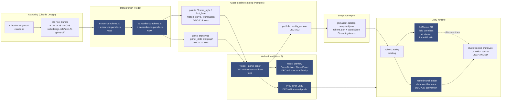

# Game UI Design System — Exploration

> Pre-plan exploration. Question: can **Claude Design** (the claude.ai design tool that produced the web app's design system, transcribed via the CD Pilot Bundle pipeline at `web/design-refs/step-8-console/` + `tools/scripts/extract-cd-tokens.ts` + `tools/scripts/transcribe-cd-tokens.ts`) author a tokenized design system for the **in-game Unity UI** (HUD, toolbar, panels, buttons), and can its output integrate with the **asset-pipeline catalog** (`docs/asset-pipeline-architecture.md` Wave 3 admin UI + DEC-A6 / DEC-A14 / DEC-A27 / DEC-A28 / DEC-A44 / DEC-A45) so the same web tools that author sprites also author UI tokens + panels?
>
> Companion to `docs/ui-polish-exploration.md` (which already plans an in-Unity primitive ring via `UiTheme` SO + ThemedPrimitive + StudioControl + JuiceLayer per Approach E). **Conflict-of-authority pre-flagged** — see §Conflict with UI Polish bucket.

---

## Problem

Web app design system worked: Claude Design produced a console-aesthetic prototype, CD Pilot Bundle pipeline transcribed it into `web/lib/tokens/palette.json` + `web/app/globals.css` `@theme` `ds-*` block + React component lib, and Claude Code finished the integration. Result: high coherence, single source for type / spacing / motion / palette, fast iteration.

In-game UI does not have parity:

- `Assets/Scripts/Managers/GameManagers/UiTheme.cs` is a flat ScriptableObject with hand-curated fields (button colors, surface tiers, font sizes, accent ladder, modal dimmer, spacing unit). No external authoring loop — every token edit happens in Unity Inspector by a developer.
- HUD construction is procedural in `UIManager.Theme.cs` (935 lines of tint / build / chrome / divider code). No catalog-driven panel composition — every screen is bespoke C#.
- `docs/ui-polish-exploration.md` Approach E plans Unity-side primitives (`ThemedPrimitive`, `StudioControl`, `JuiceLayer`) but still authoring inside Unity. No prototyping path that lives outside Unity.
- Asset pipeline already models token kinds (DEC-A14: `palette` / `frame_style` / `font_face` / `motion_curve` / `illumination`) and panel composition (DEC-A27: slot-based archetype-driven children) — but the editing UI for those kinds is unbuilt (Wave 3, Stages 30–33). Tokens have no upstream authoring loop.
- No "design in browser, preview, push to Unity" loop for game UI. Every visual iteration costs a Unity domain reload.

**Goal.** Establish whether Claude Design can be the upstream authoring surface for game UI tokens + panel layouts, transcribed into asset-pipeline catalog rows (palette / frame_style / font_face / motion_curve / illumination + panel archetype + panel_child slot graph), pushed to Unity via the existing snapshot path (DEC-A22 + DEC-A28 manual preview), and consumed by `UiTheme` SO + `ThemedPanel` + StudioControl primitives. If yes, this exploration becomes a master plan; if no, web app design system stays web-only and `UiTheme` stays Unity-Inspector-driven.

## Feasibility analysis

**Verdict: HIGH feasibility.** Three converging signals:

1. **CD Pilot Bundle precedent works.** `web/design-refs/step-8-console/` (HTML+JSX+CSS prototype from Claude Design) → `tools/scripts/extract-cd-tokens.ts` + `transcribe-cd-tokens.ts` → `web/lib/tokens/*.json` + `web/app/globals.css` ds-* block → React consumes. Exact same pipeline shape applies to game UI: Claude Design output → transcription → catalog rows → snapshot → Unity. Pipeline is generic over output target.
2. **Catalog already models every token kind + panel composition.** DEC-A14 declares `palette_detail` + `frame_style_detail` (9-slice + vector + state variants) + `font_face_detail` (size scale + weight + fallback) + `motion_curve_detail` (easing + duration + spring/cubic params) + `illumination_detail` (glow color + pulse rate + falloff). DEC-A27 declares `panel_child` slot graph with `accepts[]` validation, version-pinned at publish. DEC-A6 commits to "Catalog-authority tokens + structural-fidelity preview — Web React lib `<GameButton>` / `<GamePanel>` consumes tokens via web API; Unity consumes same tokens via snapshot. One contract." Catalog is the natural target — already designed for this.
3. **Snapshot + bridge already exist.** `Assets/StreamingAssets/catalog/grid-asset-catalog-snapshot.json` flows from DB (DEC-A22). `mcp__territory-ia__unity_bridge_command catalog_preview_load` (DEC-A28) handles ephemeral preview push. Token edits already ripple through publish (DEC-A44). No new transport needed.

**Constraints flagged (not blockers):**

- Claude Design outputs **web artefacts** (React/HTML/CSS). uGUI does not natively render CSS box-shadow, backdrop-filter, gradient stops, or text-stroke. Transcription must translate to Unity equivalents (Image components + materials + layered prefabs + RectTransform anchors). This is the **structural-fidelity** part of DEC-A6 — web preview is approximate, Unity is final.
- Claude Design works best on **stateless visual surfaces**. Studio-rack interactives (Knob drag-to-rotate, VU needle ballistics, oscilloscope rolling trace) are behavior-heavy — Claude Design can author the LOOK (hue, gradient, frame) but not the FEEL (animation curves, signal binding). Behavior stays in `StudioControl` C# code per UI Polish exploration.
- Game UI must integrate with live data sources (money, happiness, signals). Tokens + layouts are static; binding is runtime. Authoring loop produces shells; runtime wiring stays in C#.

## Conflict with UI Polish bucket

`docs/ui-polish-exploration.md` (Approach E) already plans full in-Unity primitive ring authoring:

- **Token ring** — extend `UiTheme.cs` SO with studio-rack tokens + motion block (LED hues, VU gradient stops, knob detent color, oscilloscope trace, sparkle palette, easing curves)
- **Primitive ring** — `ThemedPrimitive` family (Panel / Button / Tab / Tooltip / Slider / Toggle / Label / List / Icon / OverlayToggleRow) + `StudioControl` family (Knob / Fader / LED / VUMeter / Oscilloscope / IlluminatedButton / SegmentedReadout / DetentRing)
- **Juice ring** — `JuiceLayer` MonoBehaviour + tween / particle helpers, all token-driven

Two authoring authorities for the same token surface = drift risk. Three resolution lanes (decision needed — see Pending decisions §Q2):

- **Lane R1 — Replace.** Claude Design + catalog tokens become the sole authoring surface. `UiTheme.cs` SO becomes a runtime cache populated from snapshot at startup; no Inspector-edit path. UI Polish bucket Token ring step retired.
- **Lane R2 — Complement (skin layer).** UI Polish ships `UiTheme` SO + primitives in Unity as the **structural** layer. Claude Design + catalog tokens become a **skin** layer that overrides `UiTheme` field values at startup via snapshot. Inspector still works for dev tweaks; catalog wins at runtime when published.
- **Lane R3 — Sequence.** UI Polish bucket ships first (Inspector-only authoring). Game UI design system bucket ships later (Wave 3+) and migrates `UiTheme` consumers to catalog snapshot. Two-step path with explicit migration stage.

This conflict is the most important question this doc must resolve before becoming a master plan.

## Approaches surveyed

- **Approach 1 — Tokens-only.** Claude Design authors PALETTE / FRAME / FONT / MOTION / ILLUMINATION tokens only. Catalog stores them as DEC-A14 rows. Unity `UiTheme` SO populated from snapshot at startup. Panel layouts + primitive composition stay in Unity (per UI Polish bucket). Smallest scope; lowest authoring leverage; sidesteps slot graph complexity. Web preview = swatch grid + sample button card.
- **Approach 2 — Tokens + flat panels.** Adds DEC-A27 panel archetype + `panel_child` slot graph for **flat panels only** (HUD bar, toolbar row, info panel header). Claude Design authors panel layouts; transcription produces archetype + panel_child rows; Unity binder instantiates `ThemedPanel` prefab + mounts children into named slots (convention-over-config wiring per DEC-A27). Studio-rack interactives stay code-only. Web preview = structural-fidelity rendering of the panel tree.
- **Approach 3 — Tokens + flat panels + primitive skin layer.** Adds Lane R2 from §Conflict — Claude Design output skins UI Polish's `ThemedPrimitive` family at startup. Token edits ripple via DEC-A44 publish to live editor (and to runtime if `enableLiveSkin` flag set). Highest design-iteration velocity; most coupling between buckets; needs Lane R2 chosen in §Q2.
- **Approach 4 — Full game UI authoring.** Tokens + panels + interactive widget definitions (Knob detent count, Fader range, VU ballistics constants, Oscilloscope sample rate). Claude Design becomes upstream for studio-rack interactive shape too — only behavior code stays in C#. Most ambitious; depends on schema extension to catalog (new `studio_control_detail` kind not in DEC-A14). Schema-forward but not free.
- **Approach 5 — CD Pilot Bundle parity, no catalog integration.** Skip catalog entirely. Claude Design output transcribed straight into `UiTheme.cs` SO field updates + Unity prefab edits via a dedicated transcription script. Mirrors web pipeline exactly but bypasses asset-pipeline architecture. No publish flow, no version pinning, no ripple, no snapshot. Fast to prototype; orphan from the rest of the pipeline; not master-plan-shaped.

## Recommendation

**Approach 4 — Full game UI authoring** with **Lane R1 (Replace)**. UI Polish bucket retires entirely; this bucket subsumes Token ring + Primitive ring + Juice ring + screen migrations into one mega-bucket. Catalog is the single source of truth for visual values + panel composition + studio-rack interactive specs. `UiTheme.cs` SO becomes a runtime cache populated from snapshot at startup (Q8 startup-only). Procedural HUD construction in `UIManager.Theme.cs` (935 lines) migrates to catalog-authored panels in this bucket (Q9 same-bucket full migration). Bucket ships before UI Polish bucket would have shipped (Q5 — UI Polish retires).

## Architecture sketch

**Authoring loop.** Designer iterates in Claude Design (browser). Exports CD Pilot Bundle to `web/design-refs/step-N-game-ui/`. Runs `npm run transcribe:game-ui`. Transcription writes catalog rows (token + panel + slot graph). Web admin shows tokens + structural-fidelity preview + Preview-in-Unity button. Publish → snapshot → Unity reads on next domain reload (or on bridge `catalog_preview_load` for ephemeral preview).

**Runtime path.** Unity startup: `TokenCatalog.Load()` reads snapshot → `UiTheme` SO field overrides applied (Lane R2 skin) → `ApplyTheme` broadcasts to all `IThemed` consumers (per UI Polish bucket Approach E). `ThemedPanel` binder reads `panel_child` slot graph at panel instantiation, mounts children into named transforms (DEC-A27 convention).

**Boundary contract.**

| Owns | Owner |
| --- | --- |
| Token visual values (palette / frame / font / motion / illumination) | Catalog (this bucket) |
| Panel layout + slot graph + child references | Catalog (this bucket) |
| `UiTheme` SO schema + Unity `IThemed` broadcast contract | UI Polish bucket |
| `ThemedPrimitive` family code + StudioControl interactives | UI Polish bucket |
| `JuiceLayer` motion code | UI Polish bucket |
| `ThemedPanel` slot-mount binder code | NEW — this bucket (consumes UI Polish primitives) |
| `TokenCatalog` snapshot-read code | Asset pipeline (existing) |
| Web admin token + panel editor UI | Wave 3 admin (Stages 30–33) — this bucket extends |
| Live data binding (signal sources, money, happiness) | UI Polish bucket / CityStats bucket |

## Subsystem impact (preview)

| Subsystem | Nature | Breaking vs additive |
| --- | --- | --- |
| `tools/scripts/extract-cd-tokens.ts` + `transcribe-cd-tokens.ts` | Generalize to game-ui target (or fork as `*-game-ui.ts` siblings) | Additive |
| Catalog DDL — DEC-A14 token detail tables | Materialize the five token detail tables (currently designed, not all migrated) | Additive |
| Catalog DDL — DEC-A27 `panel_child` table | Materialize panel slot graph table | Additive |
| Web admin (Next.js, `web/app/admin/catalog/`) | New editors per token kind (DEC-A45 schema-driven form) + panel editor with slot columns | Additive |
| Web React lib `<GameButton>` / `<GamePanel>` | New components, consume catalog tokens via web API | Additive |
| MCP `catalog_*` tools | New tool variants for token + panel kinds (already partially shaped — see `mcp__territory-ia__catalog_*`) | Additive |
| Snapshot export | Add `tokens.json` + `panels.json` sections | Additive |
| Unity `TokenCatalog` | Extend snapshot-read to populate token kinds | Additive |
| Unity `UiTheme.cs` SO | Add `[SerializeField] private bool _allowCatalogOverride = true` + startup override path; existing Inspector edits still work as defaults | Additive (Lane R2) |
| Unity `ThemedPanel` slot binder | New code under `Assets/Scripts/UI/Themed/ThemedPanel.cs` — reads `panel_child` graph, mounts children by name | Additive |
| `UIManager.Theme.cs` procedural HUD construction | Migrated to catalog-authored panels per DEC-A27 — major refactor of the 935-line file | **Breaking** — staged migration required |
| `ia/specs/ui-design-system.md` | Becomes downstream consumer of catalog token contract; spec sections for tokens point at catalog kinds | Additive (spec rewrite) |
| Glossary | New rows: `Game UI design system`, `CD Pilot Bundle (game UI)`, `panel slot graph`, `token catalog skin layer` | Additive |

## Integration with asset-pipeline architecture

- **Wave 3 admin UI (Stages 30–33).** This bucket extends Wave 3 with token + panel editors. DEC-A45 schema-driven form generation reused. No new framework — same Next.js app, same MCP catalog tools.
- **DEC-A6 commitment satisfied.** "Web React lib + Unity consume same tokens via snapshot. One contract." This bucket is the implementation of DEC-A6.
- **DEC-A14 token kinds materialized.** Five detail tables migrated; `token_meta` view exposed; per-kind editors built.
- **DEC-A27 panel composition exercised.** First real consumer of `panel_child` slot graph (sprites + buttons already exist; panels are next).
- **DEC-A28 Preview-in-Unity reused.** Token edit → manual push → bridge handler renders panel in `PreviewScene` → screenshot returned. No new bridge transport.
- **DEC-A44 publish ripples.** Token edit → publish → snapshot rebuild → Unity domain-reload picks up. No re-publish of consuming buttons / panels needed.

## Decisions resolved

All 17 polling decisions resolved 2026-04-27. Master-plan-new gate cleared.

| # | Decision | Resolution |
| --- | --- | --- |
| Q1 | Scope | **Full game UI** — HUD + toolbar + info panels + pause + settings + save-load + onboarding + tooltips + glossary + new-game setup. |
| Q2 | Authority lane vs UI Polish | **R1 Replace** — catalog tokens are sole authoring surface; UI Polish bucket retires entirely (per Q11). |
| Q3 | Integration target | **Catalog DB authoritative** — transcription writes catalog rows; `UiTheme` SO populated from snapshot at startup. Single source of truth via DEC-A22 publish + DEC-A44 ripple. |
| Q4 | Component contract | **Tokens + panels + interactive specs** — schema-extends DEC-A14 with new per-control kinds (Q12). |
| Q5 | Sequencing vs UI Polish | **Before UI Polish** — UI Polish bucket retires; this bucket subsumes it (Q11). |
| Q6 | Visual style | **Inherit web studio-rack look** — game UI mirrors `web/design-refs/step-8-console/` console aesthetic. Brand coherence between web app + in-game UI. |
| Q7 | Studio-rack interactive authority | Covered by Q4 — schema extension; Claude Design authors detent counts, VU ranges, etc. Behavior code stays in StudioControl C# (per Q11 Primitive ring inside this bucket). |
| Q8 | `UiTheme` SO override semantics | **Startup-only** — `TokenCatalog.Load()` reads snapshot at boot, overwrites `UiTheme` SO fields in memory. Inspector edits in Editor still work as defaults until next boot. No runtime live override. |
| Q9 | Procedural HUD migration | **Same bucket — full migration** — replace 935-line `UIManager.Theme.cs` procedural construction with catalog DEC-A27 panel + slot graph rows. |
| Q10 | Master plan slug | **`game-ui-design-system`** — DB-backed `ia_master_plans` row (slug). Render via `mcp__territory-ia__master_plan_render({slug: "game-ui-design-system"})`. No filesystem `.md` master-plan file. |
| Q11 | UI Polish bucket relationship | **Subsume both Primitive ring + Juice ring** — this bucket owns tokens + panels + interactive specs + ThemedPrimitive C# + StudioControl C# + JuiceLayer C# + screen migrations. UI Polish bucket retires. |
| Q12 | `studio_control_detail` schema | **Per-control kinds** — separate detail tables: `knob_detail` / `fader_detail` / `vu_meter_detail` / `oscilloscope_detail` / `led_detail` / `illuminated_button_detail` / `segmented_readout_detail` / `detent_ring_detail`. Typed integrity per DEC-A14 pattern. |
| Q13 | Stage ordering | **Tokens → panels → interactives → primitives → HUD migration → other screens.** Bottom-up; catalog schema first, Unity consumers build on stable contracts. Late stages parallelize across screens. |
| Q14 | UI Polish doc fate | **Retire — cross-reference only.** Add retirement banner to `docs/ui-polish-exploration.md` pointing at this exploration. CityStats handoff contract migrates verbatim (per Q17). Original preserved for history. |
| Q15 | CD Pilot Bundle structure | **One mega-bundle covering all screens** — single `web/design-refs/step-N-game-ui/` bundle (token sheet + every panel + every studio-rack interactive). One Claude Design session per bundle revision. |
| Q16 | Web preview fidelity bar | **Structural fidelity only** per DEC-A6 — correct frame + palette + font + layout + slot binding. NO shader glow, NO real-time IlluminatedButton effects, NO VU needle ballistics animation. Cards labelled "approximate — Unity is final". |
| Q17 | CityStats handoff contract | **Carry over verbatim** — migrate UI Polish exploration §CityStats handoff into this exploration's Design Expansion. Same primitive list + IThemed + IStudioControl contracts + boundary clarifier. |

---

_Next step._ Run `/master-plan-new docs/game-ui-design-system-exploration.md` to author the `game-ui-design-system` orchestrator (DB-backed `ia_master_plans` + `ia_stages` rows via `master_plan_insert` / `stage_insert` MCP) with stages decomposed per Q13 ordering. Skip `/design-explore` — Design Expansion block already persisted below. Render after authoring via `mcp__territory-ia__master_plan_render({slug: "game-ui-design-system"})`.

---

## Design Expansion

### Chosen Approach

**Approach 4 — Full game UI authoring + Lane R1 Replace + Catalog DB authoritative.** Mega-bucket. Catalog is the single source of truth for visual values + panel composition + studio-rack interactive specs. Claude Design authors via CD Pilot Bundle (one mega-bundle per revision); transcription writes catalog rows; web admin (Wave 3 + this bucket's extensions) edits + previews structurally; publish + snapshot flow to Unity; `UiTheme` SO becomes a runtime cache populated from snapshot at startup; `ThemedPanel` binder mounts children into named slots per DEC-A27; StudioControl primitives consume per-control detail rows (knob_detail / vu_meter_detail / etc.). Procedural HUD construction in `UIManager.Theme.cs` migrates to catalog-authored panels in this bucket. UI Polish bucket retires; its primitives + juice helpers + CityStats handoff contract land here.

Five concentric rings (Q13 ordering = Tokens → panels → interactives → primitives → HUD migration → other screens):

1. **Token ring (Catalog).** Materialize DEC-A14 token detail tables: `palette_detail` / `frame_style_detail` / `font_face_detail` / `motion_curve_detail` / `illumination_detail`. CD Pilot Bundle authors initial values + every subsequent token revision. Web admin provides per-kind editor (DEC-A45 schema-driven form). `token_meta` view exposes cross-kind read.
2. **Panel ring (Catalog).** Materialize DEC-A27 `panel_child` slot graph. Author panel archetypes (HUD bar, toolbar, info panel, modal, list row, status row, button cluster, overlay toggle row). Web admin renders one column per declared slot. Validation on save (slot accepts[], child count [min,max], no cycles).
3. **Interactive ring (Catalog).** New per-control detail tables under Q12: `knob_detail` (range, detent count, label, value-to-display curve) / `fader_detail` (orientation, range, track-gradient ref) / `vu_meter_detail` (range, attack/release/hold ms, gradient ref) / `oscilloscope_detail` (sample rate, trace color, sweep ms) / `led_detail` (hue, pulse rate, falloff) / `illuminated_button_detail` (glow color, click-pulse ref) / `segmented_readout_detail` (digit count, font ref, segment color) / `detent_ring_detail` (dot count, dot size, ring radius). Each kind = a `catalog_entity` row + detail. Web admin provides per-kind editor.
4. **Primitive ring (Unity C#).** Author `IThemed` + `IStudioControl` contracts + `ThemedPrimitiveBase` MonoBehaviour + ten `ThemedPrimitive` implementations (Panel / Button / TabBar / Tooltip / Slider / Toggle / Label / List / Icon / OverlayToggleRow) + eight `StudioControl` implementations (Knob / Fader / LED / VUMeter / Oscilloscope / IlluminatedButton / SegmentedReadout / DetentRing). All consume catalog rows via `TokenCatalog`. `ThemeBroadcaster` helper drives `ApplyTheme` broadcast.
5. **Juice ring (Unity C#).** `JuiceLayer` MonoBehaviour + tween / particle / shadow helpers (`TweenCounter`, `PulseOnEvent`, `SparkleBurst`, `ShadowDepth`, `NeedleBallistics`, `OscilloscopeSweep`). All parameterised by motion-curve catalog rows.

After rings: HUD migration (replace `UIManager.Theme.cs` procedural construction with catalog panel instantiation), then other screens (toolbar, info panels, settings, save-load, pause, onboarding, glossary, new-game setup, tooltips, splash).

### CityStats dashboard handoff (carried over verbatim from `docs/ui-polish-exploration.md` per Q17)

Stats dashboard polish is owned by the **CityStats overhaul bucket** (`docs/citystats-overhaul-exploration.md` + DB-backed `citystats-overhaul` master plan — render via `master_plan_render({slug: "citystats-overhaul"})`). This bucket **owns the primitives Stats dashboard consumes**; it does NOT author dashboard layout, chart composition, or data wiring.

**Contracts this exploration exports to CityStats team:**

| Contract | Surface | Shape |
|---|---|---|
| Token catalog rows | `palette` / `frame_style` / `font_face` / `motion_curve` / `illumination` detail tables (DEC-A14) | Dashboard surface tiers, graph gridline alpha, series accent ladder, heatmap gradient stops, chart label sizes, sparkle / pulse tokens — all authored as catalog rows; CityStats consumes via snapshot |
| `IThemed` repaint interface | Code contract under `Assets/Scripts/UI/IThemed.cs` | Every primitive + StudioControl + future dashboard widget implements; single `ApplyTheme(UiTheme)` entry |
| `IStudioControl` value binding | Code contract under `Assets/Scripts/UI/IStudioControl.cs` | `float Value`, `Vector2 Range`, `AnimationCurve ValueToDisplay`, `void BindSignalSource(Func<float>)` — lets CityStats bind facade getters to knob / fader / VU / oscilloscope primitives without reimplementing animation |
| StudioControl primitive family | `Assets/Scripts/UI/StudioControls/*` | Knob, Fader, LED, VUMeter, Oscilloscope, IlluminatedButton, SegmentedReadout, DetentRing — dashboard consumes via prefab instantiation + `BindSignalSource(() => facade.GetScalar(metric))`. Visual values driven by per-control catalog detail rows (Q12) |
| JuiceLayer helpers | `Assets/Scripts/UI/Juice/*` | `TweenCounter`, `PulseOnEvent`, `SparkleBurst`, `ShadowDepth`, `NeedleBallistics`, `OscilloscopeSweep` — dashboard consumes for animated transitions, alert pulses, chart entry animations |
| Animation token contract | `motion_curve_detail` rows | Easing curves + durations named semantically (`moneyTick`, `alertPulse`, `needleAttack`, `needleRelease`) so dashboard doesn't invent per-widget timings |

**Coordination rules.** CityStats dashboard work starts AFTER this bucket's Stage 1 (token ring) + Stage 2 (panel ring) + Stage 3 (interactive ring) + Stage 4 (primitive ring) + Stage 5 (juice ring) land. Dashboard LAYOUT, CHART TYPES, DATA BINDING live in CityStats master plan. Dashboard STYLING + ANIMATION + INTERACTIVE PRIMITIVES inherit from this catalog. CityStats master plan must reference this exploration's primitive list + catalog kinds under its Dashboard step.

**Boundary clarifier.** If a question is "how does a knob look / animate / feel?" → this bucket. If a question is "what data feeds the knob / which metric / which scale?" → CityStats. If a question is "where on the dashboard does the knob sit / which tab / which group?" → CityStats. No primitive authoring drifts into CityStats master plan; no dashboard layout drifts into this master plan.

### Architecture

```mermaid
flowchart LR
    subgraph Authoring["Authoring (Claude Design)"]
        CD[Claude Design tool<br/>claude.ai]
        BUNDLE[CD Pilot Bundle MEGA<br/>web/design-refs/step-N-game-ui/<br/>tokens + panels + interactives<br/>Q15]
    end

    subgraph Transcribe["Transcription (Node)"]
        EX[extract-cd-tokens-game.ts]
        EXP[extract-cd-panels-game.ts]
        EXI[extract-cd-interactives-game.ts]
        TR[transcribe-cd-game-ui.ts<br/>writes catalog rows]
    end

    subgraph Catalog["Catalog (Postgres) \u2014 authoritative"]
        TK[Token detail tables<br/>palette / frame_style / font_face<br/>motion_curve / illumination<br/>DEC-A14]
        PA[panel archetype + panel_child<br/>DEC-A27]
        IA[Interactive detail tables<br/>knob / fader / vu_meter / oscilloscope<br/>led / illuminated_button<br/>segmented_readout / detent_ring<br/>NEW Q12]
        PUB[publish + entity_version<br/>DEC-A22]
    end

    subgraph WebTools["Web admin (Wave 3 + extensions)"]
        EDIT[Per-kind editors<br/>DEC-A45 schema-driven form]
        PREV[React preview<br/>structural fidelity only<br/>DEC-A6 + Q16]
        PUSH[Preview in Unity<br/>DEC-A28 manual push]
    end

    subgraph Snapshot["Snapshot export"]
        SS[grid-asset-catalog-snapshot.json<br/>tokens.json + panels.json + interactives.json<br/>StreamingAssets]
    end

    subgraph UnityRing["Unity \u2014 rings 4 + 5"]
        TC[TokenCatalog<br/>snapshot reader]
        UT[UiTheme SO<br/>runtime cache<br/>startup-only override<br/>Q8]
        TP[ThemedPanel binder<br/>slot mount by name]
        TPF[ThemedPrimitive family<br/>10 widgets]
        SC[StudioControl family<br/>8 widgets<br/>per-control detail rows]
        JL[JuiceLayer<br/>tween / particle / shadow]
    end

    subgraph Screens["Screens (full migration \u2014 Q9)"]
        HUD[HUD bar<br/>migrated from UIManager.Theme.cs]
        TB[Toolbar + overlay row]
        INFO[Info panels]
        PAUSE[Pause / Settings / Save-Load]
        ONB[Onboarding / Glossary / Tooltips]
        NG[New-game setup + Splash]
    end

    CD --> BUNDLE --> EX
    BUNDLE --> EXP
    BUNDLE --> EXI
    EX --> TR
    EXP --> TR
    EXI --> TR
    TR --> TK
    TR --> PA
    TR --> IA
    TK --> EDIT
    PA --> EDIT
    IA --> EDIT
    EDIT --> PREV
    EDIT --> PUSH
    PUSH --> UnityRing
    EDIT --> PUB --> SS
    SS --> TC
    TC --> UT
    TC --> TP
    TC --> SC
    UT -.applies.-> TPF
    UT -.applies.-> SC
    TPF --> Screens
    SC --> Screens
    JL --> Screens
    TP --> Screens

    classDef new fill:#3a5080,stroke:#fff,color:#fff
    class EX,EXP,EXI,TR,IA,EDIT,PREV,UT,TP,TPF,SC,JL new
```

**Authoring loop.** Designer iterates in Claude Design (browser). Exports CD Pilot Bundle to `web/design-refs/step-N-game-ui/`. Runs `npm run transcribe:game-ui`. Transcription writes token rows + panel archetype + panel_child slot graph + interactive detail rows. Web admin shows per-kind editors + structural-fidelity preview + Preview-in-Unity button. Publish → snapshot → Unity reads on next domain reload.

**Runtime path.** Unity startup: `TokenCatalog.Load()` reads snapshot → populates `UiTheme` SO field cache (Q8 startup-only) → `ThemeBroadcaster.BroadcastAll()` → every `IThemed` consumer receives `ApplyTheme(UiTheme)`. `ThemedPanel` binder reads `panel_child` slot graph at panel instantiation, mounts children into named transforms per DEC-A27 convention. StudioControls additionally read per-control detail row (knob_detail.detentCount, vu_meter_detail.attackMs, etc.) at `Awake`. Live data binding via `BindSignalSource(Func<float>)` happens screen-side once.

### Subsystem Impact

| Subsystem | Nature | Invariants flagged | Breaking vs additive | Mitigation |
| --- | --- | --- | --- | --- |
| `tools/scripts/extract-cd-tokens.ts` + `transcribe-cd-tokens.ts` | Fork as `*-game-ui.ts` siblings; share extraction primitives | — | Additive | New scripts; existing web pipeline untouched |
| Catalog DDL — DEC-A14 token detail tables | Materialize five token detail tables (currently designed in DEC-A14, not all migrated) | — | Additive (new tables) | Migration `00XX_catalog_token_kinds.sql` |
| Catalog DDL — DEC-A27 `panel_child` table | Materialize panel slot graph table | — | Additive | Migration `00XX_panel_child.sql` |
| Catalog DDL — Q12 interactive detail tables | Eight new per-control detail tables (knob / fader / vu_meter / oscilloscope / led / illuminated_button / segmented_readout / detent_ring) + matching `kind` enum entries | — | Additive | Migration `00XX_studio_control_kinds.sql`; updates `kind` CHECK constraint |
| Web admin (`web/app/admin/catalog/`) | New editors per token kind + panel editor with slot columns + per-interactive editors. DEC-A45 schema-driven form covers all | — | Additive | New routes; existing sprite/asset/button/panel admin untouched |
| Web React lib `<GameButton>` / `<GamePanel>` / `<GameKnob>` / `<GameVUMeter>` / etc. | New components, consume catalog tokens via web API. Structural fidelity only per Q16 | — | Additive | New `web/components/game-ui/*` |
| MCP `catalog_*` tools | Extend with new kinds (palette / frame_style / font_face / motion_curve / illumination / panel / knob / fader / vu_meter / oscilloscope / led / illuminated_button / segmented_readout / detent_ring) | — | Additive — existing tool variants untouched | Per-kind tool registration following existing pattern |
| Snapshot export | Add `tokens.json` + `panels.json` + `interactives.json` sections | — | Additive | Snapshot version bump; loader handles missing sections gracefully |
| Unity `TokenCatalog` (existing) | Extend snapshot-read to populate token + interactive kinds; new accessor methods (`GetPalette(slug)`, `GetKnobDetail(slug)`, etc.) | #3 cache refs in `Awake`, #4 no new singletons (TokenCatalog already exists) | Additive | New methods only; existing accessors unchanged |
| Unity `UiTheme.cs` SO | Becomes runtime cache. Add `ApplyFromCatalog(TokenCatalog)` method called once at startup. Inspector defaults preserved | — | Additive — existing fields kept, new override path | Default fields keep working in playmode without snapshot; production flow overrides at startup |
| Unity `ThemedPanel` slot binder (NEW) | Reads `panel_child` graph, mounts children into named transforms by name (convention-over-config per DEC-A27) | #3 (cache references in `Awake`), #4 (MonoBehaviour, no singleton) | Additive | New file under `Assets/Scripts/UI/Themed/ThemedPanel.cs` |
| Unity `ThemedPrimitive` family (NEW — from UI Polish ring 2) | 10 MonoBehaviours: Panel / Button / TabBar / Tooltip / Slider / Toggle / Label / List / Icon / OverlayToggleRow. All implement `IThemed` | #3, #4 | Additive | New files under `Assets/Scripts/UI/Primitives/*` |
| Unity `StudioControl` family (NEW — from UI Polish ring 2) | 8 MonoBehaviours: Knob / Fader / LED / VUMeter / Oscilloscope / IlluminatedButton / SegmentedReadout / DetentRing. All implement `IThemed` + `IStudioControl`. Each reads per-control detail row at `Awake` | #3 (cache theme + signal source in `Awake`/`OnEnable`; `Update` reads cached delegate only), #4 | Additive | New files under `Assets/Scripts/UI/StudioControls/*`; prefabs under `Assets/UI/Prefabs/StudioControls/*` |
| Unity `JuiceLayer` (NEW — from UI Polish ring 3) | Scene MonoBehaviour + 6 helpers: TweenCounter / PulseOnEvent / SparkleBurst / ShadowDepth / NeedleBallistics / OscilloscopeSweep. All token-driven | #3 (no per-frame reflection), #4 (scene component, Inspector-wired) | Additive | New files under `Assets/Scripts/UI/Juice/*` |
| `UIManager.Theme.cs` (935 lines) | Migrated to catalog-authored panels. Procedural `TintPanelRootBehindReference`, `Fe50GridCoordinatesChrome`, demand gauges, tax dividers replaced with `ThemedPanel` instantiation + slot mount | #3, #6 (don't bloat UIManager — extract migration into separate partial files where possible) | **Breaking** — staged migration | Migration runs in late stages (HUD migration ring) once primitives + screens land |
| `UIManager.cs` partials | Add `UIManager.ThemeBroadcast.cs` partial with single `ThemeBroadcaster.BroadcastAll()` call in `Start`. No other partial changes | #6 | Additive partial file | New partial; existing partials untouched |
| `MainMenuController` + `GameNotificationManager` + `CameraController` + `MiniMapController` | Existing consumers — receive `ApplyTheme` for chrome they own; toast prefab updates to ThemedPrimitive shape | #4 carve-out (existing singletons, not new) | Additive | One `IThemed` impl each; no behavioral change |
| `OverlayRenderer` (Bucket 2) | Overlay toggle UI in toolbar consumes StudioControl IlluminatedButton + LED row; signal scalars feed LED intensity via `IStudioControl.BindSignalSource` | — | Additive — toolbar row replaces ad-hoc toggles | Bucket 2 signal fields feed via existing facade |
| `ia/specs/ui-design-system.md` | Becomes downstream consumer of catalog token contract; spec sections for tokens point at catalog kinds + per-kind detail tables | Spec consistency rule | Additive (spec rewrite — section reorganization) | Spec updated in Stage 1 close |
| Glossary | New rows: `Game UI design system`, `CD Pilot Bundle (game UI)`, `panel slot graph`, `studio control catalog kind`, `Token catalog skin (deprecated wording — runtime cache)`, `Knob detail`, `Fader detail`, `VU meter detail`, `Oscilloscope detail`, `LED detail`, `Illuminated button detail`, `Segmented readout detail`, `Detent ring detail` | Terminology consistency | Additive | Glossary edit triggers `npm run generate:ia-indexes` |

**Invariants flagged.** #3 (no per-frame `FindObjectOfType`) across every new controller + theme broadcaster + StudioControl signal source binding; #4 (no new singletons — `JuiceLayer`, `ThemeBroadcaster`, `ThemedPanel` are scene components or per-instance MonoBehaviours; `TokenCatalog` is existing); #6 (don't bloat `UIManager` — only single broadcast call added; HUD migration extracts work into partial files where logic grows).

**Specs unavailable via MCP:** none — all referenced specs (`ui-design-system`, `asset-pipeline-architecture`, glossary) sliced cleanly via MCP `spec_section`.

### Implementation Points

Phased per Q13 ordering. Stage decomposition target: ~5 stages × 3–4 tasks each (large bucket; `/master-plan-new` will fine-tune cardinality).

**Stage 1 — Token ring (Catalog)**

- [ ] Migration `0XXX_catalog_token_kinds.sql` — `palette_detail` / `frame_style_detail` / `font_face_detail` / `motion_curve_detail` / `illumination_detail` + `kind` enum entries + `token_meta` view
- [ ] MCP `catalog_*` tool extension — per-kind get/list/upsert variants for token kinds
- [ ] CD Pilot Bundle scaffold under `web/design-refs/step-N-game-ui/` — token sheet section
- [ ] `tools/scripts/extract-cd-tokens-game.ts` + `transcribe-cd-game-ui.ts` (token portion) — extracts CSS variables / palette JSON / motion curves from bundle into catalog row payloads
- [ ] Web admin per-kind editor for tokens (DEC-A45 schema-driven form)
- [ ] Snapshot export `tokens.json` section
- [ ] Unity `TokenCatalog.GetPalette(slug)` / `GetFrameStyle(slug)` / etc. accessors
- [ ] Spec: rewrite `ia/specs/ui-design-system.md` §1 (tokens) to reference catalog kinds
- [ ] Glossary rows for token kinds

**Stage 2 — Panel ring (Catalog + DEC-A27 slot graph)**

- [ ] Migration `0XXX_panel_child.sql` — `panel_child` table + slot validation
- [ ] CD Pilot Bundle panel section — HTML+JSX panels with named slot wrappers (data-slot="header"/"body"/"footer")
- [ ] `extract-cd-panels-game.ts` — walks slot wrappers, produces panel archetype + panel_child rows
- [ ] Web admin panel editor — column per slot, child picker filtered by `accepts[]`
- [ ] React `<GamePanel>` component — structural fidelity preview per Q16 / DEC-A6
- [ ] Snapshot export `panels.json` section
- [ ] Unity `ThemedPanel.cs` binder — reads slot graph at instantiation, mounts children by name
- [ ] DEC-A28 Preview-in-Unity wiring for panel preview

**Stage 3 — Interactive ring (Catalog + per-control detail tables)**

- [ ] Migration `0XXX_studio_control_kinds.sql` — eight new detail tables per Q12: `knob_detail` / `fader_detail` / `vu_meter_detail` / `oscilloscope_detail` / `led_detail` / `illuminated_button_detail` / `segmented_readout_detail` / `detent_ring_detail` + `kind` enum + cross-kind `interactive_meta` view
- [ ] MCP `catalog_*` per-kind variants for interactives
- [ ] CD Pilot Bundle interactive section — JSX components with data attributes carrying detent counts, ranges, ballistics ms, etc.
- [ ] `extract-cd-interactives-game.ts` — extracts per-control specs into catalog row payloads
- [ ] Web admin per-kind editors for interactives (DEC-A45 schema-driven)
- [ ] React preview per interactive — structural snapshot only (Q16): static representation, no real-time animation
- [ ] Snapshot export `interactives.json` section
- [ ] Unity `TokenCatalog.GetKnobDetail(slug)` / `GetVUMeterDetail(slug)` / etc. accessors

**Stage 4 — Primitive ring (Unity C#)**

- [ ] `IThemed` interface — `void ApplyTheme(UiTheme)`
- [ ] `IStudioControl` interface — `float Value` / `Vector2 Range` / `AnimationCurve ValueToDisplay` / `BindSignalSource(Func<float>)` / `Unbind()`
- [ ] `ThemedPrimitiveBase : MonoBehaviour, IThemed` — `Awake`-cached theme, `FindObjectOfType` fallback (Editor only)
- [ ] `StudioControlBase : ThemedPrimitiveBase, IStudioControl` — caches signal source delegate
- [ ] `ThemedPrimitive` implementations: ThemedPanel, ThemedButton, ThemedTabBar, ThemedTooltip, ThemedSlider, ThemedToggle, ThemedLabel, ThemedList, ThemedIcon, ThemedOverlayToggleRow
- [ ] `StudioControl` implementations: Knob, Fader, LED, VUMeter, Oscilloscope, IlluminatedButton, SegmentedReadout, DetentRing — each reads per-control detail row in `Awake`
- [ ] Prefabs under `Assets/UI/Prefabs/Primitives/*` + `Assets/UI/Prefabs/StudioControls/*`
- [ ] `ThemeBroadcaster` scene MonoBehaviour
- [ ] `UIManager.ThemeBroadcast.cs` partial — single `BroadcastAll()` call in `Start`
- [ ] `UiTheme.ApplyFromCatalog(TokenCatalog)` startup-only (Q8) override path
- [ ] Unit coverage — token swap repaints all primitives; signal binding updates StudioControl in `Update` without allocations

**Stage 5 — Juice ring (Unity C#)**

- [ ] `JuiceLayer` scene MonoBehaviour — Inspector-wired from `UIManager`
- [ ] Helpers: `TweenCounter`, `PulseOnEvent`, `SparkleBurst`, `ShadowDepth`, `NeedleBallistics`, `OscilloscopeSweep`
- [ ] All helpers parameterised by `motion_curve_detail` rows — no hard-coded durations
- [ ] Allocation-free `Update` paths (pool tween state, reuse particle buffers)
- [ ] Unit coverage — helper repaints + motion token swap retunes live

**Stage 6 — HUD migration (replaces `UIManager.Theme.cs` procedural construction)**

- [ ] Author HUD bar panel archetype + slot graph in CD Pilot Bundle (money / pop / date / happiness / speed / scale indicator slots)
- [ ] Author HUD interactives via Stage 3 per-control kinds (money = SegmentedReadout, happiness = VUMeter, speed = IlluminatedButton cluster, scale = LED row)
- [ ] Migrate `UIManager.Theme.cs` HUD construction sites — remove `TintPanelRootBehindReference` calls; instantiate ThemedPanel from catalog instead
- [ ] Migrate `Fe50GridCoordinatesChrome` construction to catalog panel
- [ ] Migrate demand gauges to VUMeter primitives
- [ ] Migrate tax panel dividers to ThemedPanel slot graph
- [ ] Resolve BUG-14 (per-frame `FindObjectOfType`) as part of cached-ref rewrite
- [ ] Resolve TECH-72 (HUD / uGUI scene hygiene) as part of prefab catalog migration

**Stage 7 — Toolbar + overlay screen migration**

- [ ] Toolbar rows → ThemedPanel + IlluminatedButton clusters from catalog
- [ ] Overlay toggle row → ThemedOverlayToggleRow per signal (pollution / crime / traffic / happiness / zone / desirability) with LED active-state
- [ ] Bucket 2 signal scalars bound to LED intensity via `IStudioControl.BindSignalSource`

**Stage 8 — Info panels + Pause + Settings + Save-Load + New-game setup screen migration**

- [ ] Info panel archetype (header + tabbed body + footer slots)
- [ ] Pause menu archetype (modal full-screen, Resume / Settings / Save / Load / Main Menu / Quit slot column)
- [ ] Settings panel archetype (tabbed: Audio / Video / Controls / Gameplay)
- [ ] Save-Load slot list archetype (per-slot card with timestamp / city name / pop / thumbnail)
- [ ] New-game setup archetype (param sliders + scenario picker)

**Stage 9 — Onboarding + Glossary + Tooltips + Splash screen migration**

- [ ] Onboarding script overlay archetype (modal + ghost arrow + step tracker)
- [ ] In-game glossary archetype (sidebar list + entry pane)
- [ ] Tooltip archetype (positioned ThemedTooltip per hover target)
- [ ] Loading screen archetype (background image slot + tip rotation slot + progress bar)
- [ ] Splash / title screen archetype (game identity coordination with Bucket 5 sprite assets)

**Stage 10 — CityStats handoff artifacts + bucket close**

- [ ] Publish primitive + StudioControl + JuiceLayer signature catalog as normative section in `ia/specs/ui-design-system.md`
- [ ] Update DB-backed `citystats-overhaul` master plan Dashboard stage acceptance to reference this catalog (via `stage_update` MCP — no filesystem edit)
- [ ] Add glossary rows for any term Stats dashboard will consume that's not already in §Subsystem Impact glossary list
- [ ] Notify: bucket close handoff message to CityStats master plan
- [ ] Retire `docs/ui-polish-exploration.md` with cross-reference banner (Q14)

### Examples

**Example 1 — Token mega-bundle revision.** Designer iterates console aesthetic in Claude Design (browser). Exports CD Pilot Bundle to `web/design-refs/step-9-game-ui/` (token sheet + every panel + every interactive). Runs `npm run transcribe:game-ui`. Transcription writes 5 palette rows + 8 frame_style rows + 3 font_face rows + 12 motion_curve rows + 6 illumination rows + 14 panel archetypes + 60 panel_child slot graph rows + 8 knob_detail rows + 4 fader_detail rows + 6 vu_meter_detail rows + ... etc. Web admin shows updated tokens + structural-fidelity preview cards. Designer publishes. Snapshot rebuilds. Unity domain reload picks up at next play.

**Example 2 — VU meter driven by happiness, end-to-end.** CD Pilot Bundle declares `<GameVUMeter data-slug="hud.happiness" data-range="[0,100]" data-attack-ms="80" data-release-ms="400" data-hold-ms="1200" />`. Transcription writes a `vu_meter_detail` row with those values. Unity `VUMeter.Awake` reads the detail row via `_tokenCatalog.GetVUMeterDetail("hud.happiness")` + caches `_attackMs`, `_releaseMs`, `_holdMs`. `CityStatsUIController.Awake` calls `_meter.BindSignalSource(() => _facade.GetScalar("happiness.cityAverage"))`. `VUMeter.Update` reads `_sourceFn()` once per frame, applies `NeedleBallistics(attack, release, hold)`, renders needle + gradient strip from cached `_themed.GradientStops`. Token edit (designer changes attack 80ms → 60ms): publish → snapshot rebuild → next domain reload reads new `vu_meter_detail` → `Awake` recaches → ballistics retunes globally.

**Example 3 — HUD bar migration.** Stage 6 replaces `UIManager.Theme.cs` procedural construction. Old code: 60 lines of `TintPanelRootBehindReference("StatsPanel", themeRef.surfaceCardHud)` + manual child instantiation. New code: `_uiManager.InstantiateCatalogPanel("hud.bar.main")` — `ThemedPanel` binder reads `panel_child` graph for slug `hud.bar.main`, mounts SegmentedReadout (money), VUMeter (happiness), IlluminatedButton row (speed), LED row (scale) into named slots `money`, `happiness`, `speed`, `scale`. Procedural code removed; visual identical (within Q16 structural fidelity bar); designers edit HUD layout in browser instead of asking developer.

**Example 4 — Aesthetic revision without code change.** Playtester feedback: "console aesthetic feels too dark for outdoor scenarios." Designer opens Claude Design, picks warmer palette, regenerates CD Pilot Bundle. Transcription writes new palette row + new motion_curve rows. Publish → snapshot → next play loads warmer values into `UiTheme` SO. Every screen across the entire game UI repaints (HUD, toolbar, info panels, pause, settings, save-load, onboarding, glossary, tooltips, splash) with no code change. One token row edit, full-game repaint.

### Review Notes

Self-run Phase 8 review against template (no external subagent spawn this pass):

**BLOCKING — resolved inline:**

1. **Bucket scope sprawl.** Q1=Full + Q11=Subsume both makes this the largest planned bucket. Resolved by Q13 ordering enforcing bottom-up dependency flow + 10-stage decomposition plan giving each ring + each screen migration a focused stage. `/master-plan-new` will validate cardinality.
2. **UI Polish bucket retirement coordination.** Resolved by Q14 retirement banner (Stage 10 task) + Q17 verbatim CityStats handoff migration. Original UI Polish exploration preserved for history; no orphan handoff contracts.
3. **Procedural HUD migration risk.** `UIManager.Theme.cs` 935-line refactor is high-risk. Resolved by deferring HUD migration to Stage 6 (after primitives + juice land in Stages 4–5) so migration consumes stable contracts; staged screen-by-screen replacement keeps each task scope bounded.
4. **Schema extension blast radius.** Q12 per-control detail tables = 8 new tables + 8 new `kind` enum entries + 8 new MCP tool variants + 8 new web editors. Resolved by Stage 3 owning the schema landing in one cohesive change; downstream stages consume stable contracts.

**NON-BLOCKING — carried forward:**

- **A.** CD Pilot Bundle authoring quality depends on Claude Design's ability to author 14+ panel archetypes + 8 interactive control specs in one mega-bundle (Q15). If bundle cardinality becomes unmanageable, reconsider Q15 (per-screen bundles) post-Stage 2.
- **B.** Web preview structural fidelity bar (Q16) means designer cannot fully evaluate juice / animation in browser. DEC-A28 Preview-in-Unity push compensates but adds ~5s round-trip per evaluation. Acceptable per DEC-A6 commitment.
- **C.** `OnValidate` repaint broadcast must guard against Editor-only `FindObjectOfType` calls during scene load; use `#if UNITY_EDITOR` gate. Same as UI Polish exploration carry-forward.
- **D.** Allocation budget for `JuiceLayer` particle / tween pools needs profiler validation in `/verify-loop`. Verification concern, not design concern.
- **E.** Bucket 7 (UI SFX hook wiring) wants `IStudioControl` + `IlluminatedButton` to emit UI SFX events on interaction — exposed via optional `ISfxEmitter` interface, NOT wired in this bucket; note for handoff.
- **F.** Web dashboard (`web/app/dashboard`) parity — different stack (Next.js / CSS), out of scope per UI Polish carry-forward. CityStats master plan decides.
- **G.** Q8 startup-only override means designer iteration requires Unity domain reload between publish + see-result. DEC-A28 Preview-in-Unity manual push covers single-entity preview without reload; full-scene refresh still requires reload. Acceptable for MVP; live-override (Q8 option B) deferred post-MVP.
- **H.** Bundle organization for downstream rev iterations — once Stage 1 lands, future bundle revisions only need to change deltas. Pipeline must support partial-bundle transcription (only re-import changed sections) to avoid full-catalog churn per revision.

**SUGGESTIONS:**

- Consider exposing `JuiceLayer` toggle in settings menu as `enableJuice` (accessibility-adjacent — epileptic / motion-sensitive players) even though accessibility is hard-deferred. Primitive allows the hook; no UI required in bucket.
- Consider a developer-only `UiThemeSwitcher` debug widget for playtest variant swaps. Small effort, high feedback value.
- Consider naming the CD Pilot Bundle revision sequence `step-9-game-ui-v1`, `step-9-game-ui-v2` with explicit version suffix so each revision is traceable.

### Expansion metadata

- **Date:** 2026-04-27
- **Model:** claude-opus-4-7
- **Approach selected:** 4 — Full game UI authoring + Lane R1 Replace + Catalog DB authoritative + Subsumes UI Polish bucket entirely
- **Decisions resolved:** 17 (Q1–Q17)
- **Blocking items resolved inline:** 4
- **Non-blocking carried:** 8 (A–H)
- **Stage decomposition target:** ~10 stages × 3–4 tasks each (master-plan-new fine-tunes)
- **Predecessor bucket retired:** UI Polish (`docs/ui-polish-exploration.md` — no DB-backed master plan was authored)
- **Handoff dependency:** CityStats overhaul master plan Dashboard step must reference this catalog

