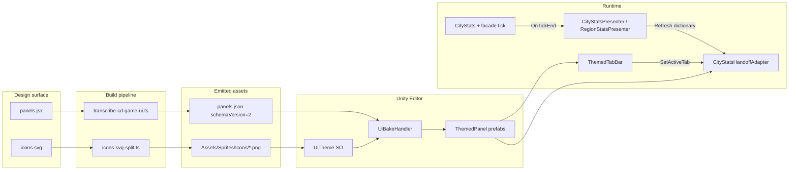

# Game UI Design System — MVP Closeout Extensions (City + Region scale)

> **Source type:** Extensions doc for existing `game-ui-design-system` master plan (DB-backed, slug `game-ui-design-system`).
> **Companion to:** `docs/game-ui-design-system-exploration.md` (parent — Path C strategy verbatim) + `docs/game-ui-design-system-stage-9-split-extensions.md` + `docs/game-ui-design-system-render-layer-extensions.md` + `docs/game-ui-design-system-stage-12-modal-trigger-rewiring-extensions.md`.
> **Why this doc exists:** Stages 1–10 + 12 shipped. Stage 11 still open. Mid-Stage-11 audit (2026-05-02) revealed 5 compounding root causes that block MVP UI close: two parallel `city-stats` archetypes (wrong twin wired), lossy IR translation (drops label/tone/vu/icon/tab taxonomy), `ThemedTabBar.SetActiveTab` empty stub, 22 icons orphaned, stage-scope discipline froze baseline at "3 stats + tab chrome". Path C selected (parent doc §"Path C — Full Fidelity Strategy"): extend IR schema → update transcribe → update bake handler → import icons → wire tab interactivity → CityStatsPresenter → region parity → MVP closeout. This doc resolves 9 pending decisions (D1–D9) via `/design-explore` polling, then `/master-plan-extend game-ui-design-system` appends Stages 13–N.

---

## Decision — extension scope

Append **Stages 13–N** (target N=19 per parent doc; final count adjusts after polling) covering full-fidelity IR + bake + icon + tab interactivity + presenter + region parity + closeout. Numbered append-only per `master-plan-extend` boundary. Logical execution order = 11 → 13 → 14 → 15 → 16 → 17 → 18 → 19 (Stage 11 lands first as last-of-original; Stages 13+ build on completed plumbing).

Why a separate exploration doc rather than fold into Stage 11:

- Stage 11 scope locked (per `docs/game-ui-design-system-stage-9-split-extensions.md`) — half-B surface adapters only. Adding IR schema + bake refactor + icon pipeline + presenter would mix concerns and explode sizing gate (3 → 25+ tasks).
- Path C touches IR translator + bake handler + Theme SO + new asset directory — cross-cutting refactor better staged independently of in-flight Stage 11.
- 9 pending design decisions need user grill before stage authoring; Stage 11 does not.
- Player-visible payoff = MVP terminal for City + Region scale (Country / World deferred). Worth a discrete plan extension.

## Locked decisions (carry from parent doc)

- **Path C selected** over A (wire-rich-prefab-only) and B (per-panel surgical patch). Pays back across every panel; closes lossy translation.
- **MVP terminal scope = City + Region scales.** Country + World scales deferred (parent doc §Path C strategy step 7).
- **Same UI structure for City and Region** with deltas TBD (D2). Region not a re-skin — same panel taxonomy, additional buttons + aggregated bindings.
- **`CityStatsHandoffAdapter` runtime patches (`EnsureCaption` + `ApplyDigitWidth`) get killed.** Bake-time correctness via IR schema v2 (parent doc §Path C strategy step 8).
- **Schema versioning.** New `panels.json` carries `schemaVersion: 2`; legacy v1 IR still parses (back-compat helper) until cutover (D5).

## Pending decisions — polling targets

These get resolved by `/design-explore` skill (Phase 2 grill). Each marked `[POLL]` so the skill picks them up. **Default proposal** column = the agent's strongest recommendation if user defers.

### `[POLL]` D1 — Tab taxonomy for `city-stats`

CityStats real surface ≈ 40 fields (parent doc §"CityStats real surface" table). Three groupings:

| Option | Tabs | Rationale |
|---|---|---|
| **D1.A** | 5: Economy / Demographics / Mood&Health / Infrastructure / Land | Default proposal — natural domain split, ~8 rows/tab, headroom for envelope sub-types |
| D1.B | 4: Economy / Demographics / Environment / Infrastructure (collapse Land into Environment) | Fewer tabs, denser per tab |
| D1.C | 6: Economy / Demographics-Residential / Demographics-Commercial+Industrial / Mood&Health / Infrastructure / Land | Splits dense Demographics tab |

**Grill questions:**
- Which fields land in which tab? (Especially: `cityLandValueMean` → Economy or Land? `forestCoveragePercentage` → Land or Mood&Health?)
- Default active tab on panel open? (Economy first to match HUD readout muscle memory?)
- Tab labels exactly as shown above, or shorter (e.g. "ECON" / "DEMO")?

### `[POLL]` D2 — Region-scale UI deltas

Parent doc commits to "same UI structure as City, plus additional buttons" but user explicitly noted "no full clarity yet" on the delta. Three shapes:

| Option | Delta vs City |
|---|---|
| **D2.A** | Identical panel + new tab "Region" with aggregated multi-city stats (totals + averages); top-bar adds "Switch to City" button per-city-row | Default — minimum delta, maximum re-use |
| D2.B | Identical panel + sidebar list of cities with select-to-zoom; per-city stats render in main panel | More navigation, more code |
| D2.C | Different panel archetype (`region-stats`) with city grid + region-level alerts panel | Highest cost, design re-work |

**Grill questions:**
- Aggregation rules: total or mean for `population` / `money` / `pollution`? Special handling for `cityLandValueMean` (mean-of-means vs population-weighted)?
- Region-only fields not present in City (e.g. `regionalTradeBalance`, `inter-city migration`)? Or pure aggregation only?
- Which buttons are "new at Region scale"? Switch-scale? Region-alerts? Region-policies? List them concretely.
- Does Region scale keep the Stats button + city-stats-handoff modal, or replace with a region-stats handoff?

### `[POLL]` D3 — Icon set scope

22 existing icons in `icons.svg` (per parent doc Finding 4). For full city-stats taxonomy + tab icons, candidate additions:

| Option | New icons | Rationale |
|---|---|---|
| D3.A | Zero new — re-use existing 22 (e.g. `desirability` for happiness, `info` for catch-all) | Lowest cost, weakest semantic fit |
| **D3.B** | +5: `icon-happiness`, `icon-population`, `icon-money`, `icon-bond`, `icon-envelope` | Default — closes obvious tab/row gaps |
| D3.C | +12: D3.B set plus per-zone-type splits + per-utility splits + region-specific icons | Full taxonomy, requires designer round-trip |

**Grill questions:**
- Per-tab icon required, or just per-row? (Tab icon = optional; tab label may suffice.)
- Per-row icon required for every row, or only for "headline" rows (e.g. money / population / happiness with icon, sub-fields without)?
- Authoring source for new icons — designer adds to `icons.svg` and re-runs transcribe, or agent stubs placeholder PNGs?

### `[POLL]` D4 — Per-row layout template

Parent doc proposes `[icon | label | value | optional-vu | optional-delta]`. Confirm + lock tone color mapping.

| Option | Layout | Tone palette |
|---|---|---|
| **D4.A** | `[icon? | label | value | vu? | delta?]` left→right; row height 28px; icon 20px square; label fixed 50% width | tone=primary → theme.primary; tone=neutral → theme.text; tone=alert → theme.alert |
| D4.B | `[icon? | label]` line 1 / `[value | vu? | delta?]` line 2; double-height row (44px) | same |
| D4.C | `[label]` line 1 / `[icon? | value | vu? | delta?]` line 2; mirrors HUD bar | same |

**Grill questions:**
- Should `delta` text color follow tone, or always be sign-driven (green up / red down)?
- VU meter inline vs new-line? (D4.A inline; visual density tighter.)
- Row hover/selected state — needed at MVP, or deferred?
- Icon left vs right of label?

### `[POLL]` D5 — IR migration strategy

Cutover schema v1 → v2 across all 16 panels.

| Option | Strategy |
|---|---|
| **D5.A** | **Hard cutover** — Stage 13 lands schema v2 + transcribe writes v2 only + bake reads v2 only. All 16 panels re-bake in single Stage 14. Branch-only landing. | Default |
| D5.B | Opt-in per archetype — `panels.json` carries mix of v1 + v2 entries; bake handler dispatches by `schemaVersion`. Migrate panels one-per-stage. | Slower |
| D5.C | Parallel — both transcripts run; agent picks v2 when present, falls back v1. Cutover in final closeout stage. | Highest risk of drift |

**Grill questions:**
- Hard cutover acceptable given branch isolation (`feature/asset-pipeline` style) — yes/no?
- Re-bake all panels in single Stage 14 acceptable, or break per-panel?
- Roll-back plan if hard cutover regresses panels currently working (hud-bar / pause / settings)?

### `[POLL]` D6 — SVG → Unity Sprite pipeline

Three approaches for converting `icons.svg` (22 ids, multi-id document) into Unity Sprite assets.

| Option | Pipeline | Trade-off |
|---|---|---|
| **D6.A** | Per-id PNG export at design-time (Node script reads SVG, splits per `<g id="icon-*">`, writes `Assets/Sprites/Icons/{id}.png` + meta) | Default — no UPM dep, fast, fixed resolution |
| D6.B | Single SpriteAtlas (Unity 2D Sprite Atlas) with sub-rects per icon | Atlas authoring overhead; needs runtime index by id |
| D6.C | `com.unity.vectorgraphics` UPM dependency — load SVG at runtime as `VectorImage` | True vector, scalable; +UPM dep, +runtime cost |

**Grill questions:**
- Target icon resolution if PNG export — 64x64? 128x128? Multi-resolution for HiDPI?
- Atlas vs separate sprites — 22 icons fit in one 256x256 atlas easily; gain is draw-call coalescing on the same canvas. Important for City UI?
- Vector requirement — do icons ever scale beyond 2x? If no, PNG suffices.
- Authoring: who runs the SVG-split tool — pre-commit hook, transcribe step, or manual?

### `[POLL]` D7 — Tab switch visual

`ThemedTabBar.SetActiveTab(int)` body needs to flip page visibility.

| Option | Behavior |
|---|---|
| **D7.A** | Hard show/hide — inactive pages `gameObject.SetActive(false)` | Default — simplest, matches modal pattern |
| D7.B | Alpha-fade — both pages alive; CanvasGroup.alpha animates (Stage 5 JuiceLayer) | Smoother, more code |
| D7.C | Slide — page transforms slide in/out | Most polish, most code |

**Grill questions:**
- MVP-acceptable to ship D7.A and defer D7.B/C as Polish?
- Tab indicator (underline / pill) animates with switch, or static?

### `[POLL]` D8 — CityStats data source abstraction

Adapter wires `bindingKey` → field read.

| Option | Pattern |
|---|---|
| **D8.A** | `CityStatsHandoffAdapter` directly switch-statement on `bindingKey` → `_cityStats.{field}` | Simple, ~40 cases |
| **D8.B** | New `CityStatsPresenter` (parent doc §Path C step 6) — `IReadOnlyDictionary<string, Func<object>>` keyed by binding slug. Adapter consumes presenter. | Default — testable, reusable for Region scale |
| D8.C | Reflection on `CityStats` fields — `bindingKey` matches field name verbatim | Smallest code; brittle vs refactor |

**Grill questions:**
- Presenter ownership — singleton on `CityStats` MonoBehaviour, scriptable-object service, or per-adapter instance?
- Caching strategy — recompute every Update tick, or event-driven on `OnTickEnd`?
- Region scale presenter shares interface with City, or separate? (D8.B implication: shared `IStatsPresenter` interface.)

### `[POLL]` D9 — MVP terminal scope confirmation

Parent doc proposes "City + Region only; Country + World deferred". Confirm.

| Option | Scope |
|---|---|
| **D9.A** | City + Region only — close MVP at Stage 19 | Default — matches user explicit ask |
| D9.B | City + Region + Country (3 scales) | +1 stage for Country aggregation |
| D9.C | All 4 scales (City + Region + Country + World) | +2 stages |

**Grill questions:**
- Country / World data backends exist in `CityStats` / aggregator surface? (If no, scale aggregation = own master plan, deferred is correct.)
- Demo / playtest milestone reachable at City + Region close, or needs Country?
- Post-MVP placeholder UI for Country / World button (greyed out + "coming soon"), or hide until ready?

---

## Architecture — extension component map

Delta vs parent doc. Full strategy in parent doc §"Path C — Full Fidelity Strategy" + §"Architectural impact".

```
tools/scripts/ir-schema.ts
  ├─ IrPanel: + tabs?: IrTab[]
  ├─ IrPanel: + rows?: IrRow[]
  ├─ NEW IrTab: { slug, label, icon?, rowGroup }
  ├─ NEW IrRow: { tab, label, valueKind, vuConfig?, icon?, tone, deltaKind?, bindingKey? }
  └─ schemaVersion field on IrRoot

tools/scripts/transcribe-cd-game-ui.ts
  ├─ NEW row/tab parser branch (jsx → json)
  └─ writes panels.json with schemaVersion=2

Assets/Scripts/Editor/Bridge/UiBakeHandler.cs (+ partials .Archetype / .Frame)
  ├─ DTOs: PanelTab, PanelRow
  ├─ bake body: rows → row hierarchy (caption + value + vu + delta + icon)
  └─ bake body: tabs → ThemedTabBar.pages[] + per-tab page container

Assets/Scripts/UI/Themed/ThemedTabBar.cs
  ├─ pages: GameObject[]
  ├─ OnActiveTabChanged: UnityEvent<int>
  ├─ SetActiveTab(int): flips page visibility, fires event
  └─ PointerClick handler per tab cell

Assets/Scripts/UI/Themed/ThemedIcon.cs
  └─ wired into bake (currently exists, unused)

Assets/Scripts/UI/CityStats/CityStatsPresenter.cs   (NEW)
  ├─ IReadOnlyDictionary<string, Func<object>> by bindingKey
  ├─ City + Region variants (D8 polling resolves shape)
  └─ event-driven repaint hook

Assets/Scripts/UI/CityStats/CityStatsHandoffAdapter.cs
  ├─ remove EnsureCaption / ApplyDigitWidth runtime patches
  └─ replace direct field reads with presenter dictionary lookup

Assets/Sprites/Icons/   (NEW asset directory)
  └─ {icon-id}.png + .meta per icon (D6 pipeline resolves)

UiTheme.asset
  └─ NEW icon slug → sprite map (mirrors palette / font_face)

tools/scripts/icons-svg-split.ts   (NEW, conditional on D6.A)
  └─ reads icons.svg → writes Assets/Sprites/Icons/{id}.png
```

## Subsystem Impact

- **IR layer.** `tools/scripts/ir-schema.ts` + `transcribe-cd-game-ui.ts` — schema landing + parser update. Highest cross-cutting risk; isolated in Stage 13.
- **Bake layer.** `UiBakeHandler` + partials — DTO additions + bake body emits row hierarchy + tab pages. All 16 panels re-bake (D5 cutover).
- **Theme layer.** `UiTheme` SO gets icon map; `ThemedTabBar` gets pages array + event; `ThemedIcon` wired to bake.
- **Presenter layer.** New `CityStatsPresenter` — pure C# (testable). Adapter gutted to dictionary lookup.
- **Asset layer.** `Assets/Sprites/Icons/` directory + 22 (or 27 / 34, per D3) icon assets. Icon-split tool conditional on D6.
- **Region scale.** New region adapter + presenter variant; reuses City panel archetype + bake (D2 polling resolves delta shape).
- **Out of scope:** New modal triggers (Stage 12 owns); render-layer changes (parent doc §Stage 10 owns); JuiceLayer behavior changes (parent doc §Stage 5 owns); Country / World scales (D9.A defers).
- **Invariants flagged:** #4 (Inspector-first + FindObjectOfType fallback) — presenter wire-up follows pattern; #6 (no `AddComponent` on existing nodes) — bake creates fresh GameObjects per row; never mutates existing.

## Implementation Points — staged skeleton

7 candidate stages (13–19). Final cardinality + task counts emerge from `master-plan-extend` after polling.

1. **Stage 13 — IR schema v2 + transcribe update** (~3 tasks)
   - T13.1: Extend `ir-schema.ts` types (`IrPanel.tabs[]`, `IrPanel.rows[]`, `IrTab`, `IrRow`) + back-compat helper.
   - T13.2: Update `transcribe-cd-game-ui.ts` parser branch — extract row arrays + tab taxonomy from `panels.jsx` → write enriched `panels.json` (schemaVersion=2).
   - T13.3: Re-run transcribe; commit new `panels.json`. Validate all 16 panels emit either v1 or v2 (no malformed mid-state).

2. **Stage 14 — Bake handler full fidelity** (~4 tasks)
   - T14.1: Extend `UiBakeHandler` DTOs (`PanelTab`, `PanelRow`) + version dispatch.
   - T14.2: Bake body emits row hierarchy (caption + value primitive + vu + delta + icon ref) per `panel.rows[]`.
   - T14.3: Bake body emits `ThemedTabBar.pages[]` + per-tab page container per `panel.tabs[]`.
   - T14.4: Re-bake all 16 panels (D5.A hard cutover); kill runtime caption/digit-width patches in `CityStatsHandoffAdapter.Awake`.

3. **Stage 15 — Icon import pipeline** (~3 tasks)
   - T15.1: Author `tools/scripts/icons-svg-split.ts` (conditional on D6.A) → produce per-id PNGs in `Assets/Sprites/Icons/`.
   - T15.2: Extend `UiTheme` SO with icon slug → sprite map; populate from `Assets/Sprites/Icons/`.
   - T15.3: Wire `ThemedIcon` to consume `UiTheme.icon.{slug}` → `Image.sprite`. Re-bake panels resolves `panel.rows[].icon` → `ThemedIcon._sprite`.

4. **Stage 16 — Tab interactivity** (~3 tasks)
   - T16.1: Implement `ThemedTabBar.SetActiveTab(int)` — flips `pages[idx].SetActive(true)` + others false (D7.A); fires `OnActiveTabChanged`.
   - T16.2: PointerClick handler per tab cell → calls `SetActiveTab(idx)`.
   - T16.3: Integrate with `city-stats-handoff` panel — initial tab = `panel.tabs[0]`; smoke test (open panel → click tab → page swap).

5. **Stage 17 — CityStatsPresenter + adapter rewrite** (~3 tasks)
   - T17.1: Author `CityStatsPresenter.cs` (D8.B) — dictionary `Dictionary<string, Func<object>>` keyed by `bindingKey`. Population covers ~40 fields (D1-resolved tab taxonomy).
   - T17.2: Gut `CityStatsHandoffAdapter` — replace switch on field with presenter dictionary lookup; remove `EnsureCaption` / `ApplyDigitWidth` (already dead per Stage 14).
   - T17.3: PlayMode smoke — open city-stats panel, verify all rows render correct values from `CityStats`. Tab-switch verifies all tabs populate.

6. **Stage 18 — Region scale parity** (~3–4 tasks; depends on D2 resolution)
   - T18.1: Add Region tab to `panels.jsx` city-stats archetype OR author `region-stats` archetype (D2 resolves) + re-transcribe + re-bake.
   - T18.2: Region presenter variant (`RegionStatsPresenter` or shared `IStatsPresenter`); aggregation rules per D2 grill.
   - T18.3: Wire region adapter; new region-only buttons (D2 enumerates) integrated.
   - T18.4 (cond): Scale-switch button in HUD between City / Region modes.

7. **Stage 19 — MVP closeout** (~3 tasks)
   - T19.1: Retire orphan twin archetypes — consolidate `city-stats` (rich) + `city-stats-handoff` to one (D5 + D2 consolidate).
   - T19.2: Promote `ui-design-system.md` to canonical (finish Stage 10 acceptance — migration of remaining lessons-learned).
   - T19.3: Master-plan-level closeout test — `MvpUiCloseoutSmokeTest.cs` exercises full flow: HUD readouts → toolbar → city-stats panel (all tabs, all rows) → region scale switch → region panel → all modal triggers (Stage 12 paths). Master plan close.

## Relevant surfaces

- **Parent doc:** `docs/game-ui-design-system-exploration.md` §"MVP Closeout Findings" + §"Path C — Full Fidelity Strategy" — full strategy verbatim.
- **CD bundle source:** `web/design-refs/step-1-game-ui/cd-bundle/panels.jsx` (PanelCityStats lines 314–353 — original 9-row design with labels/tones/vu/deltas).
- **CD bundle IR:** `web/design-refs/step-1-game-ui/cd-bundle/panels.json` — current lossy output; `city-stats` (rich, 18 children) + `city-stats-handoff` (skeletal).
- **Icon source:** `web/design-refs/step-1-game-ui/cd-bundle/icons.svg` — 22 icon ids.
- **IR schema:** `tools/scripts/ir-schema.ts` — landing target for v2 types.
- **Transcribe step:** `tools/scripts/transcribe-cd-game-ui.ts` — parser update target.
- **Bake handler:** `Assets/Scripts/Editor/Bridge/UiBakeHandler.cs` + `.Archetype.cs` + `.Frame.cs` — DTO + body update target.
- **Tab bar:** `Assets/Scripts/UI/Themed/ThemedTabBar.cs` — `SetActiveTab` body target.
- **Themed icon:** `Assets/Scripts/UI/Themed/ThemedIcon.cs` — bake-wiring target.
- **City-stats adapter:** `Assets/Scripts/UI/CityStats/CityStatsHandoffAdapter.cs` — gut + presenter rewrite target.
- **City stats data:** `Assets/Scripts/Managers/CityManagers/CityStats.cs` — source of ~40 binding keys.
- **Theme SO:** `UiTheme.asset` (under `Assets/UI/`) — icon slug → sprite map landing target.
- **Existing extension docs:** `docs/game-ui-design-system-stage-9-split-extensions.md`, `docs/game-ui-design-system-render-layer-extensions.md`, `docs/game-ui-design-system-stage-12-modal-trigger-rewiring-extensions.md` — pattern reference for staged appends.
- **External design refs (user-supplied):** claude.ai/design HTML artifacts (`Studio Rack Game UI.html`, `Studio Rack v2 Extension.html`) — visual reference for row layouts + tab visuals.

## Scope boundary

- **In:** IR schema v2 (tabs[] + rows[]); transcribe update; bake handler full fidelity (row hierarchy + tab pages); icon import pipeline (SVG split + Theme map + ThemedIcon wiring); tab interactivity (SetActiveTab body + click handler); CityStatsPresenter + adapter rewrite; Region scale parity (panel + presenter + new buttons); orphan twin consolidation; MVP closeout smoke + master-plan close.
- **Out:** Country / World scales (D9.A defers); JuiceLayer / motion polish (parent doc §Stage 5); render-layer changes (parent doc §Stage 10); modal trigger rewiring (Stage 12 owns); new HUD / toolbar surfaces (Stage 6 / 7 own); UI SFX wiring (parent doc §Bucket 7 deferred); web dashboard parity (different stack).

## Locked decisions delta (for orchestrator header sync after master-plan-extend)

- Path C selected (parent doc §"Path C — Full Fidelity Strategy" 2026-05-02).
- IR schemaVersion=2 hard cutover (D5.A default; confirms in polling).
- MVP terminal = City + Region only (D9.A default).
- Bake-time correctness — runtime caption/digit-width patches deleted in Stage 14.
- Presenter pattern (D8.B default) — `CityStatsPresenter` + `IStatsPresenter` interface for region re-use.
- Logical execution order: 11 → 13 → 14 → 15 → 16 → 17 → 18 → 19.

## Player-visible checkpoint

After Stage 19 ships:

- **Open city-stats panel** → 5 tabs visible (Economy / Demographics / Mood&Health / Infrastructure / Land — D1 default), each populated with ~8 rows showing `[icon | label | value | vu? | delta?]` (was: 3 stats only, no tabs functional).
- **Click any tab** → page swaps; new tab's rows populate from CityStats (was: tabs were chrome).
- **Switch to Region scale** → same panel structure with region aggregations + region-only buttons (D2 resolves) (was: no Region UI).
- **Designer edits `panels.jsx`** (e.g. add row, change tone) → re-transcribe → re-bake → row visible in Unity, no code change (was: design intent stranded at the lossy IR step).
- **All 22+ icons render** in their slots (was: orphaned).
- **City + Region MVP UI close gate fires.**

Combined with Stages 1–12, this completes the Visual MVP (City + Region scales) per `game-ui-design-system` master plan terminal milestone.

## Next action

Run `/design-explore docs/game-ui-design-system-mvp-closeout-extensions.md` to enter the polling loop. Skill grills D1–D9 with full options + grill questions; persists `## Design Expansion` block once all decisions resolved. Then `/master-plan-extend game-ui-design-system docs/game-ui-design-system-mvp-closeout-extensions.md` appends Stages 13–N to the existing master plan with Task tables fully decomposed.

---

## Design Expansion

### Architecture Decision

- **Slug:** `DEC-A21`
- **Title:** `game-ui-full-fidelity-path-c`
- **Status:** active
- **Plan slug:** `game-ui-design-system`
- **Surface (registered):** `layers/system-layers` — best-fit existing surface; full intended surface list logged in changelog body for future registration.
- **Rationale (≤250 char):** Path C (full-fidelity IR + bake + icons + tab interactivity + presenter) closes 5 root causes blocking MVP UI close. City+Region scope. D1-D9 resolved 2026-05-02.
- **Alternatives considered:** A wire-rich-prefab-only (rejected: lossy IR persists); B per-panel surgical patch (rejected: scales poorly across 16 panels).
- **Intended affected surfaces (not yet registered as `arch_surfaces`):** `ui_bake_handler`, `ir_schema`, `themed_tab_bar`, `themed_icon`, `ui_theme_so`, `city_stats_handoff_adapter`, `transcribe_cd_game_ui`, `city_stats_presenter` (NEW), `region_stats_presenter` (NEW), `icons_svg_split` (NEW), `assets_sprites_icons` (NEW). Future TECH issue should register these for fine-grained drift coverage.
- **Drift scan:** open stages linked to `layers/system-layers` = 0; no plans flagged.
- **MCP writes (2026-05-02):**
  - `arch_decisions.id=24` (slug `DEC-A21`, status `active`, plan_slug `game-ui-design-system`).
  - `arch_changelog.id=25817` (kind `design_explore_decision`, surface `layers/system-layers`, decision `DEC-A21`, spec_path `docs/game-ui-design-system-mvp-closeout-extensions.md`).

### D1–D9 Resolved (2026-05-02 polling)

#### D1 — Tab taxonomy for `city-stats`

- **4 tabs:** `Money / People / Land / Infrastructure`. Land kept separate (NOT folded into Environment).
- **Default open tab on panel mount:** `Infrastructure` (rationale: power/water = "what's broken right now" anchor).
- **Tab labels:** full ("Economy" / "Demographics" / "Land" / "Infrastructure" — NOT abbreviated).
- **Tab → field mapping:**
  - **Money:** `money`, `totalEnvelopeCap`, `envelopeRemainingPerSubType[7]`, `activeBondDebt`, `monthlyBondRepayment`.
  - **People:** `population`, residential / commercial / industrial × {zoneCount, buildingCount, light/medium/heavy variants} (~18 fields), `happiness` (`HappinessComposer`).
  - **Land:** `cityLandValueMean`, pollution (`SignalFieldRegistry` mean), `grassCount`, `forestCellCount`, `forestCoveragePercentage`.
  - **Infrastructure:** `roadCount`, `cityPowerOutput`, `cityPowerConsumption`, `cityWaterOutput`, `cityWaterConsumption`.
- Note: Tab labels in panel header read "Economy / Demographics / Land / Infrastructure"; underlying data domain names (Money / People / Land / Infrastructure) drive binding keys.

#### D2 — Region-scale UI deltas

- **D2.A selected:** same panel + same 4 tabs at Region scale; aggregated values; same Stats button.
- **Aggregation rules:**
  - `population` → **total** (sum across cities).
  - `money` → **total**.
  - `happiness` → **population-weighted mean**.
  - `pollution` → **population-weighted mean**.
  - `cityLandValueMean` → **population-weighted mean**.
  - All other fields → **total** (default).
- **Region-only stats:** **deferred** to future master plan. Panel reserves visual space (empty tab page or "More region stats coming" placeholder slot).
- **Region-only buttons:** **deferred**. Same Stats button opens Region panel when at Region scale.
- **Implication:** Stage 18 = thin region adapter + presenter wrapper (aggregation rules) + bindingKey reuse. No new tabs, no new buttons.

#### D3 — Icon set scope

- **D3.B selected:** add 5 new icons: `icon-happiness`, `icon-population`, `icon-money`, `icon-bond`, `icon-envelope`.
- Total icon catalog after Stage 15: 22 (existing) + 5 (new) = **27 ids**.
- **Tab icons:** YES — each tab gets icon next to label.
- **Row icons:** YES — every row gets icon (not just headlines).
- **Authoring path:** designer extends `web/design-refs/step-1-game-ui/cd-bundle/icons.svg` with 5 new ids → re-runs transcribe → split tool produces PNGs. NO agent stub placeholders.
- **Implication:** Stage 15 starts BLOCKED on designer SVG update. T15.0 = designer handoff request (out-of-band, not a code task). Stage 15 codable tasks (split tool, theme map, ThemedIcon wiring) run after svg lands.

#### D4 — Per-row layout

- **D4.A selected:** single horizontal line `[icon | label | value | vu? | delta?]`.
- Row height: **28px**. Icon size: **20px square, left of label**. Label width: **fixed 50%**.
- **Delta color:** sign-driven — green positive, red negative, neutral zero. NOT row-tone-driven.
- **VU bar:** inline, between value and delta.
- **Row hover state:** **MVP scope** — highlight on mouseover via theme color overlay. Stage 14 acceptance includes hover state.
- **Implication:** Add `RowHoverHandler` MonoBehaviour or extend `IlluminatedButton` hover semantics. Theme exposes `rowHoverColor` slot.

#### D5 — IR migration strategy

- **D5.A selected:** hard cutover.
- Stage 13 lands schema v2; Stage 14 task T14.1 re-bakes ALL 16 panels in one pass.
- **BUT:** Stage 14 includes per-panel approval gates. T14.1 = bulk re-bake. T14.2 through T14.N = one task per panel/group for review/fix/approve cycle.
- **Suggested grouping** (final adjusts during `master-plan-extend`):
  - T14.1: Schema v2 DTO + bake body + bulk re-bake all 16 panels.
  - T14.2: Approve `hud-bar` + `time-controls` + `toolbar` (always-on HUD).
  - T14.3: Approve `city-stats` + `city-stats-handoff` consolidated.
  - T14.4: Approve `pause` + `settings` + `save-load` (menu modals).
  - T14.5: Approve `info-panel` + `building-info` + `tooltip` (info modals).
  - T14.6: Approve `new-game` + `splash` + `onboarding` + `onboarding-overlay` + `glossary-panel`.
  - T14.7: Approve `alerts-panel` + `mini-map` + `zone-overlay` (overlay modals).
  - T14.8: Kill runtime caption / digit-width hacks in `CityStatsHandoffAdapter.Awake`; remove dead patches across all adapters.
- **Fallback:** fix-forward inside the same stage (no runtime feature flag).
- **Full-game smoke:** `MvpUiCloseoutSmokeTest.cs` opens every panel + verifies render (lands in Stage 19 closeout).

#### D6 — SVG → Sprite pipeline

- **D6.A selected:** per-id PNG export at design-time.
- **Resolution:** 128x128 single resolution (no multi-res HiDPI in MVP).
- **Authoring trigger:** runs alongside `transcribe-cd-game-ui.ts` — same Node script invocation re-emits PNGs when `icons.svg` changes. No pre-commit hook, no manual step.
- **Tool:** new `tools/scripts/icons-svg-split.ts` invoked by transcribe step.
- **Output:** `Assets/Sprites/Icons/{icon-id}.png` + `.meta` (TextureType=Sprite (2D and UI), Pixels Per Unit=100, Filter=Bilinear).

#### D7 — Tab switch visual

- **D7.A selected:** hard show/hide.
- `SetActiveTab(int)` flips `pages[idx].SetActive(true)`, others false.
- **Tab indicator:** snaps to new tab. No animation.
- **Fade/slide:** deferred to future Polish stage. Stage 16 acceptance: "Polish opportunity carried — JuiceLayer-driven tab fade".

#### D8 — CityStats data source

- **D8.B selected:** `CityStatsPresenter` with bindingKey → Func<object>.
- **Refresh cadence:** **tick-driven** — presenter subscribes to sim-tick event (e.g. `OnTickEnd` on `CityStatsFacade`). Adapter reads cached values per Update; presenter pushes new values only on tick. NOT per-frame recompute.
- **Shared interface:** `IStatsPresenter` interface; `CityStatsPresenter` (City) and `RegionStatsPresenter` (Region) both implement it. Region presenter wraps multiple city stats + applies aggregation rules from D2.
- **Ownership:** instance-based (one presenter per active scale). Adapter holds reference. NOT singleton, NOT ScriptableObject service.
- **Implication for Stage 17:** T17.1 authors `IStatsPresenter` + `CityStatsPresenter` (~40 binding keys, `Dictionary<string, Func<object>>`). T17.2 gut adapter; subscribe presenter to facade tick event. T17.3 PlayMode smoke.
- **Implication for Stage 18:** T18.2 authors `RegionStatsPresenter` implementing `IStatsPresenter`; same binding keys, aggregation rules from D2.

#### D9 — MVP terminal scope

- **D9.A selected:** City + Region only.
- Country + World scales: **deferred** to future master plan.
- **Country / World scale buttons in scale-switcher UI:** **hidden entirely** (NOT greyed-out with "coming soon").
- **Demo / playtest milestone:** does NOT need Country — Stage 19 close = MVP demo gate.
- **Implication:** scale-switcher widget enumerates only City + Region in Stage 18. Future scale additions = additive (insert button + scale-implementation in own master plan).

### Components

- `IrSchemaV2` — types for `IrTab` + `IrRow` + `IrPanel.tabs[]` + `IrPanel.rows[]` + back-compat helper for v1 panels.
- `transcribe-cd-game-ui.ts` — parser branch extracts row/tab semantics from `panels.jsx`; writes `panels.json` with `schemaVersion=2`.
- `icons-svg-split.ts` (NEW) — Node script splits `icons.svg` → per-id 128x128 PNGs into `Assets/Sprites/Icons/`. Invoked by transcribe step.
- `UiBakeHandler` — DTO additions (`PanelTab`, `PanelRow`); bake body emits row hierarchy + tab page containers; `ThemedIcon` wired per row.
- `ThemedTabBar` — `pages[]` array; `OnActiveTabChanged` event; `SetActiveTab(int)` body; PointerClick handler per cell; indicator snap.
- `ThemedIcon` — wired into bake; consumes `UiTheme.icon[slug]` → `Image.sprite`.
- `UiTheme` SO — icon slug → Sprite map (mirrors palette / font_face); `rowHoverColor` slot for D4.
- `IStatsPresenter` (NEW) — interface `IReadOnlyDictionary<string, Func<object>> Bindings { get; }` + `event Action OnRefreshed`.
- `CityStatsPresenter` (NEW) — implements `IStatsPresenter`; ~40 binding keys; subscribes facade tick event.
- `RegionStatsPresenter` (NEW, Stage 18) — implements `IStatsPresenter`; aggregates across multiple `CityStats` instances per D2 rules.
- `CityStatsHandoffAdapter` — gutted; presenter-driven only; runtime caption/digit-width patches removed.
- `RowHoverHandler` (NEW) — MonoBehaviour per row; mouseover → tints `Image` with `UiTheme.rowHoverColor`.

### Architecture diagram



### Subsystem impact

- **IR layer (`tools/scripts/ir-schema.ts`, `transcribe-cd-game-ui.ts`).**
  - Dependency: schema landing + parser update. Adds tabs[] + rows[] + back-compat.
  - Risk: schema version mismatch mid-transition.
  - Breaking vs additive: **breaking** (D5.A hard cutover) but isolated to Stage 13 single commit.
  - Mitigation: branch isolation; v1 helper retained for legacy parse fallback during dev.
- **Bake layer (`UiBakeHandler` + partials).**
  - Dependency: DTO additions + bake body emits row hierarchy + tab pages.
  - Risk: invariant **#6** carve-out — NEVER `AddComponent` on existing nodes; bake creates fresh GameObjects per row.
  - Breaking vs additive: **breaking** (re-bakes all 16 panels).
  - Mitigation: per-panel approval gates (T14.2-T14.7) catch regressions before close.
- **Theme layer (`UiTheme` SO, `ThemedTabBar`, `ThemedIcon`).**
  - Dependency: SO icon slug → Sprite map; tab bar pages array + event; ThemedIcon consumes theme.
  - Risk: invariant **#4** (no new singletons) — `UiTheme` already SO instance, theme references via Inspector.
  - Breaking vs additive: **additive**.
  - Mitigation: re-bake re-resolves all theme refs.
- **Presenter layer (NEW `CityStatsPresenter`, `IStatsPresenter`).**
  - Dependency: pure C# binding dictionary + tick subscription.
  - Risk: invariant **#3** (no `FindObjectOfType` in Update) — presenter `Refresh()` triggered by event subscription, NOT polled per Update. Guardrail #14 (manager-init race) — adapter gates row population on `_presenter.IsReady` flag.
  - Breaking vs additive: **breaking** for adapter (gutted); **additive** for new presenter classes.
  - Mitigation: invariant **#4** + guardrail #0 — presenter MonoBehaviour, `[SerializeField] private` + `FindObjectOfType` fallback in `Awake`.
- **Asset layer (`Assets/Sprites/Icons/`).**
  - Dependency: 27-icon catalog; Node SVG-split tool; `.meta` import settings.
  - Risk: missing icon-id between `panels.json` row + `icons.svg` source — bake substitutes `icon-info` placeholder + warning.
  - Breaking vs additive: **additive** (new directory).
  - Mitigation: split tool pre-validates id list; warns on missing.
- **Region scale (NEW `RegionStatsPresenter`).**
  - Dependency: aggregates multiple `CityStats` instances per D2 rules; same panel archetype.
  - Risk: empty-region edge case → return 0 / null per binding key; adapter renders "—".
  - Breaking vs additive: **additive**.
  - Mitigation: shared `IStatsPresenter` interface forces consistent surface.
- **Out of scope:** Country / World scales (D9.A defers); JuiceLayer motion polish; render-layer changes (parent doc Stage 10); modal trigger rewiring (Stage 12 owns); UI SFX wiring; web dashboard parity.
- **Invariants flagged (numbered):** **#3** (no `FindObjectOfType` in Update — presenter Refresh uses event subscription); **#4** (no new singletons — presenter MonoBehaviour with Inspector wire); **#6** (no `AddComponent` on existing nodes — bake creates fresh GameObjects). **Guardrail #0** (manager reference: `[SerializeField] private` + FindObjectOfType fallback in Awake) for adapter→presenter ref. **Guardrail #14** (manager-init race) for adapter row-population gate on presenter ready.

### Implementation Plan

7 stages (13–19). Stage 14 task count ≈ 8 (1 bulk + 6 approval groups + 1 cleanup); final adjusts during `master-plan-extend` decomposition based on reviewer feedback.

**Stage 13 — IR schema v2 + transcribe update** (3 tasks)

- T13.1: Extend `tools/scripts/ir-schema.ts` types (`IrPanel.tabs[]`, `IrPanel.rows[]`, `IrTab`, `IrRow`, `IrRoot.schemaVersion`) + back-compat helper.
- T13.2: Update `transcribe-cd-game-ui.ts` parser branch — extract row arrays + tab taxonomy from `panels.jsx` → write enriched `panels.json` (schemaVersion=2).
- T13.3: Re-run transcribe; commit new `panels.json`. Validate all 16 panels emit v2 (no malformed mid-state).

**Stage 14 — Bake handler full fidelity + per-panel approval** (~8 tasks)

- T14.1: DTOs (`PanelTab`, `PanelRow`) + bake body (row hierarchy + tab pages) + bulk re-bake all 16 panels (D5.A hard cutover).
- T14.2: Approve HUD always-on (`hud-bar` + `time-controls` + `toolbar`).
- T14.3: Approve `city-stats` + `city-stats-handoff` consolidated (headline target).
- T14.4: Approve menu modals (`pause` + `settings` + `save-load`).
- T14.5: Approve info modals (`info-panel` + `building-info` + `tooltip`).
- T14.6: Approve intro/help (`new-game` + `splash` + `onboarding` + `onboarding-overlay` + `glossary-panel`).
- T14.7: Approve overlays (`alerts-panel` + `mini-map` + `zone-overlay`).
- T14.8: Kill runtime caption / digit-width hacks in `CityStatsHandoffAdapter.Awake`; remove dead patches across all adapters.

**Stage 15 — Icon import pipeline** (3 codable tasks; T15.0 = designer SVG handoff out-of-band)

- T15.0 (out-of-band): designer adds 5 new ids to `web/design-refs/step-1-game-ui/cd-bundle/icons.svg`. **Stage 15 codable work blocked until landing.**
- T15.1: Author `tools/scripts/icons-svg-split.ts`; integrate into transcribe step; produce 27 PNGs (128x128) in `Assets/Sprites/Icons/`.
- T15.2: Extend `UiTheme` SO icon slug → Sprite map; populate from `Assets/Sprites/Icons/`.
- T15.3: Wire `ThemedIcon` to consume `UiTheme.icon[slug]` → `Image.sprite`. Re-bake panels resolves icon refs.

**Stage 16 — Tab interactivity** (3 tasks)

- T16.1: `ThemedTabBar.SetActiveTab(int)` body (D7.A hard show/hide); `OnActiveTabChanged` event; indicator snap.
- T16.2: PointerClick handler per tab cell → `SetActiveTab(idx)`.
- T16.3: Initial tab = `panel.tabs[0]` for general; **override = Infrastructure** for `city-stats-handoff` (D1 default tab); smoke test (open panel → click tab → page swap).

**Stage 17 — Stats presenter + adapter rewrite** (3 tasks)

- T17.1: `IStatsPresenter` interface + `CityStatsPresenter` (~40 binding keys, `Dictionary<string, Func<object>>`); tick-driven (`OnTickEnd` subscription); `OnRefreshed` event.
- T17.2: Gut `CityStatsHandoffAdapter`; subscribe presenter to facade tick event; `[SerializeField] private` presenter ref + `FindObjectOfType` fallback in Awake (guardrail #0); gate row population on presenter ready (guardrail #14).
- T17.3: PlayMode smoke — open city-stats panel; verify all rows render correct values from `CityStats`. Tab switch verifies all tabs populate.

**Stage 18 — Region scale parity** (3 tasks)

- T18.1: `RegionStatsPresenter` implementing `IStatsPresenter`; D2 aggregation rules (population/money totals; happiness/pollution/cityLandValueMean = population-weighted means).
- T18.2: Scale-switcher widget enumerates **City + Region only** (Country/World hidden); same Stats button opens panel at active scale.
- T18.3: PlayMode smoke — switch scale → panel re-binds → aggregated values render.

**Stage 19 — MVP closeout** (3 tasks)

- T19.1: Retire orphan twin archetypes (consolidate `city-stats` rich + `city-stats-handoff` to one).
- T19.2: Promote `ui-design-system.md` to canonical (finish Stage 10 acceptance — migrate remaining lessons-learned).
- T19.3: `MvpUiCloseoutSmokeTest.cs` — full-flow exercise (HUD → toolbar → city-stats panel all tabs/rows → region scale switch → all modal triggers); master-plan close.

**Dependency:** 11 → 13 → 14 → 15 → 16 → 17 → 18 → 19 (Stage 11 lands first as last-of-original).

**Deferred / out of scope:**
- Country + World UI (D9.A).
- Tab fade / slide (D7 Polish carry).
- Multi-resolution icons (D6 MVP scope).
- Region-only stats + buttons (D2 deferred).
- Row hover JuiceLayer reactions beyond static color tint (D4 carry).

### Examples

1. **IR row/tab schema migration.**
   - Input: `panels.jsx` PanelCityStats with 9 rows × {label, value, tone, vu?, delta?}.
   - Output: `panels.json` schemaVersion=2 with `panel.tabs[4]` + `panel.rows[N]` keyed by tab slug.
   - Edge case: legacy panel without `tabs` field — back-compat helper treats as single anonymous tab containing all flattened rows.

2. **Icon split.**
   - Input: `icons.svg` with `<g id="icon-money">…</g>`.
   - Output: `Assets/Sprites/Icons/icon-money.png` (128x128) + `.meta`.
   - Edge case: icon-id present in `panels.json` row but missing from `icons.svg` — split tool emits warning; bake substitutes `icon-info` placeholder + logs.

3. **Presenter binding.**
   - Input: `bindingKey="cityStats.envelopeRemainingPerSubType[3]"`.
   - Output: `Func<object> = () => _cityStats.envelopeRemainingPerSubType[3]`.
   - Edge case: bindingKey unknown — adapter logs warning; row renders blank value (does NOT crash).

4. **Tab switch.**
   - Input: user clicks tab index 2 (Land).
   - Output: `pages[0..3].SetActive(...)` flips all to false except `pages[2]`; `OnActiveTabChanged.Invoke(2)`; indicator snaps to position 2.
   - Edge case: user clicks already-active tab — no-op (early return when `_activeIndex == idx`).

5. **Region aggregation.**
   - Input: 3 cities — populations [10000, 5000, 2000]; happinesses [60, 80, 40].
   - Output: total population = 17000; population-weighted happiness = (10000×60 + 5000×80 + 2000×40) / 17000 = 64.7.
   - Edge case: zero cities (empty region) — presenter returns 0 / null per binding key; adapter renders "—" placeholder.

### Review Notes

**BLOCKING items resolved inline:** 0.

**NON-BLOCKING / SUGGESTIONS** (verbatim from inline review):

- Stage 14 sizing within 8-task soft cap. If reviewer finds heavy fix-loops in T14.3 (city-stats consolidated approval), split into city-stats-rich + city-stats-handoff approval to keep gate manageable.
- Stage 15 sequencing handles designer-SVG-handoff dependency (lands AFTER Stage 14 / BEFORE Stage 16). T15.0 explicit "designer SVG handoff request" task makes blocker visible.
- `HappinessComposer` may update outside `CityStats` tick boundary. Presenter exposes `RequestRefresh()` for ad-hoc producers; consumer composers can fire it. Default refresh = `OnTickEnd`.
- `IStatsPresenter` scope correct; resist over-extracting `IUiTickReceiver` (premature).
- Region empty-region edge case documented — return 0 / null per binding key, adapter renders "—" placeholder.
- Invariant **#3** SAFE (presenter Refresh = event-driven, not Update-polled).
- Invariant **#4** SAFE (presenter MonoBehaviour instance-held by adapter via `[SerializeField] private` + FindObjectOfType fallback in Awake).
- Guardrail **#14** addressed (adapter gates row population on `_presenter.IsReady` flag fired post-subscription; add to T17.2 acceptance).

### Expansion metadata

- **Date:** 2026-05-02
- **Model:** claude-opus-4-7
- **Approach selected:** Path C (locked in parent doc 2026-05-02)
- **Decisions resolved:** 9 (D1–D9)
- **Stage decomposition target:** 7 stages (13–19); Stage 14 task count adjusts during `master-plan-extend` (per-panel approval gates per D5)
- **Predecessor doc:** `docs/game-ui-design-system-exploration.md` (Path C strategy)
- **Architecture decision:** `DEC-A21` (active, plan-scoped to `game-ui-design-system`)
- **Drift scan:** clean (0 open stages flagged on `layers/system-layers`)
- **Blocking items resolved:** 0
- **Handoff:** `/master-plan-extend game-ui-design-system docs/game-ui-design-system-mvp-closeout-extensions.md`
