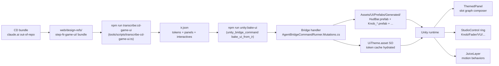

# Game UI MVP Authoring Approach — Exploration

> Pre-plan exploration. Question: for the **game-ui-design-system** bucket (rendered via `mcp__territory-ia__master_plan_render({slug: "game-ui-design-system"})`), what is the right authoring approach for MVP delivery — bridge-direct via `unity_bridge_command`, full Claude Design + catalog pipeline (DEC-A6 / A14 / A22 / A27 / A28 / A44 / A45), or a hybrid that scopes MVP to bridge and defers catalog pipeline to post-MVP? Surface the coupling between game-ui-design-system bucket and asset-pipeline bucket; lock MVP / post-MVP boundary; lock agentic authoring loop shape.
>
> Companion to: `docs/game-ui-design-system-exploration.md` (already locked Q1-Q17 — chose Approach 4 + Lane R1 + catalog-authoritative). This exploration RE-OPENS the authoring-mechanism question only — does NOT touch the locked end-state architecture (catalog-authoritative survives long-term).

---

## Problem

`docs/game-ui-design-system-exploration.md` locked end-state: catalog DB authoritative, Claude Design upstream, transcribe pipeline, web admin editors, snapshot to Unity, runtime hydration. Q15 = one CD mega-bundle covering all screens.

Authoring path as drafted in master plan stages distributes Claude Design authoring across many stages (token sheet section in Stage 1, panel section in Stage 2, interactive section in Stage 3, HUD bar in Stage 7, other screens in Stages 8-9). Q15 says one mega-bundle — but plan stages slice CD authoring across many stages because each stage carries its own DDL + transcription + admin editor + snapshot section + Unity accessor work. CD authoring is a thin slice inside each stage rather than a single upfront authoring session.

Three deeper problems surface from that mismatch:

1. **Compile-time vs runtime composition.** Drafted plan does NOT bake panel prefabs at publish — panel layout assembles per-instantiation at runtime via `ThemedPanel` slot binder reading `panel_child` graph. Tokens hydrate at boot. Most Unity citizens (debugger view, prefab editor, asset references) expect prefabs. Bridge-based bake of panel prefabs at publish never appeared in plan despite `unity_bridge_command` already proven for DEC-A28 ephemeral preview.
2. **Asset-pipeline coupling.** Game UI bucket extends DEC-A6 / DEC-A14 / DEC-A22 / DEC-A27 / DEC-A28 / DEC-A44 / DEC-A45 — ALL owned by asset-pipeline master plan (DB slug `asset-pipeline`). Game UI Stage 1-3 = DDL-heavy migrations on asset-pipeline tables. Stage 1-3 cannot ship without asset-pipeline foundation in place. Currently no formal gate between the two plans.
3. **MVP shape.** Catalog DDL across DEC-A14 token kinds + DEC-A27 panel_child + Q12 per-control kinds is a sizeable migration drop. Wave 3 admin editors are unbuilt. CD bundle authoring + transcription scripts need writing. All before any Unity primitive ships. MVP delivery slips behind multi-month asset-pipeline catalog buildout.

**Goal.** Lock the authoring approach for game-ui-design-system MVP — what tools agent + designer use to compose UI, where artefacts persist, when bake happens, what game-ui owns vs what asset-pipeline must ship first. Scope MVP / post-MVP boundary so MVP ships in weeks not quarters. End-state remains catalog-authoritative per locked Q3.

## Approaches surveyed

- **Approach A — Bridge-direct only.** Agent reads design intent (this exploration's locked decisions + UI Polish exploration's primitive list) → calls `unity_bridge_command create_panel` / `bake_studio_control` / `apply_token_overrides` → writes Unity prefab assets directly under `Assets/UI/Prefabs/Generated/*`. No catalog rows, no publish, no snapshot. Token values hand-tuned in `UiTheme.cs` SO via Inspector OR set per-prefab via bridge. CD bundle + transcribe + admin editors deferred entirely. Fastest agentic loop, lowest infra cost. Lossy — no rollback, no version pinning, no multi-stakeholder review surface, no designer-driven CD loop. MVP-shaped; abandons end-state until post-MVP catches up.
- **Approach B — Catalog-pipeline (current draft).** Full path per locked game-ui-design-system exploration: catalog DDL → CD bundle → transcribe scripts → web admin editors → publish → snapshot → runtime hydration. Stage 1-3 catalog DDL + Wave 3 admin editors land as part of game UI MVP. Largest upfront infra; cleanest end-state alignment; longest delivery. Couples game UI MVP to asset-pipeline Wave 3 schedule.
- **Approach C — Hybrid: bridge MVP, catalog post-MVP (user-proposed).** MVP ships bridge-direct stack: hand-built primitive prefabs + bridge command suite + agent-driven prefab generation + `UiTheme` Inspector for tokens. Post-MVP turns on catalog lane: catalog DDL drops + CD bundle authoring + transcription + admin editors + snapshot + bridge bake from catalog rows. Same primitive prefabs survive both phases — they consume tokens regardless of source. End-state matches B; delivery shape matches A first.
- **Approach D — Bridge bakes from catalog (compile-time).** Catalog DDL ships first (asset-pipeline foundation work). Agent calls `catalog_*_upsert` MCP for token + panel + interactive rows — no CD bundle, no admin editor, no transcribe scripts for MVP. Bridge bakes prefabs from catalog rows on publish (`unity_bridge_command catalog_bake_panel` etc.) — generated prefabs commit under `Assets/UI/Prefabs/Generated/*`. Catalog rows = source of truth from day one; only the AUTHORING surface is agentic-via-MCP rather than designer-driven-via-CD. CD lane lights up post-MVP. Mid-cost MVP; locks catalog-authoritative invariant up front; defers only the designer-facing tools.
- **Approach E — Web admin direct + bridge bake (no CD).** Same as D but admin editors land as part of MVP — designer / engineer authors catalog rows via Wave 3 schema-driven admin form (DEC-A45) instead of agent calling catalog upsert. Bridge bakes prefabs on publish. Still no CD bundle / transcribe / out-of-repo design loop. Higher MVP cost (admin editors built); positions Wave 3 admin as a forcing function for game UI delivery.
- **Approach G — CD bundle → Node transcribe → IR JSON → Unity bridge handler → prefabs (LOCKED, surfaced during polling).** Out-of-repo CD bundle authoring (visual artefact stage). Deterministic Node transcribe step (`tools/scripts/transcribe-cd-game-ui.ts`) converts CD bundle → IR JSON under `web/design-refs/step-N-game-ui/ir.json`. Unity bridge handler `bake_ui_from_ir` reads IR JSON, bakes per-archetype panel prefabs + per-usage StudioControl prefabs deterministically + populates `UiTheme.asset` SO token cache. Two deterministic boundaries (Node transcribe + Unity bridge handler) eliminate per-agent-session interpretation drift. NO catalog DDL / NO admin editors / NO publish ripple for MVP — all deferred post-MVP. Token migration script (UiTheme SO field cache → catalog rows) lights up post-MVP per Q-author-11. Combines Approach A's bridge surface with Approach C's MVP/post-MVP staging, but adds CD + IR layer for designer-eventual loop without committing to catalog DDL upfront.

## Open questions

These need polling resolution before phase 1 (compare matrix) can pick an approach:

- **Q-author-1.** MVP delivery target — weeks (Approach A or C-MVP-half) vs months (Approach B / D / E)? Stakeholder pressure?
- **Q-author-2.** End-state boundary — does game-ui MVP need to ship with CATALOG ROWS as source of truth (Approach D / E), or is hand-tuned `UiTheme` SO + bridge-baked prefabs acceptable for MVP with catalog migration deferred (Approach A / C)?
- **Q-author-3.** Bridge tool surface — what new `unity_bridge_command` handlers need authoring? Token overrides? Panel bake from JSON spec? StudioControl variant bake? Live theme reload?
- **Q-author-4.** Generated prefab folder hygiene — commit `Assets/UI/Prefabs/Generated/*` to git (tracked artefact, like `Assets/Sprites/Generated/`) OR gitignored regen step (`npm run unity:bake-ui`)?
- **Q-author-5.** Token authoring during MVP — Inspector-only on `UiTheme.cs` SO? Bridge sets palette per-prefab? Hard-coded constants in primitive prefab variants?
- **Q-author-6.** Asset-pipeline coupling — does game UI MVP block on asset-pipeline foundation work, or does game UI MVP ship FIRST and asset-pipeline catches up post-MVP?
- **Q-author-7.** Q15 mega-bundle fate — does the "one mega-bundle" decision survive into post-MVP catalog lane (single CD session covers all screens) or fragment back into per-stage authoring? Or sunset entirely if Approach D / E (no CD lane for MVP)?
- **Q-author-8.** Asset-pipeline MASTER PLAN status — does the rendered `asset-pipeline` plan ALREADY include game UI catalog DDL stages (DEC-A14 / DEC-A27 / Q12 detail tables) or are those net-new additions?
- **Q-author-9.** Agentic authoring loop shape — does this kind of session (main-session agent w/ bridge tools) drive UI authoring during MVP? Or does main session just drive code+spec while authoring stays designer-driven (out of scope for agent)?
- **Q-author-10.** Designer involvement timing — when does CD-loop / web-admin-loop turn on for designer use? MVP launch date, post-MVP, post-launch entirely?
- **Q-author-11.** Migration boundary — if MVP ships hand-tuned `UiTheme` (Approach A / C-bridge-half), how do those token values migrate to catalog rows when post-MVP lane turns on? Lossless? One-time import script?
- **Q-author-12.** Bake granularity — per archetype (`HudBar.prefab`) or per usage (`HudBar_default.prefab`, `HudBar_widescreen.prefab`)?
- **Q-author-13.** StudioControl variant strategy — bake variants per usage (`Knob_volumeMaster.prefab`) OR single primitive prefab + `Awake` reads detail row?
- **Q-author-14.** Bake trigger — automatic on catalog publish (DEC-A44 ripple extension) OR manual `npm run unity:bake-ui` step?
- **Q-author-15.** Existing asset-pipeline plan inventory — what asset-pipeline stages are PENDING vs SHIPPED that game UI bucket depends on? (Render asset-pipeline plan + cross-reference with game UI Stage 1-3.)

## Recommendation

**Locked: Approach G** (CD bundle → Node transcribe → IR JSON → Unity bridge handler → prefabs). Polling Q1–Q5 answered 2026-04-27.

Polling outcome:

- **Q1 (delivery target).** Weeks MVP; designer tools (CD-loop, web admin) deferred post-MVP. Covers Q-author-1 + Q-author-10.
- **Q2 (authoring loop).** Approach G. Two deterministic boundaries (Node transcribe + Unity bridge handler) eliminate per-agent-session interpretation drift. Agent = orchestrator only. Covers Q-author-2 + Q-author-3 + Q-author-9.
- **Q3 (bake granularity, hybrid C).** Panels per-archetype + runtime slot fill (one `HudBar.prefab` master, ThemedPanel slot graph composes at runtime per DEC-A27). StudioControls baked per usage (`Knob_volumeMaster.prefab`, `Knob_eqLow.prefab`) — designer can preview each in Unity Editor offline. Covers Q-author-12 + Q-author-13.
- **Q4 (asset-pipeline coupling).** MVP ships hand-tuned `UiTheme.cs` SO (Inspector token values) + IR JSON in `web/design-refs/step-N-game-ui/`. NO catalog rows. Post-MVP roadmap carries asset-pipeline catalog integration (one-time import script: UiTheme SO field cache → catalog rows). Covers Q-author-6 + Q-author-11.
- **Q5 (generated prefab ops).** Track + manual. Commit `Assets/UI/Prefabs/Generated/*` to git (matches `Assets/Sprites/Generated/` pattern). Manual `npm run unity:bake-ui` trigger. Covers Q-author-4 + Q-author-14.

Risk: token migration from `UiTheme` SO field cache → catalog rows still requires one-time import script when post-MVP catalog lane turns on. Manageable per Q-author-11.

Outstanding open questions deferred to post-MVP planning: Q-author-5 (token authoring strategy converges to IR JSON tokens block), Q-author-7 (mega-bundle fate inside post-MVP CD lane), Q-author-8 + Q-author-15 (asset-pipeline plan inventory cross-reference) — surface again at post-MVP boundary.

---

## Design Expansion

### Phase 1 — Compare matrix

| Approach | Constraint fit (weeks-MVP, no catalog DDL upfront) | Effort | Output control (drift risk) | Maintainability | Dependencies + risk |
|---|---|---|---|---|---|
| A — Bridge-direct only | High (weeks) | Low | LOW (per-session interpretation drift; no IR boundary) | Low (no rollback / version pinning / multi-stakeholder review) | None upstream; lossy on aesthetic iteration |
| B — Catalog-pipeline (full) | LOW (months — DDL + Wave 3 admin) | High | HIGH (CD → catalog → snapshot deterministic) | High (full audit + publish ripple) | Blocks on asset-pipeline Wave 3 schedule |
| C — Hybrid bridge-MVP + catalog-post-MVP | High (weeks for MVP half) | Mid | MID (no IR contract; bridge consumes hand-tuned SO) | Mid (token migration script post-MVP) | Defers catalog risk; partial drift risk inside MVP |
| D — Bridge bakes from catalog (no CD, no admin) | Mid (DDL drops first) | Mid | HIGH (catalog rows authoritative day 1) | High (catalog audit) | Blocks on asset-pipeline DDL drops |
| E — Web admin direct + bridge bake | LOW (admin editors are MVP scope) | High | HIGH | High | Blocks on Wave 3 admin |
| **G — CD → transcribe → IR → bridge (LOCKED)** | **HIGH (weeks; no catalog DDL needed)** | **Mid** | **HIGH (TWO deterministic boundaries: Node transcribe + Unity bridge handler)** | **Mid (post-MVP migration script same shape as C)** | **None upstream; CD peer-loop coordination + IR schema discipline** |

G wins on output-control axis (deterministic boundaries match D/E/B without catalog DDL) AND delivery shape (weeks, matching A/C). Cost = Node transcribe + bridge handler authoring (mid-effort, one-time).

### Phase 2 — Selection

Approach G locked (Q2 polling). Skip user gate per skill body.

### Phase 3 — Chosen Approach (G expansion)

**Components.**

- **CD bundle** — out-of-repo claude.ai design tool; visual artefact authoring (HTML+JSX+CSS prototypes per panel + token sheet).
- **`web/design-refs/step-N-game-ui/`** — pilot bundle landing zone; CD output transcribed here.
- **Node transcribe** — `tools/scripts/transcribe-cd-game-ui.ts` (NEW). Deterministic CD bundle → IR JSON converter. Reuses patterns from existing `tools/scripts/extract-cd-tokens.ts`.
- **IR JSON** — `web/design-refs/step-N-game-ui/ir.json`. Locked shape (below). Single source of truth for bridge handler.
- **Unity bridge handler** — `bake_ui_from_ir` (NEW `unity_bridge_command` mutation kind, lands in sibling partial `Assets/Scripts/Editor/AgentBridgeCommandRunner.Mutations.cs` per guardrail #10). Reads IR JSON; bakes prefabs deterministically; populates `UiTheme.asset` SO.
- **`UiTheme.cs` SO** — existing `Assets/Scripts/Managers/GameManagers/UiTheme.cs`. Extend with dictionary-shaped token caches (palette / frame_style / font_face / motion_curve / illumination keyed by slug). Legacy flat-Color fields migrate to palette dict at bake time. Hydrated AT BAKE TIME from IR (no Inspector hand-edits during MVP — IR is upstream).
- **`Assets/UI/Prefabs/Generated/`** — committed prefab output dir (matches `Assets/Sprites/Generated/` pattern).
- **`ThemedPanel` + slot graph** — per-instantiation runtime composer. Reads panel definitions from IR (no DB) + binds child interactives by slot accept-rules.
- **StudioControlBase ring** — Knob, Fader, VUMeter, Oscilloscope, IlluminatedButton, SegmentedReadout, DetentRing, LED. Baked per-usage prefabs hydrated from IR `interactives[].detail` rows.
- **JuiceLayer** — TweenCounter, PulseOnEvent, NeedleBallistics, OscilloscopeSweep, ShadowDepth, SparkleBurst. Runtime motion behaviors; consume `motion_curve` tokens from UiTheme. Cache UiTheme ref in `Awake` (invariant #3).
- **`npm run unity:bake-ui`** — manual bake trigger; calls bridge handler `bake_ui_from_ir`.

**IR JSON shape (locked).**

```json
{
  "tokens": {
    "palette": [{ "slug": "...", "ramp": [...] }],
    "frame_style": [],
    "font_face": [],
    "motion_curve": [],
    "illumination": []
  },
  "panels": [
    {
      "slug": "hud-bar",
      "archetype": "themed-panel",
      "slots": [
        { "name": "left", "accepts": ["money-readout", "pop-readout"], "children": ["money-readout", "pop-readout"] },
        { "name": "right", "accepts": ["happiness-vu", "speed-buttons"], "children": ["happiness-vu"] }
      ]
    }
  ],
  "interactives": [
    { "slug": "happiness-vu", "kind": "vu-meter", "detail": { "attackMs": 80, "releaseMs": 240, "range": [0, 100] } },
    { "slug": "money-readout", "kind": "segmented-readout", "detail": { "digits": 7, "fontSlug": "console-mono", "segmentColor": "amber" } }
  ]
}
```

**Data flow.**

CD authoring → bundle drop → `npm run transcribe:cd-game-ui` → `web/design-refs/step-N-game-ui/ir.json` → `npm run unity:bake-ui` → bridge handler `bake_ui_from_ir` → reads IR → writes `Assets/UI/Prefabs/Generated/*` + populates `UiTheme.asset` SO → game runtime: `UiTheme` boots, `ThemedPanel` instantiates panel prefab, slot graph walks IR `panels[].slots[]`, binds StudioControl prefabs by slot `accepts[]`.

**Interfaces / contracts.**

- IR JSON schema strict; transcribe step produces, bridge handler consumes. Schema TS types under `tools/scripts/ir-schema.ts` (NEW).
- Bridge handler arg shape: `{ ir_path: "web/design-refs/step-N-game-ui/ir.json", out_dir: "Assets/UI/Prefabs/Generated", theme_so: "Assets/UI/UiTheme.asset" }`.
- ThemedPanel slot graph: reads `ia_panel_child` semantics conceptually but for MVP reads IR `panels[].slots[]` directly (no DB).
- StudioControl detail-row consumption: per-kind detail object → typed SO field cache at bake time.
- Slot accept-rule enforcement: bridge handler rejects IR where `children[]` violates `accepts[]` with structured error + does NOT write prefabs.

**Non-scope (post-MVP roadmap).**

Web admin schema-driven editors (DEC-A45) · catalog DDL drops for token kinds (DEC-A14), `panel_child` (DEC-A27), per-control detail tables (Q12) · publish ripple (DEC-A44) → ephemeral preview lane (DEC-A28 reuse) · snapshot pipeline → runtime hydration from snapshot · token migration script (UiTheme SO field cache → catalog rows) · designer-driven CD loop (designer authors directly without agent) · asset-pipeline catalog integration.

### Phase 4 — Architecture



Entry point: CD bundle authoring (peer-to-peer agent + user co-author session). Exit point: Unity runtime instantiates `HudBar.prefab` from `Assets/UI/Prefabs/Generated/`, ThemedPanel slot graph binds StudioControl children per IR slot accept-rules, JuiceLayer consumes motion_curve tokens from UiTheme.

### Phase 5 — Subsystem impact

| Subsystem | Dependency nature | Invariant risk | Breaking vs additive | Mitigation |
|---|---|---|---|---|
| `Assets/Scripts/Managers/GameManagers/UiTheme.cs` | Extension — flat-Color fields → dictionary-shaped token caches | None directly; SO not Inspector-hand-edited during MVP (IR upstream) | Additive (legacy fields preserved during transition; new dict fields populated by bake handler) | Bake handler writes both legacy + dict fields until migration done |
| `Assets/Scripts/Editor/AgentBridgeCommandRunner.Mutations.cs` | Extension — new `bake_ui_from_ir` mutation kind | Guardrail #10 (sibling partial pattern) | Additive (new switch case) | Land in same partial; reuse `JsonUtility.FromJson` + `value_kind` polymorphic DTO pattern (guardrail #11) |
| ThemedPanel + StudioControlBase + JuiceLayer (NEW MonoBehaviours) | New runtime types | Invariant #3 (no `FindObjectOfType` per-frame); invariant #4 (no singletons); scene-wiring rule fires (Stage 6 HUD migration) | Net-new | Cache UiTheme ref in `Awake`; `[SerializeField]` UiTheme ref + `FindObjectOfType` fallback per scene-wiring guardrail; Stage 6 wires bake-output prefabs into `MainScene.unity` under `Game Managers` parent + emits Scene Wiring evidence block |
| `Assets/UI/Prefabs/Generated/` (NEW dir) | Tracked artefact | None | Additive | Pattern parity with `Assets/Sprites/Generated/`; manual `npm run unity:bake-ui` trigger |
| Node transcribe (`tools/scripts/transcribe-cd-game-ui.ts`) + IR schema (`tools/scripts/ir-schema.ts`) | Pure tooling | None (non-trigger per scene-wiring rule) | Net-new | Mirror `extract-cd-tokens.ts` patterns; add `test:scripts` coverage |
| `web/design-refs/step-N-game-ui/` (NEW dir) | Pilot bundle landing zone | None | Net-new | Per-step subdirs match sprite-gen calibration pattern |
| `package.json` scripts | New `transcribe:cd-game-ui` + `unity:bake-ui` entries | None | Additive | Wire alongside existing `unity:compile-check` / `unity:testmode-batch` |

Invariants flagged: **#3** (`FindObjectOfType` per-frame ban → JuiceLayer + ThemedPanel cache in `Awake`); **#4** (no singletons → UiTheme stays SO + Inspector ref); **guardrail #10** (`Mutations.cs` sibling partial); **scene-wiring rule** (Stage 6 HUD migration must wire bake-output prefabs into `MainScene.unity` + emit evidence block).

### Phase 6 — Implementation Points

Phased checklist ordered by dependency:

- **Stage 1 — CD bundle authoring + transcribe scaffolding.**
  - Co-author CD context bundle (peer-to-peer loop below).
  - Land `tools/scripts/transcribe-cd-game-ui.ts` (mirror `extract-cd-tokens.ts`).
  - Define IR schema TS types in `tools/scripts/ir-schema.ts`.
  - First IR JSON under `web/design-refs/step-1-game-ui/ir.json`.
  - Add `transcribe:cd-game-ui` to `package.json`; extend `test:scripts`.
- **Stage 2 — Bridge handler + UiTheme SO extension.**
  - New `bake_ui_from_ir` mutation kind in `Assets/Scripts/Editor/AgentBridgeCommandRunner.Mutations.cs` (sibling partial per guardrail #10).
  - Unity-side handler in `Assets/Editor/Bridge/UiBakeHandler.cs`.
  - Extend `UiTheme.cs` with dictionary-shaped token caches (palette / frame_style / font_face / motion_curve / illumination keyed by slug). Legacy flat-Color fields preserved during transition.
  - Bridge handler writes IR tokens block → `UiTheme.asset` deterministically (no Inspector hand-edits).
  - Wire `unity:bake-ui` script in `package.json`.
- **Stage 3 — Themed primitive ring.**
  - `IThemed` interface + `ThemedPrimitiveBase` abstract; consumes `UiTheme` tokens via SO ref.
  - Variants: ThemedPanel, ThemedButton, ThemedTabBar, ThemedTooltip, ThemedSlider, ThemedToggle, ThemedLabel, ThemedList, ThemedIcon, ThemedOverlayToggleRow.
  - Per-archetype prefab; runtime slot graph composer reads IR `panels[]` block.
- **Stage 4 — StudioControl ring.**
  - `IStudioControl` interface + `StudioControlBase` abstract.
  - Variants: Knob, Fader, VUMeter, Oscilloscope, IlluminatedButton, SegmentedReadout, DetentRing, LED.
  - Bridge handler bakes per-usage prefabs from IR `interactives[]` block. Each variant pre-hydrates detail row at bake time.
- **Stage 5 — JuiceLayer behaviors.**
  - Components: TweenCounter, PulseOnEvent, NeedleBallistics, OscilloscopeSweep, ShadowDepth, SparkleBurst.
  - Consume `motion_curve` tokens from `UiTheme`. Cache UiTheme ref in `Awake` (invariant #3).
  - Attach to themed/studio prefabs at bake time per IR juice declarations.
- **Stage 6 — HUD migration.**
  - Replace existing HudBar with bake-output `HudBar.prefab` + slot-bound StudioControl variants.
  - Wire prefab into `MainScene.unity` under `Game Managers` parent (scene-wiring rule fires); emit Scene Wiring evidence block per `unity-scene-wiring.md`.
  - Verify EditMode + PlayMode parity. Smoke via `unity:testmode-batch`.
- **Stage 7 — Toolbar + overlay surfaces.**
  - Build palette + overlay-toggle row from baked variants.
- **Stage 8 — Modal + screen surfaces.**
  - Info panel, pause menu, settings, save/load, new game.
- **Stage 9 — Onboarding + glossary + tooltips + splash + city stats handoff close.**
  - Final MVP surface area.

**Peer-to-peer CD authoring loop (Stage 1 sub-protocol).**

When MVP Stage 1 opens (CD bundle authoring task), workflow:

1. **Code-side inventory.** Main-session agent extracts structural data: existing `UiTheme.cs` SO palette values, prefabs under `Assets/UI/**`, HUD scripts, font refs, `docs/ui-polish-exploration.md` notes.
2. **User screenshots.** User supplies 5–10 representative game UI screenshots (HUD bar, info panel, pause, settings, save/load, new game, tooltip, toolbar, city stats, onboarding step). Optional annotated keep/evolve overlay.
3. **Current state distillation.** Co-authored doc: per-element row with current style + structural data + screenshot ref + evolve-toward-studio-rack target. Mark keep / evolve / drop.
4. **CD context bundle prep.** Co-authored draft containing:
   - Excerpt from `web/lib/design-system.md` — token grammar + scale spine ONLY (NOT full file). Web design system = sibling aesthetic, reuse grammar not visuals.
   - Relationship statement: "game UI is sibling aesthetic to web admin; reuse token kinds + naming convention + scale ratios; do NOT reuse palette / typography / motion curves — game = studio-rack, web = clean dashboard."
   - Game UI direction brief: studio-rack mood, instrument-panel inspiration, control archetypes (knob, fader, VU meter, illuminated button, segmented readout).
   - IR JSON shape spec (above) as deterministic output contract.
   - Out-of-scope list: slot accept-rules locked by DEC-A27 panel-graph plan; control kinds locked by Q12 detail tables.
   - Current state distillation handoff.
5. **Peer sign-off.** Both agree before user pastes to CD session.
6. **CD output review round-trip.** Review CD's first artefacts together; catch failure modes (over-decoration, invented tokens, ignored slot semantics) BEFORE transcribe.

This loop = collaborative, NOT one-shot. Mirrors sprite-gen calibration pattern.

**Deferred / out of scope.** See Non-scope list in Phase 3.

### Phase 7 — Examples

**IR JSON sample (HUD bar fragment).**

```json
{
  "tokens": {
    "palette": [
      { "slug": "studio-amber", "ramp": ["#1a0d05", "#3d1f0a", "#9c4f0e", "#ffae3d", "#ffd699"] },
      { "slug": "console-graphite", "ramp": ["#08090b", "#1a1c20", "#2e3138", "#4d5159", "#7e848f"] }
    ],
    "frame_style": [{ "slug": "rack-bevel", "edge": "double", "innerShadowAlpha": 0.45 }],
    "font_face": [{ "slug": "console-mono", "family": "JetBrains Mono", "weight": 600 }],
    "motion_curve": [{ "slug": "needle-ballistic", "kind": "spring", "stiffness": 220, "damping": 18 }],
    "illumination": [{ "slug": "amber-led-on", "color": "#ffae3d", "haloRadiusPx": 8 }]
  },
  "panels": [
    {
      "slug": "hud-bar",
      "archetype": "themed-panel",
      "slots": [
        { "name": "left", "accepts": ["money-readout", "pop-readout"], "children": ["money-readout", "pop-readout"] },
        { "name": "right", "accepts": ["happiness-vu", "speed-buttons"], "children": ["happiness-vu"] }
      ]
    }
  ],
  "interactives": [
    { "slug": "happiness-vu", "kind": "vu-meter", "detail": { "attackMs": 80, "releaseMs": 240, "range": [0, 100] } },
    { "slug": "money-readout", "kind": "segmented-readout", "detail": { "digits": 7, "fontSlug": "console-mono", "segmentColor": "amber" } }
  ]
}
```

**Transcribe step input/output.**

Input — CD bundle file structure:

```
web/design-refs/step-1-game-ui/cd-bundle/
  tokens.css          — CSS custom properties extracted from CD
  panels/
    hud-bar.html      — semantic markup with data-slot attributes
    info-panel.html
  interactives/
    knob.html
    vu-meter.html
  motion.json         — animation curves from CD prototype
```

Output — `web/design-refs/step-1-game-ui/ir.json` (shape above). Transcribe step parses CSS custom properties → tokens block; semantic markup `data-slot` attrs → panels block; control HTML → interactives block; `motion.json` → motion_curve tokens.

**Bridge handler invocation example.**

```
unity_bridge_command bake_ui_from_ir {
  "ir_path": "web/design-refs/step-1-game-ui/ir.json",
  "out_dir": "Assets/UI/Prefabs/Generated",
  "theme_so": "Assets/UI/UiTheme.asset"
}
```

**Edge case — slot accept-rule violation.**

IR contains:

```json
{
  "panels": [{ "slug": "hud-bar", "slots": [{ "name": "left", "accepts": ["money-readout"], "children": ["happiness-vu"] }] }]
}
```

Bridge handler rejects:

```
{
  "ok": false,
  "error": "slot_accept_violation",
  "details": "panel 'hud-bar' slot 'left' children=['happiness-vu'] not in accepts=['money-readout']",
  "prefabs_written": []
}
```

NO prefabs written; transcribe step OR CD output review must fix IR before re-running bake.

### Review Notes

Phase 8 self-review. BLOCKING items: 0. NON-BLOCKING items captured inline (Stage 2 invariant #3 cache pattern, Stage 6 scene-wiring evidence block, bridge handler `Mutations.cs` sibling partial per guardrail #10, slot accept-rule rejection in Phase 7 edge case). Risk axes reviewed: constraint fit (G locked), invariants (#3, #4, guardrail #10, scene-wiring rule), slot accept-rule enforcement, token migration boundary (post-MVP one-time import), CD peer-loop fragility (step 6 round-trip review BEFORE transcribe).

### Expansion metadata

- Date: 2026-04-27
- Model: Claude Opus 4.7
- Approach selected: G (CD bundle → Node transcribe → IR JSON → Unity bridge handler → prefabs)
- Blocking items resolved: 0 (none surfaced)

---

_Next step._ Decide whether to extend or rebuild master plan:

- If locked architecture in `docs/game-ui-design-system-exploration.md` (catalog-authoritative end-state, Approach 4 + Lane R1) survives Approach G as the MVP authoring overlay → run `claude-personal "/master-plan-extend game-ui-design-system docs/game-ui-mvp-authoring-approach-exploration.md"`.
- If Approach G replaces the locked architecture's MVP staging (likely — Stage 1–3 catalog DDL no longer fits MVP) → drop existing `game-ui-design-system` DB plan + rerun `claude-personal "/master-plan-new docs/game-ui-design-system-exploration.md"` against the patched original exploration.
