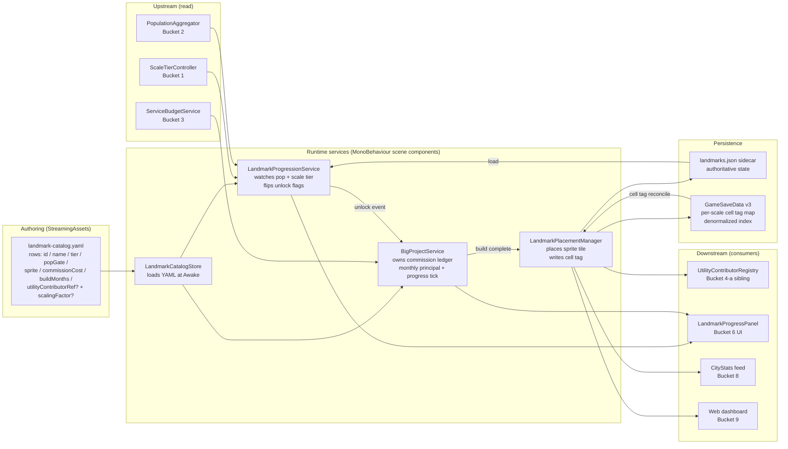

# Landmarks — Exploration (stub)

> Pre-plan exploration stub for **Bucket 4-b** of the polished-ambitious MVP (per `docs/full-game-mvp-exploration.md` + `ia/projects/full-game-mvp-master-plan.md`). **Split** off from the original merged `utilities-landmarks-exploration.md` stub — sibling is `docs/utilities-exploration.md`. Seeds a `/design-explore` pass that expands Approaches + Architecture + Subsystem impact + Implementation points. **Scope = landmarks v1 (progression ladder + commissioning). NOT utilities sim (sibling doc), NOT Zone S + per-service budgets (Bucket 3) except as a commission-budget consumer, NOT city-sim signals (Bucket 2), NOT CityStats (Bucket 8), NOT multi-scale core (Bucket 1 — couples to tier ladder but does not define it).**

---

## Problem

Territory Developer has no landmark progression. A polished ambitious MVP needs one:

- **No progression hook.** Testers reach a population threshold and nothing happens. No unlock moment, no saved-for commission, no reason to keep playing past the initial growth curve.
- **Landmarks don't exist as a system.** A single landmark sprite + a placement tool have been discussed but no progression contract, no scale-unlock ladder, no "commission + months-long build" mechanic.

**Design goal (high-level):** landmarks v1 = two parallel progression tracks — tier-defining landmarks (scale-tier transition rewards) and intra-tier reward landmarks (super-building unlocks at intermediate pop milestones). Some intra-tier rewards are "super-utility" buildings that couple to the utilities sim via a narrow catalog interface (sibling `docs/utilities-exploration.md`).

## Approaches surveyed

_(To be expanded by `/design-explore` — seed list only.)_

- **Approach A — Simple landmark registry.** Flag on zone with static sprite. Minimal churn; no progression, no commissioning. Fails the "progression ladder" framing.
- **Approach B — Scale-unlock rewards only.** One landmark per scale-tier transition, free gift on threshold cross. Matches "tier-defining" half of the hybrid but drops intra-tier rewards.
- **Approach C — Saved-for big projects only.** Player commits budget → N in-game months build → landmark tile placed. Matches "commissioning" surface but drops the unlock-moment / tier-defining track.
- **Approach D — Hybrid two-track, both pop-driven.** Tier-defining landmarks (scale-tier transition reward) + intra-tier reward landmarks (designer-tuned pop milestones inside a tier — "super-buildings" scaling existing services / utilities). Couples to Bucket 1 scale ladder for the tier-defining track; intra-tier rewards are independent designer-tuned milestones.

## Recommendation

_TBD — `/design-explore` Phase 2 gate decides._ Author's prior lean: **Approach D** (hybrid two-track). Cadence model is already locked (see below); `/design-explore` should validate architecture and interface surface against that lock.

## Locked decisions (prior design session)

- **Landmark unlock cadence = hybrid two-track, both pop-driven.**
  1. **Tier-defining landmarks** — unlock at scale-tier transitions. When the city crosses the population threshold that advances it to the next scale tier (e.g. 50k pop → region scale), the landmark associated with that tier becomes available (e.g. regional plocks with region scale). These landmarks mark and define the new tier.
  2. **Intra-tier reward landmarks** — unlock at intermediate population milestones inside a tier. Designer-tuned thresholds between tier transitions surface "super-buildings" that scale up existing services or utilities — e.g. a big power plant outputting 10× a normal plant, or a big state university (vs a normal school). These reward sustained growth within a tier.
- **Explicit rejections:**
  - No prestige / spendable-points currency.
  - No multi-condition gating (no zone-mix prereqs like "needs ≥3 commercial blocks").
  - No fixed-pop-threshold-only model (tier-defining track must couple to scale tiers).
- **Coupling.** Tier-defining unlocks fire from the same pop trigger that advances scale (Bucket 1 scale ladder). Intra-tier rewards are independent designer-tuned milestones.
- **Commissioning surface.** Landmark commission = bond-backed multi-month expenditure drawn against Bucket 3 per-service budget. Tier-defining landmarks = free gift on threshold cross (no commission cost). Intra-tier rewards = commissioned (cost budget + build time).

## Open questions

- **Landmark catalog authoring.** ScriptableObject per landmark vs code table? Sprite pipeline (Bucket 5 archetype spec). Schema: id, display name, tier / pop-milestone gate, sprite ref, commission cost, build duration, optional utility-contributor registry pointer (for super-utility rows) + scaling factor.
- **Big-project build mechanic.** Player commits budget → construction starts → N in-game months progress bar → landmark tile placed. Cancellable mid-build (partial refund)? Pause-able? Interaction with Bucket 3 deficit spending (can you commission in deficit?).
- **Tier-defining vs intra-tier count.** Tier-defining = 1 per scale transition = 2 (city→region, region→country). Intra-tier = how many per tier? 1–2 per tier = 3–6 total? Confirm with designer intent.
- **Super-utility interface (contract).** Intra-tier reward "super-building" entries register as normal utility contributors with a scaling factor. Schema: catalog row carries `utilityContributorRef` (nullable) + `contributorScalingFactor` (float, default 1.0). Owned here; consumed by sibling `docs/utilities-exploration.md` and Bucket 3 service registry.
- **UI surface.** Landmark progress panel (unlocked / in-progress / available-to-commission), big-project commission dialog. Which ship MVP? Coordinate with Bucket 6 UI polish.
- **Save schema impact.** Landmark unlock flags, big-project commitment ledger (principal + progress + ETA). `schemaVersion` bump — coordinate with Bucket 3's bump.
- **Consumer-count inventory.** Which surfaces read landmark state (HUD, info panels, CityStats Bucket 8, web dashboard)? Decide at exploration time for Bucket 8 parity contract.
- **Invariant compliance.** No new singletons. `LandmarkProgressionService` / `BigProjectService` as MonoBehaviour + Inspector-wired. `HeightMap` safety — no big-project placement writes cell height except via existing carving path (invariant #1).
- **Hard deferrals re-check.** Heritage / cultural landmarks, landmark-specific tourism effects, destructible landmarks — confirmed OUT at bucket level.

---

_Next step._ Run `/design-explore docs/landmarks-exploration.md` to expand Approaches → Architecture → Subsystem impact → Implementation points → subagent review. Then `/master-plan-new` to author `ia/projects/landmarks-master-plan.md`.

---

## Design Expansion

### Chosen Approach

**Approach D — Hybrid two-track, both pop-driven.** Locked-decisions block already commits cadence model; Phase 1 comparison matrix confirms D dominates on constraint fit + output control vs A/B/C.

| Criterion | A Registry | B Scale-unlock only | C Commission only | **D Hybrid two-track** |
|---|---|---|---|---|
| Constraint fit (tier-defining + intra-tier both required) | Fail (no progression) | Partial (drops intra-tier) | Partial (drops tier-defining) | **Full** |
| Effort | Low | Medium | Medium-high | **Medium-high** |
| Output control (designer-tuned milestones + commission pacing) | None | Low | Medium | **High** |
| Maintainability (catalog-driven) | High | Medium | Medium | **Medium** |
| Dependencies / risk (Bucket 1 scale ladder + Bucket 3 budget) | Low | Medium (B1 only) | Medium (B3 only) | **Medium (B1 + B3)** |

Rationale — D is the only approach satisfying the "unlock moment + sustained growth reward" pair. A fails progression outright. B drops designer-tuned intra-tier pacing. C drops the genre-signature tier-transition reward. D's extra coupling cost (both Bucket 1 scale ladder + Bucket 3 budget) accepted — umbrella already locks both buckets upstream in Tier C.

### Architecture



**Entry points.**

- `LandmarkProgressionService.Tick()` — called per simulation tick by existing tick bus. Reads scale-tier state + pop aggregate; raises `LandmarkUnlocked` event.
- `BigProjectService.TryCommission(landmarkId)` — player UI action; validates budget, opens bond, starts build ledger row.
- `BigProjectService.Tick()` — monthly advance; on `progress >= buildMonths` raises `LandmarkBuildCompleted` → `LandmarkPlacementManager.Place()`.

**Exit points.**

- `LandmarkUnlocked(id)` → HUD panel + CityStats feed.
- `LandmarkBuildCompleted(id, cell)` → placement manager writes sprite tile, cell tag, sidecar row, utility-contributor registration (if `utilityContributorRef != null`).
- `GetLandmarkAtCell(x,y,scale)` → CityStats / HUD / dashboard query surface (reads main-save cell tag).

### Subsystem Impact

| Subsystem | Nature | Invariant risk | Breaking? | Mitigation |
|---|---|---|---|---|
| **Save system** (`GameSaveManager` / `GameSaveData` / `persistence-system.md`) | Writes (sidecar + main-save cell tag map) + reads on load | #1 HeightMap sync — placement does NOT mutate height (tile-sprite only) | Additive under v3 envelope | Sidecar reconciliation on load: sidecar = truth, cell tags = rebuilt index if divergent |
| **Multi-scale** (Bucket 1 `ScaleTierController`) | Reads scale-tier transition events | none | Additive (event listener) | — |
| **City-sim** (Bucket 2 `PopulationAggregator`) | Reads population per scale | none | Additive | — |
| **Zone S + budgets** (Bucket 3 `ServiceBudgetService`) | Reads budget floor + opens bond row | none | Additive (bond-backed commission = new bond consumer) | Bond consumer contract locked in Bucket 3 kickoff |
| **Utilities sibling** (Bucket 4-a `UtilityContributorRegistry`) | Writes (register + unregister) via narrow catalog interface | none | Additive (new registrant source) | Catalog row `utilityContributorRef` nullable — sibling unaware when null |
| **GridManager** | No direct mutation (reads `GetCell` via `LandmarkPlacementManager`) | #5 cellArray access, #6 GridManager responsibility creep | None if placement manager extracted as `*Service.cs` helper | Place under `Assets/Scripts/Managers/GameManagers/LandmarkPlacementService.cs` per invariant #6 carve-out |
| **Tick bus** | Registers `LandmarkProgressionService` + `BigProjectService` as tick consumers | #3 no per-frame FindObjectOfType | Additive | Inspector-wire references in `Awake` |
| **CityStats (Bucket 8)** | Reads landmark inventory per scale | none | Additive (new metric rows) | Data-parity contract negotiated at Bucket 8 pre-plan |
| **Web dashboard (Bucket 9)** | Reads landmark inventory via existing ISR fetch | none | Additive | — |

Invariants flagged by number: **#1** (no), **#3** (cache refs in `Awake`), **#4** (no new singletons — MonoBehaviour + Inspector), **#5 + #6** (placement routed through `*Service.cs` extraction). No invariant violated.

### Implementation Points

```
Phase A — Catalog + data model (no runtime coupling yet)
  - [ ] Define `LandmarkCatalogRow` schema (id, name, tier, popGate, sprite, commissionCost, buildMonths, utilityContributorRef?, contributorScalingFactor?)
  - [ ] Ship `StreamingAssets/landmark-catalog.yaml` with 6 rows (2 tier-defining + 4 intra-tier, placeholder costs)
  - [ ] `LandmarkCatalogStore.cs` — MonoBehaviour, loads YAML at `Awake`, `GetById(id)` / `GetAll()` surface
  - [ ] EditMode test — load catalog, assert 6 rows, assert schema fields round-trip
  Risk: cost constants are placeholder — flag "migrate to cost-catalog bucket 11" at every commission cost touch site

Phase B — Progression service (unlock only, no commission yet)
  - [ ] `LandmarkProgressionService.cs` (MonoBehaviour, `[SerializeField]` refs to ScaleTierController + PopulationAggregator + LandmarkCatalogStore)
  - [ ] `Tick()` — evaluate each catalog row's gate, flip in-memory unlock flag on first satisfaction
  - [ ] Raise `LandmarkUnlocked(id)` event (UnityEvent or Action)
  - [ ] EditMode test — fake pop + scale-tier inputs, assert unlock order (tier-defining + intra-tier)
  Risk: tier-defining unlocks must fire AFTER `ScaleTierController` emits tier-transition — establish tick ordering in `GameManager` bootstrap

Phase C — Placement + sidecar save (tier-defining track only)
  - [ ] `LandmarkPlacementService.cs` under `Assets/Scripts/Managers/GameManagers/` (carve-out per invariant #6)
  - [ ] `Place(landmarkId, cell, scale)` — writes sprite tile via existing tile-placement API, writes cell tag on target scale cell-map, appends sidecar row
  - [ ] `landmarks.json` sidecar writer/reader bundled with main save via `GameSaveManager` hook
  - [ ] Load reconciliation — sidecar = truth, missing cell tags rebuilt from sidecar on load
  - [ ] `GameSaveData.schemaVersion = 3` (under Bucket 3 v3 envelope — no mid-tier bump)
  - [ ] PlayMode test — place tier-defining landmark on region-scale-crossed state, save, reload, assert sidecar + cell tag restored
  Risk: schema version bump coordinates with Bucket 3 (zone-s-economy Step 1 owns the bump)

Phase D — Commissioning (intra-tier track)
  - [ ] `BigProjectService.cs` (MonoBehaviour, refs to BudgetService + LandmarkCatalogStore + LandmarkPlacementService)
  - [ ] `TryCommission(landmarkId)` — checks unlock flag, opens bond row against Bucket 3 budget, writes ledger row (principal + progress + ETA)
  - [ ] `Tick()` — monthly advance, on `progress >= buildMonths` fires `LandmarkBuildCompleted` → PlacementService
  - [ ] Pause/resume — player action flips `paused` flag on ledger row; ticks skip on pause
  - [ ] Deficit commission allowed (bond underwrites — no floor check beyond bond ceiling)
  - [ ] EditMode test — commission → N tick advance → complete; pause mid-build → no progress
  Risk: bond contract stability — Bucket 3 kickoff must ship `IBondConsumer` interface before this phase

Phase E — Super-utility contributor bridge
  - [ ] On `LandmarkBuildCompleted`, if catalog row has `utilityContributorRef != null`, call `UtilityContributorRegistry.Register(landmarkId, contributorRef, scalingFactor)`
  - [ ] On landmark destroyed (save flag flip) — call `Unregister(landmarkId)` (v1 no in-game destruction but load-path must re-register)
  - [ ] EditMode test — commission super-power-plant landmark, assert utility pool production bumped by 10× scalingFactor
  Risk: sibling Bucket 4-a interface must land before this phase — hard sequencing dep

Phase F — UI surface (Bucket 6 coordination)
  - [ ] `LandmarkProgressPanel.cs` — lists unlocked / in-progress / available-to-commission rows, reads from services (no per-frame FindObjectOfType — cache in `Awake`)
  - [ ] Commission dialog — confirm cost + build duration; invokes `BigProjectService.TryCommission`
  - [ ] Minimum viable — no tooltip / glossary polish, no onboarding hook (Bucket 6 owns those)
  Risk: Bucket 6 UiTheme must land first (Tier B' exit)

Deferred / out of scope
- **Cost catalog migration** → future bucket 11 `cost-catalog-master-plan.md` (user to add to full-game-mvp umbrella separately). Landmark costs stay placeholder constants until migrated.
- **Landmark destruction / decay** — v1 no removal after placement; hard deferral.
- **Heritage / cultural landmarks, landmark-specific tourism effects** — confirmed OUT at bucket level.
- **Mid-build cancellation + partial refund** — v1 ships pause-only. Cancel post-MVP if requested.
- **Multi-cell landmark footprints** — v1 ships 1-cell sprite placement. Multi-cell deferred (couples to pivot-cell contract).
- **In-game landmark info panel / tooltip / glossary row polish** — Bucket 6 scope.
```

### Examples

**Catalog YAML (sample 3 of 6 rows):**

```yaml
- id: regional_plocks
  name: Regional Plocks
  tier: region
  popGate: scale_transition_city_to_region
  sprite: landmarks/regional_plocks
  commissionCost: 0     # tier-defining = free gift
  buildMonths: 0        # tier-defining = instant placement
  utilityContributorRef: null
  contributorScalingFactor: 1.0

- id: big_power_plant
  name: Giant Coal Plant
  tier: region
  popGate: { kind: intra_tier, pop: 150000 }
  sprite: landmarks/big_power_plant
  commissionCost: 2500000   # placeholder — cost-catalog bucket 11 owns later
  buildMonths: 18
  utilityContributorRef: contributors/coal_plant
  contributorScalingFactor: 10.0

- id: state_university
  name: State University
  tier: region
  popGate: { kind: intra_tier, pop: 250000 }
  sprite: landmarks/state_university
  commissionCost: 1800000
  buildMonths: 24
  utilityContributorRef: null
  contributorScalingFactor: 1.0
```

**Sidecar `landmarks.json` after 2 placements:**

```json
{
  "schemaVersion": 1,
  "landmarks": [
    {
      "id": "regional_plocks",
      "cell": { "x": 42, "y": 88, "scale": "REGION" },
      "footprint": { "w": 1, "h": 1 },
      "placedTick": 12400,
      "active": true,
      "counters": { "tourismVisits": 0, "upkeepDebt": 0 }
    },
    {
      "id": "big_power_plant",
      "cell": { "x": 17, "y": 33, "scale": "REGION" },
      "footprint": { "w": 1, "h": 1 },
      "placedTick": 21840,
      "active": true,
      "counters": { "tourismVisits": 0, "upkeepDebt": 0 }
    }
  ]
}
```

**Main-save cell tag extract (denormalized index, per-scale):**

```json
{
  "schemaVersion": 3,
  "regionCells": [
    { "x": 42, "y": 88, "landmarkId": "regional_plocks" },
    { "x": 17, "y": 33, "landmarkId": "big_power_plant" }
  ]
}
```

**Edge case — sidecar / cell tag divergence on load:**

Sidecar has `big_power_plant @ (17,33)`, main-save cell tag absent at `(17,33)`. Load reconciliation:
1. Load sidecar first — sidecar = truth.
2. Walk sidecar rows; for each row, write cell tag on target scale cell-map (idempotent — overwrites whatever was there).
3. Walk main-save cell tags; for each tag without a matching sidecar row — clear tag (dangling).
4. Log reconciliation delta to diagnostics channel for regression visibility.

Result — `(17,33)` cell tag restored from sidecar; no data loss.

### Review Notes

Subagent review run on Phases 3–7 (Plan subagent prompt per SKILL.md §Phase 8). BLOCKING items = 0. NON-BLOCKING + SUGGESTIONS captured below:

**NON-BLOCKING**

- *Phase B tick ordering* — `LandmarkProgressionService.Tick()` reads scale-tier state; if it runs before `ScaleTierController.Tick()` on transition ticks, unlock fires one tick late. Mitigation: explicit tick order registration in `GameManager` bootstrap (same pattern as existing services). Call out in Phase B task list at master-plan-new time.
- *Phase C sidecar bundling* — `landmarks.json` must share atomic write path with main save to prevent torn state on crash mid-save. Mitigation: `GameSaveManager` writes both files to temp + atomic rename as a pair. Existing save path already does this for main save; extend to sidecar.
- *Phase D bond ceiling* — "deficit commission allowed" assumes Bucket 3 `IBondConsumer` exposes a ceiling query. If bucket 3 v1 ships without a ceiling concept, commission fails-open (unbounded debt). Mitigation: coordinate at Bucket 3 kickoff — negotiate ceiling-query contract.

**SUGGESTIONS**

- *Catalog source-of-truth* — YAML hand-authored. Validator (`npm run validate:all`) should assert id uniqueness + `utilityContributorRef` resolves when non-null + `popGate` enum covers all tiers. Add validator rule at Phase A close.
- *UI progress panel MVP* — consider showing "next landmark unlocks at pop 200k" affordance even before any landmark unlocks; hides progression opacity. Out of bucket but worth Bucket 6 ticket.
- *Dashboard parity schema* — Bucket 8 pre-plan should include `landmarks[]` array in dashboard ISR contract. Flag at Bucket 8 kickoff.

### Expansion metadata

- Date: 2026-04-17
- Model: claude-opus-4-7
- Approach selected: D (hybrid two-track, both pop-driven)
- Blocking items resolved: 0
