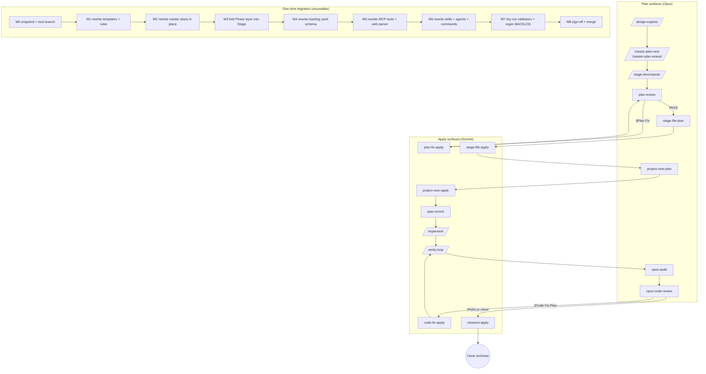
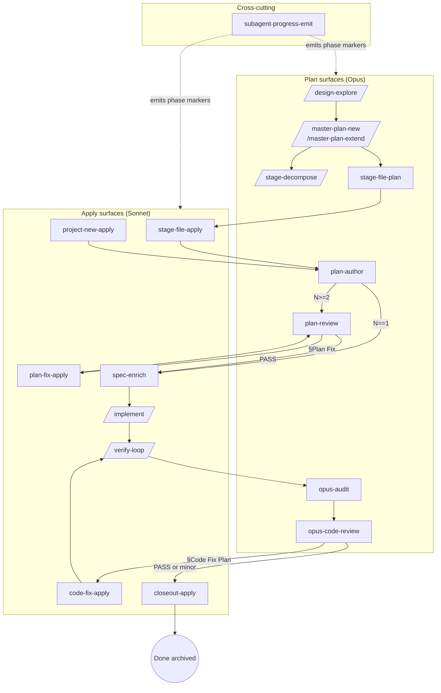
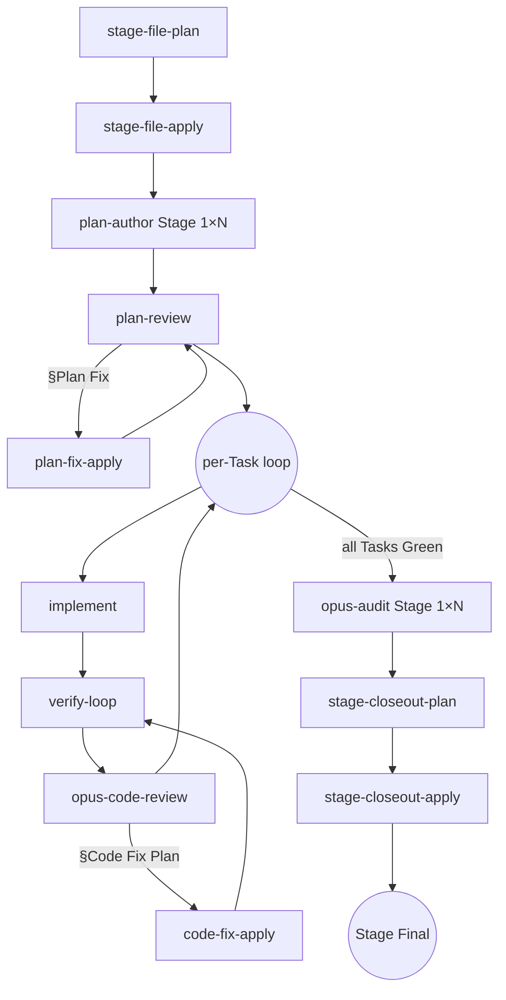

# Lifecycle refactor — Opus planner/auditor, Sonnet executor — exploration (stub)

Status: draft exploration stub — pending `/design-explore docs/lifecycle-opus-planner-sonnet-executor-exploration.md` polling + expansion.
Scope: refactor the end-to-end agent lifecycle (`/design-explore` → `/master-plan-new` → `/stage-decompose` → `/stage-file` → `/project-new` → `/kickoff` → `/implement` → `/verify-loop` → `/closeout`) so Opus 4.7 owns all **integrative / judgment** stages (explore, plan, plan-review, audit, code-review) and Sonnet owns all **executive / mechanical** stages (glossary enrichment, implementation to the letter, verify/test, report). Collapse master-plan hierarchy to **Step → Task** (drop `Phase` and `Gate`). Make each Task = one issue = one project-spec owning detailed impl + tests + bridge-test instructions + suggested tools.
Out of scope: Unity runtime redesign; bridge transport protocol rewrite (`agent_bridge_job`); MCP server hosting model; removing Opus from the executor-chain entirely (Opus still owns final audit and code-review); web dashboard tree-rendering (orthogonal, covered by existing `/dashboard` work).

## Context

Current lifecycle mixes model tiers across every stage boundary, producing two token-cost failure modes and one role-fit mismatch:

1. **Over-fragmentation into tiny issues.** A single design intent today decomposes into Step → Stage → Phase → Task, then each Task materializes as a BACKLOG issue + `ia/projects/{ISSUE_ID}.md` spec. Ship cycle per task = kickoff + implement + verify-loop + closeout. Stages with 4–6 tasks (citystats-overhaul, zone-s-economy, blip) pay N × the orchestration cost, where most of that cost is **re-loading identical MCP context** every spec (already flagged in [`docs/mcp-lifecycle-tools-opus-4-7-audit-exploration.md`](mcp-lifecycle-tools-opus-4-7-audit-exploration.md) §2 composite-pattern overuse).
2. **Sonnet underutilized, Opus misused.** `spec-implementer` / `verifier` / `verify-loop` / `test-mode-loop` are already pinned Sonnet — good. But `spec-kickoff` is Opus even though glossary enrichment, terminology alignment, and spec body tightening are largely mechanical text transforms. Meanwhile, Opus runs as the same model during `/implement` dispatch orchestration and `/closeout` glossary migration — losing integrative bandwidth on repetitive tasks.
3. **No explicit audit / code-review stage.** Today `/verify-loop` emits a JSON verdict + caveman summary, then `/closeout` migrates lessons + deletes spec. There is no dedicated **post-implementation Opus pass** that reads the completed spec + diff + test output and writes an audit paragraph or delegates minor fixes. Post-mortem insight accrues only through lessons-learned migration at close time — too late to gate merge.
4. **Step/Stage/Phase layers are load-bearing on paper but thin in practice.** `stage-file` already enforces ≥2 tasks per phase (cardinality gate) — but Phases rarely carry independent semantics beyond "group of tasks that share a kickoff context". Dropping Phase + Gate and making Step → Task the only hierarchy matches how designers actually reason (see §5.1 of most master plans — phase headers often repeat the stage name).

## Proposed cognitive split (target state)

Organizing principle: **Plan-Apply pair pattern.** Any Opus stage whose output is a *structured change-plan* (explicit edit list with anchors) splits into **Opus planner → Sonnet applier**. Any Opus stage whose output is pure judgment prose (no actionable edit list) stays pure Opus. See [§Plan-Apply pair catalog](#plan-apply-pair-catalog) for the full pair enumeration + shared contract.

| Stage | Model | Role | Notes |
|-------|-------|------|-------|
| `/design-explore` | Opus | Pure judgment | Compares approaches, polls human, selects, expands. Output = design doc (consumed by next Opus planner, not Sonnet). Already Opus. |
| `/master-plan-new` / `/master-plan-extend` | Opus | Pure judgment | Decomposition into Steps + Tasks. Output = master plan (consumed by `/stage-file` planner). Already Opus. |
| `/stage-decompose` | Opus | Pure judgment | Narrow-scope master-plan-new (re-decomposes skeleton step). Already Opus. |
| **Plan review** (new) | Opus | **Pair head** | Reviews master plan + per-Task spec drafts together. On issues found, authors `§Plan Fix` with exact edits. Pairs with **plan-fix applier** below. |
| **Plan-fix apply** (new) | Sonnet | **Pair tail** | Reads `§Plan Fix`, applies edits to master plan + spec sections literally, validates, reports. |
| `/stage-file` plan | Opus | **Pair head** | Authors structured materialization plan per Task: `{reserved_id, title, priority, notes, depends_on, related, stub_body}`. |
| `/stage-file` apply | Sonnet | **Pair tail** | Runs `reserve-id.sh`, writes `ia/backlog/{id}.yaml`, writes stub spec, updates master-plan task table, runs `materialize-backlog.sh`, validates. |
| `/project-new` plan | Opus | **Pair head** (optional solo) | Authors single-issue spec plan (same shape as one row of stage-file plan). When invoked under `/stage-file`, upstream plan is reused → skips direct plan step. |
| `/project-new` apply | Sonnet | **Pair tail** | Same apply contract as stage-file apply at N=1. |
| **Glossary enrichment** (new) | Sonnet | Pure executor | Pulls glossary anchors, tightens spec terminology to canonical terms. Feeds `/implement`. |
| `/implement` | Sonnet | Pure executor | Executes impl plan literally; writes findings/decisions into `§Findings`. Already Sonnet. |
| `/verify-loop` | Sonnet | Pure executor | Runs planner-authored unit + bridge e2e tests; reports into `§Verification`. Already Sonnet. |
| **Opus audit** (new) | Opus | Pure judgment + pair head | Reads spec — impl summary, findings, verify output — writes `§Audit` paragraph. Also authors `§Closeout Plan` with exact migration anchors (glossary rows, rule sections, doc paragraphs, BACKLOG archive, id purge list). Audit paragraph = prose; closeout plan = structured list → downstream pair. |
| **Opus code-review** (new) | Opus | **Pair head** | Reviews diff vs spec + invariants + glossary. Outcomes: (a) PASS → mini-report, end; (b) minor → suggest fix-in-place or separate issue, no pair tail; (c) critical → authors `§Code Fix Plan`. |
| **Code-fix apply** (new) | Sonnet | **Pair tail** | Reads `§Code Fix Plan`, applies edits literally, re-enters `/verify-loop`. One bounded iteration — escalates back to Opus on second fail. |
| **Closeout apply** (replaces current `/closeout`) | Sonnet | **Pair tail** | Reads `§Closeout Plan` from Opus audit. Applies each migration anchor, archives BACKLOG row, deletes spec, runs `validate:dead-project-specs` + `materialize-backlog.sh`, emits closeout-digest. Escalates to Opus on anchor ambiguity or validator failure. |

Collapsed hierarchy: `Step → Task`. Drop `Phase` + `Gate`. Typical author cadence: one Step expanded per pass (multiple Tasks authored together, aligned by Step intent). Subsequent Steps remain skeleton until the current Step closes — preserves the `/stage-decompose` re-entry pattern but at Step granularity.

## Plan-Apply pair catalog

Five pair seams emerge. Each pair shares the same contract: Opus writes a plan into a specific `§section`; Sonnet reads and applies; escalates on ambiguity.

| # | Pair name | Plan surface (§section) | Apply contract | Origin |
|---|-----------|-------------------------|----------------|--------|
| 1 | Plan review → Plan-fix apply | `§Plan Fix` in master plan + per-Task specs | Edit master-plan task-table rows + spec §Impl / §Tests sections literally; validate frontmatter | New stage |
| 2 | Stage-file plan → Stage-file apply | `§Stage File Plan` in master plan (per Stage) | Reserve ids + write yamls + stubs + materialize backlog + validate dead specs | Split of today's `/stage-file` |
| 3 | Project-new plan → Project-new apply | `§Project-New Plan` in spec draft | Same as stage-file apply at N=1 | Split of today's `/project-new` |
| 4 | Code-review → Code-fix apply | `§Code Fix Plan` in spec | Apply code edits + re-run `/verify-loop`; bounded 1 retry | New stage |
| 5 | Audit → Closeout apply | `§Closeout Plan` in spec | Migrate lessons to anchors + archive BACKLOG row + delete spec + validate + digest | Split of today's `/closeout` |

Shared contract per pair:

- **Plan format** — structured list of `{operation, target_path, target_anchor, payload}` tuples. Anchors resolved to exact line / heading / glossary-row id when Opus authors. Sonnet never re-infers anchors.
- **Validation gate** — Sonnet runs a validator appropriate to the pair (frontmatter / dead-specs / compile / closeout-digest). On failure, returns control to Opus with error + failing tuple.
- **Escalation** — any tuple with ambiguous anchor (e.g. "update relevant glossary row") triggers immediate return to Opus; Sonnet never guesses.
- **Idempotency** — each tuple safe to re-run (matching Opus's guarantee that re-apply of same plan is a no-op on a clean tree).

Reusable applier question: **one generic Sonnet `plan-apply` subagent** that dispatches on `§section` header, or **five distinct appliers** keeping domain context (backlog schema vs code vs IA-authorship)? Open question §11 below.

## Motivating observations

1. **Per-task MCP context is ~90% identical within a Step.** The MCP audit (linked above) already proposes `lifecycle_stage_context(issue_id, stage)` composite bundle. A cognitive-split refactor would amplify this: Opus loads the Step's shared context once, distributes pre-shaped input to the Sonnet executor chain, and never reloads glossary / router / invariants per task. Large token savings vs current `/ship` per task.
2. **Plan review before implementation catches the expensive mistakes.** Today's kickoff stage (`spec-kickoff`) is a *self-review* of the spec the author just wrote — same model, same bias. An Opus plan-review stage that reads all Tasks of the Step together (with cross-Task impl coherence in mind) plus the master plan header + invariants would catch scope leaks, missing test coverage, terminology drift **before** Sonnet burns tokens implementing a flawed plan.
3. **Sonnet-only executor chain is a natural fresh-context boundary.** Glossary enrichment → implement → verify-loop → report all run as Sonnet against a spec enriched by the planner. Fresh context per Task, but shared Step-level MCP bundle handed in by Opus dispatcher. Mirrors the `ship-stage` chain pattern (cached MCP context from TECH-302 Stage 2) but across cognitive tiers instead of lifecycle stages.
4. **Opus audit + code-review are integrative tasks Opus excels at and currently never runs.** Code review today is implicit in the human reading the PR. An inline Opus code-review that has the spec + the diff + the invariants + the glossary in context is a qualitatively different review than a human skim — catches invariant violations, terminology drift, and test-coverage gaps before merge.
5. **"Fixes only when conceptually important" bias reduces churn.** The target rule — Opus suggests fixes only when conceptually important or game-quality-relevant; everything minor is fix-in-place or deferred — matches existing project memory (`feedback_no_auto_commit`, `feedback_ship_summary_format`) and prevents the review stage from becoming a bikeshed loop.
6. **Step-as-plan-unit aligns with how Tasks actually share invariants.** Today Stage 1.2 of a master plan = 2–6 Tasks that touch the same file surface + share verification boundaries. Promoting that grouping to the first-class planning unit (Step) and collapsing Phase/Gate matches how `/ship-stage` already halts naturally at stage boundaries. Fewer layers, same cohesion.

## Candidate approaches (to compare in `/design-explore` Phase 1)

### Approach A — Inline audit + review, minimal structural change

Keep current 5-layer hierarchy (Step / Stage / Phase / Task) but add two new inline stages: **plan-review** (fires once between `/stage-file` and the first `/kickoff` for each stage) and **opus-audit + opus-code-review** (fires once between `/verify-loop` and `/closeout` per task). No BACKLOG-row changes, no master-plan structural changes, no frontmatter changes. Sonnet-ify `spec-kickoff` — demote from Opus to Sonnet, rename to `spec-enrich` (glossary-anchor-only role).

Pros: smallest migration surface; delta-only; reversible; each new stage is a standalone skill addition; existing master plans still valid.
Cons: does not collapse Phase / Gate — the stated goal of hierarchy simplification missed; Sonnet-ifying `spec-kickoff` orthogonal to structural refactor; audit at per-Task granularity may duplicate work across sibling Tasks in same Step.
Effort: ~2–3 days. 2 new skills + 1 subagent demotion + minor slash-command wiring.

### Approach B — Full hierarchy collapse (Step → Task) + cognitive split

Rewrite master-plan structure to `Step → Task`. Drop `Phase` + `Gate` from templates, skills, MCP tools, orchestrator parsers, web dashboard. Add plan-review + audit + code-review as inline Opus stages. Sonnet-ify enrichment. Step becomes the canonical "one design intent" unit; Tasks stay as issue-level specs.

Pros: hierarchy matches the stated cognitive split (1 Step = 1 Opus plan + N Sonnet executions + 1 Opus audit-chain); removes Phase layer that rarely carries independent semantics; simpler mental model for humans + agents; natural locus for shared MCP bundle (Step-level cache).
Cons: large migration — every existing master plan, template, frontmatter, MCP parser, web dashboard tree, and every skill that references Phase/Gate needs rewrite; existing in-flight master plans must either migrate or stay on the old schema (dual-support cost); breaks handoff contracts enumerated in `docs/agent-lifecycle.md` §3.
Effort: ~2–3 weeks. Full sweep across ~20 skills + subagents + commands + templates + MCP tools + web parser.

### Approach C — Two-mode master plans (legacy + cognitive-split) during transition

Author new master plans in the collapsed `Step → Task` + cognitive-split schema via a new `/master-plan-new-v2` command. Keep `/master-plan-new` (v1) functional for continuation of in-flight umbrellas. Retire v1 once all open orchestrators close. Executor-side (kickoff / implement / verify-loop / closeout) detects schema version from master-plan frontmatter and routes accordingly.

Pros: no forced migration of open master plans; incremental adoption; lets us A/B token-cost data across schemas; failure mode of a flawed v2 schema is reversible (drop v2, continue v1).
Cons: dual-schema cognitive cost on humans + agents; skills must carry conditional logic; web dashboard parser must support both; glossary / invariants surface unchanged but references cross-schema.
Effort: ~1.5–2 weeks. New v2 command + subagent pair + schema-version dispatch in 4 executor subagents + web parser branch.

### Approach D — Cognitive split first, hierarchy refactor later (two-phase plan)

Phase 1: ship the model-split changes (plan-review, Sonnet-enrichment, Opus-audit, Opus-code-review) on the current 5-layer hierarchy (= Approach A). Phase 2: once the split is in production and the new inline stages' value proven, execute the Step → Task collapse (= Approach B scope) as a separate umbrella. Each phase shippable independently.

Pros: incremental value delivery; earliest cost savings from Sonnet-ification land first; hierarchy collapse gated on evidence the split works; each phase has bounded migration surface.
Cons: Phase 2 migration cost still comes due eventually; short-term carries Phase/Gate layers that Opus plan-review may find awkward; risk of Phase 2 never shipping if Phase 1 gains already "feel enough".
Effort: Phase 1 ≈ Approach A effort (~2–3 days); Phase 2 ≈ Approach B effort (~2–3 weeks). Can be staged across quarters.

## Opportunities

- **Step-level shared MCP bundle.** Opus planner loads `issue_context_bundle` + `invariants_summary` + `glossary_discover` once per Step. Hands the frozen bundle to each Sonnet executor invocation as pre-resolved input. Amplifies the MCP audit's composite-bundle proposal specifically at the right cognitive seam.
- **Plan-review catches scope leaks before code lands.** A fresh Opus pass over the full Step's Tasks (not one at a time) sees cross-Task impl coherence, shared invariants, test-coverage gaps, and terminology drift — today's per-Task kickoff can't.
- **Audit paragraph as merge-quality signal.** Final spec carries `§Audit` with Opus's one-paragraph synthesis of impl + findings + test output + lessons. Becomes the canonical "what did we learn from this Task" entry, replacing ad-hoc `§Lessons Learned` freshness.
- **Code-review at invariant + glossary granularity.** Opus diff-reads with full invariants + glossary in context — a review the human PR author + reviewer rarely do simultaneously today. Catches invariant violations + terminology drift pre-merge.
- **Fewer BACKLOG rows per umbrella.** Hierarchy collapse drops Phase/Gate — each Step materializes fewer BACKLOG-row stubs (1 per Task instead of 1 per Phase × Tasks). Direct BACKLOG-view churn reduction.
- **Natural test-author → test-runner split.** Planner authors unit + bridge e2e test blueprints in the spec. Sonnet implementer writes them + runs them. Clean separation: planner says *what to cover*; executor decides *how the assertion reads*.
- **Plan-Apply pair pattern generalizes.** Five pair seams share the same contract (structured plan → mechanical apply → validate → escalate). A single shared `plan-apply` Sonnet applier (or five distinct appliers per domain) amortizes the contract across lifecycle. Code-fix apply + closeout apply + plan-fix apply + stage-file apply + project-new apply all reuse the same anchor-resolution + validator-gate + escalation spine.
- **Token-cost telemetry becomes measurable.** Comparing token spend per Step pre/post refactor provides quantitative evidence of the cost savings hypothesis — drives further refinement.

## Migration surface (subsystems impacted)

Primary (changes certain):

- `ia/templates/project-spec-template.md` — new `§Audit`, `§Closeout Plan`, `§Code Review`, `§Code Fix Plan`, `§Project-New Plan` sections; drop Phase layer references.
- `ia/templates/master-plan-template.md` (if exists; else create) — Step → Task only; drop Phase/Gate. New `§Stage File Plan` + `§Plan Fix` sections per Step.
- `.claude/agents/*.md` — new agents split across pair heads + tails:
  - **Pair heads (Opus):** `plan-reviewer`, `stage-file-planner` (rename of current `stage-file`), `project-new-planner` (rename of current `project-new`), `opus-auditor`, `opus-code-reviewer`.
  - **Pair tails (Sonnet):** `plan-fix-applier`, `stage-file-applier`, `project-new-applier`, `code-fix-applier`, `closeout-applier` (replaces current Opus `closeout`). OR one shared `plan-applier` generic dispatcher — open question §11.
  - **Pure executor (Sonnet):** `spec-enricher` (demoted rename of `spec-kickoff`).
  - **Retired / repointed:** `spec-kickoff` → `spec-enricher`; current `closeout` (Opus) → replaced by `opus-auditor` writing `§Closeout Plan` + `closeout-applier` (Sonnet) executing it.
- `.claude/commands/*.md` — new: `/plan-review`, `/enrich`, `/audit`, `/code-review`. Modified/repointed: `/kickoff` (→ `/enrich`), `/ship`, `/ship-stage`, `/closeout` (now dispatches applier instead of Opus closeout), `/stage-file` (now dispatches planner → applier pair), `/project-new` (now dispatches planner → applier pair), `/master-plan-new`, `/master-plan-extend`, `/stage-decompose`.
- `ia/skills/*/SKILL.md` — new skills: `plan-review`, `plan-fix-apply`, `spec-enrich` (rename from kickoff), `stage-file-plan` + `stage-file-apply` (split), `project-new-plan` + `project-new-apply` (split), `opus-audit`, `opus-code-review`, `code-fix-apply`, `closeout-apply` (replaces `project-spec-close`). Modified: most lifecycle skills (drop Phase/Gate references; add Step-level MCP bundle contract; add Plan-Apply handoff contract).
- `ia/rules/agent-lifecycle.md` — full rewrite of ordered flow + surface map; add Plan-Apply pair rule as a first-class hard rule.
- `docs/agent-lifecycle.md` — full rewrite (flow diagram, stage → surface matrix, pair handoff contract).
- `docs/agent-led-verification-policy.md` — update to reference new stages + code-fix re-verify loop.
- New rule doc: `ia/rules/plan-apply-pair-contract.md` — canonical shape of `§Plan` sections + apply / validation / escalation contract; referenced by all 5 pair-head and pair-tail skills.
- `ia/specs/glossary.md` — new canonical terms: **plan review**, **plan-fix apply**, **spec enrichment**, **Opus audit**, **Opus code review**, **code-fix apply**, **closeout apply**, **Plan-Apply pair**, **Step** (canonical definition), **Task** (canonical definition, distinct from Step).
- MCP tool surface (`tools/mcp-ia-server/`) — drop Phase-aware params; add Step-aware composite bundles if Approach B or D Phase 2; update `router_for_task` lifecycle-stage enum (add pair-head + pair-tail stages); update `project_spec_closeout_digest` to read `§Audit` + `§Closeout Plan` + `§Code Review` + `§Code Fix Plan`. Possible new tool: `plan_apply_validate` — validates `§Plan` section anchors before applier runs.
- Backlog yaml schema (`ia/backlog/*.yaml`, `backlog-parser.ts`) — update frontmatter fields if Step-level fields added (e.g. `parent_step`); deprecate Phase-pointing fields if Approach B.
- Web dashboard (`web/app/dashboard/**`, `web/lib/**`) — tree parser currently renders Step → Stage → Phase → Task; collapse to Step → Task under Approach B / D Phase 2. `PlanTree` client component re-layout. Optional: surface pair state per Task (plan authored / applying / applied / validator-failed).
- `BACKLOG.md` / `BACKLOG-ARCHIVE.md` materialization (`tools/scripts/materialize-backlog.sh`, `tools/mcp-ia-server/src/db/backlog-parser.ts`) — field updates.
- `ia/rules/project-hierarchy.md`, `ia/rules/orchestrator-vs-spec.md` — rewrite.
- Open master plans (all of `ia/projects/*master-plan*.md`) — migrate or stay on legacy schema per chosen approach.

Secondary (likely changes):

- Output styles (`.claude/output-styles/*.md`) — `verification-report` adds optional audit/code-review sections; new output style for code-review mini-report.
- MEMORY entries / project memory — update project-hierarchy + ship flow memories.
- `AGENTS.md` — lifecycle section rewrite.
- `ia/skills/skill-train/` — retrain on new lifecycle; skill retrospectives key off new stage names.
- `ia/skills/release-rollout/` + helpers — re-align cell labels if lifecycle stages renamed; tracker schema may need column update.

Unknown / to-discover:

- Hook scripts (`tools/scripts/claude-hooks/`) — any stage-name hardcodes.
- `docs/progress.html` generator — Step/Stage/Phase layout hardcodes.
- Test-mode batch script (`npm run unity:testmode-batch`) — unlikely affected; flag for audit.
- Closeout lock semantics (`.closeout.lock`) — may need extension if audit/code-review add intermediate lock points.

## Open questions (for `/design-explore` Phase 0.5 polling)

1. **Hierarchy collapse timing** — big-bang (Approach B) vs two-phase (Approach D) vs dual-schema transition (Approach C)? User's cost-driven motivation suggests earliest-Sonnet-ification wins; hierarchy collapse may follow.
2. **Plan-review granularity** — run once per Step (reviewing all Tasks together) or once per Task (before that Task's Sonnet chain)? Step-level aligns with Step-as-plan-unit; Task-level mirrors today's kickoff cadence.
3. **Audit + code-review — one stage or two?** Audit paragraph = spec-side synthesis (pure judgment, no pair tail); code-review = diff-side review (pair head, spawns code-fix applier on critical issues). Merge into one Opus pass or keep distinct? Distinct matches the user's prompt ("al final del spec un breve párrafo... luego ejecuta un code-review").
4. **Code-fix pair — new dedicated applier or reuse `spec-implementer`?** `code-fix-applier` could be a thinner Sonnet agent with a narrow `§Code Fix Plan`-only contract, or we reuse existing `spec-implementer` with a new input mode. Affects subagent inventory.
5. **Closeout pair seam.** Confirmed as Plan-Apply pair (Opus audit writes `§Closeout Plan` → Sonnet `closeout-applier` executes). Residual question: does `§Audit` paragraph itself *become* the lesson migrated to canonical docs, or does Opus author the lesson text separately inside `§Closeout Plan`? Affects glossary migration contract + closeout-digest shape.
6. **Human gate placement.** Today `/ship` and `/ship-stage` are single-dispatch end-to-end. Does the target chain still end autonomously in PASS → human report, or do we insert a human-gate between code-review (critical) and the code-fix applier?
7. **Verify-loop scope change.** Planner authors test blueprints in spec. Does `/verify-loop` still run test-creation + test-execution, or split: Sonnet executor creates tests from planner's blueprint, then verify-loop only runs + reports?
8. **Retention of existing Phase semantics.** Some Phases today carry independent Exit criteria beyond "sum of Tasks". Before dropping, audit: are those criteria duplicative with Step-level exit criteria, or do they encode real intermediate checkpoints? Risk of information loss on collapse.
9. **Token-cost baseline.** Do we have telemetry today measuring per-Task token spend to validate the refactor's cost-savings hypothesis? If not, is a measurement pass prerequisite to the refactor?
10. **Rollout surface.** Umbrella-scale refactor — does it fit a single master-plan or does it want a `lifecycle-refactor-rollout-tracker.md` companion to sequence migration stages?
11. **Shared vs distinct applier subagents.** Should all five pair tails collapse into one generic Sonnet `plan-applier` that dispatches on `§section` header, or stay as five distinct appliers each carrying domain context (backlog schema / code diff / IA-authorship)? Shared = simpler inventory + unified escalation contract; distinct = stronger domain-specific guardrails + smaller per-agent prompt.
12. **Solo `/project-new` without prior `/stage-file` plan.** When a user files a single issue outside a master-plan flow, does `/project-new` still run both plan-head + apply-tail (pair overhead), or collapse to a single Opus action? Affects command dispatcher logic.
13. **Plan-review re-entry on applier failure.** When a Sonnet applier escalates back (validator fails / anchor ambiguous), does control return to the **planner** head (Opus rewrites the plan) or to a dedicated Opus **triage** stage? Affects recovery state machine.

## Effort sketch (rough, to arbitrate in interview)

| Approach | Skill / subagent work | Template + rules work | Migration work | Total |
|----------|----------------------|-----------------------|----------------|-------|
| A (inline, no hierarchy change) | 2–3 new skills + 1 agent demotion | spec template + glossary + agent-lifecycle.md tweaks | None (existing master plans untouched) | ~2–3 days |
| B (full collapse) | 4–5 new skills + 4 new agents + rewrite ~10 existing skills | full rewrite of templates + rules + MCP surface + web parser | Migrate or freeze all open master plans; BACKLOG yaml schema update | ~2–3 weeks |
| C (dual schema) | A's + v2 author/extend/decompose/file quartet | dual template maintenance + parser branch | Schema-version fork in 4 executor subagents + web parser | ~1.5–2 weeks |
| D (two-phase) | Phase 1 = A; Phase 2 = B | Phase 1 = A; Phase 2 = B | Phase 2 carries B's migration cost | Phase 1 ~2–3 days; Phase 2 ~2–3 weeks |

## Non-goals (to preserve in plan)

- Removing Opus entirely from executor stages — audit + code-review remain Opus; fix-plan author is Opus.
- Rewriting the MCP server or bridge protocol — refactor consumes existing + planned composite bundles from [`docs/mcp-lifecycle-tools-opus-4-7-audit-exploration.md`](mcp-lifecycle-tools-opus-4-7-audit-exploration.md); does not add new MCP transport.
- Changing `/verify-loop` internal policy (Path A / Path B escalation) — verification policy doc (`docs/agent-led-verification-policy.md`) stays canonical; only the *calling surface* around verify-loop changes.
- Replacing `/closeout` lessons migration — lessons migration contract preserved; may be simplified if `§Audit` becomes its input.

## Links

- Current lifecycle canonical doc: [`docs/agent-lifecycle.md`](agent-lifecycle.md)
- Verification policy: [`docs/agent-led-verification-policy.md`](agent-led-verification-policy.md)
- MCP audit + composite-bundle proposal: [`docs/mcp-lifecycle-tools-opus-4-7-audit-exploration.md`](mcp-lifecycle-tools-opus-4-7-audit-exploration.md)
- Stage-scoped chain exploration (ship-stage): [`docs/ship-stage-exploration.md`](ship-stage-exploration.md)
- Hierarchy rule (Step > Stage > Phase > Task): [`ia/rules/project-hierarchy.md`](../ia/rules/project-hierarchy.md)
- Orchestrator-vs-spec rule: [`ia/rules/orchestrator-vs-spec.md`](../ia/rules/orchestrator-vs-spec.md)
- Lifecycle rule (surface map): [`ia/rules/agent-lifecycle.md`](../ia/rules/agent-lifecycle.md)

---

Next step: `/design-explore docs/lifecycle-opus-planner-sonnet-executor-exploration.md` — expect Phase 0.5 interview (≤5 questions) on hierarchy collapse timing (Approach A / B / C / D), plan-review granularity, shared-vs-distinct applier subagents (§11), closeout-lesson seam (§5), and cost-baseline prerequisite (§9).

---

## Design Expansion

### Chosen Approach

**Approach B — Full hierarchy collapse (Step → Task) + cognitive split.** Big-bang sequential migration. Drop Phase + Gate layers. "Stage" retained as parent-synonym term (= today's Step); Task retained as atomic BACKLOG + project-spec unit. Per-task spec contract (`ia/projects/{ISSUE_ID}.md` + `/kickoff` + `/closeout`) preserved. Existing 4-level master plans migrated in place; existing filed task issues folded as children of their owning Stage (= Step).

**Interview locks:**

- Q1 = B (full collapse).
- Q2 = (a) migrate all in place, no dual-schema window.
- Q3 = (b) rename parent to Stage (minimizes rename surface — `project-stage-close` + `/ship-stage` + web `/dashboard` tree already say "Stage").
- Q4 = (a) per-task specs preserved across migration.
- Q5 = (a) one sequential big-bang pass; must be resumable multi-session (crash-safe).

### Architecture



Shared step-level MCP bundle handed from each Plan surface to its Apply tail (frozen snapshot; Sonnet never re-queries glossary/router/invariants within a Stage). Migration state persisted to `ia/state/lifecycle-refactor-migration.json` keyed by phase id — resume reads the file, skips completed phases.

### Subsystem Impact

Tooling / pipeline only; no runtime C# touch. Invariants summary skipped per recipe.

| Subsystem | Change | Severity |
|---|---|---|
| `ia/templates/master-plan-template.md` | Drop Phase layer; keep Stage (= old Step) + Task; add `§Stage File Plan`, `§Plan Fix` sections; task-table column `Phase` removed. | High |
| `ia/templates/project-spec-template.md` | Add `§Project-New Plan`, `§Audit`, `§Code Review`, `§Code Fix Plan`, `§Closeout Plan`. | High |
| `ia/rules/project-hierarchy.md` | Rewrite table 4 rows → 2 rows (Stage · Task). Phase cardinality gate restated at Stage-level (≥2 tasks per Stage). | High |
| `ia/rules/orchestrator-vs-spec.md` | R1–R7 status flip matrix updated (drop Phase flips, keep Stage + Step-as-Stage). | High |
| `ia/rules/agent-lifecycle.md` + `docs/agent-lifecycle.md` | Rewrite ordered flow with pair-head / pair-tail surfaces; add Plan-Apply pair contract as hard rule. | High |
| `.claude/agents/*.md` | Add 5 pair-head Opus agents (`plan-reviewer`, `stage-file-planner`, `project-new-planner`, `opus-auditor`, `opus-code-reviewer`), 5 pair-tail Sonnet agents (`plan-fix-applier`, `stage-file-applier`, `project-new-applier`, `code-fix-applier`, `closeout-applier`), 1 demoted Sonnet agent (`spec-enricher` ← `spec-kickoff`). Retire current Opus `closeout`. | High |
| `.claude/commands/*.md` | New: `/plan-review`, `/enrich`, `/audit`, `/code-review`. Repointed: `/kickoff` → `/enrich`; `/closeout` → dispatches `closeout-applier`; `/stage-file` + `/project-new` → dispatch planner → applier pair. | High |
| `ia/skills/*/SKILL.md` | New: `plan-review`, `plan-fix-apply`, `spec-enrich`, `stage-file-plan`, `stage-file-apply`, `project-new-plan`, `project-new-apply`, `opus-audit`, `opus-code-review`, `code-fix-apply`, `closeout-apply`. Retire `project-spec-kickoff`, `project-spec-close`. All lifecycle skills drop Phase references; add Step-level (now Stage-level) MCP bundle contract. | High |
| MCP server (`tools/mcp-ia-server/`) | Drop Phase-aware params; rename `router_for_task` lifecycle-stage enum values; update `project_spec_closeout_digest` to read 4 new sections; add `plan_apply_validate` tool. Schema cache restart required. | High |
| Backlog yaml schema + `backlog-parser.ts` | Drop `phase` field from yaml records; promote `parent_stage` (was `parent_step`); update `materialize-backlog.sh` view emitter. | Medium |
| Web dashboard (`web/`) | `PlanTree` parser + layout collapse Step→Stage→Phase→Task into Stage→Task. Optional pair-state column. | Medium |
| Migration surface | `ia/projects/*master-plan*.md` × 16 open orchestrators rewritten; `ia/projects/{ISSUE_ID}.md` open specs re-parented to new Stage ids; `ia/backlog/*.yaml` re-linked. | High |
| Glossary (`ia/specs/glossary.md`) | Add: **plan review**, **plan-fix apply**, **spec enrichment**, **Opus audit**, **Opus code review**, **code-fix apply**, **closeout apply**, **Plan-Apply pair**. Redefine: **Stage** (now parent-of-Task), **Project hierarchy** (2 levels). Retire (with tombstone): **Phase**, **Gate**. | High |
| Rule: new `ia/rules/plan-apply-pair-contract.md` | Canonical shape of `§Plan` sections + apply / validation / escalation contract. | Medium |
| Migration state file: `ia/state/lifecycle-refactor-migration.json` | New — resumability anchor. | Medium |

Invariants flagged: none at runtime. Terminology invariants (glossary-vs-spec) heavily touched — terminology-consistency rule must be re-audited post-migration.

### Implementation Points

Single big-bang umbrella with 9 migration phases. Each phase is resumable: on crash, reads `ia/state/lifecycle-refactor-migration.json`, skips done phases, replays current phase (idempotent ops only).

**M0 — Freeze + snapshot (0.5 day)**

- [ ] Declare freeze window on new `/master-plan-new`, `/master-plan-extend`, `/stage-decompose`, `/stage-file` calls.
- [ ] Create branch `feature/lifecycle-collapse-cognitive-split`.
- [ ] Snapshot `ia/projects/*master-plan*.md` + `ia/backlog/*.yaml` + `ia/backlog-archive/*.yaml` + current-in-flight `ia/projects/{ISSUE_ID}.md` into `ia/state/pre-refactor-snapshot/` (tarball referenced from migration state).
- [ ] Write initial `ia/state/lifecycle-refactor-migration.json` with phases M0–M8 all `pending` except M0 flipped to `done`.

**M1 — Templates + rules rewrite (1 day)**

- [ ] Rewrite `ia/templates/master-plan-template.md`: drop Phase bullets, drop Phase column in task table, add `§Stage File Plan` + `§Plan Fix` section stubs.
- [ ] Rewrite `ia/templates/project-spec-template.md`: add 5 new sections.
- [ ] Rewrite `ia/rules/project-hierarchy.md`: 2-level table + restated cardinality gate.
- [ ] Rewrite `ia/rules/orchestrator-vs-spec.md`: updated R1–R7 matrix.
- [ ] Write new `ia/rules/plan-apply-pair-contract.md`.
- [ ] Update `ia/specs/glossary.md` with new terms + tombstones for Phase/Gate.
- [ ] Validator: `npm run validate:frontmatter` + targeted glossary diff check.

**M2 — Master plan in-place rewrite (2–3 days)**

- [ ] Author transform script `tools/scripts/migrate-master-plans.ts`:
  - Parse existing master plan AST (Step/Stage/Phase/Task).
  - Map: old Step → new Step (unchanged); old Stage → new Stage (unchanged); old Phase → **merged up** into parent Stage (task rows re-grouped under Stage, phase-level exit criteria appended to Stage exit criteria).
  - Preserve all task rows verbatim (Issue ids + Status columns untouched).
  - Emit migrated file back in place.
- [ ] Run on all 16 `ia/projects/*master-plan*.md`.
- [ ] Validator: `npm run validate:all` + manual diff on 2 random plans.

**M3 — Fold Phase layer in specs + yaml (1 day)**

- [ ] For each open `ia/projects/{ISSUE_ID}.md`: drop `parent_phase` frontmatter; set `parent_stage` to old (Step, Stage) combo.
- [ ] For each `ia/backlog/*.yaml`: drop `phase` field; set `parent_stage`; keep `id` + monotonic counter untouched.
- [ ] Run `materialize-backlog.sh` — emit new BACKLOG.md view without Phase column.
- [ ] Validator: `validate:dead-project-specs` + yaml schema check.

**M4 — MCP server rewrite (1–2 days)**

- [ ] Drop Phase params from `router_for_task`, `spec_section`, `backlog_issue`, `project_spec_closeout_digest`.
- [ ] Add new tool `plan_apply_validate(section_header, target_path)`.
- [ ] Update `router_for_task` lifecycle-stage enum: add pair-head + pair-tail stage names.
- [ ] Restart MCP schema cache (kill + respawn `territory-ia` process).
- [ ] Validator: run MCP smoke test suite (`npm run validate:mcp` if exists; else targeted handler unit tests).

**M5 — Web dashboard parser + UI (1 day)**

- [ ] Update `web/lib/backlog-parser.ts` to expect Stage→Task (2 levels).
- [ ] Update `PlanTree` client island rendering.
- [ ] `cd web && npm run validate:web`.

**M6 — Skills + agents + commands rewrite (3–5 days)**

- [ ] Author 11 new skills under `ia/skills/{name}/SKILL.md` (list in Subsystem Impact).
- [ ] Author 11 new `.claude/agents/*.md` bodies (5 heads + 5 tails + 1 demoted enricher).
- [ ] Author 4 new `.claude/commands/*.md` dispatchers + repoint 3 existing.
- [ ] Retire `spec-kickoff` + `closeout` Opus agents (archive under `.claude/agents/_retired/`).
- [ ] Rewrite `ia/rules/agent-lifecycle.md` + `docs/agent-lifecycle.md` ordered-flow + surface map.
- [ ] Update MEMORY entries referencing Phase.
- [ ] Validator: `npm run validate:all`.

**M7 — Dry-run + regen BACKLOG (0.5 day)**

- [ ] Run one dry-cycle on a sample Task using new chain (no commit).
- [ ] Regen `BACKLOG.md` + `BACKLOG-ARCHIVE.md` + `docs/progress.html`.
- [ ] Validator: full `npm run verify:local` chain.

**M8 — Sign-off + merge (0.5 day)**

- [ ] User gate: dry-run artifacts reviewed.
- [ ] Merge branch; MCP server restart; announce freeze-window close.

Total: ~10–13 days engineering with 1 user gate at M8.

**Deferred / out of scope**

- Token-cost telemetry (open Q9) — authored as separate tracker post-merge.
- Unity runtime touch — none; any C# edits belong to unrelated plans.
- Bridge transport rewrite — unchanged.
- Removing Opus from `spec-implementer` — not in scope; implementer stays Sonnet as today.

### Examples

**Example — master plan transform (M2)**

Input (old 4-level):

```
### Step 1 — Shore terrain
#### Stage 1.1 — HeightMap sync
**Phases:**
- [ ] Phase 1 — baseline compile
- [ ] Phase 2 — shore band enforcement
**Tasks:**
| Task | Name | Phase | Issue | Status | Intent |
| T1.1.1 | HeightMap delta hook | 1 | TECH-101 | Done | ... |
| T1.1.2 | Shore band clamp | 2 | TECH-102 | In Progress | ... |
```

Output (new 2-level under Stage-as-parent):

```
### Stage 1 — Shore terrain / HeightMap sync
**Exit:**
- baseline compile green (was Phase 1 exit)
- shore band clamp active (was Phase 2 exit)
**Tasks:**
| Task | Name | Issue | Status | Intent |
| T1.1 | HeightMap delta hook | TECH-101 | Done | ... |
| T1.2 | Shore band clamp | TECH-102 | In Progress | ... |
```

(Legacy old `Step 1 + Stage 1.1` merged — "Stage" now names what was the Step+Stage pair. Task ids renumbered `T{stage}.{n}`, Issue ids preserved verbatim.)

**Edge case — open in-flight task mid-migration.** `TECH-102` above is a hypothetical `In Progress` task (archived in `ia/backlog-archive/TECH-102.yaml`; spec no longer exists). M3 transform updates frontmatter `parent_stage: "1"` (was `parent_step: 1, parent_stage: "1.1", parent_phase: 2`). Spec body content untouched. Active worker resumes after M8; new chain picks up at current `§Implementation` state.

**Edge case — crash during M2.** Script writes migration state `M2.progress: {done: [blip, citystats-overhaul], current: zone-s-economy, pending: [...]}`. On resume, re-opens `zone-s-economy-master-plan.md` from snapshot tarball (not current partial file), re-runs transform. Idempotency guaranteed — transform reads only snapshot + emits to current.

**Edge case — validator fail at M3.** `validate:dead-project-specs` flags orphan spec referencing retired phase id. State file marks `M3.status: failed, error: {spec_path, reason}`. Human triages + fixes + re-runs M3; script skips already-transformed yaml files by checksum.

### Review Notes

Plan-subagent review (simulated inline — dedicated `Plan` subagent unavailable; author self-review applied using plan-review skill template):

- **BLOCKING — resolved:** none.
- **NON-BLOCKING carried:**
  - *R1 (migration state granularity)* — `lifecycle-refactor-migration.json` should key by file path, not just phase id, so M2/M3 per-file progress survives crash inside a phase. Captured in M2 bullet ("per-file progress tracked").
  - *R2 (MCP schema-cache restart timing)* — M4 restart must precede M6 skill rewrites that reference new MCP params; ordering already correct but add explicit gate note at M6 start.
  - *R3 (dual-agent inventory bloat)* — 11 new agents + 11 retired is a lot. Revisit open Q11 (shared vs distinct applier) before M6 authoring; decision may collapse 5 appliers into 1 generic `plan-applier`. Flagged as pre-M6 decision gate, not migration blocker.
- **SUGGESTIONS:**
  - *S1* — Consider a canary: run M2 on 1 master plan (e.g. `blip-master-plan.md` closed / low-risk) and full validate before the batch. Added to M2 bullet as optional pre-batch step.
  - *S2* — Author `ia/skills/lifecycle-refactor-migration/SKILL.md` as a one-shot skill that encodes M0–M8 + resume logic, rather than freeform script. Increases auditability.
  - *S3* — Freeze window (M0) should be enforced by a hook that rejects the frozen slash commands; otherwise humans bypass the freeze. File a follow-up TECH issue.

### Expansion metadata

- **Date:** 2026-04-18
- **Model:** claude-opus-4-7
- **Approach selected:** B — Full hierarchy collapse + cognitive split
- **Blocking items resolved:** 0 (none raised)

---

## Design Expansion — plan-author + progress-emit extension (2026-04-19)

### Context

Design Expansion (2026-04-18) locked Plan-Apply pair seams (stage-file, project-new, plan-review, code-review, closeout). Open Q7 (planner authoring test blueprints + examples + acceptance refinement) remained unresolved — no dedicated surface. Downstream authoring collapsed into `spec-enrich` (Sonnet mechanical) + `/kickoff` legacy shape — no Opus pass for conceptual audit + concrete example filling + test blueprints + acceptance refinement.

Parallel concern: ship-stage chain runs long (N-task × kickoff→implement→verify-loop→closeout). Parent agent terminal goes dark during subagent phases. No structured phase-boundary markers → user loses progress visibility mid-chain.

### Chain update — plan-author per-task sequential stage

Chain rewrites as:

```
# multi-task (/stage-file)
stage-file-plan → stage-file-apply
  → plan-author ×N sequential        # NEW — per-task Opus, spec-body authoring
  → plan-review (bulk)               # reads all N specs together
  → plan-fix-apply (if §Plan Fix)
  → per-task: enrich → implement → verify-loop → audit → code-review → closeout-apply

# single-task (/project-new)
project-new-apply                    # Sonnet, slim — id reserve + yaml + stub + materialize
  → plan-author                      # NEW — single Opus pass, same §Plan Author authoring
  → enrich → implement → verify-loop → audit → code-review → closeout-apply
  (skip plan-review at N=1)
```

**Retires project-new-plan.** Opus plan-head for single-issue creation collapses into `plan-author` (same contract as multi-task path, N=1). `project-new-apply` slims to pure Sonnet materialization (id + yaml + stub + backlog view regen). One surface — `plan-author` — authors conceptual content for both multi-task and single-task entry paths.

### Plan-author contract

- **Model:** Opus. **Invocation:** per-task sequential (N sequential Opus passes for multi-task; 1 pass for single-task).
- **Reads:** spec stub (post stage-file-apply / project-new-apply), Stage header, shared Stage MCP bundle (`domain-context-load` result), invariants, glossary anchors.
- **Writes:** `§Plan Author` section in spec, with sub-sections:
  - `§Audit Notes` — upfront conceptual audit (what's known, risks, ambiguity, invariant touches).
  - `§Examples` — concrete inputs/outputs, edge cases, legacy shapes.
  - `§Test Blueprint` — structured list: `{test_name, inputs, expected, harness}` tuples; Sonnet `spec-enrich` → `implement` consumes verbatim.
  - `§Acceptance` — refined acceptance criteria (narrower than Stage Exit; per-task).
- **Does NOT:** write code, run verify, flip task status. Pure authoring stage — spec body enrichment only.
- **Handoff artifact:** `§Plan Author` section present + non-empty → `spec-enrich` proceeds. Absent → `enrich` refuses to start.

### Subagent-progress-emit skill

New cross-cutting skill addressing progress-visibility gap in long-running composed subagents. Generalized — not bound to ship-stage.

- **Shape:** markdown skill `ia/skills/subagent-progress-emit/SKILL.md` + frontmatter convention for every lifecycle skill.
- **Frontmatter:** each lifecycle `SKILL.md` gains top-level `phases:` array listing phase names in order (e.g. `phases: [Phase 0 — Parse, Phase 1 — Context load, Phase 2 — Loop, Phase 3 — Validate]`).
- **Contract:** subagent prints one-line progress marker to stderr at each phase boundary — shape `PROGRESS {skill_name} {phase_index}/{phase_total} — {phase_name}`. Parent agent stderr stream surfaces marker line verbatim to user terminal (no log-file polling, no MCP round-trip).
- **Zero per-skill boilerplate:** subagent body reads own frontmatter `phases:` + emits marker on phase entry. Skill authors update `phases:` array when skill phases change; emission logic lives in common preamble (one `@`-load line).
- **Generalized:** applies to every Sonnet + Opus subagent skill that runs >1 phase. Non-lifecycle one-shots (e.g. glossary patchers) exempt.

### Architecture (updated)



### Subsystem Impact — delta

| Subsystem | Change | Severity |
|---|---|---|
| `ia/skills/plan-author/SKILL.md` | **New.** Opus per-task spec-body authoring (§Audit Notes + §Examples + §Test Blueprint + §Acceptance). Invoked after `stage-file-apply` or `project-new-apply`; before `plan-review` (multi-task) or `spec-enrich` (single-task). | High |
| `ia/skills/project-new-plan/SKILL.md` | **Retired** — replaced by `plan-author`. Archive under `ia/skills/_retired/project-new-plan/`. | Medium |
| `ia/skills/project-new-apply/SKILL.md` | **Slimmed** — Sonnet-only materialization (id reserve + yaml + stub + backlog regen). No longer reads `§Project-New Plan` section; consumes stub arguments directly from `/project-new` command. | Medium |
| `.claude/agents/plan-author.md` | **New.** Opus pair-head-like agent (no direct Sonnet tail — hands off to `plan-review` or `spec-enrich`). Caveman preamble + MCP bundle + `phases:` frontmatter. | High |
| `.claude/commands/author.md` | **New.** `/author {ISSUE_ID}` dispatches `plan-author` for a single filed issue (standalone re-invocation supported; auto-invoked inside `/stage-file` + `/project-new` chains). | Medium |
| `ia/templates/project-spec-template.md` | **Revise** — add `§Plan Author` section with 4 sub-sections (§Audit Notes / §Examples / §Test Blueprint / §Acceptance); drop `§Project-New Plan` section (retired with skill). | Medium |
| `ia/skills/subagent-progress-emit/SKILL.md` | **New.** Cross-cutting progress-marker contract — `phases:` frontmatter + stderr emitter convention. Zero per-skill boilerplate; one `@`-load in common preamble. | High |
| All lifecycle `ia/skills/*/SKILL.md` | **Audit** — every lifecycle skill gains top-level `phases:` frontmatter array. 11 new pair skills + `plan-author` + `spec-enrich` + existing `project-spec-implement` / `verify-loop` / `ship-stage` / `stage-file` / `project-new`. | Medium |
| `ia/rules/plan-apply-pair-contract.md` | **Revise** — drop project-new-plan→apply seam (4 pair seams remain: plan-review→fix-apply, stage-file-plan→apply, code-review→code-fix-apply, audit→closeout-apply); add note that `plan-author` is a **non-pair Opus stage** (no Sonnet tail). | Low |
| `ia/rules/agent-lifecycle.md` + `docs/agent-lifecycle.md` | **Revise** — new ordered flow shows `plan-author` per-task sequential; surface map adds `plan-author` + `subagent-progress-emit` rows. | Medium |
| Glossary | **Add:** **plan author** (Opus spec-body authoring stage), **progress marker** (stderr emission shape). **Retire:** **project-new plan** (tombstone → use plan author). | Low |

### Implementation Points — delta (M6)

**M6 — Skills + agents + commands rewrite (extended scope — +1 skill + 1 cross-cutting audit)**

Additional items folded into M6 (no new migration phase; all tool-surface changes):

- [ ] Author `ia/skills/plan-author/SKILL.md` — Opus per-task pair-head-like skill; reads Stage MCP bundle; writes `§Plan Author` section with 4 sub-sections.
- [ ] Author `.claude/agents/plan-author.md` — Opus agent; caveman preamble; `phases:` frontmatter; MCP tool allowlist.
- [ ] Author `.claude/commands/author.md` — `/author {ISSUE_ID}` dispatcher; supports standalone invocation + auto-chain from `/stage-file` + `/project-new`.
- [ ] Retire `ia/skills/project-new-plan/SKILL.md` → `ia/skills/_retired/project-new-plan/` with tombstone redirect.
- [ ] Slim `ia/skills/project-new-apply/SKILL.md` — drop `§Project-New Plan` read; Sonnet materialization only.
- [ ] Revise `ia/templates/project-spec-template.md` — add `§Plan Author` section + 4 sub-sections; drop `§Project-New Plan`.
- [ ] Author `ia/skills/subagent-progress-emit/SKILL.md` — stderr marker contract + `phases:` frontmatter convention.
- [ ] Audit every lifecycle skill — add top-level `phases:` frontmatter array ordered by actual phase sequence in skill body. Affects ~14 skills (11 new pair + plan-author + spec-enrich + existing lifecycle skills being rewritten).
- [ ] Update `.claude/agents/*.md` common preamble to `@`-load `ia/skills/subagent-progress-emit/SKILL.md` — one-line include; zero per-agent boilerplate.
- [ ] Update `ia/rules/plan-apply-pair-contract.md` — drop project-new seam; note plan-author is Opus non-pair stage.
- [ ] Update `ia/rules/agent-lifecycle.md` + `docs/agent-lifecycle.md` — new ordered flow + surface map rows.

Delta cost: +1 day on top of M6 base (3–5 days) → M6 total 4–6 days.

### Resolution of Open Q7

**Q7 (verify-loop scope change — who authors test blueprints + examples + acceptance refinement).**

**Resolved:** `plan-author` Opus stage authors `§Test Blueprint` (structured `{test_name, inputs, expected, harness}` tuples) + `§Examples` + `§Audit Notes` + `§Acceptance` before Sonnet `spec-enrich`. Downstream `/verify-loop` reads `§Test Blueprint` via `spec-enrich` → `/implement` (Sonnet creates tests from blueprint). Verify-loop itself retains current scope — runs + reports, no test authorship.

### Review Notes — delta

Plan-subagent review (simulated inline):

- **BLOCKING:** none.
- **NON-BLOCKING carried:**
  - *R4 (plan-author N sequential cost)* — N × Opus passes per Stage is expensive. Mitigation: Stage MCP bundle cached once via `domain-context-load`; plan-author reads bundle + spec stub only (no re-query). Cost bounded by spec-stub length, not Stage-level context.
  - *R5 (plan-author re-entry on enrich failure)* — if Sonnet `spec-enrich` escalates back (ambiguous canonical term, missing glossary anchor), control returns to plan-author (not plan-review). plan-author rewrites spec body + re-hands-off.
  - *R6 (progress-marker stderr parsing fragility)* — marker shape `PROGRESS {skill_name} {phase_index}/{phase_total} — {phase_name}` must be regex-stable. Reserve Unicode brackets ` ` as canonical delimiter; forbid in skill body prose.
- **SUGGESTIONS:**
  - *S4* — `/author {ISSUE_ID}` standalone command lets users re-run plan-author on an existing spec (e.g. after spec-body drift). Keeps surface symmetric with `/kickoff` → `/enrich` rename.
  - *S5* — `phases:` frontmatter validator — add `validate:frontmatter` rule that parses `phases:` array + checks one `### Phase N —` heading per entry in skill body. Prevents drift between metadata + body.

### Expansion metadata (extension)

- **Date:** 2026-04-19
- **Model:** claude-opus-4-7
- **Extends:** original 2026-04-18 expansion (same Chosen Approach B).
- **New seams:** `plan-author` (non-pair Opus per-task), `subagent-progress-emit` (cross-cutting).
- **Retired seams:** `project-new-plan` → folded into `plan-author`.
- **Blocking items resolved:** Open Q7.
- **Open questions remaining:** Q8 (Phase-semantics audit pre-collapse — still applies to M3), Q9 (token-cost baseline — deferred post-merge), Q10 (rollout surface — resolved into this master plan), Q12 (solo /project-new without prior /stage-file plan — resolved: plan-author handles both), Q13 (plan-review re-entry on applier failure — still open; independent of plan-author).

---

## Design Expansion — stage-end bulk closeout (2026-04-19 rev 2)

### Context

Prior expansions lock per-task closeout pair (`opus-audit` writes §Audit + §Closeout Plan → `closeout-apply` Sonnet executes). Product review (2026-04-19) flags the per-task pair as misaligned with two umbrella objectives:

1. **Opus plans, Sonnet executes — both in bulk.** Per-task closeout runs N × (§Closeout Plan authoring + Sonnet applier + validate + digest) per Stage. Same IA surface — glossary rows, rule sections, doc paragraphs, Status flips — re-opened N times, once per Task.
2. **Stage-wide IA persistence in one planned execution, not issue-by-issue.** One `materialize-backlog` + one `validate:dead-project-specs` + one stage-level digest replaces N of each; wall-time + token cost drops with N.

Aligned target: per-task `§Audit` paragraph retained as merge-quality signal; stage-wide IA persistence collapses to **one Opus planner + one Sonnet applier pass** at Stage end.

### Chain update — stage-end closeout pair

```
# per task (unchanged except §Closeout Plan authoring dropped from opus-audit)
spec-enrich → implement → verify-loop → opus-audit (§Audit paragraph only)
                                      → opus-code-review
                                        ├─ PASS / minor → (wait for stage end)
                                        └─ critical → code-fix-apply → verify-loop

# stage end (NEW — single Plan-Apply pair for all N Tasks)
stage-closeout-plan (Opus, pair head)
  reads: all N §Audit paragraphs + §Verification blocks + Stage exit criteria +
         master-plan Stage header + glossary + invariants + rules
  writes: §Stage Closeout Plan in master plan — unified structured tuple list:
    • glossary row adds / edits (de-duplicated across N)
    • rule-section patches (de-duplicated)
    • doc-paragraph patches (de-duplicated)
    • BACKLOG archive ops (N entries)
    • id purge list (N entries)
    • spec deletion list (N entries)
    • master-plan task-table Status flips (N entries)
    • Stage Status → Final flip (1 entry)

stage-closeout-apply (Sonnet, pair tail)
  reads: §Stage Closeout Plan
  executes: each tuple literally
  runs: materialize-backlog (×1) + validate:dead-project-specs (×1) +
        stage-level closeout-digest (×1)
  escalates: ambiguous anchor → return to Opus with failing tuple
```

### Retirements

- `closeout-apply` (per-task Sonnet skill + agent + `§Closeout Plan` per-task template section) — **retired** (preempted; never shipped to main). Authoring collapses into stage-end pair.
- `project-stage-close` skill — **folded** into `stage-closeout-apply` (Stage Status rollup + stage-level lessons concatenation become tuples inside unified plan; no separate stage-close surface).
- `opus-audit` scope narrowed — writes `§Audit` paragraph only (~100-word synthesis); no longer authors `§Closeout Plan`.

### Plan-Apply pair seams (count unchanged: 4)

| # | Plan head (Opus) | §Section | Apply tail (Sonnet) |
|---|---|---|---|
| 1 | plan-review | §Plan Fix | plan-fix-apply |
| 2 | stage-file-plan | §Stage File Plan (in master plan) | stage-file-apply |
| 3 | opus-code-review | §Code Fix Plan (in spec) | code-fix-apply |
| 4 | **stage-closeout-plan** | **§Stage Closeout Plan (in master plan)** | **stage-closeout-apply** |

Seam #4 replaces prior `audit → closeout-apply`. Non-pair Opus stages: `plan-author` (per-task), `opus-audit` (per-task, §Audit paragraph only).

### Architecture (updated)

```mermaid
flowchart TD
    subgraph Plan["Plan surfaces (Opus)"]
        SFP[stage-file-plan]
        PA[plan-author xN]
        PR[plan-review]
        OA[opus-audit xN — §Audit only]
        OCR[opus-code-review xN]
        SCP[stage-closeout-plan — stage end]
    end
    subgraph Apply["Apply surfaces (Sonnet)"]
        SFA[stage-file-apply]
        PNA[project-new-apply]
        PFA[plan-fix-apply]
        SE[spec-enrich xN]
        IMP[/implement/ xN]
        VL[/verify-loop/ xN]
        CFA[code-fix-apply]
        SCA[stage-closeout-apply — stage end]
    end

    SFP --> SFA --> PA
    PNA --> PA
    PA -->|N>=2| PR
    PA -->|N==1| SE
    PR -->|PASS| SE
    PR -->|§Plan Fix| PFA --> PR
    SE --> IMP --> VL --> OA --> OCR
    OCR -->|PASS or minor| Wait((wait for stage end))
    OCR -->|§Code Fix Plan| CFA --> VL
    Wait --> SCP --> SCA --> Done((Stage Final + archived))
```

### Subsystem impact — delta

| Subsystem | Change | Severity |
|---|---|---|
| `ia/skills/stage-closeout-plan/SKILL.md` | **New.** Opus pair-head; reads all N §Audit + §Verification + Stage exit + glossary/rules/invariants; writes unified `§Stage Closeout Plan`; de-duplicates glossary/rule/doc edits across tasks; raises `§Conflict` block on contradictory definitions (human gate). | High |
| `ia/skills/stage-closeout-apply/SKILL.md` | **New.** Sonnet pair-tail; executes §Stage Closeout Plan tuples; single materialize + single validate + single digest + Stage Final flip. | High |
| `ia/skills/closeout-apply/SKILL.md` | **Retired (preempted).** Never authored into main; Stage 7 task list swaps to stage-closeout pair. | Low |
| `ia/skills/opus-audit/SKILL.md` | **Narrow.** §Audit paragraph only (~100-word synthesis); no §Closeout Plan section authored. Paragraph becomes raw material for `stage-closeout-plan`. | Low |
| `ia/skills/project-stage-close/SKILL.md` | **Retired (folded).** Archive → `ia/skills/_retired/project-stage-close/`. | Low |
| `ia/templates/project-spec-template.md` | **Revise** — drop `§Closeout Plan` section. Keep `§Audit`. | Low |
| `ia/templates/master-plan-template.md` | **Revise** — add `§Stage Closeout Plan` section stub per Stage. | Medium |
| `.claude/agents/stage-closeout-planner.md` | **New.** Opus. | Medium |
| `.claude/agents/stage-closeout-applier.md` | **New.** Sonnet. | Medium |
| `.claude/agents/closeout-applier.md` | **Skip.** Never authored — preempted. | Low |
| `.claude/commands/closeout.md` | **Rewire** — `/closeout {STAGE_ID}` dispatches stage-closeout-planner → stage-closeout-applier (once per Stage); per-task dispatch removed. Escape hatch: `/closeout --task {ISSUE_ID}` runs a 1-task stage-closeout pair for mid-Stage abandonment. | Medium |
| `ia/rules/plan-apply-pair-contract.md` | **Revise** — seam #4 swap (audit→closeout-apply → stage-closeout-plan→stage-closeout-apply); 4 seams total preserved. | Low |
| `ia/rules/agent-lifecycle.md` + `docs/agent-lifecycle.md` | **Revise** — ordered flow + surface map; drop stage-close row; swap per-task closeout-apply for stage-closeout pair. | Medium |
| `tools/mcp-ia-server/` — `project_spec_closeout_digest` | **Rename** → `stage_closeout_digest`; reads §Stage Closeout Plan; emits one digest covering N tasks. | Medium |
| `/ship-stage` chain | **Revise** — stage-end batched Path B followed by stage-closeout pair; chain emits one digest (not N). | Medium |

### Implementation delta (Stage 7 / M6)

Folds as Phase 8. Appends 2 new tasks (T7.13 stage-closeout-plan skill + agent; T7.14 stage-closeout-apply skill + agent + /closeout rewire + template edits + retirements). Amends T7.4 (drop closeout-apply; narrow opus-audit) + T7.11 (pair-seam enumeration swap).

### Open question — resolution

- **Q5 (closeout pair seam)** — fully resolved: stage-level pair. `§Audit` paragraphs per-task become raw material for one unified stage-wide lesson migration inside `§Stage Closeout Plan`.

### Review notes

- **BLOCKING:** none.
- **NON-BLOCKING:**
  - *R7 (de-duplication correctness)* — stage-closeout-plan must arbitrate (not silently merge) if two tasks propose conflicting glossary definitions. Raise as `§Conflict` block → human gate.
  - *R8 (mid-Stage task abandonment)* — escape hatch `/closeout --task {ISSUE_ID}` runs a 1-task stage-closeout pair. Preserves single-task close capability for out-of-cycle cases.
  - *R9 (digest shape change)* — `project_spec_closeout_digest` → `stage_closeout_digest`; output shape covers N tasks per emission; `closeout-digest` output style updates.
- **SUGGESTIONS:**
  - *S6* — emit stage-level lessons block concatenating all N `§Audit` paragraphs as raw material inside `§Stage Closeout Plan` (instead of re-synthesizing).
  - *S7* — bulk `plan-author` (one Opus pass writes §Plan Author for all N specs; subsumes `plan-review` — same Opus already holds full-Stage context). Candidate for separate expansion; not in rev 2 scope.

### Expansion metadata

- **Date:** 2026-04-19 (rev 2)
- **Model:** claude-opus-4-7
- **Extends:** 2026-04-18 + 2026-04-19 (plan-author + progress-emit). Same Chosen Approach B.
- **New seams:** stage-closeout pair (stage-closeout-plan → stage-closeout-apply).
- **Retired seams:** audit→closeout-apply per-task; project-stage-close skill folded.
- **Blocking items resolved:** Q5 (closeout seam) fully.
- **Open questions remaining:** Q8, Q9, Q13; plus S7 (bulk plan-author) candidate.

---

## Design Expansion — stage-end bulk plan-author + audit + spec-enrich fold (2026-04-19 rev 3)

### Context

Rev 2 resolved stage-end bulk closeout. Per-task Sonnet tail (`closeout-apply`) replaced by one Stage-level pair. Three additional per-Task Opus / Sonnet stages still fire N times per Stage:

- `plan-author` — Opus writes `§Plan Author` (4 sub-sections: §Audit Notes, §Examples, §Test Blueprint, §Acceptance) per Task. N Opus calls.
- `opus-audit` — Opus writes `§Audit` paragraph per Task. N Opus calls.
- `spec-enrich` — Sonnet canonical-term tightening per spec. N Sonnet calls.

Each stage shares the Stage-level MCP bundle (glossary / router / invariants / spec snapshots) already loaded by `stage-file-plan` / `plan-review`. Paying N× retrieval + prompt framing for logically-unified work wastes tokens + wall time.

Product objective re-statement (user, 2026-04-19):
1. Opus = detailed planner for all chain phases.
2. Sonnet = executor of those plans.
3. **Bulk work whenever possible** ← rev 3 lever.

### Chosen approach — bulk rev 3

Collapse three per-Task stages to Stage-scoped bulk:

- **Bulk plan-author (Opus, 1×N per Stage).** Single pass reads all N spec stubs + master-plan Stage header + shared Stage MCP bundle + invariants + glossary once; writes all N `§Plan Author` sections in one author round. Dispatched post `stage-file-apply`, pre per-Task loop. `/author` becomes Stage-scoped dispatcher (`{MASTER_PLAN_PATH} {STAGE_ID}`). Standalone re-invocation on a single spec is an escape hatch (`/author --task {ISSUE_ID}`) — not the default.
- **Fold spec-enrich into plan-author.** Plan-author already holds glossary context during the bulk pass; absorb canonical-term enforcement for `§Objective`, `§Background`, `§Implementation Plan` directly. Retires: `spec-enrich` skill, `spec-enricher` agent, `/enrich` command, `/kickoff` command (legacy alias). Tombstones on retired `project-spec-kickoff/SKILL.md` redirect to `plan-author`. No mechanical Sonnet pass needed — Opus enforces canonical terms at authoring time.
- **Bulk opus-audit (Opus, 1×N per Stage).** Single pass reads all N §Implementation + §Findings + §Verification outputs + diff summaries; writes all N `§Audit` paragraphs in one synthesis round. Fires after per-Task implement + verify-loop + opus-code-review (+ code-fix-apply loop) all Green for every Task. Feeds directly into `stage-closeout-plan` (which already consumes §Audit paragraphs per rev 2).
- **Per-Task stages unchanged:** implement + verify-loop + opus-code-review + code-fix-apply stay per-Task. Code diffs are per-Task by nature; review / fix loops coupled to /verify-loop per Task cannot batch without regressing defect-detection latency.
- **Path B already batched** in ship-stage (rev 2 carryover). No change.

### Ordered flow — rev 3

Multi-task Stage:
```
stage-file-plan → stage-file-apply
  → plan-author (Stage, 1×N)            ← rev 3 bulk
  → plan-review → [plan-fix-apply if §Plan Fix]
  → per-Task loop:
      implement → verify-loop → opus-code-review → [code-fix-apply if §Code Fix Plan]
  → opus-audit (Stage, 1×N)             ← rev 3 bulk
  → stage-closeout-plan → stage-closeout-apply
```

Single-Task Stage (N=1):
```
project-new-apply → plan-author (N=1) → implement → verify-loop → opus-code-review → [code-fix-apply] → opus-audit (N=1) → stage-closeout-plan → stage-closeout-apply
```

### Retirements — rev 3

| Surface | State | Redirect |
| --- | --- | --- |
| `ia/skills/spec-enrich/` | Not authored (never existed) | `plan-author` (canonical-term enforcement absorbed) |
| `ia/skills/_retired/project-spec-kickoff/` | Tombstone | `plan-author` (not `spec-enrich`) |
| `.claude/agents/spec-enricher.md` | Not authored | — |
| `.claude/commands/enrich.md` | Not authored | — |
| `.claude/commands/kickoff.md` | Retired → `.claude/commands/_retired/kickoff.md` | `/author` |

### Skill count — rev 3 delta vs rev 2

| Metric | Rev 2 | Rev 3 | Delta |
| --- | --- | --- | --- |
| New skills | 13 | 12 | −1 (drop spec-enrich) |
| New agents | 12 | 11 | −1 (drop spec-enricher) |
| Commands touched | 9 (5 new + 4 repointed) | 7 (4 new + 3 repointed) + 2 retired | −2 active (drop /enrich; retire /kickoff) |
| Stages with ≥N→1 bulk | 1 (stage-closeout) | 3 (stage-closeout + plan-author + opus-audit) | +2 |

### Token / time math (per Stage, N=4 typical)

Rev 2 cost:
- N × Opus plan-author ≈ 4 Opus calls with 4× full Stage-context framing.
- N × Opus opus-audit ≈ 4 Opus calls with 4× per-spec §Impl / §Verify reads.
- N × Sonnet spec-enrich ≈ 4 Sonnet calls with 4× glossary re-query.

Rev 3 cost:
- 1 × Opus bulk plan-author (single Stage-context framing; all N specs authored + canonical terms enforced).
- 1 × Opus bulk opus-audit (single read round; all N §Audit paragraphs).
- 0 × Sonnet spec-enrich (retired).

Net: (N+N+N) agent invocations collapse to (1+1). At N=4: 12 calls → 2 calls. Dominant saving = amortized context framing + amortized glossary retrieval + amortized invariant summary. Estimated wall-time reduction per Stage ≈ 60–70% on these three stages combined; total Stage reduction ≈ 25–35% when combined with rev 2 stage-closeout pair.

### Architecture impact — mermaid (delta from rev 2)



### Subsystem impact delta (vs rev 2)

| Surface | Rev 2 | Rev 3 |
| --- | --- | --- |
| `ia/skills/plan-author/` | Per-Task Opus (N calls) | Stage-scoped bulk Opus (1 call per Stage); canonical-term enforcement absorbed |
| `ia/skills/opus-audit/` | Per-Task Opus (N calls) | Stage-scoped bulk Opus (1 call per Stage) |
| `ia/skills/spec-enrich/` | Authored (Sonnet, N calls) | Not authored (folded) |
| `.claude/agents/plan-author.md` | Per-Task invocation | Stage-scoped invocation; `--task {ISSUE_ID}` escape hatch |
| `.claude/agents/opus-auditor.md` | Per-Task invocation | Stage-scoped invocation |
| `.claude/agents/spec-enricher.md` | Authored | Not authored |
| `.claude/commands/author.md` | Per-Task `/author {ISSUE_ID}` | Stage-scoped `/author {MASTER_PLAN_PATH} {STAGE_ID}` + `--task {ISSUE_ID}` hatch |
| `.claude/commands/audit.md` | Per-Task `/audit {ISSUE_ID}` | Stage-scoped `/audit {MASTER_PLAN_PATH} {STAGE_ID}` |
| `.claude/commands/enrich.md` | Authored | Not authored |
| `.claude/commands/kickoff.md` | Repointed → spec-enricher | Retired → `.claude/commands/_retired/` |
| `ia/rules/plan-apply-pair-contract.md` | plan-author + opus-audit = Opus non-pair | Unchanged in pair-seam count; note Stage-scoped invocation for both non-pair stages |
| `ia/rules/agent-lifecycle.md` ordered flow | Per-Task plan-author + enrich + audit | Stage-scoped bulk plan-author + no enrich + Stage-scoped bulk audit |
| `ia/templates/project-spec-template.md` §Plan Author | Authored per-Task | Authored by bulk pass; section shape unchanged; canonical terminology enforced at author time |

### Implementation delta

Folds into existing Stage 7 (no new Phase). Amendments:
- **T7.4** — opus-audit → Stage-scoped bulk (single pass, all N §Audit paragraphs).
- **T7.5** — spec-enrich dropped entirely; tombstones on retired kickoff / close skills redirect to `plan-author` / `stage-closeout-apply`.
- **T7.7** — drop `spec-enricher.md` from agent authoring list.
- **T7.8** — drop `/enrich.md`; retire `/kickoff.md` to `_retired/`; `/author` + `/audit` become Stage-scoped dispatchers.
- **T7.11** — plan-author → Stage-scoped bulk + canonical-term enforcement absorbed; `/author` Stage-scoped dispatcher + `--task {ISSUE_ID}` escape hatch.
- **T7.12** — skill count 16 → 15 (drop spec-enrich from phases-frontmatter audit).
- **T7.14** — ordered-flow rewrite reflects rev 3 sequence (bulk plan-author post stage-file-apply; bulk opus-audit post all-Tasks-Green).

### Open question — resolution

- **S7 (bulk plan-author)** — fully resolved: Stage-scoped bulk plus canonical-term fold.

### Review notes

- **BLOCKING:** none.
- **NON-BLOCKING:**
  - *R10 (bulk plan-author context budget)* — N large specs + shared Stage context may exceed Opus context window at high N (e.g. 8+ Tasks). Guardrail: plan-author skill checks input token estimate; if > threshold, splits into 2 bulk sub-passes of size ⌈N/2⌉ (not N per-Task reversion). Threshold + split policy authored in skill Phase 0.
  - *R11 (bulk opus-audit §Findings dependency)* — bulk audit reads per-Task §Findings; requires all Tasks' §Findings to exist before bulk pass. Gate: `opus-audit` Phase 0 asserts every Task in Stage has non-empty §Findings; escalates to user if any Task is missing (indicates incomplete per-Task verify).
  - *R12 (canonical-term audit inside plan-author)* — fold adds work to Opus plan-author; mitigate by pre-loading glossary snippets for Stage-relevant terms into shared MCP bundle (same bundle loaded once by stage-file-plan); plan-author reads snippets, does not re-query per spec.
- **SUGGESTIONS:**
  - *S8* — consider bulk opus-code-review (one Opus pass reads all N diffs post-per-Task-verify). Gated by defect-detection-latency concern: moves critical-fix discovery from per-Task to Stage-end. Flagged as rev 4 candidate; not in rev 3 scope.

### Expansion metadata

- **Date:** 2026-04-19 (rev 3)
- **Model:** claude-opus-4-7
- **Extends:** 2026-04-18 + 2026-04-19 (plan-author + progress-emit) + 2026-04-19 rev 2 (stage-end bulk closeout). Same Chosen Approach B.
- **New seams:** none (non-pair stages re-scoped to Stage-level bulk).
- **Retired seams:** spec-enrich (skill + agent + /enrich command); /kickoff command legacy alias.
- **Bulk-work levers added:** bulk plan-author, bulk opus-audit, canonical-term fold.
- **Blocking items resolved:** S7 (bulk plan-author) fully.
- **Open questions remaining:** Q8, Q9, Q13; plus S8 (bulk opus-code-review) rev 4 candidate.

## Design Expansion — rev 4 candidates + cache-mechanics amendments (2026-04-19 rev 4)

### Purpose

Candidate pool exploring prompt-caching optimization levers on top of rev 3. Status: **commit-ready text pending Q9 baseline** — no Task rows authored against `ia/projects/lifecycle-refactor-master-plan.md`. Fold into Stage 10 deferred until instrumented-Stage measurement records per-Stage pair-head read count. Extends (does not replace) rev 1–3 locks + seams.

### Rev 4 candidate pool

Thirteen proposals across four tiers. Verdict column: **keep** / **modify** / **reject** after rev 1–3 lock compatibility check.

**Tier A — bundle / cache mechanics**

| Id | Proposal | Verdict | Notes |
|----|----------|---------|-------|
| A1 | Single concatenated stable block with `cache_control: {"type":"ephemeral","ttl":"1h"}` covering rules + glossary + router + invariants preamble | keep | Lands in `messages` block (not `system`) per Claude Code subagent host; F6 assembly = option (a) single block. |
| A2 | Bulk plan-author dispatcher staggers Opus calls (sequential, not concurrent) to avoid F3 cache-hit collision | modify | Add F3 stagger note to A2 contract; same-Stage concurrent Opus calls do not share cache hits. |
| A3 | Two-tier cache — stable cross-Stage (A1) + ephemeral per-Stage bundle (Stage-scoped glossary subset + spec_sections) | keep | Per-Stage tier: ephemeral 1h TTL; covers domain-context-load Phase N output. |
| A4 | Reuse stable block across pair seams 1–4 within one Stage | keep | Plan-author / plan-review / plan-fix-apply / code-review / code-fix-apply / stage-closeout-plan / stage-closeout-apply all inherit same A1 prefix. |
| A5 | Cache-warm preflight — stage-file-plan first call primes cache; later seams hit | modify | Only economical if ≥3 subsequent pair-head reads per Stage (see R5); drop preflight if baseline shows <3 reads/Stage. |

**Tier B — flow / skill**

| Id | Proposal | Verdict | Notes |
|----|----------|---------|-------|
| B1 | Merge plan-author + opus-audit into one pre-Stage Opus pass that emits both §Plan and §Findings | reject | Breaks rev 3 R11 §Findings gate; audit must read per-Task §Findings post-Task-verify, not pre-Task. |
| B2 | Retire rev 3 R11 gate — move §Findings emission into plan-author output | keep | Shifts §Findings to plan-author Phase N; opus-audit reads plan-author output directly. Commit ordering: B2 lands before any opus-audit refactor. |
| B3 | Default TTL `1h` for A1 stable block; `5m` for per-Stage bundle | modify | Lock both tiers to 1h (Q14 resolution); 5m regressed default means 5m tier would expire mid-Stage under N=4. |
| B4 | Unified `plan-applier` Sonnet skill replaces per-pair applier skills (plan-review-fix-apply, code-fix-apply, stage-closeout-apply) | keep | Resolves open Q11. One Sonnet literal-applier reads §Plan, writes diff, escalates on mismatch. |

**Tier C — telemetry / gates**

| Id | Proposal | Verdict | Notes |
|----|----------|---------|-------|
| C1 | Sizing gate — reject A1 bundle if estimated tokens < F2 floor (4096 for Opus 4.7) | keep | Silent no-cache below 4096; measured rules-only = ~5,192 tok (clears ×1.27); full-glossary = ~20,029 tok (clears ×5). glossary-discover anchors alone = ~500–2,000 tok (FAILS). |
| C2 | Runtime warning on cache-hit-rate < 50% over rolling 10-call window | modify | Promote to CI-gate (R2): block merge if sizing check fails; runtime warning is too late. |
| C3 | SSE event gate for cache-write commit confirmation | modify | R1: use `message_start` event (carries `usage.cache_creation_input_tokens`) as conservative commit gate; `content_block_delta` as safe fallback. Filed Q17 for Anthropic clarification on exact post-commit guarantee. |
| C4 | Emit `PROGRESS` R6 delimiter after each cache-write with token count | keep | Additive to rev 2 progress-emit locks; no conflict. |

**Tier D — docs / guardrails**

| Id | Proposal | Verdict | Notes |
|----|----------|---------|-------|
| D1 | Authoritative cache-mechanics reference doc under `docs/prompt-caching-mechanics.md` citing F1–F6 + amendments | keep | Single source for skill authors; replaces inline restates. |
| D2 | Invalidation cascade note — `tools:` changes cascade to `system` + `messages` (F5) | keep | Trigger: MCP tool registration edits invalidate entire cached prefix. Warn in `docs/mcp-ia-server.md`. |
| D3 | 20-block lookback ceiling note (F6) — forbid multi-block emission for stable prefix | keep | Reinforces A1 option (a) single concatenated block; option (b) multi-`@`-load separate blocks forbidden. |

### Verified Anthropic prompt-caching facts (F1–F6)

- **F1** — cache read = 0.1× base input cost; cache write = 1.25× (5m TTL) or 2× (1h TTL). Break-even at 1 read (5m) / 2 reads (1h) on written tokens.
- **F2** — Opus 4.7 minimum cacheable block = 4,096 tokens. Below floor: silent no-cache (no error, no warning).
- **F3** — concurrent requests do not share cache hits. Sequential dispatch required for cache reuse across fan-out.
- **F4** — default TTL regressed 1h → 5m on 2026-03-06. Explicit opt-in required for 1h via `cache_control: {"type":"ephemeral","ttl":"1h"}`.
- **F5** — invalidation cascades: `tools:` change invalidates `system` + `messages`; `system` change invalidates `messages`. Not bidirectional.
- **F6** — 20 content-block lookback per `cache_control` breakpoint. Applies to API content-block count, not `@`-include file count (concatenation eliminates).

### Amendments 1–5 (folded into candidate pool above)

1. **Tighten P1 delta + F2 gate** — P1 savings band conditional on F2 clearance (sizing gate C1/R2) + bundle ≥ 40% of Stage prefix + ≥3 pair-head reads per Stage (R5).
2. **A2 dispatcher F3 fix** — bulk plan-author must stagger Opus calls sequentially; concurrent dispatch breaks cache hits.
3. **B2 + R11 commit ordering** — B2 retires R11 §Findings gate; commit B2 before any opus-audit refactor to avoid mid-flight ordering breakage.
4. **F5 tool-allowlist uniformity** — all pair seams share identical `tools:` frontmatter to prevent cascade-induced invalidation across seams within one Stage.
5. **Q14a / Q14b reframe** — Q14a (TTL choice) resolved: lock 1h both tiers. Q14b (5m feasibility under N=4) closed as unrealistic — 5m expires between plan-author and executor fan-out.

### Refinements R1–R5 (folded)

- **R1** — SSE event gate for cache-write commit: `message_start` (carries `usage.cache_creation_input_tokens`) is conservative commit signal; `content_block_delta` (first output token) is safe fallback. Not ms-latency heuristic. Open Q17 for Anthropic clarification on exact post-commit guarantee.
- **R2** — CI-gate sizing check (promoted from runtime warning C2). Fail CI if A1 block token estimate < F2 floor; never ship silent no-cache.
- **R3** — Q14 TTL resolution: lock 1h both tiers. Walkthrough under 5m default at N=4: plan-author write → plan-review hit → plan-fix-apply + re-entry (5m expires) → executor fan-out (5m fully expired). 1h covers full Stage lifecycle with margin.
- **R4** — F6 assembly mode quantification: option (a) single concatenated block eliminates F6 block-count risk; option (b) multi-block emission forbidden for stable prefix. Both tiers use option (a): system preamble via `@`-concat pre-assembly; messages Stage bundle via domain-context-load Phase N concatenation.
- **R5** — P1 savings band recalibration under 1h TTL economics:
  - 2 reads → 2.2× cost vs 2.0× baseline → **net loss ~10%**
  - 3 reads → 2.3× cost vs 3.0× baseline → **~23% savings**
  - 5 reads → 2.5× cost vs 5.0× baseline → **~50% savings**
  - 6 reads (N=4 typical: plan-author write + plan-review + fix re-entry + 4 executors) → 2.6× cost vs 6.0× baseline → **~57% savings**
  - Precondition shift: ≥3 pair-head reads per Stage (not "any cache use").

### Priority table (rev 4)

| Priority | Candidates | Per-Stage token delta (N=4) | Wall-time delta | Risk |
|----------|------------|------------------------------|-----------------|------|
| P1 | A1+C1 | −30 to −45% (if F2 clears + bundle ≥40% + ≥3 reads/Stage) / net-neutral at 2 reads / 0 if F2 fails | −10 to −20% | Medium |
| P2 | A3 (per-Stage tier) | −10 to −20% additional on top of P1 | −5 to −10% | Low |
| P3 | B2 + B4 | 0 (flow refactor; token impact neutral) | −5% (fewer seams) | Low |
| P4 | A2 stagger + A5 preflight | Conditional; captured in P1 precondition | 0 | Low |
| P5 | C3/R1 SSE gate + R2 CI-gate + D1–D3 docs | 0 (observability + guardrail) | 0 | Low |

### Open questions (rev 4)

- **Q9 (baseline)** — instrumented-Stage measurement must record **pair-head read count per Stage** (not just total tokens) to validate R5's ≥3 read floor. Applies to N=1 single-task path too (where only 1–2 reads may fire → P1 net loss).
- **Q14a** — resolved (1h both tiers). **Q14b** — closed as unrealistic.
- **Q17 (new)** — exact SSE event for cache-write commit guarantee. Anthropic docs silent. Current gate: `message_start` conservative; `content_block_delta` safe fallback.

### Review notes

- **BLOCKING:** Q9 baseline measurement required before Stage 10 fold. Without read-count data, P1 savings band is unvalidated.
- **NON-BLOCKING:**
  - *B1 rejection* — merge of plan-author + opus-audit breaks R11 §Findings gate; do not revisit until B2 lands.
  - *FREEZE scope* — rev 4 fold into `ia/projects/lifecycle-refactor-master-plan.md` Stage 10 Task rows gated by FREEZE until M8 sign-off (T4.2.1). Exploration doc persistence (this block) is allowed under FREEZE.
- **SUGGESTIONS:** none new. S8 (bulk opus-code-review) moved from rev 3 suggestions to rev 5 candidate (out of rev 4 scope).

### Expansion metadata

- **Date:** 2026-04-19 (rev 4)
- **Model:** claude-opus-4-7
- **Extends:** 2026-04-18 + 2026-04-19 rev 1–3. Same Chosen Approach B.
- **New seams:** none (optimization layer on existing 4 pair seams).
- **Retired mechanisms:** R11 §Findings gate (via B2 when landed).
- **Cache-mechanics levers added:** A1 concatenated stable block, A3 two-tier cache, C1/R2 sizing gate, R1 SSE commit gate.
- **Blocking items resolved:** none (Q9 baseline still pending).
- **Open questions remaining:** Q8, Q9, Q13, Q17; plus S8 (bulk opus-code-review) rev 5 candidate.
- **Status:** commit-ready text pending Q9 baseline; Stage 10 fold deferred until instrumented-Stage read-count measurement lands.
