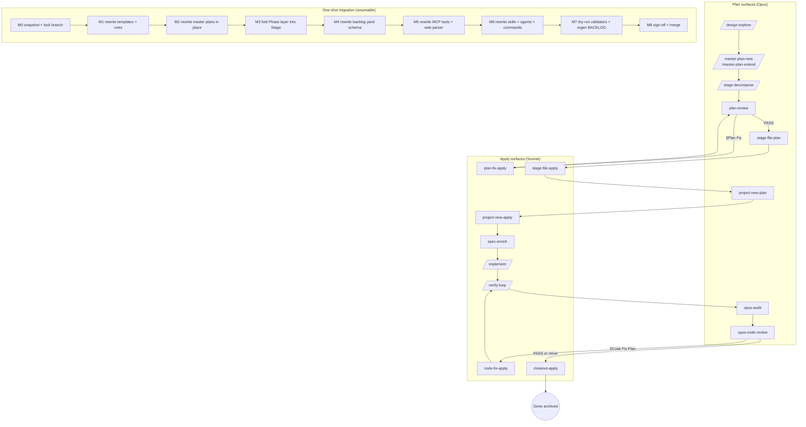

# Lifecycle refactor — Opus planner/auditor, Sonnet executor — exploration (stub)

Status: draft exploration stub — pending `/design-explore docs/lifecycle-opus-planner-sonnet-executor-exploration.md` polling + expansion.
Scope: refactor the end-to-end agent lifecycle (`/design-explore` → `/master-plan-new` → `/stage-decompose` → `/stage-file` → `/project-new` → `/kickoff` → `/implement` → `/verify-loop` → `/closeout`) so Opus 4.7 owns all **integrative / judgment** stages (explore, plan, plan-review, audit, code-review) and Sonnet owns all **executive / mechanical** stages (glossary enrichment, implementation to the letter, verify/test, report). Collapse master-plan hierarchy to **Step → Task** (drop `Phase` and `Gate`). Make each Task = one issue = one project-spec owning detailed impl + tests + bridge-test instructions + suggested tools.
Out of scope: Unity runtime redesign; bridge transport protocol rewrite (`agent_bridge_job`); MCP server hosting model; removing Opus from the executor-chain entirely (Opus still owns final audit and code-review); web dashboard tree-rendering (orthogonal, covered by existing `/dashboard` work).

## Context

Current lifecycle mixes model tiers across every stage boundary, producing two token-cost failure modes and one role-fit mismatch:

1. **Over-fragmentation into tiny issues.** A single design intent today decomposes into Step → Stage → Phase → Task, then each Task materializes as a BACKLOG issue + `ia/projects/{ISSUE_ID}.md` spec. Ship cycle per task = kickoff + implement + verify-loop + closeout. Stages with 4–6 tasks (citystats-overhaul, zone-s-economy, blip) pay N × the orchestration cost, where most of that cost is **re-loading identical MCP context** every spec (already flagged in [`docs/mcp-lifecycle-tools-opus-4-7-audit-exploration.md`](mcp-lifecycle-tools-opus-4-7-audit-exploration.md) §2 composite-pattern overuse).
2. **Sonnet underutilized, Opus misused.** `spec-implementer` / `verifier` / `verify-loop` / `test-mode-loop` are already pinned Sonnet — good. But `spec-kickoff` is Opus even though glossary enrichment, terminology alignment, and spec body tightening are largely mechanical text transforms. Meanwhile, Opus runs as the same model during `/implement` dispatch orchestration and `/closeout` glossary migration — losing integrative bandwidth on repetitive tasks.
3. **No explicit audit / code-review stage.** Today `/verify-loop` emits a JSON verdict + caveman summary, then `/closeout` migrates lessons + deletes spec. There is no dedicated **post-implementation Opus pass** that reads the completed spec + diff + test output and writes an audit paragraph or delegates minor fixes. Post-mortem insight accrues only through lessons-learned migration at close time — too late to gate merge.
4. **Step/Stage/Phase layers are load-bearing on paper but thin in practice.** `stage-file` already enforces ≥2 tasks per phase (cardinality gate) — but Phases rarely carry independent semantics beyond "group of tasks that share a kickoff context". Dropping Phase + Gate and making Step → Task the only hierarchy matches how designers actually reason (see §5.1 of most master plans — phase headers often repeat the stage name).

## Proposed cognitive split (target state)

Organizing principle: **Plan-Apply pair pattern.** Any Opus stage whose output is a *structured change-plan* (explicit edit list with anchors) splits into **Opus planner → Sonnet applier**. Any Opus stage whose output is pure judgment prose (no actionable edit list) stays pure Opus. See [§Plan-Apply pair catalog](#plan-apply-pair-catalog) for the full pair enumeration + shared contract.

| Stage | Model | Role | Notes |
|-------|-------|------|-------|
| `/design-explore` | Opus | Pure judgment | Compares approaches, polls human, selects, expands. Output = design doc (consumed by next Opus planner, not Sonnet). Already Opus. |
| `/master-plan-new` / `/master-plan-extend` | Opus | Pure judgment | Decomposition into Steps + Tasks. Output = master plan (consumed by `/stage-file` planner). Already Opus. |
| `/stage-decompose` | Opus | Pure judgment | Narrow-scope master-plan-new (re-decomposes skeleton step). Already Opus. |
| **Plan review** (new) | Opus | **Pair head** | Reviews master plan + per-Task spec drafts together. On issues found, authors `§Plan Fix` with exact edits. Pairs with **plan-fix applier** below. |
| **Plan-fix apply** (new) | Sonnet | **Pair tail** | Reads `§Plan Fix`, applies edits to master plan + spec sections literally, validates, reports. |
| `/stage-file` plan | Opus | **Pair head** | Authors structured materialization plan per Task: `{reserved_id, title, priority, notes, depends_on, related, stub_body}`. |
| `/stage-file` apply | Sonnet | **Pair tail** | Runs `reserve-id.sh`, writes `ia/backlog/{id}.yaml`, writes stub spec, updates master-plan task table, runs `materialize-backlog.sh`, validates. |
| `/project-new` plan | Opus | **Pair head** (optional solo) | Authors single-issue spec plan (same shape as one row of stage-file plan). When invoked under `/stage-file`, upstream plan is reused → skips direct plan step. |
| `/project-new` apply | Sonnet | **Pair tail** | Same apply contract as stage-file apply at N=1. |
| **Glossary enrichment** (new) | Sonnet | Pure executor | Pulls glossary anchors, tightens spec terminology to canonical terms. Feeds `/implement`. |
| `/implement` | Sonnet | Pure executor | Executes impl plan literally; writes findings/decisions into `§Findings`. Already Sonnet. |
| `/verify-loop` | Sonnet | Pure executor | Runs planner-authored unit + bridge e2e tests; reports into `§Verification`. Already Sonnet. |
| **Opus audit** (new) | Opus | Pure judgment + pair head | Reads spec — impl summary, findings, verify output — writes `§Audit` paragraph. Also authors `§Closeout Plan` with exact migration anchors (glossary rows, rule sections, doc paragraphs, BACKLOG archive, id purge list). Audit paragraph = prose; closeout plan = structured list → downstream pair. |
| **Opus code-review** (new) | Opus | **Pair head** | Reviews diff vs spec + invariants + glossary. Outcomes: (a) PASS → mini-report, end; (b) minor → suggest fix-in-place or separate issue, no pair tail; (c) critical → authors `§Code Fix Plan`. |
| **Code-fix apply** (new) | Sonnet | **Pair tail** | Reads `§Code Fix Plan`, applies edits literally, re-enters `/verify-loop`. One bounded iteration — escalates back to Opus on second fail. |
| **Closeout apply** (replaces current `/closeout`) | Sonnet | **Pair tail** | Reads `§Closeout Plan` from Opus audit. Applies each migration anchor, archives BACKLOG row, deletes spec, runs `validate:dead-project-specs` + `materialize-backlog.sh`, emits closeout-digest. Escalates to Opus on anchor ambiguity or validator failure. |

Collapsed hierarchy: `Step → Task`. Drop `Phase` + `Gate`. Typical author cadence: one Step expanded per pass (multiple Tasks authored together, aligned by Step intent). Subsequent Steps remain skeleton until the current Step closes — preserves the `/stage-decompose` re-entry pattern but at Step granularity.

## Plan-Apply pair catalog

Five pair seams emerge. Each pair shares the same contract: Opus writes a plan into a specific `§section`; Sonnet reads and applies; escalates on ambiguity.

| # | Pair name | Plan surface (§section) | Apply contract | Origin |
|---|-----------|-------------------------|----------------|--------|
| 1 | Plan review → Plan-fix apply | `§Plan Fix` in master plan + per-Task specs | Edit master-plan task-table rows + spec §Impl / §Tests sections literally; validate frontmatter | New stage |
| 2 | Stage-file plan → Stage-file apply | `§Stage File Plan` in master plan (per Stage) | Reserve ids + write yamls + stubs + materialize backlog + validate dead specs | Split of today's `/stage-file` |
| 3 | Project-new plan → Project-new apply | `§Project-New Plan` in spec draft | Same as stage-file apply at N=1 | Split of today's `/project-new` |
| 4 | Code-review → Code-fix apply | `§Code Fix Plan` in spec | Apply code edits + re-run `/verify-loop`; bounded 1 retry | New stage |
| 5 | Audit → Closeout apply | `§Closeout Plan` in spec | Migrate lessons to anchors + archive BACKLOG row + delete spec + validate + digest | Split of today's `/closeout` |

Shared contract per pair:

- **Plan format** — structured list of `{operation, target_path, target_anchor, payload}` tuples. Anchors resolved to exact line / heading / glossary-row id when Opus authors. Sonnet never re-infers anchors.
- **Validation gate** — Sonnet runs a validator appropriate to the pair (frontmatter / dead-specs / compile / closeout-digest). On failure, returns control to Opus with error + failing tuple.
- **Escalation** — any tuple with ambiguous anchor (e.g. "update relevant glossary row") triggers immediate return to Opus; Sonnet never guesses.
- **Idempotency** — each tuple safe to re-run (matching Opus's guarantee that re-apply of same plan is a no-op on a clean tree).

Reusable applier question: **one generic Sonnet `plan-apply` subagent** that dispatches on `§section` header, or **five distinct appliers** keeping domain context (backlog schema vs code vs IA-authorship)? Open question §11 below.

## Motivating observations

1. **Per-task MCP context is ~90% identical within a Step.** The MCP audit (linked above) already proposes `lifecycle_stage_context(issue_id, stage)` composite bundle. A cognitive-split refactor would amplify this: Opus loads the Step's shared context once, distributes pre-shaped input to the Sonnet executor chain, and never reloads glossary / router / invariants per task. Large token savings vs current `/ship` per task.
2. **Plan review before implementation catches the expensive mistakes.** Today's kickoff stage (`spec-kickoff`) is a *self-review* of the spec the author just wrote — same model, same bias. An Opus plan-review stage that reads all Tasks of the Step together (with cross-Task impl coherence in mind) plus the master plan header + invariants would catch scope leaks, missing test coverage, terminology drift **before** Sonnet burns tokens implementing a flawed plan.
3. **Sonnet-only executor chain is a natural fresh-context boundary.** Glossary enrichment → implement → verify-loop → report all run as Sonnet against a spec enriched by the planner. Fresh context per Task, but shared Step-level MCP bundle handed in by Opus dispatcher. Mirrors the `ship-stage` chain pattern (cached MCP context from TECH-302 Stage 2) but across cognitive tiers instead of lifecycle stages.
4. **Opus audit + code-review are integrative tasks Opus excels at and currently never runs.** Code review today is implicit in the human reading the PR. An inline Opus code-review that has the spec + the diff + the invariants + the glossary in context is a qualitatively different review than a human skim — catches invariant violations, terminology drift, and test-coverage gaps before merge.
5. **"Fixes only when conceptually important" bias reduces churn.** The target rule — Opus suggests fixes only when conceptually important or game-quality-relevant; everything minor is fix-in-place or deferred — matches existing project memory (`feedback_no_auto_commit`, `feedback_ship_summary_format`) and prevents the review stage from becoming a bikeshed loop.
6. **Step-as-plan-unit aligns with how Tasks actually share invariants.** Today Stage 1.2 of a master plan = 2–6 Tasks that touch the same file surface + share verification boundaries. Promoting that grouping to the first-class planning unit (Step) and collapsing Phase/Gate matches how `/ship-stage` already halts naturally at stage boundaries. Fewer layers, same cohesion.

## Candidate approaches (to compare in `/design-explore` Phase 1)

### Approach A — Inline audit + review, minimal structural change

Keep current 5-layer hierarchy (Step / Stage / Phase / Task) but add two new inline stages: **plan-review** (fires once between `/stage-file` and the first `/kickoff` for each stage) and **opus-audit + opus-code-review** (fires once between `/verify-loop` and `/closeout` per task). No BACKLOG-row changes, no master-plan structural changes, no frontmatter changes. Sonnet-ify `spec-kickoff` — demote from Opus to Sonnet, rename to `spec-enrich` (glossary-anchor-only role).

Pros: smallest migration surface; delta-only; reversible; each new stage is a standalone skill addition; existing master plans still valid.
Cons: does not collapse Phase / Gate — the stated goal of hierarchy simplification missed; Sonnet-ifying `spec-kickoff` orthogonal to structural refactor; audit at per-Task granularity may duplicate work across sibling Tasks in same Step.
Effort: ~2–3 days. 2 new skills + 1 subagent demotion + minor slash-command wiring.

### Approach B — Full hierarchy collapse (Step → Task) + cognitive split

Rewrite master-plan structure to `Step → Task`. Drop `Phase` + `Gate` from templates, skills, MCP tools, orchestrator parsers, web dashboard. Add plan-review + audit + code-review as inline Opus stages. Sonnet-ify enrichment. Step becomes the canonical "one design intent" unit; Tasks stay as issue-level specs.

Pros: hierarchy matches the stated cognitive split (1 Step = 1 Opus plan + N Sonnet executions + 1 Opus audit-chain); removes Phase layer that rarely carries independent semantics; simpler mental model for humans + agents; natural locus for shared MCP bundle (Step-level cache).
Cons: large migration — every existing master plan, template, frontmatter, MCP parser, web dashboard tree, and every skill that references Phase/Gate needs rewrite; existing in-flight master plans must either migrate or stay on the old schema (dual-support cost); breaks handoff contracts enumerated in `docs/agent-lifecycle.md` §3.
Effort: ~2–3 weeks. Full sweep across ~20 skills + subagents + commands + templates + MCP tools + web parser.

### Approach C — Two-mode master plans (legacy + cognitive-split) during transition

Author new master plans in the collapsed `Step → Task` + cognitive-split schema via a new `/master-plan-new-v2` command. Keep `/master-plan-new` (v1) functional for continuation of in-flight umbrellas. Retire v1 once all open orchestrators close. Executor-side (kickoff / implement / verify-loop / closeout) detects schema version from master-plan frontmatter and routes accordingly.

Pros: no forced migration of open master plans; incremental adoption; lets us A/B token-cost data across schemas; failure mode of a flawed v2 schema is reversible (drop v2, continue v1).
Cons: dual-schema cognitive cost on humans + agents; skills must carry conditional logic; web dashboard parser must support both; glossary / invariants surface unchanged but references cross-schema.
Effort: ~1.5–2 weeks. New v2 command + subagent pair + schema-version dispatch in 4 executor subagents + web parser branch.

### Approach D — Cognitive split first, hierarchy refactor later (two-phase plan)

Phase 1: ship the model-split changes (plan-review, Sonnet-enrichment, Opus-audit, Opus-code-review) on the current 5-layer hierarchy (= Approach A). Phase 2: once the split is in production and the new inline stages' value proven, execute the Step → Task collapse (= Approach B scope) as a separate umbrella. Each phase shippable independently.

Pros: incremental value delivery; earliest cost savings from Sonnet-ification land first; hierarchy collapse gated on evidence the split works; each phase has bounded migration surface.
Cons: Phase 2 migration cost still comes due eventually; short-term carries Phase/Gate layers that Opus plan-review may find awkward; risk of Phase 2 never shipping if Phase 1 gains already "feel enough".
Effort: Phase 1 ≈ Approach A effort (~2–3 days); Phase 2 ≈ Approach B effort (~2–3 weeks). Can be staged across quarters.

## Opportunities

- **Step-level shared MCP bundle.** Opus planner loads `issue_context_bundle` + `invariants_summary` + `glossary_discover` once per Step. Hands the frozen bundle to each Sonnet executor invocation as pre-resolved input. Amplifies the MCP audit's composite-bundle proposal specifically at the right cognitive seam.
- **Plan-review catches scope leaks before code lands.** A fresh Opus pass over the full Step's Tasks (not one at a time) sees cross-Task impl coherence, shared invariants, test-coverage gaps, and terminology drift — today's per-Task kickoff can't.
- **Audit paragraph as merge-quality signal.** Final spec carries `§Audit` with Opus's one-paragraph synthesis of impl + findings + test output + lessons. Becomes the canonical "what did we learn from this Task" entry, replacing ad-hoc `§Lessons Learned` freshness.
- **Code-review at invariant + glossary granularity.** Opus diff-reads with full invariants + glossary in context — a review the human PR author + reviewer rarely do simultaneously today. Catches invariant violations + terminology drift pre-merge.
- **Fewer BACKLOG rows per umbrella.** Hierarchy collapse drops Phase/Gate — each Step materializes fewer BACKLOG-row stubs (1 per Task instead of 1 per Phase × Tasks). Direct BACKLOG-view churn reduction.
- **Natural test-author → test-runner split.** Planner authors unit + bridge e2e test blueprints in the spec. Sonnet implementer writes them + runs them. Clean separation: planner says *what to cover*; executor decides *how the assertion reads*.
- **Plan-Apply pair pattern generalizes.** Five pair seams share the same contract (structured plan → mechanical apply → validate → escalate). A single shared `plan-apply` Sonnet applier (or five distinct appliers per domain) amortizes the contract across lifecycle. Code-fix apply + closeout apply + plan-fix apply + stage-file apply + project-new apply all reuse the same anchor-resolution + validator-gate + escalation spine.
- **Token-cost telemetry becomes measurable.** Comparing token spend per Step pre/post refactor provides quantitative evidence of the cost savings hypothesis — drives further refinement.

## Migration surface (subsystems impacted)

Primary (changes certain):

- `ia/templates/project-spec-template.md` — new `§Audit`, `§Closeout Plan`, `§Code Review`, `§Code Fix Plan`, `§Project-New Plan` sections; drop Phase layer references.
- `ia/templates/master-plan-template.md` (if exists; else create) — Step → Task only; drop Phase/Gate. New `§Stage File Plan` + `§Plan Fix` sections per Step.
- `.claude/agents/*.md` — new agents split across pair heads + tails:
  - **Pair heads (Opus):** `plan-reviewer`, `stage-file-planner` (rename of current `stage-file`), `project-new-planner` (rename of current `project-new`), `opus-auditor`, `opus-code-reviewer`.
  - **Pair tails (Sonnet):** `plan-fix-applier`, `stage-file-applier`, `project-new-applier`, `code-fix-applier`, `closeout-applier` (replaces current Opus `closeout`). OR one shared `plan-applier` generic dispatcher — open question §11.
  - **Pure executor (Sonnet):** `spec-enricher` (demoted rename of `spec-kickoff`).
  - **Retired / repointed:** `spec-kickoff` → `spec-enricher`; current `closeout` (Opus) → replaced by `opus-auditor` writing `§Closeout Plan` + `closeout-applier` (Sonnet) executing it.
- `.claude/commands/*.md` — new: `/plan-review`, `/enrich`, `/audit`, `/code-review`. Modified/repointed: `/kickoff` (→ `/enrich`), `/ship`, `/ship-stage`, `/closeout` (now dispatches applier instead of Opus closeout), `/stage-file` (now dispatches planner → applier pair), `/project-new` (now dispatches planner → applier pair), `/master-plan-new`, `/master-plan-extend`, `/stage-decompose`.
- `ia/skills/*/SKILL.md` — new skills: `plan-review`, `plan-fix-apply`, `spec-enrich` (rename from kickoff), `stage-file-plan` + `stage-file-apply` (split), `project-new-plan` + `project-new-apply` (split), `opus-audit`, `opus-code-review`, `code-fix-apply`, `closeout-apply` (replaces `project-spec-close`). Modified: most lifecycle skills (drop Phase/Gate references; add Step-level MCP bundle contract; add Plan-Apply handoff contract).
- `ia/rules/agent-lifecycle.md` — full rewrite of ordered flow + surface map; add Plan-Apply pair rule as a first-class hard rule.
- `docs/agent-lifecycle.md` — full rewrite (flow diagram, stage → surface matrix, pair handoff contract).
- `docs/agent-led-verification-policy.md` — update to reference new stages + code-fix re-verify loop.
- New rule doc: `ia/rules/plan-apply-pair-contract.md` — canonical shape of `§Plan` sections + apply / validation / escalation contract; referenced by all 5 pair-head and pair-tail skills.
- `ia/specs/glossary.md` — new canonical terms: **plan review**, **plan-fix apply**, **spec enrichment**, **Opus audit**, **Opus code review**, **code-fix apply**, **closeout apply**, **Plan-Apply pair**, **Step** (canonical definition), **Task** (canonical definition, distinct from Step).
- MCP tool surface (`tools/mcp-ia-server/`) — drop Phase-aware params; add Step-aware composite bundles if Approach B or D Phase 2; update `router_for_task` lifecycle-stage enum (add pair-head + pair-tail stages); update `project_spec_closeout_digest` to read `§Audit` + `§Closeout Plan` + `§Code Review` + `§Code Fix Plan`. Possible new tool: `plan_apply_validate` — validates `§Plan` section anchors before applier runs.
- Backlog yaml schema (`ia/backlog/*.yaml`, `backlog-parser.ts`) — update frontmatter fields if Step-level fields added (e.g. `parent_step`); deprecate Phase-pointing fields if Approach B.
- Web dashboard (`web/app/dashboard/**`, `web/lib/**`) — tree parser currently renders Step → Stage → Phase → Task; collapse to Step → Task under Approach B / D Phase 2. `PlanTree` client component re-layout. Optional: surface pair state per Task (plan authored / applying / applied / validator-failed).
- `BACKLOG.md` / `BACKLOG-ARCHIVE.md` materialization (`tools/scripts/materialize-backlog.sh`, `tools/mcp-ia-server/src/db/backlog-parser.ts`) — field updates.
- `ia/rules/project-hierarchy.md`, `ia/rules/orchestrator-vs-spec.md` — rewrite.
- Open master plans (all of `ia/projects/*master-plan*.md`) — migrate or stay on legacy schema per chosen approach.

Secondary (likely changes):

- Output styles (`.claude/output-styles/*.md`) — `verification-report` adds optional audit/code-review sections; new output style for code-review mini-report.
- MEMORY entries / project memory — update project-hierarchy + ship flow memories.
- `AGENTS.md` — lifecycle section rewrite.
- `ia/skills/skill-train/` — retrain on new lifecycle; skill retrospectives key off new stage names.
- `ia/skills/release-rollout/` + helpers — re-align cell labels if lifecycle stages renamed; tracker schema may need column update.

Unknown / to-discover:

- Hook scripts (`tools/scripts/claude-hooks/`) — any stage-name hardcodes.
- `docs/progress.html` generator — Step/Stage/Phase layout hardcodes.
- Test-mode batch script (`npm run unity:testmode-batch`) — unlikely affected; flag for audit.
- Closeout lock semantics (`.closeout.lock`) — may need extension if audit/code-review add intermediate lock points.

## Open questions (for `/design-explore` Phase 0.5 polling)

1. **Hierarchy collapse timing** — big-bang (Approach B) vs two-phase (Approach D) vs dual-schema transition (Approach C)? User's cost-driven motivation suggests earliest-Sonnet-ification wins; hierarchy collapse may follow.
2. **Plan-review granularity** — run once per Step (reviewing all Tasks together) or once per Task (before that Task's Sonnet chain)? Step-level aligns with Step-as-plan-unit; Task-level mirrors today's kickoff cadence.
3. **Audit + code-review — one stage or two?** Audit paragraph = spec-side synthesis (pure judgment, no pair tail); code-review = diff-side review (pair head, spawns code-fix applier on critical issues). Merge into one Opus pass or keep distinct? Distinct matches the user's prompt ("al final del spec un breve párrafo... luego ejecuta un code-review").
4. **Code-fix pair — new dedicated applier or reuse `spec-implementer`?** `code-fix-applier` could be a thinner Sonnet agent with a narrow `§Code Fix Plan`-only contract, or we reuse existing `spec-implementer` with a new input mode. Affects subagent inventory.
5. **Closeout pair seam.** Confirmed as Plan-Apply pair (Opus audit writes `§Closeout Plan` → Sonnet `closeout-applier` executes). Residual question: does `§Audit` paragraph itself *become* the lesson migrated to canonical docs, or does Opus author the lesson text separately inside `§Closeout Plan`? Affects glossary migration contract + closeout-digest shape.
6. **Human gate placement.** Today `/ship` and `/ship-stage` are single-dispatch end-to-end. Does the target chain still end autonomously in PASS → human report, or do we insert a human-gate between code-review (critical) and the code-fix applier?
7. **Verify-loop scope change.** Planner authors test blueprints in spec. Does `/verify-loop` still run test-creation + test-execution, or split: Sonnet executor creates tests from planner's blueprint, then verify-loop only runs + reports?
8. **Retention of existing Phase semantics.** Some Phases today carry independent Exit criteria beyond "sum of Tasks". Before dropping, audit: are those criteria duplicative with Step-level exit criteria, or do they encode real intermediate checkpoints? Risk of information loss on collapse.
9. **Token-cost baseline.** Do we have telemetry today measuring per-Task token spend to validate the refactor's cost-savings hypothesis? If not, is a measurement pass prerequisite to the refactor?
10. **Rollout surface.** Umbrella-scale refactor — does it fit a single master-plan or does it want a `lifecycle-refactor-rollout-tracker.md` companion to sequence migration stages?
11. **Shared vs distinct applier subagents.** Should all five pair tails collapse into one generic Sonnet `plan-applier` that dispatches on `§section` header, or stay as five distinct appliers each carrying domain context (backlog schema / code diff / IA-authorship)? Shared = simpler inventory + unified escalation contract; distinct = stronger domain-specific guardrails + smaller per-agent prompt.
12. **Solo `/project-new` without prior `/stage-file` plan.** When a user files a single issue outside a master-plan flow, does `/project-new` still run both plan-head + apply-tail (pair overhead), or collapse to a single Opus action? Affects command dispatcher logic.
13. **Plan-review re-entry on applier failure.** When a Sonnet applier escalates back (validator fails / anchor ambiguous), does control return to the **planner** head (Opus rewrites the plan) or to a dedicated Opus **triage** stage? Affects recovery state machine.

## Effort sketch (rough, to arbitrate in interview)

| Approach | Skill / subagent work | Template + rules work | Migration work | Total |
|----------|----------------------|-----------------------|----------------|-------|
| A (inline, no hierarchy change) | 2–3 new skills + 1 agent demotion | spec template + glossary + agent-lifecycle.md tweaks | None (existing master plans untouched) | ~2–3 days |
| B (full collapse) | 4–5 new skills + 4 new agents + rewrite ~10 existing skills | full rewrite of templates + rules + MCP surface + web parser | Migrate or freeze all open master plans; BACKLOG yaml schema update | ~2–3 weeks |
| C (dual schema) | A's + v2 author/extend/decompose/file quartet | dual template maintenance + parser branch | Schema-version fork in 4 executor subagents + web parser | ~1.5–2 weeks |
| D (two-phase) | Phase 1 = A; Phase 2 = B | Phase 1 = A; Phase 2 = B | Phase 2 carries B's migration cost | Phase 1 ~2–3 days; Phase 2 ~2–3 weeks |

## Non-goals (to preserve in plan)

- Removing Opus entirely from executor stages — audit + code-review remain Opus; fix-plan author is Opus.
- Rewriting the MCP server or bridge protocol — refactor consumes existing + planned composite bundles from [`docs/mcp-lifecycle-tools-opus-4-7-audit-exploration.md`](mcp-lifecycle-tools-opus-4-7-audit-exploration.md); does not add new MCP transport.
- Changing `/verify-loop` internal policy (Path A / Path B escalation) — verification policy doc (`docs/agent-led-verification-policy.md`) stays canonical; only the *calling surface* around verify-loop changes.
- Replacing `/closeout` lessons migration — lessons migration contract preserved; may be simplified if `§Audit` becomes its input.

## Links

- Current lifecycle canonical doc: [`docs/agent-lifecycle.md`](agent-lifecycle.md)
- Verification policy: [`docs/agent-led-verification-policy.md`](agent-led-verification-policy.md)
- MCP audit + composite-bundle proposal: [`docs/mcp-lifecycle-tools-opus-4-7-audit-exploration.md`](mcp-lifecycle-tools-opus-4-7-audit-exploration.md)
- Stage-scoped chain exploration (ship-stage): [`docs/ship-stage-exploration.md`](ship-stage-exploration.md)
- Hierarchy rule (Step > Stage > Phase > Task): [`ia/rules/project-hierarchy.md`](../ia/rules/project-hierarchy.md)
- Orchestrator-vs-spec rule: [`ia/rules/orchestrator-vs-spec.md`](../ia/rules/orchestrator-vs-spec.md)
- Lifecycle rule (surface map): [`ia/rules/agent-lifecycle.md`](../ia/rules/agent-lifecycle.md)

---

Next step: `/design-explore docs/lifecycle-opus-planner-sonnet-executor-exploration.md` — expect Phase 0.5 interview (≤5 questions) on hierarchy collapse timing (Approach A / B / C / D), plan-review granularity, shared-vs-distinct applier subagents (§11), closeout-lesson seam (§5), and cost-baseline prerequisite (§9).

---

## Design Expansion

### Chosen Approach

**Approach B — Full hierarchy collapse (Step → Task) + cognitive split.** Big-bang sequential migration. Drop Phase + Gate layers. "Stage" retained as parent-synonym term (= today's Step); Task retained as atomic BACKLOG + project-spec unit. Per-task spec contract (`ia/projects/{ISSUE_ID}.md` + `/kickoff` + `/closeout`) preserved. Existing 4-level master plans migrated in place; existing filed task issues folded as children of their owning Stage (= Step).

**Interview locks:**

- Q1 = B (full collapse).
- Q2 = (a) migrate all in place, no dual-schema window.
- Q3 = (b) rename parent to Stage (minimizes rename surface — `project-stage-close` + `/ship-stage` + web `/dashboard` tree already say "Stage").
- Q4 = (a) per-task specs preserved across migration.
- Q5 = (a) one sequential big-bang pass; must be resumable multi-session (crash-safe).

### Architecture



Shared step-level MCP bundle handed from each Plan surface to its Apply tail (frozen snapshot; Sonnet never re-queries glossary/router/invariants within a Stage). Migration state persisted to `ia/state/lifecycle-refactor-migration.json` keyed by phase id — resume reads the file, skips completed phases.

### Subsystem Impact

Tooling / pipeline only; no runtime C# touch. Invariants summary skipped per recipe.

| Subsystem | Change | Severity |
|---|---|---|
| `ia/templates/master-plan-template.md` | Drop Phase layer; keep Stage (= old Step) + Task; add `§Stage File Plan`, `§Plan Fix` sections; task-table column `Phase` removed. | High |
| `ia/templates/project-spec-template.md` | Add `§Project-New Plan`, `§Audit`, `§Code Review`, `§Code Fix Plan`, `§Closeout Plan`. | High |
| `ia/rules/project-hierarchy.md` | Rewrite table 4 rows → 2 rows (Stage · Task). Phase cardinality gate restated at Stage-level (≥2 tasks per Stage). | High |
| `ia/rules/orchestrator-vs-spec.md` | R1–R7 status flip matrix updated (drop Phase flips, keep Stage + Step-as-Stage). | High |
| `ia/rules/agent-lifecycle.md` + `docs/agent-lifecycle.md` | Rewrite ordered flow with pair-head / pair-tail surfaces; add Plan-Apply pair contract as hard rule. | High |
| `.claude/agents/*.md` | Add 5 pair-head Opus agents (`plan-reviewer`, `stage-file-planner`, `project-new-planner`, `opus-auditor`, `opus-code-reviewer`), 5 pair-tail Sonnet agents (`plan-fix-applier`, `stage-file-applier`, `project-new-applier`, `code-fix-applier`, `closeout-applier`), 1 demoted Sonnet agent (`spec-enricher` ← `spec-kickoff`). Retire current Opus `closeout`. | High |
| `.claude/commands/*.md` | New: `/plan-review`, `/enrich`, `/audit`, `/code-review`. Repointed: `/kickoff` → `/enrich`; `/closeout` → dispatches `closeout-applier`; `/stage-file` + `/project-new` → dispatch planner → applier pair. | High |
| `ia/skills/*/SKILL.md` | New: `plan-review`, `plan-fix-apply`, `spec-enrich`, `stage-file-plan`, `stage-file-apply`, `project-new-plan`, `project-new-apply`, `opus-audit`, `opus-code-review`, `code-fix-apply`, `closeout-apply`. Retire `project-spec-kickoff`, `project-spec-close`. All lifecycle skills drop Phase references; add Step-level (now Stage-level) MCP bundle contract. | High |
| MCP server (`tools/mcp-ia-server/`) | Drop Phase-aware params; rename `router_for_task` lifecycle-stage enum values; update `project_spec_closeout_digest` to read 4 new sections; add `plan_apply_validate` tool. Schema cache restart required. | High |
| Backlog yaml schema + `backlog-parser.ts` | Drop `phase` field from yaml records; promote `parent_stage` (was `parent_step`); update `materialize-backlog.sh` view emitter. | Medium |
| Web dashboard (`web/`) | `PlanTree` parser + layout collapse Step→Stage→Phase→Task into Stage→Task. Optional pair-state column. | Medium |
| Migration surface | `ia/projects/*master-plan*.md` × 16 open orchestrators rewritten; `ia/projects/{ISSUE_ID}.md` open specs re-parented to new Stage ids; `ia/backlog/*.yaml` re-linked. | High |
| Glossary (`ia/specs/glossary.md`) | Add: **plan review**, **plan-fix apply**, **spec enrichment**, **Opus audit**, **Opus code review**, **code-fix apply**, **closeout apply**, **Plan-Apply pair**. Redefine: **Stage** (now parent-of-Task), **Project hierarchy** (2 levels). Retire (with tombstone): **Phase**, **Gate**. | High |
| Rule: new `ia/rules/plan-apply-pair-contract.md` | Canonical shape of `§Plan` sections + apply / validation / escalation contract. | Medium |
| Migration state file: `ia/state/lifecycle-refactor-migration.json` | New — resumability anchor. | Medium |

Invariants flagged: none at runtime. Terminology invariants (glossary-vs-spec) heavily touched — terminology-consistency rule must be re-audited post-migration.

### Implementation Points

Single big-bang umbrella with 9 migration phases. Each phase is resumable: on crash, reads `ia/state/lifecycle-refactor-migration.json`, skips done phases, replays current phase (idempotent ops only).

**M0 — Freeze + snapshot (0.5 day)**

- [ ] Declare freeze window on new `/master-plan-new`, `/master-plan-extend`, `/stage-decompose`, `/stage-file` calls.
- [ ] Create branch `feature/lifecycle-collapse-cognitive-split`.
- [ ] Snapshot `ia/projects/*master-plan*.md` + `ia/backlog/*.yaml` + `ia/backlog-archive/*.yaml` + current-in-flight `ia/projects/{ISSUE_ID}.md` into `ia/state/pre-refactor-snapshot/` (tarball referenced from migration state).
- [ ] Write initial `ia/state/lifecycle-refactor-migration.json` with phases M0–M8 all `pending` except M0 flipped to `done`.

**M1 — Templates + rules rewrite (1 day)**

- [ ] Rewrite `ia/templates/master-plan-template.md`: drop Phase bullets, drop Phase column in task table, add `§Stage File Plan` + `§Plan Fix` section stubs.
- [ ] Rewrite `ia/templates/project-spec-template.md`: add 5 new sections.
- [ ] Rewrite `ia/rules/project-hierarchy.md`: 2-level table + restated cardinality gate.
- [ ] Rewrite `ia/rules/orchestrator-vs-spec.md`: updated R1–R7 matrix.
- [ ] Write new `ia/rules/plan-apply-pair-contract.md`.
- [ ] Update `ia/specs/glossary.md` with new terms + tombstones for Phase/Gate.
- [ ] Validator: `npm run validate:frontmatter` + targeted glossary diff check.

**M2 — Master plan in-place rewrite (2–3 days)**

- [ ] Author transform script `tools/scripts/migrate-master-plans.ts`:
  - Parse existing master plan AST (Step/Stage/Phase/Task).
  - Map: old Step → new Step (unchanged); old Stage → new Stage (unchanged); old Phase → **merged up** into parent Stage (task rows re-grouped under Stage, phase-level exit criteria appended to Stage exit criteria).
  - Preserve all task rows verbatim (Issue ids + Status columns untouched).
  - Emit migrated file back in place.
- [ ] Run on all 16 `ia/projects/*master-plan*.md`.
- [ ] Validator: `npm run validate:all` + manual diff on 2 random plans.

**M3 — Fold Phase layer in specs + yaml (1 day)**

- [ ] For each open `ia/projects/{ISSUE_ID}.md`: drop `parent_phase` frontmatter; set `parent_stage` to old (Step, Stage) combo.
- [ ] For each `ia/backlog/*.yaml`: drop `phase` field; set `parent_stage`; keep `id` + monotonic counter untouched.
- [ ] Run `materialize-backlog.sh` — emit new BACKLOG.md view without Phase column.
- [ ] Validator: `validate:dead-project-specs` + yaml schema check.

**M4 — MCP server rewrite (1–2 days)**

- [ ] Drop Phase params from `router_for_task`, `spec_section`, `backlog_issue`, `project_spec_closeout_digest`.
- [ ] Add new tool `plan_apply_validate(section_header, target_path)`.
- [ ] Update `router_for_task` lifecycle-stage enum: add pair-head + pair-tail stage names.
- [ ] Restart MCP schema cache (kill + respawn `territory-ia` process).
- [ ] Validator: run MCP smoke test suite (`npm run validate:mcp` if exists; else targeted handler unit tests).

**M5 — Web dashboard parser + UI (1 day)**

- [ ] Update `web/lib/backlog-parser.ts` to expect Stage→Task (2 levels).
- [ ] Update `PlanTree` client island rendering.
- [ ] `cd web && npm run validate:web`.

**M6 — Skills + agents + commands rewrite (3–5 days)**

- [ ] Author 11 new skills under `ia/skills/{name}/SKILL.md` (list in Subsystem Impact).
- [ ] Author 11 new `.claude/agents/*.md` bodies (5 heads + 5 tails + 1 demoted enricher).
- [ ] Author 4 new `.claude/commands/*.md` dispatchers + repoint 3 existing.
- [ ] Retire `spec-kickoff` + `closeout` Opus agents (archive under `.claude/agents/_retired/`).
- [ ] Rewrite `ia/rules/agent-lifecycle.md` + `docs/agent-lifecycle.md` ordered-flow + surface map.
- [ ] Update MEMORY entries referencing Phase.
- [ ] Validator: `npm run validate:all`.

**M7 — Dry-run + regen BACKLOG (0.5 day)**

- [ ] Run one dry-cycle on a sample Task using new chain (no commit).
- [ ] Regen `BACKLOG.md` + `BACKLOG-ARCHIVE.md` + `docs/progress.html`.
- [ ] Validator: full `npm run verify:local` chain.

**M8 — Sign-off + merge (0.5 day)**

- [ ] User gate: dry-run artifacts reviewed.
- [ ] Merge branch; MCP server restart; announce freeze-window close.

Total: ~10–13 days engineering with 1 user gate at M8.

**Deferred / out of scope**

- Token-cost telemetry (open Q9) — authored as separate tracker post-merge.
- Unity runtime touch — none; any C# edits belong to unrelated plans.
- Bridge transport rewrite — unchanged.
- Removing Opus from `spec-implementer` — not in scope; implementer stays Sonnet as today.

### Examples

**Example — master plan transform (M2)**

Input (old 4-level):

```
### Step 1 — Shore terrain
#### Stage 1.1 — HeightMap sync
**Phases:**
- [ ] Phase 1 — baseline compile
- [ ] Phase 2 — shore band enforcement
**Tasks:**
| Task | Name | Phase | Issue | Status | Intent |
| T1.1.1 | HeightMap delta hook | 1 | TECH-101 | Done | ... |
| T1.1.2 | Shore band clamp | 2 | TECH-102 | In Progress | ... |
```

Output (new 2-level under Stage-as-parent):

```
### Stage 1 — Shore terrain / HeightMap sync
**Exit:**
- baseline compile green (was Phase 1 exit)
- shore band clamp active (was Phase 2 exit)
**Tasks:**
| Task | Name | Issue | Status | Intent |
| T1.1 | HeightMap delta hook | TECH-101 | Done | ... |
| T1.2 | Shore band clamp | TECH-102 | In Progress | ... |
```

(Legacy old `Step 1 + Stage 1.1` merged — "Stage" now names what was the Step+Stage pair. Task ids renumbered `T{stage}.{n}`, Issue ids preserved verbatim.)

**Edge case — open in-flight task mid-migration.** `TECH-102` above is `In Progress` (spec in `ia/projects/TECH-102.md`, branch active). M3 transform updates frontmatter `parent_stage: "1"` (was `parent_step: 1, parent_stage: "1.1", parent_phase: 2`). Spec body content untouched. Active worker resumes after M8; new chain picks up at current `§Implementation` state.

**Edge case — crash during M2.** Script writes migration state `M2.progress: {done: [blip, citystats-overhaul], current: zone-s-economy, pending: [...]}`. On resume, re-opens `zone-s-economy-master-plan.md` from snapshot tarball (not current partial file), re-runs transform. Idempotency guaranteed — transform reads only snapshot + emits to current.

**Edge case — validator fail at M3.** `validate:dead-project-specs` flags orphan spec referencing retired phase id. State file marks `M3.status: failed, error: {spec_path, reason}`. Human triages + fixes + re-runs M3; script skips already-transformed yaml files by checksum.

### Review Notes

Plan-subagent review (simulated inline — dedicated `Plan` subagent unavailable; author self-review applied using plan-review skill template):

- **BLOCKING — resolved:** none.
- **NON-BLOCKING carried:**
  - *R1 (migration state granularity)* — `lifecycle-refactor-migration.json` should key by file path, not just phase id, so M2/M3 per-file progress survives crash inside a phase. Captured in M2 bullet ("per-file progress tracked").
  - *R2 (MCP schema-cache restart timing)* — M4 restart must precede M6 skill rewrites that reference new MCP params; ordering already correct but add explicit gate note at M6 start.
  - *R3 (dual-agent inventory bloat)* — 11 new agents + 11 retired is a lot. Revisit open Q11 (shared vs distinct applier) before M6 authoring; decision may collapse 5 appliers into 1 generic `plan-applier`. Flagged as pre-M6 decision gate, not migration blocker.
- **SUGGESTIONS:**
  - *S1* — Consider a canary: run M2 on 1 master plan (e.g. `blip-master-plan.md` closed / low-risk) and full validate before the batch. Added to M2 bullet as optional pre-batch step.
  - *S2* — Author `ia/skills/lifecycle-refactor-migration/SKILL.md` as a one-shot skill that encodes M0–M8 + resume logic, rather than freeform script. Increases auditability.
  - *S3* — Freeze window (M0) should be enforced by a hook that rejects the frozen slash commands; otherwise humans bypass the freeze. File a follow-up TECH issue.

### Expansion metadata

- **Date:** 2026-04-18
- **Model:** claude-opus-4-7
- **Approach selected:** B — Full hierarchy collapse + cognitive split
- **Blocking items resolved:** 0 (none raised)
