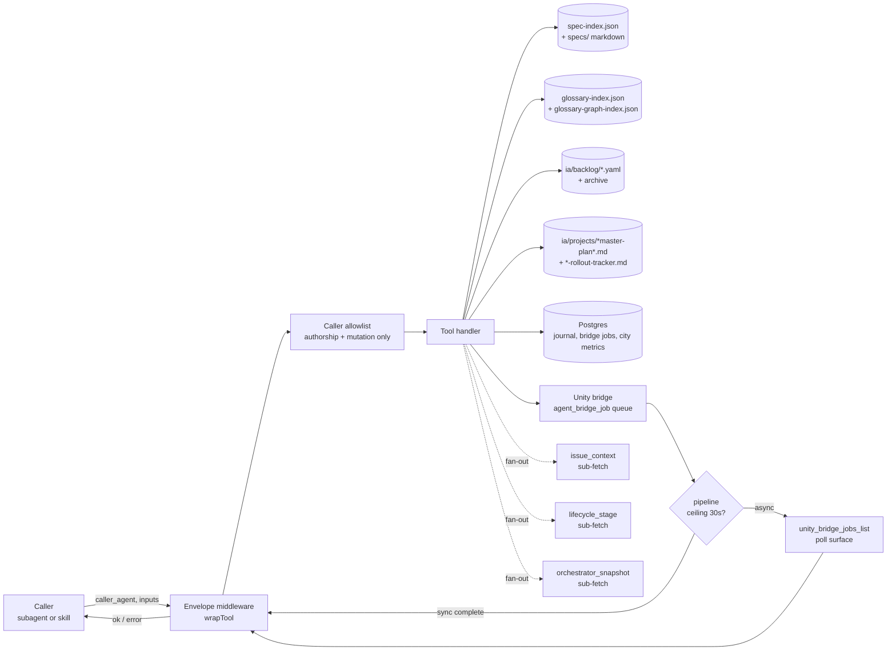

# MCP lifecycle tools — Opus 4.7 audit — exploration (stub)

> **Cross-doc reference:** This doc owns the MCP mutation envelope, `caller_agent` allowlist, composite bundles, and bridge/journal lifecycle surface. Backlog-side yaml shape + per-record MCP tools (`backlog_record_create`, `reserve_backlog_ids`, `backlog_record_validate`, `backlog_list`) are owned by [`docs/backlog-yaml-mcp-alignment-exploration.md`](backlog-yaml-mcp-alignment-exploration.md) — see its Implementation Points 1–9. Sibling cross-ref from that doc → this doc §3.6 (unified mutation envelope detail).

Status: draft exploration stub — pending `/design-explore` + `/explore-plan`.
Scope: audit `territory-ia` MCP surface (32 tools) against lifecycle-skill cognition patterns a 4.7-era orchestrator expects; propose reshape of tool surface + output envelopes to reduce multi-call sequences, alias sprawl, and prose-scraping.
Out of scope: new domain tools for simulation / geography / pathfinding (computational family stays as-is unless bundled); bridge transport rewrite (`agent_bridge_job` Postgres protocol); web dashboard tooling; MCP server hosting model (.mcp.json / Claude Code plumbing).

## Context

Current MCP surface was designed in the Opus 4.6 era — agent calls were encouraged to be **small, sequential, per-slice** (`backlog_issue` → `router_for_task` → `spec_section` → `glossary_lookup`) so a weaker reasoner could build context incrementally without blowing the window. Lifecycle skills under `ia/skills/{name}/SKILL.md` codify that sequence in the **Tool recipe** section of each SKILL body — every lifecycle stage (`design-explore`, `master-plan-new`, `master-plan-extend`, `stage-decompose`, `stage-file`, `project-new`, `project-spec-kickoff`, `project-spec-implement`, `project-spec-close`, `project-stage-close`, `release-rollout` + 3 helpers, `verify-loop` + 4 composed skills) reruns a variant of the same chain.

Opus 4.7 (current session model) has longer effective context, stronger structured-output fidelity, and handles composite tools without losing grounding. Audit goal: reshape MCP so one call returns the structured bundle the agent actually needs per lifecycle step instead of forcing the same 3–8 call sequence every time.

## Audit — tool-by-tool

Full audit report persisted in this stub (produced by an `Explore` subagent sweep of `tools/mcp-ia-server/src/tools/*.ts` cross-referenced against `ia/skills/*/SKILL.md` and `.claude/agents/*.md`).

### Lifecycle-context tools

- **`backlog_issue`** — used by every lifecycle skill. Pain: forces sync per call; no bulk depends-chain fetch; no mutation (status, Depends on) pair. Callers almost always follow with `router_for_task` + `spec_section` — that trio is the dominant pattern.
- **`backlog_search`** — used by `release-rollout`, `stage-file`, `design-explore`. Pain: truncated `notes`, no structured multi-row fetch; agents round-trip to `backlog_issue` for full context.
- **`list_specs` / `spec_outline` / `spec_section` / `spec_sections`** — every skill. Pain: outline-then-section round trip; `spec_sections` batch lacks partial-result semantics (one bad slice fails whole batch), no outline metadata returned alongside sections. Alias sprawl in `spec_section` (8 param aliases) bloats tool contracts.
- **`router_for_task`** — every skill. Pain: `domain` / `files` duality returns spec keys only; agents must then call `spec_section` for each match. Missing: folded "routed + pre-sliced" bundle.
- **`glossary_discover` / `glossary_lookup`** — every skill, especially `spec-kickoff`, `design-explore`, `closeout`. Pain: paired-call pattern (discover → lookup); no bulk term fetch; `glossary_lookup` graph data (`related`, `cited_in`, `appears_in_code`) returned per-term only. No freshness signal — graph staleness invisible to caller.
- **`invariants_summary`** — most skills (code-touching). Pain: whole-doc prose; no domain filter; agents parse returned markdown to find relevant invariants.
- **`invariant_preflight`** — `verify-loop`, `close-dev-loop`. Good 4.6-era composite (3 calls → 1) but hardcoded caps (6 sections × 800 chars); not the canonical entry point for other lifecycle skills.
- **`list_rules` / `rule_content`** — `spec-kickoff`, `spec-implementer`, `closeout`, `master-plan-new`, `design-explore`, `verify-loop`. Pain: whole-rule fetch only, no `rule_section` equivalent to `spec_section`.

### Closeout / journal tools

- **`project_spec_closeout_digest`** — `closeout` only. Good structured output. Pain: does not signal which lessons already journaled (dedup unclear); no G1–I1 orchestration help beyond `checklist_hints`.
- **`project_spec_journal_persist` / `_search` / `_get` / `_update`** — `closeout`, `spec-kickoff`, `design-explore`. Pain: `db_unconfigured` fork forces every caller to branch; no idempotent upsert; search returns truncated excerpts forcing follow-up `_get`; no cascade delete when issue archives.

### Bridge + verification tools

- **`unity_bridge_command`** — `verify-loop`, `close-dev-loop`, `ide-bridge-evidence`, `agent-test-mode-verify`, `project-implementation-validation`. Pain: 10+ `kind` variants flattened into one tool — schema discovery hard; timeout escalation protocol lives in policy doc, not schema; no command pipelining (enter → bundle → exit = 3 round trips).
- **`unity_bridge_lease`** — verify skills. Pain: separate from `unity_bridge_command` — easy to forget; no lease-holder visibility.
- **`unity_bridge_get`** — verify skills. Pain: only queries by `command_id` — no "list in-flight jobs" / "list recent results" surface.
- **`unity_compile`** — verify skills. Pain: alias for `get_compilation_status` kind — hidden discovery; no gate coupling with `enter_play_mode`.
- **`findobjectoftype_scan` / `unity_callers_of` / `unity_subscribers_of` / `csharp_class_summary`** — `close-dev-loop`, `verify-loop`, `spec-implementer` (optional). Pain: regex heuristic (not AST); no batch shape; no "find usages of field/property" variant.
- **`city_metrics_query`** — `agent-test-mode-verify`, `verify-loop`. Pain: single-table read; no simulation / demand / economy companion; `db_unconfigured` fork.

### Computational family

- **`isometric_world_to_grid` / `growth_ring_classify` / `grid_distance` / `pathfinding_cost_preview` / `geography_init_params_validate`** — rarely invoked directly by lifecycle skills. Pain: no batch input (e.g. 10 cell pairs in one call); `pathfinding_cost_preview` v1 approximation confuses agents on when to use vs skip.
- **`desirability_top_cells`** — intentionally `NOT_AVAILABLE` pending Unity batchmode export; out of audit scope.

## Cross-cutting pain points

1. **Composite-pattern overuse.** `backlog_issue` → `router_for_task` → `spec_section` sequence appears in 15+ lifecycle skill recipes. Dominant idiom, yet only `invariant_preflight` partially folds it — and only for one domain (invariants).
2. **Alias sprawl.** `spec_section` accepts 8 parameter aliases (`key` / `doc` / `document_key` / `spec`, `section_heading` / `section_id` / `heading` / `section`, `max_chars` / `maxChars`). Similar pattern in `spec_sections` and `project_spec_journal_search`. Bleed into agent recipes — agents must remember all variants.
3. **Partial-result / error semantics inconsistent.** No MCP tool supports partial results. Batch tools fail whole-batch on one bad input. Bridge timeouts kill entire job (no streamed logs before timeout). Some tools use `error` field, others `db_unconfigured`, others fail silently.
4. **Database-coupling forks.** `project_spec_journal_*`, `unity_bridge_*`, `city_metrics_query` all return `db_unconfigured` without Postgres; no graceful degradation — every caller branches.
5. **Output shape inconsistent.** Some tools return prose (`spec_section`, `rule_content`, `invariants_summary`), others structured JSON (`invariant_preflight`, `project_spec_closeout_digest`, `city_metrics_query`). No unified envelope — parsing falls on agents.
6. **No backlog / orchestrator mutation surface.** Skills hand-edit `BACKLOG.md`, `ia/projects/*master-plan*.md` task tables, top-of-file Status pointers via regex `Edit` — fragile. No transactional "move open → archive" or "flip stage cell". Backlog yaml alignment ([`backlog-yaml-mcp-alignment-exploration.md`](backlog-yaml-mcp-alignment-exploration.md)) covers backlog side; orchestrator task-table mutation still missing.
7. **No IA-authorship surface.** Skills write glossary rows, spec sections, rule files via `Write`/`Edit` directly. No validation (e.g. creating a glossary row with `spec: geo` should check `geo` spec exists + section_id valid).
8. **Graph data freshness opaque.** `glossary_lookup` loads precomputed graph (`glossary-graph-index.json`); no `graph_generated_at` timestamp in response. Agents unaware when `related` / `cited_in` stale.
9. **Job tracking missing.** Bridge jobs, `npm run verify:local` runs — no MCP-level lifecycle surface (created / in-progress / done / failed). Agents poll via bash or `unity_bridge_get` by `command_id` only.

## Opus 4.7-era improvements — candidate list

### Composite bundles (match agent cognition)

- **`issue_context_bundle(issue_id)`** → issue metadata + routed spec slices + invariant guardrails + related journal entries + recent depends-chain states. Replaces the 6–8 call opening sequence in every lifecycle skill.
- **`lifecycle_stage_context(issue_id, stage)`** → stage-aware bundle (e.g. `stage="kickoff"` returns kickoff-relevant slices; `stage="implement"` adds per-phase domain prep; `stage="close"` adds closeout digest + journal-search). Matches lifecycle state machine directly.
- **`orchestrator_snapshot(slug)`** → master-plan task table + current Status pointer + rollout tracker row (when sibling exists) in one call. Replaces `Glob` + `Grep` + `Read` chain.

### Structured output everywhere

- Unified envelope `{ ok: bool, payload?: {...}, error?: { code, message, hint? } }` across all 32 tools. Consistent handling of `db_unconfigured`, `spec_not_found`, `timeout`, `compilation_failed`.
- Replace prose returns (`invariants_summary`, `rule_content`, `spec_section`) with JSON objects + `markdown` side-channel. Agents parse once, reuse.
- Batch tools return `{ results: { [id]: ... }, errors: { [id]: ... } }` keyed by caller-supplied id — no collision suffix, partial success visible.

### Parameter normalization

- Drop aliases. `spec_section` → canonical `{ spec, section, max_chars }`. One deprecation release, then remove.
- Separate "fuzzy" from "exact" lookup via explicit `match: "exact" | "fuzzy"` param rather than relying on fallback cascades.

### Mutation surfaces (new)

- **`backlog_record_upsert(id, patch)`** — structured status / priority / depends_on / related updates (see sibling [`backlog-yaml-mcp-alignment-exploration.md`](backlog-yaml-mcp-alignment-exploration.md) Implementation Points 3–6).
- **`orchestrator_task_update(slug, issue_id, patch)`** — flip task-table cells, update Phase checkboxes, set top-of-file Status pointer. Prevents regex-based `Edit` hand-editing.
- **`rollout_tracker_flip(slug, row, cell, value)`** — advance `(a)–(g)` lifecycle cell in `{umbrella}-rollout-tracker.md`. Today handled by `release-rollout-track` skill via raw `Edit`.
- **IA authorship:** `glossary_row_create` / `glossary_row_update` / `spec_section_append` / `rule_create` with cross-ref validation.

### Graph + freshness

- Add `graph_generated_at` + `graph_stale` to `glossary_lookup` response. Agents surface stale warning when > N days.
- Optional `refresh_graph` non-blocking param to trigger regeneration.

### Bridge orchestration

- **`unity_bridge_pipeline(commands: [...])`** — executes multiple `unity_bridge_command` kinds in one job, auto-manages lease, returns combined payload. Replaces 3-round-trip enter → bundle → exit.
- **`unity_bridge_jobs_list(filter)`** — visibility into in-flight jobs across agents + sessions.
- Auto-attach `command_id` + last-known output when timeout fires (no data loss on escalation).

### Journal lifecycle

- **`journal_entry_sync(issue_id, mode, body?)`** — idempotent upsert. Replaces `_persist` + `_get` pair.
- Cascade delete option when issue archives.

## Quick wins vs bigger bets

**Quick wins (days):**
- Rename `spec_section` aliases to canonical names; back-compat for one release.
- Add `graph_generated_at` to `glossary_lookup`.
- Make `invariants_summary` return structured JSON array with subsystem tags.
- Extend `glossary_lookup` to accept `terms: [...]` array (no new tool).
- Add `backlog_record_validate` (per-yaml lint; covered in sibling exploration).

**Bigger bets (weeks):**
- Unified `{ ok, payload, error }` envelope across all 32 tools (refactor + re-test).
- Composite `issue_context_bundle` + `lifecycle_stage_context` + `orchestrator_snapshot` trio (foundation for 4.7 agent redesign).
- Backlog + orchestrator + rollout-tracker mutation toolkit (complements sibling backlog-yaml exploration).
- IA-authorship toolkit (`glossary_row_create`, `spec_section_append`, `rule_create`) with cross-ref validation.
- `unity_bridge_pipeline` + job-list surface + auto-lease.

## Approaches

_(TBD — populate via `/design-explore {this-doc}` when ready to expand.)_

- **Approach A — single umbrella reshape.** One multi-step master plan covering envelope unification + composite bundles + mutation toolkit + authorship tools. High coordination cost; deepest payoff; blocks other lifecycle work during transition.
- **Approach B — quick-wins first, composites second, mutations third.** Three sibling orchestrators (or three Steps in one umbrella), priority-ordered. Lower risk; longer wall-clock; composites can leverage quick-win envelope work.
- **Approach C — composites only, skip envelope unification.** Ship `issue_context_bundle` + `lifecycle_stage_context` without touching existing tool envelopes. Lower blast radius; leaves alias sprawl + error-semantics drift unresolved.

## Open questions

- Does `backlog-yaml-mcp-alignment` umbrella subsume backlog-side mutations, or are they duplicative? Likely the former — cross-link at explore phase.
- Should computational tools adopt the same envelope, or stay as pure functions? Leaning envelope for consistency.
- Lifecycle-stage bundle vs issue-context bundle — one tool with `stage` param, or two tools? Likely one parameterized tool.
- Bridge pipeline vs bridge transport rewrite — is the per-kind `agent_bridge_job` shape the blocker, or can pipelining layer above it without touching transport?
- IA authorship tools — do they belong in `territory-ia` MCP or a sibling `territory-ia-author` server (keep read surface clean)?

## Next step

`/design-explore docs/mcp-lifecycle-tools-opus-4-7-audit-exploration.md` → expand Approaches + select one → persist `## Design Expansion` block → `/master-plan-new` to seed orchestrator.

Cross-link at design-explore time: sibling [`backlog-yaml-mcp-alignment-exploration.md`](backlog-yaml-mcp-alignment-exploration.md) already covers backlog-parser + backlog-yaml tooling; this exploration should not duplicate those Implementation Points. If overlap detected, merge into one umbrella.

---

## Design Expansion

**Expansion date:** 2026-04-17 · **Model:** Opus 4.7 · **Approach selected:** B (quick-wins → envelope → composites → mutations → bridge/journal → graph freshness)

### Interview summary

Full 11-item scope locked. Phased sequencing: Q1 quick wins, Q2 envelope+structured output (breaking — all 32 tools rewritten in one cut, caller sweep), Q3 composite bundles, Q4 mutations (IA authorship guarded by `caller_agent` field — agent-only, unauthorized rejected), Q5 bridge (hybrid — block ≤30s, past ceiling auto-convert to `job_id` for polling), then journal lifecycle + graph freshness last. Breaking envelope cut chosen over dual-path migration. No IA-authorship server split — keep in `territory-ia`, guarded.

### Phase 1 — Approach comparison

| Criterion | Approach A (umbrella reshape) | Approach B (quick-wins → composites → mutations) | Approach C (composites only) |
|---|---|---|---|
| Constraint fit (11-item scope + phased sequencing Q2) | partial — flat omni-step, no natural stage boundary | full — maps 1:1 to P1–P6 plan | partial — drops envelope / alias / authorship |
| Effort | very high — lockstep refactor, blocks everything | high — phased, Stage 1 ships fast | medium — skips breaking work |
| Output control | medium — envelope cutover risk concentrated | high — quick wins land envelope patterns test-drive before breaking cut | low — leaves prose inconsistency |
| Maintainability | low — long-lived branch, constant rebase | high — each stage ships independently | low — future rework to add envelope |
| Dependencies / risk | high — blast radius ~8 lifecycle skills at once | moderate — staged caller sweep, one breaking cut at P2 | low up front, high long-term (tech debt) |

Coverage check vs exclusion docs:

- `backlog_record_*`, `reserve_backlog_ids`, `backlog_list`, `backlog_search` filter extensions, `materialize-backlog.sh` flock — **already planned** (`backlog-yaml-mcp-alignment-master-plan.md`) → out of scope.
- `domain-context-load`, `term-anchor-verify` subskills, `progress-regen` / `cardinality-gate-check` / `surface-path-precheck` / `release-rollout-repo-sweep` / `rollout-row-state`, Sonnet promotions — **already planned** (TECH-302) → out of scope.

**Selected: Approach B.** Phased sequencing matches Q2 lock. Ambiguity absent → proceed without Phase 2 gate.

### Phase 3 — Components + contracts

#### 3.1 Envelope wrapper middleware

Single helper `wrapTool(handler)` in `tools/mcp-ia-server/src/envelope.ts`. Every tool handler returns `{ ok, payload, error }`:

```ts
type ToolEnvelope<T> =
  | { ok: true; payload: T; meta?: EnvelopeMeta }
  | { ok: false; error: { code: ErrorCode; message: string; hint?: string; details?: unknown } };

type EnvelopeMeta = {
  graph_generated_at?: string; // ISO — set by glossary tools
  graph_stale?: boolean;       // set by glossary tools when > N days
  partial?: { succeeded: number; failed: number }; // set by batch tools
};

type ErrorCode =
  | "spec_not_found" | "section_not_found" | "issue_not_found"
  | "db_unconfigured" | "db_error" | "timeout" | "compilation_failed"
  | "invalid_input" | "unauthorized_caller" | "rate_limited";
```

Unified across all 32 tools. Breaking — no dual-mode; one cut.

#### 3.2 Alias canonicalization

Drop `spec_section` aliases (`key` / `doc` / `document_key` → `spec`; `section_heading` / `section_id` / `heading` → `section`; `maxChars` → `max_chars`). Hard removal, no deprecation cycle — aligned with Q3 breaking cut. Single release note ships the mapping. Also clean `spec_sections`, `project_spec_journal_search` param duplication.

#### 3.3 Structured output for prose tools

- `invariants_summary` → `{ invariants: [{ number, title, body, subsystem_tags, code_touches }], markdown?: string }` with optional `domain?: string` filter param (quick win reuse).
- `rule_content` → `{ rule_key, title, sections: [{ id, heading, body }], markdown?: string }`. Add sibling `rule_section` (symmetrical to `spec_section`).
- `spec_section` → keep prose body inside `payload.content` string; add `payload.meta: { section_id, line_range, truncated, total_chars }`.

`markdown` side-channel preserved for agents that still prefer text rendering.

#### 3.4 Partial-result schema for batch tools

`spec_sections`, `glossary_lookup` (new `terms: [...]` array), future `backlog_issues_bulk`:

```json
{
  "ok": true,
  "payload": {
    "results": { "key1": {...}, "key2": {...} },
    "errors":  { "key3": { "code": "...", "message": "...", "hint": "..." } }
  },
  "meta": { "partial": { "succeeded": 2, "failed": 1 } }
}
```

Caller-supplied id as key (no collision suffix). One bad slice no longer fails whole batch — envelope `ok: true` if ≥1 succeeded.

#### 3.5 Composite bundles

- **`issue_context_bundle(issue_id)`** — `{ issue, depends_chain, routed_specs, invariant_guardrails, recent_journal }`. Replaces `backlog_issue` → `router_for_task` → `spec_section` × N → `invariants_summary` opening sequence.
- **`lifecycle_stage_context(issue_id, stage)`** — stage-aware variant. `stage ∈ {"kickoff","implement","verify","close"}`. Each stage adds the slice set the matching skill needs (kickoff = domain specs + glossary anchors; implement = per-phase domain prep + invariants; verify = bridge preflight hints; close = closeout digest + journal search).
- **`orchestrator_snapshot(slug)`** — `{ status_pointer, stages: [{ id, title, phases, tasks }], rollout_tracker_row? }`. Replaces Glob + Grep + Read chain.

Composites fan out internally, aggregate under single envelope, return `meta.partial` if any sub-fetch fails (non-fatal).

**Core vs optional sub-fetch rule** (resolved in Phase 8 review): each composite declares its **core** sub-fetch set vs **optional** set. Core fail → envelope `ok: false` with aggregated `error.details.core_failures: [...]`. Optional fail → envelope `ok: true`, `payload` populated from core, `meta.partial.failed` incremented. Per bundle:

- `issue_context_bundle`: core = `backlog_issue`; optional = `router_for_task`, `spec_section` × N, `invariants_summary`, `project_spec_journal_search`.
- `lifecycle_stage_context`: core = `backlog_issue`; optional = stage-specific extras.
- `orchestrator_snapshot`: core = master-plan parse; optional = rollout-tracker sibling, journal recent entries.

#### 3.6 Orchestrator + rollout mutation

- `orchestrator_task_update(slug, issue_id, patch)` — `patch` shape `{ status?, phase_checkbox?, top_status_pointer? }`. Parses master-plan Markdown, surgical edit, writes back.
- `rollout_tracker_flip(slug, row, cell, value)` — advances `(a)–(g)` cell in `{umbrella}-rollout-tracker.md`. Today raw `Edit` in `release-rollout-track`; becomes MCP call.

Both require `caller_agent` field (see §3.8).

> **Cross-doc reference:** backlog-side yaml shape + `backlog_record_create` / `reserve_backlog_ids` / `backlog_record_validate` tooling are owned by the sibling exploration [`docs/backlog-yaml-mcp-alignment-exploration.md`](backlog-yaml-mcp-alignment-exploration.md). That doc covers Implementation Points 1–9 (types, loader, MCP tools, script hardening, validator). This exploration owns the unified mutation envelope + `caller_agent` allowlist; the alignment doc is the authoritative detail appendix for the backlog side. Do not duplicate Implementation Point 6 (`backlog_record_create`) here — see alignment doc §IP6.

#### 3.7 IA-authorship surface

- `glossary_row_create(row)` — validates `spec` reference exists + `section_id` resolvable. Appends to correct category bucket in `ia/specs/glossary.md`. Regenerates glossary index inline.
- `glossary_row_update(term, patch)` — fuzzy-exact term match, patch + regen.
- `spec_section_append(spec, heading, body)` — appends new section under canonical spec. Validates heading uniqueness.
- `rule_create(path, frontmatter, body)` — authors a `ia/rules/*.md` file with required frontmatter.

All four gated by `caller_agent`.

#### 3.8 Caller-agent guard

Every mutation + authorship tool takes `caller_agent: string` (values: `stage-file`, `spec-kickoff`, `spec-implementer`, `closeout`, `release-rollout-track`, `release-rollout-skill-bug-log`, `master-plan-new`, `master-plan-extend`, `project-new`, `test-mode-loop`). Handler checks allowlist per tool. Unauthorized → `error.code = "unauthorized_caller"`, never writes.

Allowlist map lives in `tools/mcp-ia-server/src/auth/caller-allowlist.ts`. Source-controlled, reviewable. Not cryptographic — defence-in-depth against misuse, not hostile actor (subagent bodies are trusted).

#### 3.9 Graph freshness metadata

Every `glossary_*` tool attaches `meta.graph_generated_at` (ISO from `tools/mcp-ia-server/data/glossary-graph-index.json` mtime) and `meta.graph_stale` (`true` when > 14 days). Optional `refresh_graph: true` input param triggers non-blocking regen spawn (fires + returns; regen runs async).

#### 3.10 Bridge pipeline (hybrid)

- `unity_bridge_pipeline(commands: [...])` — runs kinds sequentially inside one lease. Hybrid shape:
  - Blocks up to `UNITY_BRIDGE_PIPELINE_CEILING_MS` (default 30_000).
  - If complete ≤ ceiling → `payload = { results: [...], lease_released: true }`.
  - If still running > ceiling → auto-converts to async: `payload = { job_id, status: "running", poll_with: "unity_bridge_jobs_list" }`, lease stays held.
- `unity_bridge_jobs_list(filter)` — lists in-flight + recent completed jobs across agents/sessions. Envelope: `{ jobs: [{ job_id, caller_agent, started_at, status, last_output_preview }] }`.
- Auto-attach `command_id` + last-known output when timeout fires — no data loss on escalation.

Replaces 3-roundtrip enter → bundle → exit; lease management internal.

#### 3.11 Journal lifecycle

- `journal_entry_sync(issue_id, mode, body?)` — idempotent upsert. Replaces `_persist` + `_get` pair. Hash-keyed dedup so re-runs of same content are no-ops.
- Add `cascade_delete` flag on `journal_entry_sync(issue_id, mode: "delete", cascade: true)` — removes all journal rows for the issue when it archives.
- `project_spec_closeout_digest` gains `journaled_sections: string[]` field so caller sees what's already persisted.

#### 3.12 Quick wins

- `glossary_lookup` accepts `terms: [...]` array (no new tool). Returns `results`/`errors` per-term shape.
- `invariants_summary` accepts `domain?: string` filter — structured response only returns invariants tagged with that subsystem.

### Non-scope

- Backlog-side mutations / yaml tooling (exclusion doc 1).
- Sonnet subskill extractions + skill-family componentization (exclusion doc 2).
- Bridge transport rewrite (`agent_bridge_job` Postgres protocol unchanged).
- Web dashboard tooling; MCP hosting model.
- Computational-family batching — flagged in audit but not in 11-item scope.
- Cryptographic / tamper-proof caller auth — allowlist is defence-in-depth only.

### Phase 4 — Architecture



Composite tools fan out to existing primitive handlers internally (no duplicate IO). Envelope middleware wraps every handler uniformly. Auth gate sits between middleware and mutation/authorship handlers only (read tools bypass).

### Phase 5 — Subsystem impact

Tool recipe skipped `invariants_summary` — tooling only, no runtime C#.

| Subsystem | Dependency | Invariant risk | Breaking vs additive | Mitigation |
|---|---|---|---|---|
| `tools/mcp-ia-server/src/**` | Full rewrite of 32 handlers onto envelope wrapper | None runtime (#1–#11 not touched) | **Breaking** — all callers sweep | One PR per phase; P2 lands envelope + sweep atomically; snapshot tests per tool |
| `tools/mcp-ia-server/tests/**` | Every test rewritten for envelope shape | — | Breaking (tests) | Snapshot regen one-shot; coverage gate in CI |
| `ia/rules/invariants.md` | `invariants_summary` structured output requires per-invariant subsystem tagging | **#12** (spec placement) + **#13** (id counter) — authorship tools must honour both | Additive to rule file (tags added inline) | `glossary_row_create` / `spec_section_append` schema-validate invariant cross-refs |
| `ia/backlog/*.yaml` + `ia/backlog-archive/*.yaml` | Orchestrator mutation reads depends_chain; journal cascade on archive | **#13** (id counter never hand-edited) | Additive | Mutation tools never touch `id:` field; authorship tools never regenerate counters |
| `ia/projects/*master-plan*.md` | `orchestrator_task_update` + `orchestrator_snapshot` parse + mutate | **#12** — orchestrators under `ia/projects/` only | Additive | Parser validates file lives under `ia/projects/`; rejects otherwise |
| `ia/projects/*-rollout-tracker.md` | `rollout_tracker_flip` mutates cells | — | Additive | Caller must be `release-rollout-track` or `release-rollout` — allowlist enforced |
| `tools/mcp-ia-server/data/glossary-graph-index.json` | Freshness metadata + optional refresh trigger | — | Additive | Read `stat.mtime`, compare to `Date.now() - 14d`; refresh spawn non-blocking |
| Postgres `ia_project_spec_journal` | `journal_entry_sync` idempotent upsert + cascade | — | Additive on schema — add `content_hash` unique index for dedup | Migration under `tools/migrations/`; `db_unconfigured` envelope path graceful |
| Postgres `agent_bridge_job` | `unity_bridge_pipeline` + jobs_list query | — | Additive (new query patterns, no schema change) | Pipeline uses existing kinds sequentially — transport untouched (per exploration non-goal) |
| `ia/specs/glossary.md` | `glossary_row_create` / `_update` append + regen index | **#12** (glossary is permanent spec — not `ia/projects/`) | Additive + breaking to manual Edit workflow | Every mutation goes through tool; skill docs updated in separate IA-rewrite companion (out of scope here) |
| All 10+ lifecycle skill bodies | Recipe sections reference envelope + composite names | — | Additive docs | Sweep lands alongside P2; skill docs update in a dedicated stage |

Invariants flagged by number: **#12** (spec placement — authorship tools enforce), **#13** (id counter — mutation tools never touch). Invariants #1–#11 explicitly not touched (no Unity runtime, no HeightMap / Cell / roads).

MCP gap note: router returned `no_matching_domain` for "MCP tools" — expected; this is IA infrastructure, not a gameplay lane. `spec_section` lookup for `orchestrator-vs-spec` "Permanent vs temporary" returned `unknown_section` — real anchor is "Orchestrator documents vs project specs"; skill docs that reference this should update naming.

### Phase 6 — Implementation points (phased per Q2)

#### Phase P1 — Quick wins

- [ ] `glossary_lookup` accepts `terms: string[]` (back-compat — single `term` still works).
- [ ] `invariants_summary` accepts `domain?: string`; response gains per-invariant `subsystem_tags`.
- [ ] Tag every invariant in `ia/rules/invariants.md` metadata (frontmatter or sidecar JSON).
- [ ] Tests per new shape.

#### Phase P2 — Envelope foundation (breaking)

- [ ] Author `tools/mcp-ia-server/src/envelope.ts` — `wrapTool()` helper + `ToolEnvelope<T>` type + `ErrorCode` enum.
- [ ] Author `tools/mcp-ia-server/src/auth/caller-allowlist.ts` — per-tool allowlist map.
- [ ] Rewrite all 32 tool handlers to return `ToolEnvelope` via `wrapTool`.
- [ ] Drop all aliases from `spec_section`, `spec_sections`, `project_spec_journal_*`.
- [ ] Convert prose tools (`invariants_summary`, `rule_content`, `spec_section`) to structured payload + optional `markdown` side-channel.
- [ ] Partial-result schema for `spec_sections`, `glossary_lookup (terms)`.
- [ ] Sweep every caller: `ia/skills/**/SKILL.md`, `.claude/agents/**/*.md`, `ia/rules/**/*.md`, `docs/mcp-ia-server.md`, `CLAUDE.md` §2. Fix tool-recipe references.
- [ ] Snapshot-test every tool's envelope shape (`tools/mcp-ia-server/tests/envelope.test.ts`).
- [ ] CI gate: `validate:mcp-envelope-shape` script greps for non-envelope returns.
- [ ] **Rollback plan** (resolved in Phase 8 review): P2 lands on a dedicated branch; tag prior commit `mcp-pre-envelope-v0.5.0` in `tools/mcp-ia-server/package.json` + git tag. Revert path = single `git revert <merge-sha>` + re-publish. Document in `tools/mcp-ia-server/CHANGELOG.md` v1.0.0 entry. All caller sweep edits land in same PR — do NOT split, avoids half-state where skills reference envelope while tools still return legacy.

#### Phase P3 — Composite bundles

- [ ] Implement `issue_context_bundle` — internal fan-out to `backlog_issue` + `router_for_task` + `spec_section` × N + `invariants_summary` + `project_spec_journal_search`.
- [ ] Implement `lifecycle_stage_context(issue_id, stage)` — stage map lookup, dispatches to `issue_context_bundle` + stage-specific extras.
- [ ] Implement `orchestrator_snapshot(slug)` — parse master-plan table, fetch rollout-tracker sibling when present.
- [ ] Tests: happy path per composite, partial-fetch failure propagation under `meta.partial`.
- [ ] Update 8+ lifecycle skill recipes to call composite first (bash fallback kept for MCP-unavailable).

#### Phase P4 — Mutations + authorship (guarded)

- [ ] Author `orchestrator_task_update` + `rollout_tracker_flip` tools with `caller_agent` gate.
- [ ] Author `glossary_row_create`, `glossary_row_update`, `spec_section_append`, `rule_create` with cross-ref validation + `caller_agent` gate.
- [ ] Glossary index regen inline (non-blocking).
- [ ] Tests: happy path, unauthorized caller → `unauthorized_caller` error, cross-ref validation failure → `invalid_input`.
- [ ] Update caller skills: `release-rollout-track` uses `rollout_tracker_flip`; `stage-file` uses `orchestrator_task_update`; `spec-kickoff` uses authorship tools when adding glossary rows.

#### Phase P5 — Bridge + journal lifecycle

- [ ] Implement `unity_bridge_pipeline(commands)` with hybrid ceiling (`UNITY_BRIDGE_PIPELINE_CEILING_MS`).
- [ ] Implement `unity_bridge_jobs_list(filter)`.
- [ ] Timeout auto-attach: on `timeout` error, inject `last_output_preview` + `command_id` in `error.details`.
- [ ] `journal_entry_sync(issue_id, mode, body?)` — idempotent upsert via `content_hash` unique index.
- [ ] Postgres migration for `content_hash` — backfill strategy (resolved in Phase 8 review): migration adds nullable `content_hash TEXT` column + unique partial index `WHERE content_hash IS NOT NULL`. Second step: script iterates existing rows, computes SHA-256 of `(issue_id, kind, body)`, updates in batches of 500. Third step: mark column `NOT NULL`. Idempotent tool check: on `ON CONFLICT (content_hash) DO NOTHING`. Runs under `tools/migrations/` same pattern as existing bridge migrations. Rollback = drop column; journal still functional without dedup (degrades to append-mode).
- [ ] Cascade-delete semantics on issue archive.
- [ ] `project_spec_closeout_digest` gains `journaled_sections`.
- [ ] Tests: pipeline sync + async conversion + jobs_list; journal dedup + cascade.

#### Phase P6 — Graph freshness

- [ ] `glossary_lookup` / `glossary_discover` attach `meta.graph_generated_at` + `meta.graph_stale`.
- [ ] Optional `refresh_graph: true` triggers non-blocking regen spawn.
- [ ] Tests: stale meta surfaces correctly; refresh spawn non-blocking.

#### Deferred / out of scope

- Backlog yaml mutations — `backlog-yaml-mcp-alignment-master-plan.md`.
- Sonnet skill extractions — TECH-302.
- Bridge transport rewrite — exploration non-goal.
- Computational-family batching — audit flagged, not in 11-item scope.
- IA-authorship server split — rejected at interview.

### Phase 7 — Examples

#### 7.1 Envelope shape

Input to `spec_section`:
```json
{ "spec": "invariants", "section": "System Invariants (NEVER violate)", "max_chars": 1200 }
```

Output (success):
```json
{
  "ok": true,
  "payload": {
    "content": "# System Invariants (NEVER violate)\n\n1. ...",
    "meta": { "section_id": "system-invariants-never-violate", "line_range": [10, 25], "truncated": true, "total_chars": 1550 }
  }
}
```

Output (not found — alias dropped):
```json
{
  "ok": false,
  "error": { "code": "section_not_found", "message": "No section 'Permanent vs temporary' in 'orchestrator-vs-spec'.", "hint": "Use spec_outline; canonical section is 'Orchestrator documents vs project specs'." }
}
```

Edge case: caller sends legacy alias `section_heading` → `{ ok: false, error: { code: "invalid_input", message: "Unknown param 'section_heading'. Canonical: 'section'." } }`.

#### 7.2 Composite bundle — `issue_context_bundle`

Input: `{ "issue_id": "TECH-301" }`

Output:
```json
{
  "ok": true,
  "payload": {
    "issue": { "id": "TECH-301", "title": "...", "status": "Draft", "depends_on": ["TECH-296"], "priority": "high" },
    "depends_chain": [{ "id": "TECH-296", "status": "Done (archived)" }],
    "routed_specs": [{ "spec": "invariants", "sections": [{ "section_id": "system-invariants-never-violate", "content": "..." }] }],
    "invariant_guardrails": [{ "number": 13, "title": "Monotonic id source", "body": "..." }],
    "recent_journal": [{ "issue_id": "TECH-296", "kind": "lessons_learned", "excerpt": "..." }]
  },
  "meta": { "partial": { "succeeded": 5, "failed": 0 } }
}
```

Edge case: `depends_on` references archived issue → still resolves (search archive dir), `status` = `Done (archived)`.
Edge case: journal DB unconfigured → `recent_journal: []` + `meta.partial.failed: 1`, envelope `ok: true`.

#### 7.3 Hybrid bridge response

Sync complete (pipeline of 3 kinds in 12s):
```json
{
  "ok": true,
  "payload": {
    "results": [
      { "kind": "enter_play_mode", "outcome": "ok" },
      { "kind": "get_compilation_status", "outcome": "ok", "errors": [] },
      { "kind": "exit_play_mode", "outcome": "ok" }
    ],
    "lease_released": true,
    "elapsed_ms": 12480
  }
}
```

Async conversion (exceeded 30s ceiling):
```json
{
  "ok": true,
  "payload": {
    "job_id": "abj-2026-04-17-a4c9",
    "status": "running",
    "started_at": "2026-04-17T14:32:18.441Z",
    "poll_with": "unity_bridge_jobs_list",
    "current_kind": "enter_play_mode",
    "lease_held_by": "release-rollout"
  }
}
```

Edge case: timeout on kind 2 of 3 → envelope `ok: false`, `error.code = "timeout"`, `error.details = { completed_kinds: [...], last_output_preview: "...", command_id: "..." }`.

#### 7.4 Guarded authorship

Input (`spec_kickoff` authoring new glossary row):
```json
{
  "caller_agent": "spec-kickoff",
  "row": { "term": "Envelope middleware", "definition": "...", "spec_reference": "[`tools/mcp-ia-server/src/envelope.ts`]", "category": "Tooling" }
}
```

Output (success):
```json
{ "ok": true, "payload": { "term": "Envelope middleware", "inserted_at": "2026-04-17T14:35:01Z", "graph_regen_triggered": true } }
```

Output (unauthorized caller):
```json
{
  "ok": false,
  "error": {
    "code": "unauthorized_caller",
    "message": "'verifier' is not on the allowlist for 'glossary_row_create'.",
    "hint": "Allowed: spec-kickoff, master-plan-new, project-new, closeout."
  }
}
```

Edge case: `spec_reference` points to spec that does not exist → `{ ok: false, error: { code: "invalid_input", message: "spec 'gggeo' not found; nearest: 'geo'.", hint: "Use list_specs." } }`.

Edge case: term already exists (case-insensitive) → `{ ok: false, error: { code: "invalid_input", message: "Term 'envelope middleware' already exists.", hint: "Use glossary_row_update." } }`.

### Review Notes

**Phase 8 review — BLOCKING resolved (4):**

1. Composite fan-out partial-result semantics — core vs optional sub-fetch rule added to §3.5 (`issue_context_bundle` core = `backlog_issue`; optional = routed specs + invariants + journal). Core fail → envelope `ok: false`; optional fail → `meta.partial` tick.
2. P2 breaking-cut rollback strategy — dedicated branch + git tag `mcp-pre-envelope-v0.5.0` + single-revert path + CHANGELOG v1.0.0 entry. Caller sweep lands in same PR (no half-state).
3. Journal `content_hash` migration backfill — 3-step: nullable column → batched SHA-256 backfill (500/batch) → `NOT NULL`. Rollback drops column, journal degrades to append-mode.
4. `caller_agent` allowlist source-of-truth — lives at `tools/mcp-ia-server/src/auth/caller-allowlist.ts`; per-tool map reviewed in git; rewiring requires MR review (same gate as spec edits).

**Phase 8 — M7 re-scope (advisory policy clarification):**

The `caller_agent` allowlist (§3.8) is an **advisory policy boundary**, not a cryptographic trust mechanism. Subagent bodies in `.claude/agents/*.md` are trusted surfaces — any authorized agent CAN call any tool; the allowlist is a defence-in-depth guardrail that catches misrouting (e.g., a `verifier` agent accidentally calling `glossary_row_create`). Key properties:
- `.claude/agents/*.md` files are **user-editable** (committed to git, reviewed via PR). The allowlist is updated alongside agent body edits — same git gate.
- If a legitimate new caller (e.g., a future `stage-decompose` agent that creates glossary rows inline) needs access, add it to `caller-allowlist.ts` in the same PR as the agent body edit.
- This is NOT a hostile-actor defence — see §3.8 note: "Not cryptographic — defence-in-depth against misuse, not hostile actor (subagent bodies are trusted)."
- Do NOT treat allowlist violations as security events; treat them as routing bugs.

**Implication for callers:** skill docs that reference `caller_agent` MUST document the expected value per call site (e.g., `spec-kickoff` uses `"caller_agent": "spec-kickoff"`) AND note that adding new callers requires a coordinated PR touching both `caller-allowlist.ts` + the agent body. This is a policy concern, not a runtime secret.

**NON-BLOCKING — carried forward:**

- Missing error codes `not_implemented` / `deprecated` — breaking cut intentionally drops them. Add only if field use shows need.
- `caller_agent` spoofing — defense-in-depth only. Subagent bodies are trusted surface. If later hostile-actor threat model changes, bolt on signed token.
- Stage P2 caller sweep enumeration — add Grep checklist to P2 Step 1 of master plan: `\b(spec_section|spec_sections|router_for_task|invariants_summary|glossary_lookup|glossary_discover)\b` across `ia/skills/**/SKILL.md`, `.claude/agents/**/*.md`, `ia/rules/**/*.md`, `docs/**/*.md`, `CLAUDE.md`, `AGENTS.md`.
- Rollout tracker glyph preservation — `rollout_tracker_flip` implementer must preserve 7-column lifecycle vocabulary exactly (`❓` / `⚠️` / `🟢` / `✅` / `🚀` / `—`). Add snapshot test.
- Graph stale threshold — 14d arbitrary. Make env-configurable `GLOSSARY_GRAPH_STALE_DAYS` (default 14).
- Bridge ceiling env var — document `UNITY_BRIDGE_PIPELINE_CEILING_MS` (default 30_000) in `ARCHITECTURE.md` + `.env.example`.

**SUGGESTIONS:**

- Consider adding `meta.tool_version` to every envelope — surfaces which deploy produced the payload when callers cache or log.
- `orchestrator_snapshot` could fold in **Design Expansion metadata** parse for orchestrators that have one.
- P1 quick wins should ship as a named release tag `v0.6.0` before P2 breaking cut → clean rollback target.

### Expansion metadata

- **Date:** 2026-04-17 (ISO)
- **Model:** Opus 4.7
- **Approach selected:** B (phased: quick-wins → envelope/structured → composites → mutations → bridge/journal → graph)
- **Blocking items resolved:** 4 (composite partial semantics, rollback plan, journal `content_hash` backfill, allowlist source-of-truth)
- **Exclusion cross-refs:** `backlog-yaml-mcp-alignment-master-plan.md`, `TECH-302.md`
- **Next step:** `/master-plan-new docs/mcp-lifecycle-tools-opus-4-7-audit-exploration.md`
