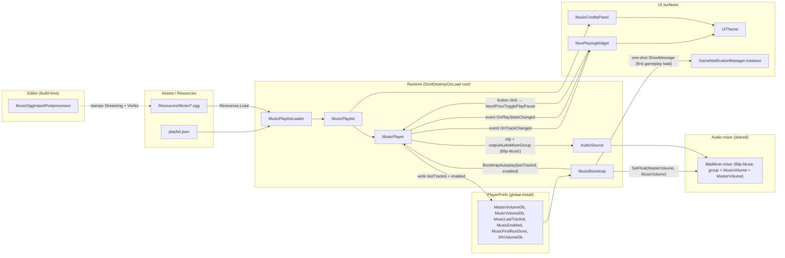

# Music Player — Jazz Exploration

Status: exploration / pre-spec
Owner: Javier
Date: 2026-04-16
Revision: r1 (initial draft, post-interview)

## 0. Context

Territory = 2D iso city builder. Owner wants authored **jazz music** playing in-game (menu + gameplay) with a **compact HUD widget** to show what's playing and basic controls. Music is a **separate domain** from Blip (procedural SFX). This doc scopes the player architecture, UI surface, integration points, and locks out speculative features.

Blip (SFX) is already in flight — shared mixer asset, independent from Music. No SFX work here.

---

## 1. Scope lock

- **Authored jazz tracks only.** No procedural generation, no MIDI+soundfont, no Markov chord engine, no stems/adaptive music.
- **Track source = `.ogg` files under `Assets/Resources/Music/`.** Royalty-free library (curated by owner).
- **Focus surfaces:** in-game **Music player** subsystem + **Now-playing HUD widget** + **Music Credits screen** (Settings sub-screen) + **Settings volume sliders** (Master / Music / SFX).
- **Blip overlap:** one surface only — `Assets/Audio/BlipMixer.mixer` gains a `Blip-Music` group. No SFX behavior changes.

---

## 2. Goals + non-goals

### 2.1 Goals

1. Ambient jazz plays from game start without user action.
2. Player sees what's playing at all times (compact single-row HUD widget, top-right).
3. Player can **play/pause, skip next, skip prev** from the widget.
4. Player can adjust **Music volume** independently of **SFX volume** via Settings.
5. Track resume across app launches (track id only; replay from 0s).
6. First-run toast signals the feature exists.

### 2.2 Non-goals (locked OUT)

- No procedural / MIDI+soundfont generation.
- No visualizer / FFT / spectrum UI.
- No user-uploaded track import (`.ogg` drop-in by player).
- No external streaming (Spotify / YouTube / SoundCloud / URL).
- No DRM / licensing backend.
- No SFX handling (Blip owns SFX).
- No audio preview in Credits screen (text-only).
- No dynamic music (stems / layers reacting to game state).
- No favorites / thumbs / user-authored playlists (MVP).
- No keyboard shortcuts (MVP).
- No dedicated Music panel (HUD widget is the only surface).
- No crossfade / fade-out on transition (hard cut).
- No multi-scale coupling (flat playlist regardless of zoom/scale).

Rationale on external streaming (Spotify/YouTube): sync-license gap + OAuth + WebView + region/Premium gating = ~3–5 weeks + legal review. Royalty-free .ogg ships in weeks with zero rights risk.

---

## 3. Track sourcing

- **License class:** royalty-free library (Epidemic Sound / PremiumBeat / artlist.io-tier). Owner curates.
- **Count at launch:** 3–5 tracks.
- **Format:** `.ogg` compressed, streamed from disk.
  - Unity import settings: `LoadType = Streaming`, `PreloadAudioData = false`, `CompressionFormat = Vorbis`, quality ≈ 0.5–0.7.
- **Loop points:** none. Track plays to end, player advances to next (shuffle).
- **Attribution:** royalty-free libs typically require credit line. Sourced from per-track metadata (title / artist / license blurb) → rendered in **Settings > Music > Credits** screen.

### 3.1 Playlist data source

- **JSON manifest** at `Assets/Resources/Music/playlist.json` (bundled via `Resources`).
- Schema (per row): `{ id, filename, title, artist, licenseBlurb }`.
- Runtime: `MusicPlaylistLoader.LoadFromResources()` → `JsonUtility.FromJson<MusicPlaylistJson>` → list of `MusicTrack` records.
- Clip resolution: `Resources.Load<AudioClip>("Music/" + filenameStem)`. Import meta stamp (Streaming load type) applied once per clip by editor tool.
- Advantages for agentic dev: `Write` tool can add a row + drop a .ogg with no .asset/YAML churn. SO alternative rejected — GUID drift risk.

---

## 4. Playback semantics

- **Autoplay:** from game start (MainMenu boot). Music continues through scene loads.
- **Track order:** **shuffle with no-repeat-until-exhausted.** Once all 3–5 tracks played, reshuffle + continue.
- **Transition on track end:** **hard cut** (advance to next track immediately, no fade / gap).
- **Boot sequence:** **2s linear fade-in** on the very first track after app boot (not on subsequent transitions). Gentler first impression vs. cold blast.
- **Manual skip-next:** instant advance (hard cut) + 500ms debounce to prevent mash-driven file I/O churn.
- **Manual skip-prev:** media-player standard — if `>3s` elapsed, restart current track; else jump to previous track in history. History bounded ring (~8 entries).
- **End of track:** advance to next (shuffle).
- **Pause on game pause menu / window minimize:** **no auto-pause.** User controls play/pause via HUD widget only.
- **Resume on launch:** replay last-played track id from PlayerPrefs; restart from 0s (no position persistence).

---

## 5. Mixing + ducking

### 5.1 Mixer topology — extend Blip mixer

- **Reuse existing `Assets/Audio/BlipMixer.mixer`.** Add new group `Blip-Music` under Master.
- Resulting groups: `Blip-UI`, `Blip-World`, `Blip-Ambient`, **`Blip-Music`** (new). All route to Master.
- Expose three params on Master: `MasterVolume`, `MusicVolume`, `SfxVolume` (dB, −80…0).
- `MusicVolume` binds to `Blip-Music`. `SfxVolume` keeps routing to the existing 3 SFX groups (existing wiring unchanged).
- Rationale: single project-wide audio graph, one asset to wire, one Settings screen to surface volume. Avoids duplicate Master plumbing.

Note on naming: group/param prefix stays `Blip-*` to match the current asset identity. If the mixer is ever renamed `AudioMixer`, param names stay stable (no breaking rename needed for this master plan).

### 5.2 Ducking — none

- No ducking. Music and SFX play at independent levels.
- Rationale: jazz is ambient low-energy; Blip SFX are short transients; levels can be balanced statically. Sidechain / snapshot complexity not justified MVP.

### 5.3 Settings UI — 3 sliders

- **Master volume** (dB, binds `MasterVolume`).
- **Music volume** (dB, binds `MusicVolume`).
- **SFX volume** (dB, binds `SfxVolume` — already in flight via Blip Settings step; Music work only adds the Music slider to the same panel).
- All persisted to `PlayerPrefs` (keys `MasterVolumeDb`, `MusicVolumeDb`, `SfxVolumeDb`). Applied on `MusicBootstrap.Awake` same pattern as `BlipBootstrap.Awake`.

---

## 6. UI surface catalog

### 6.1 Now-playing HUD widget

- **Position:** top-right corner of HUD (adjacent to minimap / resource bar zone).
- **Visibility mode:** always visible during gameplay + main menu.
- **Size:** compact single row (~240–280 px wide).
- **Layout:** `[EQ bars icon] Title • Artist   [⏮]  [▶/⏸]  [⏭]`
  - EQ-bars icon on left edge = 4 vertical bars, pulsing animation while playing, flat when paused.
  - Text: `Title • Artist` on one row, bullet separator, ellipsis truncate on overflow.
  - Text click = no-op.
  - Three control buttons right-aligned.
- **Theme:** consume `UiTheme` system (HUD/menu row parity — same colors/fonts as other HUD rows).
- **Animation on track change:** none — text swaps instantly on advance.
- **Empty playlist state:** widget hides itself (no tracks detected → no UI).
- **Missing track file at runtime:** log warning, skip silently to next track; widget never shows an error state.

### 6.2 First-run UX

- On first-ever gameplay boot (PlayerPrefs flag `MusicFirstRunDone` absent): toast appears for 5s: **"Jazz playing — toggle via top-right"**. Toast dismisses on click or timeout. Flag set after first dismissal.
- No tutorial re-trigger on subsequent launches.

### 6.3 Music Credits screen

- Reached via **Settings > Music > Credits** sub-screen.
- Lists all tracks: `Title — Artist — licenseBlurb` rendered from `playlist.json`.
- Text-only. No audio preview (out of scope).
- Scrollable list if future track count grows.

### 6.4 Controls — keyboard shortcuts

- None MVP. Defer to a post-MVP doc if user demand emerges.

---

## 7. Persistence

- **Scope:** global `PlayerPrefs` (per-install, not per-save-file). Like radio that stays tuned.
- **Keys:**
  - `MusicLastTrackId` (string) — last-played track id. On next launch, start from this track (restart from 0s).
  - `MusicEnabled` (int 0/1) — play/pause state across launches.
  - `MasterVolumeDb`, `MusicVolumeDb`, `SfxVolumeDb` — dB floats.
  - `MusicFirstRunDone` (int 0/1) — first-run toast guard.
- **Not persisted:** playback position within track, shuffle history, favorites. Shuffle history lives in RAM only.

---

## 8. Integration points

### 8.1 Overlap with Blip

**Single surface: `Assets/Audio/BlipMixer.mixer` (shared mixer asset).**

- Music work adds `Blip-Music` group + `MusicVolume` param to the existing mixer.
- No change to existing `Blip-UI` / `Blip-World` / `Blip-Ambient` groups.
- Coordination: Music master plan Step that modifies the mixer must land **before or after** Blip Stages that edit the mixer — not during. Simplest: Music Step 1 (bootstrap + mixer extension) lands when Blip is at a stable stage boundary.

See `ia/projects/blip-master-plan.md` for Blip ownership. Cross-ref Step/Stage that land first to confirm mixer asset state.

### 8.2 Persistent bootstrap — new `MusicBootstrap` prefab

- Parallels `Assets/Scripts/Audio/Blip/BlipBootstrap.cs` + the `BlipBootstrap` prefab in `MainMenu.unity`.
- New path: `Assets/Scripts/Audio/Music/MusicBootstrap.cs` + matching prefab.
- `Awake`: `DontDestroyOnLoad`, read `MusicVolumeDb` + `MasterVolumeDb` from `PlayerPrefs`, apply to mixer params, trigger first-track autoplay via `MusicPlayer`.
- Holds serialized refs: `AudioMixer blipMixer`, `MusicPlaylist playlist` (loaded from JSON), `AudioSource musicSource` (the single playback source).

### 8.3 Runtime components

- **`MusicBootstrap : MonoBehaviour`** — persistent root, mixer binding, first-track autoplay trigger, PlayerPrefs read.
- **`MusicPlaylist` (record + loader)** — loads + exposes track list from `playlist.json`.
- **`MusicPlayer : MonoBehaviour`** — owns one `AudioSource`. Play / pause / skip-next / skip-prev / shuffle / advance-on-end logic. Shuffle history ring. Writes `MusicLastTrackId` + `MusicEnabled` on state change.
- **`NowPlayingWidget : MonoBehaviour`** — HUD widget. Reads `MusicPlayer` state, updates text + EQ-bars + button icons. Wires button clicks back to `MusicPlayer`.
- **`MusicFirstRunToast`** — triggers from `NowPlayingWidget.OnEnable` when `MusicFirstRunDone` unset.
- **`MusicCreditsPanel : MonoBehaviour`** — Settings sub-screen, renders list from playlist.

### 8.4 Multi-scale coupling — none MVP

- Music plays the same flat playlist regardless of zoom / camera scale band.
- No hook into `multi-scale-master-plan.md`. Not reserved.
- Revisit post-MVP if per-scale music becomes a design goal.

### 8.5 Invariants touched

- **Invariant 3 (no `FindObjectOfType` in `Update` / per-frame):** widget caches `MusicPlayer` ref in `Awake`.
- **Invariant 4 (no new singletons):** `MusicBootstrap.Instance` is MonoBehaviour Inspector-placed, not `new`. Same pattern as `BlipBootstrap.Instance`.

---

## 9. Open questions + risks

1. **Mixer edit coordination with Blip** — when is the safe window to extend `BlipMixer.mixer`? Master plan Step 1 exit criteria should require confirmation Blip is at a stable stage boundary.
2. **Track count drift** — 3–5 feels thin for non-repetitive gameplay over hours. Post-MVP: plan for 10–15 track bump + curated per-context sub-playlists. Not in this master plan scope.
3. **First-run toast infra** — does a generic toast component exist today? If not, first-run toast may require a tiny toast helper (1 phase).
4. **HUD real-estate** — top-right corner currently hosts minimap/resources. Widget placement needs layout confirmation; may need a Stage 1 micro-task to reserve the slot.
5. **Resume track-id drift** — if `playlist.json` changes and a previously-saved id no longer exists, fall back to shuffle-fresh. Player must handle gracefully.
6. **Licensing file format** — royalty-free libs vary on attribution text. JSON `licenseBlurb` field is a free-form string; Credits screen renders as-is. Owner responsible for compliance.
7. **Audio import pipeline** — `LoadType = Streaming` must be stamped per clip. Editor tool or manual Inspector pass? Editor AssetPostprocessor for `Assets/Resources/Music/*.ogg` preferred (one tiny helper script).
8. **Platform scope** — MVP is Unity desktop (Mac/Win). iOS/Android/WebGL not in scope (streaming LoadType behaves differently on WebGL; defer).

---

## 10. Locked decisions (append-only)

2026-04-16 — post-interview lock:

1. **Scope = authored jazz + in-game player + HUD widget + Settings volume + Credits screen.** Nothing else.
2. **Track source = royalty-free library, 3–5 tracks MVP.**
3. **File format = `.ogg` streamed**, `LoadType=Streaming`, `PreloadAudioData=false`, no loop points.
4. **Autoplay from game start + shuffle no-repeat-until-exhausted.**
5. **Transition = hard cut** between tracks. **2s fade-in on first track** after app boot only.
6. **No auto-pause** on game pause / window minimize. User-toggle only via widget.
7. **Skip-next = instant advance + 500ms debounce.**
8. **Skip-prev = restart-if->3s else prev-in-history.**
9. **Mixer = extend `Assets/Audio/BlipMixer.mixer`** — add `Blip-Music` group + `MusicVolume` param.
10. **No ducking.** Independent SFX + Music levels.
11. **3 volume sliders in Settings** — Master / Music / SFX.
12. **HUD widget = always visible, top-right, compact single row, `Title • Artist` with ellipsis + EQ-bars icon + 3 controls (prev / play-pause / next).**
13. **No keyboard shortcuts MVP.**
14. **No dedicated Music panel** — widget is the only interactive surface.
15. **Widget uses `UiTheme` system.**
16. **No animation on track change.**
17. **Attribution via `Settings > Music > Credits`** text-only screen.
18. **Widget title-click = no-op.**
19. **Missing track = skip silently** (log warning, no UI error).
20. **Empty playlist = widget hides.**
21. **Resume track-id only**, restart from 0s. Persist to global `PlayerPrefs`.
22. **No favorites / playlist CRUD / user-uploaded tracks / external streaming / DRM backend / visualizer / dynamic stems.**
23. **No multi-scale coupling.** Flat playlist.
24. **First-run UX = one-time toast** "Jazz playing — toggle via top-right", 5s.
25. **Playlist source = JSON manifest** at `Assets/Resources/Music/playlist.json`. Clips loaded via `Resources.Load<AudioClip>`.
26. **Persistent bootstrap = new `MusicBootstrap` prefab**, parallels `BlipBootstrap` pattern.
27. **Glossary terms to add later (at master-plan-new stage, not here):** Music track, Music playlist, Music player, Now-playing widget, Music mixer group, Music Credits.

---

## Design Expansion

### Chosen Approach

**Approach A — Single `AudioSource` + coroutine-driven advance + C# event subscription.**

Rationale: mirrors `BlipBootstrap` / `BlipPlayer` pattern exactly (same repo, same invariants, same `DontDestroyOnLoad` root, same `[SerializeField] private` + `FindObjectOfType` fallback wiring per unity-development-context §3). Single MB per role, zero singletons beyond MB `Instance` accessor. Deterministic Awake ordering. No Unity `AudioMixer` snapshot transitions, no second player, no `IMusicPlayer` interface abstraction — direct MB ref from widget matches how `BlipBootstrap.Instance` is consumed today.

### Components (one-line responsibility each)

- `MusicBootstrap : MonoBehaviour` — persistent root prefab in `MainMenu.unity`; `DontDestroyOnLoad` on Awake; reads `MasterVolumeDb` / `MusicVolumeDb` / `SfxVolumeDb` + `MusicLastTrackId` + `MusicEnabled` + `MusicFirstRunDone` from `PlayerPrefs`; binds `MasterVolume` / `MusicVolume` params on `BlipMixer`; hands off to `MusicPlayer.BootstrapAutoplay(lastTrackId, enabled)`. `Instance` MB accessor, no singleton.
- `MusicPlayer : MonoBehaviour` — owns one `AudioSource`; loads playlist; shuffle history ring (~8); advance-on-end coroutine polling `!AudioSource.isPlaying` after a grace sample; skip-next debounce (500ms); skip-prev (>3s restart, else pop history); 2s linear fade-in coroutine on first boot track only. Exposes C# events `OnTrackChanged(MusicTrack)`, `OnPlayStateChanged(bool)`. Writes `MusicLastTrackId` + `MusicEnabled` on state change.
- `MusicTrack` (record struct) — `{ string id, string filename, string title, string artist, string licenseBlurb }`.
- `MusicPlaylist` (plain class) — holds `List<MusicTrack>` + resolved `AudioClip[]` cache.
- `MusicPlaylistLoader` (static) — `LoadFromResources()` reads `Assets/Resources/Music/playlist.json` via `TextAsset`, parses with `JsonUtility.FromJson<MusicPlaylistJson>`, resolves clips via `Resources.Load<AudioClip>("Music/" + stem)`, drops rows w/ null clips (warn), returns empty list on malformed JSON (warn).
- `NowPlayingWidget : MonoBehaviour` — HUD top-right row (top-level under `Canvas/DataPanelButtons` or a new `HudAudioRow` sibling per ui-design-system §3.1). Caches `MusicPlayer` ref in `Awake` via `[SerializeField] private` + `FindObjectOfType<MusicPlayer>()` fallback. Subscribes `OnTrackChanged` / `OnPlayStateChanged` in `OnEnable`; unsubscribes in `OnDisable`. Renders `Title • Artist` w/ ellipsis via TMP, EQ-bars icon (4 bars, pulse animation while playing, flat while paused), 3 buttons (prev / play-pause / next). Theme pulled from `UiTheme` per ui-design-system §5.2.
- `MusicCreditsPanel : MonoBehaviour` — Settings sub-screen rendered from `MusicPlaylist.Tracks`, scrollable list of `Title — Artist — licenseBlurb` rows. Opens from a Settings nav entry.
- `MusicFirstRunToast` — not a new MB; logic lives on `MusicBootstrap`. Reads `MusicFirstRunDone` flag on Awake; after first gameplay scene load, calls `GameNotificationManager.Instance.ShowMessage("Jazz playing — toggle via top-right", NotificationType.Info, 5f)` (duration param per existing GNM API); writes `MusicFirstRunDone=1` immediately (fire-and-forget — no confirmation of dismissal needed per §6.2).
- `MusicOggImportPostprocessor` (editor-only) — `AssetPostprocessor.OnPreprocessAudio` stamps `LoadType=Streaming`, `PreloadAudioData=false`, `CompressionFormat=Vorbis` (quality 0.5) on any `.ogg` imported under `Assets/Resources/Music/`. Answers open question Q7.

### Data flow

```
MainMenu.unity load
  → MusicBootstrap.Awake
       → DontDestroyOnLoad(root)
       → PlayerPrefs read (6 keys)
       → BlipMixer.SetFloat("MasterVolume", masterDb)
       → BlipMixer.SetFloat("MusicVolume", musicDb)
       → MusicPlaylistLoader.LoadFromResources() → MusicPlaylist
       → MusicPlayer.BootstrapAutoplay(lastTrackId, enabled)
  → MusicPlayer.BootstrapAutoplay
       → resolve lastTrackId (fallback shuffle-fresh if missing)
       → AudioSource.Play(clip)
       → StartCoroutine(FirstTrackFadeIn 2s linear)
       → StartCoroutine(AdvanceOnEndLoop)
       → invoke OnTrackChanged(track)
  → NowPlayingWidget.OnEnable
       → subscribe MusicPlayer events
       → render current state
  → [first gameplay scene load + MusicFirstRunDone==0]
       → GameNotificationManager.Instance.ShowMessage(...)
       → PlayerPrefs.SetInt("MusicFirstRunDone", 1)

[user clicks widget Next]
  → NowPlayingWidget.OnNextClicked
       → MusicPlayer.Next()
       → debounce 500ms guard
       → pick next from shuffle
       → AudioSource.Stop + Play(clip) (hard cut)
       → invoke OnTrackChanged(track)
       → widget re-renders via subscription

[track reaches end in AdvanceOnEndLoop]
  → detect !isPlaying && time >= length - epsilon
  → call MusicPlayer.AdvanceToNext()
  → same flow as skip-next but no debounce
```

### Interfaces / contracts

- No `IMusicPlayer` interface — widget depends directly on `MusicPlayer` MB. Matches Blip convention; zero-cost refactor if abstraction needed later.
- C# events (not UnityEvents): `public event Action<MusicTrack> OnTrackChanged;` + `public event Action<bool> OnPlayStateChanged;`. Keeps wiring in code — zero prefab Inspector churn. Subscribers use `OnEnable` / `OnDisable` pattern.
- `MusicPlayer` public API: `BootstrapAutoplay(string lastTrackId, bool enabled)`, `Play()`, `Pause()`, `TogglePlayPause()`, `Next()`, `Prev()`, `IsPlaying { get; }`, `CurrentTrack { get; }`.
- `MusicBootstrap` public statics: `Instance`, constants `MusicVolumeDbKey` / `MusicVolumeParam` / `MasterVolumeDbKey` / `MasterVolumeParam` / `MusicLastTrackIdKey` / `MusicEnabledKey` / `MusicFirstRunDoneKey`.

### Non-scope

All §2.2 locked-OUT items: no procedural generation, no MIDI, no stems / adaptive, no visualizer, no user uploads, no external streaming, no DRM, no favorites, no playlist CRUD, no keyboard shortcuts, no dedicated Music panel, no crossfade, no multi-scale coupling, no auto-pause on game pause. Also out of this design: no `IMusicPlayer` interface, no separate `MusicMixerRouter` class (mixer binding stays on `MusicBootstrap.Awake`), no DOTween dependency (native coroutines only for fade-in).

---

### Architecture



**Entry point:** `MusicBootstrap.Awake` (scene-load from `MainMenu.unity`).
**Exit points:** `MusicPlayer.{Play, Pause, TogglePlayPause, Next, Prev}` + `NowPlayingWidget.On{Next, Prev, PlayPause}Clicked` button handlers + `MusicPlayer.AdvanceOnEndLoop` coroutine tick.

---

### Subsystem impact

| Subsystem | Dependency nature | Invariant risk (by number) | Breaking vs additive | Mitigation |
|---|---|---|---|---|
| Audio mixer (`Assets/Audio/BlipMixer.mixer`) | Shared asset — must add `Blip-Music` group + `MusicVolume` + `MasterVolume` params. Existing `Blip-UI` / `Blip-World` / `Blip-Ambient` + `SfxVolume` untouched. | — | **Additive.** | Coordinate landing window w/ Blip master plan — land Music Step 1 between Blip Stages, not during. `audio-blip.md §5.4` router placement rationale unchanged. Document in master-plan Step 1 exit criteria. |
| UI HUD (`UIManager.Hud.cs`, `Canvas/DataPanelButtons` tree) | New HUD widget row (top-right), reuse `UiTheme` + TMP stack. | **#3** (widget caches `MusicPlayer` ref in `Awake`, no per-frame `FindObjectOfType`). | **Additive.** | `[SerializeField] private MusicPlayer` + `FindObjectOfType<MusicPlayer>()` fallback in `Awake` per unity-development-context §3 + ui-design-system §1.3.1 (no deep `Transform.Find`, stable naming). |
| Settings UI (future volume sliders panel) | Two new sliders (Master + Music) alongside existing SFX slider from Blip Settings step. New Credits sub-screen entry. | — | **Additive.** | Bind sliders to same mixer params `MasterVolume` / `MusicVolume` via `PlayerPrefs` keys defined on `MusicBootstrap`. Reuse Blip Settings panel scaffolding when it lands; document dependency direction in master plan. |
| Persistence (PlayerPrefs) | Five new keys (`MasterVolumeDb`, `MusicVolumeDb`, `MusicLastTrackId`, `MusicEnabled`, `MusicFirstRunDone`). SFX key reuses existing `BlipBootstrap.SfxVolumeDbKey = "BlipSfxVolumeDb"` verbatim — no rename, no migration. | — | **Additive** (zero collision w/ Blip keys). | Music Bootstrap does not re-declare SFX key constant. Settings SFX slider (Blip work) reads the existing `"BlipSfxVolumeDb"` key. Doc §7 wording `SfxVolumeDb` is conceptual — actual key name = `BlipSfxVolumeDb`. Clarify at master-plan Step 1 authoring. |
| MainMenu bootstrap (`MainMenu.unity` scene) | New `MusicBootstrap` prefab sibling to existing `BlipBootstrap` prefab. Both `DontDestroyOnLoad` on Awake. | **#4** (MB Inspector-placed `Instance`, not `new`). | **Additive.** | Mirror exact BlipBootstrap prefab shape — `Instance` static MB accessor, not constructor singleton. |
| Notifications (`GameNotificationManager`) | Reuse existing `Instance.ShowMessage(...)` for first-run toast. Answers open question Q3 — no new toast component needed. | — | **Additive** (consumer only). | Pass `NotificationType.Info` + 5f duration override to match §6.2 spec ("5s toast"). If existing API doesn't expose duration override, fall back to default `notificationDuration=3f` + doc update. |
| Editor tooling | New `MusicOggImportPostprocessor` stamps import settings for `Assets/Resources/Music/*.ogg`. Answers open question Q7. | — | **Additive.** | Scope postprocessor to path prefix `Assets/Resources/Music/` only — zero impact on Blip SFX / other audio. |

**Gap:** `ia/specs/audio-blip.md` present on disk but not indexed by MCP `list_specs`. Read directly for §5.1 + §5.4 confirmation. Flag for follow-up (doc registration), no blocker.

---

### Implementation points

Phased checklist, dependency-ordered.

**P1 — Audio infra**
- [ ] Extend `Assets/Audio/BlipMixer.mixer` — add `Blip-Music` group under Master, expose `MusicVolume` + `MasterVolume` dB params.
- [ ] Author `MusicBootstrap.cs` at `Assets/Scripts/Audio/Music/MusicBootstrap.cs` (mirror `BlipBootstrap.cs` shape).
- [ ] Create `MusicBootstrap` prefab under `Assets/Prefabs/Audio/` + place in `MainMenu.unity` scene root alongside `BlipBootstrap`.
- [ ] Register PlayerPrefs keys as public constants on `MusicBootstrap`: `MasterVolumeDbKey`, `MusicVolumeDbKey`, `MusicLastTrackIdKey`, `MusicEnabledKey`, `MusicFirstRunDoneKey`.
- [ ] Bind `MasterVolume` + `MusicVolume` on Awake via `mixer.SetFloat(param, db)`; warn if param missing (BlipBootstrap pattern L61–L72).

**P2 — Playlist pipeline**
- [ ] Author `MusicTrack` record struct at `Assets/Scripts/Audio/Music/MusicTrack.cs`.
- [ ] Author `MusicPlaylist` class at `Assets/Scripts/Audio/Music/MusicPlaylist.cs`.
- [ ] Author `MusicPlaylistLoader` static at `Assets/Scripts/Audio/Music/MusicPlaylistLoader.cs` — `JsonUtility.FromJson<MusicPlaylistJson>` on `TextAsset` from `Resources.Load<TextAsset>("Music/playlist")`; try / catch on parse; `Resources.Load<AudioClip>("Music/" + stem)` w/ null-skip warn.
- [ ] Seed `Assets/Resources/Music/playlist.json` w/ placeholder schema (3 rows, dummy clips).
- [ ] Author `MusicOggImportPostprocessor` at `Assets/Editor/MusicOggImportPostprocessor.cs` — scope `Assets/Resources/Music/*.ogg` only, stamp `LoadType=Streaming` + `PreloadAudioData=false` + `CompressionFormat=Vorbis` quality 0.5.

**P3 — MusicPlayer runtime**
- [ ] Author `MusicPlayer.cs` — owns `[SerializeField] private AudioSource musicSource`.
- [ ] Implement shuffle: no-repeat-until-exhausted Fisher-Yates on `List<MusicTrack>`; on exhaustion, reshuffle forbidding last-played as next head.
- [ ] Implement `AdvanceOnEndLoop` coroutine — `while (true) { yield return null; if (musicSource.clip != null && !musicSource.isPlaying && musicSource.time >= musicSource.clip.length - 0.05f) AdvanceToNext(); }`.
- [ ] Implement 500ms skip-next debounce via `Time.unscaledTime` gate.
- [ ] Implement skip-prev — if `musicSource.time > 3f` → `musicSource.time = 0` + replay; else pop history.
- [ ] Implement `FirstTrackFadeInCoroutine` — 2s linear ramp on `musicSource.volume` from 0 → 1, gated by "first track after boot" flag.
- [ ] Implement autoplay on `BootstrapAutoplay` — resolve `lastTrackId` via playlist; fall back to shuffle-fresh on miss (log warn).
- [ ] **Bind mixer group** — on Awake, resolve `Blip-Music` via `[SerializeField] private AudioMixerGroup musicGroup` (Inspector-wired) + `blipMixer.FindMatchingGroups("Blip-Music")[0]` fallback; assign to `musicSource.outputAudioMixerGroup` before first `Play()`.
- [ ] Pause-vs-end disambiguation — `AdvanceOnEndLoop` checks explicit `!_isPaused` guard before advancing, not just `!isPlaying`. `Pause()` sets flag; `Play()` clears it.
- [ ] Declare C# events `OnTrackChanged` + `OnPlayStateChanged`; invoke on state transitions.
- [ ] Persist `MusicLastTrackId` + `MusicEnabled` to PlayerPrefs on track change + play-state change.

**P4 — NowPlayingWidget**
- [ ] Author `NowPlayingWidget.cs` at `Assets/Scripts/UI/Hud/NowPlayingWidget.cs`.
- [ ] `[SerializeField] private MusicPlayer musicPlayer` + `FindObjectOfType<MusicPlayer>()` fallback in `Awake`.
- [ ] Subscribe events in `OnEnable`, unsubscribe in `OnDisable`.
- [ ] HUD layout — top-right corner, `Canvas/DataPanelButtons` sibling or new `HudAudioRow` parent per ui-design-system §1.3.1. Use `anchorMin = anchorMax = (1, 1)` top-right corner anchor, fixed 32px height, no full-stretch anchors (§1.3.1 full-stretch warning).
- [ ] EQ-bars icon — 4 stacked `Image` rects w/ `sin(Time.time * freq)` height modulation when playing; flat baseline when paused. Per-frame write uses `rectTransform.sizeDelta = new Vector2(w, h)` struct assignment (zero alloc). No `GetComponent` / `Find` / `FindObjectOfType` inside `Update` per invariant #3 — all refs cached in `Awake`.
- [ ] `Title • Artist` TMP row — ellipsis overflow, ~240–280 px wide.
- [ ] 3 buttons (prev / play-pause / next) wired to `MusicPlayer.{Prev, TogglePlayPause, Next}`.
- [ ] Consume `UiTheme` colors + fonts per ui-design-system §5.2.
- [ ] Empty playlist → `gameObject.SetActive(false)` early-return in `Start`.

**P5 — Settings sliders + Credits**
- [ ] Add Master + Music sliders to Settings panel; bind to `MasterVolume` / `MusicVolume` mixer params; persist via PlayerPrefs keys from `MusicBootstrap` constants.
- [ ] SFX slider already in flight via Blip Settings step — no work here beyond confirming Music work doesn't collide.
- [ ] Author `MusicCreditsPanel.cs` at `Assets/Scripts/UI/Settings/MusicCreditsPanel.cs` — render scrollable list from `MusicPlaylist.Tracks`.
- [ ] Wire Settings nav entry `Settings > Music > Credits`.

**P6 — First-run toast + resume**
- [ ] On first gameplay scene load, check `PlayerPrefs.GetInt(MusicFirstRunDoneKey, 0) == 0`.
- [ ] If yes → `GameNotificationManager.Instance.ShowMessage("Jazz playing — toggle via top-right", NotificationType.Info, 5f)` (confirm duration param on existing API; fallback: set `notificationDuration` field before call).
- [ ] Immediately `PlayerPrefs.SetInt(MusicFirstRunDoneKey, 1)` — fire-and-forget.
- [ ] Resume track-id — already covered in P3 `BootstrapAutoplay`; fail-soft on missing id (shuffle-fresh).

**Deferred / out of scope**
- Keyboard shortcuts, favorites, playlist CRUD, dynamic music (stems/layers), multi-scale coupling, visualizer, Spotify/YouTube/SoundCloud, DRM backend, crossfade, audio preview in Credits, per-track loop points, user-uploaded .ogg import, auto-pause on window minimize / game pause menu, iOS/Android/WebGL platform support, dedicated Music panel, animation on track change, click-through on title text.

---

### Examples

**Playlist loader**

Input:
```json
{
  "tracks": [
    { "id": "smooth-01", "filename": "smooth-jazz-a.ogg", "title": "Smooth A", "artist": "Jane Doe", "licenseBlurb": "Royalty-free via ArtistLib" },
    { "id": "bop-02",    "filename": "bop-b.ogg",         "title": "Bop B",    "artist": "John Roe", "licenseBlurb": "CC-BY 4.0" },
    { "id": "lounge-03", "filename": "lounge-c.ogg",      "title": "Lounge C", "artist": "Pat Liu",  "licenseBlurb": "Royalty-free via ArtistLib" }
  ]
}
```

Output: `List<MusicTrack>` of length 3, each row w/ resolved `AudioClip` handle from `Resources.Load<AudioClip>("Music/smooth-jazz-a")` (sans `.ogg` extension).

Edge — malformed JSON (trailing comma, truncated file): `JsonUtility.FromJson` throws; loader catches, logs `"[Music] playlist.json malformed — player disabled"`, returns empty list. `MusicPlayer.BootstrapAutoplay` sees empty playlist → no-op. `NowPlayingWidget.Start` sees `Tracks.Count == 0` → `gameObject.SetActive(false)`.

Edge — valid row but missing `.ogg`: `Resources.Load<AudioClip>("Music/missing-stem")` returns `null`. Loader logs `"[Music] Track 'missing-stem' clip missing — skipping row"` and omits row from output list. Playlist continues w/ other rows.

**Shuffle advance**

Input: `tracks=[t1,t2,t3]`, `history=[]`, `remaining=[t1,t2,t3]` (shuffled = `[t2,t1,t3]`), `current=null`.

Output (first play): pop `t2` off front of shuffled remaining → `current=t2`, `history=[t2]`, `remaining=[t1,t3]`. Fade-in coroutine runs (first track after boot).

Second advance: pop `t1` → `current=t1`, `history=[t2,t1]`, `remaining=[t3]`. No fade-in (hard cut).

Third advance: pop `t3` → `current=t3`, `history=[t2,t1,t3]`, `remaining=[]`.

Fourth advance: `remaining` empty → reshuffle `[t1,t2,t3]` forbidding `t3` (last played) as head → e.g. `[t1,t2,t3]` (regenerate until head ≠ t3). Continue.

Edge — playlist size 1: shuffle trivial, single track loops. Acceptable (doc locks 3–5 min count; size-1 is a dev-time edge only).

**Skip-prev**

Input: `musicSource.time=4.2f`, `current=t2`, `history=[t1,t2]`.

Output: `musicSource.time = 0f` + `musicSource.Play()`. `current` stays t2. History unchanged.

Input: `musicSource.time=1.1f`, `current=t2`, `history=[t1,t2]`.

Output: pop `t2` off history tail → history `[t1]`. Play `t1` (take from history peek). `current=t1`. Push `t2` back onto front of remaining.

Edge — `history=[]` (just booted, first track still playing): skip-prev → restart current track (fall-through to `time=0` branch).

**Missing track on resume**

Input: `PlayerPrefs.GetString(MusicLastTrackIdKey) = "t99"`, playlist has `[t1,t2,t3]`.

Output: `MusicPlayer.BootstrapAutoplay` looks up `t99` → miss. Log warn `"[Music] last track 't99' not in playlist — starting shuffle-fresh"`. Fall through to fresh shuffle path. Autoplay continues. Does not block game start.

**First-run toast**

Input: first gameplay scene load, `PlayerPrefs.GetInt("MusicFirstRunDone", 0) == 0`.

Output: `GameNotificationManager.Instance.ShowMessage("Jazz playing — toggle via top-right", NotificationType.Info, 5f)`. `PlayerPrefs.SetInt("MusicFirstRunDone", 1)` immediately. Subsequent launches: toast skipped.

---

### Review Notes

Phase 8 review run inline (Agent tool unavailable in current harness — ran self-review against invariants + glossary + ui-design-system §1.3.1/§3.1/§5.2 + unity-development-context §3+§6 + audio-blip §5.2). Three BLOCKING items resolved in-place (mixer-group binding on AudioSource, pause-vs-end coroutine guard, SFX key collision w/ existing `BlipBootstrap.SfxVolumeDbKey`). NON-BLOCKING + SUGGESTIONS preserved verbatim below.

**NON-BLOCKING**

- **Location: Components → MusicPlayer.** `AdvanceOnEndLoop` polling `!isPlaying + time >= length - 0.05f` risks false advance if `AudioSource.Pause` sets `isPlaying=false`. Use explicit `_pauseRequested` flag guard inside the coroutine. (Resolved in P3 via pause-vs-end subtask.)
- **Location: P4.** `NowPlayingWidget` parenting needs explicit anchor strategy per ui-design-system §1.3.1 — note "top-right anchor = (1,1), fixed 32px height, no full-stretch". (Resolved in P4 HUD layout bullet.)
- **Location: P2.** `MusicOggImportPostprocessor` filter by `Resources/Music/` prefix — double-check `AssetImporter` path is `Assets/Resources/Music/...` not just `Resources/Music/...`. Implementation-time verify during P2.

**SUGGESTIONS**

- Consider exposing `MusicPlayer.TrackCount` getter for widget's empty-playlist early return (rather than subscribing to a never-firing event).
- Consider adding `OnPlaylistLoaded` event on `MusicPlayer` for Credits panel that opens before first track plays.

**Gaps flagged**

- `ia/specs/audio-blip.md` present on disk but not indexed by MCP `list_specs`. Read directly for §5.2 init-order confirmation. Registration follow-up belongs in a separate MCP-index issue — not a music-player blocker.

---

### Expansion metadata

- Date: 2026-04-16 (ISO)
- Model: claude-opus-4-6
- Approach selected: A — Single `AudioSource` + coroutine advance + C# event subscription
- Blocking items resolved: 3
