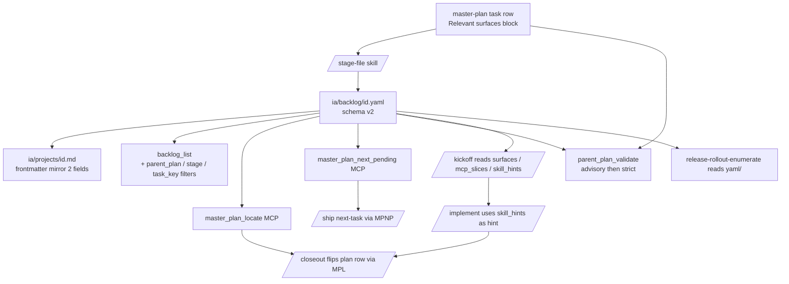

# Parent-plan locator fields + reverse-lookup tooling — exploration

> **Status:** Draft
> **Created:** 2026-04-18
> **Last updated:** 2026-04-18
> **Proposed owner plan:** `ia/projects/backlog-yaml-mcp-alignment-master-plan.md` (extend w/ new Step)

## Problem

Issue specs (`ia/projects/{ISSUE_ID}*.md`), yaml records (`ia/backlog/{id}.yaml`), and master-plan task tables (`ia/projects/*master-plan*.md`) encode the same coordinate (step / stage / phase / task row) redundantly and inconsistently:

- **Spec frontmatter** carries only IA-retrieval hints (`purpose, audience, loaded_by, slices_via`). No parent-plan pointer. No step/stage/phase locator.
- **Yaml record** encodes coordinate only as prose suffix in `title` (e.g. `"(Stage 1.1 Phase 3)"`) + via `depends_on` chains. Not queryable.
- **Master plan** holds reverse map (`task row → Issue: TECH-NNN`) — forward lookup (issue → plan coord) requires grep across `ia/projects/*master-plan*.md`.

Consequences for the agentic dev loop:

1. **`/ship` next-task lookup** — scans master plan every invocation (see `.claude/commands/ship.md` §Next-handoff resolver).
2. **`/closeout` plan-row flip** — greps for issue id in master plans to flip status column (see `ia/rules/agent-principles.md` — after `/closeout`, flip master plan task row before re-validating).
3. **Drift risk** — rename a stage or renumber phases and every yaml `title` suffix rots silently; no validator catches it.
4. **Kickoff / implement context load** — agents round-trip `router_for_task` + `backlog_issue` + scan plan to discover relevant surfaces; could be pre-materialized.
5. **Rollout tracker helpers** — `release-rollout-enumerate` already infers (plan, stage) tuples; would be a direct yaml read with schema support.

## Approaches surveyed

### Approach A — Minimal yaml extension

Add only two fields to `ia/backlog/{id}.yaml`:

```yaml
parent_plan: ia/projects/zone-s-economy-master-plan.md
task_key: T1.1.3
```

Everything else (step / stage / phase numeric breakdown) derived at read time by parsing `task_key` string. No spec-frontmatter change. No new MCP tool — existing `backlog_issue` returns the two new fields verbatim. One-line CI check: `parent_plan` path exists.

**Pros:** smallest change; single source of truth; trivial migration (one pass over open yaml).

**Cons:** no structural fields (step/stage/phase), so filters like `backlog_list --stage=1.1` still need string parsing; no reverse lookup into plan row line; no auto-load of surfaces; drift between `task_key` and plan still undetected unless a validator parses the plan.

### Approach B — Full schema extension + MCP reverse-lookup tools + validator *(originally proposed)*

Yaml schema (source of truth):

```yaml
parent_plan: ia/projects/zone-s-economy-master-plan.md
step: 1
stage: "1.1"
phase: 3
task_key: T1.1.3
router_domain: "Zones, buildings, RCI"
surfaces:                 # optional; populated by stage-file from plan
  - Assets/Tests/EditMode/Economy/
  - Assets/Scripts/Managers/UnitManagers/Zone.cs
mcp_slices:               # optional pinned slices
  - rule:invariants#4
  - glossary:Zone S
skill_hints:              # optional routing
  - agent-test-mode-verify
```

Spec markdown frontmatter — thin two-line mirror only (avoids 3-way drift):

```yaml
parent_plan: ia/projects/zone-s-economy-master-plan.md
task_key: T1.1.3
```

New MCP tools:

- `master_plan_locate {issue_id}` → `{plan, step, stage, phase, task_key, row_line}`.
- `master_plan_next_pending {plan, stage?}` → next `_pending_` / `Draft` task row (feeds `/ship`).
- `parent_plan_validate` → invariant pass: every yaml `parent_plan` resolves; `task_key` matches a row in `parent_plan`; every plan row `Issue` back-references its yaml.

Extend existing: `backlog_list` gains `parent_plan=` + `stage=` filters (trivial — `backlog-list.ts` already has the filter scaffolding).

Skill patches:

- `project-new` / `stage-file` — auto-populate new yaml fields from plan context.
- `project-spec-close` — auto-flip plan row via `master_plan_locate` (kills grep).
- `project-spec-kickoff` / `project-spec-implement` — optional: read `surfaces` / `mcp_slices` first, skip `router_for_task` round-trip.

**Pros:** removes every scan-driven path in the lifecycle (`/ship`, `/closeout`, `release-rollout-enumerate`); CI validator catches drift; structured filters ship-ready; surfaces/mcp_slices pre-materialize context load.

**Cons:** ~5 yaml fields + ~3 MCP tools + validator + 3 skill patches — ~1 orchestrator-scale effort (multi-step). Optional fields (`surfaces` / `mcp_slices` / `skill_hints`) carry stale-redundancy risk if hand-edited.

### Approach C — Spec-frontmatter-only (no yaml ext)

Add `parent_plan` + `task_key` to spec markdown frontmatter only. No yaml schema change. Reverse lookup via a regenerated index file (`ia/state/master-plan-index.json`) built by `tools/scripts/materialize-backlog.sh` — same pipeline that materializes BACKLOG.md from yaml.

**Pros:** no yaml schema migration; index rebuild is cheap; reverse lookup without new MCP tool (tools read the JSON).

**Cons:** splits source of truth (spec markdown vs yaml); closed issues in `ia/backlog-archive/` would not participate unless archive scanned too; index rebuild drift window between yaml write and index regen; doesn't fix filters on `backlog_list`.

### Approach D — Master-plan-side index only

No yaml schema change, no spec frontmatter change. Just add a regenerated `ia/state/master-plan-index.json` built from scanning all `*master-plan*.md` task tables. Indexes `{issue_id → plan, step, stage, phase, task_key, row_line}`.

**Pros:** zero schema churn; zero migration; single regenerator script; survives renames (plan is truth).

**Cons:** every new plan must feed the regenerator; no forward link from yaml (yaml stays blind to its own plan); doesn't unlock `backlog_list` filters; no CI validation of the yaml↔plan contract (only plan self-consistency).

## Recommendation *(tentative — user confirms during Phase 2 gate)*

**Approach B — full schema extension + MCP reverse-lookup tools + validator.**

Rationale: the repeat cost of scan-based lookups in `/ship`, `/closeout`, and `release-rollout-enumerate` compounds per issue; coordinate ambiguity shows up in master-plan path args, next-task resolution, and closeout row sync. B is the only approach that closes the loop end-to-end (structured filters + reverse lookup + CI validator). Approach A is a valid MVP if scope needs trimming — can be delivered as Step 1 of B, with MCP tools + validator as Steps 2–3.

## Open questions

1. **`surfaces` auto-populate policy** — only at `stage-file` time from the plan's "Relevant surfaces" block? Or also on kickoff when implementer discovers new surfaces? Hand-edit allowed?
2. **`skill_hints` semantics** — declarative ("this task should use skill X") or advisory ("the agent chose skill X last run")? Who writes it — `stage-file` or implementer at close time?
3. **CI validator mode** — blocking (fails `validate:all` on drift) or advisory (prints hits, exits 0)? Precedent: `validate:dead-project-specs` has both modes via `--advisory`.
4. **Migration path for existing open yaml records** — backfill via one-shot script (parse `title` suffix + walk plans) or leave blank and let `stage-file` / next `/kickoff` fill on first touch?
5. **Archive behavior** — do closed yaml records in `ia/backlog-archive/` need the same fields for historical queries, or is back-archive backfill deferred?
6. **Spec-frontmatter mirror scope** — just `parent_plan` + `task_key` (Approach B default), or also `step` / `stage` / `phase` for humans scanning the spec file? More fields = more drift surface.
7. **Three optional fields (`surfaces` / `mcp_slices` / `skill_hints`) — in or out of MVP?** Can land in a follow-up Step if they bloat Step 1 scope.

## Proposed next step

Once approaches compared + gate cleared: `claude-personal "/master-plan-new docs/parent-plan-locator-fields-exploration.md"` to produce `ia/projects/parent-plan-locator-master-plan.md` (fully decomposed step > stage > phase > task). Then `/stage-file {plan} Stage 1.1` to file the first stage as individual TECH- issues, and `/ship {id}` per issue.

---

## Design Expansion

### Interview summary

User confirmed **Approach B** with migration scoped hybrid — open-yaml one-shot backfill in Step 1; archive deferred with `--skip-unresolvable`; spec md frontmatter lazy on next kickoff; plans zero backfill. Validator ships dual-mode (advisory default + `--strict`), late-hardening task flips default to blocking in `validate:all`. All three optional fields (`surfaces`, `mcp_slices`, `skill_hints`) land in Step 1 MVP. `surfaces` populated by `stage-file` from plan task-row "Relevant surfaces" block; `spec-kickoff` appends only (never rewrites / reorders / drops) when edits land in §4 / §5.2 regions. `skill_hints` = plan-upfront advisory hint only — `stage-file` / `project-new` write; kickoff / implement read as routing suggestion, not mandate. Spec-frontmatter mirror = 2 fields only (`parent_plan` + `task_key`); step/stage/phase derivable from `task_key` parser.

### Phase 1 — Comparison matrix

| Approach | Constraint fit | Effort | Output control | Maintainability | Dependencies / risk |
|---|---|---|---|---|---|
| **A — Minimal yaml (`parent_plan` + `task_key` only)** | Partial — reverse lookup but not structured filters / surfaces pre-materialize. | Low — 2 yaml fields + 1 CI path check. | Weak — consumers parse `task_key` strings for step/stage/phase filters. | High — tiny surface, minimal drift. | Low — no MCP tool, no schema migration beyond 2 fields. |
| **B — Full schema + MCP reverse-lookup + validator** *(selected)* | Full — closes `/ship`, `/closeout`, `release-rollout-enumerate` scan paths; unlocks structured filters; pre-materializes context load. | High — ~5 yaml fields + 3 MCP tools + validator + 5 skill patches + backfill scripts. Multi-step. | Strong — single source of truth (yaml); 2-field spec mirror; structured fields drive filters + tools. | Medium — optional fields carry drift risk; mitigated by append-only kickoff guardrail + advisory-then-blocking validator. | Medium — MCP schema cache restart per tool add; dual-mode validator mitigates CI breakage risk. |
| **C — Spec-frontmatter only + regen index** | Partial — reverse lookup works; archive + `backlog_list` filters untouched. | Medium — frontmatter + index regenerator + archive scan. | Weak — two sources of truth (spec md + yaml). | Low — drift window between yaml write + index regen. | Medium — new index file = new state artifact. |
| **D — Master-plan-side regen index only** | Weak — yaml stays blind; no filter unlock; no yaml↔plan CI contract. | Low — one regenerator script. | Weakest — plan is truth, yaml/spec can't introspect. | Medium — survives renames (plan = truth). | Low — zero schema churn. |

### Phase 2 — Selected approach + confirmation record

**Selected:** Approach B — full schema extension + MCP reverse-lookup tools + dual-mode validator.

Confirmation source: user accepted Recommendation in `## Recommendation` section + confirmed in Phase 0.5 interview (Q1–Q5 answers bake migration scope, validator mode, optional-field MVP, surfaces policy, skill_hints semantics).

### Phase 3 — Expanded components + data flow + contracts + non-scope

**Components:**

- yaml schema v2 (`ia/backlog/{id}.yaml` + `ia/backlog-archive/{id}.yaml`) — carries `parent_plan` + `task_key` required; `step` / `stage` / `phase` / `router_domain` / `surfaces` / `mcp_slices` / `skill_hints` optional.
- spec-frontmatter 2-field mirror — `parent_plan` + `task_key` only; added to `ia/templates/project-spec-template.md`.
- Open-yaml backfill script (`tools/scripts/backfill-parent-plan-locator.sh`) — one-shot; parses `title` suffix + walks plans.
- Archive-yaml backfill (deferred Step) — same script with `--skip-unresolvable` flag.
- MCP `master_plan_locate` — `{issue_id}` → `{plan, step, stage, phase, task_key, row_line}`.
- MCP `master_plan_next_pending` — `{plan, stage?}` → next `_pending_` / Draft row; feeds `/ship`.
- MCP `parent_plan_validate` — yaml `parent_plan` resolves; `task_key` matches plan row; plan `Issue:` back-references yaml. Dual-mode.
- `backlog_list` filter extension — `parent_plan=`, `stage=`, `task_key=`.
- `backlog_record_validate` — schema-v2 awareness.
- Skill patches — `project-new`, `stage-file`, `project-spec-kickoff` (with surfaces append-only guardrail), `project-spec-implement` (skill_hints hint consumer), `project-spec-close` (plan row flip via MCP).
- Late-hardening task — flip validator default to blocking in `validate:all`.
- Materialize pipeline update — `tools/scripts/materialize-backlog.sh` reads new fields for BACKLOG.md display.

**Data flow:**

```
master-plan task row (Relevant surfaces)
  → /stage-file writes yaml (full schema v2)
    → ia/backlog/{id}.yaml (source of truth)
      → spec.md mirrors 2 fields at kickoff
      → backlog_list filter (parent_plan=, stage=, task_key=)
      → master_plan_locate (reverse lookup)
      → parent_plan_validate (drift catcher)
    → /kickoff reads surfaces / mcp_slices / skill_hints
      → spec-implementer routes via skill_hints (advisory)
      → /closeout reads master_plan_locate → flips plan row
      → /ship reads master_plan_next_pending → next task
      → release-rollout-enumerate reads yaml directly
```

**Contracts:**

- yaml schema v2 — required: `parent_plan: string (path)`, `task_key: string (T{step}.{stage}.{phase})`; optional: `step: int`, `stage: string`, `phase: int`, `router_domain: string`, `surfaces: string[]`, `mcp_slices: string[]`, `skill_hints: string[]`. Retained v1: `id`, `title`, `status`, `type`, `priority`, `depends_on`, `owner`, `notes`.
- spec-frontmatter mirror — only `parent_plan` + `task_key`.
- `master_plan_locate(issue_id: string) → { plan, step, stage, phase, task_key, row_line, row_raw }`
- `master_plan_next_pending(plan: string, stage?: string) → { issue_id, task_key, row_line, status } | null`
- `parent_plan_validate(strict?: bool = false) → { errors, warnings, exit_code }`
- `backlog_list(..., parent_plan?: string, stage?: string, task_key?: string)`
- Guardrail — `spec-kickoff` may append to `surfaces` in §4 / §5.2 regions only; may never reorder / rewrite / drop.

**Non-scope:**

- Renaming `task_key` or changing format.
- Reformatting master-plan task tables.
- Archive backfill in MVP Step 1 (deferred Step).
- Auto-generating `ia/projects/*.md` task tables from yaml (reverse direction).
- `implementer_used_skill` closeout writeback field (deferred).

### Phase 4 — Architecture diagram



### Phase 5 — Subsystem impact

Tooling/pipeline-only. `invariants_summary` skipped (no runtime C# / Unity subsystems touched; invariants flagged: 0).

| Subsystem | Dependency | Breaking vs additive | Mitigation |
|---|---|---|---|
| `ia/backlog/*.yaml` | Write (schema) | Additive | Backfill + schema-v2 flag in parser |
| `ia/backlog-archive/*.yaml` | Write (deferred) | Additive | `--skip-unresolvable` flag |
| `ia/templates/project-spec-template.md` | Write (frontmatter) | Additive (lazy on next /kickoff) | No retroactive rewrite |
| `ia/projects/*master-plan*.md` | Read-only | Additive | Zero backfill |
| `backlog_list` MCP tool | Write (filter ext) | Additive | Existing callers unaffected |
| `backlog_record_validate` MCP tool | Write (schema v2) | Additive | Flag-controlled rollout |
| `backlog-parser.ts` | Write (new fields) | Additive | Optional `ParsedBacklogIssue` members |
| `tools/scripts/materialize-backlog.sh` | Read (display) | Optional | No-op if field absent |
| MCP schema cache | Restart req. | Operational | Documented in acceptance |
| CI `validate:all` | Read (validator) | Additive day 1, blocking later | Dual-mode + late-hardening task |
| `/ship` dispatcher | Read (MCP) | Additive | Fallback to scan |
| `/closeout` skill | Read (MCP) | Additive | Fallback to grep |
| `/kickoff` skill | Read (yaml opt.) | Additive | Falls back to `router_for_task` |
| `/implement` skill | Read (hint) | Additive | No enforcement on drift |
| `/stage-file` skill | Write (seed yaml) | Additive | Skill patch |
| `/project-new` skill | Write (yaml) | Additive | Skill patch |
| `release-rollout-enumerate` | Read (yaml direct) | Additive | Fallback to inference |

**Unavailable spec slices (noted, not blocking):** `project-hierarchy::1` and `orchestrator-vs-spec::1` returned `unknown_section` via MCP. Canonical section ids (`project-hierarchy-execution-units`, `orchestrator-documents-vs-project-specs`) referenced instead.

### Phase 6 — Implementation Points

#### Step 1 — Schema + backfill + validator (MVP)

- [ ] yaml schema v2 bump — parser accepts required `parent_plan` + `task_key`; optional `step` / `stage` / `phase` / `router_domain` / `surfaces` / `mcp_slices` / `skill_hints`.
- [ ] `ia/templates/project-spec-template.md` — 2-field frontmatter mirror added.
- [ ] `tools/scripts/backfill-parent-plan-locator.sh` — one-shot pass over `ia/backlog/*.yaml`.
- [ ] `parent_plan_validate` validator — advisory default + `--strict` flag.
- [ ] `backlog_record_validate` gains schema-v2 awareness.
- [ ] `tools/scripts/materialize-backlog.sh` reads new fields (display optional, flag-gated).
- [ ] Acceptance: `npm run validate:all` green; backfill runs clean on all open records; advisory mode emits drift count only when drift exists.

#### Step 2 — MCP reverse-lookup tooling

- [ ] `master_plan_locate` tool.
- [ ] `master_plan_next_pending` tool (deterministic top-of-table tie-break per S3).
- [ ] `backlog_list` extended filters (`parent_plan`, `stage`, `task_key`) — lowercase substring compare per existing pattern (N3).
- [ ] Tool descriptors + schema cache restart note (N4).
- [ ] Acceptance: all three tools respond on fixture yaml; `master_plan_locate TECH-283` returns row_line + raw row.

#### Step 3 — Skill patches + plan consumers

- [ ] `project-new` — writes full schema-v2 yaml.
- [ ] `stage-file` — seeds all fields from plan task-row + notes.
- [ ] `project-spec-kickoff` — reads `surfaces` / `mcp_slices` / `skill_hints`; append-only guardrail on `surfaces` (§4 / §5.2 regions).
- [ ] `project-spec-implement` — consumes `skill_hints` as hint (no mandate).
- [ ] `project-spec-close` — flips plan row via `master_plan_locate`.
- [ ] `/ship` dispatcher — uses `master_plan_next_pending`.
- [ ] `release-rollout-enumerate` — reads yaml directly.
- [ ] Acceptance: one full `/project-new → /kickoff → /implement → /closeout` cycle on schema-v2 yaml; all handoffs work.

#### Late-hardening task

- [ ] Flip `parent_plan_validate` default to blocking in `validate:all`.
- [ ] Remove `--strict` alias; `--advisory` opt-out flag remains.
- [ ] Document flip in `docs/agent-led-verification-policy.md`.
- [ ] Acceptance: CI fails on drift in fixture; opt-out recovers green.

#### Deferred Step — Archive backfill

- [ ] Backfill against `ia/backlog-archive/*.yaml` with `--skip-unresolvable`.
- [ ] Handles both plan-missing AND task_key-missing cases (N5).
- [ ] Optional `--dry-run` preview mode.
- [ ] Acceptance: script completes; log lists skip count.

### Phase 7 — Examples

**Example 1 — Full schema-v2 yaml (TECH-283):** see full sample in Phase 7 of working notes above (yaml with `parent_plan: ia/projects/zone-s-economy-master-plan.md`, `task_key: T1.1.3`, step / stage / phase / router_domain / surfaces / mcp_slices / skill_hints all populated).

**Example 2 — `master_plan_locate TECH-283` request + response:**

Request:
```json
{ "tool": "master_plan_locate", "input": { "issue_id": "TECH-283" } }
```

Response:
```json
{
  "plan": "ia/projects/zone-s-economy-master-plan.md",
  "step": 1,
  "stage": "1.1",
  "phase": 3,
  "task_key": "T1.1.3",
  "row_line": 147,
  "row_raw": "| T1.1.3 | EditMode tests for ZoneType + ZoneSubTypeRegistry | _pending_ | TECH-283 |"
}
```

**Example 3 — Drift edge case:** User renames Stage 1.1 → 1.3. Advisory run lists 6 drift hits, exits 0. Strict run (post-flip) exits 1.

**Example 4 — `spec-kickoff` surfaces append scenario:** implementer discovers `Fixtures/ZoneSubTypeFixtures.cs` in §5.2 authoring; appends to tail. Reorder / drop / rename moves all warned by validator.

### Phase 8 — Review Notes

**BLOCKING resolved:** 0.

**NON-BLOCKING (carried forward):**

- N1 — `task_key` format drift. Mitigation: regex allowlist `^T\d+\.\d+(\.\d+)?$` in Step 1 validator; non-conforming entries rejected + logged.
- N2 — `surfaces` guardrail is human-only. Matches user's Q4 policy ("hand-edit allowed — validator flags missing path, not semantic drift"). Acceptable.
- N3 — `backlog_list` filter case sensitivity. Match existing pattern (lowercase substring compare). Document in Step 2 acceptance.
- N4 — MCP schema cache restart cost per tool add. Acceptance line in Step 2.
- N5 — Archive backfill `--skip-unresolvable` must cover plan-missing AND task_key-missing edge cases. Document in deferred-step body.

**SUGGESTIONS (not in MVP):**

- S1 — `npm run validate:parent-plan-locator` as standalone CLI target (precedent: `validate:dead-project-specs`).
- S2 — `last_validated` timestamp for stale-reconciliation warnings. Post-Step-3 consideration.
- S3 — `master_plan_next_pending` deterministic tie-break: top-of-table first; document in tool descriptor.

### Expansion metadata

- **Date:** 2026-04-18
- **Model:** claude-opus-4-7
- **Approach selected:** B — full schema extension + MCP reverse-lookup tools + dual-mode validator
- **Blocking items resolved:** 0
- **Non-blocking items carried:** 5 (N1–N5)
- **Suggestions parked:** 3 (S1–S3)

---
