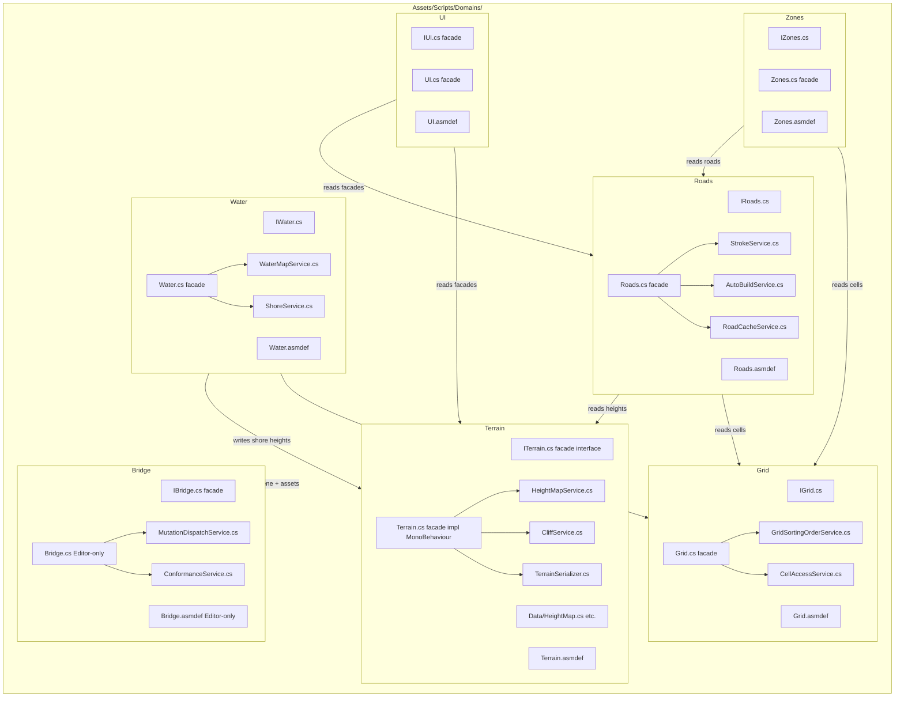

# Post-atomization architecture

> **Status: LOCKED for Stage 2+ moves.** Cross-ref: `docs/explorations/large-file-atomization-refactor.md §Architecture`.

## §Mermaid diagram

## §Domain catalog table

| Domain | Facade interface | Key services | Asmdef name | Cross-domain refs |
|--------|-----------------|--------------|-------------|-------------------|
| Terrain | `ITerrain.cs` | `HeightMapService`, `CliffService`, `TerrainSerializer` | `Terrain.asmdef` | none (root domain) |
| Roads | `IRoads.cs` | `StrokeService`, `AutoBuildService`, `RoadCacheService` | `Roads.asmdef` | Grid (cells), Terrain (heights) |
| Grid | `IGrid.cs` | `GridSortingOrderService`, `CellAccessService` | `Grid.asmdef` | none (root domain, holds cellArray trust boundary per inv #5) |
| Water | `IWater.cs` | `WaterMapService`, `ShoreService` | `Water.asmdef` | Grid (cells), Terrain (shore-height writes) |
| Zones | `IZones.cs` | _(extracted in Stage 3+)_ | `Zones.asmdef` | Grid (cells), Roads (road-type check) |
| UI | `IUI.cs` | _(extracted in Stage 4+)_ | `UI.asmdef` | Terrain, Roads (via facades) |
| Bridge | `IBridge.cs` | `MutationDispatchService`, `ConformanceService` | `Bridge.asmdef` (Editor-only) | All domains (mutation dispatch) |
| Economy | `IEconomy.cs` | _(Stage 5+)_ | `Economy.asmdef` | Grid, Zones |
| Geography | `IGeography.cs` | _(Stage 6+)_ | `Geography.asmdef` | Grid, Terrain, Water |

## §Cross-domain refs

| Consumer | Provider | Via | Note |
|----------|----------|-----|------|
| Roads | Grid | `IGrid.GetCell(x,y)` | Read-only cell access |
| Roads | Terrain | `ITerrain.GetHeightMap()` | Height reads for road sorting |
| Water | Grid | `IGrid.GetCell(x,y)` | Read-only cell access |
| Water | Terrain | `ITerrain.WriteShoreHeight(x,y,h)` | Shore-height writes |
| Zones | Grid | `IGrid.GetCell(x,y)` | Zoning cell read |
| Zones | Roads | `IRoads.GetRoadType(x,y)` | Road-type adjacency check |
| UI | Terrain | `ITerrain.*` | Render-height reads |
| UI | Roads | `IRoads.*` | Road-state reads |
| Bridge | All | Domain facade interfaces | Mutation dispatch per kind |

All cross-domain refs flow through facade interfaces only. No direct Service-to-Service across domain boundaries.

## §Top-level non-domain (unchanged)

| Folder | Role |
|--------|------|
| `Audio/` | Audio blip system — standalone, no domain dependency |
| `Catalog/` | Asset catalog — reads domain facades at load only |
| `Simulation/` | Demand / desirability simulation — depends on Grid + Zones facades |
| `Utilities/` | Shared utility classes — no domain dependency |
| `Testing/` | Test helpers — may reference any domain facade |

## §Editor sub-asmdef rule

Each domain may carry an `Editor/` child folder with a sub-asmdef:
- Name: `{X}.Editor.asmdef`
- References: `{X}.asmdef` + Unity Editor assemblies
- `includePlatforms: ["Editor"]`
- Only Editor-only tooling and bridge helpers go here — never runtime code.

## §Service Registry

`Assets/Scripts/Domains/_Registry/ServiceRegistry.cs` — scene-hosted MonoBehaviour implementing `IServiceRegistry`. Present in every scene.

### Wiring rule

- Producers (domain facades) call `Register<IFacade>(this)` in their own `Awake()`.
- Consumers call `Resolve<IFacade>()` in `Start()` or in method bodies — **NEVER in Awake** (init-order race).

### Scene-host rule

Every scene that hosts domain facades MUST have a `ServiceRegistry` GameObject at the root of its hierarchy. CityScene, MainMenu: ServiceRegistry GO added Stage 0 (TECH-29997).

### Init-order rule

Registry itself has no Awake ordering dependency. Because it is a plain `Dictionary<Type,object>`, resolve order depends only on which Awake runs first. Producers register in Awake; consumers resolve in Start — Unity's two-phase init guarantees all Awake calls finish before any Start call.

### asmdef boundary

`Domains.Registry` asmdef has no references to concrete Domain asmdefs. Domain asmdefs reference `Domains.Registry` only if they call `Register`/`Resolve` directly. Consumers in `TerritoryDeveloper.Game.asmdef` resolve via `FindObjectOfType<ServiceRegistry>()` cached in their own Awake.

---

## §Non-Unity tracks (separate conventions)

- `tools/mcp-ia-server/src/ia-db/mutations/` — TS module split, one file per mutation kind cluster.
- `tools/mcp-ia-server/src/tools/unity-bridge-command/` — TS module split.
- `tools/sprite-gen/src/compose/` — Python module split.

These tracks follow their own file-size conventions; the `Domains/` atomization shape does not apply.
