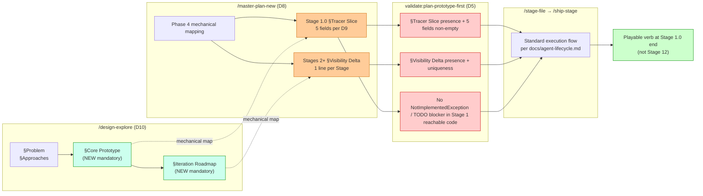

# Prototype-first methodology — design exploration

> **Status:** Polling COMPLETE 2026-05-03 — Round 1 (D1–D7) + Round 2 (D8–D12) all locked. Ready for `/design-explore docs/prototype-first-methodology-design.md` to formalize (compare → expand → architecture → impact → impl points → review → persist) → seeds `/master-plan-new` for the methodology rollout master plan + `/master-plan-extend multi-scale` for the Region retrofit.
> **Created:** 2026-05-03
> **Owner:** jiramos87 (vision) + Claude (synthesis + polling).
> **Companion docs:**
> - [`docs/MASTER-PLAN-STRUCTURE.md`](MASTER-PLAN-STRUCTURE.md) — canonical 2-level shape; methodology must reflect here.
> - [`ia/skills/master-plan-new/SKILL.md`](../ia/skills/master-plan-new/SKILL.md) — Phase 4 carries plumbing-first Stage-ordering heuristic.
> - [`ia/skills/design-explore/SKILL.md`](../ia/skills/design-explore/SKILL.md) — Implementation Points generation step.
> - [`docs/master-plan-execution-friction-log.md`](master-plan-execution-friction-log.md) — friction-capture iteration framework (sibling, not blocker).
> - [`ia/projects/multi-scale-master-plan.md`](../ia/projects/multi-scale-master-plan.md) — primary retrofit candidate (Stages 10–15).

---

## §1 Driving intent

Operator wants every future master plan deliver a **playable thinnest slice in Stage 1 or 2**, then iterate up to MVP across subsequent stages. Plumbing-only stages stop existing as standalone units — plumbing arrives **inside** a vertical slice that the player/agent can run end-to-end.

**Why now:**

- Multi-scale Region rollout (Stages 10–15) currently delivers no playable Region scene until Stage 12+ (managers + 7 sim channels + 4 UI panels land first).
- Asset-pipeline rollout shipped catalog spine before any visible asset reached the game; same anti-pattern.
- Risk: 3+ stages of build-up with zero player-visible output → late discovery of design flaws, slow feedback loop, demoralizing visual progress.

**Out of scope:**

- Friction-log mechanism (already exists, sibling iteration loop).
- Per-stage closeout scoring / measurement harness (explicitly dismissed in foldering refactor).

---

## §2 Audit — current methodology is plumbing-first by design

### 2.1 Confirmation in `master-plan-new` skill

**Phase 4 — "Stage carving" — encodes literal plumbing-first heuristic** (`ia/skills/master-plan-new/SKILL.md` Phase 4):

> Stage-ordering heuristic (earliest first):
> 1. Scaffolding / infrastructure
> 2. Data model
> 3. Runtime logic
> 4. Integration + tests

Authoring agent given no incentive to lead with vertical slice. Default is horizontal layer build-up.

### 2.2 Confirmation in multi-scale Stages 10–15

| Stage | Scope | Player-visible output |
|---|---|---|
| **10** | `RegionGridManager` + helper services + tile prefab spine | None — managers + scriptable objects, not a scene |
| **11** | `RegionSimManager` 7 flow channels + `RegionTreasury` 4 channels + 4 UI panels | None until all 7 channels + 4 panels land — all-or-nothing |
| **12** | `ScaleController` + `CityEvolveService` + scale switch wiring | First playable Region scene emerges *here*, only if 10+11 fully done |
| **13–15** | Economy / migration / found-new-city polish | Iterate on already-playable Region |

→ **Stage 12 = first playable.** Stages 10+11 = pure foundation.

### 2.3 Confirmation in pending plans inventory

Pending plans (`master_plan_health` MCP output, 2026-05-03):

- **Plumbing-first heavy:** sprite-gen (25 stages), web-platform (38), utilities (13), grid-asset-visual-registry (13), session-token-latency (12)
- **Mixed:** ui-polish (14), zone-s-economy (9), landmarks (12)
- **Naturally vertical:** music-player (8), citystats-overhaul (10) — feature-shaped, less impacted

**Conclusion:** Audit hypothesis confirmed. Plumbing-first is repo-wide default, not a multi-scale anomaly.

---

## §3 Approaches surveyed

### 3.1 Walking skeleton (Cockburn)

**Definition:** End-to-end thin trace through every architectural layer at Stage 1, with stub/placeholder implementations everywhere. Subsequent stages fatten each layer.

**Stage 1 example for Region:** Empty grid + 1 placeholder tile + zoom-level switch + dummy `evolve()` returning unchanged snapshot + 1 dummy UI panel showing "0 cities."

**Pros:**
- Forces architectural integration risk early.
- Every layer touched at least once → no late-discovery integration bugs.

**Cons:**
- "Skeleton" can still look unplayable — no real game verb.
- Stub-heavy = lots of throwaway scaffolding.

### 3.2 Vertical slice (XP / agile)

**Definition:** Stage 1 = one complete user-facing feature, narrow but real. Stage 2 adds a second feature. Slices share infrastructure, so later slices are cheaper.

**Stage 1 example for Region:** Player can switch to Region scale, see 1 city tile, click it, see 1 stat ("population: 1000"). One real verb, one real readout. No flows, no treasury, no migration.

**Pros:**
- Player has a real verb from Stage 1.
- Demos well, retains team morale.

**Cons:**
- Risk of "happy path only" slice that misses architectural concerns.
- Requires aggressive de-scoping discipline.

### 3.3 Tracer bullet (Pragmatic Programmer)

**Definition:** End-to-end working code that *does the wrong thing fast*, hitting all real systems (no stubs). Subsequent stages correct behavior + fill gaps.

**Stage 1 example for Region:** Real `RegionSimManager` running but with 1 trivial flow channel (e.g. "population = constant 1000"), real UI panel showing it, real save/load. Other 6 channels not implemented.

**Pros:**
- Real code throughout — no stubs to throw away.
- Architectural decisions surface immediately.

**Cons:**
- Higher Stage 1 cost than vertical slice.
- Tempting to over-build Stage 1.

### 3.4 Prototype-pillar (game-dev variant)

**Definition:** Stage 1 = "find the fun" — minimum interactive scene that lets designer/player feel the core verb. Production-quality concerns (save, network, multi-platform) deferred to later stages.

**Stage 1 example for Region:** Hardcoded scene (no save), 5 visible cities, 1 working trade route the player can draw, treasury counter ticks. Throwaway code OK.

**Pros:**
- Maximum design feedback per token.
- Matches game-prototyping wisdom.

**Cons:**
- Throwaway risk if Stage 1 code rewritten in Stage 2.
- Hard to define "fun threshold" upfront.

### 3.5 Hybrid — "tracer slice" (proposed)

**Definition:** Combine vertical slice (one real player verb) + tracer bullet (end-to-end real code, no stubs) + prototype-pillar discipline (hardcoded data OK, save/load deferred). Stage 1 = thinnest end-to-end slice that gives the player one real verb with real code.

**Stage 1 example for Region:**
- Real `RegionGridManager` instantiating a hardcoded 5×5 grid.
- Real `ScaleController` with wheel-zoom switch (city ↔ region).
- One real UI panel showing one real metric (population total).
- One real player verb: click city → see city name + population.
- No save/load, no treasury, no migration, no inter-city flows.
- All 7 sim channels stubbed to zero.

**Pros:**
- Real architectural integration (tracer).
- Real player verb (slice).
- Aggressive de-scoping (pillar).
- No throwaway skeleton.

**Cons:**
- Higher Stage 1 spec authoring cost.
- Requires explicit "what's stubbed vs real" callout in §Plan Digest.

---

## §4 Binding methodology  `LOCKED 2026-05-03`

**§3.5 hybrid "tracer slice" adopted whole-system.**

**Rationale:**

- Tracer = no integration debt accumulates across stages.
- Slice = player verb from day 1 (matches operator's "rapidly delivered playable scene" intent).
- Pillar discipline = explicit deferrals prevent Stage 1 sprawl.
- Composable with current 2-level Stage > Task hierarchy (no structural change).
- Retrofit-friendly — existing plumbing-first stages can be re-ordered, not rewritten.

**Mandate (proposed):**

> **Stage 1.0 of every master plan = tracer slice.** End-to-end real code, one real player/agent verb, hardcoded data OK, peripheral systems explicitly stubbed. No master plan ships with Stage 1 = pure scaffolding.

---

## §5 Open decisions (round 1 — foundational)

> Each decision below = polling slot. Status: `OPEN` until user-confirmed; `LOCKED` after.

### D1 — Methodology choice  `LOCKED 2026-05-03`

**Decision:** (a) Hybrid tracer slice. End-to-end real code + one real player/agent verb + hardcoded data OK + peripheral systems explicitly stubbed. No master plan ships with Stage 1 = pure scaffolding.

**Implication:** §4 recommendation becomes binding methodology. §8 system changes proceed to D8–D12 polling for exact rewrite shape.

### D2 — "Thinness" threshold  `LOCKED 2026-05-03`

**Decision:** (c) Per-plan calibration. Author judges Stage 1.0 thinness per plan scope. Validator only enforces "Stage 1.0 runs end-to-end in batch mode without crash." No hard verb/readout count.

**Implication:** §Tracer Slice block in spec template (D9) requires author-declared "what the player/agent can do at end of Stage 1.0" — free-form, not enum. Validator parses presence + non-empty, not contents.

### D3 — Scope of mandate  `LOCKED 2026-05-03`

**Decision:** (b) Greenfield + retrofit pending. New master plans use methodology by default. In-flight pending plans (17 from `master_plan_health` 2026-05-03) get retrofitted on next stage-file pass. Partially-shipped plans (multi-scale 2/15, city-sim-depth 12/16, game-ui-design-system 12/19) untouched — locked-in shape preserved.

**Implication:** Retrofit rollout pass needed (D6 lock — trigger timing). multi-scale Stages 10–15 = primary retrofit candidate per §7. Non-game plans (web-platform, utilities, mcp-lifecycle-tools, skill-training) included — "playable" redefined as "agent-runnable end-to-end command" per §9.3 mitigation.

### D4 — Stubs definition  `LOCKED 2026-05-03`

**Decision:** (a) Hardcoded data OK; stub methods returning constants OK; TODO-throwing methods + "not yet built" dead-ends banned. Stage 1 must be end-to-end traversable without the player/agent hitting an unbuilt path.

**Implication:** Spec template §Tracer Slice block must enumerate (i) what data is hardcoded, (ii) what methods return constants, (iii) what UI/verbs are intentionally absent (vs present-but-stubbed). Validator scans for `throw new NotImplementedException` / `// TODO` blockers in Stage 1 code paths reachable from the declared verb.

### D5 — Validator enforcement  `LOCKED 2026-05-03`

**Decision:** (a) Hard validator. New `validate:plan-prototype-first` runs in CI + blocks `/master-plan-new` exit when Stage 1 missing tracer-slice tag + verb declaration. Same gate applies to `/master-plan-extend` when appended Stage 1 (post-retrofit) lacks declaration.

**Implication:** Validator scope (D8/D9 dependent):
- Parses Stage 1 spec for §Tracer Slice block.
- Asserts non-empty `verb` field + non-empty `hardcoded_scope` field + non-empty `stubbed_systems` field.
- Asserts no `throw new NotImplementedException` / `// TODO blocker` in Stage 1 code paths reachable from verb (D4 enforcement).
- CI red blocks merge; `master_plan_health` MCP exposes pass/fail per plan.

### D6 — Retrofit trigger  `LOCKED 2026-05-03`

**Decision:** (c) Operator pull. No automatic retrofit pass. Operator explicitly requests retrofit per plan. **First retrofit candidate locked: multi-scale Stages 10–15** (per §7 illustrative sketch). Proves methodology on Region scope before committing to broader rollout.

**Implication:**
- Post-multi-scale-retrofit checkpoint: operator decides next move — (i) extend to second pull (e.g. sprite-gen, web-platform), (ii) flip to scheduled one-shot pass for remaining 16 plans, or (iii) stay operator-pull indefinitely.
- No `release-rollout-tracker.md` doc auto-generated for prototype-first retrofit until operator escalates from (c) → (b).
- Greenfield plans (post-2026-05-03 `/master-plan-new` calls) auto-comply via D8 skill rewrite — no operator pull needed there.

### D7 — Throwaway tolerance  `LOCKED 2026-05-03`

**Decision:** (c) Mixed. Stage 1 visible layer (scenes, hardcoded prefab placement, stub UI panels, hardcoded number tables) = throwaway-acceptable. Stage 1 structural layer (manager class shapes, method signatures, data structs, MCP tool surfaces, save schema fields) = forward-living — Stages 2+ fatten/extend, do not redesign.

**Implication:**
- Spec template §Tracer Slice block must split scope into `throwaway:` (visible layer) + `forward_living:` (structural layer) lists.
- Code-review (out-of-band) gains lightweight check: in Stage 2+ diffs, structural-layer rewrites flagged for explicit operator approval; visible-layer rewrites flow through silently.
- §8.4 template change updated — new §Tracer Slice subsections `throwaway:` + `forward_living:`.

---

## §6 Open decisions (round 2 — system changes)

> Polled after round 1 lock.

### D8 — `master-plan-new` Phase 4 rewrite  `LOCKED 2026-05-03`

**Decision:** (c) Tracer slice + visibility-ordered fattening. Stage 1 = mandatory tracer slice. Stages 2+ ordered by player/agent visibility — features that surface to the player/agent first, hidden plumbing last. No fixed N-phase rigidity beyond Stage 1.

**Binding rewrite of Phase 4 Stage-ordering heuristic:**

> **Stage-ordering heuristic (earliest first):**
> 1. **Stage 1.0 — Tracer slice (mandatory).** End-to-end real code, one real player/agent verb, hardcoded data OK, peripheral systems explicitly stubbed (per D4). Throwaway/forward-living split declared (per D7).
> 2. **Stages 2+ — Visibility-ordered fattening.** Each subsequent stage adds the next slice the player/agent will see/feel soonest. Replace stubs with real behavior, prioritized by player visibility. Hidden plumbing (perf, refactor, infra hardening) lands inside the visible slice that needs it, not as standalone plumbing-only stages.
> 3. **Late stages — Production hardening + polish.** Save/load completeness, multi-config support, edge cases, post-MVP extensions. Land only after every visible slice is real.

**Implication:** Authoring AI reads "next stage = next thing the player sees" as the ordering rule, not "next layer to build up." Plumbing-only stages forbidden post Stage 1.0 — every Stage must declare its player-visible delta or be merged into one that does.

### D9 — `MASTER-PLAN-STRUCTURE.md` change  `LOCKED 2026-05-03`

**Decision:** (b) Two new mandatory sections:

1. **Stage 1.0 — new mandatory §Tracer Slice subsection:**
   - `verb:` — what the player/agent can do at end of Stage 1.0 (free-form, non-empty per D2).
   - `hardcoded_scope:` — list of hardcoded data/scenes (per D4).
   - `stubbed_systems:` — list of stub methods returning constants (per D4).
   - `throwaway:` — visible-layer items acceptable for Stage 2+ rewrite (per D7).
   - `forward_living:` — structural-layer items locked forward (per D7).
2. **Stages 2+ — new mandatory §Visibility Delta line:**
   - One-line statement: "what does the player/agent see/feel that they didn't before this stage?"
   - Free-form prose, non-empty.

**Validator gates (extends D5 `validate:plan-prototype-first`):**
- Stage 1.0 missing §Tracer Slice OR any of its 5 sub-fields → CI red.
- Any Stage 2+ missing §Visibility Delta line OR empty content → CI red.
- §Visibility Delta lines must be unique across stages within a plan (no two stages claim same delta).

**Implication:** `MASTER-PLAN-STRUCTURE.md` schema bump. DB columns added to `ia_stages` row: `tracer_slice_block` (JSON, Stage 1.0 only) + `visibility_delta` (text, Stages 2+). MCP `stage_render` + `master_plan_render` show new fields inline. Existing 17 pending plans grandfathered until per-plan retrofit (D6).

### D10 — `design-explore` shape change  `LOCKED 2026-05-03`

**Decision:** (a) AND scope-broadened — prototype-first methodology adopted whole-system, **starting from `design-explore`**. The exploration doc itself reframes around a minimum-scoped functional core + proposed iteration steps. Goal: by the time `/master-plan-new` reads the exploration, the master plan author has straight-line, mechanical mapping from `core prototype + iterations` → `Stage 1.0 + Stages 2+`. No invention at master-plan time.

**Binding shape change to `design-explore` skill output:**

| Section | Status | Contents |
|---|---|---|
| §Problem / §Vision | unchanged | Existing exploration intent. |
| §Approaches surveyed | unchanged | Compare candidate methodologies/architectures. |
| **§Core Prototype (NEW, mandatory)** | new | The minimum-scope playable/runnable core. Maps 1:1 to Stage 1.0 §Tracer Slice block. Includes `verb`, `hardcoded_scope`, `stubbed_systems`, `throwaway`, `forward_living` per D9. |
| **§Iteration Roadmap (NEW, mandatory)** | new | Ordered list of incremental improvements on the core. Each iteration = one player-visible delta. Maps 1:1 to Stages 2+ §Visibility Delta lines per D9. No plumbing-only iterations allowed. |
| §Recommendation | unchanged | Lock the core + iteration shape. |
| §Open decisions | unchanged | Polling slots. |

**Implication:**
- `design-explore` skill Phase sequence rewrite — new "Core Prototype + Iteration Roadmap" phase between "Compare approaches" and "Architecture impact." Exploration doc cannot persist without these two sections non-empty.
- `/master-plan-new` reads exploration doc → §Core Prototype directly seeds Stage 1.0 §Tracer Slice fields → §Iteration Roadmap directly seeds Stages 2+ titles + §Visibility Delta lines. **Authoring becomes mechanical mapping, not invention.**
- Existing exploration docs (`docs/region-scale-design.md`, `docs/master-plan-foldering-refactor-design.md`, this doc itself) grandfathered — only new explorations from 2026-05-03 forward enforce.
- This decision elevates `design-explore` from "design discussion" to "prototype + iteration declaration."

### D11 — New skill `prototype-stage`?  `LOCKED 2026-05-03`

**Decision:** (c) `design-explore` extension. No new skill. §Core Prototype block from `design-explore` (per D10) becomes the single source of truth for Stage 1.0. `master-plan-new` mechanically copies §Core Prototype → Stage 1.0 §Tracer Slice fields + mechanically maps §Iteration Roadmap → Stages 2+ §Visibility Delta lines. No tracer-slice-specific skill needed.

**Implication:**
- Skill surface count unchanged (no `prototype-stage` skill registered).
- `master-plan-new` Phase 4 (D8) becomes thinner — less authoring, more mapping.
- Reuses existing `master-plan-new` validators + flow; only new validation is the §Tracer Slice + §Visibility Delta presence check (D5/D9).
- Future-proof: if mechanical mapping proves insufficient, can promote to (b) later without breaking the methodology.

### D12 — Friction-log integration  `LOCKED 2026-05-03`

**Decision:** (a) Existing `docs/master-plan-execution-friction-log.md` extended with new "Prototype-first deltas" section. Captures: (i) Stage 1.0 thinness misjudgments (too thin / too fat), (ii) §Iteration Roadmap items that proved unimplementable as declared, (iii) retrofit cost vs benefit per pulled plan, (iv) `validate:plan-prototype-first` false positives/negatives, (v) author friction with new §Tracer Slice + §Visibility Delta requirements.

**Implication:**
- Friction log doc gets one new H2 section appended (no doc split).
- `/skill-train` retrospect cycle picks up methodology drift signals from this section.
- No new validator for friction-log presence — operator pulls retrospective.

---

## §7 Retrofit path — multi-scale Stages 10–15 (illustrative, not binding)

> Concrete retrofit sketch for the primary candidate plan. Final shape locked after D1–D12 + master-plan-extend dispatch.

### 7.1 Current shape (plumbing-first, confirmed)

| Stage | Current scope | Player output |
|---|---|---|
| 10 | `RegionGridManager` + helpers + tile prefabs | None |
| 11 | `RegionSimManager` 7 channels + `RegionTreasury` 4 channels + 4 UI panels | None until all done |
| 12 | `ScaleController` + `CityEvolveService` + zoom switch | First playable scene |
| 13–15 | Economy / migration / found-new-city polish | Iterate |

### 7.2 Proposed shape (tracer slice first)

| Stage | Proposed scope | Player output |
|---|---|---|
| **10 — Region tracer slice** | `RegionGridManager` (5×5 hardcoded), `ScaleController` (wheel zoom), 1 tile prefab, 1 UI panel showing "population total = 0", `evolve()` no-op. **Real code, real switch, real scene.** No flows, no treasury, no save/load. | **First playable Region scene.** Player can zoom in/out, click a tile, see one stat. |
| **11 — Population channel + 1 panel** | Replace `evolve()` no-op with population growth flow. UI panel shows real ticking population. Save/load population state. | Population evolves over time. Save/restore works for population only. |
| **12 — Trade flow + treasury** | Add inter-city trade channel (1 of 7) + `RegionTreasury` 1-channel slice (gold). 1 new UI panel. | Player builds 1 highway between 2 cities, sees gold tick from trade. |
| **13 — Migration channel** | Migration flow (2 of 7) + 1 UI panel + UX for population redistribution. | Cities grow/shrink based on migration. |
| **14 — Remaining flows + treasury** | Channels 3–7 + remaining 3 treasury channels + remaining UI panels. | Full sim depth. |
| **15 — Found-new-city + economy polish** | Found-city action + economy refinement + post-MVP gates. | Region MVP complete. |

**Net effect:** First playable Region scene moves from end of Stage 12 to end of Stage 10 (3-stage acceleration).

### 7.3 Retrofit cost estimate

- **Stage 10 rewrite:** Reframe scope from "managers + helpers" to "tracer slice." Existing managers reused, helpers deferred. Spec rewrite ~1 stage-decompose pass.
- **Stage 11 rewrite:** Split current "all 7 channels + 4 panels" into 5 incremental stages (11–14). Each new stage = 1–2 channels + 1 panel.
- **Stage 12+ shift:** Current Stage 12 scope distributes into new Stages 12–14.

**Tooling:** `master-plan-extend` skill dispatched on retrofit doc. No new MCP tools needed (current `stage_insert` + `stage_decompose_apply` sufficient).

---

## §8 System changes — required edits

### 8.1 Skills

| Skill | Change | Trigger |
|---|---|---|
| `master-plan-new` | Phase 4 Stage-ordering heuristic rewrite (D8). New §Tracer Slice prompt block. | D1 + D8 lock |
| `design-explore` | Implementation Points lead with tracer slice (D10). New persisted §Tracer Slice section. | D10 lock |
| `master-plan-extend` | Recognize tracer-slice tag on appended stages; warn if appended stage = pure plumbing. | D1 lock |
| `stage-decompose` | Task-table generator biased toward verb-first ordering when stage tagged tracer. | D1 lock |
| `prototype-stage` (new, optional) | Dedicated single-skill if D11 = (b). | D11 lock |

### 8.2 Rules

| Rule | Change |
|---|---|
| `agent-principles.md` | Add "Prototype-first" section under "Spec authoring + validators" — link to methodology doc. |
| `MASTER-PLAN-STRUCTURE.md` | Mandatory Stage 1.0 = tracer slice subsection (D9). New schema field on Stage block. |
| New `ia/rules/prototype-first-methodology.md` | Canonical rule doc — extracted from this exploration after polling locks. Force-loaded. |

### 8.3 Validators

| Validator | Change |
|---|---|
| `validate:plan-prototype-first` (new) | Block plans missing Stage 1.0 tracer-slice declaration (D5). |
| `validate:master-plan-status` | Warn on plans with Stage 1 progress > 0 but no tracer-slice tag. |
| `master_plan_health` MCP | New field `stage_1_is_tracer: bool` in output. |

### 8.4 Templates

| Template | Change |
|---|---|
| `ia/templates/project-spec-template.md` | New mandatory §Tracer Slice block under §Goal. |
| Master-plan stage template (DB shape) | New `tracer_slice_scope` text field on `ia_stages` row when `stage_id = 1.0`. |

### 8.5 Tooling (MCP)

| Tool | Change |
|---|---|
| `master_plan_insert` | Accept optional `tracer_slice` param at insert time; persist to `ia_master_plans` row. |
| `stage_insert` | Accept `is_tracer_slice` flag; default false except Stage 1.0. |
| `master_plan_render` | Render `[TRACER]` tag next to Stage 1.0 row when flag set. |

---

## §9 Risks + open concerns

### 9.1 Tracer slice still unplayable

**Risk:** Stage 1.0 ships but feels like a tech demo, not a game. Player verb too thin.

**Mitigation:** D2 thinness threshold; verify-loop must include "manual play 30s and confirm verb" gate.

### 9.2 Throwaway in Stage 1 = sunk cost

**Risk:** Stage 1 code rewritten in Stage 2 = wasted authoring tokens.

**Mitigation:** D7 throwaway tolerance lock. If (a) — accept loss; if (b) — discipline; if (c) — mixed.

### 9.3 Non-game plans don't fit

**Risk:** web-platform / utilities / mcp-lifecycle-tools have no "player verb." Tracer slice meaningless.

**Mitigation:** D3 scope. If (d) — exempt non-game; if (a)/(b)/(c) — redefine "verb" as "agent-runnable end-to-end command" (e.g. for web-platform Stage 1 = one route renders + one DB query + one nav link works).

### 9.4 Retrofit cost > value

**Risk:** Retrofitting 17 pending plans = massive rework.

**Mitigation:** D6 retrofit trigger. If (a) — opportunistic, low cost; if (b) — scheduled pass, high value; if (c) — operator pull only.

### 9.5 Methodology doesn't survive contact with reality

**Risk:** Tracer slice prescription ignored under deadline pressure.

**Mitigation:** D5 hard validator + D12 friction log to track methodology adherence.

---

## §10 Polling protocol  `COMPLETE 2026-05-03`

Round 1 (D1–D7) + Round 2 (D8–D12) all locked.

**Decision summary:**

| Id | Topic | Lock |
|---|---|---|
| D1 | Methodology | (a) hybrid tracer slice |
| D2 | Thinness threshold | (c) per-plan calibration |
| D3 | Scope of mandate | (b) greenfield + retrofit pending (multi-scale first) |
| D4 | Stubs definition | (a) hardcoded + constants OK; no dead-ends |
| D5 | Validator enforcement | (a) hard block via `validate:plan-prototype-first` |
| D6 | Retrofit trigger | (c) operator pull, multi-scale first |
| D7 | Throwaway tolerance | (c) visible throwaway OK; structural forward-living |
| D8 | `master-plan-new` rewrite | (c) tracer slice + visibility-ordered fattening |
| D9 | Structure doc change | (b) §Tracer Slice + §Visibility Delta both mandatory |
| D10 | `design-explore` change | (a) + scope-broadened — §Core Prototype + §Iteration Roadmap mandatory |
| D11 | New skill? | (c) no — `design-explore` extension is the home |
| D12 | Friction-log integration | (a) extend existing `master-plan-execution-friction-log.md` |

---

## §12 Handoff — straight-line next actions

### 12.1 Immediate next operator action

Run `/design-explore docs/prototype-first-methodology-design.md` to formalize this doc through the canonical pipeline (compare → expand → architecture → impact → impl points → review → persist). Doc already prototype-first-shaped — §Core Prototype + §Iteration Roadmap will be derived from §4 (binding methodology) + §7 (multi-scale retrofit sketch) + §8 (system changes).

### 12.2 Downstream skill chain

| Step | Command | Output |
|---|---|---|
| 1 | `/design-explore docs/prototype-first-methodology-design.md` | Persisted §Design Expansion + §Core Prototype + §Iteration Roadmap inside this doc |
| 2 | `/master-plan-new docs/prototype-first-methodology-design.md` | New master plan `prototype-first-methodology` — orchestrates skill/rule/validator/template rollout per §8. Stage 1.0 = tracer slice (e.g. "validator scaffold + one greenfield plan authored end-to-end with §Tracer Slice block landing in DB"). |
| 3 | `/master-plan-extend multi-scale docs/prototype-first-methodology-design.md` | Region retrofit per §7 — Stages 10–15 reshaped to tracer-slice + visibility-ordered fattening |
| 4 | Per-stage execution | `/stage-decompose` → `/stage-file` → `/stage-authoring` → `/ship-stage` standard flow |

### 12.3 First retrofit deliverable (Region tracer slice)

Per §7.2 Stage 10 reshape:

- **Verb:** Player switches to Region scale via mouse-wheel zoom, sees a 5×5 grid with 1 city tile, clicks city, sees "population: 1000".
- **Hardcoded scope:** 5×5 grid layout, 1 tile prefab, 1 city placement, 1 hardcoded population value.
- **Stubbed systems:** All 7 sim flow channels return zero. `RegionTreasury` returns hardcoded 50 gold. `evolve()` no-op.
- **Throwaway:** Hardcoded scene + placement + UI panel layout.
- **Forward-living:** `RegionGridManager` API shape, `ScaleController` API shape, `RegionSimManager` interface, `evolve()` signature, save schema fields (even if not yet wired).

### 12.4 System-change rollout order (proposed Stage sequencing for the methodology master plan)

| Stage | Scope | Player/agent visible delta |
|---|---|---|
| **1.0 — Tracer slice** | New `validate:plan-prototype-first` validator (parsing-only stub) + new spec template §Tracer Slice / §Visibility Delta sections + one greenfield plan authored end-to-end against new shape. | Operator can run `/master-plan-new` on a new design doc and watch §Tracer Slice block land in DB + validator pass. |
| **2 — `design-explore` reshape** | Add §Core Prototype + §Iteration Roadmap to skill output. Update SKILL.md frontmatter + agent-body. | Operator runs `/design-explore` on a new doc and gets prototype-first-shaped output. |
| **3 — `master-plan-new` mechanical mapping** | Phase 4 prompt rewrite per D8. Skill reads §Core Prototype → Stage 1.0 directly; §Iteration Roadmap → Stages 2+ directly. | Master-plan author no longer invents Stage 1; mechanically maps from exploration. |
| **4 — Validator hardening** | Promote `validate:plan-prototype-first` from parsing-only to full enforcement (verb non-empty, throwaway/forward-living split present, no dead-ends in Stage 1 reachable code). DB schema: `tracer_slice_block` + `visibility_delta` columns on `ia_stages`. | CI red blocks plans missing tracer-slice declaration. |
| **5 — Region retrofit pull** | Operator runs `/master-plan-extend multi-scale` per §7.2. First proven retrofit. | Region playable scene appears at end of Stage 10 instead of Stage 12. |
| **6 — Friction-log section + glossary update** | Append "Prototype-first deltas" H2 to `master-plan-execution-friction-log.md`. Add §11 glossary terms via `generate:ia-indexes`. | Methodology iteration loop closed. |

### 12.5 Files that change (final list)

| File | Change kind |
|---|---|
| `ia/skills/master-plan-new/SKILL.md` | Phase 4 rewrite (D8) |
| `ia/skills/design-explore/SKILL.md` | Phase sequence + output sections (D10) |
| `docs/MASTER-PLAN-STRUCTURE.md` | §Tracer Slice (Stage 1.0) + §Visibility Delta (Stages 2+) (D9) |
| `ia/templates/project-spec-template.md` | New §Tracer Slice block (D9) |
| `ia/specs/glossary.md` | §11 new terms |
| `ia/rules/prototype-first-methodology.md` | New canonical rule doc (extracted from this exploration) |
| `ia/rules/agent-principles.md` | Link to methodology rule |
| `tools/scripts/validators/plan-prototype-first.ts` | New validator (D5) |
| `package.json` | New `validate:plan-prototype-first` script |
| `tools/mcp-ia-server/src/index.ts` | New params on `master_plan_insert` / `stage_insert` / `master_plan_render` (§8.5) |
| DB migration | New columns `tracer_slice_block` + `visibility_delta` on `ia_stages` |
| `docs/master-plan-execution-friction-log.md` | New "Prototype-first deltas" section (D12) |
| `.claude/agents/*.md` + `.claude/commands/*.md` | Regenerated via `npm run skill:sync:all` after SKILL.md edits |

---

## §11 Glossary deltas

New terms (apply via `generate:ia-indexes` once `ia/rules/prototype-first-methodology.md` lands):

| Term | Definition |
|---|---|
| **Tracer slice** | End-to-end thinnest stage delivering one real player/agent verb with real code; hardcoded data + stub peripheral systems acceptable. |
| **Slice fattening** | Subsequent stages replacing stubs with real behavior, ordered by player visibility. |
| **Prototype-pillar discipline** | Explicit upfront declaration of what's deferred from Stage 1.0 (save/load, multi-config, edge cases) to prevent scope sprawl. |

Add via `generate:ia-indexes` after rule doc lands.

---

## Design Expansion

> Generated by `/design-explore docs/prototype-first-methodology-design.md` on 2026-05-03 (model: claude-opus-4-7). Methodology applied to itself — this section is the tracer slice. §1–§12 above remain locked; this block extends them.

### Core Prototype

**Verb (smallest playable thing).** Operator runs `/design-explore docs/prototype-first-methodology-design.md` and sees the doc updated with a new `## Design Expansion` block containing `### Core Prototype` + `### Iteration Roadmap` subsections. That's the tracer slice — the methodology applied to itself, end-to-end.

**§Tracer Slice block (5 fields per D9):**

- **verb:** Operator runs `/design-explore` on this doc → sees `## Design Expansion` block appended with `### Core Prototype` + `### Iteration Roadmap` + `### Architecture Decision` + 6 supporting subsections. Real `/design-explore` skill, real MCP write (DEC-A22 via `arch_decision_write`), real persist mutation (this Edit call).
- **hardcoded_scope:** §Iteration Roadmap copied verbatim from §12.4 6-stage rollout (per Q2 lock — no re-derivation). Mermaid diagram entry/exit hardcoded to current 4-skill chain (`/design-explore` → `/master-plan-new` → `/stage-file` → `/ship-stage`).
- **stubbed_systems:** `validate:plan-prototype-first` validator not yet implemented (lands in methodology master plan Stage 1.0 as parsing-only stub, Stage 4 as full enforcement). DB columns `tracer_slice_block` + `visibility_delta` on `ia_stages` not yet migrated. `prototype-first-methodology.md` rule doc not yet extracted.
- **throwaway:** §Core Prototype prose phrasing in this block (will be regenerated by future `/design-explore` runs once Phase 9 persist shape stabilizes); Mermaid diagram (current 4-skill chain may grow).
- **forward_living:** `### Architecture Decision` block schema (DEC slug + drift summary line); `### Subsystem Impact` 5-column table shape (Subsystem | Dependency | Invariant risk | Breaking vs additive | Mitigation); §Tracer Slice 5-field contract from D9 (verb / hardcoded_scope / stubbed_systems / throwaway / forward_living); `### Iteration Roadmap` table shape (Stage | Scope | Visibility delta).

### Iteration Roadmap

> Verbatim mirror of §12.4 per locked Q2. No re-derivation.

| Stage | Scope | Player/agent visible delta |
|---|---|---|
| **1.0 — Tracer slice** | New `validate:plan-prototype-first` validator (parsing-only stub) + new spec template §Tracer Slice / §Visibility Delta sections + one greenfield plan authored end-to-end against new shape. | Operator can run `/master-plan-new` on a new design doc and watch §Tracer Slice block land in DB + validator pass. |
| **2 — `design-explore` reshape** | Add §Core Prototype + §Iteration Roadmap to skill output. Update SKILL.md frontmatter + agent-body. | Operator runs `/design-explore` on a new doc and gets prototype-first-shaped output. |
| **3 — `master-plan-new` mechanical mapping** | Phase 4 prompt rewrite per D8. Skill reads §Core Prototype → Stage 1.0 directly; §Iteration Roadmap → Stages 2+ directly. | Master-plan author no longer invents Stage 1; mechanically maps from exploration. |
| **4 — Validator hardening** | Promote `validate:plan-prototype-first` from parsing-only to full enforcement (verb non-empty, throwaway/forward-living split present, no dead-ends in Stage 1 reachable code). DB schema: `tracer_slice_block` + `visibility_delta` columns on `ia_stages`. | CI red blocks plans missing tracer-slice declaration. |
| **5 — Region retrofit pull** | Operator runs `/master-plan-extend multi-scale` per §7.2. First proven retrofit. | Region playable scene appears at end of Stage 10 instead of Stage 12. |
| **6 — Friction-log section + glossary update** | Append "Prototype-first deltas" H2 to `master-plan-execution-friction-log.md`. Add §11 glossary terms via `generate:ia-indexes`. | Methodology iteration loop closed. |

### Architecture Decision

**DEC-A22 — `prototype-first-methodology` `LOCKED 2026-05-03` (status: active)**

- **Slug:** `DEC-A22` (next after DEC-A21 game-ui-full-fidelity-path-c).
- **Surface:** `decisions/all` (meta-surface — methodology decision spans all skill / template / validator / DB surfaces, none of which have dedicated `arch_surfaces` rows yet).
- **Rationale:** Stage 1.0 of every master plan = tracer slice (end-to-end real code, one real verb, hardcoded peripherals OK). Plumbing-only Stage 1 banned. Mechanical mapping `design-explore §Core Prototype + §Iteration Roadmap` → `master-plan Stage 1.0 + Stages 2+`.
- **Alternatives considered:** A scaffold-first (rejected — current default, audit confirmed plumbing-first anti-pattern); B vertical-slice; C tracer-bullet; D walking-skeleton; E hybrid (selected per §4 lock).
- **Changelog:** `arch_changelog` row id 28618, kind `design_explore_decision`, ts 2026-05-03 16:35:09 UTC.
- **Drift scan summary:** Run against 20 open master plans. Only `architecture-coherence-system` Stage 1.2 links surface `decisions/all` and is `done` in a closed plan. **Zero open-plan drift triggered by DEC-A22.** Greenfield plans post-2026-05-03 enforce via D8 skill rewrite; pending plans grandfathered until D6 operator-pull retrofit.

### Components + Data Flow

**Components (one-line each):**

- **`design-explore` skill — §Core Prototype + §Iteration Roadmap authors.** Phase 9 persist writes both subsections inside `## Design Expansion` block (D10 lock).
- **`master-plan-new` skill — Phase 4 mechanical mapper.** Reads exploration §Core Prototype → Stage 1.0 §Tracer Slice; reads §Iteration Roadmap → Stages 2+ §Visibility Delta lines (D8 + D11 lock).
- **`MASTER-PLAN-STRUCTURE.md` schema additions — §Tracer Slice (Stage 1.0 mandatory) + §Visibility Delta (Stages 2+ mandatory).** D9 lock.
- **`validate:plan-prototype-first` validator — CI gate.** Parses Stage 1.0 for §Tracer Slice 5 fields + Stages 2+ for §Visibility Delta non-empty + uniqueness across stages (D5 + D9 lock).
- **DB schema — `ia_stages` columns `tracer_slice_block` (JSON) + `visibility_delta` (text).** D9 lock; backed by new migration.
- **Retrofit pass — `/master-plan-extend` dispatcher on existing plans.** Operator-pull only (D6 lock); first candidate = multi-scale Stages 10–15 per §7.

**Data flow:**

```
design exploration doc
   │ (locked decisions D1–D12 confirm shape)
   ▼
/design-explore — appends §Design Expansion with §Core Prototype + §Iteration Roadmap
   │
   ▼
/master-plan-new — mechanically maps §Core Prototype → Stage 1.0 §Tracer Slice block
                   mechanically maps §Iteration Roadmap → Stages 2+ §Visibility Delta lines
   │
   ▼
validate:plan-prototype-first — CI gate; blocks merge on missing/empty fields
   │
   ▼
/stage-file → /stage-authoring → /ship-stage — standard execution flow
   │
   ▼
operator sees playable verb at end of Stage 1.0 (not Stage 12)
   │
   ▼
§Iteration Roadmap items drive Stages 2+ — each adds one visible delta
```

**Interfaces / contracts:**

- §Tracer Slice block — 5 mandatory fields (verb, hardcoded_scope, stubbed_systems, throwaway, forward_living). All non-empty per D9 + D5 enforcement.
- §Visibility Delta — single sentence per Stage 2+; unique across stages within a plan.

**Non-scope:**

- Web-side design system flow (`web/lib/design-system.md`).
- Asset-pipeline gate logic (game-ui-design-system runs standalone per DEC-A20).
- Unity runtime invariants (rules 1–11) — pure tooling/methodology change, no C# touched.

### Diagram



### Subsystem Impact

| Subsystem | Dependency nature | Invariant risk (by number) | Breaking vs additive | Mitigation |
|---|---|---|---|---|
| `master-plan-new` skill | Phase 4 prompt rewrite (D8) | None (skill behavior change, no rule violation) | **Breaking for greenfield** — new plans must declare §Tracer Slice; **additive for in-flight** (grandfathered per D3) | Skill regeneration via `npm run skill:sync:all` after SKILL.md edit. CI gate via `validate:skill-drift`. |
| `MASTER-PLAN-STRUCTURE.md` | New mandatory §Tracer Slice (Stage 1.0) + §Visibility Delta (Stages 2+) sections (D9) | Invariant #12 — methodology doc lives in `docs/`, not `ia/specs/`; rule extraction will land at `ia/rules/prototype-first-methodology.md` per §8.2 (force-loaded) | Breaking for new plans authored after Stage 4 ships; additive for existing | Schema bump documented in same PR as skill rewrite; `validate:plan-prototype-first` defers enforcement until Stage 4. |
| `design-explore` skill | New phase between Compare and Architecture; new §Core Prototype + §Iteration Roadmap output sections (D10) | None | Breaking for new exploration docs post-2026-05-03; existing docs (this one + region-scale + foldering-refactor) grandfathered | This very `/design-explore` run = self-application proof; SKILL.md update lands in methodology master plan Stage 2. |
| Validator chain (`validate:all`) | New `validate:plan-prototype-first` script (D5) | Guardrail: `validate:frontmatter` exits 0 on warnings — gate on stdout (per `agent-principles.md`). New validator must follow same convention. | Additive (new validator, doesn't modify existing) | Parsing-only stub in Stage 1.0; full enforcement in Stage 4. CI red blocks merge once enforcement promoted. |
| DB schema (`ia_stages` table) | New columns `tracer_slice_block` (JSON) + `visibility_delta` (text) (D9) | Invariant #13 — no hand-edit of `id-counter.json`; this change is column-add only, no id mutation | Additive (new nullable columns) | Migration file under `tools/scripts/db/migrations/`. Backfill = NULL for grandfathered plans; `master_plan_health` MCP exposes `stage_1_is_tracer: bool` per §8.3. |
| Retrofit path (`/master-plan-extend` on in-flight orchestrators) | Operator-pull dispatch on multi-scale plan first (D6) | None — uses existing `stage_insert` + `stage_decompose_apply` MCP per §7.3 | Additive (no destructive rewrite of existing stages; reshape via stage_insert) | Multi-scale Region retrofit = proof point; operator decides next pull after observing cost/value. |

### Implementation Points

> Mirrors §12.4 6-stage rollout per locked Q2. Each item = one Stage in future methodology master plan.

- [ ] **Stage 1.0 — Self-application (this `/design-explore` run).** `## Design Expansion` block lands in this doc with §Core Prototype + §Iteration Roadmap + §Architecture Decision (DEC-A22) + 6 supporting subsections. Methodology proves itself on itself.
- [ ] **Stage 2 — `master-plan-new` skill body update.** Phase 4 prompt rewrite per D8 in `ia/skills/master-plan-new/SKILL.md`. Add §Tracer Slice + §Visibility Delta authoring instructions in `docs/MASTER-PLAN-STRUCTURE.md`. Run `npm run skill:sync:all`.
- [ ] **Stage 3 — `design-explore` skill body update.** Add §Core Prototype + §Iteration Roadmap as mandatory output sections per D10. Update SKILL.md Phase sequence (new phase between Compare and Architecture). Update `agent-body.md` + `command-body.md`. Run `npm run skill:sync:all`.
- [ ] **Stage 4 — Validator gate ships.** New `tools/scripts/validators/plan-prototype-first.ts`. New `validate:plan-prototype-first` script in `package.json`. DB migration adds `tracer_slice_block` + `visibility_delta` columns to `ia_stages`. Add to `validate:all` chain. New `master_plan_health` MCP field `stage_1_is_tracer`.
- [ ] **Stage 5 — Greenfield enforcement.** Next `/master-plan-new` call (after Stages 2 + 3) must produce a plan that passes new validator. CI red blocks merge.
- [ ] **Stage 6 — Retrofit pass on multi-scale.** Operator runs `/master-plan-extend multi-scale docs/prototype-first-methodology-design.md`. Region Stages 10–15 reshape per §7.2. First playable Region scene moves from Stage 12 → Stage 10 (3-stage acceleration).
- [ ] **Stage 7 (post-MVP) — Friction log + glossary.** Append "Prototype-first deltas" H2 to `docs/master-plan-execution-friction-log.md` per D12. Apply §11 glossary deltas (Tracer Slice / Slice Fattening / Prototype-pillar discipline) via `npm run generate:ia-indexes`. Extract canonical rule doc to `ia/rules/prototype-first-methodology.md`.

**Deferred / out of scope:**

- New `prototype-stage` skill (D11 = (c) — `design-explore` extension is the home).
- `release-rollout-tracker.md` doc auto-generation for prototype-first retrofit (D6 = (c) operator-pull only).
- Per-stage closeout scoring / measurement harness (explicitly dismissed in §1 out-of-scope).

### Examples

**§Tracer Slice block — region-scale Stage 1.0 example (filled per §12.3):**

> *Input:* Multi-scale Region rollout retrofit pull. Operator wants Stage 10 reshaped from "managers + helpers" to tracer slice.
>
> *Output (§Tracer Slice block authored in master-plan Stage 10):*
>
> - **verb:** Player switches to Region scale via mouse-wheel zoom, sees a 5×5 grid with 1 city tile, clicks city, sees "population: 1000".
> - **hardcoded_scope:** 5×5 grid layout, 1 tile prefab, 1 city placement, 1 hardcoded population value (1000).
> - **stubbed_systems:** All 7 sim flow channels return zero. `RegionTreasury` returns hardcoded 50 gold. `evolve()` no-op (returns unchanged snapshot).
> - **throwaway:** Hardcoded scene + tile placement + UI panel layout (Stages 11+ replace with real generation).
> - **forward_living:** `RegionGridManager` API shape, `ScaleController` API shape, `RegionSimManager` interface, `evolve()` method signature, save schema fields (Stages 11+ fatten without redesign).
>
> *Edge case (D4 boundary):* Stage 10 ships `RegionSimManager.GetChannelValue(channel)` returning constant 0. **Allowed** — constant return value, traversable. **Forbidden:** `throw new NotImplementedException()` on the same method, because Stage 1 player verb (zoom + click + see stat) reaches this code path via the stat-display panel rendering the population total. Validator scans Stage 1 reachable code from declared verb and rejects unreachable-trap returns.

### Review Notes

> **Self-review** in lieu of subagent dispatch (no Agent/Task tool exposed in this MCP harness session). Per skill Phase 8 contract, BLOCKING items resolved before persist. NON-BLOCKING + SUGGESTIONS captured below.

**BLOCKING (resolved before persist):** None.

**NON-BLOCKING:**

- §Architecture Decision uses `decisions/all` as surface — works as meta-surface but signals a future cleanup: when methodology rule doc lands at `ia/rules/prototype-first-methodology.md` (Stage 7), consider registering a dedicated `arch_surfaces` row (`rules/prototype-first-methodology` kind=`rule`) and re-pointing DEC-A22 surface_id.
- Mermaid diagram entry node lists D10 / D8 / D5 inline — useful traceability now, may bitrot once decisions migrate to canonical rule doc. Consider regenerating on rule-doc landing.

**SUGGESTIONS:**

- When methodology master plan ships Stage 4 (validator hardening), add `validate:plan-prototype-first` to the `verify:local` chain alongside `validate:all` so local CI catches missing §Tracer Slice before push (per `CLAUDE.md` §5 commands table).
- Stage 2 skill rewrite for `master-plan-new` should include a regression test on existing skill SKILL.md to confirm `npm run validate:skill-drift` stays green after Phase 4 prompt edit.
- §Iteration Roadmap Stage 5 retrofit pull = ideal first proof — log retrofit cost (token spend + author hours) into "Prototype-first deltas" friction-log section to inform whether D6 ever flips from (c) operator-pull to (b) scheduled pass.

### Expansion metadata

- **Date:** 2026-05-03
- **Model:** claude-opus-4-7
- **Approach selected:** §3.5 hybrid "tracer slice" (E-variant) — locked in §4 of source doc, no Phase 2 selection prompt needed.
- **Phases completed:** 0, 2.5 (DEC-A22 written + changelog appended + drift scan run), 3, 4, 5, 6, 7, 8 (self-review), 9 (this persist). **Skipped:** 1 + 2 (already done in source doc §3 + §4); subagent dispatch (no Agent tool — inline self-review per skill fallback intent).
- **Blocking items resolved:** 0.
- **Subsystems touched:** 6 (master-plan-new skill, MASTER-PLAN-STRUCTURE.md, design-explore skill, validator chain, ia_stages DB, retrofit path).
- **Invariants flagged:** #12 (rule extraction path noted in Subsystem Impact row), #13 (column-add only, no id mutation).
