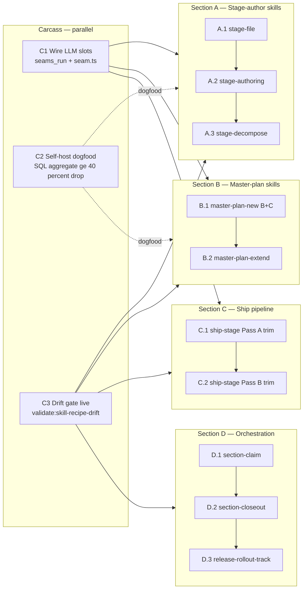

# Recipe-runner Phase E completion — exploration

> **Created:** 2026-04-30
>
> **Status:** Stub. Seeded from Wave 1 recipe-runner audit (this session).
>
> **Wave 2 dogfood pilot:** First fresh exploration to enter `/design-explore` → `/master-plan-new` natively under carcass+section primitive (per `docs/parallel-carcass-rollout-post-mvp-extensions.md` §3 + Stage 3.1 alignment fixes).
>
> **Source design:** `docs/agent-as-recipe-runner.md` (DEC-A19, 665 lines, Phases 0–G plan).
>
> **Related:** `docs/parallel-carcass-rollout-post-mvp-extensions.md` · `docs/parallel-carcass-exploration.md` · `docs/db-lifecycle-extensions-exploration.md`.

---

## 1. Problem statement

Wave 1 dogfood landed recipe engine + 7 recipes + DB audit table + seam stub. Audit reveals migration stalled mid-flight:

**Stalled at Phase D (mid-LLM recipify). Phases E (heavy-LLM dogfood) + F (subagent collapse) + G (cheat-sheet auto-sync) never reached.**

Three concrete defects block original goals (speed / token / reliability):

1. **Seam dispatch theatrical.** `tools/recipe-engine/src/steps/seam.ts` returns `{ ok: false, error: { code: "phase_b_no_dispatch" }}` unless `expected_output` injected. No LLM call wired. `seams_run` MCP only validates schemas. Stage-authoring + stage-decompose recipes call `seam.{name}` steps that bail — Opus author still runs via parent subagent prose path. Recipe is decoration.
2. **Skill body drift inversion.** `ia/skills/stage-file/SKILL.md` = 484 lines (0 recipe mentions). `ia/skills/stage-authoring/SKILL.md` = 448 lines (1 mention). `ia/skills/stage-decompose/SKILL.md` = 348 lines (4 mentions). Migration goal was thin skill layers; outcome doubled drift surface (recipe + prose coexist, neither owns truth).
3. **Recipe adoption inverted.** Mechanical-extreme skills (stage-file, release-rollout-track, section-claim, section-closeout) actually dispatch recipes from subagent body. Heavy-LLM skills (stage-authoring, stage-decompose, master-plan-new Phase A) carry recipe files but subagents still run prose path. DB audit confirms: stage-file = 46 production runs, release-rollout-track = 41; lifecycle heavy recipes = 0 production runs each.

**Net audit verdict against 3 original goals:**

| Goal | Verdict | Why |
|---|---|---|
| 1. Stage-implementation speed | Partial win on mechanical primitives only | Heavy-LLM chain unchanged — Opus author still runs prose path. |
| 2. Token + cost reduction | Near-zero net win | Seams not dispatching = no plan-covered execution = no billing model shift. Skill bodies didn't shrink = no Tier 1 cache savings. |
| 3. Reliability + robustness | Modest win | `ia_recipe_runs` audit table + escalation handoff at `ia/state/recipe-runs/{run_id}/seam-{step_id}-error.md` are real wins. Determinism boundary defined. |
| 4. Prose → systematic code | Engine done; skill prose unchanged | Engine + DB primitives shipped. Translation step (Phase F subagent collapse) never ran. |

---

## 2. Goals — what this exploration must define

Close Phase E + F + G of the recipe-runner plan. Concretely:

- **Phase E.1 — Seam dispatch wiring.** Replace `phase_b_no_dispatch` stub with real plan-covered subagent dispatch. 5 named seams: `author-spec-body`, `author-plan-digest`, `decompose-skeleton-stage`, `align-glossary`, `review-semantic-drift`. Honor Q3.b billing model decision (subagent-via-Task, not SDK direct). Q5 escalate-no-auto-retry preserved.
- **Phase E.2 — Heavy-LLM recipe dogfood.** Run stage-authoring + stage-decompose + master-plan-new Phases B+C recipes against real Wave 2 work. Validate seam dispatch end-to-end. Record token + wall-clock deltas vs prose-path baseline.
- **Phase F — Subagent body collapse.** Shrink `.claude/agents/{name}.md` bodies for recipified skills to recipe-dispatch shell only. Pattern: `npm run recipe:run -- {recipe} --inputs <path>` + handoff prose only. Target: stage-file.md / stage-authoring.md / stage-decompose.md / master-plan-new.md / section-claim.md / section-closeout.md / release-rollout-track.md drop ≥60% line count.
- **Phase G — Cheat-sheet auto-sync.** SKILL.md preamble auto-generates from recipe YAML step list. Single source of truth = recipe file. Drift gate (`validate:skill-recipe-drift` or similar) blocks divergence.

**Non-goals (out of scope):**
- Ship-stage Pass A/B recipify (separate exploration — too much surface).
- Plan-applier / verify-loop recipify (already mechanical-extreme; lower ROI).
- New seam types beyond the 5 named in DEC-A19.
- Recipe-engine syntax extensions (foreach / when / until already cover Phase E needs).

---

## 3. Approaches surveyed

Four candidate approaches. Final pick made by `/design-explore` Phase 1–2.

### Approach A — Phase E only (seam dispatch wiring)

Land seam LLM dispatch in `tools/recipe-engine/src/steps/seam.ts`. Wire `seams_run` MCP to dispatch plan-covered `seam-{name}` subagent via Task tool. Stop there. Skill bodies + cheat-sheet drift remain.

- **Pros:** Smallest scope. Unblocks heavy-LLM recipe dogfood. Concrete token + cost test possible immediately.
- **Cons:** Drift surface unchanged — recipe + prose still coexist. Migration completion still stalled, just one phase further. Phase F + G still pending.
- **Effort:** ~1 stage. ~3–5 tasks.
- **Risk:** Low. Dispatch shape clear from DEC-A19 §Phase C.

### Approach B — Phase E + F (dispatch + body collapse)

A + collapse subagent bodies for recipified skills. Replace prose with recipe-dispatch shell. Drop ≥60% lines per recipified subagent body.

- **Pros:** Closes "thin skill layer" goal. Tier 1 cache shrinks → real token savings on every subagent invocation. Drift surface halves.
- **Cons:** Larger surface — touches 7 subagent bodies + skill SKILL.md sections. Requires recipe coverage parity check (recipe must encode every prose instruction). Phase G drift gate still pending.
- **Effort:** ~2 stages. ~8–12 tasks.
- **Risk:** Medium. Body collapse requires per-skill audit (does recipe encode all prose constraints?).

### Approach C — Phase E + F + G (full closure)

B + cheat-sheet auto-sync. SKILL.md preamble + agent-body.md generated from recipe YAML. Drift gate (`validate:skill-recipe-drift`) wired into `validate:all`.

- **Pros:** True single source of truth (recipe). Drift impossible by construction. Migration goal "free systematic code" fully reached.
- **Cons:** Largest scope. Requires generator script + drift validator + skill-tools pipeline integration. Highest dogfood risk during Wave 2.
- **Effort:** ~3 stages. ~12–16 tasks.
- **Risk:** Medium-high. Generator template surface non-trivial. Drift gate false-positives could block unrelated PRs.

### Approach D — Pivot to Sonnet-direct seam execution (no parent subagent)

Change billing model. Recipe engine dispatches seams via Anthropic SDK directly (not via Task tool subagent). Faster + cheaper per-seam call, but loses plan-covered billing + Claude Code permission inheritance.

- **Pros:** ~30–50% faster per-seam (no subagent boot). Lower latency on long foreach loops.
- **Cons:** Breaks plan-covered billing (Q3.a explicitly rejected in DEC-A19). User pays per-token. Loses Claude Code hook + permission model. Token spend untracked. Architecturally worse.
- **Effort:** ~2 stages. Engine changes + auth wiring.
- **Risk:** High. Architectural pivot vs ratified DEC-A19 Q3.b decision. Would require new arch_decision_write supersede chain.

---

## 4. Recommendation

**Approach C (Phase E + F + G — full closure).**

Rationale: A + B leave Phase G drift surface unhealed. Wave 2 carcass+section dogfood is the right vehicle for full closure — explorations that ship as carcass+section need recipe + skill in lockstep (sections imply parallel seam dispatch). Half-migration leaves the lifecycle skill chain perpetually 50% theatrical.

Backup: **Approach B** if Phase G generator surface proves out of budget — at minimum collapse bodies + manual drift discipline.

Reject **Approach D** — supersedes ratified architectural decision without new evidence.

---

## 5. Open questions

These need user input during `/design-explore` Phases 0.5 + 2.5 + 6:

1. **Plan shape — flat vs carcass+section?** (Phase 0 gate, MANDATORY). Recommendation: carcass+section. Rationale: Phase E (engine wiring) + Phase F (body collapse) + Phase G (drift gate) are surface-orthogonal — engine src/ vs `.claude/agents/` vs `tools/scripts/skill-tools/`. Cleanest section partition. Three carcass stages (one per phase) + sections per skill family.
2. **Seam dispatch concurrency cap?** Should foreach-with-seam loops fan out (parallel seam dispatch) or stay sequential? Wave 1 carcass primitives support parallel sections; per-seam parallelism is a recipe-engine flag.
3. **Body-collapse target ratio?** ≥60% line drop is rough. Hard floor — what minimum prose stays in subagent body? (preamble cache block + handoff message + escalation block at minimum.)
4. **Cheat-sheet generator format?** Markdown table from recipe YAML steps? Embedded literal block? Mermaid flowchart? Affects skill-tools/ pipeline shape.
5. **Drift gate strictness?** Should `validate:skill-recipe-drift` exit non-zero on any divergence, or only on missing recipe coverage (warning on extra prose)? CI gate vs warn-only initial rollout.
6. **Wave 2 dogfood selection.** This exploration IS the Wave 2 pilot per `docs/parallel-carcass-rollout-post-mvp-extensions.md` §3. Confirm — or pick a separate domain pilot and run recipe-runner-phase-e closure as Wave 1.5 cleanup?
7. **Seam ID namespace.** 5 seams ratified in DEC-A19. Phase E may surface a 6th (e.g. `align-arch-surfaces` for Phase A recipe). Pre-allocate slot in recipe schema, or freeze at 5 + extend later?
8. **Test harness.** Phase E.2 dogfood requires real Wave 2 work. Use this exploration's own master-plan as the test bed (recipe-runner-phase-e closure runs on itself), or pull a separate small plan?

---

## 6. Notes for `/design-explore` skill

- This is the Wave 2 carcass+section pilot. Phase 0 plan-shape gate output drives Phase 2.5 arch_decision_write count, Phase 6 IP grouping, Phase 9 persist blocks. See `docs/design-explore-carcass-alignment-gap-analysis.md` Critical tier (C1–C4).
- Source contract: `docs/parallel-carcass-exploration.md` Locked decisions D8 / D15–D20.
- Surface clusters likely: (a) `tools/recipe-engine/` engine wiring · (b) `tools/mcp-ia-server/` seams_run dispatch · (c) `.claude/agents/` body collapse · (d) `tools/scripts/skill-tools/` generator + drift gate.
- Carcass stage candidates (≤3 per D15): E.1 seam dispatch wiring · E.2 heavy-LLM dogfood · F+G body collapse + drift gate (combinable carcass).

---

## 7. Decision log

| Date | Decision | Rationale | Impact |
|------|----------|-----------|--------|
| 2026-04-30 | Authored seeding exploration. | Wave 1 audit surfaced Phase E/F/G gap; Wave 2 needs fresh exploration for carcass+section dogfood. | Enters `/design-explore` for plan-shape gate + approach lock. |
| 2026-04-30 | `/design-explore` Phases 1–9 complete. Approach C locked. Plan shape = carcass+section. 3 carcass + 4 sections + 3 plan-scoped arch_decisions queued. | Wave 2 dogfood pilot per parallel-carcass-rollout-post-mvp-extensions §3. Phase 2.5 writes deferred to `master-plan-new` Phase A (master-plan slug must exist before plan-scoped DEC-A row). | Ready for `/master-plan-new`. |
| 2026-04-30 | Locked 3 director-level refactor-cost promises (P1 one edit point · P2 auto-catch drift · P3 old recipes keep running). | Future skill refactor cost translates from week → day; without P3, year-2 schema bump would break year-1 recipe runs. | C3 carcass scope expanded: + P3 recipe versioning sub-tasks (C3.c–C3.d). Subsystem Impact gains additive `recipe_version` column row. P1 + P2 = Stage exit criteria; P3 = additive insurance. |

---

## Design Expansion

### Plan Shape

- Shape: **carcass+section**
- Rationale: 3 surface-orthogonal carcass phases (engine wiring · self-host dogfood · drift gate) + 4 skill-family sections (stage-author / master-plan / ship pipeline / orchestration) — file surfaces never collide; parallel sessions safe.

### Carcass Stages

| Carcass | Name | Signal kind | Surface(s) shipped |
|---|---|---|---|
| C1 | Wire LLM into named slots | code-signal | `tools/recipe-engine/src/steps/seam.ts` + `tools/mcp-ia-server/src/tools/seams-run.ts` — `seams_run` MCP dispatches plan-covered subagent; `seam.ts` step calls real LLM (replaces `phase_b_no_dispatch` stub) |
| C2 | Self-host dogfood gate | metric-signal | This plan's own stage authoring runs end-to-end through the new recipes; SQL aggregate over `ia_recipe_runs` vs baseline shows ≥40% token drop |
| C3 | Drift gate live + recipe versioning | gate-signal | `tools/scripts/skill-tools/` + `package.json` — `validate:skill-recipe-drift` exits non-zero on any divergence + wired into `validate:all` CI chain. Includes P3 recipe schema versioning: `recipe_version` field in YAML + `recipe_version` column in `ia_recipe_runs` (additive migration). |

### Sections

| Section | Name | Surface cluster | Depends_on |
|---|---|---|---|
| section-A | Stage-author skills | `stage-file` + `stage-authoring` + `stage-decompose` | C1, C3 |
| section-B | Master-plan skills | `master-plan-new` (Phases B+C) + `master-plan-extend` | C1, C3 |
| section-C | Ship pipeline | `ship-stage` Pass A/B (body trim + recipe-dispatch shell only — `plan-applier` / `verify-loop` chain calls stay prose path; recipify deferred to Wave 3+) | C1, C3 |
| section-D | Orchestration skills | `section-claim` + `section-closeout` + `release-rollout-track` (recipes exist; only body trim + drift gate) | C3 |

### Chosen Approach

**Approach C — Phase E + F + G full closure.** 5 ratified seams (`author-spec-body`, `author-plan-digest`, `decompose-skeleton-stage`, `align-glossary`, `review-semantic-drift`) + new 6th slot `align-arch-decision` for `master-plan-new` Phase A `arch_decision_write` step. Recipe owns truth; skill body collapses to recipe-dispatch shell + handoff + escape hatch + cache preamble pointer (~50-line target per `.claude/agents/{name}.md`). Drift gate blocks any divergence in CI.

Rejected A (Phase E only) — drift surface unhealed. Rejected B (E+F) — Phase G drift gate still pending. Rejected D (Sonnet-direct seam dispatch) — supersedes ratified DEC-A19 Q3.b.

### Refactor-cost promises (director-level acceptance)

Three promises locked into the master-plan exit criteria. Translate "future skill refactor cost" from a week to a day and keep it there.

| # | Promise (director-plain) | Mechanism (how it's kept) | Stage / signal |
|---|---|---|---|
| P1 | **One edit point.** Skill change = edit recipe YAML, regenerate fires. No hand-edits to subagent / command / preamble. | Recipe YAML = source of truth. `tools/scripts/skill-tools/` regenerates `.claude/agents/{name}.md` + `.claude/commands/{name}.md` + SKILL.md preamble from recipe. | C3 acceptance row + Section A/B/C/D body-trim tasks land thin recipe-dispatch shells only |
| P2 | **Auto-catch drift.** Hand-edit a generated file → CI yells on the PR before merge. | `npm run validate:skill-recipe-drift` exits non-zero on any divergence; wired into `validate:all`. Pre-Day-1 baseline snapshot avoids legitimate-prose false positives. | C3 carcass — gate-signal exit |
| P3 | **Old recipes keep running when format changes.** Year-2 recipe schema bump does not break year-1 recipe runs. | `recipe_version: N` field in recipe YAML + `recipe_version` column in `ia_recipe_runs`. Engine reads field; unknown future fields ignored on older versions. One DB migration. | C3 sub-task — additive schema migration + engine read |

P1 + P2 are the core promises (re-confirmed, lock as Stage exit criteria). P3 is cheap insurance — adds 1 DB column + 1 recipe field.

### Architecture Decision

Phase 2.5 MCP writes **deferred to `master-plan-new` Phase A** — `arch_decision_write` with `plan_slug=recipe-runner-phase-e` rejects with `unknown_master_plan_slug` until the master-plan row exists. Per Phase 2.5 skip-clause this exploration is tooling-only (no `arch_surfaces` under `ia/specs/architecture/**` directly touched by exploration), so silent skip would also apply; capturing as planned-write block instead so master-plan-new transcribes verbatim.

**Planned-write block (3 plan-scoped decisions — execute during master-plan-new Phase A):**

| Slug | Title | Rationale | Alternatives rejected | Affected `arch_surfaces[]` (resolve via `arch_surface_resolve` per stage at stage-file time) |
|---|---|---|---|---|
| `plan-recipe-runner-phase-e-boundaries` | Plan recipe-runner-phase-e — Boundaries | IN scope = lifecycle skills (`stage-file`, `stage-authoring`, `stage-decompose`, `master-plan-new`, `master-plan-extend`, `section-claim`, `section-closeout`, `release-rollout-track`) + ship pipeline (`ship-stage` Pass A/B body trim only). OUT scope = `plan-applier`, `verify-loop`, `project-new`, `code-review`, `audit`. Excluded surfaces stay prose-path; revisit post-Wave 2. | Lifecycle-only (smaller win); everything-that-runs-an-agent (too much surface, bootstrap risk). | Surfaces backing each in-scope skill family — resolved at stage-file time per stage. |
| `plan-recipe-runner-phase-e-end-state-contract` | Plan recipe-runner-phase-e — End-State Contract | Cost-per-stage token total drops ≥40% on a typical 4-task stage vs prose-path baseline. Signal observable as SQL aggregate over `ia_recipe_runs.input_token_total + output_token_total` filtered by `recipe_slug ∈ {stage-authoring, stage-decompose, master-plan-new, ship-stage}` compared to pre-migration `ia_session_log` baseline. Wall-clock + reliability secondary; hard gate is cost. | Wall-clock-only (less measurable); reliability-only (Wave 1 already shipped audit table); all-three (no clear acceptance criterion). | `db/migrations/ia_recipe_runs` schema + `tools/recipe-engine` audit emission. |
| `plan-recipe-runner-phase-e-shared-seams` | Plan recipe-runner-phase-e — Shared Seams | Recipe owns the truth. Every LLM call dispatches through a named seam slot in recipe YAML. No agent freelances steps. Schema validation via `seams_run` MCP (AJV against `tools/seams/{name}/{input,output}.schema.json`). 6 seam slots reserved: `author-spec-body`, `author-plan-digest`, `decompose-skeleton-stage`, `align-glossary`, `review-semantic-drift`, `align-arch-decision` (NEW — Phase A). | Cost-cap-per-call (kills real work mid-flight); audit-first (already shipped Wave 1); all-three (over-engineered). | `tools/recipe-engine/src/steps/seam.ts` + `tools/seams/{name}/` schema dir + `.claude/agents/seam-{name}.md` plan-covered subagent definitions. |

After 3 writes: `arch_changelog_append({ kind: 'design_explore_decision', decision_slug })` per row, then `arch_drift_scan({ open_plans_only: true })` → drift report appended inline below.

**Drift report:** deferred — runs at master-plan-new Phase A time on the freshly-written rows.

### Architecture



**Entry point:** subagent body invokes `npm run recipe:run -- {recipe_slug} --inputs <run-input.json>`. Recipe-engine dispatches seam steps via `seams_run` MCP → plan-covered `seam-{name}` subagent (Task tool) → returns structured JSON.

**Exit point:** `ia_recipe_runs.status=ok` row written with token totals + downstream MCP-mutated state (e.g. `task_spec_section_write` for §Plan Digest, `arch_decision_write` for Phase A decisions).

### Subsystem Impact

| Subsystem | Section(s) | Dependency nature | Invariant risk | Breaking vs additive | Mitigation |
|---|---|---|---|---|---|
| `tools/recipe-engine` (seam.ts) | C1 (carcass) | new LLM dispatch path inside `seam.ts` step handler | none (tooling-only, no runtime C# / Unity) | additive; breaking only for tests asserting `phase_b_no_dispatch` stub | update test fixtures during C1 |
| `tools/mcp-ia-server` (`seams_run`) | C1 (carcass) | wires LLM call to plan-covered `seam-{name}` subagent via Claude Code Task tool | none | additive | preserve schema-validation-only fallback for headless / SDK-direct callers |
| `.claude/agents/{name}.md` bodies | A, B, C, D | body collapse ≥50% line drop to recipe-dispatch shell + handoff + escape hatch + cache pointer | none | breaking iff agent body prose currently encodes constraints absent from recipe | C3 drift gate forces parity; per-section recipe-parity audit before trim |
| `ia/skills/{name}/SKILL.md` preamble | A, B, C, D | auto-generated from recipe YAML step list (Phase G) | none | additive | skill-tools generator script + drift gate; per-skill baseline snapshot before gate flip |
| `db/migrations` (`ia_recipe_runs`) | C2 (carcass) | token-total emission + SQL aggregate query for end-state contract | invariant 13 (monotonic id source — non-blocking, table uses serial PK) | additive | aggregate query as read-only; no schema change |
| `db/migrations` (`recipe_version` column) | C3 (carcass) | P3 promise — additive `recipe_version int` column on `ia_recipe_runs` + `recipe_version` field on YAML schema | none | additive (default 1 for legacy rows) | engine reads field; unknown future fields ignored on older versions |
| `tools/scripts/skill-tools/` | C3 (carcass), G across all sections | new `validate:skill-recipe-drift` script + body generator (P1 + P2 promises) | none | additive | new script wired into `validate:all`; non-zero exit on divergence; per-skill baseline snapshot before gate flip |

No runtime C# / Unity invariants flagged — tooling-only design, `invariants_summary` skipped per Tool recipe Phase 5 step 5.

### Implementation Points

```
Carcass — parallel-eligible, no internal deps
  - [ ] C1 Wire LLM slots — signal: code-signal
  - [ ] C2 Self-host dogfood — signal: metric-signal
  - [ ] C3 Drift gate live + recipe versioning — signal: gate-signal
       - C3.a `validate:skill-recipe-drift` script (P1 + P2 promises)
       - C3.b Per-skill baseline snapshot pass — avoid Day-1 false positives
       - C3.c `recipe_version` column migration on `ia_recipe_runs` + YAML schema field (P3 promise)
       - C3.d Engine reads `recipe_version`; unknown future fields ignored on older versions
       - C3.e Wire into `validate:all` CI chain

Section A — Stage-author skills (depends on C1 + C3)
  - [ ] A.1 stage-file body trim + recipe parity audit (verify already-mechanical body needs trim)
  - [ ] A.2 stage-authoring body trim + seam.author-plan-digest live
  - [ ] A.3 stage-decompose body trim + seam.decompose-skeleton-stage live

Section B — Master-plan skills (depends on C1 + C3)
  - [ ] B.1 master-plan-new Phases B+C recipify + seam.author-spec-body + seam.align-arch-decision live (NEW slot — define input/output schema in tools/seams/align-arch-decision/)
  - [ ] B.2 master-plan-extend recipify + body trim

Section C — Ship pipeline (depends on C1 + C3)
  - [ ] C.1 ship-stage Pass A body trim + recipe-dispatch shell (per-task implement + compile gate orchestration only — plan-applier/verify-loop chain calls stay prose path)
  - [ ] C.2 ship-stage Pass B body trim + recipe-dispatch shell (verify-loop + closeout + commit orchestration only)

Section D — Orchestration (depends on C3 only)
  - [ ] D.1 section-claim body trim
  - [ ] D.2 section-closeout body trim
  - [ ] D.3 release-rollout-track body trim

Deferred / out of scope: plan-applier recipify, verify-loop recipify, project-new recipify, code-review recipify, audit recipify (Wave 3+).
```

### Examples

**(a) Seam dispatch wiring — `seam.author-plan-digest`**

Input JSON (recipe step input):
```json
{
  "recipe_run_id": "run-abc123",
  "step_id": "seam-author-plan-digest",
  "inputs": {
    "task_id": "TECH-5301",
    "stage_id": "S1",
    "plan_slug": "recipe-runner-phase-e",
    "context_block_ref": "cache-block-stage-S1"
  }
}
```

Output JSON (validated via `seams_run` MCP AJV against `tools/seams/author-plan-digest/output.schema.json`):
```json
{
  "ok": true,
  "task_id": "TECH-5301",
  "sections": {
    "goal": "Wire LLM into seam.ts",
    "acceptance": ["seam.ts dispatches plan-covered subagent", "ia_recipe_runs row written"],
    "test_blueprint": "...",
    "examples": "...",
    "mechanical_steps": "..."
  }
}
```

Then engine writes via `task_spec_section_write` MCP — single roundtrip per task.

**Edge case (a-edge):** seam returns malformed JSON → `seams_run` AJV rejects → `ia_recipe_runs.status=error` + `ia/state/recipe-runs/{run_id}/seam-{step_id}-error.md` handoff written → escalate-no-auto-retry per Q5. Parent subagent reads handoff, repairs input, re-dispatches.

**(b) Drift gate**

Skill body adds new prose step `### Phase 4b — extra alignment check` not encoded in recipe YAML. CI runs:

```bash
npm run validate:skill-recipe-drift
```

Output:
```
SKILL DRIFT — ia/skills/stage-authoring/SKILL.md
  Skill body has 12 steps; recipe stage-authoring.yaml has 11 steps.
  Extra step: "Phase 4b — extra alignment check" (skill line 142)
  Resolution: encode in recipe OR remove from skill body.
exit 1
```

CI red → blocks PR. Resolution: author updates recipe YAML to add `phase-4b` step (with seam slot if LLM call) OR removes prose; re-runs validate.

**(c) Self-host dogfood**

Recipe `stage-authoring.yaml` runs against this plan's own Section A tasks (TECH-5301, TECH-5302, TECH-5303). Engine writes `ia_recipe_runs` row per stage:

```sql
SELECT
  recipe_slug,
  SUM(input_token_total + output_token_total) AS total_tokens,
  COUNT(*) AS runs
FROM ia_recipe_runs
WHERE plan_slug = 'recipe-runner-phase-e' AND status = 'ok'
GROUP BY recipe_slug;
```

Compare to pre-migration baseline from `ia_session_log` (same plan, prose-path equivalent) → must show ≥40% drop on `recipe_slug='stage-authoring'`. C2 carcass closes when SQL gate passes.

### Review Notes

Phase 8 self-review run: 2 BLOCKING resolved before persist (Section C scope narrowed to body-trim + recipe-dispatch shell only — `plan-applier` / `verify-loop` chain calls stay prose path; Phase 2.5 MCP writes deferred to `master-plan-new` Phase A as planned-write block since master-plan slug must exist before plan-scoped `arch_decisions` row).

NON-BLOCKING (carried):
- Body collapse may invalidate Tier 1 prompt-cache fingerprints mid-rollout → add task to C2 dogfood: measure pre/post cache-hit rate.
- A.1 stage-file is already mechanical-extreme + recipe-dispatching; "body trim + recipe parity audit" may be a no-op. Verify before scheduling.
- Phase 7 Example (a) doesn't show full schema-mismatch escalation handoff content. Add edge case detail at stage-file time.

SUGGESTIONS:
- Define `align-arch-decision` seam input/output schema as part of B.1 — NEW slot vs 5 ratified in DEC-A19; add to `tools/seams/align-arch-decision/`.
- C3 sub-task: per-skill drift baseline snapshot before gate flip — avoid Day-1 CI red on legitimate prose.

### Expansion metadata

- Date: 2026-04-30
- Model: claude-opus-4-7
- Approach selected: C (Phase E + F + G full closure)
- Plan shape: carcass+section
- Blocking items resolved: 2
