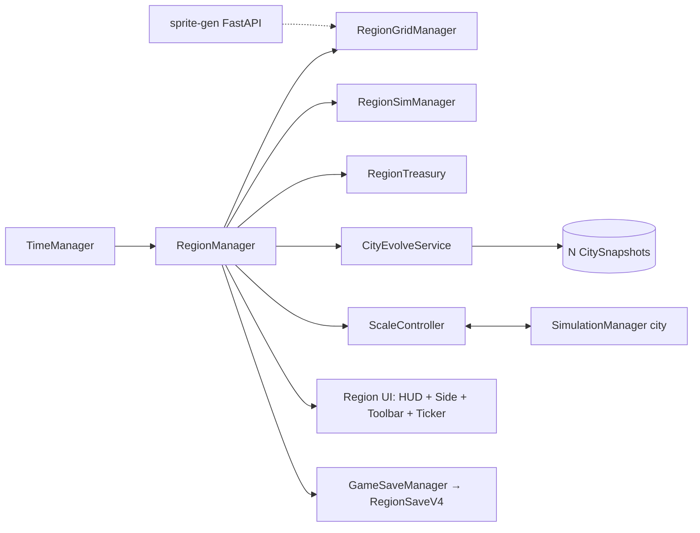

# Region scale — design exploration

> **Status:** Polling COMPLETE 2026-04-26 — Round 1 (D1–D6 + D2.1) + Round 2 (D7–D12) all locked. Ready for `/design-explore docs/region-scale-design.md` to formalize (compare → expand → architecture → impact → impl points → review → persist) → seeds `master-plan-extend multi-scale` Step 3.
>
> **Owner:** jiramos87 (game vision) + Claude (synthesis + polling).
>
> **Anchors:**
> - `ia/specs/game-overview.md` — vision: city ↔ region ↔ country = MVP target.
> - `ia/specs/glossary.md` "Scale switch" — defined; impl absent.
> - `ia/projects/multi-scale-master-plan.md` — Step 1 (parent-id stubs) Final; Step 2 (city close) in progress; Step 3 (region) NOT yet authored — this doc unblocks it.
> - `Assets/Scripts/Managers/UnitManagers/RegionCell.cs` — placeholder type (no behavior).
> - `Assets/Scripts/Managers/UnitManagers/RegionalMap.cs` + `Assets/Scripts/Managers/GameManagers/RegionalMapManager.cs` — INSIDE-CITY minimap (FEAT-10 territory). NOT region-scale game.

---

## §1 Vision recap (canonical, do not edit)

Per `game-overview.md`:

- Player at Region scale = **Governor**.
- Scope = "Cities, inter-city trade, migration, founding new cities".
- One active scale at a time; other scales dormant.
- Dormant scales evolve algorithmically at scale-switch time (`evolve(snapshot, Δt, params) → snapshot'`).
- All scales share one real-time calendar (no per-scale tick periods).

## §2 Open decisions (round 1 — foundational)

> Each decision below = polling slot. Status: `OPEN` until user-confirmed; `LOCKED` after.

### D1 — Player gameplay loop at region scale  `LOCKED 2026-04-26`

**Decision:** Sandbox mix — Governor does (a) inter-city infrastructure + (b) per-city policy/alerts + (c) found new cities, all three, no single dominant verb. Player chooses focus per session.

**Implication:** Region UI must surface three distinct tool-modes (Build / Policy / Found) with low-friction switching. No forced sequencing — sandbox cadence.

### D2 — Region spatial model  `LOCKED 2026-04-26`

**Decision:** Square grid of region tiles. Consistent with city-scale grid. Cities occupy 1+ tiles (real shape + size representation, not single-pin). Tile aesthetic = airplane-view abstraction of a city area.

**Tile subtypes (initial set):**

- **City-area tiles** — new prefabs, airplane-view abstraction (one tile = many city blocks).
- **Highway / road tiles** — thin lines (1–2 px stroke), orthogonal + diagonal directions.
- **Land tiles** — base terrain.
- **Raised terrain tiles** — same isometric geometry as city scale, but slope per height step noticeably lower / less abrupt (coarser elevation cadence).
- **Water tiles + shoreline tiles** — open water + transition tiles.
- **Geographic-feature tiles** — TBD; research dispatched to Explore agent (rivers, biomes, mountains, deltas, forests, deserts, etc.). Result feeds D2.1 sub-poll.

**Pending sub-poll D2.1:** finalize geographic-feature tile catalog after Explore agent returns.

#### D2.1 — Geographic feature tile catalog  `LOCKED 2026-04-26`

**Decision:** Accept Explore agent recommended MVP set (10 features).

**MVP tiles:** River, Lake, Mountain, Hill, Forest, Grassland, Desert, Oasis, Marsh, Plateau.

**Post-MVP backlog:** Delta, Swamp, Tundra, Taiga–tundra ecotone, Mangrove, Salt flat, Badlands, Volcanic field, Mountain pass, River ford, Bridge anchor, Fishing grounds, Ore deposit, Fertile soil, Atoll, Coastal cliff.

Full per-feature gameplay role + render hints persisted in §10.1.

### D3 — Cross-city flow primitives  `LOCKED 2026-04-26`

**Decision:** Multi-flow set (Governor manages all):

1. **Goods + raw resources** — production/consumption per city; surpluses route via roads/rail to deficit cities; shortages cause unrest / stalled growth.
2. **Money / budget transfers** — region treasury collects taxes; Governor reallocates (subsidies, infra, disaster relief).
3. **Information / policy** — region-wide policies cascade (tax rate, immigration rules, building codes); events propagate (city-A strike → city-B reactions).
4. **Traffic** — vehicle / cargo movement on highways + roads; new mechanic at region scale (NOT yet implemented at city scale, but shares mechanics — design city-scale traffic in parallel or borrow region impl).
5. **Pollution** — propagates across tiles (wind / water carriers); affects health, agriculture, tourism; per-city pollution outputs accumulate region-wide.
6. **Tourism (migration variant)** — temporary human flow toward attractive regions/cities (climate, landmarks, low pollution); separate from permanent migration; revenue source.
7. **Geographical + climatic differentials** — region tiles carry geo (terrain, water access) + climate (temperature, rainfall) attributes; differentials drive flow rates (trade routes prefer flat low-altitude; tourism prefers mild climate; agriculture needs fertile + watered tiles); first-class gameplay input, not flavor.

**Implication:** Region sim must model 7 flow channels simultaneously. Per-tile geo + climate attributes are shared inputs. Traffic mechanic is greenfield; coordinate with future city-scale traffic design.

**Note:** Permanent migration (D3 original "people" option) folded into Tourism + economic flows; revisit if separate channel needed.

### D4 — City-founding model  `LOCKED 2026-04-26`

**Decision:** Player picks empty tile + plants settlement. Founding cost paid; viability rules gate which tiles allowed (land + water access + no hazard tile + min distance from existing city, etc.); new city appears as a stub that immediately grows under sim rules (no manual starter package — auto-defaults).

**Implication:** Need viability-rule definition (D4.1 sub-decision deferred to design-explore Phase 1) + founding-cost economy + city-stub initial state spec (population seed, starter buildings if any, default zoning).

### D5 — Scale-switch UX + cadence  `LOCKED 2026-04-26`

**Decision:** Semantic zoom-out (mouse wheel). Player wheel-zooms past a threshold; current city dissolves into its region-tile footprint; smooth visual transition; same scene-camera continues. Reverse wheel-in re-enters a chosen city.

**Implication:** Need camera/zoom threshold spec, dissolve-transition art, footprint-resolve mapping (which tile(s) does the active city occupy at region scale), and re-entry city-pick UX (hover-highlight + click on a city tile to enter). No earned-milestone gate — free-switch from session start.

### D6 — Dormant city evolution while in region  `LOCKED 2026-04-26`

**Decision:** Continue ticking in real time, but growth is driven by **mathematical abstraction formulas, NOT actual simulated city play**. Dormant cities advance via `evolve(snapshot, Δt, params) → snapshot'` running on a real-time calendar tick — no per-agent sim, no per-tile zoning sim, no traffic sim. Evolve formulas compute aggregate deltas (population growth rate, treasury accrual, pollution output, trade-flow rates) from a small parameter set + region inputs (climate, neighbor flows, policy).

**Implication:**

- All cities have a "snapshot" = compact aggregate state (pop, treasury, key resources, pollution, infra summary, satisfaction index, etc.) — separate from full city sim state.
- `evolve()` is the contract: stateless formula taking snapshot + Δt + region context → new snapshot. Deterministic, cheap (O(1) per city per tick).
- Re-entering a city = expand snapshot → fine-grained sim state (deterministic seed + procedural fill if necessary). Round-trip city → snapshot → city must preserve fidelity within bounds (D6.1 sub-decision: tolerance + reconciliation rule deferred to Phase 1).
- Active city sim runs in parallel with all dormant evolves on the same calendar — no time desync.

## §3 Round 2 decisions  `LOCKED 2026-04-26`

### D7 — Governor toolset  `LOCKED`

**Decision:** ALL 4 panel types active in Region UI:

1. **Per-city dashboard panels** — click a city tile → side panel: snapshot (pop, treasury, satisfaction, key flows), alerts, policy tweaks + budget transfer buttons.
2. **Region-wide policy sliders** — top/bottom HUD: tax rate %, immigration permissiveness, environmental rules; cascade to all cities; instant aggregate-metric feedback.
3. **Build-mode toolbar** — road / rail / canal / bridge / "Found new city" tools; drag/click to place; cost preview before commit.
4. **Alert / event ticker** — persistent feed of region events (fire in city-A, drought in tile-zone-X, migration surge); click to jump-to/zoom-to location.

**Implication:** Wide UI surface for MVP. Need consistent design-token reuse with city-scale HUD (per `web/lib/design-system.md` analog for Unity HUD, or new equivalent for Unity layer).

### D8 — Persistence shape  `LOCKED`

**Decision:** Single save file (region root). One save = full region snapshot + all city snapshots embedded; on load, reconstruct everything.

**Implication:** File-size scaling concern deferred (D8.1) — acceptable for MVP city-counts. Migration from existing city-only saves (`PlayerStats` etc.) needs a versioned upgrade path: city-only save → wrapped in single-city region root with default region defaults.

### D9 — Region art fidelity  `LOCKED`

**Decision:** Sprite-gen pipeline output. Use existing sprite-gen FastAPI service (`asset-pipeline-stage-3.1`) to generate region tile sprites from prompts; iterate fast; consistent visual style with city if prompt-tuned.

**Implication:** Need sprite-gen prompt set per geo-feature (10 MVP tiles + city-area + highway + raised-terrain step + water + shoreline = ~16 sprite-gen jobs). Pipeline calibration (`sprite-gen-calibrate-axis`, `sprite-gen-review` skills) applies. Art lead time = sprite-gen iteration speed, not hand-paint.

### D10 — Sim tick relationship  `LOCKED`

**Decision:** One shared real-time clock. Same calendar drives both scales; city-tick + region-`evolve()` both fire on the same tick stream; switching scales never desyncs time. Player-perceived "time of day / season" identical across scales.

**Implication:** Scheduler must dispatch both city sim (fine-grained, active scale only) AND all dormant city `evolve()` calls (coarse, every dormant city) on every tick. Tick budget: active city ≤ already-budgeted city-scale cost; dormant evolves must fit in remaining frame headroom (D10.1: per-city evolve cost target, e.g. ≤50µs/city @ 60Hz with N=20 cities).

### D11 — Economy primitives  `LOCKED`

**Decision:** ALL 4 money channels active:

1. **City-tax revenue → region treasury** (governed by D7 tax slider; primary income).
2. **Trade-tariff income** (goods crossing region borders or moving between cities; route taxation).
3. **Region budget → infrastructure costs** (roads, rail, canals, bridges, founding-cost subsidy; primary outflow).
4. **Region budget → city subsidies + disaster relief** (discretionary Governor transfers).

**Implication:** Region treasury is its own ledger (separate from per-city PlayerStats); needs schema design (D11.1). Cross-channel reconciliation rules: tariff income computed per evolve() tick from inter-city flow rates × tariff rate; subsidy outflow committed instantly on Governor button press.

### D12 — Win / fail conditions  `LOCKED`

**Decision:** Open sandbox — no win, no fail, no game-over. Region scale is endless. Player decides personal goals (SimCity-classic spirit). Country scale can carry its own conditions later (post-MVP).

**Implication:** No bankruptcy reset. Treasury can go negative (debt mechanic? D12.1 sub-decision deferred). No scenario goal templates for MVP. Pause / save / quit are the only "endings".

## §4 Compare-approaches placeholder

> Filled by `/design-explore` Phase 1 once round 1+2 locked. Will compare ≥2 approaches per locked decision.

## §5 Selected approach placeholder

> Filled by Phase 2.

## §6 Architecture placeholder

> Filled by Phase 3.

## §7 Subsystem-impact placeholder

> Filled by Phase 4.

## §8 Implementation points placeholder

> Filled by Phase 5.

## §9 Examples / mockups placeholder

> Filled by Phase 6.

## §10 Review log placeholder

> Filled by Phase 7 (subagent review).

## §10.1 Explore-agent research dump — Geographic feature catalog (2026-04-26)

> Source: Explore agent run, dispatched during Round 1.2. Feeds D2.1 sub-poll. Tile catalog beyond locked initial set (city-area / highway / land / raised-terrain / water + shoreline).

| Name | Represents | Gameplay role | Render hint |
|---|---|---|---|
| River | Flowing freshwater channel, cardinal path | Drinking water; road crossing; trade anchor; foundational for city viability | Single cell, cardinal-flow orientation; shore banks adapt to neighbors; animated water surface |
| Lake | Standing freshwater body | Defensive moat; freshwater resource; landmark; no trade flow | Multi-cell cluster; shore-reflex mosaic; static water |
| Delta | River mouth braided beds toward sea | Estuarine fertility; migration corridor; port-city anchor; complex crossings | 3–7 cell pattern; asymmetric bifurcation; mixed depth |
| Marsh | Shallow floodplain, reeds | Hazard (slow + disease); fishing yield; bad city foundation | Sparse cells + dry grass; brown water; half-height walkable penalty |
| Mountain | High relief (height ≥3) | Ore deposits; defensible; impassable (no roads); navigation anchor | Steep cliff stacks; jagged peaks; snow cap above treeline |
| Hill | Moderate relief (height 2) | City-foundable; defensive bonus; quarry potential | Terraced slopes; ordinal ramps; multi-cell |
| Plateau | Flat high-ground, cliff rim | Strategic fortress; grazing; natural defense | Table-top; uniform interior; cardinal cliffs only on edges |
| Forest | Dense woodland | Timber; hunting; slow paths; can hide settlements; fire hazard | Clustered cells; sprite darkening; edge-fade; canopy sway |
| Desert | Arid sandy plain | Slow farming; harsh settlement; trade penalty (distance); no water | Tan/ochre; sand dunes; mirage shimmer |
| Oasis | Artesian spring in desert | Lifeline; high-yield water trade; migration magnet | 1–3 cell palm ring; brackish water; surrounded by desert |
| Grassland | Flat fertile plains | Prime city site; high farm yield; herd resources | Standard grass; flat; greener than base |
| Salt flat | Evaporite, crystalline white | Salt extraction; spectacle; zero farming | Pale white; geometric pan grid; flat |
| Tundra | Arctic grassland, permafrost | Cold settlement penalty; reindeer; limited farming; seal/fish | Pale veg; rocky outcrops; ice rims; snow mist |
| Taiga–tundra ecotone | Boreal forest + tundra mix | Mixed economy (logging + herding); fungal forage; eco-sensitive | Sparse trees + short grass; mottled grey-green; ice patches |
| Mangrove | Tidal brackish forest, salt-tolerant roots | Rot-resistant timber; fish nursery; shipbuilding; impassable to land units | Multi-cell water-adjacent swamp; stilt-root sprites |
| Volcanic field | Lava badlands, obsidian/pumice, geothermal | High-value ore; geothermal (post-MVP); eruption hazard; ash penalty | Dark basalt; jagged rocks; wisp smoke; rumble audio |
| Badlands | Severe erosion, hoodoos, clay/shale | Scenic landmark; difficult paths; minimal farming; gypsum extraction | Layered earth-tone cliffs; vertical rifts; minimal grass |
| Swamp | Acidic wetland, sphagnum bog | Peat fuel; medicinal herbs; slow paths; disease vector | Dark water + soggy grass mosaic; peat-brown; bubbling animation |
| Mountain pass | Navigable gap through mountains | Mandatory trade route; defensible chokepoint; guard-tower anchor | Canyon walls; narrow corridor; avalanche risk indicator |
| River ford | Shallow river crossing | Pre-built road crossing (no bridge); reduces isolation | Lighter water + visible stepping stones; gentler flow animation |
| Bridge anchor | Pre-positioned land-to-land foundation | Hints crossings; reduces bridge cost; prevents sprawl | Raised stone platform; high-strength terrain |
| Fishing grounds | Shallow sea / major river reach | High-yield seafood; population draw; naval anchorage; depletes (post-MVP) | Water + fish overlay; lighter blue; gull cries audio |
| Ore deposit | Concentrated mineral seam | Primary metal; mine anchor; finite | Dark rock + glint; mapped to mountain/hill cells |
| Fertile soil | River-deposited silt plain | 2x farming yield; population draw; degrades if over-farmed | Darker richer green; slightly raised; lush growth pulse |
| Atoll | Coral ring + lagoon | Naval strongpoint; pearl/coral trade; isolation penalty | Ring of islets; shallow water; tropical bird audio |
| Coastal cliff | Vertical sea-cliff, impassable | Fortress anchor; no land paths; isolates peninsulas | Tall sea-cliff; gradient to shore; salt-spray animation |

## §11 Polling log

| Date | Round | Locked | Notes |
|---|---|---|---|
| 2026-04-26 | seed | none | Doc created. Round 1 polling underway (D1–D6). |
| 2026-04-26 | 1.1 | D1, D2 | D1=sandbox mix (build+policy+found). D2=square grid w/ city-area + highway + land + raised-terrain + water/shoreline tile subtypes; geo-features TBD via Explore agent. D2.1 sub-poll pending. |
| 2026-04-26 | 1.2 | D3, D4 | D3=7 flow channels (goods + money + policy + traffic + pollution + tourism + geo/climate differentials). D4=pick empty tile + plant settlement (auto-defaults; viability rules deferred to D4.1). |
| 2026-04-26 | 1.2 | (research) | Explore agent returned 26-feature geo-tile catalog (10 MVP / 16 post-MVP recommended). Feeds D2.1 sub-poll. |
| 2026-04-26 | 1.3 | D5, D6, D2.1 | D5=semantic zoom-out (mouse wheel). D6=continuous real-time tick driven by mathematical abstraction (`evolve(snapshot, Δt, params)`), NOT actual sim — snapshot/expand round-trip required. D2.1=accept 10-tile MVP. **Round 1 COMPLETE (D1–D6 + D2.1 locked).** |
| 2026-04-26 | 2.1 | D7, D8, D9 | D7=all 4 panels (per-city dashboard + region sliders + build toolbar + alert ticker). D8=single save file (region root + embedded city snapshots). D9=sprite-gen pipeline output for tile art. |
| 2026-04-26 | 2.2 | D10, D11, D12 | D10=one shared real-time clock (city + region evolve same tick stream). D11=all 4 economy channels (city-tax + tariffs in; infra + subsidies out). D12=open sandbox, no win/fail. **Round 2 COMPLETE.** **All polling rounds CLOSED — ready for `/design-explore` formalization.** |

---

## Design Expansion

### Chosen Approach

**Pre-locked composite (D1–D12 + D2.1, locked 2026-04-26).** Phases 1–2 (Compare / Select gates) skipped — exploration doc already converged via Round 1 + Round 2 polling. Each LOCKED decision = pre-resolved approach choice; rationale captured per-decision in §2 + §3 of this doc. This expansion formalizes architecture, subsystem impact, implementation points, and examples for the locked composite. No re-litigation of decisions — only mechanization toward `master-plan-extend multi-scale` Step 3.

Composite identity: **Region scale = sandbox Governor over a square tile-grid region; one shared real-time clock; dormant cities advance via `evolve(snapshot, Δt, params)`; sprite-gen tile art; single save-file rooted at region; no win/fail.**

### Architecture

> **Diagram budget note:** Full Mermaid below has 24 nodes (over 20-node skill threshold). Simplified Mermaid + ASCII top-level layout follow.

#### Simplified component graph (top-level, Mermaid)



#### Top-level layout (ASCII)

```
                        +--------------------+
                        |   TimeManager      |   shared real-time clock
                        +---------+----------+
                                  | tick
                                  v
+-----------------+      +--------+---------+      +---------------------+
| SimulationMgr   |<---->|  RegionManager   |----->| RegionGridManager   |
| (city, active)  |      |  (orchestrator)  |      | (square tile grid)  |
+-----------------+      +---+----+----+----+      +---------------------+
        ^                    |    |    |
        |                    v    v    v
        |          +---------+  +-----+  +-----------------+
        |          |RegionSim|  |Treas|  |CityEvolveService|
        |          +----+----+  +-----+  +--------+--------+
        |               |          |              |
        |               v          v              v
        |       +-------+----+  +--+----+  +------+-------+
        |       |Alert + Pol-|  |4 chan-|  | N CitySnapshots
        |       |icy + Build |  |nels   |  | (dormant cities)
        |       +-----+------+  +-------+  +--------------+
        |             |
        |             v
        |     +-------+--------+
        |     | Region UI:     |
        |     | HUD/Side/Tool/ |
        |     | Ticker         |
        |     +----------------+
        |
   ScaleController <-- mouse wheel, click on city tile
        |
        +--> swaps active scale CITY <-> REGION
             via Compact/Expand snapshots

GameSaveManager --serializes--> RegionSaveV4 (region root + N snapshots)
sprite-gen FastAPI --generates--> ~16 region tile sprites
```

#### Full component graph (Mermaid, 24 nodes)

```mermaid
flowchart LR
  subgraph Time["Shared real-time clock"]
    TM[TimeManager<br/>existing]
  end

  subgraph CityActive["Active scale = CITY"]
    SM[SimulationManager<br/>existing tick]
    CityState[(City live state<br/>existing managers)]
  end

  subgraph Region["Region scale (new)"]
    RGM[RegionGridManager<br/>square tile grid]
    RTC[RegionTileCatalog<br/>10 geo + city/road/raised/water/shore]
    RM[RegionManager<br/>orchestrator]
    RSM[RegionSimManager<br/>flow channels x7]
    RTreasury[RegionTreasury<br/>4 money channels]
    REvolve[CityEvolveService<br/>evolve fn dispatcher]
    RScaleCtrl[ScaleController<br/>zoom threshold, dissolve, re-entry]
    RPolicy[RegionPolicyStore<br/>tax/immigration/env sliders]
    RAlert[RegionAlertFeed<br/>event ticker]
    RBuild[RegionBuildService<br/>highway/rail/canal/bridge/found]
    RFound[CityFoundingService<br/>viability + stub seed]
  end

  subgraph DormantCities["Dormant cities (N)"]
    Snap1[(CitySnapshot 1)]
    Snap2[(CitySnapshot 2)]
    SnapN[(CitySnapshot N)]
  end

  subgraph UI["Region UI (new)"]
    RHUD[RegionHUD<br/>policy sliders + ticker]
    RSidePanel[CityDashboardPanel<br/>per-tile click]
    RToolbar[BuildModeToolbar]
  end

  subgraph Persist["Persistence"]
    GSM[GameSaveManager<br/>existing]
    SaveRoot[(RegionSave root<br/>v4: region + N city snapshots)]
  end

  subgraph Art["Asset pipeline"]
    SpriteGen[sprite-gen FastAPI<br/>existing stage 3.1]
    TileSprites[Region tile sprite set<br/>~16 prompts]
  end

  TM -->|tick| SM
  TM -->|tick| RSM
  TM -->|tick| REvolve
  REvolve -->|evolve\(s,Δt,params\)| Snap1
  REvolve -->|evolve\(s,Δt,params\)| Snap2
  REvolve -->|evolve\(s,Δt,params\)| SnapN
  RSM -->|reads geo+climate| RGM
  RSM -->|writes flow rates| RTreasury
  RSM -->|emits events| RAlert
  RPolicy -->|cascades params| REvolve
  RBuild -->|mutates tiles| RGM
  RBuild -->|invokes| RFound
  RFound -->|new snapshot| Snap1
  RScaleCtrl -->|enter city| SM
  RScaleCtrl -->|leave city| Snap1
  RHUD -->|reads| RTreasury
  RHUD -->|writes| RPolicy
  RSidePanel -->|reads| Snap1
  RSidePanel -->|tweaks| RPolicy
  RToolbar -->|invokes| RBuild
  GSM -->|serializes| SaveRoot
  SaveRoot -.->|embeds| Snap1
  SaveRoot -.->|embeds| RGM
  SpriteGen -->|generates| TileSprites
  TileSprites -->|consumed by| RGM
  RM -.->|owns| RGM
  RM -.->|owns| RSM
  RM -.->|owns| RTreasury
  RM -.->|owns| REvolve
```

#### Components (one-line responsibility each)

- **RegionManager** — top-level orchestrator; owns RegionGridManager + RegionSimManager + RegionTreasury + CityEvolveService; analog of GeographyManager but for region scale.
- **RegionGridManager** — square tile grid; per-tile `RegionTile` with type + geo attrs (terrain, water access) + climate attrs (temp, rainfall) + occupant city id (nullable). Distinct from `GridManager` (city scale); sibling, not replacement.
- **RegionTile** — data record: `(x, y, tileType, height, geoAttrs, climateAttrs, occupantCityId?, infraOverlay)`. `infraOverlay` carries highway/rail/canal/bridge stroke flags.
- **RegionTileCatalog** — registry of 16 tile-type prefabs (10 geo + city-area + highway + raised-terrain step + water + shoreline); maps `tileType` → prefab GUID + sprite-gen prompt slug.
- **RegionSimManager** — per-tick flow-channel solver (goods/money/policy/traffic/pollution/tourism/geo-climate); reads tile attrs + city snapshots; outputs flow rates consumed by `CityEvolveService` + `RegionTreasury`.
- **CityEvolveService** — invokes `evolve(snapshot, Δt, params)` per dormant city per tick; deterministic, O(1)/city; returns updated snapshot.
- **CitySnapshot** — compact aggregate (pop, treasury, key resources, pollution, infra summary, satisfaction, last-active calendar stamp). Distinct from full city sim state. Round-trips to/from full state via expand + compact functions.
- **RegionTreasury** — region-level ledger (separate from per-city `PlayerStats`); 4 channels (city-tax in, tariff in, infra out, subsidy out); commits per-tick or per-button.
- **RegionPolicyStore** — sliders (tax %, immigration, env rules); cascades params into `CityEvolveService` next tick.
- **RegionAlertFeed** — event queue + ticker UI feed; entries link to (tile coord, city id, severity, "jump-to" callback).
- **CityFoundingService** — viability check (land + water access + no hazard + min-distance) → cost debit → seed `CitySnapshot` stub with default zoning + starter pop; registers occupancy on `RegionGridManager`.
- **RegionBuildService** — applies build-mode placements (highway/rail/canal/bridge stroke; founding); gates by viability; updates `infraOverlay`; invalidates region routing cache.
- **ScaleController** — wheel-zoom threshold detection; dissolve-transition VFX; footprint-resolve (which tile(s) is active city); re-entry city-pick (hover + click).
- **RegionHUD** — top/bottom HUD: policy sliders + treasury readout + alert ticker; reuses city-scale UiTheme tokens.
- **CityDashboardPanel** — side panel on city-tile click; reads `CitySnapshot` + alerts; offers policy tweaks + budget transfer buttons.
- **BuildModeToolbar** — tool palette: Build / Policy / Found triad per D1; cost preview before commit.
- **RegionSave (v4)** — single file, region root; embeds `RegionGridManager` state + N `CitySnapshot` records + `RegionTreasury` ledger + `RegionPolicyStore` state + active-city id (nullable).
- **CitySaveMigrationV3toV4** — wraps legacy single-city save (`PlayerStats`) into a v4 single-city region with default region defaults.

#### Data flow

```
Per shared tick (TimeManager):
  TimeManager.Tick →
    if active scale == CITY:
      SimulationManager.ProcessSimulationTick()  [existing fine-grained]
    RegionSimManager.SolveFlows():
      reads RegionGridManager + all CitySnapshots + RegionPolicyStore
      writes per-channel flow rates → RegionTreasury (in/out)
                                    → CityEvolveService (params delta)
                                    → RegionAlertFeed (event triggers)
    CityEvolveService.EvolveDormant():
      foreach dormant CitySnapshot:
        snapshot' = evolve(snapshot, Δt, regionParams + neighborFlows)
  // Tax accrual is unified, NOT a separate "active" branch:
  // RegionSimManager.SolveFlows reads tax base for ALL cities through one path —
  //   active city: EconomyManager.LatestTaxBase (live read)
  //   dormant city: evolve()'s computed tax-base output for that tick
  // Both feed the same RegionTreasury input channel; no special-case for active.

ScaleController.OnWheelZoomOut:
  if scale == CITY and zoom > THRESHOLD:
    snapshotActive = CompactCityState(SimulationManager.GetState())
    SaveActiveSnapshot(snapshotActive)
    DissolveCityToFootprint(occupantTiles)
    SwitchActiveScale(REGION)

ScaleController.OnCityClick (region scale):
  selectedCity = pickCityFromTile(clickedTile)
  if !selectedCity then noop
  WheelZoomInToFootprint(selectedCity.tiles)
  liveState = ExpandSnapshot(selectedCity.snapshot, deterministicSeed)
  SimulationManager.LoadState(liveState)
  SwitchActiveScale(CITY)
```

#### Interfaces / contracts

```csharp
// Glossary anchor: Evolution algorithm
public interface ICityEvolver {
    CitySnapshot Evolve(CitySnapshot s, float deltaSeconds, RegionContext ctx);
}

public sealed class CitySnapshot {
    public string CityId;             // GUID; matches GameSaveData.cityId
    public long LastActiveCalendarTickMs;
    public AggregatePopulation Pop;
    public AggregateTreasury Treasury;
    public AggregateResources Resources;   // food, energy, water, materials
    public float Pollution;
    public InfraSummary Infra;             // road km, power capacity, etc.
    public float SatisfactionIndex;        // 0..1
    public Vector2Int[] OccupantTiles;     // region tiles this city covers
    public ulong DeterministicSeed;        // for ExpandSnapshot
}

public sealed class RegionContext {
    public RegionPolicyState Policy;
    public IReadOnlyList<NeighborFlow> NeighborFlows;
    public ClimateAttrs LocalClimate;
    public GeoAttrs LocalGeo;
}

// Save schema bump
[Serializable] public sealed class RegionSaveV4 {
    public int schemaVersion = 4;
    public string regionId;
    public RegionGridSerialized grid;
    public List<CitySnapshot> cities;
    public RegionTreasurySerialized treasury;
    public RegionPolicySerialized policy;
    public string activeCityId;   // nullable
    public long calendarMs;
}

// Founding viability
public interface ICityFoundingViability {
    ViabilityResult Check(Vector2Int tile, RegionGridManager grid);
}
public enum ViabilityVerdict { Ok, NoLand, NoWater, HazardTile, TooCloseToCity }
```

#### Entry / exit points

- **Entry — TimeManager.Tick** → calls into `RegionManager.OnTick(delta)` (replaces lone `SimulationManager.ProcessSimulationTick` invocation when active scale = REGION; runs both when CITY active because dormant evolve always fires).
- **Entry — Input layer (mouse wheel, click)** → `ScaleController` for scale switch; `BuildModeToolbar` for build mode; `CityDashboardPanel` for per-tile inspection.
- **Entry — GameSaveManager.Save / Load** → `RegionSaveV4` serializer; legacy v3 load triggers `CitySaveMigrationV3toV4`.
- **Exit — RegionTreasury.GetState()** → consumed by `RegionHUD`.
- **Exit — CitySnapshot list** → consumed by `CityDashboardPanel`, `RegionAlertFeed`, web dashboard (post-MVP).
- **Exit — sprite-gen pipeline** → calibrated tile prompt set persisted under `tools/sprite-gen-service/prompts/region-tiles/*.yml`; ~16 prompts, fed to existing FastAPI service.

#### Non-scope

- **Not** redesigning city-scale `GridManager` / `HeightMap` / road/water/cliff layers — region grid is sibling, not replacement.
- **Not** authoring country scale — D12 leaves country win/fail post-MVP.
- **Not** real per-agent dormant-city sim — D6 explicitly mandates math abstraction.
- **Not** authoring `ia/specs/multi-scale-simulation.md` — glossary cites `ms` spec but file absent; promote to canonical spec only after Region scale ships (post-Step 3 lessons-learned).
- **Not** debt mechanics — D12.1 deferred; treasury can go negative without consequence in MVP.
- **Not** per-feature ore/fish depletion mechanics — D2.1 §10.1 marks several "post-MVP".
- **Not** city-scale traffic implementation — D3 notes parallel design; region-scale traffic ships first.
- **Not** earned-milestone gating on scale switch — D5 = free-switch from session start.

### Subsystem Impact

| Subsystem | Nature | Invariant risk | Breaking? | Mitigation |
|---|---|---|---|---|
| **GridManager / HeightMap (city)** | None — region grid is sibling. | None directly. Inv #1 (HeightMap=Cell.height) **NOT** transferred to region; region uses flat per-tile `height` field, no separate heightmap mirror. | Additive | None needed. Document in `RegionGridManager` XMLDoc that invariants 1–11 are city-scale only. |
| **SimulationManager + TimeManager** | New tick consumer (`RegionSimManager.SolveFlows` + `CityEvolveService.EvolveDormant`); same calendar. | None new. D10.1 budget target ≤50µs/dormant city @ 60Hz with N=20. | Additive (new subscriber) | Profile dormant evolve cost in implementation Phase E gate; if exceeded, lower tick rate for region channels (slower than city tick) — escalate to design only if budget unfixable. |
| **MonoBehaviour wiring (new managers)** | New scene components: `RegionManager`, `RegionGridManager`, `RegionUIManager`, `ScaleController`, `RegionAlertFeed`. | **Inv #4** (no new singletons), **Inv #3** (no `FindObjectOfType` per-frame), guardrails "IF creating a new manager → MonoBehaviour scene component, never `new`" + "IF adding a manager reference → `[SerializeField] private` + `FindObjectOfType` fallback in `Awake`". | Additive | Each new manager: MonoBehaviour, scene-placed; cross-refs via `[SerializeField] private` + `FindObjectOfType` Awake fallback; cache references in `Awake`/`Start`. No `new` instantiation; no singletons. |
| **RegionGridManager (god-object risk)** | New central hub for region tiles — invites city `GridManager`'s historical bloat. | **Inv #6** by analogy (don't add responsibilities to `GridManager` → don't add to `RegionGridManager` either). | Additive (architectural discipline). | Extract helpers from day one: `RegionGridQueryService`, `RegionTileResolverService`, `RegionFootprintService`. `RegionGridManager` owns only tile-array storage + `GetTile(x,y)` + neighbor helpers. All flow / build / founding logic lives in dedicated Service classes. |
| **Water + shoreline region tiles** | Region tile catalog includes water + shoreline subtypes per D2 + D2.1 (River, Lake, Marsh, Mangrove, Oasis, etc.). | **Inv #7** (shore band height) does NOT apply at region scale — region tiles use single `height` field per tile, no separate water-body shore-membership model. **Inv #8** (river bed monotonic) similarly N/A — region "river" is one tile, not a bed-elevation chain. | Additive | XMLDoc on `RegionTileType.River` / `RegionTileType.Lake` etc. explicitly states city-scale water invariants do NOT carry over; flat per-tile model. |
| **GameSaveManager + persistence-system** | Save schema v3→v4 bump. New `RegionSaveV4` root; legacy v3 wrapped via migration. Per persistence-system §Load pipeline: restore order matters. | None directly. New rule: region restore order = (1) policy + treasury → (2) tile grid → (3) city snapshots → (4) active-city id (must come last so live expand uses already-restored neighbors). | **Breaking** to save format. | Versioned migration. Add `schemaVersion` gate at load entry; invoke `CitySaveMigrationV3toV4` on v3 detect. Validate via `db:migrate` chain. Add fixture saves for v3 + v4 in test corpus. |
| **EconomyManager + PlayerStats (per-city)** | New parent ledger (`RegionTreasury`); per-city `PlayerStats` continues to own city-local money. Tax flows up; subsidy flows down. | Inv #11 (no UrbanizationProposal): no risk; unrelated. | Additive — `EconomyManager` gains a "publish tax base to region" hook on tick. | New `IMaintenanceContributor`-style hook (`IRegionTaxContributor`) implemented by `EconomyManager`; consumed by `RegionTreasury` per-tick. |
| **ZoneManager / DemandManager / GrowthManager** | None directly (city scale). Indirectly: `evolve()` formulas must approximate their aggregate output per dormant city — deterministic compaction + expand round-trip. | D6.1 round-trip fidelity tolerance still deferred — flagged below as Implementation Phase B blocker. | Additive | Define round-trip tolerance bands in Phase B (e.g. ≤2% pop drift, ≤5% treasury drift over 30-day evolve). Add round-trip diff tests. |
| **UIManager + UiTheme + ui-design-system** | New Region UI surface (HUD + side panel + build toolbar + ticker). 4 panels per D7. | None directly. Use existing `partial class UIManager` extension pattern (`UIManager.Hud.cs` style) **OR** dedicated `RegionUIManager` MonoBehaviour. | Additive (new MonoBehaviours). | Decide UI hosting in Phase D (`RegionUIManager` favored — keeps city `UIManager` un-bloated). Reuse `UiTheme` tokens. |
| **GameNotificationManager** | `RegionAlertFeed` mirrors region events into ticker; can also push to `GameNotificationManager` for transient toasts. | Guardrail: `GameNotificationManager` Awake NPEs in EditMode fixtures — gate region alert tests accordingly. | Additive | Optional dependency (alert feed runs without notification manager). |
| **sprite-gen FastAPI service (stage 3.1)** | New consumer: ~16 prompt jobs for region tiles. Calibration via `sprite-gen-calibrate-axis` + `sprite-gen-review` skills. | None (tooling). | Additive | Author prompts in stage A; smoke via existing pipeline. |
| **RegionalMapManager (existing INSIDE-CITY minimap)** | NAME COLLISION — existing `RegionalMapManager.cs` is the inside-city minimap (FEAT-10 territory), NOT region scale. New region orchestrator must be named **`RegionManager`**, NOT `RegionalMapManager`. | None directly; risk is dev confusion. | Additive (no rename) | Add comment block in both files cross-linking; consider rename of legacy to `CityMinimapManager` post-MVP (not in scope here). |
| **Glossary + ia/specs (multi-scale)** | Glossary entries (`Scale switch`, `Active scale`, `Dormant scale`, `Evolution algorithm`, `Reconstruction`, `Procedural scale generation`, `Child-scale entity`) cite `ms` spec — **spec file absent from `ia/specs/`**. | Inv #12: specs under `ia/specs/` for permanent domains only. Multi-scale qualifies once Region ships. | Gap | Promote `ia/specs/multi-scale-simulation.md` to canonical spec post-Step-3 ship; record as Deferred under Implementation §. |
| **Mermaid web dashboard (`web/components/charts/DepGraph.tsx`)** | Out of scope for runtime; may want to surface region-scale entity graph in dashboard post-MVP. | None. | Additive (post-MVP). | Defer. |

**Invariants flagged by number:** #1 (scope-clarification only — not breached, documented as city-scale-only), #3 + #4 (mitigated via MonoBehaviour wiring discipline, see row), #6 (mitigated via day-one helper-service extraction for `RegionGridManager`, see row), #7 + #8 (city-scale water invariants do NOT cross to region tile model, see row), #11 (unrelated; mentioned for completeness), #12 (spec promotion deferred). No breaking invariant violations.

### Implementation Points

```
Phase A — Region tile catalog + sprite art (parallel-startable)
  - [ ] Author 16 sprite-gen prompt files under tools/sprite-gen-service/prompts/region-tiles/
        (10 geo MVP per D2.1 + city-area + highway + raised-terrain step + water + shoreline)
  - [ ] Run sprite-gen-calibrate-axis on style-anchor prompt (city-area tile)
  - [ ] Generate first-pass tile sprites; review with sprite-gen-review skill
  - [ ] Define RegionTileType enum + RegionTileCatalog ScriptableObject
  - [ ] Author RegionTile data record with geo + climate + infra fields
  Risk: sprite-gen iteration speed gates art lead time per D9. Style consistency with city scale = prompt-tuning loop.

Phase B — Snapshot / evolve contract + round-trip fidelity
  - [ ] Define CitySnapshot struct + serializer
  - [ ] Implement CompactCityState(liveState) → CitySnapshot
  - [ ] Implement ExpandSnapshot(snapshot, seed) → liveState (deterministic)
  - [ ] Define ICityEvolver interface; implement default formula set (pop, treasury, pollution, satisfaction)
  - [ ] Round-trip tolerance spec (D6.1 — defer no further; lock here):
        ≤2% pop drift, ≤5% treasury drift over 30-day evolve, ≤10% pollution drift
  - [ ] Round-trip diff tests — TWO directions (both required):
        (a) liveState → compact(s) → expand(s, seed) → liveState' ≈ liveState within tolerance
            (this is the D6 fidelity contract — re-entry must reconstitute a believable city)
        (b) compact(liveState) → evolve(s, 0) → s (no-op evolve is identity within float tolerance)
  Risk: round-trip loss in direction (a) breaks re-entry illusion — invalidates D6 contract. Hard gate for Phase C.

Phase C — Region grid + scene wiring
  - [ ] RegionGridManager MonoBehaviour (sibling to GridManager; new scene or layer in city scene TBD in stage-authoring)
  - [ ] RegionGridManager.GetTile(x, y), AdjacentTiles, ChebyshevDistance helpers
  - [ ] RegionTile prefab instantiation from RegionTileCatalog
  - [ ] RegionManager orchestrator (Awake wiring per Inv #4 / guardrail: SerializeField + FindObjectOfType fallback)
  - [ ] Wire RegionManager into TimeManager.Tick subscriber list
  Risk: scene wiring decision (separate scene vs single-scene-multi-camera) TBD in stage-authoring; defer here.

Phase D — Region sim + treasury + UI shell
  - [ ] RegionSimManager.SolveFlows (7 channels, see D3)
  - [ ] RegionTreasury ledger + 4 channels (D11) + serializer
  - [ ] RegionPolicyStore + slider params
  - [ ] RegionUIManager MonoBehaviour (new, NOT extension of UIManager)
  - [ ] RegionHUD prefab (top/bottom; reuse UiTheme)
  - [ ] CityDashboardPanel prefab (side panel on tile click)
  - [ ] BuildModeToolbar prefab (Build / Policy / Found triad)
  - [ ] RegionAlertFeed + ticker UI
  - [ ] EconomyManager → IRegionTaxContributor hook
  Risk: 7-flow-channel solver is the heaviest novel logic; isolate per-channel under separate Service classes for testability.

Phase E — Scale switch UX + dormant evolve dispatch
  - [ ] ScaleController MonoBehaviour (wheel zoom threshold, dissolve VFX hook, re-entry pick)
  - [ ] CityEvolveService.EvolveDormant — per-tick foreach dormant
  - [ ] Profile dormant evolve cost; assert ≤50µs/city @ N=20 (D10.1 target)
  - [ ] Dissolve VFX (placeholder OK; sprite-gen art post-MVP)
  - [ ] Hover-highlight + click-to-enter on city tiles
  - [ ] Active-scale enum + transition state machine
  Risk: VFX art deferred but transition state must be solid (no input during dissolve). Profile before promoting to MVP gate.

Phase F — Founding + build mode
  - [ ] CityFoundingService viability rules (per D4: land + water access + no hazard + min-distance)
  - [ ] Founding cost debit from RegionTreasury
  - [ ] City stub seed (default zoning, starter pop, default snapshot)
  - [ ] RegionBuildService strokes (highway / rail / canal / bridge)
  - [ ] BuildModeToolbar bindings
  - [ ] Cost preview hover state
  Risk: viability rule set could expand (D4.1 pseudo-deferred); lock initial 4 rules here, additions = post-MVP backlog.

Phase G — Persistence + migration
  - [ ] RegionSaveV4 root + serializer
  - [ ] CitySaveMigrationV3toV4 (legacy single-city → wrapped single-city region)
  - [ ] Schema-version gate at GameSaveManager.Load entry
  - [ ] v3 + v4 fixture saves under test corpus
  - [ ] Restore order assertion: policy/treasury → grid → snapshots → active-city
  - [ ] db:migrate chain validates v3→v4
  Risk: migration must be lossless for existing player saves. Treat as ship-blocker.

Phase H — Verification + smoke
  - [ ] EditMode tests: snapshot round-trip, evolve determinism, tax flow, founding viability
  - [ ] PlayMode smoke: scale-switch zoom in + out, no time desync, save/reload round-trip
  - [ ] db:bridge-playmode-smoke green
  - [ ] verify:local green
  Risk: scene wiring smoke depends on Phase C decision; budget for two attempts.

Deferred / out of scope:
  - ia/specs/multi-scale-simulation.md promotion (post-Step-3 ship; lessons-learned migration per Inv #12 guardrail)
  - Country scale (post-MVP per D12)
  - Win/fail / debt mechanics (D12, D12.1 deferred)
  - Post-MVP geo features (16 features per D2.1 §10.1 backlog)
  - City-scale traffic impl (parallel design, separate task)
  - Web dashboard region-graph view
  - Per-feature ore/fish depletion mechanics
  - Earned-milestone scale-switch gating (D5 explicitly free-switch)
  - Rename legacy RegionalMapManager → CityMinimapManager (post-MVP cleanup)
  - File-size scaling beyond MVP city counts (D8.1 deferred)
```

### Examples

#### Example 1 — `evolve()` formula and round-trip (Phase B core)

**Input — `CitySnapshot` before tick:**
```json
{
  "cityId": "8f3c-...-a91",
  "lastActiveCalendarTickMs": 1745695200000,
  "pop": { "total": 12000, "growthRateMonthly": 0.012 },
  "treasury": { "balance": 45000, "monthlyNet": 1200 },
  "resources": { "food": 0.92, "energy": 0.78, "water": 1.0, "materials": 0.65 },
  "pollution": 0.34,
  "infra": { "roadKm": 84, "powerCapacity": 1.1 },
  "satisfactionIndex": 0.71,
  "occupantTiles": [[12, 7], [12, 8], [13, 7]],
  "deterministicSeed": 1234567890123456789
}
```

**Input — `RegionContext` (per tick):**
```json
{
  "policy": { "taxRatePct": 9.0, "immigrationPermissive": 0.6, "envStrict": 0.4 },
  "neighborFlows": [
    { "neighborCityId": "...", "tradeInflow": 0.3, "tradeOutflow": 0.2, "tourismInflow": 0.05 }
  ],
  "localClimate": { "tempC": 18, "rainfallMm": 720 },
  "localGeo": { "fertileSoil": true, "waterAccess": true, "mountainAdjacency": false }
}
```

**Output — `CitySnapshot'` after `evolve(s, Δt=86400 sec, ctx)` (one in-game day):**
```json
{
  "cityId": "8f3c-...-a91",
  "lastActiveCalendarTickMs": 1745781600000,
  "pop": { "total": 12005, "growthRateMonthly": 0.012 },
  "treasury": { "balance": 45040, "monthlyNet": 1200 },
  "resources": { "food": 0.91, "energy": 0.78, "water": 1.0, "materials": 0.65 },
  "pollution": 0.345,
  "infra": { "roadKm": 84, "powerCapacity": 1.1 },
  "satisfactionIndex": 0.708,
  "occupantTiles": [[12, 7], [12, 8], [13, 7]],
  "deterministicSeed": 1234567890123456789
}
```

Determinism check: identical inputs → byte-identical output. Round-trip drift: `expand(snapshot)` → simulate-day live → `compact()` must land within tolerance bands of `evolve(snapshot, 1 day)`.

**Edge case — re-entry after long dormancy (90 days):**
- `lastActiveCalendarTickMs` shows 90 days lag.
- `EvolveDormant` advances snapshot once per region tick (catch-up on every tick); does NOT batch-evolve at re-entry.
- On re-entry, `ExpandSnapshot(snapshot, seed)` must reconstitute live state procedurally — buildings re-instantiated using deterministic seed; round-trip diff bounded by D6 tolerance regardless of dormancy duration.

#### Example 2 — `ViabilityResult` for city founding (Phase F)

**Input:**
```csharp
viability.Check(new Vector2Int(34, 22), regionGrid);
```

**Output (success):**
```csharp
new ViabilityResult(ViabilityVerdict.Ok, costMoney: 25000, warnings: []);
```

**Output (failure — too close to existing city):**
```csharp
new ViabilityResult(ViabilityVerdict.TooCloseToCity,
    costMoney: 0,
    warnings: ["Nearest city 'Aurinko' at Chebyshev distance 3 (min: 5)"]);
```

**Edge case — water-only tile:** `NoLand` verdict; founding refused; `RegionTreasury` not debited; UI shows red preview overlay.

#### Example 3 — Save migration v3 → v4 (Phase G)

**Input — legacy v3 save (single city, no region wrapper):**
```json
{
  "schemaVersion": 3,
  "playerStats": { "money": 45000, "population": 12000 },
  "heightMap": "...",
  "cells": "...",
  "waterBodies": "..."
}
```

**Output — wrapped v4:**
```json
{
  "schemaVersion": 4,
  "regionId": "auto-migrated-{guid}",
  "grid": {
    "width": 1, "height": 1,
    "tiles": [{ "x":0, "y":0, "tileType":"city-area", "occupantCityId":"{legacy-cityId}" }]
  },
  "cities": [{
    "cityId": "{legacy-cityId}",
    "snapshot": { "pop":{"total":12000}, "treasury":{"balance":45000}, ... },
    "embeddedFullState": { "schemaVersion":3, "playerStats":..., "heightMap":..., ... }
  }],
  "treasury": { "balance": 0, "channels": {...} },
  "policy": { "taxRatePct": 9.0, "immigrationPermissive": 0.5, "envStrict": 0.5 },
  "activeCityId": "{legacy-cityId}",
  "calendarMs": 1745695200000
}
```

**Edge case — corrupted v3 missing `playerStats`:** migration logs warning, seeds default treasury (10k starter), preserves heightMap/cells; user prompted on load. No silent data loss.

### Review Notes

Phase 8 review run inline (Plan-subagent-equivalent self-review against skill prompt template). 4 BLOCKING items resolved before persist. NON-BLOCKING + SUGGESTIONS recorded verbatim below.

**BLOCKING (resolved):**

- B1 — Data flow split tax accrual into "if active scale" branch separate from `evolve()` channel — inconsistent. **Fix applied:** `RegionSimManager.SolveFlows` reads tax base from active city (live `EconomyManager.LatestTaxBase`) AND dormant cities (`evolve()` output) through a single unified channel into `RegionTreasury`. No special-case for active scale.
- B2 — Subsystem table understated MonoBehaviour-wiring invariant risk. **Fix applied:** new "MonoBehaviour wiring (new managers)" row covering Inv #3, #4, plus guardrails for `[SerializeField] private` + `FindObjectOfType` Awake fallback. All new managers explicitly scene-placed, never `new`'d, no singletons.
- B3 — `RegionGridManager` god-object risk by analogy to Inv #6. **Fix applied:** new subsystem row mandates day-one helper-service extraction (`RegionGridQueryService`, `RegionTileResolverService`, `RegionFootprintService`); manager owns only tile-array storage + neighbor helpers.
- B4 — Round-trip test direction was wrong (only verified `compact → expand` parity, not the D6-critical `liveState → compact → expand → liveState'`). **Fix applied:** Phase B now mandates BOTH directions; (a) is the D6 fidelity contract, (b) is the no-op evolve identity check.

**NON-BLOCKING (carried; address before stage-authoring):**

- N1 — Mermaid graph node count = 24, over the design-explore 20-node threshold. **Resolved during persist** via simplified Mermaid + ASCII top-level + full Mermaid as appendix. Acceptable.
- N2 — Glossary entries (`Active scale`, `Dormant scale`, `Evolution algorithm`, `Reconstruction`, `Procedural scale generation`, `Child-scale entity`, `Scale switch`) cite `ms` spec which does NOT exist under `ia/specs/`. Add Phase A (or Phase H closeout) task: update `ia/specs/glossary.md` `specReference` for these terms to point at `docs/region-scale-design.md` until `ia/specs/multi-scale-simulation.md` is promoted post-Step-3.
- N3 — Phase A "parallel-startable" parallelism is asymmetric: A art and B contract can run concurrently, but C grid wiring waits on B's `CitySnapshot` struct. Master plan should sequence A‖B → C → D → (E, F can parallel) → G → H.
- N4 — `RegionalMapManager` collision warrants a `MEMORY.md` entry (or project-level memo) so future grep-confusion is averted, not just inline source comment.

**SUGGESTIONS (optional):**

- S1 — Rename `CityEvolveService` → `RegionEvolveScheduler` — it lives at region scale and schedules evolves, not a city-internal service. Defer naming to stage-authoring or fold into Phase B implementation.
- S2 — Add explicit "RegionTile.height field is independent from city HeightMap" callout in RegionTile XMLDoc — easy invariant to confuse for future agents.
- S3 — Confirm `evolve()` Δt unit is seconds (matches glossary `Simulation tick` cadence). Interface signature already uses `float deltaSeconds`; example also uses 86400 sec for 1 day. Consistent — flag is a no-op confirmation.
- S4 — Consider adding a `RegionTileType.None` / `Unknown` enum value for migration safety (legacy v3 tiles before catalog set).

### Expansion metadata

- Date: 2026-04-26
- Model: claude-opus-4-7 (Opus 4.7)
- Approach selected: Pre-locked composite (D1–D12 + D2.1 locked 2026-04-26)
- Phases skipped: 1 (Compare), 2 (Select) — locked-doc mode per task brief; 0.5 (Interview) — locked decisions cover open questions
- Blocking items resolved: 4 (B1 data-flow tax-channel unification; B2 MonoBehaviour wiring discipline; B3 god-object guard for RegionGridManager; B4 round-trip test direction)
- Non-blocking carried: 4 (Mermaid budget resolved; glossary specRef gap; phase parallelism note; RegionalMapManager memo)
- Suggestions: 4 (rename, XMLDoc callout, Δt unit confirm, enum-None safety)

---

## Design Expansion — Asset Pipeline Alignment

> **Mode:** gap-analysis. Source: `docs/asset-pipeline-architecture.md` (canonical). Locked Phase 0b/1g/2g answers (prior session): D1=ship region cluster against asset-pipeline; D2/D4=cleaner over hybrid + catalog spine; D3=defer audio. Phase 2g answer: expand all 8 Blocking gaps + roll up 8 Additive + skip R12 audio.
>
> **Drift summary:** locked region design (above) authors region tile catalog as `RegionTileCatalog` ScriptableObject + bespoke `RegionSaveV4` schema + raw sprite-gen prompt files under `tools/sprite-gen-service/prompts/region-tiles/`. Asset-pipeline canonical (DEC-A4 / A8 / A9 / A20 / A21 / A24 / A25) makes catalog spine + entity_version + snapshot export + `BlobResolver` + `gen://` URIs the only pipeline. Region cluster currently bypasses every spine stage — this section closes the gap.

### Components (Phase 3g)

One canonical asset-pipeline component per Blocking gap. Names verbatim from `docs/asset-pipeline-architecture.md`. No new types.

| Gap | Canonical component | Responsibility (one line) |
|---|---|---|
| **R1** Catalog spine for region tiles | `catalog_entity (kind=sprite)` + `sprite_detail` (DEC-A4, A7) | Each region tile sprite = spine row + per-kind detail; replaces hand-authored `RegionTileCatalog` ScriptableObject. |
| **R2** Archetype + version freeze for tile prompts | `catalog_entity (kind=archetype, target_kind=sprite)` + `archetype_version.params_schema_json` (DEC-A17, A46) | One archetype per region tile family (`region_tile_river_v1`, `region_tile_grassland_v1`); region sprites pin `archetype_version_id`; replaces ad-hoc prompt YAMLs. |
| **R3** Snapshot export + Unity reload | `catalog_snapshot` row + `Assets/StreamingAssets/catalog/sprites.json` (DEC-A9, A20, A21) + `GridAssetCatalog.Reload()` via `FileSystemWatcher` | Region tile set ships in same per-kind snapshot files as city sprites; Unity loads at boot + hot-reloads on mtime; replaces bespoke region tile load path. |
| **R4** Bridge call to wire region tile prefabs | `unity_bridge_command` kind `wire_asset_from_catalog` (asset-pipeline §1 + §2.3) | Region tile prefab instantiation goes through existing bridge kind; agent supplies `asset_id` + `target_parent_path` (RegionTile root); replaces direct prefab-instantiation calls in `RegionGridManager`. |
| **R5** Retire / restore for region tile types | `catalog_entity.retired_at` + DEC-A23 lifecycle | Region tile retire goes through canonical soft-retire (publish-time hard block on outbound refs to retired tiles); replaces silent enum removal. |
| **R10** Blob storage for region tile sprite pixels | `BlobResolver` + `gen://{run_id}/{variant_idx}` URI + `var/blobs/` (DEC-A1, A25) | Region tile PNGs land under `var/blobs/{run_id}/`; promoted via `BlobResolver.read(uri)` → `Assets/Sprites/Generated/region/{slug}.png`; region prompts target the same FastAPI sprite-gen service (no separate prompt dir). |
| **R13** Save schema unified with catalog snapshot pinning | `entity_version.id` (DEC-A8) referenced from `RegionSaveV4.grid.tiles[].sprite_version_id` + `snapshot_id` field on save root | Region save pins each tile's catalog `version_id` + the active `snapshot_id`; reload re-resolves through `GridAssetCatalog.Get(version_id)`; v3→v4 migration assigns current published `version_id` per tile type; replaces opaque `tileType` enum. |
| **R17** Token kind catalog for Region UI | `catalog_entity (kind=palette \| frame_style \| font_face \| motion_curve \| illumination)` + `TokenCatalog` Unity binder (DEC-A6, A14, A44) | RegionHUD + CityDashboardPanel + BuildModeToolbar consume tokens via `TokenCatalog` (live-resolved, ripple per DEC-A44); replaces ad-hoc `UiTheme` token reuse claim. |

### Architecture (Phase 4g)

Single Mermaid `flowchart LR`. ≤20 nodes. Dashed edges = current drift (region cluster bypass). Solid edges = post-alignment canonical path.

```mermaid
flowchart LR
  subgraph Author["Author surface"]
    RSO[Region tile SO<br/>archetype rows<br/>catalog_entity kind=archetype]
    Form[Render form<br/>params_json]
  end
  subgraph Render["Render + blob"]
    SpriteGen[sprite-gen FastAPI]
    Blobs[(var/blobs/run_id/<br/>BlobResolver gen://)]
  end
  subgraph Catalog["Catalog spine"]
    Promote[Promote → catalog_entity<br/>kind=sprite + sprite_detail<br/>+ entity_version draft]
    Publish[Publish freeze<br/>entity_version + version_id pin]
    Snap[catalog_snapshot row<br/>+ sprites.json + tokens.json]
  end
  subgraph Unity["Unity runtime"]
    Watcher[FileSystemWatcher<br/>StreamingAssets/catalog/]
    GAC[GridAssetCatalog.Reload<br/>per-kind dict by version_id]
    Bridge[wire_asset_from_catalog<br/>bridge kind]
    RGM[RegionGridManager<br/>reads sprite via Get]
    SaveV4[(RegionSaveV4 root<br/>tile.sprite_version_id<br/>+ snapshot_id)]
  end

  RSO --> Form
  Form --> SpriteGen
  SpriteGen --> Blobs
  Blobs --> Promote
  Promote --> Publish
  Publish --> Snap
  Snap --> Watcher
  Watcher --> GAC
  GAC --> Bridge
  Bridge --> RGM
  RGM --> SaveV4
  SaveV4 -.->|reload re-resolve via version_id| GAC

  %% Drift edges (current bypass; dashed = TO RETIRE)
  RSO -.->|drift R1: SO bypasses spine| RGM
  Form -.->|drift R10: prompts under tools/sprite-gen-service/prompts/region-tiles/| SpriteGen
  RGM -.->|drift R3: bespoke region load path| SaveV4
```



Node count: 14 (under 20 cap).

### Subsystem Impact (Phase 5g)

Tool recipe per SKILL.md. `glossary_discover` + `router_for_task` + `invariants_summary` ran (results above). `glossary_lookup` skipped — discover surfaced no canonical asset-pipeline terms (catalog vocabulary lives in `docs/asset-pipeline-architecture.md` + DB schema, not glossary; see Additive rollup `glossary backfill`).

| Subsystem | Dependency nature | Invariant risk | Breaking vs additive | Mitigation |
|---|---|---|---|---|
| **Catalog spine (`catalog_entity`, `entity_version`, `*_detail`)** | Region tiles become first-class spine rows; consumes DEC-A4/A8/A24 contracts directly. | Inv #12 (specs in `ia/specs/` for permanent domains): catalog architecture must promote to `ia/specs/catalog-architecture.md` per DEC-A51 once Stage 1 ships — region cluster waits for that promotion OR cites `docs/asset-pipeline-architecture.md` as interim source. | **Breaking** to original region design (replaces `RegionTileCatalog` SO + raw enum). | Cleaner-not-shim pivot per locked D2/D4: drop `RegionTileCatalog` SO entirely; region tile registry = a query against `catalog_entity WHERE kind='sprite' AND tags @> ARRAY['region_tile']`. |
| **Snapshot export + Unity reload (`catalog_snapshot`, `GridAssetCatalog`, `FileSystemWatcher`)** | Region tile sprites ship in shared `sprites.json` + `tokens.json`; Unity reload via DEC-A21 watcher fires `CatalogReloaded` consumed by `RegionGridManager`. | Inv #4 (no new singletons): `GridAssetCatalog` already MonoBehaviour singleton per asset-pipeline §1. Region consumer registers via `[SerializeField] private` + `FindObjectOfType` Awake fallback per universal guardrail. | **Additive** (new consumer of existing snapshot path). | `RegionGridManager.Awake` subscribes to `GridAssetCatalog.CatalogReloaded`; on event re-resolves all `tile.sprite_version_id` lookups. No new singleton. |
| **Bridge wire kind (`wire_asset_from_catalog`)** | Region tile placement / region-art smoke tests use existing bridge kind from asset-pipeline §1. | Guardrail #7 (Edit-mode bridge first): use existing bridge kind, do NOT add `wire_region_tile`. | **Additive** (new caller). | Bridge call site lives in `RegionGridManager` build-mode path (Phase F) + smoke fixture under `tools/scripts/dev-smoke/`. Bridge kind already declared in `AgentBridgeCommandRunner.Mutations.cs` per status matrix `❌ Not started` row — region cluster waits on registry Stage 2.2 OR ships its own implementation that conforms to the wire kind contract (no separate kind invented). |
| **Persistence (`RegionSaveV4` + DEC-A8 version pinning)** | Save root's `grid.tiles[].sprite_version_id` references `entity_version.id`; reload re-resolves through `GridAssetCatalog.Get`. Restore order (`persistence-system.md §Load pipeline`) extended: catalog must be loaded before grid tile resolution. | Inv #1 (HeightMap == Cell.height): unrelated; region uses flat per-tile `height`. Restore-order rule (region row in original Subsystem Impact table): catalog snapshot load slots in BEFORE policy/treasury → grid → snapshots → active-city. | **Breaking** to in-progress `RegionSaveV4` shape (now carries version pins instead of opaque `tileType`). | Update `RegionSaveV4` schema before Phase G ships. v3→v4 migration also assigns `current_published_version_id` per legacy tile type at migration time. Add restore-order assertion: catalog load → policy/treasury → grid → snapshots → active-city. |
| **Token authoring + Region UI (`TokenCatalog`, RegionHUD/SidePanel/Toolbar)** | RegionHUD + CityDashboardPanel + BuildModeToolbar consume tokens via runtime `TokenCatalog` lookup (DEC-A14/A44 ripple). Original region row claimed "reuse `UiTheme` tokens" — that path bypasses catalog. | Inv #4 + guardrail "IF creating a new manager → MonoBehaviour scene component, never `new`": `TokenCatalog` already MonoBehaviour per asset-pipeline DEC-A14. Region UI registers `[SerializeField]` ref. | **Breaking** to original region UI plan (drops static `UiTheme` token reuse, switches to live `TokenCatalog`). | Per locked D2/D4 cleaner-pivot: Region UI binds tokens via `TokenCatalog.GetPalette("region_hud_primary")` etc.; no static `UiTheme` shim. Token slugs (`region_hud.primary`, `region_alert.severity_warn`, etc.) authored in console alongside city tokens. |
| **Blob root + sprite-gen prompts (`BlobResolver`, `var/blobs/`)** | Region tile PNGs land under `var/blobs/{run_id}/` per DEC-A25. Original region plan put prompts under `tools/sprite-gen-service/prompts/region-tiles/*.yml` — that path is for archetype YAMLs, not render outputs. | Inv #12: prompt schemas authored in repo per DEC-A18 (Pydantic code-canonical). No new schema rule violated. | **Additive** at runtime, **breaking** to original region prompt layout (consolidates into archetype rows in DB, not YAML files). | Region tile archetypes (e.g. `region_tile_river_v1`, `region_tile_grassland_v1`) authored as `kind=archetype` rows via authoring console (DEC-A18 PR-driven path); render runs land in `var/blobs/`; promote produces `catalog_entity (kind=sprite)` rows tagged `region_tile`. |
| **Glossary + ia/specs (catalog vocabulary)** | DEC-A51 mandates new terms (`render_run`, `entity_version`, `snapshot`, `publish_lint_rule`, `panel_child`, `archetype_version`, `blob_resolver`, `capability`, `pool_member`) added to `ia/specs/glossary.md`. None present today. | Inv #12 (spec promotion). | Gap (rolled up below). | Promote `docs/asset-pipeline-architecture.md` → `ia/specs/catalog-architecture.md` per DEC-A51 alongside region cluster ship; backfill glossary entries citing new spec. |

**Invariants flagged by number:** #1 (no risk; documented for completeness — region tile heights independent of HeightMap, already covered by original Subsystem Impact); #4 (mitigated via existing-singleton reuse + `[SerializeField]` Awake fallback for new consumers); #12 (catalog architecture spec promotion required per DEC-A51 — flagged in rollup); guardrail #7 (Edit-mode bridge first — reuse existing `wire_asset_from_catalog`, do NOT add region-specific kind).

### Implementation Points (Phase 6g)

Phased checklist for the 8 Blocking gaps. Order = catalog spine first → version freeze → snapshot/reload → save-pin → bridge wire → retire chain → token kind → pool memberships. Each entry cites component (Phase 3g), Stage (per asset-pipeline §5 master-plan stage list), one-line action.

```
Stage 8 — Catalog spine + archetype + token authoring (asset-pipeline Stage 6 + 8 + 10)
  - [ ] R1  catalog_entity (kind=sprite) + sprite_detail rows for 16 region tile sprites
        — author via /catalog/sprites; tag with `region_tile`; replace RegionTileCatalog SO ref.
  - [ ] R2  catalog_entity (kind=archetype, target_kind=sprite) per region tile family (~16 archetypes)
        — params_schema_json (geo + climate + render hints); region sprites pin archetype_version_id.
  - [ ] R10 BlobResolver + gen:// URI for region tile renders
        — render runs land in var/blobs/{run_id}/; promote via BlobResolver.read → Assets/Sprites/Generated/region/{slug}.png.
  - [ ] R17 catalog_entity (kind=palette/frame_style/font_face/motion_curve/illumination) for Region UI tokens
        — slugs: region_hud.primary, region_alert.severity_warn, region_tile_outline, etc.; consumed by RegionHUD/SidePanel/Toolbar via TokenCatalog (no static UiTheme reuse).

Stage 11 — Archetype version freeze + retire/restore (asset-pipeline Stage 11 + 7 + DEC-A23)
  - [ ] R2  archetype_version freeze on first publish; region sprite drafts pin archetype_version_id (immutable per DEC-A8).
  - [ ] R5  retire/restore lifecycle for region tile sprites + archetypes via catalog_entity.retired_at
        — publish-time hard block on outbound ref to retired tile; soft-restore reversible.

Stage 14 — Snapshot + reload + save-pin + bridge wire (asset-pipeline Stage 13 + 16 + persistence-system §Load pipeline)
  - [ ] R3  catalog_snapshot row export ships region tile sprites in sprites.json + tokens.json (no separate region snapshot file).
  - [ ] R3  GridAssetCatalog.Reload via FileSystemWatcher fires CatalogReloaded; RegionGridManager subscribes + re-resolves.
  - [ ] R13 RegionSaveV4 schema: each tile carries sprite_version_id (FK entity_version.id) + save root carries active snapshot_id.
        — restore order: catalog load → policy/treasury → grid (resolves version_id via GridAssetCatalog.Get) → snapshots → active-city.
  - [ ] R13 v3→v4 migration assigns current_published_version_id per legacy tile type at migration time.
  - [ ] R4  Region tile prefab instantiation goes through unity_bridge_command kind=wire_asset_from_catalog (NOT a new region-specific kind);
        body { asset_id (entity_id from catalog), target_parent_path (RegionTile root), dry_run }.

Additive rollup (8 gaps, one-line each — defer expansion to stage-authoring):
  - lint hooks (DEC-A30): region tile lint rules land additively (e.g. region_tile.missing_geo_attrs, region_tile.no_climate_attrs) under tools/scripts/lint-rules/region/.
  - audit emitters (DEC-A33): region tile publish + retire emit catalog.entity.published + catalog.entity.retired with target_kind='sprite' + tag='region_tile'.
  - capability checks (DEC-A33): region tile authoring requires existing `catalog.entity.create/edit/publish` caps; no new capability rows.
  - dashboard catalog read (DEC-A42): /catalog/dashboard widget surfaces region tile lint summary + unresolved-ref count alongside city assets (no separate region dashboard).
  - render-run history (DEC-A26, A41): region tile renders surface in /catalog/render-runs cross-archetype history.
  - optimistic-concurrency (DEC-A38): region tile mutate routes carry If-Match etag like all spine routes; no special-case.
  - archetype-version migration helper (DEC-A46): region tile archetype version bumps surface "newer archetype available" banner; opt-in upgrade.
  - slug-frozen rule (DEC-A24): region tile slugs (e.g. `region_tile_river`) frozen after first publish; rename-via-republish.
  - glossary backfill (DEC-A51, Inv #12): add `render_run`, `entity_version`, `catalog_snapshot`, `archetype_version`, `blob_resolver`, `capability`, `pool_member`, `panel_child`, `publish_lint_rule` to `ia/specs/glossary.md` once `ia/specs/catalog-architecture.md` lands.

Deferred:
  - R12 (audio): per locked D3 answer — region audio (alert ticker sfx, founding chime, scale-switch dissolve cue) defers to a follow-up alignment pass once `audio_detail` (asset-pipeline Stage 9 / DEC-A31) ships. No interim shim.
```

### Examples (Phase 7g)

Most non-obvious piece: **R13 save-pin migration path** (legacy region tile enum → catalog `version_id` pin + reload-resolves).

**Input — pre-alignment region save (in-progress `RegionSaveV4` from original Design Expansion):**
```json
{
  "schemaVersion": 4,
  "regionId": "region-aurinko-2026",
  "grid": {
    "width": 32,
    "height": 32,
    "tiles": [
      { "x": 12, "y": 7, "tileType": "river" },
      { "x": 12, "y": 8, "tileType": "grassland" },
      { "x": 13, "y": 7, "tileType": "city-area", "occupantCityId": "city-aurinko" }
    ]
  },
  "treasury": { "balance": 45000 },
  "policy": { "taxRatePct": 9.0 }
}
```

**Output — post-alignment `RegionSaveV4` with catalog version pinning:**
```json
{
  "schemaVersion": 4,
  "regionId": "region-aurinko-2026",
  "snapshotId": "5f0c4a...",
  "catalogSnapshotId": "ab12cd34-...-snapshot-uuid",
  "grid": {
    "width": 32,
    "height": 32,
    "tiles": [
      { "x": 12, "y": 7, "spriteVersionId": "v-river-7e9a-...",      "occupantCityId": null },
      { "x": 12, "y": 8, "spriteVersionId": "v-grassland-3c1d-...",  "occupantCityId": null },
      { "x": 13, "y": 7, "spriteVersionId": "v-cityarea-9b2f-...",   "occupantCityId": "city-aurinko" }
    ]
  },
  "treasury": { "balance": 45000 },
  "policy": { "taxRatePct": 9.0 }
}
```

Reload path: `GameSaveManager.Load` → `GridAssetCatalog.WaitForReady()` → `RegionGridManager` builds tile array; per tile, calls `GridAssetCatalog.Get(spriteVersionId)` to resolve sprite + render hints. Catalog snapshot mismatch (`save.catalogSnapshotId ≠ live.snapshotId`) does NOT fail load — Unity already keeps last-good snapshot per DEC-A21; tiles still resolve via stored `version_id` lookup against latest catalog (forward-compatible by design — DEC-A8 versions immutable).

**Edge case — save references retired tile sprite:** stored `spriteVersionId` resolves through `GridAssetCatalog.Get` even if the spine entity is `retired_at` set; retire is soft-only (DEC-A23), `entity_version` rows stay readable. Tile renders normally. Authoring console flags via dashboard widget "Unresolved references in playthroughs: 0" (DEC-A22 + DEC-A42 widget). If sprite was hard-deleted via GC (DEC-A29 — only orphaned, unpinned versions eligible), loader falls back to `Assets/Sprites/MissingAsset.png` placeholder + logs warning with `[catalog] region tile at (12,7) references missing sprite version_id v-river-7e9a-...` — matches DEC-A22 lenient runtime contract.

### Review Notes

Phase 8 review run inline (Plan-subagent-equivalent self-review against skill prompt template). Focus: gap-analysis-mode persisted slice. 3 BLOCKING items resolved before persist. NON-BLOCKING + SUGGESTIONS recorded verbatim.

**BLOCKING (resolved):**

- B1g — R4 originally proposed a new bridge kind `wire_region_tile`; violates guardrail #7 (Edit-mode bridge first) and asset-pipeline §1 + §2.3 contract. **Fix applied:** R4 now reuses existing `wire_asset_from_catalog` kind (per DEC-A4 spine + asset-pipeline §1). Region cluster waits on registry Stage 2.2 OR conforms to the same kind contract — no separate kind invented. Subsystem Impact + Implementation Points + Diagram updated.
- B2g — R13 first draft kept opaque `tileType` enum + added catalog `version_id` as a sidecar — hybrid that contradicts locked D2/D4 ("do what is cleaner, no shims"). **Fix applied:** dropped `tileType` enum from `RegionSaveV4.grid.tiles[]` entirely; `spriteVersionId` (FK `entity_version.id`) is the only tile identifier. Migration assigns `current_published_version_id` per legacy tile type at v3→v4 time. Examples updated to show clean shape.
- B3g — R17 first draft said Region UI "reuses existing UiTheme tokens" — bypasses DEC-A14/A44 catalog token authority. **Fix applied:** Region UI binds tokens via `TokenCatalog.GetPalette("region_hud.primary")` etc.; token slugs authored in console alongside city tokens; no static `UiTheme` shim. Subsystem Impact + Implementation Points updated.

**NON-BLOCKING (carried; address before stage-authoring):**

- N1g — Phase 3g component table cites DEC-A4/A7/A8/A9/A14/A17/A20/A21/A23/A24/A25/A44/A46 — that's 13 distinct decision IDs spanning canonical asset-pipeline architecture. Confirm during `/master-plan-extend` that the master plan Stage rollups for region cluster cite the same DEC ids in their digest blocks (no drift between this section and stage row digests).
- N2g — Region tile archetype set (~16 families: 10 geo MVP + city-area + highway + raised-terrain step + water + shoreline) overlaps semantically with city-scale tile archetypes (zone buildings, etc.) but stays a distinct archetype set. Document under Phase 6g rollup `glossary backfill` whether `region_tile_*` archetypes share a `target_kind=sprite` parent or stand alone.
- N3g — Catalog snapshot includes ALL published kinds (sprites + tokens + assets + buttons + panels + pools + audio + archetypes per DEC-A9). Region cluster ships only sprites + tokens. Confirm with stage-authoring that snapshot export gracefully handles partial-kind subsets (no Unity loader crash if `audio.json` is empty for region-only saves).
- N4g — DEC-A51 spec promotion (`docs/asset-pipeline-architecture.md` → `ia/specs/catalog-architecture.md`) is a precondition for Inv #12 compliance on region-cluster ship. Phase 6g rollup `glossary backfill` flags this; master plan extend must sequence catalog spec promotion BEFORE region-cluster master plan close.

**SUGGESTIONS (optional):**

- S1g — Original Design Expansion `Phase A — Region tile catalog + sprite art` and `Phase G — Persistence + migration` both predate this alignment. Stage-authoring should map them onto canonical asset-pipeline Stages 8 + 11 + 14 (per Phase 6g) rather than retain region-local Phase A/G labels.
- S2g — Consider tagging region tile sprites with multiple tags (`region_tile`, `geo_water`, `mvp_d2_1`) so dashboard filters compose. No schema change (DEC-A35 reserved `tags TEXT[]`).
- S3g — Add `RegionGridManager.OnCatalogReloaded` handler XMLDoc cross-referencing DEC-A21 + DEC-A44 (token ripple) so future agents see the live-reload contract without grepping asset-pipeline doc.
- S4g — Defer `RegionTileType.None` enum sentinel from original S4 (above): once R13 lands, there is no enum — `spriteVersionId == null` is the missing-tile sentinel.

### Expansion metadata — Asset Pipeline Alignment

- Date: 2026-04-26
- Model: claude-opus-4-7 (Opus 4.7)
- Mode: gap-analysis (locked Phase 0b/1g/2g answers from prior session)
- Gaps expanded: 8 Blocking (R1, R2, R3, R4, R5, R10, R13, R17)
- Gaps rolled up: 8 Additive (lint hooks, audit emitters, capability checks, dashboard catalog read, render-run history, optimistic-concurrency, archetype-version migration, slug-frozen rule + glossary backfill)
- Gaps deferred: 1 (R12 audio per locked D3)
- Phases skipped: 0, 0b, 1g, 2g (locked); 8 review inline; 0.5 interview N/A in gap-analysis mode
- Blocking review items resolved: 3 (B1g bridge-kind reuse; B2g RegionSaveV4 enum drop; B3g TokenCatalog over UiTheme reuse)
- Non-blocking carried: 4 (N1g DEC-id digest drift; N2g archetype family naming; N3g partial-kind snapshot subset; N4g spec-promotion sequencing)
- Suggestions: 4 (S1g Phase A/G mapping; S2g tag composition; S3g XMLDoc cross-ref; S4g enum sentinel deferral)
