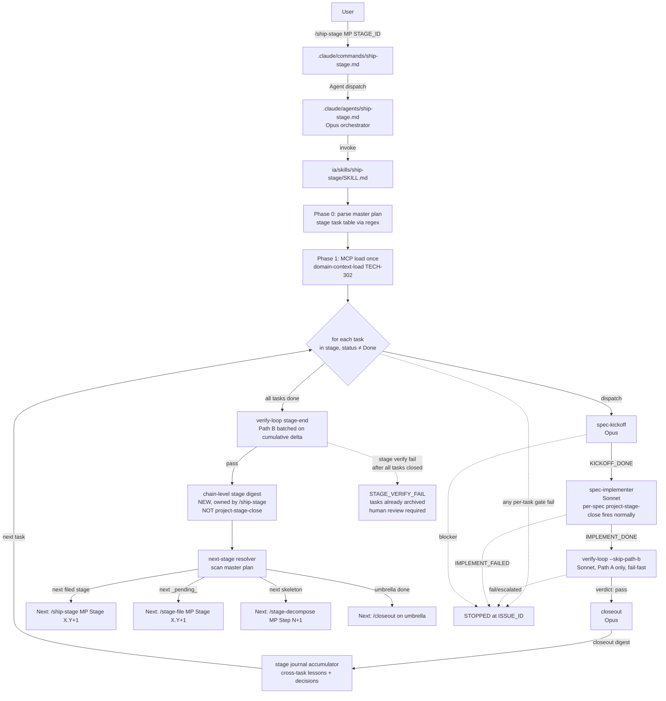

# `/ship-stage` — chain-shipping tasks of one master-plan stage — exploration (stub)

Status: draft exploration stub — pending `/design-explore docs/ship-stage-exploration.md` expansion.
Scope: feasibility, opportunity, effort analysis for a new `ship-stage` skill / subagent / slash command that chains `/ship` across every filed task row of one `Stage X.Y` inside a master plan (`ia/projects/{slug}-master-plan.md`) end-to-end and autonomously.
Out of scope: bulk shipping across multiple stages or across a whole master plan (`/ship-step`, `/ship-plan` — deferred); parallel shipping of tasks within a stage (tasks share files and invariants — sequential is load-bearing); new stage-decomposition or bulk-filing logic (that is `stage-decompose` / `stage-file`); umbrella close (`project-spec-close` unchanged — `project-stage-close` skill runs between and at end of chain).

## Context

Today's lifecycle has two scales of autonomous shipping:

- **Single issue:** `/ship {ISSUE_ID}` → `spec-kickoff → spec-implementer → verify-loop → closeout`, gated, sequential. `.claude/commands/ship.md` defines the pipeline. Output suggests next `claude-personal "/ship {NEXT_ISSUE_ID}"` resolved from the owning master plan.
- **No bulk scale above issue level.** A **Stage** in a master plan routinely holds 2–6 task rows (e.g. `citystats-overhaul-master-plan.md` Stage 1.1 = TECH-303 + TECH-304; Stage 1.3 = 4 tasks; Stage 2.1 = typically 2–4). User must paste the `Next: /ship {id}` line into a fresh session per task. Turnaround cost: one human-in-loop roundtrip per task; wasted orchestration cache; no stage-coherent autonomous run.

`/ship-stage` would close that gap: one dispatch drives every filed task row of `Stage X.Y` to closed state, then invokes the `project-stage-close` skill, and stops. The user pastes one command; returns to an advanced or fully-shipped stage with a single handoff line for the next stage.

**Relation to TECH-302** (release-rollout skill family refactor). TECH-302 Stage 2 ships `domain-context-load` + `term-anchor-verify` shared subskills and Stage 1 ships `progress-regen` + `cardinality-gate-check` + `surface-path-precheck`. `/ship-stage` is a natural downstream consumer — but scope-wise orthogonal:

- TECH-302 focuses on **rollout-family model-fit + componentization** (umbrella + 3 helpers). Its §2.2 Non-Goals already exclude lifecycle-subagent changes outside wiring. Folding `/ship-stage` in would violate §2.2 #2 and bloat scope beyond the audit-driven staged plan.
- However, `/ship-stage` SHOULD depend on TECH-302's Stage 1 subskills (cardinality check, progress regen) and Stage 2 shared MCP recipe (`domain-context-load`). Cleanest path: file `/ship-stage` as its own issue with `depends_on: TECH-302` at least at the Stage-1/2 level.

**Recommendation (to arbitrate in `/design-explore` interview):** new standalone issue (`FEAT-` or `TECH-`) rather than TECH-302 expansion. TECH-302 closes when its own 5 Phases land; `/ship-stage` lives as a separate row that can be staged / filed once TECH-302 Phase 2 is shipped.

## Motivating observations

1. **Task rows in a stage are cohesive by design.** Stages are defined by Exit criteria shared across tasks (see `citystats-overhaul-master-plan.md` §5.1 stage split). Tasks in one stage touch the same file surface, share invariants, and should be verified together — exactly the cohesion a chained shipper exploits.
2. **Verification is stage-granular already.** `project-stage-close` skill fires at the end of each non-final stage inside `spec-implementer`'s phase loop, and again between stages. A stage-chain shipper makes the boundary the natural halting point.
3. **Single-task `/ship` already scans the master plan for next task.** `ship.md` Step 0 resolves the owning master plan; final pipeline summary extracts `NEXT_ISSUE_ID` from the next non-Done task row. `/ship-stage` inherits that scan but filters to same-stage task rows only.
4. **Stage row state is already structured.** Task table columns `Task / Phase / Issue / Status / Intent` (see citystats-overhaul-master-plan.md lines 85–88) give a machine-readable list. Stage completion = all rows `Done` or `archived`.

## Approaches (to compare in `/design-explore` Phase 1)

### Approach A — Thin orchestrator command, reuses existing `/ship`

`.claude/commands/ship-stage.md` = thin dispatcher. Loop:

1. Read `{MASTER_PLAN_PATH} Stage X.Y` task table.
2. For each row with status ≠ `Done` / `archived` / `skipped` / `_pending_`: dispatch Agent `subagent_type: "ship"` (new subagent wrapping existing 4-stage pipeline) or call `/ship {ISSUE_ID}` equivalent inline.
3. Between tasks: re-read the task table to catch status flips written by prior `/ship` run.
4. After last task: invoke `project-stage-close` skill inline.
5. Emit `SHIP_STAGE {STAGE_ID}: PASSED | STOPPED at {ISSUE_ID}` summary with handoff to next stage (next non-decomposed stage → `/stage-decompose`; next filed stage → `/ship-stage`; umbrella done → `/closeout`).

Pros: minimal new surface area; inherits every `/ship` gate and caveman rule; trivially debuggable (same failure modes).  
Cons: spawns one Agent subprocess per task = high context overhead; no cross-task memoization of MCP context; task-to-task handoff is stateless.  
Effort: ~1 day. Mostly command authoring + one new `ship` subagent wrapping `.claude/commands/ship.md`.

### Approach B — Stateful chain subagent with cached MCP context

New `.claude/agents/ship-stage.md` (Opus dispatch, Sonnet work) owns the chain. Loads MCP context once per stage (`domain-context-load` subskill from TECH-302 Stage 2) and passes it to each `spec-kickoff → spec-implementer → verify-loop → closeout` sub-dispatch as pre-resolved input. Task-to-task state (journal entries, lessons-learned accumulator, compile-cache age) carried in-process.

Pros: much cheaper than Approach A at stage sizes ≥ 3 tasks; benefits most from TECH-302 shared subskills; can expose stage-level journal / progress signals.  
Cons: larger new surface; stateful failures harder to reason about; depends on TECH-302 Stage 2 (hard blocker).  
Effort: ~3–4 days. New subagent + new skill (`project-stage-implement`? — mirror `project-spec-implement`) + wiring.

### Approach C — Single-shot skill that expands inline (no subagent dispatch)

`ia/skills/ship-stage/SKILL.md` ran from caller context — no Agent dispatch, each task's four stages run inline in the caller. Effectively `/ship` × N inline.

Pros: simplest authoring; no model pin contention.  
Cons: blows caller context window on stages > 3 tasks; no Opus-vs-Sonnet split (whole chain runs at caller's model — usually Opus, expensive); no fresh-context guarantee per task (regressions already bitten us; see `ia/rules/orchestrator-vs-spec.md` lifecycle notes).

Effort: ~0.5 day.  
Likely rejected on cost + context grounds.

## Opportunities

- **Cache reuse across tasks.** TECH-302 Stage 2 `domain-context-load` returns `{glossary_anchors, router_domains, spec_sections, invariants}`. A stage chain loads it once; saves 4–6 MCP round trips per task × N tasks.
- **Stage-level lessons accumulation.** Each task's §10 Lessons Learned closes one issue at a time today. A chain could roll stage-shared lessons into a single `project-stage-close` digest instead of N per-issue closes polluting glossary / AGENTS / rules.
- **Stage-level verification batching.** `verify-loop` Path A/B runs currently restart per issue. A chain could run Path A once at stage end against the accumulated delta (task 1 + 2 + 3 fixes) instead of N times. Requires `verify-loop` to support a stage-scoped mode — non-trivial; flagged as open question.
- **Auto-redirect to `/stage-decompose` / `/ship-stage` for next stage.** Single handoff line, no manual master-plan scan.
- **Reduce `Next:` paste friction.** Single `/ship-stage` replaces N paste cycles on a stage with 4–6 tasks (blip, citystats-overhaul, zone-s-economy all fit this shape).

## Effort sketch (Approach A baseline)

| Surface | Work | Notes |
|---|---|---|
| `.claude/commands/ship-stage.md` | New — ~150 lines | Mirror `ship.md` shape; args `{MASTER_PLAN_PATH} {STAGE_ID}` (e.g. `Stage 1.2`). |
| `.claude/agents/ship.md` (optional) | New subagent wrapping existing `/ship` pipeline | Needed if Agent dispatch is the inner unit; alternatively inline sub-dispatch to each of the 4 stage subagents per task. |
| `ia/skills/ship-stage/SKILL.md` | Optional — thin body if command does the work | Only needed if logic grows beyond ~100 lines. |
| Handoff contract | New row in `docs/agent-lifecycle.md` §Surface map | `/ship-stage` entry between `/release-rollout` and `/ship`. |
| Master-plan task-table parser | Reuse existing regex from `ship.md` Step 0 | Filter to `Stage {X.Y}` sub-section. |
| `project-stage-close` invocation | Already exists as skill | Inline call between tasks and at stage end (already fired by `spec-implementer` per `ship.md`). Verify no double-invocation. |
| Docs / glossary | Update `CLAUDE.md` §3, `docs/agent-lifecycle.md`, glossary (new term `/ship-stage` dispatcher?) | Minimal. |

Baseline Approach A effort: ~1 dev day (authoring + smoke test against citystats-overhaul Stage 1.1 once TECH-303/304 are ready to ship together).

Dependencies on TECH-302:
- Approach A: none hard. Can ship independently. Benefits marginally from `progress-regen` at stage close.
- Approach B: **hard-depends on TECH-302 Stage 2** (`domain-context-load`, `term-anchor-verify`). Do not start Approach B until TECH-302 Phase 2 lands.

## Risks / blockers

1. **Double-invocation of `project-stage-close`.** `spec-implementer` already invokes it inline at end of each non-final stage (per `ship.md` Stage 2 boilerplate). `/ship-stage` wrapping the last task must detect whether stage close already ran — else duplicate stage-close writes.
2. **Task-row status race.** If task 2 edits the master plan task table mid-flight (via closeout), task 3's read must see the flipped state. Sequential gating already enforces this, but the parser must re-read per iteration.
3. **Stop-on-failure semantics.** `/ship` stops on failure. A stage chain must decide: stop-on-first-failure (default) vs continue-if-independent (never — tasks share stage exit criteria). Default to stop-on-first; no continue flag in v1.
4. **Backlog row removal mid-chain.** Closeout archives BACKLOG row after each `/ship`. A chain must reconcile the master-plan task table against a possibly-empty BACKLOG row (closeout purges). Already handled by closeout migrating row state; verify in smoke.
5. **MAX_ITERATIONS accumulation.** Each task's `verify-loop` uses `MAX_ITERATIONS=2`. Over a 4-task stage, fix iterations can cascade. Consider exposing `--max-iterations-per-task` flag for debuggability; default unchanged.
6. **Stage task-table schema drift.** If master-plan format evolves, `/ship-stage` parser breaks. Mitigation: defer parsing to `mcp__territory-ia__spec_section` once MCP audit (`docs/mcp-lifecycle-tools-opus-4-7-audit-exploration.md`) adds a stage-table slice tool.
7. **Glossary: new canonical term needed.** `/ship-stage` = "stage chain shipper" — rollout glossary + `ia/specs/glossary.md` anchor.

## Issue-routing recommendation

**File as new standalone issue, NOT expansion of TECH-302.**

- Preferred prefix: `FEAT-` (user-facing lifecycle capability) or `TECH-` (IA infrastructure). Lean `FEAT-` because it reduces developer friction directly (a paste cycle per task).
- Depends on TECH-302 Stage 2 only if Approach B selected. Approach A has no hard dependency.
- Add row: depends_on TECH-302 (Approach B) OR no dependency (Approach A); related: TECH-302.
- Umbrella fit: this is a repo-wide lifecycle capability, not tied to a specific domain master plan. File under `web-platform-master-plan.md` is wrong (that plan is web/ only). Better: standalone single-issue path (`/project-new → /kickoff → /implement → /verify-loop → /closeout`), OR tuck under a future "agent-lifecycle" master plan if one emerges.

Rationale: TECH-302 §2.2 Non-Goal #2 already excludes lifecycle-subagent changes outside wiring. `/ship-stage` creates new subagents + skills → clear TECH-302 scope violation. Keeping them separate:
- preserves TECH-302's audit-driven scope (5 Phases, staged, smoke-testable)
- allows `/ship-stage` to depend cleanly on TECH-302 deliverables
- gives `/ship-stage` its own Decision Log and test contract independent of rollout-family refactor

## Open questions (resolve in `/design-explore`)

1. **Approach A vs B.** Is the cache-reuse / shared-context win (Approach B) worth the 3× effort and TECH-302 Phase-2 hard dependency? Pick A for v1 and upgrade later, or block on TECH-302 and do B properly?
2. **Parallel task shipping within a stage.** Forbidden for v1 (tasks share files). But are there stages where independence holds (e.g. pure doc edits across disjoint glossary rows)? If so, worth a `--parallel-safe` opt-in flag, or defer entirely?
3. **Stop vs continue on failure.** Stop-on-first-failure is the only defensible default. Confirm no continue-on-error flag desired.
4. **Stage close de-duplication.** Single source of truth for when `project-stage-close` runs — should `/ship-stage` inhibit `spec-implementer`'s inline invocation for the final task, or let it run and no-op the chain's outer close? Impacts skill contract.
5. **Handoff to next stage.** After `/ship-stage` PASSED, emit `Next: /ship-stage {MASTER_PLAN} {NEXT_STAGE}` if next stage is already filed, OR `Next: /stage-file {MASTER_PLAN} {NEXT_STAGE}` if next stage is `_pending_`, OR `Next: /stage-decompose {MASTER_PLAN} Step N` if next step is a skeleton. Wire the same scan as `ship.md`'s Step 0 but at stage granularity.
6. **Verification batching (Approach B).** Can `verify-loop` support a stage-delta mode (verify cumulative delta once at stage end) vs per-task? If not, is it worth filing a separate issue to add it, given the cost saving per stage run?
7. **Master-plan task-table schema vs MCP slice tool.** Do we inline a regex parser (fragile) or wait for a `spec_stage_table` MCP tool (clean, but blocks on MCP audit)?
8. **Scope of `/ship-step` / `/ship-plan` follow-ups.** If `/ship-stage` ships cleanly, next logical extensions (step-chain, plan-chain) — file now as parked BACKLOG row, or defer until actual demand appears?

## Next step

Run `/design-explore docs/ship-stage-exploration.md` to:

- interview user on open questions 1–8 (especially A-vs-B and stage close de-dup)
- compare Approaches A / B / C with weighted criteria (effort, dependency cost, cache reuse, robustness)
- select an approach and expand to Architecture + Subsystem Impact + Implementation Points + Examples
- persist `## Design Expansion` block back to this doc

**Interview format — POLL / MULTIPLE-CHOICE, not open-ended.**

The `/design-explore` Phase 0.5 interview on this doc MUST use a poll-style format: every question presents 2–5 labeled options (A / B / C / …) with a one-line tradeoff per option, plus an explicit "other — specify" escape hatch. Rationale: the 8 open questions above already have candidate answers sketched inline (e.g. Q1 = A vs B vs "start A upgrade later"; Q3 = stop-on-first vs continue-on-error; Q4 = inhibit inner close vs no-op outer close). Open-ended phrasing forces the user to re-derive these from scratch every time and loses the comparative framing already surfaced in this stub. Poll phrasing:

- keeps the user's cognitive load low (pick a letter),
- lets the user override with "other" when none of the options fit,
- makes the answers machine-parseable for the subsequent `## Design Expansion` block (recorded as `Q1 → B`, `Q3 → A`, etc.),
- preserves the one-question-per-turn rule from `design-explore` Phase 0.5 (poll per turn, not a batch of polls).

Example shape per question:

> **Q1 — Approach selection.**  
> A. Approach A (thin orchestrator, ~1 day, no TECH-302 dependency). Ship v1 fast; revisit caching later.  
> B. Approach B (stateful chain, ~3–4 days, hard-depends on TECH-302 Stage 2). Best long-term shape; blocks on TECH-302.  
> C. Start A now, plan B upgrade as separate issue once TECH-302 lands.  
> D. Other — specify.

`/design-explore` Phase 0.5 should poll through the 8 open questions in priority order (Approach selection first; stage-close de-dup second; handoff next-stage wiring third; the rest as needed). Skip polls whose answers are already implied by earlier poll outcomes.

After `/design-explore` completes, file one new BACKLOG row via `/project-new` (single issue path) with `depends_on: TECH-302` (Approach B) or standalone (Approach A). Do NOT promote to master plan unless open-question answers surface more than 2 decision surfaces — single-issue path fits expected scope.

---

## Design Expansion

### Chosen Approach

**Approach B — Stateful chain subagent with cached MCP context.** Selected over A (thin orchestrator) and C (inline skill) per user interview answers Q1–Q5. Rationale: stage sizes routinely 2–6 tasks; B amortizes MCP context load across the chain (one `domain-context-load` per stage vs N × 4–6 round trips in A), enables batched Path B verify at stage boundary (Q4=C hybrid), and composes cleanly with TECH-302 Stage 2 shared subskills. 3–4 day effort vs A's 1 day justified by cache-reuse + stage-level journal rollup, both of which are blocking prerequisites for the `/ship-step` / `/ship-plan` follow-ups deferred in Q8. Hard-depends on TECH-302 Phase 2 — do not start until those subskills land.

**Interview answer snapshot:** Q1=B (stateful chain); Q2=A (inhibit flag — re-interpreted after Phase 8 review: no double-invocation exists because per-spec `project-stage-close` and chain-level stage digest are separate scopes — see Review Notes); Q3=A (full auto-resolve next stage across all 4 cases); Q4=C (hybrid verify — Path A per-task fail-fast, Path B batched at stage end via `--skip-path-b` flag); Q5=C (hybrid parser — narrow regex v1 + follow-up issue for MCP `spec_stage_table` slice).

### Architecture



**Entry:** `/ship-stage {MASTER_PLAN_PATH} {STAGE_ID}`.
**Exit (success):** `SHIP_STAGE {STAGE_ID}: PASSED` + one handoff line.
**Exit (per-task failure):** `SHIP_STAGE {STAGE_ID}: STOPPED at {ISSUE_ID} — {gate}: {reason}` (mid-chain halt).
**Exit (stage-verify failure):** `SHIP_STAGE {STAGE_ID}: STAGE_VERIFY_FAIL` (all tasks closed, batched Path B failed — no rollback, human review).

### Subsystem Impact

| Subsystem | Impact | Invariants flagged |
|---|---|---|
| `docs/agent-lifecycle.md` §2 Stage→surface matrix | Add new row `/ship-stage` between 7b (`/testmode`) and 8 (`project-stage-close`). | None (tooling). |
| `ia/rules/agent-lifecycle.md` Surface map + flow | Add `/ship-stage` row + chain semantics paragraph. | None. |
| `.claude/commands/ship.md` | No change — inner per-task unit preserved. | None. |
| `.claude/agents/verify-loop.md` + `ia/skills/verify-loop/SKILL.md` | Add `--skip-path-b` flag; Path A stays mandatory; JSON verdict records `path_b: skipped_batched`. | Verify-loop contract change — file as sub-task of ship-stage issue. |
| `.claude/agents/spec-implementer.md` | No change after Phase 8 review correction — per-spec `project-stage-close` fires normally. | None. |
| `ia/skills/project-stage-close/SKILL.md` | No change — per-spec skill unaffected. Chain-level digest is a NEW concept, not a call to this skill. | None. |
| `ia/specs/glossary.md` | Add term `ship-stage dispatcher` (or `stage chain shipper`) + `chain-level stage digest`. | None. |
| `CLAUDE.md` §3 | Add `/ship-stage` to slash-command row. | None. |
| `AGENTS.md` §2 | Add lifecycle entry. | None. |
| TECH-302 Stage 2 subskills (`domain-context-load`, `term-anchor-verify`) | Hard dependency; consume as shared MCP recipe. | **Blocker** — do not start Phase 4 authoring until TECH-302 Phase 2 ships. |
| MCP lifecycle audit follow-up (`spec_stage_table` slice) | Deferred — file follow-up issue with `depends_on` MCP audit. Parser v1 is regex. | None. |

**Runtime C# invariants:** none — tooling/pipeline only. `invariants_summary` skipped per Phase 5 gate.

### Implementation Points

**Phase 1 — Prerequisites (hard gate on TECH-302 Phase 2)**
- [ ] Verify TECH-302 Stage 2 closed: `domain-context-load` + `term-anchor-verify` subskills callable.
- [ ] Confirm MCP `spec_stage_table` slice tool status — not required v1; file follow-up issue `depends_on` MCP lifecycle audit.

**Phase 2 — Flag plumbing (minimal, isolated)**
- [ ] Add `--skip-path-b` flag to `verify-loop` agent + skill. Default off. On: Path A fail-fast runs; Path B skipped; JSON verdict field records `path_b: skipped_batched`.
- [ ] No `--inhibit-stage-close` flag needed (Phase 8 resolution) — per-spec `project-stage-close` and chain-level stage digest are distinct scopes.
- [ ] Smoke test: `/ship TECH-xxx --skip-path-b` single task → Path A runs, Path B reports skipped.

**Phase 3 — Parser + resolver**
- [ ] Author narrow regex parser: extracts `{task-id, status}` rows under `## Stage X.Y` or `### Stage X.Y` headers (both depths — check citystats-overhaul + multi-scale master plans for header variance). Fails loud on schema drift.
- [ ] Author next-stage resolver: scans master plan post-close, returns one of `{next_filed_stage, next_pending_stage, next_skeleton_step, umbrella_done}`; emits correct command per case.
- [ ] Add parser test fixtures against 2-3 existing master plans (`citystats-overhaul`, `multi-scale`, `zone-economy` or similar).

**Phase 4 — Chain subagent + skill**
- [ ] Create `.claude/agents/ship-stage.md` (Opus orchestrator, caveman directive, mission prompt).
- [ ] Create `.claude/commands/ship-stage.md` dispatcher.
- [ ] Create `ia/skills/ship-stage/SKILL.md` body: phased procedure (parse → context-load → task-loop → batched verify → chain digest → resolver).
- [ ] Wire `domain-context-load` subskill call at Phase 1 start; pass cached payload to per-task inner dispatches. **Note:** when [`docs/mcp-lifecycle-tools-opus-4-7-audit-exploration.md`](mcp-lifecycle-tools-opus-4-7-audit-exploration.md) Phase P3 `issue_context_bundle` ships (composite bundle = `backlog_issue` + routed specs + invariants + journal), Phase 1 context-load MAY migrate to `issue_context_bundle` — the sequencing dependency is: **MCP lifecycle-tools-audit Phase P3 lands before `/ship-stage` implementation starts** for the migration to apply; otherwise `domain-context-load` (TECH-302 Stage 2) remains the context vehicle. File follow-up issue linking both when `/ship-stage` issue is opened.
- [ ] Wire stage journal accumulator (in-process) — collect per-task lessons/decisions for chain digest.

**Phase 5 — Chain-level stage digest + handoff**
- [ ] Implement chain-level stage digest: aggregates cross-task lessons, decisions, verify-loop iteration counts. Distinct from per-spec `project-stage-close` which still fires inside each inner `spec-implementer`.
- [ ] Wire handoff line emission: `Next: claude-personal "/{resolved-command}"` with one of 4 forms per Phase 3 resolver.
- [ ] STAGE_VERIFY_FAIL handling: on batched Path B failure (all tasks closed), emit digest with failure note + human-review directive; no rollback.

**Phase 6 — Docs + glossary**
- [ ] Update `docs/agent-lifecycle.md` §2 (add `/ship-stage` row).
- [ ] Update `ia/rules/agent-lifecycle.md` Surface map.
- [ ] Update `CLAUDE.md` §3 (commands table).
- [ ] Update `AGENTS.md` §2 (lifecycle entry).
- [ ] Add glossary row `ia/specs/glossary.md` for `ship-stage dispatcher` + `chain-level stage digest`.

**Phase 7 — Smoke verification**
- [ ] Dry run against a real stage (identify non-shipped stage with ≥2 open tasks at implementation time — likely `citystats-overhaul-master-plan.md` Stage 1.1 TECH-303 + TECH-304 if still open).
- [ ] Verify single stage-digest fire at chain end (not duplicated with per-spec stage-close).
- [ ] Verify batched Path B runs once at stage end against cumulative delta.
- [ ] Verify handoff resolver across all 4 cases (filed / pending / skeleton / umbrella-done).
- [ ] File follow-up issue: `spec_stage_table` MCP slice tool migration (`depends_on` MCP lifecycle audit).

**Deferred / out of scope:**
- Parallel task dispatch within a stage (tasks share files/invariants — sequential is load-bearing).
- `/ship-step` / `/ship-plan` bulk-above-stage dispatchers.
- Stage-delta **native mode** in `verify-loop` (a dedicated `--stage-delta` flag or internal batching within `verify-loop` itself) — external batching via `--skip-path-b` + chain-level stage digest (Phase 5, in-scope) suffices v1. Note: Phase 5's batched Path B is NOT stage-delta native mode — it is `/ship-stage` orchestrating an additional verify-loop run at stage end; no changes to `verify-loop` internals beyond Phase 2's `--skip-path-b` flag. These are distinct scopes; no contradiction between Phase 2 and Phase 5.
- Continue-on-error flag (stop-on-first-failure is only defensible default per §3 Risks).
- MCP `spec_stage_table` parser migration (follow-up issue).
- Postgres persistence of chain-level stage digest (follow-up, mirror `project_spec_journal_persist`).
- `--no-batch-path-b` negation for debugging (defer v2).

### Examples

**Example 1 — Typical stage input (2 tasks):**
```
claude-personal "/ship-stage ia/projects/citystats-overhaul-master-plan.md Stage 1.1"
```

Master plan Stage 1.1 table:
```
| Task | Phase | Issue | Status | Intent |
|------|-------|-------|--------|--------|
| Registry write path | 1 | TECH-303 | Filed | ... |
| Registry read path  | 2 | TECH-304 | Filed | ... |
```

**Example 1 — Success output:**
```
SHIP_STAGE Stage 1.1: PASSED
  master plan : Citystats Overhaul
  tasks shipped:
    TECH-303: kickoff ✓ | implement ✓ | verify Path A ✓ | closeout ✓
    TECH-304: kickoff ✓ | implement ✓ | verify Path A ✓ | closeout ✓
  batched Path B verify: pass (cumulative delta, 2 tasks)
  per-spec stage-close: fired 2× (one per inner spec, normal)
  chain-level stage digest: 3 lessons + 2 decisions rolled up

Next: claude-personal "/ship-stage ia/projects/citystats-overhaul-master-plan.md Stage 1.2"
```

**Example 2 — Edge case: mid-chain verify-loop escalation:**
```
SHIP_STAGE Stage 1.1: STOPPED at TECH-304 — verify-loop verdict: escalated (MAX_ITERATIONS=2 exceeded)
  tasks shipped:
    TECH-303: ✓
    TECH-304: kickoff ✓ | implement ✓ | verify ✗ (escalated)
  batched Path B: NOT RUN (chain halted)
  chain-level digest: NOT EMITTED (chain incomplete)
  action: human review TECH-304 verify output; resume via /ship TECH-304 after fix, then re-run /ship-stage
```

**Example 3 — Edge case: umbrella done (next-stage resolver):**
```
SHIP_STAGE Stage 5.3: PASSED (last stage of last step)
  ...
  umbrella status: all steps Done
Next: claude-personal "/closeout {UMBRELLA_ISSUE_ID}"
```

**Example 4 — Edge case: parser schema drift (fail-loud):**
```
SHIP_STAGE Stage 2.1: STOPPED at parser — schema mismatch
  expected columns: Task | Phase | Issue | Status | Intent
  found columns:    Task | Issue | Status
  resolution: master plan Stage 2.1 task table missing columns; fix format OR
              wait for spec_stage_table MCP slice tool (follow-up issue, MCP lifecycle audit)
```

**Example 5 — Edge case: batched Path B fail after all tasks closed:**
```
SHIP_STAGE Stage 1.1: STAGE_VERIFY_FAIL
  tasks shipped: TECH-303 ✓ | TECH-304 ✓ (both closed, archived)
  batched Path B verify: FAIL (regression at cumulative delta)
  rollback: NONE (issues already archived; BACKLOG rows purged)
  chain-level digest: emitted with failure note
  action: human review Path B logs; file new BUG- for regression if reproducible
Next: human review required before advancing stage
```

### Review Notes

**BLOCKING items resolved (2):**
1. Phase 8 identified flag-contract ambiguity in Q2=A interpretation — resolved by distinguishing per-spec `project-stage-close` (unchanged, fires per inner spec) from chain-level stage digest (NEW, owned by `/ship-stage`). No inhibit flag needed. Phases 3, 5, 6 updated to reflect correct scopes.
2. Phase 8 identified stage-close ownership race — resolved by same re-scoping: outer chain never replaces inner per-spec close, only adds a new cross-task digest.

**NON-BLOCKING items carried:**
- Parser header-depth variance: check for `##` vs `###` Stage headers across existing master plans; add fixture-based test during Phase 3. (Added to Phase 3 checklist.)
- Mermaid diagram failure path for batched Path B post-closure: added `STAGE_VERIFY_FAIL` terminal node distinct from mid-chain `STOPPED`. (Added to diagram + Example 5.)
- Smoke target freshness: confirm chosen stage still open at implementation time. (Added to Phase 7 checklist.)

**SUGGESTIONS carried:**
- Postgres persistence of chain-level stage digest (mirror `project_spec_journal_persist`) — deferred to follow-up.
- `--no-batch-path-b` negation for debugging — deferred v2.

### Expansion metadata

- Date: 2026-04-17
- Model: claude-opus-4-7
- Approach selected: B (stateful chain subagent with cached MCP context)
- Blocking items resolved: 2
