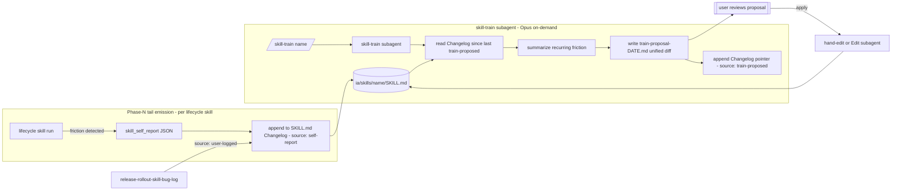

# `skill-train` — post-run skill self-improvement loop — exploration (stub)

Status: draft exploration stub — pending `/design-explore docs/skill-training-exploration.md` expansion.
Scope: feasibility + shape of a mechanism by which lifecycle skills (`design-explore`, `master-plan-new`, `master-plan-extend`, `stage-decompose`, `stage-file`, `project-new`, `project-spec-kickoff`, `project-spec-implement`, `project-spec-close`, `project-stage-close`, `release-rollout`*) detect their own friction / drift after each run, aggregate the signal, and propose durable edits to their own `SKILL.md` body — gated by user approval.
Out of scope: fine-tuning the underlying model; cross-session reinforcement learning; auto-apply patches without user gate; rewriting subagent `.claude/agents/*.md` bodies (orchestrator-level — separate concern); training against real-user telemetry beyond what the agent itself observes in one run; evaluator-model (judge) calls.

## Context

Today's repo has **partial** self-improvement infrastructure:

- **`release-rollout-skill-bug-log`** skill — dual-writes a bug entry to per-skill `## Changelog` section + tracker aggregator row. Source of truth = per-skill Changelog. Only fires when a human or rollout subagent explicitly logs a gap.
- **Per-skill `## Changelog` section** — exists on most lifecycle skills. Manual append-only record of known issues + fixes.
- **`ia/skills/README.md`** — index, not a feedback channel.

**Gaps** (what is missing to call this a "training" loop):

1. **No auto-detect.** Skills don't emit any structured self-report after a run. A guardrail miss, a user correction, a Phase deviation, an unresolved `STOP` — all invisible to any downstream aggregator unless the user remembers to invoke `release-rollout-skill-bug-log`.
2. **No aggregate view.** No `ia/state/skill-training-index.json` equivalent — no "which skills have accumulated the most friction this month?" ranking.
3. **No patch proposal step.** `release-rollout-skill-bug-log` explicitly forbids fixing the skill: *"Do NOT fix the skill — authoring fix is out of scope."* Which is fine for the logger, but leaves the fix-proposal loop entirely manual.
4. **No retrospective trigger.** No cadence (per-N-runs, weekly, on-demand) at which a skill's accumulated Changelog gets read and condensed into a proposed SKILL.md body edit.
5. **No cross-skill policy.** Each skill's §Changelog is isolated. Patterns that repeat across skills (e.g. "user frequently corrects `Phase 0` validation output") don't bubble up to a rule-level fix (`ia/rules/*.md`).

`skill-train` would close gap 3–5 (detect + aggregate + propose). Gap 1 (auto-emit self-report) is a lighter change: extend every lifecycle skill's Phase N (handoff) to also emit a `skill_self_report` JSON block when friction was observed.

## Motivating observations

1. **Subagents already know when they struggled.** A skill that hits its own `STOP` guardrail, re-reads a file after a user correction, or Phase-switches out of order — that signal is already in-context. Capturing it at handoff time is cheap (one JSON block per invocation), lossless (no post-hoc inference), and rides the caveman-default output budget.
2. **The Changelog section is already the right home.** Every lifecycle skill has (or will have — `release-rollout-skill-bug-log` Phase 0 injects if missing) a `## Changelog` tail. Self-report entries can be appended under the same header, tagged `source: self-report` vs `source: user-logged` vs `source: train-proposed`.
3. **Patch proposal = markdown diff, not code diff.** Skills are `SKILL.md` prose + a few YAML frontmatter fields. Proposing a patch = proposing a text edit against sections the skill owns (Phase sequence, Guardrails, Seed prompt). Low-stakes compared to code patches; easy to gate.
4. **User-gate is acceptable friction.** This is not hot-path automation. Running `skill-train` weekly (or on-demand when a skill feels "stale") is plenty. Auto-apply without review would be scope creep and risks regressing skills that work fine.
5. **The 6 lifecycle skills + 4 rollout-family skills** are the natural pilot set. Ship `skill-train` against those ~10 skills first; extend to shared subskills (`domain-context-load`, `term-anchor-verify`, `cardinality-gate-check`) after one real retrospective cycle.

\* `release-rollout` is an orchestrator — its inner skills (`release-rollout-enumerate`, `release-rollout-track`, `release-rollout-skill-bug-log`, and the proposed `release-rollout-repo-sweep`, `rollout-row-state`) are the actual training targets.

## Approaches (to compare in `/design-explore` Phase 1)

### Approach A — Two-skill split: self-report + train

Two independent units:

- **Phase N tail** added to every lifecycle skill's handoff: emit a `skill_self_report` JSON block (schema: `{skill, friction_points[], guardrail_hits[], user_corrections[], phase_deviations[], severity}`). Appended as a fresh `## Changelog` entry `source: self-report` in the same run. No aggregation, no proposal.
- **`ia/skills/skill-train/SKILL.md`** (Opus) — invoked on-demand or by cron (`/loop`). Reads one target skill's `## Changelog` (last N entries OR since last `train-proposed` entry). Summarizes recurring friction. Proposes a markdown patch against Phase sequence / Guardrails / Seed prompt. Writes proposal as a new Changelog entry `source: train-proposed` + a sibling file `ia/skills/{SKILL_NAME}/train-proposal-{YYYY-MM-DD}.md` with the actual diff. User reviews, applies (hand-edit or fresh Edit subagent), commits.

Pros: clean separation (detect vs. propose); self-report piggy-backs on existing handoff surface; no new subagent required for the detect step.
Cons: two-step authoring; self-report schema needs discipline to keep consistent across 10 skills; recurring-friction detection requires reading the last N Changelog entries intelligently (LLM summarization — cheap but not free).
Effort: ~1 dev day for `skill-train` skill + ~2 hours per lifecycle skill to wire the Phase N self-report tail × 10 skills = ~2 additional days.

### Approach B — Single `skill-train` that does both (opt-in per skill)

One skill. Reads the target skill's Changelog + the git log of its SKILL.md file + the most recent N handoff messages (if persisted anywhere). Infers friction from that history instead of requiring each skill to emit a self-report.

Pros: zero per-skill wiring; lighter on the skills themselves.
Cons: inference is lossier than structured emission (the JSON self-report captures what the skill *knew* it struggled with; git log + Changelog only captures what was already logged); no way to capture "user corrected me silently" if the user didn't log it.
Effort: ~1 dev day for `skill-train` + no per-skill wiring. Fastest path but weakest signal.

### Approach C — Continuous auto-propose on every run (Phase N tail)

Every lifecycle skill, at handoff, not only emits `skill_self_report` but ALSO runs a mini patch-proposal pass inline. If threshold tripped (e.g. ≥2 guardrail hits this run OR ≥1 user correction) → emit patch proposal in same handoff.

Pros: shortest feedback loop; no batched cron / on-demand step.
Cons: blows per-run latency + token cost; proposals from a single run are noisy (one bad run doesn't mean the skill needs editing); mixes "this run's deliverable" with "this skill's evolution" — violates single-responsibility.
Likely rejected on signal-quality grounds. Include for completeness.

## Opportunities

- **Cross-skill pain index.** `ia/state/skill-training-index.json` — rolling count per `{skill, friction_type}` from all self-reports. Simple ranking = "top 3 skills with most friction this month". Visible on the dashboard under `/web/app/dashboard/...` (future).
- **Rule promotion.** Friction that repeats across ≥3 skills is no longer a skill problem — it's a rule-level fix. `skill-train` Phase N: if `{friction_type}` appears in ≥3 skills' Changelogs, flag to user with a suggested `ia/rules/*.md` edit instead of a per-skill patch.
- **Closing the gap with `release-rollout-skill-bug-log`.** `release-rollout-skill-bug-log` becomes one of many producers feeding the same `## Changelog` source-of-truth. `skill-train` consumes the union. No migration needed; just a `source:` tag.
- **Post-mortem digest on `/closeout`.** Optional: `/closeout` dispatches `skill-train` in pass-through mode for every lifecycle skill touched by the issue being closed — "which skills had friction on this issue?" appended to `BACKLOG-ARCHIVE.md` row (or to the closeout handoff).
- **Seed prompt refinement.** The Seed prompt block at the tail of most SKILL.md is exactly the text a subagent pastes into itself. Friction often shows up there first (user adds missing input fields). `skill-train` could auto-propose Seed prompt deltas with highest signal-to-patch ratio.

## Effort sketch (Approach A baseline)

| Surface | Work | Notes |
|---|---|---|
| `ia/skills/skill-train/SKILL.md` | New — ~150 lines | Phase 0 validate target; Phase 1 read last N Changelog entries; Phase 2 summarize recurring friction; Phase 3 emit patch proposal file + Changelog entry; Phase 4 handoff. |
| `ia/skills/{each lifecycle skill}/SKILL.md` Phase N tail | ~5-line addition per skill × ~10 skills | Add `skill_self_report` JSON block emission at handoff. Schema shared — define once in `skill-train` skill body. |
| `ia/state/skill-training-index.json` | New file — seed empty | Rolling aggregator. Updated by self-report emitters (append) + `skill-train` on-demand roll-up. |
| `.claude/commands/skill-train.md` | New — thin dispatcher | Args: `{SKILL_NAME}` (required), `--since {YYYY-MM-DD}` (optional), `--promote-to-rule` (optional flag). |
| `.claude/agents/skill-train.md` | New Opus subagent | Mirrors `release-rollout-skill-bug-log` shape but with patch-proposal scope. |
| `docs/agent-lifecycle.md` §Surface map | New row | `/skill-train` sits outside main lifecycle flow — retrospective-only. |
| `ia/specs/glossary.md` | New rows | `skill self-report`, `skill training`, `patch proposal (skill)` — anchor terms. |
| Docs | `CLAUDE.md` §3 + `AGENTS.md` | One-paragraph intro to the loop. |

Baseline Approach A effort: ~3 dev days total (1 day `skill-train` + 2 days wiring 10 skills' self-report tails + docs).

## Risks / blockers

1. **Self-report schema drift.** 10 skills emitting JSON with a slightly different shape = useless aggregator. Mitigation: define schema once in `skill-train` SKILL.md, link from every lifecycle skill.
2. **Changelog bloat.** Every run appending a self-report entry = §Changelog explodes. Mitigation: emit self-report entry ONLY when friction detected (threshold: ≥1 guardrail hit OR ≥1 user correction OR Phase deviation). Clean runs stay silent.
3. **Proposed patches regress working skills.** `skill-train` proposals are LLM-generated markdown edits. Without a validation pass, they could weaken Phase sequence or remove load-bearing guardrails. Mitigation: proposal file is review-only; user-gate is mandatory; consider a lightweight diff-lint (e.g. "does the proposal remove a line matching `Do NOT`?") before surfacing.
4. **Interaction with `release-rollout-skill-bug-log`.** Two producers writing the same section. Mitigation: both use the same Changelog entry shape, with `source:` tag distinguishing. No format conflict.
5. **Where does the patch actually get applied?** `skill-train` explicitly does NOT apply — it proposes. Next-step surface = user hand-edit OR fresh Edit-scoped subagent. Need clear handoff language so the chain doesn't dead-end.
6. **Opus cost at 10-skill batch.** If user runs `/skill-train --all` weekly, reading 10 Changelogs + proposing 10 patches = non-trivial Opus tokens. Mitigation: default to one-skill-at-a-time; `--all` is a flag with an explicit cost warning.
7. **Friction-type taxonomy.** "Guardrail hit" vs "user correction" vs "Phase deviation" vs "missing input" — if the taxonomy is too loose, aggregation is noise. Mitigation: start with 4 fixed types; expand only after one real retrospective cycle surfaces a gap.
8. **Skills that are themselves subagents.** `release-rollout`, `closeout`, `project-new` run as Agent-tool dispatched subagents in fresh context. Their self-report has to persist BACK to the parent context OR directly to disk. Parent-context return is fragile; disk-write is simpler. Pick disk-write.

## Open questions (resolve in `/design-explore` — POLL format)

1. **Approach A vs B vs C.** Two-skill split (A) is the default recommendation — highest signal, moderate effort. B is cheaper but lossier. C is rejected on signal-quality grounds. Confirm A, or surface a reason for B.
2. **Per-skill wiring — opt-in vs opt-out.** All ~10 lifecycle skills get the Phase N self-report tail by default (opt-out)? Or does each skill explicitly declare `self_report: enabled` in frontmatter (opt-in)? Opt-out = faster coverage; opt-in = safer rollout.
3. **Cadence.** `/skill-train {name}` on-demand only, OR scheduled via `/loop` (weekly)? On-demand is simpler; scheduled catches drift earlier.
4. **Threshold for emitting self-report.** "Friction detected" trigger = ≥1 guardrail hit? ≥1 user correction? Or explicit Phase deviation only? Tighter threshold = cleaner Changelog, weaker signal.
5. **Patch proposal format.** Inline in Changelog entry (easy to read, hard to apply) OR sibling file `train-proposal-{YYYY-MM-DD}.md` with a unified diff (easy to apply, one-more-file-per-skill)? Approach A leans toward sibling file; confirm.
6. **Auto-apply gate.** Under what conditions (if any) is auto-apply acceptable? Plausible answer: never in v1. Reconfirm.
7. **Rule-level promotion.** Should `skill-train` proactively suggest a rule-level fix (new `ia/rules/*.md` entry) when friction pattern crosses ≥3 skills? Or strictly skill-level v1 and rule-level deferred?
8. **Scope of "lifecycle skills".** 10 skills = (`design-explore`, `master-plan-new`, `master-plan-extend`, `stage-decompose`, `stage-file`, `project-new`, `project-spec-kickoff`, `project-spec-implement`, `project-stage-close`, `project-spec-close`). Include shared subskills (`domain-context-load`, `term-anchor-verify`, `cardinality-gate-check`, `surface-path-precheck`, `progress-regen`)? Or gate-1 on the core 10, gate-2 on subskills?
9. **Interaction with `release-rollout-skill-bug-log`.** Keep both (rollout-context bug logging stays first-class; `skill-train` is general-purpose retrospective)? Or deprecate the logger and fold its role into `skill-train`? Keep both is the low-risk answer.
10. **State file location.** `ia/state/skill-training-index.json` OR new `ia/state/skills/` dir with per-skill files? Single file is simpler; per-skill is more git-friendly (fewer merge conflicts on high-activity skills).

## Issue-routing recommendation

**File as new standalone issue.** Likely `TECH-` (IA infrastructure — the skill system itself). Candidate umbrella: none exists today for agent-lifecycle meta-work. Options:

- Standalone single-issue path: `/project-new → /kickoff → /implement → /verify-loop → /closeout`. Works if scope stays at ~3 dev days.
- New umbrella master plan: `ia/projects/skill-lifecycle-master-plan.md` — would house `skill-train`, future `skill-lint`, future `skill-promote-to-rule`. Only worth authoring if ≥3 skill-meta issues are on the horizon.

Recommendation: **standalone single issue for v1**; revisit umbrella if a second skill-meta issue appears.

Depends on: none hard. Benefits from TECH-302's `domain-context-load` (for reading spec sections efficiently) but not blocked by it.

Related: `release-rollout-skill-bug-log` (sibling producer).

## Next step

Run `/design-explore docs/skill-training-exploration.md` to:

- interview user on open questions 1–10 (poll format — every question has labeled A/B/C options with a one-line tradeoff + "other — specify" escape)
- compare Approaches A / B / C with weighted criteria (signal quality, effort, per-skill wiring cost, user-gate friction)
- select an approach and expand to Architecture + Subsystem Impact + Implementation Points + Examples
- persist `## Design Expansion` block back to this doc

Subagent review (post-expansion, per `design-explore` Phase 6): route to at least one reviewer familiar with `release-rollout-skill-bug-log` shape (so the overlap with `skill-train` is correctly scoped). Consider a second reviewer on Opus-cost / batch economics of `/skill-train --all`.

After persisted Design Expansion: hand off to `/master-plan-new` if the scope grows beyond single-issue (≥3 stages), else direct to `/project-new` with the selected approach + its Implementation Points as the spec seed.

---

## Design Expansion

### Chosen Approach

**Approach A — Two-skill split (self-report emitter + `skill-train` consumer).** Scope locked at 13 skills (10 core lifecycle + 3 rollout-family: `release-rollout`, `release-rollout-enumerate`, `release-rollout-track`). Highest signal/cost ratio per Phase 1 matrix: structured JSON emission at source beats post-hoc inference (B) on signal quality and beats continuous auto-propose (C) on per-run latency, single-responsibility, and noise. Effort ~3 dev days, staged across five phases (A–E) with a dogfood gate before broad rollout. Caveman enforcement = soft lint (option B: new/modified-only, diff-scoped, warn-only) runs alongside as Phase D.

### Architecture



**Entry / exit points.**

- Entry (auto): each of 13 lifecycle skills runs a Phase-N-tail check. Friction → emit + append; clean → silent.
- Entry (manual): `/skill-train {SKILL_NAME}` or `/skill-train --all` (flag carries explicit Opus-cost warning).
- Exit (emitter): disk write to `{SKILL_NAME}/SKILL.md` §Changelog. No upstream return value consumed.
- Exit (consumer): disk write to `ia/skills/{SKILL_NAME}/train-proposal-{YYYY-MM-DD}.md` + Changelog pointer. Handoff returns path + friction-count summary.

### Subsystem Impact

| Surface | Dependency | Invariant risk | Change | Mitigation |
|---|---|---|---|---|
| 13 lifecycle+rollout `SKILL.md` files | Writes (append §Changelog); reads (schema ref) | None (runtime invariants N/A) | Additive (Phase-N-tail stanza) | Schema referenced, not duplicated; version stamp per stanza |
| `ia/skills/skill-train/SKILL.md` | New | None | New | Follow skill template + caveman rules |
| `.claude/agents/skill-train.md` | New Opus subagent | None | New | Mirror `release-rollout-skill-bug-log` agent shape |
| `.claude/commands/skill-train.md` | New dispatcher | None | New | Caveman preamble |
| `ia/specs/glossary.md` | 4 new rows | Invariant #12 | Additive | Rows land BEFORE any skill cross-refs |
| `docs/agent-lifecycle.md` §Surface map | 1 new row (retrospective, outside main flow) | None | Additive | Tag as "retrospective only" |
| `CLAUDE.md` §3 + `AGENTS.md` | 1-paragraph pointers | None | Additive | Caveman |
| `release-rollout-skill-bug-log/SKILL.md` | Read-only — sibling producer alignment | None | No edit | Both producers write same §Changelog shape with distinct `source:` tag |
| `tools/scripts/claude-hooks/` (soft-lint) | New warn-only hook | None | Additive | Diff-scoped, skip fenced blocks, env-var opt-in to start |

MCP spec gaps: none. All touched surfaces are IA docs; no runtime C# subsystems → `invariants_summary` call skipped per Tool recipe.

### Implementation Points

```
Phase A — skill-train authoring surfaces (gate: skill body drafted + reviewed)
  - [ ] Create ia/skills/skill-train/SKILL.md
        - Inputs: SKILL_NAME, --since, --all, --threshold (optional)
        - Phase 0 validate target skill file + §Changelog presence
        - Phase 1 read Changelog entries since last train-proposed (or --since)
        - Phase 2 aggregate friction_types; recurring = ≥2 occurrences (--threshold overridable)
        - Phase 3 synthesize unified diff against Phase sequence / Guardrails / Seed prompt
        - Phase 4 write train-proposal-{YYYY-MM-DD}.md + Changelog pointer entry
        - Phase 5 handoff: path + friction-count + "review + apply manually"
        - Canonical §Schema block — skill_self_report JSON, date-stamped version line
        - Guardrails: do NOT apply; do NOT touch other skills; do NOT commit
  - [ ] Create .claude/agents/skill-train.md (Opus) — mirror release-rollout-skill-bug-log shape
  - [ ] Create .claude/commands/skill-train.md — thin dispatcher, caveman preamble
  Risk: schema drift. Mitigation: every downstream stanza cites schema date stamp; consumer warns on mismatch but aggregates.

Phase B — lifecycle skill Phase-N-tail wiring (gate: all 13 skills carry identical stanza)
  - [ ] Add Phase-N-tail stanza to each of 13 skills:
        design-explore, master-plan-new, master-plan-extend, stage-decompose, stage-file, project-new,
        project-spec-kickoff, project-spec-implement, project-stage-close, project-spec-close,
        release-rollout, release-rollout-enumerate, release-rollout-track
        - Check friction conditions: guardrail_hits / phase_deviations / missing_inputs
        - On friction → emit JSON block + append §Changelog entry (source: self-report)
        - Clean run → silent
  - [ ] Inject empty §Changelog section where missing
  Risk: inconsistent stanza wording. Mitigation: central template in skill-train §Emitter stanza template, copied verbatim + date-stamp ref.

Phase C — glossary + docs (gate: MCP glossary_discover returns new terms)
  - [ ] ia/specs/glossary.md: 4 rows — "skill self-report", "skill training", "patch proposal (skill)", "skill-train"
  - [ ] docs/agent-lifecycle.md §Surface map: row for /skill-train (retrospective, outside main flow)
  - [ ] CLAUDE.md §3 + AGENTS.md: one-paragraph pointer each
  Risk: invariant #12. Mitigation: glossary first, cross-refs second.

Phase D — caveman soft-lint (diff-scoped, new+modified only, warn-only)
  - [ ] Script under tools/scripts/ — scan diff for long-form English in caveman surfaces
        (skill prose, agent bodies, command dispatchers, new project spec §1–§10)
  - [ ] Wire as warn-only pre-commit OR opt-in hook behind env var (e.g. SKILL_TRAIN_LINT=1)
  - [ ] Document in ia/rules/agent-output-caveman-authoring.md
  Risk: false positives on tables/code. Mitigation: skip fenced blocks; warn-only posture.

Phase E — first retrospective dogfood (gate: run /skill-train on 1 real skill end-to-end)
  - [ ] Let Phase B ride ≥1 week (natural friction accumulates)
  - [ ] Run /skill-train design-explore (highest run count)
  - [ ] Review proposal; iterate prompt + schema if signal weak
  - [ ] Meta-dogfood: run /skill-train skill-train

Deferred / out of scope (v2+):
- Auto-apply of proposals
- Rule-level promotion (ia/rules/*.md proposals)
- Shared subskill coverage (domain-context-load, term-anchor-verify, cardinality-gate-check, surface-path-precheck, progress-regen)
- Scheduled /loop cadence
- ia/state/skill-training-index.json central aggregator (v2 if on-the-fly read slow)
- Dashboard visualization
- Evaluator-model judge on proposals
- Editing .claude/agents/*.md subagent bodies
- GC strategy for old train-proposal files (move to archive/ on applied|rejected)
```

### Examples

**Example 1 — self-report emitted at handoff (friction detected).**

JSON block in `stage-file` handoff message:

```json
{
  "skill": "stage-file",
  "run_date": "2026-04-18",
  "schema_version": "2026-04-18",
  "friction_types": ["missing_inputs"],
  "guardrail_hits": [],
  "phase_deviations": [],
  "missing_inputs": ["MASTER_PLAN_PATH treated as optional; STOP guardrail fired mid-Phase-1"],
  "severity": "medium"
}
```

Same run appends to `ia/skills/stage-file/SKILL.md` §Changelog:

```markdown
### 2026-04-18 — self-report: missing_inputs
**Source:** self-report
**Schema version:** 2026-04-18
**Friction:** MASTER_PLAN_PATH missing; Phase-1 STOP.
**JSON:** (block above)
---
```

**Example 2 — `/skill-train stage-file` consumer output after 3 similar entries.**

Sibling file `ia/skills/stage-file/train-proposal-2026-04-18.md`:

```markdown
# stage-file train proposal — 2026-04-18

**Recurring friction (3 self-reports since 2026-03-01):** MASTER_PLAN_PATH repeatedly treated as optional; Phase-1 STOP fires; user re-invokes.

**Proposed patch (Inputs + Guardrails):**

```diff
--- a/ia/skills/stage-file/SKILL.md
+++ b/ia/skills/stage-file/SKILL.md
@@ Inputs
-| MASTER_PLAN_PATH | User prompt | Path to owning master plan. |
+| MASTER_PLAN_PATH | User prompt | Path to owning master plan — required. Missing → STOP. |
@@ Guardrails
+- IF MASTER_PLAN_PATH missing → STOP. Stage name alone ambiguous.
```

**Rationale:** three self-reports in six weeks cite same ambiguity; matches user-memory pattern `feedback_stage_file_path_arg.md`.

**Applied:** pending
```

Changelog pointer in `stage-file/SKILL.md`:

```markdown
### 2026-04-18 — train-proposed: MASTER_PLAN_PATH required
**Source:** train-proposed
**Proposal:** [train-proposal-2026-04-18.md](./train-proposal-2026-04-18.md)
**Status:** pending user review
---
```

**Edge case — clean run.** Friction check returns empty → emitter silent, §Changelog untouched. Next `/skill-train` run finds zero new self-report entries since last train-proposed → handoff: `no new friction since 2026-04-01; no proposal generated.` No file writes.

### Review Notes

BLOCKING items resolved during Phase 8:
1. **Schema drift across 13 emitters** → added date-stamped `schema_version` field on every emission; consumer warns on mismatch but aggregates.
2. **`user_correction` unreliable via self-inspection** → removed from JSON schema. `user-logged` channel stays on `release-rollout-skill-bug-log` (unchanged sibling producer). Self-report schema trimmed to `guardrail_hits`, `phase_deviations`, `missing_inputs`.

NON-BLOCKING carried forward:
- Phase D (soft-lint) is parallelizable; if total effort crosses 5 dev days, split into a separate TECH- issue.
- `train-proposal-*.md` files accumulate per-skill — no GC in v1. Suggestion: on `applied {SHA}` or `rejected` status, move to `ia/skills/{name}/archive/`. Defer until churn justifies.

SUGGESTIONS:
- Meta-dogfood: run `/skill-train skill-train` after first real cycle.
- Expose `--threshold N` flag on consumer (currently hardcoded recurring = ≥2).

### Expansion metadata
- Date: 2026-04-18
- Model: claude-opus-4-7
- Approach selected: A (two-skill split: self-report emitter + `skill-train` consumer)
- Scope: 13 skills (10 core lifecycle + 3 rollout-family)
- Blocking items resolved: 2
