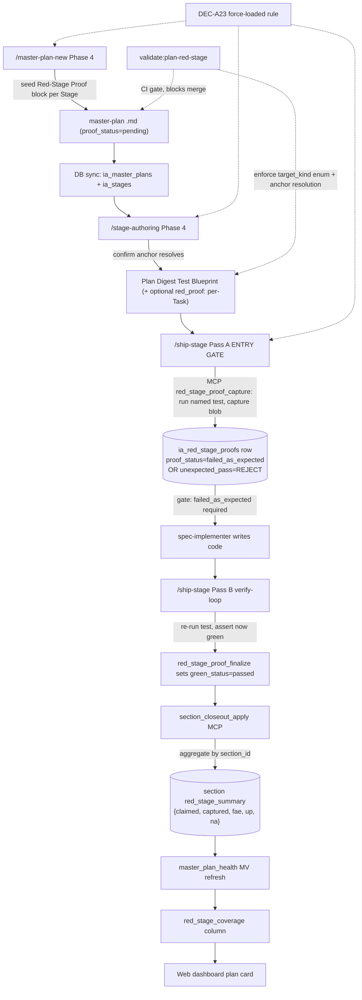

# TDD red/green methodology — exploration (stub)

> **Status:** draft exploration stub — pending `/design-explore docs/tdd-red-green-methodology-exploration.md` expansion.
> **Date:** 2026-05-04
> **Author:** Javier (+ agent)
> **Trigger:** every master plan today drives Stage 1.0 tracer + Stages 2+ visibility delta (per `prototype-first-methodology`), but tests are authored *after* implementation. Verify-loop catches regressions late; red-stage discipline (failing test first → green code) is missing as a first-class step. Proposal: layer TDD red/green onto prototype-first so each Stage / Task lands code only after a failing test exists, without weakening the tracer-slice contract.
> **Constraint A (compatibility):** must layer onto prototype-first (D1/D7/D8/D9/D10) without rewriting `§Tracer Slice` 5-field block or `§Visibility Delta` per-stage contract. No retrofit cost on existing master plans.
> **Constraint B (skill chain):** must integrate with `/design-explore` → `/master-plan-new` → `/stage-decompose` → `/stage-file` → `/stage-authoring` (§Plan Digest) → `/ship-stage` Pass A (implement) + Pass B (verify-loop) — no new skill, ideally one new contract block per Task spec stub or §Plan Digest.
> **Constraint C (validator gate):** new contract must be CI-checkable (analogue to `validate:plan-prototype-first` — already shipped Stage 1.3). Red-stage absence → CI red.
> **Out of scope:** introducing a third test runner; mocking discipline; mutation testing; property-based testing harnesses; full BDD/Gherkin; replacing `verify-loop` with TDD-native runners.

---

## 1. Problem statement

- Today's flow: §Plan Digest carries `§Test Blueprint` (intent-level test names + asserts) → `spec-implementer` writes implementation → `verify-loop` runs `validate:all` + `unity:compile-check` + Path A/B smoke. Tests are authored *implicitly* alongside or after impl. Red-stage proof (test fails before impl exists) is never recorded.
- Symptom A — **green-from-day-0 risk:** `Test Blueprint` rows can be authored to match the implementation post-hoc → false confidence; refactor regressions slip past because the test never failed for the *right reason*.
- Symptom B — **tracer slice as throwaway leak:** Stage 1.0 tracer ships hardcoded scope + stub systems (per D7); without red-stage discipline the tracer's verb may pass even with stubbed answers — the test asserts what the stub returns, not what the player sees.
- Symptom C — **§Visibility Delta unverifiable:** Stages 2+ declare a player-visible delta but nothing in the §Plan Digest forces an end-to-end test that *fails before this stage and passes after*. Visibility delta = prose claim, not a test contract.
- Symptom D — **fix-loop late:** `verify-loop` iterates fix→verify *after* impl. Red-stage authoring would catch design holes (missing seam, wrong glossary anchor) before any code was written — cheaper.
- Symptom E — **methodology gap with prototype-first:** prototype-first answers *what to ship* (tracer + visibility deltas). It does not answer *how to prove it shipped right*. TDD red/green is the dual.

## 2. Driving intent

- Every Stage's player-visible delta = a failing test before any code, a passing test after.
- Stage 1.0 §Tracer Slice = first red→green cycle of the plan. Tracer verb gets a failing end-to-end test; green = tracer commit.
- Stages 2+ §Visibility Delta = each stage owns ≥1 red→green pair scoped to the new visible behavior.
- Per-Task §Plan Digest §Test Blueprint = explicit `red_stage_proof:` field — commit/diff that shows the test failed before implementation landed.
- Hidden plumbing (perf, refactor, infra) inside a visible slice still red/green, but on contract preservation (existing test must still pass) — not a new test.

## 3. Approaches (to compare in `/design-explore` Phase 1)

### Approach A — Per-Stage red/green gate (Stage-scoped, light)

Single new mandatory block on every Stage spec block (master-plan-level, not per-Task):

- `§Red-Stage Proof` — names the failing test file + test method that exists *before* Stage X.Y implementation lands. Path resolved via glossary anchors.
- Stage 1.0 §Tracer Slice gains 6th field `red_stage_test:` — failing E2E test name covering the verb.
- Stages 2+ §Visibility Delta tightens to require a sibling `red_test:` line — failing test name covering the new visible behavior.
- `/ship-stage` Pass A unchanged (still single implement gate). Pass B verify-loop reads `§Red-Stage Proof` and asserts: (i) test exists, (ii) test passes on cumulative HEAD, (iii) git log confirms test was authored ≥1 commit before the stage commit.

Pros: minimal contract surface (1 new block per Stage); maps cleanly onto existing prototype-first per-Stage authoring; CI gate is mechanical (test-name resolution + git log walk).
Cons: red proof is per-Stage — leaves per-Task authoring without red-stage discipline; the "test-before-impl" gate relies on commit ordering, which `/ship-stage` Pass B currently squashes into a single stage commit (loses red proof).
Effort: ~1 dev day for skill edits (`master-plan-new` + `stage-authoring` + `ship-stage`) + ~0.5 day validator (`validate:plan-red-stage`) + ~0.5 day retrofit Stage 1.0 of in-flight plans.

### Approach B — Per-Task red/green inside §Plan Digest (Task-scoped, dense)

Tighten the existing `§Test Blueprint` rubric in `ia/rules/plan-digest-contract.md`:

- New mandatory `§Test Blueprint` rubric clause: every test row carries `red_proof:` field — naming a commit / branch state where this exact test fails before implementation.
- `stage-authoring` lints per-Task: `plan_digest_lint` (already shipped) gains `red_proof_present` check.
- `/ship-stage` Pass A pre-implement gate: subagent must run the named tests once and confirm they fail (capture stdout). Implementer then writes code; tests must pass post-impl. Pass A persists `red_proof_pre` + `red_proof_post` (status enum: `failed_as_expected`, `passed_as_expected`).
- Stage 1.0 tracer = sum of its Tasks' red proofs; no separate Stage-level block needed.

Pros: dense red-stage discipline at Task granularity; reuses existing §Test Blueprint surface (no new section); failure modes are catchable per-Task before stage commit.
Cons: doubles `/ship-stage` Pass A latency (run tests twice — pre + post); `red_proof_pre` requires the test to already exist on disk before implementer runs → forces a "test-author Task" before "impl Task" pair, which inflates Stage cardinality (≥2 Tasks per visible behavior); cumbersome for trivial Tasks (typo fix, string-table edit, asset-only changes).
Effort: ~2 dev days — rubric edit + lint + Pass A wrapper + per-skill seed prompt updates × ~6 skills.

### Approach C — Hybrid: Stage-level red proof + opt-in per-Task

Combination of A + B, with red-stage discipline scoped by player-visibility:

- **Stage 1.0 + Stages 2+** — mandatory `§Red-Stage Proof` block (Approach A), one E2E test per Stage covering its visible delta.
- **Per-Task `red_proof:` field — optional, opt-in flag.** §Plan Digest §Test Blueprint gains optional `red_proof:` field; stage-authoring respects it but does not require. Used for Tasks where unit-level red proof adds signal (algorithmic core, branching logic). Skipped for trivial Tasks.
- `/ship-stage` Pass B verify-loop runs Stage-level red proof check (mandatory) + Task-level red proof check (only for Tasks with the field set).
- Hidden plumbing Tasks (perf, refactor) still inside a visible slice; they inherit the Stage-level red proof; no per-Task field unless author opts in.
- Validator: Stage-level mandatory; Task-level warn-only.

Pros: visibility-scoped — the unit of red proof matches the unit of visible behavior; cheap for trivial Tasks; expensive only where author opts in; survives the squash-to-single-stage-commit pattern of `/ship-stage` Pass B because Stage-level proof is git-log-checked, not per-Task.
Cons: two contract surfaces (Stage block + opt-in Task field) → slightly more skill-prose; opt-in Task gate easy to skip → some test-after-impl risk remains for non-tracer code.
Effort: ~1.5 dev days — Approach A scope + lighter Approach B subset.

### Approach D — Opt-in per-master-plan flag (TDD off by default)

Frontmatter-style flag on `ia_master_plans.tdd_mode` ∈ `none` / `stage` / `task` / `hybrid`. Authoring time choice; default `none`.

Pros: zero retrofit cost on existing plans; per-domain flexibility (UI plans pick `none`, economy plans pick `task`).
Cons: opt-in flags rot — most plans pick the default; methodology becomes optional → the "every plan ships red→green" intent dies. Defeats Constraint C (CI gate). Likely rejected on signal-quality grounds. Include for completeness.

## 4. Opportunities

- **Validator parity with prototype-first.** `validate:plan-red-stage` ships alongside `validate:plan-prototype-first` (already in CI). Same shape, same enforcement model.
- **Closing the §Visibility Delta gap.** Today §Visibility Delta = prose claim. Pairing each delta with a red-stage test name converts it into a verifiable contract. Side-effect: §Visibility Delta becomes machine-checkable for "delta is unique within plan" *and* "delta is real (test was actually red before)".
- **Tracer slice integrity.** Stage 1.0 tracer can no longer green-from-day-0; first commit history must show test authored before tracer code. Eliminates symptom B.
- **Cheaper fix-loop.** Red-stage authoring catches missing seams / wrong glossary anchors before any impl is written. Aligns with "fast cheap proof of design correctness" per `agent-principles`.
- **Web dashboard surface.** `master_plan_health` MV gains `red_stage_coverage` column (% of stages with red-stage proof on file). Visible on dashboard.
- **Skill-train signal.** Skill that consistently authors red proofs after impl (gameable detection: commit ordering) → `skill-train` flags as friction for authoring rubric edit.

## 5. Effort sketch (Approach C baseline)

| Surface | Work | Notes |
|---|---|---|
| `ia/rules/tdd-red-green-methodology.md` | New force-loaded rule (~80 lines) | Locked decisions D1..Dn; mirrors `prototype-first-methodology.md` shape. |
| `docs/MASTER-PLAN-STRUCTURE.md` | Add §Red-Stage Proof schema row | Stage 1.0 + Stages 2+ block. |
| `ia/skills/master-plan-new/SKILL.md` | Phase 4 Stage-ordering tail — author §Red-Stage Proof block per Stage | Reads §Iteration Roadmap for test-name seeds. |
| `ia/skills/stage-authoring/SKILL.md` | §Plan Digest rubric — optional `red_proof:` Task field | Plan-digest-contract update. |
| `ia/skills/ship-stage/SKILL.md` | Pass B verify-loop — Stage-level red proof check | Asserts test exists + passes; git-log walk for "authored before stage commit". |
| `ia/rules/plan-digest-contract.md` | Add §Test Blueprint optional `red_proof:` clause | Lint integration. |
| `npm run validate:plan-red-stage` | New CI gate (~50 lines) | Stage block presence + test-name resolution + git ordering check. |
| `tools/mcp-ia-server/src/tools/master-plan-health.ts` | Add `red_stage_coverage` column | MV refresh. |
| `web/app/dashboard/...` | Surface `red_stage_coverage` on plan card | Web-team scope; can defer. |
| `ia/skills/design-explore/SKILL.md` | §Persist contract — optional `### Red-Stage Plan` subsection | Mirrors `### Iteration Roadmap`; seeds per-Stage red proof test names. |

## 6. Recommendation

Recommended candidate: **Approach C — Hybrid Stage-level mandatory + per-Task opt-in.** Best fit on Constraints A (zero retrofit shape — adds, never overwrites) + B (single new Stage block + optional Task field; one validator) + C (CI gate mirrors `validate:plan-prototype-first` shape exactly). Per-Task opt-in absorbs the "trivial Task" exception without weakening the methodology default. Pending /design-explore Phase 2 confirmation.

## 7. Open questions

- **Q1.** Where does the red proof commit live? Same branch + extra commit before stage commit? Separate "test-only" commit squashed into stage commit? Or git-note metadata only?
- **Q2.** What about Stages whose visible delta is *negative* — removal/regression-fix Stages? Red proof = "test exists that previously passed, now fails on bug-reproduction branch"? Or skip red-stage on regression-fix Stages?
- **Q3.** Does §Red-Stage Proof apply to design-only Stages (architecture-lock, dependency-graph stages with no code)? Likely skip — but contract must say so explicitly.
- **Q4.** How does the methodology integrate with `/section-claim` / `/section-closeout` (parallel sections)? Each section ships its own red proofs independently? Or section-level red proof aggregating member stages?
- **Q5.** Per-Task `red_proof:` opt-in field — who chooses (master-plan author, stage-authoring subagent, implementer)? Default heuristic?
- **Q6.** `verify-loop` Path A (test-mode batch) vs Path B (bridge hybrid) — which path runs the red-stage check? Both? Conditional on Stage's visibility delta surface (UI vs simulation)?
- **Q7.** Retrofit policy for in-flight master plans (`asset-pipeline`, `game-ui-design-system`, `prototype-first-methodology` itself) — apply going forward only, or backfill §Red-Stage Proof on next-pending Stage?
- **Q8.** Does `/design-explore` itself need a `### Red-Stage Plan` subsection in §Design Expansion (peer of `### Iteration Roadmap`) so red proof seeds flow mechanically into `/master-plan-new`?

## 8. References

- `ia/rules/prototype-first-methodology.md` — D1/D7/D8/D9/D10 anchor; this exploration layers onto.
- `docs/prototype-first-methodology-design.md` — design source for the prototype-first anchor.
- `docs/MASTER-PLAN-STRUCTURE.md` — schema home for §Tracer Slice + §Visibility Delta + (proposed) §Red-Stage Proof.
- `ia/rules/plan-digest-contract.md` — §Test Blueprint rubric; opt-in `red_proof:` field target.
- `docs/agent-led-verification-policy.md` — Path A / Path B canonical verify policy; red-stage check integrates here.
- `ia/skills/ship-stage/SKILL.md` Pass A / Pass B — gate insertion site.
- `npm run validate:plan-prototype-first` — shape model for the new `validate:plan-red-stage` CI gate.

---

## Design Expansion

### Chosen Approach

**Approach C — Hybrid Stage-level mandatory + per-Task opt-in.** Auto-confirmed at Phase 2 (recommendation in stub matched user-locked Q1..Q5 binding; no override needed).

Locked decisions from interview:
- **Q1=C** — red-stage proof = pre-impl test-run output blob captured at Pass A entry gate (no git archaeology, no commit-ordering walk; survives squash).
- **Q2=D** — DB-primary storage in new sidecar table `ia_red_stage_proofs` (FK → `ia_stages`).
- **Q3=B** — bugfix Stages need red regression test (`target_kind=bug_repro`), §Visibility Delta requirement waived for these Stages.
- **Q4=C+prototype-first** — hybrid ownership: master-plan author seeds; stage-authoring confirms anchor; Pass A entry-gate captures proof; Pass B finalizes green.
- **Q5=B** — per-section red proof + milestone-level rollup via existing `/section-claim` infrastructure; `section_closeout_apply` aggregates; `master_plan_health` MV gains `red_stage_coverage` column.

### Architecture Decision

**DEC-A23 lock — `tdd-red-green-methodology` (status=active).**

- `arch_decision_write` → row id 29, surface_id → `rules/prototype-first-methodology` (existing).
- `arch_changelog_append` → row id 32220, kind=`design_explore_decision`, spec_path=`docs/tdd-red-green-methodology-exploration.md`.
- `arch_drift_scan` (global, all open plans) → 0 affected stages. No inline drift remediation needed.

Affected `arch_surfaces` (existing rows touched):
1. `rules/prototype-first-methodology`
2. `rules/master-plan-structure`
3. `rules/skill-master-plan-new`
4. `rules/skill-design-explore`

New `arch_surfaces` rows (registration deferred to master-plan Stage 1 implementation per Invariant #12 — never auto-create dangling registry entries):
- `rules/tdd-red-green-methodology` (rule)
- `rules/skill-stage-authoring` (rule, gap fill)
- `rules/skill-ship-stage` (rule, gap fill)
- `rules/plan-digest-contract` (rule, gap fill)
- `interchange/red-stage-proof-capture` (contract)
- `data-flows/red-stage-rollup` (flow)

Stage 1.0 implementation point MUST call `arch_surface_write` MCP for all 6 new surfaces (not raw psql).

### Architecture



**Components.**

| Component | Path | Role |
|---|---|---|
| Force-loaded rule | `ia/rules/tdd-red-green-methodology.md` | D1..Dn locked decisions; ~90 lines; mirrors `prototype-first-methodology.md` shape |
| Sidecar DB table | migration `ia_red_stage_proofs` | one row per (slug, stage_id, task_id); FK `(slug, stage_id)` → `ia_stages` ON DELETE CASCADE |
| MCP tool — capture | `red_stage_proof_capture` | Pass A entry gate; spawns allowlisted test runner; writes proof row |
| MCP tool — read | `red_stage_proof_get` / `red_stage_proof_list` | per-plan / per-section reads |
| MCP tool — finalize | `red_stage_proof_finalize` | Pass B green-gate; updates `green_status` |
| MCP extension | `section_closeout_apply` | aggregates `red_stage_summary` per section |
| MCP extension | `master_plan_health` | adds `red_stage_coverage` numeric column |
| Validator | `tools/scripts/validate-plan-red-stage.mjs` | wired into `validate:all`; mirrors `validate:plan-prototype-first` |
| Anchor resolver | `tools/scripts/lib/red-stage-anchor.mjs` | parses 4 anchor formats; verifies path + method name |
| Schema doc | `docs/MASTER-PLAN-STRUCTURE.md` | adds §Red-Stage Proof 4-field schema row |
| Skill edits | `master-plan-new`, `stage-authoring`, `ship-stage`, `design-explore` | rule ref + Phase tail prose; `npm run skill:sync:all` after edits |

**§Red-Stage Proof block — 4-field schema.**

| Field | Semantics |
|---|---|
| `red_test_anchor` | One of 4 grammars (see anchor table below); MUST target tracer verb / §Visibility Delta / bug id / `n/a` |
| `target_kind` | Enum: `tracer_verb` / `visibility_delta` / `bug_repro` / `design_only` |
| `proof_artifact_id` | UUID of `ia_red_stage_proofs` row |
| `proof_status` | Enum: `pending` / `failed_as_expected` / `unexpected_pass` / `not_applicable` |

**Anchor grammar (4 forms, mechanically resolvable).**

| `target_kind` | Anchor format | Resolver check |
|---|---|---|
| `tracer_verb` | `tracer-verb-test:{path}::{method}` | path exists + method regex match |
| `visibility_delta` | `visibility-delta-test:{path}::{method}` | path exists + method regex match |
| `bug_repro` | `BUG-NNNN:{path}::{method}` | bug id resolves in `ia_backlog` + path/method as above |
| `design_only` | literal `n/a` | validator skips proof-status checks for this Stage |

**Pass A entry-gate invariant (security + ordering — addresses BLOCKING B1+B2 from review).**

- `red_stage_proof_capture` input schema includes `command_kind` enum: `npm-test` / `dotnet-test` / `unity-testmode-batch`. Other values rejected with `invalid_command_kind`. No arbitrary shell.
- `/ship-stage` Pass A skill body MUST call `red_stage_proof_capture` BEFORE dispatching `spec-implementer`. Skill-level invariant; ordering captured in `ia/rules/tdd-red-green-methodology.md` §Pass A entry gate.

### Subsystem Impact

| Subsystem | Surfaces touched | Invariants flagged |
|---|---|---|
| IA / rules | new `ia/rules/tdd-red-green-methodology.md`; edits to `docs/MASTER-PLAN-STRUCTURE.md`, `ia/rules/plan-digest-contract.md`, `ia/rules/prototype-first-methodology.md` (cross-link) | Inv 12 (specs vs projects — methodology = permanent rule, lives in `ia/rules`). Inv 13 (id counter — not touched; new arch surfaces use slug, not numeric id). |
| Skill chain | `master-plan-new`, `stage-authoring`, `ship-stage`, `design-explore` SKILL.md edits + `npm run skill:sync:all` | Cache-block-sizing validator must re-pass (preamble byte budget unchanged — methodology rule is on-demand cross-link from prototype-first; not loaded into all skill preambles). |
| Database | new migration creating `ia_red_stage_proofs` table; new column `master_plan_health.red_stage_coverage`; extension to `section_closeout_apply` aggregation | Q5=B section-claim integration — `ia_section_claims` already shipped; `red_stage_proofs.section_id` FK joins it. |
| MCP server | new tools `red_stage_proof_capture`, `red_stage_proof_get`, `red_stage_proof_list`, `red_stage_proof_finalize`; modified `section_closeout_apply`, `master_plan_health` | Schema cache reset required after registration (restart Claude Code / MCP host). |
| Validators | new `validate:plan-red-stage` script; widens `validate:plan-prototype-first` skip-clause for `target_kind=bug_repro` Stages | Wired into `validate:all`; CI red on missing/empty §Red-Stage Proof block. |
| Web dashboard | plan card surface for `red_stage_coverage` (deferrable; web-team scope) | None (standard web display). |
| Architecture coherence | DEC-A23 active; 4 existing arch surfaces touched; 6 new surfaces to register at Stage 1 implementation | Inv 12 — never auto-create dangling registry; 6 new surfaces registered via `arch_surface_write` MCP only after rule files land. |

Subsystem spec gaps: none — all touched specs available via MCP.

### Implementation Points

Stage-by-Stage decomposition mechanical seed for `/master-plan-new`. Six Stages.

**Stage 1.0 — Tracer slice (methodology-on-itself).**
- Author `ia/rules/tdd-red-green-methodology.md` (~90 lines).
- Author migration creating `ia_red_stage_proofs` table.
- Insert 6 new arch_surfaces rows via `arch_surface_write` MCP.
- Tracer verb: "/ship-stage Pass A entry rejects unexpected_pass on hand-crafted Stage block". Hardcoded test path; stub `red_stage_proof_capture` returning fixed JSON.
- Red proof: failing E2E test in `tools/mcp-ia-server/tests/tools/red-stage-proof-capture.test.ts` — asserts unexpected_pass branch returns rejection.

**Stage 2 — DB write surface + capture/get/list MCP tools.**
- Apply migration via `db:migrate`.
- Implement `red_stage_proof_capture` (allowlist enforced via `command_kind` enum; spawn runner; capture stdout/stderr ≤ 256KB; compute status from exit code).
- Implement `red_stage_proof_get`, `red_stage_proof_list`.
- §Visibility Delta: "agent writes a real red-stage proof row to DB and reads it back via MCP".

**Stage 3 — Validator + schema doc.**
- `validate:plan-red-stage` script (6 checks per Phase 3 spec).
- Wire into `validate:all`.
- Update `docs/MASTER-PLAN-STRUCTURE.md` with §Red-Stage Proof schema row.
- Widen `validate:plan-prototype-first` skip-clause for `target_kind=bug_repro`.
- §Visibility Delta: "CI red on master plan with empty §Red-Stage Proof block".

**Stage 4 — Skill chain integration.**
- Edit `master-plan-new` Phase 4 — author §Red-Stage Proof block per Stage seeded from `§Iteration Roadmap`.
- Edit `stage-authoring` Phase 4 — confirm anchor resolves; optional Task-level `red_proof:` opt-in field in §Test Blueprint.
- Edit `ship-stage` Pass A — call `red_stage_proof_capture` BEFORE spec-implementer dispatch (entry gate); reject `unexpected_pass`. Pass B — call `red_stage_proof_finalize` after verify-loop.
- Edit `design-explore` §Persist contract — optional `### Red-Stage Plan` subsection seeds per-Stage red proof anchors.
- Run `npm run skill:sync:all`.
- §Visibility Delta: "agent runs `/master-plan-new` on a fixture exploration; master-plan ships filled §Red-Stage Proof blocks".

**Stage 5 — Section rollup + dashboard.**
- Extend `section_closeout_apply` with red-stage aggregation step.
- Add `red_stage_coverage` column to `master_plan_health` MV (formula: `pct = (failed_as_expected_count + not_applicable_count) / total_stages_count * 100`; `pending` excluded from numerator per N3).
- Web dashboard plan card surface (deferrable).
- §Visibility Delta: "milestone closeout digest shows `red_stage_coverage: NN%` line".

**Stage 6 — Retrofit policy + closeout.**
- Q7 answer: in-flight plans skip backfill, apply on next-pending Stage authored.
- Run `validate:all` end-to-end.
- Lock Q6 (Path A vs Path B): rule §Pass A entry gate states "Stage-level proof uses whichever path the test surface dictates: testmode-batch for Editor tests, bridge for runtime; recorded in `command_kind`".
- §Visibility Delta: "next master plan authored after Stage 6 ships with red proofs filled and CI gate green".

### Examples

**Example A — Stage 1.0 §Red-Stage Proof block (filled).**

```markdown
## Stage 1.0 — Tracer slice

§Tracer Slice
- verb: agent captures pre-impl test-run blob into ia_red_stage_proofs and rejects unexpected_pass
- hardcoded_scope: single Stage block fixture, fixed test path
- stubbed_systems: red_stage_proof_capture stub returning {status:'unexpected_pass'}
- throwaway: fixed-string anchor resolution
- forward_living: ia_red_stage_proofs schema, MCP tool input shape

§Red-Stage Proof
- red_test_anchor: tracer-verb-test:tools/mcp-ia-server/tests/tools/red-stage-proof-capture.test.ts::rejectsUnexpectedPass
- target_kind: tracer_verb
- proof_artifact_id: 7e9b1a6c-3d2e-4f1a-9c5d-1a2b3c4d5e6f
- proof_status: pending
```

**Example B — Bugfix Stage with §Visibility Delta exemption.**

```markdown
## Stage 4 — Fix BUG-3210

§Red-Stage Proof
- red_test_anchor: BUG-3210:Assets/Tests/PlayMode/Bug3210/RegressionSpec.cs::reproducesBug3210
- target_kind: bug_repro
- proof_artifact_id: f1e2d3c4-b5a6-7890-abcd-ef0123456789
- proof_status: pending

(no §Visibility Delta — bug_repro Stage exempt per DEC-A23 / Q3=B)
```

**Example C — Per-Task opt-in (`/stage-authoring` §Test Blueprint).**

```markdown
### §Test Blueprint

| Test name | Asserts | red_proof: |
|---|---|---|
| ProofCaptureRejectsUnexpectedPass | exit-code-0 path returns {status:'unexpected_pass'} | f1e2d3c4-... (opt-in) |
| ProofCaptureWritesBlob | blob ≤ 256KB persisted | (omitted — trivial) |
```

**Example D — Section closeout aggregation payload.**

```json
{
  "section_id": "core-mcp-tools",
  "claimed_stages": ["2.1", "2.2", "2.3"],
  "red_stage_summary": {
    "claimed": 3,
    "captured": 3,
    "failed_as_expected": 3,
    "unexpected_pass": 0,
    "not_applicable": 0
  },
  "section_closeout_status": "green"
}
```

**Example E — `red_stage_proof_capture` MCP call (Pass A entry).**

```json
{
  "tool": "red_stage_proof_capture",
  "input": {
    "slug": "tdd-red-green-methodology",
    "stage_id": "1.0",
    "task_id": null,
    "target_kind": "tracer_verb",
    "target_anchor": "tracer-verb-test:tools/mcp-ia-server/tests/tools/red-stage-proof-capture.test.ts::rejectsUnexpectedPass",
    "command_kind": "npm-test",
    "section_id": null
  }
}
```

Returns:

```json
{
  "ok": true,
  "payload": {
    "proof_artifact_id": "7e9b1a6c-3d2e-4f1a-9c5d-1a2b3c4d5e6f",
    "proof_status": "failed_as_expected",
    "exit_code": 1,
    "blob_bytes": 4821,
    "captured_at": "2026-05-04T15:42:11Z"
  }
}
```

### Review Notes

Subagent review applied inline. 3 BLOCKING items resolved + folded into Phase 3 / Architecture / Implementation Points. 5 NON-BLOCKING items recorded:

- **N1** — proof_blob 256KB cap (raised from initial 64KB to absorb verbose Path B bridge logs); explicit truncation marker on overflow.
- **N2** — Q6 (Path A vs Path B verify-loop) deferred to Stage 6 closeout; rule §Pass A entry gate states surface dictates path; recorded in `command_kind`.
- **N3** — `master_plan_health.red_stage_coverage` formula locked: `(failed_as_expected + not_applicable) / total_stages * 100`; `pending` excluded from numerator.
- **N4** — DEC-A23 changelog references 6 new arch surfaces deferred to Stage 1 registration via `arch_surface_write` MCP, not raw psql.
- **N5** — `/design-explore` `### Red-Stage Plan` subsection (Q8 in stub) confirmed in scope; lands in Stage 4 skill edits.

BLOCKING resolved (3): B1 command-kind allowlist, B2 Pass A entry-gate ordering invariant, B3 anchor grammar (4 explicit forms + resolver path).

### Expansion metadata

| Field | Value |
|---|---|
| Date | 2026-05-04 |
| Model | claude-opus-4-7 |
| Approach selected | C — Hybrid Stage-level mandatory + per-Task opt-in |
| Decision lock | DEC-A23 `tdd-red-green-methodology` (status=active) |
| Surfaces touched (existing) | 4 |
| Surfaces deferred (Stage 1 registration) | 6 |
| Drift scan result | 0 affected stages |
| Blocking items resolved | 3 |
| Non-blocking items carried | 5 |
| Stage count proposed | 6 |
