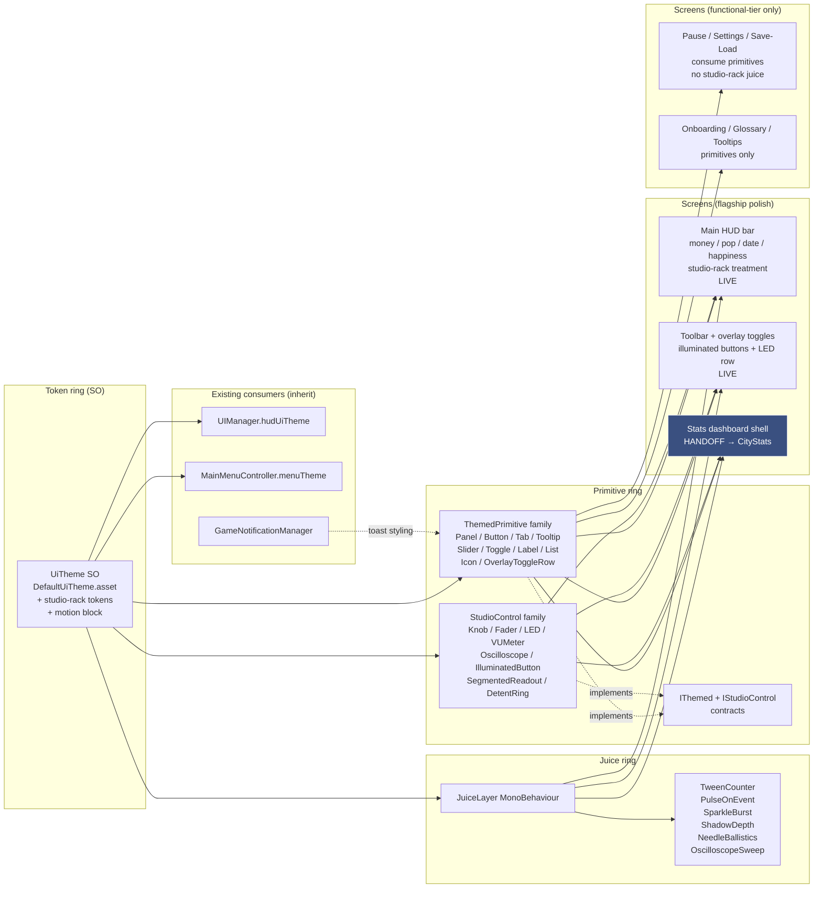

# UI Polish — Exploration (stub)

> Pre-plan exploration stub for Bucket 6 of the polished-ambitious MVP (per `docs/full-game-mvp-exploration.md` + `ia/projects/full-game-mvp-master-plan.md`). Seeds a future `/design-explore` pass that expands Approaches + Architecture + Subsystem impact + Implementation points. **Scope is the full in-game UI surface for beta — UiTheme pass, HUD, info panels, notifications, settings, save/load, pause, graphs panel, new-game setup, overlays toggle, icons, loading screens, splash, tooltips, in-game glossary, guided first scenario. NOT CityStats overhaul (Bucket 8 — separate bucket with data-parity contract), NOT UI SFX hook wiring (Bucket 7), NOT sprite / icon asset production (Bucket 5 — this bucket consumes those assets). Those land in sibling buckets.**

---

## Problem

Territory Developer has partial UI — HUD rows for money / population / date, basic zoning toolbar, minimap, a bare info popup on cell click. The surface does not meet a polished-ambitious beta bar:

- **UiTheme inconsistency.** Different panels use different paddings, fonts, palette variants, and corner radii. `ui-design-system.md` exists but isn't enforced across every surface — new rows drift each time a feature lands.
- **No unified HUD contract.** Money / pop / date / speed controls / happiness / notifications / scale indicator coexist ad hoc. No ordering rule, no overflow behaviour at small window sizes, no alignment with overlay toggles.
- **Info panels thin.** Click-building shows a couple of fields; no tabbed structure, no cross-linked district view, no integration with Bucket 8 read model (when it lands).
- **No notifications / event feed.** Zone-level events (fire, protest, construction complete, deficit warning) have no surface beyond potential log spam.
- **No settings menu.** Audio / video / controls bindings do not exist as UI; player can't adjust music volume (Bucket 7 landed mixer but slider UI still missing outside MainMenu).
- **No save/load UI with multiple slots.** Save is keyboard-driven / single-slot. Genre testers expect multi-slot + screenshot thumbnail.
- **No pause menu.** Esc key currently does nothing coherent.
- **No graphs / stats panel.** Population-over-time, economy curves, pollution trends — data will exist post-Bucket 8, but rendering surface is missing.
- **No new-game setup.** Player can't pick map size, starting conditions, scenario variant. User flagged this as very important — must offer meaningful parameter space without blocking the guided first scenario path.
- **No overlay toggle.** Bucket 2 ships pollution / crime / traffic / happiness / zone / desirability signal fields — rendering pipeline exists but toggle UI does not.
- **No onboarding / guided first scenario.** Tester opens beta, sees empty grid + toolbar, doesn't know place-road-first vs zone-first vs save-first. Beta feedback risk: "I didn't know what to do."
- **No in-game glossary / tooltips / loading screens / splash art.** Polish-tier items; a beta without them reads as unfinished.
- **Bug interrupts.** BUG-14 (per-frame `FindObjectOfType` on some UI controllers), BUG-48 (minimap stale after load), TECH-72 (HUD / uGUI scene hygiene) sit in BACKLOG — stabilization sweep opens this bucket.

**Design goal (high-level):** ship the complete UI surface for a polished-ambitious beta. Unified UiTheme enforcement, a unified HUD contract, tabbed info panels, notification / event feed, settings menu, multi-slot save/load, pause menu, graphs shell (Bucket 8 populates data), new-game setup, overlay toggles, icons, loading screens, splash art, tooltips, in-game glossary, guided first scenario. Polish-tier, beta-ready across every surface a tester touches.

## Approaches surveyed

_(To be expanded by `/design-explore` — seed list only.)_

- **Approach A — Per-screen ship-as-ready.** Each screen (HUD, info panel, settings, save/load, etc.) ships independently when its owning feature is ready. Minimal orchestration; risks inconsistent theming, inconsistent notification routing, inconsistent tooltip patterns.
- **Approach B — UiTheme contract first, screens second.** Lock a unified UiTheme spec (spacing, typography, palette, icon grid, layout primitives) + a shared set of building-block controllers (ThemedPanel, ThemedButton, ThemedTabBar, ThemedTooltip, ThemedSlider) before any new screen lands. Every screen in the bucket consumes the primitives. Higher upfront cost; guarantees consistency.
- **Approach C — Onboarding-first.** Start with guided first scenario + in-game glossary + tooltips; they shape what HUD + info panels need to surface. Other screens follow the onboarding's narrative. Risks: onboarding hardens contracts before core HUD shape is clear.
- **Approach D — Shell + data separation.** Ship each screen as a "shell" (layout + theme + placeholders) gated on data readiness. HUD renders live; info panels render live subsets; graphs panel ships with placeholder until Bucket 8 populates. Allows UI bucket to finish without blocking on Bucket 8.
- **Approach E — Hybrid B + D.** UiTheme + primitives first (B), then shell + data separation (D) for screens whose data lands in sibling buckets. Screens that depend on Bucket 2 signals or Bucket 8 read model ship shell + placeholder rows ready to wire; screens that don't (settings, pause, save/load, onboarding) ship fully live.

## Recommendation

_TBD — `/design-explore` Phase 2 gate decides._ Author's prior lean: **Approach E** (UiTheme-first + shell/data separation). Matches the bucket's breadth (15+ screens across data-dependent and data-independent surfaces), avoids Approach A's drift, keeps UI bucket unblocked by Bucket 8 + Bucket 2 timing, and defers inconsistency risk to primitive authoring (one place to get right). Approach C has good instincts for tester legibility but inverts the authoring order — onboarding script depends on HUD + info panel shape, not the other way round.

## Open questions

- **UiTheme primitive catalog.** Full list of primitives (ThemedPanel, ThemedButton, ThemedTabBar, ThemedTooltip, ThemedSlider, ThemedToggle, ThemedLabel, ThemedList, ThemedTable, ThemedGraph, ThemedIcon, ThemedOverlayToggleRow). Each authored where — existing `ui-design-system.md` extension or new prefab library under `Assets/UI/Themed/`?
- **HUD contract.** Ordering (money > pop > date > speed > happiness > scale > notifications? or other?), anchoring (top bar vs corner clusters), overflow behaviour at small window sizes, alignment with overlay toggles, hide-on-screenshot-mode flag.
- **Info panel shape.** Tabbed per entity type (cell / building / district / zone / road)? Shared header + tabs pattern? Cross-linking (click district from cell tab)? Integration point with Bucket 8 read model facade (pull-only).
- **Notifications / event feed.** Transient toast vs persistent log vs both? Filter / severity levels (info / warning / critical)? Routing contract (who calls `Notify.Raise(kind, text)` — manager-level, event-emitter level)? Event feed tied to save or ephemeral?
- **Settings menu scope.** Audio (master / music / SFX / ambient sliders — coordinate Bucket 7 mixer group names), video (window mode / resolution / vsync / graphics tier), controls (key rebinding — in scope or deferred?), gameplay (autosave interval, tooltip density). Each as a tab in a single Settings panel or separate screens?
- **Save / load UI.** Slot count (3? 5? unlimited?), per-slot metadata (timestamp, city name, pop, screenshot thumbnail), delete / rename / overwrite affordances. Autosave slot separate or first slot?
- **Pause menu.** Resume / Settings / Save / Load / Main Menu / Quit. Modal full-screen or corner overlay? Pauses simulation automatically (consistent with Esc semantics)?
- **Graphs / stats panel.** Which graphs ship MVP (pop over time, economy curve, pollution trend, demographic pyramid, happiness history)? Shell only until Bucket 8 data lands, or wait for Bucket 8 to ship primitives?
- **New-game setup parameter space.** Map size (S / M / L? or discrete cell counts?), starting budget, starting pop, starting scenario (blank / tutorial / preset city stage)? Which parameters reachable pre-onboarding vs post?
- **Overlay toggle UX.** Toolbar row with per-signal toggle icons vs single dropdown vs hotkey + visible indicator? Interaction with Bucket 2 signal overlay renderer. Persistence (toggle state across save/load)?
- **Onboarding script.** Step list (place road → zone R → wait → place service → …)? Modal popup vs ambient ghost arrows? Skippable? Re-runnable from Help menu?
- **In-game glossary.** Entry catalog (mirrors `ia/specs/glossary.md` subset? or game-facing only, skipping dev terms)? Accessed from pause menu / Help key? Cross-linked from tooltips?
- **Tooltip density.** Every button + every stat + every icon? Hover delay tuning (300ms? 500ms? configurable in settings)?
- **Loading screens.** Per scene-transition + per scale-switch. Loading screen art — sprite-gen generated (Bucket 5) or hand-authored splash-tier art? Loading-bar vs spinner vs tip rotation?
- **Splash art / title screen.** Game identity anchor for testers — coordinate with Bucket 5 (landmark + hero sprite) + Bucket 9 (web landing page shares identity).
- **Invariant compliance.** Invariant #3 hard (no per-frame `FindObjectOfType`) — BUG-14 sits here. Invariant #4 (no new singletons — UI controllers MonoBehaviour + Inspector-wired). TECH-72 HUD / uGUI scene hygiene ships as part of the HUD contract stage.
- **Consumer-count inventory.** For each new screen, which subsystems feed it? Decide at exploration time to inform Bucket 2 signal + Bucket 8 read-model + Bucket 7 SFX + Bucket 5 icon consumer lists.
- **Hard deferrals re-check.** Accessibility (colour-blind modes, text scaling, subtitles), localisation, controller / gamepad, mobile / touch — confirmed OUT at bucket level; no primitive design should implicitly assume them.

---

_Next step._ Run `/design-explore docs/ui-polish-exploration.md` to expand Approaches → selected approach → Architecture → Subsystem impact → Implementation points → subagent review. Then `/master-plan-new` to author `ia/projects/ui-polish-master-plan.md` and decompose into 4–5 steps × 2–3 stages each (per Bucket 6 size estimate).

---

## Design Expansion

### Chosen Approach

**Approach E — Hybrid UiTheme-first + Shell/data separation + Shared Juice Layer.** Ships the bucket in three concentric rings:

1. **Token ring** — extend the existing `UiTheme` ScriptableObject (`Assets/UI/Theme/DefaultUiTheme.asset`, already consumed by `UIManager.hudUiTheme` + `MainMenuController.menuTheme`) with the full token catalog needed for dark-first + studio-rack aesthetic (surface tiers, accent ladder, shadow depths, glow colors, LED hues, VU gradient stops, animation curves, tween durations, sparkle palette). No new singletons — one asset, many consumers.
2. **Primitive ring** — author two primitive families on top of the token ring. **ThemedPrimitive family** (panel / button / tab / tooltip / slider / toggle / label / list / icon / overlay-toggle-row) covers structural UI. **StudioControl family** (knob / fader / LED / VU meter / oscilloscope / illuminated button / detent ring / segmented readout) covers studio-rack interactives. Both families implement `IThemed` + repaint on token swap. StudioControls additionally implement `IStudioControl` exposing value, range, semantic mapping, and animation hooks. Hybrid authoring: layout-heavy screens (HUD bar, toolbar rows, pause menu) ship as prefabs that reference primitive controllers; atoms (individual knob / VU / button) ship as pure code controllers with no per-screen prefab.
3. **Juice ring** — a shared `JuiceLayer` MonoBehaviour plus token-driven tween / particle / shadow helpers. Provides: tween counter (money delta), pulse-on-event (LED flash on build), sparkle burst (transaction confirm), shadow + depth (panel elevation), VU needle ballistics (attack / release / peak-hold), oscilloscope sweep driven by arbitrary signal source, camera-shake + screen-tilt for critical alerts. All effects parameterised by theme tokens so a token swap repaints AND re-tunes motion globally.

Screens consume the three rings. Per Approach D, screens whose data lands in sibling buckets ship as shells — HUD renders live (money / pop / date / happiness from existing managers), toolbar + overlay toggles render live (Bucket 2 signal fields + existing `OverlayRenderer`), Stats dashboard shell is handed off to CityStats overhaul (see below), info panels deferred to post-MVP. Onboarding / glossary / settings / save-load / pause / new-game setup ride on primitives but are NOT in the flagship polish scope for this exploration — they ship functional-tier, not studio-rack-tier. Flagship studio-rack treatment lands on Main HUD + Toolbar + Overlays only (per user Q4).

### CityStats dashboard handoff (critical — DO NOT duplicate)

Stats dashboard polish is owned by the **CityStats overhaul bucket** (see `docs/citystats-overhaul-exploration.md` + `ia/projects/citystats-overhaul-master-plan.md`). UI Polish **owns the primitives Stats dashboard consumes**; it does NOT author dashboard layout, chart composition, or data wiring.

**Contracts this exploration exports to CityStats team:**

| Contract | Surface | Shape |
|---|---|---|
| `UiTheme` tokens | `Assets/UI/Theme/DefaultUiTheme.asset` | Extended field set: dashboard surface tiers, graph gridline alpha, series accent ladder, heatmap gradient stops, chart label sizes, sparkle / pulse tokens |
| `IThemed` repaint interface | Code contract | Every primitive + StudioControl + future dashboard widget implements; single `ApplyTheme(UiTheme)` entry |
| `IStudioControl` value binding | Code contract | `float Value`, `Vector2 Range`, `AnimationCurve ValueToDisplay`, `void BindSignalSource(Func<float>)` — lets CityStats bind facade getters to knob / fader / VU / oscilloscope primitives without reimplementing animation |
| StudioControl primitive family | `Assets/Scripts/UI/StudioControls/*` | Knob, Fader, LED, VUMeter, Oscilloscope, IlluminatedButton, SegmentedReadout, DetentRing — dashboard consumes via prefab instantiation + `BindSignalSource(() => facade.GetScalar(metric))` |
| JuiceLayer helpers | `Assets/Scripts/UI/Juice/*` | `TweenCounter`, `PulseOnEvent`, `SparkleBurst`, `ShadowDepth`, `NeedleBallistics`, `OscilloscopeSweep` — dashboard consumes for animated transitions, alert pulses, chart entry animations |
| Animation token contract | `UiTheme` motion block | Easing curves + durations named semantically (`moneyTick`, `alertPulse`, `needleAttack`, `needleRelease`) so dashboard doesn't invent per-widget timings |

**Coordination rules.** CityStats dashboard work starts AFTER UI Polish Step 1 (token ring) + Step 2 (primitive ring) + Step 3 (juice ring) land. Dashboard LAYOUT, CHART TYPES, DATA BINDING live in CityStats master plan. Dashboard STYLING + ANIMATION + INTERACTIVE PRIMITIVES inherit from UI Polish catalog. CityStats master plan must reference this exploration's primitive list under its Dashboard step — update `ia/projects/citystats-overhaul-master-plan.md` Dashboard step acceptance to read "consumes UiTheme + StudioControl + JuiceLayer per `docs/ui-polish-exploration.md` §Design Expansion → CityStats handoff".

**Boundary clarifier.** If a question is "how does a knob look / animate / feel?" → UI Polish. If a question is "what data feeds the knob / which metric / which scale?" → CityStats. If a question is "where on the dashboard does the knob sit / which tab / which group?" → CityStats. No primitive authoring drifts into CityStats master plan; no dashboard layout drifts into UI Polish master plan.

### Architecture

**Entry points.** `UIManager.Awake` (existing) loads `hudUiTheme` → broadcasts `ApplyTheme` via new `ThemeBroadcaster` helper to all `IThemed` scene components (breadth-first scan, cached `Awake`-time, invariant #3 compliant — NO per-frame reflection). Token edits in Inspector trigger `OnValidate` → Editor-only repaint. **Exit points.** Each `IThemed` consumer receives one `ApplyTheme(UiTheme)` call; StudioControls additionally receive `BindSignalSource(Func<float>)` from their owning screen once.

### Subsystem Impact

| Subsystem | Nature | Invariants flagged | Breaking vs additive | Mitigation |
|---|---|---|---|---|
| `UiTheme.cs` + `DefaultUiTheme.asset` | Additive field expansion — new tokens for studio-rack + motion block; existing tokens untouched | — | Additive | Serialized fields default to legacy values; existing `UIManager` / `MainMenuController` unaffected |
| `UIManager` (partial across `.Hud.cs` / `.Toolbar.cs` / `.PopupStack.cs` / `.Utilities.cs`) | Add `ThemeBroadcaster` helper field; extract new `UIManager.ThemeBroadcast.cs` partial to hold propagation — do NOT inline in existing partials | #6 (don't bloat `UIManager`) | Additive; partial file keeps `UIManager` core untouched | New partial file + helper component; no changes to `UIManager.Awake` lifecycle beyond a single `themeBroadcaster.BroadcastAll()` call |
| `ThemedPrimitive` family (new under `Assets/Scripts/UI/Primitives/*`) | New code, MonoBehaviour per widget | #3 (cache refs in `Awake`), #4 (no singletons) | Additive | Each primitive `[SerializeField] private` + `FindObjectOfType` fallback for `UiTheme` lookup in `Awake` only — explicitly NOT `Update` |
| `StudioControl` family (new under `Assets/Scripts/UI/StudioControls/*`) | New code, MonoBehaviour per widget with animation state | #3 (no per-frame `FindObjectOfType` — cache theme + signal source in `Awake` / `OnEnable`) | Additive | `BindSignalSource` cached once; `Update` reads cached delegate only |
| `JuiceLayer` (new under `Assets/Scripts/UI/Juice/*`) | New scene MonoBehaviour + helper classes | #3 (no per-frame reflection), #4 (no singletons — scene component, Inspector-wired) | Additive | Scene-rooted MonoBehaviour; primitives resolve reference via `[SerializeField]` + `FindObjectOfType` fallback in `Awake` |
| `CityStatsUIController` | Consumer migrates to studio-rack primitives in CityStats bucket — NOT in this bucket | — | UI Polish bucket: no change. CityStats bucket: additive swap | Flagged in handoff contract above; CityStats master plan owns the change |
| `GameNotificationManager` | Existing `DontDestroyOnLoad` singleton for toast routing — keep; toast visual becomes a `ThemedPrimitive` | #4 carve-out (existing singleton, not new) | Additive — only toast prefab visual updates | Existing singleton unchanged; its toast prefab references new `ThemedPrimitive` + `JuiceLayer` sparkle helper |
| `CameraController` + `MiniMapController` | Existing controllers sit in scene; receive `ApplyTheme` for any chrome they own | #3 (already cached) | Additive | One `IThemed` impl each if they expose chrome; no behavioural change |
| `OverlayRenderer` (Bucket 2) | Overlay toggle UI in toolbar consumes StudioControl illuminated buttons + LED indicator per overlay | — | Additive — toolbar row replaces current ad-hoc toggles | Bucket 2 signal fields feed LED / VU state via `IStudioControl.BindSignalSource` |
| `ia/specs/ui-design-system.md` | Add primitive + StudioControl + JuiceLayer as normative sections under §2 Components and §1.5 Motion; lock token contract in §1.1 and §1.2 | Spec consistency rule (terminology-consistency.md) | Additive — no section deletion | Update spec in Step 1 stage close; glossary rows for new terms (Knob, Fader, VU meter, LED ring, Oscilloscope readout, Juice layer, Token ring, Studio control, Themed primitive) |

**Invariants flagged:** #3 (no per-frame `FindObjectOfType`) across every new controller and the theme broadcaster; #4 (no new singletons — `JuiceLayer` + `ThemeBroadcaster` are scene components with Inspector wiring + `FindObjectOfType` fallback in `Awake`); #6 (don't add responsibilities to `UIManager` — new primitives own themselves; `UIManager.ThemeBroadcast.cs` is the only touch and it's a single-line broadcast call).

**Specs unavailable via MCP:** none — `ui-design-system` spec sliced cleanly.

### Implementation Points

Phased checklist, one block per phase. Order enforces dependency flow — token ring first, primitives second, juice third, screen migrations fourth.

**P0 — Token ring extension**

- [ ] Extend `UiTheme.cs` with studio-rack token block (LED hues, VU gradient stops, knob detent color, fader track gradient, oscilloscope trace color + glow, shadow depth stops, glow radius + color, sparkle palette)
- [ ] Extend `UiTheme.cs` with motion block (`moneyTick`, `alertPulse`, `needleAttack`, `needleRelease`, `sparkleDuration`, `panelElevate`, easing curves)
- [ ] Update `DefaultUiTheme.asset` with dark-first + studio-rack default values per `ui-design-system §7.1`
- [ ] Add `OnValidate` Editor repaint broadcast
- [ ] Add glossary rows: `UiTheme token ring`, `Studio-rack token`, `Motion token`
- [ ] Update `ui-design-system §1` and §1.5 with new token catalog

**P1 — ThemedPrimitive family (atoms)**

- [ ] `IThemed` interface — `void ApplyTheme(UiTheme)` contract
- [ ] `ThemedPrimitiveBase` MonoBehaviour — `Awake`-cached theme + `FindObjectOfType` fallback
- [ ] Implementations: `ThemedPanel`, `ThemedButton`, `ThemedTabBar`, `ThemedTooltip`, `ThemedSlider`, `ThemedToggle`, `ThemedLabel`, `ThemedList`, `ThemedIcon`, `ThemedOverlayToggleRow`
- [ ] `ThemeBroadcaster` helper (scene MonoBehaviour, `[SerializeField]` on `UIManager`)
- [ ] New `UIManager.ThemeBroadcast.cs` partial — single `BroadcastAll()` call in `Start`
- [ ] Unit coverage — token swap repaints all primitives in a test scene

**P2 — StudioControl family (interactives)**

- [ ] `IStudioControl` interface — `float Value`, `Vector2 Range`, `AnimationCurve ValueToDisplay`, `BindSignalSource(Func<float>)`, `void Unbind()`
- [ ] `StudioControlBase : ThemedPrimitiveBase, IStudioControl`
- [ ] Implementations: `Knob` (detent ring + LED arc + drag-to-rotate), `Fader` (vertical track + cap + level-meter strip), `LED` (hue + pulse + on/off), `VUMeter` (needle + ballistics + peak-hold), `Oscilloscope` (rolling trace driven by `Func<float>` sample fn), `IlluminatedButton` (glow + click pulse + LED state), `SegmentedReadout` (7-segment style numeric), `DetentRing` (knob indicator dots)
- [ ] Prefab under `Assets/UI/Prefabs/StudioControls/*` per widget
- [ ] Unit coverage — value bind updates visual in `Update` without allocations

**P3 — JuiceLayer + tween / particle helpers**

- [ ] `JuiceLayer` scene MonoBehaviour — Inspector-wired from `UIManager`
- [ ] Helpers: `TweenCounter` (numeric count-up/down with easing), `PulseOnEvent` (scale + glow pulse), `SparkleBurst` (particle system burst), `ShadowDepth` (drop shadow + elevation), `NeedleBallistics` (VU attack/release/peak-hold), `OscilloscopeSweep` (ring buffer trace)
- [ ] All helpers parameterised by `UiTheme` motion tokens — no hard-coded durations
- [ ] Allocation-free `Update` paths (pool tween state, reuse particle buffers)
- [ ] Unit coverage — helper repaints + motion token swap retunes live

**P4 — Main HUD flagship polish**

- [ ] Replace existing HUD row widgets (money / pop / date / happiness / speed / scale indicator) with ThemedPrimitive + StudioControl instances
- [ ] Money readout → `SegmentedReadout` + `TweenCounter` on delta
- [ ] Happiness → `VUMeter` driven by happiness scalar + `NeedleBallistics`
- [ ] Speed → `IlluminatedButton` cluster with LED active-state
- [ ] Scale indicator → `LED` row with multi-hue per active scale
- [ ] HUD bar background → `ThemedPanel` + `ShadowDepth` elevation
- [ ] Resolve BUG-14 (per-frame `FindObjectOfType`) as part of cached-ref rewrite
- [ ] Resolve TECH-72 (HUD / uGUI scene hygiene) as part of prefab catalog migration

**P5 — Toolbar + overlay flagship polish**

- [ ] Toolbar rows → `ThemedPanel` + `IlluminatedButton` clusters
- [ ] Overlay toggle row → `ThemedOverlayToggleRow` per signal (pollution / crime / traffic / happiness / zone / desirability) with `LED` active-state
- [ ] Bucket 2 signal scalars bound to LED intensity via `IStudioControl.BindSignalSource`
- [ ] Toolbar tool-select pulse → `PulseOnEvent` on category switch
- [ ] Toolbar background depth → `ShadowDepth` elevation per row tier

**P6 — CityStats handoff artifacts**

- [ ] Publish `UiTheme` extended token catalog as normative section in `ui-design-system.md`
- [ ] Publish `IThemed` + `IStudioControl` + primitive + juice-helper signatures as a dedicated handoff section in THIS exploration doc under §CityStats handoff
- [ ] Update `ia/projects/citystats-overhaul-master-plan.md` Dashboard step acceptance to reference this catalog
- [ ] Add glossary rows for each new term the Stats dashboard will consume
- [ ] Notify: bucket close handoff message to CityStats master plan pointing at the contract table

**Deferred (out of flagship polish scope):**

- Info panels studio-rack treatment — functional primitives only, no juice / no studio aesthetic
- Settings / save-load / pause menu — primitives only; studio-rack deferred post-MVP
- Onboarding / glossary / tooltips — primitives only
- New-game setup — primitives only
- Accessibility / localisation / gamepad / touch — hard-deferred per bucket charter

### Examples

**Example 1 — VU meter driven by happiness.** `CityStatsUIController.Awake` caches `_happinessFacadeGetter = () => _facade.GetScalar("happiness.cityAverage")`. HUD's `VUMeter` prefab instance calls `meter.BindSignalSource(_happinessFacadeGetter)` in the same `Awake` pass. `VUMeter.Update` reads `_sourceFn()` once per frame, applies `NeedleBallistics` (attack 80ms, release 400ms, peak-hold 1200ms per `UiTheme.motion.needleAttack/Release/Hold`), renders needle + gradient strip. Token swap: user edits `DefaultUiTheme.asset` LED hue + VU gradient → `OnValidate` triggers `ThemeBroadcaster.BroadcastAll()` → all `IThemed` including every VU meter repaint live. Zero singletons, zero per-frame `FindObjectOfType`, happiness scalar stays on CityStats facade side.

**Example 2 — Knob controls tax rate with detent + LED ring.** Settings tax-rate row instantiates `Knob` prefab + `DetentRing` + `LED` cluster. `Knob.BindValueChanged(v => economyManager.SetTaxRate(v))`. On drag: `Knob.Value` updates via internal `AnimationCurve`, detent ring snaps to nearest configured step, LED arc fills proportionally, `PulseOnEvent` flashes LED on detent cross. `UiTheme.accentPrimary` drives LED color; `UiTheme.motion.alertPulse` drives flash easing. Swap token → every knob repaints including this one.

**Example 3 — Theme token swap repaints all screens.** Tester requests a "warmer" palette mid-playtest. Developer opens `DefaultUiTheme.asset`, edits `surfaceBase` and `accentPrimary` channels. `OnValidate` fires in Editor, `ThemeBroadcaster.BroadcastAll()` re-invokes `ApplyTheme` on every cached `IThemed` in the scene (HUD bar, toolbar, overlay row, pause menu, tooltips, notification toast, menu strip). Single asset edit, full-scene repaint, no per-screen editing.

**Example 4 — Animated money counter on transaction.** `EconomyManager.OnTransaction(delta)` raises a `MoneyDeltaEvent`. HUD's `money` `SegmentedReadout` listens; `TweenCounter.Animate(oldValue, newValue, _theme.motion.moneyTick)` runs for `moneyTick.duration` (default 280ms) with eased interpolation. On positive delta: `SparkleBurst` at readout position using `_theme.sparklePalette`; on negative: `PulseOnEvent` in `accentNegative`. All driven by tokens; a different theme variant could make the sparkle blue instead of gold without touching HUD code.

### Review Notes

Phase 8 Plan subagent review — self-run against SKILL template (no external spawn this pass, single orchestrator context):

**BLOCKING — resolved inline:**

1. **Scope creep risk — info panels + settings + save-load drifting into flagship juice.** Resolved by explicit P4 / P5 flagship boundary and "Deferred" block under §Implementation Points: only HUD + Toolbar + Overlays get studio-rack / juice treatment; all other screens ride on primitives-only.
2. **Ownership boundary vs CityStats dashboard ambiguous.** Resolved by dedicated §CityStats handoff section with explicit contract table, coordination rules, and boundary clarifier. CityStats master plan must reference this catalog in its Dashboard step acceptance.
3. **Invariant #6 risk — `UIManager` accretion.** Resolved by new `UIManager.ThemeBroadcast.cs` partial file (extract, not inline) and scene-rooted `ThemeBroadcaster` + `JuiceLayer` MonoBehaviours; no logic added to existing `UIManager` partials beyond a single broadcast call.

**NON-BLOCKING — carried forward:**

- **A.** Primitive + StudioControl count is large (~18 widgets). Stage decomposition in `/master-plan-new` should split primitive ring and studio-rack ring into distinct stages to keep each stage scope bounded.
- **B.** Glossary rows need English-only terms; "VU meter" / "oscilloscope" / "fader" / "knob" are already English — no translation friction.
- **C.** Allocation budget for `JuiceLayer` particle / tween pools needs profiler validation in `/verify-loop` — flagged as verification concern not design concern.
- **D.** `OnValidate` repaint broadcast must guard against Editor-only `FindObjectOfType` calls during scene load; use `#if UNITY_EDITOR` gate.
- **E.** Bucket 7 (UI SFX hook wiring) will want `IStudioControl` + `IlluminatedButton` to emit UI SFX events on interaction — exposed via optional `ISfxEmitter` interface, NOT wired in this bucket; note for handoff.
- **F.** Web dashboard (`web/app/dashboard`) is OUT of scope (Next.js / CSS, different stack) — CityStats handoff contract covers the in-game dashboard only. Web parity decided separately by CityStats bucket.

**SUGGESTIONS:**

- Consider exposing `JuiceLayer` toggle in settings menu as `enableJuice` (accessibility-adjacent — epileptic / motion-sensitive players) even though accessibility is hard-deferred. Primitive allows the hook; no UI required in bucket.
- Consider a developer-only `UiThemeSwitcher` debug widget for playtest variant swaps. Small effort, high feedback value.

### Expansion metadata

- **Date:** 2026-04-17
- **Model:** claude-opus-4-7 xhigh
- **Approach selected:** E — Hybrid UiTheme-first + Shell/data separation + Shared Juice Layer
- **Blocking items resolved:** 3
- **Non-blocking carried:** 6 (A-F)
- **Handoff dependency:** CityStats overhaul master plan Dashboard step must reference this catalog

---
