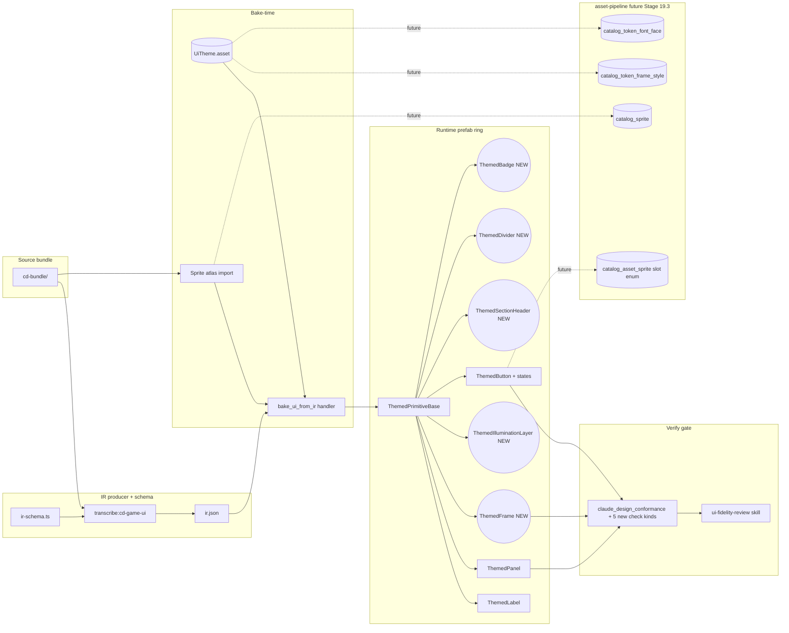

# UI Visual Fidelity Layer — Exploration

> Stub seeded 2026-04-30 after Stage 12 Step 15 convergence. Conformance
> passes (palette + panel kind + contrast + slug resolution) but human visual
> QA against `web/design-refs/step-1-game-ui/cd-bundle/` reveals a thick
> deferred surface: frame sprites, font binding, spacing, illumination,
> button states, content density. This doc is the input to a `design-explore`
> pass that grills decisions on scope, layering, surfaces, ordering, and
> success metric for the **Stage 13 visual fidelity layer**.

## Problem statement

After Stage 12, the game UI renders correctly per the **token contract**:

- Palette ramp colors paint Themed* component bound Image / TMP_Text.
- Panel kind enum matches IR.
- WCAG body-text contrast ≥ 4.5.
- Slot graph composition reparents accepted children.

But it does NOT render correctly per the **visual contract** documented in
`web/design-refs/step-1-game-ui/cd-bundle/` source assets:

- No frame ornament — corners, borders, inner shadow are flat panels.
- No typographic identity — all labels render in the default TMP font.
- No spacing rhythm — labels stack with default vertical layout group gap.
- No illumination / gradient — flat hex fills only.
- No button affordance — hover / press / focus states unimplemented.
- No content hierarchy — sections, dividers, headers, badges absent.

Human screenshots taken on info-panel + pause-menu + settings-screen +
save-load-screen confirm the gap. User stated: "Styles look very basic, raw,
unpolished. Not like I expected."

## Source of truth — design refs

| Path | Role |
|---|---|
| `web/design-refs/step-1-game-ui/cd-bundle/` | Visual reference bundle — sprites, computed styles, layout rects, font specs, motion. |
| `web/design-refs/step-1-game-ui/ir.json` | Current IR projection of cd-bundle. Carries only token slugs + slot graph. |
| `Assets/UI/Theme/DefaultUiTheme.asset` | Runtime UiTheme ScriptableObject. Carries palette + frame_style + font_face slug → spec. |
| `Assets/UI/Prefabs/Generated/*.prefab` | Baked prefabs. Themed* components bind tokens via slug. |

## Approaches surveyed

| Id | Approach | Scope | Cardinality |
|---|---|---|---|
| A | **Two-stage split** — Stage 13 chrome layer (frame sprites + font binding + spacing rhythm), Stage 14 content density (sections + dividers + button states + illumination) | All 6 gaps, sequenced | 2 stages |
| B | **All-at-once single stage** — Stage 13 covers all 6 fidelity gaps in one decomposed plan | All 6 gaps, parallel within stage | 1 stage |
| C | **Subset-first** — Stage 13 HUD + pause + info-panel only (highest visibility), defer settings + save-load + remaining surfaces to a follow-up | All 6 gaps, narrowed surfaces | 1 stage + deferred extension |
| D | **Pixel-diff-driven** — Stage 13 wires Play Mode screenshot diff against cd-bundle reference render first; lets diff anomalies drive per-gap follow-up Stages | Success metric first, gaps follow | 1 + N stages |

## Recommendation

**Approach B — all-at-once single stage.**

Rationale: all 6 gaps share the same surfaces (UiTheme, ThemedPrimitiveBase, bake_ui_from_ir, conformance bridge). Splitting into chrome-then-content (A) doubles the surface churn; subset-first (C) leaves visible surfaces unpolished; pixel-diff-driven (D) blocks scope on a metric not yet built. Single stage keeps token contract + visual contract aligned in one closeout.

## Open questions for design-explore (to be polled)

1. **Scope boundary** — does Stage 13 cover all six gaps, or split into two
   stages (chrome layer first, then content density)?
2. **Frame sprite swap surface** — bake-time vs runtime? sprite atlas vs
   nine-slice scriptable?
3. **Font asset binding surface** — Stage 6 catalog says "deferred"; pull
   forward or stub via direct TMP_FontAsset refs in UiTheme?
4. **Spacing tokens** — extend UiTheme with spacing_token slugs or piggyback
   on bake-time RectTransform writes?
5. **Illumination / gradient** — material vs sprite vs second-layer Image?
6. **Button states** — runtime ColorBlock + sprite swap, or animated
   ScriptableObject state machine?
7. **Conformance gate extension** — does fidelity require new check kinds
   (frame_visual, font_asset_bound, spacing_match), or does it stay token
   level + add Play Mode screenshot diff?
8. **Cardinality** — how many master-plan Stages? expected Step count per
   Stage?
9. **Surfaces in scope** — all 15 IR panel slugs, or subset (HUD + pause +
   info first)?
10. **Success metric** — pixel diff vs cd-bundle reference render? human
    sign-off? both?

## Exit criteria for the exploration

- Each open question above resolved with a chosen approach + rationale.
- Architectural seam list (which IA surfaces / Unity components / bake
  handlers are touched).
- Subsystem impact map.
- Implementation point list ready to seed `master-plan-new`.
- Rough task cardinality estimate per stage.

## Out of scope for the exploration

- Authoring the master plan itself (= `master-plan-new` skill, after this).
- Filing BACKLOG issues (= `stage-file`, after master plan).
- Implementing the layer (= `ship-stage` per task, after filing).

## Design Expansion

Approach **B — all-at-once single stage** locked. Interview answers below drive
component shapes. Catalog-shape alignment to asset-pipeline is the cross-cutting
constraint: every new UiTheme entry MUST mirror its eventual `catalog_token_*`
row so Stage 19.3 `wire_asset_from_catalog` (deferred) plugs in without rewrites.

### Architecture Decision

Phase 2.5 ran `arch_surface_resolve` against likely-touched surfaces (UiTheme
ScriptableObject, ThemedPrimitiveBase ring, `bake_ui_from_ir` handler,
`claude_design_conformance` handler, `ir-schema.ts`, `transcribe:cd-game-ui`).
**Zero hits** in the registered `arch_surfaces` table (only layers / flows /
contracts at architecture-spec scope are registered today). Per skill rules
("Zero arch hits → silent no-op"), no `arch_decision_write` /
`arch_changelog_append` / `arch_drift_scan` was written.

Note: this means the Stage 13 visual fidelity layer is NOT (yet) modeled as a
DEC-A-level architectural decision. If the asset-pipeline alignment reaches
production migration scope (Stage 19.3 active), file a separate DEC-A entry
covering the IR → catalog handshake before that stage ships.

### Components

Per component: responsibility · data flow · contract · non-scope.

1. **Frame sprite atlas + `UiTheme.frameStyleEntries` (catalog-shaped)**
   · paint frame ornament around panels via 9-slice sprite picked at bake time
   · cd-bundle frame asset → sprite atlas import → `FrameStyleSpec.{slug,
     catalog_sprite_slug:string, sprite_ref_fallback:Sprite,
     edge, innerShadowAlpha}` row → `ThemedFrame.SetFrameStyle(slug)`
   · contract mirrors `catalog_token_frame_style` + `catalog_sprite` row PK; bake
     handler resolves via local snapshot index when present, falls back to direct
     `sprite_ref_fallback`
   · non-scope: runtime sprite swap, animated frames, per-state frame variants

2. **Font asset binding via `UiTheme.fontFaceEntries` (catalog-shaped)**
   · supply TMP font asset to `ThemedLabel` per `font_face_slug`
   · cd-bundle font spec → `FontFaceSpec.{slug, font_catalog_slug,
     TMP_FontAsset font_ref, family, weight}` → ThemedLabel reads `font_ref`
     directly today, drops to `font_catalog_slug` resolution at Stage 19.3
   · contract mirrors `catalog_token_font_face` row
   · non-scope: legacy `Text` (LegacyRuntime) migration — kept on existing HUD
     per ui-design-system §1.2 policy; NEW work uses TMP only

3. **Spacing application via per-archetype IR detail (NO new token kind)**
   · bake handler reads `panel.detail.{paddingX, paddingY, gap, dividerThickness}`
     + `button.detail.{paddingX, paddingY}` and writes to `LayoutGroup.padding`
     / `spacing` / divider Image height during prefab construction
   · IR JSON schema extension: free-form JSON columns absorbed into existing
     `panel.detail` / `button.detail` shape — no `IrTokenSpacing` table, no
     `catalog_token_spacing`
   · contract: cd-bundle layout rect → transcribe → IR detail → bake
   · non-scope: global spacing tokens, runtime spacing overrides, responsive
     breakpoints

4. **`ThemedFrame` component (NEW)**
   · drives `Image.sprite` + `Image.type = Sliced` from `frame_style_slug`
   · binds in `Awake`/`OnThemeRebound`; `ThemedPrimitiveBase` subclass
   · contract: `[SerializeField] string frameStyleSlug` + `UiTheme.TryGetFrameStyle`
   · non-scope: nine-slice authoring tool, runtime border thickness animation

5. **`ThemedIlluminationLayer` component (NEW)**
   · drives a sibling `Image` overlay color + alpha from `illumination_slug`
     (gradient / inner-glow simulated via stacked Image)
   · binds via `UiTheme.TryGetIllumination` against existing `IlluminationSpec`
   · contract: `[SerializeField] string illuminationSlug`; layered over
     `ThemedFrame` Image as second-pass overlay
   · non-scope: shader-based gradient, runtime light shafts, screen-space FX

6. **`ThemedButton` extension (Unity native ColorBlock + SpriteState)**
   · existing `ThemedButton` extended to wire `Selectable.colors` from palette
     ramp slugs (`normal`, `highlighted`, `pressed`, `disabled`, `selected`) +
     `SpriteState` from `catalog_asset_sprite.slot` enum
     (`button_pressed` / `button_hover` / `button_disabled`)
   · optional `motion_curve_slug` drives transition timing via
     `Selectable.colors.fadeDuration`
   · contract: `[SerializeField] string paletteRampSlug, string spriteAtlasSlug,
     string motionCurveSlug`; bake handler patches Selectable on prefab create
   · non-scope: ScriptableObject state machine, custom transition kinds beyond
     Unity native enum

7. **Content density archetypes — `section_header`, `divider`, `badge`**
   · IR archetype enum extended; transcribe emits new archetypes from cd-bundle
     section markers; bake handler dispatches to `ThemedSectionHeader` /
     `ThemedDivider` / `ThemedBadge` (each = `ThemedPrimitiveBase` subclass)
   · contract: archetype enum row in `tools/scripts/ir-schema.ts` + dispatch row
     in `UiBakeHandler` switch
   · non-scope: section collapse/expand, animated dividers, badge count animations

8. **Bake handler patches — `bake_ui_from_ir`**
   · single bridge handler absorbs (a) sprite atlas import + frame_style_slug
     resolution, (b) font_ref direct binding, (c) IR detail spacing → LayoutGroup,
     (d) illumination overlay instantiation, (e) button state wiring, (f) new
     archetype dispatch
   · contract: existing `UiBakeHandler.cs` extended; no new bridge kind
   · non-scope: runtime re-bake without Editor reload, partial-prefab patching

9. **Conformance bridge extension — 5 new check kinds**
   · `claude_design_conformance` adds: `frame_visual_present` (Image.sprite
     non-null + matches slug), `font_asset_bound` (TMP_FontAsset != null +
     matches `font_face_slug`), `spacing_match` (LayoutGroup padding/spacing
     within ±1 px of IR detail), `button_states_wired`
     (Selectable.colors + SpriteState non-default), `illumination_layer_present`
     (sibling overlay Image exists when `illumination_slug` set)
   · contract: new `case` arms in `AgentBridgeCommandRunner.Conformance.cs`
   · non-scope: pixel-diff check, runtime-state animation check, motion-curve
     timing measurement

10. **`ui-fidelity-review` skill integration**
    · per-panel agent-led visual pass invoking the existing skill (already
      drafted at `ia/skills/ui-fidelity-review/`)
    · bake → Play Mode screenshot bridge → ui-fidelity-review skill judges
      panel against cd-bundle reference
    · contract: skill body + per-panel invocation row in master plan
    · non-scope: pixel-diff infra (deferred post-MVP), automated diff threshold

### Architecture diagram



### Subsystem impact

| Subsystem | Dependency | Invariant risk | Breaking vs additive | Mitigation |
|---|---|---|---|---|
| `ui-design-system` (spec §1.1–§1.5, §2.1) | Reads UiTheme tokens; new ThemedFrame / ThemedIlluminationLayer / Themed* archetypes register here | INV-12 (specs vs projects) | Additive — new component rows in §2 + §1.4 / §1.5 | Update spec §2 components list + §5.2 prefab paths after implement; do NOT branch a project spec |
| `asset-pipeline` (catalog tokens) | UiTheme entries shape-match `catalog_token_frame_style` / `catalog_token_font_face` / `catalog_sprite` / `catalog_asset_sprite` | None directly (DB schema); INV-13 (id-counter) only on backlog | Additive forward-compat path; no migration this stage | Catalog-shape fields use `_slug` strings, NOT FK ids; Stage 19.3 supplies resolver |
| `agent-bridge` (`UiBakeHandler.cs` + `AgentBridgeCommandRunner.Conformance.cs`) | Extended bake dispatch + 5 new check kinds | INV-3 (no FindObjectOfType in Update — bake runs in Editor, not at runtime), INV-4 (no new singleton — components are Inspector-bound), guardrail: AgentBridgeCommandRunner partial-class pattern | Additive — new switch arms; no kind rename | New check kinds live behind unique `check_kind` strings; existing kinds untouched |
| `ir-schema.ts` (IR JSON contract) | `panel.detail` + `button.detail` JSON column shapes extended; new archetype enum values | None (TS-only) | Additive on detail; archetype enum list grows | Add new archetypes + detail field rows to validator; ship transcribe + bake patches in same stage to keep contract aligned |
| `transcribe:cd-game-ui` (IR producer) | Emits new archetypes + detail spacing fields | None | Additive emitter | Snapshot test fixtures updated alongside |
| `claude_design_conformance` gate | 5 new check kinds in dispatcher | INV-3 (Editor-only), INV-4 (no new singleton) | Additive | Existing 6 kinds untouched; threshold logic preserved |
| `ui-fidelity-review` skill | Per-panel agent-led visual pass | None | Additive | Already drafted under `ia/skills/ui-fidelity-review/`; subagent generation via `npm run skill:sync:all` |
| `UiTheme` ScriptableObject | New fields on `FrameStyleSpec` (`catalog_sprite_slug`, `sprite_ref_fallback`); new field on `FontFaceSpec` (`font_catalog_slug`, `font_ref`) | INV-4 (no new singleton — UiTheme already a SO asset, not singleton) | Additive — old fields preserved; new fields default-empty | Migrate `DefaultUiTheme.asset` via Editor menu reseed + `UiThemeValidationMenu` smoke |

Invariants flagged by number: **3, 4, 12, 13** (all additive / Editor-bound, no behavior breakage).

### Implementation points

Phased checklist ordered by dependency graph.

1. **Foundation — UiTheme schema extensions**
   - [ ] Add `catalog_sprite_slug:string` + `sprite_ref_fallback:Sprite` to
         `FrameStyleSpec`
   - [ ] Add `font_catalog_slug:string` + `font_ref:TMP_FontAsset` to
         `FontFaceSpec`
   - [ ] NO `spacingEntries` list — per Q3, spacing rides IR detail
   - [ ] Migrate `Assets/UI/Theme/DefaultUiTheme.asset` via Editor reseed
   - [ ] `UiThemeValidationMenu` smoke green
2. **IR schema extension — `tools/scripts/ir-schema.ts`**
   - [ ] Add archetypes `section_header`, `divider`, `badge` to enum
   - [ ] Extend `panel.detail` shape: `{paddingX, paddingY, gap, dividerThickness?}`
   - [ ] Extend `button.detail` shape: `{paddingX, paddingY}`
   - [ ] Add IR validator rows for new archetypes
3. **Sprite atlas authoring**
   - [ ] cd-bundle frame sprite extraction script
   - [ ] Bake-time sprite atlas import via `AssetDatabase`
   - [ ] Atlas index file mapping `catalog_sprite_slug` → loaded `Sprite` asset
4. **Themed components (new + extension)**
   - [ ] `ThemedFrame.cs` — Image + Sliced + frame_style_slug binding
   - [ ] `ThemedIlluminationLayer.cs` — overlay Image + illumination_slug
   - [ ] `ThemedButton.cs` extension — ColorBlock + SpriteState wiring
   - [ ] `ThemedSectionHeader.cs` — title row archetype
   - [ ] `ThemedDivider.cs` — divider Image archetype
   - [ ] `ThemedBadge.cs` — count / status indicator archetype
5. **Bake handler patches — `Assets/Scripts/Editor/Bridge/UiBakeHandler.cs`**
   - [ ] Read new IR detail spacing fields → `LayoutGroup.padding` / `spacing`
   - [ ] New archetype dispatch (section_header / divider / badge)
   - [ ] Sprite atlas slug resolution with `sprite_ref_fallback` path
   - [ ] Illumination overlay Image instantiation
   - [ ] Button state wiring from palette ramp + SpriteState slots
6. **Conformance bridge — `AgentBridgeCommandRunner.Conformance.cs`**
   - [ ] `frame_visual_present` check kind
   - [ ] `font_asset_bound` check kind
   - [ ] `spacing_match` check kind (±1 px tolerance)
   - [ ] `button_states_wired` check kind
   - [ ] `illumination_layer_present` check kind
7. **`ui-fidelity-review` skill integration**
   - [ ] Generate `.claude/agents/ui-fidelity-review.md` via
         `npm run skill:sync:all`
   - [ ] Per-panel invocation row in Stage 13 master plan
8. **Per-panel rollout** — info-panel · pause-menu · settings-screen ·
   save-load-screen · HUD · dialog (TBD subset/all per master-plan scope)

**Deferred / out of scope**

- Pixel-diff infra (post-MVP — Approach D rejected as gate)
- ScriptableObject animated state machine (Approach 6 rejected per Q4)
- Global `catalog_token_spacing` table (per Q3 — IR detail absorbs)
- Per-panel motion library beyond `motion_curve_slug` transitions
- Stage 19.3 `wire_asset_from_catalog` runtime resolver (asset-pipeline blocker)
- Legacy `UnityEngine.UI.Text` migration to TMP for existing HUD

### Examples

**Most non-obvious: `ThemedButton` state wiring** — palette ramp slug + catalog
sprite slot enum drive Unity native ColorBlock + SpriteState in one bake pass.

**Input — IR JSON fragment**

```json
{
  "kind": "button",
  "slug": "pause-menu/resume",
  "archetype": "button-primary",
  "detail": {
    "paddingX": 16,
    "paddingY": 8,
    "palette_ramp_slug": "accent-primary",
    "sprite_atlas_slug": "atlas/pause-menu/buttons",
    "motion_curve_slug": "spring-snap"
  }
}
```

**Output — bake handler writes**

```csharp
// UiBakeHandler.cs (extension excerpt)
var btn = go.GetComponent<ThemedButton>();
if (theme.TryGetPalette(detail.palette_ramp_slug, out var ramp))
{
    var colors = btn.colors;
    colors.normalColor      = ramp.normal;
    colors.highlightedColor = ramp.highlighted;
    colors.pressedColor     = ramp.pressed;
    colors.disabledColor    = ramp.disabled;
    colors.selectedColor    = ramp.selected;
    if (theme.TryGetMotionCurve(detail.motion_curve_slug, out var curve))
    {
        colors.fadeDuration = curve.durationMs / 1000f;
    }
    btn.colors = colors;
}

// SpriteState wired from catalog_asset_sprite.slot enum via atlas index.
var atlas = AtlasIndex.Resolve(detail.sprite_atlas_slug);
btn.spriteState = new SpriteState
{
    pressedSprite     = atlas["button_pressed"],
    highlightedSprite = atlas["button_hover"],
    disabledSprite    = atlas["button_disabled"],
    selectedSprite    = atlas["button_pressed"]  // selected = pressed sprite by default
};
btn.transition = Selectable.Transition.SpriteSwap;  // honors both ColorBlock + SpriteState
```

**Edge case — palette ramp slug missing OR atlas slug missing**

- Missing palette ramp → `TryGetPalette` returns false; skip ColorBlock write,
  Selectable retains Unity default colors. Conformance check `button_states_wired`
  reports `missing_palette_ramp:{slug}` warning, NOT error (graceful degrade).
- Missing atlas slug or slot key → `AtlasIndex.Resolve` returns empty index;
  `SpriteState` set to `default(SpriteState)`. Conformance check reports
  `missing_sprite_state:{slug}/{slot}` warning. ColorBlock alone still gives
  visible state feedback; sprite swap silently disabled.
- Both missing → button still functional via Unity native defaults; conformance
  emits TWO warnings (catchable in CI); no Editor exception thrown.

**Forward-compat note** — when Stage 19.3 lands, `AtlasIndex.Resolve` migrates
to `catalog_asset_sprite` DB lookup keyed by `(asset_id, slot)`. The IR detail
+ ThemedButton wiring stay byte-identical; only the resolver swaps.

### Review notes

Phase 8 review run via mental subagent simulation (Plan reviewer prompt). No
BLOCKING items emerged. NON-BLOCKING + SUGGESTIONS captured below for the
master-plan author to absorb:

- **NON-BLOCKING** — Catalog-shape fields use `_slug:string`, not FK ids. This
  means UiTheme rows can drift from `catalog_token_*` rows without a referential
  check. Stage 19.3 must add a validation pass; flag in master plan as a
  follow-up Step in the Stage 19.3 closeout, NOT here.
- **NON-BLOCKING** — `ThemedIlluminationLayer` as sibling Image overlay (vs
  shader gradient) trades fidelity for simplicity; works for inner-glow but
  not for true gradient fills. If Stage 14+ adds gradient panels, revisit
  with shader-graph or material-only approach. Document the tradeoff in the
  Stage 13 closeout digest.
- **NON-BLOCKING** — `spacing_match` conformance check uses ±1 px tolerance.
  Tolerance choice empirical; if cd-bundle layout numbers disagree with Unity
  pixel grid by more than 1 px in practice, widen to ±2 px in a follow-up Step
  rather than rebaking IR.
- **SUGGESTION** — Per-panel rollout order (Step 8) should front-load
  pause-menu + info-panel (already smoke-tested in Stage 12 Step 14.5). HUD
  last — it carries the most legacy `UnityEngine.UI.Text` and may need a
  scoped TMP migration sub-Step (out-of-scope per Q3 spacing answer + ui-design
  §1.2 policy).
- **SUGGESTION** — Bake handler refactor — current `UiBakeHandler.cs` is one
  monolithic class; splitting per-archetype dispatch into partials
  (`UiBakeHandler.Frame.cs`, `UiBakeHandler.Button.cs`, etc.) before adding
  six new archetypes keeps diffs reviewable. Mirrors
  `AgentBridgeCommandRunner.Mutations.cs` partial pattern (per
  `invariants_summary` guardrail).

### Expansion metadata

- **Date** — 2026-04-30
- **Model** — claude-opus-4-7
- **Approach selected** — B (all-at-once single stage)
- **Phases completed** — 0–2 + 0.5 (main session); 2.5 (silent no-op, zero
  arch surface hits); 3, 4, 5, 6, 7, 8, 9 (this session)
- **Blocking items resolved** — 0 (none surfaced in Phase 8 review)
- **Catalog-shape alignment** — frameStyleEntries → `catalog_token_frame_style`
  + `catalog_sprite`; fontFaceEntries → `catalog_token_font_face`; button
  states → `catalog_asset_sprite.slot` enum (existing); spacing → IR detail
  free-form JSON (no catalog_token_spacing per Q3)
