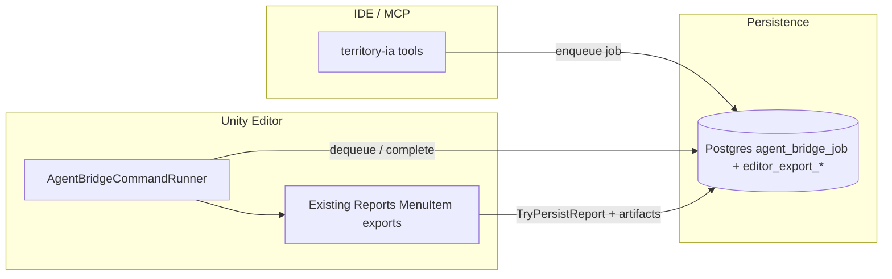

# Unity ↔ IDE Agent Bridge — Analysis and Proposals

**Date:** 2026-04-06
**Scope:** Close the loop between Unity runtime/Editor and IDE agents so that AI-assisted development, debugging, and validation can happen with minimal manual intervention.
**Audience:** Developers and Cursor agents planning infrastructure for autonomous debugging, data export, and closed-loop fix verification.

**Trace:** **glossary** **IDE agent bridge** — **Phase 1** archived [`BACKLOG-ARCHIVE.md`](../BACKLOG-ARCHIVE.md); optional later phases remain in this charter. **Close Dev Loop** orchestration shipped — [`BACKLOG-ARCHIVE.md`](../BACKLOG-ARCHIVE.md) **Recent archive**.

**Related:**
- [`docs/mcp-ia-server.md`](mcp-ia-server.md) — territory-ia MCP (current tool surface)
- [`docs/postgres-ia-dev-setup.md`](postgres-ia-dev-setup.md) — Postgres dev schema, Editor export registry
- [`docs/postgres-interchange-patterns.md`](postgres-interchange-patterns.md) — B1/B3/P5 interchange
- [`docs/agent-tooling-verification-priority-tasks.md`](agent-tooling-verification-priority-tasks.md) — ordering principles
- [`ia/specs/unity-development-context.md`](../ia/specs/unity-development-context.md) §10 — Editor agent diagnostics
- [`ARCHITECTURE.md`](../ARCHITECTURE.md) — system layers and dependency map
- [`ia/specs/glossary.md`](../ia/specs/glossary.md) — domain vocabulary

---

## 1. Problem Statement

### 1.1 The friction gap

Territory Developer has invested significantly in **information architecture** (IA): Markdown specs, glossary, reference specs, MCP tools (`territory-ia`), JSON interchange schemas, Postgres dev tables, and Editor export menus. An agent today can query specs, glossary terms, backlog issues, and computational utilities — all without leaving the IDE.

However, a critical gap remains: **the agent cannot trigger Unity to produce runtime data**. Every export — Agent Context JSON, Sorting Debug Markdown, Cell Chunk Interchange, World Snapshot, UI Inventory, Geography Init Report — must be initiated by a human clicking **Territory Developer → Reports → ...** inside Unity. The developer must then communicate results back to the agent (copy-paste, screenshots, manual description). This creates a **manual bottleneck** in every debugging and validation cycle:

```
┌──────────┐      manual       ┌───────────┐      manual       ┌──────────┐
│  Agent   │ ←─────────────── │   Unity   │ ←─────────────── │Developer │
│ (IDE)    │ ──────────────→  │ (Runtime) │ ──────────────→  │ (Human)  │
└──────────┘   request data    └───────────┘   trigger export   └──────────┘
```

### 1.2 Impact on development velocity

| Scenario | Current cost | With bridge |
|----------|-------------|-------------|
| Debug sorting order conflict | Dev exports cell data → pastes JSON → agent analyzes → proposes fix → dev re-exports to verify | Agent requests neighborhood data → analyzes → applies fix → re-requests → confirms autonomously |
| UI theme iteration | Dev runs Validate UI Theme → screenshots → describes to agent | Agent triggers validation + inventory export → reads JSON directly |
| AUTO simulation tuning | Dev runs sim → manually reports growth ring state | Agent triggers world snapshot → reads metrics → adjusts parameters |
| Geography init debugging | Dev clicks Export Geography Init → copies file → shares | Agent triggers export → reads report → compares with expected |

**Conservative estimate:** Each manual round-trip costs 2–5 minutes of context-switching. A typical debugging session involves 3–8 such round-trips. An automated bridge could reduce this from 15–40 minutes of human intervention to near-zero per session.

---

## 2. Current State Inventory

### 2.1 What exists in Unity (Editor scripts)

All exports live under `Assets/Scripts/Editor/` (Editor-only assembly, excluded from player builds):

| Script | Menu path | Mode | Outputs |
|--------|-----------|------|---------|
| `AgentDiagnosticsReportsMenu.cs` | Export Agent Context | Edit + Play | JSON: scene, selection, grid sample (Moore neighborhood), HeightMap, WaterMap |
| `AgentDiagnosticsReportsMenu.cs` | Export Sorting Debug (Markdown) | Play only | Markdown: per-cell sorting formula breakdown, SpriteRenderer samples |
| `InterchangeJsonReportsMenu.cs` | Export Cell Chunk (Interchange) | Play only | JSON: bounded cell subset with heights, prefabs, water body data |
| `InterchangeJsonReportsMenu.cs` | Export World Snapshot (Dev Interchange) | Play only | JSON: full water body histogram + optional HeightMap raster |
| `GeographyInitReportMenu.cs` | Export Geography Init Report | Play only | JSON: master seed, toggles, optional interchange snapshot |
| `UiInventoryReportsMenu.cs` | Export UI Inventory (JSON) | Edit only | JSON: Canvas/RectTransform/Graphic/Text/TMP sampling across scenes |
| `UiThemeValidationMenu.cs` | Validate UI Theme | Edit + Play | Console output: theme token validation |
| `EditorPostgresExportRegistrar.cs` | Postgres registry — settings... | N/A | EditorPrefs window for issue id, DATABASE_URL, node path |

**Data pipeline:** Exports that use **`EditorPostgresExportRegistrar.TryPersistReport`** are **Postgres-only** when the registry path runs (`register-editor-export.mjs` with **`DATABASE_URL`**); there is **no** workspace fallback under **`tools/reports/`** (staging uses a temp file or absolute path). The **`document jsonb`** column stores full export bodies with **GIN** indexes.

### 2.2 What exists in MCP (territory-ia)

23 registered tools including:
- **IA slice tools:** `spec_section`, `spec_sections`, `glossary_discover`, `glossary_lookup`, `router_for_task`, `invariants_summary`, etc.
- **Computational tools:** `isometric_world_to_grid`, `growth_ring_classify`, `grid_distance`, `pathfinding_cost_preview`, `geography_init_params_validate`
- **Stubs:** `desirability_top_cells` → `NOT_AVAILABLE` (awaiting Unity batchmode hook)
- **Unity Editor bridge (Phase 1):** `unity_bridge_command` / `unity_bridge_get` — `export_agent_context` via **Postgres** **`agent_bridge_job`** (**`DATABASE_URL`**, migration **0008**, **Unity** open on **REPO_ROOT**, **AgentBridgeCommandRunner** + **Node** dequeue/complete scripts); see **glossary** **IDE agent bridge** and [`BACKLOG-ARCHIVE.md`](../BACKLOG-ARCHIVE.md).

### 2.3 What exists in Postgres

- `editor_export_agent_context`, `editor_export_sorting_debug`, `editor_export_terrain_cell_chunk`, `editor_export_world_snapshot_dev`, `editor_export_ui_inventory` — per-export history tables with `document jsonb`
- `dev_repro_bundle` — metadata bundles pointing to report files
- `ia_project_spec_journal` — Decision Log / Lessons Learned history

### 2.4 Relevant open backlog issues

| Issue | Relevance to bridge |
|-------|-------------------|
| **Close Dev Loop** (**TECH-75** orchestration; **`close-dev-loop`** Skill + Play Mode **`kind`** + **`debug_context_bundle`** + dev environment preflight — [`BACKLOG-ARCHIVE.md`](../BACKLOG-ARCHIVE.md) **Recent archive**) | **`close-dev-loop`** + compile gate + preflight shipped — archived [`BACKLOG-ARCHIVE.md`](../BACKLOG-ARCHIVE.md) |
| **TECH-33** | Asset introspection: prefab manifest + scene MonoBehaviour listing — BACKLOG cites `-batchmode` as one option; Agent Bridge here assumes **Editor open** + bridge commands, not CI |
| **TECH-15** | Geography initialization performance — needs profiler harness under `tools/reports/` |
| **TECH-16** | Simulation tick performance — needs spec-labeled tick harness JSON |
| **TECH-38** | Core computational modules + batchmode hooks preparation |
| **TECH-18** | Migrate IA from Markdown to PostgreSQL — long-term MCP evolution |
| **TECH-43** | Append-only JSON line event log — telemetry/anomaly streaming |
| **TECH-54** | Agent patch proposal staging (E3) — agent → Unity change proposals |

**Reports menus:** Expected **Territory Developer → Reports** behavior is normative in [`ia/specs/unity-development-context.md`](../ia/specs/unity-development-context.md) §10. A prior tooling-gap row was verified and archived (**Recent archive** in [`BACKLOG-ARCHIVE.md`](../BACKLOG-ARCHIVE.md)).

---

## 3. Technical Research: Unity External Automation Capabilities

### 3.1 Unity `-batchmode` + `-executeMethod` (proven, native)

Unity can be launched from the command line without the Editor GUI (`-batchmode`) to execute any static method:

```bash
/Applications/Unity/Hub/Editor/<version>/Unity.app/Contents/MacOS/Unity \
  -batchmode -nographics -logFile - \
  -projectPath /path/to/project \
  -executeMethod AgentDiagnosticsReportsMenu.ExportAgentContext
```

**Characteristics:**
- Runs without GUI; uses existing Editor scripts
- Can execute any `[MenuItem]`-attributed static method via `EditorApplication.ExecuteMenuItem()`
- Cannot enter Play Mode interactively (but can programmatically via `EditorApplication.EnterPlaymode()` + `EditorApplication.Exit()`)
- **Limitation:** Unity locks the project directory — cannot run while Unity Editor is already open on the same project
- **Typical external use:** One-off local automation when no Editor holds the project lock. **Out of scope for this bridge program:** headless CI, scheduled batch runs, or making `-batchmode` a delivery goal — Unity supports those patterns; this document mentions them only as background (see §3.7).

### 3.2 Embedded HTTP/WebSocket server in Unity (custom, powerful)

A lightweight server running inside Unity (Editor or Play Mode) exposes endpoints for external callers:

```csharp
// Illustrative — not a complete implementation
[InitializeOnLoad]
public static class AgentBridgeServer
{
    static HttpListener _listener;

    static AgentBridgeServer()
    {
        _listener = new HttpListener();
        _listener.Prefixes.Add("http://localhost:7780/");
        _listener.Start();
        EditorApplication.update += PollRequests;
    }

    static void PollRequests()
    {
        if (!_listener.IsListening) return;
        while (_listener.BeginGetContext(OnRequest, _listener) != null) { }
    }
}
```

**Characteristics:**
- Works while Unity Editor is open and running (Play Mode or Edit Mode)
- Agent can `POST` commands and receive JSON responses
- Can stream logs, trigger exports, capture screenshots
- Real-time, bidirectional communication
- **Existing ecosystem:** Unity API Communicator (200+ endpoints, commercial), UnityMCP (MCP protocol, open-source), CoplayDev/unity-mcp (open-source)
- **Security:** localhost-only binding; no external exposure needed

### 3.3 File-based command queue (simple, no networking)

Unity watches a file/directory for incoming command requests:

```
Agent writes → tools/reports/.agent-commands/pending/export-cells-001.json
Unity polls  → reads, executes, writes response to .../completed/export-cells-001-result.json
Agent reads  ← result
```

**Characteristics:**
- Zero networking dependencies
- Works in both Editor and via `-batchmode`
- Lower latency than batchmode (no Unity restart) if Editor is running
- Staging pattern superseded by **Close Dev Loop** (agent drives Play Mode directly)
- **Existing precedent:** `EditorPostgresExportRegistrar` already writes/reads staging files under `tools/reports/.staging/`

### 3.4 `Application.logMessageReceived` — real-time log forwarding

```csharp
Application.logMessageReceived += (logString, stackTrace, type) => {
    // Forward to WebSocket, file, or named pipe
};
```

**Characteristics:**
- Captures all `Debug.Log`, `Debug.LogWarning`, `Debug.LogError`
- Thread-safe variant: `Application.logMessageReceivedThreaded`
- Can be filtered by tag, severity, frame
- Enables agent to monitor Unity console without screenshots

### 3.5 `ScreenCapture` — programmatic screenshots

```csharp
ScreenCapture.CaptureScreenshot("path.png");
// Or into RenderTexture for async GPU readback:
ScreenCapture.CaptureScreenshotIntoRenderTexture(renderTexture);
```

**Characteristics:**
- Play Mode only (game view capture)
- Can capture specific cameras with RenderTexture
- Async GPU readback available for non-blocking capture
- Useful for visual regression testing and agent visual analysis

### 3.6 `EditorConnection` / `PlayerConnection` (Unity IPC)

Unity's built-in Editor ↔ Player message bus:
- Uses GUID-keyed messages with byte[] payloads
- Designed for profiler and diagnostics
- Requires Development Build; more complex setup than HTTP

### 3.7 Unity Test Framework (CLI) — reference only

```bash
Unity -runTests -batchmode -projectPath PATH -testPlatform PlayMode -testResults results.xml
```

Unity can run Edit Mode and Play Mode tests from the command line and emit XML/JUnit-style results. **Not a desired or planned part of the Agent Bridge roadmap here** (no headless CI objective). Listed only so readers know the capability exists if a team chose it independently.

### 3.8 Evaluation matrix

| Approach | Works with Editor open | Play Mode data | Latency | Complexity | Reuses existing exports |
|----------|----------------------|----------------|---------|------------|------------------------|
| `-batchmode` | No (project lock) | Programmatic only | High (Unity restart) | Low | Yes (`-executeMethod`) |
| HTTP server | Yes | Yes | Low (ms) | Medium | Yes (calls same methods) |
| File command queue | Yes | Yes | Medium (poll interval) | Low | Yes (calls same methods) |
| `EditorConnection` | Yes (dev builds) | Yes | Low | High | No (custom protocol) |
| Test Framework | No (project lock) | PlayMode tests | High | Medium | Partial |

**Recommendation:** **File command queue** as the Phase 1 minimum viable bridge (lowest risk, builds on proven staging patterns), with **HTTP server** as the Phase 2 upgrade for real-time interaction. `-batchmode` remains a **technical** option when the project is not open in Editor; **do not** treat CLI/headless automation as a program goal (§3.1, §3.7).

---

## 4. Proposed Architecture: Unity Agent Bridge

### 4.1 Design principles

1. **Reuse, don't rebuild:** All existing `AgentDiagnosticsReportsMenu`, `InterchangeJsonReportsMenu`, `GeographyInitReportMenu`, `UiInventoryReportsMenu` methods become callable from the bridge — no duplication of export logic.
2. **File-first, DB-optional:** Use `tools/reports/` as the interchange layer; Postgres remains a bonus persistence path.
3. **Security:** Localhost only; no secrets in bridge payloads; `DATABASE_URL` stays in environment/EditorPrefs.
4. **Incremental:** Each phase delivers standalone value. Phase 1 works without any networking.
5. **Glossary-aligned:** Command names and response shapes use canonical vocabulary from `glossary.md`.
6. **No headless CI mandate:** The bridge targets **developer machines with Unity Editor** (file queue or localhost HTTP). Batch CLI / CI automation is **not** a desired outcome of this program (see §3.1, §3.7).

### 4.2 Three-phase architecture

```
Phase 1: File-based command queue (MVP)
═══════════════════════════════════════
┌─────────────────┐                           ┌─────────────────┐
│  MCP tool        │                           │  Unity Editor   │
│  (territory-ia)  │                           │  (polling)      │
│                  │  writes command JSON       │                 │
│  unity_bridge_*  │ ──────────────────────→   │  AgentBridge    │
│                  │  reads response JSON       │  CommandRunner  │
│                  │ ←──────────────────────   │                 │
└─────────────────┘  tools/reports/.agent-cmd/  └─────────────────┘

Phase 2: HTTP bridge (real-time)
════════════════════════════════
┌─────────────────┐                           ┌─────────────────┐
│  MCP tool        │  POST /api/export/cells   │  Unity Editor   │
│  (territory-ia)  │ ──────────────────────→   │  HttpBridge     │
│                  │  JSON response             │  (port 7780)    │
│                  │ ←──────────────────────   │                 │
└─────────────────┘  localhost:7780             └─────────────────┘

Phase 3: Streaming + visual (advanced)
══════════════════════════════════════
  - WebSocket log streaming
  - Screenshot capture on demand
  - Before/after comparison automation
```

**Out of scope (not planned):** headless CI, scheduled `-batchmode` test grids, or bridge work driven by continuous integration. Unity’s CLI and Test Framework remain **ecosystem background** only (§3.1, §3.7).

### 4.3 Command protocol (file-based, Phase 1)

**Command file** (written by MCP tool):

```json
{
  "schema_version": 1,
  "command_id": "cmd-20260406-143022-abc123",
  "command": "export_agent_context",
  "params": {},
  "requested_at_utc": "2026-04-06T14:30:22Z"
}
```

**Response file** (written by Unity):

```json
{
  "schema_version": 1,
  "command_id": "cmd-20260406-143022-abc123",
  "status": "completed",
  "result": {
    "export_kind": "agent_context",
    "file_path": "tools/reports/agent-context-20260406-143022.json",
    "db_persisted": true,
    "summary": "16 cells sampled around seed (5,7), Play Mode"
  },
  "completed_at_utc": "2026-04-06T14:30:23Z"
}
```

**File layout:**

```
tools/reports/.agent-bridge/
  pending/     ← MCP writes command JSON here
  completed/   ← Unity writes response JSON here
  .gitignore   ← ignore everything
```

**Supported commands (Phase 1, reusing existing exports):**

| Command | Maps to | Mode | Parameters |
|---------|---------|------|------------|
| `export_agent_context` | `AgentDiagnosticsReportsMenu.ExportAgentContext()` | Edit + Play | `seed_x`, `seed_y` (optional) |
| `export_sorting_debug` | `AgentDiagnosticsReportsMenu.ExportSortingDebug()` | Play | `seed_x`, `seed_y` (optional) |
| `export_cell_chunk` | `InterchangeJsonReportsMenu.ExportCellChunkInterchange()` | Play | `origin_x`, `origin_y`, `width`, `height` |
| `export_world_snapshot` | `InterchangeJsonReportsMenu.ExportWorldSnapshotDev()` | Play | `include_height_raster` |
| `export_geography_init` | `GeographyInitReportMenu.ExportGeographyInitReport()` | Play | — |
| `export_ui_inventory` | `UiInventoryReportsMenu.ExportUiInventory()` | Edit | — |
| `validate_ui_theme` | `UiThemeValidationMenu.ValidateTheme()` | Edit + Play | — |
| `capture_screenshot` | **Shipped:** default named `Camera` render; optional `include_ui` → `ScreenCapture` (Game view + Overlay UI) → `tools/reports/bridge-screenshots/*.png` | Play | `camera` (optional GameObject name), `filename_stem` (optional), `include_ui` (optional bool) — **`unity_bridge_command`** **`kind`** |
| `get_console_logs` | **Shipped:** `AgentBridgeConsoleBuffer` (cleared on domain reload) | Edit + Play | `since_utc`, `severity_filter`, `tag_filter`, `max_lines` — **`unity_bridge_command`** **`kind`**; **`response.log_lines`** |
| `get_play_mode_status` | New: is game running? | Any | — |

### 4.4 Unity-side implementation (Editor script)

```csharp
// Illustrative design — AgentBridgeCommandRunner.cs (Editor-only)
[InitializeOnLoad]
public static class AgentBridgeCommandRunner
{
    static string PendingDir => Path.Combine(RepoRoot, "tools/reports/.agent-bridge/pending");
    static string CompletedDir => Path.Combine(RepoRoot, "tools/reports/.agent-bridge/completed");

    static AgentBridgeCommandRunner()
    {
        EditorApplication.update += PollPendingCommands;
    }

    static void PollPendingCommands()
    {
        if (!Directory.Exists(PendingDir)) return;
        foreach (var file in Directory.GetFiles(PendingDir, "*.json"))
        {
            var cmd = JsonUtility.FromJson<BridgeCommand>(File.ReadAllText(file));
            var result = ExecuteCommand(cmd);
            File.WriteAllText(
                Path.Combine(CompletedDir, Path.GetFileName(file)),
                JsonUtility.ToJson(result, true));
            File.Delete(file);
        }
    }

    static BridgeResponse ExecuteCommand(BridgeCommand cmd)
    {
        switch (cmd.command)
        {
            case "export_agent_context":
                AgentDiagnosticsReportsMenu.ExportAgentContext();
                return new BridgeResponse { status = "completed", ... };
            // ... other commands dispatch to existing methods
        }
    }
}
```

**Key design decisions:**
- Polls every Editor frame via `EditorApplication.update` (cheap — just `Directory.GetFiles`)
- Dispatches to existing static methods (no logic duplication)
- Auto-starts when Unity opens the project (via `[InitializeOnLoad]`)
- Falls back gracefully if directories don't exist

### 4.5 HTTP bridge upgrade (Phase 2)

Replace polling with a lightweight `HttpListener` on `localhost:7780`:

```
POST /api/command
Content-Type: application/json

{"command": "export_cell_chunk", "params": {"origin_x": 5, "origin_y": 7, "width": 8, "height": 8}}

→ 200 OK
{"status": "completed", "result": { ... }}
```

Advantages over file-based:
- Sub-second round-trip (no polling delay)
- Streaming responses possible (logs, progress)
- Standard REST patterns; easy to test with `curl`
- Same command dispatch — just a different transport

---

## 5. Proposed MCP Tools (territory-ia)

### 5.1 Core bridge tools

| Tool name | Purpose | Phase |
|-----------|---------|-------|
| `unity_bridge_command` | Send any supported command to Unity bridge; returns response JSON | 1 |
| `unity_bridge_status` | Check if Unity bridge is alive (pending dir exists, recent heartbeat) | 1 |
| `unity_export_agent_context` | Sugar: export Agent Context and return parsed JSON | 1 |
| `unity_export_sorting_debug` | Sugar: export Sorting Debug and return parsed Markdown | 1 |
| `unity_export_cell_chunk` | Sugar: export cell chunk with params and return parsed JSON | 1 |
| `unity_export_world_snapshot` | Sugar: export world snapshot and return summary | 1 |
| `unity_capture_screenshot` | Trigger screenshot capture; return file path | 2 |
| `unity_get_logs` | Retrieve recent console log entries (filtered) | 2 |
| `unity_play_mode_status` | Check if Unity is in Play Mode, grid initialized, etc. | 1 |

### 5.2 Higher-level composite tools

| Tool name | Purpose | Phase |
|-----------|---------|-------|
| `unity_debug_context_bundle` | Export agent context + sorting debug + screenshot in one call; return combined summary | 2 |
| `unity_cell_neighborhood` | Export cell chunk around given coordinates with all neighbor data | 1 |
| `unity_sorting_issue_analysis` | Combine sorting debug + cell data + prefab info for a region; structured for sorting order bug analysis | 2 |
| `unity_validate_fix` | Export relevant data, compare with previous export, report whether issue appears resolved | 3 |

### 5.3 Tool interaction example (sorting order bug)

```
Agent flow:
1. Agent calls `unity_play_mode_status` → confirms Play Mode, grid initialized
2. Agent calls `unity_export_cell_chunk(origin_x=10, origin_y=15, width=6, height=6)` → gets cell data with heights, prefabs, water bodies
3. Agent calls `unity_export_sorting_debug(seed_x=12, seed_y=17)` → gets per-cell sorting formula breakdown
4. Agent calls `unity_capture_screenshot()` → gets visual reference
5. Agent analyzes data, proposes code fix in TerrainManager or GridSortingOrderService
6. After applying fix, agent calls `unity_export_sorting_debug(seed_x=12, seed_y=17)` again
7. Agent compares before/after sorting values → confirms fix or iterates
8. Only then asks developer for visual confirmation
```

---

## 6. Proposed Cursor Skills

### 6.1 `debug-sorting-order` skill

Automates the sorting order debugging workflow:
1. Use `unity_export_sorting_debug` + `unity_export_cell_chunk` for the problem area
2. Pull `spec_section(geo, 7)` for canonical sorting formula
3. Compare runtime values with expected formula output
4. Identify discrepancies
5. Propose fix, apply, re-export, verify

### 6.2 `debug-visual-regression` skill

General visual debugging:
1. `unity_capture_screenshot` + `unity_export_agent_context` for baseline
2. Apply code changes
3. Re-capture and re-export
4. Compare data structures; flag visual check to developer only if data looks correct but might have subtle visual issues

### 6.3 `validate-auto-simulation` skill

Verify AUTO systems behavior:
1. `unity_export_world_snapshot` for current state
2. Run N simulation ticks (via bridge command)
3. Re-export world snapshot
4. Compare growth ring distribution, zoning patterns, road density
5. Report anomalies vs expected gradient (glossary: Urban growth rings)

---

## 7. Relationship to Existing Backlog Issues

### 7.1 Issues that become easier / partially solved

| Issue | How bridge helps |
|-------|-----------------|
| **Close Dev Loop** (**TECH-75**; **`close-dev-loop`** + **`debug_context_bundle`** + dev preflight archived [`BACKLOG-ARCHIVE.md`](../BACKLOG-ARCHIVE.md)) | Agent enters Play Mode, collects evidence, verifies fix — supersedes registry staging concept |
| **TECH-15** (Geography init performance) | Agent can trigger Export Geography Init Report and read timing data without developer intervention |
| **TECH-16** (Simulation tick performance) | Agent can trigger exports after sim ticks to measure phases |
| **Editor Reports** (§10 contract) | Bridge adds an alternate dispatch path; menus remain the human baseline |
| **TECH-33** (Asset introspection) | Bridge command `export_prefab_manifest` when Editor is open; independent of batchmode |
| **TECH-38** (Batchmode hooks) | May share utilities if TECH-38 ships for other reasons; bridge does **not** depend on batchmode or CI |
| **BUG-28** (Sorting order: slope vs interstate) | Agent can autonomously debug using sorting debug export |
| **Map border** terrain / **cliff** regressions | Agent can export cell chunk at border cells + sorting data (`export_agent_context`, `seed_cell`) |
| **HUD** / **MainMenu** polish (shipped **`UiTheme`**) | Agent can trigger **UI** inventory export to verify theme changes |

### 7.2 Proposed new backlog issue

A new **TECH-** issue should be created to track the Unity Agent Bridge as a program:

**Suggested title:** "Unity Agent Bridge: file-based command queue + MCP tools for agent-triggered exports"

**Phases:**
1. File-based command queue (Unity Editor polling + MCP tools)
2. HTTP bridge (real-time, localhost)
3. Streaming, screenshots, before/after comparison automation (still **Editor-centric**; no headless CI)

**Dependencies:** None hard. Soft: keep **Reports** exports aligned with **unity-development-context** §10; **Close Dev Loop** (**TECH-75**; **`close-dev-loop`** archived; context bundle archived) absorbs staging concept.

---

## 8. Feasibility Assessment

### 8.1 What makes this achievable now (70–80% of infrastructure exists)

1. **Export logic is complete and tested** — 7 Editor menu items producing well-structured JSON/Markdown
2. **Postgres pipeline works** — DB-first with fallback; `document jsonb` with GIN indexes
3. **MCP server is mature** — 24 tools (including **`unity_bridge_command`** / **`unity_bridge_get`** for Phase 1), Zod validation, test infrastructure, `npm run verify`
4. **File interchange is proven** — `tools/reports/` convention, `.staging/` directory pattern, gitignore policy
5. **Glossary vocabulary is stable** — tool names, response shapes, and domain terms are well-defined

### 8.2 What needs to be built

| Component | Relative size | Risk / notes |
|-----------|---------------|--------------|
| `AgentBridgeCommandRunner.cs` (Unity Editor, file polling) | Small — thin dispatch over existing `[MenuItem]` exports | Low — `EditorApplication.update` + call existing static methods |
| Bridge command/response JSON schema | Small — envelope only | Low — same interchange discipline as other reports |
| MCP tools (`unity_bridge_command`, optional sugar wrappers) | Small — mirror existing `registerTool` patterns | Low |
| `.gitignore` + directory conventions | Trivial | Trivial |
| Phase 2: HttpListener bridge | Moderate — transport swap, same command surface | Medium — main-thread marshaling |
| Phase 3: Log streaming + screenshots | Moderate | Medium — async GPU readback, WebSocket if used |
| Cursor Skills (sorting debug, visual regression) | Small each — orchestration prose | Low |

**Sequencing (no calendar implied):** The **MVP** is a **narrow vertical slice**: poll a folder, run one existing export, write a response file, expose one MCP tool. That scope is **small relative to the codebase** because export bodies and Postgres paths already exist — it is **not** a multi-track program on its own. With menus compiling and exports stable, the MVP is a **single cohesive change** (Editor runner + MCP entry point), not a staged program timeline. Phase 2 and Phase 3 are **optional follow-ups** when latency or streaming matters; they do not block proving the loop.

### 8.3 Risks and mitigations

| Risk | Likelihood | Impact | Mitigation |
|------|-----------|--------|------------|
| File polling adds Editor overhead | Low | Low | Poll every N frames, not every frame; check directory existence first |
| Play Mode exports fail when grid not initialized | Medium | Medium | `get_play_mode_status` check before export commands; clear error messages |
| Multiple agents writing commands concurrently | Low | Low | UUID-based command files; last-write-wins for commands, unique responses |
| HTTP server port conflict | Low | Medium | Configurable port via EditorPrefs; fallback to file-based |
| `-batchmode` project lock with open Editor | Known | High if misused | Prefer file/HTTP bridge with Editor open; batchmode only when no Editor holds the project |

---

## 9. Answers to Specific Questions

### Q: Does Unity expose its console to an IDE in real time?

**Not natively**, but the mechanism is straightforward:
- `Application.logMessageReceived` / `Application.logMessageReceivedThreaded` hooks capture every `Debug.Log` call
- These can be forwarded to a file, WebSocket, or named pipe
- The bridge can buffer recent logs and serve them via `get_console_logs` command
- Real-time streaming is achievable via WebSocket in Phase 2

### Q: Can Unity receive triggers from external tools?

**Yes**, through multiple mechanisms:
1. **File watching** (proven staging pattern) — Unity's `EditorApplication.update` polls a directory
2. **HTTP listener** — `System.Net.HttpListener` or lightweight embedded server
3. **`-batchmode -executeMethod`** — CLI invocation when the project is not open in Editor (**not** a target workflow for this program; see §3.1)
4. **`EditorConnection` / `PlayerConnection`** — built-in IPC (more complex, designed for profiler)

### Q: Is there relevant documentation/ecosystem?

**Yes, extensive:**
- Unity official: `EditorApplication.ExecuteMenuItem`, `ScreenCapture`, `EditorConnection`; also CLI `-batchmode` and Test Framework (see §3.7 — reference only for this repo’s bridge goals)
- Community/commercial: Unity API Communicator (200+ REST endpoints), UnityMCP (MCP protocol integration), CoplayDev/unity-mcp, AnkleBreaker-Studio/unity-mcp-server (288 tools)
- Unreal Engine has more mature remote tooling (useful as architectural reference)

### Q: Is this feasible and implementable?

**100% feasible.** Phase 1 (file-based) requires only standard C# file I/O in an Editor script and straightforward MCP tool registration — both are patterns this project has executed multiple times. The existing `EditorPostgresExportRegistrar` already demonstrates Unity-spawning external processes and reading staging files.

### Q: How else can we reduce friction in the data flow?

Beyond the bridge itself:

1. **Context bundling** — A single `unity_debug_context_bundle` command that returns cells + sorting + screenshot + logs in one response, avoiding multiple round-trips
2. **Automatic anomaly detection in Unity** — Editor scripts that proactively identify sorting conflicts, HeightMap/Cell.height mismatches, or shore band violations and write them to a "health check" file the agent can poll
3. **Deterministic replay** — Save the master seed + player actions to reproduce a specific game state for regression testing
4. **Structured error taxonomy** — Standardize error categories so agents can pattern-match issues without free-text parsing

*Minimal future reference (not desired here):* Some teams wire Unity’s `-batchmode` / Test Framework into CI; this project is **not** pursuing that as part of the Agent Bridge.

---

## 10. Recommended Next Steps

Ordered by **dependency and payoff**, without calendar or sprint framing.

### A — Ship the minimal loop first

1. Confirm **Territory Developer → Reports** matches [`ia/specs/unity-development-context.md`](../ia/specs/unity-development-context.md) §10 (compile **Editor** scripts, check **Console** on failure) — prerequisite for reliable dispatch
2. **`AgentBridgeCommandRunner.cs`** — file polling + dispatch to existing export methods (no duplicate export logic)
3. **`unity_bridge_command` / `unity_bridge_get` MCP tools** — **Postgres** **`agent_bridge_job`** queue + poll / read by **`command_id`**
4. **Backlog row** — track the bridge as a **TECH-** issue when you want traceability in `BACKLOG.md`

### B — Hardening after the loop works

5. **Parameterized exports** — cell chunk bounds, sorting debug seed, aligned with existing menu behavior
6. **Sugar MCP tools** — thin wrappers (`unity_export_cell_chunk`, `unity_export_sorting_debug`, …) if they reduce agent token cost
7. **`debug-sorting-order` Cursor Skill** — documents the tool recipe end-to-end
8. **Close Dev Loop** (**`close-dev-loop`** + context bundle + preflight archived [`BACKLOG-ARCHIVE.md`](../BACKLOG-ARCHIVE.md)) supersedes registry staging

### C — When file latency hurts

9. **Phase 2: HTTP bridge** — same commands, localhost transport
10. **Log streaming** — optional path from `Application.logMessageReceived` to the bridge
11. **Screenshot automation** — `unity_capture_screenshot` (or RenderTexture path) behind a command
12. **Health check auto-export** — optional proactive anomaly file for agents to read

### D — Optional depth

13. **Phase 3 polish** — richer streaming, comparison helpers (Editor session; no CI requirement)
14. **Deterministic replay** — seed + action capture for reproducible debugging
15. **Visual diff automation** — before/after capture with structural overlays

---

## 11. Conclusion

Territory Developer is remarkably well-positioned to close the IDE ↔ runtime ↔ agent loop. The export infrastructure is mature, the MCP server is extensible, the Postgres pipeline is operational, and the information architecture provides the vocabulary for structured communication between systems.

The missing piece is a **thin bridge** — a mechanism for the agent to say "Unity, please run this export" and receive the result. Phase 1 (file-based command queue) is architecturally simple and reuses **existing** export logic end-to-end; later phases add transport and observability **without** redefining the data contracts. **Headless CI and batch-driven pipelines are explicitly out of scope** for this program (§4.1).

The sorting order debugging scenario illustrates the ultimate vision: an agent that can autonomously investigate a visual bug by requesting runtime data, analyzing it against canonical specs, proposing a fix, applying it, re-requesting data to verify, and only involving the human for final visual confirmation. This transforms the current 15–40 minute manual round-trip cycle into a largely autonomous process where the developer's role shifts from "data shuttle" to "final arbiter."

---

## Design Expansion

### Chosen Approach

**Tiered post-MVP program (analysis §10-B → §10-C → §10-D)** on top of **already-shipped Phase 1** (§8.1 / §10-A): **Postgres `agent_bridge_job` + `unity_bridge_command` / `unity_bridge_get` + `AgentBridgeCommandRunner`** — not a greenfield file-queue MVP. Matches §3.8 matrix: **file/DB bridge first** (done), **HTTP** when latency hurts, **streaming/screenshots** later; **`-batchmode` / headless CI** stay **out of program scope** (§4.1, §11).

**Criteria fit (Phase 1 compare, held from §3.8):** Constraint fit — high (reuses `[MenuItem]` exports, §10 Reports contract). Effort — incremental by tier. Output control — JSON/Markdown/artifact paths per existing Editor export registry. Maintainability — one command surface; transport swaps (poll → HTTP) without duplicating export bodies. Dependencies — `DATABASE_URL`, migrations **0008**, Unity on `REPO_ROOT`.

**Phase 0.5 interview synthesis (no blocking unknowns):** Doc already locks **developer-machine + Editor open**, **glossary-aligned** names, **no CI mandate**. Remaining work is **hardening sugar + skills (B)**, **HTTP + logs + screenshots (C)**, **optional depth (D)** — not a second choice between HTTP vs file for “Phase 1”.

### Architecture



**Entry:** MCP `unity_bridge_command` / sugar wrappers → `agent_bridge_job` row. **Exit:** `unity_bridge_get` by `command_id`, or response DTO paths + `document jsonb` per **Editor export registry**; bridge mirror paths under `tools/reports/` where §10 documents (e.g. agent-context-bridge-*.json, bridge-screenshots).

### Subsystem Impact

| Subsystem | Dependency | Invariant risk | Change type | Mitigation |
|-----------|------------|----------------|-------------|------------|
| `tools/mcp-ia-server` | Register / validate tools; Zod | — | Additive | Follow existing `registerTool` tests |
| `AgentBridgeCommandRunner` + Editor menus | Dispatch only; no new grid reads | **#5** if new code used `gridArray` off-`GridManager` | Additive | Keep `GetCell`-only reads per §10 |
| Postgres `agent_bridge_job` | Queue contract | — | Additive / migrate if new kinds | Migration file + kind enum docs |
| `.claude/skills/*` (e.g. `debug-sorting-order`) | Cursor-only orchestration | — | New files | Not in `ia/skills/` per analysis §6 |
| `docs/mcp-ia-server.md` | Tool catalog | — | Doc edit | Cross-link kinds + params |
| `ia/skills/ide-bridge-evidence/SKILL.md` | Evidence contract | — | Update if bundle shapes change | Keep aligned with `debug_context_bundle` |

**Runtime simulation / `GridManager`:** Bridge work stays **Editor**-scoped unless a command intentionally touches play data — then existing **#5** applies.

### Implementation Points

**Phase A — Hardening (analysis §10-B)**

- [ ] Parameterized exports: cell chunk bounds, sorting seed, etc., aligned with existing menu behavior
- [ ] Sugar MCP tools (`unity_export_*`) where token cost warrants
- [ ] `.claude/skills/debug-sorting-order/SKILL.md` — end-to-end recipe (spec slice + bridge calls)
- [ ] Confirm **Close Dev Loop** / staging narrative vs registry (doc already: supersession)
- **Risk:** tool sprawl — keep sugar thin wrappers only

**Phase B — HTTP + observability (analysis §10-C)**

- [ ] Localhost HTTP bridge (same JSON command envelope as §4.3)
- [ ] Log forwarding path (`Application.logMessageReceived` → bridge response or stream)
- [ ] Screenshot / health-check automation behind documented `kind`s
- **Risk:** main-thread marshaling — queue work on `EditorApplication.update` like current runner

**Phase C — Optional depth (analysis §10-D)**

- [ ] Richer streaming / comparison helpers (Editor session; no CI)
- [ ] Deterministic replay + visual diff — defer or bucket as post-MVP extensions if scope explodes
- **Risk:** scope creep — gate behind explicit Step in master plan

**Deferred / out of scope**

- `-batchmode` / Test Framework / headless CI as **program** goals (background only)
- Replacing Postgres queue with **file-only** transport (charter: keep `agent_bridge_job`)
- Redefining §10 Reports JSON contracts — **reuse** only

### Examples

**Input (command envelope, conceptual):**

```json
{
  "schema_version": 1,
  "command_id": "cmd-example",
  "command": "export_cell_chunk",
  "params": { "origin_x": 5, "origin_y": 7, "width": 8, "height": 8 },
  "requested_at_utc": "2026-04-20T12:00:00Z"
}
```

**Output (completed response stub):**

```json
{
  "schema_version": 1,
  "command_id": "cmd-example",
  "status": "completed",
  "result": { "export_kind": "terrain_cell_chunk", "db_persisted": true },
  "completed_at_utc": "2026-04-20T12:00:01Z"
}
```

**Edge case:** Play Mode export when grid not initialized → **failed** status + clear error string in response; agent calls `get_play_mode_status` first (per §8.3 risks).

### Review Notes

- **NON-BLOCKING:** Run a full `Plan` subagent pass on this expansion before `/master-plan-new` if Opus-level scrutiny wanted; this session used MCP slices + self-review only.
- **SUGGESTION:** After `ia/projects/unity-agent-bridge-master-plan.md` exists, add `spec:` to `ia/backlog/TECH-552.yaml` and re-materialize backlog.

### Expansion metadata

- Date: 2026-04-20
- Model: agent session (Composer-class host)
- Approach selected: Tiered §10-B / §10-C / §10-D post-§10-A (Phase 1 shipped)
- Blocking items resolved: 0 (none raised)

---

*Analysis prepared 2026-04-06. Uses domain vocabulary from `ia/specs/glossary.md` and architecture from `ARCHITECTURE.md`. MCP tool names follow `snake_case` per project convention.*
