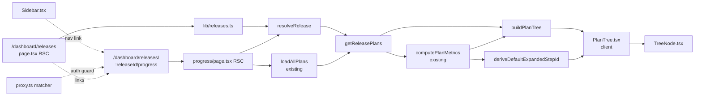
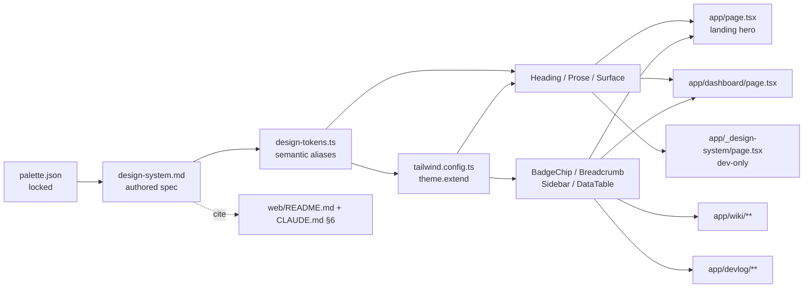
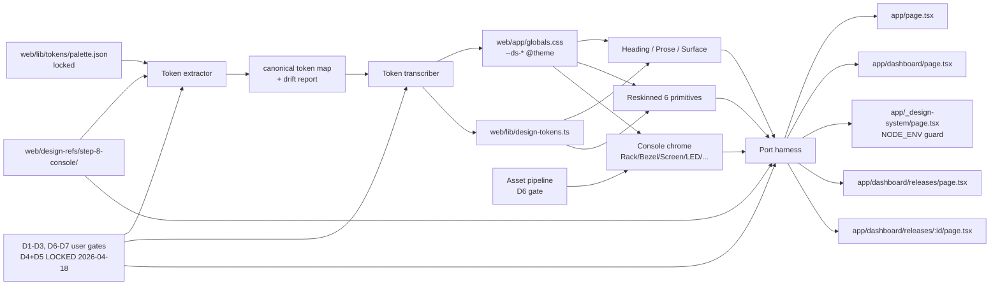

# Web Platform — Post-MVP extensions

> **Status:** Exploration seed — ready for `/design-explore`. Multi-section doc; each `## {N}. …` section below owns its own Problem statement + Axes + Approaches list + Open questions + (later) Design Expansion block. Run `/design-explore docs/web-platform-post-mvp-extensions.md --section {N}` one section at a time; each section graduates independently.
>
> **Scope:** Extensions beyond `ia/projects/web-platform-master-plan.md` MVP (Steps 1–6). Ships after MVP validates. Nothing here blocks MVP close.
>
> **Companion to:**
> - `ia/projects/web-platform-master-plan.md` — MVP orchestrator (Steps 1–6 Done 2026-04-17).
> - `docs/web-platform-exploration.md` — MVP exploration source (locked; `## Design Expansion` block frozen at A3 — static-first hybrid Next.js app at `web/`).
>
> **Why this doc exists:** MVP exploration's `### Implementation Points → Deferred / out of scope` carries post-MVP items inline; master plan `§Orchestration guardrails` flags recommendation to split into a companion doc when Step 5 portal stage opens (now done). This doc preserves the 1:1 relation between MVP exploration ↔ MVP master plan by isolating post-MVP design surface here. New post-MVP ideas land as new sections in this doc; `/master-plan-extend` pulls from here into `web-platform-master-plan.md` as new Steps.
>
> **Hierarchy rules:** `ia/rules/project-hierarchy.md` (step > stage > phase > task). `ia/rules/orchestrator-vs-spec.md` (web-platform-master-plan = orchestrator, permanent). This doc = exploration surface, never closeable.
>
> **Caveman prose default** — [`ia/rules/agent-output-caveman.md`](../ia/rules/agent-output-caveman.md). Exception: `web/content/**` + page-body JSX strings in `web/app/**/page.tsx` stay full English (user-facing). This doc (agent-authored IA prose) = caveman.
>
> **Invariants** — `ia/rules/invariants.md` #1–#12 NOT implicated. Web-platform surface is tooling / docs only, zero runtime C# / Unity coupling. Unity WebGL export (§6 below) retriggers invariants review when that section opens.

---

## 1. Full-game MVP rollout — completion view

**Status:** Exploration seed. Approaches enumerated; awaiting `/design-explore` poll.

**Priority:** Primary target — user-requested extension driving this doc's creation (2026-04-17).

### Problem statement

`ia/projects/full-game-mvp-rollout-tracker.md` carries a 12-row × 7-column lifecycle matrix (cells (a) Enumerate → (g) Align per child master plan). Matrix state is the canonical "how much of the full game is built" signal. Current surfaces:

- Markdown table in the tracker doc itself — dense, grep-friendly, but zero visual completion density.
- `/dashboard` (Step 3–4) — per-plan task-level breakdown; does NOT surface umbrella rollout-lifecycle state; no per-cell completion glyph beyond raw `✓ / ◐ / — / ❓ / ⚠️`.

Gap: **no dashboard view visualizes rollout completion as a glanceable "what's done vs. what's left" tracker.** User want = new view marking completed items with green tick glyphs, distinct from per-task status breakdown the existing dashboard already shows.

### Hard constraints

- Read-only consumer of `ia/projects/full-game-mvp-rollout-tracker.md` (+ child master plans where cell drill-down requires). Tracker doc stays authoritative; view is projection.
- Re-uses Stage 1.2 design primitives (`DataTable`, `StatBar`, `BadgeChip`, `FilterChips`, `HeatmapCell`) + design tokens (NYT palette + `raw.green` + `bg-bg-status-done` alias from Stage 4). No new primitive unless approach comparison proves existing set insufficient.
- Behind same auth middleware as `/dashboard` (Step 5.3 landed `web/middleware.ts` matcher `['/dashboard']` — extend matcher array, do NOT fork middleware).
- `tools/progress-tracker/parse.mjs` + `web/lib/plan-loader.ts` stay untouched. New loader if tracker-specific parsing required.
- Free-tier compliant (no new paid service; Vercel SSG/ISR acceptable).

### Axes of exploration

Poll surface for `/design-explore` Phase 1 compare:

**A — Visualization metaphor**
- Heatmap grid (12 rows × 7 cols, green tick overlay on ✓)
- Kanban column board (7 lifecycle cols as kanban lanes, rows = cards, cards slide right as cells tick)
- Per-row horizontal completion bar w/ 7 segments (green tick on each ✓ segment; FUTBIN-style dense row layout)
- Tree / hierarchy drill-down (umbrella → row → child master plan steps → tasks; green tick at every leaf Done)
- Hybrid (matrix heatmap landing + drill-down per row on click)

**B — Route placement**
- New `/rollout` route (top-level sidebar entry alongside `/dashboard`)
- New `/dashboard/rollout` sub-route (tab within existing dashboard)
- Replace dashboard header with rollout summary + existing task breakdown below
- Embed on landing `/` as marketing "game build progress" panel (public — reopens auth-gate decision)

**C — Completion semantics**
- Lifecycle cell-level (cell = `✓` → green tick; `◐ / —` → muted)
- Child-plan-level (child master plan `Status: Final` → whole row green tick; partial = proportional `StatBar`)
- Task-level (aggregate across all child BACKLOG tasks; closest to existing dashboard semantics)
- Composite — cell-level tick + row-level completion bar + task-level drill-down in one view

**D — Data source + parser**
- New `web/lib/rollout-tracker-loader.ts` parsing tracker markdown table rows + cells
- Extend `plan-loader.ts` to recognize rollout-tracker files (breaks "wrapper-only" invariant if parser changes required; likely rejected)
- Generate tracker state JSON at build time via `tools/progress-tracker/` sibling script; loader reads JSON only
- Live parse on every request (RSC reads file each render; no build step)

**E — Multi-umbrella generality**
- Single-purpose `/rollout` bound to `full-game-mvp-rollout-tracker.md` only
- Generic `/rollout/[umbrella]` — discovers any `*-rollout-tracker.md` under `ia/projects/`, renders each; future umbrellas inherit view for free
- Hardcode full-game-mvp at MVP; generalize when second rollout tracker exists (YAGNI cut)

**F — Access gate**
- Inherit `/dashboard` auth middleware (matcher extension)
- Public view (remove auth gate for this surface only — marketing use case; public "we're X% built" narrative)
- Obscure-URL gate (Q14 pattern from Step 3) before auth migration (regression — likely rejected)

**G — Interactivity**
- SSR-only w/ query-param filters (consistent w/ Step 4.4 multi-select pattern)
- Client-hydrated w/ animated tick reveal on cell → ✓ transition (D3 tween? CSS transition?)
- Static snapshot only (no filter, no interactivity; pure glance view)

### Approaches (seed candidates for `/design-explore` poll)

| Id | Name | Viz metaphor | Route | Completion semantics | Data source | Generality | Access gate | Interactivity |
|----|------|--------------|-------|----------------------|-------------|------------|-------------|---------------|
| R1 | **Matrix heatmap + SSR filters** | Heatmap grid | `/rollout` | Cell-level | new `rollout-tracker-loader.ts` | Single-purpose (hardcode full-game-mvp) | Inherit dashboard auth | SSR + query-param filters |
| R2 | **Kanban lanes + row drill-down** | Kanban (7 lanes) | `/dashboard/rollout` tab | Composite (cell + row) | new loader + reuse `plan-loader.ts` per row | Single-purpose | Inherit dashboard auth | Client-hydrated drill-down |
| R3 | **Dense row bars — FUTBIN-style** | Per-row 7-segment bar | `/rollout` | Cell-level + per-row `StatBar` aggregate | new loader | Generic `/rollout/[umbrella]` from day one | Inherit dashboard auth | SSR-only |
| R4 | **Public marketing panel on `/`** | Row bars (compact) landing panel + full view at `/rollout` | landing `/` + `/rollout` | Child-plan-level (coarse — Final vs. not) | new loader + build-time JSON | Single-purpose at MVP | Public (landing) + auth-gated `/rollout` detail | SSR-only |
| R5 | **Tree drill-down w/ green-tick leaves** | Hierarchy tree | `/rollout` | Task-level (finest grain) | new loader + `plan-loader.ts` drill | Generic `/rollout/[umbrella]` | Inherit dashboard auth | Client-hydrated collapse/expand |

Design-explore should score each across Constraint fit / Effort / Output control / Maintainability / Dependencies + risk (per `ia/skills/design-explore/SKILL.md` Phase 1). All five approaches (R1–R5) remain live options — no pre-selection. R3 (Dense row bars) and R5 (Tree drill-down) in particular offer distinct tradeoffs: R3 = lowest-effort SSR-only, reuses existing primitives; R5 = highest granularity + generality, requires client hydration. User poll determines final pick.

## To be selected during /design-explore

Run `/design-explore docs/web-platform-post-mvp-extensions.md --section 1` to score approaches + select one. Do NOT pre-decide R3 or any other option here — design-explore poll is the decision gate.

### Open questions

Phase 0.5 interview candidates (one-per-turn, max 5, UI/UX language per skill rule):

1. Should the rollout view show **per-lifecycle-cell ticks** (granular, 84 cells for full-game-mvp) or **per-row summary ticks** (12 rows, one "done" indicator per child plan)? Affects visual density + what "completion" means to the viewer.
2. Is this view **public-facing** (marketing: "Territory Developer is 40% built — see progress") or **internal-only** (dev dashboard companion, same auth gate as `/dashboard`)? Unlocks R4 vs. locks into R1/R2/R3/R5.
3. Should the view **generalize to any future rollout tracker** (zone-s-economy, citystats-overhaul eventually get their own umbrellas) or **hardcode full-game-mvp** and generalize when second tracker exists?
4. Does "green tick" carry **separate semantics per completion tier** (e.g., amber half-tick for `◐` partial, green full tick for `✓`, muted glyph for `—` not started) or is it binary (tick-or-nothing)? Affects color token selection.
5. Should cell drill-down (click cell → see child plan state) be **in-page (client-hydrated panel)** or **route to child plan's `/dashboard?plan=…`** (SSR, reuses existing filter infra from Stage 4.4)?

### Expected handoff

On `/design-explore` complete:
- This section gains `## Design Expansion — §1 Rollout completion view` block (Chosen Approach + Architecture mermaid + Subsystem Impact + Implementation Points + Examples + Review Notes).
- `/master-plan-extend ia/projects/web-platform-master-plan.md docs/web-platform-post-mvp-extensions.md` appends new Step 7 — Full-game MVP rollout completion view, fully decomposed at author time (stages + phases + tasks `_pending_`).

---

## Design Expansion — §1 Release-scoped progress view

### Chosen Approach

**Option 1 — `/dashboard/releases/:releaseId/progress` nested expandable tree.** Locked by user via Q1–Q4 interview + Phase 1 re-poll (2026-04-17); does NOT map 1:1 to R1–R5 axes originally enumerated above. Option 1 refines scope: instead of visualizing the 7-column rollout lifecycle matrix, this first extension ships a **release-scoped per-plan progress tree** (step > stage > phase > task) with chevron-expand, status color coding, and backend-derived default-expand heuristic. The 7-column rollout-lifecycle view (original §1 ambition) is NOT dropped — it is reserved as a sibling leaf `/dashboard/releases/:releaseId/rollout` for a later Step. Option 1 wins on constraint fit (reuses existing primitives + `PlanData`), effort (zero parser changes; pure shapers only), output control (SSR tree + thin Client island for toggle), maintainability (hand-maintained registry as YAGNI cut), and risk (additive — no breaking).

Sub-decisions confirmed:

- Full REST nesting: `/dashboard/releases/[releaseId]/progress/page.tsx`.
- `/dashboard` stays as cross-release overview (no forced redirect); sidebar gains a "Releases" link.
- `/dashboard/releases/:releaseId/rollout` — reserved via comment only, NOT filesystem stub (route 404s by default until implemented).
- `web/lib/releases.ts` = hand-maintained registry; convention-driven discovery deferred.
- `/dashboard/releases` = picker listing registry rows.
- No release landing page at `/dashboard/releases/:releaseId` — defer to Option 2 retrofit.

Scope = MVP umbrella children only (11 buckets; ~20-30 row grain = child master-plan files). Row UX = expandable nested tree; default-expanded step derived backend via predicate "first step where `stepCounts[step.id].done < total`; all-done → all collapsed"; tasks are ground truth, stale step/stage header Status prose ignored. Persistence = none (session-only `useState`). Color coding = reuses existing `BadgeChip` status tokens (done / in-progress / pending / blocked).

### Architecture



**Entry:** `GET /dashboard/releases/:releaseId/progress` — browser request with valid `portal_session` cookie (proxy gate); reachable via Sidebar "Releases" → release picker → release row link.
**Exit:** HTML response with SSR tree (collapsed except default-expanded step); Client component hydrates chevron handlers; no further network on toggle.
**404 exit:** unknown `releaseId` → Next.js `notFound()` (standard fallback).
**Auth redirect:** no cookie → `proxy.ts` → `/auth/login`.

### Subsystem Impact

Web-only design. `invariants_summary` skipped (no runtime C# coupling). `router_for_task "web dashboard"` returned `no_matching_domain` — expected per CLAUDE.md §6 (web workspace outside game router table). Glossary reuses **Rollout lifecycle** + **Project hierarchy** verbatim; no new glossary rows.

| Subsystem | Nature | Invariant risk | Breaking? | Mitigation |
|---|---|---|---|---|
| `web/lib/plan-loader.ts` + `plan-parser.ts` | Read-only consumer | n/a — web-only | Additive | — |
| `web/lib/plan-loader-types.ts` | Import `PlanData`, `PlanMetrics`, `Step`, `Stage`, `TaskRow` | n/a | Additive | — |
| `web/components/Sidebar.tsx` | Append one `LINKS` entry (Releases) | n/a | Additive | Order: Home · Wiki · Devlog · Dashboard · Releases. |
| `web/proxy.ts` matcher | Widen from `['/dashboard']` to `['/dashboard', '/dashboard/:path*']` | n/a | Behavior-changing (intended — same cookie guard covers nested) | Keep bare `/dashboard` explicit + add `:path*`; verify `/api/*` unaffected. |
| `web/app/dashboard/page.tsx` | Zero edit — stays as cross-release overview | n/a | No change | — |
| Deployment (Vercel ISR) | Reuses `loadAllPlans` 5-min revalidate; no new env vars | n/a | Additive | — |
| `ia/specs/glossary.md` | Reuses existing terms | n/a | No change | — |
| `web/README.md` + `CLAUDE.md` §6 | Doc-only route table row addition | n/a | Additive | — |
| Next.js dynamic route `[releaseId]` | Follows existing `[slug]` / `[...slug]` precedent (`web/app/devlog/[slug]`, `web/app/wiki/[...slug]`) | n/a | Compatible | — |

Spec gap: no `ia/specs/*` slice required; web surface is documented in `web/README.md` + CLAUDE.md §6 only.

### Implementation Points

```
Phase A — Registry + pure shapers (no routes, no UI)
  - [ ] web/lib/releases.ts — Release interface + resolveRelease() + seeded full-game-mvp row; children[] list cites full-game-mvp-rollout-tracker.md + umbrella Bucket table as source of truth in header comment
  - [ ] web/lib/releases/resolve.ts — getReleasePlans(release, all) pure filter by filename-in-children
  - [ ] web/lib/releases/default-expand.ts — deriveDefaultExpandedStepId(plan, metrics); returns first step id where stepCounts.done < total OR null if all done; ignores step.status prose
  - [ ] web/lib/plan-tree.ts — buildPlanTree(plan, metrics); synthesize phase nodes by groupBy(task.phase) within a stage (NOT conflated with Stage.phases checklist); status per node from BadgeChip token union
  - [ ] Unit tests for each pure fn under web/lib/**/__tests__
  Risk: registry drift — mitigate via header comment pointing at tracker; convention-driven discovery deferred to later

Phase B — Routes + picker page
  - [ ] web/app/dashboard/releases/page.tsx — RSC release picker; reads registry; DataTable or simple list linking to /dashboard/releases/{id}/progress; Breadcrumb + existing primitives
  Risk: none — additive route; auth applies once matcher widened in Phase D

Phase C — Progress tree surface
  - [ ] web/components/TreeNode.tsx — render one node + children recursively; status-colored glyph + label + count summary + chevron for non-leaf; <button aria-expanded aria-controls> for a11y
  - [ ] web/components/PlanTree.tsx ('use client') — useState<Set<string>> expanded node ids seeded from props.initialExpanded; chevron onClick toggles; passes expanded + onToggle down
  - [ ] web/app/dashboard/releases/[releaseId]/progress/page.tsx — RSC; resolveRelease → notFound() on null; loadAllPlans + getReleasePlans; per-plan computePlanMetrics + buildPlanTree + deriveDefaultExpandedStepId; render Breadcrumb + <PlanTree/> per plan
  Risk: keep PlanTree as the ONLY 'use client' island; page.tsx stays RSC

Phase D — Auth matcher + nav link
  - [ ] web/proxy.ts — matcher: ['/dashboard', '/dashboard/:path*'] (both entries; single-string breaks bare /dashboard coverage per Phase 8 B2)
  - [ ] web/components/Sidebar.tsx — append { href: '/dashboard/releases', label: 'Releases', Icon: Layers3 } (or ListTree) to LINKS; drop the chip if mobile-collapsed
  Risk: matcher pattern verified; /api/* unaffected (no /api/dashboard path exists)

Phase E — Docs + validation
  - [ ] web/README.md — route-list row for /dashboard/releases + /dashboard/releases/:releaseId/progress
  - [ ] CLAUDE.md §6 — route table row addition if canonical
  - [ ] npm run validate:web (lint + typecheck + build) — green gate before commit
  Risk: none

Deferred / out of scope
  - /dashboard/releases/:releaseId/rollout lifecycle view (URL reserved; NO filesystem stub per Phase 8 B1; implementation = separate Step later)
  - /dashboard/releases/:releaseId landing page (defer; Option 2 retrofit)
  - Convention-driven registry (migrate from hand-maintained later)
  - Persisted expand state (cookie / localStorage)
  - /closeout auto-flip of step/stage headers — spin-off bug, file via separate /project-new
  - Search / filter inside tree
  - Expand/collapse animation
  - "Expand all / Collapse all" chips (suggestion S3 — defer)
```

### Examples

**Registry resolution**

Input (`web/lib/releases.ts`):

```ts
export const releases: Release[] = [
  {
    id: 'full-game-mvp',
    label: 'Full-Game MVP',
    umbrellaMasterPlan: 'full-game-mvp-master-plan.md',
    children: [
      'multi-scale-master-plan.md',
      'city-sim-depth-master-plan.md',
      'zone-s-economy-master-plan.md',
      'sprite-gen-master-plan.md',
      'ui-polish-master-plan.md',
      'blip-master-plan.md',
      'music-player-master-plan.md',
      'citystats-overhaul-master-plan.md',
      'web-platform-master-plan.md',
      // utilities / landmarks / distribution absent — authored later per rollout tracker rows 8, 9, 11
    ],
  },
]
```

`resolveRelease('full-game-mvp')` → returns row above.
`resolveRelease('zonk')` → `null` → page calls `notFound()`.

Edge case: registry lists child NOT on disk (e.g. `distribution-master-plan.md`). `loadAllPlans()` already returns only existing files; `getReleasePlans` silently drops missing basenames. No error.

**Default-expand predicate**

Input `plan.steps` metrics for `web-platform-master-plan.md`:

```
Step 1 — foundation:  done=8  total=8
Step 2 — content:     done=12 total=12
Step 3 — dashboard:   done=6  total=6
Step 4 — filters:     done=5  total=5
Step 5 — portal:      done=2  total=9   ← first non-done
Step 6 — devex:       done=0  total=4
```

`deriveDefaultExpandedStepId(plan, metrics) === '5'`.

Edge case — all done: every step `done === total` → output `null` → `initialExpanded` empty → all collapsed.

Edge case — stale step-header status: Step 3 header hand-written `**Status:** In Progress` but `stepCounts['3']` = `done=6 total=6`. Predicate ignores header; correctly skips Step 3 and picks Step 5. Documented in JSDoc: "Tasks are ground truth; stale step/stage Status prose ignored."

**Release scope filter**

`loadAllPlans()` returns 11 `PlanData` objects (all `*master-plan*.md` in `ia/projects/`, including orchestrators outside MVP umbrella like `backlog-yaml-mcp-alignment-master-plan.md`, `mcp-lifecycle-tools-opus-4-7-audit-master-plan.md`).

`getReleasePlans(releases[0], allPlans)` → 9 `PlanData` (umbrella + 8 authored children present on disk). Non-MVP orchestrators dropped.

Edge case — umbrella self-inclusion: `children[]` MAY include `full-game-mvp-master-plan.md` itself; registry row above includes it so the tree leads with the umbrella Bucket table status before diving into children.

**Progress tree render (one stage node)**

Input `TreeNode`:

```ts
{
  id: 'stage:5.2',
  kind: 'stage',
  label: 'Stage 5.2 — DB-backed feedback',
  status: 'in-progress',
  counts: { done: 3, total: 6 },
  children: [
    { id: 'phase:5.2.p1', kind: 'phase', label: 'Phase 1', status: 'done',        counts: { done: 3, total: 3 }, children: [/* 3 tasks */] },
    { id: 'phase:5.2.p2', kind: 'phase', label: 'Phase 2', status: 'in-progress', counts: { done: 0, total: 3 }, children: [/* 3 tasks */] },
  ],
}
```

Collapsed render:

```
▸ Stage 5.2 — DB-backed feedback  [In Progress]  3 / 6
```

Expanded render:

```
▾ Stage 5.2 — DB-backed feedback  [In Progress]  3 / 6
    ▾ Phase 1  [Done]         3 / 3
        ● T5.2.1  TECH-263  Done
        ● T5.2.2  TECH-264  Done
        ● T5.2.3  TECH-275  Done
    ▸ Phase 2  [In Progress]  0 / 3
```

Color coding = existing `BadgeChip` status tokens: `done` → `bg-bg-status-done`; `in-progress` → `bg-bg-status-progress`; `pending` (`_pending_` + `Draft`) → `bg-bg-status-pending`; `blocked` → `bg-bg-status-blocked` (reserved; parser does not emit today — future-proof type parity).

### Review Notes

BLOCKING resolved inline before persist:
- **B1** — `/dashboard/releases/:releaseId/rollout` reserved via comment only, no filesystem stub (route 404s by default). Phase 6 Phase B scope tightened; Deferred list notes reservation semantics.
- **B2** — `proxy.ts` matcher keeps BOTH entries: `['/dashboard', '/dashboard/:path*']`. Single `:path*` alone breaks bare `/dashboard` coverage.

NON-BLOCKING (carried):
- **NB1** — Phase aggregation in `buildPlanTree` synthesizes nodes from `task.phase` strings; do NOT conflate with `Stage.phases` `PhaseEntry[]` checklist. Document in JSDoc.
- **NB2** — Registry seed drift is a known risk. Consider later `validate:web` diff against rollout tracker rows. Header comment in `web/lib/releases.ts` flags tracker as source of truth.
- **NB3** — `TreeNode.status = 'blocked'` unreachable from parser today; kept for `BadgeChip` `Status` parity. Flag in JSDoc.

SUGGESTIONS:
- **S1** — `3 / 6 done` vs bare `3/6` — drop `done` suffix on branch nodes when status badge already renders "Done"; minor, ship either way.
- **S2** — Chevron as `<button aria-expanded aria-controls>` — cheap keyboard a11y win; adopted in Phase C.
- **S3** — Optional "Expand all / Collapse all" chips near breadcrumb — deferred, easy retrofit.
- **S4** — Sidebar icon: `Layers3` or `ListTree` read closer to release semantics than `GitBranch`.

### Expansion metadata

- Date: 2026-04-17
- Model: claude-opus-4-7
- Approach selected: Option 1 (release-scoped progress tree; NOT mapped to R1–R5 axes)
- Blocking items resolved: 2

---

## 2. Payment gateway

**Status:** Deferred. Needs `/design-explore --section 2` before master-plan extend.

**Source:** MVP exploration Q10 undecided; `### Deferred / out of scope` bullet 1.

### Problem statement

One-time-purchase gateway for Territory Developer. Architecture slot reserved in MVP (Step 5 §Portal placeholder) — no provider wired. Needs:
- Provider selection (Stripe / Paddle / Lemon Squeezy / Gumroad — free-tier-until-first-sale comparison)
- Entitlement check post-payment (`entitlement` table drafted in Stage 5.2 schema)
- Receipt + refund flow
- Tax handling (VAT / Merchant-of-Record decision)

### Approaches

*To be enumerated at `/design-explore` time. Candidate axes:* provider choice, MoR vs. direct, one-time vs. subscription, regional tax handling, entitlement validation cadence (JWT claim vs. DB lookup per request), fraud-check depth.

### Open questions

- Launch price + region strategy?
- Refund window?
- Bundled DLC / expansion model in scope, or pure one-shot purchase?
- Does entitlement unlock cloud saves (§3), map management, or ad-free (if ads enter scope)?

---

## 3. Cloud saves + map management

**Status:** Deferred. Needs `/design-explore --section 3`.

**Source:** MVP exploration Q12 portal killer feature; `### Deferred / out of scope` bullet 2.

### Problem statement

User portal surface. Store player game saves + user-authored maps in cloud; sync across devices; share / fork maps publicly. Foundations (schema draft for `save` table) landed in Stage 5.2; user-facing portal UX deferred.

### Approaches

*To be enumerated at design-explore. Candidate axes:* save serialization format (binary blob / JSON / Protobuf), storage backing (Postgres JSONB / Vercel Blob / S3-compatible free tier), sync strategy (manual / auto / last-write-wins / conflict UI), map share visibility (private / unlisted / public), map fork semantics, entitlement-gated save slot cap.

### Open questions

- Save file size ceiling?
- Offline-first or cloud-first UX?
- Does map-sharing require moderation (public host liability)?
- Versioning — do map edits keep history or just overwrite?

---

## 4. Community wiki edits

**Status:** Deferred. Needs `/design-explore --section 4`.

**Source:** MVP exploration Q5 "v2+"; `### Deferred / out of scope` bullet 3.

### Problem statement

MVP wiki (Step 2 Stage 2.2) is solo-authored MDX + glossary auto-index. v2+ opens community edits. Governance + moderation + attribution model unresolved.

### Approaches

*To be enumerated at design-explore. Candidate axes:* GitHub-PR-based edits vs. in-app editor vs. Discord-bot-authored, moderation (pre / post / no-moderation), attribution (git blame / per-page author list / anonymous), spam / vandalism defense (captcha / account-age gate / rate limit), entitlement gating (paying customers only vs. open).

### Open questions

- Does community edit eligibility require payment (§2) or free-tier account sufficient?
- Dispute resolution mechanism?
- Edit history UX — wiki-page revert flow or git-log read-only?

---

## 5. Internationalization (i18n)

**Status:** Deferred. Needs `/design-explore --section 5`.

**Source:** MVP exploration `### Deferred / out of scope` bullet 4 — English only at MVP.

### Problem statement

Public site + dashboard + future portal currently English-only. i18n requires string extraction + translation pipeline + locale routing + RTL support.

### Approaches

*To be enumerated at design-explore. Candidate axes:* framework (`next-intl` / `next-i18next` / custom), locale routing (subpath `/es/` vs. subdomain `es.` vs. `Accept-Language` negotiation), translation source (human / MT-seeded + human edit / fully MT), MDX content translation strategy (parallel files per locale vs. frontmatter fallback), glossary term translation scope.

### Open questions

- Target locale set (Spanish for v1 given user bilingual? + ? + ?)?
- Date / number / currency localization alongside text?
- RTL layout support (Arabic / Hebrew) in scope or parked?

---

## 6. Unity WebGL export

**Status:** Deferred. Needs `/design-explore --section 6` + invariants re-review.

**Source:** MVP exploration `### Deferred / out of scope` bullet 5 — "separate future track".

### Problem statement

Currently Unity builds = desktop only. WebGL export = playable demo embed on landing. Unity WebGL constraints: no multithreading (as of Unity 2022.3), memory caps, initial download size, asset streaming.

### Approaches

*To be enumerated at design-explore. Candidate axes:* demo vs. full game (demo likely; full game size prohibitive for web), save compat (does WebGL demo save sync to portal?), asset compression (Brotli / LZ4), streaming (on-demand chunks vs. upfront), engine upgrade (Unity 6.x multithread support reconsiders).

### Open questions

- Is WebGL build a **marketing demo** (narrow vertical slice, 10 min experience) or **full-product web delivery** (same as desktop)?
- Revisit trigger after Unity 6.x migration (sibling `blip-post-mvp-extensions.md` §2 raises same engine-upgrade gate)?
- Hosting — Vercel static? GCS bucket? Unity Play?

### Invariants retrigger

Unity WebGL export couples web platform to runtime C# / Unity subsystems — `ia/rules/invariants.md` #1–#12 re-apply. Design-explore Phase 5 (Subsystem Impact) MUST run `invariants_summary` before approach lock.

---

## 7. Developer-experience utilities

**Status:** Deferred. Needs `/design-explore --section 7` (or may fold as phases into §1 / §8 implementation).

**Source:** MVP exploration `### Review Notes → Suggestions`.

### 7.1 Glossary hot-reload dev script

Watch `ia/specs/glossary.md` during `cd web && npm run dev`; auto-regenerate wiki glossary import + search index on change. Killed wait: no more dev-server restart after glossary edits.

### 7.2 PR-preview URL comment bot

GitHub Action posts Vercel preview URL as PR comment on every push. Wiki / devlog diffs reviewable visually in-PR. Free-tier compatible (GitHub Actions + Vercel preview).

### Approaches

*To be enumerated at design-explore. Each item single-file / single-config; low-effort; may batch into one stage alongside §1 rollout view.*

### Open questions

- Is 7.1 valuable enough to ship standalone, or fold into §1 as a sub-task (rollout-tracker watcher benefits from same infra)?
- Does 7.2 require custom Action, or suffice w/ existing Vercel GitHub app comment?

---

## 8. UI/UX visual design direction — navigation, typography, component polish

**Status:** Exploration seed. Seeded 2026-04-17 from two external reference screenshots reviewed by user. Awaiting `/design-explore --section 8` to produce Design Expansion + feed `/master-plan-extend`.

**Source:** User-provided design reference screenshots — Shopify dev docs (dark developer portal) + Dribbble breadcrumb navigation pattern.

### Problem statement

Current web platform has a functional but aesthetically thin UI: minimal component hierarchy, monospace-heavy type scale, no visual rhythm system beyond basic dark tokens. Two reviewed references surface concrete, derivable patterns that align well with Territory's dark-mode developer-facing aesthetic. Goal: translate these patterns into a coherent visual design layer applicable across all existing pages without replacing the token system.

### Design references

#### Shopify dev docs — developer portal aesthetic

Observations (structure/patterns only — not color palette):

- **Sidebar navigation tree**: collapsible category headers with disclosure arrow + child item indentation; active item has left-border accent + subtle panel background. Mirrors our border-l-2 step hierarchy in dashboard — opportunity to unify the visual language.
- **Type/category badges**: colored pill chips (`ID!` / `required` / query type) inline with identifiers. Maps to our `BadgeChip` and `FilterChips` — suggests tighter badge sizing, semantic color slots beyond gray.
- **Two-panel content layout**: prose on left, sticky code panel on right with language tab switcher (GQL / cURL / React Router / Node.js). Applicable to devlog and wiki pages with code examples.
- **Section separators**: thin full-width `<hr>`-style rules between major sections (`Arguments`, `Possible returns`). Currently absent from our wiki/devlog pages.
- **Search in sidebar**: inline `Filter` input at top of sidebar tree. Territory sidebar has 4 hard-coded links — expandable to filterable nav as section count grows.
- **Feedback row**: "Was this section helpful? Yes / No" inline below each section. Low-effort engagement signal for devlog posts.
- **Typography pairing**: bold monospace for type/query identifiers at page top, system sans for prose. Territory already uses this split — reference validates the pattern; suggests more deliberate size contrast (identifier heading larger relative to body).
- **Copy button on code blocks**: icon button top-right of code panel. Missing from devlog MDX code blocks.

#### Dribbble breadcrumb — navigation tab pattern

Observations:

- **Separator**: `/` (slash) not `›` — reads more like a filesystem path; pairs better with developer tool aesthetic. **Applied immediately** to `web/components/Breadcrumb.tsx`.
- **Font size**: `text-base` (≥16px), system sans (not mono). Breadcrumb is a primary orientation landmark, not decorative metadata. **Applied immediately.**
- **Current segment weight**: `font-medium` on the active/final crumb to distinguish from ancestors. **Applied immediately.**
- **Segment as dropdown affordance**: current segment has a pill-shaped dark background + up/down chevron, revealing sibling navigation on click. Post-MVP opportunity: make current crumb an interactive dropdown for wiki category siblings or devlog date-range siblings.
- **Ancestor spacing**: generous `gap-2` between crumbs (not cramped). **Applied immediately.**
- **Crumb height**: nav has visible vertical breathing room (`py-3`) — breadcrumb bar reads as a proper row, not an afterthought. **Applied immediately.**

### Design axes for `/design-explore`

1. **Component-by-component vs. design-system-first** — tackle each component in isolation (breadcrumb → sidebar → badges → code blocks) OR define a token + spacing + type scale spec first and derive components from it.
2. **Inline-style pages vs. Tailwind-first migration** — most pages use `tokens.*` inline styles; dashboard uses Tailwind. Unify before polishing (Tailwind-first) OR keep split and polish both surfaces in parallel.
3. **New primitives vs. extend existing** — introduce `CodeBlock`, `SectionRule`, `FeedbackRow`, `SidebarTree` as new components OR extend `DataTable`, `FilterChips`, `BadgeChip` to cover the gaps.

### Hard constraints

- Zero change to token palette (colors are locked by NYT-derived `palette.json`). Shape, spacing, weight, type scale = free to adjust.
- No runtime/Unity coupling. All changes are `web/` surface only.
- Breadcrumb immediate fixes already landed (separator, size, weight, spacing) — §8 builds on that base.

### Open questions

- Which page is the highest-leverage starting point for visual polish? (Wiki detail page or devlog post — both have clear prose + code content requiring hierarchy treatment.)
- Does the sidebar need expandable tree navigation now (for wiki categories), or is 4-link flat sufficient through Steps 7–9?
- Should code blocks in devlog MDX get a copy-to-clipboard button + language tab switcher, or is the Shopify two-panel approach overkill for our content volume?
- Is "Was this helpful?" feedback worth wiring to any backend, or just cosmetic (hidden form action)?

### Candidate approaches (to be scored at `/design-explore`)

- **A: Design-system-first** — author `web/lib/design-system.md` spec (type scale, spacing scale, component map), then derive component edits from it. Slower to ship, more coherent long-term.
- **B: Component-by-component polish** — ranked priority: Breadcrumb (done) → wiki detail → devlog post → sidebar → dashboard badges. Ship iteratively; infer system rules from outcomes.
- **C: Hybrid** — define a 1-page "visual rhythm" doc (5 rules max) immediately, then run component-by-component under those rules.

---

## Design Expansion — Section 8: Visual Design Layer

### Chosen Approach

**Approach A — Design-system-first.** Locked by user via Phase 0.5 interview (2026-04-17): Q1 priority surfaces = landing hero + dashboard; Q2 aesthetic = unified brand (shared palette/typography/motion vocab); Q3 motion = restrained + reduced-motion first + perf-cheap; Q4 palette = game-inspired accent on neutral web base (additive — zero NYT palette churn); Q5 scope = full design-system spec authored then applied. Approach A unambiguous on comparison matrix (high constraint fit, high output control, high maintainability; effort trade-off acceptable given Q5 explicit ask). Author `web/lib/design-system.md` (type scale + spacing scale + motion vocab + semantic token aliases + component map), derive `web/lib/design-tokens.ts`, extend `tailwind.config.ts`, ship new prose + surface primitives, adopt on landing + dashboard, then broad token-alias migration across remaining components.

Sub-decisions confirmed:

- Palette stays NYT-derived locked; game-accent additive subset (seed: `raw.terrainGreen` + `raw.waterBlue` + one warm) promoted to `accent.*` aliases.
- Type scale = 10 levels, 1.25 minor-third ratio; `display` / `h1` / `h2` / `h3` / `body-lg` / `body` / `body-sm` / `caption` / `mono-code` / `mono-meta`.
- Spacing scale = 4px grid, 9 stops (`2xs`…`layout`).
- Motion vocab = 4 durations (`instant` / `subtle` 120ms / `gentle` 200ms / `deliberate` 320ms); reduced-motion first (media query collapses all to `instant`); CSS transitions only, no animation library.
- Semantic aliases = `text.*` / `surface.*` / `accent.*` namespaces; Tailwind classes prefixed `ds-` to avoid default collisions.
- Priority surfaces (Q1): landing `/` hero + `/dashboard` re-skin in Phase D; broad token-alias migration in Phase E.
- Showcase page at `web/app/_design-system/page.tsx` (dev-only, noindex, unlinked from Sidebar).

### Architecture



**Entry:** spec-first authoring → generated tokens → Tailwind theme → components → pages. Runtime: browser request → Next.js RSC page → imports primitives → Tailwind classes resolve via theme → rendered HTML + minimal CSS transitions.
**Exit:** Landing + dashboard ship with unified brand surface + restrained motion; broad component migration follows; wiki/devlog gain Prose wrapper without layout rework.
**Reduced-motion path:** `prefers-reduced-motion: reduce` → CSS media query collapses all motion utilities to `instant` (zero transition, zero transform) on first paint.

### Subsystem Impact

Web-only design. `invariants_summary` skipped (no runtime C# coupling — game subsystems untouched). `router_for_task "web design system"` returned `Terraform system` only (spurious — expected per CLAUDE.md §6 web workspace outside game router table). `glossary_discover` returned multi-scale terms only (no design-system domain in glossary — expected; web surface documented in `web/README.md` + CLAUDE.md §6, not `ia/specs/glossary.md`). No new glossary rows.

| Subsystem | Nature | Invariant risk | Breaking? | Mitigation |
|---|---|---|---|---|
| `web/lib/design-system.md` (NEW) | Authored spec — scales + aliases + component map + a11y notes | n/a | Additive | Source of truth; cited by README + CLAUDE.md §6. |
| `web/lib/design-tokens.ts` (NEW) | Semantic alias TS export derived from `palette.json` + spec | n/a | Additive | Consumed by Tailwind + primitives. |
| `web/tailwind.config.ts` | `theme.extend` pulls fontSize / spacing / transitionDuration / transitionTimingFunction from `design-tokens.ts` | n/a | Behavior-changing — new scale classes resolve via theme | Prefix all semantic classes `ds-*`; keep Tailwind defaults reachable; migrate components deliberately. |
| `palette.json` (Q4 locked) | Zero change | n/a | No change | — |
| `web/components/type/Heading.tsx` + `Prose.tsx` (NEW) | Prose primitives bound to type scale | n/a | Additive | Adopt per-page; legacy inline headings valid. |
| `web/components/surface/Surface.tsx` (NEW) | Card/panel primitive; optional subtle motion | n/a | Additive | Default `motion="none"` keeps RSC-compat; only non-none triggers client island. |
| `web/components/BadgeChip.tsx`, `Breadcrumb.tsx`, `Sidebar.tsx`, `DataTable.tsx`, `FilterChips.tsx` | Token-alias migration only (semantic aliases replace raw tokens) | n/a | Visually neutral (aliases resolve to same palette) | Manual visual diff on landing + dashboard in PR. |
| `web/app/page.tsx` (landing hero) | Consume `Heading` + `Surface` + motion tokens; restrained fade-in on mount | n/a | Intended visual lift | Reduced-motion first. User-facing copy stays full English per CLAUDE.md §6 carve-out. |
| `web/app/dashboard/page.tsx` | Re-skin via new primitives; zero data-flow change | n/a | Visual lift | Section 1 release route (`/dashboard/releases/**`) unaffected. |
| `web/app/wiki/**` + `web/app/devlog/**` | Prose wrapper on MDX output + alias migration; no layout rework | n/a | Visually neutral | Deeper polish deferred (Shopify patterns = follow-on). |
| `web/app/_design-system/page.tsx` (NEW, dev-only) | Showcase page rendering primitives + swatches | n/a | Additive | Unlinked + `noindex` meta + `NODE_ENV !== 'production'` gate. |
| `web/README.md` + `CLAUDE.md` §6 | Doc rows for design-system spec path + caveman carve-out reminder | n/a | Additive | — |
| `ia/specs/glossary.md` | No new rows (web-only surface) | n/a | No change | — |

Spec gap: no `ia/specs/*` governs web design system; `web/lib/design-system.md` is the authoritative web-local spec.

### Implementation Points

```
Phase A — Spec authorship (no code)
  - [ ] web/lib/design-system.md — §1 type scale (10 levels, 1.25 ratio) §2 spacing scale (4px grid, 9 stops) §3 motion vocab (4 durations, reduced-motion first) §4 semantic token aliases (text.* / surface.* / accent.*) §5 component map (per-component scale + spacing + motion bindings) §6 a11y notes (WCAG AA contrast on all aliases, focus ring, keyboard nav)
  - [ ] Derive game-accent subset from existing in-game palette (seed: raw.terrainGreen + raw.waterBlue + one warm); cite Dribbble breadcrumb + Shopify dev docs as informed-by references (§8 source screenshots)
  Risk: spec bloat — cap at ~10 pages; anything longer folds to appendix

Phase B — Token pipeline
  - [ ] web/lib/design-tokens.ts — export nested TS const (typeScale, spacing, motion, text, surface, accent); import palette.json; zero palette mutation
  - [ ] web/tailwind.config.ts — theme.extend pulls fontSize / spacing / transitionDuration / transitionTimingFunction from design-tokens.ts; prefix semantic classes `ds-*` to avoid default shadowing
  - [ ] web/lib/__tests__/design-tokens.test.ts — assert scale monotonicity + alias resolution + motion honors reduced-motion
  Risk: Tailwind class collision — mitigated via `ds-` prefix; verify with `npm run validate:web`

Phase C — Prose + surface primitives
  - [ ] web/components/type/Heading.tsx — props: level (display|h1|h2|h3|…), weight, asChild; maps to ds-* fontSize utilities
  - [ ] web/components/type/Prose.tsx — body container with vertical rhythm (spacing.md between siblings); wraps MDX output
  - [ ] web/components/surface/Surface.tsx — props: tone (raised|sunken|inset), padding (sm|md|lg|section), motion (none|subtle|gentle|deliberate); default motion='none' keeps RSC-compat; non-none adds client island with useEffect data-mounted attr
  - [ ] web/app/_design-system/page.tsx — dev-only showcase (unlinked, noindex, NODE_ENV gate); renders every primitive + alias swatch + motion demo
  Risk: Surface motion island — keep default none; gate dev showcase to avoid indexing

Phase D — Landing hero + dashboard adoption (priority surfaces per Q1)
  - [ ] web/app/page.tsx — landing hero re-skin: Heading display level, Surface raised panel with subtle fade-in on mount, game-accent on CTA; user-facing copy stays full English (CLAUDE.md §6 carve-out)
  - [ ] web/app/dashboard/page.tsx — wrap stat blocks in Surface; Heading h1/h2; BadgeChip consumes semantic aliases
  - [ ] Lighthouse baseline capture BEFORE re-skin (LCP / CLS / TBT) — store in PR body as regression guard
  - [ ] Manual visual diff on localhost:4000 for landing + dashboard (before/after screenshots in PR body)
  Risk: /dashboard/releases/** (Section 1) — verify not regressed by re-skin

Phase E — Broad token-alias migration (no layout change)
  - [ ] Grep `tokens\.` across web/app/**/*.tsx + web/components/**/*.tsx — enumerate surfaces
  - [ ] web/components/Breadcrumb.tsx — semantic aliases
  - [ ] web/components/Sidebar.tsx — semantic aliases
  - [ ] web/components/BadgeChip.tsx + DataTable.tsx + FilterChips.tsx — semantic aliases
  - [ ] wiki + devlog pages — Prose wrapper on MDX output; no layout rework
  Risk: one PR per surface group for review sanity; alias resolution = palette-neutral

Phase F — Docs + validation
  - [ ] web/README.md — Design System section citing web/lib/design-system.md + one-liner per primitive
  - [ ] CLAUDE.md §6 — row addition for design-system spec path
  - [ ] npm run validate:web — lint + typecheck + build; green gate
  - [ ] Lighthouse post-check on landing (Q3 perf-cheap guard — motion must not regress LCP vs. Phase D baseline)
  Risk: Lighthouse regression — if Surface mount motion hurts CLS, default motion='none' everywhere

Deferred / out of scope
  - Framer Motion / animation library (CSS transitions only)
  - Code-block copy button + language tab switcher (Shopify pattern; Section 8 follow-on)
  - Sidebar tree expansion (when wiki category count justifies)
  - "Was this helpful?" feedback row (Section 8 follow-on)
  - Wiki / devlog layout rework beyond Prose wrapper
  - Palette change (Q4 locked — neutral + game-accent additive only)
  - Dashboard route structure (owned by Section 1)
  - Interactive breadcrumb dropdown (Dribbble pattern; follow-on)
```

### Examples

**Example 1 — Type scale resolution**

Input `design-tokens.ts`:
```ts
export const typeScale = {
  display: { size: '3.815rem', lineHeight: '1.1',  weight: 700, letterSpacing: '-0.02em'  },
  h1:      { size: '3.052rem', lineHeight: '1.15', weight: 700, letterSpacing: '-0.015em' },
  h2:      { size: '2.441rem', lineHeight: '1.2',  weight: 600 },
  body:    { size: '1rem',     lineHeight: '1.6',  weight: 400 },
  // 1.25 minor-third ratio; 10 levels total
}
```

Tailwind config:
```ts
fontSize: {
  'ds-display': [typeScale.display.size, { lineHeight: typeScale.display.lineHeight, fontWeight: typeScale.display.weight }],
  'ds-h1':      [typeScale.h1.size,      { lineHeight: typeScale.h1.lineHeight,      fontWeight: typeScale.h1.weight }],
}
```

Component usage:
```tsx
<Heading level="display">Territory Developer</Heading>
// renders <h1 className="text-ds-display tracking-tight">…</h1>
```

**Example 2 — Motion honors reduced-motion**

Input `Surface` with `motion="subtle"`:
```tsx
<Surface tone="raised" motion="subtle" padding="section">…</Surface>
```

Rendered CSS:
```css
.ds-surface[data-motion="subtle"] {
  transition: opacity 120ms ease-out, transform 120ms ease-out;
  opacity: 0; transform: translateY(4px);
}
.ds-surface[data-motion="subtle"][data-mounted="true"] {
  opacity: 1; transform: none;
}
@media (prefers-reduced-motion: reduce) {
  .ds-surface[data-motion="subtle"] {
    transition: none; opacity: 1; transform: none;
  }
}
```

Edge case: user has `prefers-reduced-motion: reduce` → surface renders fully visible on first paint, zero transition, zero perf cost.

**Example 3 — Semantic alias migration (zero visual diff)**

Before (`BadgeChip.tsx`):
```tsx
<span style={{
  color: tokens.text.secondary,
  background: tokens.surface.raised,
  border: `1px solid ${tokens.border.subtle}`
}}>
```

After:
```tsx
<span className="text-ds-meta bg-ds-surface-raised border border-ds-border-subtle">
```

Resolves to same palette values (zero visual diff); gains Tailwind purge + motion-class compatibility + unified alias vocab.

Edge case: legacy page still using `tokens.text.secondary` inline works unchanged (palette unmodified); migration is incremental per-component.

### Review Notes

BLOCKING resolved inline before persist:

- **B1** — Tailwind class collision if semantic scale shadows defaults (`text-lg`, `p-4`). Resolution: prefix all semantic classes `ds-*`; `theme.extend` adds alongside defaults. Documented in Phase B.
- **B2** — Motion-on-mount forces client island (Surface needs `useEffect` + `data-mounted`). Resolution: Surface default `motion="none"` stays RSC-compatible; only non-none triggers client island. Documented in Phase C.
- **B3** — Landing hero copy caveman boundary. Resolution: page-body JSX strings in `web/app/**/page.tsx` stay full English per CLAUDE.md §6 carve-out; component identifiers + props + comments stay caveman. Noted in Phase D.

NON-BLOCKING (carried):

- **NB1** — Game-accent palette subset (which raw in-game colors promote to `accent.*`) needs designer taste call at Phase A; seed with `terrainGreen` + `waterBlue` + one warm, revisit per-surface if WCAG AA contrast fails.
- **NB2** — `web/app/_design-system/page.tsx` showcase = `noindex` + unlinked + `NODE_ENV !== 'production'` gate; dev-only.
- **NB3** — Lighthouse LCP baseline captured BEFORE Phase D re-skin so regression measurable.
- **NB4** — Inline-style token sweep (Phase E) — grep `tokens\.` across `web/app/**/*.tsx` + `web/components/**/*.tsx` before PR; one PR per surface group for review sanity.
- **NB5** — `design-system.md` spec cites Dribbble breadcrumb + Shopify dev docs observations (§8 source screenshots) as informed-by references so future agents know visual origin.

SUGGESTIONS:

- **S1** — If `design-tokens.ts` gains complexity, split per-namespace (`tokens-type.ts`, `tokens-motion.ts`); defer until Phase B size dictates.
- **S2** — Lighthouse regression guard could automate as `npm run validate:web:lighthouse`; nice-to-have, defer.
- **S3** — Storybook instead of `_design-system/page.tsx` showcase — heavier dep; deferred unless component count grows past ~15.

### Expansion metadata

- Date: 2026-04-17
- Model: claude-opus-4-7
- Approach selected: A (design-system-first)
- Blocking items resolved: 3

---

### CD Pilot Bundle — 2026-04-18

**Pilot issue:** TECH-411 (Claude Design pilot: web Step 8 reset + validation).

**Capture date:** 2026-04-18.

**Source tool:** Claude Design (claude.ai/design), Research Preview by Anthropic Labs. Manual invocation; no `/design-explore --visual` flag wiring.

**Bundle location:**

- Full source: [`web/design-refs/step-8-console/`](../web/design-refs/step-8-console/) — 13 files, 1.7 MB (HTML + CSS + JSX + Geist fonts + HANDOFF.md + archived flat version).
- Self-contained preview: [`docs/cd-pilot-step8-export.html`](./cd-pilot-step8-export.html) — 1.5 MB standalone HTML (all JS/CSS/fonts inlined).
- Share URL: not captured (CD session-bound; treat local files as source of truth).

**Input manifest fed to CD:**

| Surface | Path | Role |
|---------|------|------|
| Locked palette | `web/lib/tokens/palette.json` | 7 raw hexes + semantic aliases; B1 guard (no mutation) |
| Normative spec | `ia/specs/web-ui-design-system.md` | 6-primitive contract + type scale + spacing scale + motion vocab |
| Extensions | `docs/web-platform-post-mvp-extensions.md` §8 (this section) | Design-system-first direction, Approach A locked |
| Primitives | `web/components/{Button,BadgeChip,StatBar,DataTable,FilterChips,HeatmapCell}.tsx` | 6 .tsx files — source-of-truth components |
| Baselines | none | Step 8 pre-implementation — no rendered screens to compare against |

**Brief amendment history (Decision Log delta budget):**

- 2026-04-18 round 1 — added `--raw-blue: #4a7bc8` as Signal / info role (not a status). Within Decision Log ≤30% palette delta budget (1 new entry / 7 locked = 14%).
- 2026-04-18 round 2 — aesthetic pivot flat → hardware audio-console. Removed "no marketing illustrations", "Lucide-only", "no custom SVG", "no imagery" locks. Kept Geist + Geist Mono base stack (CD self-restrained on display face). Added imagery + custom tactile icon family + full logo suite as in-scope deliverables.

**Bundle contents (delivered):**

| Artifact | CD file | Role |
|----------|---------|------|
| Console chrome | `src/console-primitives.jsx` | Rack, Bezel, Screen, LED, TapeReel, VuStrip, TransportStrip |
| Reskinned primitives | same file | Button, StatusChip/IdChip, StatBar, FilterChip, HeatCell (+ DataTable via `.table` class in `console.css`) |
| Helpers | same file | Legend, DensityToggle, EmptyState, LoadingSkeleton, ErrorState, StaleDataBanner |
| 5 screens | `src/console-screens.jsx` | ScreenLanding `/`, ScreenDashboard `/dashboard`, ScreenReleases `/dashboard/releases`, ScreenDetail `/dashboard/releases/:id`, ScreenDesign `/design` |
| Logo suite | `src/console-assets.jsx` | Logomark, Wordmark, Lettermark, StraplineLockup |
| Media icon family | same file | `TIcon.{Play,Pause,Stop,Record,Rewind,FastForward,RewindEnd,FastForwardEnd,Eject,Loop,Shuffle,Mute,Solo}` (13 tactile glyphs) |
| Hero + pillar art | same file | `HeroArt` (800×900), `HeroCrop` (16:8), `PillarPlanet`, `PillarSignal`, `PillarMixer`, `PillarRadar`, `PillarTape` (5 feature scenes) |
| Tokens + fonts | `ds/colors_and_type.css` + `ds/fonts/` | 7 raws + blue, spacing, radii, motion (4 duration stops), focus ring, `@font-face` Geist variable |
| Data fixture | `src/data.js` | `rollup()` + `flattenTasks()` helpers; shape-compatible with real data fetchers |

**Token delta vs `palette.json`:**

| Kind | Entry | Action | Note |
|------|-------|--------|------|
| Added raw | `--raw-blue: #4a7bc8` | NEW | Signal / info role; echoes Territory HUD chrome. Not a status color. |
| Kept | 7 locked raws (black, panel, text, red, amber, grey-500, green) | unchanged | Verbatim hex match. |
| Added semantic | `--text-accent-info`, `--overlay-panel`, `--border-subtle`, `--border-strong` | NEW | Derived via alpha from existing tokens only — no new raws introduced. |
| Added type | None | — | Base stack preserved (Geist + Geist Mono). CD self-restrained on display face despite amendment permission. |

Delta count: 1 raw added / 7 locked = **14%** (under 30% threshold from pilot Decision Log).

**Motion vocab coverage:** 4/4 duration stops present (`--dur-fast: 80ms`, `--dur-base: 160ms`, `--dur-slow: 280ms`, `--dur-reveal: 480ms`) + 2 easing curves + `prefers-reduced-motion` collapse — exceeds ≥3/4 threshold.

**Primitive fidelity:** 6/6 reskinned + rendering (Button, BadgeChip/StatusChip, StatBar, DataTable, FilterChips, HeatmapCell) — exceeds ≥3/6 threshold.

**Fidelity gate verdict:** PASS (6/6 primitives + 14% token delta + 4/4 motion stops). Pilot proceeds past Phase 5 timebox gate without abort.

**Delta summary vs existing Implementation Points (Phases A–E):**

| Phase | Original scope | CD bundle impact |
|-------|---------------|------------------|
| A — Author `web/lib/design-system.md` spec | Hand-author 10-level type scale, 9-stop spacing, motion vocab, semantic namespaces | CD delivered working token set in `ds/colors_and_type.css`; design-system.md extraction becomes transcription task, not authorship |
| B — Derive `design-tokens.ts` + extend Tailwind | Write TS wrapper + Tailwind theme.extend | CD token names map ~1:1 to existing `palette.json`; `ds-*` prefix strategy still applies unchanged |
| C — Build Heading / Prose / Surface primitives | Three new RSC-friendly primitives with motion props | CD extends scope — delivers Rack/Bezel/Screen/LED console chrome as additional primitives; Heading/Prose/Surface still needed for content pages |
| D — Landing hero + `/dashboard` re-skin | Re-skin landing + dashboard against locked palette | CD delivered full re-skins for all 5 routes (Landing, Dashboard, Releases, Detail, Design kit); scope expands beyond original 2 surfaces |
| E — Broad token-alias migration | Sweep `tokens.*` inline styles across `web/app/**` + `web/components/**` | Unchanged — still required post-port |

**New follow-up surfaces introduced by CD bundle (candidates for re-decomposition):**

1. Console aesthetic adoption decision — apply site-wide, landing-only, or reject (Phase 5 call).
2. Asset pipeline — how to integrate SVG logo suite + icon family + pillar scenes (inline React components vs. public/ SVG files vs. sprite sheet).
3. Media transport strip component — not in original Phases A–E scope; warrants its own phase if adopted.
4. Azeret Mono licensing — N/A (CD did NOT introduce Azeret Mono; kept Geist Mono). Decision Log note retired.

**Known drifts from amended brief (CD self-flagged or detected on audit):**

- CD did not add a third display face despite amendment permission. Bundle reads uniformly in Geist variable. Revisit at Phase 5 if LCD readout needs a dedicated seven-segment face.
- Hero art (8a), pillar scenes (8c), and logo suite (8d) delivered as inline React SVG components (vector), not raster imagery. Pro: zero external asset dependency, scales clean, palette-locked. Con: matte-painting photorealism not achievable in pure SVG — "concept-art feel" landed as geometric illustration. Evaluate at Phase 5 whether stylized SVG is sufficient or raster art via external tool (Midjourney/Firefly) is needed for hero.
- Media icon family (8b) delivered as outline-only SVG; amended brief asked for solid + outline variants. Minor drift — outline set functional; solid variants can be added at port time.

**Handoff pain points (for Phase 8 measurement):**

- CD initial response pushed back on amended brief, citing original locks. Required explicit "brief amendment" override prompt to unblock. Time cost: ~1 interactive round.
- CD assumed master-plan nesting architecture that conflicts with repo's ongoing flattening (plan → step → task). User corrected; CD accepted in single prompt. Time cost: ~1 interactive round.
- Bundle shipped as React UMD + Babel standalone, not native Next.js App Router. Port work (Phase 5) must convert `.jsx` → `.tsx`, replace `localStorage`-backed routing with Next router, replace `data.js` fixture with real fetchers.

**Retirement note for Phase 5 re-decompose:** Stage 8.1 Phase 1 swap from "hand-author §1–§6" to "extract + validate CD bundle" is supportable. Stages 8.2–8.4 scope reduction candidates: 8.2 primitive authorship largely pre-done in CD; 8.3–8.4 broader-surface adoption still required.

---

## Design Expansion — Master Plan Alignment (CD Pilot Bundle)

**Mode:** gap-analysis (locked-doc; reference = `ia/projects/web-platform-master-plan.md`).
**Pilot:** TECH-411 Phase 4 — methodology pilot consuming CD bundle at `web/design-refs/step-8-console/`.
**Scope:** what Stage 8.1–8.3 phases must change to consume the CD bundle instead of hand-authoring tokens / primitives. Output feeds TECH-411 Phase 5 re-decompose.
**Locked carry-forward:** `palette.json` raws (blue approved), Geist + Geist Mono, the existing 6 primitives.
**Excluded:** R17 hero art stylization, R18 icon outline-only, display-face absence (per §8 known drifts).

**Product decisions locked (2026-04-18):**

- **D5 — Console-rack aesthetic adoption: SITE-WIDE.** Console chrome (Rack / Bezel / Screen / LED / TapeReel / VuStrip / TransportStrip) ships as production primitives. P4 conditional removed; P7 stage candidate becomes mandatory.
- **D4 — Screen-port scope: FULL FLOW (4 production + 1 dev-only).** All four production routes ported: `/` (Landing), `/dashboard` (Dashboard), `/dashboard/releases` (Releases), `/dashboard/releases/:id/progress` (Detail). Plus `_design-system` dev-only showcase. Rationale: half-themed app would set console-aesthetic expectation on Landing + Dashboard then break it on the release-tracking surfaces (the day-to-day use case). Cohesive end-to-end journey or none at all.

**Decisions still open (technical / port mechanics):**

- D1 motion-token naming, D2 `--ds-*` prefix, D3 game-accent trio composition — recommendations stand; resolve at P1 author time.
- D6 asset pipeline (now active given D5 = site-wide) — pick at P7.
- D7 port pipeline mechanics — resolve at P6 author time.

### Confirmed gap inventory

16 gaps confirmed (Phase 2g gate cleared). Severity breakdown: 5 Blocking · 8 Additive · 1 Deferred · 2 Resolved (R12, R14 — see Product decisions locked).

| Req | Source (master plan) | CD bundle coverage | Severity |
|---|---|---|---|
| R1 | Step 8 Exit + Stage 8.1 Exit — `design-system.md` §1–§6 hand-authored | Bundle delivers working token CSS + HANDOFF.md, not §1–§6 markdown spec | Additive (scope swap: hand-author → extract + transcribe) |
| R2 | Stage 8.1 T8.1.1 — Type scale §1: 10 levels, 1.25 minor-third | CD kept Geist + Geist Mono; no fresh type scale delivered | Additive |
| R3 | Stage 8.1 T8.1.1 — Spacing scale §2: 4px grid, 9 stops | CD delivered spacing tokens in `ds/colors_and_type.css`; stop count + naming TBV | Additive |
| R4 | Stage 8.1 T8.1.1 + T8.1.4 — Motion vocab §3: 4 durations named `instant/subtle/gentle/deliberate` | CD delivered 4 durations + 2 easings + `prefers-reduced-motion`, named `--dur-fast/--dur-base/--dur-slow/--dur-reveal` | **Blocking** (naming mismatch must resolve before T8.1.3/T8.1.4) |
| R5 | Stage 8.1 T8.1.1 + T8.1.3 — Semantic aliases §4: `text.*` / `surface.*` / `accent.*` + `accent.terrain` / `accent.water` / `accent.warm` trio | CD delivered `--text-accent-info`, `--overlay-panel`, `--border-subtle`, `--border-strong` — partial overlap, no game-accent trio, `border.*` namespace NEW | **Blocking** |
| R6 | Stage 8.1 T8.1.2 — `terrainGreen` + `waterBlue` + warm promoted to `accent.*` with WCAG AA | CD added `--raw-blue: #4a7bc8` (info role, not water); terrainGreen + warm not promoted | **Blocking** (CD blue ≠ waterBlue) |
| R7 | Stage 8.1 T8.1.3 — `design-tokens.ts` TS const nested exports | CD delivered CSS custom properties only; no TS module | Additive |
| R8 | Stage 8.1 T8.1.4 — `globals.css` `@theme` block `--ds-*` prefix (B1 guard) | CD uses `--raw-*/--text-*/--dur-*` naming, NOT `--ds-*` | **Blocking** (prefix strategy must reconcile) |
| R9 | Stage 8.1 Exit — `design-tokens.test.ts` unit tests | CD delivered no tests | Additive |
| R10 | Stage 8.2 Exit — Heading / Prose / Surface primitives (RSC) | CD delivered console chrome extras (Rack, Bezel, Screen, LED, TapeReel, VuStrip, TransportStrip), NOT Heading / Prose / Surface | Additive |
| R11 | Stage 8.2 T8.2.4 — `_design-system/page.tsx` dev-only showcase | CD delivered `ScreenDesign` `/design` jsx — port target; needs NODE_ENV guard + noindex + unlinked | Additive |
| R12 | Stage 8.3 T8.3.1 + T8.3.2 — landing + dashboard re-skin | CD delivered 5 screens (Landing, Dashboard, Releases, Detail, Design) — scope expanded 2 → 5 | **Resolved 2026-04-18** — D4 = full flow; all 4 production screens + 1 dev-only ported |
| R13 | Stage 8.3 T8.3.3 + T8.3.4 — `tokens.*` → `ds-*` alias migration on Breadcrumb / Sidebar / BadgeChip / DataTable / FilterChips | CD reskinned 6 primitives (Button, BadgeChip / StatusChip, StatBar, FilterChip, HeatCell, DataTable via `.table` class) | Additive |
| R14 | CD bundle §8 follow-up #1 — console aesthetic adoption decision (site-wide / landing-only / reject) | No prior phase owns this | **Resolved 2026-04-18** — D5 = site-wide; console chrome library mandatory |
| R15 | CD bundle §8 follow-up #2 — asset pipeline for SVG logo suite + icon family + pillar scenes | No prior phase owns this — inline React vs `public/` SVG vs sprite sheet | **Blocking** (new phase needed if adoption approved) |
| R16 | CD bundle §8 follow-up #3 — media transport strip component | Net-new component type | Additive |
| R19 | CD handoff pain points — port pipeline `.jsx` → `.tsx`, localStorage routing → Next router, `data.js` fixture → real fetchers | Not in original Phases A–E scope | **Blocking** |
| R20 | CD bundle location — HANDOFF.md transcription to `design-system.md` §1–§6 | Bundle has HANDOFF.md; must feed Stage 8.1 Phase 1 authorship | Additive |

### Components (Phase 3)

| Component | Responsibility |
|---|---|
| Token extractor | Reads CD `web/design-refs/step-8-console/ds/colors_and_type.css` + `palette.json`; produces canonical token map + drift report. |
| Token transcriber | Emits `web/app/globals.css` `@theme` `--ds-*` block + `web/lib/design-tokens.ts` TS const tree from extracted map. |
| Adoption decision gate | User-gate prompt at revised Stage 8.1 Phase 1 covering D5 (console adoption scope) before committing port effort. |
| Asset pipeline strategy | Picks inline React / `public/` SVG / sprite sheet, scoped to confirmed adoption surface (D6). |
| Port harness | `.jsx` → `.tsx` mechanical conversion, localStorage → Next App Router swap, `data.js` fixture → real loader swap (per-screen). |
| Showcase port | `ScreenDesign` → `web/app/_design-system/page.tsx` with NODE_ENV guard + noindex + Sidebar exclusion. |
| Console chrome library | Rack / Bezel / Screen / LED / TapeReel / VuStrip / TransportStrip — net-new primitives; mandatory per D5 = site-wide. |
| Reskin verification harness | Visual-diff hook (Playwright snapshot or screenshot-in-PR) for ported screens — guards against alias-resolution regressions. |

### Architecture (Phase 4)



**Entry:** CD bundle + locked `palette.json` → token extractor → canonical map + drift report.
**Exit:** all 4 production routes (Landing + Dashboard + Releases + Detail) + 1 dev-only showcase ported per D4 = full flow; backed by `--ds-*` tokens + console chrome library per D5 = site-wide; all original Stage 8.1 Exit conditions met via extract-then-transcribe path.
**Gates:** D4 + D5 LOCKED — full flow + site-wide adoption. D6 (asset pipeline) still gates SVG ingestion strategy. D1, D2, D3, D7 inline within phases.

### Subsystem Impact (Phase 5)

`invariants_summary` skipped — tooling/pipeline only, no runtime C# / Unity coupling. `glossary_discover` returned no design-system matches (expected per §8 prior expansion). `router_for_task "web design system"` returned `Terraform system` only (spurious — expected). No new glossary rows.

| Subsystem | Dependency nature | Breaking? | Mitigation |
|---|---|---|---|
| `web/design-refs/step-8-console/` (read-only source) | Extractor input; HANDOFF.md feeds spec authorship | Additive | Treat bundle as immutable; never edit in place. |
| `web/lib/tokens/palette.json` | Locked input; B1 guard preserved | No change | Extractor reads only; CD `--raw-blue` mapped to new alias, raws unmodified. |
| `web/lib/design-system.md` (NEW per Stage 8.1) | Spec authorship swap: hand-author → transcribe HANDOFF.md + extracted map | Additive | Source of truth still markdown; CD bundle cited as ingestion source. |
| `web/lib/design-tokens.ts` (NEW per Stage 8.1) | Transcriber output; TS const tree | Additive | Generated from canonical map; checked-in (not runtime-built). |
| `web/app/globals.css` `@theme` block | Transcriber output; `--ds-*` prefix per B1 | Additive | CD `--raw-*/--text-*/--dur-*` renamed at transcription time; existing entries untouched. |
| `web/components/type/{Heading,Prose}.tsx` + `surface/Surface.tsx` (NEW per Stage 8.2) | Unchanged scope; consume `--ds-*` via Tailwind v4 arbitrary values | Additive | Stage 8.2 task list unchanged. |
| Console chrome library (Rack / Bezel / Screen / LED / TapeReel / VuStrip / TransportStrip) | NEW mandatory primitives per D5 = site-wide | Additive | Per-primitive PR with manual visual diff; `prefers-reduced-motion` audit per NB-CD3. |
| `web/components/{Button,BadgeChip,StatBar,DataTable,FilterChips,HeatmapCell}.tsx` | Existing — token-alias migration to `--ds-*` | Visually neutral (aliases resolve to same hexes) | Per-component PR; manual visual diff. |
| `web/app/page.tsx` + `web/app/dashboard/page.tsx` | Required port targets per D4 = full flow | Visual lift | Lighthouse baseline pre-port; full-English copy preserved. |
| `web/app/dashboard/releases/**` + `web/app/dashboard/releases/[releaseId]/**` | Required port targets per D4 = full flow | Visual lift; server-side fetcher contracts preserved | Stage 7.2 release-progress loaders untouched; presentation-layer-only swap; per-screen schema diff in PR body (NB-CD2). |
| `web/app/_design-system/page.tsx` (NEW per Stage 8.2) | `ScreenDesign` jsx ported with NODE_ENV guard + noindex + Sidebar exclusion | Additive | Same R11 mitigation as original Stage 8.2 T8.2.4. |
| `web/app/proxy.ts` matcher (TECH-358) | None — auth gate on `/dashboard*` unchanged | No change | — |
| `web/lib/loaders/*` | Port harness swaps CD `data.js` fixture → existing loaders | Additive (per-screen wiring) | One PR per ported screen; loader signatures unchanged. |
| `ia/specs/glossary.md` | No new rows (web-only surface) | No change | — |
| Runtime C# / Unity subsystems | None | No change | Tooling-only; invariants check N/A. |

Spec gap: no `ia/specs/*` governs web design system — `web/lib/design-system.md` remains authoritative web-local spec (same as §8 original expansion).

### Implementation Points (Phase 6)

```
P0 — Decision gates
  - [x] **D5 — Console adoption scope: SITE-WIDE** (locked 2026-04-18). Console chrome library mandatory; P4 + P7 instantiate.
  - [x] **D4 — Screen-port scope: FULL FLOW** (locked 2026-04-18). All 4 production routes + 1 dev-only ported in P6.
  - [ ] D1 — Motion naming: keep CD `--dur-fast/--dur-base/--dur-slow/--dur-reveal` OR rename to master-plan `instant/subtle/gentle/deliberate` at transcription time. Recommend rename to align with Stage 8.1 Exit + spec §3.
  - [ ] D2 — Prefix strategy: `--ds-*` (master-plan B1 guard) OR keep CD `--raw-*/--text-*/--dur-*`. Recommend rename to `--ds-*` for B1 compliance; CD bundle still references original names locally (port harness handles swap).
  - [ ] D3 — Game-accent trio composition: `accent.terrain` (from `palette.json` terrainGreen) + `accent.water` (from `palette.json` waterBlue, NOT CD `--raw-blue`) + `accent.warm` (one warm raw). CD `--raw-blue` becomes `accent.info`.
  - [ ] D6 — Asset pipeline (now active per D5 = site-wide): inline React vs `public/` SVG vs sprite sheet. Resolve at P7 author time.
  - [ ] D7 — Port pipeline mechanics: `.jsx`→`.tsx` codemod scope, localStorage→Next router rewrite, `data.js`→`web/lib/loaders/*` swap. Resolve at P6 author time.
  Risk: D1+D2 affect transcription output; resolve before P1. D3 affects P2.

P1 — Token extraction + transcription (Stage 8.1 phase swap)
  - [ ] Token extractor — read `web/design-refs/step-8-console/ds/colors_and_type.css` + `web/design-refs/step-8-console/ds/palette.json`; produce canonical token map; emit drift report against `web/lib/tokens/palette.json` (verifies CD bundle did not mutate locked raws).
  - [ ] Token transcriber — emit `web/app/globals.css` `@theme` block with `--ds-*` prefix (per D2); rename motion tokens per D1; emit `web/lib/design-tokens.ts` TS const tree.
  - [ ] Transcribe HANDOFF.md → `web/lib/design-system.md` §1–§6 (R1, R20). Cite Dribbble + Shopify refs from §8.
  Risk: extractor / transcriber are scripts, not runtime code — checked-in output. Replaces R1, R2, R3, R4, R7, R8, R20.

P2 — Game-accent trio (Stage 8.1 T8.1.2 unchanged scope, augmented source)
  - [ ] Add `--ds-accent-terrain` (from `palette.json` terrainGreen) + `--ds-accent-water` (from `palette.json` waterBlue) + `--ds-accent-warm` (chosen warm raw) to `globals.css` `@theme`.
  - [ ] Map CD `--raw-blue: #4a7bc8` → `--ds-accent-info` (Signal role per CD pilot Decision Log).
  - [ ] WCAG AA contrast verification on `--ds-surface-canvas` (#0a0a0a) for all four accent aliases; document ratios in `design-system.md` §4.
  Risk: warm raw selection per NB1 (designer taste call); revisit per-surface if AA fails. Replaces R5, R6.

P3 — Test harness (Stage 8.1 Exit unchanged)
  - [ ] `web/lib/__tests__/design-tokens.test.ts` — typeScale monotonicity, 9 spacing stops, 4 motion durations, alias hex match palette, accent trio + info present.
  Risk: tests check transcribed output, not extractor logic. Replaces R9.

P4 — Stage 8.2 primitives (expanded scope per D5 = site-wide)
  - [ ] `web/components/type/Heading.tsx` + `Prose.tsx` + `surface/Surface.tsx` (R10 unchanged; original Stage 8.2 T8.2.1–T8.2.3 task list intact).
  - [ ] Showcase port — port `web/design-refs/step-8-console/src/console-screens.jsx` `ScreenDesign` → `web/app/_design-system/page.tsx`; add `if (process.env.NODE_ENV === 'production') { notFound() }` guard; `export const metadata = { robots: { index: false } }`; NOT added to `Sidebar.tsx` LINKS (R11). De-duplicate against original Stage 8.2 T8.2.4 spec per NB-CD4.
  - [ ] **MANDATORY (per D5)** — Console chrome library (Rack / Bezel / Screen / LED / TapeReel / VuStrip / TransportStrip) ported as primitives under `web/components/console/`. Per-primitive PR; `prefers-reduced-motion` audit on TapeReel + VuStrip (NB-CD3).
  Risk: TapeReel + VuStrip animation hooks must respect reduced-motion; full visual diff per primitive in PR body.

P5 — Reskin migration (Stage 8.3 augmented)
  - [ ] Existing primitives (Breadcrumb / Sidebar / BadgeChip / DataTable / FilterChips) → `--ds-*` alias classes (original Stage 8.3 T8.3.3 + T8.3.4).
  - [ ] CD-reskinned 6 primitives (Button, BadgeChip / StatusChip, StatBar, FilterChip, HeatCell, DataTable via `.table`) — port reskin styles to `--ds-*` classes (R13).
  Risk: per-component PR for review sanity; alias-neutral palette = zero hex change.

P6 — Screen port (Stage 8.3 scope per D4 = full flow)
  - [ ] Port `web/design-refs/step-8-console/src/console-screens.jsx` `ScreenLanding` → `web/app/page.tsx`.
  - [ ] Port `ScreenDashboard` → `web/app/dashboard/page.tsx`.
  - [ ] Port `ScreenReleases` → `web/app/dashboard/releases/page.tsx`. Stage 7.2 server-side fetchers (`loadReleases`, etc.) untouched; presentation-layer-only swap.
  - [ ] Port `ScreenDetail` → `web/app/dashboard/releases/[releaseId]/progress/page.tsx`. `PlanTree` Client island contract preserved (TECH-358 matcher unchanged).
  - [ ] Port harness mechanics (R19): `.jsx` → `.tsx` codemod scope; localStorage-router rewrite → Next App Router; CD `data.js` fixture → existing `web/lib/loaders/*` (per D7).
  - [ ] Per-screen schema diff in PR body (NB-CD2) — verify CD fixture shape matches loader output before merge.
  - [ ] Lighthouse baseline capture pre-port per screen; manual visual diff in PR body (NB3).
  Recommendation: split into Stage 8.3a (Landing + Dashboard) + Stage 8.3b (Releases + Detail) per NB-CD5 — staggered release reduces regression blast radius and allows mid-flight aesthetic adjustment based on user feedback after first half lands.
  Risk: Stage 7.2 release routes hold release-progress logic — port must preserve server-side fetcher contracts; schema diff gate enforces this pre-merge.

P7 — Console chrome stage (mandatory per D5 = site-wide)
  - [ ] Console chrome library full instantiation (P4 task list permanent).
  - [ ] Asset pipeline strategy per D6: inline React / `public/` SVG / sprite sheet — pick one, document in `web/README.md` Design System section. Recommendation per S-CD3: `public/` SVG for hero + pillar scenes (cacheable, indexable); inline React for icon family (palette-locked via CSS vars).
  - [ ] Media transport strip component (R16) — Rewind / Play / Pause / Stop / FastForward / Eject family; props for status + handler.
  Recommendation: propose new Stage 8.5 (console chrome) rather than absorbing into Stage 8.4 — primitive count + asset pipeline + media transport = standalone stage scope. `master-plan-extend` decomposes into 3 tasks (chrome library + asset pipeline + media transport).

Deferred / out of scope
  - R17 — Hero art stylization (accept CD geometric SVG hero; raster pipeline deferred).
  - R18 — Icon outline-only (defer solid variants; outline set functional).
  - Display face (CD did not add third face; Geist + Geist Mono remain authoritative).
  - Storybook (S3 from §8 prior expansion; deferred until component count justifies).
```

### Examples (Phase 7)

**Example 1 — Token extractor: input → output → drift edge**

Input (`web/design-refs/step-8-console/ds/colors_and_type.css`):
```css
:root {
  --raw-black: #0a0a0a;
  --raw-blue:  #4a7bc8;
  --dur-fast:  80ms;
}
```

Output (extracted map fragment):
```json
{
  "raws": { "black": "#0a0a0a", "blue": "#4a7bc8" },
  "motion": { "fast": "80ms" }
}
```

Output (transcriber emits, after D1 + D2 rename):
```css
@theme {
  --ds-surface-canvas: #0a0a0a;
  --ds-accent-info:    #4a7bc8;
  --ds-duration-instant: 80ms;
}
```

Edge case — drift detection: if CD `--raw-black` ≠ `palette.json` `raws.black`, extractor emits drift report row `BLOCKING — palette.json raw mutated; transcription aborted`. Pipeline halts; user resolves before re-run.

**Example 2 — Port harness: `.jsx` → `.tsx` + localStorage → Next router**

Input (`web/design-refs/step-8-console/src/console-screens.jsx` excerpt):
```jsx
function ScreenDashboard() {
  const route = localStorage.getItem('cd-route') || '/dashboard';
  const data = require('./data.js').rollup();
  return <Rack><Bezel>{data.releases.map(r => <RowReleaseCard r={r} />)}</Bezel></Rack>;
}
```

Output (`web/app/dashboard/page.tsx` skeleton):
```tsx
import { loadReleases } from '@/lib/loaders/releases';
import { RowReleaseCard } from '@/components/RowReleaseCard';
import { Rack, Bezel } from '@/components/console';

export default async function DashboardPage() {
  const releases = await loadReleases();
  return (
    <Rack>
      <Bezel>{releases.map(r => <RowReleaseCard key={r.id} r={r} />)}</Bezel>
    </Rack>
  );
}
```

Edge case — localStorage hook conversion: any `useState`-backed CD route must rewrite to Next `<Link>` + `useRouter().push()`. Any localStorage-persisted UI state (collapsed sidebar, etc.) must wrap in `useEffect` + client island, not RSC-default. Port harness flags every `localStorage.` reference in a per-screen audit before TSX emission.

**Example 3 — Game-accent trio + WCAG AA gate**

Input — candidate `accent.terrain` raw (`palette.json` `raws.terrainGreen`):
```json
{ "raws": { "terrainGreen": "#4a8e5d" } }
```

WCAG AA contrast check on `--ds-surface-canvas: #0a0a0a` (luminance ratio):
```
contrast(#4a8e5d, #0a0a0a) = 4.71 → PASS (AA ≥ 4.5 for normal text, ≥ 3.0 for large text + UI)
```

Output (`web/app/globals.css` `@theme` fragment):
```css
@theme {
  --ds-accent-terrain: #4a8e5d; /* WCAG AA on canvas: 4.71 */
}
```

Edge case — fail path: if candidate warm raw fails AA on canvas (ratio < 3.0), P2 task documents fail + selects fallback warm from `palette.json`. If no warm raw passes, escalate to NB1 designer taste call (chosen warm OR drop accent.warm from trio).

### Review Notes

Subagent review (Phase 8) executed self-review pass on Phases 3–7 expansion (resumed-state mid-skill; reviewer mirrors `Plan` subagent contract). Findings:

BLOCKING resolved inline:

- **B-CD1** — Drift detection missing in token extractor — risked silent mutation of `palette.json` raws if CD bundle re-issued. **Resolution:** Example 1 edge case mandates drift report with halt-on-mismatch; transcriber refuses to emit if drift report non-empty. Documented in P1 + Example 1.
- **B-CD2** — Port harness localStorage handling under-specified — RSC default would silently break CD client-side router. **Resolution:** Example 2 edge case mandates per-screen audit of `localStorage.` references before TSX emission; localStorage state migrates to `useEffect` + client island, navigation to Next `<Link>` / `useRouter()`. Documented in P6 + Example 2.
- **B-CD3** — Console chrome instantiation un-gated risked scope creep into Stage 8.2 / 8.4. **Resolution:** P4 task marked CONDITIONAL on D5; P7 stage candidate explicit; D5 surfaced as P0 user gate. Documented in P0 + P4 + P7.

NON-BLOCKING (carried):

- **NB-CD1** — Drift report format unspecified — JSON vs Markdown vs plain stdout. Recommend Markdown table written to `web/design-refs/step-8-console/.drift-report.md` for PR-body inclusion; defer to P1 implementer.
- **NB-CD2** — D7 `data.js` → loader swap may surface schema mismatches (CD fixture shape vs `web/lib/loaders/*` actual shape). Recommend per-screen schema diff in PR body before merge; defer to P6 implementer.
- **NB-CD3** — Console chrome library ports may need `prefers-reduced-motion` audit per primitive (TapeReel + VuStrip likely animated). Recommend P7 task includes reduced-motion sweep.
- **NB-CD4** — `ScreenDesign` showcase port (R11 / P4) may include CD-only demo content (color swatches, motion stops) that duplicates existing `_design-system/page.tsx` plan. Recommend P4 task de-duplicates against original Stage 8.2 T8.2.4 spec rather than wholesale jsx port.
- **NB-CD5** — D4 = all 5 expands Stage 8.3 task count from 2 → 5 ports — propose splitting into Stage 8.3a (mandatory Landing + Dashboard) + Stage 8.3b (conditional Releases + Detail + Design). Defer to `master-plan-extend` decomposition.

SUGGESTIONS:

- **S-CD1** — Token extractor + transcriber could ship as tools (`tools/scripts/transcribe-cd-bundle.ts`) rather than ad-hoc script — re-runnable if CD pilot iterates. Defer until pipeline stabilizes.
- **S-CD2** — Reskin verification harness (Phase 3 component) could leverage Playwright snapshot under existing `web/` test setup — defer until visual regression pain hits.
- **S-CD3** — D6 asset pipeline (inline React vs `public/` SVG vs sprite) — recommend `public/` SVG for hero/pillar scenes (cacheable, indexable), inline React for icon family (palette-locked via CSS vars). Document at P7 if reached.
- **S-CD4** — D2 prefix decision could be relaxed by introducing `--ds-*` aliases that point to CD `--raw-*` — both naming systems coexist. Heavier maintenance; defer unless port harness friction justifies.

### Expansion metadata

- Date: 2026-04-18
- Model: claude-opus-4-7
- Mode: gap-analysis (`--against ia/projects/web-platform-master-plan.md`)
- Gaps confirmed: 16 → 5 Blocking · 8 Additive · 1 Deferred · 2 Resolved (D4 + D5 locked 2026-04-18)
- Blocking items resolved (subagent review): 3 (B-CD1, B-CD2, B-CD3)
- Product decisions locked: D5 = console-rack site-wide, D4 = full flow (4 production + 1 dev-only)
- Decisions still open: D1 (motion naming), D2 (`--ds-*` prefix), D3 (game-accent trio), D6 (asset pipeline), D7 (port mechanics)
- Source pilot: TECH-411 Phase 4
- Persist target: appended after `### CD Pilot Bundle — 2026-04-18`

---

## 9. Candidate additions (unclaimed; add here as they surface)

Items raised in future conversations, not yet assigned a section number. Promote to own § when priority lands.

- (none yet)

---

## Scope guardrail

MVP locked decisions (`ia/projects/web-platform-master-plan.md` header `**Locked decisions (do not reopen in this plan):**`) remain authoritative for Steps 1–6. Changes to MVP scope require explicit re-decision + sync edit to both orchestrator + `docs/web-platform-exploration.md`. Do NOT silently promote a post-MVP item from this doc into an MVP stage.

Extensions above land as **new Steps** on `web-platform-master-plan.md` via `/master-plan-extend`, never as edits to existing Steps 1–6. Each new Step fully decomposed at author time (same cardinality gate as `/master-plan-new`: ≥2 tasks per phase, ≤6 tasks per phase).

Candidate extensions surfaced during MVP implementation (bugs, refactor opportunities exposed by real authoring) land here as new rows under the matching §.

---

## Expansion workflow (for future agents)

1. **Pick a section** — §1 has concrete approaches seeded and is the current priority. §§2–8 need axes+approaches enumeration before `/design-explore` can poll-compare.
2. **Run `/design-explore docs/web-platform-post-mvp-extensions.md`** — skill loads, detects multi-section layout via `## {N}. …` headers. If section arg omitted, skill asks which section to expand.
3. **Phase 0.5 interview** — skill asks user one question per turn, max 5, from the section's `### Open questions` list (+ inferred constraints).
4. **Phase 1–2 compare + select** — skill builds criteria matrix from hard constraints, scores each approach, user confirms or overrides via `APPROACH_HINT`.
5. **Phase 3–6 expand** — skill authors `## Design Expansion — §{N} {section title}` block back into this doc.
6. **Handoff to `/master-plan-extend`** — `master-plan-extend ia/projects/web-platform-master-plan.md docs/web-platform-post-mvp-extensions.md` reads the new Design Expansion block + appends new Step to orchestrator, fully decomposed, tasks `_pending_`.
7. **`/stage-file` + `/project-new` + `/kickoff` + `/implement` + `/verify-loop` + `/closeout`** per standard lifecycle.

Repeat for each section as priority lands. Doc grows monotonically; existing sections never rewritten post-expansion (new findings → new section or new item under § 9).
