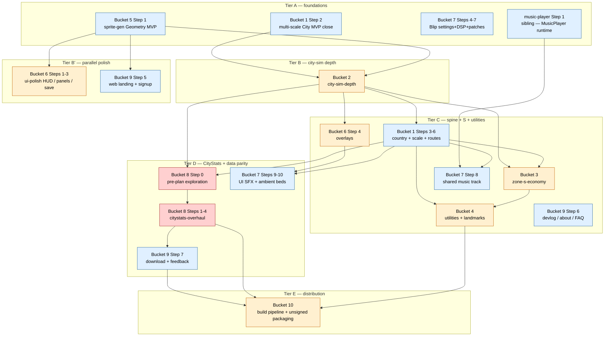

# Full-Game MVP — Umbrella Master Plan

> **Status:** Draft — umbrella orchestrator pointing at 11 child orchestrators (5 existing + 6 new). Permanent artifact; NEVER closeable via `/closeout` (per `ia/rules/orchestrator-vs-spec.md`).
>
> **Scope:** Coordinates the polished ambitious MVP (Approach F from `docs/full-game-mvp-exploration.md`). Defines tier lanes, cross-bucket dependencies, save-schema coordination, stabilization policy, distribution gating. Does NOT decompose bucket steps — each child orchestrator owns its own step/stage/phase/task tree per `ia/rules/project-hierarchy.md`.
>
> **Exploration source:** [`docs/full-game-mvp-exploration.md`](../../docs/full-game-mvp-exploration.md) — ground-truth Design Expansion. Every bucket summary below defers to that doc for Mission / Subsystems / Hard deferrals detail.
>
> **Locked decisions (do not reopen here):**
> - Approach F — Polished Ambitious MVP. 20–50 curated testers. macOS + Windows native. No WebGL. English only. Mouse + keyboard. No calendar deadline.
> - Feedback channel primary = web `/feedback` form. Secondary = Discord link. Personal triage weekly.
> - Sprite library target ~300 variants. No vehicle / decoration / seasonal sprites.
> - Music = single shared track across all scales. No adaptive music. No per-scale variation. Delivered via sibling `music-player-master-plan.md` subsystem (Bucket 7 seeds one track onto playlist).
> - Stabilization = per-bucket kickoff pass + ad-hoc `/project-new` for global interrupts (TECH-15, TECH-16). NOT a standalone master plan (revisit at `mvp-stabilization-umbrella.md` if bucket-scope pattern drifts).
> - Canonical terminology: **country** (NOT "nation") per `multi-scale-master-plan.md` + glossary. `CountryCell` / `parent_country_id`. Bucket labels use **country** everywhere; exploration doc prose polished to match.
>
> **Hierarchy rules:** `ia/rules/project-hierarchy.md` (step > stage > phase > task). `ia/rules/orchestrator-vs-spec.md` (this doc = umbrella orchestrator, one level up from bucket orchestrators). `ia/rules/agent-lifecycle.md` (ordered flow per bucket).
>
> **Parallel-work rule:** NEVER run `/stage-file` or `/closeout` against two sibling bucket orchestrators concurrently on the same branch — glossary + MCP index regens must sequence. Umbrella coordinates tier lanes; each tier lane may have multiple buckets IN PROGRESS but only one filing / closing at a time.
>
> **Read first if landing cold:**
>
> - [`docs/full-game-mvp-exploration.md`](../../docs/full-game-mvp-exploration.md) — full Design Expansion + architecture Mermaids + examples.
> - [`ia/rules/orchestrator-vs-spec.md`](../rules/orchestrator-vs-spec.md) — orchestrator permanence.
> - [`ia/rules/project-hierarchy.md`](../rules/project-hierarchy.md) — step/stage/phase/task cardinality.
> - [`ia/rules/agent-lifecycle.md`](../rules/agent-lifecycle.md) — per-bucket lifecycle surfaces.
> - MCP: `backlog_issue {id}` per referenced id; never full `BACKLOG.md` read.
>
> **Invariants:** `ia/rules/invariants.md` #1–#12 implicated across Buckets 1–8; Bucket 9 (web) + 10 (build pipeline) NOT implicated. Per-bucket risk table → exploration doc §Subsystem impact summary.

---

## Beta parameters (locked)

| Parameter | Value |
|-----------|-------|
| Audience size | 20–50 curated testers |
| Trust level | Dev-savvy friends; user filters feedback personally |
| Deployment | macOS + Windows native (no WebGL) |
| Timeline | Ship when ready (no fixed date) |
| Feedback channel | Web `/feedback` form (primary); Discord (secondary) |
| Sprite library target | ~300 variants |
| Music | Single shared track (via music-player subsystem) |
| Localisation | English only |
| Input | Mouse + keyboard |

---

## Bucket table

Status rolls up from child orchestrators. Human updates row when child bucket step flips. Status enum: `Not started` / `In progress — Step X of N` / `Paused` / `Final`. Tier = entry gate per §Tier lanes below.

| # | Bucket slug | Mode | Child orchestrator | Tier | Status | Depends on | Exit gate |
|---|-------------|------|--------------------|------|--------|------------|-----------|
| 1 | multi-scale | EXTEND | [`multi-scale-master-plan.md`](multi-scale-master-plan.md) | A → C | In progress — Step 2 of 6 | Bucket 5 (sprite v1 for region / country cell sprites at Step 4+) | City ↔ region ↔ country loop plays; multi-tier route hierarchy; border-sign UX hook |
| 2 | city-sim-depth | NEW | `city-sim-depth-master-plan.md` | B | Not started | Bucket 1 Step 2 aggregate contract; Bucket 5 Step 2 anim descriptor | 3-type pollution + crime + traffic + districts + construction evolution + industrial specialisation |
| 3 | zone-s-economy | NEW | `zone-s-economy-master-plan.md` | C | Not started | Bucket 2 services coverage; Bucket 1 budget cross-scale | Zone S + per-service budgets + deficit + bonds; save schema v3 S-row |
| 4 | utilities-and-landmarks | NEW | `utilities-and-landmarks-master-plan.md` | C | Not started | Bucket 1 country scale; Bucket 3 big-project budget | Utility pools (water / power / sewage) + landmarks progression |
| 5 | sprite-gen-and-animation | EXTEND | [`sprite-gen-master-plan.md`](sprite-gen-master-plan.md) | A | In progress — Step 1 of 5 | None | Geometry MVP Final; animation descriptor YAML locked; archetype coverage (S + utilities + landmarks) |
| 6 | ui-polish | NEW | `ui-polish-master-plan.md` | B' → C | Not started | Bucket 5 icons/splash; Bucket 7 UI SFX call sites | HUD + info panels + overlays + new-game setup + onboarding + glossary + tooltips |
| 7 | audio-polish-and-blip | EXTEND | [`blip-master-plan.md`](blip-master-plan.md) | A → C | In progress — Step 4 pending file (Steps 1–3 Final) | Bucket 1 scale-switch hook (for Step 10 ambient cross-fade); sibling `music-player-master-plan.md` Step 1 Final (for Step 8 mixer handoff) | Blip Steps 4–7 Final; Steps 8 (music) / 9 (UI SFX) / 10 (ambient beds) Final |
| — | music-player (sibling) | existing | [`music-player-master-plan.md`](music-player-master-plan.md) | A | In progress — Step 1 Stage 1.1 pending file | None | MusicPlayer runtime + NowPlayingWidget + Credits. Bucket 7 Step 8 consumes Step 1 exit contract |
| 8 | citystats-overhaul | NEW + pre-plan | `citystats-overhaul-master-plan.md` | D | Not started | Bucket 2 outputs; Bucket 1 per-scale aggregates; Bucket 9 dashboard schema; pre-plan `docs/citystats-overhaul-exploration.md` | CityStats redesign + per-metric services + web dashboard data parity |
| 9 | web-platform | EXTEND | [`web-platform-master-plan.md`](web-platform-master-plan.md) | A → E | In progress — Steps 1–4 Final; Steps 5–6 Paused | Bucket 5 screenshots/trailer; Bucket 8 dashboard schema; Bucket 10 build artifact URL | Landing + signup + devlog + download + feedback form + FAQ + press kit live |
| 10 | distribution | NEW (or fold) | `distribution-master-plan.md` | E | Not started | All other buckets buildable (compile-clean + assets packed) | Signed macOS + Windows builds; private URL live; versioning + patch channel |

**Count check:** 10 buckets mapped to 10 target orchestrators + 1 sibling (music-player). 5 existing (multi-scale, sprite-gen, blip, web-platform, music-player) + 6 new (city-sim-depth, zone-s-economy, utilities-and-landmarks, ui-polish, citystats-overhaul, distribution).

**Pre-plan:** `docs/citystats-overhaul-exploration.md` = the single pre-plan exploration seed (per exploration doc §Open questions #3). Must land before Bucket 8 `/master-plan-new` invocation. Locks (a) data parity schema vs web dashboard, (b) metric taxonomy per scale, (c) visual style parity.

---

## Tier lanes

Tier = entry gate. Bucket enters a tier when its dependencies are satisfied (exit criteria of prior-tier buckets). Multiple buckets can sit in the same tier concurrently (parallel-safe).

### Tier A — foundations (start now, parallel-safe)

No inter-bucket blockers. Already in progress across 3 orchestrators.

- **Bucket 1 Step 2** — multi-scale City MVP close. Consumes existing Step 1 parent-scale stubs. Blocks Bucket 2 (aggregate contract) + Bucket 7 Step 10 (scale-switch hook).
- **Bucket 5 Step 1** — sprite-gen Geometry MVP close. Feeds every visual consumer (Buckets 2 / 4 / 6 / 9).
- **Bucket 7 Steps 4–7** — Blip settings UI + DSP v2 + patches + editor window (post-MVP in Blip plan; MVP-gating via umbrella rollup). Runs on Blip existing skeleton.
- **Music-player Step 1** — sibling; lands MusicPlayer + playlist pipeline. Unblocks Bucket 7 Step 8 mixer handoff.

**Tier A exit:** Bucket 1 Step 2 Final + Bucket 5 Step 1 Final + music-player Step 1 Final. Blip Steps 4–7 can trail into Tier B.

### Tier B — city-sim depth (gated by Tier A)

Gated on Bucket 1 aggregate contract + Bucket 5 anim descriptor YAML.

- **Bucket 2** — all steps. Absorbs FEAT-08 / FEAT-43 / FEAT-52 / FEAT-53 + 3-type pollution + crime + traffic + waste + construction evolution + industrial specialisation. Largest bucket by stage count (≈12–15 stages).

**Tier B exit:** Bucket 2 Final (city-sim-depth contract stable — Buckets 3 / 4 / 8 consume).

### Tier B' — parallel polish (runs alongside B, no B dependency)

No Tier B block.

- **Bucket 6 Steps 1–3** — UiTheme + HUD + info panels + save / load slots. Only Step 4 (overlays) needs Bucket 2 overlay data signals. Open Steps 1–3 in parallel with Tier B.
- **Bucket 9 Step 5** — landing + signup form + backend storage. No Tier B block.

### Tier C — multi-scale spine + S + utilities + UI overlays

Gated on Tier B exit. Multiple buckets in parallel.

- **Bucket 1 Steps 3–6** — country auto-sim + scale transitions + inter-scale influence + multi-tier roads + border/customs. Needs Bucket 2 aggregate shape locked.
- **Bucket 3** — Zone S + per-service budgets + deficit + bonds. Needs Bucket 2 services coverage + Bucket 1 Step 3 country budget flow.
- **Bucket 4** — utility pools + landmarks. Needs Bucket 3 big-project budget + Bucket 1 country scale.
- **Bucket 6 Step 4** — overlays toggle (pollution / crime / traffic / happiness / zone / desirability). Consumes Bucket 2 overlay data.
- **Bucket 7 Step 8** — shared music track integration via music-player subsystem. Needs music-player Step 1 Final.
- **Bucket 9 Step 6** — devlog + about + FAQ + press kit + Discord link. No Bucket 2/3/4 block; parallel with Tier C.

**Tier C exit:** all game-loop buckets Final except Bucket 8 (CityStats) + Bucket 10 (distribution).

### Tier D — CityStats overhaul + web data parity

Gated on Tier C exit. CityStats needs all city-sim-depth outputs + country aggregates + web dashboard schema. Pre-plan exploration must land first.

- **Bucket 8 Step 0 (pre-plan)** — `docs/citystats-overhaul-exploration.md`. Can start earlier in parallel (Tier B' slot) if user wants to pre-load context, but must Final before Bucket 8 Step 1.
- **Bucket 8 Steps 1–4** — CityStats decomposition + UI rewrite + web dashboard schema parity + demographics + minimap.
- **Bucket 9 Step 7** — private download page + feedback form + dashboard parity. Needs Bucket 8 schema + Bucket 10 build URL.
- **Bucket 7 Steps 9–10** — UI SFX + ambient beds. Needs Bucket 6 UI call sites + Bucket 1 scale-switch hook.

**Tier D exit:** CityStats parity live. Feedback form live. All runtime + web content Final.

### Tier E — distribution (last)

Gated on Tier D exit. Everything must compile clean + assets packed.

- **Bucket 10 Step 1** — Unity build pipeline + CI trigger + versioning manifest.
- **Bucket 10 Step 2** — unsigned-tier packaging (free tier selected: macOS unsigned `.app` + Windows unsigned `.exe`; download-page README covers Gatekeeper + SmartScreen bypass) + private URL publication + patch channel. Cert-based signing deferred to post-beta upgrade trigger.

**Tier E exit = MVP ship to curated testers.**

---

## Cross-bucket dependency diagram

Reading: solid arrows = "blocks / informs". Tier boundary = enter-gate. Blue = EXTEND existing orchestrator. Orange = NEW orchestrator. Red = pre-plan exploration required.

---

## Save-schema coordination (v2 → v3 bump)

Gap B3 from exploration review: Bucket 1 / Bucket 3 / Bucket 4 all mutate save schema. One coordinated bump. NOT parallel edits.

Touched fields per bucket (additive unless noted):

| Bucket | Save additions | Breaking? |
|--------|----------------|-----------|
| 1 (multi-scale) | `CountryCell` / `RegionCell` tables; per-scale tick cursors; scenario_descriptor v1 extensions | Additive (existing Step 1 landed `region_id` / `country_id` placeholder columns) |
| 2 (city-sim-depth) | 3-type pollution per cell; crime score per cell; traffic level per road stroke; district id per cell; construction stage per building | Additive + happiness formula breaking (migration required — recompute on load) |
| 3 (zone-s-economy) | Zone S tiles (RCI → RCIS fourth channel); per-service budget rows; bond registry | **Breaking** — RCI code paths assume 3-channel. Migration required. |
| 4 (utilities-and-landmarks) | Utility pool state per scale; utility contributor refs; landmark unlock flags; big-project commitment ledger | Additive |

**Coordination rule:** Bucket 3 Step 1 owns the v3 schema bump. Buckets 1 / 2 / 4 stage additions against the v3 envelope — no mid-tier intermediate v2.x bumps. Migration path v2 → v3:

1. Existing v2 saves load via adapter (GameSaveManager v2→v3 read shim). S channel filled with empty S-zone map. Pollution back-filled air-only (scalar). Crime zero. Districts null. Utilities zero.
2. Save writes always v3.
3. No v2 write path retained.

Touch site: `Assets/Scripts/Managers/GameManagers/GameSaveManager.cs` + `Assets/Scripts/SaveSystem/GameSaveData.cs` + `ia/specs/persistence-system.md`.

---

## Stabilization policy

Exploration doc §Stabilization recommends BACKLOG sweep + per-bucket kickoff pass. Umbrella confirms + enumerates.

**Per-bucket kickoff stabilization pass (mandatory first stage of each bucket):**

| Bucket | Interrupt IDs to clear at kickoff |
|--------|-----------------------------------|
| 1 | BUG-31 (interstate border prefabs), BUG-28 (slope vs interstate sorting) |
| 2 | TECH-16 (tick perf v2), BUG-49 (street preview anim) |
| 3 | — (no interrupts; coordination with Bucket 2 services contract) |
| 4 | BUG-20 (utility building visual restore on LoadGame) |
| 5 | — (tooling isolated) |
| 6 | BUG-14 (per-frame FindObjectOfType), BUG-48 (minimap stale) |
| 7 | BUG-55 (10-fix audit — Blip-adjacent subset) |
| 8 | TECH-82 follow-ups (per-scale metrics extensions) |
| 9 | — |
| 10 | — |

**Global interrupts (standalone `/project-new` when signal warrants):** TECH-15 (geography init perf — global), TECH-16 (tick perf v2 — also Bucket 2 kickoff), BUG-55 (10-fix audit — cross-subsystem).

**Rule:** bucket MUST NOT open Stage 2 until its kickoff stabilization pass closes. If drift > 3 unplanned stabilization passes lands, escalate to `mvp-stabilization-umbrella.md` orchestrator creation — revisit decision at master-plan-new time (Phase 6 review suggestion).

---

## Distribution gating (Tier E)

**Signing tier selected for MVP: Free (unsigned).** macOS + Windows both ship unsigned for the 20–50 curated-tester beta. Trust model = dev-savvy friends, warnings acceptable. No recurring cert cost. Upgrade paths reserved for post-beta.

Bucket 10 exit criteria (free tier):

- Unity macOS build: unsigned `.app` bundle in signed `.dmg` (optional) or zipped. Tester first-launch path: right-click → Open (or `xattr -rd com.apple.quarantine Territory.app` for quarantine flag removal). Documented on `/download` page.
- Unity Windows build: unsigned `.exe` + installer (or portable zip). Tester first-launch path: SmartScreen warning → More info → Run anyway. Defender prompt possible on first run. Documented on `/download` page.
- Version manifest: semver (e.g. `0.1.0-beta.1`), written to build metadata + `BuildInfo` ScriptableObject consumed by Credits screen.
- Private URL: Vercel `/download` page gates behind token or signed URL. Not indexed. `robots.txt` disallow.
- Patch channel: in-game version check against Vercel endpoint. User notified of new build. No auto-update (testers manually re-download).
- Itch private page (fallback): same unsigned build artifacts uploaded to itch.io private / restricted page for testers who prefer itch client.
- Download-page README block: step-by-step first-launch bypass instructions for both macOS Gatekeeper + Windows SmartScreen. Screenshot of expected warning dialog per OS. Discord link for tester troubleshooting.

**Hard deferrals (per exploration doc):** auto-update; Linux builds; WebGL; Steam public; itch public.

**Signing tier menu (escalation options — post-MVP triggers only):**

| Tier | Cost / yr | macOS | Windows | Trigger to upgrade |
|------|-----------|-------|---------|--------------------|
| **Free (selected)** | $0 | Unsigned + Gatekeeper bypass | Unsigned + SmartScreen bypass | — baseline |
| Apple-only | $99 | Developer ID + notarization + stapling → zero warnings | Unsigned + SmartScreen bypass | Mac tester friction reported in feedback |
| Apple + Trusted Signing | ~$220 | Developer ID notarized | Azure Trusted Signing (~$10/mo MS chain, no hardware token, immediate reputation) | Windows tester friction + broader audience |
| Full polish | $400–700 | Developer ID notarized | OV or EV cert (hardware token / HSM) | Public release / Steam / wide distribution |

**Escalation rule:** free tier ships. Only escalate if tester feedback specifically flags first-launch friction as adoption-blocking. Cost + setup lead time (cert procurement = days-to-weeks for EV hardware token shipment) stays user-side decision, not bucket scope.

**Bucket 10 Step 2 free-tier scope:** build pipeline outputs unsigned artifacts + download-page README bypass copy + SmartScreen / Gatekeeper screenshots. No cert procurement, no notarization wiring, no code-sign scripts. Post-beta upgrade work deferred — open new orchestrator step when triggered.

---

## Progress roll-up mechanism

Three layers:

1. **Task level** — child orchestrator task tables. Lifecycle skills (`stage-file` / `/kickoff` / `/implement` / `/closeout`) flip status per `ia/rules/project-hierarchy.md`.
2. **Step / Stage level** — child orchestrator step status enum (`Draft / In Review / In Progress / Final`). `project-stage-close` skill flips stage rollup.
3. **Bucket level** — umbrella §Bucket table above. Human updates row when child orchestrator step flips. Rollup convention: bucket Status = "In progress — Step X of N" where X = highest step currently In Progress, N = total steps planned.

**Dashboard surface:** web `/dashboard` (ISR 5-min revalidate) fetches `ia/projects/*master-plan*.md` from GitHub raw → umbrella orchestrator visible within ~5 min of push without redeploy. No new infra needed. User updates umbrella bucket rows on same commit as child orchestrator step flip.

**No automated rollup.** Keeping roll-up human-edited avoids parser brittleness + preserves the one-file-one-artifact invariant. Dashboard displays the umbrella as-is.

---

## Handoff sequence

Ordered invocations per bucket — user runs at pace. Parallel-work rule constrains concurrency within a single branch.

1. **Bucket 1 (multi-scale) Step 2** — already decomposed pending in existing plan. Run `/stage-decompose ia/projects/multi-scale-master-plan.md Step 2` (if needed) then `/stage-file ia/projects/multi-scale-master-plan.md Stage 2.1`.
2. **Bucket 5 (sprite-gen) Step 1 close** — finish Stages 1.3 + 1.4 per existing plan.
3. **Bucket 7 (blip) Step 4 file** — `/stage-file ia/projects/blip-master-plan.md Stage 4.1` (tasks already decomposed).
4. **Music-player Step 1 Stage 1.1 file** — `/stage-file ia/projects/music-player-master-plan.md Stage 1.1`.
5. **Bucket 2 (city-sim-depth) new master plan** — once Bucket 1 Step 2 aggregate contract lands + Bucket 5 anim descriptor locked. `/master-plan-new docs/full-game-mvp-exploration.md` with `city-sim-depth-master-plan` slug.
6. **Bucket 8 pre-plan exploration** — `/design-explore docs/citystats-overhaul-exploration.md` (create stub first if file does not exist).
7. **Buckets 3 / 4 / 6 / 9 / 10 new master plans** — order per tier lanes. Each uses `/master-plan-new docs/full-game-mvp-exploration.md` with bucket slug.
8. **Bucket 8 master plan** — `/master-plan-new docs/citystats-overhaul-exploration.md` once pre-plan Final.

**Coordination note:** music-player is sibling (not a bucket). Ships whenever its orchestrator lands — does NOT gate MVP beyond Bucket 7 Step 8 mixer handoff.

---

## Deferred from umbrella scope

- **Automated bucket-status rollup** — human-edited today. Revisit if bucket count grows or drift rate forces.
- **Mermaid live rendering on dashboard** — current dashboard renders raw markdown; Mermaid inside child orchestrators not rendered. Post-MVP.
- **Cross-bucket search** — MCP `spec_sections` covers permanent specs; umbrella + child orchestrators live in `ia/projects/` and are reachable via MCP `list_specs` + `spec_outline`. No new tool.
- **mvp-stabilization-umbrella.md** — only create if per-bucket stabilization rule fails (drift > 3 unplanned passes). See §Stabilization policy.

---

## Change log

| Date | Delta |
|------|-------|
| 2026-04-16 | Initial authoring — umbrella orchestrator created to coordinate 10 buckets post exploration doc third-pass review. Fixes step-number collisions (Buckets 1/5/9), country vs nation terminology, save-schema coordination, stabilization policy, distribution gating. |
| 2026-04-16 | Distribution gating — signing tier selected = Free (unsigned). macOS + Windows ship unsigned; download-page README covers Gatekeeper + SmartScreen bypass for 20–50 curated testers. Cert-based signing deferred to post-beta upgrade trigger. Tier menu added (Free / Apple-only $99 / Apple + Azure Trusted Signing ~$220 / Full polish $400–700). Bucket 10 Step 2 scope reduced to unsigned packaging + bypass docs. |
