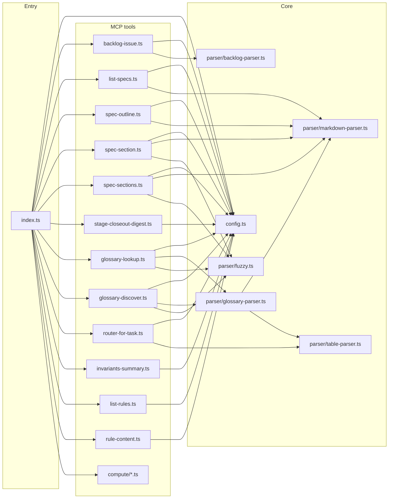

# Territory IA MCP server

Local [Model Context Protocol](https://modelcontextprotocol.io/) server for **Territory Developer** information architecture. It reads the **same** on-disk sources agents already use: `ia/specs/*.md`, `ia/rules/*.md`, `glossary.md`, and root docs registered in `buildRegistry()` (e.g. `AGENTS.md`, `ARCHITECTURE.md`).

Canonical integration notes: [`docs/mcp-ia-server.md`](../../docs/mcp-ia-server.md) and [`ia/rules/agent-router.md`](../../ia/rules/agent-router.md) (subsection **MCP — territory-ia**).

Abstract pattern (reusable outside this game): [`docs/mcp-markdown-ia-pattern.md`](../../docs/mcp-markdown-ia-pattern.md).

## Prerequisites

- **Node.js 18+**
- Repository root as the process working directory (Cursor’s default when the workspace is this repo)

## Commands

| Command | Purpose |
|--------|---------|
| `npm install` | Install dependencies (run once under `tools/mcp-ia-server/`). |
| `npm run dev` | Run the server via `tsx` (stdio MCP). |
| `npm run build` | Emit JavaScript to `dist/` with `tsc`. |
| `npm start` | Run compiled `dist/index.js` (stdio MCP). |
| `npm test` | Unit tests (`node:test` + `tsx`) for parser and tool helpers. |
| `npm run test:watch` | Tests in watch mode. |
| `npm run test:coverage` | Parser + **ia-index** line coverage with **c8** (gate ≥90%). |
| `npm run verify` | From this directory: spawns the server the same way as Cursor (via repo root + `npx -y tsx …`) and exercises all registered tools through the MCP SDK client. |
| `scripts/run-unity-bridge-once.ts` | From repo root: `npm run db:bridge-agent-context` — one **`unity_bridge_command`**-equivalent call (needs Postgres + Unity). Optional **`BRIDGE_TIMEOUT_MS`**. |
| `scripts/bridge-playmode-smoke.ts` | From repo root: `npm run db:bridge-playmode-smoke -- [seed_cell]` — same as MCP **`unity_bridge_command`** (`runUnityBridgeCommand`): **`get_play_mode_status` → `enter_play_mode` → `debug_context_bundle` → `exit_play_mode`**. Needs Postgres (**`DATABASE_URL`** or **`config/postgres-dev.json`**) and Unity Editor open on **`REPO_ROOT`** (run **`npm run unity:ensure-editor`** to auto-launch if not running). |
| Root **`npm run verify:local`** | **`validate:all`** (includes **`compute-lib:build`**) then **`post-implementation-verify.sh --skip-node-checks`**: **`unity:compile-check`**, **`db:migrate`**, **`db:bridge-preflight`**, **macOS** **Unity** save/quit + relaunch, **`db:bridge-playmode-smoke`**. **`npm run verify:post-implementation`** is an alias. [`tools/scripts/verify-local.sh`](../../tools/scripts/verify-local.sh). See [`docs/mcp-ia-server.md`](../../docs/mcp-ia-server.md) and [`ARCHITECTURE.md`](../../ARCHITECTURE.md). |
| `npm run validate:fixtures` | **AJV** (JSON Schema Draft 2020-12): valid fixtures under `docs/schemas/fixtures/` must pass; invalid fixtures must fail. |
| `npm run generate:ia-indexes` | Writes `data/spec-index.json` and `data/glossary-index.json`. Pass `--check` to assert they match the generator (used in **CI**). |

From the **repository root**, `package.json` exposes `npm run validate:fixtures` and `npm run generate:ia-indexes` via `npm --prefix tools/mcp-ia-server`, and `npm run validate:dead-project-specs` (**TECH-50** completed — [`tools/validate-dead-project-spec-paths.mjs`](../validate-dead-project-spec-paths.mjs); see [`docs/mcp-ia-server.md`](../../docs/mcp-ia-server.md)). For an **ordered** post-change checklist (**CI** parity), see [`ia/skills/project-implementation-validation/SKILL.md`](../../ia/skills/project-implementation-validation/SKILL.md) (**TECH-52** completed).

## Cursor integration

The repo includes `.mcp.json`, which starts the server with:

- `npx -y tsx tools/mcp-ia-server/src/index.ts`
- `REPO_ROOT=.` so paths resolve against the workspace root

If your MCP host uses a different working directory, set `REPO_ROOT` to the **absolute** repository path, or adjust the command in `mcp.json`.

## Environment

| Variable | Meaning |
|----------|---------|
| `REPO_ROOT` | Root used to resolve `ia/specs`, `ia/rules`, and root markdown. Defaults to `process.cwd()`. |
| `DATABASE_URL` | Optional **PostgreSQL** URI; overrides committed **`config/postgres-dev.json`** when set. When no URL resolves (and not **CI**), **`project_spec_journal_*`** return **`db_unconfigured`**. |

## Tools (78)

| Tool | Description |
|------|-------------|
| **`backlog_issue`** | One matching issue by `issue_id` (e.g. `BUG-37`): searches `BACKLOG.md` (**open** rows) then `BACKLOG-ARCHIVE.md` (**`[x]`** completions). Returns `status`, `backlog_section`, `Files` / `Spec` / `Notes` / `Acceptance` / `depends_on`, `depends_on_status` (cited ids: `open` / `completed` / `not_in_backlog`, `soft_only`, `satisfied`), `raw_markdown`. **`soft_only`** includes `**ID** (soft: …)` when the parenthetical does not cite another issue id — see [`docs/mcp-ia-server.md`](../../docs/mcp-ia-server.md) (**Issue kickoff workflow**). Not in `list_specs`. |
| **`list_specs`** | Registry entries: `key`, `relativePath`, `description`, `category`, `lineCount`. Optional filter `category` (e.g. `rule`). |
| **`spec_outline`** | Nested heading outline with line ranges. `spec` accepts key, filename, or alias (`geo` → `isometric-geography-system`, `roads` → `roads-system`, `unity` / `unityctx` → `unity-development-context`, `refspec` / `specstructure` → `reference-spec-structure`, …). |
| **`spec_section`** | Body for one section: canonical `spec` + `section` (id `13.4`, slug, title substring, or fuzzy typo). Aliases: `key` / `doc` → spec; `section_heading` / `heading` → section; numeric `section` coerced to string. `max_chars` or `maxChars` (default 3000) with `truncated` / `totalChars`. |
| **`spec_sections`** | Batch: `sections` array; each element uses the same shape as **`spec_section`**. Response `results` map keyed by `spec::section`. Optional `max_requests` (default 20, max 50). |
| **`stage_closeout_digest`** | Exactly one of `issue_id` or `spec_path` (`ia/projects/{ISSUE_ID}.md`). Returns structured closeout prep JSON (`schema_version` 1, section bodies, `cited_issue_ids`, keywords, heuristic `checklist_hints`). Read-only. Called N times per closing Stage by `plan-applier` Mode stage-closeout (Sonnet pair-tail, seam #4). Renamed from `project_spec_closeout_digest` in lifecycle-refactor T7.14. |
| **`project_spec_journal_persist`** | Append **Decision Log** + **Lessons learned** from the project spec into **`ia_project_spec_journal`** (`DATABASE_URL` required). Optional `git_sha`. |
| **`project_spec_journal_search`** | Full-text / keyword overlap search over the journal; optional `raw_text_for_tokens`. |
| **`project_spec_journal_get`** | Full row by numeric `id`. |
| **`project_spec_journal_update`** | Patch `body_markdown` / `keywords` for a row. |
| **`glossary_discover`** | Keyword discovery over glossary rows (**English** `query` / `keywords` only — translate from the user’s language before calling). Scores **Term**, **Definition**, **Spec**, and category; returns ranked `term`, `specReference`, optional `spec` alias + `registryKey`, `matchReasons`, `score`. Params: `query` and/or `keywords` (alias `terms`); `q` / `search` for query; `max_results` / `maxResults` (default 10, cap 25). |
| **`glossary_lookup`** | Glossary row: exact (case-insensitive) then fuzzy; **`term` must be English** (glossary language). Bracket text like `[x,y]` normalized for matching. |
| **`router_for_task`** | Match task hints to specs using `agent-router.md` tables. Provide **`domain`** and/or **`files`** (max 40 paths); at least one required. Merges optional **`file_domain_hints`** from path heuristics with table rows. |
| **`invariants_summary`** | Invariants + guardrails from `invariants.md`. |
| **`list_rules`** | All `.md` rules with frontmatter (`alwaysApply`, `globs`, description). |
| **`rule_content`** | Rule markdown body without frontmatter. `rule: "roads"` resolves **`roads.md`** (use `spec_section` / `spec_outline` with alias `roads` for the **roads-system** spec). |
| **`isometric_world_to_grid`** | **Computational** ( **`tools/compute-lib`** ): planar `world_x` / `world_y` + `tile_width` / `tile_height` → `cell_x` / `cell_y` (**isometric-geography-system** §1.3; glossary **World ↔ Grid conversion**). Optional `origin_x` / `origin_y`. Returns `{ ok, cell_x, cell_y }` or `{ ok: false, error }` (`VALIDATION_ERROR` for bad input). |
| **`growth_ring_classify`** | **Computational:** urban **growth ring** from cell + centroids + `urban_cell_count` or `urban_radius` (simulation-system §Rings; parity **UrbanGrowthRingMath**). Returns `{ ok, data: { ring, urban_radius, distance_to_pole } }`. |
| **`grid_distance`** | **Computational:** **Chebyshev** or **Manhattan** distance between integer cells (not geo §10 pathfinding costs). Optional `map_width` / `map_height` (≤ 256). |
| **`pathfinding_cost_preview`** | **Computational v1:** Manhattan steps × `unit_cost_per_step` — labeled **approximation** only; not committed **A\*** / geo §10 costs. |
| **`geography_init_params_validate`** | **Computational:** Zod validation for **Geography initialization** interchange v1 (`artifact` + `schema_version` 1). Pass document fields as the tool argument object. |
| **`desirability_top_cells`** | **Stub:** returns `NOT_AVAILABLE` until **TECH-66** (`BACKLOG.md`) Unity **`batchmode`** export exists. |
| **`unity_bridge_command`** | **IDE agent bridge** (glossary): **`kind`** **`export_agent_context`** \| **`get_console_logs`** \| **`capture_screenshot`** \| **`enter_play_mode`** \| **`exit_play_mode`** \| **`get_play_mode_status`** \| **`get_compilation_status`** \| **`debug_context_bundle`** + **`timeout_ms`** (default **30000**, max **120000**). Inserts **`agent_bridge_job`** (**`request` jsonb** includes **`params`** per kind). **`export_agent_context`:** optional **`seed_cell`** (`"x,y"` Moore center, e.g. **`"3,0"`**; else selection or `(0,0)`). **`get_console_logs`:** optional **`since_utc`**, **`severity_filter`**, **`tag_filter`**, **`max_lines`** (1–2000). **`capture_screenshot`:** optional **`camera`** (GameObject name), **`filename_stem`**, **`include_ui`** (boolean, default false — **Game view** + Overlay UI via **`ScreenCapture`**; ignores **`camera`** when true). **`get_compilation_status`:** synchronous **`response.compilation_status`**. **`debug_context_bundle`:** required **`seed_cell`**; optional **`include_screenshot`**, **`include_console`**, **`include_anomaly_scan`** (default true); reuses console filters / **`max_lines`**; **`response.bundle`** combines export path, screenshot, lines, anomalies. Requires **`DATABASE_URL`**, migration **0008**, Unity on **REPO_ROOT** (run **`npm run unity:ensure-editor`** to auto-launch), **`AgentBridgeCommandRunner`**. On timeout, follow **timeout escalation protocol** in [`docs/agent-led-verification-policy.md`](../../docs/agent-led-verification-policy.md). |
| **`unity_bridge_get`** | **IDE agent bridge** (glossary): read **`agent_bridge_job`** by **`command_id`**; optional **`wait_ms`** for short blocking poll. |
| **`unity_compile`** | **IDE agent bridge** shortcut: enqueues **`get_compilation_status`** (same **`runUnityBridgeCommand`** path as **`unity_bridge_command`**). Argument: **`timeout_ms`**. |
| **`unity_export_cell_chunk`** | **Bridge export sugar:** **`export_cell_chunk`** in one call — **`enqueueUnityBridgeJob`** + **`pollUnityBridgeJobUntilTerminal`** (**`unity_bridge_get`**). Params: **`origin_x`**, **`origin_y`**, **`chunk_width`**, **`chunk_height`**, optional **`timeout_ms`** (else **`BRIDGE_TIMEOUT_MS`** or **40000** default), optional **`agent_id`**. Prefer **`unity_bridge_command`** for other kinds. |
| **`unity_export_sorting_debug`** | **Bridge export sugar:** **`export_sorting_debug`** in one call (same poll pattern). Params: optional **`seed_cell`**, **`timeout_ms`**, **`agent_id`**. Prefer raw **`unity_bridge_command`** for **`sorting_order_debug`**, **`debug_context_bundle`**, mutations. |
| **`backlog_search`** | Keyword search across open / archived backlog issues. `query` (required), `scope` (`open` \| `archive` \| `all`, default `open`), `max_results` (1–50, default 10). Returns ranked results with `issue_id`, `title`, `type`, `status`, `section`, `score`, truncated `notes`. |
| **`catalog_get`** | Composite **`GET`**-style read for one **`catalog_asset`** by id: asset + economy + **`sprite_slots`** (join **`catalog_sprite`**). Returns **`db_unconfigured`** / **`invalid_input`** (bad id / not found). |
| **`catalog_list`** | Keyset-paginated list of **`catalog_asset`** rows. Default **`published`** only (optional **`include_draft`**, **`status`**, **`category`**, **`limit`**, **`cursor`**). Mirrors HTTP list semantics. |
| **`catalog_spawn_pool_get`** | One **`catalog_spawn_pool`** row + **`catalog_pool_member`** rows for that pool. |
| **`catalog_spawn_pool_list`** | List **`catalog_spawn_pool`** rows; optional **`owner_category`** filter. |
| **`catalog_spawn_pool_upsert`** | **`kind:spawn_pool`** upserts by **`slug`**; **`kind:pool_member`** upserts **`(pool_id, asset_id)`** weight. Requires **`caller_agent`** (allowlist: **`ship-stage`**, **`stage-file`**, **`project-new`**, **`closeout`**). |
| **`catalog_bulk_action`** | Bulk retire / restore / publish for a list of **`entity_ids`** (1–1000). `action` required (`retire` \| `restore` \| `publish`). Returns per-entity results with `affected` count. |
| **`catalog_upsert`** | **`mode:create`** inserts asset + economy + sprite binds; **`mode:patch`** optimistic-lock patch (**`updated_at`**). Requires **`caller_agent`** (same allowlist as **`catalog_pool_upsert`**). |
| **`invariant_preflight`** | Composite context tool: given `issue_id`, bundles invariants + router matches + relevant spec sections in one call. Infers domains from issue **Files**; fetches up to 6 spec sections (800 chars each). |
| **`findobjectoftype_scan`** | Static regex scan of C# files for `FindObjectOfType` / `FindObjectsOfType` in `Update` / `LateUpdate` / `FixedUpdate` methods. Optional `path` (default `Assets/Scripts/`). Returns `violation_count` + `violations[]` (`file`, `line`, `method`, `snippet`). |
| **`city_metrics_query`** | Read recent rows from **`city_metrics_history`** (Unity **`MetricsRecorder`** per-tick snapshots). Optional **`scenario_id`**, **`last_n_rows`** (1–500). Returns **`db_unconfigured`**, **`table_missing`**, or **`rows`**. |
| **`backlog_list`** | Structured list of backlog yaml records. Optional filters (`status`, `type`, `priority`, `section`). Read-only. |
| **`backlog_record_validate`** | Validate a backlog yaml record (in-memory) against the canonical schema before materialization. Returns `{ ok, errors }`. |
| **`reserve_backlog_ids`** | Reserve monotonic ids for one or more prefixes via the on-disk counter (`ia/state/id-counter.json`) under `flock`. Used before writing new yaml. |
| **`runtime_state`** | Read or merge-write **`ia/state/runtime-state.json`** (per-clone gitignored state: last verify / bridge preflight / queued scenario id) under flock. |
| **`rule_section`** | Return a single Cursor rule (`.mdc`) heading section. Companion to **`rule_content`** for progressive disclosure. |
| **`plan_apply_validate`** | Validate a Plan-Apply tuple payload against the pair contract before the Sonnet pair-tail applies it. |
| **`master_plan_locate`** | Reverse-lookup: reads yaml `parent_plan` + `task_key` → returns `{ plan, step, stage, phase, task_key, row_line, row_raw }` for the matching master-plan row. |
| **`master_plan_next_pending`** | Given a master plan path, return the next non-Done task row (honors Done / archived / pending states). |
| **`csharp_class_summary`** | Summarize a C# class file: public surface, `[SerializeField]` refs, manager references, method signatures. Static regex + shape heuristics. |
| **`unity_callers_of`** | Static callers scan for a given C# method name across `Assets/Scripts/`. |
| **`unity_subscribers_of`** | Static subscribers scan for a given C# event name across `Assets/Scripts/`. |
| **`unity_bridge_lease`** | Acquire / release the Unity bridge single-agent lease (companion to `unity_bridge_command`). Coordinates concurrent agents on one Unity instance. |

### DB-backed read tools (Step 3 of `ia-dev-db-refactor`)

| Tool | Purpose |
|------|---------|
| **`task_state`** | Metadata + status + commits + deps for one task id from `ia_tasks`. Returns typed `task_not_found` on miss. |
| **`stage_state`** | Progress + blocker count + next-pending row for one `(slug, stage_id)` from `ia_stages` + `ia_tasks`. |
| **`master_plan_state`** | Rollup counts across stages of one master-plan `slug` from `ia_master_plans` + children. |
| **`task_spec_body`** | Full body markdown for one task id from `ia_tasks.body`. |
| **`task_spec_section`** | Single-section slice for `(task_id, section)`. Pure markdown slicer (`sliceSection`) — case-insensitive heading match, stops at next same-or-shallower heading. |
| **`task_spec_search`** | Body search over `ia_tasks`. `fts` (default) = `plainto_tsquery` + `ts_rank` + `ts_headline`. `trgm` = fuzzy `similarity` over `title` (threshold 0.1, scoped via `SET LOCAL`). Optional `status` filter. |
| **`stage_bundle`** | Composite: stage state + narrative slices (stage block + task headings) in one payload. |
| **`task_bundle`** | Composite: task state + body slices. |
| **`stage_closeout_diagnose`** | DB-backed read-only: per-step audit trail for one (slug, stage_id) closeout, ordered by ts ASC. Returns `[{step_name, ok, error, ts}]`. Empty array tolerant for legacy stages without audit rows (closeouts predating TECH-2975). Sources rows from `ia_ship_stage_journal` where `payload_kind LIKE 'closeout_step.%'`. |

All 9 read tools hit `ia_*` tables via a singleton `pg.Pool`. Pool guarded by `poolOrThrow()` which throws `IaDbUnavailableError` when the DB is offline. Trigram searches require migration `0016_ia_tasks_title_trgm.sql` (GIN `title gin_trgm_ops` index).

### DB-backed write tools (Step 4 of `ia-dev-db-refactor`)

| Tool | Purpose |
|------|---------|
| **`task_insert`** | Reserve monotonic id via per-prefix **DB sequence** (`tech_id_seq` / `feat_id_seq` / `bug_id_seq` / `art_id_seq` / `audio_id_seq`), insert `ia_tasks` row + body + `ia_task_deps` rows in one tx. Replaces `reserve-id.sh` + yaml write + `materialize-backlog.sh`. FK-checks `slug` / `stage_id` / `depends_on` / `related` against `ia_master_plans` / `ia_stages` / `ia_tasks`. |
| **`task_status_flip`** | Flip one task's status with row-level lock (`SELECT … FOR UPDATE`). Stamps `completed_at` on `done`, `archived_at` on `archived`. Returns `{ task_id, prev_status, new_status }`. Parallel flips on same row serialise. |
| **`task_spec_section_write`** | Replace (or append) one section of a task body; snapshots prior body into `ia_task_spec_history` first. Pure-markdown slicer matches case-insensitive heading + stops at next same-or-shallower heading. Missing section → appended at end with blank-line separator. |
| **`task_raw_markdown_write`** | Persist verbatim BACKLOG.md row block into `ia_tasks.raw_markdown`. Single-row UPDATE, idempotent. Replaces the Pass-A-null + Pass-B-backfill direct-SQL workaround in `/stage-file` (TECH-2973). Empty string accepted; null reserved for never-written sentinel. Returns `{ task_id, bytes_written, updated_at }`. |
| **`task_commit_record`** | Upsert commit row into `ia_task_commits` (`UNIQUE(task_id, commit_sha)`). Re-record updates `commit_kind` + `message`. Replaces yaml-sidecar per-task commit tracking. |
| **`task_dep_register`** | DB-backed: atomic `ia_task_deps` edge insert (`kind='depends_on'`) with Tarjan SCC cycle detection inside the same `withTx` block (TECH-2976). Self-reference short-circuit returns `{ok:false, error:{code:'cycle_detected', scc_members:[task_id]}}` pre-Tarjan. Cycle-introducing edges trigger ROLLBACK + structured non-throw response; clean inserts COMMIT. Idempotent re-register (`ON CONFLICT DO NOTHING` ⇒ `edges_added=0`). Tarjan scoped to reachability closure of new edge endpoints — pre-existing disjoint cycles are not flagged on every write. Pure-TS Tarjan in `src/ia-db/tarjan-scc.ts`, O(V+E), iterative (stack-safe). |
| **`stage_verification_flip`** | Append stage-verification row (`pass` \| `fail` \| `partial`) to `ia_stage_verifications` (history-preserving — no upsert). Latest row is what `stage_state` surfaces. Used at ship-stage Pass B end. |
| **`stage_closeout_apply`** | Close a stage: guards every task is already `done` \| `archived`; flips all `done` → `archived` (stamps `archived_at`) + sets stage status → `done` inside a single `withTx` block (TECH-2975). Rejects with `invalid_input` if any non-terminal tasks remain. Per-step audit rows (`stage_lock` / `non_terminal_check` / `archive_done_tasks` / `stage_status_done`) are flushed post-tx to `ia_ship_stage_journal` for `stage_closeout_diagnose` forensic reads — failure trails persist even on rollback. |
| **`journal_append`** | Append discriminated-union event to `ia_ship_stage_journal`. Canonical journal surface for agent runs. Validates `session_id` / `phase` / `payload_kind` non-empty + `payload` is non-null non-array object. Body shape of `payload` is trust-but-document. |
| **`fix_plan_write`** | Write fix-plan tuples for `(task_id, round)`. Deletes prior **unapplied** tuples for same key first (rewrite semantics), then inserts new tuples with increasing `tuple_index`. Applied tuples (`applied_at IS NOT NULL`) are preserved for 30-day TTL soft-delete. |
| **`fix_plan_consume`** | Mark all unapplied tuples for `(task_id, round)` as applied (stamps `applied_at = now()`). Idempotent — re-run returns `consumed=0` once all are applied. |
| **`master_plan_render`** | DB-backed: return master plan preamble (verbatim) + per-stage rendered markdown blocks (heading + status + objective + exit + tasks). Replaces filesystem reads of `ia/projects/{slug}/index.md` and `stage-X.Y-*.md`. Optional `include_change_log` adds latest N change log entries (DESC by ts). |
| **`stage_render`** | DB-backed: render one stage block as markdown (heading + status + objective + exit + tasks table) plus structured fields. Replaces filesystem reads of `ia/projects/{slug}/stage-X.Y-*.md`. |
| **`master_plan_preamble_write`** | DB-backed: replace the verbatim preamble blob for a master plan (everything-above-`## Stages`). Optional `change_log` arg appends a structured history row in the same tx. Replaces direct edits to `ia/projects/{slug}/index.md`. |
| **`master_plan_change_log_append`** | DB-backed: append one append-only history row to `ia_master_plan_change_log`. UNIQUE `(slug, stage_id, kind, commit_sha)` (migration `0042`) — duplicate inserts return `deduped: true` with `entry_id: null` (idempotent re-run for closeout / sha-backfill chains). Optional `stage_id` axis distinguishes per-stage entries from plan-scope rows. |
| **`master_plan_insert`** | DB-backed: insert a new `ia_master_plans` row. Validates kebab-case `slug` (`/^[a-z0-9][a-z0-9-]*$/`). Errors `invalid_input` on duplicate slug. Optional `preamble` + `description` populated atomically. |
| **`master_plan_description_write`** | DB-backed: replace the short product-overview blurb on `ia_master_plans.description` (≤200 char soft target — advisory). Authored case-by-case from the preamble; backs the dashboard subtitle. Mirror of `master_plan_preamble_write`. Optional `change_log` row appended in the same tx. |
| **`stage_insert`** | DB-backed: insert a new `ia_stages` row under existing master plan. Validates `stage_id` pattern `/^[0-9]+(\.[0-9]+)?$/`. FK-checks parent `slug`. Optional `title` / `objective` / `exit_criteria` / `status` (default `pending`) / `body` (verbatim Stage block, default `""`). |
| **`stage_update`** | DB-backed: partial update of structured `ia_stages` fields (`title` / `objective` / `exit_criteria`). FOR UPDATE lock; `null` clears, `undefined` skips. Returns `updated_fields[]`. Status flips remain controlled via `task_status_flip` + `stage_closeout_apply`. |
| **`stage_body_write`** | DB-backed: replace the verbatim body blob for a stage (full Task table + 4 subsections, mirrors `master_plan_preamble_write` for plans + `task_spec_section_write` for tasks). FOR UPDATE lock; rejects unknown `(slug, stage_id)` with `invalid_input`. `renderStageBlock` prefers body blob over synthesis when present. |
| **`master_plan_health`** | DB-backed: read `ia_master_plan_health` materialized view (TECH-3226) + merge `ia_runtime_state.updated_at` as `last_verify_at`. Slug-omitted returns `{plans: [...]}` cross-section. Slug-given returns single per-slug payload `{slug, n_stages, n_done, n_in_progress, n_pending, oldest_in_progress_age_days, missing_arch_surfaces, drift_events_open, sibling_collisions, refreshed_at, last_verify_at}` or `{slug, error: 'not_found'}` (partial-result, not throw). Replaces hand-written cross-plan audit doc workflow. |
| **`master_plan_next_actionable`** | DB-backed: walk `ia_stages.depends_on[]` edges (TECH-3225) via Kahn topological sort + emit pending stages whose deps are ALL `done`. Replaces hand-written sibling-unblock chain in master-plan preamble. Cross-slug deps resolved against `ia_stages` for the referenced slug; missing rows emit `status: 'unknown'`. Errors: `slug_not_found`. |
| **`master_plan_cross_impact_scan`** | DB-backed: cross-plan drift impact scan. Joins `ia_master_plans` × `stage_arch_surfaces` × open `arch_changelog` rows (commit_sha IS NULL, kind IN ('edit','spec_edit_commit')). Output `{drift_hotspots: [{surface_slug, drift_events_open, affected_plans[]}], impact_table: [{slug, surfaces[], drift_count}]}`. `drift_hotspots` sorted DESC by drift_events_open then surface_slug ASC. Replaces hand-written cross-plan impact audit workflow (TECH-3229). |
| **`master_plan_close`** | DB-backed: idempotent flip of `ia_master_plans.closed_at = now()`. Input: `slug`. Returns `{slug, version, closed_at, already_closed}`. SELECT FOR UPDATE → no second flip when already closed. Used by `ship-final` Phase 6 (must precede `journal_append` for audit ordering). Errors: `invalid_input` (empty slug / unknown slug). |
| **`master_plan_version_create`** | DB-backed: emit v(N+1) row with `parent_plan_slug={parent}, version=N+1, closed_at=NULL`. Input: `parent_slug` (required), optional `child_slug`, optional `title`. Default child slug `{parent}-v{N+1}`. `child_slug` validator requires kebab-case `[a-z0-9-]`. Guards: `parent_not_closed` (parent.closed_at IS NULL), `slug_collision` (child slug already exists). Used at start of v(N+1) cycle — separate human-gated step, NOT called from `ship-final`. |

All 16 write tools transactional (`BEGIN` / `COMMIT` / `ROLLBACK` via `withTx`). Pool guarded by `poolOrThrow()` → `IaDbUnavailableError`. Arg-validation failures raised as `IaDbValidationError`. Tool-boundary error contract: `db_unconfigured` (pool missing), `invalid_input` (bad enum / missing fk / empty required field / non-terminal stage closeout), `db_error` (bare exception fallthrough). Round-trip + concurrency coverage: `tests/ia-db/mutations.test.ts`.

### Plan-Digest tool family (Q12 2026-04-22)

| Tool | Purpose | Token budget |
|------|---------|--------------|
| **`plan_digest_verify_paths`** | Path existence map | ≤1 line / path |
| **`plan_digest_resolve_anchor`** | Unique-anchor resolver (hits + ≤3 line context) | ≤20 lines |
| **`plan_digest_render_literal`** | Verbatim line-range reader (cap 100 lines) | Range-bounded |
| **`plan_digest_scan_for_picks`** | Lint-only hand-wavy-phrase detector | ≤20 findings |
| **`plan_digest_lint`** | 9-point rubric gate (`ia/rules/plan-digest-contract.md`) | ≤20 failures |
| **`plan_digest_gate_author_helper`** | Canonical gate-command suggester per edit tuple | 1 line |
| **`verify_classify`** | Classify a verify-loop command failure by exit code + stderr into a named enum with `suggested_recovery` | 1 enum + recovery |
| **`issue_context_bundle`** | Composite one-shot bundle: backlog issue + router hits + glossary hits for a single `issue_id` | ≤30 items |
| **`lifecycle_stage_context`** | Composite Stage-level bundle: stage block + task list + glossary hits for plan-reviewer-mechanical | Stage block size |

### Architecture-coherence tool family (Stage 1.3 of `architecture-coherence-system`)

| Tool | Purpose |
|------|---------|
| **`arch_decision_get`** | Fetch one architecture decision by `slug` from `arch_decisions` (id, title, status, rationale, alternatives, superseded_by, surface_slug). Joins `arch_surfaces` to derive `surface_slug` from `surface_id` FK. Throws `decision_not_found` on miss. |
| **`arch_decision_list`** | List `arch_decisions` rows ordered by `slug ASC`. Optional filters: `status` (e.g. `active` / `superseded`), `surface_slug` (returns only decisions tied to that surface). |
| **`arch_surface_resolve`** | XOR input: `stage_id` (resolves via `ia_stages` + `stage_arch_surfaces` link) OR `task_id` (resolves through parent stage). Returns `surfaces[]` with `slug` / `kind` / `spec_path` / `spec_section`. Throws `task_not_found` / `stage_not_found` on miss. |
| **`arch_drift_scan`** | Per master-plan slug: walks `stage_arch_surfaces` declarations and compares against `arch_changelog` entries written after each Stage's `_pending_` flip (cutoff = `last_pending_flip_ts ?? plan_created_at`). Returns `[{ stage_id, drifted_surfaces, changelog_kind, question }]`. Question shape varies by kind (decide → re-plan, supersede → pivot, edit → re-validate). Empty array = no drift. |
| **`arch_changelog_since`** | XOR input: `since_ts` (ISO timestamp) OR `since_commit` (sha resolved via `git log -1 --format=%cI`). Returns `arch_changelog` entries newer than cutoff. Injectable `resolveSha` for unit tests. |
| **`arch_decision_write`** | Upsert one `arch_decisions` row (DEC-A* slug). Accepts `slug` (regex `/^DEC-A\d+$/`), `title`, `rationale` (≤250 chars), `alternatives` (≤250 chars), `surface_slugs[]` (first slug resolves to `surface_id` FK), `status` enum (`active` / `superseded`, default `active`). Rejects unmapped surface_slug (invariant #12 — never auto-creates surfaces). `INSERT ... ON CONFLICT (slug) DO UPDATE` upsert semantics. Used by `/design-explore` Phase 2.5. |
| **`arch_changelog_append`** | Append one `arch_changelog` row. Accepts `kind` enum (`spec_edit_commit` / `design_explore_decision` / `edit` / `decide` / `supersede`), `surface_slug`, optional `decision_slug`, `commit_sha`, `spec_path`, `body`. Idempotent on `(commit_sha, spec_path)` partial UNIQUE — `INSERT ... ON CONFLICT DO NOTHING` returns `deduped: true` on duplicate. Used by `validate:arch-coherence` post-commit hook + `/design-explore` Phase 2.5. |
| **`arch_surfaces_backfill`** | Walks every `ia_master_plans` row (or one when `plan_slug` set) + every Stage; infers `arch_surfaces[]` candidates from Stage body / objective / exit_criteria via substring scan of `arch_surfaces.spec_path` / `slug` / `spec_section` (≥6 chars); writes confident-single-match candidates into `stage_arch_surfaces` (PK `(slug, stage_id, surface_slug)`, ON CONFLICT DO NOTHING). Optional `dry_run` previews without INSERT. Returns `{stages_walked, confident_links, ambiguous_count, none_eligible_count, polling[]}`. Idempotent (PK skip). Invariant guard: post-run `arch_surfaces` row count must equal pre-run (tool MUST NEVER mutate `arch_surfaces`). MCP-port of legacy `tools/scripts/backfill-arch-surfaces.mjs`. Stage 1 / TECH-2978. |
| **`arch_surface_write`** | DB-backed: INSERT (or upsert by slug) one `arch_surfaces` row. Distinct from `arch_surfaces_backfill` (link-only per Invariant #12). Used when registering new rule / decision / contract surfaces from `design-explore` Phase 2.5 or master-plan-new flows. `kind`: `layer` / `flow` / `contract` / `decision` / `rule`. Returns `{id, slug, kind, spec_path, spec_section, upserted}`. Stage 1.4 / TECH-2563. |

### Parallel-carcass / red-stage-proof / batch / lint tools

| Tool | Purpose |
|------|---------|
| **`section_claim`** | DB-backed mutate: insert active row in `ia_section_claims` for `(slug, section_id)`. Fails with `section_claim_held` only on concurrent INSERT race; otherwise refreshes heartbeat (V2 row-only — any agent may renew). Two-tier claim mutex per parallel-carcass §6.2 (D4). |
| **`section_claim_release`** | DB-backed mutate: stamp `released_at = now()` on active section claim for `(slug, section_id)`. V2 row-only — callable by any agent. Cascade-releases active stage claims for stages in the same section. Returns `{released, cascaded_stage_releases}`. |
| **`section_closeout_apply`** | DB-backed mutate: pure-DB closeout for a section (V2 row-only). Asserts all member stages have `status='done'`; aggregates `red_stage_proof` rows across member stages — returns `red_stage_coverage_pct`, `pending_count`, `unexpected_pass_count`; rejects with `red_stage_unexpected_pass_blocks_closeout` when any stage recorded an `unexpected_pass`. |
| **`stage_claim`** | DB-backed mutate: assert section claim row open for parent section (when stage has `section_id`), then insert active row in `ia_stage_claims`. V2 row-only — any caller may renew the open claim. Stages without `section_id` bypass the section-claim check (legacy / carcass). parallel-carcass §6.2 (D4). |
| **`stage_claim_release`** | DB-backed mutate: stamp `released_at = now()` on active stage claim for `(slug, stage_id)`. V2 row-only — any caller. Returns `{released}`. |
| **`claim_heartbeat`** | DB-backed mutate (V2 row-only): refresh `last_heartbeat = now()` on claim rows by row key. `stage_id` refreshes the stage claim plus parent section claim (Pass A loop). `section_id` refreshes section claim plus cascade to all open stage claims in that section. parallel-carcass §6.2 (D4). |
| **`claims_sweep`** | DB-backed mutate: release stale rows in `ia_section_claims` and `ia_stage_claims` whose `last_heartbeat` is older than `carcass_config.claim_heartbeat_timeout_minutes` (default 10). Time-based only — V2 row-only. Idempotent. Returns counts. |
| **`master_plan_lock_arch`** | DB-backed mutate: set `architecture_locked_at = now()` + `locked_commit_sha = $sha` on `ia_master_plans` and append `ia_master_plan_change_log` row (`kind='arch_locked'`). After this the plan-scoped `arch_decisions` UPDATE-lock trigger (mig 0049) is armed (D17). Idempotent on same `commit_sha`; different sha returns `error='already_locked'`. |
| **`master_plan_sections`** | DB-backed read: groups `ia_stages` by `section_id` for one master plan; returns member stages, owned arch surfaces (via `stage_arch_surfaces`), active claim row (`ia_section_claims`), and surface-cluster validation warnings (cross-section ownership). Companion to parallel-carcass primitives (mig 0049). |
| **`stage_decompose_apply`** | DB-backed atomic stage decompose: wraps stage prose write (`title` / `objective` / `exit_criteria` / `body` on `ia_stages`) + batch task insert in single PG transaction. Collapses `/stage-decompose` + `/stage-file` into one atomic call. Idempotent on re-call with matching `(slug, stage_id, commit_sha)` — UNIQUE on `ia_master_plan_change_log (kind='stage-decompose-apply')`. Rollback on any sub-step failure rolls back ALL writes. |
| **`task_batch_insert`** | DB-backed atomic batch task insert with intra-batch label-based dep resolution in single PG transaction. Pre-flight collision + unknown-label + cycle checks BEFORE any DB write. Rollback on failure leaves zero residual `ia_tasks` rows. Returns `{ok:true, ids[], id_map}` on success or structured `{ok:false, error}` on rejection. Honors Invariant 13 — id reservation flows through DB-MCP per-prefix `*_id_seq`. |
| **`task_status_flip_batch`** | DB-backed: single-tx batch flip of N tasks belonging to one `(slug, stage_id)` Stage. Used by `ship-cycle` (Sonnet stage-atomic batch) to atomically flip all stage tasks `pending → implemented` (or `implemented → done`). Omitting `task_ids` flips ALL non-terminal tasks. Returns `{flipped, skipped}`; reasons ∈ `not_found` / `already_target` / `not_in_stage`. Single Postgres tx with `SELECT FOR UPDATE`. Stamps `completed_at` / `archived_at`. |
| **`task_bundle_batch`** | Pre-load per-task context for N tasks of one master-plan slug in one call. Returns per-task `{glossary_anchors, invariants, spec_sections, router_domains}` map keyed by `task_id`. Source files read once and shared across tasks. Unknown `task_id` → `{error:'task_not_found'}`. Used by `ship-plan` to amortize shared MCP fetches across a plan run. |
| **`task_diff_anomaly_scan`** | DB-backed JSONB diff: per Task in `slug`, compares `expected_files_touched` ↔ `actual_files_touched`, applies `ia_master_plans.tolerance_globs` to `unexpected_files` only (missed always anomalous). Returns `{ok, rows: [{task_id, expected_files, actual_files, unexpected_files, missed_files}]}` ordered by `task_id` ASC. Pre-`0047` Tasks (either col NULL) silently skipped. |
| **`task_intent_glossary_align`** | Soft-warn alignment scan: joins `ia_tasks.title` against `ia_glossary_terms` + `arch_surfaces` (retired filter). Returns `{ok, glossary_hits[], retired_surface_hits[]}`. Glossary hits advisory; `retired_surface_hits` flag refs to `arch_surfaces` rows where `retired_at IS NOT NULL`. Soft-gate — terminal-output only, never blocks. |
| **`intent_lint`** | Soft-gate author-time intent text linter. Runs concrete-verb + non-empty + sentence-count rules from externalized JSON registry (`tools/mcp-ia-server/src/data/intent-lint-rules.json`). Returns `{ok, warnings: [{rule, message}]}`. Never blocks — terminal-output only per Q6 soft-gate lock. Used by `/stage-decompose` before task batch authoring. |
| **`red_stage_proof_capture`** | Pass A entry gate — capture pre-impl test-run blob into `ia_red_stage_proofs`. Returns `ok:false` rejection envelope when `unexpected_pass` is detected so callers fail-closed at the entry gate. Stage 1.0 stub returns `{status:'unexpected_pass'}` for fixed tracer UUID; real runner spawn deferred to Stage 2 of `tdd-red-green-methodology`. |
| **`red_stage_proof_finalize`** | Flip `green_status` on a captured proof row after the green-stage run completes. Rejects `green_status='passed'` when prior `proof_status='unexpected_pass'`. |
| **`red_stage_proof_get`** | Read proof rows for one `(slug, stage_id)`, sorted ascending by `captured_at`. Returns `{ok:true, payload:{proofs:[]}}` for empty. |
| **`red_stage_proof_list`** | Aggregate proof row counts by `(stage_id, proof_status)` for a whole plan slug. Returns `{ok:true, payload:{counts:[]}}` for unknown slug. |
| **`seams_run`** | Phase E: validate seam input / output payloads and optionally dispatch LLM via plan-covered subagent. `dispatch_mode=subagent` (default) invokes LLM; `dispatch_mode=validate-only` is schema-gate only. Returns `dispatch_unavailable:true` when subagent env not available (not an error — recipe step falls back). |
| **`next_migration_id`** | Scan `db/migrations/` and return the next available 4-digit migration id (`max(prefix) + 1`, zero-padded). Used at author time to lock the migration id in spec stubs / plan digests without shelling out. Returns `{next_id, next_id_int, current_head, current_head_int, migrations_dir, scanned_count}`. Errors: `invalid_input` (dir missing or not a directory). |

All tools obey the token-economy rule: output ≤20 lines typical; must REDUCE tokens vs. the Read/Grep alternative.

**Examples (conceptual):**

- `backlog_issue` → `{ "issue_id": "BUG-37" }`
- `list_specs` → `{}`
- `spec_outline` → `{ "spec": "geo" }`
- `spec_section` → `{ "spec": "geo", "section": "13.4", "max_chars": 8000 }` (or `{ "key": "geo", "section_heading": 14 }`)
- `spec_sections` → `{ "sections": [ { "spec": "geo", "section": "1" }, { "spec": "roads", "section": "validation" } ] }`
- `stage_closeout_digest` → `{ "issue_id": "FEAT-49" }` or `{ "spec_path": "ia/projects/FEAT-49.md" }`
- `project_spec_journal_persist` → `{ "issue_id": "FEAT-49", "git_sha": "abc123…" }`
- `project_spec_journal_search` → `{ "query": "road stroke decision", "max_results": 8 }`
- `glossary_discover` → `{ "query": "manual street trace neighbors", "max_results": 8 }`
- `glossary_lookup` → `{ "term": "wet run" }`
- `router_for_task` → `{ "domain": "roads" }` or `{ "files": ["Assets/Scripts/Managers/GameManagers/GridManager.cs"] }`
- `rule_content` → `{ "rule": "roads", "max_chars": 50000 }`
- `isometric_world_to_grid` → `{ "world_x": 0, "world_y": 0, "tile_width": 1, "tile_height": 0.5 }`
- `growth_ring_classify` → `{ "cell": { "x": 0, "y": 0 }, "centroids": [{ "x": 0, "y": 0 }], "urban_cell_count": 500 }`
- `grid_distance` → `{ "ax": 0, "ay": 0, "bx": 1, "by": 1, "mode": "manhattan" }`
- `pathfinding_cost_preview` → `{ "from_cell": { "x": 0, "y": 0 }, "to_cell": { "x": 2, "y": 3 } }`
- `geography_init_params_validate` → body of `docs/schemas/fixtures/geography-init-params.good.json`
- `desirability_top_cells` → `{}`
- `unity_bridge_command` → `{ "timeout_ms": 40000 }` or `{ "kind": "enter_play_mode", "timeout_ms": 40000 }` (requires **Postgres** + **Unity** on **REPO_ROOT**; agent-led verification uses **40 s** initial + **escalation protocol**; max **120000**)
- `unity_bridge_get` → `{ "command_id": "<uuid from bridge command>", "wait_ms": 0 }`
- `unity_compile` → `{ "timeout_ms": 40000 }` (alias **`get_compilation_status`**; max **120000**)

## Closeout CLI (from repository root)

Shipped with **TECH-58**; scripts live under `scripts/` (they default `REPO_ROOT` to the repository root).

| Root `npm run` | Purpose |
|----------------|---------|
| `closeout:worksheet -- --issue FEAT-49` | Print Markdown worksheet; add `--json` for digest JSON only. |
| `closeout:dependents -- --issue FEAT-49` | List `file:line` hits for the id or `ia/projects/FEAT-49.md` (see script header for scan roots / limitations). |
| `closeout:verify` | Runs `validate:dead-project-specs` then `generate:ia-indexes --check`. Local convenience; **CI** **ia-tools** remains the gate for merges. |

## Architecture

**IDE agent bridge** tools use **full Zod object schemas** in `registerTool` so `@modelcontextprotocol/sdk` emits JSON Schema for **`tools/list`** with **`timeout_ms.maximum`** = **`UNITY_BRIDGE_TIMEOUT_MS_MAX`** (120000). Unit tests in `tests/tools/unity-bridge-command.test.ts` assert that contract (hosts such as **Cursor** validate arguments against the listed schema).

- **`config.ts`** — Resolves repo root, scans specs, rules, and root docs; builds registry; spec key aliases; separate rule key resolution for `rule_content`.
- **`markdown-parser.ts`** — Frontmatter (`gray-matter`), heading tree, section extraction, optional **parse cache** keyed by absolute path.
- **`instrumentation.ts`** — Optional per-tool timing on **stderr** when **`DEBUG_MCP_COMPUTE=1`** (safe for stdio MCP).
- **Tools** — Handlers return JSON in MCP **text** content blocks.

## Adding a tool

1. Add `src/tools/<name>.ts` or `src/tools/compute/<name>.ts` exporting `registerYourTool(server, registry)` (computational tools live under **`tools/compute/`**).
2. Use `registerTool` on the `McpServer` instance with a Zod `inputSchema` shape (see existing tools).
3. Import and call the register function from `src/index.ts` (re-export from `tools/compute/index.ts` when adding to the computational family).
4. Document the tool here and in `docs/mcp-ia-server.md`; extend `scripts/verify-mcp.ts` if needed.

## Troubleshooting

| Symptom | Check |
|--------|--------|
| Tools return empty or wrong paths | `REPO_ROOT` must point at the **repository root** (folder containing `ia/specs`). |
| Cursor does not list the server | `.mcp.json` and Node/npm available; restart Cursor after config changes. |
| `verify` fails | Run from `tools/mcp-ia-server/` with repo dependencies installed (`npm install`); ensure working copy includes expected spec/rule files. |
| Slow repeated calls | Parsed documents are cached in memory until process exit; restart server after large doc edits. |

## Debugging

- Run `npm run dev` from `tools/mcp-ia-server/` with `REPO_ROOT` pointing at the repo; the process speaks MCP over stdio, so attach a client or use Cursor’s MCP log output.
- Tool timing lines appear on **stderr** when **`DEBUG_MCP_COMPUTE=1`** (e.g. `[territory-ia] spec_section 0.4ms`).

## Dependency note

The implementation uses **`@modelcontextprotocol/sdk`** (stable 1.x). The split package `@modelcontextprotocol/server` is a separate distribution; pin and imports should follow the SDK you install.

**`territory-compute-lib`** (`file:../compute-lib`) supplies **`isometric_world_to_grid`** and other **TECH-37**+ **pure** math. **`npm run verify`** runs **`npm run build`** in **`../compute-lib`** first so **`dist/`** exists (that folder is gitignored; **CI** builds it in **`ia-tools`** before **`mcp-ia-server`** **`npm ci`**).
