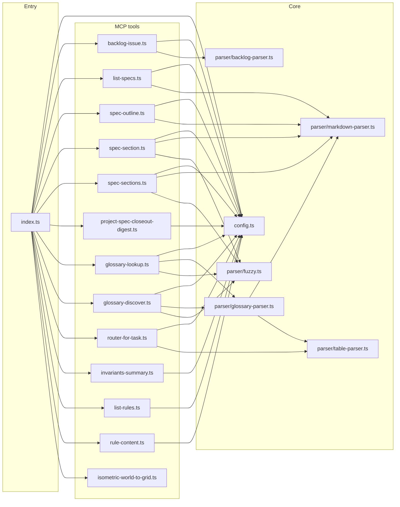

# Territory IA MCP server

Local [Model Context Protocol](https://modelcontextprotocol.io/) server for **Territory Developer** information architecture. It reads the **same** on-disk sources agents already use: `.cursor/specs/*.md`, `.cursor/rules/*.mdc`, `glossary.md`, and root docs registered in `buildRegistry()` (e.g. `AGENTS.md`, `ARCHITECTURE.md`).

Canonical integration notes: [`docs/mcp-ia-server.md`](../../docs/mcp-ia-server.md) and [`.cursor/rules/agent-router.mdc`](../../.cursor/rules/agent-router.mdc) (subsection **MCP — territory-ia**).

Abstract pattern (reusable outside this game): [`docs/mcp-markdown-ia-pattern.md`](../../docs/mcp-markdown-ia-pattern.md).

## Prerequisites

- **Node.js 18+**
- Repository root as the process working directory (Cursor’s default when the workspace is this repo)

## Commands

| Command | Purpose |
|--------|---------|
| `npm install` | Install dependencies (run once under `tools/mcp-ia-server/`). |
| `npm run dev` | Run the server via `tsx` (stdio MCP). |
| `npm run build` | Emit JavaScript to `dist/` with `tsc`. |
| `npm start` | Run compiled `dist/index.js` (stdio MCP). |
| `npm test` | Unit tests (`node:test` + `tsx`) for parser and tool helpers. |
| `npm run test:watch` | Tests in watch mode. |
| `npm run test:coverage` | Parser + **ia-index** line coverage with **c8** (gate ≥90%). |
| `npm run verify` | From this directory: spawns the server the same way as Cursor (via repo root + `npx -y tsx …`) and exercises all **13** tools through the MCP SDK client. |
| `npm run validate:fixtures` | **AJV** (JSON Schema Draft 2020-12): valid fixtures under `docs/schemas/fixtures/` must pass; invalid fixtures must fail. |
| `npm run generate:ia-indexes` | Writes `data/spec-index.json` and `data/glossary-index.json`. Pass `--check` to assert they match the generator (used in **CI**). |

From the **repository root**, `package.json` exposes `npm run validate:fixtures` and `npm run generate:ia-indexes` via `npm --prefix tools/mcp-ia-server`, and `npm run validate:dead-project-specs` (**TECH-50** completed — [`tools/validate-dead-project-spec-paths.mjs`](../validate-dead-project-spec-paths.mjs); see [`docs/mcp-ia-server.md`](../../docs/mcp-ia-server.md)). For an **ordered** post-change checklist (**CI** parity), see [`.cursor/skills/project-implementation-validation/SKILL.md`](../../.cursor/skills/project-implementation-validation/SKILL.md) (**TECH-52** completed).

## Cursor integration

The repo includes `.cursor/mcp.json`, which starts the server with:

- `npx -y tsx tools/mcp-ia-server/src/index.ts`
- `REPO_ROOT=.` so paths resolve against the workspace root

If your MCP host uses a different working directory, set `REPO_ROOT` to the **absolute** repository path, or adjust the command in `mcp.json`.

## Environment

| Variable | Meaning |
|----------|---------|
| `REPO_ROOT` | Root used to resolve `.cursor/specs`, `.cursor/rules`, and root markdown. Defaults to `process.cwd()`. |

## Tools (13)

| Tool | Description |
|------|-------------|
| **`backlog_issue`** | One matching issue from `BACKLOG.md` (**open** or **§ Completed (last 30 days)**): `issue_id` (e.g. `BUG-37`). Returns `status`, `backlog_section`, `Files` / `Spec` / `Notes` / `Acceptance` / `depends_on`, `depends_on_status` (cited ids: `open` / `completed` / `not_in_backlog`, `soft_only`, `satisfied`), `raw_markdown`. **Archive-only** ids: `BACKLOG-ARCHIVE.md`. Not in `list_specs`. |
| **`list_specs`** | Registry entries: `key`, `relativePath`, `description`, `category`, `lineCount`. Optional filter `category` (e.g. `rule`). |
| **`spec_outline`** | Nested heading outline with line ranges. `spec` accepts key, filename, or alias (`geo` → `isometric-geography-system`, `roads` → `roads-system`, `unity` / `unityctx` → `unity-development-context`, `refspec` / `specstructure` → `reference-spec-structure`, …). |
| **`spec_section`** | Body for one section: canonical `spec` + `section` (id `13.4`, slug, title substring, or fuzzy typo). Aliases: `key` / `doc` → spec; `section_heading` / `heading` → section; numeric `section` coerced to string. `max_chars` or `maxChars` (default 3000) with `truncated` / `totalChars`. |
| **`spec_sections`** | Batch: `sections` array; each element uses the same shape as **`spec_section`**. Response `results` map keyed by `spec::section`. Optional `max_requests` (default 20, max 50). |
| **`project_spec_closeout_digest`** | Exactly one of `issue_id` or `spec_path` (`.cursor/projects/{ISSUE_ID}.md`). Returns structured closeout prep JSON (`schema_version` 1, section bodies, `cited_issue_ids`, keywords, heuristic `checklist_hints`). Read-only. |
| **`glossary_discover`** | Keyword discovery over glossary rows (**English** `query` / `keywords` only — translate from the user’s language before calling). Scores **Term**, **Definition**, **Spec**, and category; returns ranked `term`, `specReference`, optional `spec` alias + `registryKey`, `matchReasons`, `score`. Params: `query` and/or `keywords` (alias `terms`); `q` / `search` for query; `max_results` / `maxResults` (default 10, cap 25). |
| **`glossary_lookup`** | Glossary row: exact (case-insensitive) then fuzzy; **`term` must be English** (glossary language). Bracket text like `[x,y]` normalized for matching. |
| **`router_for_task`** | Match task hints to specs using `agent-router.mdc` tables. Provide **`domain`** and/or **`files`** (max 40 paths); at least one required. Merges optional **`file_domain_hints`** from path heuristics with table rows. |
| **`invariants_summary`** | Invariants + guardrails from `invariants.mdc`. |
| **`list_rules`** | All `.mdc` rules with frontmatter (`alwaysApply`, `globs`, description). |
| **`rule_content`** | Rule markdown body without frontmatter. `rule: "roads"` resolves **`roads.mdc`** (use `spec_section` / `spec_outline` with alias `roads` for the **roads-system** spec). |
| **`isometric_world_to_grid`** | **Computational** ( **`tools/compute-lib`** ): planar `world_x` / `world_y` + `tile_width` / `tile_height` → `cell_x` / `cell_y` (**isometric-geography-system** §1.3; glossary **World ↔ Grid conversion**). Optional `origin_x` / `origin_y`. Returns `{ ok, cell_x, cell_y }` or `{ ok: false, error }`. |

**Examples (conceptual):**

- `backlog_issue` → `{ "issue_id": "BUG-37" }`
- `list_specs` → `{}`
- `spec_outline` → `{ "spec": "geo" }`
- `spec_section` → `{ "spec": "geo", "section": "13.4", "max_chars": 8000 }` (or `{ "key": "geo", "section_heading": 14 }`)
- `spec_sections` → `{ "sections": [ { "spec": "geo", "section": "1" }, { "spec": "roads", "section": "validation" } ] }`
- `project_spec_closeout_digest` → `{ "issue_id": "TECH-59" }` or `{ "spec_path": ".cursor/projects/TECH-59.md" }`
- `glossary_discover` → `{ "query": "manual street trace neighbors", "max_results": 8 }`
- `glossary_lookup` → `{ "term": "wet run" }`
- `router_for_task` → `{ "domain": "roads" }` or `{ "files": ["Assets/Scripts/Managers/GameManagers/GridManager.cs"] }`
- `rule_content` → `{ "rule": "roads", "max_chars": 50000 }`
- `isometric_world_to_grid` → `{ "world_x": 0, "world_y": 0, "tile_width": 1, "tile_height": 0.5 }`

## Closeout CLI (from repository root)

Shipped with **TECH-58**; scripts live under `scripts/` (they default `REPO_ROOT` to the repository root).

| Root `npm run` | Purpose |
|----------------|---------|
| `closeout:worksheet -- --issue TECH-59` | Print Markdown worksheet; add `--json` for digest JSON only. |
| `closeout:dependents -- --issue TECH-59` | List `file:line` hits for the id or `.cursor/projects/TECH-59.md` (see script header for scan roots / limitations). |
| `closeout:verify` | Runs `validate:dead-project-specs` then `generate:ia-indexes --check`. Local convenience; **CI** **ia-tools** remains the gate for merges. |

## Architecture

- **`config.ts`** — Resolves repo root, scans specs, rules, and root docs; builds registry; spec key aliases; separate rule key resolution for `rule_content`.
- **`markdown-parser.ts`** — Frontmatter (`gray-matter`), heading tree, section extraction, optional **parse cache** keyed by absolute path.
- **`instrumentation.ts`** — Per-tool timing on **stderr** (safe for stdio MCP).
- **Tools** — Handlers return JSON in MCP **text** content blocks.

## Adding a tool

1. Add `src/tools/<name>.ts` exporting `registerYourTool(server, registry)`.
2. Use `registerTool` on the `McpServer` instance with a Zod `inputSchema` shape (see existing tools).
3. Import and call the register function from `src/index.ts`.
4. Document the tool here and in `docs/mcp-ia-server.md`; extend `scripts/verify-mcp.ts` if needed.

## Troubleshooting

| Symptom | Check |
|--------|--------|
| Tools return empty or wrong paths | `REPO_ROOT` must point at the **repository root** (folder containing `.cursor/specs`). |
| Cursor does not list the server | `.cursor/mcp.json` and Node/npm available; restart Cursor after config changes. |
| `verify` fails | Run from `tools/mcp-ia-server/` with repo dependencies installed (`npm install`); ensure working copy includes expected spec/rule files. |
| Slow repeated calls | Parsed documents are cached in memory until process exit; restart server after large doc edits. |

## Debugging

- Run `npm run dev` from `tools/mcp-ia-server/` with `REPO_ROOT` pointing at the repo; the process speaks MCP over stdio, so attach a client or use Cursor’s MCP log output.
- Tool timing lines appear on **stderr** (e.g. `[territory-ia] spec_section 0.4ms`).

## Dependency note

The implementation uses **`@modelcontextprotocol/sdk`** (stable 1.x). The split package `@modelcontextprotocol/server` is a separate distribution; pin and imports should follow the SDK you install.

**`territory-compute-lib`** (`file:../compute-lib`) supplies **`isometric_world_to_grid`** and other **TECH-37**+ **pure** math. **`npm run verify`** runs **`npm run build`** in **`../compute-lib`** first so **`dist/`** exists (that folder is gitignored; **CI** builds it in **`ia-tools`** before **`mcp-ia-server`** **`npm ci`**).
