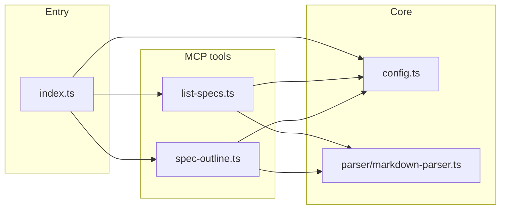

# Territory IA MCP server

Local [Model Context Protocol](https://modelcontextprotocol.io/) server for **Territory Developer** information architecture: Cursor rules (`.mdc`), deep specs (`.cursor/specs/*.md`), `AGENTS.md`, and `ARCHITECTURE.md`.

## Prerequisites

- **Node.js 18+**
- Repository root as the process working directory (Cursor’s default when the workspace is this repo)

## Commands

| Command | Purpose |
|--------|---------|
| `npm install` | Install dependencies (run once under `tools/mcp-ia-server/`). |
| `npm run dev` | Run the server via `tsx` (stdio MCP). |
| `npm run build` | Emit JavaScript to `dist/` with `tsc`. |
| `npm start` | Run compiled `dist/index.js` (stdio MCP). |
| `npm run verify` | Spawn the server like Cursor (`npx -y tsx …` from repo root) and exercise `list_specs` / `spec_outline` via the MCP SDK client. |

## Cursor integration

The repo includes `.cursor/mcp.json`, which starts the server with:

- `npx -y tsx tools/mcp-ia-server/src/index.ts`
- `REPO_ROOT=.` so paths resolve against the workspace root

If your MCP host uses a different working directory, set `REPO_ROOT` to the **absolute** repository path, or adjust the command in `mcp.json`.

## Environment

| Variable | Meaning |
|----------|---------|
| `REPO_ROOT` | Root used to resolve `.cursor/specs`, `.cursor/rules`, and root markdown. Defaults to `process.cwd()`. |

## Tools (phase 1)

- **`list_specs`** — Registry of IA files with `relativePath`, `description`, `category`, and `lineCount`.
- **`spec_outline`** — Heading tree with absolute `lineStart` / `lineEnd` (full file, including YAML frontmatter on `.mdc`).

Further tools (e.g. section extraction) are defined in follow-up project specs.

## Architecture

- **`config.ts`** — Resolves repo root, scans `.cursor/specs/*.md`, `.cursor/rules/*.mdc`, `AGENTS.md`, and `ARCHITECTURE.md`, and derives short `key` / `description` metadata.
- **`markdown-parser.ts`** — `gray-matter` for frontmatter, Markdown heading scan on the body slice of the physical file, section IDs, line ranges, and a nested heading tree.
- **Tools** — Register handlers on `McpServer` and return JSON inside MCP text content blocks.

## Adding a tool

1. Add `src/tools/<name>.ts` exporting `registerYourTool(server, registry)`.
2. Use `registerTool` on the `McpServer` instance with a Zod `inputSchema` shape (see existing tools).
3. Import and call the register function from `src/index.ts`.
4. Document the tool in this README.

## Debugging

- Run `npm run dev` from `tools/mcp-ia-server/` with `REPO_ROOT` pointing at the repo; the process speaks MCP over stdio, so attach a client or use Cursor’s MCP log output.
- For quick registry checks without MCP: `REPO_ROOT=/path/to/repo node dist/config.js` is not wired — use a small `node --input-type=module` script importing `buildRegistry` from `dist/config.js` instead.

## Dependency note

The implementation uses **`@modelcontextprotocol/sdk`** (stable 1.x). The split package `@modelcontextprotocol/server` is a separate distribution; pin and imports should follow the SDK you install.
